# Hazzard's Geriatric Medicine and Gerontology, 8e — Chapter 44: Sleep Disorders

Armand Ryden, Cathy Alessi

> **Fast build from the book, 22 Sep; not lane-reviewed.**

**[p. 643]**

#### Learning Objectives

- Recognize sleep disorders that are most common or particularly important in the care of older adults.
- Understand that there may be a link between poor sleep and the development of Alzheimer dementia.
- Identify key differences in the presentation and recognition of common sleep disorders in older compared to younger adults.
- Describe evidence-based treatment for sleep disorders in older adults, including insomnia, obstructive sleep apnea (OSA), and other common conditions.
- Summarize important issues in the management of sleep disturbance in special populations of older adults, such as those with dementia and those living in institutional settings.

#### Key Clinical Points

1. Poor sleep is common in older adults and is more closely associated with comorbidities than with chronological age.
2. Many important health outcomes are associated with poor sleep in older adults, including cognitive decline, increased medication use, and higher health care utilization.
3. Insomnia is common in older adults, and many of the pharmacologic therapies are
4. In older adults, OSA is less likely to present with classic signs and symptoms and has been linked with important health outcomes including hypertension, cardiovascular disease, diabetes, and cognitive impairment. Continuous positive airway
5. Rapid eye movement (REM) behavior disorder (RBD), which is characterized by dream
6. Sleep-wake cycle disruption is common

## Introduction

Problems with sleep are frequently encountered in older adults. More than two-thirds of older people with multiple comorbidities report sleep problems. These problems commonly include difficulty falling asleep, difficulty staying asleep, or sleepiness during the day. This chapter will e explore the epidemiology, pathophysiology, clinical presentation, diagnosis, and management of sleep disorders commonly encountered in older adults.

## Sleep And Aging

Sleep is a reversible behavioral state that is characterized by a decreased responsiveness to the environment and can be detected by observing stereotypical changes in the electroencephalogram (EEG). Each sleep period involves a progression of sleep stages that tend to cycle every 90 minutes. There are two major sleep states: rapid eye movement (REM) and nonrapid eye movement (NREM) sleep. REM - sleep is characterized by having brain activity that is more similar to wake, rapid eye movements, and a complete loss of skeletal muscle tone. When people awaken from REM sleep they usually report vivid dreaming; hence REM sleep is often thought of as dreaming sleep. NREM sleep - is divided into three stages: N1, N2, and N3. N3 sleep is - also known as slow wave sleep. As sleep progresses from ----N1 through N3, people become more difficult to arouse; hence N1 sleep is considered light sleep, while N3 sleep is - considered deep sleep. As people age there is a reduction in sleep efficiency, which is the amount of time actually asleep divided by time spent in bed ( **Figure 44-1** ). There are also significant changes to sleep architecture with aging. Longer time to initiate sleep and more fragmented sleep occur with aging. Furthermore, the amount of N3 sleep decreases with age starting in early adulthood. The reduction in N3 sleep with age is more prominent in men. Whether there - are changes in REM sleep with aging is less clear. There is conflicting evidence regarding age as a risk factor for excessive daytime sleepiness. Objective measures of sleep have shown that healthy older adults have a lower propensity to fall asleep when given nap opportunities, suggesting a lower sleep drive. However, naps and unplanned naps are more common in older adults. These naps are associated -

**[p. 644]**

1 **in nursing home patients and may be improved by behavioral interventions such as exposure to bright light, maintenance of a regular day-night cycle and melatonin.**

with comorbidities such as depression, pain, and nocturia. The changes in sleepiness with aging may reflect the accrual of comorbidities rather than being a product of the natural aging process.

Many experts believe that the age-related changes in sleep are due to a decreased ability to sleep rather than a decreased need to sleep. There is growing evidence that short and disturbed sleep are associated with poor cognitive and health outcomes. When older poor sleepers and good sleepers are compared, poor sleepers have worse health-related quality of life, increased medication use, and greater health care utilization. Having longer time awake after sleep onset has been associated with greater cognitive decline among older adults. One of the most active areas of research over the past several years has been in the potential relationship between sleep and dementia, particularly Alzheimer disease (AD). Sleep appears to be important in the clearance of beta-amyloid (Ab) protein, the build-up of which is implicated in the pathogenesis of AD. Basic animal models have shown that Ab is cleared through the glymphatic system during sleep. Excessive daytime sleepiness and napping have been associated with Ab in the cerebral spinal fluid as well as being associated with the development of Ab positivity on longitudinal assessments. There is also evidence that experimentally induced acute sleep deprivation can induce Ab accumulation in healthy adults. It is hypothesized that sleep disruption with aging may lead to a decline in cognitive functioning because of the accumulation and deposition of these pathologic proteins. However, since these abnormal proteins may impact brain systems involved in sleep-wake homeostasis, excessive sleepiness and poor sleep may be an early symptom of a neurodegenerative condition. It would be reasonable to posit that there may be a bidirectional relationship between sleep symptoms and neurodegenerative diseases.

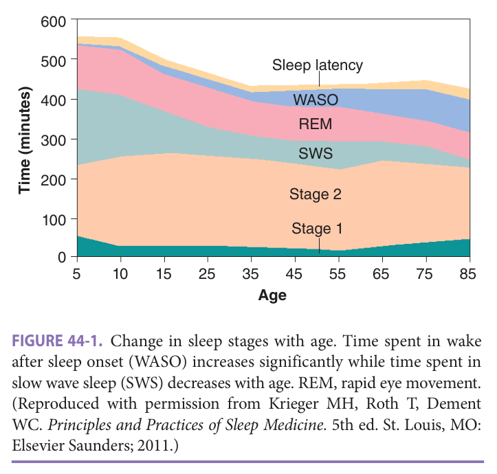

> *FIGURE 44-1. Change in sleep stages with age. Time spent in wake after sleep onset (WASO) increases significantly while time spent in slow wave sleep (SWS) decreases with age. REM, rapid eye movement. (Reproduced with permission from Krieger MH, Roth T, Dement WC. _Principles and Practices of Sleep Medicine_ . 5th ed. St. Louis, MO: Elsevier Saunders; 2011.)*

> Highlighting is the owner's annotation, not the book's.

Many of the illnesses associated with aging can disrupt sleep, which may inhibit the normal progression through sleep stages. Thus, chronological age itself may not be the greatest predictor of sleep quality. Numerous epidemiologic studies have found a U- or J-shaped relationship between sleep time and subsequent mortality with both long and short sleep durations being associated ---with an increased risk of death. The cause of this relationship is still unknown given all of the potential confounders, despite controlling for known comorbidities. Changes in sleep architecture in aging may contribute to metabolic changes that occur in older adults. For instance, N3 sleep is associated with growth hormone secretion and the reduction in N3 sleep with aging may be partly responsible for the decrease in growth hormone in older men. Decreased sleep has also been linked to the metabolic conditions that impact healthy aging such as obesity and diabetes mellitus. Given the link between insufficient and fragmented sleep, quality of life, and health outcomes, there is a need for awareness, evaluation, and treatment of sleep disorders that commonly affect older adults.

## Sleep-Disordered Breathing

### Definition

Sleep-disordered breathing (SDB) is characterized by disturbed respiration during sleep arising from repetitive events of complete (ie, apnea) or partial (ie, hypopnea) cessation of airflow lasting at least 10 seconds. This is classified as obstructive sleep apnea (OSA) when the events are due to an obstructed airway, which is determined by the persistence of respiratory effort. On the other hand, if there ---- - is concomitant cessation of breathing effort, the disorder is classified as central sleep apnea (CSA) because there is - a momentary defect in the central control of breathing

**[p. 645]**

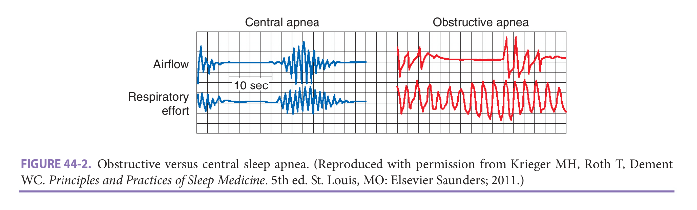

> *FIGURE 44-2. Obstructive versus central sleep apnea. (Reproduced with permission from Krieger MH, Roth T, Dement WC. _Principles and Practices of Sleep Medicine_ . 5th ed. St. Louis, MO: Elsevier Saunders; 2011.)*

> Highlighting is the owner's annotation, not the book's.

> than 15, or when it is greater than 5 with significant symp• toms or related comorbidities. An AHI greater than 30 is generally considered to indicate severe SDB.

( **Figure 44-2** ). OSA is by far the most common sleep-related breathing disorder; however, there is often overlap between the two clinical syndromes. CSA can be associated with several different clinical conditions. Heart failure is the most commonly recognized cause of CSA and is often characterized by Cheyne-Stokes respiration, which is periodic cycling between hypoventilation and hyperventilation ( **Figure 44-3** ). Other common causes of CSA include stroke, opioid use, and hypoventilation syndromes. The severity of - - SDB is generally determined by the apnea hypopnea index (AHI), which is the number of apneas and hypopneas per hour of sleep. SDB can be diagnosed when the AHI is greater - (

The consequences of respiratory events during sleep include arousals from sleep, intrathoracic pressure swings, and cyclical drops in the blood oxygen level. This ultimately leads to sleep fragmentation and nocturnal hypoxemia, which may lead to significant health consequences.

### Epidemiology

Many of the risk factors for OSA increase with age ( **Table 44-1** ). Estimates of the prevalence of OSA have

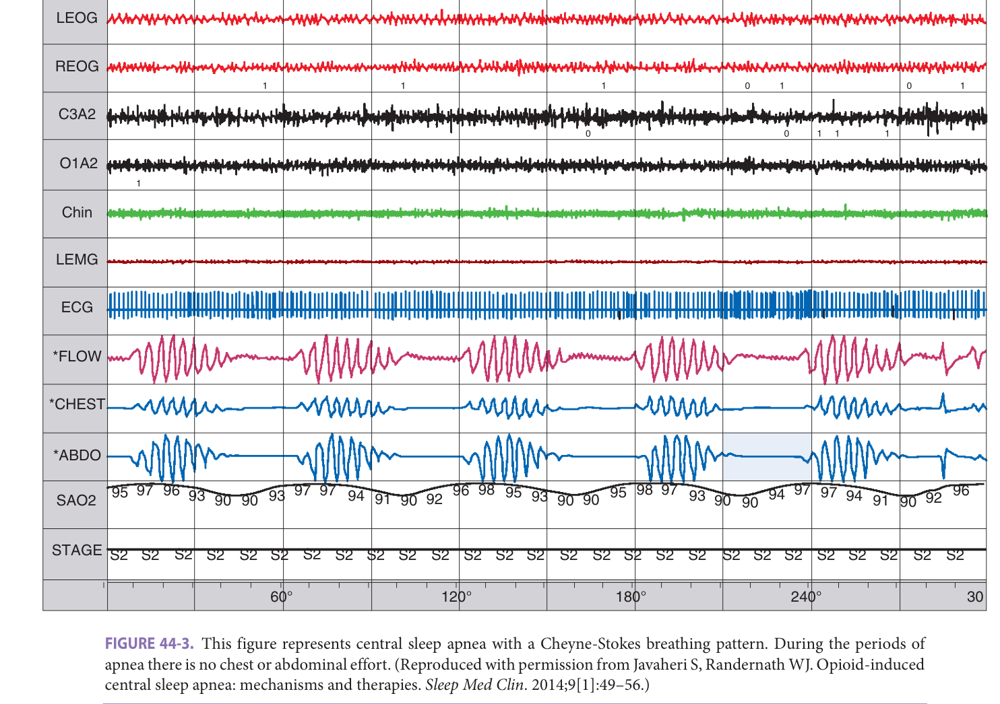

> *FIGURE 44-3. This figure represents central sleep apnea with a Cheyne-Stokes breathing pattern. During the periods of apnea there is no chest or abdominal effort. (Reproduced with permission from Javaheri S, Randernath WJ. Opioid-induced central sleep apnea: mechanisms and therapies. _Sleep Med Clin_ . 2014;9[1]:49–56.)*

> Highlighting is the owner's annotation, not the book's.

**[p. 646]**
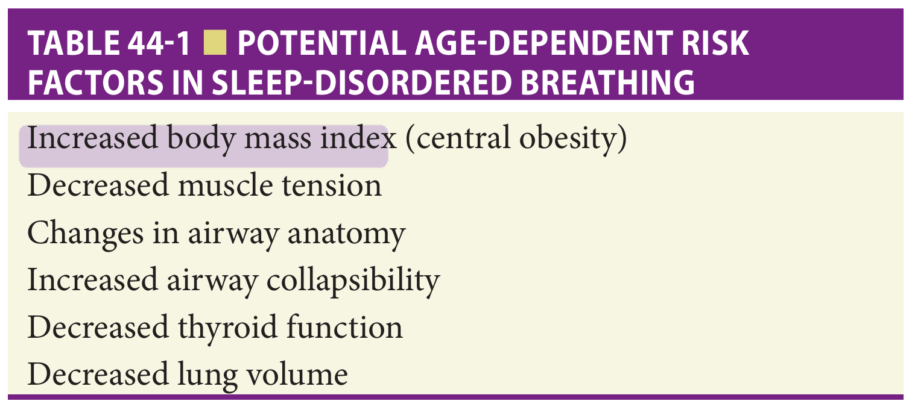

> *Table 44-1 reproduced as a page image (printed p. 646) — the grid did not extract reliably as text for this fast build.*

> Highlighting is the owner's annotation, not the book's.

varied widely and are dependent on the populations studied. A cohort between 2007 and 2010 of middle-aged adults has estimated moderate to severe SDB to occur in 6% of women and 13% men. Evidence suggests that OSA is underdiagnosed in the general population, particularly in women. If the rate of obesity and overweight continues to increase, the rates of SDB will also increase. Less is known about the epidemiology of SDB in an older population; however, most studies have shown that the risk of OSA increases with increasing age until the age of 70 at which time there is a plateau (Figure 44-4). Furthermore, premenopausal status appears to protect against OSA meaning that the gender discrepancy between men and

 women narrows in the older population. OSA may be more severe in African-American and Asian populations compared to the Caucasian population.

> The risk of CSA increases substantially with aging. - CSA is two to three times more prevalent in those aged 65 to 90 than in those aged 39 to 64. Most likely this is due to the accrual of conditions that predispose to CSA such as congestive heart failure, atrial fibrillation, chronic kidney disease, and chronic pain conditions requiring opiates. It is estimated that upwards of 50% of patients with stable heart failure have some form of SDB. Many of these patients have a combination of CSA and OSA.

### Pathophysiology

There are three types of SDB events: central, obstructive, and mixed. Central events result from a failure of the respiratory control center to send a signal to breathe. This often occurs because of an abnormal sensitivity of the respiratory controller, which can lead to oscillations between hyperventilation and hypoventilation. Obstructive events occur from anatomic obstruction of the upper airway despite respiratory effort. The major factor that governs the presence of obstructive events is an anatomically narrow airway; however, other mechanisms such as failure of adequate upper airway neuromuscular activation are thought to play a role. Features that govern the size of the upper airway include excess adiposity, craniofacial structure, excessive tonsillar and peritonsillar soft tissue, and lower lung volumes. Mixed events comprise central and obstructive components.

The most significant immediate consequence of OSA is excessive daytime sleepiness and the risk of motor vehicle accidents. Significant epidemiologic associations of OSA

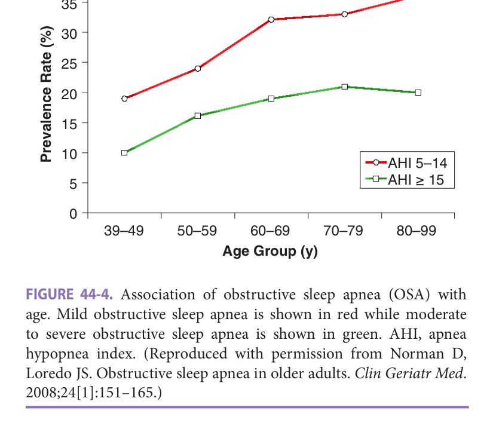

> *FIGURE 44-4. Association of obstructive sleep apnea (OSA) with age. Mild obstructive sleep apnea is shown in red while moderate to severe obstructive sleep apnea is shown in green. AHI, apnea hypopnea index. (Reproduced with permission from Norman D, Loredo JS. Obstructive sleep apnea in older adults. _Clin Geriatr Med_ . 2008;24[1]:151–165.)*

> Highlighting is the owner's annotation, not the book's.

with adverse cardiovascular and metabolic consequences have been reported. The association between SDB and these comorbidities is likely multifactorial. SDB results in sleep fragmentation, which has been shown to increase sympathetic nervous system activation, increase nocturnal cortisol levels, and interfere with insulin sensitivity. The potential downstream effects of these neurohumoral changes include the development of hypertension and diabetes. Increased intrathoracic pressure can occur and increase atrial natriuretic peptide levels potentially contributing to nocturia. Furthermore, the cyclic deoxygenation and reoxygenation that occurs with OSA leads to endothelial cell injury and inflammatory changes, which predispose to coronary and cerebral vascular disease ( **Figure 44-5** ). The intrathoracic pressure changes associated with increasing respiratory effort against a closed airway can lead to esophageal reflux as well as potentially deleterious hemodynamic effects in heart failure.

### Clinical Presentation

The major symptoms of SDB include excessive daytime sleepiness and nocturnal snoring. The patient may present to the clinic complaining of sleepiness or at the request of a loved one with the complaint of snoring. The paradigmatic patient with SDB is an obese male with nocturnal snoring, witnessed apneas, frequent nocturnal awakenings, and excessive daytime sleepiness. However, these associations are less predictive in an older population. Other important symptoms of SDB include nocturia, insomnia, morning headaches, nocturnal confusion, and daytime impairments in mood and cognition. Sleepiness can be assessed with a standardized measure such as the Epworth Sleepiness Scale. It is often helpful to obtain corroborating information from a bed partner regarding snoring, witnessed apneas as well

**[p. 647]**
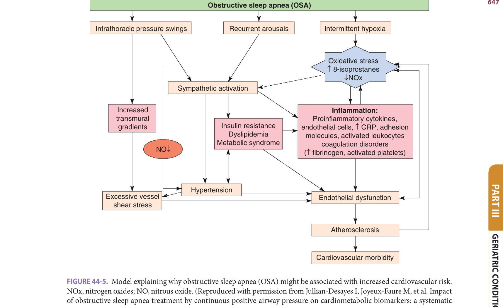

> *FIGURE 44-5. Model explaining why obstructive sleep apnea (OSA) might be associated with increased cardiovascular risk. NOx, nitrogen oxides; NO, nitrous oxide. (Reproduced with permission from Jullian-Desayes I, Joyeux-Faure M, et al. Impact of obstructive sleep apnea treatment by continuous positive airway pressure on cardiometabolic biomarkers: a systematic review from sham CPAP randomized controlled trials. _Sleep Med Rev._ 2015;21:23–38.)*

> Highlighting is the owner's annotation, not the book's.

as additional features that may point to a comorbid sleep disorder. Snoring is indicative of a partially collapsed airway and is a useful predictor of the presence of OSA or future development of the condition. The lack of classic symptoms and findings of OSA should not preclude further evaluation for SDB, particularly in older patients.

Physical features that predict increased risk of OSA include an elevated body mass index (BMI), a large neck circumference, and a crowded upper airway. In older adults, an elevated BMI has less predictive value of the likelihood of OSA. In clinic the airway can be assessed using a modified Mallampati score known as the Friedman classification, with positions III and IV conferring a high risk for - OSA ( **Figure 44-6** ). In general, the less posterior oropharynx that can be visualized indicates a greater risk of SDB. Neck circumference greater than 17 inches in men and 16 inches in women is another predictor for SDB on physical examination. However, the predictive value of neck circumference is not as strong in older patients.

The presence of disturbed sleep in a patient with congestive heart failure may be indicative of SDB. As mentioned previously, a high percentage of patients with heart failure have OSA, CSA with Cheyne-Stokes respiration, or a combination of the two conditions. It can be difficult to

tease apart symptoms of heart failure such as orthopnea and paroxysmal nocturnal dyspnea (PND) from those of SDB. - Opioid medication use is a risk factor for another form of CSA, which should be considered whenever patients on opioids present with sleep complaints.

### Evaluation

Patients suspected of having SDB should be referred for sleep testing. An attended in-laboratory polysomnography (PSG) is considered the gold standard test for SDB. This involves traveling to a sleep laboratory to spend the night. The test involves the use of EEG, electromyogram (EMG), and electrooculogram (EOG) leads to determine presence and stage of sleep. There is measurement of airflow with a nasal pressure transducer as well as an oronasal thermistor. Respiratory effort is measured using chest and abdominal belts; and occasionally with an esophageal pressure monitor or accessory muscle EMG. An alternative approach to the diagnosis of SDB is the home sleep apnea _a_ s test (HSAT). The patient takes the sleep testing equipment home and puts it on before bed. These tests are not generally able to measure sleep directly. Most of these tests measure airflow, effort, and pulse oximetry. Alternative testing - includes the inference of respiratory events from peripheral

**[p. 648]**
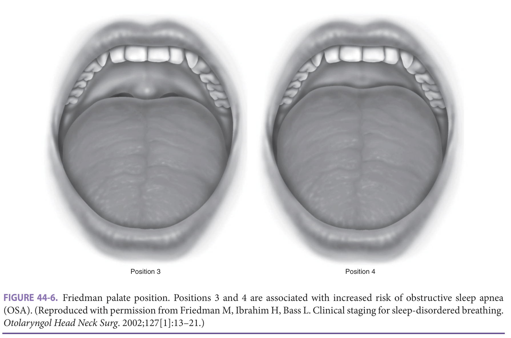

> *FIGURE 44-6. Friedman palate position. Positions 3 and 4 are associated with increased risk of obstructive sleep apnea (OSA). (Reproduced with permission from Friedman M, Ibrahim H, Bass L. Clinical staging for sleep-disordered breathing. _Otolaryngol Head Neck Surg_ . 2002;127[1]:13–21.)*

> Highlighting is the owner's annotation, not the book's.

arterial tone changes due to changes in sympathetic activity resulting from the respiratory events that can be correlated with pulse oximetry. Such devices may be easier for some patients to self-administer, particularly those with cognitive or dexterity issues. However, these devices are not validated for the measurement of central apneas and should not be used in those taking alpha-adrenergic blocking medications or in those with atrial fibrillation. HSAT is only recommended for patients with a high pretest probability of having OSA who do not have significant cardiopulmonary comorbidities. •

> The advantages of an attended full-channel PSG C - include a higher reliability of the data, the ability to carefully define AHI by measuring sleep directly, and the simultaneous assessment for alternative sleep diagnoses to SDB.

> The advantages of HSAT include lower cost, the conve0 nience for patients to sleep at home, and increased access to sleep testing. In populations at high risk for OSA, studies have shown that out-of-center sleep testing leads to similar patient outcomes compared to in-laboratory PSG. The limited studies in older patients have shown that HSATs can be used to accurately diagnose OSA. Due to cost issues

**[p. 649]**

third-party payers are increasingly pressuring practitioners to move toward HSAT. However, HSAT may be difficult for some older patients due to the need for the patient or caregiver to independently place the sensors. Another consideration is that older patients are more likely to have the comorbidities that preclude HSAT as modality due to the possibility of CSA. It must also be emphasized that a negative HSAT does not rule out OSA. An HSAT may be negative simply because the patient did not sleep during the test or due to technically inadequate data.

### Management

The first-line treatment for SDB is positive airway pressure therapy. The most basic of these therapies is continuous positive airway pressure (CPAP), which has been available since the early 1980s. CPAP delivers a constant positive pressure in order to splint the airway open preventing collapse. To apply this pressure an airtight interface goes in the nose, over the nose, or over the nose and mouth, and then connects to a CPAP machine via a hose. Traditionally, the amount of air pressure (usually between 5 and 20 cm H2O) is manually determined in the sleep laboratory with the sleep technologist adjusting the pressure to eliminate respiratory events and snoring. There is evidence that patients who have mild to moderate dementia are able to tolerate CPAP therapy and such a condition is not a contraindicaa tion to CPAP initiation.

Auto-titrating CPAP (APAP) is now available, in which the machine adjusts the pressure based on events and flow characteristics using internal algorithms that are proprietary to the device manufacturers. APAP can be used to determine a fixed CPAP pressure or can be used as the primary modality of therapy. APAP has been found to have a very small but statistically significant advantage in adherence over CPAP in randomized studies. Individual patients, however, particularly those with very different CPAP needs depending on body position or sleep stage, may find APAP to be more comfortable than fixed CPAP. The main advantage of APAP is the ability to determine, or provide, a therapeutic pressure without requiring a resource-intensive in-laboratory PSG.

- CPAP is usually effective in eliminating obstructive

- apneas and hypopneas and has been found to substantially improve excessive daytime sleepiness and nocturnal sleep quality. CPAP has only recently been studied in older adult

- -. . populations. Overall, these studies have found that CPAP improves sleepiness, quality of life, mood, and is cost effective in adults older than 65 years. There has been some

- suggestion that short-term memory and executive function can be improved with CPAP in those with severe OSA. Observational studies have found that CPAP is well tolerated and beneficial in older patients above the age of 80 and in those with mild to moderate dementia. The major downside to CPAP is that in general long-term adherence can be difficult to achieve. Estimates are that at the end of a year only 50% to 70% of all adult patients are adherent to CPAP

therapy. Factors that may improve CPAP adherence include early follow-up, education and setting of expectations, - humidification, attention to interface comfort, expiratory pressure relief, possible early use of hypnotics, and desensitization to therapy. Each of these interventions has small but important impacts in individual patient acceptance to therapy. Studies on whether aging is a factor in nonadherence have been mixed. Any changes in CPAP adherence with age are most likely due to factors other than age itself.

Positive airway pressure therapy has to be individualized in patients who have CSA. Many patients who have - Cheyne-Stokes respiration will respond to a combination of CPAP and/or supplemental oxygen. Likewise, the majority of patients with obesity-hypoventilation syndrome respond to CPAP alone. However, many patients require more advanced ventilatory modalities to eliminate CSA. Regardless of the particular mode, these advanced devices involve applying bilevel pressure with a back-up respiratory rate. The amount of pressure support given during a certain breath can be controlled by sophisticated proprietary algorithms in order to achieve specific desired clinical effects.

Adaptive servo-ventilation (ASV) is used for CSA syndromes that are not due to hypoventilation. Safety concerns of ASV in heart failure patients were raised with the SERVE-HF trial which found increased mortality in those who were randomized to ASV for CSA among in an ejection fraction (EF) less than 45%. Therefore, ASV is generally not recommended in those with an EF less than 45%. In older patients with preserved EF and central or combined central and OSA there is some evidence that ASV can improve sleep-related symptoms and daytime functional status.

Dental devices that move the jaw forward (mandibular advancement or mandibular repositioning devices) are a treatment alternative to positive airway pressure in OSA. The principle behind such therapy is that when the lower jaw moves forward the tongue is also pulled forward, thus opening up the airway. These devices are generally thought to be more effective in mild to moderate OSA rather than severe OSA. However, the severity of OSA may not necessarily predict response to mandibular advancement therapy in all patients. In general, mandibular advancement therapy does not reduce the residual AHI to as great of an extent as positive airway pressure therapy. However, comparative effectiveness studies suggest equivalence for major outcomes is likely due to the fact that adherence rates tend to be higher for mandibular advancement therapy. Side - effects include temporomandibular joint pain and occlusion abnormalities. One of the major limiting factors to ----mandibular advancement therapy, particularly in older adults, is that teeth are generally required to anchor the device in place. Tongue repositioning/retaining devices can be used in patients who lack their native teeth. However, these devices have been less extensively studied and are less likely to be effective.

Other therapies have been utilized in OSA. One of these therapies is expiratory positive airway pressure

**[p. 650]**

> (EPAP) provided through nasal valves, which makes it more difficult to breathe out than breathe in. This causes pressure build up that helps stent the airway open, as well as causing an increase in lung volume that may prevent obstructive respiratory events. This therapy is less well validated but may be used as a salvage therapy or in mild cases.

One therapeutic modality that has recently been developed is hypoglossal nerve stimulation. This therapy involves an implanted lead that goes to the respiratory muscles to sense the onset of inspiration and a lead that goes to the hypoglossal nerve that causes tongue contraction to open the airway with inspiration through direct action as well as muscular coupling with the soft palate. Randomized trials found promising results in a highly selected group of patients with a BMI less than 32 kg/m2 who could not tolerate CPAP therapy. Initial trials had limited numbers of older patients. A recent cohort study of 62 patients aged 65 to 80 found significant reductions in AHI and sleepiness scores in this population with hypoglossal nerve stimulator therapy.

Surgery is also an alternative therapy for SDB. There are multiple surgical techniques that are available to otolaryngologists for the treatment of SDB. The most common technique is the uvulo-palato-pharyngoplasty (UPPP). This procedure has variable success rates depending on anatomic factors and the degree of obesity. Furthermore, even after successful therapy SDB may reoccur due to growth of scar tissue.

A more aggressive surgical approach is a maxillary mandibular advancement. In this approach both the maxilla and mandible are cut and advanced forward. This surgery requires the patient’s jaw to be wired shut for sev.. eral weeks. Although this is the most effective surgery for SDB, many patients opt to not undergo such an extensive procedure. - ----Other behavioral changes that the patients with SDB can implement to help treat the syndrome include weight loss, sleeping on the side, and the avoidance of alcohol ,, and other sedatives. In particular, positional techniques to encourage sleeping on the side may be beneficial when SDB occurs primarily in the supine position.

It is becoming increasingly recognized that while positive airway pressure therapy eliminates SDB more effectively than other interventions, it is essentially ineffective in a subset of patients who cannot tolerate its use. The use of multiple modalities of therapy, with each having a modest effect on AHI, may be able to achieve adequate control of SDB in those who cannot tolerate CPAP.

### Pharmacologic Therapy

There are limited pharmacologic agents available for SDB and none that are approved for this indication. However, occasionally patients who are successfully treated for SDB with CPAP will have residual excessive daytime sleepiness. Modafinil and armodafinil, central nervous system

stimulants, have Food and Drug Administration (FDA) approval for the treatment of residual excessive daytime -- sleepiness in treated OSA. Acetazolamide has an unclear role in some CSA syndromes. Ventilatory stimulants such as progesterone have been tried unsuccessfully in obesity hypoventilation syndrome.

### Prevention

There is no specific disease prevention strategy for SDB. Addressing factors that contribute the subsequent development of SDB contributes to prevention. Since elevated BMI is the most potent risk factor for the development of OSA, weight loss and lack of weight gain are the most important preventative measures for OSA. Preventing decompensation of heart failure may be a way to prevent the development of heart failure–related CSA.

### Patient Preference

Patient preference is clearly a key factor in determining the therapy of choice. CPAP and mandibular advancement devices can both be difficult to tolerate due to the need for equipment use and potential discomfort. The health benefit of treating minimally symptomatic SDB in older patients is unclear. Therefore, it is reasonable to withhold SDB treatment if the patient declines treatment and they have minimal symptoms. In patients who are sleepy and drive, it is more imperative to encourage SDB therapy. Also, in sleepy older patients with SDB, the treatment may have a greater beneficial impact on the prevention of SDB-related comorbidities and improvement in quality of life.

### Comorbidity

SDB is associated with significant mental and physical comorbidities. Given the association between obesity and SDB, many of the comorbidities of obesity and SDB over•a lap. However, there are several lines of evidence suggesting an independent relationship between SDB and the development of hypertension, atrial arrhythmias, heart failure, C coronary artery disease, cerebrovascular accidents, and diabetes mellitus. Most of these relationships have been elucidated from observational population studies and basic science investigations. Direct evidence that treatment of SDB can reverse some of these comorbidities is more limited. However, treatment of OSA does result in modest improvement in blood pressure among hypertensive patients. In addition, treatment of OSA after cardioversion for atrial arrhythmias such as atrial fibrillation has been found to increase the likelihood of staying in sinus rhythm. Large randomized controlled trials have failed to show that CPAP therapy leads to a reduction in cardiovascular events. The major limitation to these studies has poor adherence to CPAP. Due to ethical concerns those with excessive daytime sleepiness were excluded. Thus, it is unclear whether an individual who is adherent to CPAP therapy might gain cardiovascular benefit from therapy.

**[p. 651]**
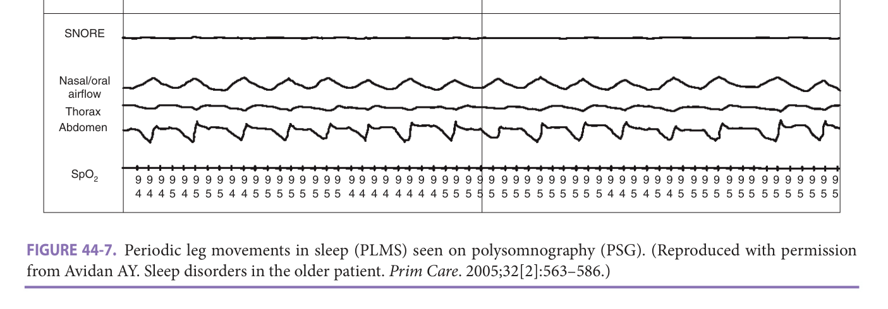

> *FIGURE 44-7. Periodic leg movements in sleep (PLMS) seen on polysomnography (PSG). (Reproduced with permission from Avidan AY. Sleep disorders in the older patient. _Prim Care_ . 2005;32[2]:563–586.)*

> Highlighting is the owner's annotation, not the book's.

Periodic leg movements in sleep (PLMS) are characterized by cyclic movements of the lower limbs during sleep. These consist of stereotyped movements that typically involve the flexion of the big toe with partial flexion of the ankle, knee, and sometimes hip. PLMS last between 0.5 seconds and 10 seconds with a period between movements of 5 to 90 seconds ( **Figure 44-7)** -- . At least four movements in a row must occur to count as PLMS. Periodic limb movement disorder (PLMD) can be diagnosed if there are at least 15 PLMS per hour, the PLMS cause sleep disturbance and the symptoms are not better explained by another sleep disorder or a medical illness. Since PLMS are often seen in RLS (80%–90%), REM behavior disorder (70%), and - narcolepsy (45%–65%), PLMD can only be diagnosed in the absence of these sleep disorders. A PSG is required to 5 • - define PLMS and thus diagnose PLMD.

Insomnia is an important comorbidity of SDB. In fact, SDB itself may contribute to insomnia by disrupting sleep architecture and even preventing stable sleep onset due to OSA respiratory events. Sometimes insomnia .- - improves with the treatment of SDB. However, insomnia may be exacerbated by the invasiveness of positive airway pressure or mandibular advancement. For a successful treatment outcome both disorders must be addressed. SDB and other mental illnesses such as anxiety, depression, and posttraumatic stress are frequently present in the same patient. Once again, the SDB may exacerbate some of the symptoms of these mental illnesses, and these illnesses may present barriers to acceptance of therapy.

## Restless Legs Syndrome And Periodic Limb Movement Disorder

### Epidemiology

### Definition

The prevalence of RLS increases with age and is estimated to affect up to 8% of older adults, making it a very commonly encountered disorder in the outpatient setting. RLS is 1.5 to 2 times more common in women than in men. Iron deficiency and family history increase the odds of developing RLS. The prevalence of RLS is two to five times greater in patients with chronic renal failure. Taking antihistamines and most antidepressants are risk factors for •

Restless legs syndrome (RLS), also known as Willis-Ekbom disease, is characterized by the urge to move one’s legs. Most often patients with RLS have uncomfortable sensations in their legs, and sometimes arms, which lead to this urge. The other defining features of RLS are that the symptoms are improved - with movement, worsen with relaxation, and occur later in the - day. RLS can also affect and may even be limited to the arms. There is no objective test to diagnose RLS.

**[p. 652]**

> the development of RLS. The development of comorbidities may partially explain why RLS is more common in older adults. RLS severity correlates with a reduced health-related quality of life when comorbid with other conditions. Large population studies have found associations between RLS and cardiovascular disease.

The exact prevalence of PLMD is not known. PLMS increases in frequency with age. PLMS are seen on PSG in up to 45% of older people. The presence of PLMS often does not impact individuals in a clinically meaningful way. The existence of comorbidities with aging makes a clearcut diagnosis of PLMD difficult. Having a family history of RLS may make PLMD more likely.

### Pathophysiology

RLS and PLMS are often thought of as sharing a similar pathophysiology, with RLS being a sensory manifestation - and PLMS a motor manifestation. The exact mechanisms of RLS and PLMS are not exactly known. There appears to - - be a defect in the homeostatic regulation of iron that then leads to a dysfunction in the dopamine system.

### Clinical Presentation

RLS may present with complaints of specific RLS symptoms or simply with a primary complaint of insomnia. The most classic presentation is of a creepy crawly sensation that is predominately in the lower calf and gets better with walk-ing. It is worse at night and with rest. Sometimes RLS symptoms involve the upper extremities as well. By definition the symptoms occur while awake. Patients who are not able to describe symptoms due to significant dementia or aphasia may be seen rubbing or massaging the legs or may present with increased motor activity at night. Pacing, cycling movements, and foot tapping can also be signs that there may be RLS symptoms. Since 80% to 90% of patients with RLS have PLMS the observation of kicking during sleep makes the diagnosis of RLS more likely. It is often difficult to distinguish RLS symptoms from peripheral neuropathy. The nighttime onset of symptoms and relief of symptoms with movement help distinguish the two conditions. For patients with both conditions present, determining the contribution of RLS over neuropathy remains challenging.

PLMD may present with a patient or bed partner complaint of kicking at night. The patient may simply present with complaints of disturbed sleep, insomnia, and/or excessive daytime sleepiness. Since PLMS are so common in older adults, significant clinical sleep disturbance and/ or daytime sleepiness are required to make the diagnosis. The symptom of waking up kicking has to be distinguished from hypnic jerks or sleep starts—total body jerking often with a sensation of falling that occurs at sleep onset. Hypnic jerks are very common and generally not pathologic.

### Evaluation

The diagnosis of RLS can be based on clinical criteria • alone. A PSG is sometimes helpful to rule out other sleep

> disorders, particularly SDB which may be a comorbid cause - of sleep disturbance. Presence of PLMS on PSG is suggestive of RLS but neither rules in nor rules out RLS.

A sleep study with limb electrode measurement is required for the diagnosis of PLMD because this is the only way for PLMS to be accurately measured. Furthermore, since PLMD is a diagnosis of exclusion other sleep disorders must be ruled out at the same time. A diagnosis of PLMD requires at least 15 movements per hour of sleep. Some clinicians also count the PLMS that occur with arousal in making the diagnosis.

Patients with RLS or PLMD should have a serum ferritin measured to rule out any degree of iron deficiency contributing to these conditions.

### Management

**Pharmacologic management** The treatment options for RLS and PLMD are similar. However, whether to initiate treatment for PLMD is more controversial. For either condition the decision to treat needs to be individualized, based on the severity of symptoms and the impact on -1111111111111---quality of life.

Patients should receive iron supplementation if the serum ferritin is less than 75 mcg/L. This entails a much more aggressive iron replacement strategy than is typically used in patients without RLS. Newer evidence even suggests using IV iron in those with moderate to severe RLS and a ferritin less than 300 mcg/L, although IV iron is usually reserved for those with iron malabsorption.

There are two accepted classes of medications that can be used for first-line treatment of RLS. The long-established treatment of choice has been dopamine agonists. Recently more of a role has been established for α2δ calcium channel ligands, which include gabapentin, gabapentin enacarbil, and pregabalin. Recent guidelines on RLS therapy have suggested limiting the dosage of dopamine agonists and considering the use of α2δ calcium channel ligands as firstline agents ( **Table 44-2)** .

The primary long-acting dopamine agonists that are used for persistent RLS include ropinirole, pramipexole, and rotigotine transdermal. These agents should be taken approximately 2 hours before bedtime. Carbidopalevodopa can be used in patients for as-needed dosing when symptoms are infrequent. The major drawback to the use of dopaminergic agents is a phenomenon called augmentation. Augmentation is a worsening of RLS manifested by: the onset of RLS symptoms earlier in the day, and/or increased intensity of RLS symptoms, and/or spread of symptoms to the upper extremities and trunk when these areas were previously unaffected. Augmentation is much more frequent with carbidopa-levodopa, which is why this agent is reserved for use when symptoms are infrequent. Estimates of augmentation on the long-acting dopamine agonists have ranged between 2% and 15% per year. The risk of augmentation is higher with higher doses and longer duration of therapy. Thus, it is recommended that maximal

**[p. 653]**
**Table 44-2 — Pharmacologic treatment of plms/rls**

|**CLASS**|**GENERIC**|**BRAND**|**DOSE**| |---|---|---|---| |Dopaminergic agents|Ropinirole Pramipexole Carbidopa/levodopaa|Requip Mirapex Sinemet|0.25–4 mg 0.125–2 mg 25/100–25/200 mg| |α2δ calcium channel ligands|Gabapentin encarbil Gabapentina Pregabalina|Horizant Neurontin Lyrica|600–1200 mg 100–1800 mg 300 mg| |Benzodiazepines|Clonazepama Temazepama|Klonopin Restoril|0.25–2 mg 15–30 mg| |Opiate agents|Codeinea Tramadola Oxycodonea Hydrocodonea Methadonea|Tylenol #3/#4 Ultram Roxycodone Vicodin —|30–60 mg (codeine) 50–100 mg 5–15 mg 5–15 mg 5–10 mg|

aOff-label.

er in the day, switching to a different dopamine agonist, or preferably switching to a different class of medication. Other important side effects - of dopamine agonists include daytime sleepiness, headaches, and nausea. Behavioral disinhibition is a potentially dangerous side effect that can threaten a patient’s livelihood. There is no evidence that tolerability of these agents changes with ageing.

The other agents that have good evidence for RLS therapy are the α2δ calcium channel ligands. Only gabapentin enacarbil is FDA approved for RLS treatment. These agents may be particularly useful when the patient also has peripheral neuropathy. A recent randomized controlled trial showed that pregabalin was as efficacious as pramipexole, with a lower rate of augmentation. Major adverse effects from these medications can include drowsiness, dizziness, and suicidal ideation. There may be significant variability in the pharmacokinetics in these drugs with aging, particularly if there is a reduction in renal function. Careful monitoring is required.

Other medications that can be used for the treatment of RLS include benzodiazepines and opiates. Benzodiazepines have a long history of use for intermittent RLS; however, the evidence base for this practice is limited. Low-dose opiates including methadone can be used for treatment of refractory RLS. Clearly, benzodiazepines and opiates may have adverse cognitive effects in older patients and should be used with caution. The American Geriatric Society recommends avoiding opiates when combined with other central nervous system depressants.

**Nonpharmacologic therapy** Behavioral strategies that can be used for RLS include moderate exercise, pneumatic compression, massage, and yoga. There are novel devices available for the treatment of RLS; however, the data available

are extremely limited. Avoidance of possible triggers for RLS should also be recommended. These include sleep deprivation, caffeine, and alcohol use. Also, most antidepressants are known to elicit or provoke RLS symptoms. However, bupropion is less frequently associated with RLS, and therefore, a switch from a selective serotonin reuptake inhibitor (SSRI) or serotonin-norepinephrine reuptake inhibitor (SNRI) to bupropion when RLS symptoms are present could be considered.

### Prevention

There is no specific prevention for RLS. Adherence to a healthy lifestyle may be beneficial. This includes moderate exercise, a regular sleep schedule, and limiting caffeine and alcohol intake.

### Patient Preference

The focus of RLS management is symptom relief. The medications used for the treatment of RLS may have important side effects. Therefore, therapy is determined by the balance between symptom control and side effects, in addition to patient input and preferences.

### Comorbidities

> Frequently encountered comorbidities of RLS include Parkinson disease, chronic kidney disease, iron deficiency anemia, and peripheral neuropathy. It is essential to address both the underlying disease process and the RLS symptoms at the same time. There is some evidence that both RLS and PLMS are associated with cardiovascular disease.

## REM Sleep Behavior Disorder

### Definition

> REM sleep behavior disorder (RBD) is defined as recurrent complex movements or vocalizations during sleep

**[p. 654]**

RBD is also strongly linked with narcolepsy, which may be a different form of REM sleep motor-behavior dysregulation. The RBD may be worsened by the use of SSRIs to treat cataplexy. Other neurologic disorders have been associated with RBD including cerebrovascular disease, multiple sclerosis, Guillain-Barre syndrome, normal pressure hydrocephalus, Tourette syndrome, and autism. -

> characterized by dream enactment. Normally during REM sleep there is complete loss of skeletal muscle tone (atonia). However, in RBD there is REM sleep without atonia, which is required for the diagnosis of RBD, in addition to dream enactment behavior.

### Epidemiology

RBD is a male-predominant syndrome, which usually occurs after the age of 50. The prevalence of RBD has been estimated to be around 1% in those older than age 40 and around 2% in those older than age 60. Clinical series have shown that patients present for evaluation in their mid-60s. Thus, RBD can be considered to be a disease of aging. This - is likely due to the fact that RBD is more common in certain neurologic disorders such as Parkinson disease, multiple system atrophy, and Lewy body dementia.

### Clinical Presentation

RBD will often present with sleep-related injury that results from the enactment of dreams that are often violent. It is rare for patients with RBD to calmly walk and carry out other complex tasks. Patients are usually not able to leave the room they are in because they are not attentive to their environment. Because RBD occurs during REM sleep, it usually appears at least 90 minutes after sleep onset and is more likely to occur later in the sleep period. Often RBD is the first manifestation of Parkinson disease or dementia with Lewy bodies, but may also present later in patients with these disorders.

### Pathophysiology

There is an association between neurodegenerative disorders and RBD, particularly synucleinopathies, which result from a pathologic lesion of aggregates of insoluble α-synuclein protein. These aggregates are linked to degradation of specific brain regions and clinical symptoms. The most important clinical diagnoses of synucleinopathies are Parkinson disease, dementia with Lewy bodies, and multiple system atrophy. The α-synuclein protein aggregates can be found in the brain areas responsible for producing active atonia during REM sleep. Up to 90% of patients who pres --ent with RBD develop another synucleinopathy disorder over the course of a 10- to 15-year follow-up ( **Figure 44-8** ).

### Evaluation

The evaluation of RBD includes a neurologic and sleep history. The history should focus on common associated conditions such as Parkinson disease and associated dementia. Other early signs of an α-synucleinopathy include loss of smell and constipation. The presence of vivid dream enactment makes RBD more likely than an NREM sleep para--somnia. A predilection for events to occur later in the sleep period also makes RBD more likely. A detailed neurologic

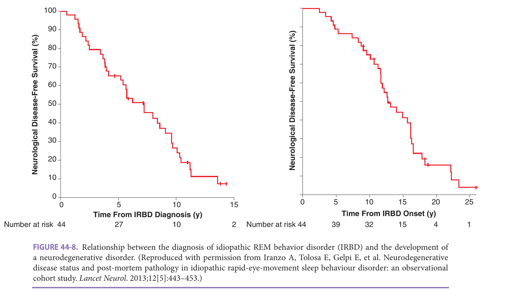

> *FIGURE 44-8. Relationship between the diagnosis of idiopathic REM behavior disorder (IRBD) and the development of a neurodegenerative disorder. (Reproduced with permission from Iranzo A, Tolosa E, Gelpi E, et al. Neurodegenerative disease status and post-mortem pathology in idiopathic rapid-eye-movement sleep behaviour disorder: an observational cohort study. _Lancet Neurol_ . 2013;12[5]:443–453.)*

> Highlighting is the owner's annotation, not the book's.

**[p. 655]**

examination can elucidate a comorbid neurodegenerative disorder. It may be difficult to distinguish RBD symptoms from those of other parasomnias, nocturnal seizures, and the nightmares of posttraumatic stress disorder (PTSD). SDB can cause RBD-like symptoms, which typically resolve with effective SDB therapy.

An attended in-laboratory PSG is the gold standard for diagnosing RBD. Acting out of dreams in REM sleep during the sleep study is typically sufficient for diagnosing RBD. However, often patients will not have RBD behavior events during PSG. In this case, finding substantial REM sleep with increased muscle tone with a history of dream enactment behaviors can support an RBD diagnosis. The diagnosis can be complicated in patients who have PTSD, as there is emerging evidence that PTSD may predispose to ---RBD and that PTSD may be associated with atonia in REM sleep independent of RBD.

### Management

**Pharmacologic management** There are no currently FDA-approved therapies for RBD. The goal of treatment is - to avoid injury and prevent sleep disruption. The two major pharmacologic treatments are melatonin and clonazepam. Avoiding benzodiazepines is generally preferable in older patients making melatonin the primary first choice for ther... apy in most circumstances. There is evidence from small trials that melatonin reduces the amount of REM sleep with excessive muscle tone as well as the clinical manifestations of RBD. The mechanism by which melatonin improves RBD is unknown. Often fairly high doses of melatonin can be used, however there is uncertainty as to how high the dosing should go. The major drawback to melatonin is that it is not an FDA-regulated pharmaceutical. Therefore, quality and strength may not be as tightly regulated. Clonazepam at low doses has been successfully used to treat RBD symptoms. A single-center retrospective study of RBD patients found that both melatonin and clonazepam improved RBD symptoms; however, only melatonin was associated with reduced injuries and falls. Moreover, melatonin had a better I side effect profile than clonazepam.

**Nonpharmacologic therapy** The most important intervention in patients with RBD is ensuring the safety of both the patient and any bed partners. The patient should consider sleeping separately from their bed partner for that person’s safety. Sharp furniture and other sharp objects should be removed from the patient’s bedroom. Likewise, any weapons should not be freely accessible. If falling out of bed has been an issue, moving the mattress to the floor can be considered. Alarms have been developed to wake patients as they leave the bed. Some patients have gone so far as to sleep in sleeping bags to prevent injuring themselves.

Well-recognized precipitating factors for RBD symptoms include the use of SSRIs, venlafaxine, mirtazapine, - and other antidepressants except for bupropion. Hence, tapering off these medications or switching to bupropion should be considered. Any sort of comorbid SDB disorder

should be aggressively treated, which may help with RBD symptoms.

### Prevention

There are no known preventative measures for RBD.

### Patient Preference

Since the treatment of RBD is symptom based, patient preferences often dictate the intensity and type of therapy. Many patients may opt for melatonin therapy given that its side effect profile appears to be favorable to clonazepam. The desire for the patient to know the ramifications of an RBD diagnosis as a predictor of development of a future neurodegenerative disorder needs to be carefully elucidated.

### Comorbidities

As discussed previously presence of RBD strongly predicts the subsequent development of an α-synucleinopathy such as Parkinson disease, multiple system atrophy, and dementia with Lewy bodies. Often RBD is the first manifestation of one of these disorders. Therefore, RBD will eventually coexist with one of these neurodegenerative disorders in most patients. RBD can also present in patients with narcolepsy. There are some cases in which RBD and NREM parasomnias coexist as well.

## Other Parasomnias

Other parasomnias occur in NREM sleep, which include sleep walking, confusional arousals, and sleep terrors. These disorders are much more common in children and young - adults, and generally do not first present in old age. The distinguishing features of these conditions are that they predominantly occur in the first part of the night and the patients are difficult to arouse and do not have recollection of the event or associated dream imagery. One aspect of these NREM parasomnias relevant to older adults is that nonben-zodiazepine hypnotics (eg, zolpidem, zalepelon, eszpicolone) • can be associated with very complex sleep behaviors such as sleep cooking, sleep eating, and sleep driving. This is a rare but possibly dangerous side effect of these medications.

## Circadian Rhythm Disorders

### Definition

Circadian rhythms refer to the 24-hour biological rhythms that control functions such as hormone secretion, core body temperature, and the sleep-wake cycle. The endogenous circadian rhythms originate in the suprachiasmatic nucleus (SCN), which is the internal circadian pacemaker. The SCN synchronizes itself using other internal rhythms from hormone secretion patterns and external signals, the most potent of which is light. The sleep-wake cycle is driven by melatonin secretion and body temperature, which are both governed by the SCN. However, external light can disrupt this cycle.

**[p. 656]**

Circadian rhythm disorders are a chronic or recurrent pattern of sleep-wake rhythm disruption due to a misalignment between the patient's endogenous circadian rhythm and their desired or red sleep-wake cycle. For this to be considered a disorder it must cause bothersome insomnia symptoms and/or excessive sleepiness. For instance, a retired person who is not bothered by going to bed at 8 PM and waking up at 4 AM does not have a disorder.

_Delayed sleep-wake phase disorder_ is a delay in the phase of the endogenous major sleep episode with respect to the desired major sleep episode such that the patient complains of an inability to fall asleep and difficulty waking up at the desired time.

_Advanced sleep-wake phase disorder_ is an advance in the phase of the endogenous major sleep episode with respect to the desired major sleep episode such that the patient complains of difficulty staying awake until the desired bedtime, with an inability to remain asleep until the desired awakening time.

_Irregular sleep-wake rhythm disorder_ is characterized by a lack of a clearly defined circadian rhythm resulting in insomnia at night and excessive sleep during the day ( **Figure 44-9** ). This disorder is often associated with neurodegenerative diseases and is likely common in the nursing home setting.

_Non–24-hour sleep-wake rhythm disorder_ usually occurs from a patient's inability to entrain their circadian rhythm to light due to complete blindness. The natural circadian rhythm is typically longer than 24 hours. Thus, each subsequent day, the patient will go to bed and wake up a little later. This leads to episodes of insomnia and hypersomnia ( **Figure 44-10** ).

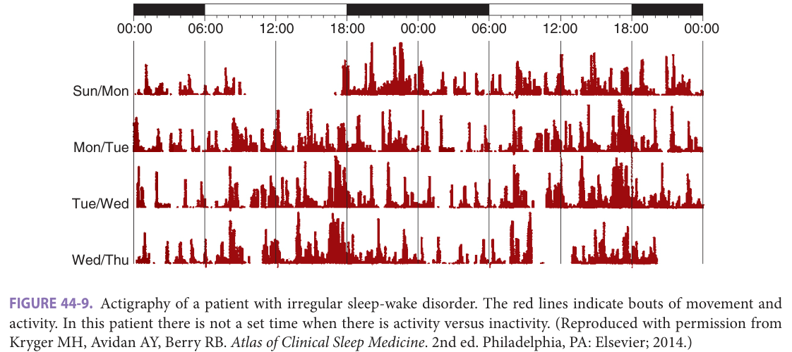

> *FIGURE 44-9. Actigraphy of a patient with irregular sleep-wake disorder. The red lines indicate bouts of movement and activity. In this patient there is not a set time when there is activity versus inactivity. (Reproduced with permission from Kryger MH, Avidan AY, Berry RB. Atlas of Clinical Sleep Medicine. 2nd ed. Philadelphia, PA: Elsevier; 2014.)*

> Highlighting is the owner's annotation, not the book's.

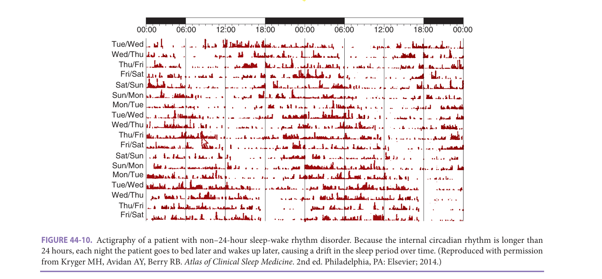

> *FIGURE 44-10. Actigraphy of a patient with non–24-hour sleep-wake rhythm disorder. Because the internal circadian rhythm is longer than 24 hours, each night the patient goes to bed later and wakes up later, causing a drift in the sleep period over time. (Reproduced with permission from Kryger MH, Avidan AY, Berry RB. Atlas of Clinical Sleep Medicine. 2nd ed. Philadelphia, PA: Elsevier; 2014.)*

> Highlighting is the owner's annotation, not the book's.

**[p. 657]**
### Epidemiology

Delayed sleep-wake phase disorder is more common among adolescents and young adults; however familial patterns and psychiatric disorders are risk factors for development of delayed sleep-wake phase disorder in later life.

The prevalence of advanced sleep-wake disorder is not fully known and is thought to comprise 1% of a middle-aged population. Advanced age appears to be a risk factor, given that aging is associated with the development of morning tendencies. However, older patients may be more tolerant of these changes in endogenous circadian rhythm.

Irregular sleep-wake rhythm disorder is commonly seen in older adults with neurodegenerative disorders such as AD, Parkinson disease, and Huntington disease.

### Pathophysiology

Possible causes of advanced sleep-wake phase disorder include a loss of the ability for the circadian clock to phase - delay, a tendency to abnormally phase advance to entraining stimuli or a shorter endogenous circadian pacemaker. The latter of these has been shown to underlie the pathophysiology in select familial patients with circadian clock gene mutations.

There are several factors that may cause irregular circadian rhythms with aging. These may include (1) degeneration of the SCN with age, (2) a blunting of melatonin - secretion at night, (3) decreased sensitivity to entraining cues, and (4) less availability to cues such as bright light. ~ Furthermore, neurodegenerative disorders may result in physical disruption of circadian rhythm pathways. Irregular sleep patterns prevent the normal sequence of progression through sleep stages.

### Clinical Presentation

Patients with delayed sleep phase disorder present with sleepiness in the morning and an inability to sleep in the evening. Patients with advanced sleep phase disorder present with sleepiness in the evening, and an inability to sleep in the early morning. These patients will essentially present with insomnia complaints. However, an ability to sleep when the patient aligns their sleep-wake cycle with their endogenous circadian rhythm will be indicative of a circadian rhythm disorder rather than insomnia. Patients with advanced sleep phase syndrome may develop a selfimposed sleep deprivation from trying to adhere to a “normal schedule” but will wake up too early. A strong familial pattern may also suggest a circadian disorder.

Patients with irregular sleep-wake rhythm disorder will present with poorly consolidated sleep. Caregivers of patients with dementia who have this condition may notice nighttime wandering and agitation. In fact, sundowning may be a phenotype of a circadian rhythm disturbance. Patients will generally sleep for less than 4 hours at a time, and will have many short periods of sleep and wake throughout the day and night.

### Evaluation

The key component in evaluating patients with suspected circadian rhythm disturbances is a comprehensive sleep history. Sleep logs for 1 to 2 weeks are helpful in establishing the diagnosis of a circadian disorder. Wrist actigraphy (a device with an accelerometer) can also be useful, particularly in patients who cannot fill out sleep logs, or for those in whom the accuracy of the sleep logs is doubtful. Newer actigraphy monitors that have a light sensor can also give the clinician a sense of the patient’s light exposure. PSG is only indicated when other sleep disorders are suspected.

### Management

The primary management for circadian rhythm disorders involves the use of appropriately timed bright light therapy. Appropriately timed melatonin can be used as an alternative to, or in conjunction with, bright light therapy. However, there is less evidence for this approach. There are commercially available light boxes, or where feasible, natural sunlight can be used. In general, exposure to bright light in the morning will advance the circadian rhythm, while exposure in the evening will cause a delay in rhythm. Patients with advanced sleep-wake phase disorder should wear sunglasses in the morning and spend late afternoons outdoors without sunglasses.

For irregular sleep-wake rhythm disorder a strong routine with natural light and increased activity during the day and darkness with decreased noise at night may be helpful. Tasimelteon is a melatonin agonist for the MT1 --and MT2 receptors with greater affinity for the MT2 receptor. This agent is only approved in adults for non–24-hour sleep-wake rhythm disorder.

---

## Insomnia

### Definition

Insomnia is defined as the inability to fall asleep, the inability to stay asleep, or waking up earlier than desired. In order to have a clinical diagnosis of insomnia the patient must have an adequate sleep opportunity and adequate sleep environment. The sleep disturbance must also have an impact on their quality of life by causing any of the following: fatigue, impaired cognitive performance, -~-mood disturbance, daytime sleepiness, behavioral problllliiiii lems, reduced motivation, proneness for errors, or worry ~ about sleep. Insomnia is categorized as chronic if it persists more than 3 months and short term if it has lasted fewer than 3 months. The most recent International Classification of Sleep Disorders no longer emphasizes previously distinguished insomnia subtypes or insomnia comorbid with mental or medical disorders. Even when insomnia is related to another condition, treatment of the comorbid condition often does not cure the insomnia. Furthermore, individual patients often have an overlap across insomnia subtypes.

**[p. 658]**
### Epidemiology

Insomnia is a highly prevalent sleep disorder, affecting up to 10% of young adults and increases to about 30% to 48% in those older than 65 years. The prevalence of insomnia is higher in older adults, which is likely due to age-related reductions in sleep efficiency and the accrual of comorbidities that are associated with insomnia. However, among older adults the diagnosis of insomnia does not necessarily increase with increasing age. Insomnia is more prevalent in women than men even in older adults.

Comorbid psychiatric conditions increase the likelihood of developing chronic insomnia. Depression is perhaps the most common and strongly associated mental illness with insomnia. Anxiety is also a risk factor for ...,__ developing insomnia; as is being a caregiver for an ill family member, with up to 40% of caregivers reporting taking sleep aids for insomnia.

A wide variety of medical problems are associated with insomnia. Many studies have linked sleep disturbances with worsened health-related quality of life, nursing --·home placement, and even death. Epidemiologic evidence shows a greater prevalence of insomnia in hypertension, heart disease, arthritis, lung disease, gastrointestinal reflux, stroke, and neurodegenerative disorders, to only name a few. Symptoms of medical illnesses that can disrupt sleep include pain, paresthesias, cough, dyspnea, reflux, and nocturia. Many medications can impair sleep or change sleep architecture. If stimulating medications (eg, caffeine, sym- -- --- .... pathomimetics, bronchodilators, activating psychiatric medications) are taken too near to bedtime, sleep can be disturbed ( **Table 44-3** ). Furthermore, sedating medications can lead to daytime sleeping, which often decreases the ability to sleep at night.

Late-life insomnia is often a long-lasting problem. One study showed that a third of older patients had persistent severe insomnia symptoms at 4-year follow-up. Among women older than 85 years, more than 80% reported sleeping difficulties, with many using over-the-counter (OTC) sleeping medications. Lastly being a caregiver for others, which often occurs later in life, is a contributing factor to the development of insomnia.

**Table 44-3 — Effect of common drugs taken by older adults**

|**SEDATING**|**ALERTING**| |---|---| |Hypnotics|Alcohol/nicotine| |Antihypertensives|CNS stimulants| |Antihistamines|Thyroid hormones| |Antpsychotics|Bronchodilators| |Antidepressants|Corticosteroids| ||β-Blockers| ||Calcium channel blockers|

### Pathophysiology

The causes of insomnia are often multifaceted. One popular theoretical model for insomnia posits that there are pre• disposing factors, precipitating factors, and perpetuating factors. Predisposing factors are a vulnerability to insomnia and may include anxiety, depression, or hyperarousal. Precipitating factors are triggers for insomnia such as loss of a spouse, retirement, moving to a new home, or any other --- .... - sort of stressor. Perpetuating factors are maladaptive habits or beliefs that the patient has acquired to deal with the insomnia such as spending long periods in bed or taking naps.

As noted earlier, insomnia in older adults is often comorbid with medical or psychiatric illnesses. The symptoms such as pain, dyspnea, or nocturia may be so significant that these become the primary driving factors behind the sleep disturbance.

### Clinical Presentation

Patients with insomnia may present to their primary care provider with specific complaints about either not being able to fall asleep or stay asleep. However, many patients do not talk to their doctors about their sleep complaints. Instead, the presence of insomnia may be revealed by eliciting self-medication with over-the-counter therapies or alternative sedatives.

A careful sleep history and evaluation should be conducted in patients with insomnia in order to assess whether there are comorbid sleep disorders, such as SDB, underlying the sleep disturbance. The presence of undiagnosed OSA is common in those with insomnia.

### Evaluation

PSG and other sleep studies are not necessary in the evaluation of insomnia; however, they should be obtained if a comorbid sleep condition is suspected. Sleep diaries with daily entries over 1 to 2 weeks, with caffeine, alcohol, and medication use noted can be very helpful in determining the severity of the insomnia as well as identifying possible perpetuating factors such as irregular bedtimes or latenight caffeine ( **Table 44-4** ). This may help the patient gain more insight into their sleep problem. Wrist actigraphy in conjunction with a sleep diary can be used to obtain a more objective measure of the patient’s overall sleep-wake pattern. This device is particularly helpful when accuracy of the sleep diary is questionable or when sleep-wake misperception is suspected. The accuracy of direct to consumer devices, such as fitbits, has not been rigorously tested, but they may be useful adjuncts in practice.

### Management

Behavioral and nonpharmacologic interventions appear to have better long-term efficacy with fewer side effects than pharmacologic interventions. Therefore, behavioral interventions are preferred for the treatment of insomnia, particularly in older patients. However, access to highly skilled

**[p. 659]**
**Table 44-4 — Sample sleep diary**

- ***|***: __________
- ***|***: _**|**TO**|**_________
- ***|***: ______
- ***||
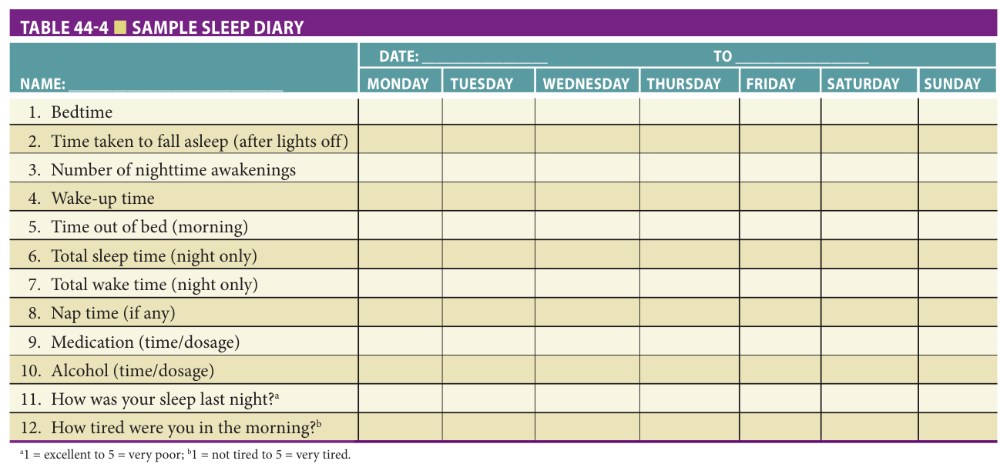

> *Table 44-4 reproduced as a page image (printed p. 659) — the grid did not extract reliably as text for this fast build.*

> Highlighting is the owner's annotation, not the book's.

a1 = excellent to 5 = very poor; b1 = not tired to 5 = very tired.

professionals trained in such interventions may be limited in some health care systems. Cognitive behavior

al therapy for insomnia (CBT-I) has been recommended as the first-line treatment for all insomnia in adults by multiple prac•a tice guidelines.

**Pharmacologic management** Most pharmacotherapy for insomnia is designed and approved for the treatment of transient sleep disturbances. Pharmacotherapy can be considered when insomnia is triggered by an acute event or when chronic insomnia persists despite behavioral insomnia treatment. Sedative-hypnotics have been associated with adverse side effects in older adults, such as falls, cognitive slowing, fractures, and even mortality. Therefore, if a sedative-hypnotic is used in older individuals, the smallest dose of an agent with the least risk of adverse events should be chosen for the shortest duration necessary. In general, short-acting drugs should be used for patients who have trouble falling asleep while intermediate-acting drugs should be used when patients have trouble staying asleep ( **Table 44-5** ).

_Benzodiazepines_ have had a long history of being used for insomnia. These drugs bind nonselectively to the γ-aminobutyric acid benzodiazepine (GABA-A) receptor subunits. The overall effects of these drugs are to induce anxiolysis, sedation, and amnesia. Temazepam, lorazepam, triazolam, and estazolam are intermediate-acting agents that are most commonly used for insomnia, while triazolam is a shorter-acting agent that is also used for insomnia. Due to next-day effects, the longer-acting agents, flurazepam and quazepam, should not be used in older adults. Benzodiazepines do decrease the time to fall asleep by about 10 minutes on average and the number of awakenings, thereby increasing the total sleep time by 30 to 60 minutes during the nighttime. The side effects associated with this class of medications include confusion, falls, rebound -

insomnia, tolerance, and withdrawal symptoms on discontinuation. Benzodiazepines have been linked to increased pneumonia in those with AD. These agents are all listed as potentially inappropriate for use in geriatric patients in the Beers Criteria.

_Nonbenzodiazepine-benzodiazepine receptor agonists_ (NBRAs [such as eszopiclone, zolpidem, and zaleplon]) are structurally unrelated to benzodiazepines but bind selectively to the GABA-A receptors. They generally produce sedation and amnestic effects without the anxiolytic properties. These agents likely have similar efficacy to benzodiazepines but with a somewhat better side effect profile, in part due to their relatively short duration of action. In healthy older adults without comorbidities, NBRAs are relatively well tolerated. Zolpidem and zaleplon should only be taken immediately before bed because of their rapid onset of action. Eszopiclone has a longer duration of action than the other NRBAs, and is better for sleep maintenance but may cause drowsiness in the morning. There is also an extended-release form of zolpidem that can be used for sleep maintenance insomnia. Guidelines only recommend these medications for use in short-term insomnia, however studies have shown efficacy in chronic insomnia. Concerns remain regarding the risks of falls, confusion, and fracture in older adults, particularly in those with frailty. The emergence of complex sleep-related behaviors such as sleep driving and sleep eating has been seen with zolpidem, which may be class side effect with these agents. NRBAs are also on the Beer’s list of potentially inappropriate medications for older adults.

_Melatonin receptor agonists_ (eg, ramelteon) are approved for insomnia. Rather than activating GABA receptors, ramelteon is selective for the MT1/MT2 melatonin receptors. Ramelteon has been shown to reduce total sleep latency and increase sleep time in older adults, with fewer

**[p. 660]**
**Table 44-5 — Prescription medications commonly used for insomnia in older adults**

|**CLASS,** **MEDICATION**|**STARTING** **DOSE (MG)**|**USUAL** **DOSE (MG)**|**HALF-LIFE (H)**|**COMMENTS**| |---|---|---|---|---| |**INTERMEDIATE**|**-ACTING BEN**|**ZODIAZEPINE**||| |Temazepam|7.5|7.5–30|8.8|Psychomotor impairment, increased risk of falls| |**SHORT-ACTING**|**NONBENZO**|**DIAZEPINES**||| |Eszopiclone|1|1–2|6|Reportedly effective for long-term use in selected individuals; may be associated with unpleasant taste, headache; avoid admin- istration with high-fat … *(table text runs longer in the printed book; not fully reproduced in this fast build)*

adache, other adverse events reported; no significant rebound insomnia or withdrawal with|
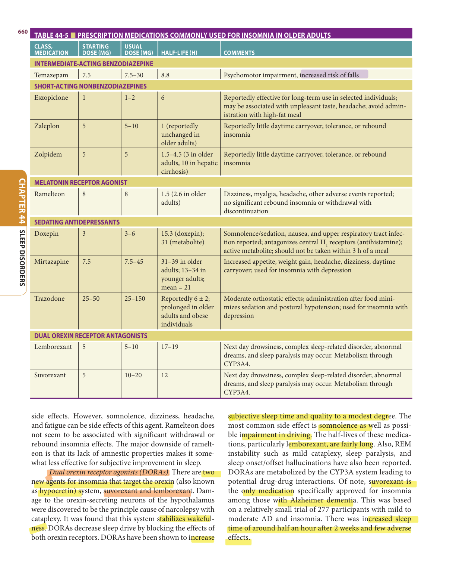

> *Table 44-5 reproduced as a page image (printed p. 660) — the grid did not extract reliably as text for this fast build.*

> Highlighting is the owner's annotation, not the book's.

side effects. However, somnolence, dizziness, headache, and fatigue can be side effects of this agent. Ramelteon does not seem to be associated with significant withdrawal or rebound insomnia effects. The major downside of ramelteon is that its lack of amnestic properties makes it somewhat less effective for subjective improvement in sleep.

_Dual orexin receptor agonists (DORAs)._ There are two - new agents for insomnia that target the orexin (also known as hypocretin) system, suvorexant and lemborexant. Damage to the orexin-secreting neurons of the hypothalamus were discovered to be the principle cause of narcolepsy with cataplexy. It was found that this system stabilizes wakefulness. DORAs decrease sleep drive by blocking the effects of both orexin receptors. DORAs have been shown to increase -

subjective sleep time and quality to a modest degree. The most common side effect is somnolence as well as possible impairment in driving. The half-lives of these medications, particularly lemborexant, are fairly long. Also, REM instability such as mild cataplexy, sleep paralysis, and sleep onset/offset hallucinations have also been reported. DORAs are metabolized by the CYP3A system leading to potential drug-drug interactions. Of note, suvorexant is the only medication specifically approved for insomnia among those with Alzheimer dementia. This was based on a relatively small trial of 277 participants with mild to moderate AD and insomnia. There was increased sleep time of around half an hour after 2 weeks and few adverse effects.

**[p. 661]**

_Other agents_ are available for treatment of insomnia. The tricyclic antidepressant doxepin has recently been developed for insomnia in a low-dose formulation (3–6 mg). For comparison, the usual antidepressant dose of doxepin is 100 to 300 mg per day. At these low dosages doxepin selectively antagonizes H1 receptors, which is believed to have sleep-promoting effects. Data suggests that low-dose doxepin does not have more anticholinergic effects than placebo. The duration of action for doxepin makes it more attractive for problems with sleep maintenance rather than sleep onset. The use of low doses of other sedating antidepressants such as trazodone and mirtazapine at bedtime is common. However, there is limited evidence to support this practice. In fact, a study in the use of trazodone for nondepressed patients showed that there was short-term benefit, which dissipated after 2 weeks. Thus, the benefits may be very small compared to the potential for side effects. However, if there is comorbid depression it should be treated, and sedating antidepressants may be a good choice as primary or adjunctive therapy. Trazadone has been associated with daytime sleepiness, headache, and orthostatic hypotension as well as priapism.

Although sedating antipsychotics are sometimes used to treat insomnia, there is scant evidence demonstrating their efficacy, and these medications can have significant adverse events, including increased mortality particularly in older adults with dementia. Guidelines suggest that sedating antipsychotics should not routinely be used in the management of insomnia in older adults without coexisting serious psychiatric conditions that warrant use of these - agents. Almost half of all older adults report the use of nonprescription over-the-counter (OTC) sleeping agents. Common nonprescription agents include sedating antihistamines, acetaminophen, alcohol, melatonin, and herbal products. The sedating antihistamines (eg, diphenhydramine) are the most common ingredients in these OTC drugs marketed for sleep. Diphenhydramine is sedating through its potent antihistaminergic effects, and tolerance to its sedating effect develops rapidly. The long half-life of diphenhydramine may result in next-day sedation. Patients may also experience dry mouth, urinary retention, delirium, decreased cognition, constipation, and increased ocular pressure. For these reasons, diphenhydramine should not be used as a primary treatment for insomnia in older patients. Many patients may use alcohol to self-medicate for insomnia; however, it can interfere with sleep in the later evening and worsen sleep difficulties.

Other supplements are available OTC, such as melatonin and valerian. One drawback of these supplements is the lack of standardization and oversight of traditional pharmaceuticals. Due to lack of solid evidence recent AASM guidelines do not recommend their use. There is evidence that melatonin improves time to fall asleep and sleep efficiency in older adults. However, the results of studies have been

mixed. Valerian is a herbal product marketed for insomnia due to its mild sedative properties. Some valerian preparations contain multiple botanicals, which may increase the chance of side effects. Kava, another herbal product marketed for insomnia, has a significant risk of adverse events, including hepatotoxicity, and is not recommended.

**Behavioral and other nonpharmacologic interventions** Behavioral treatment of insomnia is the safest, and perhaps, the most effective therapy for insomnia in older adults. It is the recommended first-line treatment for insomnia in all adults. Effective behavioral interventions for insomnia go beyond sleep hygiene, which is not generally effective I when used alone for chronic insomnia. Several randomized trials and systematic reviews provide strong evidence for cognitive behavioral therapy for insomnia (CBT-I). CBT-I usually combines sleep hygiene, stimulus control, sleep - restriction, and cognitive therapy, each of which will be discussed in greater detail below. CBT-I has reliably been shown to produce improved sleep efficiency, decreased nighttime wakefulness, and greater satisfaction with sleep. In at least two randomized trials with older adults comparing CBT-I with a prescription sedative-hypnotic agent, participants reported better improvement in sleep and more satisfaction with CBT-I therapy. One consistent finding of studies comparing CBT-I to pharmacologic therapy is that the improvements with CBT-I are more sustained. One of the major downsides to CBT-I is the limited access to practitioners who are trained in this specific therapy, but efforts are underway in some health care systems to increase access. Also, CBT-I requires significant buy-in from the patient. New delivery models that involve the use of the internet, nonspecialist providers, and telehealth-based CBT-I have yielded promising results.

_Sleep hygiene_ is education on general practices to maintain a healthy sleep-wake routine. When a sleep history is performed behaviors that contribute to disruptive sleep should be ascertained. Examples of these behaviors include sleeping with the television on, or excessive caffeine consumption. Patients should be educated about behaviors that may contribute to poor sleep and insomnia ( **Table 44-6** ).

_Stimulus-control therapy_ is designed to break the negative associations patients have with their sleep

**Table 44-6 — Sleep hygiene rules for older adults**

Check effect of medication on sleep and wakefulness. Avoid caffeine, alcohol, and cigarettes after lunch. Limit liquids in the evening. Keep a regular bedtime-waketime schedule. Avoid naps or limit to 1 nap a day, no longer than 30 min. Spend time outdoors (without sunglasses), particularly in the late afternoon or early evening. Exercise—but limit exercise immediately before bedtime. **[p. 662]**

**Table 44-7 — Instructions for stimulus-control therapy for older adults**

1. Patient should only go to bed when tired or sleepy. 2. If unable to fall asleep within 20 min, patient should get out of bed (and bedroom if possible). While out of bed, do something quiet and relaxing. 3. Patient should only return to bed when sleepy. 4. If unable to fall asleep within 20 min, patient should again get out of bed. 5. Behavior is repeated until patient can fall asleep within a few minutes. 6. Patient should get up at the same time each morning (even if only a few hours of … *(table text runs longer in the printed book; not fully reproduced in this fast build)*

**Table 44-8 — Instructions for sleep restriction therapy for older adults**

1. Calculate the average amount of time asleep per night reported by patient. 2. Patient is only allowed to stay in bed for this amount of time plus 15 min. 3. Patient must get up at the same time each day. 4. Daytime napping should be strictly avoided. 5. When sleep efficiency has reached 80%–85%, patient can go to bed 15 min earlier. 6. This procedure should be repeated until patient can sleep for 8 h (or period needed for a good night’s sleep). 7. Naps should be avoided. environment, which … *(table text runs longer in the printed book; not fully reproduced in this fast build)*

elaxing activity and only return to bed when able to fall asleep. For a regular pattern to develop the patient needs to avoid napping and should get out of bed the same time each day. Daytime sleepiness may increase early in this therapy particularly when paired with sleep restriction ( **Table 44-7** ).

_Sleep-restriction therapy_ was developed from the observation that many patients with insomnia spend a large amount of time in bed unsuccessfully attempting to sleep. Sleep-restriction therapy is guided by the patient’s sleep diary. The amount of time the patient actually sleeps is calculated and the patient is only allowed to spend that amount of time plus around 15 minutes in bed each night for the following week. Since the amount of sleep will be less, this will lead to sleep deprivation and an increased sleep drive. The increased sleepiness makes it easier for the patient to subsequently fall asleep more quickly and have more consolidated sleep. Once the patient has significantly consolidated, time in bed is increased gradually until the patient is getting adequate sleep ( **Table 44-8** ).

_Cognitive therapy_ in CBT-I addresses the maladaptive thoughts or dysfunctional beliefs patients have about their sleep. This is essential to be addressed to ensure adherence to the behavioral aspects of the therapy. Other components of CBT-I may include various relaxation techniques and scheduled worry time. Image rehearsal therapy may be helpful with patients who have trouble sleeping from nightmares related to PTSD. Mindfulness and other relaxation techniques can be strong adjuncts to the behavioral and cognitive components of CBTI.

There are several small studies that have found a beneficial effect of bright light, either from natural sunlight or light boxes, on the sleep of older adults. The reported effects of light on insomnia are more variable than those reported for circadian rhythm disorders. Evening light exposure may be useful for those who go to sleep and wake up too early (ie, advanced sleep phase), while morning exposure may be useful in patients who stay up and sleep in late (ie, delayed sleep phase).

There is less evidence to support other behavioral interventions, but individual patients may find them useful. For example, bathing before sleep can enhance sleep quality in some older individuals, which is likely related to changes in body temperature. A moderate exercise program can improve sleep in healthy sedentary older adults. However, strenuous exercise should not be done close to bedtime because this may interfere with sleep. Studies have shown a beneficial effect of Tai chi on symptoms of insomnia.

## Sleep In Institutionalized Older Adults And Neurodegenerative Disorders

Sleep in older adults living in nursing homes is well known to be disturbed, particularly in patients with neurodegenerative disorders. The prevalence of disturbed sleep in neurodegenerative disorders may be due to damaged brain structures responsible for regulation of sleep and circadian rhythms. Furthermore, a lack of exposure to light and alerting activities during the day can contribute to poor sleep at night. At the extremes, some patients may not spend a full hour fully awake or fully asleep in a 24-hour period. This lack of consolidated sleep prevents the normal sequence through various sleep stages and results in light nonrestorative sleep. In noninstitutionalized patients with significant dementia, progressive disturbances in the sleep-wake cycle often reach a point where nighttime behaviors become a significant stressor for caregivers. In fact, frequent

**[p. 663]**
nocturnal wandering and confusion is a leading cause of institutionalization.

The presence of dementia and other neurodegenerative disorders may impact therapy for sleep disorders. Severe dementia may impair the ability of patients to use CPAP for SDB; however, studies have shown that CPAP can be successfully used in mild to moderate dementia. Treatment of SDB in these patients can actually improve cognitive function. Furthermore, dementia can impact appropriateness of CBT for insomnia, where patients may not be able to participate. Behavioral treatment programs for insomnia that involve the caregiver have been used in patients with dementia. Most pharmacologic therapies for insomnia are relatively contraindicated in those with significant dementia. However, there are behavioral interventions that may be helpful in nursing home patients ( **Table 44-9)** . Recent data suggest that the most promising approaches are increased daytime light exposure, nighttime use of melatonin, and acupressure.

**Table 44-9 — Sleep hygiene rules for nursing home patients**

Limit the amount of time in bed, particularly during the day. Limit naps to 1 hour once a day, early in the afternoon. Keep regular sleep-wake schedule (if possible similar to prior home routine). Keep regular meal schedule (if possible, patients should not eat in bed). Avoid caffeinated beverages and food. Limit nighttime noise. Ensure that patient rooms are as dark as possible during the night. Ensure that patient environment is brightly lit during the day. Encourage exercise appropriate for … *(table text runs longer in the printed book; not fully reproduced in this fast build)*

## Further Reading

- Allen RP, Chen C, Garcia-Borreguero D, et al. Comparison of pregabalin with pramipexole for restless legs syndrome. _N Engl J Med_ . 2014;370(7):621–631.

- American Academy of Sleep Medicine. _International Classification of Sleep Disorders_ . 3rd ed. Darien, IL: American Academy of Sleep Medicine; 2014.

- American Geriatrics Society 2019 Updated AGS Beers Criteria® for Potentially Inappropriate Medication Use in Older Adults. _J Am Geriatr Soc_ . 2019;67(4):674–694.

- Auger RR, Burgess HJ, Emens JS, Deriy LV, Thomas SM, Sharkey KM. Clinical Practice Guideline for the Treatment of Intrinsic Circadian Rhythm Sleep-Wake Disorders: Advanced Sleep-Wake Phase Disorder (ASWPD), Delayed Sleep-Wake Phase Disorder (DSWPD), Non24-Hour Sleep-Wake Rhythm Disorder (N24SWD), and Irregular Sleep-Wake Rhythm Disorder (ISWRD). An Update for 2015: An American Academy of Sleep Medicine Clinical Practice Guideline. _J Clin Sleep Med_ . 2015; 11(10):1199–1236.

- Aurora RN, Kristo DA, Bista SR, et al. The treatment of restless legs syndrome and periodic limb movement disorder in adults—an update for 2012: practice parameters with an evidence-based systematic review and meta-analyses. _Sleep_ . 2012;35(8):1039–1062.

- Aurora RN, Zak RS, Maganti RK, et al. Best practice guide for the treatment of REM sleep behavior disorder (RBD). _J Clin Sleep Med_ . 2010;6(1):85–95.

- Bloom HG, Ahmed I, Alessi CA, et al. Evidence-based recommendations for the assessment and management

   - of sleep disorders in older persons. _J Am Geriatr Soc_ . 2009;57(5):761–789.

- Cowie MR, Woehrle H, Wegscheider K, et al. Adaptive servoventilation for central sleep apnea in systolic heart failure. _N Engl J Med_ . 2015;373(12):1095–1105.

- Donovan LM, Kapur VK. Prevalence and characteristics of central compared to obstructive sleep apnea: analyses from the sleep heart health study cohort. _Sleep_ . 2016;39(7):1353–1359.

- Epstein LJ, Kristo D, Strollo PJ Jr, et al. Clinical guideline for the evaluation, management and long-term care of obstructive sleep apnea in adults. _J Clin Sleep Med_ . 2009;5(3):263–276.

- Espie CA, MacMahon KM, Kelly HL, et al. Randomized clinical effectiveness trial of nurse-administered smallgroup cognitive behavior therapy for persistent insomnia in general practice. _Sleep_ . 2007;30(5):574–584.

- Kapur VK, Auckley DH, Chowdhuri S, et al. Clinical practice guideline for diagnostic testing for adult obstructive sleep apnea: an American Academy of Sleep Medicine Clinical Practice Guideline. _J Clin Sleep Med_ . 2017;13(3): 479–504.

- Kripke DF, Langer RD, Elliott JA, Klauber MR, Rex KM. Mortality related to actigraphic long and short sleep. _Sleep Med._ 2011;12(1):28–33.

- Mander BA, Winer JR, Walker MP. Sleep and human aging. _Neuron_ . 2017;94(1):19–36.

- Martínez-García M, Chiner E, Hernández L, et al. Obstructive sleep apnoea in the elderly: role of

**[p. 664]**

- continuous positive airway pressure treatment. _Eur Respir J_ . 2015;46(1):142–151.

   - McCurry SM, Pike KC, Vitiello MV, et al. Increasing walking and bright light exposure to improve sleep in community-dwelling persons with Alzheimer’s disease: results of a randomized, controlled trial. _J Am Geriatr Soc_ . 2011;59(8):1393–1402.

   - McMillan A, Bratton DJ, Faria R, et al. Continuous positive airway pressure in older people with obstructive sleep apnoea syndrome (PREDICT): a 12-month, multicentre, randomised trial. _Lancet Respir Med_ . 2014;2(10): 804–812.

   - Posadas T, Oscullo G, Zaldívar E, et al. Treatment with CPAP in elderly patients with obstructive sleep apnoea. _J Clin Med_ . 2020;9(2):546.

   - Qaseem A, Kansagara D, Forciea MA, Cooke M, Denberg TD. Clinical Guidelines Committee of the American College of Physicians. Management of Chronic Insomnia Disorder in Adults: A Clinical Practice Guideline From the American College of Physicians. _Ann Intern Med_ . 2016;165(2):125-133.

   - Raggi A, Ferri R. Sleep disorders in neurodegenerative diseases. _Eur J Neurol_ . 2010;17:1326–1338.

   - Ramar K, Dort LC, Katz SG, et al. Clinical practice guideline for the treatment of obstructive sleep apnea and snoring with oral appliance therapy: an update for 2015. _J Clin Sleep Med_ . 2015;11(7):773–827.

- Richards KC, Lambert C, Beck CK, et al. Strength training, walking, and social activity improve sleep in nursing home and assisted living residents: randomized controlled trial. _J Am Geriatr Soc_ . 2011;59(2):214–223.

- Sateia MJ, Buysse DJ, Krystal AD, Neubauer DN, Heald JL. Clinical Practice Guideline for the Pharmacologic Treatment of Chronic Insomnia in Adults: An American Academy of Sleep Medicine Clinical Practice Guideline. _J Clin Sleep Med_ . 2017;13(2):307–349.

- Spira AP, Covinsky K, Rebok GW, et al. Objectively measured sleep quality and nursing home placement in older women. _J Am Geriatr Soc_ . 2012;60(7):1237–1243.

- Stone KL, Blackwell TL, Ancoli-Israel S, et al. Sleep disturbances and risk of falls in older community-dwelling men: the outcomes of Sleep Disorders in Older Men (MrOS Sleep) study. _J Am Geriatr Soc_ . 2014;62(2):299–305.

- Webster L, Costafreda Gonzalez S, Stringer A, et al. Measuring the prevalence of sleep disturbances in people with dementia living in care homes: a systematic review and meta-analysis. _Sleep_ . 2020;43(4):zsz251.

- Xie L, Kang H, Xu Q, et al. Sleep drives metabolite clearance from the adult brain. _Science_ . 2013;342(6156):373–377.

- Yu J, Zhou Z, McEvoy RD, et al. Association of positive airway pressure with cardiovascular events and death in adults with sleep apnea: a systematic review and meta-analysis. _JAMA_ . 2017;318(2):156–166.

