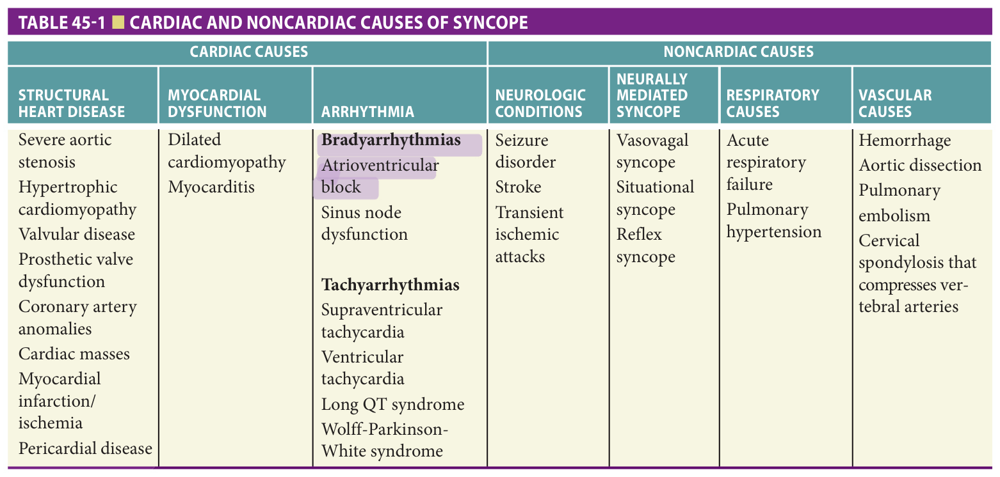
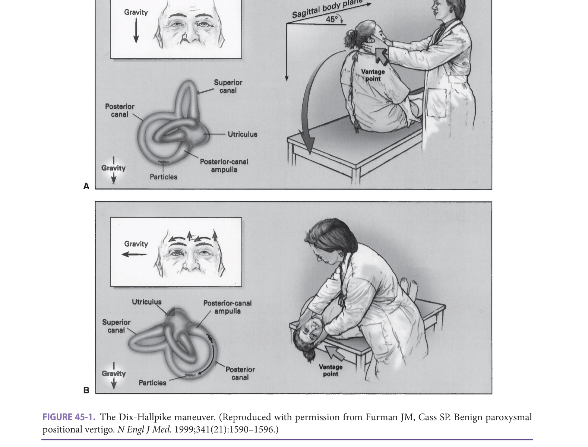
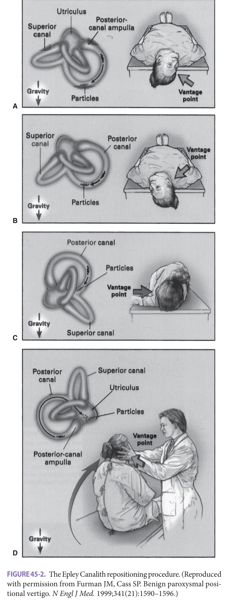

# Hazzard's Geriatric Medicine and Gerontology, 8e — Chapter 45: Syncope and Dizziness

Ria Roberts, Lewis A. Lipsitz

> **Lane-reviewed against the book, 25 Sep 2026.**

**[p. 665]**

#### Learning Objectives

- Define and understand the typical presentations of syncope and dizziness.
- Outline the common causes of syncope and dizziness.
- Discuss age-related physiologic changes that predispose older adults to syncope and dizziness.
- Detail pathophysiology and etiology of syncope and dizziness.
- Discuss management and prevention of syncope and dizziness.

#### Key Clinical Points

**Syncope:**

1. Syncope is a common symptom throughout life; however, its presentation is often atypical in older adults who are less likely to have a warning or prodrome prior to syncope, and often have amnesia for loss of consciousness. Syncope is also one of many causes of falls in the older adult.
2. The etiology of syncope in older adults is typically multifactorial and often medication related. Modification or cessation of cardiovascular, psychotropic, and other medications is often needed to prevent syncope in older adults.
3. Causes of syncope can be cardiac or noncardiac. Cardiac causes are most prevalent in older adults and are associated with increased morbidity and mortality.
4. Age-related physiologic changes that predispose older adults to syncope include baroreflex impairment, decreased cerebral blood flow, reduced renal salt and water conservation, decreased thirst, impaired early diastolic ventricular filling, and an age-related decrease in vascular response to sympathetic activity.
5. Monitoring blood pressure during common daily activities is a useful tool to identify causes of syncope; and implantable loop recorders are recommended as an early diagnostic tool in the evaluation of unexplained syncope given the relatively high diagnostic yield.

**Dizziness:**

1. Dizziness is an abnormal perception of the body's relationship to space, which is often described as postural instability or imbalance. In older adults, it is often associated with fear of falling, mood disorders, polypharmacy, and functional disability.
2. Dizzy symptoms can be classified into four subtypes, which present with different temporal patterns: vertigo, presyncope, disequilibrium, and other.
3. Patients frequently complain of dizziness alone or as a prodrome to syncope or falls.
4. Several age-related changes increasing older adults' susceptibility to dizziness include reduction in sensory receptors of the vestibular system, decreased vision and visual-vestibular reflexes, and decreased proprioceptive sense.
5. Visual, proprioception and balance exams, with and without eyes closed, as well as hearing assessment are all important elements of the dizziness work-up. Neuroimaging and specialized vestibular testing should be reserved for patients with chronic dizziness, vertigo, and/or focal neurologic findings.
6. Patients with chronic vestibular diseases (Meniere disease, labyrinthitis, vestibular neuritis, and ototoxicity) may benefit from vestibular desensitization exercises.
7. In the absence of a single etiology, treatment of each contributing factor can reduce dizzy symptoms.

## Definitions

### Syncope

Syncope is defined as a transient loss of consciousness secondary to cerebral hypoperfusion, characterized by unresponsiveness and loss of postural tone, with spontaneous, complete recovery. It is often a cause of otherwise unexplained falls in older adults. Syncope can result from one or more underlying processes that temporarily impair consciousness. Transient ischemia of the vertebrobasilar circulation, hypoxemia, and hypoglycemia are examples of other transient causes of loss of consciousness, but according to the definition above, they are technically not syncope if they are associated with focal neurologic abnormalities or do not recover spontaneously without intervention (eg, oxygen or glucose administration). Seizures may occur during a syncopal event as a consequence of cerebral hypoperfusion, but are rarely a cause of syncope.

### Dizziness

Dizziness is an abnormal perception of the body's relationship to space, which is often described as postural instability or imbalance. Patients frequently complain of dizziness alone or as a prodrome to syncope or falls. Dizzy symptoms can be classified into four subtypes, which present with distinct temporal patterns: vertigo and presyncope are acute and often episodic, while disequilibrium and other types are usually chronic and sustained. Dizziness can also be attributable to a cardiovascular diagnosis especially if associated with pallor, syncope, prolonged standing, palpitations, or improvement when lying down or sitting.

## Epidemiology

### Syncope

Syncope has a lifetime prevalence of up to 47% in healthy adults, and accounts for 3% of emergency department (ED) visits. The incidence is 0.6% per year, increasing to 2% to 6% in older adults. The outcome of ED visits for syncope, based on a 1-year meta-analysis, showed a 7% mortality, 16% recurrence rate requiring hospitalization, and 6.0% incidence of device insertion, demonstrating that syncopal patients suffer long-term morbidity and mortality. Syncope is the seventh most common reason for emergency **[p. 666]** admission of patients older than 65 years, and accounts for 1% of all hospital admissions. Syncope-related hospitalizations have been estimated to cost the US $2.4 billion annually, and up to 40% of cases remain unexplained despite extensive inpatient evaluations. In the young, the peak incidence of syncope occurs between 10 and 30 years of age and is mostly neurally mediated (vasovagal). Older adults on the other hand are more likely to have cardiovascular causes of syncope.

### Dizziness

The prevalence of dizziness ranges from 4% to 30% in persons aged 65 or older, with a higher prevalence in females. In older adults, comorbid conditions associated with chronic dizziness include falls, functional disability, orthostatic hypotension (OH), syncope, and stroke. Chronic dizziness is also associated with worsening depressive symptoms, self-isolation, and decreased participation in social activities.

## Pathophysiology, Etiology, And Presentation Of Syncope

### Pathophysiology Of Syncope

A syncopal episode results from temporary hypoperfusion of the brain, including the brain stem reticular activating system, which is responsible for consciousness. Standing in an upright posture results in the pooling of 500 to 1000 cc of blood in the lower extremities and splanchnic circulation, resulting in a decrease in venous return to the heart, reduced ventricular filling, decreased cardiac output, and a fall in blood pressure. The decrease in blood pressure reduces the stretch of baroreceptors in the carotid sinus and aortic arch, resulting in a baroreflex response to hypotension, which plays an important role in preventing syncope. The baroreflex response includes an increase in sympathetic outflow and a decrease in vagal activity from the central nervous system. This in turn increases heart rate, peripheral vascular resistance, venous return, and cardiac output, limiting the fall in blood pressure. Disruption in the baroreflex response is a cause of OH and resultant cerebral hypoperfusion.

Aging is commonly associated with a decline in baroreflex sensitivity and predisposes older adults to syncope during preload reduction. Due to a defect in beta-adrenergic receptor signal transduction, the older heart does not respond as well to sympathetic activation, as is evident in the diminished heart rate response to exercise or posture change in an older person. Although sympathetic outflow is greater with aging, several studies show a diminished cardioacceleratory and vasoconstrictor response. These changes can result in hypotension during common daily activities that reduce venous return to the heart, such as standing up, eating a meal, or taking medications that reduce cardiac preload such as diuretics or nitrates.

Older adults are also prone to reduced blood volume due to excessive salt wasting by the kidneys as a result of a decline in plasma renin and aldosterone, a rise in atrial natriuretic peptide, a reduced thirst response to hyperosmolality, and, often concurrent diuretic therapy. Low blood volume, together with age-related diastolic dysfunction and a blunted heart rate response to hypovolemic stress can lead to low cardiac output and an increased susceptibility to OH. Cerebral autoregulation, which maintains a relatively **[p. 667]** constant cerebral circulation over a wide range of blood pressures, is altered in the presence of hypertension and possibly by aging—the latter is still controversial. In general, it is agreed that sudden declines in blood pressure can markedly affect cerebral blood flow and render an older person particularly susceptible to presyncope and syncope. Syncope may thus result either from a single process that abruptly decreases cerebral blood flow and oxygen delivery to the brain, or from the cumulative effect of multiple processes, each of which contributes to reduced cerebral oxygen delivery.

### Etiology Of Syncope

The etiology of syncope can be cardiac or noncardiac, as shown in **Table 45-1** . Cardiac causes can be divided into structural heart disease, myocardial dysfunction, and arrhythmias, and are associated with higher mortality rates irrespective of age. Noncardiac causes include: respiratory causes (acute respiratory failure, pulmonary hypertension), vascular causes (hemorrhage, aortic dissection, pulmonary embolism, and cervical spondylosis that compresses vertebral arteries), neurologic conditions (seizure disorder, stroke, transient ischemic attack), neurally mediated syncope (vasovagal syncope, situational syncope, reflex syncope), and unexplained causes. Examples of situational syncope include: drug-induced hypotension, postprandial hypotension, OH, and dehydration. Examples of reflex syncope include: cough syncope, swallow syncope, post-micturition syncope, defecation syncope, and carotid sinus hypersensitivity.

### Cardiac Syncope

Cardiac syncope may be secondary to structural heart disease, myocardial dysfunction and/or arrythmia (bradyarrhythmia and tachyarrhythmia). Specific etiologies are listed in **Table 45-1** . The prevalence of cardiac disease, including structural heart disease and arrhythmias, rises dramatically with age and is responsible for about one-third of cases of syncope in older patients. Cardiac syncope is associated with higher morbidity and mortality rates, and may be preceded by dyspnea, chest pain, palpitations, and/or cyanosis during unconsciousness. Persistent cardiac symptoms, elevated serum troponin and B-type natriuretic peptide levels, and an abnormal electrocardiogram (ECG) may persist after a cardiac syncopal event. Myocardial infarction (MI) can also present atypically as syncope. The older patient may not recall cardiac symptoms that may have preceded the event, making it more challenging when evaluating causes of syncope.

### Noncardiac Causes Of Syncope

Noncardiac causes of syncope are listed in **Table 45-1** . Below, we discuss some of the most common noncardiac causes.

**Orthostatic hypotension** Orthostatic hypotension (OH) is defined as a 20 mm Hg or greater decline in systolic BP and/or 10 mm Hg or greater decline in diastolic BP when changing from a supine or sitting to standing position, usually measured immediately and after a short delay upon standing (eg, at 1 and 3 minutes). Characteristic symptoms of OH include falls, dizziness, weakness, nausea, palpitations, tremulousness, headache, presyncope, fatigue, and weakness.

OH can be caused by volume depletion, medications, adrenal insufficiency, and/or autonomic failure. Paradoxically, older patients with hypertension are more prone to OH due to the combination of age and hypertension-related impairments in blood pressure regulatory mechanisms.

> *TABLE 45-1. Cardiac and noncardiac causes of syncope.*

> Highlighting is the owner's annotation, not the book's.

**[p. 668]**

Volume depletion for any reason is often a common sole or contributing cause of OH and, in turn, syncope. Of note, in the older adult, a postural increase in heart rate is not a reliable indicator of hypovolemia because of baroreflex impairment.

Medications found to be contributory to OH include: antipsychotics (particularly MAO inhibitors and tricyclic antidepressants), diuretics, beta-blockers, and vasodilators, particularly nitrates and alpha blockers. The combination of alpha- and beta-blockade is especially dangerous. Since older adults are effectively partially beta-blocked due to age-related baroreflex impairment, the addition of an alpha blocker, like terazosin or tamsulosin for urinary frequency, can precipitate OH and syncope.

Dysautonomia can also result in OH and syncope through impaired cardioacceleratory and vasoconstrictor mechanisms that would normally compensate for reduced venous return to the heart during upright posture. In addition to OH and syncope, other symptoms of dysautonomia include defective sweating, erectile dysfunction, urinary incontinence, and bowel disturbances (diarrhea or constipation). The etiology includes both central nervous system neurodegenerative conditions and peripheral autonomic neuropathies. Neurodegenerative diseases that impair the autonomic nervous system include: multiple systems atrophy, Parkinson disease, Lewy body dementia, multiple strokes, myelopathy, and brain stem lesions. Causes of peripheral autonomic neuropathies include diabetes, amyloidosis, paraneoplastic syndromes, autoimmune diseases, pure autonomic failure, and less commonly, infections (botulism, HIV, syphilis, Chagas disease, leprosy, diphtheria), nutritional deficiencies (vitamin B12), and various neurotoxins (alcohol, dioxin, heavy metals, and chemotherapeutic agents).

Multiple systems atrophy (MSA) is a multisystem neurodegenerative disease due to striatonigral degeneration, cerebellar atrophy, or pyramidal lesions that is characterized by dysautonomia and motor disturbances. Clinical manifestations of MSA include muscle atrophy, distal sensorimotor neuropathy, pupillary abnormalities, restriction of ocular movements, life-threatening laryngeal stridor and respiratory insufficiency, dysphagia, constipation, bladder disturbances, and OH. Resting plasma norepinephrine levels are usually within the normal range but fail to rise on standing or tilting. The parkinsonian manifestations of MSA can be distinguished from Parkinson disease and Lewy body dementia by the absence of hallucinations and cognitive defects. Also, unlike Parkinson disease, MSA does not respond to dopamine, and there is poor or absent response to an adequate trial of levodopa.

OH is also a common clinical manifestation of Parkinson disease and the side effect of dopaminergic medications used to treat it. Cognitive impairment, in particular, abnormal attention and executive function, is more common in Parkinson disease with OH. This may be due to the effects of hypotension on the brain, including watershed hypoperfusion and cerebral infarction in executive and attention control regions.

Other non-neurogenic mediated conditions associated with OH include myocarditis, atrial myxoma, aortic stenosis, constrictive pericarditis, hemorrhage, prolonged diarrhea or vomiting, ileostomy fluid loss, burns, hemodialysis, salt-losing nephropathy, diabetes insipidus, adrenal insufficiency, fever, extensive varicose veins, deconditioning, dehydration, and hypertension. As noted above, hypertension increases the risk of hypotension by impairing baroreflex sensitivity and reducing ventricular compliance.

Older persons with hypertension are more vulnerable to cerebral ischemic symptoms even with modest OH because the threshold for cerebral autoregulation is shifted to higher blood pressures. This may result in decreased cerebral blood flow at higher blood pressure values, thereby increasing the risk of cerebral ischemia from sudden declines in blood pressure, even within “normal” ranges. Additionally, the acute administration of antihypertensive agents when blood pressure regulatory mechanisms and cerebral autoregulation are impaired may further increase the risk of OH and syncope. However, paradoxically, the chronic treatment of hypertension may improve blood pressure regulation, reduce the risk of OH, and increase cerebral blood flow in older adults.

**Postprandial hypotension (PPH)** PPH, an often overlooked cause of syncope in older adults, is defined as a 20 mm Hg or greater decline in systolic BP within 2 hours of the start of a meal. Postprandial physiologic changes that predispose to PPH include pooling of blood in the splanchnic circulation, a decrease in venous return to the heart, and failure to increase sympathetic nervous system activity, heart rate, and vascular resistance. The vasodilatory effects of insulin and other gut peptides released after a meal, including neurotensin and vasoactive intestinal peptide (VIP), may contribute to the hypotension. PPH has a prevalence of 24% to 36% of nursing home residents, and 23% of older adults admitted to a geriatric hospital with syncope or falls. It has also been found in 50% of older adults with unexplained syncope. Like OH, PPH is associated with hypertension, autonomic insufficiency, Parkinson disease, diabetes, renal failure, angina, transient ischemic attack, lacunar infarcts, and leukoaraiosis, alcohol use disorder, and polypharmacy. PPH may or may not coexist with OH in older patients. PPH is causally related to recurrent syncope and falls in many older persons, but the clinical significance of a fall in blood pressure after meals is difficult to quantify.

**Vasovagal syncope** The hallmark of vasovagal syncope is transient hypotension and/or bradycardia sufficiently profound to produce cerebral ischemia and transient loss of neural function. The possible mechanism involves a sudden fall in venous return to the heart, rapid fall in ventricular volume, and partial collapse of the ventricle in combination with vigorous ventricular contraction. The net result of these events is stimulation of ventricular mechanoreceptors **[p. 669]** and activation of the Bezold-Jarisch reflex leading to peripheral vasodilatation (hypotension) and bradycardia. Several neurotransmitters, including serotonin, endorphins, and vasopressin may play an important role in the pathogenesis of vasovagal syncope possibly by central sympathetic inhibition, although their exact role is not yet well understood.

Vasovagal syncope has been classified into cardioinhibitory (bradycardia), vasodepressor (hypotension), and mixed (both) subtypes depending on the blood pressure and heart rate response. In most patients, the manifestations occur in three distinct phases: a prodrome or aura, loss of consciousness, and postsyncopal phase. Many older adults do not experience a prodrome or aura, making vasovagal syncope hard to diagnose. A precipitating factor or stressful situation is identifiable in many patients. Common precipitating factors include extreme emotional stress, anxiety, mental anguish, trauma, a warm environment, air travel, prolonged standing, physical pain or anticipation of physical pain (eg, anticipation of phlebotomy). Some patients experience vagal responses to specific situations such as micturition, defecation, and coughing. Thus, situational and vasovagal syncope may overlap. Prodromal symptoms include extreme fatigue, weakness, diaphoresis, nausea, visual defects, visual and auditory hallucinations, dizziness, vertigo, headache, abdominal discomfort, dysarthria, and paresthesias. The duration of the prodrome varies greatly from seconds to several minutes, during which time some patients are able to take actions such as lying down to avoid an episode. The syncopal period is usually brief during which some patients develop involuntary movements—usually myoclonic jerks, but tonic-clonic movements may occur. Thus, vasovagal syncope may masquerade as a seizure. Recovery is usually rapid but older patients can experience protracted symptoms such as confusion, disorientation, nausea, headache, dizziness, and a general sense of ill health. Avoidance of precipitating factors and preventative actions such as lying down during prodromal symptoms have great value in preventing episodes of vasovagal syncope. Of note, healthy older persons are not as prone to vasovagal syncope as younger adults.

**Carotid sinus hypersensitivity and carotid sinus syndrome** The carotid sinus is a dilated area in the carotid bifurcation where the internal and external carotid arteries meet to make the common carotid artery. This neurovascular structure contains baroreceptors, which, when stretched, activate the parasympathetic nervous system and suppress the sympathetic nervous system, resulting in vasodilation, bradycardia, and hypotension. In some patients, hypersensitive receptors in the carotid sinus cause an exaggerated response called carotid sinus hypersensitivity (CSH). The incidence of CSH increases with age and predominantly affects males with atherosclerotic vascular disease. It is diagnosed by carotid sinus massage sequentially on each side of the neck while blood pressure and heart rate are being monitored. This maneuver should not be performed in people who have any history or evidence of carotid occlusion or heart block, in those with carotid bruits, or those who have had a recent cerebrovascular event or MI. The recommended duration of carotid sinus massage is from 5 to 10 seconds. The maximum fall in heart rate usually occurs within 5 seconds of the onset of massage. Complications resulting from carotid sinus massage are uncommon but may include sinus arrest, cardiac arrhythmias, and neurologic sequelae. Fatal arrhythmias are extremely uncommon and have generally only occurred in patients with underlying heart disease undergoing therapeutic rather than diagnostic massage. Neurologic complications result from either occlusion of, or embolization from, the carotid artery.

CSH is objectively defined as asystole of 3 seconds or longer (cardioinhibitory), and/or a fall in systolic BP exceeding 50 mm Hg (vasodepressor), or a combination of the two (mixed) while a carotid sinus massage is performed, with or without symptoms. When carotid sinus stimulation results in syncope, this condition is called “carotid sinus syndrome (CSS).” Other hypotensive disorders such as vasovagal syncope and OH may coexist in one-third of patients with CSH. Patients with a history of coronary artery disease or hypertension, or those taking digoxin, β-blockers, or α-methyldopa are most susceptible. Syncope may be precipitated by mechanical pressure on the carotid sinus due to head turning, tight neckwear, or neck pathology such as fibrosis from prior thyroid or head and neck cancer radiotherapy. In a significant number of patients, no triggering event can be identified. CSS is associated with appreciable morbidity. Approximately half of patients sustain an injury, including a fracture, during symptomatic episodes.

### Unexplained Causes Of Syncope

Despite the multitude of diagnostic tests, expensive technologies, and medical services that are used to evaluate syncope, approximately 40% of cases remain unexplained at end of the evaluation. Orthostatic, postprandial, and drug-induced hypotension, as well as structural heart disease and occult cardiac arrhythmias, are common causes of otherwise unexplained syncope.

## Presentation Of Syncope

The presentation of syncope is often atypical in older adults as they are less likely to have a warning or prodrome prior to syncope and often have amnesia for loss of consciousness. Since syncope may be unwitnessed, it is often mistaken for a fall. Therefore, history alone cannot be relied upon when assessing an older patient who is found on the ground. Injurious events such as fractures and head injuries are more common in syncope, because the victim lacks protective reflex responses when they lose consciousness. In some forms of syncope, particularly during hypotensive or vasovagal events, there may be a premonitory period in which various symptoms (eg, light-headedness, nausea, **[p. 670]** sweating, weakness, visual disturbances) offer warning of an impending syncopal event. Often, however, loss of consciousness occurs without warning or recall of warning. Recovery from syncope is usually accompanied by almost immediate restoration of appropriate behavior and orientation. The post-recovery period may be associated with fatigue of varying duration, which can lead to misdiagnosis as a seizure.

## Symptoms And Presentation, Pathophysiology, And Etiology Of Dizziness

### Symptoms And Presentation Of Dizziness

Dizzy symptoms can be classified into four subtypes, which can present with acute, episodic, or chronic temporal patterns. The dizzy symptom subtypes are: vertigo, presyncope, disequilibrium, and other.

**Vertigo** is defined as a sensation of spinning or motion due to an imbalance of tonic vestibular signals arising from the inner ear, brain stem, or cerebellum. Common causes of vertigo in older persons include benign paroxysmal positional vertigo (BPPV), cerebrovascular disease, acute labyrinthitis, and vestibular neuronitis. Acute labyrinthitis refers to the swelling and inflammation of the labyrinth of the inner ear whereas vestibular neuronitis refers to inflammation of the vestibular nerve located in the inner ear. Acute labyrinthitis and vestibular neuronitis commonly occur after viral infections, with the main presenting symptom being vertigo.

**Presyncope** is a sensation of impending loss of consciousness due to diffuse cerebral ischemia that typically arises from vascular or cardiac causes, as described for syncope above.

**Disequilibrium** is a sensation of unsteadiness and of being off-balance, which can result from disturbances of visual, vestibulospinal, proprioceptive, somatosensory, cerebellar, and/or motor functions. The feelings of unsteadiness or imbalance primarily involves the lower extremities or trunk rather than the head. In older adults, disequilibrium can be secondary to strokes, peripheral neuropathy, vestibular deficits, multiple neurosensory deficits, musculoskeletal weakness/physical deconditioning, neuromuscular disease, and cerebellar disease. Symptoms suggestive of cerebellar disease include double vision, limb ataxia, and numbness.

**Other** subtypes of dizziness are often associated with vague symptoms that are difficult for patients to describe, and may be associated with anxiety disorders and other psychological diagnoses. Although dizziness may be a symptom of one or more discrete diseases, multifactorial etiologies of dizziness are common in older persons.

### Temporal Pattern Of Dizzy Symptoms

As previously noted, dizzy symptoms may present in episodic or continuous patterns. Hence, the frequency and duration of dizzy symptoms should always be assessed.

Meniere disease, transient ischemic attack (TIA), migraine, and BPPV present with episodic dizziness, the latter precipitated by specific movements. Episodic dizziness less than 1 minute suggests BPPV, episodes lasting 20 to 120 minutes suggest (TIA) or migraine, and episodes more than 120 minutes to 2 days suggest Meniere disease or recurrent vestibulopathy. With continuous dizziness, symptoms are present daily. Common causes of continuous dizziness include multisensory impairments, psychogenic dizziness, stroke, cerebellar atrophy, peripheral neuropathy, unresolved labyrinthitis, medications such as aminoglycosides resulting in bilateral vestibular damage, and deconditioning.

## Pathophysiology Of Dizziness

Maintenance of balance and equilibrium requires a complex integration multisensory information from the vestibular, proprioceptive, visual, and auditory systems in the cerebral cortex and cerebellum which allows appropriate balance-maintaining responses. Abnormalities in one or more of these systems results in multisensory impairment, which precipitates imbalance and the sensation of dizziness.

Dizziness may be difficult to diagnose, specifically in older persons, as it often represents multisystem dysfunction. Several age-related changes increasing older adults’ susceptibility to dizziness include: reduction in sensory receptors of the semicircular canals, utricle and saccule of the inner ear, proprioceptive nerve and retina; diminished synapses; vascular disease affecting the microenvironment surrounding neurons; decreased vision and visual-vestibular reflexes; and decreased proprioceptive sense.

The vestibular system maintains spatial orientation at rest and during acceleration. Elements of the vestibular system and its connecting pathways include the semicircular canals, utricle, saccule, vestibular nerve, vestibular nuclei, vestibulospinal tracts, and vestibulocerebellar pathways. Diseases affecting the vestibular system that result in dizziness include Meniere disease, BPPV, labyrinthitis, vestibular neuronitis, acoustic neuroma, and drug toxicity (especially aminoglycosides and loop diuretics).

Proprioception contributes to equilibrium by providing information about changes in body position and mediates the body’s response to positional change. Mechanoreceptors in the large joints of the body, including ankles, knees, hips, and spine provide information to the brain about how the body is oriented in space. Therefore, degenerative arthritis of these joints can disrupt the acquisition of proprioceptive information and results in a sense of disequilibrium. Other common disorders of proprioception include peripheral neuropathy secondary to diabetes, vitamin B12 deficiency, and cervical spondylosis or stenosis.

Vision provides important information on spatial orientation and is particularly important when vestibular and/or proprioceptive function is impaired. Common ocular diseases include cataracts, macular degeneration, **[p. 671]** and glaucoma. Age-related visual changes include a decrease in visual acuity, dark adaptation, contrast sensitivity, and accommodation.

Hearing also provides spatial clues, but to a lesser extent than vision. Impairment in hearing, common in older persons, may be secondary to age-related changes previously discussed, or to disease processes.

The cerebral cortex and cerebellum, along with their synaptic networks, integrate information and supply the musculoskeletal system with information for appropriate postural responses. Because of multiple and complex connections, essentially any central nervous system disorder can lead to imbalance, which may manifest as dizziness.

## Etiology Of Dizziness

Key causes of dizziness syndromes in older adults include postural dizziness with and without OH, positional vertigo, acute labyrinthitis, vestibular neuronitis, recurrent vestibulopathy, Meniere disease, vertebrobasilar transient ischemic attacks, stroke, cervical dizziness, physical deconditioning, psychologic factors, and drug-induced dizziness.

Strokes that typically present with dizziness include: vertebrobasilar stroke syndrome, cerebellar infarction, anterior inferior cerebellar artery infarction, and lacunar strokes. Cervical dizziness can be classified into vascular cervical dizziness and proprioceptive cervical dizziness. Vascular cervical dizziness is caused by disruption in blood flow through vertebral arteries, commonly from an osteoarthritic spur; proprioceptive cervical dizziness results from overstimulation of the proprioceptive receptors of the facet joints of the neck. Physical deconditioning, likely due to limited exercise, typically results in muscle weakness, reduced coordination, and dizziness. Psychologic factors such as anxiety disorder, adjustment disorder, depressive disorder, and conversion disorder also commonly cause dizziness. Many classes of drugs can cause or contribute to dizziness, resulting in drug-induced dizziness. Common examples include antihypertensives, antiarrhythmic agents, anticonvulsants, antidepressants, anxiolytics, antibiotics (aminoglycosides, macrolides, and vancomycin analogs), antihistamines, nonsteroidal anti-inflammatory agents, and over-the-counter cold and sleep preparations. These agents cause dizziness through different mechanisms. Antihypertensive agents, particularly calcium channel blockers, nitrates, and hydralazine, can cause dizziness simply by lowering blood pressure to a level at which symptoms occur. Loop diuretics, such as furosemide can cause dizziness by ototoxicity and/or volume depletion. Antiarrhythmics, anticonvulsants, and anxiolytics are responsible for dizziness through their direct effects on the central nervous system. Tricyclic antidepressants, antihistamines, and cold preparations cause dizziness via their sedating and anticholinergic properties. Antibiotics (eg, aminoglycosides, macrolides, and vancomycin analogs), nonsteroidal anti-inflammatory agents, and loop diuretics cause dizziness through ototoxicity, especially in the presence of impaired renal function, which decreases their clearance. The aminoglycosides are especially hazardous because of their toxicity to both the kidney and the vestibular system.

## Evaluation Of Syncope And Dizziness

### Evaluation Of Syncope

The initial step in the evaluation of syncope is to obtain a careful history of the event, going back 1 to 2 hours in time and asking the patient or proxy about activities that may have precipitated syncope. Did the patient take hypotensive or sedating medications, eat a meal, exercise, stand up, or perform a valsalva maneuver while straining, defecating, or urinating? One should also assess for pertinent past medical history and medications. History of heart disease, neurologic deficits, and risk factors for acute GI bleeding are all important. The presence of heart disease is an independent predictor of a cardiac cause of syncope, with a sensitivity of 95% and a specificity of 45%. Blood pressure should also be assessed during activities that may have precipitated syncope such as posture change, meals, and medications to assess for situational hypotension. To facilitate this, patients can be asked to bring a meal or their medications to an office visit, and a medical assistant can take blood pressure measurements before and at 30 and 60 minutes after consuming them.

For syncopal patients, a baseline ECG should be obtained. Blood studies can be helpful to identify conditions such as dehydration, hemorrhage/anemia, adrenal insufficiency, MI, hypoxia, pulmonary embolism, and causes of autonomic failure such as diabetes. If patients have cardiac symptoms, MI must be ruled out with cardiac enzymes (troponin) and serial ECGs. Based on a systemic review, an abnormal troponin level, B-type natriuretic peptide (BNP) greater than or equal to 300 pg/mL and NT-proBNP greater than 156 pg/mL have all been found to be independently associated with major adverse cardiovascular events (MACE) after an ED evaluation for syncope.

### Cardiac Syncope

The gold standard for the diagnosis of cardiac syncope is symptom-rhythm correlation—that is, contemporaneous **heart rate and rhythm recording** during syncope. Cardiac monitoring may identify diagnostic abnormalities, such as asystole in excess of 3 seconds and rapid supraventricular (SVT) or ventricular tachycardia (VT). The absence of an arrhythmia during a recorded syncopal event excludes arrhythmia as a cause. Since cardiac arrhythmias are evident in up to 50% of patients with an ejection fraction of less than 40%, and atrial fibrillation occurs in one in five men older than age 80, an evaluation for arrhythmias is an important component of the syncopal workup. However, the commonly used **24-hour ambulatory ECG or Holter monitor** has limitations. It has low diagnostic yield, only **[p. 672]** 1% to 2% in unselected populations, and in the absence of symptoms it does not exclude a causal arrhythmia. Furthermore, some older adults may have difficulty operating it. Implantable loop recorders (ILRs) are quickly replacing ambulatory ECG monitors. These small devices are implanted or injected subcutaneously in the left side of the chest under local anesthesia and continuously record patients’ ECG during spontaneous symptoms. Given their higher diagnostic yield, ILRs are now recommended as an early diagnostic tool in the evaluation of unexplained syncope, especially in older patients. Difficulties with ILRs include inability to activate the device, particularly if patients have cognitive impairment; however, automated recordings and remote monitoring have much improved their operability and diagnostic yield.

**Echocardiography (echo)** should be performed in syncope patients with known heart disease and in whom a structural cardiac abnormality is suspected. The prevalence of structural cardiac abnormalities increases with age. The test is of most benefit in older patients with aortic stenosis or mitral regurgitation, and to evaluate ejection fraction.

**Exercise stress testing** is indicated in patients who present with exercise-induced syncope. It is not always possible in older patients who may be unable to exercise, so pharmacologic stress tests or angiography may be necessary.

**Electrophysiologic study** is indicated in the older patient with syncope when a cardiac arrhythmia is suspected but not evident on prolonged cardiac monitoring. Diagnosis is based on confirmation of an inducible arrhythmia or conduction disturbance. The benefit is dependent on pretest probability based on the presence of organic heart disease or an abnormal ECG. Electrophysiologic study has the advantage of providing both diagnosis and treatment in the same session (transcatheter ablation). It is most effective for the identification of sinus node dysfunction in the presence of significant sinus bradycardia of 50 beats/min or less, impending high-degree atrioventricular block in patients with bi-fascicular block, inducible monomorphic VT in patients with previous MI, and inducible SVT with hypotension in patients with palpitations.

### Noncardiac Syncope

**Carotid sinus massage** , previously described, is used to evaluate for CSH. It should be done in patients with no evidence of cerebrovascular disease or cardiac conduction disease, if there is no other identifiable cause of syncope.

**Neurologic imaging studies** have been found to have low diagnostic utility, especially in the absence of any focal neurologic findings. The American Academy of Neurology discourages the use of carotid artery imaging for syncope and the American College of Physicians and American College of Emergency Physicians discourages the use of CT scans and MRIs for syncope in the absence of focal neurologic signs. Neurologic evaluation is indicated when syncope is suspected to be epilepsy or due to autonomic failure.

In patients with possible situational syncope, **ambulatory BP monitoring** should be included in the initial work-up. They should have orthostatic vital signs measured, preferably with 2 values over 5 minutes during supine rest to obtain a baseline average, then at 1 and 3 minutes of standing to detect immediate and delayed OH. If a suspicious murmur is auscultated, an echocardiogram is warranted. If the patient presents with focal neurologic findings or seizures, an EEG or brain CT scan may be helpful, but these are rarely useful in the absence of neurologic signs.

**Tilt tests** and **autonomic function tests** may be useful to help diagnose autonomic failure. However, OH can usually be detected during a physical examination and tilt studies have many false positives. Therefore, tilt studies should be reserved for patients with unexplained syncope, the evaluation of neurohumoral responses to posture change, or to assess the effect of therapeutic interventions.

### Unexplained Syncope

While evaluating unexplained syncope, orthostatic, postprandial, and drug-induced hypotension should be ruled out as they are common causes of otherwise unexplained syncope. It is important to recognize that syncope occurs when there is inadequate delivery of oxygen and metabolic substrate to the brain, which almost invariably is due to hypotension. Unfortunately, when a patient is first evaluated in the ED, orthostatic blood pressures are rarely measured, often due to fear that the patient may have injured themselves and cannot safely stand up. Sometimes, intravenous fluids are given before orthostatic blood pressures are taken, thus obviating the value of the test. Although patients often spend several days in the hospital to evaluate syncope, it is rare that blood pressures are examined before and after a meal or in response to medications they were taking at the time of an event. In one review of 2106 patients 65 years and older admitted to the hospital following a syncopal episode, postural blood pressure measurements, while performed in only 38% of episodes, had the highest yield of all diagnostic tests with respect to affecting diagnosis (18%–26%) or management (25%–30%) and determining etiology of the syncopal episode (15%–21%). Therefore, the presence of hypotension must be carefully sought during the same activities that were associated with the syncopal event.

Another cause of unexplained syncope is occult cardiac arrhythmias and the presence of structural heart disease. In these patients, cardiac evaluation consisting of echocardiography, stress testing, and prolonged electrocardiographic monitoring or an electrophysiologic study are recommended. Of note, although cardiac arrhythmias are commonly sought during hospitalizations, monitoring is usually done while patients are at rest in bed, rather than engaging in activities that may have precipitated syncope. Therefore, ambulatory cardiac monitoring with an external or implantable continuous monitor **[p. 673]** is ideal. Electrophysiologic studies may be necessary in some patients with suspicion of heart block or inducible arrhythmias.

## To Hospitalize Or Not

Approximately 10% of patients with syncope who present to the ED will suffer from a serious outcome within 7 to 30 days of their visit; hence, it is important to note the characteristics of syncopal patients who should be considered candidates for hospital admission. These include patients with persistently abnormal vital signs in the emergency room, signs and symptoms of volume depletion/inability to maintain a normal volume status, gastrointestinal bleed or acute change in hematocrit to less than 30, acute coronary syndrome, dysfunction of an implantable cardiac device, valvular heart disease, the presence of a previously undiagnosed cardiac murmur, family history of sudden death, and new-onset dyspnea or features of congestive heart failure. Additionally, those with evidence of conduction disease including prolonged QT, fascicular block, repetitive sinoatrial block or sinus pauses, slow atrial fibrillation (< 40 bpm), ventricular arrhythmias, persistent bradycardia (< 40 bpm), or Brugada pattern on ECG (incomplete right bundle branch block and ST elevations in the anterior precordial leads) are also considered high risk for hospitalization. Lastly, those with syncope during exertion, when supine or in a sitting position, as well as those with immediate onset of palpitations following the syncopal event warrant hospitalization.

According to the 2018 European Society of Cardiology guidelines for the diagnosis and management of syncope, patients with high-risk features are more likely to have cardiac syncope and are at increased risk for sudden cardiac death (SCD) and increased overall mortality. Hence, it is crucial to identify such patients to ensure early, rapid, and intensive investigation, and those with cardiac devices should undergo prompt device interrogation. Additionally, patients with recurrent symptoms, those without anyone to observe them, and those unable to seek help if needed should be hospitalized for at least 24 hours for observation. On the other hand, patients with reflex or situational syncope, including syncope due to OH, can be discharged from the ED if they can be observed, maintain adequate hydration, and be kept safe at home.

## Evaluation Of Dizziness

A stepwise approach is recommended for the evaluation of dizziness, proceeding from a careful history and physical examination, medication history, and screening laboratory tests. Providers should inquire about the precipitating factors of dizziness if any, such as missing a meal, drinking alcohol, taking medications, standing from a lying position, rolling over in bed, changing head or neck position, urinating, or defecating. Frequency and duration of dizzy symptoms should be queried to determine whether they are intermittent or continuous. If vestibular causes of dizziness are suspected, it should be determined if it is central or peripheral.

A focused physical examination is an essential component of the work up. Orthostatic blood pressure and heart rate should be assessed as described for syncope above. The examiner should look for spontaneous nystagmus on cranial nerve testing. In central lesions, nystagmus is vertical and non-suppressible by visual fixation. In peripheral lesions, nystagmus is horizontal or rotatory, and can be suppressed by visual fixation. An ocular examination for near and distant vision should be performed, as well as a hearing test (whisper test or audioscope) and an otoscopic examination to rule out cerumen impaction or structural abnormalities. Palpation and assessment of range of motion of the neck is also important to assess for cervical arthritis and vestibular dysfunction. Of note, patients may voluntarily restrict the range of neck movement in order to minimize dizziness secondary to vestibular causes, and such patients may respond well to vestibular rehabilitation. A neurologic examination should include cranial nerves, the motor and sensory systems, and gait and balance. In the cranial nerve examination, one should look for diplopia, dysarthria, or facial paresthesia to rule out vertebrobasilar involvement. The absence of a corneal reflex suggests acoustic neuroma, especially if accompanied by unilateral hearing loss, tinnitus, and cerebellar signs. The presence of cogwheel rigidity and bradykinesia is suggestive of Parkinson disease. Although most of the abnormalities detected in the balance examination are not specific, the presence of a positive Romberg sign with the eyes closed is suggestive of an abnormality of proprioception and/or of the vestibular system. It also suggests that vision is needed to maintain balance. This should lead to interventions that maximize vision and ambient lighting in order to improve postural control. A wide-based stance and an improvement in gait with minimal handheld assistance of the examiner suggest a proprioceptive deficit or peripheral neuropathy.

In addition to the history and physical examination, clinicians should also perform certain provocative tests, such as the Dix-Hallpike maneuver ( **Figure 45-1** ), which establishes the diagnosis of BPPV. In this test, the patient is asked to sit on an examination table with the head rotated 45 degrees to one side. The patient is then asked to fix his/her vision upon the examiner’s forehead. The examiner, while holding the patient’s head firmly in the same position, moves the patient from a seated to a supine position with the head hanging below the edge of the table. If the ipsilateral ear is affected, then this maneuver will result in vertigo and nystagmus. If present, the direction, latency, duration of nystagmus, and duration of vertigo should be noted. The diagnostic criteria for BPPV are (1) vertigo accompanied by a rotatory nystagmus; (2) a latency of 1 to 5 seconds between the completion of the maneuver and the onset of vertigo and nystagmus; (3) paroxysmal nature **[p. 674]** of the vertigo and nystagmus (lasting for 10–20 seconds); and (4) fatigability, that is, a decrease in the intensity of the vertigo and nystagmus with repeated testing.

> *FIGURE 45-1. The Dix-Hallpike maneuver. (Reproduced with permission from Furman JM, Cass SP. Benign paroxysmal positional vertigo. _N Engl J Med_ . 1999;341(21):1590–1596.)*

> Highlighting is the owner's annotation, not the book's.

Baseline laboratory tests, including hematocrit, hemoglobin A1c, metabolic panel, thyroid function tests, and vitamin B12 levels, should be done to rule out common modifiable contributors to dizziness such as anemia, diabetes, azotemia, hypothyroidism, and vitamin B12 deficiency.

If the dizziness is presyncopal or associated with syncopal episodes, the above work-up for syncope should be initiated, including a careful search for cardiac arrhythmias using long-term continuous ambulatory cardiac monitoring.

Audiometry should be done in patients with a history of fluctuating or gradual hearing loss. An audiogram will reveal sensorineural loss in both Meniere disease and acoustic neuroma; the hearing loss will be greater in lower frequencies in Meniere disease and in higher frequencies in acoustic neuroma, often unilaterally.

Furthermore, in patients with a suspicion of cervical osteoarthritis, imaging of the cervical spine can be considered, but the frequency of false positives is great. Neuroimaging is needed when a stroke or cerebellopontine tumor is suspected. Magnetic resonance imaging (MRI) is preferred over computed tomography (CT) scans because of its greater sensitivity, particularly for lesions in the brain stem. Routine MRI is unlikely to reveal specific causes of dizziness. Transcranial Doppler studies or a magnetic resonance angiogram (MRA) may be needed to detect vertebrobasilar insufficiency if there is high suspicion.

Abnormalities of the peripheral vestibular system can be evaluated by performing special tests, such as electronystagmography (ENG) with caloric testing, a rotational chair test, and computerized posturography. These tests are performed by consultants in otorhinolaryngology. However, one must keep in mind that abnormalities are common in older persons without dizziness, so a positive test is neither sensitive nor specific.

**[p. 675]**

A targeted battery of more elaborate and expensive tests is indicated only when routine evaluation suggests a specific disease entity and the results of these tests are likely to influence management. Neuroimaging and specialized vestibular testing should be reserved for patients with chronic dizziness, vertigo, and/or focal neurologic findings. When the etiology is multifactorial, identifying and treating the contributing sensory deficits may improve, if not eliminate the dizziness.

## General Principles For The Management Of Syncope And Dizziness

### Management Of Syncope

Avoidance of precipitating factors and correction of the underlying cause, whether cardiac or noncardiac in origin, is paramount. Withdrawal or modification of culprit medications is often the only necessary intervention in older persons. Many patients experience symptoms without warning, necessitating drug therapy. A number of drugs are reported to be useful in alleviating symptoms and are discussed below.

The treatment of OH and postprandial hypotension (PPH) starts with nonpharmacologic treatment and progresses to pharmacologic interventions, if necessary. For OH, any offending medication should be withdrawn, substituted, or reduced in dose, and warm environments and straining activity should be avoided. Squatting and leg crossing when symptoms develop can help increase blood pressure. Adequate hydration, increasing salt intake, wearing pressure-graded support stockings—preferably waist-high—abdominal binders, and sleeping in a 30 to 45 degree head-up position can be helpful. For PPH, antihypertensive medications should be given between, rather than with, meals. It is also important to avoid preload reduction (diuretics or prolonged sitting) and maintain adequate intravascular volume. Avoiding alcohol use, eating multiple small frequent meals high in protein and fat, walking after meals, and eating cold rather than warm meals may also be therapeutic.

Pharmacologic treatment for severe forms of OH and PPH includes caffeine consumption, 250 mg (2 cups brewed) in the morning, fludrocortisone 0.1 to 0.5 mg po daily, midodrine 2.5 to 10 mg po TID, and octreotide 50 mg subQ, 30 minutes pre-meal.

For patients with symptomatic cardioinhibitory CSS, atrioventricular sequential (dual chamber) cardiac pacing is the treatment of choice. With appropriate pacing, syncope is abolished in 85% to 90% of patients. For vasodepressor CSS, a recent small randomized controlled trial showed benefit from the alpha-agonist midodrine. Surgical denervation of the carotid sinus may be a treatment option in refractory situations.

Cardiac syncope treatment options are summarized as followed: For cardiac syncope caused by symptomatic atrioventricular (AV) conduction disease/AV block and sick sinus syndrome, cardiac pacing is the treatment of choice. In syncope due to intrinsic cardiac tachyarrhythmias, SVT and VT, antiarrhythmic drug therapy or catheter ablation is recommended in order to prevent syncope recurrence. An implantable cardiac defibrillator (ICD) is indicated in patients with syncope due to VT and an ejection fraction (EF) less than 35%, in patients with syncope and previous MI, and in patients who have VT induced during electrophysiologic studies. ICD should be considered in patients with an EF greater than 35% with recurrent syncope due to VT when catheter ablation and pharmacological therapy have failed or could not be performed. Of note, older patients with unexplained syncope, who have bi-fascicular bundle branch block and have undergone a reasonable workup, might benefit from empirical pacemaker implantation, especially if syncope is unpredictable (with no or short prodromes) or has occurred in the supine position or during effort.

In older adults, a multifactorial approach is recommended as there is likely more than one cause for syncope. Additionally, it may be appropriate to place pacemakers in frail older adults if the pacemaker can improve their quality of life and prevent falls or syncope.

## Management Of Dizziness

The goal of treatment for dizziness is to identify and treat modifiable factors and to decrease associated disability. Systemic disorders such as anemia, metabolic derangements, vitamin B12 deficiency, and thyroid abnormalities, as well as vision and hearing deficits should be corrected. Visual correction with bifocal lenses can increase, rather than decrease dizziness if the lenses are worn while walking and looking down, because the short-distance correction in the lower part of the lens may distort the longer-distance view of the ground. Separate glasses may be needed for short and long-distance vision. Anxiety and depression should be treated, recognizing the dilemma that most antidepressants can also cause dizziness. Identify and minimize the impact of multiple contributors, particularly drugs. Stopping potentially offending medications is preferable to adding new ones.

Although recommendations for the pharmacologic treatment of dizziness include vestibular suppressants such as antihistamines (eg, meclizine), anticholinergic agents (eg, scopolamine), and benzodiazepines (eg, diazepam), these are dangerous medications in older adults, often responsible for falls, confusion, and other adverse events. Therefore, if medications are needed, these should be used in low doses and for acute episodes of dizziness. Their prolonged use may compromise central and peripheral adaptation, and thus, paradoxically, prolong the dizziness. Benzodiazepines may at times be indicated as a long-term vestibular suppressant in persons with severe unilateral lesions who are not surgical candidates. In one study, selective serotonin reuptake inhibitors were found to be effective in treating chronic dizziness associated with anxiety.

**[p. 676]**

Vestibular rehabilitation has been shown to improve symptoms, postural instability, and dizziness-related handicap in patients with chronic dizziness. Vestibular rehabilitation consists of exercises combining movements of eyes, head, and body designed to stimulate the vestibular system. At first, these exercises may worsen the dizziness, but with continued practice and gradual increase in frequency, these exercises can improve dizziness, probably through central adaptation and habituation. These exercises also may help patients alleviate anxiety and fears in performing various activities. Improvement is usually seen after 6 to 8 weeks of vestibular rehabilitation. Patients should perform these exercises initially under the supervision of a trained specialist, such as a physical therapist, and later independently at home. In patients with cervical dizziness, physical therapy can substantially decrease the frequency and severity of dizziness and neck pain and can improve postural stability. Some patients may also benefit from cervical collars or cervical traction.

Patients diagnosed with BPPV can be treated by performing the Epley canalith repositioning procedure ( **Figure 45-2** ), which moves free-floating particles from the posterior semicircular canal into the utricle of the labyrinth by the effects of gravity, thereby eliminating turbulence and fluctuation of the endolymphatic pressure in the semicircular canals. In this five-position procedure, the patient is asked to sit on a table and a vibrator is applied to the ipsilateral mastoid process. Next, the patient is made to lie down supine on the examining table with the head rotated 45 degrees toward the affected ear and hanging below the edge of the table, similar to the Dix-Hallpike test. This position will induce vertigo. Once the vertigo subsides, the head is rotated 45 degrees to the opposite side, which may induce vertigo again. Then the head and body are rotated further in the same direction until the head is facing downward. Subsequently, while holding the head in the same position, the patient sits up. Finally, the head is turned forward with the chin down by about 20 degrees. The examiner holds the head in each of these positions for approximately 10 to 15 seconds or until the vertigo subsides. The patient should be told not to lie flat for the next 24 to 48 hours. Alternatively, a cervical collar can be used to prevent loose particles from sliding back to the posterior semicircular canals. These maneuvers can be performed without using the vibrator, although the results are said to be not as good. This maneuver can be repeated at weekly intervals until vertigo ceases and the Dix-Hallpike test is negative.

Surgery is reserved for a small group of patients who fail pharmacologic or vestibular rehabilitation, or who have cerebellopontine angle tumors. Patients with uncontrolled Meniere disease can have a transmastoid labyrinthectomy, partial vestibular neurectomy, or endolymphatic sac decompression. Very rarely, patients with BPPV who do not respond to repeated canalith repositioning procedures may benefit from disabling of the semicircular canal either by singular neurectomy or by occluding the posterior semicircular canal.

> *FIGURE 45-2. The Epley Canalith repositioning procedure. (Reproduced with permission from Furman JM, Cass SP. Benign paroxysmal positional vertigo. _N Engl J Med._ 1999;341(21):1590–1596.)*

> Highlighting is the owner's annotation, not the book's.

## Further Reading

**[p. 677]**

- Albassam OT, Redelmeier RJ, Shadowitz S, Husain AM, Simel D, Etchells EE. Did this patient have cardiac syncope? The rational clinical examination systematic review. _JAMA._ 2019;321(24):2448–2457.

- Brignole M, Moya A, de Lange FJ, et al. 2018 ESC Guidelines for the diagnosis and management of syncope. _Eur Heart J_ . 2018;39(21):1883–1948.

- Grossman SA, Bar J, Fischer C, et al. Reducing admissions utilizing Boston Syncope Criteria. _J Emerg Med_ . 2012;42(3):345–352.

- Jansen S, Bhangu J, de Rooij S, Daams J, Kenny RA, van der Velde N. The association of cardiovascular disorders and falls: a systematic review. _J Am Med Dir Assoc_ . 2016;17(3):193–199.

- Kharsa A, Wadhwa R. Carotid Sinus Hypersensitivity. [Updated 2020 Nov 7]. In: StatPearls [Internet]. Treasure Island (FL): StatPearls Publishing; 2020 Jan. Available from: https://www.ncbi.nlm.nih.gov/books/ NBK559059/.

- Leafloor CW, Hong PJ, Mukarram M, Sikora L, Elliott J, Thiruganasambandamoorthy V. Long-term outcomes in syncope patients presenting to the emergency department: a systematic review. _Can J Emerg Med._ 2020;22(1): 45–55.

- Lipsitz LA. Syncope in the elderly. _Ann Intern Med_ . 1983;99(1):92–105.

- Lipsitz LA, Nyquist RP Jr, Wei JY, Rowe JW. Postprandial reduction in blood pressure in the elderly. _N Engl J Med_ . 1983;309(2):81–83.

- Mendu ML, McAvay G, Lampert R, Stoehr J, Tinetti ME. Yield of diagnostic tests in evaluating syncopal episodes in older patients. _Arch Intern Med_ . 2009; 169(14):1299–1305.

- Pournazari P, Oqab Z, Sheldon R. Diagnostic value of neurological studies in diagnosing syncope: a systematic review. _Can J Cardiol_ . 2017;33(12):1604–1610.

- Sloane PD. Evaluation and management of dizziness in the older patient. _Clin Geriatr Med_ . 1996;12(4):785–801.

- Solbiati M, Casazza G, Dipaola F, Sheldon RS, Costantino G. Cochrane corner: implantable loop recorder versus conventional workup for unexplained recurrent syncope. _Heart (British Cardiac Society)._ 2016;102(23):1862–1863.

- Thiruganasambandamoorthy V, Ramaekers R, Rahman MO, et al. Prognostic value of cardiac biomarkers in the risk stratification of syncope: a systematic review. _Intern Emerg Med._ 2015;10:1003–1014.

- Viau JA, Chaudry H, Hannigan A, Boutet M, Mukarram M, Thiruganasambandamoorthy V. The yield of computed tomography of the head among patients presenting with syncope: a systematic review. _Acad Emerg Med_ . 2019;26(5):479–490.

