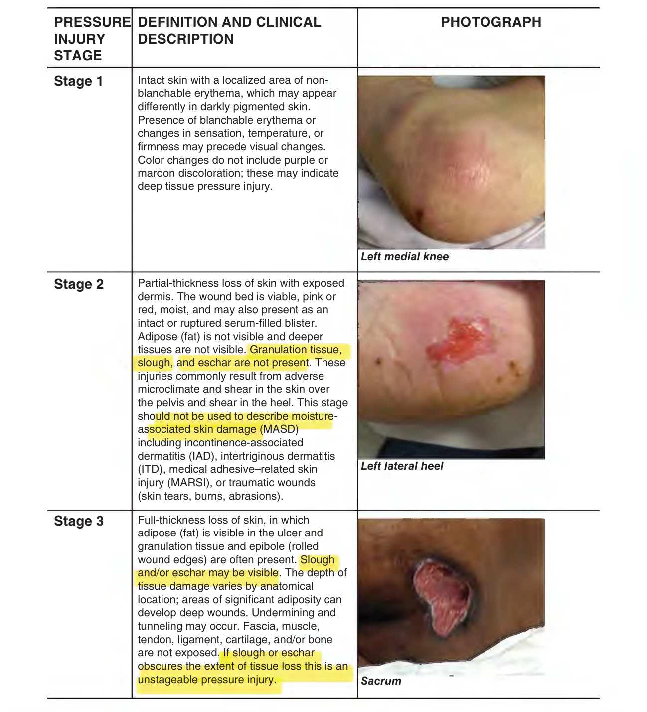
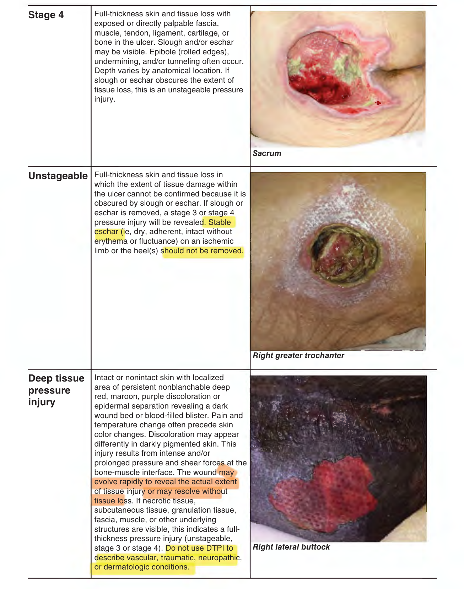
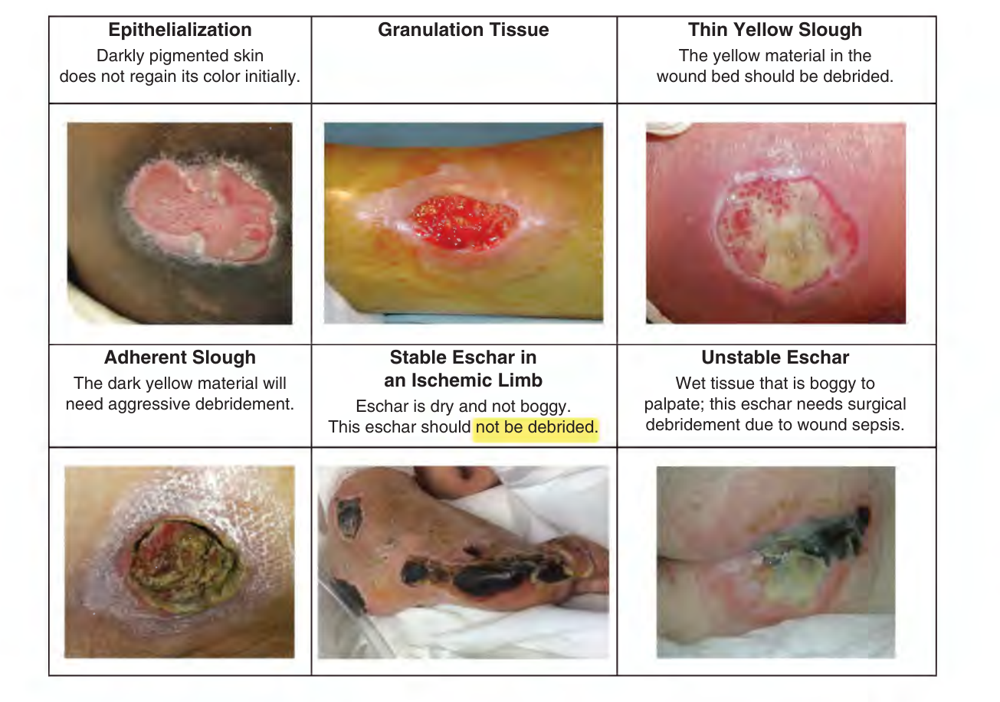
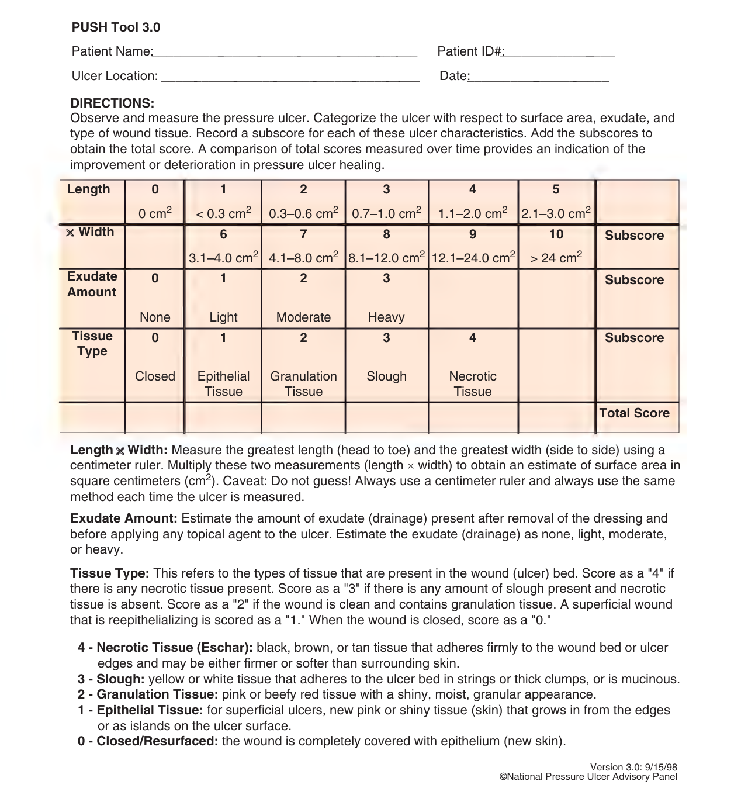
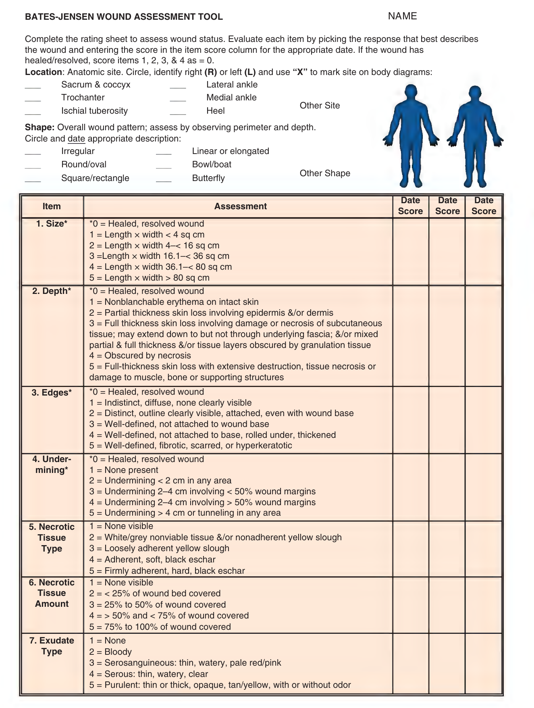

# Hazzard's Geriatric Medicine and Gerontology, 8e — Chapter 46: Pressure Injuries

Joyce M. Black

> **Status (21 Sep 2026).** Chat lane reviewed the tables and both 2026 questions against the images (round 1); round-1 fixes applied; the six transcribed stage definitions checked word for word against pp. 687–688 (round 2). Published. Republished 22 Sep with the approved glue ("cm²/wk", p692). Red tests (redtest46.py, 22 Sep): 26/26 mutations red, every check46 check red at least once, shipped files unchanged.

> **Source and method.** Printed pages 679–698 of the 8th edition, from the publisher's own text layer (PDF page = printed + 34). Prose, both boxes, both tables and the four figure captions; the figures (staging photographs with their definitions, tissue types, the PUSH tool and the Bates-Jensen tool) are page images, not transcribed. Checked against an independently typeset copy of the chapter. Page markers are printed page numbers. The two boxes are moved up to follow the opening paragraph.

> **2026 exam.** Two questions of the 2026 specialist sitting were sourced to this chapter: Q7 (p695, with a picture) and Q67 (p697). Their pages are flagged ⟨2026⟩; the questions are at the end.

> **Currency — declared gap (chapter).** The text says: "The NPIAP staging system was updated in 2016." Later revisions of the staging system or of the treatment guidelines the chapter draws on are not held here and have not been checked.

**[p. 679]**

As recently as 2014, pressure injury (PI) among older adults has been called a global “public health problem.” This conclusion was reached based on the high rates of PI among nursing home residents as well as hospitalized patients.

#### Learning Objectives

- Identify the four pathophysiologic factors of pressure injury (PI) development.
- Describe the six PI classifications according to the National Pressure Injury Advisory Panel’s (NPIAP’s) guidelines.
- Outline the process for PI risk screening and risk assessment.
- Describe the essential strategies for a successful PI prevention program.
- Describe the standard of care for treatment of full-thickness PI.

#### Key Clinical Points

1. Pressure injuries are caused by mechanical force compressing tissues between the bony skeleton and external surfaces directly damaging the cell wall leading to cellular death. Ischemia from occluded capillaries and lymphatics and release of oxygen free radicals from reperfusion injury contribute to the extent of the injury.
2. Prevention includes screening for risk followed by risk assessment using standardized risk assessment tools to determine individual-specific risk and implementing targeted prevention interventions based on identified risk factors.
3. Scheduled repositioning programs, use of reactive and active support surfaces, assessment and management of nutrition, and use of prophylactic dressings are key prevention strategies.
4. Adequate, timely, and complete debridement of necrotic tissue, identification and treatment of infection and management of biofilm development, and providing a moist wound environment are the key tenets of appropriate pressure injury care.
5. Medical record documentation must include pressure injury risk status, prevention strategies, pressure injury assessment (size, stage, location, and description of wound bed minimally), treatment plan, and evaluation of treatment success.
6. Partial-thickness pressure injuries (stage 2) should heal within 60 days maximum; full-thickness pressure injuries (stage 3/4/unstageable) should demonstrate improvement in overall injury status every 2 to 4 weeks.

## Definition

A PI is localized damage to the skin and underlying soft tissue usually over a bony prominence or related to a medical or other device. The injury can present as intact skin or an open injury and may be painful. The injury occurs because of intense and/or prolonged pressure or pressure in combination with shear. According to the National Pressure Injury Advisory Panel (NPIAP), the tolerance of soft tissue for pressure and shear may also be affected by microclimate, nutrition, perfusion, comorbidities, and condition of the soft tissue. The most common bony prominences are sacrum, heels, ischial tuberosities, trochanters, lateral malleoli, and heels. PI on the sacrum and heels are most common. However, PI can occur on any soft tissue exposed to pressure, so the clinician should not be guided only by the location of the wound to determine its etiology. Other terms for PI include pressure ulcer, bedsore or decubitus ulcer. The later terms imply development only in those confined to bed. Since the major causative factor is pressure, and because PI occurs in positions other than just lying down, PI is the preferred term.

## Epidemiology

Pressure injuries occur in all health care settings. About 70% of PIs occur in people older than age 65, and they are seen in 9% to 22% of nursing home (NH) residents and 5% to 32% of patients in hospitals. Among minority NH residents in the United States, the prevalence of PI is nearly twice that of Whites. The prevalence of PI in American hospitals is often reported through the National Database of Nursing Quality Indicators (NDNQI). More than 2000 US hospitals and 98% of Magnet recognized facilities participate in the NDNQI program to measure nursing quality and improve their outcomes; those outcomes include PI rates. NDNQI directs participating institutions to conduct a quarterly survey of all patients to determine the prevalence of PI. Participating hospitals receive data on PI rates **[p. 680]** and can evaluate their PI programs against hospitals of like size and complexity.

PIs are a quality issue for all areas of health care. PI incidence and severity are used as markers of quality care by regulators in long-term care facilities, home care agencies, and acute care hospitals. The Joint Commission estimates that 2.5 million patients in acute care hospitals are treated for PI each year and this number is likely to increase as the population ages. Unlike facility-specific conditions (such as surgical site infection or ventilator-associated pneumonia), PI present across all care settings and patients, especially among geriatric populations.

## Morbidity And Mortality Associated With Pressure Injury

PI can lead to pain and disfigurement. Of those persons with PI who are able to report pain, 87% report pain with dressing changes, 84% report pain at rest, and 42% report pain at rest and during dressing changes. Further, 18% of those persons reporting dressing change-related wound pain report pain at the highest level (eg, “excruciating”). Yet, only 6% of those persons reporting PI pain receive any medication for pain. There is some evidence that a higher proportion of persons with stage 3 or 4 injuries report injury pain compared to those with stage 2 injury and they report more severe pain than those with stage 2 PI.

PIs also reduce the quality of life when they are located on visible body areas, have odorous drainage, and require the patient to limit time up in a chair in order to reduce pressure on the wound.

Septicemia is the most severe complication from PI. The incidence of bacteremia from PI is approximately 1.7 per 10,000 hospital discharges. When the PI is the source of bacteremia, overall mortality is 48%. Further, septicemia is reported in 40% of PI-associated deaths. Clinicians should be aware that transient bacteremia occurs after PI debridement in as many as 50% of patients. Other infectious complications of PI include wound infection, cellulitis, and osteomyelitis. Infected PI are one of the most common infections found in skilled nursing facilities and are reported in 6% of residents.

Prolonged hospitalization, slow recovery from comorbid conditions, and increased death rates are consistently observed in older individuals who develop PI in both hospitals and nursing homes. Hospital-acquired PI development is associated with higher in-hospital mortality (11%), mortality 30 days after discharge (15%), and longer hospital stays (11.6 ± 10.1 days for those with hospital acquired PI vs 4.9 ± 5.2 days for those without).

In addition, failure of a PI to heal or improve has been associated with a higher rate of death in nursing home residents. Nursing home residents whose PI healed within 6 months show a lower mortality rate (11% vs 64%) than residents with injuries that did not heal within 6 months. The link between PI and mortality may be related to an unidentified causal pathway, to PI as a marker for coexisting morbidity in frail, sick patients, or to the association between fatal sepsis and PI as cause of death. Whatever the link, PIs are reported as a cause of death among 114,000 persons per year (age-adjusted mortality rate of 3.8 per 100,000 population).

PIs are costly. Annual costs were estimated at $27 billion for 2016 and this figure does not include other costs of care which are not reimbursable. The cost for managing a single full-thickness PI is as much as $70,000 to $130,000. The Centers for Medicare and Medicaid Services (CMS) reports the cost of treating a PI in acute care (as a secondary diagnosis) is just over $43,000 per hospital stay. Contributing cost factors include increased length of stay due to PI complications such as pain, infection, high-tech support surfaces, and decreased functional ability. The Agency for Healthcare Research and Quality (AHRQ) reported that PI-related hospitalizations ranged from 13 to 14 days and cost $16,755 to $20,430 compared to the average stay of 5 days and costs approximately $10,000. As a result, PI remain on the national agenda for improving quality. This emphasis on PI across the spectrum of health care settings highlights the importance of the condition for clinicians. PIs have also received attention in the courtroom. Organizations have been prosecuted for negligence related to PI care and development, and, in a landmark case, one health care facility operator was found guilty of manslaughter for a resident’s death related to improper care for her PI.

## Pathophysiology

PI forms from external or extrinsic causes (pressure and shear) in tissue with diminished tolerance or intrinsic causes (protein–calorie malnutrition, incontinence).

**Pressure** Pressure is the perpendicular force or load exerted on a specific area. The gravitational pull on the skeleton causes loading and deformation of the soft tissue between **[p. 681]** the bony prominence and external support surface. PIs are the result of mechanical injury to the cell membrane of the muscle. The membrane is directly deformed or destroyed by pressure of a high magnitude, such as a person lying on the floor after a fractured hip. As the amount of soft tissue available for compression decreases, the pressure gradient increases; thus, most PIs occur over bony prominences where there is less tissue for compression and the pressure gradient within the vascular network is altered. Deformation of tissues is a key factor in the damage seen in deep tissue pressure injury (DTPI) and full-thickness PI (stages 3 and 4) and may be the force that initiates cell death. The degree of tissue deformation depends on the tissues (ie, size and shape of the different tissue layers), the mechanical properties of the involved tissues (eg, stiffness, strength, shape of the bone), and the magnitude and distribution of the external mechanical force applied to the tissues. The tissues’ ability to withstand deformation can change with time due to aging, lifestyle changes, injury, or disease. High-pressure body areas in the semi-reclined position are the occiput, sacrum, and heels. In the erect sitting position, the ischial tuberosities exert the highest pressure, and the trochanters are affected in the side-lying position.

Several investigators have examined the reaction of cells to deformation. Observing single muscle cells has demonstrated that deformations exceeding 80% have consistently ruptured cell membranes, causing immediate and irreversible damage. Observations of an entire muscle have demonstrated similar findings; 2 hours of sustained deformation at strains higher than 50% inflicted irreversible damage to muscle tissue. Muscle tissue is metabolically active and when ischemic it is more sensitive to deformation forces, and irreversible damage may be present at the muscle layer without such damage occurring in the skin or subcutaneous layers. The cell death and local tissue necrosis change the geometry and characteristics of the tissues, which further increases the deformation force exacerbating the PI. Heat accumulation or increased skin temperature intensifies the effects of ischemia and hypoxia on tissues. Increased skin temperature causes an increase in metabolic rate, which increases the need for oxygen in the tissues.

Inflammation in the injured tissue increases interstitial fluid pressure which further impedes arteriolar circulation. The capillary vessels collapse, and thrombosis occurs. Lymphatic flow is decreased, allowing further tissue edema, and contributing to the tissue necrosis.

Less intense pressure, over time, occludes blood and lymphatic circulation, causing deficient tissue nutrition and accumulation of cellular waste products. If pressure is relieved before a critical time is reached, a normal compensatory mechanism, reactive hyperemia, restores tissue nutrition and compensates for compromised circulation. If pressure is not relieved, the blood vessels collapse and thrombose. The tissues are deprived of oxygen, nutrients, and waste removal. In the absence of oxygen, cells use anaerobic pathways for metabolism and produce toxic by-products. The toxic by-products lead to tissue acidosis, increased cell membrane permeability, edema, and eventual cell death.

These cellular changes result in inflammation and edema locally at the site of injury. The inflammatory changes exist in the tissues before any damage is fully visible on the skin surface. This is the nonvisible spectrum of pressure-induced tissue damage, the preclinical stage of disease in the physiology cascade leading to frank ulceration. These inflammatory changes with tissue edema can occur from 2 to 7 days before visible skin breakdown.

When prolonged pressure is finally relieved, the damage does not end. As the vascular network is relieved of pressure, the tissues are re-perfused and re-oxygenated. The sudden entry of oxygen into previously ischemic tissues releases oxygen-free radicals known as superoxide anions, hydroxyl radicals, and hydrogen peroxide, all of which induce new endothelial damage and decrease microvascular integrity causing postischemic or reperfusion injury.

**Shear** Shear stress is a parallel force applied to an area of the body, in contrast to pressure which is a perpendicular force. Shear stress leads to tissue deformation or distortion, which is called shear strain. Clinically, the term “shear” encompasses both ideas, a force and the resultant injury or strain on tissues. Shear also deforms the cell membrane. The mechanical physical forces of shear which is the force applied against a surface as it moves or slides in an opposite but parallel direction stretching tissues and displacing blood vessels laterally and deformation which stretches and pulls cells are also key factors in PI development.

**Friction** Friction is a superficial force applied to the skin and not considered a true cause of PI. However, friction damages the upper layers of skin and makes it less tolerant of the other forces. Chronic friction injuries can develop and are seen in patients who slide out of chairs to stand or move between one surface and another (bed to chair). The tissue becomes hyperkeratotic and often hyperpigmented. These tissue changes are not classified as PI.

**Tolerance for pressure** Comorbid conditions of the body also change the tolerance of soft tissue for pressure. Protein calorie malnutrition, in which the patient has a low body mass index, reduces the padding provided by adipose tissue over the bony prominences. Further, undernourished patients are often hospitalized for a longer stay in intensive care units, with a reduced functional status, and an increased acuity of illness, higher comorbidities, and higher mortality. However, obesity also creates risk for PI. The soft tissue of the severely obese patient is difficult to offload creating tissue-on-tissue pressure. For example, the abdominal pannus is often resting on the thighs or the pubis creating PI.

Impaired arterial flow, either from peripheral vascular disease or the use of vasopressors, decreases the body’s ability to reperfuse tissue that has been exposed to pressure and shear. Impairment of arterial inflow leads to **[p. 682]** local ischemia, delayed reperfusion of ischemic tissue, and impaired lymphatic drainage, all reducing tissue tolerance and the threshold to develop PI. When ischemia is present, the time to develop PI of the heel is shortened. Anemia is often suggested as a risk factor for PI development, but data remain inconclusive.

Lack of sensation, from neurologic disease or injury, diabetic neuropathy, or medication-inducted sedation (anesthesia, sedation for mechanical ventilation), increases risk for PI because the patient lacks the normal protective sensation to move to restore blood flow. Lack of sensory perception from diabetic neuropathy is a major risk factor to heel PI development. Stroke, degenerative neurologic disease, and spinal cord injury are major factors for development of ischial PI that form when the patient is sitting for prolonged periods of time in a chair, recliner, or wheelchair. Distinguishing between PI and diabetic and ischemic ulcers can be difficult and there are overlapping signs.

Exposure to moisture weakens the bonds in the epidermis and decreases tolerance for pressure and shear. Urinary incontinence leads to moisture-associated skin damage; this is not a PI, but often leads to many small open wounds that do not tolerate pressure. Diarrhea also damages the skin, but the wounds are more severe, a form of chemical burn.

Previous full-thickness injury that has closed with scar tissue is also at higher risk for future damage from pressure and shear. Scar tissue does not ever acquire the strength of the native tissue. Scar tissue has a tensile strength of 40% that of native tissue. So, if a patient had a prior stage 4 PI on the sacrum, that scar tissue will be at increased risk for future PI.

Four hypotheses for the pathophysiology behind PI development include the following:

1. High-magnitude pressure leading to direct deformation of tissue cells

2. Ischemia caused by capillary occlusion

3. Shear leading to ischemia of tissues

4. Reduced tolerance for pressure from comorbid conditions such as malnutrition, arterial disease, neuropathic conditions, exposure to moisture, or previous full-thickness injury to the skin

## Assessment

Multiple factors act together synergistically to cause PI in the functionally impaired frail older population. A comprehensive approach is required for these patients with multiple comorbidities to prevent development of PI. Assessment involves screening for risk of developing PI, assessment of the severity of the tissue damage (staging), and evaluation of injury healing over the course of treatment.

### Risk Screening and Risk Assessment

Screening is particularly useful for acute care hospitals and specific populations. Given that PI forms from exposure to pressure, the insensate, immobile patient is at highest risk. Severely restricted mobility is the most important risk factor for all populations and a necessary condition for the development of PI. A study of geriatric patients, who were monitored for movements using devices on the bed, showed that none of the individuals with more than 50 movements a night developed PI, whereas 90% of individuals with 20 or fewer spontaneous body movements at night developed a PI. Therefore, the simplest screening tool for PI development is “Does the patient move his body? His leg?” If the answer is no, or not without help, the patient is at risk for PI development.

Screening can be expanded to include those patients who were exposed to intense or prolonged pressure prior to admission. The advantage of a second screen to determine risk is that it allows practitioners to procure support surfaces, turning sheets or overlays or wedges in advance of the patient’s arrival on the unit. High-risk patients include:

• Demographic characteristics: African-American race and advanced age (older than 75 years).

• Persons with limited mobility or for whom movement is not possible without staff or caregiver assistance including persons who are unable to move due to sedation.

• Persons admitted to the hospital from a nursing home. These individuals are already frail as they require nursing home care and are now acutely ill.

• Persons admitted to the critical care unit from the emergency department.

• Persons older than 65 years admitted to the acute care hospital who are scheduled for a surgical procedure anticipated to be 3 hours or longer.

• Patients who experienced intraoperative hypotensive episodes.

• Persons admitted to the hospital who were found down for a prolonged time.

• Patients undergoing special therapy, for example, oncology patients admitted for bone marrow transplant or with graft-versus-host disease.

• Patients with hospital transport times more than 1 hour.

• Patients readmitted to a nursing home from the hospital.

• All persons who have had a previous PI and especially persons with spinal cord injury or neurologic dysfunction with prior PI.

• Patients admitted with any diagnosis reducing the tolerance of skin for pressure and shear including nutritional deficiencies, vascular disease, diabetes, and anemia.

• Patients admitted with conditions that will require a long time for recovery including paralysis, senility, respiratory failure, acute kidney injury, stroke, and heart failure.

**[p. 683]**

• Patients admitted with infection: sepsis, osteomyelitis, pneumonia, bacterial infections, and urinary tract infections.

• Intensive care unit patients with sepsis, surgery times more than or equal to 8 hours, or long-term vasopressor therapy (consider at high risk).

**Risk assessment tools** Early intervention based on screening is an excellent means to reduce risk for PI. A more specific risk assessment tool focused on PI risk factors should follow. Risk assessment is recommended in all clinical practice guidelines for PI. The purpose in identifying patients at risk for PI development is to allow for appropriate use of resources for prevention.

Nurses often use a formal risk assessment tool, such as the Braden Pressure Sore Risk Assessment. This tool is scored in six areas of risk and provides direction to target interventions to those specific risk factors. There is, however, limited evidence to support a direct link between use of risk assessment tools and decreased incidence of PI in part because once risk is identified, interventions to reduce risk are provided. Use of risk assessment tools is linked to increased documentation of prevention interventions and is better than use of clinical judgment alone, particularly for those patients at moderate risk.

PI risk assessment should be performed on admission to the health care setting and at periodic intervals thereafter. The frequency of reassessment is based on the likelihood of the condition of the patient changing. In acute care hospitals, risk assessment should be repeated every shift. In home health settings, risk assessment should be conducted weekly for the first 4 weeks with every other week reassessments thereafter depending on patient condition and frequency of home visits. Nursing home residents should be reassessed for PI risk status weekly for the first 4 weeks following admission followed by quarterly assessments. Whenever the patient’s condition changes in that he is more immobile or eating less, PI risk should be recognized.

## Prevention

PI prevention involves scheduled turning and repositioning programs, use of support surfaces to reduce/relieve pressure, nutritional support, and general skin care. Prevention interventions should be implemented for persons at risk for PI development and those with existing PI as part of the treatment plan. Table 46-1 presents general prevention interventions directed at risk factors for PI development.

### Turning and Repositioning

**Table 46-1 — Pressure injury prevention interventions**  *(printed 683)*

| Risk factor | Prevention interventons |
|---|---|
| Immobility | Scheduled repositioning programs, use of pressure reduction/relief surfaces in bed and chairs. |
| Inactivity, limited mobility | Use of trapeze bars for self-movement in bed, encourage ambulation, rehabilitation as appropriate. |
| Decreased sensory perception | Scheduled repositioning programs, verbal reminders to move/reposition, use of pressure reduction/relief surfaces in bed and chairs. |
| Malnutrition | Nutritional assessment to determine deficits, nutritional supplementation (high protein), and daily multivitamin if indicated and appropriate to goals. |
| Excess moisture and incontinence | Scheduled toileting or prompted voiding programs if responsive, routine check and change programs with pads and adult briefs for persons who do not respond to scheduled toileting or prompted voiding, use of skin creams and ointments for protection from moisture. |
| Friction and shearing | Use of trapeze bars for those with upper body strength, turn sheets and draw sheets for moving in bed, use of corn starch or lubricants to limit friction between surfaces, thin film or dressings, and pads over bony prominences subject to friction, use of footboards to help prevent sliding while in bed. |
| Dry skin | Use warm water, gentle cleansers, and limited force for cleansing when soiled and for routine bathing, lubricate and moisturize dry skin, inspect skin daily paying particular attention to bony prominences, avoid massage of reddened areas. |

> **As printed.** The column head reads "PREVENTION INTERVENTONS" (sic).

Patients at risk for PI who are unable to move independently should be placed on scheduled repositioning programs. The recommended time interval for full change of position or turning while in bed is every 2 to 3 hours, depending on the individual patient profile and the use of support surfaces. An old practice of turning patients every 2 hours has long lacked data to support this intervention. Some patients turn themselves relatively frequently, and turning and repositioning may be an unnecessary use of staff time and sleep disruptive at night. Turning activity can be detected by bed sensors, actigraphy, and other pressure mapping strategies (see below). And with the use of improved pressure-reducing support surfaces (eg, foam, air, gel-filled mattress overlays, low-air-loss therapy devices), frequency often need not be every 2 hours. A randomized clinical trial of PI incidence and turning schedules was conducted on 942 nursing home residents at moderate or high risk for PI development. Residents were placed on high-density foam mattresses and randomly assigned to turning schedules of every 2, 3, or 4 hours. There was no significant difference **[p. 684]** in PI incidence between the turning groups; 2.5% of those turned every 2 hours, 0.6% of those turned every 3 hours, and 3.1% of those patients turned every 4 hours developed PI. There also was no difference in PI rates between the high- and moderate-risk groups of residents.

The patient should be positioned to avoid direct pressure on the sacrum and heels. Position the patient at a 30-degree side-lying position (eg, 30-degree angle to the support surface) with the upper leg forward of the lower leg to reduce the tendency of the patient to fall back onto the sacrum. The legs should be separated with a pillow to reduce pressure. Maintain the head of the bed at the lowest degree of elevation consistent with medical conditions and limit the amount of time the head of the bed is elevated. This position will decrease exposure of the sacral area to shear forces that may predispose to PI in general and especially DTPI. Patients with arterial disease should have their heels off the bed. If the patient will remain positioned on a pillow that “floats the heel”, that is all that is needed. However, many patients kick the pillows away or are at extremely high risk—for those patient heel offloading boots or “donuts” made of foam placed above the ankles that elevate the heel are used.

There are techniques to make turning patients easier and less time consuming. Turning sheets, draw sheets, and pillows are essential for passive movement of patients in bed. Turning sheets and overlays are useful in repositioning the patient to a side-lying position, and for pulling the patient up in bed and help to prevent dragging the patient’s skin over the bed surface.

Use of real-time pressure mapping systems has been used to improve frequency of repositioning activities by caregivers. Pressure mapping systems may have a positive impact on PI development because the duration and amount of pressure over specific bony prominences are displayed for caregivers allowing for more accurate offloading of bony prominences.

Similar approaches are useful for patients in chairs. Individuals at risk for PI development should avoid uninterrupted sitting in chairs and should be repositioned every hour. The rationale behind the shorter time is the extremely high pressure generated on the ischial tuberosities when sitting erect in the chair and sacrum when reclined or slouched in the seated position. When possible, individuals who are able should be taught to shift weight every 15 minutes while seated. Full-body change of position involves standing the patient and reseating them in the chair. This process can be labeled “Stand and March in Place” and reduces the usual process of manually pulling patients up in the chair, a process which greatly increases back and shoulder injury to staff and shear for the patient. Use of footstools and the foot pedals on wheelchairs and appropriate 90-degree flexion of the hip (may be achieved with pillows, special seat cushions, or orthotic devices) can help prevent chair sliding. Attention to proper alignment and posture is essential. Patients who mobilize by wheelchair benefit from “tilt-in-space” chairs that recline the patient by tilting the backrest back.

Repositioning for preventing PI at the heel location involves completely offloading the heel using suspension devices, foam donuts (mentioned above), or pillows. The goal is to keep the heels free of all pressure or “float” the heels. Elevating the lower leg and calf with pillows or suspension devices spreads the pressure to the lower legs and the heel is no longer subjected to pressure. Heel suspension devices are preferable for long-term use over pillows as it can be difficult for patients to keep their legs on pillows over longer time frames.

### Support Surfaces

Most institutions that care for patients or residents use a 4-inch viscoelastic foam mattress on the beds. This mattress is adequate for the patient or resident who can self-turn and move the legs. For patients at higher risk, reactive or active support surfaces should be used. Some mattresses are replaced, sometimes an overlay can be placed on the usual mattress, and sometimes the entire bed system is replaced. These decisions stem from the relative risk for PI development. The higher the risk, the more aggressive the support surface needs to be. How frequently a patient needs to be repositioned by the staff when lying on a specialty support surface has not been fully studied.

The definitions of types of support surfaces stem from the support surface initiative by the National Pressure Injury Advisory Panel. The premise of a support surface is that if pressure can be redistributed over a larger body area, the relative pressure at any one area will be less. Think of the analogy of pushing your hand onto a surface of many nails versus one nail. Reactive support surfaces are powered or nonpowered surfaces with the ability to only change load distribution properties in response to an applied load. Reactive surfaces reduce pressure by immersion and envelopment of the body into the surface to reduce the deformation of tissue caused by pressure over the bony prominence. A foam mattress is an example of a nonpowered reactive surface. Active support surfaces are powered surfaces that inflate and deflate cells of air to change pressure over a body area. Active surfaces reduce pressure by periodically shifting the areas of support on anatomic locations so that deformation is not sustained over one area. In general, active support surfaces are recommended for persons at higher risk for PI development when frequent repositioning is not possible. An alternating air mattress is an example of an active powered support surface.

Additionally, clinicians should advocate for use of support surfaces in the operating room to reduce intraoperative acquired PI. High-risk patients for PI development during surgery are those whose operation will exceed 3 hours, those with American Society of Anesthesiologists (ASA) scores of 3 or higher, and those who are prone for surgery. The areas of the body exposed to pressure during surgery vary by the position used for the operation. Staff **[p. 685]** familiar with the position required should place prophylactic dressings on areas of high risk or pad the table to protect those body areas.

Providing topical preparations or fabrics/linens (silk or noncotton blends) to eliminate or reduce the surface tension between the skin and the bed linen or support surface will assist in reducing friction-related injury. Use of appropriate techniques when moving patients so that skin is not dragged across linens will lessen friction-induced skin breakdown. Patients who exhibit voluntary or involuntary repetitive body movements (particularly of the heels or elbows) require stronger interventions. Use of a protective film, such as a transparent film dressing or a skin sealant; a protective dressing, such as a thin hydrocolloid; or protective padding will help to eliminate the surface contact of the area and decrease the friction between the skin and the linens. Even though heel, ankle, and elbow protectors do nothing to reduce or relieve pressure, they can be effective aids against friction. Hip fracture patients are especially vulnerable to heel injuries. Elevation of the heel off the bed surface is a useful preventive measure.

Use of prophylactic silicone foam dressings over bony prominences has demonstrated significantly decreased heel (3% vs 12% favoring dressing) and sacral (1% vs 5% favoring dressing) PI among critical care patients with the number needed to treat of 10 to prevent any injury. Similar outcomes exist in long-term care residents showing reduction in PI rates even in the incontinent resident. Use of prophylactic silicone foam, hydrocolloid, foam, or silicone gel dressings around medical devices has also been shown to decrease PI development related to medical devices including tracheostomy tubes, nasal intubation tubes, and nasal continuous positive airway pressure (CPAP) devices.

General skin care should include routine skin inspection, incontinence assessment and management, and skin hygiene interventions to maintain skin health. Routine skin inspection should occur daily with particular attention to bony prominences. Reddened areas should not be massaged. Massage can further impair the perfusion to the tissues. The skin should be evaluated for dryness and cracking and use of moisturizers can be helpful. Attention should also be focused on gentle handling to prevent skin tears. Incontinence assessment and management with scheduled toileting or prompted voiding programs and for those unresponsive to these programs check and change schedules are important. Prompt cleansing after incontinent episodes with warm water and gentle cleansers and use of protective ointments and creams help maintain perineal skin health.

### Nutrition

Malnutrition and/or weight loss has been associated with fourfold higher risk of PI development. Other studies have demonstrated that the severity of the PI is associated with the severity of the malnutrition. Although it seems intuitive, it has proven difficult to define a specific causal relationship between malnutrition and PI development. Multiple studies have demonstrated a relationship between different markers of malnutrition (eg, dietary protein intake, inability to feed self, and weight loss) and PI formation. Modest evidence exists to support providing oral nutritional supplements to persons at risk for PI with relative reduction in PI incidence of 25%.

Nutritionists should routinely assess patients and residents at risk for PI. A comprehensive nutritional assessment should be completed to provide information on adequacy of nutritional intake, anthropometric measures of current and usual body weight, height and body mass index (BMI), physical examination findings that highlight nutritional issues such as muscle wasting, edema, micronutrient deficiencies, and functional status. Nutritionists also consider the patient/resident’s ability to eat independently. For many years, serum albumin and prealbumin were considered biochemical markers of malnutrition. However, these laboratory values should not be the sole basis of a malnutrition or failure to thrive diagnosis because serum protein levels reflect severity of inflammatory response rather than nutritional status. Both intake of calories and protein often need to be optimized in patients at risk for PI. There are no studies that show PI rates to be lower in those persons given nutritional supplementation, but providing supplements represents good clinical practice. When dietary intake is inadequate, or deficiencies are suspected or confirmed, provide a vitamin and mineral supplement. Dietary restrictions should be revised or modified/liberalized when limitations result in decreased food and water/fluid intake. These adjustments should be managed by a registered dietitian whenever possible.

## Diagnosis Of Pressure Injury

The diagnosis of a PI begins with a history of the patient’s exposure to pressure. Consider the events that preceded the onset of the wound, such as supine with the head of the bed elevated, sitting in a bedside chair or wheelchair, being unable to move the legs as the likely precipitant events to PI. Conditions that reduce the tolerance of skin and soft tissue for pressure and shear include reduced arterial perfusion, exposure to moisture, and protein calorie malnutrition. Differential diagnoses include arterial ulcers, diabetic foot ulcers, skin tears, and moisture-associated skin damage. Deep tissue PI is almost always preceded by exposure to intense pressure in the prior 48 to 72 hours. Differential diagnoses of deep tissue PI include traumatic injury, such as pelvic hematoma and embolic disease.

### Detection of Early Pressure Injury

Detection of early pressure-induced tissue damage is important because early intervention may prevent evolution into more severe pressure damage. There are several nonvisual methods of detecting pressure damage currently being explored for use in clinical practice by wound care specialists: ultrasound, thermography, spectroscopy, and **[p. 686]** surface electrical capacitance. Of these, ultrasound, thermography, and surface electrical capacitance show promise for use clinically.

High-resolution ultrasound is one of the earliest noninvasive methods to visualizing skin and soft tissues that provides echogenic images of skin and deeper tissues. Early work showed tissue edema in nursing home residents at risk for PI. Nearly 80% of those with abnormal ultrasound images did not have documentation of erythema suggesting that ultrasound technology can detect tissue damage before clinical signs occur. Despite the advantages to ultrasound the equipment is large and expensive, requires skilled technicians to obtain useful images, and requires trained providers to interpret images.

Thermography, the measurement of skin surface temperature and temperatures of tissues below the skin surface, may provide a method for detecting nonvisual pressure damage and resultant ischemia or inflammation. Both increased and decreased skin temperature (compared to adjacent normal tissue) are associated with stage 1 PI in rehabilitation patients with pressure-induced erythema. Skin temperature variability also differentiates between nursing home residents at high and low risk for PI development and between those residents who do and do not develop PI. A study of nursing home residents using a thermographic camera found that areas of blanchable erythema with cooler skin temperatures were more likely to develop necrotic ulcers in 7 days.

Measurement of the subepidermal water content of the skin and underlying tissue can be accomplished using surface electrical capacitance devices. These devices detect and measure water or edema as the initial inflammatory response of injured tissues below the stratum corneum. When cells are injured, such as occurs with early pressure-induced tissue damage, cellular permeability increases and the action potential across the cell membrane is decreased allowing quick, high electrical charges to pass through the tissues. Devices to measure these charges are small, portable, handheld dermal phase meters, which require light skin touch with readings available within 3 to 8 seconds. In nursing home residents, critical care patients, veterans with spinal cord injury, and persons with dark skin tones, this technique has detected inflammatory changes in the tissues, identifying pre-stage 1, stage 1, and deep tissue PI on the sacrum and heels.

### Early Presentation

PIs are labeled using a staging system: stages 1 to 4, unstageable, and deep tissue PI (see Figure 46-1).

While there is no label for preclinical or pre-stage 1 PI, there are often signs of reperfusion of tissue after pressure is relieved. Blanchable erythema presents as discoloration of a patch or flat, nonraised area of the skin larger than 1 cm.

### Assessment of Pressure Injury Stage

PIs are commonly classified using a staging or categorical system based on the observable depth of tissue loss. The stage is determined on initial assessment by noting the deepest layer of tissue involved. The injury is not restaged unless deeper layers of tissue become exposed. The numeric classification system suggested an orderly evolution of PI; however, PI do not progress, heal, or deteriorate in a linear fashion.

The most used staging system is the National Pressure Injury Advisory Panel’s (NPIAP) system describing six classifications of PI. The NPIAP staging system was updated in 2016. Figure 46-1 presents the definitions for PI stages. When more than one tissue type is present in a wound, stage the wound to the highest level of damage because this will dictate the treatment needed.

**Stage 1** Intact skin with nonblanchable erythema involves more severe damage to underlying tissues including lymphatic and capillary occlusion. Skin temperature is cool compared with healthy tissues, and the area may feel indurated. This stage of tissue injury is also reversible, although tissues may take 1 to 3 weeks to return to normal.

**Stage 2** An open wound with exposure of the dermis. The wound is superficial, with indistinct margins. Fluid-filled blisters (open or closed) may be seen. If properly treated, these wounds should heal in 2 to 4 weeks. Stage 2 PI often develops as a result of friction (rubbing heels on the bed) or chronic exposure to moisture, which reduces the tolerance of skin for pressure.

The remaining four stages of PI are full-thickness wounds; that is, exposure of body structures beneath the skin. These wounds are often the outcome of deep tissue PI.

**Deep tissue PI** Initially appears as purple or maroon intact skin over an area of the body exposed to intense pressure about 48 hours prior. The initial injury was deformation and destruction of muscle cells, but due to the low metabolic demand of skin the skin stays alive for a time after the muscle beneath it is destroyed. The skin lyses off, creating a blistered look to the wound and then the damage becomes apparent. Eschar usually forms and surgical debridement is often needed.

**Stage 3** Full-thickness loss of skin with exposure of adipose tissue. Because of the location of PI over bony prominences, this stage is not common. However, as wounds heal they appear to be stage 3 PI because they are filled with granulation tissue.

**Stage 4** Full-thickness loss of skin with exposure of bone, muscle, tendon, ligament, or cartilage. Osteomyelitis is a common outcome when there is exposure of bone and should be considered the cause of nonhealing in any stage 4 PI.

**[p. 687]**

**Unstageable** A PI that is most likely a full-thickness PI, but it cannot be determined if the ulcer is a stage 3 or 4 because the extent of the damage cannot be visualized due to slough or eschar in the wound bed.

**Mucous membrane PI** Medical devices lead to many PI. They tend to be made of hard plastic and often rest on muscle membrane (endotracheal tubes, nasogastric tubes, catheters). These PI cannot be staged using the PI staging system because the anatomy of mucous membrane is not the same as skin.

**Skin failure/terminal ulcers** Clinicians have long reported change in skin color usually on the sacrum near the time of death. At times, these changes are labeled skin failure to parallel the failure of other body organs, citing the idea that the skin is the largest organ of the body and therefore can also fail. However, the wounds are not large enough to lead to death on their own, such as would be seen with epidermolysis bullosa or Steven-Johnson syndrome. The condition needs a different name; the reader may see changes in the terminology in the future.

> *FIGURE 46-1. Stages of pressure injury.*

> Highlighting is the owner's annotation, not the book's.

> The stage definitions printed inside Figure 46-1 are transcribed after the figure (below the continuation on p. 688).

**[p. 688]**

## Management Of Pressure Injury

### Pressure Injury Assessment

> *FIGURE 46-1. (Continued)*

> Highlighting is the owner's annotation, not the book's.

**Figure 46-1 — the stage definitions, as printed in the figure** *(pp. 687–688; photographs above)*

- **Stage 1** *(p. 687; photograph: Left medial knee)*: Intact skin with a localized area of nonblanchable erythema, which may appear differently in darkly pigmented skin. Presence of blanchable erythema or changes in sensation, temperature, or firmness may precede visual changes. Color changes do not include purple or maroon discoloration; these may indicate deep tissue pressure injury.
- **Stage 2** *(p. 687; photograph: Left lateral heel)*: Partial-thickness loss of skin with exposed dermis. The wound bed is viable, pink or red, moist, and may also present as an intact or ruptured serum-filled blister. Adipose (fat) is not visible and deeper tissues are not visible. Granulation tissue, slough, and eschar are not present. These injuries commonly result from adverse microclimate and shear in the skin over the pelvis and shear in the heel. This stage should not be used to describe moisture-associated skin damage (MASD) including incontinence-associated dermatitis (IAD), intertriginous dermatitis (ITD), medical adhesive–related skin injury (MARSI), or traumatic wounds (skin tears, burns, abrasions).
- **Stage 3** *(p. 687; photograph: Sacrum)*: Full-thickness loss of skin, in which adipose (fat) is visible in the ulcer and granulation tissue and epibole (rolled wound edges) are often present. Slough and/or eschar may be visible. The depth of tissue damage varies by anatomical location; areas of significant adiposity can develop deep wounds. Undermining and tunneling may occur. Fascia, muscle, tendon, ligament, cartilage, and/or bone are not exposed. If slough or eschar obscures the extent of tissue loss this is an unstageable pressure injury.
- **Stage 4** *(p. 688; photograph: Sacrum)*: Full-thickness skin and tissue loss with exposed or directly palpable fascia, muscle, tendon, ligament, cartilage, or bone in the ulcer. Slough and/or eschar may be visible. Epibole (rolled edges), undermining, and/or tunneling often occur. Depth varies by anatomical location. If slough or eschar obscures the extent of tissue loss, this is an unstageable pressure injury.
- **Unstageable** *(p. 688; photograph: Right greater trochanter)*: Full-thickness skin and tissue loss in which the extent of tissue damage within the ulcer cannot be confirmed because it is obscured by slough or eschar. If slough or eschar is removed, a stage 3 or stage 4 pressure injury will be revealed. Stable eschar (ie, dry, adherent, intact without erythema or fluctuance) on an ischemic limb or the heel(s) should not be removed.
- **Deep tissue pressure injury** *(p. 688; photograph: Right lateral buttock)*: Intact or nonintact skin with localized area of persistent nonblanchable deep red, maroon, purple discoloration or epidermal separation revealing a dark wound bed or blood-filled blister. Pain and temperature change often precede skin color changes. Discoloration may appear differently in darkly pigmented skin. This injury results from intense and/or prolonged pressure and shear forces at the bone-muscle interface. The wound may evolve rapidly to reveal the actual extent of tissue injury or may resolve without tissue loss. If necrotic tissue, subcutaneous tissue, granulation tissue, fascia, muscle, or other underlying structures are visible, this indicates a full-thickness pressure injury (unstageable, stage 3 or stage 4). Do not use DTPI to describe vascular, traumatic, neuropathic, or dermatologic conditions.
> Line-break joins inside the figure, settled by the figure itself: Stage 1 breaks "non-" / "blanchable"; the Deep tissue pressure injury box prints "nonblanchable" mid-line, so it is joined. The DTPI box breaks "full-" / "thickness"; Stages 3 and 4 print "Full-thickness" mid-line, so the hyphen is kept.

The healing of a PI is routinely assessed, usually weekly, by measuring the size of the wound, the type of tissue in the wound, the condition of the periwound, and the type of drainage and signs of infection. Nurses usually complete this activity, and the direction of the wound indicates if the current treatment needs changing. A good practice method is to reconsider the treatments in place **[p. 689]** if the wound does not show signs of healing in 2 weeks. Of course, if the wound is deteriorating, there is no benefit to waiting 2 weeks to change treatments. Signs of healing include the wound size decreasing, the exudate (drainage) from the wound decreasing, no signs of infection, and the reduction in the amount of necrotic or nonviable tissue with the development of granulation tissue. Final wound closure is measured by the presence of epithelium covering the wound. Improvement rates for stage 3 and 4 injuries are slower than stage 2 injuries with 75% of stage 2 wounds healing in 60 days, while only 17% of stage 3 or 4 injuries heal in the same time period. Tissue types seen in wounds are shown in Figure 46-2.

There are two research-based PI assessment tools for evaluating wound status and healing, NPIAP’s Pressure Ulcer Scale for Healing tool (PUSH) (Figure 46-3) and the Bates-Jensen Wound Assessment Tool (BWAT) (Figure 46-4). Clinical practice guidelines, expert panels, and federal nursing home guidelines recommend standardized assessment of PI, and many groups recommend use of a standardized tool for ongoing PI assessment.

The PUSH tool incorporates surface area measurements, exudate amount, and surface appearance. The clinician measures the size of the wound, using length and width to calculate surface area and chooses the appropriate size category of 10 categories. Exudate is evaluated as none (0), light (1), moderate (2), and heavy (3). Tissue type is rated as closed (0), epithelial tissue (1), granulation tissue (2), slough (3), and necrotic tissue (4). Each of the three items is scored, then the three sub-scores can be summed for a total score. The PUSH tool offers a quick assessment to predict healing outcomes, but assessment of additional wound characteristics may still be needed in order to develop a treatment plan for the PI.

The BWAT evaluates 13 wound characteristics using a five-point numerical rating scale and rates them from best (scored as 1) to worst (scored as 5) possible (see Figure 46-4). Characteristics include size, depth, edges, undermining or pockets, necrotic tissue type and amount, exudate type and amount, surrounding skin color, peripheral tissue edema and induration, granulation tissue, and epithelialization. Similar to the PUSH tool, once characteristics have been scored, they can be summed for a total score (range 13–65).

### Redistribution of Pressure and Reduction in Shear

> *FIGURE 46-2. Tissue types in pressure injuries.*

> Highlighting is the owner's annotation, not the book's.

PIs occur due to exposure to pressure and shear; therefore, pressure must be reduced for the wound to heal. In general, the patient should not be positioned on the PI, but this is easy to say and sometimes difficult to do. If the patient can tolerate or is unaware of being positioned off the wound, the plan of care should indicate which positions are to be **[p. 690]** used (eg, side to side positioning). However, the more common issue is that patients often developed a PI by lying or sitting in a preferred position and it will be difficult to convince them to change. If the PI is on the sacrum, side to side turning, with confirmation that the sacrum is free from pressure, is the ideal practice. If the patient refuses to stay off the wound, consider upscaling the mattress or adding an overlay for additional immersion into the bed. These devices do not replace turning, but the increased immersion reduces pressure on soft tissue.

When PI occurs on the ischium in chairbound patients, a specialized chair cushion with high immersion is needed. Again, time spent lying on the sides will reduce pressure on the ischium. However, ischial wounds are very slow to heal, and it is difficult to convince a patient to lie in bed for months. Usually a compromise is best, for example, being up a few hours at a time in the chair and then back to bed on the left or right side.

PI on the heel should be managed with a heel off-loading device (HOLD); pillows should not be used. Pillows are unreliable, often collapse under the weight of the leg, or get kicked off the bed. If the leg cannot be placed in a HOLD, apply a pressure redistribution foam dressing to the heel.

> *FIGURE 46-3. National Pressure Injury Advisory Panel Pressure Ulcer Scale for Healing Tool. (© National Pressure Injury Advisory Panel.)*

> Figure 46-3 (PUSH Tool 3.0) is a scoring form; shown as an image, not transcribed.

Trochanteric PI occurs in patients with contractures, who lie on their sides. Pressure redistribution in these patients is difficult because the PI are often bilateral, and

**[p. 691]**

> *FIGURE 46-4. Bates-Jensen Wound Assessment Tool.*

> Figure 46-4 (Bates-Jensen Wound Assessment Tool) is a scoring form; shown as an image, not transcribed.

**[p. 692]**

*(The paragraph above, from p. 690, runs on here; p. 691 carries only Figure 46-4.)*

the patient cannot be positioned supine as the weight of the flexed legs pulls them back onto their sides. These patients require upscaled beds, side lying positioning at less than 90 degrees with wedges, and protection of the ankles and knees from the contracted legs.

Use of reactive support surfaces such as mattress overlays or active surfaces such as low-air-loss therapy for patients with stage 1 or 2 PI who cannot be positioned off the wound.

Healing full-thickness injury is aided by air-fluidized therapy beds or low-air-loss beds. One retrospective, multisite, comparison study showed faster healing of existing PI with air-fluidized therapy compared to both pressure reduction support surfaces and low-air-loss therapy (mean healing rate of 5.2 cm²/wk for the air-fluidized surface group compared to 1.5 cm²/wk for pressure reduction support surface group and 1.8 cm²/wk for low-air-loss therapy group).

### Nutrition

Inadequate nutritional intake and undernutrition have been linked to the severity of PI and protracted healing. Providing 30 to 35 kcal/kg of calories and 1.3 to 1.5 g/kg of protein daily has been shown to significantly improve PI healing. The preferred method of feeding is orally and if nutritional requirements cannot be met orally, any dietary restrictions should be revised or modified/liberalized when they result in decreased food and water/fluid intake. Evidence on the efficacy of extra protein and energy via oral supplements is substantial. High energy, high protein supplements are beneficial, especially those with arginine, zinc, antioxidants, and micronutrients when provided for more than 4 weeks. However, providing tube feeding to persons with PI has not consistently achieved positive results. Individuals receiving enteral nutrition via a percutaneous endoscopic gastrostomy (PEG) or nasogastric tube often have significantly more major complications (eg, weight loss, aspiration pneumonia, recurrent tube displacement, and death) that were deemed to be related to the intervention compared to individuals receiving an oral diet. Tube feeding formulas also contribute to diarrhea, often contaminating open wounds. Free water will need to be added to the intake of patients on supplemental feeding. Additional fluids may be needed for fever, prolonged vomiting, profuse sweating, diarrhea, and/or heavily exuding wounds.

No evidence exists for use of supplemental vitamins or minerals (eg, vitamin A, E, C, iron) in persons with PI with no coexisting specific vitamin/mineral deficiency to improve PI healing. A daily multivitamin and mineral supplement that provides recommended daily allowances of vitamins and minerals is recommended for persons with suspected nutritional deficiencies.

Clinically, one of the most challenging aspects of nutrition is helping the anorexic elder eat. Many elders struggle with poorly fitted dentures or missing teeth, comorbid conditions or medications that reduce appetite, depression, and lack of usual social environments for eating, and lack of preferred foods when institutionalized but the most common complaint is “I’m just not hungry!” Family bringing in favorite foods can sometimes help. The use of appetite stimulants may be helpful in some people. Megestrol acetate (Megace) has never been shown to be effective in older patients or nursing home residents and has steroidal side effects. With increasing availability of medical marijuana some clinicians and patients are using it as a potential appetite stimulant. A nutritionist will be helpful to fully investigate the issues surrounding not eating.

When the patient is in palliative care or end of life/hospice care, the goals are to provide comfort and minimize symptoms. If providing supplemental nutrition assists in providing comfort to the individual and is mutually agreed upon by the individual, family caregivers, and health professional, then supplemental nutrition (in any form) is very appropriate for palliative or end of life/hospice wound care. If the individual’s condition is such that to provide supplemental nutrition increases discomfort and the prognosis is expected to be poor, then providing supplemental nutrition should not be a concern and is not appropriate for palliative or end of life/hospice wound care.

### Local Treatment

PI management includes cleaning the open wound, debriding necrotic tissue, reducing risk of infection and biofilms, and using appropriate topical therapy. As PIs are healing, dressings with nonstick surfaces should be used when dressing changes are required frequently; using typical gauze dressings can interfere with healing by removing healed tissue when they are changed.

### Cleansing Solutions

PI cleansing at each dressing change is recommended in clinical practice guidelines. Cleansing removes surface contaminants, remnants of previous dressings, and microorganisms on the wound surface. Saline and water have no antiseptic properties and should seldom be used on PI because these wounds are colonized with bacteria. Antiseptic cleansing solutions include hypochlorous acid, dilute sodium hypochlorite (0.25% “half strength” Dakin’s solution), and dilute povidone iodine (10% povidone with 1% free iodine [Betadine]). Hydrogen peroxide should not be used on open wounds. Some wound cleansers are cytotoxic to fibroblasts if used in high concentrations and should not be used for long periods of time. The general time frame is to apply the cleanser to the open wound for 10 to 15 minutes and then apply the new dressing. Surfactant antimicrobial cleansing solutions for use on the wound bed include polyhexamethylene biguanide and octenidine dihydrochloride. These solutions help to loosen slough in the wound bed.

### Cleansing Lavage

The use of low-pressure lavage (4–15 lb per square inch [psi]) to mechanically lift fibrin and slough from PI has **[p. 693]** been recommended for many years. Several methods can be used to achieve this pressure, from items as simple as a needle and syringe to noncontact, low-hertz frequency ultrasonic mist to pulsed lavage systems. To remove the debris in the wound bed, the force of the irrigation stream must be greater than the adhesion forces holding the debris to the wound surface. Using wound cleanser as the lavage fluid provides additional benefits.

In general, if a PI contains necrotic debris or is infected, then reducing antimicrobial activity is more important than preventing cellular toxicity. The chemical and mechanical trauma of wound cleansing should be balanced by the dirtiness of the wound. For wounds with large amounts of debris, more vigorous mechanical force and stronger solutions may be used, while for clean wounds, less force and physiologic solutions such as normal saline can be used.

### Dressings

Topical therapy for PI should be provided using moist wound healing dressings. Randomized controlled trials as well as several comparative studies provide compelling support for use of moist wound healing dressings instead of any form of dry gauze dressings for PI. Moist wound healing allows wounds to re-epithelialize up to 40% faster than wounds left open to air. Controlled trials suggest that the use of semi-occlusive dressings such as hydrocolloid dressings and foam dressings improve healing of stage 2 PI. These dressings are changed every 3 to 5 days, which allows wound fluid to gather underneath the dressing, facilitating epithelial migration. As noted above, regular gauze should not be used when dressing changes are more frequent; only dressings with nonstick surfaces should be used. Table 46-2 presents general characteristics of moisture retentive dressing categories.

### Biofilm Formation

**Table 46-2 — General characteristics of moisture retentive dressing categories**  *(printed 693–694)*

| Dressing category | Definition | Uses | Notes |
|---|---|---|---|
| **Composite Dressings** | Combine one dressing group with another to address wound characteristics. For example, gauze/foam and transparent film dressing properties, hydrocolloid and alginates, etc. | Absorbent (depends on combination of dressings used in the composite) Wicks away excess moisture Nonadherent to wound bed Use depends on the combination of dressings used in the composite | • Some may be difficult to apply • If nonadherent to wound bed then requires secondary dressing to hold in place • Can be confusing to caregivers as combines various dressing category properties |
| **Transparent Film Dressings** | Polyurethane and polyethylene membrane film coated with a layer of acrylic hypoallergenic adhesive. Moisture vapor transmission rates (MVTR) vary | Appropriate for partial-thickness wounds Promotes epithelialization Semipermeable Bacterial barrier Autolysis Wound visible Protects against friction Self-adhesive | • May reinjure area on removal • Nonabsorbent so can lead to wound edge maceration • Tendency to remove prematurely • Indicated for minimal exudate, does not absorb drainage • Not indicated for moderate to heavy exudate |
| **Hydrocolloids** Regular or thin wafers, paste, granules | Gelatin, pectin, carboxymethylcellulose in a polyisobutylene adhesive base with a polyurethane or film backing | Absorbs low to moderate wound fluid Autolysis Thermal insulation Bacterial barrier Reduces pain Translucent to opaque Easy to apply Controls odor until dressing removed Impermeable to semi-permeable | • Not indicated for heavy exudate, limited absorbent abilities when used alone • Use with other products increases absorbent abilities • Odor on removal • Regular wafers are opaque, thin wafers allow some wound visualization • Edges may melt down and stick to linens • Some difficult to remove • Possible sensitivity to adhesive backing • Use with close supervision on immunosuppressed and diabetic patients, extensive burns, infected lesions |
| *(table continues on p. 694)* | | | |
| **Hydrogels** Sheets, wafers Amorphous gels Impregnated gauze | May or may not be supported by a fabric net, high water content, varying amounts of gel-forming material (glycerine, copolymer, water, propylene glycol, humectant) | Absorbs low to moderate drainage Autolysis Nonadhesive, may have adhesive borders Semipermeable or impermeable depending on backing Thermal insulation Reduces pain Conformable Carrier for topical medication | • Can dry out • May macerate surrounding tissues • Requires secondary dressing or tape to keep in place • Does not cause reinjury upon removal • Cooling effect can help relieve wound pain • Candidiasis may present from inappropriate usage |
| **Wound Fillers (Exudate absorbers)** Beads, flakes Pastes, powders | Consists of copolymer starch, dextranomer beads, or hydrocolloid paste that swell on contact with wound fluid to form gel, dextranomers, polysaccharides, starch, natural polymers, and colloidal particles | Moisture retentive Absorptive (moderate to large) Useful to fill cavities, pockets, undermining Can be used with topical medications | • Nonadhesive • Requires a secondary dressing to hold in place • May have burning sensation on application • May have odor • Some require mixing • Some require wound irrigation for nontraumatic removal |
| **Alginates** Ropes, pads, wafers | Calcium–sodium salts of alginic acid (naturally occurring polymer in seaweed) | Absorptive (moderate to large) Useful to fill cavities, pockets, undermining Moisture retentive Can use with topical medications or on infected wounds Reduces pain Thermal insulation | • Nonadherent, requires secondary dressing to hold in place • Hemostatic properties • May require wound irrigation for removal • No reinjury on removal • May dry out, should not be used on wounds with low exudate |
| **Foams** Wafers (thick or thin), pillows, composite dressings with thin film covers, available with surfactant impregnated or charcoal layer | Inert material that is hydrophilic and nonadherent, modified polyurethane foam | Absorptive (moderate to large) Autolysis Can be used with topical medications and on infected wounds Conformable Thermal insulation | • Nonadhesive unless used with composite dressing • Requires tape or secondary dressing to hold in place • Nontraumatic removal • Opaque • Waterproof, inert |
| **Hydrofibers** Pads, wafers, ropes | Soft nonwoven pad or ribbon dressings made from sodium carboxymethyl-cellulose fibers, similar absorbent material used in hydrocolloid dressings | Absorptive (moderate to large) Autolysis Thermal insulation Reduces pain | • Nonadherent, requires secondary dressing to hold in place • Hemostatic properties • May require wound irrigation for removal • No reinjury on removal |

> **Unarbitrated join.** The hydrocolloid cell (p693) and the hydrofiber cell (p694) both break the word at "car-" / "boxymethyl…". Joined here as "carboxymethyl…"; no copy in this chapter, nor the reflow witness (which has no tables), prints the joined form mid-line, so the join is not arbitrated. The hydrofiber cell keeps its printed hyphen: "carboxymethyl-cellulose".

PIs are colonized with bacteria and the longer the wound is open and not healed, the greater the risk for biofilm formation. PIs are typically colonized with greater than or equal to 10⁵ organisms/mL of normal skin flora. Although greater than or equal to 10⁵ organisms/mL of normal skin **[p. 694]** flora can cause local infection in intact skin and impair wound healing in surgical wounds, chronic wounds such as PI may bear microbial growth at this level for prolonged periods without noticeable clinical manifestations of infection and with evidence of some healing. While not healing, the wound stays inflamed. Chronic inflammation impairs healing because the proinflammatory cytokines (interleukin 1 and tumor necrosis factor) increase the level of matrix metalloproteinases (MMPs). The MMP family is a group of calcium-dependent zinc-containing enzymes that are involved in the degradation of extracellular matrix. MMPs play a crucial role in all stages of wound healing by modifying the wound matrix, allowing for cell migration and tissue remodeling. However, in chronic wounds, there is excessive expression of MMPs, which retards healing while promoting ongoing inflammation.

**[p. 695]**  ⟨2026: Q7⟩

Biofilms are microbial communities in which the bacteria are encased in exopolysaccharide (EPS) and are less metabolically active than their free-living counterparts. Clinical studies show 60% of chronic wounds contain a biofilm. Biofilms also promote chronic inflammation. The nature of the EPS makes biofilms very resistant to endogenous antibodies and phagocytic cells and exogenous antibiotics and antimicrobial solutions. Bacterial biofilms may be the underlying pathology preventing PIs from healing. Biofilm is not visible to the naked eye, but it should be suspected in all chronic wounds. The best method of preventing biofilm development is adequate, timely, and complete debridement of necrotic tissue followed by appropriate topical therapy. Cadexomer iodine, medical-grade honey, silver, and polyhexamethylene biguanide (PHMB) dressings retard the development of new biofilm. Regardless of the type of topical treatment, the biofilm will reform, and maintenance debridement is required.

### Pressure Injury Infection

Infection is a common cause of nonhealing or worsening PI. PIs are chronic, ischemic wounds and as such, they are more susceptible to infection and they occur in malnourished or poorly perfused patients who cannot mount a full immune response. The most common organisms identified in pressure ulcers are *Staphylococcus aureus*, *Proteus mirabilis*, *Pseudomonas aeruginosa*, and *Enterococcus faecalis*. Infected PI also can serve as reservoirs for infections with antibiotic-resistant bacteria. Methicillin-resistant *Staphylococcus aureus* (MRSA) colonization in infected PI is now reported commonly.

Stage 3, 4, and unstageable PI should be evaluated for acute and chronic infection. Tissue biopsy or quantitative swab technique to determine wound “tissue” bioburden is the preferred method to diagnose infection. Do not rely on cultures of the wound surface or wound drainage; they will present only the surface contamination. Tissue biopsy is the gold standard, but is not always feasible. Levine’s technique uses light pressure on the wound bed to draw wound fluid for culture.

Osteomyelitis has been reported in 32% of patients with stage 4 PI. The strongest clinical indicator of osteomyelitis is palpable soft or rough bone or visible bone. Most infections are polymicrobial, with a predominance of *S aureus*, *Enterobacteriaceae* spp., and anaerobes. Plain film x-ray is useful in identifying probable osteomyelitis, but the final diagnosis is best made from MRI and bone biopsy with cultures. Management of osteomyelitis includes surgical debridement of infected bone and antibiotics. Infectious diseases specialists vary in their prescribed duration of antibiotics based in part on the level of infection (eg, infection limited to cortical bone may not require a full 6 weeks of therapy). Antibiotics are not risk free and often lead to diarrhea further contaminating the wound bed. When exposure to fecal matter cannot be controlled and the PI is contaminated from it, fecal diversion with catheters and diverting colostomy should be considered.

In patients with large, infected PI, or patients who cannot improve perfusion to a limb, more aggressive procedures such as amputation and hemicorporectomy are sometimes required. Surgical complication rates (including dehiscence, infection, necrosis, and hematoma) for both younger paraplegic patients and nonparaplegic older patients are as high as 50%, and PI recurrence at the same site has been reported ranging from 30% to 70%. Thus, the long-term outcomes have not been ideal even though 70% to 80% of surgically treated PI are healed upon discharge from the hospital. Further, while recurrence of PI at the same site is lower for older patients (40%) compared to younger paraplegic patients (more than 70%), 30% of older patients develop new injury sites, and mortality in older patients ranges from nearly 50% to 68%.

Hyperbaric oxygen therapy (HBOT), delivered within a hyperbaric chamber, can be a useful adjunct in the nonoperative management of chronic refractory osteomyelitis. Chronic refractory osteomyelitis is loosely defined as osteomyelitis that persists despite appropriate medical and/or surgical management. Unfortunately, in PI associated with chronic refractory osteomyelitis, the soft tissue and bony involvement tends to be quite advanced, so that outcomes with HBOT are suboptimal. HBOT can also be utilized to improve perfusion in failing or threatened soft tissue flaps following surgical reconstruction of advanced PI. Overall benefits of HBOT include:

• Enhanced osteoclast function

• Improved leukocyte bacterial killing

• Stimulation of vascular endothelial growth factor and platelet-derived growth factor

• Enhanced angiogenesis

### Debridement

Wound debridement is recognized as an important component of wound bed management. It reduces devitalized or necrotic tissue, decreases risk for infection, and promotes granulation tissue formation. Benefits of debridement also may include removal of senescent fibroblasts and nonmigratory hyperproliferative epithelium, and stimulation of blood-borne growth factors. Maintenance debridement is a common phrase used to describe repeated, sometimes weekly, debridement of wound beds. Today, there are clinicians who examine and debride wounds in long-term care settings, reducing the need of the resident to leave the facility. In hospital settings, more aggressive surgical debridement can be performed under anesthesia.

Five methods of debridement (eg, surgical or sharp, mechanical, autolytic, enzymatic, bio-surgical) are available. Choice of debridement method is based on clinician preference and availability rather than specific evidence. Clinical practice guidelines on PI treatment recommend wound debridement with surgical or sharp debridement for extensive necrosis or when obtaining a clean wound **[p. 696]** bed quickly is important, and more conservative methods are recommended (autolytic and enzymatic) for wounds that are not acutely infected but rather stagnant in healing. Those patients tend to be in long-term care or home care environments. Debridement should only be performed when there is adequate perfusion to the wound. A vascular assessment prior to debridement of lower extremity PI should be performed to determine whether arterial supply is sufficient to support healing of the debrided wound. For this reason, stable eschar on ischemic limbs is not debrided, without arterial supply, the wound cannot heal. Patients with significant comorbid burden or who are at the end of life should not be repeatedly debrided when healing is not possible. Debridement of wounds may be done for control of odor or to unroof the wound and drain pockets of purulence.

Surgical debridement involves use of a scalpel, scissors, or other sharp instruments to widely excise the nonviable tissue. It is the most rapid form of debridement. A PI should be surgically debrided when there is a clinical need for extensive debridement; the degree of undermining and sinus tract or tunneling cannot be determined; there is advancing cellulitis; bone and infected hardware must be removed; and/or the individual is septic from the PI. Relative contraindications include anticoagulant therapy and bleeding disorders. Surgical debridement extends into viable tissue, and the resultant bleeding stimulates the production of bloodborne endogenous growth factors acting as chemoattractants for inflammatory cells and mitogens for both fibroblasts and epithelial cells. Health care professionals who use sharp debridement must demonstrate their competency in sharp wound debridement skills and meet licensing requirements. One multicenter, randomized, controlled trial comparing the effects of topical growth factor versus placebo on healing noted that independent of treatment effects, centers that used sharp debridement more frequently experienced better healing rates than those that used sharp debridement less frequently.

Sharp debridement can be performed with a scalpel, curette, scissors, or rongeurs. This form of debridement is done outside of the operating room but should be a sterile procedure. It is vital that health professionals who perform conservative sharp debridement possess knowledge of anatomy and adequate training and experience. Maintenance debridement is generally done using these methods.

Mechanical debridement involves the use of wet-to-dry dressings, wet-to-moist dressings, monofilament/microfiber debridement pads, and hydro-surgery. Wet-to-dry and wet-to-moist gauze dressings continue to be used for debridement, despite the significant disadvantages of increased labor time for application and removal of the dressings, removing viable tissue as well as nonviable tissue, and pain. This method of debridement should be used cautiously, as it can traumatize new granulation tissue and epithelial tissue, and adequate analgesia should be administered when this method is employed. It is not recommended in clinical practice guidelines. A monofilament/microfiber debridement pad removes slough and devitalized tissue, and potentially disrupts biofilm within the wound bed. The hydro-surgical water knife is an alternative tool to achieve surgical-type debridement. Little evidence on its use exists in PI wound management. Clinical evidence in wounds of different etiology indicates that hydro-surgery can achieve faster debridement than other nonsurgical methods. Grossly infected PI can be surgically debrided and then continually lavaged with antiseptic instillations using negative pressure wound systems to draw the fluid from the wound.

Enzymatic debridement involves applying a concentrated, commercially prepared proteolytic or fibrinolytic enzyme to the surface of the necrotic tissue, in the expectation that it will aggressively degrade necrosis by digesting devitalized tissue. The main enzymatic ointment available in the United States is collagenase. A common practice is to use enzymatic debridement following sharp debridement. Enzymatic ointments have yielded consistently positive results for their efficacy in wound debridement. Debridement with enzymatic ointments is faster than with autolysis, and more conservative than sharp debridement. Nanocrystalline silver can be inhibited when used in combination with collagenase, whereas iodine inhibits the activity of collagenase. Consult package inserts for details on which dressing materials are safely combined with collagenase.

Autolytic debridement is the process of using the body’s macrophages and proteolytic enzymes to remove nonviable tissue. Use of occlusive dressings maintains a moist wound environment that allows enzymes within the wound fluid to digest necrotic tissue. Autolytic debridement will be slower to achieve a clean wound bed than other methods. Autolytic debridement is contraindicated in the presence of untreated infection or extensive necrotic tissue, in large PI with undermining and sinus tracts, and in individuals with compromised immunity or severe malnutrition.

Biosurgery is the fifth method of debridement. Biosurgery is the application of maggots (disinfected fly larvae, *Phaenicia sericata*) to the wound typically at a density of 5 to 8/cm². Comparative controlled studies evaluating the use of maggot therapy for PI debridement have shown a higher proportion of complete debridement in maggot-treated wounds versus standard debridement therapy (80% vs 48%, respectively). Biosurgery may not be acceptable to all patients and may not be available in all areas.

### Advanced Wound Therapy

Evidence supporting use of advanced wound therapy in PI is building. Collagen dressings are mostly derived from bovine, porcine, or avian skin made into sheets and pads, as particles, and as gels. In chronic wounds such as PI, collagen lowers the elastase level, altering the chronicity of the wound and enhancing the healing process through dermal fibroblast proliferation, migration of the **[p. 697]** ⟨2026: Q67⟩ cells, and development of the capillary bed. Growth factors commonly stimulate the proliferation of neutrophils, macrophages, and keratinocytes, all of which are active in different stages of wound healing. Exogenous growth factors, platelet-risk plasma, and recombinant human platelet-derived growth factor have also been shown to improve healing of PI. These fairly novel approaches to PI healing should be used when the wound bed is clean and free of infection and the patient’s ability to heal is enhanced with adequate nutrition and control of comorbid conditions that delay healing.

Compelling evidence exists for the use of electrical stimulation to treat stage 2 through 4 PI. Electrical stimulation has been strongly recommended in many guidelines with A level evidence from randomized clinical trials, yet the implementation of this treatment lags. Physical therapists often use electrical stimulation for this purpose.

Ultrasound is an acoustic therapy in which mechanical vibration is transmitted in a wave formation at frequencies beyond the upper limit of human hearing. Noncontact low frequency ultrasound therapy (NCLFUS) has been used for the resolution of deep tissue PI, but the quality of the evidence is modest. NCLFUS must begin while the deep tissue PI is still evolving, which is often an issue in using the therapy.

Negative pressure wound therapy (NPWT) applies vacuum to the wound to remove third space edema, thereby enhancing nutrient and oxygen delivery. It has its greatest efficacy in reducing wound volume, and therefore it can serve as an adjuvant therapy when combined with debridement and other treatments that promote healing, such as nutritional support and pressure redistribution. NPWT is intended for use in PI free of necrotic tissue. Therefore, NPWT therapy should begin after debridement. PI that has failed to improve with standard care with moist wound healing and has poor granulation tissue or excess exudate can also benefit from NPWT.

### Surgical Reconstruction

Surgical reconstruction of PI most often uses myocutaneous and fasciectomies flaps to close wounds. Flap surgery is considered when patients have been unable to heal a full-thickness wound, despite adequate nutrition, control of risk factors (such as smoking), and adherence to offloading. Patients with nonhealing severe PI should be referred to an experienced surgeon to evaluate the eligibility for surgical repair of the PI. Expectations of the operation and the ability of the individual to tolerate surgery and surgical recovery should be discussed and understood.

### Drugs

Pharmacologic interventions for PI include antibiotics and analgesics. Antibiotics may be systemic or local. Clinicians should institute systemic antibiotics for patients exhibiting signs and symptoms of systemic infection such as sepsis or cellulitis with associated fever and an elevated white blood cell count. Systemic antibiotics should be initiated for osteomyelitis or for the prevention of bacterial endocarditis in persons with valvular heart disease and who require debridement of a PI. Because of the high mortality of sepsis associated with PI despite appropriate antibiotics, broad-spectrum coverage for aerobic gram-negative rods, gram-positive cocci, and anaerobes is indicated in pending culture results in patients with suspected bacteremia. For oral therapy for methicillin-sensitive *Streptococcus* and methicillin-sensitive *Staphylococcus*, cephalexin, cefadroxil, dicloxacillin, and clindamycin are recommended. For suspected MRSA, clindamycin, amoxicillin with doxycycline, or trimethoprim-sulfamethoxazole can be used. When parenteral therapy is indicated, many drugs can be used but cefazolin, ceftriaxone, and clindamycin are generally used for empiric therapy. Vancomycin may be required for MRSA. If anaerobic infection is suspected, metronidazole, a carbapenem, or a beta lactamase inhibitor should be used. PI with odorous drainage in patients who are not able to undergo debridement can be managed by applying ground metronidazole to the wound bed.

Antiseptics should be used in full-thickness PI. Topical cadexomer iodine, silver, honey, or PHMB dressings are the preferred antiseptics because they reduce the bioburden in the wound bed. Mupirocin is effective against MRSA. On the other hand, clinicians should not use povidone-iodine, iodophor, sodium hypochlorite, hydrogen peroxide, or acetic acid as topical therapies on clean and healing PI. These antiseptic agents have been shown to be toxic to fibroblasts and to impair wound healing in in vitro laboratory studies, and how these solutions affect human wounds is unclear.

Using nonpharmacologic pain management strategies to reduce pain associated with PI reflects good practice. There is no direct evidence from the literature search on the effectiveness of nonpharmacologic pain management strategies for treating pain associated with PI; however, nonpharmacologic pain management strategies are well-acknowledged as being useful in pain management.

PI-related pain can be minimized by keeping the wound bed moist and covered. Use of hydrogels, hydrocolloids, alginates, polymeric membrane foams, and soft silicone dressings allows for less frequent dressing changes, and less trauma and pain on removal as they are nonadherent to the wound bed.

Pharmacologic strategies for severe wound pain include providing opioids and/or nonsteroidal anti-inflammatory drugs (NSAIDs) 30 minutes prior to the procedure and afterward and administering topical anesthetics or topical opioids using hydrogels as a transport media. Two options have been successful for use in chronic wound pain, EMLA cream (eutectic mixture of lidocaine 2.5% and prilocaine 2.5%) and diamorphine gel. EMLA cream reduces debridement pain scores in chronic venous injuries and may have a cutaneous vasoactive effect. Use of EMLA cream in venous injuries has been associated with a reduction in pain scores (measured on a 100-mm scale) **[p. 698]** of 21 mm. Low-dose topical morphine (diamorphine) has been used in several small, randomized, placebo-controlled studies to successfully control PI-related pain.

## Palliative Pressure Injury Treatment

Not all PI can be healed. Palliative PI care means that the goals are comfort and limiting the extent or impact of the PI but without the intent of healing. Palliative care may be indicated for terminally ill patients such as those with end-stage cancer or in the terminal stages of other diseases. Institutionalized older adults with multiple comorbidities or older adults with severe functional decline may also benefit from palliative care. Palliative PI care may include adequate debridement of necrotic tissue and identification and treatment of infection. PI should be dressed with highly absorptive dressings to reduce the frequency of dressing changes. Odorous drainage should be treated with metronidazole placed into the wound. The odor can be concealed with room deodorizers. Pain management should be a priority. Prevention should still consist of use of reactive or active support surfaces and attention to scheduled repositioning, although time frames may be adjusted or lengthened to ease the burden on the patient. Providing pain medication 30 to 40 minutes prior to repositioning activity and use of positioning devices may help those with pain on movement.

## Summary

PIs are chronic wounds and, as such, require patience and diligence by clinicians. Some PI never heal, and most require long periods of treatment with slow progress. Thus, identification of persons at risk for developing PI and aggressive prevention interventions to actively avoid PI from starting are essential. Prevention includes screening for risk followed by risk assessment using standardized risk assessment tools to determine individual specific risk and implementing targeted prevention interventions based on identified risk factors. Scheduled repositioning programs, use of reactive and active support surfaces, assessment and management of nutrition, and use of prophylactic dressings are key prevention strategies. More research is needed to define optimal turning intervals for various support surfaces, to better elucidate the effect of nutrition interventions on both preventing PI and healing PI.

For those persons who do develop PI, clinicians should provide appropriate treatment during early injury stages to capitalize on healing progress in the initial 3 months. Off-loading and nutrition are imperative. Adequate, timely, and complete debridement of necrotic tissue, identification and treatment of infection and management of biofilm development, and providing a moist wound environment are the key tenets of appropriate PI care. All preventive and therapeutic interventions, and progress of the injury, should be carefully documented in the medical record. Unfortunately, no intervention or combination of interventions has demonstrated the ability to completely eliminate PI. Thus, even as we develop more refined and specific screening, detection, and preventive interventions, it is likely we will continue to see PI in all health care settings. The information presented in this chapter should provide a foundation for developing a successful approach to both those at risk for PI development and those with existing PI.

## Acknowledgment

This chapter is updated from the previous editions written by Barbara M. Bates-Jensen, PhD, RN, FAAN, and Anabel Patlan, BS.

## Further Reading

National Pressure Ulcer Advisory Panel, European Pressure Ulcer Advisory Panel and Pan Pacific Pressure Injury Alliance. In: Haesler E, ed. Prevention and Treatment of Pressure Ulcers: Clinical Practice Guideline. Perth, Australia: Cambridge Media; 2019.

Padula WV, Delarmente BA. The national cost of hospital acquired pressure injuries in the United States. Int Wound J. 2019;16(3):634–640.

Schultz G. Bjarnsholt T, James GA, et al. Consensus guidelines for the identification and treatment of biofilms in chronic nonhealing wounds. Wound Repair Regen. 2017;25(5):744–757.

## 2026 exam: the questions sourced to this chapter

> Question wording is an English rendering of the IMA paper as read from its page image (the Hebrew original is the authority). Keys are from key 899478 (after appeals). The support line is the book's own text, with its printed page; it supports an answer, it is not the key.

**Q7** — sourced to [p. 695–696](#p695). A 75-year-old woman was admitted to a complex nursing-care ward after a prolonged hospitalization for pneumonia, ventilation and a stay in intensive care. On admission to the ward she had a pressure ulcer involving the buttock, 10x9 cm, with abundant necrotic tissue and redness visible around it; see picture no. 1. Laboratory tests show elevated inflammatory markers. Which debridement approach is most recommended for her?

> Description by the builder, not from the paper (checked against the image by the chat lane). Picture no. 1 (IMA image album 885645, published separately from the question paper): a deep open wound with a large band of cream to pale-yellow slough through the middle, brown to olive-green necrotic tissue in the lower left, and red granulation tissue along the right edge and lower rim; the surrounding skin is dusky pink-purple. The photograph cannot settle what the pale central structure is, and the description implies no stage.

- א. Mechanical
- ב. Enzymatic
- ג. Autolytic
- ד. Surgical  ← **key**

> Book: p695: "Clinical practice guidelines on PI treatment recommend wound debridement with surgical or sharp debridement for extensive necrosis or when obtaining a clean wound bed quickly is important". p696: "A PI should be surgically debrided when there is a clinical need for extensive debridement; the degree of undermining and sinus tract or tunneling cannot be determined; there is advancing cellulitis; bone and infected hardware must be removed; and/or the individual is septic from the PI." The stem's abundant necrosis, surrounding redness and raised inflammatory markers match "extensive debridement" and "advancing cellulitis". p696: "Autolytic debridement is contraindicated in the presence of untreated infection or extensive necrotic tissue".

**Q67** — sourced to [p. 697](#p697). An 85-year-old woman is hospitalized in a complex nursing-care ward because of a stage 3 pressure ulcer. Which of the following dressings can relieve pain?

- א. (VAC) NEGATIVE PRESSURE WOUND THERAPY
- ב. A moisture-retaining dressing such as Hydrogel  ← **key**
- ג. A dressing with Povidone Iodine (Polydine)
- ד. A charcoal dressing

> Book: p697: "PI-related pain can be minimized by keeping the wound bed moist and covered." "Use of hydrogels, hydrocolloids, alginates, polymeric membrane foams, and soft silicone dressings allows for less frequent dressing changes, and less trauma and pain on removal as they are nonadherent to the wound bed." Table 46-2 (p694), hydrogels: "Cooling effect can help relieve wound pain". Hydrogels, hydrocolloids, alginates and hydrofibers each list "Reduces pain" among their uses. Charcoal (option 4) appears in Table 46-2 only as a foam variant ("available with surfactant impregnated or charcoal layer"), and the Foams row lists no pain relief among its uses.

