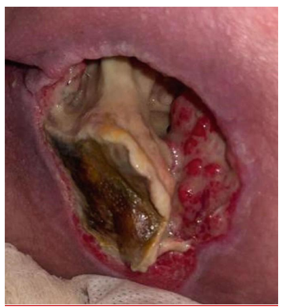

Study summary of Chapter 46 — Pressure Injuries; the book and the full chapter are the reference.

# Chapter 46 Study: Pressure Injuries

## Summary

**Definition & epidemiology**
- PI = localized skin/soft-tissue damage over a bony prominence or device; sacrum and heels are the most common sites (p679).
- **~70%** of PI occur in people **>65y**; prevalence **9–22%** in nursing-home (NH) residents, **5–32%** in hospitalized patients (p679).
- Joint Commission estimate: **2.5 million** US acute-care patients treated for PI/year (p680); separate annual cost estimate **~$27 billion** (2016) (p680).
- Pain: **87%** report pain with dressing changes; only **6%** of those reporting PI pain receive any pain medication (p680).
- When PI is the source of bacteremia, mortality is **48%** (p680).
- Hospital-acquired PI: **11%** in-hospital mortality, **15%** mortality at 30 days post-discharge (p680).
- NH residents: PI unhealed at 6 months → **64%** mortality vs **11%** if healed (p680).

**Pathophysiology**
- 4 mechanisms: direct high-magnitude deformation, capillary-occlusion ischemia, shear-induced ischemia, and reduced tissue tolerance (malnutrition, arterial disease, neuropathy, moisture, prior scar) (p682).
- Muscle cell membranes rupture at **>80%** deformation; **2 h** of strain **>50%** causes irreversible muscle damage (p681).
- Inflammatory/edema changes exist **2–7 days** before visible skin breakdown (preclinical stage) (p681).
- Healed scar tissue retains only **40%** of native tissue tensile strength → higher future PI risk at old sites (p682).

**Risk screening & assessment**
- Movement is the key screen: none developed PI with **>50** spontaneous body movements/night vs **90%** PI with **≤20** movements/night (p682).
- High-risk flags: age **>75y**, age >65 with scheduled surgery **≥3h**, hospital transport time **>1h** (p682); ICU surgery **≥8h** (p683).
- Braden scale scores **six** risk domains (p683).
- Reassessment cadence: acute care every shift; home health weekly ×**4** weeks then every other week; NH weekly ×**4** weeks then quarterly (p683).

**Prevention — repositioning & support surfaces**
- General turning interval **q2–3h** (p683); RCT of **942** NH residents randomized to q2h/q3h/q4h turning (p683) found no significant difference in PI incidence: **2.5%** vs **0.6%** vs **3.1%** (p684).
- Position at **30°** side-lying; chairbound patients repositioned **hourly** (shift weight **q15min**), hip flexion **90°** (p684).
- Standard mattress **4-inch** viscoelastic foam; OR risk = surgery **>3h**, ASA **≥3**, or prone position (p684).
- Prophylactic silicone foam dressings (critical care patients) cut heel PI (**3%** vs **12%**) and sacral PI (**1%** vs **5%**), NNT **10** (p685).
- **Table 46-1** risk-factor–specific interventions: incontinence/moisture → scheduled toileting/prompted voiding if responsive, check-and-change programs otherwise, plus protective creams; friction/shearing → cornstarch/lubricants between surfaces plus footboards; dry skin → gentle cleansers, moisturize, inspect daily, avoid massaging reddened areas (p683).

**Nutrition**
- Malnutrition/weight loss → **fourfold** higher PI risk; oral nutritional supplements → **25%** relative reduction in incidence (modest evidence) (p685).
- Healing targets: **30–35 kcal/kg** calories, **1.3–1.5 g/kg** protein/day; high-energy, high-protein supplements are beneficial, especially with arginine/zinc/antioxidants/micronutrients, when given **>4 weeks** (p692).
- Megestrol acetate (Megace): never shown effective as an appetite stimulant in older/NH patients; has steroidal side effects (p692).

**Staging (NPIAP six-category system)**
- **Stage 1**: intact skin, nonblanchable erythema; reversible in **1–3 weeks** (p686).
- **Stage 2**: partial-thickness, open dermis; should heal in **2–4 weeks** if properly treated (p686).
- **Stage 3**: full-thickness, fat visible, no bone/muscle/tendon exposed (p686).
- **Stage 4**: full-thickness with bone/muscle/tendon/cartilage exposed (p686).
- **Deep tissue PI (DTPI)**: purple/maroon intact skin, appears **~48h** after intense pressure (p686).
- **Unstageable**: full-thickness, depth obscured by slough/eschar (p687).
- Blanchable erythema = discoloration **>1cm** (p686).

**Early (nonvisual) detection**
- Ultrasound detects damage before clinical signs: **~80%** with abnormal images had no documented erythema (p686).
- Thermography: cooler blanchable erythema predicts necrotic ulcer within **7 days**; capacitance devices read in **3–8 seconds** (p686).

**Healing benchmarks & assessment tools**
- Reconsider the treatment plan if no healing signs in **2 weeks** (p689).
- **75%** of stage 2 PI heal within **60 days**; only **17%** of stage 3/4 PI do (p689).
- PUSH tool: **10** wound-size categories, exudate **0–3**, tissue type **0–4** (p689).
- BWAT: **13** characteristics, each scored **1–5**, total range **13–65** (p689).

**Local treatment**
- Saline/water lack antiseptic properties — prefer Dakin's **0.25%** or povidone-iodine (**10%**/**1%** free iodine) on colonized PI, applied **10–15 min** before redressing; lavage **4–15 psi** (p692).
- Moist dressings re-epithelialize up to **40% faster** than wounds left open to air; hydrocolloid/foam changed **q3–5 days**; PI are typically colonized with **≥10⁵** organisms/mL and may carry this load for long periods without clinical signs of infection (p693-694).
- One retrospective study: air-fluidized beds healed fastest: **5.2 cm²/wk** vs **1.5 cm²/wk** (pressure-reduction) vs **1.8 cm²/wk** (low-air-loss) (p692).
- **Table 46-2**: pain-reducing dressing categories are hydrocolloids (p693), plus hydrogels (cooling effect), alginates, and hydrofibers (p694) — composite, transparent-film, wound-filler, and foam dressings list no pain-relief use in the table.

**Debridement**
- **Five** methods: surgical/sharp, mechanical, autolytic, enzymatic, bio-surgical (p695).
- Maggot (bio-surgical) density **5–8/cm²**; complete debridement **80%** vs **48%** with standard care (p696).
- Collagenase (enzymatic): iodine inhibits its activity; as printed, nanocrystalline silver "can be inhibited when used in combination with collagenase" (p696).

**Infection & biofilm**
- **60%** of chronic wounds contain a biofilm (p695).
- Osteomyelitis in **32%** of stage 4 PI; antibiotic course may be **<6 weeks** if infection is limited to cortical bone (p695).
- Surgical repair: complication rate up to **50%**, but **70–80%** healed at discharge; same-site recurrence lower in older patients (**40%**) than younger paraplegics (**>70%**); older-patient surgical mortality **50–68%** (p695).

**Drugs (name — scenario — caution)**
- Oral MSSA/strep: cephalexin, cefadroxil, dicloxacillin, clindamycin. Oral MRSA: clindamycin, amoxicillin+doxycycline, or TMP-SMX (p697).
- Parenteral empiric: cefazolin, ceftriaxone, clindamycin; vancomycin for MRSA; metronidazole/carbapenem/beta-lactamase inhibitor for anaerobes (p697).
- Ground metronidazole on the wound bed for odor when debridement isn't possible; antiseptics in full-thickness PI — cadexomer iodine/silver/honey/PHMB dressings reduce bioburden; mupirocin is effective against MRSA (p697).
- Avoid on clean/healing PI (fibroblast-toxic in vitro): povidone-iodine, iodophor, sodium hypochlorite, hydrogen peroxide, acetic acid (p697).
- EMLA cream (lidocaine **2.5%** + prilocaine **2.5%**) or opioids/NSAIDs **30 min** pre-procedure for severe wound pain (p697); EMLA cut venous-wound pain scores by **21 mm** (p698).

**Palliative care**
- Goal = comfort, not healing; treat odor with topical metronidazole; give analgesia **30–40 min** before repositioning (p698).

**Exam traps / book notes**
- **Currency — declared gap.** The chapter states the NPIAP staging system "was updated in 2016"; later revisions to staging or treatment guidelines are not verified in this chapter (p686).
- **As printed.** Table 46-1's column header reads "PREVENTION INTERVENTONS" (sic, typo in the original) (p683).

## Drill

**1. What are the two most common anatomic sites for a pressure injury?**

Answer

Sacrum and heels (p679).

**2. Approximately what percentage of pressure injuries occur in people older than 65?**

Answer

About 70% (p679).

**3. What is the overall mortality when a pressure injury is the identified source of bacteremia?**

Answer

48% (p680).

**4. What is the single most important risk factor for pressure injury development across all patient populations?**

Answer

Severely restricted mobility/immobility — a necessary condition for PI development (p682).

**5. What degree of tissue deformation consistently ruptures muscle cell membranes?**

Answer

Deformation exceeding 80% (p681).

**6. For how many days can inflammatory/edema changes exist in tissue before pressure damage becomes visible on the skin?**

Answer

2 to 7 days (the preclinical stage) (p681).

**7. What percentage of native tissue tensile strength does healed scar tissue retain?**

Answer

About 40% — so a prior full-thickness PI site is at higher risk for future PI (p682).

**8. In the RCT of 942 nursing home residents, did turning every 2, 3, or 4 hours change PI incidence significantly?**

Answer

No — 2.5% (q2h) vs 0.6% (q3h) vs 3.1% (q4h), not significantly different (p684).

**9. What number needed to treat (NNT) did prophylactic silicone foam dressings show for preventing pressure injury in critical care patients?**

Answer

NNT of 10 (p685).

**10. Despite no trial showing lower PI rates with nutritional supplementation, what relative-reduction figure does the chapter still cite for oral supplements in at-risk patients?**

Answer

25% relative reduction in PI incidence (modest evidence) (p685).

**11. What is the key difference between Stage 3 and Stage 4 pressure injury?**

Answer

Stage 3: full-thickness with fat visible, no exposed bone/muscle/tendon. Stage 4: full-thickness with exposed bone, muscle, tendon, ligament, or cartilage (p686).

**12. What percentage of Stage 2 pressure injuries heal within 60 days, compared to Stage 3/4?**

Answer

75% of Stage 2 vs only 17% of Stage 3/4 (p689).

**13. Why should plain saline or water rarely be used alone to clean an established pressure injury?**

Answer

They have no antiseptic properties, and PI wounds are colonized with bacteria — an antiseptic cleanser (e.g., dilute Dakin's or povidone-iodine) is preferred (p692).

**14. What agent inhibits the activity of collagenase during enzymatic debridement?**

Answer

Iodine (p696).

**15. What oral antibiotic options are recommended for a pressure injury with suspected MRSA infection?**

Answer

Clindamycin, amoxicillin with doxycycline, or trimethoprim-sulfamethoxazole (p697).

### 2026 exam questions for this chapter

The actual exam questions and answer keys as printed in the chapter, reproduced verbatim.

> Question wording is an English rendering of the IMA paper as read from its page image (the Hebrew original is the authority). Keys are from key 899478 (after appeals). The support line is the book's own text, with its printed page; it supports an answer, it is not the key.

**Q7** — sourced to [p. 695–696](#p695). A 75-year-old woman was admitted to a complex nursing-care ward after a prolonged hospitalization for pneumonia, ventilation and a stay in intensive care. On admission to the ward she had a pressure ulcer involving the buttock, 10x9 cm, with abundant necrotic tissue and redness visible around it; see picture no. 1. Laboratory tests show elevated inflammatory markers. Which debridement approach is most recommended for her?

> Description by the builder, not from the paper (checked against the image by the chat lane). Picture no. 1 (IMA image album 885645, published separately from the question paper): a deep open wound with a large band of cream to pale-yellow slough through the middle, brown to olive-green necrotic tissue in the lower left, and red granulation tissue along the right edge and lower rim; the surrounding skin is dusky pink-purple. The photograph cannot settle what the pale central structure is, and the description implies no stage.

- א. Mechanical
- ב. Enzymatic
- ג. Autolytic
- ד. Surgical  ← **key**

> Book: p695: "Clinical practice guidelines on PI treatment recommend wound debridement with surgical or sharp debridement for extensive necrosis or when obtaining a clean wound bed quickly is important". p696: "A PI should be surgically debrided when there is a clinical need for extensive debridement; the degree of undermining and sinus tract or tunneling cannot be determined; there is advancing cellulitis; bone and infected hardware must be removed; and/or the individual is septic from the PI." The stem's abundant necrosis, surrounding redness and raised inflammatory markers match "extensive debridement" and "advancing cellulitis". p696: "Autolytic debridement is contraindicated in the presence of untreated infection or extensive necrotic tissue".

**Q67** — sourced to [p. 697](#p697). An 85-year-old woman is hospitalized in a complex nursing-care ward because of a stage 3 pressure ulcer. Which of the following dressings can relieve pain?

- א. (VAC) NEGATIVE PRESSURE WOUND THERAPY
- ב. A moisture-retaining dressing such as Hydrogel  ← **key**
- ג. A dressing with Povidone Iodine (Polydine)
- ד. A charcoal dressing

> Book: p697: "PI-related pain can be minimized by keeping the wound bed moist and covered." "Use of hydrogels, hydrocolloids, alginates, polymeric membrane foams, and soft silicone dressings allows for less frequent dressing changes, and less trauma and pain on removal as they are nonadherent to the wound bed." Table 46-2 (p694), hydrogels: "Cooling effect can help relieve wound pain". Hydrogels, hydrocolloids, alginates and hydrofibers each list "Reduces pain" among their uses. Charcoal (option 4) appears in Table 46-2 only as a foam variant ("available with surfactant impregnated or charcoal layer"), and the Foams row lists no pain relief among its uses.
