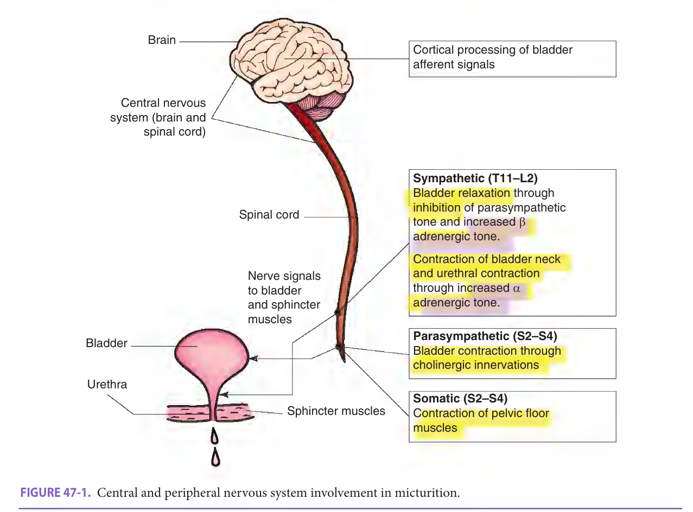
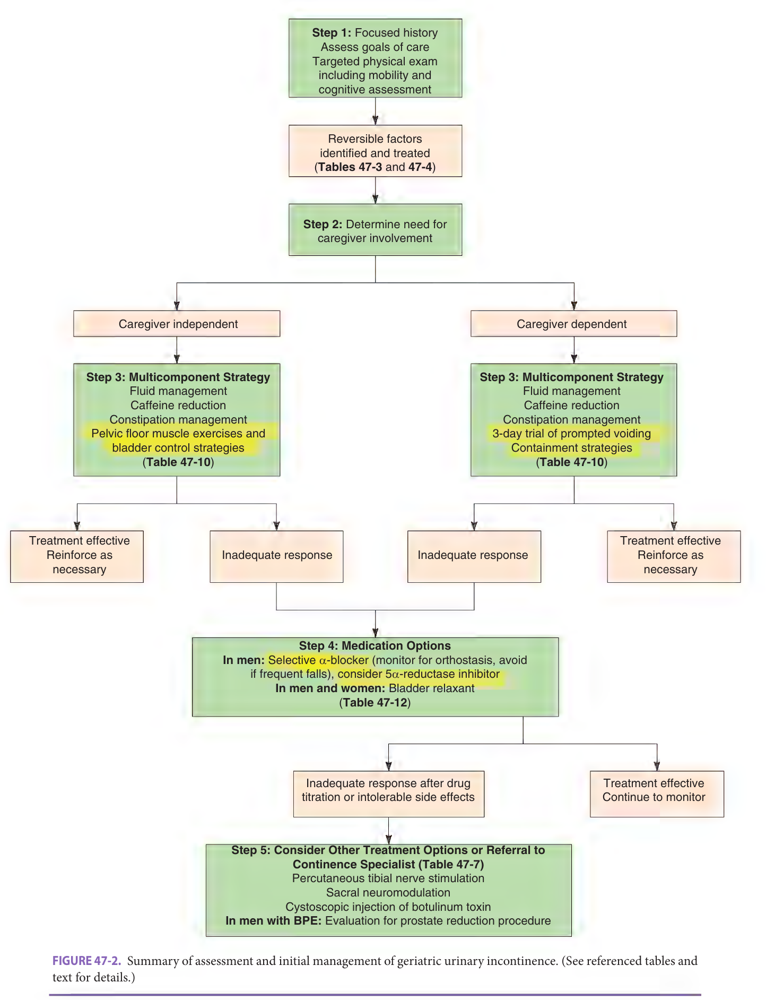
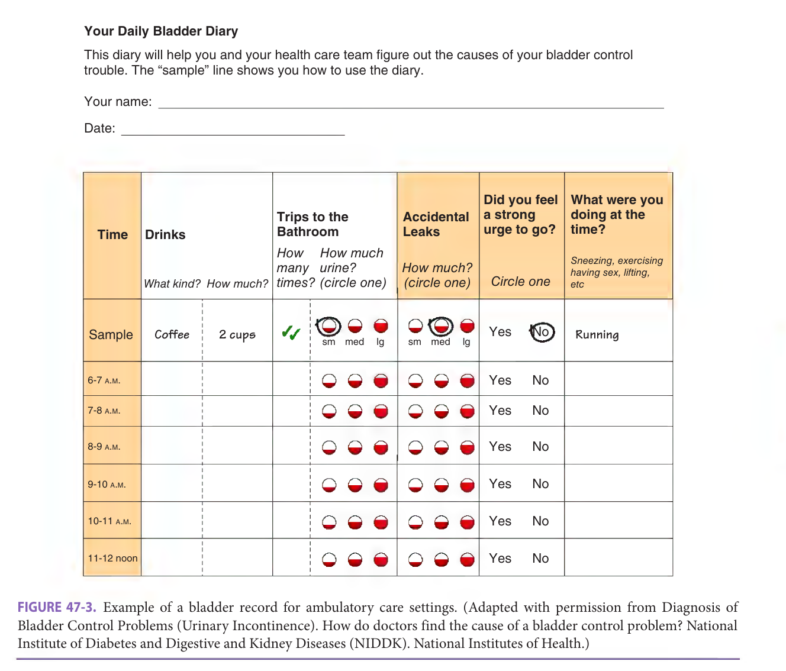
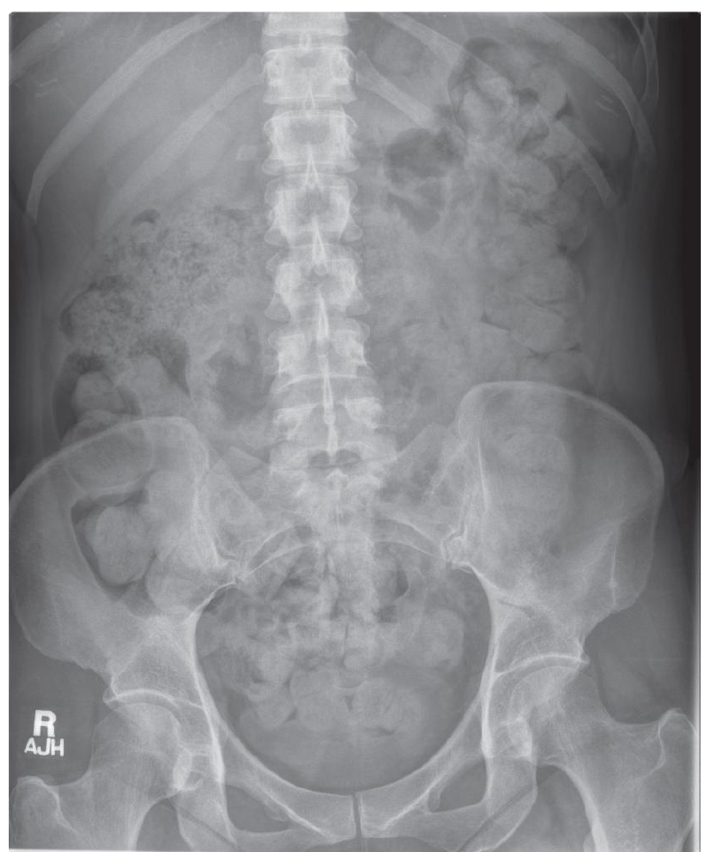

# Hazzard's Geriatric Medicine and Gerontology, 8e — Chapter 47: Incontinence

Camille P. Vaughan, Theodore M. Johnson, II

> **Status (22 Sep 2026).** Cleared by the chat lane and published. The clearance covers the 15 tables against printed pages 700, 702–705, 708–713, 715 and 716; the three figure crops and their captions; the Q17, Q44 and Q64 wording against the question-paper crops and the examiners' reference rows; and the support quotes on pages 701–704, 707 and 716. Not covered by the lane: the answer key (re-read from key 899478 by the build's own check), the p717 sentence and the prose-only pages 699, 714 and 717 (checked by the text-layer guards), and prose italics, which are not yet carried into the reader.

> **Source and method.** Printed pages 699–717 of the 8th edition, from the publisher's own text layer (PDF page = printed + 34). Prose, both boxes, all 15 tables and the three figure captions; the figures (innervation of micturition, the assessment flowchart, the bladder diary) are page images, not transcribed. Checked against an independently typeset copy of the chapter. Page markers are printed page numbers. The two boxes are moved up to follow the opening paragraph.

> **2026 exam.** Three questions of the 2026 specialist sitting were sourced to this chapter: Q17 (p703, Table 47-4), Q44 (pp703–704, Tables 47-4 and 47-5) and Q64 (pp701–702, Table 47-3, with a picture). Their pages are flagged ⟨2026⟩; the questions are at the end.

**[p. 699]**

## Definition And Epidemiology

Defined as the complaint of any involuntary leakage of urine, urinary incontinence is a common and bothersome condition in older adults. Incontinence prevalence increases with age and with increasing frailty, and is 1.3 to 2.0 times greater in older women than older men. Among community-dwelling older women, the prevalence of any urinary incontinence is approximately 35%; among older men, it is approximately 22%. The prevalence of daily urinary incontinence in older community-dwelling persons is approximately 12% for women and 5% for men. The prevalence is higher among nursing home residents approaching 60%. Incontinence ranges in severity from rare episodes of dribbling small amounts of urine to continuous urine leakage with concomitant fecal incontinence. In addition, many older people who do not “leak urine” may have bothersome lower urinary tract symptoms such as urgency, frequency, and nocturia (waking from sleep at night to void) impacting their lives.

#### Learning Objectives

- Identify different types of urinary incontinence based on clinical assessment.
- Describe initial management strategies for incontinence in the older adult, which involve soliciting patient preferences and goals for care.
- Determine when referral to a urologic or gynecologic specialist is indicated.

#### Key Clinical Points

1. Incontinence in the older adult is often the result of potentially reversible and modifiable conditions.
2. Multicomponent interventions, including lifestyle and behavioral therapies, are effective first-line treatments for incontinence in the older adult.
3. Treatment of incontinence in the older adult, particularly drug therapy, should involve consideration of patient preferences and comorbid conditions.

Physical health, psychological well-being, social status, and the costs of health care can all be adversely affected by incontinence. Urinary incontinence can be cured or greatly improved, especially in those who have adequate mobility and mental function. Even when not curable, incontinence can always be managed to improve comfort, reduce caregiver burden, and minimize costs of caring for the condition. Because many older patients are embarrassed to discuss their incontinence unaware that treatment is available, it is essential for providers to periodically ask about incontinence and to note this concern as a problem (Table 47-1). This chapter covers the basic pathophysiology of urinary incontinence in older persons, provides detailed information on the evaluation and management, and briefly addresses fecal incontinence.

## Pathophysiology And Classification

Continence requires effective functioning of the lower urinary tract, adequate cognitive and physical functioning, motivation, and an appropriate environment (Table 47-2). Normal urination is a complex process and the neurophysiology of urination remains incompletely understood. Proper bladder filling and emptying are influenced by higher centers in the brain stem, cerebral cortex, and cerebellum. The brain stem facilitates urination and the cerebral cortex exerts a predominantly inhibitory influence. Additionally, the loss of the suprapontine inhibitory influences over the sacral micturition center from diseases such as stroke and Parkinson disease can produce incontinence in older patients. Even in the absence of specific, overt neurologic lesions, poor bladder control is associated with inadequate activation of the orbitofrontal cortex and white matter hyperintensities (evidence of white matter wasting) in the right inferior frontal cortex. Disorders of the brain stem and lesions rostral to the lumbosacral spinal cord can interfere with the coordination of bladder contraction and urethral relaxation leading to detrusor-sphincter dyssynergia. Interruptions of the sacral innervation can **[p. 700]** cause impaired bladder contraction and problems with continence.

**Table 47-1 — Asking about urinary incontinence**  *(printed 700)*

- Questions about incontinence should be open-ended and phrased in language easily understood by the patient:
    - “Tell me about any problems you are having with your bladder?”
    - “Tell me about any trouble you are having holding your urine (water)?”
- If the responses to the above questions are negative, following up with questions may be helpful:
    - “How often do you lose urine when you don’t want to?”
    - “How often do you wear a pad or other protective device to prevent urinary accidents?”

Adapted with permission from Fantyl JA, Newman DK, Colling J, et al. Urinary Incontinence in Adults: Acute and Chronic Management. Clinical Practice Guideline No. 2, 1996 Update. Rockville, MD: U.S. Dept of Health and Human Services, Public Health Service, Agency for Health Care Policy and Research; 1996. AHCPR publication 96–0682.

**Table 47-2 — Requirements for continence**  *(printed 700)*

- Effective lower urinary tract function
- *Storage*
    - Bladder accommodation with increasing urine volumes while maintaining low pressure
    - Closed bladder outlet
    - Appropriate sensation of bladder fullness
    - Absence of involuntary bladder contractions
- *Emptying*
    - Bladder capable of contraction
    - Lack of anatomic obstruction to urine flow
    - Coordinated lowering of outlet resistance with bladder contractions
- Adequate mobility and dexterity to use toilet
- Adequate cognitive function to recognize toileting needs
- Motivation to be continent
- Absence of environmental and iatrogenic barriers

Reproduced with permission from Kane RL, Ouslander JG, Resnick B, et al. Essentials of Clinical Geriatrics. 8th ed. New York, NY: McGraw Hill; 2018.

> *FIGURE 47-1. Central and peripheral nervous system involvement in micturition.*

> Highlighting is the owner's annotation, not the book's.

At the most basic level, urination is governed by a reflex in the sacral spinal cord. During normal bladder filling, afferent pathways (via somatic and autonomic nerves) carry information regarding bladder volume to the spinal cord. Motor output is adjusted accordingly (Figure 47-1). Sympathetic tone closes the bladder neck and inhibits parasympathetic tone (thus relaxing the dome of the bladder); somatic innervation maintains tone in the pelvic floor musculature (including striated muscle around the urethra). Voluntary pelvic floor muscle contracture also leads to inhibition of parasympathetic tone. For bladder emptying, sympathetic and somatic tones diminish, and parasympathetic, cholinergic-mediated impulses cause **[p. 701]** ⟨2026: Q64⟩ the bladder to contract. Normal urination is a dynamic process, requiring the coordination of several physiologic processes. Under normal circumstances, as the bladder fills, bladder pressure remains low (≤ 15 cm H₂O). The bladder volume at first urge to void is variable, but generally occurs at between 150 and 350 mL; normal bladder capacity is 300 to 600 mL. When normal urination is initiated (usually every 3 to 4 hours during wakefulness), the detrusor contracts and detrusor pressure increases until it exceeds urethral resistance (which lowers immediately prior to bladder contraction). Urine flow occurs typically over less than 2 minutes. If at any time during bladder filling, total bladder pressure exceeds outlet resistance, urinary leakage occurs. Transmitted intra-abdominal pressure alone by coughing or sneezing may cause leakage in someone with low outlet resistance pressure or urethral sphincter weakness. Alternatively, the bladder can contract involuntarily and cause urinary leakage.

### Risk Factors

As is the case for a number of other common geriatric problems, multiple disorders often interact to cause urinary incontinence. Determining the cause or causes facilitates proper management.

Several age-related changes can contribute to the development of urinary incontinence. In general, postvoid residual (PVR) urine volume is greater with increasing age. Reduced functional bladder capacity has been associated with advanced age, yet this may be due to the higher prevalence of involuntary bladder contractions and detrusor overactivity in older persons. Involuntary bladder contractions are found in 40% to 75% of older incontinent patients, but also in 5% to 10% of older continent women and in up to one-third of older men with no or minimal urinary symptoms. Detrusor overactivity has been associated with specific anatomical findings (protrusion junctions and ultra-close abutment of detrusor muscle cells) on bladder biopsy and with evidence of cortical changes, which suggests impaired integration of bladder afferent signals. While involuntary bladder contractions do not always result in urinary incontinence, when combined with impaired mobility, these contractions likely account for a substantial proportion of incontinence in older functionally disabled patients. Aging in women is also associated with a decline in bladder outlet and urethral resistance pressure. While prior childbirths (either via vaginal deliveries or Caesarean section) are associated with a greater risk of future incontinence, this association is weaker for women older than 65 years. Additionally, in older populations, poor vaginal support is more closely associated with obstructive urinary symptoms than with urinary leakage and urgency. Obesity, deconditioned muscles, and hysterectomy predispose women to future development of incontinence. White women are more likely, as a group, to have stress urinary incontinence than women of other racial or ethnic groups. Oral estrogen therapy has also been identified as a risk factor for subsequent development of urinary incontinence in women.

Older men with prostatic enlargement may have decreased urine flow rates and detrusor muscle instability. Aging is also associated with more frequent nocturia, which may in part be related to higher urine production at night. Many older men and women have detrusor hyperactivity combined with poor bladder contractility (which has been termed “*detrusor hyperactivity with impaired contractility”*). These individuals have evidence of widespread muscle degeneration on detrusor muscle biopsy.

### Acute or Reversible Causes

The difference between acute (or reversible) forms of incontinence and persistent (or established) incontinence is clinically meaningful although not always distinct. *Acute incontinence* refers to those situations where the incontinence is of sudden onset, usually linked to an acute illness or an iatrogenic problem, and subsides once the illness or problem has been resolved. *Persistent incontinence* refers to incontinence that is not precipitated by an acute illness and endures over time. Reversible factors related to acute incontinence may also contribute to persistent incontinence.

The potentially reversible causes of urinary incontinence are outlined in Table 47-3. These causes include impaired ability (or reduced willingness) to reach a toilet, conditions that affect the lower urinary tract, such as an infection, atrophic vaginitis, or surgical procedure, conditions that cause or contribute to polyuria, and iatrogenic factors. Because of urinary frequency and urgency, many older persons, especially those limited in mobility, carefully arrange their schedules (and may even limit social activities) in order to be close to a toilet. Thus, an acute illness can precipitate incontinence by disrupting this delicate balance. Hospitalization, with its attendant environmental barriers (such as catheters, tubes, lines, and bedside rails), and the delirium and immobility that often accompany acute illnesses in older patients can contribute to acute incontinence. Acute incontinence in these situations is likely to resolve with resolution of the underlying acute illness. In a substantial proportion of patients, incontinence may persist for several weeks after hospitalization and should be further evaluated.

Constipation and resultant fecal impaction are common in both acutely and chronically ill older patients. Impaction may cause mechanical distension of the bladder and outlet impingement that can interfere with adequate bladder emptying and cause reflex bladder contractions. Relief of a fecal impaction and effective treatment of constipation can lead to resolution of urinary, as well as fecal, incontinence (see Chapter 87, Constipation).

An elevated PVR should be considered in any older patient who suddenly develops urinary incontinence. In addition to fecal impaction, causes of incontinence with a high PVR in an older patient include immobility; anticholinergic, narcotic, calcium channel blocking, and **[p. 702]** ⟨2026: Q64 (Table 47-3)⟩ beta-adrenergic medications (Table 47-4). In addition, urinary retention may be an acute manifestation of an underlying CNS process (eg, spinal cord compression or stroke).

Inflammation of the lower urinary tract may precipitate or exacerbate incontinence. Atrophic vaginitis and urethritis are common among older women (part of genitourinary syndrome of menopause), which can result in dysuria, urgency, frequency, and even incontinence (see Chapter 36, Gynecologic Disorders). Physical signs include patchy erythema and increased vascularity of the labia minora and vaginal epithelium, petechiae and friability, and urethral erythema often with an inflamed caruncle (dark or bright red epithelium usually at the inferior aspect of the urethra). Topical estrogen therapy may be helpful in older women with these findings (discussed further later in chapter). Acute urinary tract infection can precipitate or exacerbate incontinence. However, urine loss among older patients with *chronic* incontinence, especially frail nursing home residents, with otherwise asymptomatic bacteriuria (with or without pyuria) does not appear to improve with bacteriuria treatment. These patients, therefore, should not be treated with antibiotics because of the costs and risks unless the incontinence is new or acutely worsened.

**Table 47-3 — Reversible conditions that cause or contribute to urinary incontinence in older persons**  *(printed 702)*

| Condition | Management |
|---|---|
| Conditions affecting the lower urinary tract |  |
| &nbsp;&nbsp;&nbsp;&nbsp;Urinary tract infection (symptomatic with frequency, urgency, dysuria, etc.) | Antimicrobial therapy (not for asymptomatic bacteriuria) |
| &nbsp;&nbsp;&nbsp;&nbsp;Atrophic vaginitis/urethritis | Topical estrogen |
| &nbsp;&nbsp;&nbsp;&nbsp;Postprostatectomy (incontinence will often resolve during first year) | Exercise-based behavioral interventions; avoid further surgical therapy during first year until it is clear condition will not resolve |
| &nbsp;&nbsp;&nbsp;&nbsp;Stool impaction | Disimpaction; appropriate use of bulk-forming agents and laxatives if necessary; implement high fiber intake, adequate mobility, and fluid intake |
| Drug side effects (see **Table 47-4**) | Discontinue or change therapy if clinically appropriate. Dosage reduction or modification (eg, flexible scheduling of rapid-acting diuretics) may also help |
| Increased urine production |  |
| &nbsp;&nbsp;&nbsp;&nbsp;Metabolic (hyperglycemia, hypercalcemia) | Better control of diabetes mellitus; therapy for hypercalcemia depends on underlying cause |
| &nbsp;&nbsp;&nbsp;&nbsp;Excess fluid intake | Reduction in intake of total fluids or diuretic fluids (eg, caffeinated or alcoholic beverages) |
| &nbsp;&nbsp;&nbsp;&nbsp;Volume overload | Diuretic therapy (may also increase risk of incontinence) |
| &nbsp;&nbsp;&nbsp;&nbsp;Venous insufficiency with edema | Peripheral compression stocking Leg elevation Sodium restriction Diuretic therapy (may also increase risk of incontinence) |
| Congestive heart failure | Medical therapy |
| Impaired ability or willingness to reach a toilet | Assistance and/or environmental modifications; prompted voiding, as appropriate |
| Delirium | Diagnosis and treatment of underlying cause(s) delirium (see Chapter 58) |
| Chronic illness, injury, or restraint that interferes with mobility | Regular toileting Use of toilet substitutes Environmental alterations (eg, bedside commode, urinal) |
| Psychological | Remove restraints if possible Appropriate pharmacologic and/or nonpharmacologic treatment |

Reproduced with permission from Kane RL, Ouslander JG, Resnick B, et al. Essentials of Clinical Geriatrics, 8th ed. New York, NY: McGraw Hill; 2018.

Diuretics (especially rapid-acting loop diuretics) and conditions that cause polyuria, including hyperglycemia and hypercalcemia, can precipitate acute incontinence. Patients with volume-expanded states, such as those with congestive heart failure and lower extremity venous insufficiency, may have polyuria at night, which can contribute to nocturia and nocturnal incontinence. As is the case in many other conditions in geriatric patients, a wide variety of medications can play a role in the development of incontinence in older adults (see Table 47-4). When feasible, stopping the medication, switching to an alternative, or modifying the dosage schedule can be beneficial and may be the only necessary treatment for incontinence. In addition **[p. 703]** ⟨2026: Q17 (Table 47-4), Q44 (Table 47-4)⟩ to medications, drinking multiple caffeinated or alcoholic beverages can cause urinary frequency and urgency, which may precipitate incontinence.

### Persistent Incontinence

Table 47-5 lists the clinical definitions and common causes of persistent urinary incontinence. These types can overlap with each other, and an individual patient may have more than one type simultaneously. Incontinence results from one or a combination of two basic abnormalities:

1. Failure to properly store urine, caused by a hyperactive or poorly compliant bladder or by diminished outflow resistance; and/or

2. Failure to properly empty the bladder, caused by a poorly contractile bladder or by increased outflow resistance.

*Stress incontinence* is common in older women, especially in ambulatory clinic settings. The symptoms of stress incontinence are very specific: leakage coincident with increases in intra-abdominal pressure caused by coughing, sneezing, laughing, or exercising. Stress incontinence may be infrequent and involve very small amounts of urine. It may need no specific treatment in women who are not bothered by it; on the other hand, it may be so severe and/or bothersome that it renders the person housebound. Among women, it is most often associated with weakened supporting tissues, resulting in hypermobility of the bladder outlet and urethra and caused by lack of estrogen, obesity, previous vaginal deliveries, and/or surgery. Some women, generally those who have had previous lower urinary tract surgery, have intrinsic urethral weakness with failure of the urethra to fully close and prevent urine loss. These patients tend to have severe incontinence and occasionally have constant wetting. Stress incontinence is unusual in men, and it mainly occurs following transurethral interventions for benign prostatic conditions or after surgical or radiation therapy for lower urinary tract malignancy when the anatomic sphincters are damaged.

*Urgency incontinence* can be caused by a variety of lower genitourinary and neurologic disorders (see Table 47-5). This type of incontinence is characterized by a sudden strong desire to void, accompanied by a fear of leakage, and followed by urine loss. The amount of urine lost can be large but varies depending on sphincter function and the ability of the patient to abort a bladder contraction. Urgency incontinence, when it occurs along with urinary urgency, daytime urinary frequency, and nocturia, has been called “*wet* overactive bladder.” Urgency incontinence is most often, but not always, associated with involuntary bladder contractions. Some patients have a poorly compliant bladder without involuntary contractions (eg, interstitial cystitis or following irradiation). A subgroup of older incontinent patients with detrusor hyperactivity also have impaired bladder contractility, emptying less than one-third of their bladder volume with involuntary contractions on urodynamic testing. These patients may be predisposed to significant urinary retention and may require training to learn to completely empty their bladder with voiding.

**Table 47-4 — Medications that can potentially affect continence**  *(printed 703)*

| Type of medication | Potential effects on continence |
|---|---|
| Diuretics | Polyuria, frequency, urgency |
| Anticholinergics | Urinary retention, overflow incontinence, stool impaction |
| Psychotropics |  |
| &nbsp;&nbsp;&nbsp;&nbsp;Antidepressants | Anticholinergic actions, sedation |
| &nbsp;&nbsp;&nbsp;&nbsp;Antipsychotics | Anticholinergic actions, sedation, immobility |
| &nbsp;&nbsp;&nbsp;&nbsp;Sedative–hypnotics | Sedation, delirium, immobility, urethral relaxation |
| Narcotic analgesics | Urinary retention, fecal impaction, sedation, delirium |
| Alpha adrenergic blockers | Urethral relaxation |
| Alpha adrenergic agonists | Urinary retention |
| Cholinesterase inhibitors | Urinary frequency, urgency |
| Angiotensin-converting enzyme inhibitors | Cough precipitating stress incontinence |
| Beta adrenergic agonists | Rarely may contribute to urinary retention |
| Calcium channel blockers | May contribute to urinary retention, edema (nocturia) |
| Gabapentin, pregabalin, glitazones | Edema (nocturia) |
| Alcohol | Polyuria, frequency, urgency, sedation, delirium, immobility |
| Caffeine | Polyuria, bladder irritation |

Reproduced with permission from Kane RL, Ouslander JG, Resnick B, et al. Essentials of Clinical Geriatrics. 8th ed. New York, NY: McGraw Hill; 2018.

The use of the term “overflow incontinence” has come in and out of favor, but related terms such as *acute* or *chronic urinary retention* and (either stress or urge) *incontinence with a high PVR* are also common. *Acute retention of urine* is “a painful, palpable or percussable bladder, when the patient is unable to pass any urine”; and *chronic retention of urine* is where the patient has a “non-painful bladder, which remains palpable or percussable after the patient has passed urine... (and) the patient may be incontinent.” A high PVR can result from anatomic or neurogenic obstruction to urinary outflow, a hypotonic or acontractile bladder, or both. Prostatic enlargement, diabetic neuropathic bladder, and urethral stricture commonly cause urinary symptoms and may occasionally cause incontinence. Low spinal cord injury and anatomic obstruction in women (caused by pelvic prolapse and urethral distortion) are less common causes of overflow incontinence in older patients. Several types of drugs also can contribute to this type of persistent incontinence (see Table 47-4). Some patients with lesions **[p. 704]** ⟨2026: Q44 (Table 47-5)⟩ rostral to the lumbosacral spinal cord lesions (such as multiple sclerosis) develop detrusor–sphincter dyssynergia and consequent urinary retention, which must be treated similarly to overflow incontinence; in some instances, a sphincterotomy is necessary.

*Functional incontinence* results when an older person is unable to reach a toilet on time due to impaired cognitive function and/or mobility. Recognizing and removing barriers to continence, such as inaccessible toilets and psychological disorders, is critical. These factors also exacerbate other types of persistent incontinence. Patients with functional factors contributing to incontinence also may have abnormalities of the lower genitourinary tract, most commonly detrusor overactivity. In some patients, it can be very difficult to determine whether the functional factors or the genitourinary factors predominate without a trial of specific types of treatment.

Many older patients have more than one type of incontinence. Most common are the combination of urgency and stress incontinence (often called *mixed incontinence*) among older women as well as the combination of urge and functional incontinence among nursing home residents.

In addition, many older patients have a syndrome of “*overactive bladder*,” where urinary urgency is present sometimes with urinary symptoms such as frequency, and nocturia, and may or may not be continent. These patients should be assessed and treated similar to patients with symptoms of urgency incontinence.

## Evaluation

Guidelines recommend a basic diagnostic evaluation, which includes a history (which can be enhanced by a bladder diary record), a physical examination, and a urinalysis. A PVR may not be needed in all older patients with incontinence, but reasonably should be done for patients at risk for urinary retention (see below). Other diagnostic studies may be indicated in selected patients (Table 47-6). Figure 47-2 summarizes the recommended diagnostic evaluation of incontinent older patients.

The objectives of the basic evaluation are threefold:

1. To identify potentially reversible conditions potentially contributing to incontinence (see Table 47-3).

2. To identify conditions requiring further diagnostic tests and/or gynecologic or urologic referral.

3. To develop a management plan, which may include referral for further evaluation or a therapeutic trial of behavioral and/or pharmacologic therapy.

**Table 47-5 — Basic types and causes of persistent urinary incontinence**  *(printed 704)*

| Type | Definition | Common causes |
|---|---|---|
| Stress | Involuntary loss of urine (usually small amounts) with increases in intra-abdominal pressure (eg, cough, laugh, exercise) | Weakness of pelvic floor musculature and urethral hypermobility Bladder outlet or urethral sphincter weakness Postprostatectomy sphincter weakness |
| Urgency | Leakage of urine (variable but often larger volumes) because of inability to delay voiding after sensation of bladder fullness is perceived | Detrusor hyperactivity, isolated or associated with one or more of the following: Local genitourinary condition such as tumors, stones, diverticuli, or outflow obstruction Central nervous system disorders such as stroke, dementia, parkinsonism, spinal cord injury, multiple sclerosis |
| Mixed (stress and urgency) | Combination of above |  |
| Functional | Urinary accidents associated with inability to toilet because of impairment of cognitive and/or physical functioning, psychological unwillingness, or environmental barriers | Severe dementia and other neurological disorders Psychological factors such as depression and hostility |
| High postvoid residual (formerly referred to as “overflow”) | Leakage of urine (usually small amounts) resulting from either mechanical forces on an overdistended bladder resulting in stress leakage or from other effects of urinary retention on bladder and sphincter function contributing to urge leakage | Anatomic obstruction by prostate, urethral stricture, severe cystocele Acontractile bladder associated with diabetes mellitus or spinal cord injury Neurogenic (detrusor–sphincter dyssynergy), associated with multiple sclerosis and other suprasacral spinal cord lesions Medication effect (see **Table 47-4**) |

Reproduced with permission from Kane RL, Ouslander JG, Resnick B, et al. Essentials of Clinical Geriatrics. 8th ed. New York, NY: McGraw Hill; 2018.

In patients with recent or sudden onset of incontinence (especially when following an acute medical **[p. 705]** condition and/or hospitalization), the potentially reversible causes of acute incontinence (see Table 47-3) should be ruled out by a brief history, a physical examination, and basic laboratory studies including urinalysis, culture, and tests for serum glucose or calcium, if indicated.

The history should focus on characteristics of the incontinence, including current problems and medications, and on the impact of the incontinence on the patient and caregivers. The incontinence should be characterized in terms of frequency, amount, and timing of leakage; and symptoms of voiding difficulty including hesitancy, intermittent stream, and straining to void. Symptoms of urgency versus stress incontinence should be sought, recognizing that symptom history does not perfectly predict subtype of urinary incontinence. For those with nocturia, or nocturnal incontinence, questions regarding sedating medications and/or sleep dysfunction are indicated. Bladder diary records, such as the one shown in Figure 47-3, can be helpful in characterizing symptoms, as well as in following the response to treatment. The physical examination includes abdominal, rectal, and genital examinations, as well as an evaluation of lumbosacral innervation. The abdominal examination is insensitive for an elevated PVR or chronic urinary retention, but gross bladder distention (eg, ≥ 500 mL) should be easily detected. In acute urinary retention, the distended bladder is a firm, midline mass that emanates from the pelvis and is dull to percussion. In gross distention with either acute or chronic retention, the superior margin of the bladder is often identifiable by either palpation or percussion.

The pelvic examination in women includes inspection for significant prolapse, signs of vaginal tissue inflammation, and a cough test to detect stress incontinence. The *cough stress test* can corroborate stress urinary incontinence (UI) symptoms and can be performed with the patient standing or in the lithotomy position. Sensitivity is highest when the patient is standing. The patient should have a comfortably full bladder at approximately half-capacity (200 mL) and is instructed to cough vigorously once (followed by three additional coughs, if negative). It is insensitive if the patient cannot cooperate, is inhibited, or the bladder volume is low. Leakage simultaneously with coughing documents stress incontinence; delayed leakage (eg, after 3 seconds) or the initiation of voiding generally indicates a cough-induced bladder contraction.

Special attention should be given to assessing mobility and mental status, because impairments may be either causing the incontinence or interacting with urologic and neurologic disorders to worsen the condition. Patients with nocturia or nocturnal incontinence should be examined for signs of congestive heart failure or venous insufficiency with edema.

Urinalysis should be performed to look for evidence of infection, hematuria, and glucosuria. Clean urine specimens are often difficult to obtain from frail incontinent patients, but can be performed reliably without first resorting to in-and-out catheterization. For men who cannot void spontaneously, a condom-type catheter can be used after cleaning the penis to collect a specimen that accurately reflects bladder urine. While there is a clear relationship between acute symptomatic urinary tract infection and incontinence, the relationship between asymptomatic bacteriuria and incontinence is controversial. In nursing home populations, there is no benefit to treating bacteriuria in patients with chronic, stable incontinence. For patients in other settings, it is difficult to make clear recommendations. For the initial evaluation of incontinence among noninstitutionalized incontinent patients, it is reasonable to initially eradicate the bacteriuria to observe the effect on the incontinence.

**Table 47-6 — Components of the diagnostic evaluation of persistent urinary incontinenceᵃ**  *(printed 705)*

- *All Patients*
    - Focused history (a bladder diary record may be helpful in some patients)
    - Targeted physical examination
    - Urinalysis
    - Postvoid residual determinationᵇ
- *Selected Patients*
    - Laboratory studies
        - Urine culture
        - Urine cytology
        - Blood glucose, calcium
        - Renal function tests
    - Renal and/or bladder ultrasound
    - Gynecologic evaluation
    - Urologic evaluation
    - Cystourethroscopy
    - Urodynamic tests
        - Simple
            - Observation of voiding
            - Standing cough test for stress incontinence
            - Simple (single channel) cystometry
            - Urine flowmetry (for men)
        - Complex
            - Multichannel cystometrogram
            - Pressure-flow study
            - Leak point pressure
            - Urethral pressure profilometry
            - Sphincter electromyography
            - Videourodynamics

ᵃSee also Table 47-7. ᵇThe recommendation for a postvoid residual determination in all incontinent elderly patients is controversial (see text). Reproduced with permission from Kane RL, Ouslander JG, Resnick B, et al. Essentials of Clinical Geriatrics. 8th ed. New York, NY: McGraw Hill; 2018.

A determination of PVR should be performed in patients at risk for retention, including those with diabetes with neuropathy, neurologic disorders, symptoms of

**[p. 706]**

> *FIGURE 47-2. Summary of assessment and initial management of geriatric urinary incontinence. (See referenced tables and text for details.)*

> Figure 47-2 is a flowchart; shown as an image, not transcribed.

> Highlighting is the owner's annotation, not the book's.

**[p. 707]**

*(The paragraph above, from p. 705, runs on here; p. 706 carries only Figure 47-2.)*

voiding difficulty, or a history of urinary retention, and those taking medications with significant anticholinergic effects. Neither the history nor the physical examination is sensitive or specific enough for this purpose in geriatric patients. In these patients the PVR determination can be done by portable ultrasonography if equipment is available. To be accurate, the PVR determination should be done within a few minutes of a spontaneous continent or incontinent void. PVR values of less than 100 mL in the absence of straining to void generally reflect adequate bladder emptying in geriatric patients, whereas PVR values greater than 200 mL are abnormal. Values between 100 mL and 200 mL must be interpreted in the context of other patient symptoms. Noninvasive measurement of urinary flow rate in men may be helpful in identifying obstruction and/or bladder contractility problems.

Clinical practice guidelines do not recommend a complex urologic, gynecologic, or urodynamic evaluation for all incontinent older patients. Many patients can be treated with a trial of behavioral and/or drug therapy after a basic evaluation is completed and potentially reversible factors are addressed. Table 47-7 lists examples of criteria for referring incontinent geriatric patients for further urologic, gynecologic, and/or urodynamic evaluations.

## Management

Several therapeutic modalities are used in managing incontinent patients (Table 47-8). Special attention should be paid to the management of acute incontinence, which is common in older patients in acute care hospitals or nursing homes. Unfortunately, older incontinent patients may be managed in the acute hospital setting with indwelling catheterization. Rarely, this is justified by hemodynamic instability and the hourly need to assess urine output during the acute phase of an illness, yet often it is unnecessary. This practice poses a substantial and unwarranted risk of catheter-induced infection and interferes with mobility. Widespread use of quality indicators may reduce the frequency of these practices. Although time-consuming and more difficult, making toilets and toilet substitutes accessible and combining this accessibility with some form of scheduled toileting is a more appropriate approach. Indwelling catheters may be appropriate in the palliative setting at end of life. All the factors that can cause or contribute to a reversible form of incontinence (see Table 47-3) should be attended to in order to maximize the potential for regaining continence.

> *FIGURE 47-3. Example of a bladder record for ambulatory care settings. (Adapted with permission from Diagnosis of Bladder Control Problems (Urinary Incontinence). How do doctors find the cause of a bladder control problem? National Institute of Diabetes and Digestive and Kidney Diseases (NIDDK). National Institutes of Health.)*

> Figure 47-3 (bladder diary) is a form; shown as an image, not transcribed.

Management should be guided by the type of incontinence, and more importantly by patient and/or family **[p. 708]** preferences. Patients should be carefully questioned about the degree of bother the incontinence is causing and how much risk and cost they are willing to undertake to address it. Supportive measures are critical in managing all forms of incontinence and should be used in conjunction with other, more specific treatment modalities. Education, environmental manipulations, appropriate use of toilet substitutes, avoidance of iatrogenic contributions to incontinence, modifications of diuretic and fluid intake patterns (especially caffeine), treatment of constipation, and good skin care are all important. Additionally, in women there is evidence that modest weight loss (approximately 5%–10% of body weight) leads to reduction in urinary incontinence episodes.

Specially designed incontinence undergarments and pads can be very helpful in many patients, but they must be used appropriately. Although they can be effective, several caveats should be raised:

1. Garments, external devices, and pads are a nonspecific treatment.

2. Many patients are curable if treated with specific therapies, and some have potentially serious factors underlying their incontinence that must be diagnosed and treated.

3. Patients often prefer more specific incontinence therapy designed to restore a normal pattern of voiding and continence.

4. Incontinence devices, garments, and pads are expensive and rarely covered by third-party payers.

To a large extent, the optimal treatment of persistent incontinence depends on identifying the type or types. Table 47-9 outlines the primary treatments for the basic types of persistent incontinence in the geriatric population. Each treatment modality is briefly discussed below.

### Behavioral Interventions

**Table 47-7 — Examples of criteria for referral of incontinent geriatric patients for further urologic, gynecologic, or urodynamic evaluation**  *(printed 708)*

| Criteria | Definition | Rationale |
|---|---|---|
| *History* |  |  |
| Recent history of lower urinary tract or pelvic surgery or irradiation | Surgery or irradiation involving the pelvic area or lower urinary tract within the past 6–12 months | A structural abnormality relating to the recent procedure should be sought |
| Recurrent symptomatic urinary tract infections | Two or more symptomatic episodes in a 12-month period | A structural abnormality or pathologic condition in the urinary tract predisposing to infection should be excluded |
| *Physical Examination* |  |  |
| Marked pelvic prolapse | A prominent cystocele that descends the entire height of the vaginal vault with coughing during speculum examination | Anatomic abnormality may underlie the pathophysiology of the incontinence, and selected patients may benefit from surgical repair |
| Marked prostatic enlargement and/or suspicion of cancer | Gross enlargement of the prostate on digital examination; prominent induration or asymmetry of the lobes | An evaluation to exclude prostate cancer may be appropriate |
| *Postvoid Residual* |  |  |
| Difficulty passing a 14-French straight catheter | Impossible catheter passage, or passage requiring considerable force or a large, rigid catheter | Anatomic blockage of the urethra or bladder neck may be present |
| Postvoid residual volume ≥ 200 mL | Volume of urine remaining in the bladder within a few minutes after the patient voids spontaneously in as normal a fashion as possible | Anatomic or neurogenic obstruction or poor bladder contractility may be present |
| *Urinalysis* |  |  |
| Hematuria | Greater than or equal to 3 red blood cells per high-power field on microscopic examination in the absence of infection | A pathologic condition in the upper urinary tract, bladder, or urethra should be excluded |
| *Therapeutic Trial* |  |  |
| Failure to respond to adequate trials of behavioral and/or pharmacologic therapy | Persistent symptoms that are bothersome to the patient after adequate trials of behavioral and/or drug therapy | Urodynamic evaluation may help guide specific therapy |

Reproduced with permission from Kane RL, Ouslander JG, Resnick B, et al. Essentials of Clinical Geriatrics. 8th ed. New York, NY: McGraw Hill; 2018.

Many types of behavioral interventions are available for the management of urinary incontinence. These may be categorized as patient dependent (ie, require adequate **[p. 709]** function and motivation of the patient), in which the goal is to restore a normal pattern of voiding and continence, or caregiver dependent, which can be used for functionally disabled patients, in which the goal is to keep the patient and the environment dry. Table 47-10 summarizes these interventions. The patient-dependent interventions generally involve the patient’s continuous, self-monitoring use of a bladder diary record such as the one depicted in Figure 47-3. In several studies, behavioral therapies are equivalent to drug therapy, with approximately three-fourths of patients reporting improvement. Frequently, these behavioral interventions are the preferred treatment modality by patients.

**Table 47-8 — Treatment options for urinary incontinence in older adults**  *(printed 709)*

- *Behavioral Interventions* (see **Table 47-10**)
- Patient-dependent
    - Pelvic muscle exercises
    - Bladder training
    - Bladder retraining
    - Adjunctive techniques
        - Biofeedback
        - Electrical stimulation
    - Weight loss
- Caregiver-dependent
    - Scheduled toileting
    - Habit training
    - Prompted voiding
- *Drugs* (see **Table 47-12**)
- Bladder relaxants
- Alpha agonists
- Alpha antagonists
- Topical estrogen
- *Surgery or Procedure Based*
- Bladder neck suspension (retropubic suspension or sling procedure)
- Removal of obstruction or pathologic lesion
- Sacral neuromodulation
- Percutaneous tibial nerve stimulation
- Periurethral injections
- Botulinumtoxin A cystoscopic injections
- *Mechanical Devices*
- Urethral plugs (female only)
- Artificial sphincters
- External penile clamps
- *Nonspecific Supportive Measures*
- Education
- Modifications of medication intake
- Avoid caffeine and alcohol
- Use of toilet substitutes
- Environmental manipulations
- Garments and pads
- *Catheters*
- External
- Intermittent
- Indwelling

Adapted with permission from Kane RL, Ouslander JG, Resnick B, et al. Essentials of Clinical Geriatrics. 8th ed. New York, NY: McGraw Hill; 2018.

**Table 47-9 — Primary treatments for different types of geriatric urinary incontinence**  *(printed 709)*

| Type of incontinence | Primary treatments |
|---|---|
| Stress | Pelvic muscle (Kegel) exercises Other behavioral interventions Alpha adrenergic agonists (none are FDA indicated for such use in the United States) Periurethral injections Surgical bladder neck suspension |
| Urgency | Bladder training Bladder relaxants Topical estrogen (if atrophic vaginitis present) In men: Alpha antagonists |
| Functional | Behavioral interventions (caregiver dependent) Environmental manipulations Incontinence undergarments and pads |
| High postvoid residual | Surgical removal of obstruction Intermittent catheterization (if practical) Indwelling catheterization |

Reproduced with permission from Kane RL, Ouslander JG, Resnick B, et al. Essentials of Clinical Geriatrics. 8th ed. New York, NY: McGraw Hill; 2018.

To be successful, patient-dependent interventions require a functional, motivated patient capable of learning and practice. These interventions also require a skilled, enthusiastic trainer and frequent patient contact, though positive results can be achieved by motivated patients who are self-directing their behavioral treatment following brief consultation with a provider or through assistance of a pamphlet or book. Pelvic floor muscle (Kegel) exercises are effective in men and women for the treatment of urge, stress, mixed stress–urge incontinence, and incontinence following prostatectomy. These exercises consist of repetitive contractions of the pelvic floor muscles. These exercises can be taught by brief verbal or written instructions, or instruction provided by having a patient squeeze the examiner’s inserted finger during a vaginal or rectal examination (without doing a Valsalva maneuver, which is opposite of the intended effect). Once learned, the exercises should be practiced many times throughout the day (eg, three sets daily of 15 contractions building up from 3 seconds to 10 seconds in duration). Computer-assisted or manual biofeedback can be especially helpful for teaching patients who bear down (increasing intra-abdominal pressure) when attempting to contract pelvic floor muscles. **[p. 710]** Biofeedback involves the use of bladder, rectal, or vaginal pressure or electrical activity recordings, or the examiner’s finger in the vagina or rectum with a hand placed on the abdomen, to train patients to contract pelvic floor muscles while leaving the abdominal muscles relaxed. Electrical stimulation, introduced either vaginally or rectally, and magnetic stimulation have also been used to help identify and train muscles in the management of stress incontinence and inhibit involuntary bladder contractions in patients with urgency incontinence. The applicability of pelvic floor electrical or magnetic stimulation is limited because of equipment needs and that it may not be acceptable to many older patients in the United States.

Once these muscles are strengthened, and better muscle control is achieved, the patient must be taught to use the exercises in everyday life under circumstances that precipitate the incontinence in order to be effective. With practice, a pelvic floor muscle contraction can be done immediately prior to a cough, laugh, or sneeze to assist with stress incontinence; and used in rapid serial contractions to abort detrusor contractions associated with urinary urgency. Pelvic floor muscle exercises are also effective in certain situations to prevent urinary incontinence and, if done preoperatively, allows a more rapid return to continence in the postoperative period.

**Table 47-10 — Examples of behavioral interventions for urinary incontinence**  *(printed 710)*

| Procedure | Definition | Types of incontinence | Comments |
|---|---|---|---|
| *Patient-Dependent* |  |  |  |
| Pelvic floor muscle (Kegel) exercises | Repetitive contraction and relaxation of pelvic floor muscles with use in everyday situations that precipitate leakage | Stress and urgency | Requires adequate function and motivation; biofeedback often helpful for teaching |
| Bladder training | Use of education, bladder records, pelvic muscle, and other behavioral techniques | Stress and urgency | Requires trained therapist, adequate cognitive and physical functioning, and motivation |
| Bladder retraining | Progressive lengthening or shortening of intervoiding interval, with intermittent catheterization used in patients recovering from overdistension injuries with persistent retention | Acute (eg, postcatheterization with urge or overflow, poststroke) | Goal is to restore normal pattern of voiding and continence; requires adequate cognitive and physical function and motivation |
| *Caregiver-Dependent* |  |  |  |
| Scheduled toileting | Routine toileting at regular intervals (scheduled toileting) | Urgency and functional | Goal is to prevent wetting episodes; can be used in patients with impaired cognitive or physical functioning; requires staff or caregiver availability and motivation |
| Habit training | Variable toileting schedule based on patient’s voiding patterns | Urgency and functional | Goal is to prevent wetting episodes; can be used in patients with impaired cognitive or physical functioning; requires staff or caregiver availability and motivation |
| Prompted voiding | Offer opportunity to toilet every 2 h during the day; toilet only on request; social reinforcement; routine offering of fluids | Urgency, stress, mixed, functional | Same as above; 25%–40% of nursing home residents respond well during the day and can be identified during a 3-d trial |

Reproduced with permission from Kane RL, Ouslander JG, Resnick B, et al. Essentials of Clinical Geriatrics. 8th ed. New York, NY: McGraw Hill; 2018.

> **Unarbitrated join.** The Bladder retraining row breaks the word at "post-" / "catheterization" at a line end (p710). Joined here as "postcatheterization"; no unbroken printing of the word has been found, so the join is not arbitrated.

Other forms of patient-dependent interventions include bladder training and bladder retraining. Bladder training involves the educational components taught during biofeedback, without the use of biofeedback equipment. Patients are taught pelvic muscle exercises and urge suppression strategies to manage urgency and are taught to use bladder diary records regularly. There is some evidence that these techniques are as effective as drug therapy in cognitively intact, motivated older adults. Bladder retraining as described here is used primarily after a period of temporary bladder catheterization. Table 47-11 is an example of a bladder-retraining protocol. This protocol is applicable to patients who have had an indwelling catheter for monitoring of urinary output during a period of acute illness or for the treatment of urinary retention with overflow incontinence. Such catheters always should be removed as soon as possible, and this type of bladder-retraining **[p. 711]** protocol should enable most indwelling catheters to be removed from patients in acute care hospitals as well as some residents in long-term care settings. A patient who continues to have difficulty voiding after 1 to 2 weeks of such a bladder-retraining protocol should be examined for other potentially reversible causes of voiding difficulties. When difficulties persist, a urologic referral should be considered.

The goal of caregiver-dependent interventions such as scheduled toileting, habit training, and prompted voiding is to prevent incontinence episodes rather than to restore a normal pattern of voiding and complete continence. Highly motivated caregivers and cooperative patients are essential for these interventions to be successful. Scheduled toileting involves assisting the patient to the toilet at regular intervals, usually every 2 to 3 hours during the day regardless of the presence or absence of the patient’s expressed desire to void. Habit training involves a schedule of toileting that is individually modified according to the patient’s pattern of continent voids and incontinence episodes. *Prompted voiding* is a behavioral protocol that involves focusing the patient’s attention on his or her bladder by asking if the patient is wet or dry, asking (prompting) the patient to attempt to void (up to three times) every 2 hours during the day, toileting the patient if he or she responds positively, giving praise as a social reward for attempting to toilet and maintaining continence, and offering fluids routinely. Between 25% and 40% of nursing home residents respond very well to daytime prompted voiding, and these responders can be identified by carrying out a 3-day trial of the intervention. Care for incontinence at night should be individualized. Routine incontinence care can be very disruptive to sleep. Because older people tend to awaken frequently at night, one way to individualize toileting in a long-term care setting is to check on the patient every hour or two, and only prompt to toilet when the patient is found awake.

### Drug Treatment

Table 47-12 lists the drugs used to treat incontinence. In general, carefully selected older research participants have been able to achieve roughly equivalent efficacy from drug treatment compared to their younger counterparts. Drug treatment should generally be prescribed in conjunction with one or more behavioral interventions.

**Table 47-11 — Example of a bladder-retraining protocol**  *(printed 711)*

- ***Objective:*** To restore a normal pattern of voiding and continence after the removal of an indwelling catheter.
- 1. Remove the indwelling catheter (clamping the catheter before removal is not necessary)
- 2. Treat urinary tract infection if present
- 3. Initiate a toileting schedule. Begin by toileting the patient:
    - a. Upon awakening
    - b. Every 2 h during the day and evening
    - c. Before getting into bed
    - d. Every 4 h at night
- 4. Monitor the patient’s voiding and continence pattern with a record that allows for the recording of:
    - a. Frequency, timing, and amount of continent voids
    - b. Frequency, timing, and amount of incontinence episodes
    - c. Fluid intake pattern
    - d. Postvoid catheter volume
- 5. If the patient is having difficulty voiding (complete urinary retention or very low urine outputs, eg, ≤ 240 mL in an 8-h period while fluid intake is adequate):
    - a. Perform bladder ultrasonography or in-and-out catheterization, recording volume obtained, every 6 to 8 h until residual values are ≤ 200 mL
    - b. If the postvoid residual is > 300–400 mL, then catheterize with a Foley catheter and plan another voiding trial in a few days.
    - c. Instruct the patient on techniques to trigger voiding (eg, running water, stroking inner thigh, suprapubic tapping) and to help completely empty the bladder (eg, bending forward, suprapubic pressure, double voiding).
    - d. If the patient continues to have high residual volumes after 3 to 4 wk, consider urodynamic evaluation.
- 6. If the patient is voiding frequently (ie, more often than every 2 h):
    - a. Perform postvoid residual determination to ensure the patient is completely emptying the bladder.
    - b. Encourage the patient to delay voiding as long as possible and instruct the patient to use techniques to help completely empty bladder.
    - c. If the patient continues to have frequency and nocturia, with or without urgency and incontinence:
        - (1) Rule out other reversible causes (eg, urinary tract infection medication effects, hyperglycemia, and congestive heart failure).
        - (2) Consider trial of bladder relaxant if postvoid residuals are low.

Reproduced with permission from Kane RL, Ouslander JG, Resnick B, et al. Essentials of Clinical Geriatrics. 8th ed. New York, NY: McGraw Hill; 2018.

For urgency incontinence, drugs with bladder smooth-muscle relaxant properties are used and are available in two different classes: antimuscarinic (anticholinergic) and beta-3-agonist (noradrenergic). Antimuscarinic drugs are available in immediate release, controlled release, and topical preparations, while beta-3-agonist therapy is available in a once daily formulation. Most studies suggest a reduction of 60% to 70% in the frequency of incontinence episodes with drug therapy in selected older adults. While different drugs are likely equivalent on average, a particular patient who does not respond to one drug (either because of lack of efficacy or presence of adverse effects) may benefit from a trial on a different agent. Some patients may not respond for 2 weeks or even longer, so a 2- to 4-week trial should be undertaken when a new drug is prescribed.

**[p. 712]**

**Table 47-12 — Drugs commonly used in the united states to treat urinary incontinence**  *(printed 712–713)*

| Drugs | Dosages | Mechanisms of action | Potential adverse effects |
|---|---|---|---|
| **Bladder Relaxants for Urgency Incontinence** | In general, reduced dosages for renal and hepatic impairment |  |  |
| **Antimuscarinic** |  | Increase bladder capacity; diminish involuntary bladder contractions |  |
| Darifenacin (Enablex) ⟨IL: not checked⟩ | 7.5–15 mg qd |  | Anticholinergic, lower dose if reduced hepatic function |
| Fesoterodine (Toviaz) ⟨IL: not checked⟩ | 4–8 mg qd |  | Anticholinergic |
| Oxybutynin (Ditropan, immediate release, available as generic) ⟨IL: not checked⟩ | 2.5–5.0 mg tid |  | Anticholinergic (dry mouth, blurry vision, elevated intraocular pressure, delirium, constipation) |
| Patch (Oxytrol) ⟨IL: not checked⟩ | 3.9 mg qd Patch applied twice weekly |  | Above, but with less dry mouth, available over-the-counter |
| Oxybutynin gel (Gelnique) ⟨IL: not checked⟩ | 3% pump or 10% gel packet One application daily |  | Above, but with less dry mouth |
| Solifenancin (Vesicare) ⟨IL: not checked⟩ | 5–10 mg qd |  | Anticholinergic, lower for severe renal impairment or reduced hepatic function |
| Tolterodine (Detrol) ⟨IL: not checked⟩ | 1–2 mg bid |  | Anticholinergic, lower dose for severe renal impairment or reduced hepatic function |
| Tolterodine (Detrol LA) ⟨IL: not checked⟩ | 4 mg qd |  | Above, but with less dry mouth |
| Trospium chloride (Sanctura) ⟨IL: not checked⟩ | 20 mg bid 20 mg once daily qhs with CrCl < 30 or in patients > 75 yo Give on an empty stomach > 1 h before a meal |  | Anticholinergic |
| Trospium chloride (Sanctura XR) ⟨IL: not checked⟩ | 60 mg q am Give on an empty stomach > 1 h before a meal |  | Avoid in severe renal impairment or reduced hepatic function |
| **Beta-3-agonist** |  | Inhibits bladder contraction |  |
| Mirabegron (Myrbetriq) ⟨IL: not checked⟩ | 25–50 mg qd |  | Beta-3-agonist, max 25 mg/d with CrCl 15–20, reduced hepatic function (hypertension, tachycardia) |
| Vibegron (Gemtesa) ⟨IL: not checked⟩ | 75 mg qd |  | Beta-3-agonist, avoid in severe renal or hepatic impairment; headache |
| **Vaginal Estrogenᵃ** |  | Strengthen periurethral tissues and reduces inflammation from atrophic vaginitis | Contraindicated in women with a personal history of gynecologic cancer, relative contraindication in women with a personal history breast cancer |
| Topical ⟨IL: not checked⟩ | 0.5–1.0 g per application |  |  |
| Vaginal ring (Estring) (estradiol acetate) ⟨IL: not checked⟩ | One ring every 3 mo |  |  |
| **Drugs for Stress Incontinenceᵇ** |  | Increase urethral smooth-muscle contraction |  |
| **[p. 713]** | | | |
| Pseudoephedrineᶜ (Sudafed) ⟨IL: not checked⟩ | 30–60 mg tid |  | Headache, tachycardia, elevation of blood pressure |
| Duloxetine (Cymbalta) ⟨IL: not checked⟩ | 30–60 mg daily |  | Nausea, xerostomia, headache |
| **Drugs for Overactive Bladder Symptoms including Urgency UI in Menᵈ** |  | Relax smooth muscle of urethra and prostatic capsule |  |
| Alpha adrenergic antagonist |  |  |  |
| Doxazosin (available as generic, or Cardura) ⟨IL: not checked⟩ | 1–8 mg qhs |  | Postural hypotension, dizziness, lowers blood pressure |
| Terazosin (available as generic, or Hytrin) ⟨IL: not checked⟩ | 1–10 mg qhs |  | Same as above |
| Prazosin (Minipress) ⟨IL: not checked⟩ | 1–2 mg tid |  | Same as above |
| Alfuzosin (Uroxatral) ⟨IL: not checked⟩ | 10 mg qhs |  | Less effects on blood pressure |
| Silodosin (Rapaflo) ⟨IL: not checked⟩ | 4–8 mg qd |  | Less effects on blood pressure; CrCl 30–50 use 4 mg qd |
| Tamsulosin (Flomax) ⟨IL: not checked⟩ | 0.4–0.8 mg qd |  | Less effects on blood pressure (when used at 0.8 mg dose, greater blood pressure effects) |
| **Phosphodiesterase Inhibitors** |  | Inhibits PDE type 5, enhancing effects of nitric oxide–activated increases in cGMP |  |
| Tadalafil ⟨IL: not checked⟩ | 5 mg daily |  | Orthostatic hypotension, flushing, headache (contraindicated with terazosin/doxazosin/prazosin) |
| Other phosphodiesterase inhibitors given daily may be effective |  |  |  |
| **5-Alpha Reductase Inhibitor** |  | Inhibits type II 5-alpha reductase, interfering with conversion of testosterone to 5-alpha-dihydrotestosterone |  |
| Finasteride ⟨IL: not checked⟩ | 5 mg daily |  | Sexual dysfunction, gynecomastia, decreased overall risk of prostate cancer with increased risk of high-grade prostate cancer |
| Dutasteride ⟨IL: not checked⟩ | 0.5 mg daily | Inhibits type I and II 5-alpha reductase, inhibiting conversion of testosterone to dihydrotestosterone | Sexual dysfunction, decreased overall risk of prostate cancer with increased risk of high-grade prostate cancer |

ᵃFor urgency UI associated with atrophic vaginitis. ᵇThe primary initial treatment for stress UI is behavioral, with consideration of surgery for severe stress UI; there are no FDA-approved medications for stress UI. ᶜContraindicated in patients with hypertension and cardiovascular disease. ᵈCan be used in combination with bladder relaxants. Adapted with permission from Kane RL, Ouslander JG, Resnick B, et al. Essentials of Clinical Geriatrics. 8th ed. New York, NY: McGraw Hill; 2018.

> **As printed.** "Solifenancin (Vesicare)" (sic): the book spells the drug solifenacin elsewhere. Left as printed.

> **Currency and jurisdiction — declared gap (table frame).** The table's title presents it as the drugs commonly used in the United States: its brand names, doses and availability are those of the US market at the book's press date. Israeli registration, availability and reimbursement have not been checked for any agent (each drug row is marked ⟨IL: not checked⟩), agents approved or relabelled after press have not been checked, and no Israeli or post-press source is held. Questions sourced to this table use the book's values. Closed by: an Israeli national registration or formulary source, and a post-press label source, when held.

Antimuscarinic drugs may have recognizable, bothersome systemic anticholinergic side effects such as dry mouth and constipation, which are most common with immediate-release formulations. They should be used carefully in patients with glaucoma and severe gastroesophageal reflux. Patients with Alzheimer disease and other forms of dementia must be followed for the development of drug-induced delirium when placed on antimuscarinic medications because of their anticholinergic effects. While the short-term cognitive effects of these agents are well understood, multiple epidemiologic studies suggest bladder antimuscarinic drug therapy (dose intensity, duration) is associated with a 50% relative increase in the odds of developing dementia. The results of these studies do not, **[p. 714]** however, preclude a treatment trial in the older adult population in the context of shared decision making. Beta-3-agonists could potentially lead to elevated blood pressure and should be not be used in persons with uncontrolled hypertension. Bladder relaxants may rarely precipitate urinary retention in some patients; men with some degree of outflow obstruction, diabetic patients, and patients with impaired bladder contractility are at the highest risk and should be followed carefully.

For older men with overactive bladder symptoms (with or without urinary incontinence), alpha adrenergic antagonists may be a better choice for first-line drug therapy. Bladder relaxants may also be used as single drug therapy in men, and the combination of a bladder relaxant and an alpha antagonist combined with pelvic floor muscle exercise-based behavioral therapy may be more effective in many older men.

Drug treatment for stress incontinence is less efficacious than is drug treatment for urgency incontinence, and no drug is approved for this indication in the United States. Duloxetine, a drug approved for depression in the United States, also has alpha adrenergic effects on the lower urinary tract through a spinal cord mechanism, and is recommended in other countries only as second-line therapy for the treatment of stress incontinence for those who prefer medication to surgical treatment. More recent studies have shown, for either opposed or unopposed oral conjugated estrogen therapy, an increased risk of developing or worsening of incontinence. Topical estrogen either chronically or on an intermittent basis (ie, 1- to 2-month course) may be effective for the treatment of irritative voiding symptoms and urgency incontinence in women with atrophic vaginitis and urethritis. Although no specific topical treatment regimen has been shown to be more effective than others, therapy usually involves 0.5 to 1 g of vaginal cream nightly for 1 to 2 weeks and then a maintenance dose two or three times per week or a controlled, slow-release vaginal ring. Several months of therapy are often necessary to observe therapeutic benefit.

Many older women have a combination of both urgency and stress incontinence or mixed incontinence. Treatment of mixed incontinence should initially target the symptoms the individual finds most bothersome.

Drug treatment in the setting of chronic urinary retention or urinary incontinence with high PVR, with either a cholinergic agonist or an alpha-adrenergic antagonist, is usually not efficacious. Although alpha-adrenergic blockers and 5-alpha reductase inhibitors are useful for treatment of symptoms suggestive of benign prostatic hyperplasia, they may not obviate the need for surgical intervention or requirement for catheter drainage in patients with bladder outlet obstruction who have chronic urinary retention or urinary incontinence with high PVRs (ie, residuals consistently greater than 200–300 mL).

### Surgical Approaches

Surgery is a well-established treatment for stress urinary incontinence. Surgery should be considered for older women with stress incontinence and for women with a significant degree of pelvic prolapse associated with stress incontinence or incontinence with urinary retention who are unresponsive to nonsurgical treatment. As with many other surgical procedures, patient selection and the experience of the surgeon are critical to success. Any woman being considered for surgical therapy should have a thorough evaluation, before undergoing the procedure. Urodynamics are not necessarily required for stress incontinence or stress-predominant mixed incontinence without voiding difficulties. In general, surgical treatment is designed to correct urethral closure problems and to remedy defects in support of the urethra–vesicular angle. Mid-urethral slings with a synthetic mesh or the use of periurethral collagen injections are outpatient procedures. A pubovaginal sling using autologous fascia and bladder neck suspension using the Burch culposuspension procedure also have high rates of initial success, although subjective treatment outcomes are strongest with the mid-urethral sling. Additional long-term studies are needed.

Men with stress urinary incontinence (and usually with continuous urinary leakage) can be treated with the implantation of an artificial urinary sphincter (or other similar mechanical device designed to reversibly block urine outflow in the penile urethra). Newer “sling” procedures have been used in men, also.

While procedural approaches have previously been considered only for stress incontinence, there are also approaches for the treatment of refractory urgency incontinence. Approaches include neuromodulation and botulinum toxin A injection. Percutaneous tibial nerve stimulation (PTNS) is a minimally invasive procedure, which provides electrical stimulation using a small needle electrode placed in proximity to the posterior tibial nerve as it travels near the medial malleolus of the tibia. Patients undergo weekly 30-minute stimulation sessions in an outpatient clinical setting for up to 12 weeks. PTNS is generally well tolerated with minimal discomfort and has demonstrated effectiveness in adults without underlying neurogenic bladder. Sacral neuromodulation involves a two-stage operation with general anaesthesia and implantation of a pacemaker-like generator near the hip and sacral leads to stimulate the pudendal and sacral nerves. The procedure can be a safe, effective, and durable treatment, though cure rates for older adults and those with multiple medical comorbidities have been lower than in younger, healthier populations. The use of botulinum toxin A for refractory urgency incontinence has proven effective in several randomized, double-blinded, controlled studies, and is approved by the US Food and Drug Administration. Botulinum toxin A is accomplished via cystoscopy under **[p. 715]** direct visualization with injections into multiple bladder sites. Benefit is believed to be because of an effect on both efferent and afferent pathways, and early trial results suggest that the therapy lasts 6 months and is equally effective in older and younger age groups.

Surgery may be indicated in men in whom incontinence is associated with outflow obstruction. Men may have either chronic urinary retention, or acute urinary retention that is *precipitated* (use of an anticholinergic drug, recent instrumentation, or alpha agonist drug) or *spontaneous*. Those who have had complete acute urinary retention requiring mechanical drainage, and particularly those with *spontaneous* retention, are likely to have another episode within a short period of time and should be evaluated for a prostatic resection, as should men with incontinence associated with enough residual urine to be causing recurrent symptomatic infections or hydronephrosis. In men who do not meet these criteria, the decision should be based on weighing carefully the degree to which the symptoms bother the patient, the potential benefits of surgery (obstructive symptoms often respond better than irritative symptoms), and the risks of surgery (which may be minimal with newer prostate resection techniques).

## Mechanical Devices, Undergarments, Catheters, And Other Supports

Three basic types of catheters and catheterization procedures are used for the management of urinary incontinence: external catheters, intermittent straight (“in-and-out”) catheterization, and chronic indwelling catheterization. External catheters for men generally consist of some type of condom or adhesive connecting the penis to a drainage system. Improvements in design and observance of proper procedure and skin care when applying the catheter decrease the risk of skin irritation, as well as the frequency with which the catheter falls off. Existing data suggest that patients with condom catheters are at increased risk of developing symptomatic infection compared to incontinent adults depending upon absorbent pads or diapers. External catheters should be used only to manage intractable incontinence in male patients who do not have urinary retention and who are extremely physically dependent or pursuing a palliative approach to care. An external catheter that fits over the urethra for use in female patients is available commercially, but presently is not widely used.

Intermittent catheterization can help in the management of patients with urinary retention and overflow incontinence. The procedure can be carried out by either the patient or a caregiver and involves straight catheterization two to four or more times daily, depending on residual urine volumes. The goal is to keep residual urine volume generally less than approximately 300 to 400 mL. In the home setting, the catheter should be kept clean (but not necessarily sterile). Studies conducted largely among younger paraplegic patients show that this technique is practical and reduces the risk of symptomatic infection compared with the risk associated with chronic catheterization. The technique may be especially useful following removal of an indwelling catheter in a bladder-retraining protocol (see Table 47-11). However, older nursing home residents, especially men, may be difficult to catheterize. Anatomic abnormalities commonly found in the lower urinary tracts of older adults may increase the risk of infection because of repeated straight catheterizations. In addition, using this technique in an institutional setting, which may have an abundance of organisms relatively resistant to many commonly used antimicrobial agents, may yield an unacceptable risk of nosocomial infections. Using sterile catheter trays for these procedures would be very expensive. Thus, it may be extremely difficult to implement such a program in a typical nursing home setting.

**Table 47-13 — Indications for chronic indwelling catheter use**  *(printed 715)*

- Urinary retention that
    - Is causing persistent overflow incontinence, symptomatic infections, or renal dysfunction
    - Cannot be corrected surgically or medically
    - Cannot be managed practically with intermittent catheterization
- Skin wounds, pressure sores, or irritations where incontinent urine contributes to excessive moisture and results in poor healing.
- Care of terminally ill or severely impaired for whom bed and clothing changes are uncomfortable or disruptive
- Patient preference

Chronic indwelling bladder catheterization has higher risks than other forms of management, and should be sparingly used and only as indicated. On occasion, experts may recommend suprapubic catheters over urethral catheters for chronic use. Chronic bladder catheterization over months to years, has been shown to increase the incidence of chronic bacteriuria, bladder stones, periurethral abscesses (urethral catheters), urethral injury including penile erosion (urethral catheters), and even bladder cancer. Older nursing home residents managed with chronic indwelling bladder catheters frequently are at a higher risk of developing symptomatic infections. The limited evidence available to date does not suggest that routine changing of indwelling bladder catheters is warranted, though this is a common practice. Given these risks, it seems appropriate to recommend that the use of chronic indwelling bladder catheters be limited to certain specific situations (Table 47-13). When indwelling catheterization is used, certain principles of catheter care should be observed in an attempt to minimize complications (Table 47-14). In situations where there is reduced urinary output, increased leakage around **[p. 716]** the catheter, or increased pain, it is important to perform an abdominal and genital examination to make certain the catheter is in the bladder and not obstructed. In these situations, it is often necessary to replace the catheter.

In men with post-prostatectomy urinary incontinence who are not a candidate for or do not desire surgical therapy, an external penile clamp for compression of the urethra may be a useful adjunctive therapy. Patients must be able to remember, monitor, and physically be able to remove the clamp every 2 hours. Some women with urinary incontinence and pelvic prolapse may respond well to use of a vaginal pessary, which is a device to slow the progression of prolapse by adding support to the vagina and increasing tightness of the tissues and muscles of the pelvis. Pessaries are made of rubber, plastic, or silicone, and come in a variety of types. Often patients need to be individually fitted with the device.

There are a variety of available absorbent products and undergarments that can help patients contain leakage, including disposable inserts, reusable and single-use adult diapers, and disposable underwear. Additionally, there are pads that can protect beds and/or chairs. Criteria for success of these devices revolve around fit, odor control, cost, and ability to hold urine. More frequent changing of pads is expensive and inconvenient, but frequently helps control odor. Less frequent changing leaves skin wetter and likely more vulnerable to friction and abrasion.

In general, older adults want general information on urinary incontinence and sources of help. There are multiple consumer advocacy groups for those with incontinence that are dedicated to improving the lives of patients with urinary incontinence, for example, the National Association for Continence (www.nafc.org), and the Simon Foundation (www.simonfoundation.org) in the United States, that provide educational materials, reviews of available products, and links to researchers and manufacturers who provide incontinence materials.

## Fecal Incontinence

Fecal incontinence is less common than urinary incontinence. Its occurrence is relatively unusual in older patients who are continent of urine. Thirty to fifty percent of older patients in institutional settings with frequent urinary incontinence, however, also have episodes of fecal incontinence. This coexistence suggests common pathophysiologic mechanisms.

Defecation, like urination, is a physiologic process that involves smooth and striated muscles, central and peripheral innervation, coordination of reflex responses, mental awareness, and physical ability to get to a toilet. Disruption of any of these factors can lead to fecal incontinence.

**Table 47-14 — Key principles of chronic indwelling catheter care**  *(printed 716)*

**Summary of major recommendations**

- *Category I. Strongly Recommended for Adoption*
- Educate personnel in correct techniques of catheter insertion and care
- Catheterize only when necessary
- Emphasize hand washing
- Insert catheter using clean technique is an acceptable and more practical alternative to sterile technique
- Secure catheter properly
- Maintain closed sterile drainage
- Obtain urine samples aseptically
- Maintain unobstructed urine flow
- *Category II. Moderately Recommended for Adoption*
- Periodically re-educate personnel in catheter care
- Avoid irrigation unless needed to prevent or relieve obstruction
- Refrain from daily meatal care with povidone–iodine solution as this may result in an increased infection rate
- Replace the catheter and collecting system using aseptic technique and sterile equipment when the sterile closed drainage has been violated
- *Category III. Weakly Recommended for Adoption*
- Consider alternative techniques of urinary drainage before using an indwelling urethral catheter
- Use smallest suitable bore catheter
- Do not change catheters at arbitrary fixed intervals

Data from Gould CV, Umscheid CA, Agarwal RK, et al. Guideline for prevention of catheter-associated urinary tract infections 2009. Infect Control Hosp Epidemiol. 2010;31(4):319–326.

**Table 47-15 — Causes of fecal incontinence**  *(printed 716)*

- Fecal impaction
- Constipation
- Laxative overuse or abuse
- Hyperosmotic enteral feedings
- Neurologic disorders
    - Dementia
    - Stroke
    - Spinal cord disease
- Colorectal disorders
    - Diarrheal illnesses
    - Diabetic autonomic neuropathy
    - Rectal sphincter damage

Reproduced with permission from Kane RL, Ouslander JG, Resnick B, et al. Essentials of Clinical Geriatrics. 8th ed. New York, NY: McGraw Hill; 2018.

The most common causes of fecal incontinence are problems with constipation and laxative use, neurologic disorders, and colorectal disorders (Table 47-15). In patients who are fed by enteral tubes, hyperosmotic feedings can precipitate diarrhea and fecal incontinence. Diluting the feedings or using slow continuous infusion is sometimes helpful. Constipation is extremely common in older persons and, when chronic, can lead to fecal impaction and incontinence. Hard stool in a fecal impaction irritates the rectum and results in the production of mucus and fluid. **[p. 717]** This fluid leaks around the mass of impacted stool and precipitates incontinence. Constipation is difficult to define; technically, it indicates fewer than three bowel movements per week, although many patients use the term to describe difficult passage of hard stools or a feeling of incomplete evacuation. Poor dietary and toilet habits, immobility, and chronic laxative abuse are the most common causes of constipation in older persons. Appropriate management of constipation prevents fecal impaction and resulting fecal incontinence. The management of constipation is discussed thoroughly in Chapter 87.

Fecal incontinence is sometimes amenable to biofeedback therapy. For those patients with end-stage dementia, a program of alternating constipating agents (if necessary) and laxatives in a routine schedule (such as giving regular osmotic laxatives as weekly enemas) may be effective in controlling defecation in many patients with fecal incontinence. Functionally dependent patients should be toileted regularly after a meal to take advantage of, or possibly regain, the gastrocolic reflex. Experience suggests that these measures should permit management of even severely cognitively impaired patients. As a last resort, specially designed incontinence undergarments are sometimes helpful in managing fecal incontinence and preventing skin irritation and other complications.

## Further Reading

Brown JS, Vittinghoff E, Wyman JF, et al. Urinary incontinence: does it increase risk for falls and fractures? Study of Osteoporotic Fractures Research Group. J Am Geriatr Soc. 2000;48:721–725.

Burgio KL, Kraus SR, Johnson TM II, et al. Combined behavioral and two-drug therapy for lower urinary tract symptoms in men: the COBALT randomized clinical trial. JAMA Intern Med. 2020;180:411–419.

Burgio KL, Locher JL, Goode PS, et al. Behavioral versus drug treatment for urge urinary incontinence in older women: a randomized controlled trial. JAMA. 1998;280: 1995–2000.

Coupland CAC, Hill T, Dening T, et al. Anticholinergic drug exposure and the risk of dementia: a nested case-control study. JAMA Intern Med. 2019; 179: 1084–1093.

Fowler CJ, Griffiths DJ. A decade of functional brain imaging applied to bladder control. Neurourol Urodyn. 2010;29:49–55.

Gibson W, Johnson T II, Kirschner-Hermanns R, et al. Incontinence in frail elderly persons: report from the 6th International Consultation on Incontinence. Neurourol Urodyn. 2021;40(1):38–54.

Goode PS, Burgio KL, Locher JL, et al. Effect of behavioral training with or without pelvic floor electrical stimulation on stress incontinence in women: a randomized controlled trial. JAMA. 2003;290:345–352.

Guralnick ML, Fritel X, Tarcan T, et al. ICS Educational Module: Cough stress test in the evaluation of female urinary incontinence: introducing the ICS-Uniform Cough Stress Test. Neurourol Urodyn. 2018;37:1849–1855.

Hendrix SL, Cochrane BB, Nygaard IE, et al. Effects of estrogen with and without progestin on urinary incontinence. JAMA. 2005;293:935–948.

Kane RL, Ouslander JG, Resnick B, Malone ML. Essentials of Clinical Geriatrics. 8th ed. New York, NY: McGraw-Hill; 2018.

Lightner DJ, Gomelsky A, Souter L, Vasavada SP. Diagnosis and treatment of overactive bladder (non-neurogenic) in adults: AUA/SUFU Guideline. J Urol. 2019;202:558–563.

McVary KT, Roehrborn CG, Avins AL, et al. Update on AUA guideline on the management of benign prostatic hyperplasia. J Urol. 2011;185(5):1793‒1803.

NICE treatment guidelines (NG 123) for Urinary Incontinence and pelvic organ prolapse in women. www.nice. org.uk/guidance/ng123. Last updated 24 June 2019. Accessed January 31, 2021.

Ouslander JG. Management of overactive bladder. N Engl J Med. 2004;350:786–799.

Subak LL, Wing R, West DS, et al. Weight loss to treat urinary incontinence in overweight and obese women. N Engl J Med. 2009;360:481–490.

Thom DH. Variation in estimates of urinary incontinence prevalence in the community: effects of differences in definition, population characteristics, and study type. J Am Geriatr Soc. 1998;46:473–480.

Vaughan CP, Markland AD. Urinary incontinence in women. Ann Intern Med. 2020;172:ITC17–ITC32.

## 2026 exam: the questions sourced to this chapter

> Question wording is an English rendering of the IMA paper as read from its page image (the Hebrew original is the authority). Keys are from key 899478 (after appeals). The support line is the book's own text, with its printed page; it supports an answer, it is not the key.

**Q17** — sourced to [p. 703](#p703). A 77-year-old woman with a background of hypertension and heart failure reports new urinary leakage over the past two months. Over the same period she has developed a dry, persistent cough that worsens at night. The leakage occurs mainly when coughing, laughing or getting up from a chair. She denies urgency, burning on urination, suprapubic pain or fever. Regular medications: Enalapril, Furosemide, Alprazolam (as needed at night). On examination there is no evidence of pelvic organ prolapse. A cough stress test is positive with slight leakage. Urinalysis is normal. What is the next therapeutic step?

- א. Start Codeine to allow uninterrupted sleep at night
- ב. Start antibiotic treatment on the assumption of an occult urinary tract infection
- ג. Add Oxybutynin (Novitropan) as treatment for suspected detrusor overactivity
- ד. Stop Enalapril and switch to another antihypertensive  ← **key**

> Book: Table 47-4 (p703), "Angiotensin-converting enzyme inhibitors": "Cough precipitating stress incontinence". p703: "The symptoms of stress incontinence are very specific: leakage coincident with increases in intra-abdominal pressure caused by coughing, sneezing, laughing, or exercising." Outside the pages the examiners cited, p702: "When feasible, stopping the medication, switching to an alternative, or modifying the dosage schedule can be beneficial and may be the only necessary treatment for incontinence."

**Q44** — sourced to [p. 703–704](#p703). A 79-year-old man with a background of heart failure with reduced ejection fraction, dementia, benign prostatic enlargement and neuropathic pain presents with loss of urinary control. He reports frequency and urgency, wetting at night, a sensation of incomplete emptying and new constipation. Regular treatment: Furosemide, Tamsulosin, Donepezil and Gabapentin. The treating physician diagnosed overactive bladder and decided to start Oxybutynin. A month later his condition has worsened: complete loss of control, and he needs to use pads. On examination there is suprapubic fullness, and a postvoid residual of 380 mL. Urine dipstick is normal. What is the recommended next therapeutic step?

- א. Reduce the Furosemide dose
- ב. Stop Tamsulosin
- ג. Stop Oxybutynin  ← **key**
- ד. Stop Donepezil

> Book: Table 47-4 (p703), "Anticholinergics": "Urinary retention, overflow incontinence, stool impaction". Table 47-5 (p704), "High postvoid residual", common causes include "Anatomic obstruction by prostate, urethral stricture, severe cystocele" and "Medication effect (see Table 47-4)". Outside the pages the examiners cited, p707: "PVR values of less than 100 mL in the absence of straining to void generally reflect adequate bladder emptying in geriatric patients, whereas PVR values greater than 200 mL are abnormal." pp701–702: "causes of incontinence with a high PVR in an older patient include immobility; anticholinergic, narcotic, calcium channel blocking, and beta-adrenergic medications"

**Q64** — sourced to [p. 701–702](#p701). An 86-year-old woman with a background of dementia lives at home with a live-in caregiver. She is admitted with diarrhea and reduced urine output. On examination there is diffuse abdominal tenderness and a distended abdomen. Blood tests (patient value; normal range): creatinine 3 mg/dL (0.67–1.17); BUN 25 mg/dL (6–24); Na 140 mEq/L (135–145); K 4.1 mM/L (3.5–5); WBC 9.5 µL (4.5–11); CRP 0.3 mg/dL (< 0.5). Plain abdominal X-ray: picture no. 3. What is the recommended next therapeutic step?

> Description by the builder, not from the paper (wording checked against the image by the chat lane). Picture no. 3 (IMA image album 885645, published separately from the question paper): frontal plain radiograph of the abdomen and pelvis, marked R. Mottled, bubbly material lies along the right flank, in the left upper abdomen and down the left flank, and fills the lower pelvis. The description implies no diagnosis.

- א. Laxatives  ← **key**
- ב. Insertion of a rectal tube
- ג. Start LOPERAMIDE
- ד. Start antibiotic treatment

> Book: p701: "Constipation and resultant fecal impaction are common in both acutely and chronically ill older patients." "Relief of a fecal impaction and effective treatment of constipation can lead to resolution of urinary, as well as fecal, incontinence". Table 47-3 (p702), "Stool impaction": "Disimpaction; appropriate use of bulk-forming agents and laxatives if necessary; implement high fiber intake, adequate mobility, and fluid intake". Outside the pages the examiners cited, pp716–717: "Hard stool in a fecal impaction irritates the rectum and results in the production of mucus and fluid." "This fluid leaks around the mass of impacted stool and precipitates incontinence."

