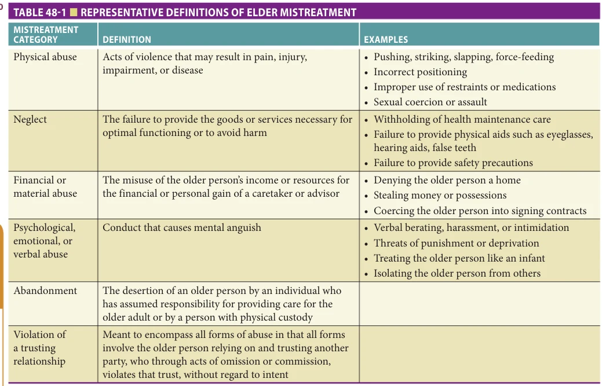
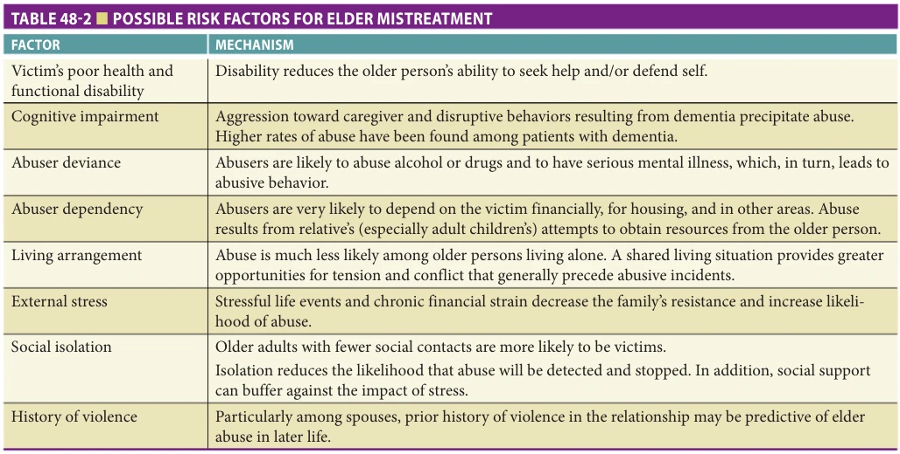
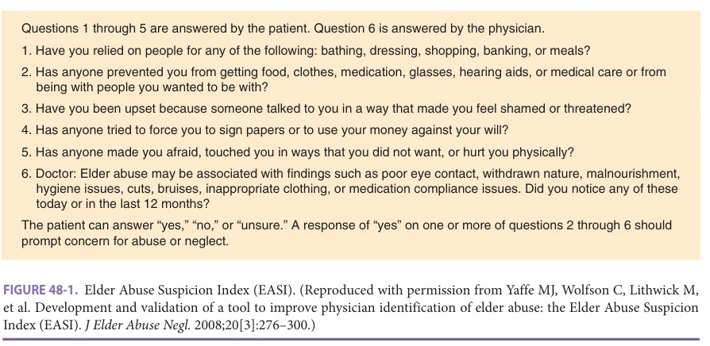
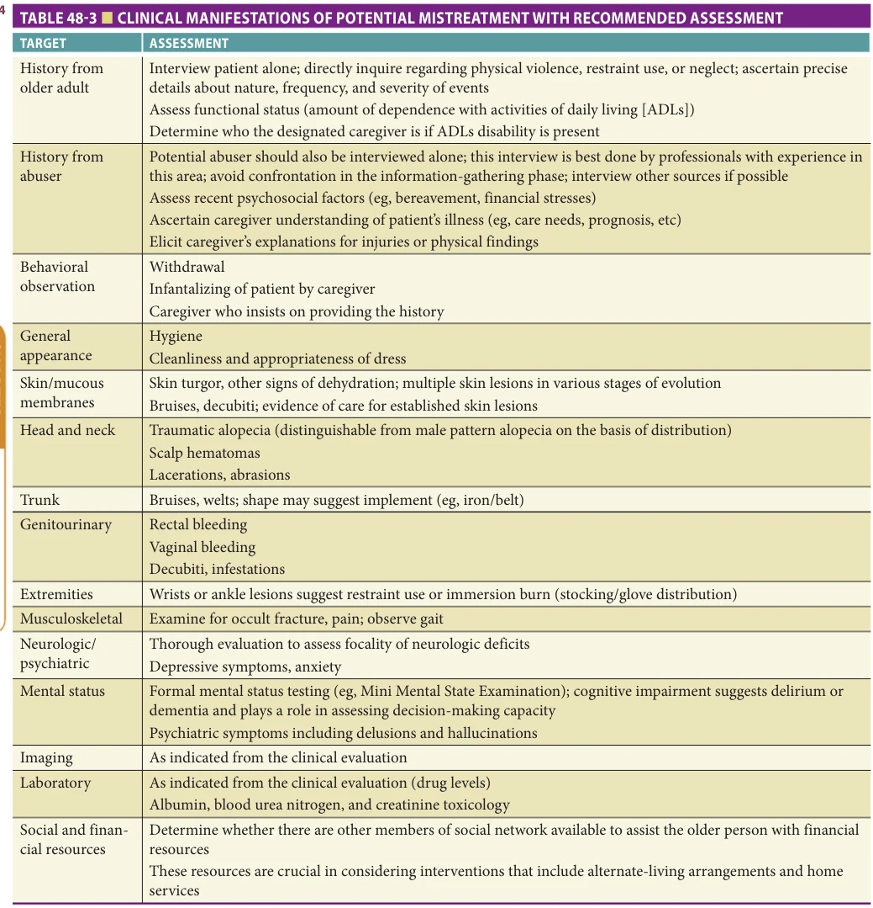
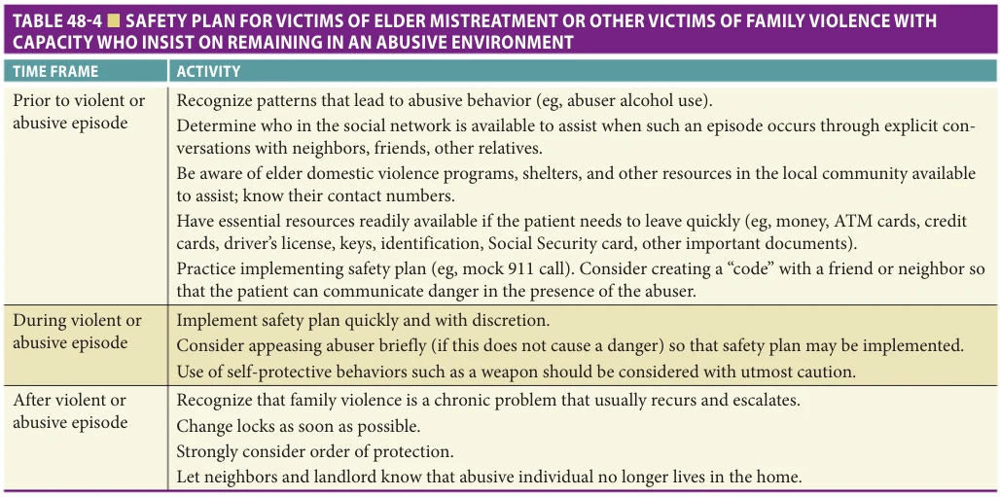

# Hazzard's Geriatric Medicine and Gerontology, 8e - Chapter 48: Elder Mistreatment

Mark S. Lachs, Tony Rosen

> **Status.** Fast build from the book; not lane-reviewed.

> Not cited in the 2020-2026 past papers.

> **Source and method.** Printed pages 719-728, from the marked 8th-edition copy (PDF page = printed page + 34). Prose follows its text layer; tables and figures are source-page crops. The book is canonical.

**[p. 719]**

## DEFINITIONS

In the broadest context, elder mistreatment subsumes a variety of activities perpetrated upon an older person by others. There is as yet no universally agreed definition or classification of elder mistreatment. Proposed strategies for defining or classifying elder mistreatment have included using the type of abuse (eg, physical vs verbal abuse), motive (eg, intentional vs unintentional neglect), perpetrator relationship (eg, family vs paid caregiver), and setting (eg, community vs nursing home). Nonetheless, the clinician attempting to care for a victimized older person or to understand the spectrum of elder mistreatment will encounter several thematically similar definitions. For example, the Older Americans Act of 1975 defines elder abuse as “the willful infliction of pain, injury, or mental anguish.” This definition has been adopted, and/or modified, by many state protective service agencies that investigate cases of abuse. An encompassing definition created by a 2002 expert panel convened by the National Academy of Sciences added the concept that elder mistreatment involves a trusting relationship between an older person and another individual in which that trust is violated in some way. The definition that likely best captures current understanding of elder mistreatment is that developed for the 2014 Elder Justice Roadmap, a report prepared by a large, multidisciplinary team of stakeholders inside and outside the US government:

#### Learning Objectives

- Elder mistreatment, including physical abuse, sexual abuse, neglect, financial exploitation, psychological abuse, and abandonment, is common and may have serious medical and social consequences.

- Elder mistreatment is significantly underrecognized by clinicians and underreported to the authorities.

#### Key Clinical Points

1. Though researchers have described potential risk factors and are working to identify forensic markers associated with elder mistreatment, a high index of clinical suspicion in all encounters with geriatric patients and routine screening are currently the best tools physicians have to identify this often subtle geriatric syndrome.

• Physical, sexual, or psychological abuse, as well as neglect, abandonment, and financial exploitation of an older person by another person or entity • That occurs in any setting (eg, home, community, or facility) • Either in a relationship where there is an expectation of trust and/or when an older person is targeted based on age or disability

Table 48-1 lists representative examples of types of elder mistreatment. Whatever definition is employed, a consistent and important feature of elder mistreatment, and other forms of family violence, is that multiple types of mistreatment, such as physical and verbal abuse, neglect, and financial exploitation frequently coexist in the same abuser-victim dyad.

Virtually all experts, clinicians, and reasonable laypersons will agree that egregious instances of physical violence such as punching, hitting, slapping, or assaulting an older person with a gun or other weapon are elder abuse. The most contentious definitional (and clinical) area relates to elder neglect, because the term neglect immediately implies that a caregiving obligation—such as providing food, medicines, or care—has not been met. This, in turn, raises difficult questions that must, with clinical judgment and experience, be considered in the context of the older adult’s environment. For example, what are reasonable community standards for the frequency of bathing an assaultive spouse with Alzheimer disease? Does that standard change if the designated caregiver also suffers from chronic diseases that preclude perfect hygiene for their impaired family member? What if this inadequate care enables the “victim” to live at home long after other families would have considered nursing home placement?

**[p. 720]**

*TABLE 48-1 ■ REPRESENTATIVE DEFINITIONS OF ELDER MISTREATMENT*

*Owner annotations/highlights are from the marked source copy, not the book.*

Data from Aravanis SC, Adelman RD, Breckman R, et al. Diagnostic and treatment guidelines on elder abuse and neglect. Arch Fam Med. 1993;2(4):371–388.

Who exactly is the responsible caretaker, especially when multiple adult children are available to assume that role, but only one has “stepped up” because of birth order or some other arbitrary circumstance? And is it fair to label that adult child an “elder neglector” when caregiving becomes physically or psychologically impossible?

These difficult questions also highlight the fact that clinicians caring for elder abuse victims often find themselves working closely with alleged perpetrators of abuse and neglect, as these individuals are often the primary caregivers.

Another challenge in conceptualizing and defining elder mistreatment is how to include adults who have been victims of family violence chronically during their adult lives. Do these victims become elder mistreatment sufferers after they reach an arbitrary age cutoff or if they become functionally dependent or suffer cognitive decline?

## EPIDEMIOLOGY

However it is defined, elder mistreatment is common. Recent prevalence studies, conducted in different countries, suggest that as many as 10% of community-dwelling older adults suffer from abuse, neglect, or exploitation each year. Multiple smaller studies suggest that nearly 50% of dementia sufferers are victims of mistreatment by

caregivers. Psychological/emotional abuse (4.6%–13%), financial mistreatment (3.5%–6.6%), and neglect (5.1%– 5.4%) are most commonly reported, with physical mistreatment (0.2%–2.1%) and sexual abuse (0.3%–0.6%) reported less frequently.

Unfortunately, despite its frequency, research suggests that as few as 1 in 24 cases of elder mistreatment is identified by the authorities. Victims may be unable to report abuse due to isolation, severe illness, or dementia, or may be reluctant to report due to fear of reprisal, guilt, desire to protect the abuser, cultural beliefs, or fear of institutionalization. Many older adults who suffer from abuse endure it for years before having it discovered. For others, it may not be until after they have died that their morbidity and early death are considered to be due to abuse. Both of these scenarios lead to delays in identification and intervention.

Much research has focused on identifying risk factors for elder mistreatment perpetrators and victims, with inconsistent results (Table 48-2). The most consistent findings relate to the relationship of the abuser to victim; most studies report that spouses and adult children are the most common perpetrators. Studies also show that when adult children are the abusers, sons and daughters are often equally implicated. At least one study found daughters to be the more common abuser. These findings must be viewed cautiously in that women are far more likely to be the de

**[p. 721]**

*TABLE 48-2 ■ POSSIBLE RISK FACTORS FOR ELDER MISTREATMENT*

*Owner annotations/highlights are from the marked source copy, not the book.*

Reproduced with permission from Lachs MS, Pillemer K. Abuse and neglect of elderly persons. N Engl J Med. 1995;332(7):437–443.

facto or designated care providers to frail older adults and are, therefore, more “at risk” for being accused of mistreatment should caregiving fall short of any arbitrary standard.

Studies suggest that women represent two-thirds of elder mistreatment victims. Also, in cultures where women have inferior social status, older women are at high risk of neglect through abandonment when they are widowed, and their property is seized. While current research suggests that older adults with lower socioeconomic status are at greater risk for mistreatment, studies evaluating race and ethnicity have been contradictory. A particularly contentious area has been spawned by the “dependency theory” of mistreatment, which holds that mistreatment occurs when the victim becomes inordinately dependent on the caregiver for a variety of medical and nonmedical needs. Again, studies show an inconsistent relationship between functional disability in an older adult and elder mistreatment. In fact, a more consistent finding in the literature is the converse—the perpetrator is often dependent on the older adult victim for financial support and housing. Characteristically, an adult child unable to achieve independence is reliant on the older person for these needs.

Inconsistencies in findings from risk factor research may be related to the heterogeneous nature of elder mistreatment cases. Older adult protective services workers and clinicians experienced in elder mistreatment know that the term elder mistreatment subsumes many situations— abusive spousal relationships that have “aged,” caregivers to dementia patients who lash out in frustration, and physically abusive adult children with poorly managed mental health or substance abuse problems are but a few examples. Epidemiologic studies that attempt to discern risk factors without acknowledging this reality probably are measuring

an “average” effect, thus possibly missing important sets of risk factors among subgroups of abused or neglected older populations.

Whatever risk factors are identified in previous and future research should not foster a complacency wherein an absence or paucity of such factors causes the clinician to lower his or her guard. Elder mistreatment crosses all ethnic and socioeconomic boundaries. A high index of clinical suspicion is critical for identification.

## PATHOPHYSIOLOGY

Theories of elder mistreatment abound; three deserve detailed discussion here, because they may have clinical relevance with regard to the types of interventions contemplated in confirmed cases of mistreatment. The most commonly cited theory contends that family violence is a learned behavior; abused children grow up to potentially abuse not only their children, but also perhaps spouses and their parents. This is sometimes referred to as the transgenerational violence theory of mistreatment.

The dependency theory of mistreatment holds that abuse is fostered by situations in which victims have a degree of functional and/or cognitive disability that results in activities of daily living impairment and overwhelming care needs. Closely associated with this paradigm is another theory—that of the “stressed caregiver.”

The psychopathology of the abuser theory shifts focus away from the victim and argues that elder mistreatment is firmly rooted in mental health problems of the abuser. Examples include personality disorders, poorly or undertreated schizophrenia, alcoholism, and other substance abuse problems.

**[p. 722]**

Discerning the underlying causes of elder mistreatment is essential in fashioning an intervention plan (see “Management” later in this chapter).

## PRESENTATION

For a variety of reasons, the identification of elder mistreatment is one of the most difficult clinical challenges in geriatric medicine. First, many highly prevalent chronic diseases in older adults may have clinical manifestations that mimic abuse. If elder abuse is present, the clinician may ascribe those findings to chronic disease rather than family violence. Conversely, the clinician may erroneously attribute findings from another disease to elder mistreatment. Second, the setting in which an elder mistreatment evaluation occurs is often quite challenging. The assessment may be hurried (eg, the emergency department is the oftenchaotic environment where acute injuries are evaluated). The presence of the suspected abuser only adds pressure to what is already likely to be a stressful encounter. The perpetrator, and also the victim, may have incentives to actively conceal the mistreatment from the clinician. Lastly, the competent identification and management of mistreatment may create significant additional work and propel the clinician into a world that he or she is likely to be unfamiliar with—a world that includes mandatory reporting statutes, adult protective service workers, and a criminal justice system with a vocabulary that is foreign to many medical professionals. Given these educational, emotional, and systemic obstacles, it is not surprising that elder mistreatment often is missed or unreported in the context of “customary care.” In fact, research suggests that only 1.4% of cases reported to Adult Protective Services (APS) come from physicians, and, in a survey of APS workers, of 17 occupational groups, physicians were among the least helpful in reporting abuse.

Elder abuse forensics is a recent area of intense and growing focus. Of particular interest has been whether there are diagnostic and/or clinical signs and symptoms of abuse presentations, either during life or at autopsy, that are highly specific for elder mistreatment, as have been identified in child abuse (eg, shaken baby syndrome and buckethandle metaphyseal fracture). Researchers have begun to search for physical injury patterns associated with abuse. Research has shown that physical abuse and assault-related injuries most commonly occur on the head/face, neck, and upper extremities. One study showed that, in comparison to other older adults, victims of physical abuse have bruises that are more often large (> 5 cm) and more commonly on the face, lateral right arm, or posterior torso. Physical abuse victims are much more likely than older adults presenting to the emergency department after a fall to have injuries to the left cheek/zygoma, neck, or ears. Additionally, physical elder abuse victims are more likely to have maxillofacial/dental/neck injuries combined with no

injuries or their upper or lower extremity injuries. Medical and laboratory markers potentially suggestive of elder mistreatment have been suggested by experts, including malnutrition, dehydration, alterations in status of chronic illness, hypothermia/hyperthermia, rhabdomyolysis, and toxicologic findings, but these have not yet been systematically evaluated.

Until rigorous research identifies reliable forensic markers, clinicians need to consider elder mistreatment in the differential diagnosis of many or most of the clinical presentations they encounter. Fractures may result from osteoporosis or force or both. Depression may be related to neurotransmitter imbalances or a hopeless abusive environment. Malnutrition may be the result of any number of chronic illnesses inexorably worsening, or from the withholding of sustenance.

Dramatic injuries or neglect pose no particular diagnostic challenge. Fractures, burns, contusions, and lacerations, in concert with a credible history, immediately lead to the diagnosis. At the other extreme, subtle presentations that mimic chronic disease are highly challenging. Examples include chronic diseases that frequently decompensate despite a care plan and adequate resources (eg, repeated emergency department visits for congestive heart failure or chronic obstructive pulmonary disease exacerbation). Indeed, because elder mistreatment can be defined so broadly, there are very few presenting signs or symptoms in the geriatric patient for which elder mistreatment is not in the differential diagnosis.

Many instruments have been devised for the screening or evaluation of elder mistreatment, but they are not applicable to all settings. The Elder Abuse Suspicion Index (EASI) is a short screening instrument that has been validated for cognitively intact patients in a primary setting with a sensitivity of 0.47 and a specificity of 0.75. The EASI (Figure 48-1) is a tool to identify older adults at risk of mistreatment and includes five questions for the patient and one for the physician, with more than or equal to one “yes” response suggesting further assessment is needed.

All screening instruments may assist the clinician by serving as “checklists” to ensure a thorough evaluation. Table 48-3 suggests a system-by-system approach. The importance of heightened awareness cannot be overemphasized in considering the diagnosis. Frequently, clues about potential mistreatment come from ancillary staff members (eg, office reception staff) or home care nurses who observe the abuser-victim dyad away from the health care provider. A general sense that something is amiss in the patient’s environment such as caustic interaction between parties, poor hygiene or dress, frequently missed medical appointments, or failure to adhere with a clearly designated treatment strategy can all be important clues.

The patient and the alleged perpetrator should be interviewed separately and alone. Although there is an

**[p. 723]**

*FIGURE 48-1. Elder Abuse Suspicion Index (EASI). (Reproduced with permission from Yaffe MJ, Wolfson C, Lithwick M, et al. Development and validation of a tool to improve physician identification of elder abuse: the Elder Abuse Suspicion Index (EASI). J Elder Abuse Negl. 2008;20[3]:276–300.)*

*Owner annotations/highlights are from the marked source copy, not the book.*

emerging consensus that patients of all ages should be routinely screened for family violence, an optimal strategy or instrument has not emerged. Patients should be asked candidly and calmly about the etiology of any unexplained injuries or other findings. Often patients are at first unwilling to speak candidly about being an elder abuse victim for reasons of embarrassment, shame, or fear of retribution from the perpetrator who is frequently a caregiver.

Interview of the suspected abuser is a tricky and potentially dangerous undertaking. On the one extreme, elder abusers who are presented with an empathetic, nonjudgmental ear to describe their stresses and actions will sometimes describe their situations at great length and in great detail. On the other hand, all forms of domestic abuse share a pattern wherein abusers gain and control access to their victims. An elder abuser graphically confronted with allegations of mistreatment may move to sequester a frail victim in such a way that a frail isolated older adult loses access to critically needed medical and social services. Whenever possible, assistance from providers skilled in elder abuse evaluation and management should be enlisted to assist in such undertakings.

## MANAGEMENT

Elder abuse and neglect are morbid and mortal. Mistreatment is associated with adverse health outcomes for victims, including significant increases in emergency department usage, hospitalization, dementia, depression, and nursing home placement. Also, research has shown that mistreatment victims have a threefold risk of death compared to nonabused controls. Thus, intervention is critical.

Unfortunately, there are no randomized trials of reasonable quality addressing interventions for elder mistreatment. The clinician confronted with a confirmed case

of elder abuse is best served by a resourceful approach that combines experience, clinical judgment, and local resources. One developing trend is large interdisciplinary groups who convene regularly to discuss cases of mistreatment, not only for the purpose of planning intervention, but also to consider case-by-case forensics, cross train disciplines, and provide general support to one another in this difficult field. However, there is no evidence-based evaluation of this strategy.

Whatever the approach to intervention, a dogmatic or algorithmic strategy to address all elder mistreatment cases is likely misguided. A rigid, inflexible approach ignores the enormous heterogeneity of the entity, including the type(s) of mistreatment being concurrently perpetrated, the underlying mechanisms, patient comorbidities, caregiver burden issues, and the available resources (both familial and community) that can be brought to bear on the issue. A more sensible approach may be the multipronged strategy increasingly used to treat other geriatric syndromes that have multifactorial etiologies. The paradigm may be a useful one in that elder mistreatment can be likened to geriatric syndromes. That is, there may be multiple “host” and environmental contributors; decompensation may be accelerated by other medical and social problems; and some of the contributors may be more remediable than others. The elder physical abuse victim with severe chronic obstructive pulmonary disease and an abusive schizophrenic child-caregiver will need an entirely different series of interventions than the spouse with progressive dementia who has suffered lifelong domestic violence that is now worsening.

The first step in confronting any confirmed case of family violence is ensuring the safety of the victim. First, the immediate threat of danger to the victim should be ascertained. Even if there is no immediate threat, a safety plan is critical in the management of all forms of family

**[p. 724]**

*TABLE 48-3 ■ CLINICAL MANIFESTATIONS OF POTENTIAL MISTREATMENT WITH RECOMMENDED ASSESSMENT*

*Owner annotations/highlights are from the marked source copy, not the book.*

Reproduced with permission from Lachs MS, Pillemer K. Abuse and neglect of elderly persons. N Engl J Med. 1995;332(7):437–443.

violence (Table 48-4). What are the specific steps the victim should take if the perpetrator of mistreatment becomes acutely violent? Options include calling the local police department, accessing shelters, emergency department use/hospital admission, or respite care in some evolved systems of long-term care. Additionally, in most states, cases of elder abuse must be reported to adult protective services agencies. This typically results in a home visit to adjudicate the veracity of such a report. State protective service agencies vary widely with respect to their caseloads and

available resources; ideally a coordinated approach that brings to bear their expertise and resources in collaboration with the physician and multidisciplinary team produces the best response.

The safety plan paradigm will have limited utility in many cases of elder mistreatment, however, because of victim frailty and/or cognitive impairment that limits the use of self-protective behaviors. Frequently, clinicians find themselves in the predicament of caring for an elder mistreatment victim who lacks capacity. In these cases, the

**[p. 725]**

*TABLE 48-4 ■ SAFETY PLAN FOR VICTIMS OF ELDER MISTREATMENT OR OTHER VICTIMS OF FAMILY VIOLENCE WITH CAPACITY WHO INSIST ON REMAINING IN AN ABUSIVE ENVIRONMENT*

*Owner annotations/highlights are from the marked source copy, not the book.*

likely intervention will involve the appointment of a guardian in collaboration with adult protective service agencies or other elder social service programs in the community that serve such functions. In such a proceeding, the clinician’s role is to provide objective evidence that documents the lack of decision-making capacity. The clinician may also have a role in ensuring the alleged perpetrator of mistreatment does not become the guardian.

One of the most frustrating situations for professionals working with victims of family violence is the individual who retains decision-making capacity and insists on remaining in an abusive environment. Here the clinician’s role is to educate the patient about the tendency of family violence to escalate and to review the safety plan created. The clinician should also explain to the patient that even if services are refused, the physician remains an important and available resource, should the situation change.

In general, the physician who suspects elder abuse would do well to employ the same creative strategies he or she uses to manage a variety of clinical problems in older adults. There may be local social services agencies in the community who provide an array of services such as meals on wheels or friendly visit. These services could represent a new resource for the patient, but also additional “eyes and ears” to ascertain what the home situation is like. A local adult day care referral might also enable a more detailed ongoing evaluation of a client while decompressing a stressful caregiving situation. A financial management program for the patient with cognitive impairment can shed light on the possibility of financial exploitation. The physician need not diagnose elder abuse while these useful services are being proffered.

Physicians should strive to provide trauma-informed care to potential elder abuse and neglect victims. This involves

recognizing and being sensitive to the deep impact of stressful and traumatic experiences on a patient’s physical and mental health. Elder abuse or neglect, which may occur every day for years, may cause depression, anxiety, or post-traumatic stress disorder, as may other life experiences. Practicing trauma-informed care involves maximizing a victim’s choice and control and trying to minimize re-traumatization through treatment. Delivering trauma-informed care includes specific strategies: emphasizing the intention to maintain a patient’s privacy and confidentiality, asking permission before touching a potential victim, limiting how much a victim has to talk about the mistreatment, and avoiding words such as violence/abuse/ neglect/mistreatment/criminal behavior if the victim does not initially conceive of what has occurred in this way. Physicians should also use a trauma-informed approach when treating cognitively impaired patients, as they may also be profoundly impacted by current or previous traumatic exposures.

## SPECIAL SITUATIONS

Elder mistreatment may also occur in institutional settings. The physician and nurse have roles in detecting these cases as well. Substantial regulatory safeguards have been progressively enacted since the 1970s to protect residents of long-term care facilities. These safeguards include mandatory criminal background checks of all employees, ombudsman programs to adjudicate complaints of mistreatment, and components of the Omnibus Budget Reconciliation Act of 1987, which includes residents’ rights provisions (eg, minimization of restraints). In some contexts, the failure to create or follow a reasonable plan of care for the long-term care residents may be viewed as abusive or neglectful.

**[p. 726]**

While the focus of elder abuse in long-term care has been on staff abuse of residents, this is probably far less common than previously when regulatory scrutiny was lacking. Recently, resident on resident abuse has been identified as a far more common and pervasive problem among nursing home residents. This includes verbal, physical, and sexual mistreatment. Although there are no prevalence data on the phenomenon, preliminary and indirect evidence suggests that it is highly prevalent. For example, more than 50% of nursing aides in long-term care report the personal experience of being physically hit by a resident in the previous year, typically in the course of providing direct care. Given that the prevalence of dementia and associated behavioral disturbance in long-term care facilities is high, it stands to reason that behavior of this type occurs frequently between residents.

Another recent area of interest has been abuse and neglect that occurs in long-term care environments other than nursing homes (eg, assisted living and board and care environments), because these facilities generally are under considerably less regulation. Interest in mistreatment in assisted-living facilities has also grown in recent years as much sicker patients begin to inhabit these institutions; many believe the higher acuity and generally lower levels of

## FURTHER READING

Acierno R, Hernandez MA, Amstadter AB, et al. Prevalence

and correlates of emotional, physical, sexual, and financial abuse and potential neglect in the United States: the National Elder Mistreatment Study. Am J Public Health. 2010;100:292–297. Bonnie J, Wallace RB, eds. Elder Mistreatment: Abuse, Neglect,

and Exploitation in an Aging America. Washington, DC: National Academy of Sciences Press; 2003. Dong XQ. Elder abuse: systematic review and implications

for practice. J Am Geriatr Soc. 2015;63(6):1214–1238. Lachs MS, Pillemer KA. Elder abuse. Lancet. 2004;304:

1236–1272. Lachs MS, Pillemer KA. Elder abuse. N Engl J Med. 2015;

373(20):1947–1956. Lachs MS, Teresi JA, Ramirez M, et al. The prevalence

of resident-to-resident elder mistreatment in nursing homes. Ann Intern Med. 2016;165(4):229–236. Lachs MS, Williams C, O’Brien S, et al. Risk factors for

reported elder abuse and neglect: a nine-year observational study. Gerontologist. 1997;37:469–474. Lachs MS, Williams CS, O’Brien S, et al. The mortality of

elder mistreatment. JAMA. 1998;280:428–432. Laumann EO, Leitsch SA, Waite LJ. Elder mistreatment in

the United States: prevalence estimates from a nationally representative study. J Gerontol B Psychol Sci Soc Sci. 2008;63(4):S248–S250.

staff and supervision are a dangerous admixture in which abuse and neglect are more likely to occur. Data are lacking on the prevalence of abuse, or on the type of abusers, in these settings.

Physicians and other care providers have an important role in the detection of these institutional cases, because they may see potential manifestations of nursing home elder mistreatment in facilities or emergency departments as part of providing customary care. Physicians who suspect institutional abuse have an obligation to immediately report their suspicions to the long-term care ombudsman in their state.

## SUMMARY

Elder mistreatment is a prevalent problem with many potential manifestations. The epidemiology of injuries and other clinical findings is not completely understood, but this does not preclude the clinician from taking an active role in its detection and management. Studies show elder mistreatment victims to be at substantial independent risk of death and quality-of-life decline. The syndrome should be afforded the same vigilance that health care providers devote to other “traditional” medical problems in geriatrics.

Mosqueda L, Burnight K, Gironda MW, Moore AA,

Robinson J, Olsen B. The abuse intervention model: a pragmatic approach to intervention for elder mistreatment. J Am Geriatr Soc. 2016;64(9):1879–1883. National Center for Elder Abuse. The Elder Justice Road-

map: A Stakeholder Initiative to Respond to an Emerging Health, Justice, Financial, and Social Crisis. https://www .justice.gov/file/852856/download. Accessed June 3, 2021. Pillemer K, Burnes D, Riffin C, Lachs MS. Elder abuse:

global situation, risk factors, and prevention strategies. Gerontologist. 2016;56(Suppl 2):S194–205. Pillemer K, Finkelhor D. The prevalence of elder abuse: a

random sample survey. Gerontologist. 1988;28:51–57. Rosen T, LoFaso VM, Bloemen EM, et al. Identifying

injury patterns associated with physical elder abuse: analysis of legally adjudicated cases. Ann Emerg Med. 2020;76(3):266–276. Rosen T, Pillemer K, Lachs M. Resident-to-resident aggres-

sion in long-term care facilities: an understudied problem. Aggress Violent Behav. 2008;13(2):77–87. Under the Radar: New York State Elder Abuse Prevalence

Study: Self-Reported Prevalence and Documented Case Surveys 2012. https://ocfs.ny.gov/main/reports/ Under%20the%20Radar%2005%2012%2011%20 final%20report.pdf. Accessed June 3, 2021.

**[p. 727]**

Wiglesworth A, Austin R, Corona M, et al. Bruising as a

marker of physical elder abuse. J Am Geriatr Soc. 2009; 57(7):1191–1196. Wiglesworth A, Mosqueda L, Burnight K, et al. Findings

from an elder abuse forensic center. Gerontologist. 2006; 46:277–283.

Yaffe MJ, Wolfson C, Lithwick M, Weiss D. Development

and validation of a tool to improve physician identification of elder abuse: the Elder Abuse Suspicion Index (EASI). J Elder Abuse Negl. 2008;20:276–300.

**[p. 728]**
