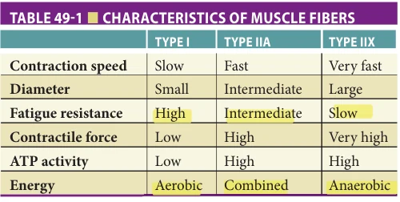
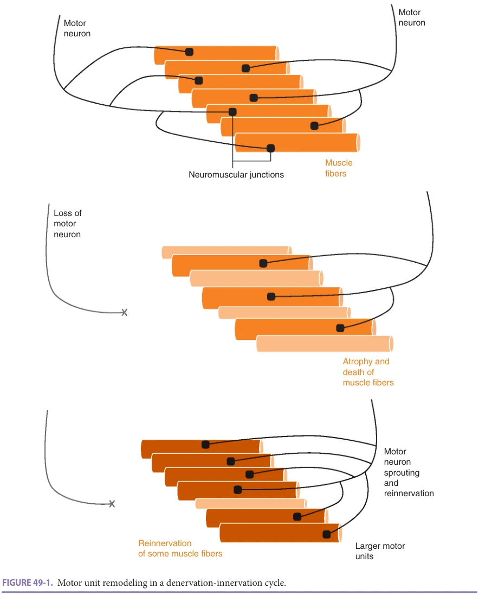
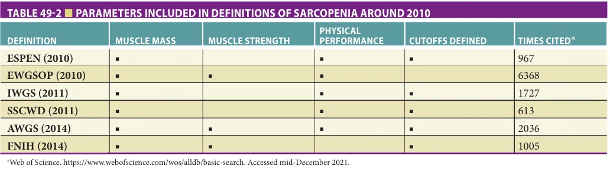
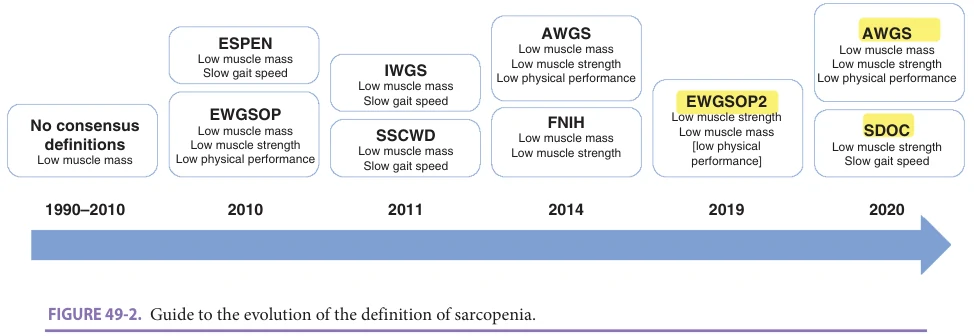
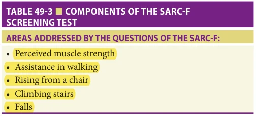
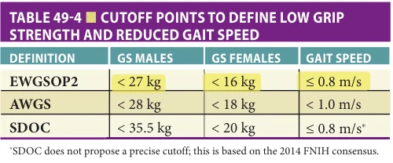
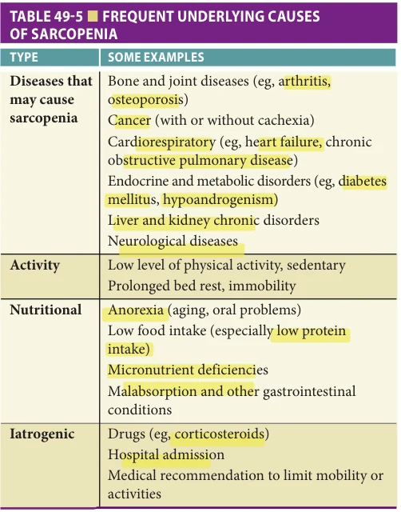

# Hazzard's Geriatric Medicine and Gerontology, 8e - Chapter 49: Muscle Aging and Sarcopenia

Alfonso J. Cruz-Jentoft

> **Status.** Fast build from the book; not lane-reviewed.

> **Source and method.** Printed pages 729-740, from the marked 8th-edition copy (PDF page = printed page + 34). Prose follows its text layer; tables and figures are source-page crops. The book is canonical.

**[p. 729]**

## INTRODUCTION

Age-related losses of muscle mass and strength are common and can lead to sarcopenia, a condition typically consisting of a combination of loss of strength, physical function, and muscle mass. This chapter will cover concepts related to the process of muscle aging as well as the current status of sarcopenia detection, evaluation, and management.

#### Learning Objectives

- Summarize age-related changes in the skeletal muscle and motor units.

- Appraise the evolving concept of sarcopenia and the characteristics of the different definitions proposed in the past two decades.

- Use muscle mass and function to diagnose sarcopenia in clinical practice.

- Develop a treatment plan for sarcopenic patients.

#### Key Clinical Points

1. Muscle aging involves anatomical and physiological changes in motor units and their regulation.

2. Sarcopenia is a progressive and generalized disease involving the accelerated loss of muscle mass and function. The concept of sarcopenia has evolved from low muscle mass alone to include muscle function.

3. Around 10% of the older persons living in the community suffer from sarcopenia, with a higher prevalence in other clinical settings.

4. Measures of muscle mass, muscle strength, and physical performance are used to diagnose sarcopenia in clinical practice.

5. Treatment of sarcopenia requires resistance exercise. Nutrition may have a role. No drugs are yet available for this condition.

The human body is made up of more than 600 skeletal muscles, accounting for around 40% of the total body mass. Excluding water, muscles are composed of about 80% protein, or about 50% of total body protein. The main functions of skeletal muscle are mobility and regulation of proteins. Adults tend to lose muscle mass at a rate of about 8% per decade after age 40. At age 70, an adult will have lost a mean of 24% of the muscle mass present at age 30. The rate of muscle mass loss accelerates and almost doubles after age 70. It is essential to note that adults lose muscle strength much faster; about 3% to 4% per year after age 50. Strength loss renders older persons vulnerable to physical disability.

## MOTOR UNITS AND THEIR REGULATION

The basic functional unit of skeletal muscles is the motor unit. Each motor unit consists of a neuron, its axon, and the muscle fibers innervated by that neuron. The neuron terminal is connected to the muscle fiber through the neuromuscular junction, where neurons release neurotransmitters that bind to muscle cells receptors. A single motor neuron may innervate from a few to thousands of muscle fibers, depending on the muscle, with neurons responsible for higher force production innervating a higher number of fibers. Human muscles harbor three types of muscle fibers: type I, type IIa, and type IIx (formerly named IIb). Type I

**[p. 730]**

*Table 49-1, printed p. 730.*

fibers (slow-twitch) are well adapted to perform aerobic exercise and are highly resistant to fatigue, having high oxidative capacity and a low capacity to generate adenosine triphosphate (ATP). Type IIx fibers (fast-twitch) contract several times faster but fatigue rapidly, adapted to brief, intense contractions (as in weight lifting) and have a high ATP-generating capacity and low glycolytic capacity. Type IIa fibers (also fast-twitch) are also fast but are fatigue-resistant (Table 49-1). Muscle myofibrils are made of two main contractile proteins actin and myosin, with a double helix structure, regulated by troponin and tropomyosin.

The nervous system regulates recruitment of motor units to carry out movements by generating action potentials in the motor cortex of the brain, that propagate down to the neuromuscular junction, triggering contraction of muscle fibers in a highly energy dependent process. The motor cortex is regulated by many other brain regions.

## MUSCLE AGING

Age-related changes have been described at all levels of the motor unit. With increasing age the number of muscle fibers is reduced, reflected in a loss of almost one-third of muscle mass in late life. This loss seems to be faster in type II than in type I muscle fibers. Compared to younger adults, more than one-third of motor neurons are typically lost in older adults. By age 70, the number of motor units is reduced about 40% compared with the number found in 25-year-olds. Continued loss with age after age 70 can lead to nonagenarians having only one-third of the number of motor units of young persons, even in apparently healthy aging. Apoptosis of motor neurons with denervation of the innervated muscle fibers leads to muscle weakness. This process has been associated with sarcopenia. An adaptive response to motor neuron loss is motor unit remodeling in a denervation-innervation cycle, where the same nerve fiber reinnervates larger bundles of muscle fibers to counteract neuron loss (Figure 49-1). This process preferentially involves fast fibers, which may gradually become slower and thus reduce muscle force and muscle power (the ability to use full force in a given period of time).

The firing capacity of motor units is also reduced with age during submaximal and maximal intensity contractions, a phenomenon that has been linked to motor unit remodeling, by shifting the fastest firing fibers to a slower phenotype. The consequence is that older persons need to increase the number of activated fibers and come closer to maximal effort to perform usual tasks such as climbing stairs or rising from a chair. The control of muscle contraction and movement also depends on other integrative neural mechanisms that show age-related changes, including neural excitability and brain connectivity.

The magnitude of change in muscle size and function is strongly associated with long-term lifestyle, especially with the degree of physical activity and the amount of endurance exercise. This was first demonstrated in animal models, where long-term exercise is associated with reduced loss of motor neurons and muscle fibers compared to sedentary animals. Studies in runners have shown that at least part of the age-related motor unit loss may be prevented or retarded by usual physical exercise, perhaps via an increase of the reinnervation capacity of denervated units. A low protein intake over long periods of time is also associated with reduced muscle mass loss and may help upregulate the balance between muscle protein anabolism and catabolism. Other genetic and molecular changes involved in age-related changes of the skeletal muscle and the motor unit are still largely the focus of research.

## SARCOPENIA: CHANGING DEFINITIONS ALONG TIME

Sarcopenia is the most frequent age-associated disease of the skeletal muscle. It is defined as a progressive and generalized disease involving the accelerated loss of muscle mass and function that is associated with increased likelihood of adverse outcomes including falls, frailty, physical disability, and mortality. It may be considered “skeletal muscle insufficiency,” similar to cardiac or renal insufficiency as a useful clinical construct.

The term “sarcopenia” is derived from the Greek words for “poverty of flesh.” It was first described in the 1980s as an age-related decline in lean body mass affecting mobility, nutritional status, and independence. Initial studies of sarcopenia focused mostly on body composition (for some, sarcopenia is still a synonym of low skeletal muscle mass). However, over the years it has become clear that muscle mass measures or estimations with any available method are poor predictors of clinical outcomes, including physical disability. On the other hand, functional measures (muscle strength and some measures of physical performance, especially gait speed) were confirmed to be good predictors of disability and other relevant outcomes. Such evidence radically changed the concept of sarcopenia in recent years. This is not surprising; cardiac muscle function

**[p. 731]**

*Figure 49-1, printed p. 731.*

is also more relevant than mass, except for diseases linked to reduced distensibility, a property that is not relevant for most skeletal muscles.

Building on this evidence, six expert consensus definitions were published from 2010 to 2014 by different groups and organizations: some working groups of the European Society for Clinical Nutrition (ESPEN), the European Working Group on Sarcopenia in Older People (EWGSOP, nurtured by the European Geriatric

Medicine Society and ESPEN), an International Working Group on Sarcopenia (IWGS), a group around the Society on Sarcopenia, Cachexia and Wasting Disorders (SSCWD), the Asian Working Group for Sarcopenia (AWGS), and the US Foundation of the National Institutes of Health (FNIH) (Table 49-2). Although not equivalent, all definitions added functional measures to muscle mass estimates, were widely accepted by the scientific community, and triggered an increase in research that confirmed that defining

**[p. 732]**

*Table 49-2, printed p. 732.*

sarcopenia as low muscle mass plus low muscle function was a relevant clinical construct that predicted outcomes and was potentially amenable to improve with interventions. These advances led to the recognition of sarcopenia as a disease with an ICD-10-CM code in 2016.

In recent years, measures and estimations of muscle mass have gradually lost credibility. Methods are unreliable, clear cutoff points could never be agreed upon, and the lack of correlation of muscle mass measures with relevant outcomes was confirmed. This reduced credibility, among other factors, led to a low uptake of the diagnosis of sarcopenia in clinical practice, missing the opportunity to prevent or reverse some outcomes. Therefore, some working groups decided to update their definitions, highlighting the importance of low muscle function and reducing the role of muscle mass in the diagnosis of sarcopenia, with the declared aim to make the diagnosis more friendly to practitioners.

The first update came from the EWGSOP (EWGSOP2) in 2019. This advanced definition opted to move muscle strength to the first parameter to be measured when sarcopenia is suspected, with muscle mass used as confirmation of the involvement of muscle in strength loss. In fact, the EWGSOP2 proposes the use of the term “suspected sarcopenia” for patients with low muscle strength when muscle mass has not been measured. It also suggests alternative use of measures of muscle quality (both in terms of muscle composition and in the ability of muscle mass volume to deliver strength) to replace muscle mass. For the EWGSOP2, low physical performance (defined as the full body ability to move or endure, as measured with walking or chair standing tests) is a marker of severity of sarcopenia that increases the risk of adverse outcomes. There is some evidence than mild or moderate sarcopenia may respond to some treatments that could be insufficient to tackle severe sarcopenia. This group also includes the concept of case finding (already suggested by the SSCWD group) by clinical symptoms or questionnaires with the aim to improve the detection of sarcopenia in clinical settings.

The AWGS (whose first definition was identical to the EWGSOP with distinct cutoff points for Asian

populations) also published an updated version in 2020, where case-finding is also the first diagnostic step, albeit the algorithm, instruments or suspicion depend on the clinical setting (community vs other care settings). In specialized settings, muscle strength would be the first measure, followed by physical performance and muscle mass. However, this definition still requires impairments in either muscle mass and function to define sarcopenia, and in both to consider it severe.

Finally, the FNIH group, now named Sarcopenia Definition and Outcomes Consortium (SDOC), recently published an international expert panel position on 13 statements on the putative components of a sarcopenia definition. They confirmed by new analyses of available epidemiologic databases that low muscle strength is associated with physical performance (slowness) and that both low grip strength and low gait speed independently predict falls, self-reported mobility limitation, hip fractures, and mortality in community-dwelling older adults. On the other hand, they found again that lean mass measured by DXA was not associated with incident adverse health-related outcomes in community-dwelling older adults with or without adjustment for body size. This group recommends that low grip strength and usual gait speed should be included in the definition of sarcopenia, while low muscle mass (measured by DXA) should not be included. The evolution of definitions of sarcopenia is depicted in Figure 49-2.

## EPIDEMIOLOGY

Sarcopenia is a relatively common condition in old age with adverse effects on current as well as future health. Estimates of disease prevalence and incidence are changing with the availability of more accurate definitions. The prevalence of sarcopenia using definitions that only consider low muscle mass can be as high as 40% in community dwelling older persons. However, when muscle function is also included, estimates of the prevalence of sarcopenia in the community are around 10% to 15%. The incidence of new cases of sarcopenia in older adults may be higher than 3% per year, although this has been less studied. There are no clear

**[p. 733]**

*Figure 49-2, printed p. 733.*

differences in the prevalence of sarcopenia in males and females. However, the prevalence may be higher in acutely ill hospitalized patients (especially those with severe chronic diseases, present in > 20% of hospitalized older patients), in post-acute and rehabilitation settings (where prevalence may be > 50%), and in nursing homes (> 40% of residents will be sarcopenic).

Many risk factors for sarcopenia have been described. The association with age is probably related to long-term lifestyle. Protein intake has been shown to be related to muscle mass and function in epidemiological studies. People in the lowest quartile of protein intake show a higher age-related loss of muscle mass that those in the upper quartile. A slight deficit in protein intake, when sustained for many years, may have a strong impact on muscle mass and function in old age. Low levels of vitamin D, omega 3 fatty acids, and some micronutrients (magnesium, selenium) may also be associated with impaired muscle function, although evidence is still weak. Dietary patterns are also important to muscle health. Good adherence to a Mediterranean diet or having high scores in other measures of healthy eating (usually involving higher intake of fruits, vegetables, fatty fish, or whole grains) are also related to better muscle function and reduced disability than less healthy diets.

Low physical activity and sedentariness are usually considered risk factors for sarcopenia, but evidence is weak, as no robust long-term studies have shown an association between lifetime physical activity and exercise and muscle health. Chronic diseases may also be a risk factor for sarcopenia, especially when they limit mobility or appropriate nutrition in old age. Low-grade inflammation has been shown to be associated with sarcopenia. When inflammation is severe, sarcopenia blends into cachexia. Diabetes mellitus is also an established risk factor of sarcopenia; sarcopenia is more common in persons with diabetes compared to those without. On the other hand, sarcopenia may contribute to the development and progression of diabetes through

altered glucose disposal due to low muscle mass and intramuscular adipose tissue accumulation.

Obesity and sarcopenia are also related, in a construct named sarcopenic obesity. Patients with sarcopenic obesity have high adiposity and low lean mass. However, this condition is still ill defined, as some patients may have adequate muscle mass (compared with standard population measures) but have muscle strength that is unable to move an increased total body mass. There is an initiative under the auspice of ESPEN to propose a definition of sarcopenic obesity that may advance the field, expected to be released in 2022.

Sarcopenia is associated with many adverse health consequences. Many studies have confirmed that mortality is 3 to 4 times higher in sarcopenic compared with non-sarcopenic persons with otherwise similar health conditions, and the impact of sarcopenia on mortality may be even higher in persons older than 80 years. Sarcopenia is also associated with a much higher risk of physical and cognitive frailty, functional decline, and disability. The risk of falls and fractures is also slightly increased in sarcopenia, although evidence about this association is not yet unequivocal. Sarcopenia also seems to increase the risk of hospitalization, readmission, and impaired health-related quality of life, whether assessed by general instruments or disease-specific instruments. Whether sarcopenia increases the risk of nursing home admission or global health care costs remains to be elucidated.

## PATHOPHYSIOLOGY

Processes leading to sarcopenia are complex and interacting. They include anatomical and functional changes imposed on an aging skeletal muscle and nervous system, and also changes in hormonal regulatory mechanisms. Research is continuing, but it may well be that the phenotype of sarcopenia is produced through different mechanisms in different individuals, which could be relevant when tailoring interventions to individual patients.

**[p. 734]**

Aging disturbs skeletal muscle homeostasis, which requires balance between hypertrophy and regeneration through complex and not yet fully understood mechanisms and pathways. Aging modifies the balance between muscle protein anabolic and catabolic pathways, with reduced protein uptake and probably increased catabolism, leading to an overall loss of skeletal muscle mass. As mentioned above, cellular changes include a reduction in the size and number of myofibers, particularly affecting type II fibers, with a partial transition of muscle fibers from type II to type I. Satellite cells (muscle progenitor cells) decrease, especially those associated with type II fibers. Extracellular fat increases with aging, as do intra- and intermuscular fat, infiltrating muscles in a process named myosteatosis. The metabolic and hormonal interrelations between adipose and muscle tissue seem to be important in the pathogenesis of sarcopenia. This may help to explain the still confusing relation between sarcopenia and obesity. Mitochondrial integrity in myocytes is altered, with an impairment in intracellular energy processes. Other intracellular signaling pathways, including insulin-like growth factor 1 (IGF-1), mTOR, and FoxO transcription factors, have also been shown to be altered in sarcopenic muscles. Changes in muscle gene expression, probably mediated through epigenetic changes, have also been described.

Age-related changes in neurologic signaling and central nervous system control mechanisms, as described above, also have a role in the pathogenesis of sarcopenia. However, it is unknown to what degree, as research in this area is still limited. Untangling the role of muscle and nervous changes is urgent, as it has a direct impact on therapeutic approaches. For example, the fact that nutritional interventions to promote increasing muscle show mixed results may be due to the fact that such interventions would not improve neural mechanisms. Also, innovative treatments aiming to improve cortical and associative brain areas may well be useful, at least in some instances. Physical exercise, the best-established treatment for sarcopenia, has been shown to act through both muscular and neural pathways.

Finally, the relation between bones and muscles is currently being explored. Both are key to mobility and they are anatomically and physically related. Osteoporosis and sarcopenia frequently coexist and, when present together, exponentially increase the risk of some adverse outcomes, so the term “osteosarcopenia” is gaining momentum. Research has found evidence of cross-talk between muscle and bone through endocrine factors such as myostatin, irisin, osteocalcin, and many other substances, although the relevance of this communication in the pathogenesis of sarcopenia has not been established.

## DIAGNOSIS OF SARCOPENIA IN CLINICAL PRACTICE

Awaiting a global consensus on the definition of sarcopenia, clinicians will probably opt to choose one of the most recent definitions and use it in their practice. The diagnosis

*Table 49-3, printed p. 734.*

of sarcopenia using any modern definition is relatively straightforward and requires measurement of a combination of muscle mass, muscle strength, and physical performance. All definitions use at least two of these three, suggesting different cutoff points depending on the measure used and the population.

Screening At this time, screening for sarcopenia has not been proved to be cost-effective, either universally or in defined care settings or populations. A screening instrument, the SARC-F questionnaire, which explores five items and can be selfadministered, has the strongest evidence, with high sensitivity with low cutoffs (> 1 point) and a good specificity when using high cutoffs (> 4) (Table 49-3). This instrument can be used in clinical scenarios with a high expected prevalence of sarcopenia, including geriatric outpatient clinics, hospitalized older patients, rehabilitation settings, or nursing homes. Some modified versions have been proposed, including other elements such as muscle calf circumference.

Also, the diagnosis of sarcopenia may be triggered by the presence of signs and symptoms associated with this condition, including complaints of weakness, slowness, muscle wasting, falls, difficulties carrying out activities of daily living, or problems in rising from a chair or bed.

Muscle Strength Because it is the most widely used definition worldwide, here we follow the suggestions of the updated EWGSOP2 that proposes a stepwise approach to the diagnosis of sarcopenia. The AWGS suggests a similar—but not identical— approach that differs in primary care or specialized settings. The SDOC has not provided recommendations for clinical practice.

The recommended first parameter to be measured when sarcopenia is suspected clinically or by a positive SARC-F is muscle strength, usually through handgrip strength. Although measuring leg strength would seem to be more intuitive, it requires expensive equipment, cutoffs have not been defined for populations, and the link between leg strength and grip strength is consistent enough to use the latter as a proxy. Most evidence from grip strength comes from studies that use a hydraulic (Jamar) dynamometer, but other models are being progressively incorporated into clinical practice. Grip strength measures need to be standardized by using a validated protocol (as is true for blood pressure

**[p. 735]**

*Table 49-4, printed p. 735.*

or other physical measures). If grip strength is below the reference values for gender and population (Table 49-4), sarcopenia should be suspected, as it is the most frequent reason of muscle weakness. However, the differential diagnosis is wide and other potential causes for low muscle strength should be considered—for example hand osteoarthritis, low motivation, or neurological disorders. Low grip strength is highly predictive of a range of adverse outcomes, disregarding its cause, and merits the launch of therapeutic interventions even when no further diagnostic tests are available.

Muscle Mass and Quality The second step may be measuring muscle mass, although all experts do not agree on the need of having a muscle mass measure to diagnose sarcopenia. As mentioned, this is because all available measures are in fact estimations of muscle mass based on a number of presumptions that depend on the technique, results have a high inter- and intra-rater variability, cutoff points are inconsistent and a low muscle mass has not been consistently shown to be linked to adverse outcomes. Also, a low muscle mass may be due to malnutrition or cachexia and thus not directly caused by sarcopenia. Being said, an estimation of muscle mass would help linking low muscle strength to a muscle problem. More accurate techniques, such as the creatine dilution test are in development to measure active muscle mass. If more consistent links with outcomes are shown, they may help solve the limitations of available methods in the near future.

The most widely used methods to estimate muscle mass in practice at present are dual energy X-ray absorptiometry (DXA) and bioimpedance absorptiometry (BIA). The first has the widest evidence and definitions usually refer to it when defining cutoff points. It has the advantage that bone mineral density can be measured simultaneously. Usually, appendicular lean mass (skeletal muscle in the extremities) is measured, and in most cases adjustment for height is added to define cutoff values. BIA is useful as a bedside test; but as BIA equations and cut points are population- and device-specific, there is a lack of standardization that limits its accuracy. CT and MRI can also estimate muscle mass, usually by a cross-sectional image of the psoas muscle or the thigh. As such images are obtained routinely in some conditions and disciplines (surgery, oncology), they may be helpful in these settings, although

the link to outcomes is still to be defined in larger populations. Ultrasound has also been proposed as a simple alternative to measure muscle mass in clinical practice, and a standardization of measures (the SARCUS project) has been proposed by a European Geriatric Medicine Society working group, but it still lacks validated cutoff points for major muscles. Finding a very low muscle mass with any of these techniques, together with a low grip strength, would make sarcopenia very likely, while measures closer to the cutoff points used (that depend on gender, population, and method) may be more equivocal.

Muscle quality is a widely used term for an ill-defined concept. It may refer at least to two different concepts: (1) the relation between muscle strength and muscle mass (ie, the amount of strength delivered by each muscle mass unit) or (2) some observable characteristics of the muscle, either macroscopically or microscopically (such as inter- or intramuscular adiposity, or the rates between different muscle fiber types). Quality may prove to be a relevant concept, but as yet is not sufficiently defined for use in clinical practice. An estimation of fat infiltration or muscle heterogeneity in imaging (CT, MRI, or ultrasounds), if shown to be relevant to outcomes, would be a simple and useful approach to define a muscle problem as the cause of low muscle strength.

Physical Performance Physical performance has been defined as the ability to carry out physical tasks in order to function independently in daily life. It measures composite functions of the whole body as opposed to the function of a single organ and depends on an intact musculoskeletal system integrated with the central and peripheral nervous systems, with significant involvement of a range of other body systems (cardiovascular, vision, balance, and other). Measures of physical performance usually involve standing or walking, and may include measures of mobility, strength, power, balance, and endurance. The most commonly used test in geriatric practice is gait speed in a 4- to 6-m track, again using standardized protocols. Gait speed has been shown to be related to functional outcomes and mortality along the whole spectrum of results, and even small losses (0.1 m/s) are predictive of impaired outcomes. Cutoffs have been proposed (Table 49-4). There is no agreement yet on the exact position of gait speed in the definition of sarcopenia: as an outcome (FNIH), as part of the core definition (EWGSOP, AWGS) or as a measure of severity of sarcopenia that shows the impact of a reduced muscle function in body function (EWGSOP2, AWGS). Nevertheless, gait speed is probably a basic vital sign in geriatric practice.

Other measures of physical performance that are not unusual in geriatric practice are used as well to define sarcopenia or its severity. The Short Physical Performance Battery (SPPB) adds a measure of balance and of muscle strength/power/endurance (sit to stand test) to gait speed. It has been validated in many clinical settings and is associated

**[p. 736]**

with frailty. The sit-to-stand test has also been proposed as a proxy for muscle strength when a dynamometer is not available (EWGSOP2 and AWGS). The Timed Up and Go (TUG) test is a widely used and useful measure of physical performance. Other walking tests (6 minutes, 400 m) may be chosen in some clinical and research settings.

Biomarkers Most of the proposed diagnostic measures are (physical) biomarkers of sarcopenia. However, clinicians are used to including blood biomarkers in the diagnostic scheme of most diseases, so a search for such blood (or other tissues) biomarkers of sarcopenia is underway. Many of the elements that are known to be altered in sarcopenia, including the neuromuscular junction, inflammation, micro-RNAs, hormones, metabolic by-products, and others, have been proposed as potential biomarkers. Research in this area is complex and to date results are inconclusive. It may well be that composite panels including several biomarkers, rather than individual biomarkers, are needed.

Underlying Causes Once sarcopenia has been confirmed, a systematic approach that includes a comprehensive geriatric assessment is recommended to search for potential underlying causes. Frequent causes of sarcopenia are described in Table 49-5. Most older patients will have more than one associated condition, and not all may be treatable. However, understanding the full picture of the individual patient will be

*Table 49-5, printed p. 736.*

helpful when deciding a therapeutic approach. When no evident cause of a gradual-onset chronic sarcopenia is present in an older person, age-associated (primary) sarcopenia is diagnosed, and further exploration of long-term habits that may have led to sarcopenia is appropriate.

## DIFFERENTIAL DIAGNOSIS WITH CACHEXIA, MALNUTRITION, AND FRAILTY

The recent global definition of malnutrition, the Global Leadership Initiative on Malnutrition (GLIM), includes low muscle mass as one of the three phenotypic criteria that are part of the five criteria that define malnutrition (the three phenotypic criteria are nonvolitional weight loss, low body mass index, and reduced muscle mass, and the two etiologic criteria are reduced food intake or assimilation and inflammation or disease burden). Thus, when low muscle mass is found in a given patient, checking if any of the other four proposed GLIM criteria are present can help determine if malnutrition is present, since the coexistence of sarcopenia and malnutrition is not infrequent. When low muscle mass is not associated with low muscle function, malnutrition will probably be present and will be the main diagnosis of that patient. When both low muscle mass and low muscle function are present in a malnourished patient, the most usual scenario will be that malnutrition has caused sarcopenia.

“Cachexia” is a term used to describe severe weight loss and muscle wasting associated with cancer, HIV infection, or end-stage organ failure. The most common definitions of cachexia include the presence of a low muscle mass as well. In fact, cachexia and sarcopenia may coexist. Cachexia has a complex pathophysiology including excess catabolism and inflammation, and endocrine and neurological changes that are different from those described in sarcopenia. Conceptually, cachexia may be the end result of some disease-related cases of sarcopenia. International consensus definitions of cachexia may guide clinical judgment to decide if sarcopenia or cachexia predominate; this is relevant for the choice of treatment, as cachexia would not respond to sarcopenia treatment.

Frailty, addressed in Chapter 42, has a physical aspect that is closely related to sarcopenia. In fact, the three elements that define sarcopenia are embedded in the Fried physical frailty phenotype: unintentional weight loss—that usually involves muscle mass loss, weakness (low grip strength), and slow walking speed. Sarcopenia is a major determinant of physical frailty, as it impairs the main mobility-related organ. Of course, physical frailty can be caused by nonmuscular diseases, and mild sarcopenia may not lead to frailty. Thus, they are distinct but overlapping constructs.

## TREATMENT

Because sarcopenia is a complex condition—and a quite recently defined one—evidence about treatment is still limited. Understanding the pathophysiology of sarcopenia is

**[p. 737]**

key to developing effective new interventions and translational research in this area is needed. Of course, addressing the causes and risk factors that are found in the comprehensive geriatric assessment may be useful in treating sarcopenia and preventing relapses, but to date no trials have been carried out with a multimodal approach. The first available evidence-based clinical practice guideline only places a strong recommendation on physical activity as the cornerstone for treatment of sarcopenia.

Physical Exercise There is compelling evidence that supports the benefits of resistance exercise in improving skeletal muscle function and mass both in younger and older persons, and this evidence extends to patients with sarcopenia. However, the optimal mode, duration, and intensity of exercise are still ill-defined. Resistance exercise uses weights or elastic bands in repetitive movements to improve strength and power of groups of muscles. To treat sarcopenia, both lower and upper extremities should be exercised, at least twice a week. The minimum expected time to obtain an objective improvement seems to be close to 3 months. Ideally, exercises should be started under the advice and vigilance of an expert exercise or physical therapist, in order to teach the correct way to perform each exercise and avoid injuries. Gradually the patient will be able to start unsupervised exercise. Compliance is key to obtain results; it may be improved with supervision or peer support in an exercise group.

Many trials have shown that resistance exercise can be embedded in a multifaceted exercise program that includes aerobic (cardiovascular) and balance training, and possibly stretching and joint range-of-motion movements. However, patients should be aware that the usual cardiovascular exercise that physicians recommend widely to improve aging and well-being (walking, swimming, dancing, bicycling) will not have an impact on sarcopenia. Including resistance exercise is key to improve muscle function.

A recommendation to increase physical activity and reduce sedentariness in usual life is common sense; it is perceived to help in the prevention and treatment of sarcopenia and other conditions. However, this has not been tested as a treatment for sarcopenia and should not replace a formal exercise program as the cornerstone of treatment.

Nutrition The evidence about nutrition interventions in treating sarcopenia is less consistent, with only conditional or weak recommendations in the clinical practice guideline. However, some recommendations can be made. Protein intake is key to muscle health, and the recommendations for protein intake in older people have recently been raised from the former 0.8 g per kg of body weight per day to 1–1.2 g in healthy older adults, and up to 1.5 g in disease. Most older persons do not reach these targets, so a careful review of patient food intake by an expert nutritionist is needed

to consistently increase protein intake. This approach has been shown to be feasible and effective in a large multicenter randomized controlled trial. When the required levels of protein intake cannot be reached with usual food, the use of high protein nutritional supplements may be considered (usually in the form of oral nutritional supplements rather than protein-only supplements).

Some individual nutrients may also be useful to improve muscle mass and function. The essential amino acid leucine and its metabolite beta-hydroxy beta-methylbutyric acid (HMB) have shown some effects in improving muscle mass and function in randomized controlled trials, although it is not yet clear which individuals benefit most. Mild sarcopenia seems to respond better. Trials have usually included leucine and HMB in full oral supplements, so the effect of leucine and HMB in isolated forms in older people is unknown. There is also some evidence supporting the use of fish oil–derived n-3 (omega-3) polyunsaturated fatty acids (PUFA) and creatine. Vitamin D has not been shown to improve muscle function in sarcopenic patients. It may be useful in improving muscle function in persons with severe vitamin D deficiency.

Some trials have explored nutrition interventions in combination with physical exercise in the treatment of sarcopenia, with mixed results; only a few trials show some synergistic effects. Since physical exercise increases energy needs, energy intake (carbohydrates and fat) should be adjusted to the new requirements to increase the caloric content of the diet. Supplements may be occasionally needed. Also, incorporation of proteins into muscles seems to be limited in terms of time in older people and has a higher threshold in older compared to younger adults. Therefore, a timed boost of proteins seems to be better than increasing protein content over the day. Basic research has shown that aged muscle will most avidly take up proteins immediately after exercise.

Pharmacologic Treatments At this time, there are no drugs approved for sarcopenia, nor are any expected in the short term. There are many reasons for this situation, including the lack of guidance from drug approval agencies on what would be acceptable clinical trial outcome measures for drug approval, uncertainty about which particular groups of patients with sarcopenia would benefit more, issues about the optimal trial design and timing, lack of strong basic science research to support most drugs, and the multifaceted pathophysiology of the condition.

Trials to date have been performed mostly with hormones. Combined estrogen–progesterone, dehydroepiandrosterone (DHEA), growth hormone, growth hormone-releasing hormone, combined testosterone-growth hormone, and insulin-like growth factor-1 have all shown negative results, but many studies have not included well-defined sarcopenic patients. Testosterone may increase muscle mass in men with low serum testosterone levels

**[p. 738]**

(< 200–300 ng/dL), but physical function does not seem to improve, and this drug is not devoid of side effects. In more recent trials, the initial interest in selective androgen receptor modulators (SARMs, which may be used in women as well as men) from small phase I and II trials has not been followed by convincing results from larger studies. Pioglitazone and angiotensin-converting enzyme inhibitors have also been explored with negative results.

Myostatin is a myokine, a growth factor that inhibits muscle cell growth. There is evidence that myostatin inhibition may be able to increase muscle mass, consistent with the recognition that myostatin acts as a brake on muscle differentiation, hypertrophy, and protein synthesis. A phase II proof of concept trial reported that a myostatin antibody was associated with increased muscle mass and improvement in some measures of physical performance in older, weak patients with a history of falling (but not diagnosed sarcopenia). Bimagrumab has been shown to increase muscle mass and reduce adiposity in diabetic patients, but again the effects on muscle function and physical performance seem to be limited. Myostatin inhibitor research seems to be evolving to explore changes in body composition and moving away from muscle function.

## FURTHER READING

Beaudart C, Zaaria M, Pasleau F, Reginster J-Y, Bruyère O.

Health outcomes of sarcopenia: a systematic review and meta-analysis. PloS One. 2017;12:e0169548. Bhasin S, Travison TG, Manini TM, et al. Sarcopenia

definition: the position statements of the sarcopenia definition and outcomes consortium. J Am Geriatr Soc. 2020;68:1410–1418. Bruyère O, Beaudart C, Ethgen O, Reginster J-Y, Locquet M.

The health economics burden of sarcopenia: a systematic review. Maturitas. 2019;119:61–69. Buckinx F, Landi F, Cesari M, et al. Pitfalls in the measure-

ment of muscle mass: a need for a reference standard. J Cachexia Sarcopenia Muscle. 2018;9:269–278. Calvani R, Picca A, Cesari M, et al. Biomarkers for sarcope-

nia: reductionism vs. complexity. Curr Protein Pept Sci. 2018;19:639–642. Chen LK, Woo J, Assantachai P, et al. Asian Working

Group for Sarcopenia: 2019 consensus update on sarcopenia diagnosis and treatment. J Am Med Dir Assoc. 2020;21:300–307.e2. Cruz-Jentoft AJ, Bahat G, Bauer J, et al. Sarcopenia: revised

European consensus on definition and diagnosis. Age Ageing. 2019;48:16–31. De Spiegeleer A, Beckwee D, Bautmans I, Petrovic M.

Pharmacological interventions to improve muscle mass, muscle strength and physical performance in older

## ASSESSING THE EFFECT OF TREATMENTS

There is still no agreement on what intermediate and final outcomes should be expected to improve with an intervention for sarcopenia. In clinical practice, the simplest approach is to assess changes in the parameters used for the diagnosis. Gains in muscle mass are usually difficult to assess (due to the mentioned technical issues of available instruments) and do not seem to be relevant for most older patients. Gains in muscle strength may be easier to assess but more difficult to obtain with available treatments. The minimum clinically significant difference for muscle strength is not yet defined in older patients with sarcopenia. At present, there is a case for using physical performance measures to assess improvement in clinical practice. Improvements gait speed over 0.1 m/s or over 1 point in the SPPB are accepted as being clinically relevant. Improvement in final outcomes including activities of daily living, the number of falls, or quality of life are even more relevant but not as straightforward to determine. Patients rate improved mobility as the most desired outcome of treatment, followed by the ability to manage domestic activities, a lower risk of falls, reduced fatigue, and a better quality of life.

people: an umbrella review of systematic reviews and meta-analyses. Drugs Aging. 2018;35:719–734. Dent E, Morley JE, Cruz-Jentoft AJ, et al. International

clinical practice guidelines for sarcopenia (ICFSR): screening, diagnosis and management. J Nutr Health Aging. 2018;22:1148–1161. Dodds RM, Syddall HE, Cooper R, et al. Grip strength

across the life course: normative data from twelve British studies. PloS One. 2014;9:e113637. Evans WJ, Hellerstein M, Orwoll E, Cummings S, Cawthon

PM. D3-creatine dilution and the importance of accuracy in the assessment of skeletal muscle mass. J Cachexia Sarcopenia Muscle. 2019;10:14–21. Frontera WR, Zayas AR, Rodriguez N. Aging of human

muscle: understanding sarcopenia at the single muscle cell level. Phys Med Rehabil Clin N Am. 2012;23: 201–207, xiii. Ida S, Kaneko R, Murata K. SARC-F for screening of

sarcopenia among older adults: a meta-analysis of screening test accuracy. J Am Med Dir Assoc. 2018;19: 685–689. Manini TM, Clark BC. Dynapenia and aging: an update.

J Gerontol A Biol Sci Med Sci. 2012;67:28–40. Pavasini R, Guralnik J, Brown JC, et al. Short physical per-

formance battery and all-cause mortality: systematic review and meta-analysis. BMC Med. 2016;14:215.

**[p. 739]**

Perkisas S, Baudry S, Bauer J, et al. Application of ultrasound

for muscle assessment in sarcopenia: towards standardized measurements. Eur Geriatr Med. 2018;9:739–757. Roberts HC, Denison HJ, Martin HJ, et al. A review of the

measurement of grip strength in clinical and epidemiological studies: towards a standardised approach. Age Ageing. 2011;40:423–429. Rosenberg IH. Sarcopenia: origins and clinical relevance.

J Nutr. 1997;127:990S–991S.

Sayer AA, Syddall H, Martin H, Patel H, Baylis D, Cooper C.

The developmental origins of sarcopenia. J Nutr Health Aging. 2008;12:427–432. Yoshimura Y, Wakabayashi H, Yamada M, Kim H,

Harada A, Arai H. Interventions for treating sarcopenia: a systematic review and meta-analysis of randomized controlled studies. J Am Med Dir Assoc. 2017;18: 553.e1–553.e16.

**[p. 740]**
