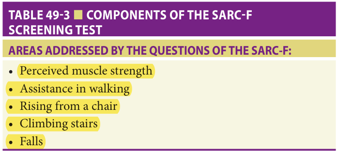
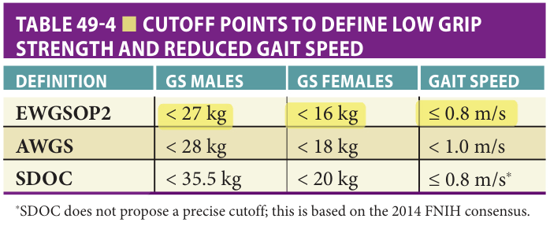

Study summary of Chapter 49 — Muscle Aging and Sarcopenia; the book is the reference.

# Chapter 49 Study: Muscle Aging and Sarcopenia

**Full chapter available: [Read Chapter 49](?chapter=49).**

*Fast build from the book; not lane-reviewed.*

## Summary

### Muscle aging and the evolution of sarcopenia

**[p. 729]**

- Sarcopenia combines loss of muscle strength, physical function, and muscle mass. Muscle is important both for mobility and protein regulation. Adult muscle mass declines about **8% per decade after age 40**; the rate accelerates and almost doubles after **70**. Strength declines faster: about **3–4% per year after age 50** (p729).
- The motor unit comprises a neuron, its axon, and the muscle fibers it innervates. Neuromuscular transmission links the nerve terminal to the muscle. The chapter distinguishes slow oxidative fibers from faster fibers adapted to greater force (p729–730).

**[p. 730]**

- Aging reduces motor neurons and muscle fibers, preferentially affecting fast fibers. Denervation causes weakness; surviving neurons reinnervate larger fiber bundles. Fast fibers may acquire a slower phenotype, reducing force and power. Reduced firing capacity means ordinary tasks such as stairs or chair rising require recruitment closer to maximal effort (p730).
- Type I fibers contract slowly and resist fatigue; type IIa fibers are fast with intermediate fatigue resistance; type IIx fibers are very fast, powerful, and readily fatigued (Table 49-1, p730).
- Sarcopenia is a progressive, generalized skeletal-muscle disease associated with adverse outcomes. Muscle mass alone predicts outcomes poorly; strength and physical performance, especially gait speed, are more informative (p730).

**[p. 731]**

- Figure 49-1 illustrates motor-neuron loss, denervation with fiber atrophy/death, and compensatory sprouting that produces larger motor units. Consensus definitions subsequently added functional measures to estimates of muscle mass (p731).

### Definitions: strength, mass, and performance are different measurements

**[p. 732]**

- **EWGSOP2:** assess strength first when sarcopenia is suspected; use muscle mass to confirm a muscular contribution to weakness. The book calls low strength without a mass measurement **“suspected sarcopenia.”** Muscle quality may substitute for mass; low physical performance indicates severity and greater adverse-outcome risk. Case finding uses symptoms or questionnaires (p732).
- The updated **AWGS** approach also starts with case finding, but setting changes the pathway. In specialized care, strength precedes performance and mass assessment. Its criteria and thresholds are not interchangeable with the European criteria (p732).
- **SDOC:** low grip strength and slow usual gait speed independently predict falls, mobility limitation, hip fracture, and mortality in community-dwelling older adults. DXA lean mass did not predict incident adverse outcomes, with or without body-size adjustment; SDOC recommends including strength and gait speed, excluding DXA low muscle mass from its definition (p732).
- Definitions that use low mass alone can yield community prevalence as high as **40%**; definitions incorporating function give about **10–15%**. Incidence may exceed **3% per year**, but has been studied less (p732).
- **Official-question navigation:** the mass/strength/performance measurement question cites this page; the book's detailed explanation of **BIA/DXA = mass, handgrip = strength, SPPB = performance** is on [p735](#p735). Do not swap these domains.

**[p. 733]**

- Figure 49-2 summarizes the progression from mass-only definitions to multidomain definitions and the strength/performance emphasis. Prevalence may exceed **20%** in hospitalized older adults, **50%** in postacute/rehabilitation settings, and **40%** in nursing-home residents; no clear sex difference is established (p733).
- Long-term low protein intake, chronic disease limiting mobility/nutrition, low-grade inflammation, and diabetes are relevant risks. Associations with micronutrients and lifetime physical activity are less secure. Diabetes and sarcopenia can reinforce one another through reduced glucose disposal and intramuscular adiposity (p733).
- Sarcopenic obesity combines excess adiposity with inadequate muscle mass or strength for the body load; its definition remains unsettled in this chapter. Sarcopenia is associated with mortality, frailty, disability, hospital use, and poorer quality of life; the chapter is more cautious about falls/fractures, institutionalization, and total costs (p733).

### Mechanisms, case finding, and SARC-F

**[p. 734]**

- Aging impairs the balance of protein synthesis and breakdown: uptake falls, catabolism probably rises, and muscle is lost. Fast fibers and their satellite cells are particularly affected. Increasing extracellular and intra-/intermuscular fat produces **myosteatosis**. Mitochondrial dysfunction, altered IGF-1/mTOR/FoxO signaling, and altered gene expression are also implicated (p734).
- Neural control changes contribute, but their relative importance is uncertain. Nutrition alone cannot correct neural impairment; exercise acts through both neural and muscular pathways. Muscle–bone endocrine communication is being studied. Coexisting osteoporosis and sarcopenia increase adverse outcomes; the chapter calls this **osteosarcopenia** (p734).
- **SARC-F asks about perceived strength, assistance walking, rising from a chair, climbing stairs, and falls.** It can be self-administered. It does not ask about descending stairs, bed transfers, or bone-density measurement as its listed components (Table 49-3, p734).
- The book reports high sensitivity at a low cutoff **>1 point** and good specificity at a high cutoff **>4**. Preserve those printed inequalities. Screening has **not been proved cost-effective**, universally or in selected settings/populations. SARC-F can help in settings with a high expected prevalence, including geriatric clinics, hospital, rehabilitation, and nursing homes; modified versions may add calf circumference (p734).
- Weakness, slow movement, visible wasting, falls, ADL difficulty, or difficulty rising from bed/chair can trigger assessment even without questionnaire screening. Under the chapter's EWGSOP2 pathway, first measure **handgrip strength** using a validated standardized protocol. A hydraulic Jamar dynamometer has the largest evidence base. Direct leg-strength testing requires more expensive equipment and lacks established population cutoffs; grip is a practical proxy (p734).

Book table: SARC-F components (p734)

*Highlighting is the owner's annotation, not the book's.*

This table supplies the content tested by the official SARC-F question; the official reference names the page, without a table label.

### Measuring strength, muscle mass, and whole-body performance

**[p. 735]**

**Grip strength and gait speed: use the definition's own cutoffs** (Table 49-4, p735).

| Definition | Low grip, men | Low grip, women | Reduced gait speed |
| --- | --- | --- | --- |
| EWGSOP2 | <27 kg | <16 kg | ≤0.8 m/s |
| AWGS | <28 kg | <18 kg | <1.0 m/s |
| SDOC | <35.5 kg | <20 kg | ≤0.8 m/s* |

*The table says SDOC does not propose a precise gait cutoff; its displayed value is based on the earlier FNIH consensus (p735).*

- Low grip raises suspicion for sarcopenia, but also consider **hand osteoarthritis, low motivation, and neurologic disease**. Low grip predicts adverse outcomes regardless of cause and warrants intervention even if further testing is unavailable (p735).
- **Muscle mass:** available tests estimate mass using assumptions; inter-/intrarater variability and inconsistent cutoffs limit precision. Low mass can arise from malnutrition or cachexia, and does not consistently predict adverse outcomes. Measuring it can nevertheless link weakness to a muscle problem. Creatine dilution is being developed to measure active muscle mass (p735).
- **DXA** has the widest evidence and can simultaneously assess bone density. Usually it estimates appendicular lean mass, often adjusted for height. **BIA** is useful at bedside, but equations and cutoffs depend on population and device. Neither measures muscle strength (p735).
- **CT/MRI** can estimate mass using a cross-sectional psoas or thigh image; opportunistic scans may be useful in surgery/oncology, but outcome links still need larger studies. **Ultrasound** is a promising simple method, with SARCUS standardization proposed, but validated cutoffs for major muscles are lacking. Very low mass together with weak grip is more convincing than borderline measurements (p735).
- **Muscle quality** may mean force per unit mass or structural characteristics such as adiposity/fiber composition. It is not sufficiently defined for routine clinical use. Imaging measures of fat infiltration or heterogeneity require demonstrated outcome relevance (p735).
- **Physical performance** assesses whole-body tasks integrating muscle, nervous system, cardiovascular function, vision, and balance. Gait speed commonly uses a **4–6 m** course; even a **0.1 m/s** loss predicts worse outcomes. Its role differs across definitions: outcome, defining criterion, or severity marker (p735).
- **SPPB** adds balance and a sit-to-stand measure of strength/power/endurance to gait speed. It is used to assess sarcopenia or its severity, is validated in varied settings, and is associated with frailty. It is a composite performance test rather than a muscle-mass measurement (p735–736).

Book table: grip and gait thresholds, including the SDOC footnote (p735)

*Highlighting is the owner's annotation, not the book's.*

Supporting table on the cited page; the official SPPB question does not explicitly cite this table.

### Causes and the malnutrition–cachexia–frailty differential

**[p. 736]**

- Sit-to-stand can substitute as a strength proxy when a dynamometer is unavailable. **TUG assesses physical performance**; other options include the **6-minute** walk or **400 m** walk. Blood/tissue biomarkers remain investigational; neuromuscular-junction, inflammatory, micro-RNA, hormonal, and metabolic markers have not produced a conclusive diagnostic test (p736).
- Once confirmed, use comprehensive geriatric assessment to find causes. Table 49-5 includes: bone/joint disease (arthritis, osteoporosis); cancer with or without cachexia; heart failure/COPD; diabetes or hypoandrogenism; chronic liver/kidney disease; neurologic disease; inactivity or prolonged bed rest; anorexia/oral problems; low intake, especially protein; micronutrient deficiency; malabsorption/GI disease; and iatrogenic factors such as corticosteroids, hospital admission, or advice to restrict mobility. Causes commonly coexist and may not all be treatable (p736).
- With gradual chronic onset and no apparent cause, diagnose **primary age-associated sarcopenia** and explore long-term habits (p736).
- **Malnutrition:** GLIM includes **3 phenotypic domains** (nonvolitional weight loss, low BMI, reduced muscle mass) and **2 etiologic domains** (reduced intake/assimilation; inflammation/disease burden). Low mass should trigger assessment of the other criteria. **Low mass with preserved muscle function suggests malnutrition as the main diagnosis** in the chapter's differential. If both mass and function are low in a malnourished person, malnutrition has often caused sarcopenia; they can coexist (p736).
- **Cachexia:** severe weight loss and wasting in cancer, HIV infection, or end-stage organ failure. Low muscle mass overlaps with sarcopenia, but excess catabolism/inflammation and endocrine/neurologic changes differ. Determine which syndrome predominates because cachexia does not respond to sarcopenia treatment as described here (p736).
- **Frailty:** the physical phenotype overlaps through unintentional weight loss, weakness, and slow walking. Sarcopenia is a major contributor, but physical frailty can arise from nonmuscular disease and mild sarcopenia need not cause frailty. These diagnoses overlap without being equivalent (p736).

### Treatment: resistance exercise, adequate nutrition, and limits of drug evidence

**[p. 737]**

- Address causes and risk factors from geriatric assessment. The chapter reports no trials of a full multimodal approach at that time. Its cited guideline gives a strong recommendation to **physical activity**, with **resistance exercise** the supported treatment for muscle mass and function; nutritional recommendations are weaker/conditional (p737).
- Use repeated movements against weights or elastic bands, working **both upper and lower limbs at least twice weekly**. Objective improvement takes approximately **3 months**; the optimal mode, intensity, and duration remain incompletely defined. Begin with exercise/physical-therapy instruction and supervision, then progress to unsupervised work as appropriate. Adherence, supervision, and peer support matter (p737).
- Resistance work may sit within a program containing aerobic and balance exercise, stretching, and range-of-motion work. The book specifically says ordinary walking, swimming, dancing, or cycling **without resistance exercise will not improve sarcopenia**. Advice simply to be more active and less sedentary has not been tested as its treatment and should not replace a formal program (p737).
- **Protein:** the chapter raises the former **0.8 g/kg/day** target to **1–1.2 g/kg/day in healthy older adults**, and **up to 1.5 g/kg/day in disease**. Review intake with a nutrition professional; if food cannot meet requirements, consider high-protein oral nutritional supplements, generally complete supplements rather than protein alone (p737).
- **Leucine and HMB** have shown some gains in muscle mass/function, with mild sarcopenia appearing more responsive, but the best candidates remain uncertain. Trials generally used complete oral supplements, so isolated leucine/HMB effects in older adults are unknown. Some evidence supports fish-oil-derived omega-3 fatty acids and creatine; it is less established than resistance exercise (p737).
- **Vitamin D has not demonstrated improved muscle function in sarcopenic patients**; severe deficiency is a setting in which supplementation may help muscle function (p737).
- Combined nutrition/exercise trials have mixed results, with synergy in only some. Match carbohydrate/fat energy intake to increased expenditure. Protein incorporation has a higher threshold and restricted timing in older muscle; a timed protein boost appears preferable to simply increasing intake across the day, with basic research suggesting greatest uptake immediately after exercise (p737).
- **At the time of the book, no drug was approved for sarcopenia.** Trials of estrogen–progesterone, DHEA, growth hormone, growth-hormone-releasing hormone, combined testosterone/growth hormone, and IGF-1 were negative; many did not recruit well-defined sarcopenic patients. Increasing mass is not the same as improving function (p737–738).

**[p. 738]**

- Testosterone may increase mass in men with low testosterone but has not convincingly improved physical function and has adverse effects. Larger SARM trials have not confirmed early promise; pioglitazone and ACE-inhibitor trials were negative. Myostatin inhibition can increase mass, but functional effects are limited; some early positive studies did not enroll diagnosed sarcopenia (p738).
- Follow the diagnostic parameters, but recognize that mass change is technically difficult to measure and may not reflect meaningful benefit. A minimum clinically significant strength change is not established. Gait-speed improvement **>0.1 m/s** or SPPB improvement **>1 point** is considered clinically relevant. Mobility, domestic activities, falls, fatigue, quality of life, and ADLs are meaningful patient outcomes (p738).

**[p. 739]**

- Further-reading references conclude the chapter here; clinical narrative ends on the preceding page (p738–739).

## Drill

**1. What distinguishes sarcopenia from an isolated finding of low muscle mass?**

Answer

Modern definitions incorporate muscle function. Strength and performance predict adverse outcomes better than mass alone; the precise combination depends on the chosen consensus definition (p730–732).

**2. Under the chapter's EWGSOP2 approach, what comes first, what confirms muscle involvement, and what indicates severity?**

Answer

Strength first; muscle mass or quality supports confirmation; low physical performance indicates severity. The book calls low strength without mass measurement “suspected sarcopenia” (p732).

**3. Which domain is assessed by BIA/DXA, handgrip, and SPPB?**

Answer

BIA/DXA estimate muscle mass; handgrip measures strength; SPPB assesses composite physical performance. The official measurement question points to p732, but the instruments are explained on p735 (p734–735).

**4. What are all the SARC-F components?**

Answer

Perceived strength, assistance walking, rising from a chair, climbing stairs, and falls. Falls is the correct component in the official question (Table 49-3, p734).

**5. What cutoff tradeoff does the book describe for SARC-F, and has screening proved cost-effective?**

Answer

High sensitivity with a cutoff >1 point; good specificity with a cutoff >4. Screening cost-effectiveness has not been established (p734).

**6. Give the EWGSOP2 grip and gait thresholds, and explain the SDOC gait footnote.**

Answer

Grip <27 kg in men and <16 kg in women; gait ≤0.8 m/s. The table also displays ≤0.8 m/s for SDOC but explicitly says SDOC has no precise cutoff and this value derives from the earlier FNIH consensus (Table 49-4, p735).

**7. What may cause low grip strength other than sarcopenia, and why still act on the finding?**

Answer

Hand osteoarthritis, low motivation, and neurologic disorders are examples. Low grip predicts adverse outcomes regardless of cause, so intervention is justified even if additional tests are unavailable (p735).

**8. Why is a bedside BIA result less definitive than a direct measurement of muscle function?**

Answer

BIA estimates mass using device- and population-specific equations/cutoffs; limited standardization reduces accuracy. Mass measures do not consistently predict adverse outcomes, whereas functional measures have stronger prognostic links (p732, p735).

**9. What does SPPB add to gait speed, and what can replace a dynamometer when needed?**

Answer

SPPB adds balance and sit-to-stand performance reflecting strength/power/endurance. Sit-to-stand can also serve as a strength proxy without a dynamometer; TUG is a physical-performance test (p735–736).

**10. A person has low muscle mass, preserved gait/grip, and low food intake without a catabolic disease. Which diagnosis does this chapter prioritize?**

Answer

Malnutrition: low muscle mass without impaired muscle function favors it as the main diagnosis. Assess the other GLIM domains; low mass alone does not establish sarcopenia, cachexia, or frailty (p736).

**11. How do cachexia and physical frailty overlap with, but differ from, sarcopenia?**

Answer

Cachexia is severe weight loss/wasting in disease with excess catabolism and inflammation and may coexist with sarcopenia. Frailty overlaps through weight loss, weakness, and slowness, but can arise from nonmuscular disease; mild sarcopenia need not cause frailty (p736).

**12. What exercise prescription is supported, and when might measurable benefit appear?**

Answer

Resistance exercise using weights or bands for upper and lower limbs at least twice weekly, initially with expert instruction/supervision. Objective improvement takes approximately 3 months; aerobic activity alone is insufficient in the book's account (p737).

**13. What protein targets does the chapter give for healthy older adults and those with disease?**

Answer

1–1.2 g/kg/day in healthy older adults; up to 1.5 g/kg/day with disease, compared with the former 0.8 g/kg/day recommendation. Consider high-protein oral supplements when usual food cannot meet the target (p737).

**14. What limits the conclusions about HMB/leucine and vitamin D?**

Answer

HMB/leucine usually appeared within complete supplements; isolated effects and optimal candidates remain uncertain. Vitamin D has not improved function in sarcopenic patients overall, though severe deficiency may be a responsive setting (p737).

**15. Which functional changes are clinically relevant when assessing treatment?**

Answer

Gait-speed improvement >0.1 m/s or SPPB improvement >1 point. Mass gain alone is insufficient; mobility, daily activities, falls, fatigue, and quality of life matter to patients (p738).

### Table 49-3 — existing book image

[Hazzard 8e, Table 49-3, p.734](#p734)

[2024-Sep Q65](?chapter=bank&q=mcq-59f85952926fe582c920abfa)
