# Hazzard's Geriatric Medicine and Gerontology, 8e - Chapter 4: Psychosocial Aspects of Aging

Steven M. Albert, Cynthia Felix

> **Status.** Fast build from the book; not lane-reviewed.

> Excluded from the IMA required reading list (P005-2026); not cited in the 2020-2026 past papers.

> **Source and method.** Printed pages 65-82, from the marked 8th-edition copy (PDF page = printed page + 34). Prose follows its text layer; tables and figures are source-page crops. The book is canonical.

**[p. 65]**

## OVERVIEW

As people age they experience changes in physical and cognitive capacities, such as gait speed and reaction time, and also changes in emotional experience and social interests. Cultures impose an order on this continuum of change in widely shared understandings of the life course, which partition the lifespan into different stages. One of the most famous is Shakespeare’s seven ages of man (As You Like It, II, 7). The Elizabethan stages of life include infancy, “whining school boy ... creeping unwillingly to school,” lover, soldier (“seeking the bubble reputation even in the cannon’s mouth”), judge, and then two stages of decline: initial loss of capacities (“big manly voice, turning again toward childish treble”), and finally “second childishness and mere oblivion ... sans teeth, sans eyes, sans taste, sans everything.” Other cultures are more charitable in their ideas about advanced age. The Samia people of Kenya describe old age as a pleasant time to sit before the fire and be fed. Such differences in thinking about the life course remind us that psychosocial aging is governed both by biological and sociocultural elements. A major focus of developmental approaches to psychosocial aging is to distinguish between invariant biological change and cultural constructions that selectively emphasize particular transitions across this continuum of change.

#### Learning Objectives

- Apply the life course perspective to show how psychosocial changes with age depend on cultural factors as well as lifespan developmental changes in affective experience.

- Identify core psychosocial factors, including resilience, that affect well-being across aging-related challenges, such as increasing disability, declining health, and the end of life.

- Identify current trends in common old-age transitions, such as retirement, widowhood, and caregiving, and sociocultural factors that make these transitions more or less stressful.

- Examine psychosocial factors that affect decision making and quality of life at the end of life.

#### Key Clinical Points

1. Lack of support (social isolation and loneliness) has a negative effect, and social engagement (volunteering, lifelong learning, and involvement in intergenerational programs) has a positive effect, on health and well-being in old age.

2. Social environments that promote aging in place support psychosocial health.

3. The aging services network is important in promoting engagement across diverse domains.

4. Hospice and palliative care promote involvement of older people in decision making at the end of life and the psychosocial health of family caregivers.

### Life Course Developmental Perspective

There is no single age at which we can say that people cross the threshold into “old age” and become an “older adult.” People age at different rates; hence, for any given age, there will be great variation in proposed biomarkers of aging or phenotypes of healthy aging. In the United States, establishment of the Social Security system linked old age to age 65, but research on the start of aging and its pace suggests that adults with the same chronologic age differ in proposed aging biomarkers and that accelerated aging may have social determinants, such as experience of adverse childhood events and poverty.

But people do have an idea of when they become old. A number of surveys have asked at what age someone is old. The start of “old age” can be assigned to a wide range of chronological ages. Choices of an age for “old age” tell us the decade when people are expected to slow down, retire, and focus on self-maintenance rather than new careers

or goals. Figure 4-1 shows the age at which respondents consider women to be old. These data are drawn from the National Council on Aging Myths and Realities of Aging survey, conducted in 2000. The data are weighted to reflect the sampling scheme and overrepresentation of older people and minorities. The figure plots the mean age “the average woman” is said to be “old” by respondent’s age and sex.

**[p. 66]**

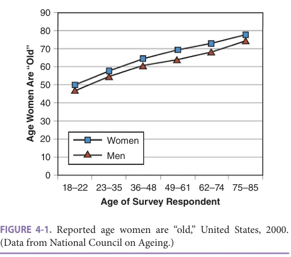

*FIGURE 4-1. Reported age women are “old,” United States, 2000. (Data from National Council on Ageing.)*

*Owner annotations/highlights are from the marked source copy, not the book.*

Note the strong relationship between the survey respondent’s age and his or her report of when women are old. Young people consider the start of old age to be much earlier than older people. For people around age 20, women become old at age 45 or 50. By the time respondents reach their sixth or seventh decades, old age is pushed back to the late 60s and early 70s. Note the strong gender difference in reports of when a woman is old. Female respondents date the start of old age to a later age than men, whatever the respondent’s age. Women consider old age to begin 2 to 4 years later than men. These differences suggest a need to consider social elements when examining perceived age-related changes.

### Cultural Variation in Definitions of the Life Course

The relevance of social or cultural factors in conceptions of the life course is evident in the “infantilization” of older adults, such as use of baby talk or saccharine language applied to frail or very old people. Cognitive anthropological studies show that cultural dimensions, such as productivity, vulnerability, and reproductive potential, underlie judgments of “young,” “middle-aged,” and “old.” In one study, respondents were asked to group hypothetic agelinked social statuses according to similarity. Multidimensional scaling analyses revealed that respondents grouped old people and children together as opposed to people of middle age. This cultural logic may explain why baby talk is often applied to older people with cognitive impairment or other disabilities and terms typically reserved for children are often applied to older people. The reverse is also true: younger adults who are not active, not interested in new experiences or travel, not willing to switch careers, or who are slow, deliberate, or risk averse, are often called “old” or “old before their time.” We are enjoined “to act our age.”

Even this brief discussion of the use of age criteria to label behaviors suggests that attitudes toward aging and old age are mostly negative. Old age is usually seen as a time of decline, withdrawal, vulnerability, and even reversion

to childhood. In this view, aging is not welcome and little should be expected of older people, except perhaps to ease decline, provide care, and protect people from exploitation or danger related to their increased vulnerability. These are the elements of “ageism”: assumptions of disability or vulnerability (and hence need for protection) based on age, rather than actual competencies. A goal of developmental approaches to psychosocial aging is to avoid such oversimplifications and cultural biases to determine the range of changes in social, affective, and cognitive experience associated with aging.

## DEVELOPMENTAL CONSTRAINTS ON RESILIENCE AND THE STRESS PROCESS

Understanding the role of psychosocial factors in late life requires that we first take a high-altitude view of human development to identify the basic biological and social forces that fundamentally shape the development of people as they age and the ways they respond to challenges associated with aging. These forces are typically viewed as constraints and can be briefly summarized in four propositions.

The first is that biological development follows a sequential pattern. Although there is considerable interindividual variability in biological development, overall biological resources across the lifespan resemble an inverted U-function. During childhood and adolescence, cognitive and physical abilities increase and provide the basis for the development of complex motor and cognitive skills. Physical development plateaus during adulthood and then later declines. Cognitive function, especially “fluid” capacities, decline in old age even apart from dementing disease.

Second, societies impose age-graded structural constraints on development. Lifespan psychologists and sociologists emphasize that all societies impose age grades. These roles provide predictability and structure at both individual and societal levels. A prototypical case is childbearing in women, which is shaped by both social institutions and biological constraints.

Third, life is finite. Whatever is to be achieved or experienced in life has to be done in a limited period of time, typically fewer than 80 to 90 years. At any given point in an individual’s life, the anticipated amount of time left to live may shape behavior and affect in important ways.

Fourth, genetic endowment is a limiting factor on biology and behavior. Although the potential behavioral repertoire of humans is vast, function in a given domain is often constrained by genetic makeup.

In this view of development, the accumulated resilience or adaptive capacity of individuals will vary as a function of the individual’s location in the life course. Behavioral resources and psychological reserves may be greater at older ages because of accumulated life experiences, acquisition of skills, and increased knowledge. The type and intensity of biological pathways activated by stressful encounters

**[p. 67]**

as well as the manifestation of overt disease will also vary as a function of the individual’s position in the life course.

## PSYCHOSOCIAL FACTORS, HEALTH, AND QUALITY OF LIFE

Psychosocial aspects of aging are involved in changes in many domains, including work, retirement, residence, sexuality, stress, widowhood, emotion, mental health, social support, and friendship, to name just a few. A broad conceptual framework identifying key psychosocial factors is presented in Figure 4-2. At the far left, the model identifies a broad array of sociodemographic characteristics that directly and indirectly shape individual development, quality of life, and health throughout the life course. For example, many of the health disparities in our society, such as differences in life expectancy or risk of low birth weight, have been linked to socioeconomic status (SES), race and ethnicity, and gender.

Environmental and social resources and constraints include multiple indicators known to affect health

outcomes, including physical and social characteristics of environments. Discrimination, negative life events, and existing comorbidities can be major sources of constraint, while religious involvement and social support are often important protective resources.

Psychological influences include positive factors, such as optimism, self-esteem, mastery, and control, as well as negative effects, such as depressive symptoms and perceived stress. The effects of psychological and social/environmental factors on health are mediated by health behaviors and biological pathways, such as the central nervous system and endocrine response. Although the causal links between these groups of variables are still debated (hence no arrows are shown in the figure), all are clearly important contributors to health and quality of life.

### The Biology of Psychosocial Aging

Biological changes are relevant to psychosocial aging. Latelife depression (LLD) may stem from inflammatory and hormonal abnormalities. LLD is often associated with greater chronicity, relapse, resistance to treatment, and suicide risk,

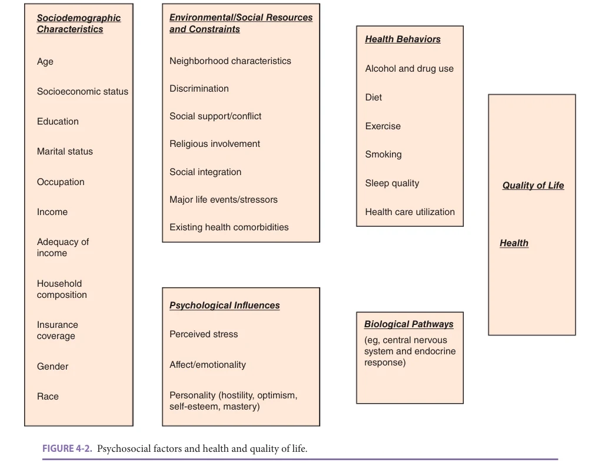

*FIGURE 4-2. Psychosocial factors and health and quality of life.*

*Owner annotations/highlights are from the marked source copy, not the book.*

**[p. 68]**

as compared to depression in younger adults. It may also be comorbid with dementia and hence points to the need to evaluate cognitive status. In women, the perimenopausal transition, but not necessarily the postmenopausal stage, can be associated with depression, resulting from declining and fluctuating estrogen levels. Among people undergoing chronic stress, chronically elevated serum cortisol can generate a proinflammatory milieu and accelerate the aging process, a phenomenon known as inflammaging.

Age-related decline in melatonin secretion from the pineal gland at night may explain sleep disturbances among older adults. Poor sleep hygiene may contribute to increased irritability, poor mood, and elevated dementia risk in this population. The declining functional status of organ systems associated with the aging process, including, for example, diastolic heart failure, may limit activities and therefore socialization. Reduced vision and hearing may also contribute to reduced social interaction.

Purposeful efforts at social engagement may aid in dementia prevention by maintaining brain cellular integrity before gross atrophy sets in. Recent research has shown that greater social engagement among older adults is associated with greater microstructural integrity of brain cells.

## SOCIAL RELATIONSHIPS

In highlighting core psychosocial factors and mechanisms linked to health and well-being, we discuss four psychosocial domains—social integration, stress, personality, and affect—that are critical to understanding health and quality of life in old age.

### Social Integration

Social integration is the degree to which an individual is involved with others in a larger community. Maintaining social relationships is critical to the health and well-being of older adults. Involvement in satisfying relationships is associated with physical health, including, for example, decreased risk of cardiovascular disease, functional decline, and mortality. Positive social interactions further support the psychological well-being of older adults through helping them maintain meaning in life, and such interactions are also associated with increased sense of life satisfaction and happiness.

When attempting to understand the mechanisms by which social support affects health and well-being, there are two potential explanations. One, the buffering hypothesis, suggests that social ties and social support promote health by acting as buffers to the effects of life stressors and negative events. Another is the direct effect hypothesis, which suggests that social ties and social support have a positive impact on health apart from stress. By the same token, negative social interactions may have detrimental effects on health and well-being.

It is important to consider the composition of social networks, which includes the number of family members,

friends, neighbors, and acquaintances, and the density of social ties. Research indicates age differences in the size and composition of social networks, with networks shrinking at greater ages. A countervailing force is the larger proportion of well-known social partners in these smaller networks. According to socioemotional selectivity theory, discussed later, these changes serve an emotional regulatory function for older adults. Smaller networks with well-known social partners allow older adults to increase predictability in social interactions and maximize positive and minimize negative interactions. Based on this theory, the smaller size of networks in old age, therefore, does not necessarily indicate lack of support but may instead serve a protective function.

### Social Isolation and Loneliness

Research suggests that a low level of social activity and social contacts is associated with poor functional outcomes. Loneliness, or perceived social isolation, may be most important for health effects. Population-based studies show that loneliness is associated with increased morbidity, including cardiovascular illness, coronary heart disease, and depressive symptoms, as well as mortality. Loneliness has also been associated with personality disorders and psychoses, suicide, impaired cognitive performance and cognitive decline over time, and increased risk of Alzheimer disease. Interventions that address social isolation, such as programs that enhance social skills, provide social support, or increase opportunities for social interaction, reduce isolation; but successful interventions may also need to address maladaptive social cognition through cognitive behavioral therapy to reframe perceptions of loneliness and personal control.

### Family and Intergenerational Relationships

The intergenerational solidarity paradigm is a common model for assessing intergenerational relations in the context of aging families. The intergenerational solidarity paradigm includes seven dimensions:

• Affective solidarity (sentiments of emotional closeness) • Conflict (negative expressions of emotions and arguments) • Associational solidarity (social interaction and frequency of communicating) • Structural solidarity (opportunity for interaction based mostly on geographic proximity) • Normative solidarity (filial obligation or filial norms, which includes attitudes toward help and support from adult children to aging parents and vice versa) • Consensual solidarity (perceived and actual agreement on values and opinions) • Functional solidarity (provision or exchange of financial, instrumental, and social support)

Recognizing these dimensions of family solidarity is essential for understanding how families provide support to older adults.

**[p. 69]**

### Social Support and Family Caregiving

The widely held belief that contemporary families do not provide care for their aging members has been disproved by years of research. In fact, families continue to be the mainstay of long-term care and social support to older adults. While the majority of older adults in the United States live in independent households, older adults rely on children when they need support. Policymakers consider families the key source of support for meeting the growing needs of the older population. While spouses, mainly wives, provide most family caregiving support, adult children provide the bulk of care when a spouse is absent or unable to care.

Four forms of support are exchanged across generations: (1) emotional support: the expression of empathy, caring, concern, and love; (2) instrumental support: provision or direct assistance in instrumental activities (eg, transportation, shopping, cooking, cleaning, yard work, and house repair) or personal self-maintenance care, such as help with bathing, dressing, and feeding; (3) informational and organizational support: support in decision making, care coordination and management, and financial management; and (4) financial support: income transfers.

Overall, the exchange of support has a positive effect on a care recipient. However, receiving instrumental support may have a mixed effect on functional status.

Greater frequency of instrumental support may increase the risk of subsequent disability. Furthermore, receipt of instrumental support may lead to feelings of helplessness, perceptions of low mastery and autonomy, and reduced self-efficacy and sense of control.

The extent to which support is given, received, or exchanged between adult children and aging parents depends on several factors, some related to the adult children, others to the aging parents, others to the relationship between adult children and aging parents, and still others to the larger contexts governing relationships. Figure 4-3 displays the many factors involved in predicting parental support, described here.

Characteristics of the adult child Findings regarding gender differences in filial norms toward older parents are mixed. While sons and daughters seem equally committed to provide care to aging parents, gender differences are apparent for specific types of support. Adult sons are more likely to provide financial and instrumental support, while adult daughters are more likely to provide personal care, complete household chores, and offer social support.

Another predictor is income or more generally, social class, as it affects both the need and the availability of support. Financially and educationally advantaged families can more easily purchase care on the private market, thereby

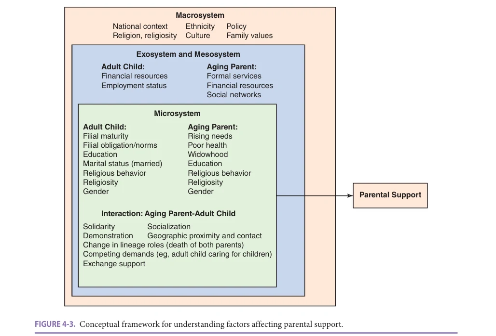

*FIGURE 4-3. Conceptual framework for understanding factors affecting parental support.*

*Owner annotations/highlights are from the marked source copy, not the book.*

**[p. 70]**

diminishing their sense of obligation to provide care themselves. Lower-income families are less likely to purchase services and express stronger filial obligation.

Marital disruption and remarriage have a major impact on parental support and filial obligation. Divorce disrupts the exchange of support between parents and children. Some research suggests that divorced children feel less filial obligation. Additionally, divorce affects the amount of resources available to help family members and breaks ties that may be important for the needs of their parents. In addition, divorces and remarriages may increase the number of potential care recipients per adult child by adding stepparents and other step relatives. Having more kin as potential care receivers may diminish the amount of care given by each one. Widowed and divorced parents receive more help than married parents.

Financial factors also play a role. Aging parents with higher financial resources can purchase services and may access services of higher quality, thereby diminishing the need for some types of informal care from children.

Interrelationship between the adult child and the aging parents Affectual solidarity between parents and their children is a major factor in the exchange of intergenerational support. Adult children who witnessed their parents care for their own parents are more likely to provide support, emphasizing the role of social learning on the likelihood of parental caregiving. The presence of siblings in the family is also a predictor of intergenerational assistance. Only children are relied upon for all necessary support, while individuals with siblings can share responsibilities. Most research in the United States shows that older parents who have more children receive higher levels of support.

The presence of young children in the adult child’s house is a competing demand that diminishes the capacity of adult children, and especially women, to provide support to their aging parents. Greater geographic distance and limited face-to-face contact also reduce the incidence of all types of intergenerational exchanges and represent a significant barrier to intergenerational support.

Effects outside caregiver-care-receiver dyad Most research shows that women’s paid work does not change the likelihood of caregiving. When faced with the need to provide parental caregiving, employed women are likely to withdraw from the labor market, sacrifice leisure activities and sleep, pass up opportunities for promotion, use vacation and sick days for parental care, cut back on some housework activities, and reduce work hours. Recognizing these pressures, caregiving advocacy organizations have called for greater flexibility in the workplace (eg, flex time, remote work, employee assistance programs, adult day programs on site).

The availability of formal services, supported through public sector investment, will affect the need for informal support. Advocates of small government fear that such services will “crowd out” families and lead to less efficient

service provision. An alternative view suggests that families and formal services complement each other in an efficient division of labor. For example, formal organizations are optimal in managing technical tasks in caregiving, while primary groups, such as families, are optimal for managing nontechnical support. As a result, a partnership between formal organizations and primary groups may be the best approach to negotiate informal and formal care.

Race and ethnicity also influence filial norms and parental support. Traditionally, African-American and Latinx cultures were viewed as giving greater emphasis to family ties (“familism”). However, recent research suggests type of support rather than level of support may best differentiate variation in caregiving.

## STRESS AND DISTRESS

Stress is a common response to physical, cognitive, and emotional challenges. The stressed person will experience adverse physiologic effects (primarily in the pituitary-adrenal axis and immune system) but also clinically appreciable effects on decision making, problem-solving, vigilance, social inference, and perceptual and motor skills. In this case, stress, a normal feature of interaction with an environment, becomes distress, prolonged stress that overwhelms physiologic and psychological regulatory mechanisms. Prolonged stress may be associated with accelerated aging.

For older adults, the rising prevalence of chronic disease and disability, increased awareness of cognitive or physical limitation, loss of valued social roles, and reduction in social networks through widowhood and loss of friendships all act as stressors that increase the risk of negative mental and physical states. The adverse effects of stress are lower for those who have strong social support systems and greater personal resources, but repeated losses in multiple domains may overwhelm supports.

Yet a robust finding from a variety of research settings has shown that older adults are able to maintain a sense of control even in quite challenging health circumstances. The older woman unable to leave the home or nursing home floor will station herself in a strategic position to retain a view of activity and encourage social interaction. The older man unable to ambulate in his home will place himself in a chair by the window that affords the clearest view of what is happening outside the home. In these ways older people with poor health and threats to autonomy or control may yet retain command over features of their living space.

### Stressful Life Events

Stressful life events have been linked to poor mental and physical health in individuals of all ages. Researchers interested in the relationship between stress and health have generally pursued two strategies to assess life event stressors. Major life events such as illness and death of a loved one are often assessed using checklists or interviews to gauge

**[p. 71]**

the frequency and intensity of these types of experiences. Daily hassles, on the other hand, are the bothers and challenges of day-to-day living and are measured with structured self-report or interviewer-administered instruments.

Compared to younger persons, older individuals experience fewer life events overall, although they experience more events involving loss, particularly those associated with declining health and deaths of friends and loved ones. Younger individuals report more hassles in the domains of finances, work, home maintenance, personal life, and family and friends, whereas older men and women report more hassles in domains reflecting social issues, home maintenance, and health. Overall, for both younger and older individuals, daily hassles are more potent determinants of physical and psychological well-being than major life stressors.

Older individuals demonstrate remarkable ability to adapt successfully to major life stressors. One important exception to this general observation occurs when older individuals are exposed to unrelenting chronic stressors, such as having to care for a spouse with Alzheimer disease. Under these circumstances the chronicity, intensity, and variety of stressors impinging on the caregiver exact a high price in physical and psychiatric morbidity, including increased risk of substance abuse, and in rare cases murder-suicide.

The considerable variability in response to major life stressors reflects resilience associated with aging. Resilience is the ability to recover from or benefit from adversity. Individuals able to overcome adversity are thought to have high levels of resilience, a combination of internal personality traits such as hardiness, self-efficacy, mastery, and optimism, along with a strong external support system. However, the empirical and clinical utility of the concept of resilience remains to be determined.

### Biological Consequences of Stress

Because increasing age is associated with significant alterations in the functioning of many physiologic systems, old age has become a fertile ground for examining the relation between stress, biological mediators, and disease. For example, a significant body of research views family caregiving as a chronic stressor with the ability to disrupt immune and neuroendocrine function. Compared to noncaregiver older adults, older caregivers have higher antibody titers for latent viruses, poor immune control over latent viral infections, reduced responsiveness of natural killer (NK) cells to cytokine signals, slower healing of wounds, poorer antibody responses to vaccination, and higher levels of basal cortisol. Physical health effects of caregiving include greater risk of infectious disease, hypertensive changes, increased prevalence of cardiovascular disease, and mortality. These findings suggest a strong link between stress, biological mediators, and illness; however, few studies have examined the progression of stress as a biological mediator of disease over time.

### Personality and Health

Personality is defined as psychological characteristics and attributes and associated behavioral patterns that differentiate one person from another. Personality has long been of interest to researchers, especially with respect to how it develops and may change across the lifespan. The five-factor model (FFM) of personality has been influential among gerontologists and claims that personality can be defined by five broad traits—openness to experience, conscientiousness, extraversion, agreeableness, and neuroticism— that remain relatively fixed into old age. Other important traits include mastery or control, the belief that important outcomes in life are under one’s own control, as well as optimism and hostility. Despite the relative stability of key traits, functional declines in late life may erode one’s sense of mastery, extraversion, or optimism.

An important emerging area of research is focused on the link between two distinct dispositional attributes and health. Enduring negative effects, such as anger, depression, and anxiety, increase the risk of morbidity and mortality, while positive effects have been linked to lower morbidity, decrease in symptoms and pain, and increased longevity. Multiple mechanisms account for the relation between dispositional affect and morbidity and mortality, including health practices such as diet, exercise, and sleep quality, biological processes such as cardiovascular reactivity, and the effects of the stress hormones epinephrine, norepinephrine, and cortisol. Inasmuch as individuals with positive affect are typically more pleasant to be around, they may also accrue health benefits through more positive social interactions and more attentive and higher-quality health care from health care providers.

## AFFECTIVE PROCESSES OVER THE LIFESPAN

Emotional life changes across the lifespan. If one talks to older people and asks about the emotions, one is likely to hear statements about the decline of emotion: “the highs are not so high anymore, but the lows are not so low either.” Older people speak wistfully of their more intense emotional life at younger ages but also report a good deal of relief at getting off that treadmill.

Population surveys, such as the General Social Survey (GSS) and Eurobarometer, track the prevalence of reported effects by age and across birth cohorts and confirm this broad pattern. “Hot emotions,” such as feeling excited about something or feeling overjoyed, decline in age crosssections. For example, in the GSS the proportion reporting they were overjoyed about something at least 1 day in the last month was 71% in people aged 18 to 29, 56% in people aged 40 to 49, and 47% in people aged 70+. By contrast, the proportion reporting they were fearful about something was 47%, 45%, and 30% in the same age groups. The contrast confounds developmental and birth cohort effects, but

**[p. 72]**

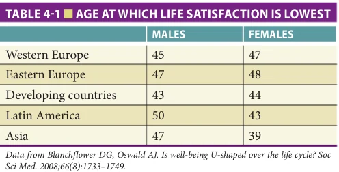

*TABLE 4-1 ■ AGE AT WHICH LIFE SATISFACTION IS LOWEST*

*Owner annotations/highlights are from the marked source copy, not the book.*

such changes have been reported as well for longitudinal cohorts.

The GSS and Eurobarometer surveys (which cover 72 countries and over a half million respondents) show that “life satisfaction” and depressed mood follow a U-shape distribution over the lifespan. Life satisfaction is assessed with subjective global appraisals, such as “Taken all together, how would you say things are these days—Would you say that you are very happy, pretty happy, or not too happy?” Table 4-1 shows the age at which life satisfaction is lowest in crosssectional surveys, adjusted for a number of important covariates, such as income, health indicators, marital status, and education. Life satisfaction is lowest at age 40 to 50 in both men and women and remarkably stable across continents.

Self-reported depressed mood follows the same pattern. Using the same surveys, depressed mood is also most common at ages 40 to 50, as shown in Figure 4-4.

If we turn to changes at older ages, we find that variation in emotional experience is related less to age than to disability, as shown by results drawn from the Women’s Health and Aging Study, WHAS-I. The sample included the most disabled third of older women living in the community. The sample of over 1000 women was divided into three age groups (65–74, 75–84, 85+) and three disability groups: women with “moderate disability” (limitations in

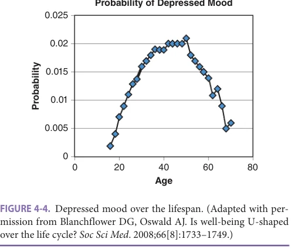

*FIGURE 4-4. Depressed mood over the lifespan. (Adapted with permission from Blanchflower DG, Oswald AJ. Is well-being U-shaped over the life cycle? Soc Sci Med. 2008;66[8]:1733–1749.)*

*Owner annotations/highlights are from the marked source copy, not the book.*

upper extremity, lower extremity, or instrumental activities of daily living [IADLs] but no difficulty with the basic activities of daily living [ADLs], such as bathing or dressing), those with ADL difficulty who were able to manage without personal assistance, and those with ADL difficulty who received personal assistance.

Tables 4-2 and 4-3 report the affective experience of these older women. Table 4-2 shows little variation by age group; mental health and emotional experience were quite similar across the age groups. Table 4-3, by contrast, shows the very strong association between disability and virtually all the indicators. For example, the proportion with depressed mood was 13% in women with moderate limitations, 16% in women with ADL difficulty not receiving help, and 29% in women with ADL difficulty who received personal assistance. The corresponding proportions by age group for depressed mood were 19% (age 65–74), 17% (age 75–84), and 14% (age 85+).

Results from WHAS-I show the strong effects of disability and poor health on mood, yet also great resiliency in the face of health limitation. About three-quarters of women with the most severe disability reported satisfaction with help. Over half the sample with the most severe disability still reported they were able to provide assistance to others to a satisfying degree. “Satisfaction with variety in life” declined from 70% to 51% across categories of disability, but again more than half of the women with severe disability reported satisfaction. By contrast, “satisfaction with the meaning and purpose of your life” was stable across age and disability categories; about three-quarters of these women, whatever their age or level of disability, reported such satisfaction.

Finally, this sample of women on the whole reported relatively low self-efficacy. Less than half reported confidence they could accomplish “anything I really set my mind to do.” However, only a minority reported “helplessness,” under 10% in the less severe disability groups and 20% in women receiving assistance with ADL tasks.

This inquiry suggests that disability has only a minor impact on mental health and general well-being. This is an important result. Most of the women in this sample were able to maintain well-being despite disability.

One theory advanced to explain these changes in emotional experience with age and disability involves “socioemotional selectivity.” The theory begins with recognition of the effect of limited time. Aging, health limitation, losses, and disability give time a different significance. Present-oriented goals are given greater value. Thus, older people will be more content with ongoing satisfying social experiences rather than novel experiences that may be emotionally “risky” (because they may be unsatisfying). This awareness of limited time leads to motivational changes that promote well-being and social adjustment and a skew in attention toward positive information. These theoretic predictions have been confirmed in a variety of experimental settings and may have a neural substrate. An unfortunate consequence may be greater susceptibility to financial scams.

**[p. 73]**

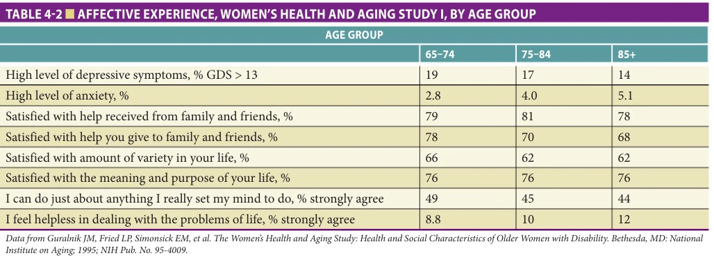

*TABLE 4-2 ■ AFFECTIVE EXPERIENCE, WOMEN’S HEALTH AND AGING STUDY I, BY AGE GROUP*

*Owner annotations/highlights are from the marked source copy, not the book.*

A related theory of psychosocial aging suggests that emotional change is part of a more general “selection, optimization, compensation” process. Older people become expert in managing depleted resources. Successful aging requires selecting domains to focus limited resources, optimizing investments of time, energy, and emotion to maximize gains, and compensating for losses. Minimizing losses in the emotional domain is consistent with socioemotional selectivity.

## ENVIRONMENTS TO SUPPORT PSYCHOSOCIAL HEALTH

### Aging in Place

Aging in place refers to the ability to remain in one’s home and community even when facing health and challenges in function. Surveys show that the majority of older adults with deteriorating health prefer staying in their home rather than moving to an institutional setting, and research suggests a positive relationship between aging in place and the wellbeing of older adults. The familiarity of the surroundings and the embedded social network and social support of

neighbors may support well-being. Beyond the benefits to older adults and their families, opportunities to age in place also contribute to the community as a whole. Older adults remaining in the community may support others through volunteering or caregiving activities. Furthermore, aging in place is superior to institutional care because of lower costs to families and government-funded long-term care. However, residence in skilled nursing facilities may be costeffective relative to home care in the case of older adults who require 24-hour care or advanced medical technologies.

Successful aging in place relies on the availability of supportive physical, social, and economic elements within the infrastructure of cities, towns, and communities. Since such elements may benefit other age groups, it is common to refer to communities that make a focused effort to increase safety and accessibility as age-friendly cities or livable communities. A report from the Stanford University Center on Longevity and MetLife Mature Market Institute provides a summary of the most important elements of a livable community required for successful aging in place. These elements, depicted in Figure 4-5, identify the

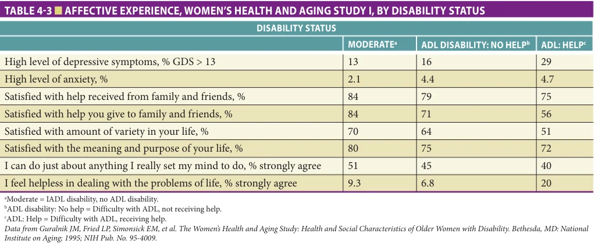

*TABLE 4-3 ■ AFFECTIVE EXPERIENCE, WOMEN’S HEALTH AND AGING STUDY I, BY DISABILITY STATUS*

*Owner annotations/highlights are from the marked source copy, not the book.*

**[p. 74]**

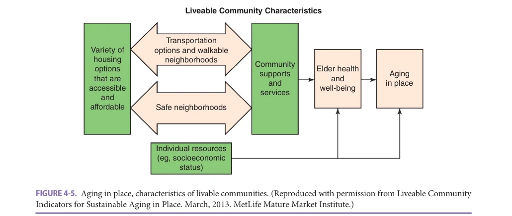

*FIGURE 4-5. Aging in place, characteristics of livable communities. (Reproduced with permission from Liveable Community Indicators for Sustainable Aging in Place. March, 2013. MetLife Mature Market Institute.)*

*Owner annotations/highlights are from the marked source copy, not the book.*

economic, social, and environmental supports that sustain older adults in their communities, including:

• Accessible and affordable housing options and availability of home modification services to adapt the home environment to the needs of an aging individual. • Availability of appropriate transportation options to ensure accessibility to and from the community and mobility within the community, along with safe walking conditions (ie, well-maintained sidewalks, benches, and parks). Communities ensure safe driving by providing protected left-turns, reasonable signage, and adequate lighting. Safe walking and driving conditions promote independence of older adults, an important contributor to health and well-being. • Availability of a wide range of supports and services and opportunities to participate in community life, including health care services, supportive services, groceries with healthy food options, and opportunities for flexible employment, volunteering, recreation, and socialization.

The World Health Organization (WHO) has developed a guide for age-friendly cities, which includes similar elements, as depicted in Figure 4-6. Both the MetLife and WHO models recognize that the physical, social, and economic environment is critical, but that successful aging in place also requires adequate individual resources, such as availability of supportive care, either through paid in-home services or from family or other informal caregivers.

### Long-Term Care: In-Home and Community-Based Services and Supportive Housing

Long-term care encompasses a wide spectrum of personal care services provided to individuals who need continual support. One end of the spectrum of services is informal care provided at home by a family member, typically a

spouse or adult child. On the other end is around-the-clock care provided by trained clinical teams in a skilled nursing facility. Between the two we find a variety of services that vary in the intensity, location, and cost of care.

The different options available to an older adult at home, in the community, and if needed, in residential settings are shown in Figure 4-7. Options for supportive care in the home include paid in-home health care, provided by nurses and allied health professionals, as well as homemaker and personal assistance services, provided by paraprofessionals. Other in-home services include home-delivered meals, social visiting from neighborhood organizations or programs such as the Senior Corps Companions, and support for medical equipment, such as oxygen, lymphedema

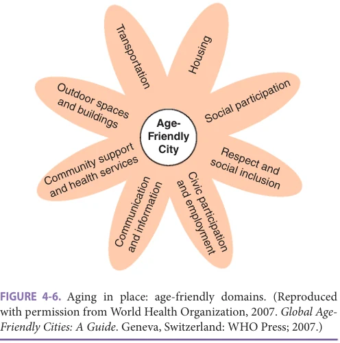

*FIGURE 4-6. Aging in place: age-friendly domains. (Reproduced with permission from World Health Organization, 2007. Global AgeFriendly Cities: A Guide. Geneva, Switzerland: WHO Press; 2007.)*

*Owner annotations/highlights are from the marked source copy, not the book.*

**[p. 75]**

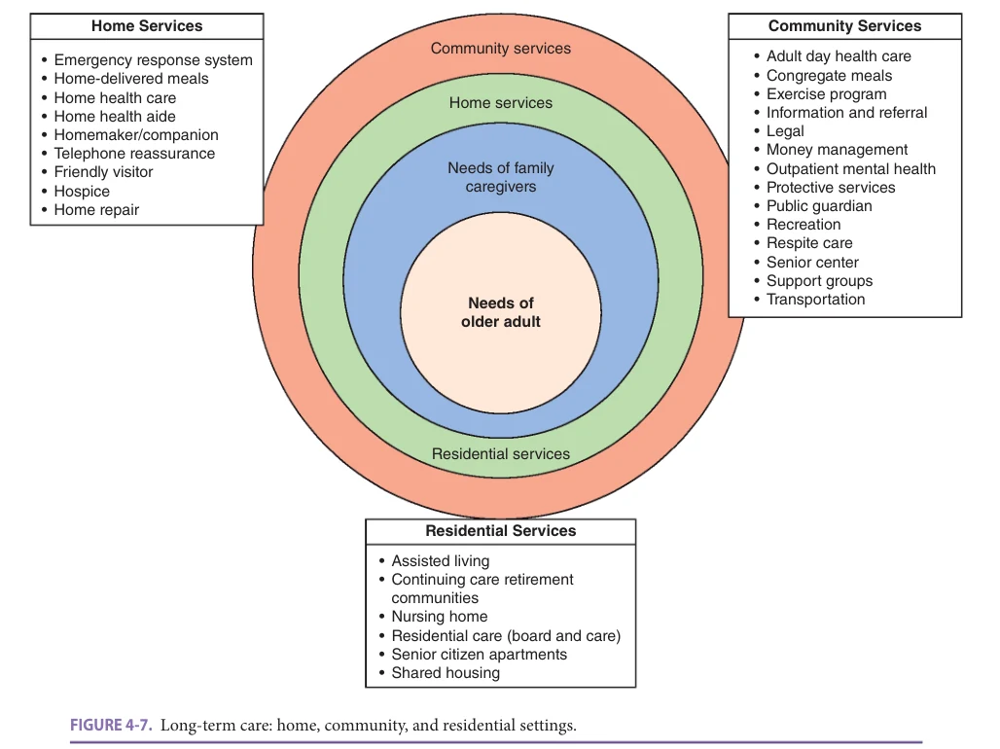

*FIGURE 4-7. Long-term care: home, community, and residential settings.*

*Owner annotations/highlights are from the marked source copy, not the book.*

support, adjustable beds and chairs, lifts, and respiratory devices. Home modification to address mobility limitation may also be considered an in-home service. Community supports for aging in place include adult day care, congregate meals, senior center programming, and transportation services. These services in the home and the community are designed to help older adults to age in place by addressing their needs as well as the needs of informal family caregivers.

The services range in intensity and frequency. Some provide a solution to a specific problem and thus support older adults who are otherwise independent. For example, home-delivered meals, or “Meals on Wheels,” cover onethird of the daily nutrition needs of older adults. Subsidized transportation services may allow otherwise independent adults to get to and from medical appointments. Other services may provide a more intensive level of services for individuals who need a more comprehensive set of supports, such as home health aides for personal care or adult day programs for people with mild to moderate dementia. Given adequate assessment and care management, individuals with nursing home-equivalent needs can be maintained in their homes. Indeed, care management services

provided through Medicaid and Administration on Community Living Title IIID funds often require that these older adults be “nursing facility clinically eligible” (NFCE).

Similarly, residential services offer varying degrees of support based on the continuum of care. These range from independent living residences with occasional nursing or social service support (as in naturally occurring retirement communities, or NORCs), to assistive living communities and personal care homes (residences integrated with health services and communal meals and housing services), to skilled nursing facilities. Some of these residential services offer the full continuum of care whereby residents can move from more independent living settings to more supportive settings as their needs change.

It is important to note variability in the functional trajectory of older adults. This variability is important for targeting services to support aging in place. Older adults often face a health crisis, such as a hip fracture, which will require that they be temporarily placed in a restrictive environment, such as a skilled nursing home or rehabilitative setting. Once they regain functioning, they may go back to a less supportive environment, either in a residential setting or in the community.

**[p. 76]**

Well-planned transitions after such health events, so-called “warm handoffs,” are critical for maintaining older people in the community. Adjustment of medication, reassessment of in-home supports, updating of care management plans, adequate communication between providers, and appropriate clinical follow-up are all required to ensure aging in place. As part of the ongoing rebalancing of Medicaid long-term care funding in the United States, we can expect funding for in-home and community-based services (HCBS) to grow and greater opportunities for aging in place. Currently, these initiatives are mostly limited to the Medicaid-eligible population. Older adults who do not qualify for Medicaid must rely on long-term care insurance or purchase such services, which is in many cases unaffordable and not always available and appropriate.

### Villages and Naturally Occurring Retirement Communities

A new and growing approach to aging in place is the “Village” model. Developed as grassroots organizations, these villages provide older adults living in the community with a combination of supportive services, such as transportation, housekeeping, and companionship, and a referral service for vetted community services, potentially at a reduced rate using their bargaining power. Villages are similar to the NORC with Supportive Services Program (NORC-SSP), as they provide supportive services to allow for successful aging in place, yet are initiated, governed, and funded (through membership fees) by the consumers they serve rather than by an agency. While each village operates with autonomy as a response to the local needs, the village to village (VtV) network provides help in establishing and managing villages.

## SUPPORTING PSYCHOSOCIAL HEALTH THROUGH THE AGING SERVICES NETWORK

A productive way to support psychosocial health among older adults is to harness community-based agencies that provide aging services. These agencies have regular contact with vulnerable elders and are sometimes the only source of such contact. For example, virtually all aging services providers provide social visiting or other “check-in” services, in which agency staff or volunteers call seniors who receive services to stay in contact and unobtrusively determine new needs. These kinds of contact may uncover mental health needs and could be explicitly harnessed for assessment of depressive or anxiety symptoms and, when needed, referral. But the challenges of developing such programs are not trivial. How should staff or volunteers, who often lack mental health training, be trained? What kind of supporting staff needs to be attached to agencies for mental health services? What kind of referral pipeline would best link aging services providers to mental health services?

A number of such programs have recently been developed and assessed in randomized trials. Many have achieved status as evidence-based programs and have undergone stringent review by the federal Administration for Community Living (ACL). The National Council on Aging (NCOA) maintains a database of evidenceprograms. The review process involves assessment of both quality of research and readiness for dissemination for interventions that have already shown effectiveness in randomized-controlled trials or quasi-experimental studies.

## PROMOTING ENGAGEMENT

### Volunteering

Civic engagement is the process by which individuals actively participate in the life of their communities through individual and collective activities. The engagement can range from participating in collective activities such as voting, to participation in religious, spiritual, or community groups, to volunteering time in unpaid productive activities. Older adults commit more hours to volunteering than any other age group, although recent birth cohorts are less likely to volunteer than earlier cohorts. Volunteering contributes to the community and is associated with a variety of personal benefits.

Volunteering is associated with positive outcomes across a number of domains. In the psychosocial domain, volunteering is associated with a reduction in depressive symptoms and improvements in life satisfaction and social support. Volunteering is also associated with better overall health, reduced functional limitations, and lower mortality risk. Experience Corps was a major randomized controlled trial to assess the health effects of volunteering. This program places groups of older adults in public elementary schools to work with children in kindergarten through third grade as tutors and teacher’s aids. Each volunteer serves about 15 hours per week, usually over 3 to 4 days, throughout the school year. Volunteers work with students to promote reading and arithmetic skills, as well as problem-solving and conflict resolution. The program aims to improve children’s academic performance, for example, by boosting school attendance, graduation rates, and performance on standardized tests; but it also aims to improve older adult outcomes by simultaneously enhancing psychosocial, physical, and cognitive well-being. Experience Corps was hypothesized to promote these outcomes through specific pathways, as shown in Figure 4-8, and demonstrated benefit in a number of domains.

While less research is available on the effects of volunteering for cognitive functioning, a randomized controlled trial of group volunteering in elementary schools, Experience Corps, showed improvements in cognitive function. While postretirement volunteer activities show positive effects on health and well-being, these activities are also

**[p. 77]**

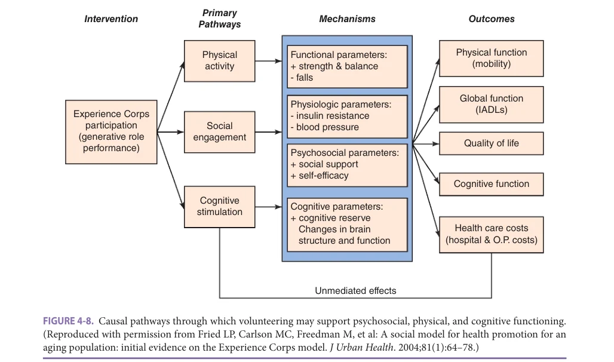

*FIGURE 4-8. Causal pathways through which volunteering may support psychosocial, physical, and cognitive functioning. (Reproduced with permission from Fried LP, Carlson MC, Freedman M, et al: A social model for health promotion for an aging population: initial evidence on the Experience Corps model. J Urban Health. 2004;81(1):64–78.)*

*Owner annotations/highlights are from the marked source copy, not the book.*

important for generative reasons: While helping those in need, this kind of engagement taps into broader prosocial or altruistic interests, which in itself is satisfying and may offer psychological reward (the so-called “positive glow” associated with helping others). Benefits to older volunteers increased if volunteer opportunities have a prosocial component and if people feel they are appreciated for their contribution.

Another important effort to promote volunteerism among older adults is the Senior Corps program. Senior Corps, funded by the US Corporation for National and Community Service, provides aid to senior citizens while promoting a sense of community. There are about 360,000 volunteers in the program nationwide each year. Senior Corps focuses on helping individuals aged 55+ to become mentors, coaches, or companions to people in need, and in this way contribute their job skills and expertise to the community. Senior Corps has three flagship programs, including (1) Senior Companions, in which volunteers provide assistance and friendship to adults who have difficulty with daily living tasks, as well as support to family caregivers by providing respite; (2) RSVP, which connects interested seniors to service opportunities, such as organizing neighborhood watch programs, tutoring or mentoring disadvantaged children, and teaching English to immigrants; and (3) Foster Grandparents, in which older volunteers tutor children, serve as mentors to at-risk teenagers and young mothers, help with care for premature infants and children with disabilities, and work with abused or neglected children.

### Lifelong Learning

Much like volunteer activity, continued learning in old age has been associated with positive effects in psychosocial, physical, and cognitive health. One of the leading organizations in this area is Road Scholar educational adventures, formerly known as Elderhostel, a not-for-profit world organization facilitating lifelong learning in various locations in the United States and internationally. Some of these learning opportunities allow for a grandparent-grandchild combined learning experience, thus including an intergenerational component.

Another important model is the Osher Lifelong Learning Institutes (OLLI). The Osher Foundation supports lifelong-learning programs on US university and college campuses, with one or more programs in each of the 50 states and the District of Columbia. The Foundation also supports a National Resource Center to enhance programming and outreach. These efforts involve a membership-based community of adults, “age 50 and better,” who take classes on campus, both traditional classes with undergraduates but also classes taught by members, who, in many cases, are retired academics and teachers.

## LIFE EVENTS AND TRANSITIONS

Older adults face many life transitions or changes in roles related to age and declining health. A key age-related transition is retirement. Major health-related transitions include bereavement due to loss of a spouse or partner and

**[p. 78]**

the onset of caregiving when a spouse or partner experiences declines in health.

### Retirement

The loss of employment represents a meaningful life event for older adults, and in the early literature was described as a transition to a “roleless role” that clashes with the emphasis on productivity and a busy work ethic and thus must lead to negative effects. Yet empirical studies did not find uniformly negative effects of retirement. While some research showed that retirees were more likely to report depressive symptoms, loneliness, lower life satisfaction, and reduced activity, other research showed that older adults are satisfied following retirement. Using longitudinal data from two nationally representative samples from the Health and Retirement Study, researchers demonstrated that there were multiple paths following retirement over time. About two-thirds of people experienced minimum changes in psychological well-being, about a quarter of individuals showed initial negative well-being effects followed by improvement, and a small group of people showed immediate positive changes.

Current retirement trends suggest that older people are now maintaining full employment to later ages (in 2019, about 17% of men aged 70+ and 10% of women aged 70+ were employed). More importantly, retirement is no longer an abrupt transition from a full-time career to no employment. Instead, current retirement behavior suggests that many older adults remain in work in later years, choose partial retirement through reducing work hours, take bridge jobs if their long-term career ends, or even start their own businesses. It is also clear that volition and choice are important in adjustment to retirement, with those choosing to retire reporting greater satisfaction than those who felt obligated to retire. Good health and adequate income are also important determinants of postretirement adjustment.

### Widowhood, Bereavement, and Grieving

The transition to widowhood is among the most stressful transitions in later life. The well-being of the surviving spouse depends on features of the end-of-life period. Strains associated with bereavement are ameliorated if physical discomfort is kept to a minimum and families provide support. Research suggests that men and women who report greater independence are better able to adjust to loss of a spouse or partner. This may suggest that successful coping in widowhood may require altering traditional gender roles.

Widowhood is a transition that leads to the reconfiguration of family roles and functions. While less likely than their married counterparts to have a confidant, widowed individuals are more likely to receive support from children, friends, and relatives. Widows are also more likely than their married counterparts to pursue volunteer roles, which in turn can lead to improved health and well-being.

### Caregiving

When older adults require caregiving, the spouse is the first line of defense. Spousal caregivers seem to exhibit levels of depressive symptoms similar to adult children who are caregivers yet derive less emotional rewards from caregiving. Wife caregivers tend to suffer greater adverse effects than husband caregivers (especially when caregiving duties restrict outside activities); they also experience greater caregiver burden and depression than husbands. Caregiver adjustment is also affected by marital quality prior to assuming caregiving duties. In marriages with higher levels of marital disagreement pre-caregiving, spousal caregivers report a greater decline in happiness and a greater increase in depression during the caregiving period than spouses in more cordial marriages. A caregiver’s well-being is sensitive to the condition of the spousal care recipient, with those caring for spouses with dementia experiencing higher levels of negative effects on well-being.

### Grandparents Raising Grandchildren

Older adults are the first of line of recourse for caregiving support when the parental generation is unavailable due to incarceration, disease, substance abuse, or other conditions. Caregiving grandparents typically face challenges beyond their role as caregivers. They tend to live in poverty and rely on public assistance, are less educated, and in many cases do not have access to adequate health care.

The demands of caring for grandchildren have negative effects on the well-being of custodial grandparents. Cultural expectations for care arrangements in this case also have mental health consequences. For example, a cross-cultural comparison found that African-American grandmothers who were sole providers for their grandchildren were less distressed than comparable White grandmothers. In cultures that rely on extended families, caregiving stresses associated with grandparent care for grandchildren may have less negative effects.

## PSYCHOSOCIAL ASPECTS OF PARTICIPATING IN HEALTH CARE DECISIONS

Cognitive, physical, and sensory limitations in older adults often limit informed decision making in medical encounters. Yet older adults continue to show interest in making informed health care choices, and patient-centered care will require innovations that promote engagement of older adults in care decisions. It is valuable to ask if older adults feel they are adequately informed about their health care choices and to identify the psychosocial correlates of “informed care.”

In one large cohort of very old adults (mean age 86), participants were considered “informed” about their healthcare choices if they reported that (1) a health care professional checked to see that they understood their condition and care, and (2) the health care professional gave them

**[p. 79]**

enough or more than enough information about their medical condition. Participants reported on their most recent medical encounter. By this standard, three-quarters of participants met criteria for informed care. Participants who met criteria for informed care were less likely to report depressed mood.

## PSYCHOSOCIAL ASPECTS OF QUALITY OF LIFE AND VALUATION OF LIFE

Quality of life (QOL) includes two overlapping domains. Health-related quality of life specifies elements of daily function and well-being that change as a result of disease or therapeutic intervention. A satisfactory QOL measure in this sense allows researchers to rank different health conditions (and treatments) according to their impact on domains of health, such as mobility, independence in bathing and dressing, sensory acuity, mood, and absence of pain. The more negative the impact in these areas, the greater the quality of life impact of the health condition. Environment-based quality of life, by contrast, is not a health impact measure but rather registers the effect of personal resources or environmental factors on daily experience. Environment-related QOL domains include features of the natural and built environment (such as economic resources, housing, air and water quality, community stability, access to the arts and entertainment), as well as personal resources (such as the capacity to form friendships, appreciate nature, or find satisfaction in spiritual or religious life).

Health-related QOL can be assessed as the difference between a population norm and mean value for patient samples, or more directly as a “utility” rating, that is, a numeric rating of how preferred (and thus how much better) one health state is relative to another. One common way to derive utilities for health states is to ask how many years of life people would be willing to give up to live without a health condition or disability.

The psychological analog to quality of life is valuation of life (VOL), the extent to which the person is attached to his or her present life. VOL can be measured by reports of hope, the sense that life has meaning, and continued commitment to personal projects, that is, goal-driven activity. VOL is independent of many factors associated with health-related QOL, such as health state, cognitive capacity, and mental health. VOL was a significant independent correlate of the wish to live under a great range of severe health limitations, including states of mobility impairment and severe pain.

However it is measured, health-related QOL declines with age. This is a central, inescapable consequence of the increased prevalence of chronic disease with greater age and the effects of senescent changes in many physiologic domains. As we have seen, older people adjust their daily lives to accommodate these decrements, and adjustment strategies may reduce the effects of such decrements on health-related QOL. Still, cross-sectional studies show

strong declines in health-related QOL with increasing age. VOL may not show so clear a pattern. Here we need to ask when the wish to hasten dying is an expression of discouragement based on depression, and when it is an expression of discouragement based on a judgment that life no longer has intrinsic value because impaired health does not allow meaning, purpose, or desired personal projects.

In contrast to health-related QOL, environmentrelated QOL may remain high throughout life and may even improve with greater age. With retirement, for example, older people have greater leisure time; and with children gone, houses paid for, and successful investments, they may have greater disposable income as well. As a result, older people have increased opportunities to develop interests and create satisfying environments. These freedoms and opportunities counterbalance declines in health-related QOL and may be responsible for the great resiliency older people show in the face of declining health.

## PSYCHOSOCIAL ASPECTS OF THE END OF LIFE

Dying in America has changed markedly in the past quarter century and continues to evolve as the population ages, treatment of chronic disease becomes more effective, and clinicians, policymakers, and the public refine practices related to end-of-life care. “Dying” can be considered a new, emerging stage of the life course: Unlike dying in the past, dying now can be protracted (as with cancer), planned, involve new awareness and self-definition, and require particular developmental psychosocial tasks and challenges. Older adults with life-limiting illness and their caregivers face an increasing array of treatment choices at the end of life as well as an expansion in settings for receiving care, including hospice (which mostly involves in-home services). Half of the deaths in the United States involve hospice care, with the predominant arrangement involving hospice services delivered in homes. However, this care is usually implemented only a few days before death, preventing patients and families from receiving the full benefit of hospice. In 2015, 1.6 million people received hospice care in the United States, and 33% were age 85 and older.

As hospice becomes the predominant model for endof-life care, it is important to monitor its psychosocial costs and benefits. Use of hospice services is associated with greater satisfaction with quality of dying, better quality of care at the end of life, and less conflict in decisions regarding care and treatment. On the other hand, use of hospice also involves greater investment of time and effort on the part of family members, as evidenced by the higher proportion of caregivers who administer medications and report taking time off from work during end-of-life care compared to caregivers who do not make use of hospice. Despite this greater involvement in end-of-life care, caregivers who

**[p. 80]**

make use of hospice do not report a greater prevalence of depressed mood, anxiety, or postdeath persistent grief, suggesting that involvement in hospice buffers the negative impact of greater involvement in end-of-life care.

Aggressive treatment at the end of life remains common among older adults. An analysis of nearly 30,000 Surveillance, Epidemiology, and End Results (SEER) patients aged 65+ (all with a cancer diagnosis), for example, showed an increase in aggressive cancer care near the end of life, as indicated by the proportion starting a new chemotherapy regimen within 30 or 14 days of death; the proportion with more than one emergency department visit, more than 14 days in hospital, or an intensive care unit (ICU) admission in the last month of life; or the proportion of hospice patients with length of stay fewer than 3 days. Nearly 20% continued to receive chemotherapy in the last 2 weeks of life. More generally, analyses of Medicare claims show a decline in the likelihood of dying in an acute care hospital but a high prevalence of 30% for use of the ICU during the last month of life.

Aggressive interventions before death are declining in people with advanced dementia, as shown by decreases in rates of hospitalization, emergency room admission, and feeding tube placement in the last 3 months of life among residents of skilled care facilities. For some therapies with no clear benefit for this population, such as parenteral feeding tube placement, clinicians have recommended that this choice no longer appears as an option in advance care planning documents, such as the Physician Orders for Life-Sustaining Therapies (POLST). The difficulty of preparing for end-of-life treatment is visible as well in recent discussions on the best way to deprescribe medications that are no longer appropriate.

Defining advance care planning is challenging. A consensus statement did not emerge until 2017: “Advance care planning is a process that supports adults at any age or stage of health in understanding and sharing their personal values, life goals, and preferences regarding future medical care. The goal of advance care planning is to help ensure that people receive medical care that is consistent with their values, goals and preferences during serious and chronic illness.” In partnership with health care professionals, families face the challenge of limiting inappropriate care for older adults who are dying or who are unlikely to benefit from aggressive hospital interventions because of frailty or multimorbidity. The high risk of death in late ages (8%–10% per year in people age 85+ and over 30% per year for people aged 90+) suggests that clarifying preferences for end-oflife treatment should be a priority for the very old. Yet “the talk,” discussion of end-of-life treatment preferences among older people and their families, is often difficult. Older people are more likely to initiate such discussions than their adult children. Adult children may resist such discussions and are often more in favor of aggressive treatment at the end of life than parents. Older adults completing POLST are less likely to receive aggressive treatment at the end of

life in nursing homes but not in admissions through the emergency room.

Deaths are challenging for survivors as well. Estimates suggest that 9% to 25% of older people are unable to recover from the emotional challenges of the death of a loved one and develop persistent or complicated grief. DSM-V has defined this complex bereavement disorder as a trauma or stress-related condition lasting 6 or 12 months after the death. In older adults, complicated grief is associated with disability, cognitive impairment, and suicidal thinking. New measures are available now to assess persistent grief, such as the Inventory of Complicated Grief, and a number of trials have shown that psychotherapy targeted to complicated grief is more effective than standard grieffocused interpersonal psychotherapy.

A final consideration is distress and regret at the end of life, which may be impairing even if not accompanied by frank depression or anxiety. Such distress often reflects active questioning of the meaning of life, such as whether a person has made good use of a life and left an appropriate legacy. Since patients with a higher sense of meaning experience less distress at the end of life, interventions that bolster meaning may reduce this existential distress and accordingly lower the risk of poor mental health at the end of life. One promising approach to supporting meaning at the end of life is dignity therapy, a short-term psychotherapy that has been shown to improve well-being in people with life-limiting illnesses. In dignity therapy, patients complete a guided elicitation of the major accomplishments of their life, which, after editing and revision, is shown to family and placed in the medical chart as a statement of the value of the life lived.

## PSYCHOSOCIAL EVALUATION DURING COMPREHENSIVE GERIATRIC ASSESSMENT

Assessment of psychosocial domains is an integral component of the comprehensive geriatric assessment (CGA) in an older adult. Geriatric syndromes such as malnutrition may be multifactorial in origin, including psychosocial causes like substance abuse, social isolation, and psychiatric disturbances.

A detailed psychosocial history is very important in the evaluation of any geriatric patient. The CGA in older adults includes ascertainment of social support, depressive symptoms, mood, financial concerns, whether one has durable power of attorney for health care, religious and spiritual beliefs, availability of caregivers to support ADLs, home safety, and caregiver burden. It can give information on a need to change the living situation or to consider placement.

Patient-centered goal setting is very important in the management of any patient and this is particularly so in an older adult patient. He or she may prefer quality of life or the ability to attend a major family event over even survival.

**[p. 81]**

## CONCLUSION

Psychosocial factors are critical contributors to the health and quality of life of older individuals. We have focused on factors that appear to be most potent for explaining variability in health outcomes using a broad conceptual model that shows how psychosocial factors contribute to behaviors and biological processes linked to illness and quality of life. These effects do not occur in a vacuum but rather are set within the larger social and cultural contexts in which people live. The life course perspective shows how the experience of aging depends on cultural factors, such as the conceptualization of the lifespan, as well as biologically driven developmental changes in social and affective experience. A significant advance of the last decades is research showing how psychosocial factors get “under the skin” to affect the physiology and functioning of the organism, and hence health and quality of life. Continued advances in mind-body science along these lines will enhance our understanding of the relationships between biology, psychology, and social experience and will provide new opportunities for intervention.

A second theme of this chapter is the remarkable resilience of older individuals. Despite significant declines in multiple functional domains in late life, most older individuals adapt well to the challenges they face and maintain high quality of life. Depression and dissatisfaction with life do not come in late life, but earlier, in mid-life. While psychosocial health is clearly affected by disability, it is remarkable that majorities of older people with substantial disability report high levels of positive affect and involvement in daily life. This resilience reflects finely

tuned adaptive mechanisms that maximize the ability to cope with major life challenges. Common old-age transitions such as retirement, widowhood, health decline, and caregiving, are challenging; but older people are able to navigate these changes through selection, optimization, and compensation to maximize function and well-being. Consistent with the greater socioemotional selectivity of old age, the landscape of affective and social experience changes and may look narrow to younger people; but the greater reports of satisfaction and happiness typical of old age suggest that these processes help buffer more challenging features of aging.

Finally, a third theme is the strong association between social engagement and well-being. Lack of support (social isolation and loneliness) has a negative effect, and social engagement (volunteering, lifelong learning, and involvement in intergenerational programs) has a positive effect. Beyond these social factors, many kinds of intervention support psychological health. For example, the aging services network is important in promoting engagement across diverse domains, with clear benefit. Social environments that promote aging in place, involvement of older adults in their care and in health decision making, and supporting family caregivers who provide end-of-life care all offer benefits and show it is possible to promote engagement across multiple levels and domains. New models of engagement, such as school-based volunteering and intergenerational programs, suggest that engaging older adults may be good for older adults as well as other age groups. This kind of programming will likely become more important as increasingly larger cohorts of older people reach old age in better health.

## FURTHER READING

Albert SM, Freedman VA. Public Health and Aging: Maxi-

mizing Function and Well-Being. New York, NY: Springer Publishing Company; 2010. Albert SM, Logsdon RG, eds. Assessing Quality of Life in

Alzheimer’s Disease. New York, NY: Springer Publishing Company; 2000. Aldwin CM, Park CL, Spiro AS III, eds. Handbook of Health

Psychology and Aging. New York, NY: Guilford Press; 2007. Anderson ND, Damianakis T, Kröger E, et al. The benefits

associated with volunteering among seniors: a critical review and recommendations for future research. Psychol Bull. 2014;140(6):1505–1533. Carstensen LL, Mikels JA, Mather M. Aging and the

intersection of cognition, motivation and emotion. In: Birren J, Schaie KW, eds. Handbook of the Psychology of Aging. 6th ed. San Diego, CA: Academic Press; 2006.

Chochinov HM, Kristjanson LJ, Breitbart W, et al. Effect

of dignity therapy on distress and end-of-life experience in terminally ill patients: a randomised controlled trial. Lancet Oncol. 2011;12(8):753–762. Cohen S. Social relationships and health. Am Psychol.

2004;59:676–684. Cohen S, Pressman SD. Positive affect and health. Curr Dir

Psychol Sci. 2006;15(3):122–125. Epel E, Burke HM, Adler N, Wolkowitz O, Sidney S,

Seeman T. Socio-economic status and the anabolic/ catabolic neuroendocrine balance. Ann Behav Med. 2006;31:50–80. Felix C, Rosano C, Zhu X, Flatt JD, Rosso AL. Greater social

engagement and greater gray matter microstructural integrity in brain regions relevant to dementia. J Gerontol B Psychol Sci Soc Sci. 2021;76(6):1027–1035. Fried LP, Carlson MC, Freedman M, et al. A social

model for health promotion for an aging population:

**[p. 82]**

initial evidence on the Experience Corps model. J Urban Health. 2004;81(1):64–78. Gans D. The nexus of informal and formal elder care.

J Comp Fam Stud. 2013;44(4):415–424. Gans D, Silverstein M, Lowenstein A. Do religious children

care more and provide more care to older parents? A study of filial norms and behavior across five nations. Response to Comment. J Comp Fam Stud. 2010;41(4):632–637. Hawkley LC, Cacioppo JT. Loneliness matters: a theoretical

and empirical review of consequences and mechanisms. Ann Behav Med. 2010;40:218–227. Lawton MP, DeVoe MR, Parmelee P. Relationship of events

and affect in the daily life of an elderly population. Psychol Aging. 1995;10(3):469–477. Lawton MP, Kleban MH, Dean J. Affect and age:

cross-sectional comparisons of structure and prevalence. Psychol Aging. 1993;8(2):165–175. Lawton MP, Moss M, Hoffman C, Grant R, Ten Have T,

Kleban MH. Health, valuation of life, and the wish to live. Gerontologist. 1999;39:406–416. Lawton MP, Moss MS, Winter L, Hoffman C. Motivation

in later life: personal projects and well-being. Psychol Aging. 2002;17(4):539–547.

Levine C, ed. Family Caregivers on the Job: Moving Beyond

ADLs and IADLs. New York, NY: United Hospital Fund; 2004. Seaman JB, Bear TM, Documet PI, Sereika SM, Albert

SM. Hospice and family involvement with end-of-life care: results from a population-based survey. Am J Hosp Palliat Care. 2016;33(2):130–135. Shear K, Frank E, Houck PR, Reynolds CF III. Treat-

ment of complicated grief: a randomized trial. JAMA. 2005;293(21):2601–2608. Sudore RL, Lum HD, You JJ, et al. Defining advance care

planning for adults: a consensus definition from a multidisciplinary Delphi panel. J Pain Symptom Manage. 2017;53(5):821–832. Wang M. Profiling retirees in the retirement transition and

adjustment process: examining the longitudinal change patterns of retirees’ psychological well-being. J Appl Psychol. 2007;92:455–474. World Health Organization. Global Age-Friendly Cities:

A Guide. Geneva, Switzerland: WHO Press; 2007. http://www.who.int/ageing/publications/Global_age_ friendly_cities_Guide_English.pdf. Accessed February 3, 2021.
