# Hazzard's Geriatric Medicine and Gerontology, 8e - Chapter 50: Mobility Assessment and Management

Valerie Shuman, Caterina Rosano, Jennifer S. Brach

> **Status.** Fast build from the book; not lane-reviewed.

> **Source and method.** Printed pages 741-758, from the marked 8th-edition copy (PDF page = printed page + 34). Prose follows its text layer; tables and figures are source-page crops. The book is canonical.

**[p. 741]**

## INTRODUCTION

Mobility problems are pervasive in older adults. Mobility limitations affect personal independence, need for human help, and quality of life. Limited mobility predicts future health, function, and survival. Like other geriatric syndromes, mobility disorders are often caused by diseases and impairments across many organ systems; so evaluation and management require multiple perspectives and disciplines. Health care providers should be able to assess and treat mobility problems. They should be able to measure and interpret clinical indicators of mobility such as gait speed and the short physical performance battery. They should know the physiologic and biomechanical mechanisms underlying normal and abnormal mobility, the differential diagnosis of the causes of mobility disorders, and the approaches to management of mobility problems. With rapid technological advancements in the measurements of mobility, geriatricians should be aware of novel assessments that could be used in the clinic.

#### Learning Objectives

- Describe the prevalence and consequences of mobility disorders in older people.

- Identify strategies to detect and evaluate mobility disorders.

- Characterize approaches to the management of mobility disorders.

#### Key Clinical Points

1. Loss of mobility is a major cause of disability in older people but is rarely assessed in typical clinical practice.

2. The assessment of mobility involves taking a history and performing a physical examination that identifies cardiopulmonary, musculoskeletal, psychological, and neurologic contributors.

3. Mobility can be assessed by a number of simple performance tests including gait speed, the short physical performance battery, and the Timed Up and Go test.

4. Interventions to promote mobility include addressing underlying impairments, therapeutic exercise, assistive devices, home adaptations, and caregiver training.

## DEFINITIONS AND METHODS OF CLASSIFICATION

Defining Mobility Mobility is the ability to move one’s own body through space. Mobility requires force production and feedback control systems to navigate the mass of the body through a three-dimensional environment. Walking is the fundamental mobility task for human life. Mobility also includes a wide range of other important activities that require moving one’s body, from turning over in bed to climbing stairs. Mobility tasks have an inherent hierarchical order based on the biomechanical and physiologic demands made on the body. This orderedness is apparent in the developmental tasks of infancy and childhood when mobility independence is first achieved. The simplest and first mobility task is turning over in bed, followed by sitting upright, transferring from lying to sitting and from sitting to standing. From there, individuals progress to locomotion with an increased base of support (like crawling or using a walker), independent two-legged walking, and finally to more challenging tasks like ascending and descending stairs, running, climbing ladders, and playing sports.

Mobility disability is best defined within a conceptual framework such as that of the World Health Organization’s International Classification of Functioning, Disability and Health (ICF) (Table 50-1). The concept of disability in general has transitioned from being considered a biological consequence of pathologic processes to a social construct influenced by personal and environmental factors. For example, the inability to climb 12 stairs may be considered a disability in a region with primarily two-story homes but not in an area largely made of ranch-style homes. Mobility disability occurs at the level of the whole person and can be manifested by difficulty in carrying out basic hygiene activities such as bathing or by limitations in participating

**[p. 742]**

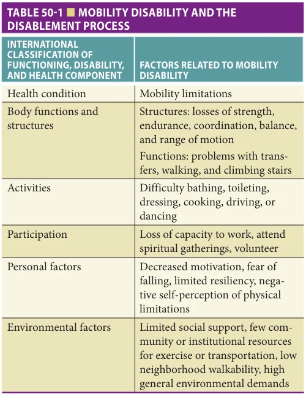

*Table 50-1, printed p. 742.*

in life roles, such as shopping for family members. Mobility disability is often defined by functional limitations in walking, transferring, or climbing stairs, which are caused by problems with strength, endurance, coordination, balance, and range of motion. Impaired dual-task capacity, such as attending to cognitive tasks while walking, is another clinical manifestation of mobility disability. These functional limitations can be caused by numerous pathologic processes at the body structure level. Mobility disability can precipitate a cycle of negative consequences because it often leads to decreased activity, which in turn worsens functional limitations and causes organ system deconditioning, including muscle weakness, loss of joint range of motion, and poor cardiovascular endurance. Whether or not an individual is classified as having mobility disability can be modified by psychological, social, and environmental factors.

Classification Methods for Mobility Mobility classification is often driven by a tacit assumption of orderedness. Few single current instruments assess the full range of mobility from the lowest levels of rolling over in bed to the highest levels of endurance and coordination required for athletics or dance. The PatientReported Outcomes Measurement Information System (PROMIS®) measures, an NIH-funded initiative, include both computer-adaptive tests and fixed short forms that are highly comprehensive assessments of domains, such as mobility. These batteries are used in both research

and clinical practice. Mobility assessment tools for older adults generally address one or more of the following three mobility levels: nonambulatory, ambulatory, and vigorous, corresponding broadly to Tinetti’s levels of frail, transitional, and vigorous mobility status. Mobility levels are surprisingly stable. While day-to-day variability does occur, people in general tend to remain in one level or decline very gradually unless a major event has occurred. Within the nonambulatory level, there are important mobility skills that affect independence in personal care activities, care needs, and demand for human help; these activities include bed mobility, self-transfer skills, and wheelchair mobility. Within the vigorous mobility level, the degree of fitness, as represented by the ability to perform demanding or challenging mobility activities, may be a useful indicator of the extent of physiologic reserve. As an indicator of the extent of physiologic reserve, vigorous mobility status may be a marker of ability to tolerate physiologic stressors such as acute illness, surgery, or periods of reduced activity.

Mobility can be assessed by self-report, professional observation, or performance-based measures. Instruments to assess mobility from all three perspectives have been developed. We selected instruments with established reliability and validity for use with older adults (Table 50-2). Each has advantages and disadvantages, including floor or ceiling effects. These tools have been used to estimate the population incidence and prevalence of mobility disorders, predict the consequences of mobility problems, screen patient populations, determine care needs, and determine reimbursement of services in rehabilitation settings. More detailed instruments have been developed specifically for sorting out causes and mechanisms. Detailed instruments for diagnosing the etiology of mobility limitations will be discussed separately in the section on causes of mobility limitations. Mobility measures have varying strengths and limitations, depending on characteristics such as reliability and validity, respondent burden, feasibility and convenience of use, and assessor skill required.

Self-report measures are the easiest type of measure to obtain when gathering data from large populations. Self-report measures have high face validity in that they reflect the opinion of the person themselves. Various self-reported walking measures predict performance of functional mobility in older adults. Since self-report measures usually ask about a period of time, such as recent weeks or months, they can identify fluctuating ability over time. Self-report measures can be limited by problems with reliability, accuracy, and nonresponse. Because these are usually ordinal scales, they lack ability to discriminate small but important differences.

Professional observation measures reflect the opinion of an experienced assessor and may be more feasible when an individual is considered an unreliable informant or is unable to cooperate with testing (eg, individuals with severe cognitive decline). Professional report is limited by

**[p. 743]**

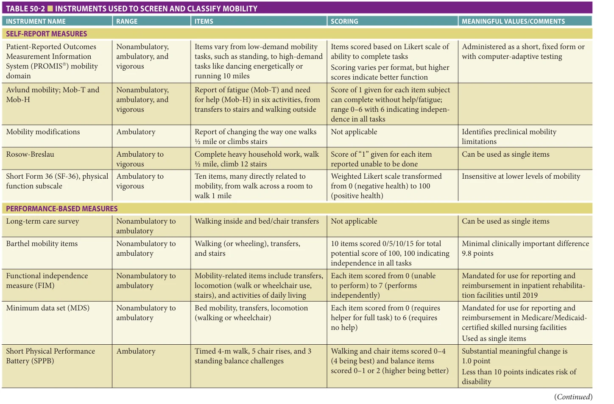

*Table 50-2, printed p. 743.*

**[p. 744]**

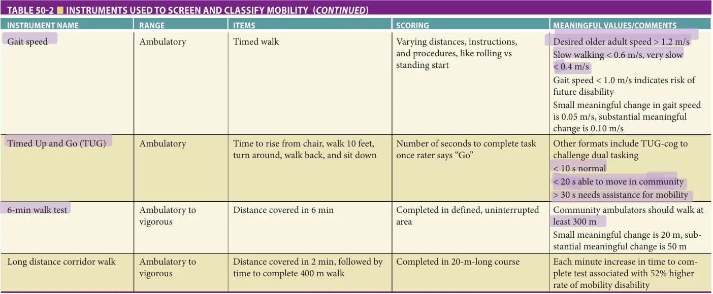

*Table 50-2 continued, printed p. 744.*

**[p. 745]**

the need for assessor experience and training and can be vulnerable to problems with inter-assessor reliability unless extensive efforts to standardize assessment are made. Since professional reports are usually based on ordinal scales, ability to discriminate small but important differences might be limited.

Performance-based measures are independent of assessor opinion. Most performance measures produce continuous quantitative results, which allow for discrimination of small but important or subclinical differences. Performance-based measures are limited in that they require direct observation, subject understanding and cooperation, and standardization of instructions and procedures. These tools measure capability rather than actual daily mobility activities (ie, the assessment of gait speed in a clinician’s office is not a valid assessment of a person’s gait speed at home). The need for subject cooperation can lead to problems with nonresponse. Performance-based measures do not account well for short-term fluctuations over hours to weeks. Despite these limitations, performance-based testing may have direct application in clinical settings because it is brief and can provide useful information.

Psychological aspects of fear, attention, mobility confidence, and activity avoidance can have great effect on mobility disability, separately or in combination with observable mobility limitations. Several instruments to assess psychological factors related to mobility disability have been developed (Table 50-3). Items from these scales might have use in the clinical setting.

## EPIDEMIOLOGY

Prevalence The epidemiology of mobility disability can be considered from the perspective of basic or higher-level mobility. Basic mobility problems map to the nonambulatory to ambulatory range; higher-level mobility problems map to the ambulatory to vigorous range.

Mobility disability increases dramatically with age; dependence in getting around inside increases from 5% of persons aged 65 to 74 years to 30% of persons aged 85 or older. Women tend to have higher rates of mobility disability than men, 30% compared to 23% of those 65 years and older. Racial differences exist in older adults as well; 34% of Blacks/African Americans, 23% of Asian Americans, 35% of other/multiracial background, and 25% of White people self-report experiencing mobility disability. Those with higher levels of depression report greater prevalence of mobility limitations.

Basic mobility problems include tasks such as getting around inside the house and transferring from bed or chair. Examples of higher-level mobility problems are getting around outside the house, ability to walk one-quarter or one-half mile, and ability to climb stairs. Basic mobility problems are uncommon in community-dwelling older persons but are very frequent in institutionalized older people. Among community-dwelling persons aged 65 and older, approximately 5% are dependent in getting in and out of a chair or bed and 7.5% are dependent in getting around inside. Among institutionalized persons older than

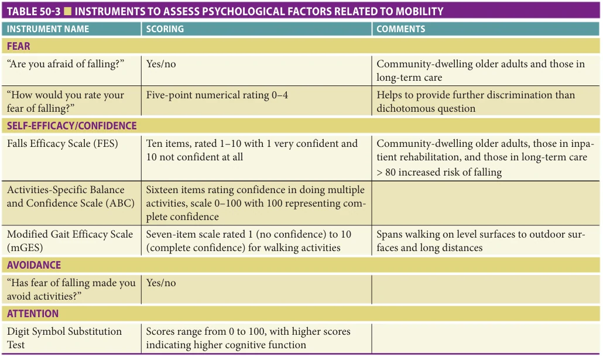

*Table 50-3, printed p. 745.*

**[p. 746]**

65 years, approximately 80% are dependent in getting in and out of a chair or bed and getting around inside.

In the past decade, basic mobility problems have decreased in prevalence for those older than 85 years, while remaining stable for those aged 65 to 84 years old. The decline in prevalence observed in the oldest old may be due to decreasing rates of disability in some chronic diseases in late life; for example, arthritis and heart disease, the two diseases that have been most associated with increased disability, have become less disabling. With advances in the management of these conditions, progression is delayed; consequently, the disabling effect on mobility is reduced. At the same time, there has been an increase in the incidence of obesity and sedentary lifestyle in middle age and among young old: these are also major contributing factors to disability, and these trends may explain why there is not a reduction in disability among the younger old.

Higher-level mobility problems, defined as difficulty walking a quarter mile or climbing stairs, increase with age, are more common in women than in men, and appear to be decreasing. Approximately 13% of Americans older than 60 years report higher-level mobility problems in that they have difficulty going outside the home alone. There is a marked increase with age. There is also geographic variation; self-reported difficulty going outside the home alone is more common among older adults in the southern United States.

Risk of Adverse Consequences Associated with Mobility Status Mobility problems have serious consequences. Mobility status predicts mortality. Older people with difficulty walking 2 km or climbing one flight of stairs are twice as likely to die during the next 8 years compared to those with no difficulty. Mortality risk is even higher among those who have mobility difficulty and are also physically inactive. Poor mobility performance, even in the absence of selfreported mobility limitations, is an independent predictor of death. Among persons who report no mobility problems, gait speed less than 1.0 m/s is associated with an increased risk of death. Older persons who have a 0.1 m/s decline in gait speed over 1 year have a double risk of dying during the subsequent 5 years, whereas older persons who have a 0.1 m/s improvement in gait speed over 1 year have a 40% decreased risk of dying in the following 8 years. Improving mobility through exercise is associated with reduced risk of future falls. In a pooled analysis of over 30,000 communitydwelling older adults, each 0.1 m/s faster gait speed was associated with a 13% reduction in risk of mortality.

Poor mobility performance is an independent predictor of future self-care difficulty and mobility disability. Among community-dwelling persons older than 70 years without disability, baseline physical performance score was a powerful predictor of incident disability in both activities of daily living and in higher-level mobility disability. Mobility self-report and performance have been shown to predict disability in older populations from numerous

countries and cultures, including Mexican American, British, Italian, French, Dutch, Spanish, Scandinavian, Australian, Japanese, and Chinese.

Poor mobility performance is also an independent predictor of hospitalization and nursing home placement. In a population-based study of nondisabled older adults, poor baseline physical performance score was associated with a twofold increased risk of hospitalization and more days in the hospital over the following 4 years, independent of baseline health status. The risk was mostly associated with hospitalization for dementia, pressure ulcer, hip fractures, other fracture, pneumonia, and dehydration.

Mobility may be part of an underlying constellation of core factors that link multiple outcomes associated with aging. Poor mobility, as measured by timed chair stands, is one of four factors proposed to be common risk factors for geriatric syndromes (the others are incontinence, falls, and functional decline). Conversely, good mobility, along with good cognition and nutritional status, is an independent predictor of recovery of functional independence after a period of disability. Abnormalities of gait and slow gait speed have been found to precede the onset of cognitive decline and dementia, especially vascular dementia. Among older adults, simultaneous abnormalities of mobility, cognition, and mood are more common than would be expected by chance, perhaps implying potential common underlying causes.

Severe mobility disability, sometimes called immobility, has widespread and devastating consequences. It accelerates impairments in multiple organ systems, including bone, muscle, heart, circulation, lung, skin, blood, bowel, kidney, nutrition, and metabolism. Loss of organ system function can be rapid and severe; muscle strength can decline by 1% to 5% per day of enforced bed rest. Skin breakdown and pressure ulcers start to occur after only hours of persistent and unrelieved pressure. Major consequences of clinical significance include decreased plasma volume, orthostatic hypotension, accelerated loss of bone density, muscle weakness, decreased pulmonary ventilation, and constipation leading to fecal impaction. When even temporary bed rest is combined with the increased vulnerability of aging and acute illness, there is a marked increased risk of death, disability, and institutionalization.

## PATHOPHYSIOLOGY

The causes of mobility problems are complex. Unique and complementary etiologic perspectives can all contribute to a better understanding of mobility. Three perspectives are described here: biomechanical, biomedical, and biopsychosocial. Each has advantages and disadvantages when used as frameworks to understand mobility problems.

Biomechanical Perspective: Direct Assessment of the Body in Motion Age affects the biomechanics of walking. Normal gait can be defined in terms of the gait cycle with two main phases:

**[p. 747]**

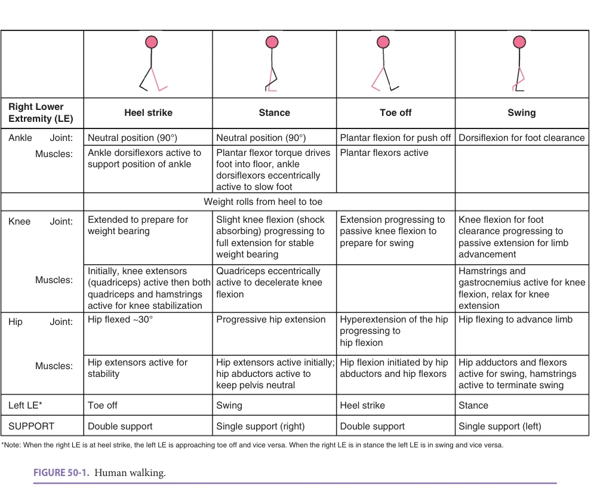

*Figure 50-1, printed p. 747.*

stance and swing (Figure 50-1). A normal cycle begins with a push off from the forefoot, then a swing through and heel strike, timed tightly to be followed by the push off of the other leg; normal gait initiates at the ankle, not the hip. Normal gait has highly characteristic patterns of foot, ankle, knee, hip, pelvis, trunk, and arm motion. Gait biomechanics can also be viewed from the perspective of the pattern of steps (footprints) (Figure 50-2). Step length is the forward distance between two foot falls. Stride length is the distance covered by one foot until it falls again. Stride length is, therefore, twice the step length, assuming the step lengths are the same on both sides. Step width is the lateral distance between two foot falls. With age, gait speed slows, step length decreases, and the proportion of the gait cycle when both feet are in contact with the ground (double support time) increases. During gait, older people compared to young adults tend to have more thoracic kyphosis, more posterior pelvic tilt, decreased hip extension, and greater external rotation of the foot. Older people tend to generate less power from the ankle and use hip flexion to compensate more than young adults. Normal gait has a very regular spatial and temporal pattern. An irregular gait can be either

regularly irregular, like a limp, or irregularly irregular, with no pattern at all (Figure 50-3). Irregularly irregular gait, often called gait variability, predicts falls and mobility disability.

Normal walking maximizes energy efficiency. When walking changes owing to biomechanical alterations caused by disease or aging, walking becomes more energy demanding. Normal walking also requires excellent control of balance and timing. When problems develop with balance and timing, the priority for safe walking may be to increase stability and support at the expense of losses of energy efficiency. Thus, many changes with aging increase the energy cost of walking and decrease gait efficiency.

A biomechanical perspective can be applied broadly to mobility and balance, based on the increasing biomechanical demand placed on the body in motion. Typically, tasks are considered more challenging as the base of support narrows and transfers of mass over the base become more demanding. Thus, difficulty increases from sitting to standing to walking, to climbing stairs, walking a line, or running. A biomechanical approach to postural alterations and body-segment movement abnormalities can be useful

**[p. 748]**

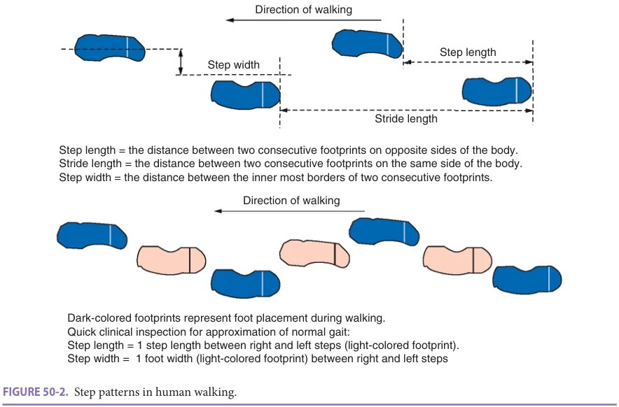

*Figure 50-2, printed p. 748.*

for identifying causes of, and solutions to, mobility problems. Specific abnormalities can be addressed by targeting rehabilitative programs or the type of assistive devices. Limitations to the biomechanical framework include lack of consideration of how various physiologic or external factors impact mobility problems.

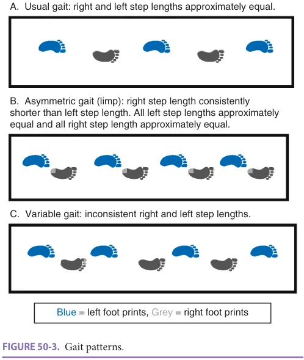

*Figure 50-3, printed p. 748.*

Biomedical Perspective: Using Organ System Impairment to Link Function and Disease The causes of mobility limitation can be assessed from a physiologic standpoint. There are three main physiologic components of mobility: balance control (neurologic system), force production (cardiopulmonary and muscular systems), and structural support (skeletal system—bone and joints). Ferrucci created a framework that identifies six main physiologic subsystems that influence walking ability: central nervous system, perceptual system, peripheral nervous system, muscles, bones and joints, and energy production. Another way of organizing the systems that affect walking is to consider inputs and outputs. In this approach, the physiologic elements of mobility can be assigned to three main components based on a sequence of information from (1) sensory inputs to (2) central processing to (3) effector factors that carry out instructions from the brain. Sensory inputs include vision, vestibular function, and peripheral sensation. Central processing includes level of attention, rapid integration of sensory inputs, coordinated timing of multiple segmental body motions, and postural reflexes. Effector-related factors include generation of muscle strength and power, endurance, pain, speed of reaction, and flexibility. There are several important emerging areas of knowledge related to our understanding of the physiologic contributors to walking. Brain abnormalities found on magnetic resonance imaging (MRI) are associated with alterations in attention, rapid processing and integration of multiple sensorimotor inputs, and abnormal gait. Small vessel cerebrovascular disease in the absence of stroke and MRI findings of “white matter disease” or focal grey matter

**[p. 749]**

atrophy are associated with slower gait speed, even among high-functioning older adults. These MRI findings predict the onset of mobility disability. Such brain abnormalities appear to be most pronounced in the frontal areas and basal ganglia, regions that are most vulnerable to changes in cerebral perfusion with older age. These areas have been found to concurrently affect mobility, cognition, and mood and may suggest a shared underlying cerebrovascular process. Another emerging area of knowledge is related to subclinical losses of dopaminergic transmission in the brain in the aged. These losses of dopaminergic function also contribute to altered mobility and may present clinically in patterns that differ from traditional Parkinson disease. Dopamine deficiency in the aged may be related to cerebrovascular disease. Loss of oxygen-carrying capacity because of anemia has been recognized as a potential contributor to mobility limitations, especially in Caucasians, perhaps owing to decreased endurance but also possibly because of chronic subclinical ischemic effects on the brain. Disorders of glucose regulation, including poorly controlled diabetes, may also affect the integrity of brain motor areas and compromise mobility control. Research on the links among cardiovascular risk factors, brain structural abnormalities, mobility, cognition, and mood is developing rapidly. In the future, it may be possible to refine these observations into diagnosable and possibly treatable disorders. It is possible that attention to cardiovascular and metabolic risk factors might reduce the risk of developing some of these brain abnormalities and thus potentially reduce the incidence of mobility problems.

A physiologic perspective on mobility helps define organ system impairments, which can be linked to treatable diseases, conditions, and pathologic processes, as described by the disablement process in Table 50-1. A physiologic perspective is also helpful when accounting for the multiple interacting health problems of many older adults. When more than one organ system that is important for mobility is impaired, the risk of mobility problems increases. Thus, mobility can be affected when one system is severely disrupted, when several are modestly disrupted or when many are mildly disrupted. A physiologic perspective also helps account for the phenomenon of stress-induced disability. Organ systems have excess capacity, called physiologic reserve. Losses of organ system function can be clinically unapparent because these are losses of unused reserve or because one system is compensating for another. Many subclinical physiologic losses may not be recognized until stress is placed on the system by further physiologic decline or by an unexpected high demand on the system. When sufficient reserve is lost or a compensating organ system fails, mobility disability becomes overt. For example, when persons with many subclinical physiologic losses face an unexpected mobility demand, such as walking on ice at night, they may face a demand that is greater than their mobility capacity. Mobility reserve can now be assessed. One way to challenge reserve is to perform simultaneous physical and

cognitive tasks. Described as “dual tasks,” older individuals may deteriorate significantly when asked to walk and talk or walk and perform a mental calculation. Mobility tests that incorporate obstacles also assess reserve. Tests of gait variability may be another way to detect subclinical change in mobility.

A physiologic perspective can help define interventions, based on the disablement structure described in Table 50-1. Treatments could be aimed at managing the underlying pathologic conditions that are causing the impairment (eg, improving cardiac ejection fraction through treatment of congestive heart failure), treating the impairments themselves (eg, strength training), or creating compensations and adaptations at the level of functional limitations (such as using a cane). A physiologic approach offers a constructive way to connect biomechanical and clinical mobility assessment to a biomedical model of diagnosis and treatment. The individual is the focus of the biomedical model, however, and addressing biomechanical and clinical factors may improve the physiologic impairments of mobility problems but not address mobility disability.

Biopsychosocial Perspective: Addressing Personal, Social, and Environmental Contributions The experience of mobility disability can be viewed as mismatched personal capacities (physiologic and psychologic) and social and environmental demands. Psychological factors that influence mobility include negative attitudes toward aging, fear of falling, and poor attention and emotional vitality. Self-reported conditions associated with increased risk of new higher-level mobility disability include baseline and incident heart attack and stroke, baseline hypertension, diabetes, angina, dyspnea, exertional leg pain and incident cancer, and hip fracture. Epidemiologic risk factors for the onset of higher-level mobility disability include demographics, diseases, and health behaviors. Among the demographic factors associated with increased risk, advancing age has the strongest effect, with lower income, and lower educational level also playing a role. Behavior-related risk factors include current smoking, alcohol abstention, low physical activity, high body mass index, and high waist circumference. Exposure to some of these factors as early as in mid-life can influence development of disability later in life. Physical activity, a health behavior that is a key to mobility, is influenced by multiple psychological, social, and environmental factors. Common reasons given by older adults for limiting or avoiding physical activity include lack of an exercise companion, lack of interest, fatigue, fear of falling, weather, and safety. Selfreported conditions identified as major barriers to physical activity by older adults include arthritis and past injury.

Environmental demands can exacerbate mobility limitations or reinforce positive behaviors. The experience of disability is lessened when older adults’ physical capacities match the challenges present. An overly challenging

**[p. 750]**

environment reduces access, for example, an ambulatory older adult who struggles with stairs cannot enter a restaurant which lacks a ramp. Alternatively, inappropriate simplification of environments reinforces maladaptive behaviors with negative health consequences, for example, use of a power lift chair by an individual with intact lower extremity strength reduces use of leg muscles, potentially initiating muscle mass loss and resulting in difficulty standing from chairs without assistance. Social support follows a similar pattern. Too little social support increases mobility disability, whereas inappropriately high support diminishes opportunities to reduce development of mobility limitations.

Advantages of the biopsychosocial model include a holistic view of all influencing factors related to mobility disability. Disadvantages are the complexity in identifying, evaluating, and intervening on disposing factors.

Gait Speed as an Integrator of Multiple Approaches Walking is the foundation of mobility, is influenced by biomechanical and physiologic processes and environmental factors and is a major driver of disability. Walking speed is considered a “vital sign” in older adults. While there are several influences on measures of gait speed such as leg length, gender, or periods of acceleration and deceleration, in general, gait speed can be interpreted clinically. Normal usual walking speed in the older adult should be at least 1 m/s. When measuring a fixed walk distance, this means that the time should be less than the distance in meters. For example, a 4-m walk time should be less than 4 seconds. When measuring a fixed time, this means that the distance should be more than the time in seconds. For example, the distance walked in a 6-minute walk (360 seconds) should be more than 360 m. The normal step frequency of walking (called the cadence) is a little more than two steps per second or somewhat more than 120 steps per minute. With approximately two steps per second at a normal pace of 1 m/s, there is approximately 0.5 m or 20 in. in a step. Clinically, this translates into approximately two shoelengths per step, or an imaginary “shoe” in between each step (see Figure 50-2).

As a general rule, there are links among walking speed, energy expenditure, and disability. Energy expenditure can be measured in metabolic equivalents (METs). One MET is the energy requirement for lying in bed. Two METs is twice the energy requirement for lying in bed and is approximately the energy requirement for self-care activities. The usual energy cost in METs of walking at various speeds has been reported in relationship to miles per hour, and walking speed can be translated directly between meters per second and miles per hour. Therefore, the energy requirements in METs and the expected activity level can be associated with gait speed, as described in Table 50-4. This conversion table allows clinicians and researchers to approximate the functional status of individuals or populations based

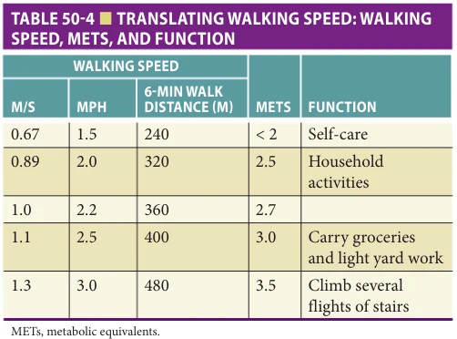

*Table 50-4, printed p. 750.*

on any measure of gait speed. Using METs as a basis for function, a sequence of mobility capacities is described in Table 50-5.

## EVALUATION

Strategy for the Clinical Encounter There are no established standards for the overall evaluation and treatment of mobility problems in older adults. Currently, the most common approach is similar to the ones used for other geriatric syndromes. These approaches are all based on a biopsychosocial model that incorporates

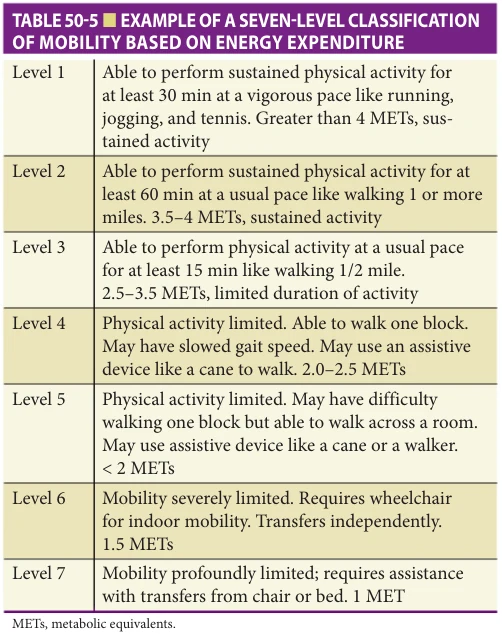

*Table 50-5, printed p. 750.*

**[p. 751]**

biomedical, rehabilitative, and psychosocial elements and a multidisciplinary team. The initial goal of assessment is to classify the mobility problem into one of three large groups: nonambulatory, ambulatory, or vigorous. For the person who presents in a wheelchair or bed, one can screen for ability to stand or walk with assistance. For ambulatory individuals, a quick sorting strategy is to observe gait. Since most gait parameters are highly interrelated, abnormal gait can be grossly distinguished from normal by a few simple characteristics like use of a gait aid, gait speed less than 1 m/s (or step length less than twice foot length), or step asymmetry. Persons with normal gait can be assessed for higher level fitness by use of one or more screening tests for higher level abilities such as single foot stand for 30 seconds, ability to tandem walk or ability to walk more than 450 to 500 m in 6 minutes. Persons with normal walking but inability to perform higher level tasks might be good candidates for exercise programs for well elders or for further evaluation if the mobility change is recent or causing problems.

Further assessment of the nonambulatory or for those with abnormal gait depends in part on the treatment goals. The team can select a basic strategy; either to try to improve mobility or to compensate for irreversible mobility loss (Figure 50-4). This decision is based on patient preferences, the time course of the mobility loss, the potential to reverse impairments, and the ability of the patient to participate in treatment. For example, a person with severe cognitive deficits or severe irreversible motor paralysis might be considered more appropriate for compensation than for interventions to improve mobility. Planning for compensation might target mobility care needs and resources. For the person considered to have potential for improving mobility, the major decisions are the timing and value of interventions directly on mobility (usually through exercise and rehabilitation) and on underlying physiologic impairments (usually through medical team care). In primary care, the provider can screen and triage function by recognizing mobility disorders, assessing potential for intervention, and referring to other providers as appropriate.

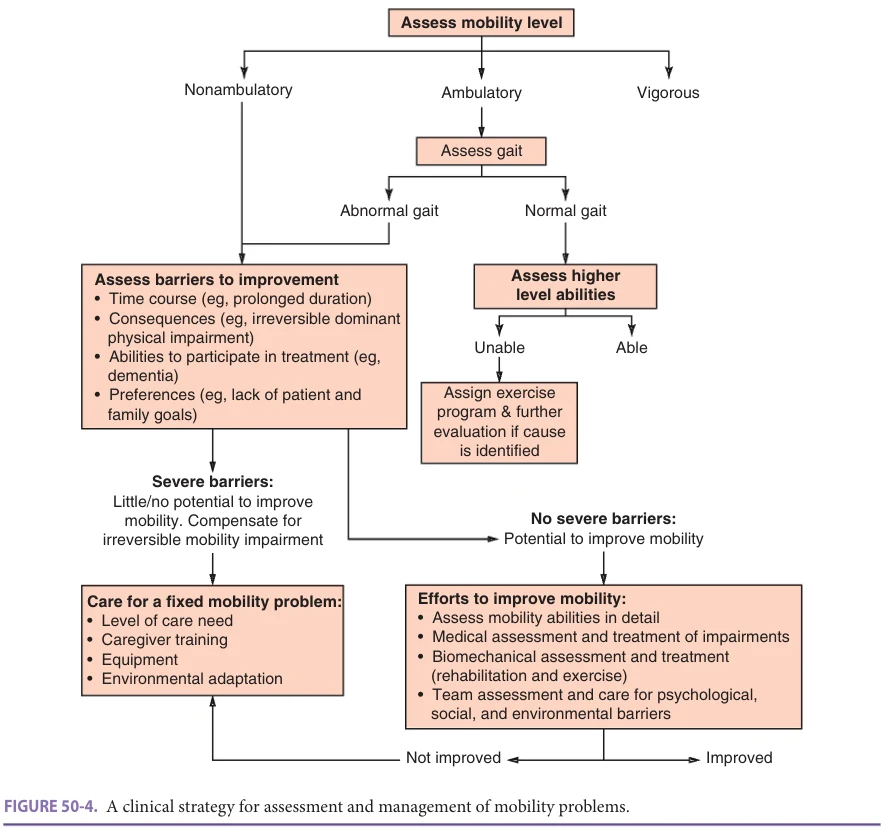

*Figure 50-4, printed p. 751.*

**[p. 752]**

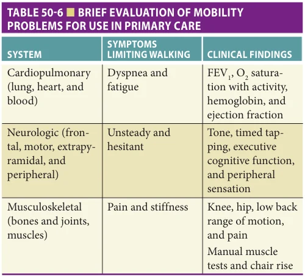

*Table 50-6, printed p. 752.*

Table 50-6 gives examples of a quick system of assessment for symptoms and clinical findings based on the three main involved organ systems. The primary provider can identify and treat overt clinical impairments that can be detected quickly in the clinic, like weight-bearing pain caused by osteoarthritis, or dyspnea caused by congestive heart failure. When the cause of the mobility problem is less obvious, a referral to multidisciplinary team for comprehensive mobility assessment should be considered. Since the potential causes range across many organ systems, this strategy might be more efficient than referral to several organ system–based specialists. Research into mobility problems is an active and high-priority area in aging; in the future, efficient clinical practice and referral may be better informed by evidence.

The comprehensive approach to the clinical assessment of treatable causes of mobility is currently a specialized referral function that is resource intensive. Evaluation starts with the clinical assessment of the severity, course and consequences of mobility limitation, and the determination of potential to improve mobility. Mobility performance is assessed in more detail, including biomechanical aspects of functional limitations during movement. Potential contributing factors are identified based on physiologic impairments, and evidence is sought for psychosocial and environmental influences.

Clinical Assessment of Mobility Performance In ambulatory patients, simple assessment of gait speed is a useful place to start. The gait speed can be used to estimate function as described above. Gait can be assessed in more detail from a biomechanical perspective (Table 50-7). Gait can be examined for general characteristics like path deviations, irregular or variable stepping, or a widened base of support and for altered motion of the component parts: trunk, arms, hip, knee,

ankle, and foot. Mobility tasks can be examined for performance difficulty or altered movement patterns as task demands increase. Sometimes, the finding of an abnormal body-segment movement or gait characteristic suggests a specific impairment or disease. More often, the abnormality is nonspecific but is amenable to direct intervention in rehabilitation. Clinical gait assessments that capture many of these biomechanical elements (eg, variable stepping, path deviation, hip range of motion, arm swing) are the modified Gait Abnormality Rating Scale and the Tinetti Performance Oriented Mobility Assessment.

Mobility assessment scales usually have a functional rather than a biomedical perspective and are not designed to detect specific impairments. These scales can be used to identify areas for task practice or adaptation in rehabilitation and to assess the effects of treatment. When selecting an assessment tool, level of mobility of the patient should be considered. For nonambulatory patients, assessments should focus on bed mobility and transfers. The Hierarchical Assessment of Balance and Mobility assesses mobility, transfers, and balance and detects multiple levels within the bed and chair. For ambulatory patients, assessments should focus on walking including unchallenged (straight path walking) and some challenged walking. For patients with vigorous mobility, assessments should focus on more challenging walking tasks such as uneven surfaces, obstacles, curved paths, dual task, and walking for longer distances. Some clinical measures focus on one mobility group (ie, nonambulatory) but many clinical assessments of mobility are based on a hierarchy of task difficulty and will span the various mobility groups. One such measure, the Berg Balance Scale, assesses 14 tasks of progressive difficulty from sitting balance to one leg standing and rising onto a step. The Physical Disability Index has eight mobility tasks including six items for nonambulatory persons. The Activity Measure for Post-Acute Care (AM-PAC) was developed specifically for use across post-acute care settings (from inpatient to outpatient settings) and can also capture a range of mobility. The AM-PAC is based on patient responses and clinician observation, and captures three domains: basic mobility, daily activities, and applied cognitive. The Dynamic Gait Index, which includes eight challenging gait items such as changing gait speed, walking with head turns, and stepping over an obstacle, may be appropriate for patients with higher level (ie, vigorous) mobility.

Differential Diagnosis Based on a Physiologic Perspective A clinical schema for the comprehensive evaluation of mobility that is derived from Ferrucci, Tinetti, and the authors’ own work is proposed in Table 50-8. Many impairments are detectable through the usual geriatric clinical history and physical examination. Some sensory

**[p. 753]**

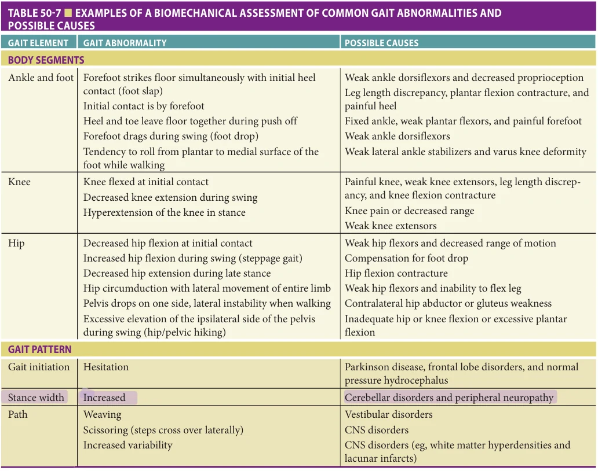

*Table 50-7, printed p. 753.*

systems are amenable to clinical evaluation. Some impairments are hard to detect in the clinic and require further testing. Vestibular testing may be helpful when there is unsteadiness that is not well explained by other impairments or when specific vestibular symptoms are present. Electrodiagnostic testing of nerve conduction velocity or abnormal muscle activity may be indicated when neurologic findings are suspicious. Exertional chest pain or dyspnea requires appropriate cardiac and pulmonary testing and a screen for anemia. Leg pain on exertion suggests testing for peripheral vascular disease or lumbar stenosis.

Psychosocial and Environmental Assessment Mobility limitations are influenced by psychological, social, and environmental factors (Table 50-9). Depression can have a powerful effect on the desire to be mobile. Fear of falling, lack of confidence, lower attention, and low self-efficacy can also adversely influence a person’s mobility. Screens for these conditions can include a single question or multiple questions

(see Table 50-3) and should be part of a comprehensive mobility assessment. Apathy and lack of motivation are a common concern in geriatric rehabilitation. Formal and informal social support resources can be critical for the person with mobility limitations. Cultural and financial factors can influence attitudes toward disability and resources for addressing the problem. The safety and accessibility of the living environment can be a barrier or facilitator for persons with mobility problems. Self-report measures, such as the life-space mobility questionnaire, quantify how often and with what level of difficulty older adults engage with progressively wider environments (eg, leaving bedroom, going outside, traveling beyond neighborhood, etc.). A home visit for assessment can offer many opportunities for creative problem solving.

In recent years, mobile health technologies, such as wearable devices and smartphones, have become widely used to monitor physical activity in the person’s own environment. These devices could also be used to gain insights into spatiotemporal parameters of gait.

**[p. 754]**

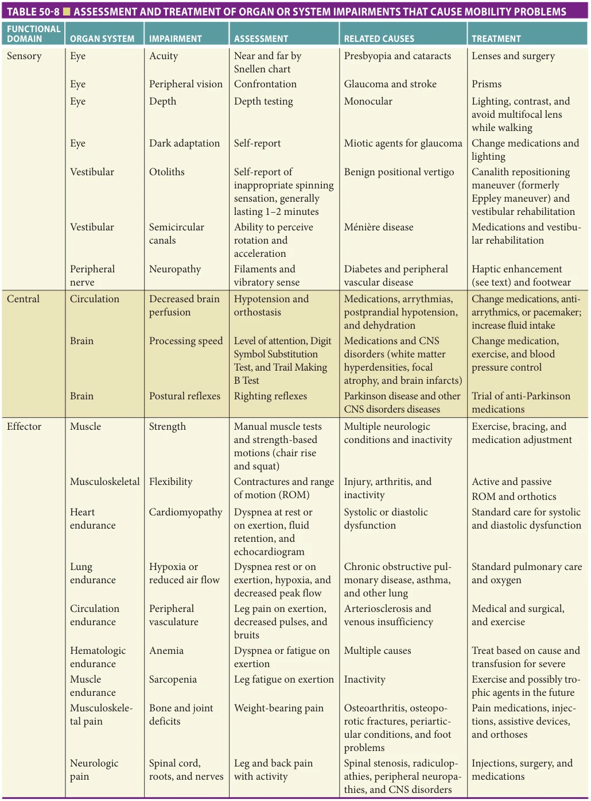

*Table 50-8, printed p. 754.*

**[p. 755]**

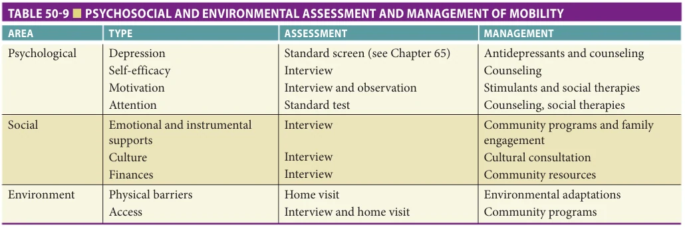

*Table 50-9, printed p. 755.*

## MANAGEMENT

Intervening Directly on Mobility Interventions directed at functional limitations are often rehabilitative in nature and involve exercise, adaptive equipment, and environmental modifications. Mobility limitations can be addressed through mobility task practice and exercise to improve specific impairments in strength, balance, endurance, and/or flexibility. Deconditioning is almost always present as a direct consequence of reduced mobility and inactivity, and deconditioning has been found to be treatable in many older adults who are sick or frail. General conditioning programs of exercise are frequently indicated. Task-specific exercises and assistive and orthotic devices can improve stability and reduce weight-bearing pain. The evidence for the effectiveness of rehabilitation and exercise interventions is growing and has been examined in older adults with varying levels of mobility limitations. In general, increasing the amount of time spent walking, even at moderate pace and in the absence of direct cardiovascular beneficial effects, can improve mobility and reduce disability. Recent studies suggest that a focus on neural control of walking through the development of progressively more complex motor skills may be especially effective in improving walking speed and the energy efficiency of walking. Chapter 55 on rehabilitation and Chapter 54 on exercise present these interventions in more detail.

Treating Impairments Some impairments can be linked to diseases and pathologic processes that are amenable to medical treatment, and some impairments can be improved directly regardless of pathologic cause (see Table 50-8). Peripheral sensory disorders are often not correctable, but compensation can be achieved with lighting to improve visual information and increasing haptic feedback (for example, through use of a cane). Haptic perception is demonstrated by the remarkable decrease in sway with eyes closed, seen in persons with peripheral sensory or vestibular disorders,

when they are allowed even minimal, nonsupporting contact with a stable surface such as a table, wall, or assistive device. Shoe inserts that increase sensory feedback are in development.

Progress in rehabilitation technology demonstrates some beneficial effects on recovery of mobility after a stroke or other injuries. For example, individuals with unilateral cerebral lesions after stroke may improve symmetric stepping in walking following split-belt treadmill training, in which the legs move at different speeds to encourage post-training even stepping. Other technologies include body weight–supported treadmill training, although evidence indicates that robust physical therapy leads to similar benefits. These technological advancements can potentially revolutionize the approach to physical therapy for older adults.

The slowed gait of Parkinson disease can be responsive to medication although the balance disorder is not. Parkinson patients may move faster when medications are initiated and thus increase their risk of fall injury unless appropriate rehabilitative measures are coordinated. Likewise, current evidence indicates individuals with BPV benefit from a combination of the canalith repositioning maneuver and balance rehabilitation more than from the repositioning maneuver alone. From the lens of improving mobility limitations, most pharmacologic interventions work best in concert with rehabilitation.

Attention to Factors That Modify Behavior and Environment The modifiable psychosocial factors that influence physical activity may offer opportunities to intervene (see Table 50-9). Depression can be managed medically or with psychotherapy. Social support and encouragement can be promoted through group activities. Exercise (ie, balance, strength training, Tai chi/dance) may reduce fear of falling without increasing the risk or frequency of falls. The beneficial effects of physical activity on mobility could also be indirect, for example because it promotes attention, alertness, mood, as well as increasing one’s motivation to move

**[p. 756]**

better and more. Physical environmental adaptations in the home include ramps and railings, bathroom modifications, proper lighting, and strategic placement of stable furniture items. Further modifications are often indicated in institutional settings.

Care for the Immobile Person Interventions to reduce the consequences of immobility include determining the level of care need and living setting, training others to properly position and move the patient, implementing a mobilization plan, use of pressure-reducing devices to prevent pressure ulcer, and, sometimes, using equipment to aid in transfers (see Chapter 46). Persons who are responsible for carrying out transfers of immobile patients, including health aides and family caregivers, need training in proper techniques that reduce injury to the patient and the assistant. Appropriate assistive devices, such as wheelchairs or powerchairs should be considered to increase environmental accessibility.

Absolute bed rest is almost never indicated and should be discouraged in all settings. Mobility-related activities such as scooting in bed, sitting up, and standing can promote improved physiologic function when walking is not feasible. Mobilization, including walking,

## FURTHER READING

Bevilacqua R, Maranesi E, Riccardi GR, et al. Non-

immersive virtual reality for rehabilitation of the older people: a systematic review into efficacy and effectiveness. J Clin Med. 2019;8(11):1882. Brach JS, VanSwearingen JM. Interventions to improve

walking in older adults. Curr Transl Geriatr Exp Gerontol Rep. 2013;2(4). Cohen JA, Verghese J. Gait and dementia. Handb Clin

Neurol. 2019;167:419–427. Ferrucci L, Bandinelli S, Benvenuti E, et al. Subsystems con-

tributing to the decline in ability to walk: bridging the gap between epidemiology and geriatric practice in the InCHIANTI study. J Am Geriatr Soc. 2000;48:1618–1625. Freedman VA, Spillman BC, Andreski PM, et al. Trends

in late-life activity limitations in the United States: an update from five national surveys. Demography. 2013;50:661–671. Fried LP, Bandeen-Roche K, Chaves PH, Johnson BA.

Preclinical mobility disability predicts incident mobility disability in older women. J Gerontol Med Sci. 2000;55A: M43–52. Guralnik JM, Ferrucci L, Simonsick EM, et al. Lower-

extremity function in persons over the age of 70 years as a predictor of subsequent disability. N Engl J Med. 1995;332:556–561.

has been shown to be feasible even in the intensive care setting and is associated with reduced intensive care unit delirium. An exception to routine mobilization might be for humanitarian reasons when an individual is actively dying, where routine mobilization might cause suffering without associated benefit. Mobilization, rather than bed rest, during hospitalization for acute illness has been one of the most consistently efficacious interventions in geriatric care units.

## SUMMARY

Mobility disorders are widespread in older adults. Mobility limitations constrain many functions required for independent living and are powerful indicators of future problems. Mobility can be classified using simple screening. Evaluation starts with a triage function or simple measures like gait speed. Many common contributors to mobility limitations can be managed in the primary care setting. A comprehensive mobility evaluation is resource intensive and requires a multidisciplinary team. Evaluation and management include a biomechanical approach to function, a biomedical approach to the physiologic components of mobility, and a biopsychosocial and environmental approach to modifying factors.

Jorstad EC, Hauer K, Becker C, et al. Measuring the psy-

chological outcomes of falling: a systematic review. J Am Geriatr Soc. 2005;53:501–510. Kendrick D, Kumar A, Carpenter H, et al. Exercise for

reducing fear of falling in older people living in the community. Cochrane Database Syst Rev. 2014;11:CD009848. Li KZH, Bherer L, Mirelman A, et al. Cognitive involve-

ment in balance, gait and dual-tasking in aging: a focused review from a neuroscience of aging perspective. Front Neurol. 2018;9:913. Moskowitz S, Russ DW, Clark LA, et al. Is impaired dopa-

minergic function associated with mobility capacity in older adults?. Geroscience. 2021;43(3):1383–1404. Pahor M, Guralnik JM, Ambrosius WT, et al. Effect of struc-

tured physical activity on prevention of major mobility disability in older adults: the LIFE study randomized clinical trial. JAMA. 2014;311(23):2387–2396. Peel NM, Kuys SS, Klein K. Gait speed as a measure in geri-

atric assessment in clinical settings: a systematic review. J Gerontol A Biol Sci Med Sci. 2013;68(1):39–46. Perera S, Mody SH, Woodman RC, et al. Meaningful

change and responsiveness in common physical performance measures in older adults. J Am Geriatr Soc. 2006; 54:743–749.

**[p. 757]**

Rosano C, Rosso AL, Studenski SA. Aging, brain, and

mobility: progresses and opportunities. J Gerontol A Biol Sci Med Sci. 2014;69(11):1373–1374. Schaap LE, Koster A, Visser M. Adiposity, muscle mass,

and muscle strength in relation to functional decline in older persons. Epidemiol Rev. 2013;35:51–65. Studenski S, Perera S, Patel K, et al. Gait speed and survival

in older adults. JAMA. 2011;305(1):50–58. VanSwearingen JM, Studenski SA. Aging, motor skill, and

the energy cost of walking: implications for the prevention

and treatment of mobility decline in older persons. J Gerontol A Biol Sci Med Sci. 2014;69(11):1429–1436. Warmerdam E, Hausdorff JM, Atrsaei A, et al. Long-term

unsupervised mobility assessment in movement disorders. Lancet Neurol. 2020;19(5):462–470. Wennberg AM, Savica R, Mielke MM. Association between

various brain pathologies and gait disturbance. Dement Geriatr Cogn Disord. 2017;43(3–4):128–143.

**[p. 758]**
