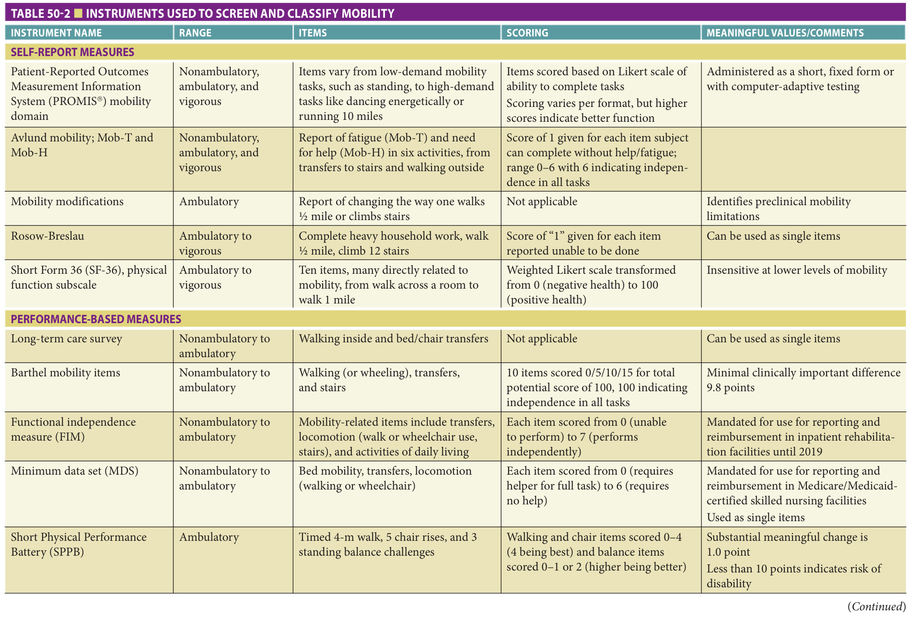
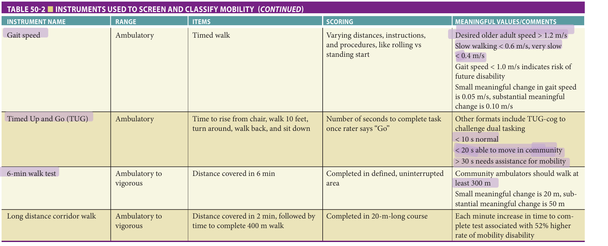

Study summary of Chapter 50 - Mobility Assessment and Management; the book and the full chapter are the reference.

# Chapter 50 Study: Mobility Assessment and Management

## Summary

**Definition & consequences**
- Mobility is moving the body through space, from bed movement and transfers to walking and stairs. Its limitations threaten independence and predict adverse outcomes (p741).
- Disability depends on the person and environment, not simply an isolated impairment; biomechanical, biomedical and psychosocial perspectives are complementary (p741, p746).

**Assessment**
- Evaluate cardiopulmonary, musculoskeletal, neurologic and psychological contributors; use gait speed, the short physical performance battery or Timed Up and Go as appropriate (p741).
- Triage into nonambulatory, ambulatory or vigorous mobility. Nonambulatory assessment emphasizes bed movement/transfers; more able patients need progressively challenging walking tasks (p751–752).
- Usual walking speed should generally be at least **1 m/s**; the chapter illustrates a **4-m** walk in under **4 seconds** (p750).
- Gait aid use, speed below **1 m/s**, short steps or asymmetry indicate a need for closer assessment (p751).
- For apparently normal walkers, higher-level tests include a **30-second** single-foot stand, tandem walking or over **450–500 m** in **6 minutes** (p751).
- Performance tests measure capacity under test conditions, not actual daily activity; standardize instructions and consider cooperation and fluctuating performance (p745).

**Management**
- Address impairments while practicing mobility tasks; combine strength, balance, endurance and flexibility training as needed (p755).
- Use assistive/orthotic devices, environmental adaptations and caregiver training to improve stability, participation and weight-bearing pain (p741, p755).
- Deconditioning often accompanies reduced mobility and is treatable in many sick or frail older adults. General conditioning and progressively complex walking practice may help (p755).

**Exam traps**
- Gait speed is an integrative functional marker, not a diagnosis of the responsible impairment; assessment scales help choose tasks and monitor treatment (p750, p752).
- In a pooled community cohort, each **0.1 m/s** faster speed was associated with **13%** lower mortality risk; this is an association, not a guaranteed treatment effect (p746).
- With aging, step length and speed decline and double-support time increases; step length and stride length describe different distances (p747).

## Exam-cited book images

Book images cited by past exams. Tap an image to zoom.

[2024-Sep Q28](?chapter=bank&q=mcq-e04066f84a3a95a8b9aab699) · [2025-Jun Q51](?chapter=bank&q=mcq-0e7c860e8f2e9076d408c9f1)

[2024-Sep Q28](?chapter=bank&q=mcq-e04066f84a3a95a8b9aab699) · [2025-Jun Q51](?chapter=bank&q=mcq-0e7c860e8f2e9076d408c9f1)

## Exam questions

Past-exam questions linked to this chapter (3):

- [2023-Jun Q51](?chapter=bank&q=mcq-7025f4162f1dd6a89f317d36)
- [2024-Sep Q28](?chapter=bank&q=mcq-e04066f84a3a95a8b9aab699)
- [2025-Jun Q51](?chapter=bank&q=mcq-0e7c860e8f2e9076d408c9f1)
