# Hazzard's Geriatric Medicine and Gerontology, 8e — Chapter 51: Osteoporosis

Gustavo Duque, Mizhgan Fatima, Jesse Zanker, Bruce R. Troen

> **Lane-reviewed against the book, 25 Sep 2026.**

**[p. 759]**

#### Learning Objectives

- To understand the features of osteoporosis in older persons
- To identify fracture risk in older persons
- To learn fracture prevention strategies in older persons

#### Key Clinical Points

1. Both older men and women are at risk of osteoporotic fractures.
2. Fracture risk assessment, including clinical factors, should be performed in every person older than 65.
3. Calcium and vitamin D should be an essential component of any osteoporosis treatment.
4. Antiresorptives (bisphosphonates and denosumab) and anabolics (teriparatide and romosozumab) are effective and safe treatments for osteoporosis in older persons.

## Definition Of Osteoporosis

The term osteoporosis was first introduced in the nineteenth century based on histologic diagnosis (“porous bone”). Osteoporosis is a “disease characterized by low bone mass and microarchitectural deterioration of bone tissue leading to enhanced bone fragility and a consequent increase in fracture incidence.” Osteoporosis may also be defined either by the presence of a fragility fracture (a fracture resulting from a fall from standing height or less) or by bone mineral density (BMD) measurement. In defining BMD criteria for osteoporosis, the World Health Organization (WHO) used as the standard the BMD of young adult women who were at the age of peak bone mass. For each standard deviation below peak bone mass (or 1 unit decrease in T-score), a woman’s fracture risk approximately doubles. As seen in **Table 51-1** , a T-score less than −2.5 defines osteoporosis; osteopenia (low bone mass) and normal bone mass are also defined.

A BMD measurement may confirm the diagnosis of osteoporosis and indicates that interventions are needed prior to fracture in older adults. In addition, individuals with osteopenia could be still at risk of fractures. They, therefore, should be followed carefully for further bone loss while also promoting nonpharmacologic interventions that maintain bone health. Although the original standards for definitions of osteoporosis were determined in White women, the standards for men and Hispanic women are similar to those of White and African-American women. However, defining osteoporosis solely by T-score does not effectively capture all patients at risk of a fracture. Greater than 50% of all hip fractures occur in those with T-scores that are better than −2.5. Failure to evaluate and treat such patients adds to the individual and societal cost and consequences of osteoporosis. Therefore, we are still faced with the challenge of improving the identification of the individual patient at risk of fracture and subsequently optimizing both prevention and treatment for older adults.

Primary or idiopathic osteoporosis has been historically classified as postmenopausal or senile osteoporosis. Postmenopausal osteoporosis occurs in women between 51 and 75 years. It is related to estrogen deficiency seen with the menopausal transition, which associates with very high levels of bone resorption. In contrast, senile osteoporosis typically occurs in persons older than 60 years. It affects both men and women and has different pathophysiology, which involves reduced levels of bone turnover due to a reduction in the numbers of bone-forming cells (osteoblasts). Increasing evidence points to a progressive age-related alteration in stem cell physiology that favors adipogenesis and thereby reduces osteoblastogenesis and bone formation. Nevertheless, estrogen probably plays a role in the pathophysiology of senile osteoporosis as well. Secondary osteoporosis is the result of underlying conditions or medications that adversely affect bone. This chapter will focus on the typical characteristics of senile osteoporosis from its pathophysiology to therapeutic approaches.

**[p. 760]**

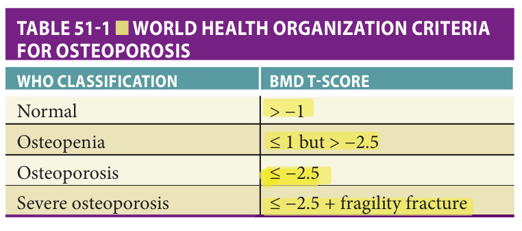

> *Table 51-1 reproduced as a page image (printed p. 760) — the grid did not extract reliably as text for this fast build.*

> Highlighting is the owner's annotation, not the book's.

## Epidemiology

Due to the increasing osteoporosis prevalence with age, the worldwide aging of the population and the changing lifestyle habits, the prevalence of osteoporosis has risen significantly and will continue to in the future. In 2018, the National Osteoporosis Foundation (NOF) announced that 54 million Americans, half of all adults age 50 and older, are at risk of breaking a bone and should be concerned about bone health; this means that approximately 10 million adults in the United States have osteoporosis, with an additional 43 million having low bone mass. In addition, women have more than 250,000 and 500,000 hip and spine fractures per year, respectively. Men account for an additional 250,000 fractures per year, of which 75,000 are hip fractures.

On reaching the age of 90, one-third of women and one-sixth of men will suffer a hip fracture. Both women and men have a similar lifetime vertebral fracture risk of 12%. The consequences of osteoporotic fracture include diminished quality of life (QoL), decreased functional independence, and increased morbidity and mortality. Pain and kyphosis, height loss, and other changes in body habitus resulting from vertebral compression fractures diminish the QoL in women and men. These changes lead to declines in functional status, such as the inability to bathe, dress, or ambulate independently and decrease pulmonary and gastrointestinal function. Approximately 50% of women do not fully recover prior function after hip fracture; older adults have 20% to 25% mortality in the year following hip fracture. Indeed, men are at a higher risk of dying after a hip fracture than women. Osteoporosis-related bone breaks cost patients, their families, and the health care system. The estimated annual cost of osteoporotic fractures in the United States is more than $22 billion, and by 2025 the NOF predicts that osteoporosis will be responsible for 3 million fractures costing $25 billion annually, which is higher than the money spent treating cardiovascular disease. Therefore, prevention and early diagnosis and treatment of osteoporosis are vital to improving the health of older adults.

## Pathophysiology

New advances in understanding bone physiology have elucidated an active interaction among bone and bone marrow cells, growth factors, and hormones responsible for maintaining calcium levels, skeletal structure, and resistance to trauma. Bone is not simply a mineralized structure but a complex system of cell–cell, cell–matrix, and cell–hormone interactions influenced by genetic background, lifestyle, and diet.

Bone is composed of inorganic (calcium phosphate crystals) and organic compounds (90% collagen and 10% noncollagenous proteins). Noncollagenous proteins include albumin, osteopontin, osteocalcin, α2-HS-glycoprotein, and growth factors, constituting the so-called bone matrix. The bone matrix is produced by osteoblasts and is the environment in which bone and external factors interact in a well-coordinated manner. There are two types of bone: cortical and trabecular. Cortical bone predominates in the long bones of the extremities, while trabecular bone predominates in the vertebrae and pelvis and makes up 80% of skeletal mass. While both types of bone have an active remodeling process, trabecular bone is metabolically more active than cortical bone and more acutely responsive to alterations in sex steroid hormone status. The bone marrow is also a complex environment in which bone cells interact with hematopoietic and marrow adipose tissues ( **Figure 51-1** ), playing an essential role in regulating bone turnover.

During childhood and adolescence, skeletal growth occurs at growth plates, areas in which cartilage proliferates and gradually undergoes calcification, resulting in new bone formation. However, bone remodeling is a lifelong process that maintains bone to harbor bone marrow, support the body, protect vital organs, and provide a source of minerals. Remodeling replaces older, frailer bone with newer, more resilient bone in an organized manner. The end product of remodeling is the maintenance of skeletal homeostasis and the preservation of anatomical integrity. With aging or with menopausal transition, the once-coordinated mechanism of bone remodeling with balanced formation and resorption becomes uncoupled, leading to bone loss and increased risk of fracture.

## Bone Cells

The cells involved in bone turnover are osteoclasts, osteoblasts, and osteocytes ( **Figure 51-2** ). Osteoclasts are macrophage-like cells that secrete proteolytic enzymes and hydrogen ions required to remove the deposited bone matrix. The remodeling cycle begins when osteoclast precursors interact with other marrow cells and are activated, becoming multinucleated osteoclasts, which initiates resorption. Bone resorption occurs within the resorption lacuna, a tightly sealed zone beneath the ruffled border of the osteoclast where it has attached to the bone surface. Resorption depends on acidification of this extracellular compartment leading to demineralization. Subsequently, the organic matrix is degraded by cysteine proteases, chief of which is cathepsin K. Osteoclasts consequently create a functional extracellular lysosome, containing both an acidic environment and specific lysosomal enzymes.

**[p. 761]**
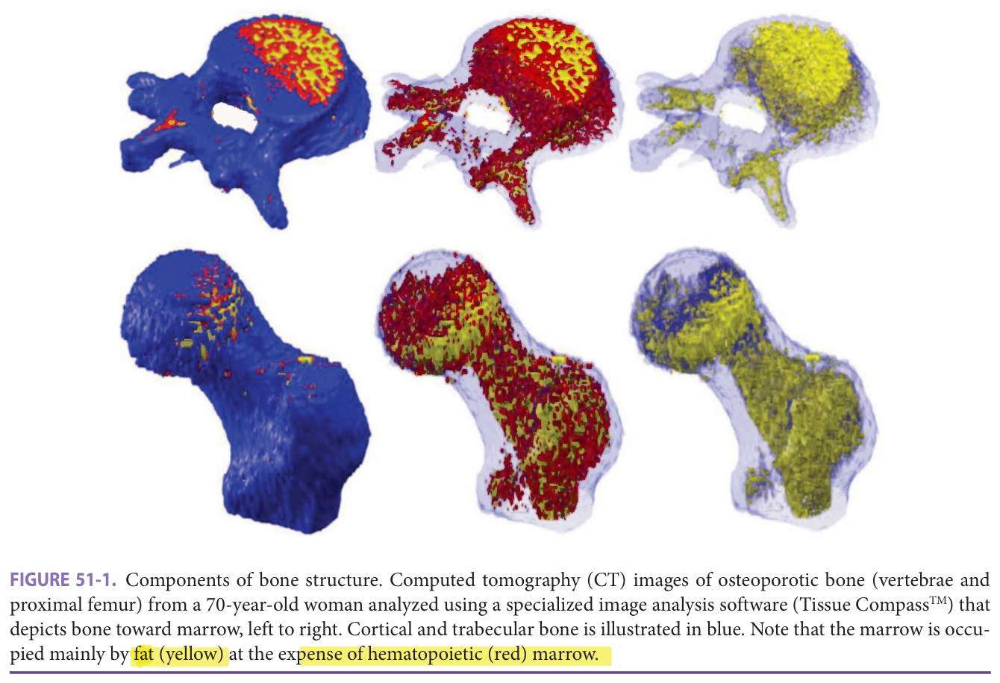

> *FIGURE 51-1. Components of bone structure. Computed tomography (CT) images of osteoporotic bone (vertebrae and proximal femur) from a 70-year-old woman analyzed using a specialized image analysis software (Tissue CompassTM ) that depicts bone toward marrow, left to right. Cortical and trabecular bone is illustrated in blue. Note that the marrow is occupied mainly by fat (yellow) at the expense of hematopoietic (red) marrow.*

> Highlighting is the owner's annotation, not the book's.

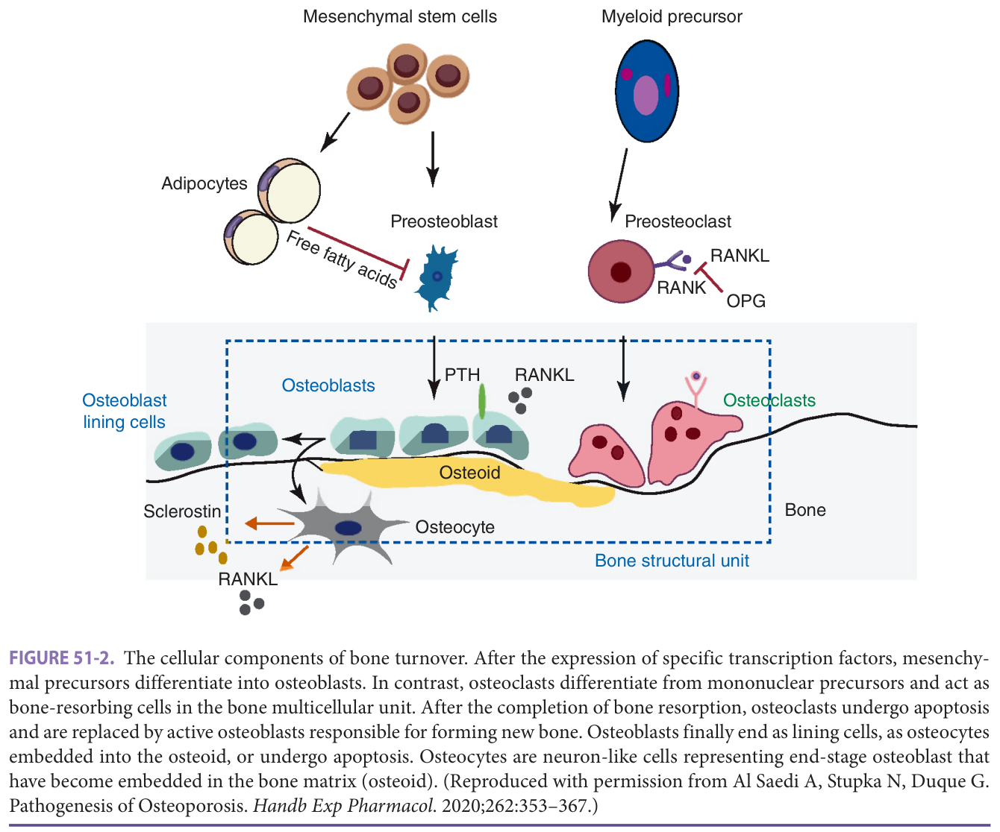

> *FIGURE 51-2. The cellular components of bone turnover. After the expression of specific transcription factors, mesenchymal precursors differentiate into osteoblasts. In contrast, osteoclasts differentiate from mononuclear precursors and act as bone-resorbing cells in the bone multicellular unit. After the completion of bone resorption, osteoclasts undergo apoptosis and are replaced by active osteoblasts responsible for forming new bone. Osteoblasts finally end as lining cells, as osteocytes embedded into the osteoid, or undergo apoptosis. Osteocytes are neuron-like cells representing end-stage osteoblast that have become embedded in the bone matrix (osteoid). (Reproduced with permission from Al Saedi A, Stupka N, Duque G. Pathogenesis of Osteoporosis. _Handb Exp Pharmacol_ . 2020;262:353–367.)*

> Highlighting is the owner's annotation, not the book's.

**[p. 762]**

In cortical bone, the resorption period lasts approximately 30 days; the final result is a resorption tunnel that osteoblasts will later fill in in a haversian manner, in which plates of bone are laid down in layers of concentric rings around a central channel. The apposition of these haversian canals takes the shape of a “cut onion,” which gives the cortical bone its typical morphology. In trabecular bone, the erosion period lasts approximately 43 days, resulting in a trench between the trabeculae. The life span of osteoclasts is around 2 weeks; once these cells complete their role as bone-resorbing cells, they undergo apoptosis or programmed cell death.

Osteoblasts are fibroblast-like cells derived from pluripotent mesenchymal cells that localize on periosteal surfaces ( **Figure 51-2** ). Such pluripotent stromal cells can be induced to differentiate along the osteoblastic, adipocytic, fibroblastic, or chondrocytic lineages when required. When bone integrity has to be conserved, mesenchymal stromal cells are committed toward the osteoblastic lineage. Many factors are involved in the process of osteoblastogenesis ( **Figure 51-3** ), including the bone morphogenic protein family; bone morphogenic proteins 2, 4, and 7 are potent inducers of osteoblast differentiation. A transcription factor called Runx2/Cbfa1 plays a crucial role in osteoblast differentiation; mice lacking Runx2/Cbfa1 do not form bone. A mature osteoblast is a cuboidal cell with a large nucleus and enlarged Golgi highly enriched in alkaline phosphatase. It produces type I collagen and specialized bone-matrix proteins such as osteoid, the primary protein for further bone formation and mineralization. Osteoblasts produce alkaline phosphatase, the specific function of which has yet to be determined. Nevertheless, it is used as a marker of osteoblast differentiation and activity and indirectly as a marker of subsequent osteoclast resorption. Mice lacking functional alkaline phosphatase suffer from hypophosphatasia characterized by impaired mineralization of cartilage and bone matrix. After osteoblasts complete their bone-forming function, they face one of three fates: (1) they become embedded in the newly formed matrix, becoming osteocytes; (2) they remain on the surface of the newly formed bone and become lining cells; or (3) they undergo apoptosis. Hormonal changes, the presence or absence of growth factors, inflammatory conditions, and the aging process in bone determine the ultimate fate of the osteoblast.

In contrast, osteoclasts belong to the macrophage lineage and express multiple very potent degradative enzymes.

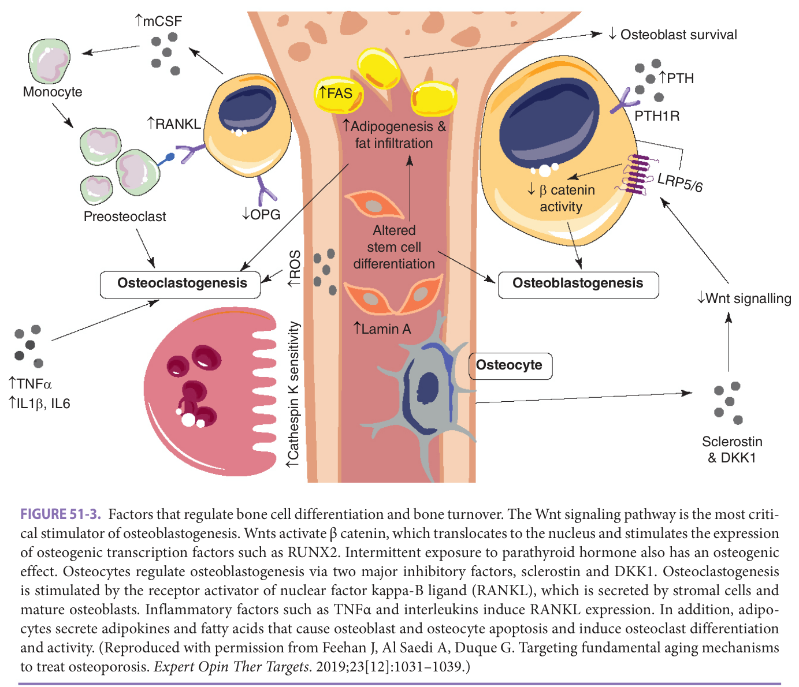

> *FIGURE 51-3. Factors that regulate bone cell differentiation and bone turnover. The Wnt signaling pathway is the most critical stimulator of osteoblastogenesis. Wnts activate β catenin, which translocates to the nucleus and stimulates the expression of osteogenic transcription factors such as RUNX2. Intermittent exposure to parathyroid hormone also has an osteogenic effect. Osteocytes regulate osteoblastogenesis via two major inhibitory factors, sclerostin and DKK1. Osteoclastogenesis is stimulated by the receptor activator of nuclear factor kappa-Β ligand (RANKL), which is secreted by stromal cells and mature osteoblasts. Inflammatory factors such as TNFα and interleukins induce RANKL expression. In addition, adipocytes secrete adipokines and fatty acids that cause osteoblast and osteocyte apoptosis and induce osteoclast differentiation and activity. (Reproduced with permission from Feehan J, Al Saedi A, Duque G. Targeting fundamental aging mechanisms to treat osteoporosis. _Expert Opin Ther Targets_ . 2019;23[12]:1031–1039.)*

> Highlighting is the owner's annotation, not the book's.

**[p. 763]**

Osteoclast differentiation, formation, and, to a lesser degree, activation depend upon the proximity and products of the osteoblast ( **Figure 51-3** ). Without exception, the fate of the osteoclasts is to die by apoptosis.

Osteocytes constitute the third group of bone cells that are involved in bone metabolism. These cells are the most abundant cell type in bone and are the focus of intense research. Osteocytes are postmitotic terminally differentiated osteoblasts that are entrapped within the new bone matrix. Once considered inert, these cells are now recognized as key regulators of skeletal metabolism, mineral homeostasis, and hematopoiesis. Osteocytes are the critical responders to mechanical forces and orchestrators of bone remodeling and mineral homeostasis ( **Figure 51-3** ). Although osteocytes are entombed within their hosting lacunae, they are not isolated and instead maintain close communication with other cells and micro environments through a complex network of channels (canaliculi) in which osteocyte projections (cilia) are in close contact with blood vessels. Several functions attributed to osteocytes include the synthesis of matrix molecules such as osteocalcin and an essential role in direct communication with surface osteoblasts through molecules known as connexins. Two of those connexins, sclerostin and DKK1, are potent inhibitors of osteoblast differentiation and function and play an important role in the activation and regulation of bone metabolism in response to physiologic and mechanical stimuli. These modulate the response of bone during functional adaptation of the skeleton to mechanical forces and the need for repair of microdamage. Any mechanical force applied on the bone (ie, exercise) will have an inhibitory effect on sclerostin and DKK1, thus facilitating osteoblast differentiation and function. Osteocytes are very long-lived cells with a half-life of 25 years, after which most undergo apoptosis.

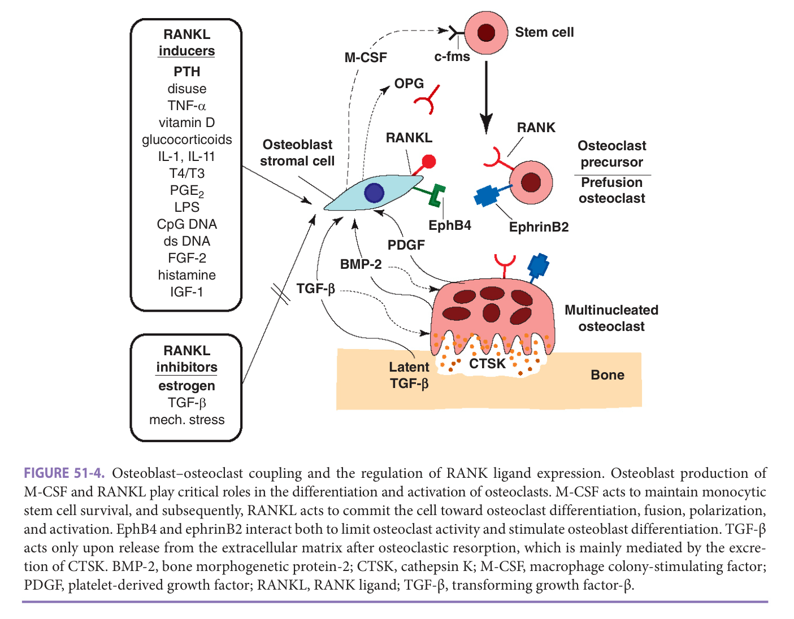

> *FIGURE 51-4. Osteoblast–osteoclast coupling and the regulation of RANK ligand expression. Osteoblast production of M-CSF and RANKL play critical roles in the differentiation and activation of osteoclasts. M-CSF acts to maintain monocytic stem cell survival, and subsequently, RANKL acts to commit the cell toward osteoclast differentiation, fusion, polarization, and activation. EphB4 and ephrinB2 interact both to limit osteoclast activity and stimulate osteoblast differentiation. TGF-β acts only upon release from the extracellular matrix after osteoclastic resorption, which is mainly mediated by the excretion of CTSK. BMP-2, bone morphogenetic protein-2; CTSK, cathepsin K; M-CSF, macrophage colony-stimulating factor; PDGF, platelet-derived growth factor; RANKL, RANK ligand; TGF-β, transforming growth factor-β.*

> Highlighting is the owner's annotation, not the book's.

## Bone Turnover

Bone homeostasis depends on the intimate coupling of bone formation and bone resorption. After osteoclasts resorb bone, preosteoblasts differentiate into osteoblasts and migrate to the area of excavated bone and begin to deposit osteoid, which is eventually mineralized into new bone. Osteoclasts and osteoblasts belong to a temporary structure known as a basic multicellular unit (see **Figure 51-2** ). The coordinated process of bone resorption and formation by the basic multicellular unit lasts 6 to 9 months and results in newly mineralized bone. Osteoblasts are not only active as bone-forming cells, but these also play an important role in the regulation of osteoclast activity. The interaction between osteoblasts and osteoclasts requires a complex system of factors facilitated by integrins and cadherins (see **Figure 51-4** ). Briefly, the primary

**[p. 764]**

osteoclast/osteoblast interaction depends on the expression by osteoclast precursors and mature osteoclasts of a membrane receptor known as receptor activator of nuclear factor-κ B (RANK), which belongs to the family of tumor necrosis factor (TNF) receptors. Osteoclast differentiation, maturation, and survival depend on RANK activation by its cognate ligand (RANK ligand—RANKL), which is produced by osteocytes, osteoblasts, and osteoblast precursors after exposure to different stimuli such as hormones and cytokines ( **Figure 51-4** ). Multiple other factors also act to either enhance or suppress osteoclast formation and activation and subsequent bone resorption (see **Table 51-2** ).

RANKL is mainly a cytoplasmic membrane-bound molecule; to a lesser extent, it is secreted. Mature osteoblasts and osteocytes also produce a decoy receptor for RANKL called osteoprotegerin (OPG). OPG competitively binds to RANKL and prevents the interaction between RANK and RANKL, thus decreasing osteoclastogenesis and osteoclastic bone resorption and increasing osteoclast apoptosis. More recently, a group of molecules known as ephrins has been identified as key players in regulating osteoblast/osteoclast interaction. This cellular communication is bidirectional and involves a trans-membrane ligand known as ephrinB2, expressed by osteoclasts, and its receptor EphB4 expressed by osteoblasts (see **Figure 51-4** ). This signaling seems to limit osteoclast activity while enhancing osteoblast differentiation. Consequently, osteoblastogenesis and osteoclastogenesis, along with corresponding bone formation and resorption, are tightly and ineluctably coupled. The differentiation and activation of both osteoblasts and osteoclasts depend critically on each other; however, recent evidence indicates that osteocytes also play an essential role in bone turnover by regulating osteoblast function and survival as well as osteoclast function; all modulated by hormones, growth factors, and mechanical forces.

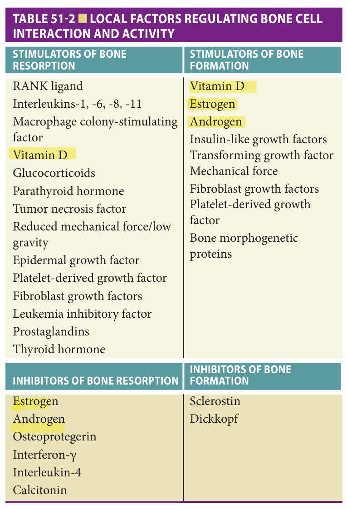

> *Table 51-2 — Local factors regulating bone cell interaction and activity. Reproduced as a page image (printed p. 764) — the grid did not extract reliably as text for this fast build.*

> Highlighting is the owner's annotation, not the book's.

## Genetics

Genetics plays a role in the determination of peak bone mass. Racial differences in the incidence of osteoporosis have been reported, including a lower relative risk of fractures and higher peak bone mass in African-American women compared with White women. No single gene, gene product, or polymorphism has yet been credibly identified to account for the variance seen in BMD in specific geographic areas. Several environmental factors, such as diet, topography, and yearly sunlight exposure, almost certainly interact with a genetic predisposition to explain the variance seen in periosteal expansion before puberty and trabecular number and thickness and periosteal-endosteal remodeling during aging. Candidate genes for determining peak bone mass are the vitamin D receptor, vitamin D binding protein, the peroxisome proliferator activator gamma, the Jagged 1 gene, and the low-density lipoprotein receptor-related protein 5. All these polymorphisms have been associated with different levels of peak of bone mass and predisposition to fractures in adulthood. However, multiple studies have shown that BMD and fracture predisposition are complex traits controlled by multiple genetic loci. More generally, there does appear to be a familial predisposition to osteoporotic fracture. Therefore, the fracture risk increases if an immediate family member (most typically a mother or sister) has experienced an osteoporotic fracture.

## Mechanical Factors

Approximately 95% of peak adult bone mass is gained by the end of puberty. The level of peak bone mass attained and the subsequent rate of bone loss are the primary factors that determine an individual’s bone mass in early and late adulthood. Initial bone formation does not require a mechanical stimulus, but further appositional and endochondral growth is dependent on the mechanical forces generated by the muscles. The magnitude of this loading is directly related to body mass and physical activity. There is some evidence that after mechanical load, microfractures may occur in bone, with subsequent activation of interleukins (ILs) and growth factors, thereby regulating bone turnover and formation. In addition, osteocytes play an important role in the response to mechanical stress by stimulating bone turnover and facilitating bone formation

**[p. 765]**

through the release of RANKL and the inhibition of sclerostin and DKK1.

## Local Factors

Local factors are important in regulating bone turnover and in the interaction between bone matrix and systemic factors and hormones (see **Table 51-2** and **Figures 51-2** to **51-4** ). The skeleton responds to mechanical forces by several regulatory mechanisms, including the release of cytokines, such as macrophage colony-stimulating factor (M-CSF) and granulocyte colony-stimulating factor regulating cell differentiation. Mediators and regulators of cell– cell interaction include insulin-like growth factor (IGF)-1 and IGF-2, parathyroid hormone (PTH)-related peptide, IL-1, IL-6, and TNF-α. In addition, TNF-α, IL-6, IL-1, and prostaglandins largely mediate the response to sex-steroid hormones. Although high levels of these factors are necessary for osteoblast–osteoclast regulation and pathogenesis of osteoporosis, their usually stable systemic levels suggest that alterations in local secretion and concentration are critical to bone physiology. These local factors largely determine the activation or inhibition of bone cells, cell recruitment, cell differentiation, and life span.

## Systemic Hormones

A number of systemic hormones affect bone metabolism, including vitamin D, PTH, calcitonin, and sex-steroid hormones (estrogens and androgens) (see **Table 51-2** ). The major effect of vitamin D is to maintain calcium homeostasis by increasing the efficiency of the small intestine in absorbing dietary calcium. Vitamin D also plays a role in bone resorption by inducing RANKL expression by osteoblasts, thereby inducing osteoclast differentiation and activation and subsequent bone formation by stimulating osteoblastogenesis and inhibiting apoptosis of mature osteoblasts. Hypovitaminosis D, widespread in older adults, is associated with lower BMD, frequent falls, and more osteoporotic fractures.

The parathyroid glands secrete PTH through a calcium sensor mechanism. When calcium levels decrease, PTH is released and exerts its function on two primary target tissues: kidney and bone. In the kidney, PTH acts on the proximal tubule to reduce PO4 resorption and to increase the activity of 1-α-hydroxylase, the enzyme that converts 25(OH)-vitamin D to 1,25(OH)2-vitamin D3, the active form of vitamin D. In bone, PTH increases osteoclast-induced bone resorption by inducing RANKL expression and subsequent signaling via RANK. Hypovitaminosis D is often, but not always, accompanied by elevated PTH—secondary hyperparathyroidism. Acute and cyclical exposure to PTH in bone has an antiapoptotic as well as an anabolic effect on osteoblasts. This is the basis for using PTH to treat severe osteoporosis (see further discussion below). Calcitonin is a hormone secreted by thyroidal C cells in mammals. Its main biologic effect is the inhibition of osteoclastic bone resorption. In vitro and in vivo studies in animals demonstrate that calcitonin causes the osteoclast to shrink and retract from the bone surface, decreasing its bone-resorbing activity and enhancing bone-forming osteoblasts.

Sex-steroid hormones play a variety of roles in bone turnover. Although some aspects of its effects remain unclear, estrogen increases the level of OPG, inhibiting osteoclastogenesis. Estrogen also induces osteoclast apoptosis and regulates the action of IL-1, IL-1 receptor antagonist (IL-1Ra), IL-6, and TNF-α, and their binding proteins and receptors. Declining estrogen levels lead to increased expression of IL-1, IL-6, and TNF-α, all of which enhance bone resorption. In response to diminished estrogen, osteoblasts produce more RANKL and less OPG, which induces RANKL–RANK interaction and signaling, further stimulating osteoclast differentiation and activation. Since estrogen increases osteoblast differentiation and decreases osteoblast apoptosis, bone formation declines at the time of menopause. Overall, there is a high turnover state with predominant bone resorption, which results in bone loss and susceptibility to fractures.

Androgens play an important role in the formation of adolescent bone by regulating cytokines in the bone matrix. The effect of progesterone on bone seems to be indirect and limited through its regulation of calcitonin secretion and thus bone resorption.

Women are at higher risk of osteoporosis because they have lower peak bone mass than men and experience accelerated bone loss during menopause, as described above. Histomorphometric data on the skeletal changes associated with postmenopausal bone loss show increased bone turnover in both cancellous and cortical bones. Biochemical markers also reflect high bone resorption after menopause. These markers return to normal with estrogen replacement. Trabecular bone is affected earlier in menopause than cortical bone because it is more metabolically active. Thus, rapid bone loss is seen primarily in the spine (3% per year) for approximately 5 years after menopause. Subsequently, there is a slower rate of bone loss that is more generalized (> 0.5% per year at many sites). A consistent finding in untreated postmenopausal women is a reduction in wall width of bone, indicating decreased osteoblast activity. Although this could be related to the loss of the antiapoptotic effect of estrogen on osteoblasts, studies are inconclusive.

## Age-Related Mechanisms Of Osteoporosis

Age-related bone loss is a complex phenomenon, with many factors involved in its pathogenesis (see **Figures 51-4** and **51-5** ). As individuals age, distinct changes occur in trabecular bone, cortical bone, and bone marrow. The onset and triggers of age-related bone loss are still not fully defined. However, densitometric studies show a slow

**[p. 766]**
and progressive decline in BMD after the third decade of approximately 0.5% per year, even though serum levels of estrogens are still within the normal range. With aging, osteoblastogenesis decreases, resulting in lower numbers of osteoblast precursors and increasing bone marrow adiposity (see **Figures 51-1** and **51-4** ). The bone marrow of a young individual is virtually devoid of adipocytes. However, in older adults, adipose deposits may occupy up to 90% of the bone marrow cavity.

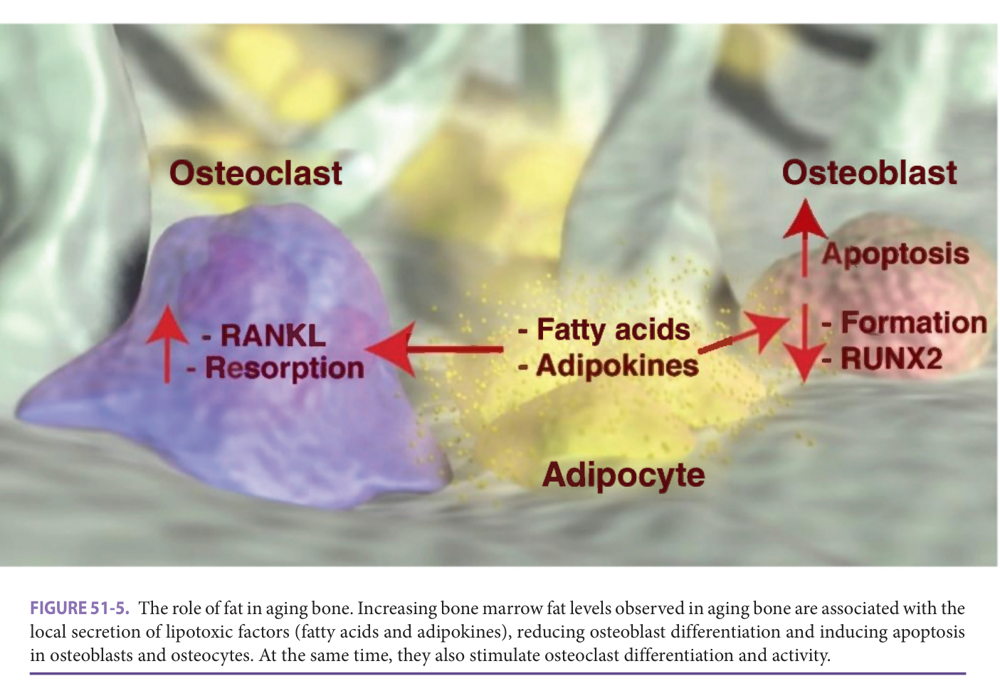

> *FIGURE 51-5. The role of fat in aging bone. Increasing bone marrow fat levels observed in aging bone are associated with the local secretion of lipotoxic factors (fatty acids and adipokines), reducing osteoblast differentiation and inducing apoptosis in osteoblasts and osteocytes. At the same time, they also stimulate osteoclast differentiation and activity.*

> Highlighting is the owner's annotation, not the book's.

Pluripotent mesenchymal cells within the bone marrow stroma are, by default, programmed to differentiate into adipocytes, but the presence of specific osteogenic factors in the bone marrow induces osteoblastic differentiation. With aging, those osteogenic factors are decreased, generating a predominant adipocyte differentiation of those precursors. In addition, osteoblast and osteocyte apoptosis increase with aging. Histomorphometric data demonstrate that 50% to 70% of the osteoblasts present at the remodeling site cannot be accounted for after the enumeration of lining cells and osteocytes. The discrepancy in osteoblast numbers is believed to be a consequence of osteoblast apoptosis. This phenomenon may account for the significant reduction in bone formation associated with aging, which is added to high levels of marrow adipogenesis.

In addition, increasing marrow fat levels directly negatively affects bone metabolism by regulating the function and survival of bone cells. By secreting fatty acids and adipokines, marrow adipocytes inhibit osteoblast differentiation, function, and survival and osteocyte survival. This effect has been described as lipotoxicity, defined as the ectopic accumulation of lipid and lipid products in nonadipose tissues leading to cellular dysfunction, cell death (lipoapoptosis) and disease. Additionally, adipocyte-secreted factors (primarily fatty acids) affect autophagy, defined as the conserved process whereby aggregated proteins, intracellular pathogens, and damaged organelles are degraded and recycled. Autophagy appears to play a significant role in skeletal maintenance after recent reports reveal that suppression of autophagy in osteocytes mimics skeletal aging. Furthermore, marrow adipocytes induce osteoclastic activity by facilitating the release of RANKL into the bone marrow milieu, thus stimulating bone resorption in addition to decreasing bone formation ( **Figure 51-5** ).

The early changes associated with age-related bone loss are similar in men and women, as described above. However, women also experience accelerated bone loss of approximately 3% to 5% per year during menopause. In men, the decline in bone mass is gradual until very late in life, when the risk for fractures increases rapidly. Concurrent with osteoblast and adipocyte formation changes, multiple factors enhance osteoclastogenesis and bone resorption (see **Figure 51-4** ). In particular, the interactions between osteoblasts, osteocytes, and osteoclasts, crucial to the dynamic equilibrium that maintains healthy bone, are altered. Consequently, the combination of decreased bone formation and increased bone resorption leads to diminished BMD, more flawed bone structure and quality, and, ultimately, enhanced fragility and fractures.

Muscle-secreted factors could also explain the cellular changes observed in aging bone. There is growing evidence

**[p. 767]**
that a complex bone/muscle cross-talk system exerted via osteokines and adipokines plays a critical regulatory role in bone metabolism ( **Figure 51-6** ). This cross-talk is affected by aging and other factors such as hormones and inactivity, associated with reduced osteogenic myokines levels. In addition, adipokines and fatty acids are also involved in this cross-talk by affecting bone and muscle structure and function. Overall, this growing evidence on the communication and close interaction between muscle and bone allowed us to propose the term osteosarcopenia as a new geriatric condition in which both osteopenia/osteoporosis and sarcopenia (loss of muscle mass, function, and strength) simultaneously occur in the same subject, increasing their risk of falls and fractures.

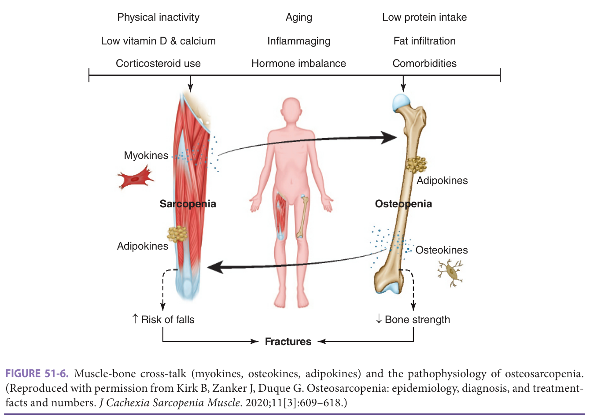

> *FIGURE 51-6. Muscle-bone cross-talk (myokines, osteokines, adipokines) and the pathophysiology of osteosarcopenia. (Reproduced with permission from Kirk B, Zanker J, Duque G. Osteosarcopenia: epidemiology, diagnosis, and treatment-facts and numbers. _J Cachexia Sarcopenia Muscle_ . 2020;11[3]:609–618.)*

> Highlighting is the owner's annotation, not the book's.

In addition to cellular changes, there are two major changes in calciotropic hormones that impact aging bone. Vitamin D levels decrease with age and reduce calcium absorption. Changes in the aging skin lessen the amount of 7-dehydrocholesterol, the precursor of cholecalciferol (vitamin D3), and its conversion rate. Furthermore, declining renal function leads to a reduction in the production and activity of 1-α-hydroxylase, the enzyme responsible for the activation of vitamin D3. Consequently, a negative calcium balance ensues, which activates the calcium sensor receptor in parathyroid glands. PTH is secreted as a physiologic response, stimulating osteoclast activity, maintaining normal serum calcium levels at the expense of bone mineralization. This theory of secondary hyperparathyroidism was once the definitive explanation for age-related bone loss. However, not all individuals with hypovitaminosis D exhibit secondary hyperparathyroidism. Therefore, it is just one of the elements of a syndrome that results in osteoporosis in older adults. However, this mechanism has been recently associated with additional important risk factors for fractures: sarcopenia and falls. Vitamin D and PTH appear to modulate neuromuscular function, particularly in frail older adults. Serum levels of 25(OH)-vitamin D lower than 35 nmol/L increase the risk of falls by 30%, which highly predisposes to fractures. Patients with serum levels between 35 and 80 nmol/L, which were considered normal in the past, are still at risk of falls, suggesting that the therapeutic goal should be to obtain serum levels greater than 80 nmol/L.

In summary, age-related bone loss results from changes at the cellular level, including decreased osteoblastogenesis, shortened osteoblast and osteocyte life span, increased adipogenesis and lipotoxicity, simultaneous occurrence of sarcopenia, and hormonal changes, including decreased levels and activity of sex-steroid hormones and vitamin D, and increased levels and activity of PTH.

## Osteoporosis In Men

Although the pathophysiology of osteoporosis in men has been a subject of active research in recent years, the relative contribution of hormones and aging, per se, remains to be elucidated. It is well established that androgen levels decrease with aging. Testosterone levels decrease by approximately 1.2% per year, and the binding protein levels increase with aging, resulting in lower bioavailable

**[p. 768]**

testosterone. There is evidence that androgens exert their effect on bone through the action of IGF-1. IGF-1 levels are increased during puberty and are closely related to sex-steroid levels.

With aging, lower levels of sex-steroid hormones result in decreased levels of IGF-1, with a reduction in bone formation and bone mass. Dehydroepiandrosterone, another androgen, declines slightly in the sixth decade without significant changes after that. Contradictory evidence is available about the importance of this decline in dehydroepiandrosterone and its administration in treating male osteoporosis. Thus, osteoporosis in men appears to result from cellular and hormonal changes, including lower levels of testosterone, dehydroepiandrosterone, and IGF-1 with subsequent lower osteoblast activity and higher osteoblast apoptosis. However, further study is necessary to delineate the specific roles of these factors in the decline of BMD and the high rate of fractures in men after the seventh decade of life.

Case reports of low bone mass and increased bone turnover in men with estrogen deficiency—either from an estrogen receptor abnormality or an absence of aromatase, the enzyme responsible for converting testosterone to estrogen—suggest that estrogen is required for normal bone homeostasis in men. Serum estrogen levels better predict BMD in men than do serum testosterone levels. In older men in whom both gonadotropin secretion and aromatase conversion are suppressed, estrogen acts as the principal sex-steroid-regulating bone resorption. Blocking the conversion of testosterone to estrogen using an aromatase inhibitor has been shown to increase bone resorption in a short-term study conducted in healthy older men, further supporting a role for estrogen in bone metabolism. Some of the effects of testosterone on bone may be mediated through aromatization of testosterone to estrogen, a possibility that warrants further study.

## Presentation

Osteoporosis is frequently underdiagnosed and undertreated by medical professionals. Osteoporosis is a silent disease, and symptoms may not appear until an incident fracture. Both men and women can have osteoporosis (as characterized by low BMD according to the WHO criteria) prior to a fracture, which is why it is so important to consider clinical risk factors, use risk identification tools (see further), and perform BMD measurement in those at risk of osteoporosis. Osteoporosis may be detected on plain x-rays (usually a chest x-ray) either by the presence of vertebral fractures or by “osteopenia” in the x-ray report. As many as a third or more of those with “osteopenia” on an x-ray may have T-scores worse than −2.5, and as many as half will have T-scores in the −2.5 to −1.0 range. Therefore, persons who are diagnosed with “osteopenia” by plain x-ray are candidates for BMD measurement. Osteoporosis may also present as an acute fracture. Most fractures that occur in old age are caused, at least in part, by osteoporosis, and it is crucial to initiate a therapeutic regimen in these adults.

Even after a minimal trauma fracture, the diagnosis is often not considered. Three-quarters of postmenopausal women with a distal radius fracture were either undiagnosed or not treated in one study. As many as 50% of women with a hip fracture leave the hospital without treatment. The overall risk of repeat fracture within the first year is 20%. Fractures that are likely related to osteoporosis and thus should trigger therapy with an approved agent include wrist, vertebral, and hip fractures. Frequently, these fractures are classified as fragility fractures because there is often little or no trauma associated with the event. Those with such fractures do not require BMD testing, although a baseline BMD is usually helpful to assure treatment adherence and response.

In older persons, several clinical findings could indicate the presence of vertebral fractures. This includes height loss and progressive kyphosis. It is recommended that older persons be assessed routinely and that simple measurements such as occiput/wall distance be performed to identify those patients with asymptomatic vertebral fractures.

## Secondary Causes Of Osteoporosis

The diagnosis of primary osteoporosis is made by BMD measurement before fracture or by incident fracture. Secondary osteoporosis is the consequence of diseases or drugs affecting bone directly (involving changes in bone cells or bone matrix composition) or indirectly (by increasing endogenous or ectopic hormonal production). It is important to exclude diseases that may present as a fracture or low BMD in evaluating women and men with osteoporosis. **Table 51-3** lists the major secondary causes of osteoporosis along with laboratory tests used to exclude each disease. These laboratory tests should be considered in persons who present with acute compression fracture or who present with a diagnosis of osteoporosis by BMD measurement, particularly in those with Z scores below 2 SD. Men are more likely to have a secondary cause of osteoporosis than are women. The most commonly reported secondary causes of osteoporosis in men include hypogonadism and malabsorption syndromes. An additional secondary cause of osteoporosis in men relates to using luteinizing hormone-releasing hormone agonists in prostate cancer. Luteinizing hormone-releasing hormone agonists suppress the pituitary gland, decrease testosterone and estrogen to castrate levels, and render men at increased risk of osteoporosis. Several retrospective studies have found increased fracture rates in this population of men. Many studies demonstrate rates of bone loss that are up to three- to fourfold higher in men treated with luteinizing hormone releasing hormone agonists, compared with annual rates of bone loss in normal aging men.

Medications also may have a detrimental effect on bone. Consideration should be given to dose adjustment,

**[p. 769]**

discontinuation of the drugs, or preventive treatment. Medications that adversely affect BMD include glucocorticoids, proton pump inhibitors (PPIs), excess thyroid supplementation, anticonvulsants, methotrexate, cyclosporine, and heparin. In older adults, glucocorticoids, PPIs, and thyroid hormone are used quite commonly; accordingly, clinicians should consider the effects of these medications on the already increased fracture risk when prescribing these to older adults.

The prevalence of osteoporosis in adults taking glucocorticoids is approximately 30%. Bone loss typically occurs in the first 6 months of therapy, usually associated with doses of ≥7.5 mg/d administered for longer than 3 months. The risk also increases with increasing glucocorticoid dose. Glucocorticoids both suppress bone formation through direct effects on osteoblasts and increase resorption through indirect effects on osteoclasts. Glucocorticoid-induced osteoporosis is preventable if treatment is considered when therapy with corticosteroids is initiated. Replacement of gonadal hormones and treatment with anti-resorptives (bisphosphonates and denosumab) or intermittent PTH has been shown to prevent bone loss in patients taking glucocorticoids. Other measures for preventing bone loss are calcium and vitamin D supplementation and reduction of glucocorticoid dose to the lowest effective dose for the underlying disease.

In most cases, secondary osteoporosis can be either prevented or treated if suspected by the clinician. Immobilization predisposes to bone mineral loss and osteosarcopenia; thus, a program of early mobilization of hospitalized older patients is essential. Mild-to-moderate vitamin D deficiency may give rise to osteoporosis rather than osteomalacia; oral replacement may prevent its occurrence. Finally, a comprehensive medication review could also identify those medications placing the patient at risk of osteoporosis; thus, adjusting their doses or reevaluating their indications constitutes the most appropriate approach.

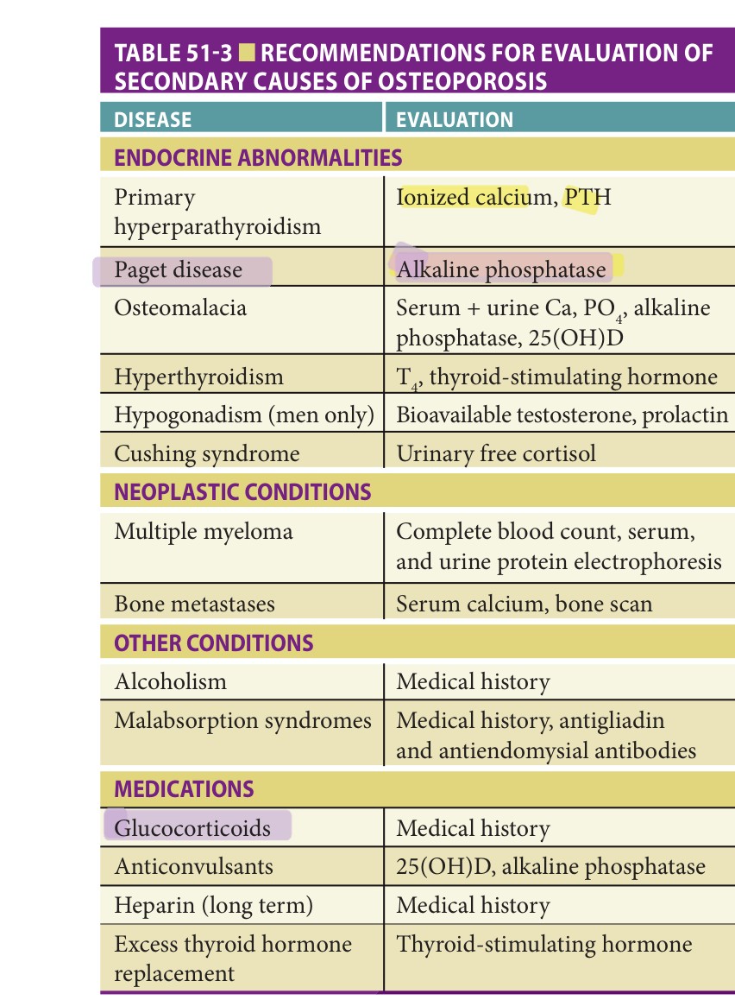

> *Table 51-3 — Recommendations for evaluation of secondary causes of osteoporosis. Reproduced as a page image (printed p. 769) — the grid did not extract reliably as text for this fast build.*

> Highlighting is the owner's annotation, not the book's.

**Table 51-4 — Risk factors for osteoporotic fracture**

| Potentially modifiable | Nonmodifiable |
|---|---|
| Current cigarette smoking | Personal history of fracture |
| Low body weight (< 127 lb) | History of fracture in a first-degree relative |
| Estrogen deficiency | Advanced age |
| Early menopause (< 45 years of age) | Female sex |
| Prolonged premenopausal amenorrhea (> 1 year) | White or Asian race |
| Low calcium intake (lifelong) | Dementia |
| Alcoholism | History of corticosteroid medication |
| Taking sedative medication | Taking seizure medication |
| Impaired eyesight | Poor health/frailty |
| Recurrent falls | |
| Inadequate physical activity | |
| Arms usually required to stand | |
| Poor health/frailty | |

## Evaluation

### Risk Identification

While approaches to the patient with osteoporosis have often based treatment on T-scores, assessing clinical risk factors can facilitate early identification of individual patients who are more likely to suffer from vertebral and nonvertebral fractures. This is particularly important, since most fractures occur in postmenopausal women with T-scores that are better than −2.5. The age of the patient is the most critical contributor to fracture risk. Additional important factors include a previous fracture history as an adult, history of fracture risk in a first-degree relative, body weight less than 127 lb, current history of smoking, and corticosteroid use for more than 3 months ( **Table 51-4** ). Impaired vision, early estrogen deficiency, dementia, frailty, recent falls, low calcium and vitamin D intake, low physical activity, and alcohol consumption of more than two drinks per day are additional clinical risk factors. Prior recent fracture is a robust predictor of future fracture. The increased risk is similar in both men and women and is

**[p. 770]**

the same as the risk of the first fracture in a woman who is 10 years older. Half of the patients will refracture within 10 years, and half of those will occur within 2 years of the first fracture. Therefore, most older patients with a prior fracture are candidates for treatment.

Identifying patients at risk of osteoporosis and osteoporotic fractures should be routine practice in geriatric medicine. The presence of risk factors (see **Table 51-4**) has a very high predictive value for osteoporotic fractures, especially in older persons. However, except for age, which has the highest predictive value, these risk factors have a different weight in predicting the absolute risk of future fractures. Therefore, to help the clinician accurately calculate a patient's risk of suffering a fracture within 5 or 10 years, two online assessment tools have been widely validated.

The FRAX index (http://www.shef.ac.uk/FRAX) estimates the absolute risk of suffering a fracture in 10 years. This calculator has been demonstrated to be extremely useful since it includes specific data obtained from large cohorts worldwide. However, a major limitation of this tool is that falls are not included in the algorithm. Considering that falls are an important risk factor for fractures, the FRAX tool could be underestimating the level of risk in frequent fallers, particularly in frail older adults. In contrast to the FRAX tool, the Garvan tool (http://www.garvan.org.au/bone-fracture-risk) includes a history of previous falls in its algorithm. Although it has been recently tested in non-Australian populations, this tool was initially developed and validated using the Dubbo Osteoporosis Study database. Another major advantage of this tool is that it calculates fracture risk at 5 and 10 years, providing valuable information that could be easily shared with the patient.

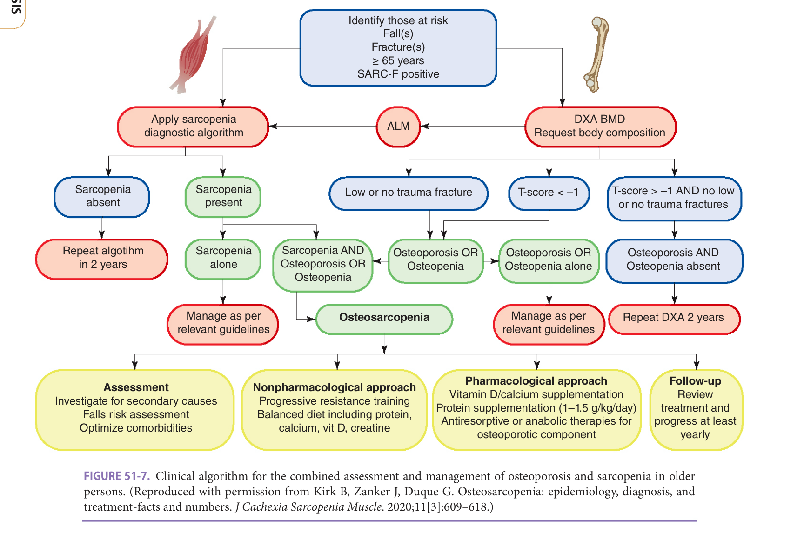

> *FIGURE 51-7. Clinical algorithm for the combined assessment and management of osteoporosis and sarcopenia in older persons. (Reproduced with permission from Kirk B, Zanker J, Duque G. Osteosarcopenia: epidemiology, diagnosis, and treatment-facts and numbers. J Cachexia Sarcopenia Muscle. 2020;11[3]:609–618.)*

> Highlighting is the owner's annotation, not the book's.

Since many osteoporotic fractures result from falls (Chapter 43) or the simultaneous presence of sarcopenia (Chapter 49), it is essential to assess patients for fall risk and sarcopenia and institute preventive measures where appropriate. **Figure 51-7** proposes a practical diagnostic algorithm to identify osteoporosis and sarcopenia in clinical practice. The risk factors for osteoporosis and sarcopenia are almost identical; thus, identification of secondary causes of osteoporosis should trigger the assessment for the presence of sarcopenia. The causes of falls are often multifactorial and include medications, poor vision, impaired cognition, maladaptive devices, alcohol, orthostatic hypotension, impaired balance and gait, environmental hazards, and lower extremity weakness. Recent studies suggest that specific performance measures can help to identify those at greater risk of falling. Individuals who

**[p. 771]**

cannot maintain a semi tandem stand for 10 seconds with their eyes open are at increased risk. A gait velocity of less than 0.8 m/s also predicts a greater propensity to fall. Additional office-based screening tests that identify potential fallers include the inability to complete the timed up and go test in 14 seconds, the inability to maintain a one-leg stand for at least 5 seconds, and a score of less than 19 in the performance-oriented mobility assessment. Finally, the SARC-F questionnaire (Strength, Assistance with walking, Rising from a chair, Climbing stairs, and Falls) has a high specificity (~95%) to detect sarcopenia. The criteria are: (1) difficulty lifting and carrying 10 pounds, (2) difficulty walking across a room, (3) difficulty transferring from a chair or bed, (4) difficulty climbing a flight of 10 steps, and (5) falls in the past year. The first four criteria are scored as none = 0, some = 1, and a lot = 2. The last criterion is none = 0, 1 to 3 falls = 1, and ≥ 3 falls = 2. A score of 4 or greater is predictive of clinically important sarcopenia and is associated with adverse outcomes.

### Bone Mineral Density (BMD) Assessment

BMD measurement has historically been considered the gold standard for the diagnosis of osteoporosis in the clinical setting. Various techniques could be used to measure BMD of the hip, spine, wrist, or calcaneus. The preferred method of BMD measurement is dual-energy x-ray absorptiometry (DXA). BMD of the hip, anteroposterior spine, lateral spine, and wrist can be measured using this technology. Quantitative computerized tomography is also used to measure BMD of the spine. Specific software can adapt computerized tomography scanners for BMD measurement. The advantages of DXA over quantitative computerized tomography include lower cost, lower radiation exposure, and better reproducibility over time. Peripheral DXA (measures wrist BMD) or ultrasonography of the calcaneus may be helpful for general osteoporosis screening, and these have the advantage of reduced cost and portability. Peripheral bone densitometry (performed at the heel, finger, or forearm) is highly predictive of hip, spine, wrist, rib, and forearm fractures for the subsequent 12 months.

Assessment of BMD should be considered for (1) postmenopausal women younger than 65 years with one or more additional risk factors (other than menopause); (2) all women older than 65 years, regardless of additional risk factors; and (3) patients with a history of minimal trauma fracture in which osteoporosis treatment is being started (as a baseline BMD assessment and to evaluate future therapeutic response). A study of more than 200,000 postmenopausal women from more than 4000 primary care practices in 34 states reported that approximately 50% of this population had low BMD previously undetected, including 7% of women with osteoporosis. An additional study found that screening postmenopausal women with BMD reduced the incidence of hip fracture by 36%. These studies suggest that efforts should be made to increase BMD measurements in postmenopausal women.

Postmenopausal women with significant kyphosis and clinical risk factors also do not require BMD testing to confirm the diagnosis of osteoporosis. Instead, both of these subsets of patients deserve treatment. In a cohort of over 8000 women participating in the Study of Osteoporotic Fractures, of the 243 that suffered a hip fracture, 54% had a total hip BMD T-score better than −2.5 at the start of the study. Similarly, in a study of 257 men aged 70 and older, although those with lower T-scores had a higher fracture rate, the majority of fractures occurred in men with T-scores better than −2.5. These studies emphasize that BMD is not the fundamental determinant of fracture risk; the microarchitecture and quality of bone are also important, which is not directly assessed with densitometry, as is the propensity to fall.

As noted above, clinical risk factors need to be assessed. Furthermore, it is imperative to recognize that age is a much more significant factor than BMD in determining fracture risk. The 10-year probability of a fracture in an 80-year-old is more than twice as great as the probability of fracture in a 50-year-old with the same BMD T-score. BMD may also be used to establish the diagnosis and severity of osteoporosis in men and should be considered in men with low-trauma fracture, radiographic changes consistent with low bone mass, or diseases known to place an individual at risk of osteoporosis. Data relating BMD to fracture risk were initially derived from studies completed in women, but recent data suggest that similar associations may be valid in men as well. Assessment of BMD should also be strongly considered in both perimenopausal women and older men who are about to undergo long-term treatment with corticosteroids. Bone densitometry can be used to assess response to therapy. However, usually 2 years between tests are necessary to obtain accurate and valuable information. Biochemical markers of bone turnover yield much quicker details about compliance and success of therapy.

### Biochemical Markers Of Bone Turnover

Serum and urine biochemical markers that reflect collagen breakdown (or bone resorption) and bone formation help monitor osteoporosis treatment. Higher levels of resorption markers have been associated with increased hip fracture risk, decreased BMD, and increased bone loss in older adults in some studies. However, biochemical markers in many patients with osteoporosis will lie within the normal range. In addition, there is often a substantial overlap of marker values in women with high and low bone density or rate of bone loss. Therefore, at this time, markers are not recommended for screening or diagnosis of osteoporosis. In addition, few studies have compared the response of a particular marker (or combination of markers) and BMD to therapy in order to determine the magnitude of decrease of a biochemical marker necessary to prevent bone loss or, more importantly, fracture. Markers are most useful in assessing the response of an individual patient to treatment.

**[p. 772]**

Markers of bone resorption and formation decrease in response to antiresorptive therapy and increase in response to PTH, treatment with anabolic properties. The advantage of the serum versus urinary markers is that the intra-patient variability tends to be lower with serum markers, thus reducing error. Many of the osteoclast-specific markers can then be rechecked as early as 6 weeks after beginning therapy. Successful antiresorptive therapy, which also means compliance, will reduce serum levels of markers of both resorption and formation, since these processes are tightly coupled. However, changes in bone formation markers will lag several months behind changes in bone resorption markers.

## Management

Osteoporosis develops in older adults when the normal processes of bone formation and resorption become uncoupled or unbalanced, resulting in bone loss. Osteoporosis prevention and treatment programs, then, should focus on strategies that minimize bone resorption and maximize bone formation, as well as strategies that reduce falls. Several nonpharmacologic and pharmacologic options are available to health care providers. Importantly, modifying risk factors (see **Table 51-4** ) should be the first step in preventing osteoporotic fractures in older adults.

### Nonpharmacologic Interventions

**Exercise** Exercise is an essential component of osteoporosis treatment and prevention programs. Data in older men and women suggest a positive association between current exercise and hip BMD. Among regular exercisers, those who reported strenuous or moderate exercise had higher BMD at the hip than those who reported mild or less-than-mild exercise. Similar associations were seen for lifelong regular exercisers and hip BMD. In a randomized study of women at least 10 years past menopause, the group receiving calcium supplementation plus exercise had less bone loss at the hip than those assigned to calcium alone. Furthermore, high-intensity strength training effectively maintains femoral neck BMD and improves muscle mass, strength, and balance in postmenopausal women compared to nonexercising controls, suggesting that resistance training would be helpful to maintain BMD and to reduce the risk of falls in older adults.

A marked decrease in physical activity or immobilization results in a decline in bone mass; accordingly, it is essential to encourage older adults to be as active as possible. However, not all types of exercises have proved to be beneficial. Progressive resistance strength training of the lower limb improved BMD at the neck of the femur in postmenopausal women. In contrast, aerobic exercises and low impact activities like brisk walking and cycling have failed to increase BMD at any site. Whole-body vibration (WBV) has been shown to increase BMD in some studies; however, some trials have also reported no effect. Evidence regarding the role of exercise in preventing fracture is limited as no randomized controlled trial (RCT) has so far evaluated the role of exercise as a single intervention to prevent fractures. However, exercise and focused physical therapy can prevent falls, which are significant contributors to increased fracture risk. Concerning exercise, an important consideration in older people is configuring a program according to comorbidities and functional status, as adherence may vary depending upon underlying conditions, particularly osteoarthritis and/or cardiopulmonary disease.

Physical therapy is an integral part of osteoporosis treatment programs, especially after an acute vertebral compression or hip fracture. The physical therapist can provide postural exercises, alternative modalities for pain reduction, and suggest changes in body mechanics that may help prevent future falls and fractures. Gait training or balance training and muscle strengthening can help prevent falls, even for relatively frail older persons. A meta-analysis of randomized clinical trial interventions to reduce falls concluded that all types of exercises achieved similar benefits in balance, endurance, flexibility, and strength. The key message is to prescribe a program for those patients who are mobile and functional enough, in addition to cognitively capable, to participate.

**Nutrition (calcium and vitamin D)** Calcium and vitamin D are required for bone health at all ages. Elemental calcium, 1200 to 1500 mg/day, for postmenopausal women and men older than 65 is needed to maintain a positive calcium balance. The amount of vitamin D required is at least 800 IU/day, although evidence suggests that as much as 2000 IU of cholecalciferol per day and more are necessary to achieve serum levels (25[OH] vitamin D ≥ 75 nmol/L) that are optimally effective for fall and fracture prevention.

Overall, adequate calcium and vitamin D should be recommended for all older adults, regardless of BMD, to maximize bone health. In osteoporotic patients who require pharmacologic treatment, administration of calcium and vitamin D alone is not recommended. Indeed, supplementation with vitamin D enhances the BMD response to osteoporosis treatment. It is also worth noting that all pivotal trials of anti-osteoporotic agents (antiresorptive, anabolic, or dual-action agents) have included supplementation with calcium and vitamin D.

Despite our understanding of the role of calcium and vitamin D in bone physiology, recent analyses have raised some controversies about their role in increasing BMD and fracture prevention. Several recent meta-analyses showed that calcium intake from diet or supplements produced only a small increase in BMD. Notably, the increase was considered unlikely to decrease fracture risk. There is also controversy regarding supplementation with a high dose of calcium, as some reports have suggested an increased risk of cardiovascular disease. However, a recent systematic review and dose-response meta-analysis of prospective cohort studies found that total calcium intake was

**[p. 773]**
associated with lower cardiovascular mortality in postmenopausal women. Dietary calcium was associated with all-cause mortality, and supplemental intake was not associated with the risk of all-cause, cancer, or cardiovascular mortality.

Like calcium, the role of vitamin D supplements in improving BMD and decreasing fracture risk is debated as the latest meta-analyses have failed to show any benefit in improving BMD or reducing fracture risk. This is despite earlier analyses conclusively stating the positive role of vitamin D supplements in osteoporosis management by decreasing the risk of nonvertebral fractures. This lack of apparent benefit could be due to the inclusion of a significant number of healthy people with no risk factors for osteoporosis, with normal serum levels of vitamin D, or with different doses of vitamin D supplements in RCTs. To add to the controversy surrounding its use, high doses of vitamin D by bolus administration (500,000 IU/year or 60,000 IU/monthly) have consistently been shown to increase the risk of falls and trends to increased fractures. Despite these controversies, it is accepted that vitamin D has a role in osteoporosis (and sarcopenia) management, particularly in those with vitamin D deficiency. While frank vitamin D deficiency (≤ 30 nmol/L) should be treated with a loading dose of 50,000 IU cholecalciferol or ergocalciferol, it is recommended that all others be treated with an appropriate daily dose of 1000 to 4000 IU cholecalciferol.

**Nutrition (additional factors)** Two prospective studies examined the effect of additional nutritional factors on bone loss and fracture risk in older adults. The Framingham Osteoporosis Study found that higher baseline magnesium, potassium, and fruit and vegetable intakes were associated with higher baseline BMD. In men, increased potassium and magnesium intakes were associated with lower bone loss at the femoral neck. Additionally, this study showed a correlation of hip fractures with higher serum levels of homocysteine. Although homocysteine levels are associated with vitamin B12, serum levels of this vitamin have not been associated with lower BMD, suggesting that the role homocysteine plays in bone biology remains to be elucidated. However, other studies have not found a clear association between homocysteine levels and fracture. In addition, lower baseline protein intake or percent of total energy from animal protein has been associated with more significant bone loss at the femoral neck and lumbar spine. In another prospective cohort study, the Study of Osteoporotic Fractures, BMD was not related to the ratio of animal to vegetable protein intake. Still, a higher proportion of animal to vegetable protein intake was associated with more significant femoral neck bone loss and an increased risk of hip fracture. These studies suggest that nutritional factors other than calcium and vitamin D are essential for bone health in older adults. Prospective randomized studies are indicated to elucidate further the role of nutrition in preventing and treating osteoporosis in older adults.

## Pharmacologic Treatment (Table 51-5)

### Estrogen Replacement Therapy

Multiple studies demonstrate that postmenopausal estrogen use will prevent bone loss at the hip and spine when initiated within 10 years of menopause. However, there have been few prospective studies of estrogen replacement therapy and fracture prevention. One small study demonstrated a reduction in vertebral fractures in postmenopausal women with transdermal estradiol compared to placebo. The Women’s Health Initiative study showed a 24% reduction in all fractures and a 33% reduction in hip fractures in women taking estrogen plus progestin. However, the Women’s Health Initiative study also concluded that the overall risks of estrogen plus progestin outweighed the benefits, including those associated with reducing fractures. Few studies have evaluated the use of estrogen in women older than 70 years. Observational data, however, from the Study of Osteoporotic Fractures support a protective effect of current estrogen use against hip fracture, even in the oldest women.

Lower doses of estrogen also effectively reduce bone resorption and bone loss in older women; the lower doses also result in fewer side effects than the usual replacement doses typically used by clinicians. 17β-estradiol 0.25 mg/day was as effective as 0.5 and 1.0 mg/day in reducing biochemical markers of bone turnover in 75-year-old women compared to placebo. The side-effect profile of 0.25 mg/day was similar to placebo and significantly different from the two higher doses. In a longer-term study, 0.3 mg/day of conjugated equine estrogen plus 2.5 mg/day of medroxyprogesterone acetate increased bone density of the hip and spine in older women who were vitamin D replete. While a recent report from the Women’s Health Initiative study demonstrates cardiovascular benefit in women aged 50 to 59 who took estrogen, at this time, better alternatives to the treatment of osteoporosis in older patients exist. Therefore, in older patients, particularly those at least 5 to 10 years postmenopausal, estrogen is not recommended.

### Bisphosphonates

Bisphosphonates decrease bone resorption by inhibiting osteoclast action and survival while promoting secondary mineralization. They are structurally similar to pyrophosphates, which bind to hydroxyapatite on the bone surface and inhibit osteoclast activity.

**Alendronate** The efficacy of alendronate has been well established in increasing BMD at all sites and reducing the risk of vertebral fracture in older persons. However, evidence regarding its effectiveness for nonvertebral or hip fracture is less robust. Alendronate treatment for 3 years in postmenopausal women (mean age 71) with existing vertebral fracture and low femoral neck BMD decreased the risk of new morphological and clinical vertebral fractures. For postmenopausal women (mean age 68) with no preexisting

**[p. 774]**
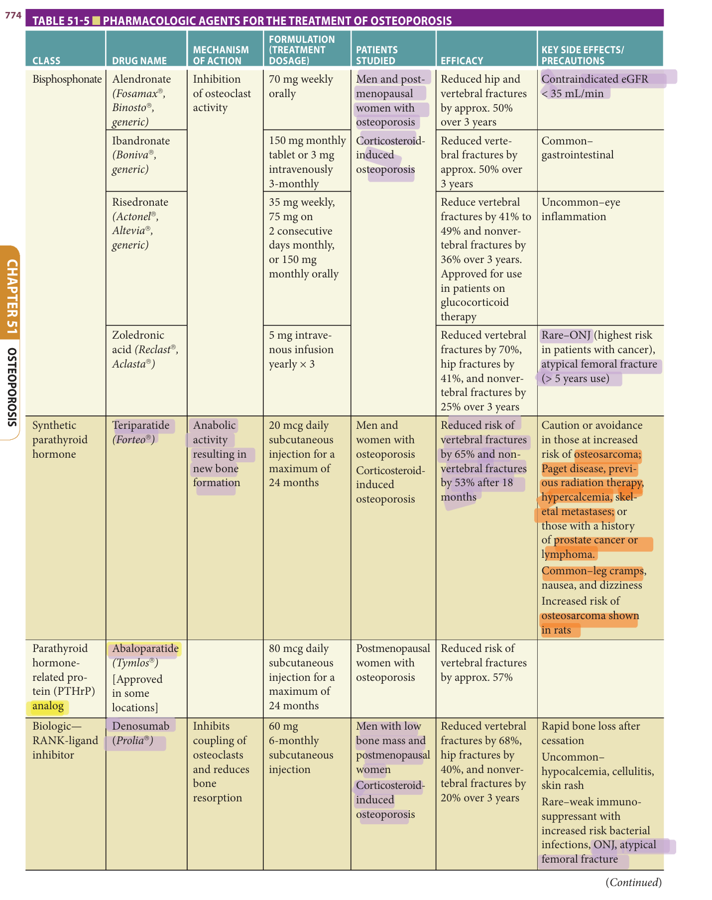

> *Table 51-5 reproduced as a page image (printed p. 774) — the grid did not extract reliably as text for this fast build.*

> Highlighting is the owner's annotation, not the book's.

**[p. 775]**

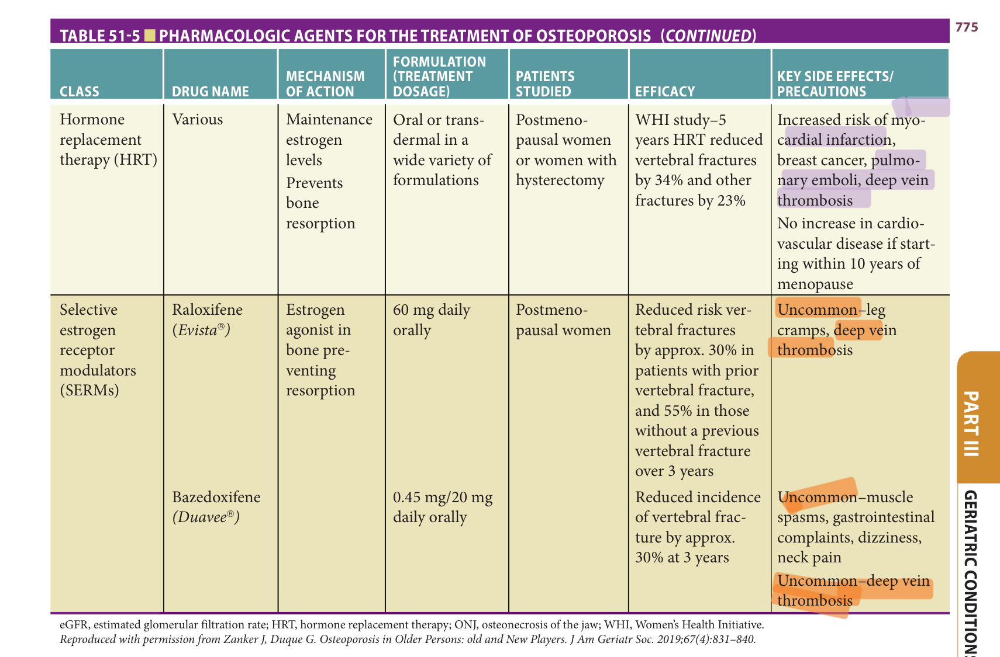

> *Table 51-5 (continued) — Pharmacologic agents for the treatment of osteoporosis: hormone replacement therapy and SERMs (raloxifene, bazedoxifene). Reproduced as a page image (printed p. 775) — the grid did not extract reliably as text for this fast build. (Reproduced with permission from Zanker J, Duque G. Osteoporosis in Older Persons: old and New Players. J Am Geriatr Soc. 2019;67(4):831–840.)*

> Highlighting is the owner's annotation, not the book's.

fracture, alendronate was only effective in reducing the risk of clinical fracture in those with femoral neck BMD ≤ −2.5. Additionally, a subanalysis showed a decrease in the risk of nonvertebral fractures in those with femoral neck BMD ≤ −2.5. Alendronate treatment was equally effective in those ≤ 75 and those > 75 and reduced the risk of vertebral fracture by 51% and 38%, respectively after 12 months. There was not enough power to conduct subgroup analyses to determine if alendronate prevented hip fracture in older people (aged ≥ 75). The time to therapeutic benefit for alendronate in individuals ≥ 70 was calculated to be 8 months. Therefore, limited life expectancy in older and frail people should not delay the clinical decision to commence treatment. Furthermore, in a study of older women with osteoporosis living in residential aged care, alendronate treatment for 2 years was well tolerated and increased BMD at all sites.

**Risedronate** Risedronate has reduced the cumulative incidence of new vertebral fracture over 3 years by 41% in postmenopausal women (mean age 69) with established osteoporosis. Risedronate also has reduced the incidence of hip fracture in postmenopausal women (mean age 74) and an older group with osteoporosis (aged ≥ 80, mean age 83). However, the risk of hip fracture in the older cohort with nonskeletal risk factors (such as propensity for falls) remained unaffected. The lack of efficacy may be explained by the fact that bone density was not measured in those > 80, so that group would have likely included women who did not have osteoporosis as measured by BMD. A pooled analysis of multiple trials found that risedronate treatment for 3 years in women > 80 reduced the risk of vertebral fracture by 44%. As the risk and prevalence of vertebral fractures increase with age, older people are more likely to benefit from risedronate, evidenced by a higher absolute risk reduction—similar to that seen with alendronate. For nonvertebral fractures, the reduction in the cumulative incidence over 3 years was not statistically different between the risedronate group and placebo in the same cohort. The lack of apparent benefit for nonvertebral fracture in older adults could be due to nonskeletal risk factors for fragility fracture in this age group (age ≥ 80); however, further analysis is required to confirm this.

**Zoledronic acid** In postmenopausal women (mean age 73) with osteoporosis (BMD ≤ −2.5 or radiological evidence of at least one vertebral fracture), intravenous infusion of zoledronic acid yearly for 3 years reduced the risk of vertebral fracture by 70%, nonvertebral fracture by 25%, and hip fracture by 41%. In postmenopausal women with a previous hip fracture (mean age 74), zoledronic acid reduced the risk of any new clinical fracture by 35%. Moreover, zoledronic acid treatment had an additional benefit

**[p. 776]**

for all-cause mortality, with fewer deaths in the subjects receiving zoledronic acid (9.6%) than the placebo (13%). Zoledronic acid also significantly reduced the incidence of clinical vertebral, nonvertebral, or any clinical fracture in adults aged 75 or older.

Zoledronic acid was shown to be safe and well-tolerated by older adults in the trial at the once-a-year dose (5 mg IV). The most common adverse effects were postinfusion influenza-like symptoms that include fever, arthralgia, myalgia, and headache; however, these symptoms decreased with subsequent infusions. Although bisphosphonate therapy in frequent and high doses in cancer patients is associated with osteonecrosis of the jaw (ONJ), when used to treat osteoporosis in the recommended dose, ONJ is very rare (estimated incidence 0.001%–0.01%). The antifracture effectiveness of bisphosphonates persists even after discontinuation. This, together with recommended yearly infusion doses, improves compliance and efficacy in older adults who often struggle with compliance due to pill burden. Intravenous zoledronic acid also avoids gastrointestinal side effects commonly encountered with oral preparations of bisphosphonates, particularly frequent in older adults. Prolonged use of bisphosphonates is associated with an increased risk of atypical femoral fracture (AFF). However, absolute numbers are small, and the relative risk is much smaller than the risk of osteoporotic hip fracture and its significant adverse consequences and the significant reductions in the risk of hip and other fractures. The risk of AFF increases with more prolonged treatment of any bisphosphonate and should be investigated with x-ray in patients complaining of groin or thigh pain, as fracture precedes pain in most cases. Further investigations with a bone scan or MRI may be required. The risk of AFF rapidly diminishes after the termination of bisphosphonate treatment.

### Denosumab

Denosumab is a humanized monoclonal antibody that binds to RANKL and inhibits osteoclast activation and activity. Denosumab (60 μg) given subcutaneously every 6 months to postmenopausal women (age 60–90; mean 72) over 3 years reduced hip fracture by 40%. Denosumab also decreased the risk of new radiological vertebral fracture by 68% and nonvertebral fracture by 20%. Denosumab was very effective in individuals aged 75 or older and significantly decreased the risk of hip fractures. Very interestingly, the denosumab group experienced fewer falls compared to the placebo group. However, preliminary analyses conducted by comparing a strength-related questionnaire did not reveal any difference between the treatment and placebo groups. Prospective clinical studies are needed to investigate the effects of denosumab on muscle function. However, decreasing the risk of falls by improving muscle function would reduce the risk of fragility fracture in older adults. Denosumab was well-tolerated, and the ease of administration by subcutaneous route every 6 months makes it a preferred choice in many older adults. However, unlike bisphosphonates, denosumab is not incorporated into bones. Therefore, its effect diminishes when treatment is ceased. The antifracture effect declines to pretreatment levels 12 months after discontinuing therapy, and the risk of fracture increases markedly in those with prior vertebral fracture. The risk of atypical fractures increases with prolonged treatment; however, the risk to benefit ratio is small and should not preclude denosumab use. Indeed, denosumab treatment in long-term care residents may be preferred over other osteoporosis treatment modalities given the route of administration, the paucity of side effects, and the certainty of compliance.

> **Table against text:** as printed, p. 776 gives the denosumab dose in prose as "60 μg"; Table 51-5 (p. 774) gives it as "60 mg" (standard clinical dosing is 60 mg SC q6mo). Both are shown as printed; neither is corrected here.

### Teriparatide

Teriparatide is a synthetic analogue of PTH and promotes both bone resorption and synthesis. Intermittent doses of teriparatide (20 mcg/d subcutaneously) exert an anabolic effect on bone, whereas continuous infusion promotes catabolic action. Treatment with teriparatide in postmenopausal women (mean age 71) over 18 months increased BMD at all sites. It also decreased the risk of vertebral fracture by 65% and nonvertebral fracture by 53%. Teriparatide was as effective in individuals 75 years or older as in a younger cohort younger than 75 years. In adults 75 years or older, after a median treatment period of 19 months, teriparatide reduced new vertebral fractures by 65%; the number needed to treat was 11. The risk of hip fracture was not investigated as a primary endpoint in this trial. In a head-to-head comparison of teriparatide with risedronate in postmenopausal women (mean age 72), the teriparatide treatment group had a 56% less cumulative incidence of new vertebral fracture over 24 months.

Indications for teriparatide include a T-score worse than −3.5 or prevalent fractures in the setting of a T-score worse than −2.5. In addition, patients who continue to fracture or lose BMD after 2 years of bisphosphonate treatment are also candidates for teriparatide. The major limitations to the use of teriparatide in older adults are its significant cost and the mode of administration, since subcutaneous dosages require an appropriate cognitive status, a high degree of motivation, and a considerable level of functional independence. At present, studies suggest that teriparatide should not be combined with bisphosphonate therapy since concurrent bisphosphonate treatment appears to blunt the BMD response to teriparatide. Due to concerns regarding osteosarcoma in animal studies, teriparatide therapy should continue no longer than 2 years. It is also contraindicated in Paget disease and those at risk of osteosarcoma or unexplained alkaline phosphatase elevation. However, it is imperative to treat with an antiresorptive after discontinuation of teriparatide to maintain gains in BMD.

### Abaloparatide

Abaloparatide is a synthetic analogue of PTH-related peptide (PTHrP) and, due to preferential binding with PTH

**[p. 777]**

receptor, differs from teriparatide with predominantly anabolic action on bones. In a phase 3 trial, abaloparatide (80 mcg/d subcutaneously) given for 18 months to postmenopausal women (mean age 69) improved total hip BMD and reduced the risk of new vertebral fractures by 86% and nonvertebral fracture by 43%. A subgroup analysis in participants 80 years or older demonstrated that abaloparatide effectively increased BMD in both the hip and the spine. However, while there were numerical reductions in vertebral and nonvertebral fracture risk, they were not significantly different from placebo. Like teriparatide, the use of abaloparatide is restricted to a maximum of 2 years, based on the results of nonclinical studies on teriparatide, where it was associated with an increased risk of cancer. In general, as anabolic agents, both abaloparatide and teriparatide should be considered as starting therapy for patients with very high fracture risk and/or history of multiple fractures.

### Romosozumab

Romosozumab is a humanized monoclonal antibody to sclerostin and thereby antagonizes its inhibitory impacts on osteoblasts. Romosozumab differs from other antiosteoporosis agents as it has dual effects on bone by decreasing bone resorption and increasing bone formation. Romosozumab administered for 12 months, followed by 12 months of denosumab treatment. lowers the risk of vertebral fracture by 75%. Romosozumab was compared with alendronate in postmenopausal women (mean age 74) and, after 2 years, was associated with 48% lower risk of vertebral fracture, 19% lower risk of nonvertebral fracture, and 38% lower risk of hip fracture versus alendronate. When compared with the anabolic agent teriparatide, romosozumab treatment significantly increased spine BMD and trabecular hip BMD. Romosozumab treatment was also very effective in men with osteoporosis (mean age 72) and after 1 year markedly increased BMD at the lumbar spine and the hip.

Romosozumab, due to its anabolic effect on bone and ease of administration (210 mg monthly SC), when compared to teriparatide (20 mcg daily SC), has the potential to be the preferred agent to treat osteoporosis and therefore decrease the risk of fractures. Its use is currently restricted to a maximum of 12 months due to concerns regarding increased risk of cardiovascular events as observed in one phase 3 clinical trial and the potential for oncogenesis due to previous known association of teriparatide with cancer in rodents. The subanalysis of the antifracture efficacy of romosozumab in old and very old adults is still awaited.

## Osteonecrosis Of The Jaw And Atypical Femoral Fractures

Longer-term administration of antiresorptives has been associated with two major complications: ONJ and AFFs. ONJ is defined as the presence of exposed and necrotic bone in the maxillofacial region that does not heal within 8 weeks. The risk of ONJ may be increased in those undergoing invasive dental procedures, such as tooth extractions. The risk of ONJ in patients with postmenopausal osteoporosis taking oral bisphosphonates is proportional to the duration and cumulative dose of antiresorptive agents and is exceedingly low with an estimated incidence of 0.02% to 0.06%. Therefore, in general, the minimal risk of ONJ associated with bisphosphonate use appears to be significantly outweighed by the potential benefit of fracture risk reduction and the reduction in subsequent morbidity due to fractures. Overall, a professional dental checkup should _not_ delay osteoporosis treatment initiation in older persons, particularly those at a very high fracture risk.

AFFs are stress or insufficiency fractures located in the subtrochanteric region and diaphysis of the femur. Radiographically, AFFs are located in the lateral cortex and with a transverse short oblique configuration, and are associated with cortical thickening (periosteal stress reaction). They have been reported in patients taking bisphosphonates and patients treated with denosumab, but they also occur in patients with no exposure to these drugs. The absolute risk of AFFs in patients on bisphosphonates is very low, ranging from 3.2 to 50 cases per 100,000 person-years. However, long-term use may be associated with a higher risk (> 100 per 100,000 person-years). More importantly, however, the number of fragility fractures prevented by bisphosphonate therapy far outweighs the number of AFFs that occur. To enable early detection, intervention, and prevention of AFF, clinicians should be vigilant and obtain imaging studies when patients on an antiresorptive present with thigh pain, as this may be an early sign of an AFF.

## Drug Holidays In Osteoporosis Treatment

All long-term trials with bisphosphonates and denosumab have demonstrated sustained therapeutic efficacy and a very low incidence of side effects. Findings from pooled analyses of three long-term extension trials involving bisphosphonates reveal that patients who received 6 years or more of bisphosphonates had fracture rates of 9.3% to 11%, whereas the fracture rate for patients switched to placebo was 8.0% to 8.8%. Consequently, it is reasonable to evaluate whether continued therapy imparts additional benefit. However, it is still crucial to evaluate future fracture risk when considering patients who may benefit from a drug holiday. A drug holiday may be considered after 3 to 5 years of antiresorptive therapy in patients with moderate or low risk of fracture because stopping these medications for a short period of time poses minimal risk to the patient. In high-risk patients, careful consideration for a drug holiday’s timing and/or duration is needed, as these patients may derive benefit from treatment beyond 5 years.

**[p. 778]**

## Osteoporosis In Nursing Homes

There is increasing concern about the underdiagnosis and undertreatment of patients with osteoporosis in particular settings, such as long-term care institutions. Institutionalized patients, whether mobile or immobile, are at high risk of osteoporosis. Residents should be assessed upon admission and multifactorial prevention measures implemented. All should be treated with a combination of vitamin D (minimal dose of 800 IU/day) plus calcium (1200 mg/day). Because frail older adults may be markedly hypovitaminotic D or exhibit an unpredictable response to supplementation, the serum level of 25(OH) vitamin D should be obtained before beginning supplementation. Between 1500 and as much as 4000 IU/day may be needed. If the 25(OH) vitamin D level is less than or equal to 50 nmol/L, patients should be started on 2000 IU/day of cholecalciferol. Individuals with levels ≤ 30 nmol/L should be started on a loading dose of 50,000 IU and then continued with a dose of 3000 to 4000 IU/day. Additionally, the presence of risk factors and/or previous fractures strongly supports the use of pharmacologic treatment with either antiresorptives or anabolic agents. Since osteosarcopenia is highly prevalent in this population, a combined diagnostic and therapeutic approach for osteoporosis and sarcopenia should be implemented. The clinician should consider the patient’s level of functionality, QoL, and life expectancy before starting pharmacologic treatment for osteoporosis in a long-term care setting. However, since hip fractures lead to a decline in QoL and life expectancy, and fracture risk reduction can be achieved as quickly as 6 months of treatment, pharmacologic approaches are justified in institutionalized patients who are at risk. Bisphosphonates are the first-line choice, and intravenous administration is likely to achieve better adherence. Denosumab appears to offer equal protection and may enhance adherence because of its subcutaneous administration. Anabolic agents such as teriparatide, abaloparatide, and romosozumab are not first-line agents and should only be used in those with severe osteoporosis and repeated fractures in the setting of antiresorptive treatment.

## Further Reading

- Cauley JA, Giangregorio L. Physical activity and skeletal health in adults. _Lancet Diabetes Endocrinol_ . 2020;8(2):150–162.

- Chiodini I, Merlotti D, Falchetti A, Gennari L. Treatment options for glucocorticoid-induced osteoporosis. _Expert Opin Pharmacother_ . 2020;21(6):721–732.

- Coll PP, Phu S, Hajjar SH, Kirk B, Duque G, Taxel P. The prevention of osteoporosis and sarcopenia in older adults. _J Am Geriatr Soc_ . 2021;69(5):1388–1398.

- Colón-Emeric C, Whitson HE, Berry SD, et al. AGS and NIA Bench-to Bedside Conference summary: osteoporosis and soft tissue (muscle and fat) disorders. _J Am Geriatr Soc_ . 2020;68(1):31–38.

- Cosman F, Dempster DW. Anabolic agents for postmenopausal osteoporosis: how do you choose? _Curr Osteoporos Rep_ . 2021;19(2):189–205.

- Devlin MJ, Rosen CJ. The bone-fat interface: basic and clinical implications of marrow adiposity. _Lancet Diabetes Endocrinol_ . 2015;3(2):141–147.

- Diab DL, Watts NB. Updates on osteoporosis in men. _Endocrinol Metab Clin North Am_ . 2021;50(2):239–249.

- Dominguez LJ, Farruggia M, Veronese N, Barbagallo M. Vitamin D sources, metabolism, and deficiency: available compounds and guidelines for its treatment. _Metabolites_ . 2021;11(4):255.

- Farr JN, Khosla S. Cellular senescence in bone. _Bone_ . 2019;121:121–133.

- Feehan J, Al Saedi A, Duque G. Targeting fundamental aging mechanisms to treat osteoporosis. _Expert Opin Ther Targets_ . 2019;23(12):1031–1039.

- Fink HA, MacDonald R, Forte ML, et al. Long-term drug therapy and drug discontinuations and holidays for osteoporosis fracture prevention: a systematic review. _Ann Intern Med_ . 2019;171(1):37–50.

- Jain S. Role of bone turnover markers in osteoporosis therapy. _Endocrinol Metab Clin North Am_ . 2021;50(2): 223–237.

- Kanis JA, Harvey NC, Johansson H, Odén A, McCloskey EV, Leslie WD. Overview of fracture prediction tools. _J Clin Densitom_ . 2017;20(3):444–450.

- Kennedy CC, Ioannidis G, Thabane L, et al. Successful knowledge translation intervention in long-term care: final results from the vitamin D and osteoporosis study (ViDOS) pilot cluster randomized controlled trial. _Trials_ . 2015;16:214.

- Khosla S, Hofbauer LC. Osteoporosis treatment: recent developments and ongoing challenges. _Lancet Diabetes Endocrinol_ . 2017;5(11):898–907.

- Kirk B, Feehan J, Lombardi G, Duque G. Muscle, bone, and fat crosstalk: the biological role of myokines, osteokines, and adipokines. _Curr Osteoporos Rep_ . 2020;18(4):388–400.

- Liu J, Curtis EM, Cooper C, Harvey NC. State of the art in osteoporosis risk assessment and treatment. _J Endocrinol Invest_ . 2019;42(10):1149–1164.

- Troen BR. Falls: to D or not to D-that is not the (only) question! _Ann Intern Med_ . 2021;174(2):261–262.

- Zanker J, Duque G. Osteoporosis in older persons: old and new players. _J Am Geriatr Soc_ . 2019;67(4): 831–840.

