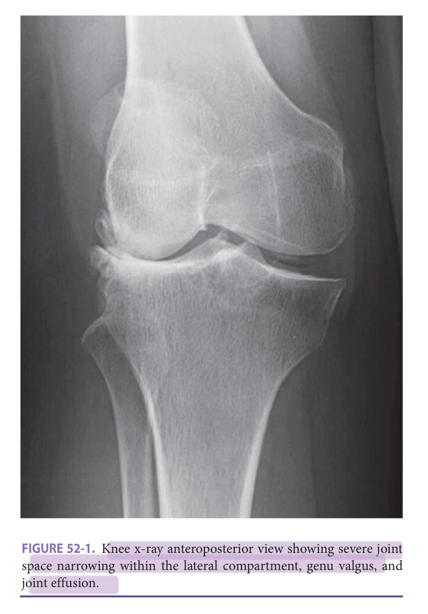
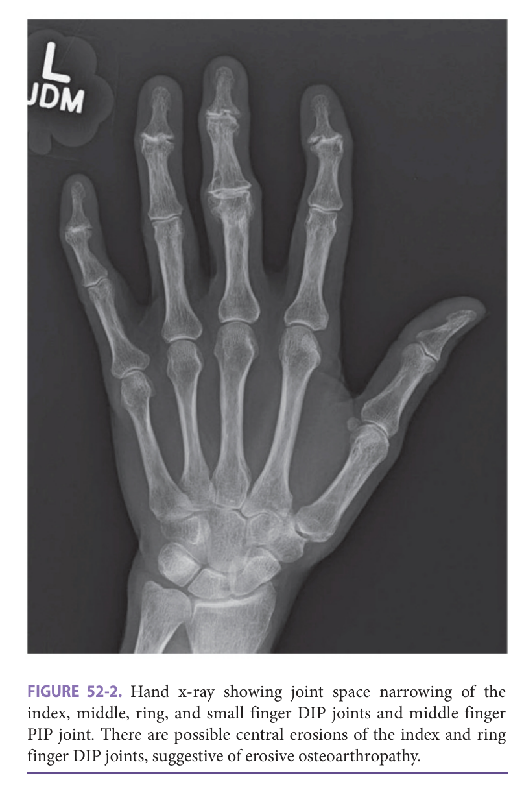
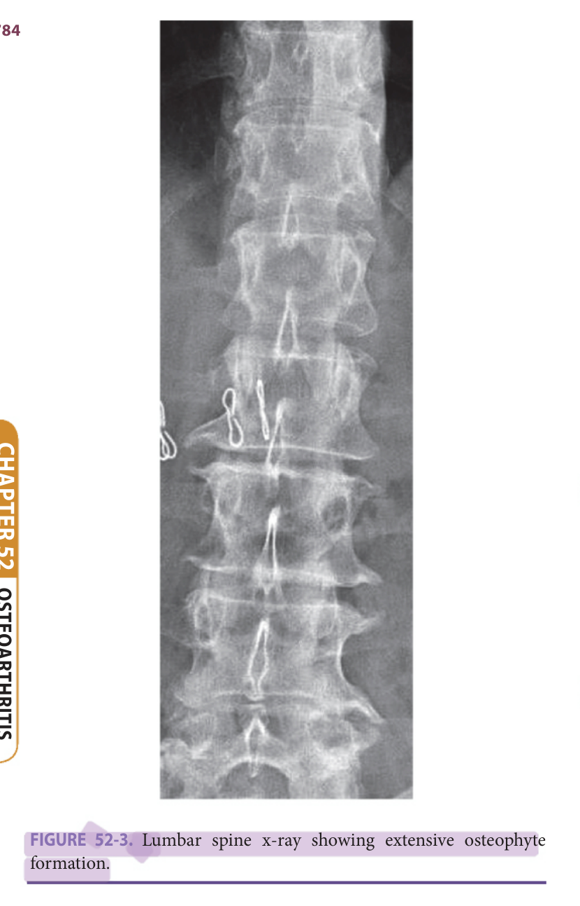
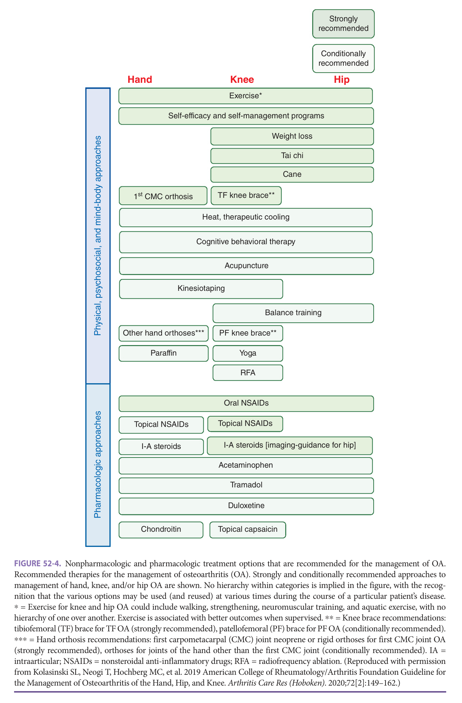
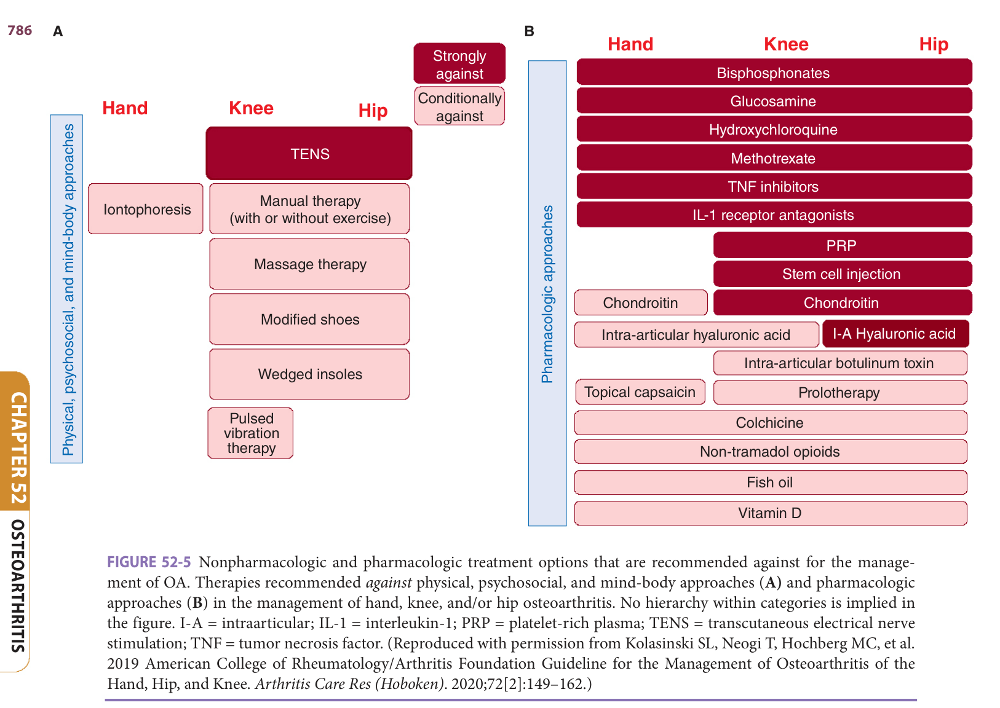

# Hazzard's Geriatric Medicine and Gerontology, 8e — Chapter 52: Osteoarthritis

Michele R. Obert, Ernest R. Vina, Jawad Bilal, C. Kent Kwoh

> **Fast build from the book, 22 Sep; not lane-reviewed.**

**[p. 779]**

#### Learning Objectives

- To be aware of potential causes and risk factors for developing osteoarthritis (OA).
- To learn how to diagnose OA based on patient clinical presentation, imaging tests, and other diagnostic tools.
- To be familiar with nonpharmacologic, pharmacologic, and surgical treatments available for patients with OA with an understanding of comorbidities in the older adult.

#### Key Clinical Points

1. OA is a prevalent and disabling disease, especially among older adults.
2. Joint pain and self-limited morning stiffness are characteristic symptoms of the disease.
3. OA may be diagnosed clinically based on patient-reported symptoms and physical examination findings (eg, bony tenderness, bony enlargement, crepitus). Radiographic imaging can be used to help confirm the diagnosis.
4. Nonpharmacologic and pharmacologic therapies can be used to treat OA symptoms, but there are no currently available disease-modifying OA treatments.
5. Joint replacement surgery and other surgical options may be considered when conservative therapies fail.

## Introduction

Osteoarthritis (OA) is a highly prevalent and disabling disease and has been designated as a serious disease by the US Food and Drug Administration (FDA). Approximately 240 million people worldwide are affected by symptomatic OA, including at least 32 million in the United States. This number is expected to rise with longer life expectancies and the worsening obesity epidemic. OA is the third leading cause of years lived with a disability in the United States and is the most common cause of mobility limitation among older adults. Overall, there is a 1 in 2 lifetime risk of developing symptomatic knee OA. In addition, OA is associated with an increased risk of dying prematurely and with increased prevalence of comorbid conditions such as cardiovascular disease, diabetes mellitus, and depression. Those with hip or knee OA have a 20% excess mortality compared to those without it, partly due to limitation in their physical activity levels. Finally, OA-associated economic burden is highly significant due to direct medical costs and indirect costs (eg, lost wages, home care, hospital expenditures). It is estimated that wages lost due to OA approximate $65 billion, and medical costs can exceed $100 billion annually in the United States.

## Epidemiology, Causes, And Predisposing Factors

### Age, Sex, And Race

Age is the strongest risk factor for developing OA. The prevalence of the disease increases with increasing age. Among adults older than age 60 in North America, approximately 20% to 40% have radiographic evidence of hand OA while 30% to 40% have radiographic evidence of knee OA. Symptomatic OA is less prevalent, with 13% to 26% of all adults having symptomatic hand OA and 10% to 14% having symptomatic knee OA. At age 50, the pooled radiographic prevalence of thumb base OA is 5.8% for men and 7.3% for women; whereas at age 80, the pooled radiographic prevalence of thumb base OA for men and women are 33% and 39%, respectively. Among adults 45 years or older, the prevalence of symptomatic hip OA is about 10%. In one study, symptomatic foot OA was present in 17% of adults older than 50 years, with disabling symptoms presenting in 9.5%.

Women are more likely than men to be affected by hand OA, hip OA, and knee OA, especially after menopause. The prevalence of OA may also vary by race and ethnicity. OA of the knee is more common in African Americans than in non-Hispanic Whites or Mexican Americans. OA of the hip is more common in people of European descent compared to those of Asian or African descent. Compared to older Whites in the United States, older Chinese subjects in China have higher prevalence of knee OA but lower prevalence of hip and hand OA. Increasing evidence shows

**[p. 780]**

that the prevalence of arthritis-attributable activity and work limitation and severe joint pain is significantly higher among Hispanics compared to non-Hispanic Whites.

### Obesity

Obesity is the strongest modifiable risk factor for the development of OA. It is estimated that the reduction of body weight from obese to normal weight would reduce knee OA incidence by 21% in men and 33% in women. Obesity is also associated with having an increased risk of developing hand and foot OA. However, there is less consistent data supporting the relationship between hip OA and obesity.

### Occupation, Sports, And Joint Trauma

OA has also been linked to certain occupations. Working as a farmer or a construction worker/laborer increases the risk of developing knee and hip OA, especially among those who are overweight. Specific occupational activities such as more than 30 minutes of squatting, more than 30 minutes of kneeling, and climbing more than 10 flights of stairs per day increase the risk of developing radiographic knee OA. Among older adults, recreational walking, jogging, and other recreational activities do not seem to increase the risk of developing knee OA. However, high-impact sports are associated with increased risk of OA in certain joints: American football (knees, feet, ankles); baseball (shoulders, elbows); soccer (knees, hips, ankles); ice hockey (knee); and boxing (carpometacarpal). These often account for the development of OA at joints that are not usually affected by OA.

The increased risk of OA from occupational and sports activities is likely due to injury rather than participation in these activities. Hip dislocation and femoral acetabular impingement are associated with the development of hip OA. Ligamentous or meniscal damage in the knee and/ or surgical meniscectomy increases the risk of knee OA. In parallel, quadriceps muscle weakness is linked to tibiofemoral and patellofemoral knee OA. Prior foot or ankle injuries have also been linked to the development of foot OA.

### Malalignment And Physical Abnormalities

Joint malalignment may also increase the risk of developing OA. Varus alignment or knee extensor muscle weakness increases the risk of knee OA development and progression. This increased risk is most prominent in overweight and obese persons. Similarly, congenital hip dysplasia or cam deformity increases the risk of hip OA, especially in middle-aged (55–65 years) and younger (< 50 years) individuals. Specific physical attributes, such as leg length inequality, having a higher knee height and having an index finger shorter than the ring finger have all been associated with an increased risk of developing radiographic knee OA.

### Genetics

The number of OA genetic risk loci has recently increased significantly through genome-wide association studies and now includes 90 genome-wide significant loci for OA. The effect size associated with these genes is small, however. Genes that code for structural proteins of the cartilage’s extracellular matrix seem to have a role, especially those that code for collagen type II (COL2A1). Genes that code for different interleukins (eg, IL-1A, IL-1B, IL-1RN, IL-4R, IL-17A, IL-17F, and IL-6) may also affect genetic susceptibility to OA. Other genes that have been implicated in the development of OA include the estrogen receptor α gene, vitamin D receptor gene, frizzled related protein gene, asporin, and proteins related to cartilage and bone development and bone homeostasis. In addition, genes related to height, hip shape, bone area, and developmental hip dysplasia may also play a role.

## Classification And Pathophysiology

### Classification

OA has traditionally been classified as either primary (idiopathic) or secondary to known causes (**Table 52-1**). Primary OA most commonly affects the joints of the hands, knees, hips, spine, and feet. Nodal generalized OA is characterized by polyarticular finger involvement (distal interphalangeal [DIP], proximal interphalangeal [PIP], first carpometacarpal [CMC] joints) and a predisposition to OA of the knee, hip, and spine. It commonly affects middle-aged women with a strong family history of OA. Inflammation is being increasingly recognized as having a role in the pathophysiology of OA. Only a minority of OA patients have inflammatory symptoms, such as swelling and redness of the joints, however, and often these symptoms are mild and intermittent. Erosive OA is a variant that occurs when there is an additional erosive/inflammatory component, often involving the DIP and PIP joints of the hands. Other individuals may have a phenotype that indicates a larger role for mechanical factors in the pathophysiology. Secondary OA occurs when another disease or condition causes OA. Conditions that can lead to secondary OA include trauma; inflammatory arthritis (eg, septic arthritis, rheumatoid arthritis, seronegative spondyloarthropathy, gout); metabolic/endocrine disorders (eg, hemochromatosis, hyperparathyroidism); neuropathic disorders; and anatomical abnormalities.

**Table 52-1 — Secondary causes of osteoarthritis**

- *Anatomical abnormalities*: Bone dysplasia, congenital hip dislocation
- *Metabolic/endocrine*: Diabetes mellitus, hemochromatosis, acromegaly, hyperparathyroidism, ochronosis
- *Crystal deposition disease*: Gout, pseudogout
- *Inflammatory arthritis*: Rheumatoid arthritis, systemic lupus erythematosus, seronegative spondyloarthropathy, juvenile idiopathic arthritis
- *Trauma*: Fracture, surgery, infection
- *Others*: Avascular necrosis, neuropathic Charcot joints

**[p. 781]**

The American College of Rheumatology (ACR) has proposed specific criteria to standardize the classification of OA of the knee, hip, and hands for clinical and epidemiologic studies. These criteria are based on a combination of features such as patient age (> 50 years), clinical symptoms (ie, pain, < 30 minutes of morning stiffness), physical examination (ie, presence of crepitus, bony enlargement/tenderness), laboratory findings (ie, normal inflammatory parameters, synovial fluid consistent with OA and negative rheumatoid factor), and radiographic findings (ie, presence of osteophytes). These criteria only apply to patients with symptomatic disease, exclude patients with secondary OA, and are intended to classify and not diagnose OA.

### Pathophysiology

OA can be thought of as a failed repair of joint damage due to abnormal intra- and extra-articular processes involving a combination of biomechanical, biochemical, and genetic factors. A single or a combination of insults to the joints, including biomechanical trauma, chronic inflammation, genetic and metabolic factors, oxidative damage, and chondrocyte senescence, can trigger or contribute to the cascade of events that leads to OA. In the earliest stage of OA, fibrillation of the superficial layer of the articular cartilage may be observed with loss of glycosaminoglycan content in those areas. Eventually, the fibrillation extends to the subchondral bone, the cartilage fragments into the joint, the matrix degrades, and the cartilage is completely lost, leaving a denuded bone.

Chondrocytes in the articular cartilage react to insults in the joint, leading to changes in cellular function and matrix elements. Chondrocytes and synovial cells release matrix metalloproteinase (MMP) enzymes, such as collagenases, stromelysins, and gelatinases responsible for cartilage degradation. While these MMPs may be susceptible to MMP inhibitors, synthesis of MMPs is enhanced and the inhibitors are overwhelmed in OA. Cytokines have been implicated in the regulation of this process. Interleukin-1 (IL-1), a catabolic cytokine, is known to suppress type 2 cartilage synthesis and to induce proteases. IL-1 level and cell sensitivity are increased in OA. Anabolic cytokines, such as insulin-like growth factor-1 and transforming growth factor β, on the other hand, are found in decreased levels in the serum and synovial fluid of OA patients. Besides cartilage degradation, subchondral bone may also increase in density, potentially reflective of healing response to microfractures that have occurred. Cyst-like bone cavities may form, in addition to synovial inflammation and hypertrophy, which is not seen in normal aging joints. Osteophytes, or bony projections that form along joint margins, are often considered a hallmark of OA.

Several other factors have also been implicated in the development of OA. Crystals, including calcium pyrophosphate dihydrate and basic calcium phosphate crystals, have been identified in the synovial fluid of OA joints. Other than their ability to induce inflammation, their role in the pathogenesis of OA remains unclear. Protein levels of nuclear receptor erythroid 2-related factors 1 and 2 (NRF1 and NRF2), which regulate antioxidant gene expression for cellular protection, are present in lower levels in chondrocytes of persons with OA. An imbalance in antioxidant production by the chondrocyte compared to reactive oxygen species production has been found to damage lipids, protein, DNA, and normal cell signaling, contributing to the development of OA. In addition, the complement system may stimulate inflammatory mediators and enzymes that can contribute to the pathogenesis of inflammatory OA, while nitric oxide, known to activate MMPs in articular cartilage, may also mediate the osteoarthritic development process. Supported by epidemiologic studies, sex-related hormones have also been considered to play a role in the development of OA, especially in women.

## Presentation

### Symptoms

Patients with symptomatic OA most commonly present with pain in the joint. Pain tends to worsen with increased activity or weight-bearing and to improve with rest. Early in the disease, patients may complain of pain that is sharp, intermittent, and unpredictable. These features may often lead patients to limit their activity to avoid pain. As the disease progresses, the pain becomes more constant and aching in nature. Late in the disease, pain may be noted with progressively less activity, possibly occurring even at rest and at night. Patients may also complain of morning stiffness that typically resolves within 30 minutes or less. Joint stiffness may also occur after periods of prolonged inactivity, also known as the “gelling” phenomenon. Other patients may report joint locking or joint instability. In contrast, joint stiffness lasting more than an hour, joint pain and stiffness that improve with activity, and persistent joint swelling all suggest an inflammatory type of arthritis, such as rheumatoid arthritis, instead of OA.

Knee OA patients may complain of localized pain, often in the medial and lateral joint lines, or diffuse knee pain. They may have difficulty climbing the stairs or walking for even short periods of time. With laxity in the knee joint, patients may have feelings of knee instability, which may lead to falls. Hip OA patients may complain of pain in the anterior hip or inguinal area. Less commonly, their pain may also be felt laterally (ie, in the trochanter) or referred to the knee. They may have difficulty crossing their legs or putting on a pair of shoes.

Hand OA patients may report pain involving the DIP, PIP, and first CMC joints. Gripping, pinching, holding, or lifting objects may be particularly challenging in patients with symptomatic hand OA. Foot OA can cause

**[p. 782]**
such disabling foot pain with ambulation that can lead to significant functional limitations and increased risk of falls.

OA most commonly affects the cervical and lumbar spine areas. Cervical spine OA typically causes neck pain but can also cause occipital headaches, upper extremity radicular pain, shoulder pain, and loss of dexterity of the hands. Rarely, large osteophytes may compromise the spinal canal, causing lower-extremity spasticity and gait disturbance. Lumbar spine OA can often cause lower back pain that may radiate into the lower extremities and worsen with bending ipsilateral to the involved joint. Lumbar facet joint osteophytes can lead to lumbar canal stenosis with symptoms of claudication and/or pain at night; symptoms of spinal stenosis are often relieved by bending slightly forward (eg, walking uphill, upstairs or leaning forward on a shopping cart) and worsened by bending backward (eg, walking downhill or downstairs). Other symptoms of spinal stenosis include pain, tingling, numbness, and weakness,

### Physical Examination

OA patients may have a completely normal physical examination. Typically, they have joint-line tenderness, crepitus (ie, a peculiar crackling, crinkly, or grating feeling on palpation, which may also be audible) and bony enlargement. There may be joint swelling that tends to be intermittent and without palpable warmth. Synovitis can also be noted in OA, and some patients may have prominent joint effusions. With disease progression, the joint’s range of motion may decrease. Joint deformity, contractures, and/or laxity may also develop later in the disease.

In hand OA, there may be tenderness of the affected finger joints and/or tenderness of the first CMC joint. Enlargement of the first CMC joint can result in a squared appearance of the hand. Prominent bony enlargements of the DIP and PIP joints are known as Heberden and Bouchard nodes, respectively.

In knee OA, there is often crepitus on active knee motion and bony tenderness. There may also be effusion (without warmth) and a limited range of motion. The joint fluid may migrate into the semimembranosus bursa posteriorly, causing swelling along the posterior knee known as a popliteal or “Baker’s” cyst. Knee varus (“bow-legged”) or valgus (“knock-kneed”) deformities may be observed later in the disease. Medial/lateral knee joint laxity may be evident on examination and lead to joint instability.

In hip OA there may be reproducible pain along the anterior hip or the inguinal area with passive or active range of motion, particularly with extension and internal rotation. The range of motion in the hip joint may also be affected; limited internal rotation and/or extension may be an early indication of hip OA. Hip OA patients may also develop an antalgic gait in which the stance phase of the gait is abnormally shortened on the affected hip joint.

In foot OA, the first metatarsophalangeal (MTP) joint is most commonly affected, followed by the second cuneometatarsal (CMT) and talonavicular (TN) joints.

There are limited agreed upon guidelines for the clinical assessment of foot OA. For first MTP joint OA specifically, the patient may exhibit pain in that joint upon walking, limited dorsiflexion in the first MTP joint and pain on direct palpation of the joint. Other exam findings that may be present include hallux valgus, first interphalangeal joint hyperextension, and decrease in ankle joint dorsiflexion range of motion.

## Evaluation

### Diagnostic Imaging

OA can usually be diagnosed clinically based on history and physical examination alone. Although conventional radiography can demonstrate the severity of damage and may be used to confirm the diagnosis with an atypical presentation, radiographs are not necessary to make a diagnosis. Before making a clinical diagnosis of OA, however, other diseases should be excluded. At the very least, OA should be distinguished from referred pain, inflammatory arthritis conditions (eg, rheumatoid arthritis, gout, pseudogout) and periarticular bursitis (eg, trochanteric bursitis of the hip, pes anserine bursitis of the knee). Radiographic findings suggestive of OA are very common in older adults, yet many of these patients have minimal to no OA-related symptoms. Radiographic features of OA include joint space narrowing, osteophytes, subchondral sclerosis, subchondral cysts, and/or altered bone contours. X-rays may also show calcification of cartilage or other structures and soft-tissue swelling.

Radiographic findings specific to knee OA patients include medial tibiofemoral and/or patellofemoral joint space narrowing, along with osteophyte formation. Lateral joint space narrowing may also be seen but is less common ( **Figure 52-1** ). Osteophytes may be seen anteriorly and medially at the distal femur and proximal tibia and posteriorly at the patella and tibia. Radiographic changes seen in hip OA include joint space narrowing (superior, axial, or medial), osteophyte (femoral or acetabular) formation, and subchondral sclerosis.

With hand OA, the first CMC, the DIP, and the PIP joints are most commonly involved. Joint space loss is typically nonuniform and asymmetric. Involvement of more than two metacarpophalangeal joints suggests different type of arthritis other than OA. Hand x-rays of those with erosive OA will reveal erosions and the “gull-wing” deformity ( **Figure 52-2** ). X-rays of patients with lumbar or cervical OA will reveal intervertebral disc narrowing and osteophytes arising from the vertebral body margins ( **Figure 52-3** ). Sclerosis and cyst formation may also be seen. Neural foraminal narrowing may result from osteophyte formation, but this is best seen using a computed tomographic (CT) scan. With foot OA, a foot-specific atlas that grades osteophytes and joint space narrowing can be used to classify radiographic OA in the commonly affected areas, although

**[p. 783]**

> *FIGURE 52-1. Knee x-ray anteroposterior view showing severe joint space narrowing within the lateral compartment, genu valgus, and joint effusion.*

> Highlighting is the owner's annotation, not the book's.

this requires both dorsoplantar and lateral views to be taken while standing.

It is important to remember that conventional radiographs have limited resolution and cannot detect early OA. They also only provide images of bony structure and are two-dimensional projections of three-dimensional joints, meaning multiple views are necessary to visualize the joint and detect possible OA involvement properly.

As a research tool, MRI has allowed the detection of preradiographic OA. It offers greater resolution than an x-ray, provides depiction in three dimensions, and allows visualization of bone and soft tissue structures. MRI allows visualization of subchondral cyst-like lesions, subchondral bone attrition, joint effusion, synovitis and meniscal damage. The integrity of ligaments, periarticular cysts and bursae, and osteophytes may also be assessed through MRI. It is important to remember that although research with MRI has contributed to understanding the relevance of these structures in explaining pain and structural progression in OA, MRI is not necessary to diagnose OA.

### Laboratory Studies

Laboratory tests are unhelpful in diagnosing OA but are helpful in excluding other causes of arthritis such as

> *FIGURE 52-2. Hand x-ray showing joint space narrowing of the index, middle, ring, and small finger DIP joints and middle finger PIP joint. There are possible central erosions of the index and ring finger DIP joints, suggestive of erosive osteoarthropathy.*

> Highlighting is the owner's annotation, not the book's.

rheumatoid arthritis, gout, or infectious arthritis. Inflammatory markers, such as erythrocyte sedimentation rate and C-reactive protein level, and immunologic tests, such as antinuclear antibodies and rheumatoid factor, should not be routinely ordered unless there are signs or symptoms suggestive of inflammatory arthritis or autoimmune disease. Uric acid level may be ordered if gout is suspected.

Performing an arthrocentesis may be valuable in evaluating patients with presumptive OA. Synovial fluid findings in OA often show a white blood cell count of less than 2000 cells/mm3 . Counts that are greater than 2000 cells/mm3 suggest an inflammatory or infectious arthritis etiology. Under polarized microscopy, there should be no visible crystals. The presence of gout or pseudogout crystals suggests crystalline arthritis as the underlying cause of joint pain.

A variety of OA-related biomarkers have been identified and validated for several OA outcomes. They are products of cartilage and bone turnover (eg, urine/serum carboxy-telopeptide of type II collagen, serum hyaluronan). However, their utility in diagnosing OA, determining the risk of disease progression, and assessing the response to OA therapies is unclear and currently under investigation.

**[p. 784]**

## Management

The ACR/Arthritis Foundation (AF) and the Osteoarthritis Research Society International (OARSI) have published updated recommendations for management of OA. The main goals of management are to minimize OA-related pain, improve physical functioning and optimize the quality of life of patients with OA. There are nonpharmacologic, pharmacologic, and surgical treatment options for the management of OA ( **Figures 52-4** and **52-5** ). OA management should be tailored to the individual patient, and optimal management likely includes a combination of these treatment modalities. For example, evidence suggests that patient education, exercise programs, weight reduction, and wedge insoles all offer additional benefit in combination with an analgesic or nonsteroidal anti-inflammatory drug (NSAID).

### Physical, Psychosocial, And Mind-Body Approaches

**Self-efficacy and self-management** OA patients should be taught the goals of OA treatment, the importance of changes in lifestyle, exercise, pacing of activities and weight loss, and various ways to minimize joint loading. The educational focus should be on initiating self-help and patient-driven treatments that reflect the nature and course of the disease rather than simply accepting therapies delivered by providers. Thereafter, the emphasis should be on maintaining adherence to nonpharmacologic and pharmacologic therapies. Such information may be taught through group courses, individual consultations, and regular telephone calls. Participants in these programs report reduction in pain, improvement in function, and weight loss. These programs may also increase patient self-efficacy and physical activity, and decrease the number of OA-related physician visits.

**Exercise** Aerobic exercise and muscle strengthening can significantly improve the physical health and symptoms of patients with OA. Regular aerobic activities that older adults can engage in include walking, bicycling, swimming, and tai chi. Quadriceps muscle strengthening can be particularly helpful for a patient with knee OA. In general, there is no significant difference in reducing arthritis-related symptoms and disability in knee and hip OA patients between aerobic and resistance training. In addition, balance exercises may be beneficial by improving a person’s ability to control and stabilize their body position.

For patients with advanced OA, mobilization exercises (ie, stretching and flexibility training) and isometric strengthening exercises can initially be prescribed. Mobilization exercises increase length and elasticity in muscles and periarticular tissues. Mobilization of the sesamoid apparatus and strengthening of hallux plantar flexors is beneficial for first MTP joint OA. During isometric exercises, muscle length does not noticeably change and the affected joint does not move. Isometric exercises for older adults include chair leg extensions, wall sits, and hip extensions. The exercise regimen may then progress toward isotonic strengthening and aerobic exercises. During isotonic exercise, muscle tension remains unchanged but muscle length changes. Beneficial isotonic exercises include squats, wall slides, and leg presses. Finally, water-based exercise is a low-impact activity that takes the pressure off joints, muscles, and bones. It is particularly beneficial for those with severe OA and marked deconditioning.

Physical therapists are valuable for providing instructions and appropriate exercises. They are essential for outlining individualized treatment and a progressive home exercise program. Indeed, a physical therapy regimen that includes strengthening and neuromuscular training can improve symptoms in two-thirds of patients with advanced knee OA. Physical therapy evaluation may also result in provision of assistive devices, such as canes and walkers, as necessary.

In summary, exercise can be a joint-specific range of motion and/or strengthening program or a general aerobic conditioning regimen. Exercise may be supervised on land, in water or in a self-directed home-based program. Regardless of the type of exercise regimen, extra attention is needed for the older patient to enhance safety and compliance with the program, taking into account potential comorbidities. Those with knee or hip OA should also cautiously engage in moderately or severely strenuous exercises (eg, stair climbing, heavy weightlifting and running).

> *FIGURE 52-3. Lumbar spine x-ray showing extensive osteophyte formation.*

> Highlighting is the owner's annotation, not the book's.

**[p. 785]**

> *FIGURE 52-4. Nonpharmacologic and pharmacologic treatment options that are recommended for the management of OA. Recommended therapies for the management of osteoarthritis (OA). Strongly and conditionally recommended approaches to management of hand, knee, and/or hip OA are shown. No hierarchy within categories is implied in the figure, with the recognition that the various options may be used (and reused) at various times during the course of a particular patient’s disease. * = Exercise for knee and hip OA could include walking, strengthening, neuromuscular training, and aquatic exercise, with no hierarchy of one over another. Exercise is associated with better outcomes when supervised. ** = Knee brace recommendations: tibiofemoral (TF) brace for TF OA (strongly recommended), patellofemoral (PF) brace for PF OA (conditionally recommended). *** = Hand orthosis recommendations: first carpometacarpal (CMC) joint neoprene or rigid orthoses for first CMC joint OA (strongly recommended), orthoses for joints of the hand other than the first CMC joint (conditionally recommended). IA = intraarticular; NSAIDs = nonsteroidal anti-inflammatory drugs; RFA = radiofrequency ablation. (Reproduced with permission from Kolasinski SL, Neogi T, Hochberg MC, et al. 2019 American College of Rheumatology/Arthritis Foundation Guideline for the Management of Osteoarthritis of the Hand, Hip, and Knee. _Arthritis Care Res (Hoboken)_ . 2020;72[2]:149–162.)*

> Highlighting is the owner's annotation, not the book's.

**[p. 786]**

> *FIGURE 52-5. Nonpharmacologic and pharmacologic treatment options that are recommended against for the management of OA. Therapies recommended against physical, psychosocial, and mind-body approaches (A) and pharmacologic approaches (B) in the management of hand, knee, and/or hip osteoarthritis. No hierarchy within categories is implied in the figure. I-A = intraarticular; IL-1 = interleukin-1; PRP = platelet-rich plasma; TENS = transcutaneous electrical nerve stimulation; TNF = tumor necrosis factor. (Reproduced with permission from Kolasinski SL, Neogi T, Hochberg MC, et al. 2019 American College of Rheumatology/Arthritis Foundation Guideline for the Management of Osteoarthritis of the Hand, Hip, and Knee. Arthritis Care Res (Hoboken). 2020;72[2]:149–162.)*

> Highlighting is the owner's annotation, not the book's.

is needed for the older patient to enhance safety and compliance with the program, taking into account potential comorbidities. Those with knee or hip OA should also cautiously engage in moderately or severely strenuous exercises (eg, stair climbing, heavy weightlifting and running).

**Weight loss** All existing guidelines highly recommend weight loss in overweight and obese individuals with OA of the hip or knee for OA management. In many patients, a structured weight management program may be necessary. An effective program focuses on developing healthy eating and physical activity habits. It should include a plan for the individual to lose weight slowly and steadily to maintain weight loss over the long run. Patients should avoid fad diets, which often result in rapid weight loss in the short term, but weight gain over the longer term. A realistic goal is weight loss of more than 5% to be achieved within a 20-week period. The program may include ongoing feedback, monitoring, and support. Weight reduction has been shown to improve knee and hip OA-related pain, stiffness and disability.

**Tai chi and acupuncture** Tai chi, a practice that originated in China, is referred to as “moving meditation.” Practitioners move their bodies slowly, gently, and with awareness while incorporating deep breathing, meditation, and relaxation. It may be beneficial in improving strength, balance, and self-efficacy while decreasing the risk of falls in patients with lower extremity OA.

In contrast, the efficacy of acupuncture in patients with knee, hip, or hand OA remains controversial. Clinical trials have demonstrated that it may provide a short-lived duration of analgesia, mostly for those with knee OA.

**Braces and taping** A tibiofemoral knee brace, and at times patellofemoral knee braces, can reduce pain and improve stability and ambulation, leading to lower risk of falling for knee OA patients with varus or valgus instability. Separately, a brace and a neoprene sleeve offer additional beneficial effects for knee OA compared with medical treatment alone. A brace tends to be more effective than a neoprene sleeve, however. Medially directed patellar taping may also benefit patients with knee OA.

**Orthoses** All patients with knee, hip, or foot OA should receive advice regarding appropriate footwear. However, laterally and medially wedged insoles have not demonstrated clear efficacy or benefit. Hand orthoses may benefit patients with first digit CMC joint OA of the hand, although evidence supporting hand orthoses for OA in other joints of the hand has not yet been established. With foot OA, footwear known as a “rockersole,” where the sole of the shoe is curved, reduces the need for first MTP joint dorsiflexion

**[p. 787]**

and has been shown to reduce the pressure under the first MTP joint. Foot orthoses include shoe-stiffening inserts and contoured orthoses that may reduce foot pain.

**Assistive devices** Walking aids can reduce OA-related pain in patients with knee and hip OA. A cane can significantly reduce joint loading and pain. In addition, it can provide additional stability in a patient where joint disease affects ambulation. It should be properly fitted to approximately the level of the greater trochanter of the hip. Patients should be instructed to use the cane with the hand opposite the affected knee or hip. The final bend to the elbow when walking with the cane should be approximately 15 to 20 degrees. When disability is more severe or when OA is bilateral, a walker may be a better option. Assistive devices, such as zipper pulls, built-up handles on pencils/pens, cushioned carrying tools, and meal preparation devices, can be very beneficial for patients with hand OA. Occupational therapists are likely to be helpful in recommending lifestyle modifications and assistive devices to patients with arthritis symptoms.

**Heat and cold therapy** Thermal modalities may be effective for relieving OA symptoms, but the benefits may be temporary. All patients with hand, knee, and hip OA should be instructed in the use of thermal agents. Heat can be administered by various techniques, including the application of heat packs, ultrasound, electrically delivered heat, immersion in warm water, and paraffin baths. There are also store-bought heat patches, belts, packs, and wraps. Patients should be instructed that heat therapies should be limited to 20-minute intervals to reduce the risk of burns. Cold (or cryotherapy) can be administered by application of ice packs or massage with ice. It can decrease inflammation, minimize muscle spasms, and reduce pain. Patients should also be instructed to limit the use of ice or cold packs to 20 minutes. The choice of heat or cold is often based on patient preference.

### Topical Agents

**Capsaicin and rubefacients** Topical capsaicin creams contain a lipophilic alkaloid extracted from chili peppers, which activates and sensitizes peripheral c-nociceptors. Both 0.03% and 0.08% topical capsaicin have been shown to reduce pain in knee OA, although a dose of 0.03% topical Capsaicin is better tolerated than a dose of 0.08%. At this time, efficacy in treating hand OA has not been well demonstrated, and the risk of contaminating the eyes is high. Capsaicin has also not demonstrated any benefit in treating hip OA, likely due to the depth of the joint under the skin. Topical capsaicin can be considered as an adjunct therapy or used instead of topical NSAIDs for foot OA as studies have shown similar improvement in pain. Rubefacients containing salicylates (eg, trolamine salicylate, hydroxyethyl salicylate, diethylamine salicylate) may also be used as adjunctive agents, albeit supportive data is scant. Skin burning, stinging and erythema are potential side effects.

**Topical NSAIDs** Topical NSAIDs, such as diclofenac sodium gel, are recommended as first-line pharmacological therapy to treat hand and knee OA prior to starting oral NSAIDs, given their favorable side effect profile and efficacy of pain relief. They are also recommended as first-line pharmacologic therapy for the treatment of symptomatic foot OA. In February 2020, the FDA approved Voltaren gel (diclofenac sodium topical gel 1%) for sale over the counter. Topical NSAIDs have a high safety margin and are not associated with acute renal failure or gastrointestinal adverse events when used as instructed. Thus, they may be particularly useful in patients with cardiac, renal, or gastrointestinal comorbidities. They may be less ideal for those with a large number of affected joints, in which case systemic therapy would be preferred. Similar to capsaicin, topical NSAIDs are not recommended for treating hip OA due to the depth of the joint under the skin precluding their efficacy.

### Oral Pharmacologic Therapies

**Acetaminophen** Acetaminophen has traditionally been used as a first-line agent in treating mild-moderate OA. However, some meta-analyses have shown that acetaminophen was no better than placebo for symptom control. Other studies showed its use was associated with minimal improvement in pain control, which may be outweighed by the side effect profile of the medication. Acetaminophen use may still play a role in the treatment of knee, hip, hand, or foot OA for short treatment durations, or in patients who have contraindications precluding the use of oral or topical NSAIDs. The FDA has reduced the maximum daily dose of acetaminophen to 3 g/day. Regular monitoring for hepatotoxicity is recommended in those with prolonged use, especially for those taking the maximum recommended daily dose.

**Oral NSAIDs** NSAIDs inhibit the activity of cyclooxygenase (COX)-1 and -2 enzymes, providing analgesic and antiinflammatory effects. They are recommended as first-line oral pharmacotherapy over all other oral medications and can be very helpful for OA patients who do not respond to topical NSAIDs, have multiple joint involvement, or suffer from moderate-to-severe levels of pain. There is no strong evidence that a particular NSAID is more effective than other NSAIDs, but the side effect profiles make some safer than others for specific patients. Some patients may prefer specific NSAIDs (eg, meloxicam, naproxen) based on the frequency of dosing for convenience.

Patients may be started on a low-cost NSAID with a short half-life, such as ibuprofen. Initially, the medication should be started on the lowest possible dose, and if the response is not satisfactory after a few weeks, then the medication dosage may be slowly increased up to the maximum recommended dose. Switching to a different NSAID is another OA treatment management option.

While efficacious, NSAIDs should be prescribed with caution, particularly in patients with comorbidities that may increase NSAID toxicity. Gastrointestinal complications such as peptic ulcers and bleeding are potential side effects. This risk increases with older age, concurrent use

**[p. 788]**

> of other medications (eg, glucocorticoids, anticoagulants), and longer therapy duration. Using either a COX-2 selective inhibitor or a nonselective NSAID in combination with a proton-pump inhibitor reduces this risk. Nephrotoxicity is another potential toxicity. Patients with chronic kidney disease (CKD) stage IV or V (estimated glomerular filtration rate < 30 cc/min) should avoid NSAIDs. Nonacetylated salicylates, sulindac, and nabumetone may be less nephrotoxic than other NSAIDs.

Patients with cardiovascular disease are also at increased risk for cardiovascular adverse events (eg, myocardial infarct or stroke) associated with NSAIDs, particularly with the use of diclofenac. Patients should be made aware of such risks and monitored closely during treatment. Finally, concomitant use of low-dose aspirin and nonselective NSAIDs (eg, ibuprofen) may also render aspirin less effective when used for cardioprotection and stroke prevention.

**COX-2 selective inhibitors** A COX-2 inhibitor (ie, celecoxib) or a COX-2 selective NSAID (eg, meloxicam) can be a better treatment option for a subset of OA patients. They can effectively relieve painful OA symptoms with significantly less risk of GI side effects as compared to nonselective NSAIDs. Prescribing these medications to patients with cardiovascular risk factors should be done with caution however, as they may increase the risk of myocardial infarct, stroke, and other related conditions.

**Narcotic analgesics** Tramadol is a weak μ-opioid receptor inhibitor that inhibits the reuptake of serotonin and norepinephrine. It can relieve pain in patients with hand, knee, or hip OA, but should only be used when they have contraindications to NSAIDs, inadequate response to other pharmacologic and nonpharmacologic treatment modalities, or are not a good surgical candidate. Tramadol should be trialed prior to any nontramadol opioids. Like other narcotic agents, it can also cause nausea, dizziness, somnolence, vomiting, and increased mortality risk. Long-term use may also lead to physical dependence. However, respiratory depression and constipation are considered less of a problem with tramadol.

More potent narcotic medicines, such as oxycodone, hydrocodone, or morphine sulfate, may be considered in some OA patients only after failure of all other treatments. Patients who continue to have severe OA-related pain and disability despite trying other pharmacologic and nonpharmacologic OA treatments may be good candidates. Those who are unwilling or unable to undergo joint replacement surgery due to comorbid conditions (eg, significant cardiac or pulmonary disease) may also be reasonable candidates.

Narcotic agents are poorly tolerated in older people due to increased sensitivity to certain side effects, including constipation, urinary retention, confusion, and sedation. The risk of falls may also be increased in a population already vulnerable to falls due to joint disease and other risk factors. If narcotic medicines are to be started in older people, then the lowest dose should be prescribed for the

shortest possible length of time. Adjuvant therapies with nonnarcotic pain relievers should also be considered.

**Nutraceuticals** Glucosamine and chondroitin sulfate are naturally occurring constituents of cartilage proteoglycans. They are popular “nutritional supplements” used by many OA patients, but their use is highly controversial. Although several clinical trials showed their efficacy in improving pain and function, these trials were primarily industry-sponsored and utilized a pharmaceutical grade of glucosamine sulfate, which is not available in the United States. The best available data with the lowest risk of bias indicate that these supplements were no more effective than placebo. The ACR/AF and OARSI recommend against the use of either glucosamine or chondroitin sulfate to treat knee or hip OA.

Other nutraceuticals have been investigated for their potential benefits in the treatment of OA. A number of nutraceuticals have reported a short-term reduction of pain, but most of the current studies on nutraceuticals are small, exhibit various forms of bias, and have short follow-up times.

**Other options** The use of serotonin and norepinephrine reuptake inhibitors, such as duloxetine, seems promising in the treatment of OA. It has shown moderate efficacy in treating symptoms for knee OA when used alone or when combined with NSAIDs, and its effects are likely to be similar in the treatment of hip and hand OA. The tolerability of the medication may be a limiting factor, however.

Disease-modifying osteoarthritis drugs (DMOADs) can potentially inhibit the structural disease progression of OA and improve OA-related symptoms. At present, there are no DMOAD therapies available on the market. However, several research studies are being conducted to determine DMOAD efficacy and safety. Many studies have focused primarily on preventing hyaline cartilage loss. Because the pathogenesis of OA involves multiple tissues, more recent studies are also targeting other tissues, including the subchondral bone. Most DMOADs under investigation have an anti-catabolic effect on cartilage and may also structurally modify subchondral bone. Studies of bisphosphonates showed no efficacy in the control of OA pain or improvement in function. Similarly, tumor necrosis factor inhibitors and IL-1 receptor antagonists administered subcutaneously or intra-articularly did not prove to be efficacious for treating erosive OA and are not recommended for use. Other options under investigation include inducible nitric oxide synthase inhibitors, MMP inhibitors, aggrecanase inhibitors, doxycycline, Wnt inhibition, intra-articular injection of an anabolic growth factor, fibroblast growth factor 18, and a cathepsin K inhibitor.

### Intra-Articular Therapies

**Glucocorticoid agents** Intra-articular glucocorticoid (eg, methylprednisolone, triamcinolone) injections can significantly relieve pain due to OA. They can be most beneficial to OA patients with one or a few joints that continue to

**[p. 789]**

be bothersome despite oral pharmacologic therapies. They are particularly efficacious in patients with knee or hip OA. Knee joint injection can be administered in an ambulatory care setting. Hip joint injection, though, is often done with ultrasonographic or fluoroscopic guidance. When proper technique is used, complications from intra-articular injections such as bleeding and infection are rare. Benefits may be short-lived, however, and pain relief typically lasts for up to 2 months. More than three injections within a 6-month period are not recommended, and the long-term effects these steroids have on the cartilage are still controversial.

**Viscosupplementation** Viscosupplementation, the intraarticular injection of hyaluronic acid, has been used for symptomatic knee OA. Hyaluronic acid is a large molecular weight glycosaminoglycan, which is a constituent of synovial fluid. Hyaluronic acid in OA joints is often of low molecular weight, losing its biomechanical and antiinflammatory properties. Recent meta-analyses demonstrated no clear benefit of intra-articular hyaluronic acid injection for the treatment of OA symptoms after addressing the component of bias from studies, especially in hip OA. Although the ACR/AF and OARSI OA management guidelines do not recommend using viscosupplementation based on the lack of evidence for treatment benefit, there may be individual patients who would benefit from a trial after the failure of all other treatment options.

**Platelet-rich plasma and mesenchymal stem cell therapy** Platelet-rich plasma (PRP) and mesenchymal stem cell (MSC) therapy are heavily marketed for many conditions including OA. These therapies are still experimental, have not been approved by the FDA, and should not be administered or obtained except in the case of an FDA-approved clinical trial. They may be marketed as “FDA-approved,” but only the equipment used to obtain and administer the PRP or MSC therapy has been FDA-approved.

### Surgical Interventions

Surgical intervention should be considered in OA patients who continue to have significant pain and disability despite maximal use of nonpharmacologic and pharmacologic therapies. Patients must also be healthy enough to withstand surgery. Shared decision making has been shown to be beneficial for patients and surgeons with regards to expectations, satisfaction, and outcomes.

**Arthroscopic debridement and joint lavage** Arthroscopic debridement is the removal of loose bodies, debris, mobile fragments of articular cartilage, unstable torn menisci, and impinging osteophytes. The procedure invariably also includes joint lavage. While it is a relatively common procedure, its practice is highly controversial. While a few uncontrolled studies have demonstrated short-term efficacy, most studies have shown that this procedure is no better than placebo in providing symptomatic relief for knee OA. Arthroscopic debridement or joint lavage alone is not recommended as treatment options in the OARSI OA management guidelines.

**Osteotomy** Osteotomy is a surgical procedure in which the bone is cut to shorten, lengthen, or change bone alignment. High tibial osteotomy is a potential surgical treatment for knee OA. It is appropriate for unilateral knee OA with varus malalignment. Realignment of the varus deformity would reduce stress on the medial compartment of the knee by redistributing the weight of the body from the arthritic medial compartment to the healthier lateral compartment. Although the overall failure rate at 10 years is approximately 25%, the procedure can reduce pain, improve function, and delay the need for joint replacement.

Intertrochanteric varus or valgus osteotomy has been used for hip OA treatment for nearly a century. Pelvic or femoral osteotomies have also been used to correct the biomechanics and joint congruency in young patients with hip dysplasia to prevent the development of hip OA. Evidence in the efficacy of these procedures, however, is limited.

**Joint replacement** Joint replacement surgery is an irreversible procedure used in those with severe OA who have failed conservative treatment modalities, have persistent pain, and have had associated loss of function secondary to their symptoms. The average age at the time of knee replacement is the mid-sixties, although this procedure is being done more and more often in younger patients. Patients who undergo surgery often attain substantial improvements in pain, quality of life, and physical functioning; however, between 20% and 30% of patients have reported not being satisfied with surgery outcomes after total joint replacement. Maximal improvements are usually observed in the first 3 to 6 months with long-term benefit plateauing after 9 to 12 months. Quality of life indicators following joint replacement also improve approximately a year after surgery and only decline gradually over time. Certain patient characteristics such as advanced age, obesity, and comorbidities may limit improvement in patient-reported outcomes after surgery and increase rates of complications, but the presence of these characteristics should not prevent patients from being offered surgery; rather, these factors should inform the shared decision-making process. With current advances, implants typically last 15 years or more. The risk of revision is higher in patients with diabetes, obesity, and those who received surgery before 65 years compared to those aged 65 or older.

Unicompartmental knee arthroplasty involves replacement of a part or section of the knee that is arthritic. It may be considered in patients with discrete knee pain and disease localized to the medial compartment. Compared to total knee arthroplasty, it may also improve knee pain and function and requires a smaller surgical incision. Consequently, there is less postoperative pain, and hospital stays are shorter. The rehabilitation process also tends to be more rapid. Postsurgical complications, such as deep vein thrombosis and infection, are also fewer with unicompartmental than total knee replacement surgery. However, unicompartmental knee arthroplasty may make subsequent total knee replacement surgery more complex and has a shorter

**[p. 790]**

lifespan than a total knee arthroplasty joint, making rates of revision higher.

**Joint fusion** Joint fusion surgery, also known as arthrodesis, may be selected in patients with severe OA of the wrist, ankle, or first MTP joint. It may also be used as a salvage procedure when knee joint replacement has failed. During the procedure, two bones on each end of a joint are fused, eliminating the joint itself. While a fused joint loses flexibility, it can bear weight better and may leave the patient completely pain-free.

**Hand surgeries** Surgery is considered when nonsurgical treatment options have not significantly helped patients with OA of the thumb base or OA of the interphalangeal joints. In the case of the first CMC joint OA, trapeziectomy is the procedure of choice. More complicated surgical techniques have not proven to be more effective and are linked to increased rates of adverse events such as pain, instability, nerve dysfunction, chronic regional pain syndrome, and infections. The procedure of choice for OA in the PIP joint is arthroplasty with a silicone implant, except for the second PIP joint, for which arthrodesis is the preferred surgical method. Similarly, arthrodesis is the best approach for the DIP joints.

## Prevention

There are currently no therapies known to prevent the progression of joint damage due to OA. However, current research efforts are trying to identify preclinical biochemical and imaging biomarkers that will provide opportunities to diagnose and treat OA earlier in the disease course. Hence, we may eventually be able to prevent the development and further progression of the disease.

There are also known potential theoretical targets for primary and secondary prevention of OA. A person’s

weight is the largest identified modifiable risk factor for the development and progression of OA. The risk of knee OA has been shown to increase along with an increase in BMI. Therefore, weight loss for those who fall into the obese and overweight categories is important in primary prevention. Patients need to be educated on the benefits of weight loss and the need to achieve a normal body weight.

The _Physical Activity Guidelines for Americans_ recommend at least 150 minutes of moderate-intensity aerobic physical activity or 75 minutes of vigorous-intensity physical activity per week; walking is a great way to accomplish this. Repetitive use due to a job, hobby, or sport and joint-related injuries have also been linked to OA. Therefore, avoidance of repetitive movements and education on joint protection techniques (eg, using good body mechanics) to reduce joint injury while working or playing sports are important. Finally, joint malalignment is one of the strongest predictors for progressive OA. Nonsurgical and surgical strategies may be considered to correct anatomical abnormalities.

## Conclusions

OA is a highly prevalent disease among older adults worldwide. Older age, obesity, structural abnormalities, and previous injury are among the known risk factors for disease development. Patients often present with chronic pain, stiffness, and functional disabilities. Diagnosis is based on history and physical examination, and can be supported by characteristic radiographic findings. Management of OA should be tailored to the individual patient. Treatment may include a combination of nonpharmacologic, pharmacologic, and surgical approaches, with different approaches being used at appropriate timepoints throughout the natural history of the disease.

## Further Reading

- Bannuru RR, Osani MC, Vaysbrot EE, et al. OARSI guidelines for the non-surgical management of knee, hip, and polyarticular osteoarthritis. _Osteoarthritis Cartilage_ . 2019; 27(11):1578–1589.

- Ferguson RJ, Palmer AJ, Taylor A, Porter ML, Malchau H, Glyn-Jones S. Hip replacement. _Lancet_ . 2018;392(10158): 1662–1671.

- Fernandes L, Hagen KB, Bijlsma JW, et al.; European League Against Rheumatism (EULAR). EULAR recommendations for the non-pharmacological core management of hip and knee osteoarthritis. _Ann Rheum Dis_ . 2013;72(7):1125–1135.

- Hunter DJ, Bierma-Zeinstra S. Osteoarthritis. _Lancet._ 2019;393:1745–1759. doi:10.1016/S0140-6736(19) 30417-9.

- Katz JN, Arant KR, Loeser RF. Diagnosis and treatment of hip and knee osteoarthritis. _JAMA._ 2021;325(6):568. doi:10.1001/jama.2020.22171.

- Kloppenburg M, Kroon FPB, Blanco FJ, et al. 2018 update of the EULAR recommendations for the management of hand osteoarthritis. _Ann Rheum Dis_ . 2019;78:16–24. doi:10.1136/annrheumdis-2018-213826.

- Kolasinski SL, Neogi T, Hochberg M, et al. 2019 American College of Rheumatology/Arthritis Foundation Guideline for the Management of Osteoarthritis of the Hand, Hip, and Knee. _Arthritis Rheumatol_ . 2020;72(2): 220–233.

- Liu X, Machado GC, Eyles JP, Ravi V, Hunter DJ. Dietary supplements for treating osteoarthritis: a systematic review and meta-analysis. _Br J Sports Med_ . 2018;52(3):167–175.

**[p. 791]**

- Loeser RF, Collins JA, Diekman BO. Ageing and the pathogenesis of osteoarthritis. _Nat Rev Rheumatol._ 2016;12(7): 412–420.

- Paterson KL, Gates L. Clinical assessment and management of foot and ankle osteoarthritis: a review of current evidence and focus on pharmacological treatment. _Drugs Aging_ . 2019;36(3):203–211.

- Price AJ, Alvand A, Troelsen A, et al. Knee replacement. _Lancet_ . 2018;392(10158):1672–1682.

- Roddy E, Menz HB. Foot osteoarthritis: latest evidence and developments. _Ther Adv Musculoskelet Dis_ . 2018; 10(4):91–103.

- van der Oest M, Duraku L, Andinopoulou E, et al. The prevalence of radiographic thumb base osteoarthritis: a meta-analysis. _Osteoarthritis Cartilage_ . 2021;29(6): 785–792. https://doi.org/10.1016/j.joca.2021.03.004.

- Vina ER, Kwoh CK. Epidemiology of osteoarthritis: literature update. _Curr Opin Rheumatol_ . 2018;30(2):160–167.

- Reynard LN, Barter MJ. Osteoarthritis year in review 2019: genetics, genomics and epigenetics. _Osteoarthritis Cartilage_ . 2020;28(3):275–284.

