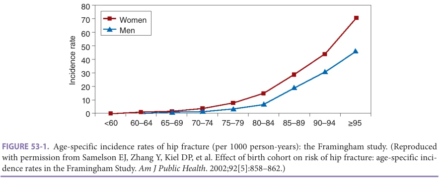
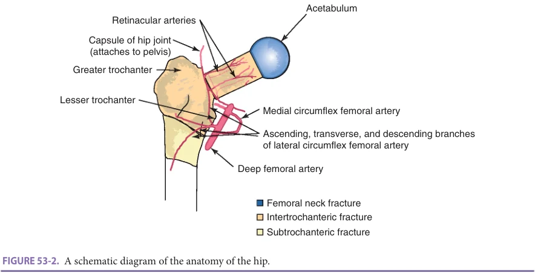
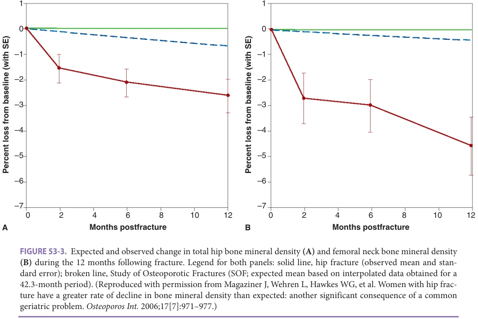
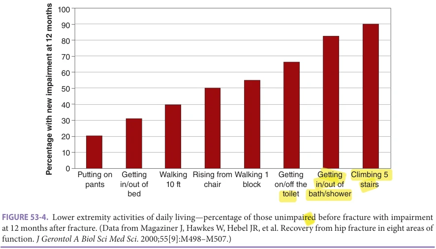
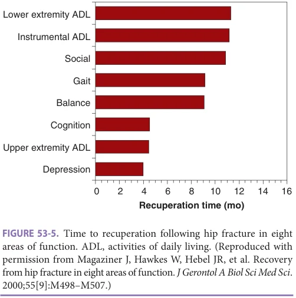
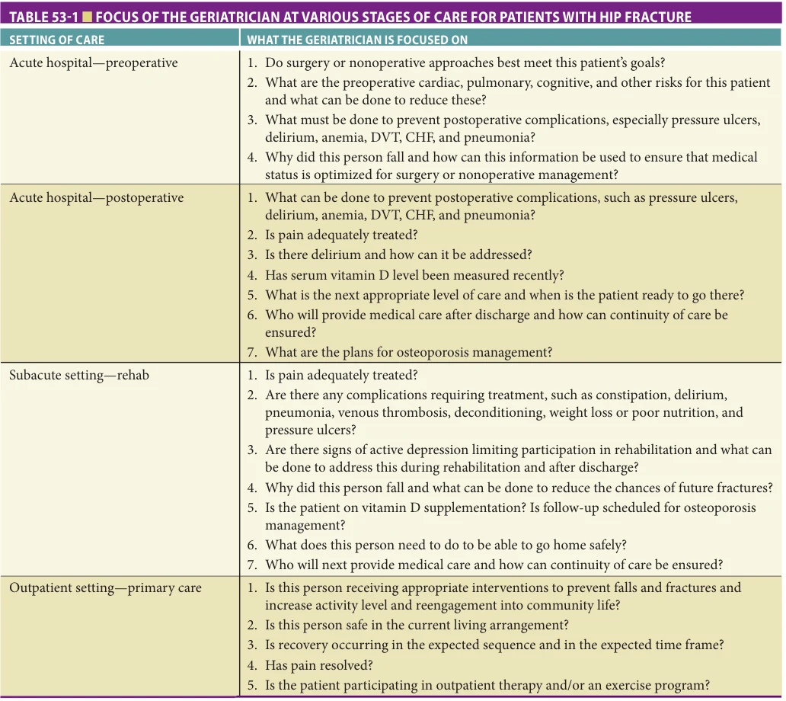

# Hazzard's Geriatric Medicine and Gerontology, 8e - Chapter 53: Hip Fractures

Ellen F. Binder, Simon Mears

> **Status.** Fast build from the book; not lane-reviewed.

> **Source and method.** Printed pages 793-804, from the marked 8th-edition copy (PDF page = printed page + 34). Prose follows its text layer; tables and figures are source-page crops. The book is canonical.

**[p. 793]**

## INTRODUCTION

Hip fracture is a major public health problem with significant consequences for older patients, their families, and the health care system. In 2010, there were approximately 260,000 adults aged 65 and older hospitalized for a hip fracture in the United States and this number is expected to increase to 289,000 by 2030 due to the aging of the population and people living longer. Recent worldwide estimates are in the order of 1.7 million hip fractures annually, and are expected to surpass 6 million by the middle of this century. As seen in Figure 53-1, hip fracture incidence increases exponentially in both men and women with advancing age. The average age of a patient with hip fracture is 82 years. Among those who reach age 85, approximately 19% of women and 12% of men will experience a hip fracture and, of those who reach 90 years, 30% of women and 20% of men will sustain a hip fracture. Although the majority of hip fractures occur in older White women, 25% to 30% of hip fractures occur in men and, in the United States, 8% occur in non-Whites. Prominent risk factors for hip fracture are osteoporosis and propensity to fall. Underlying these essential conditions for having a hip fracture are the reduced bone strength and quality that are characteristic of osteoporosis and the multiplicity of medical, psychosocial, and environmental factors that lead to falls.

#### Learning Objectives

- To be able to describe the surgical and medical issues commonly experienced by older hip fracture patients.

- To be able to describe the physiological and functional changes and psychosocial issues commonly experienced by older hip fracture patients during the year after the fracture event.

- To be able to understand the impact of bundled care on hip fracture management.

- To understand the role of the geriatrician in providing care to older hip fracture patients during the perioperative and recovery periods.

#### Key Clinical Points

1. Hip fracture in older adults is associated with significant morbidity and mortality.

2. Complications of hip fracture can be prevented or mitigated, through careful perioperative screening and intervention strategies initiated during the acute hospitalization, during a period of formal rehabilitation services, and over the course of the year after the fracture event.

3. Geriatricians can play a critical role in coordinating care for hip fracture patients, initiating appropriate state-of-the-art interventions, and optimizing communication between the patient, family members, and the health care team.

The direct medical and indirect nonreimbursed costs (eg, unpaid caregiving services and lost wages of patients and caregivers) of hip fracture have been estimated to be as high as $20 billion annually in the United States. Over the past few years, measures have been taken in an attempt to reduce costs of care for hip fractures. This approach, called bundling, gives a single standardized payment that includes the total cost for all care for the patient for 90 days after surgery. Hospitals with high costs are at risk to lose money with bundled care. The largest costs are typically postacute care and readmissions. The switch to bundled care forces hospitals to work to reduce readmissions and complications when possible, and attempt to send patients home rather than to subacute care. Bundling also promotes interaction between surgeons, geriatricians, and postacute care centers to try to focus rehabilitation goals and reduce length of stay in the postacute center.

Among those who have experienced a hip fracture, approximately 18% of women and 36% of men are expected to die within the first year of their fracture. The highest mortality rates occur within the first few months after a fracture among those who are in the poorest health. In addition, comparison of survival rates of female hip fracture patients to similarly impaired women without fractures indicates that

**[p. 794]**

*Figure 53-1, printed p. 794.*

the fracture itself is responsible for nine extra deaths per 100 patients during the first 4 years following the fracture. Epidemiological data from studies of women indicate that even in those with the lowest number of medical comorbidities and best functioning at the time of fracture, the mortality attributable to hip fracture continues to increase well beyond the first year post fracture. Causes of death in women and men are similar and approximately four times greater than their nonfracture counterparts for heart disease, three times greater for cerebrovascular disease, and three times greater for chronic obstructive pulmonary disease. Interestingly, one study showed that men are far more likely than their nonfracture counterparts to die from infectious causes such as septicemia and pneumonia, in the first 2 years following hip fracture.

The intent of this chapter is to provide information about the medical and psychosocial status of the older patient who presents with a hip fracture and to discuss strategies for care and the role of the geriatrician in providing care during the acute hospital stay and the subsequent year or more of follow-up care.

## WHAT TO EXPECT WHEN SEEING PATIENTS IN HOSPITAL

Medical Presentation and Fracture Characteristics Classically, a patient with a hip fracture presents with a painful, shortened, and externally rotated lower extremity after a fall and landing on the affected hip. Most patients are unable to weight bear on the extremity. A small percentage of fractures are nondisplaced or “hairline” fractures and the patient may be able to bear weight and ambulate with pain. Nondisplaced fracture may progress to displaced fractures if not recognized. Patients having pain with gentle rolling of the lower extremity and a history of trauma should be evaluated for fracture. If plain radiographs are negative, magnetic resonance imaging (MRI) should be performed to look for bone marrow edema and fracture. MRI is more sensitive than computed tomography. If a nondisplaced fracture is found, treatment is either with non–weight bearing or in situ fixation to prevent propagation.

Approximately half of all hip fractures occur in the area of the femoral neck (or “intracapsular fractures”), and the other half occur in the area between the greater and lesser trochanters (“intertrochanteric fractures” or “extracapsular fractures”). Less common are fractures that occur within 5 cm below the lesser trochanter; these are called “subtrochanteric fractures.” Patients with intertrochanteric fractures tend to be older than those with femoral neck fractures and are more likely to have multiple medical comorbidities. A schematic of the hip anatomy is shown in Figure 53-2, which indicates the anatomy of the vascular supply to the hip region. This schematic is useful to understand the various surgical approaches to hip fracture care and the potential for blood loss at each site. As demonstrated in the schematic, the regions of the femoral neck and the femoral head derive their main blood supply from fine retinacular arteries that stem from the medial circumflex femoral artery. These delicate vessels are closely apposed to the femoral neck in this region. A fracture in the femoral neck is more likely to disrupt the vascular supply to the femoral neck and head, which can result in longer-term nonunion and osteonecrosis. Thus, fractures in the femoral neck region, particularly displaced fractures, are usually managed with joint replacement or arthroplasty rather than internal fixation. Arthroplasty may be partial or total replacement. Total hip replacement is thought to give better long-term results and less pain for patients who are active. In contrast, the blood supply to the intertrochanteric area is plentiful and redundant, such that nonunion and osteonecrosis are less common in this region, and fractures can heal well after internal fixation procedures. Internal fixation is most commonly performed with a hip plate and screw or with an intramedullary hip screw. All of these procedures allow the patient to bear weight as tolerated after hip fracture repair.

Impact of Age-Associated Physiological Changes and Comorbidities The cumulative effect of environmental exposures, lifestyle, and genetic factors results in a remarkably heterogeneous

**[p. 795]**

*Figure 53-2, printed p. 795.*

geriatric population. Aging impacts most organ systems, although the degree to which organs are impaired from aging varies from individual to individual. In addition, several chronic medical conditions may also exist in a given individual. Medical care of the patient with hip fracture must, therefore, be adapted to the individual patient’s needs. This requirement for a tailored approach to care provides opportunities for challenges and satisfaction from the practice of geriatric medicine.

The changes that occur with aging physiology result in decreased resilience to stress, or the so-called “homeostenosis” in most organs. For example, older individuals may have lung volumes and decreased mucociliary clearance of their lungs, resulting in an increased propensity for postoperative atelectasis and pneumonia. Because of decreased physiological reserve, older individuals are at particular risk for a wider range of iatrogenic complications and do not recover as well when complications and adverse events occur. Older individuals are more susceptible to delirium during the pre- and postoperative period. This complication not only increases the patient’s risk of dying in the subsequent year, but also can impair an individual’s ability to participate in rehabilitation. Many of these complications are predictable and the geriatrician plays a critical role in team coordination and preventing complications. Hip fracture brings all of these known and unknown challenges together with the psychological insult of an acute fracture and need for surgical repair. The geriatrician must work with the surgical team to rapidly get the patient to surgery and progress the patient thought rehabilitation to hopefully bring them back to their baseline function.

Cognitive Status Dementia is a prominent risk factor for falls and fractures and, not surprisingly, a significant number of patients with hip fracture have underlying cognitive impairment.

Delirium is a common occurrence both at time of presentation to the emergency department and postoperatively, occurring in up to 60% of patients after hip fracture repair. Underlying dementia is a major risk factor for the development of delirium. The presence of delirium and cognitive impairment portend a worse functional recovery for patients with hip fracture. Identification of underlying dementia and risk factors for delirium is important for both prognostication, and so that modifiable risk factors can be avoided or minimized. Given the high risk of delirium in this patient population, it is particularly important to prepare the patient and family emotionally for this potential complication as it can be quite frightening to unprepared family members.

Risk factors for delirium in hospitalized patients have been well described. Some of the most consistently reported risk factors include advanced age, chronic cognitive impairment or dementia, sensory impairment, male sex, presence of comorbid psychiatric disease, polypharmacy and use of psychoactive and narcotic medications, infection, use of restraints, sleep deprivation, and undertreatment of pain. Among hip fracture patients, admission from an institutional setting and congestive heart failure (CHF) are important risk factors for delirium. Multi-component and nonpharmacologic interventions, preferably implemented by an interdisciplinary team, can prevent delirium and are cost-effective. Studies of proactive geriatric consultation with targeted recommendations, such as oxygen delivery, fluid balance, analgesia, elimination of unnecessary medications, regulation of bowel and bladder function, nutritional intake, mobilization, prevention of postoperative complications, assessment of environmental stimuli, and treatment of agitated delirium, have shown reductions in the incidence of delirium overall by a third, and in one study, a reduction in the incidence of severe delirium by half.

**[p. 796]**

Nutritional Status and Physiologic Changes after Hip Fracture Due to a number of factors, including pain and medications, reduced appetite is common during the acute hospital and rehabilitation period, and a significant number of patients will have difficulty meeting their caloric needs. Many hip fracture patients are undernourished prior to the fracture and therefore at high risk for malnutrition during their recovery.

Changes in body composition also are notable after a hip fracture. The average woman who fractures a hip can expect to lose 3% to 6% of her muscle mass within 2 months of the hip fracture and to have an increase in fat mass of 3% to 4% during the post fracture year. Losses of bone mineral density also are profound in this already osteoporotic group of older women. Older women lose nearly 3% of their total hip bone mineral density and more than 4.5% of their bone mineral density in the contralateral femoral neck during the year following a hip fracture. This is 12.5 times more than the loss of 0.5% that would have been expected in a group of women of the same age, comorbid disease status, and starting level of bone mineral density (Figure 53-3). Older men with hip fracture also show accelerated loss of bone mineral density in the contralateral hip that are greater than that expected from aging. Pharmacologic interventions to prevent secondary fractures should be considered for both women and men after hip fracture.

In addition, the prevalence of vitamin D deficiency among hip fracture patients is very high, and contributes to the observed losses in bone density and muscle strength, and fall and fracture risk.

The Geriatrician’s Role in Preoperative Care The geriatrician can serve a central role in caring for patients upon admission to the acute care hospital by evaluating the medical and perioperative issues, ensuring maximal medical stabilization prior to surgery, and providing early detection and ongoing vigilance regarding risks for and development of, postoperative medical complications. The geriatrician is well positioned to discuss with the patient and family the anticipated hospital and postacute care procedures and transitions, thereby reducing uncertainty and alleviating anxiety at this unanticipated and challenging time.

Studies indicate that a multidisciplinary approach to acute care for hip fracture can improve clinical outcomes. Several models of orthogeriatrics comanagement have been developed. Models vary from geriatric consultation or liaison services, management on a geriatric ward with orthopedic consultation, and integrated inpatient orthogeriatric units. A systematic review and meta-analysis of 18 studies found that orthogeriatric collaboration was associated with reduced in-hospital mortality, reduced long-term mortality, and reduced length of stay. A randomized trial of orthogeriatric care provided on a geriatrics ward (vs an

*Figure 53-3, printed p. 796.*

**[p. 797]**

orthopedic ward without geriatrics consultation) did not reduce the rate of in-hospital delirium, but did improve mobility at 4 months after surgery.

The majority of patients with a hip fracture will undergo surgical repair. The types of surgical approach and anesthesia employed are largely the purview of the surgeon and the anesthesiologist and often depend on local practice patterns and physician training. No differences have been found in mortality between general and spinal anesthetic. Preoperative regional anesthetic with a nerve block has been shown to decrease pain in hip fracture patients. The nerve block can be done by an anesthesiologist or a trained emergency room physician. The pain relief from the nerve block may make the use of a Foley catheter unnecessary. The geriatrician should help to limit the use of catheters to those who can’t roll or get on a bed pan because of pain.

To prepare the patient for hip fracture surgery, the attending physician should determine the risks of cardiovascular, pulmonary, and other complications and strive to reduce those risks. (Refer to Chapter 27, Perioperative Care: Evaluation and Management, for more details on the use of preoperative testing for risk stratification, preoperative pulmonary treatments, and the use of β-blockers and other medications to reduce the risk of perioperative adverse cardiac events in high-risk patients.) Medication reconciliation is particularly important. The patient may not have an accurate medicine list upon presentation to the emergency department, and calls to the pharmacy and/or primary care physician may be necessary to obtain correct information or clarify questions.

While surgical approaches usually offer more benefits than nonsurgical approaches, nonsurgical approaches should be considered for some selected patients. The clearest benefit of surgery over the nonsurgical approach is that surgery results in better anatomic alignment and better likelihood of ambulation. Nonsurgical approaches may be considered in patients who are unable to ambulate prior to the fracture, those with advanced dementia and contractures, those with little pain from the fracture, and those in whom surgical risks are very high or life expectancy is very short. The geriatrician can help by providing a “big picture” view of whether or not the patient will benefit from surgical repair of the hip or whether palliative care should be considered. The determination of what may be most appropriate for a patient requires a thorough understanding of the patient’s pre-fracture functional and cognitive status, comorbidities, psychosocial factors, and the patient’s prior goals, values, and priorities. If it is determined that the patient is not a good surgical candidate, the geriatrician should be prepared to discuss the patient’s care goals and priorities and the palliative care management strategies and resources and to refer to palliative care and hospice colleagues and providers, as appropriate. Discussion of options for those not considered good candidates for surgery, including palliative and hospice care, also can be initiated and led by the geriatrician.

The Geriatrician’s Role in Postoperative Care In the United States, a patient will usually remain in the acute hospital setting for 1 to 5 days after surgery for hip fracture. Patients should be mobilized the day of surgery if possible and certainly by postoperative day number 1. Early mobilization has been shown to be safe and effective for minimizing deconditioning and reducing the risk of complications such as delirium, constipation, pneumonia, thromboembolism, and pressure ulcer formation. If a catheter was placed, this should be removed the morning after surgery. Adequate treatment of postoperative pain is important for maximizing participation in physical therapy and increasing mobility. The optimal pain medication regimen has not been determined. The preoperative nerve block often helps postoperative pain considerably and intravenous pain medicine is not required after surgery. Care should be taken to prescribe a customized regimen that provides sustained pain relief early in the postoperative period, minimizes sedation, and also anticipates episodic increases in pain associated with activities such as therapy sessions.

The geriatrician must monitor the patient closely for the development of postoperative complications and is in a key position to detect subtle delirium that could be a harbinger of an ominous underlying complication, such as pulmonary embolus, urinary tract infection, and pneumonia. Postoperative pulmonary complications are among the most lethal complications in this population. Deep breathing exercises with or without an incentive spirometer, early mobility, and use of physical and/ or pharmacologic approaches to reduce the risk of deep venous thrombosis should all be instituted. Other important postoperative medical considerations the geriatrician may be particularly adept at managing are reducing polypharmacy, pressure ulcer detection and management, maximizing sensory input, explaining the treatments and progression of care to patients and family, and communicating across the transitions of care to reduce errors during this vulnerable time. Atrial fibrillation and CHF are other typical postoperative complications. Worsening of CHF often happens after hospital discharge and this should be taken in account if the patient is transferred to a subacute nursing facility.

The geriatrician should also determine the patient’s risk for subsequent falls and fractures. A falls history should be obtained, including a complete description of the fall that led to the fracture as well as any previous falls, with particular attention to remediable risk factors to be addressed prior to discharge back to home (see Chapter 43, Falls). The geriatrician should discuss with the patient, family, and other providers the issue of osteoporosis treatment (see Chapter 51, Osteoporosis). To facilitate optimal secondary fracture prevention measures, many hospitals have enrolled in the International Osteoporosis Foundation “Capture the Fracture” program (www.capturethefracture.org) to implement a postfracture care coordination program. Such programs

**[p. 798]**

bring together and coordinate a multidisciplinary team of providers who can assess and manage osteoporosis and fall prevention.

If antiresorptive therapy is being considered for treatment of osteoporosis, the vitamin D level should be repleted prior to starting a bisphosphonate. Therefore, if not performed recently, a serum vitamin D level should be checked during the acute hospital admission.

Discharge Planning Prior to discharge from the in-patient setting, a multidisciplinary assessment involving the geriatrician, the orthopedic surgeon, nursing, social work, physical therapy, and occupational therapy should be performed. The goal of this assessment is to decide on discharge plans and rehabilitation needs and goals. The following considerations should be taken into account: the patient’s current level of mobility, the patient’s postoperative medical and skilled nursing needs, the home environment, social support and economic resources available, self-care skills, and requirements for activities of daily living (ADL). The geriatrician plays a key role in coordinating the patient’s care and communicating with patients and families as they transition through the health care system. A critical role for the geriatrician is to ensure continuity of care. Recent studies have shown that, with each transition to a different site of care, there is the potential for an adverse effect on the care of patients with hip fracture, and physicians must, therefore, be vigilant to ensure adequate communication and good continuity of care to minimize this risk.

While a patient’s medical diagnoses and baseline functional status are important considerations for maximal functional recovery, his or her social support network and home environment are equally important. Social support will often dictate how long a patient needs to stay in in-patient rehabilitation before safe to discharge to home or the appropriate level of care. For example, if a patient had been previously living independently in a multistory home where the bathroom and bedroom are on the second floor and the kitchen on the first floor, one of three things would need to occur prior to discharge home: (1) the patient would need to be able to negotiate a full flight of stairs independently and safely; (2) the patient would need to rearrange the home to live on the ground floor and be able to transfer and ambulate short distances on a level surface independently and safely; (3) the patient would need a responsible caregiver to assist with daily tasks; or (4) the patient would need to stay with a family member on one floor. Not all patients have access to, or resources for, assistance in their homes, but some have families or friends who are able to provide this support, which is usually unreimbursed. This can also be a major stressor when the caregiver has to take time off from work and/or travel long distances to provide assistance. In collaboration with the interdisciplinary team, the geriatrician can assist family members and caregivers to anticipate and prepare for the

patient’s upcoming needs. An assessment of the home environment by an occupational and/or physical therapist provides essential information for home discharge planning.

Transitions of Care After the acute hospital stay, the hip fracture patient may be discharged home or to a postacute setting. This is typically an acute rehabilitation center or a subacute nursing facility. Very functional patients with capable families and good social support should be discharged home if possible. Those who cannot return home upon hospital discharge will require a short-term stay in an acute inpatient rehabilitation facility or a subacute skilled nursing facility (SNF). Transitions of care to these facilities are difficult and fraught with potential for medical errors. The accepting physician may rarely see the patient in the facility and the amount of rehabilitation services provided can vary. In the best situation, a trained geriatrician will continue care for the patient at the site of rehabilitation, and a handoff can be performed prior to transfer. A detailed consultation note immediately prior to the date of transfer, which details the comorbidities that are being managed by the geriatrician and the plan of care, can be extremely helpful to the accepting physician and rehabilitation team.

Changes in Hip Fracture Care: Bundled Care for Hip Fracture and COVID-19 Bundled care means that one payment is given to the hospital for the entirety of care of a patient for 90 days after surgery. This rate is set by Medicare. Hip fractures are part of several voluntary bundles which are radically changing the way care is delivered. If a hip fracture is treated with arthroplasty, the patient may be part of the arthroplasty bundle. This includes mostly elective patients with osteoarthritis. Another bundle includes care of other procedures of the entire femur bone which include hip fractures. This bundle also includes periprosthetic fracture treated with plates and patients with fixation of the mid or lower portion of the femur. Bundled care is different, because any complication requiring hospital readmissions is included within the single payment given for the bundle. The payment also includes the cost of any postdischarge care, including inpatient or outpatient services. The most expensive portion of care for the hip fracture patient is generally the postacute care and readmission and not the initial hospital stay. Participation in a bundle requires active involvement of the entire care team to minimize postsurgical complications, facilitate communication and continuity across transitions of care, shorten postacute stays without reducing quality of care, and avoid readmissions. This can involve follow-up via telemedicine, and close monitoring of patients while in a subacute facility. Utilizing rehabilitation facilities or programs with a relationship to the acute care hospital or medical center can be helpful to try to ensure that clearly articulated rehabilitation goals are set and achieved to get the patient home earlier.

**[p. 799]**

*Figure 53-4, printed p. 799.*

The COVID-19 virus changed hip fracture care. The treatment of patients with active COVID-19 and hip fracture depends upon the severity of the COVID-19 infection. Those who have respiratory symptoms and fracture seem to have poor outcomes. Those who are asymptomatic should probably have early surgery as is usually performed. Postoperative visits are often curtailed if patients are COVID-19-positive and telemedicine visits must be used. The COVID-19 epidemic also made patients fearful of being in the hospital or of being in a nursing home, and this further stressed the importance of home discharge when possible.

## POSTFRACTURE CHANGES IN PHYSICAL AND PSYCHOSOCIAL FUNCTION AND IMPLICATIONS FOR CARE

Physical Function Hip fractures have significant effects on functioning and body composition. Figure 53-4 shows the proportion of patients with hip fracture who, prior to their fracture, were able to perform routine tasks involving lower extremities but were not able to perform them a year later. Twenty percent of those who could put on their own pants without assistance prior to their fracture required assistance to do so 1 year later. More striking is the proportion of patients who needed assistance from another person or required the use of equipment to walk across a small room (40%), use the toilet (66%), or climb five stairs (90%). Instrumental tasks also are affected, with 62%, 53%, and 42% who could do their own housecleaning, get to places out of walking distance independently, and shop without assistance, respectively, prior to their fracture, requiring

assistance to perform these tasks a year later. Other functional consequences of hip fracture include increases in cognitive impairment and depressive symptoms, as well as increases in problems with gait and balance. Despite advances in surgical procedures, postoperative care, and long-term rehabilitation, hip fractures rank in the top 10 of all impairments worldwide in terms of causing disability and functional decline.

Psychological Status The diagnosis of hip fracture conveys to patients and families a significant degree of psychological stress. Most lay persons are quite aware of the risk of mortality and poor recovery of function after a hip fracture, the high rate of nursing home use and long-term placement and, for those who do return home, the high rates of dependency on others for care. Although not the case for most patients, many patients and families believe that having a hip fracture signifies the “beginning of the end.” These psychological stressors may contribute to the high rates of postoperative depression that have been described. Patients may endorse depressive symptoms during their hospital stay and for up to 6 months after fracture; those who report symptoms of depression even transiently tend to recover less well than those who do not endorse depressive symptoms at all.

## FUNCTIONAL RECOVERY POSTHIP FRACTURE

Recovery in function following a hip fracture can be anticipated in most patients, although many will fail to reach their prefracture functional levels. This recovery appears to follow a sequence that may be instructive for management

**[p. 800]**

*Figure 53-5, printed p. 800.*

during the initial year after the fracture. Depression, upper extremity ADL, and cognitive function reach their peak level of recovery by approximately 4 months postfracture, while tasks associated with mobility, such as balance and gait, reach a plateau at approximately 9 months postfracture. Interestingly, the more complex tasks that are indicative of disability, such as performing lower extremity activities and instrumental tasks, recover by approximately a year (Figure 53-5).

Patients who recover more slowly than anticipated should have an assessment of factors that may be contributing, such as persistent delirium, depression, polypharmacy, vitamin D and other nutritional deficiencies, and social isolation, so that a targeted multidisciplinary plan can be developed to address the issues of concern.

## POSTFRACTURE REHABILITATION

Rehabilitation Services The majority of patients with hip fracture will undergo a period of rehabilitation therapy after the fracture repair (see Chapter 55, Rehabilitation). Rehabilitation services are provided only if both of the following requirements are fulfilled: (1) the patient has a functional loss and (2) is able to participate in rehabilitation efforts. Individuals with severe cognitive impairment or those with unresolved delirium that interferes with participation in standard rehabilitation, those with severe prefracture disability (eg, bed-bound), and those with terminal illness, may not qualify for standard rehabilitation services. Alternative approaches may be required. The geriatrician can judge potential benefits and work with the multidisciplinary rehabilitation team to recommend the most appropriate rehabilitative care.

Rehabilitation services can be provided in one or more of the following settings: an inpatient acute rehabilitation unit, a subacute rehabilitation unit in a SNF, or on an outpatient basis, either at home or in a clinic. The location of postdischarge rehabilitation is determined by a number of factors, including the patient’s functional impairments, comorbidities, ability to participate in skilled therapy sessions, social support, and personal preferences. In the United States, rehabilitation is typically limited by Medicare reimbursement and rarely goes beyond 30 days. In one study, approximately 50% of hip fracture patients were discharged to a SNF subacute unit, 20% were discharged to an acute inpatient rehabilitation unit, 15% were discharged to home, and 14% were discharged directly to a long-term care facility. The COVID-19 pandemic shifted services more toward home care, when feasible.

Inpatient acute rehabilitation units are usually located in specialized units of an acute care hospital, or in a dedicated rehabilitation hospital. Patients with complex medical or rehabilitation needs and with good endurance may receive their rehabilitation in the acute setting. The requirements for acute rehabilitation are that the individual must be able to participate in therapy for at least 3 hours/day, and at least two rehabilitation therapeutic disciplines be involved (eg, physical therapy and occupational therapy).

Patients with less complex medical or rehabilitation needs, who are not able to participate in 3 hours/ day of rehabilitation but who otherwise have a functional decline that would benefit from rehabilitation and are unable to be discharged to home, can receive rehabilitation in the subacute SNF setting. These patients typically receive interventions from a licensed professional 5 days a week, however, on a less intense basis than in the acute rehabilitation setting.

Patients with more mild functional and mobility impairments or with good support at home may receive their rehabilitation on an outpatient basis, either at home or at an outpatient facility. In order to qualify for home rehabilitation, patients must have a functional decline that would benefit from rehabilitation, have sufficient caregiver support to enable them to be cared for at home, and be homebound and therefore unable to attend rehabilitation at an outpatient clinic. Since rehabilitation will be delivered by homecare professionals in the patient’s home, heavy equipment must not be required.

For individuals with less complex rehabilitation needs, services may be delivered in an outpatient clinic. Outpatient rehabilitation may also continue after acute, subacute, and homecare services, to facilitate attainment of rehabilitation goals.

The Role of the Geriatrician in the Rehabilitation Setting The geriatrician can also play a key role in medical management at rehabilitation settings, especially at SNFs.

**[p. 801]**

Regardless of the rehabilitation setting, medical care should focus on the following principles: treatment of chronic medical conditions, continued postoperative hip fracture care, prevention of complications from the associated functional decline and immobility, and prevention of future falls and fractures.

Despite ongoing therapy by rehabilitation professionals, increased risk for complications related to immobility, such as DVT, pressure ulcers, and constipation, persist at the rehabilitation setting. Thus, continued vigilance to their prevention and detection must be exercised. Based on current recommendations, DVT prophylaxis should be continued for 21 to 31 days after hip fracture surgery. Pressure ulcers are common after hip fracture surgery, with reports of an incidence rate of stage II or greater ulcers within 21 days of fracture of approximately 5%. Given the decreased mobility and frequency of use of narcotic analgesics for postoperative pain, constipation is a common occurrence and efforts should be made to prevent this with an adequate bowel regimen. Continued monitoring by the geriatrician of the patient’s weight, nutritional status, symptoms of depression and cognitive impairment, and the success of related interventions is very important for ensuring optimal recovery.

Many patients with hip fracture in the acute and subacute rehabilitation settings receive their medical care from a physician who was not their primary care provider prefracture and may not be familiar with their history or support system. Care for these patients represents a challenge for the attending physician, as these patients are typically older and with significant and complicated comorbid disease. More than 75% of patients with hip fracture have at least four comorbid medical conditions prior to their fracture. In addition to supervising the care of the hip fracture and any sequelae, the attending physician must ensure that these chronic medical conditions continue to be addressed.

What to Tell the Patient and Family to Expect With Regard to Function Because hip fracture may result in persistent functional limitations and disability, patients with hip fracture may anticipate significant changes in their lifestyle. The geriatrician needs to provide support and encouragement during the initial recovery period following hip fracture surgery when pain and disability are greatest. Patients and their families can be reassured that significant improvements in lower extremity function during the first few months postfracture are likely to occur, while at the same time cautioned that lower extremity limitations can be prolonged. Up to 50% of older adults who had previously been independent may be dependent on mobility aids, such as a cane or a walker, for ambulation at 1 year postfracture. These limitations and fear of recurrent falls may result in self-limitation of daily activities.

These declines in function may result in loss of independence in the older patient, and, as a result, the older

patient with hip fracture may be facing the prospect of moving from their independent residence to a higher level of care for the first time. Individuals who have an injury as a result of a fall, such as a hip fracture, are 10 times more likely to be admitted to a SNF. This may be one of the most frightening aspects of the postfracture recovery period, and helping patients to understand that this is an expected reaction to having a hip fracture may enable them to overcome this fear and resume their activities more quickly.

Older patients and those with multiple health conditions may need to be told that their recovery may be slower than for others. Compared to younger patients, those who are older than 85 years have been found to require longer rehabilitation stays, have worse recovery of lower extremity function, are more likely to be discharged to long-term care, and are more likely to have persistent pain, which may be accompanied by ADL limitations and reduced quality of life. Depression and cognitive limitations should also be discussed with patients and families. It is important for them to understand that depressive symptoms and cognitive limitations are common after a hip fracture. They should also be informed that these changes are not always persistent, as depressive symptoms and cognitive limitations will frequently resolve with limited intervention within 2 months, and that treatment for mild depression is often useful to avoid any lingering anxiety or depression that accompanies the hip fracture.

The Geriatrician’s Role after Formal Rehabilitation for the Hip Fracture After the patient has returned home, the focus of follow-up care should be to monitor whether the patient is making expected gains in recovery, evaluate barriers if expected gains are not achieved, and prevent subsequent falls and injury. Most hip fracture patients plateau in their functional level by 6 months after fracture event. The occurrence of complications may alter that course and many will continue to realize gains with longer amounts of time. Geriatricians are well trained to identify barriers to recovery after a hip fracture and initiate interventions that can further enhance recovery and reduce fall risk. Optimally, the patient should be reevaluated at the time of discharge from the acute rehabilitation setting, and again upon discharge from home physical therapy, to assess the patient’s recovery level, physical impairments, and need for outpatient services. Multidisciplinary fall risk assessment (eg, home environment assessment, medication review, vision testing, postural blood pressure measurement, gait and balance testing, and targeted neurological, musculoskeletal, and cardiac examinations) followed by interventions directed at these risks can reduce fall risk and are cost-effective in older adults at risk of recurrent falls.

Continuation of an exercise program after formal rehabilitation services have ended has been shown to

**[p. 802]**

*Table 53-1, printed p. 802.*

improve physical function during the year following surgical repair of the fracture. Exercise programs that include progressive-resistance training appear to be most effective at improving measures of physical function and quality of life. However, home-based exercise programs for hip fracture patients have also shown modest improvement in physical function. The physician should discuss with patients their options for continued outpatient therapy and/or exercise, determine their preferences, and provide appropriate referrals and prescriptions.

Although hip protectors have received attention for their potential to reduce hip fractures, meta-analyses suggest that these offer little or no benefit for patients in randomized studies. As a result, these devices should not be considered as alternatives to the other fall reduction and bone-strengthening interventions discussed above.

## CONCLUSION

Care for older patients with hip fracture represents one of the greatest challenges for the geriatrician because of the multiplicity of medical and psychosocial factors involved in postfracture care. A summary of some of the key issues a geriatrician should focus on at various stages of hip fracture care appears in Table 53-1. Answering these questions requires vigilant attention preoperatively, postoperatively, in the rehabilitation setting, and after rehabilitation efforts have terminated. Although a hip fracture event has significant consequences for patients and their families, through this attention and communication with patients, families, and the other clinicians involved in the care of patients as they transition through the various sites of care, it is the goal of the geriatrician to minimize long-term adverse effects and to ensure that the overall well-being of the patient is maximized.

**[p. 803]**

## FURTHER READING

Dyer SM, Crotty M, Fairhall N, et al. A critical review of the

long-term disability outcomes following hip fracture. BMC Geriatr. 2016;16(1):158. Falaschi P, March DR (eds). Orthogeriatrics: The Manage-

ment of Older Patients With Fragility Fractures [Internet]. Cham (CH): Springer; 2021. Grigoryan KV, Javedan H, Rudolph JL. Orthogeriatric care

models and outcomes in hip fracture patients: a systematic review and meta-analysis. J Orthop Trauma. 2014;28:e49–e55. HEALTH Investigators, Bhandari M, Einhorn TA, et al.

Total hip arthroplasty or hemiarthroplasty for hip fracture. N Engl J Med. 2019;381(23):2199–2208. Malik AT, Khan SN, Ly TV, Phieffer L, Quatman CE. The

“hip fracture bundle”—experiences, challenges and opportunities. Geriatr Orthop Surg Rehabil. 2020;11: 2151459320910846.

Perracini MR, Kristensen MT, Cunningham C, Sherrington C.

Physiotherapy following fragility fractures. Injury. 2018; 49(8):1413–1417. Reyes BJ, Mendelson DA, Mujahi N, et al. Postacute man-

agement of older adults suffering an osteoporotic hip fracture: a consensus statement from the International Geriatric Fracture Society. Geriatr Orthop Surg Rehabil. 2020;11:2151459320935100. Sieber FE, Neufeld KJ, Gottschalk A, et al. Effect of depth of

sedation in older patients undergoing hip fracture repair on postoperative delirium: the STRIDE randomized clinical trial. JAMA Surg. 2018;153(11):987–995. Smith T, Pelpola K, Ball M, Ong A, Myint PK. Pre-operative

indicators for mortality following hip fracture surgery: a systematic review and meta-analysis. Age Ageing. 2014; 43:464–471.

**[p. 804]**
