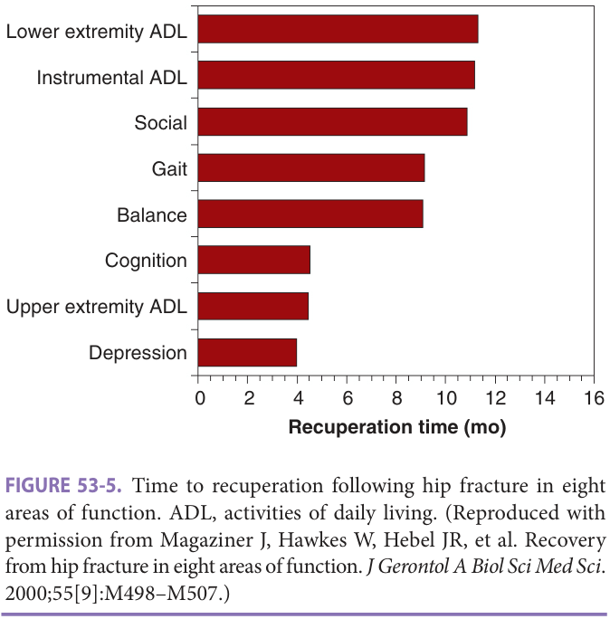

Study summary of Chapter 53; the book is the reference.

# Chapter 53 Study: Hip Fractures

**Study summary only - read the full chapter in the book, pp 793-804.**

Fast build from the book; not lane-reviewed.

## Summary

### Definition & epidemiology
- Osteoporosis and propensity to fall are prominent risks. Average age is **82**; approximately **18%** of women and **36%** of men die within the first postfracture year. (p. 793)

### Diagnosis & repair

- Painful, shortened, externally rotated leg is typical; nondisplaced fractures may still permit walking. Persistent suspicion with negative radiographs → MRI, more sensitive than CT. (p. 794)
- Displaced femoral-neck fractures threaten the head's blood supply and are usually treated with arthroplasty; intertrochanteric fractures have better blood supply and generally heal with internal fixation. (p. 794)

### Management & recovery

- Reconcile medications and individualize surgical decisions using prior function, cognition, comorbidities and goals. Nonsurgical care may suit selected patients with very high operative risk or very short life expectancy. (p. 797)
- Mobilize on the day of surgery if possible, certainly by postoperative day **1**; remove an inserted catheter the following morning. Monitor delirium, pulmonary complications and heart failure. (p. 797)

- Match rehabilitation to functional loss, ability to participate, endurance and home support. Acute rehabilitation requires at least **3 hours/day** and at least two therapy disciplines. (p. 800)

- Continue DVT prophylaxis for **21-31 days** after surgery. Up to **50%** of previously independent older adults may need walking aids at **1 year**. (p. 801)

### Drugs & prevention
- Individualize analgesia for sustained relief and therapy-related pain while minimizing sedation; the optimal regimen is not established here. A preoperative nerve block can reduce pain. (p. 797)
- Replete vitamin D before starting a bisphosphonate; check the level during admission if not measured recently. (p. 798)

### Exam traps
- Walking does not exclude a nondisplaced fracture. (p. 794)
- General versus spinal anesthesia: no mortality difference was found. (p. 797)
- Slow recovery warrants assessment for persistent delirium, depression, medication burden, nutritional deficiencies and isolation. (p. 800)

## Drill

**1. Which two underlying risks are emphasized for hip fracture?**

Answer
Osteoporosis and propensity to fall. (p. 793)

**2. How do the approximate first-year mortality estimates differ by sex?**

Answer
Approximately <strong>18%</strong> of women and <strong>36%</strong> of men are expected to die during the first year. (p. 793)

**3. Why can a patient with a fracture still walk?**

Answer
A small proportion have nondisplaced or hairline fractures and can bear weight with pain; an unrecognized fracture may displace. (p. 794)

**4. What imaging follows negative radiographs when fracture remains suspected?**

Answer
MRI to identify marrow edema and fracture; it is more sensitive than CT. (p. 794)

**5. Why is arthroplasty commonly used for displaced femoral-neck fractures?**

Answer
Disruption of the nearby retinacular arteries threatens head and neck perfusion, increasing nonunion and osteonecrosis risk. (p. 794)

**6. Why does internal fixation suit intertrochanteric fractures?**

Answer
The area's plentiful, redundant blood supply makes nonunion and osteonecrosis less common and supports healing after fixation. (p. 794)

**7. Is nonsurgical care excluded for every hip fracture?**

Answer
No. It may be considered for selected patients, including those with very high surgical risk, very short life expectancy, or advanced dementia with contractures; prior function and goals matter. (p. 797)

**8. What does the chapter report about mortality with general versus spinal anesthesia?**

Answer
No difference in mortality was found. (p. 797)

**9. When should mobilization and catheter removal occur?**

Answer
Mobilize on the day of surgery if possible, certainly by postoperative day <strong>1</strong>; remove an inserted catheter the morning after surgery. (p. 797)

**10. What balance should postoperative analgesia achieve?**

Answer
Sustained relief with minimal sedation, anticipating extra pain during activities such as therapy; the optimal medication regimen is not established. (p. 797)

**11. What should precede a bisphosphonate when vitamin D is deficient?**

Answer
Vitamin D repletion; check the level during admission if it was not measured recently. (p. 798)

**12. What nonmedical factors can determine safe discharge home?**

Answer
Home layout, social support, caregiver availability and resources, alongside mobility and self-care ability; a home assessment by therapy staff supplies essential information. (p. 798)

**13. What participation requirements distinguish acute inpatient rehabilitation?**

Answer
Ability to participate for at least <strong>3 hours/day</strong>, with at least two rehabilitation disciplines involved. (p. 800)

**14. What should be investigated when recovery is slower than expected?**

Answer
Persistent delirium, depression, polypharmacy, vitamin D or other nutritional deficiencies, and social isolation. (p. 800)

**15. How long does this chapter recommend continuing postoperative DVT prophylaxis?**

Answer
<strong>21-31 days</strong> after hip fracture surgery. (p. 801)

## Past-paper questions on this chapter

- [2023-Jun Q47 — mcq-78b3359272a717f584c23b2c](?chapter=bank&q=mcq-78b3359272a717f584c23b2c)
- [2024-May Q11 — mcq-a6c338a57828b765465f7cbf](?chapter=bank&q=mcq-a6c338a57828b765465f7cbf)
- [2024-May Q17 — mcq-72e468cf141dda15964157c9](?chapter=bank&q=mcq-72e468cf141dda15964157c9)
- [2024-May Q35 — mcq-d59bcda0cc381a35cc3134db](?chapter=bank&q=mcq-d59bcda0cc381a35cc3134db)
- [2025-Jun Q60 — mcq-10163f2b99f5abe875d7d917](?chapter=bank&q=mcq-10163f2b99f5abe875d7d917)

## Figure 53-5 ? book image

[2024-May Q17](?chapter=bank&q=mcq-72e468cf141dda15964157c9)
