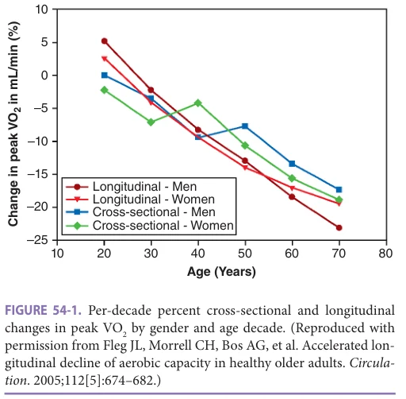
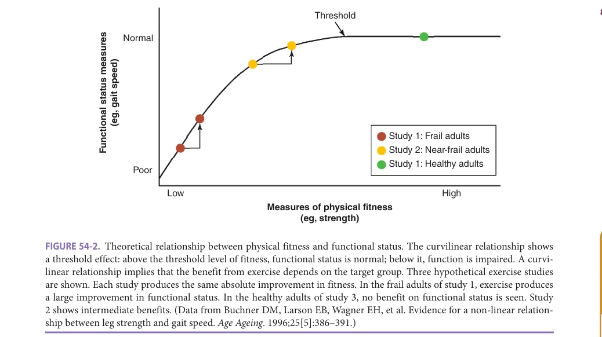
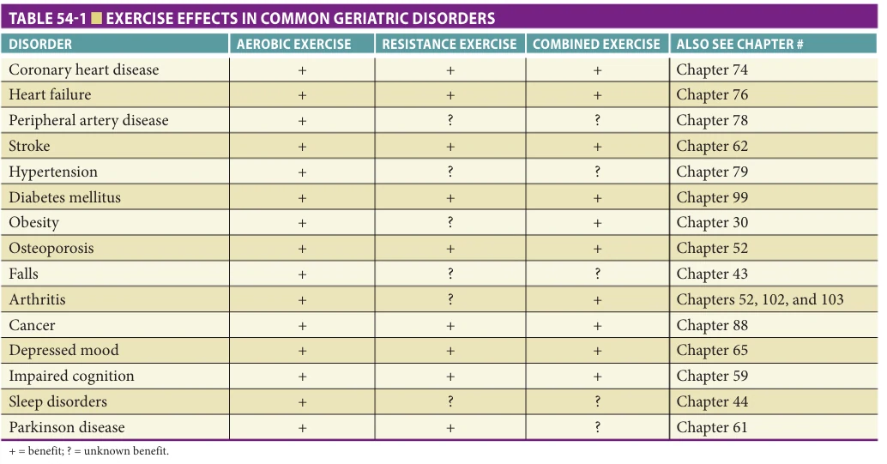
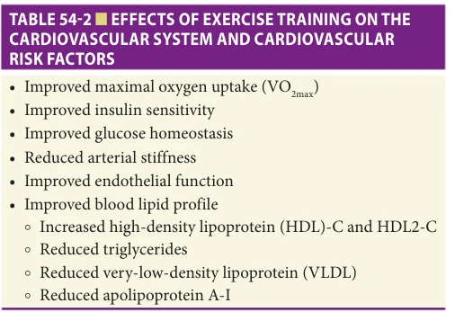
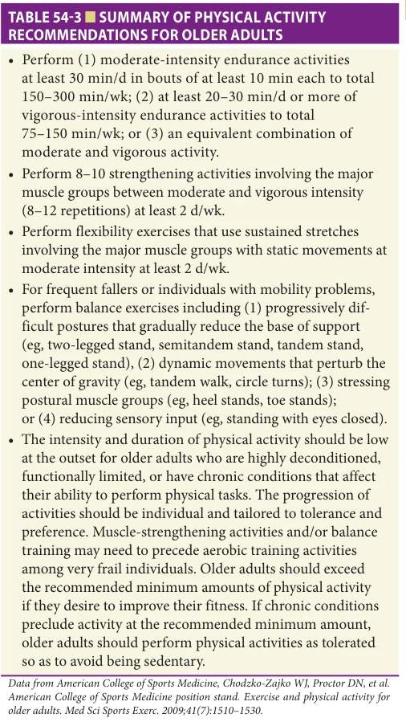

# Hazzard's Geriatric Medicine and Gerontology, 8e - Chapter 54: Therapeutic Exercise

Kerry L. Hildreth, Kathleen M. Gavin, Christine M. Swanson, Sarah J. Wherry, Kerrie L. Moreau

> **Status.** Fast build from the book; not lane-reviewed.

> Not cited in the 2020-2026 past papers.

> **Source and method.** Printed pages 805-816, from the marked 8th-edition copy (PDF page = printed page + 34). Prose follows its text layer; tables and figures are source-page crops. The book is canonical.

**[p. 805]**

## AGING AND BENEFITS OF EXERCISE

A common belief among the lay public, as well as among many health care professionals, is that much of the disease and functional decline that accompanies aging is inevitable, a result of the “aging process” itself. However, much of the physical decline and reduced physiologic reserve attributed to aging is, in fact, caused by complex interactions of disuse, environmental and lifestyle factors, disease, and genetics.

#### Learning Objectives

- Describe the changes in aerobic exercise capacity and in skeletal muscle strength and power that occur with aging.

- Describe the effects of aerobic and resistance exercise training on aerobic exercise capacity, skeletal muscle strength and power, and physical function in older adults.

- Describe the role of exercise in the prevention and treatment of common geriatric disorders.

#### Key Clinical Points

1. The physiologic responses to aerobic and resistance training on aerobic exercise capacity and muscle strength and power are preserved in older adults.

2. Because the relation between physiologic impairment and functional limitations is nonlinear, older adults with little or no physiologic reserve may realize large functional improvements with exercise.

3. Older adults can safely engage in even high-intensity exercise; exercise and physical activity recommendations should be specific and tailored to the individual to enhance long-term adherence.

Physical activity level and fitness are associated with a greater average lifespan and inversely related to the risk of mortality. Among adults older than 60 years, engaging in at least 150 minutes per week of moderate to vigorous physical activity is associated with a 28% reduction in allcause mortality. Even a modest dose of moderate to vigorous physical activity confers a mortality benefit compared to no activity. Higher cardiorespiratory fitness is associated with lower mortality, with a striking 80% reduction in mortality risk between elite performers (those > 2 standard deviations above the mean for age and sex) and the lowest performers.

With respect to resistance exercise, older adults performing guideline-concordant strength training had 46% lower odds of all-cause mortality than those who did not. A recent meta-analysis of more than 1400 studies reported that compared to no exercise, any resistance training was associated with 21% reduction in all-cause mortality. Combining resistance and aerobic exercise appears to confer even greater benefit than either alone. In the above meta-analysis, resistance exercise plus aerobic exercise was associated with a 40% reduction in all-cause mortality. Among older women, those who participated in both strength training and greater than or equal to 150 minutes per week of aerobic activity had a 46% lower risk of allcause mortality.

An inverse dose–response relationship has also been noted between physical activity and the risk of developing many chronic diseases, as discussed later in this chapter. Despite the overwhelming benefits of physical activity, only 35% of persons older than 60 years meet current recommendations for physical activity (these recommendations are included in Table 54-3, discussed later in this chapter); this percentage drops significantly in older age groups.

It is increasingly clear that many of the health benefits of exercise can be accrued simply through a more active (nonsedentary) lifestyle. This concept may be especially helpful in trying to encourage older individuals who feel they are unable or unwilling to engage in formal exercise training.

Sedentary behavior includes activities that require an energy expenditure of more than or equal to 1.5 times resting energy expenditure, and encompasses activities such as sitting, watching TV, using a computer, reclining, or lying down during waking hours. Objective measurements of sedentary time in the National Health and Nutrition Examination Survey (NHANES) indicate that adults aged 60 or older spend more time engaged in sedentary

**[p. 806]**

behaviors (8–9 hours per day, or 60% of their waking time) than any other segment of the population. In older adults, sedentary behavior is associated with an increased risk of sarcopenia and functional limitations, and inversely associated with physical function. Prolonged periods of sedentary behavior appear particularly deleterious, particularly for metabolic health. In older adults, the number of breaks in sedentary time is associated with higher levels of physical function, independent of moderate to vigorous physical activity. Changing sedentary behavior may have an immediate impact on the health of older adults. In one study, older adults who reduced their sedentary time over a 2-year period had a lower risk of all-cause mortality compared to those who either increased or did not change their sedentary time.

## AGING AND EXERCISE

### Aerobic Exercise Capacity

One of the key physiologic changes that occurs with aging and contributes to the decline in physical function is a decline in aerobic exercise capacity, best measured by the amount of oxygen consumed at maximal or peak exercise (maximal or peak aerobic power; VO2max or VO2peak). Longitudinal data indicate that the rate of decline in VO2peak accelerates markedly with each successive decade, reaching more than 20% per decade from the 1970s onward (Figure 54-1).

Age-associated declines in VO2max can be attributed to alterations in both central and peripheral determinants of exercise capacity. Reductions in maximal heart rate and in the maximal ability of muscle to extract oxygen from the blood, driven in large part by the age-associated loss of muscle mass, appear to contribute to declines in VO2 max in older adults (also see Chapter 73, The Aging Cardiovascular System). In all age groups, endurance-trained adults

*FIGURE 54-1. Per-decade percent cross-sectional and longitudinal changes in peak VO2 by gender and age decade. (Reproduced with permission from Fleg JL, Morrell CH, Bos AG, et al. Accelerated longitudinal decline of aerobic capacity in healthy older adults. Circulation. 2005;112[5]:674–682.)*

*Owner annotations/highlights are from the marked source copy, not the book.*

have a higher VO2 max than their age-matched sedentary peers, suggesting that participation in habitual aerobic exercise may attenuate the age-related decline in VO2 max.

Despite declines in VO2max with aging, the response to an aerobic exercise training program in previously sedentary, healthy older adults is comparable to that observed in younger subjects, with improvements mediated by both central and peripheral adaptations (also see Chapter 73). Improvement in VO2max has been reported to be between 6% and 30%, with significant improvements observed in as little as 3 weeks.

### Skeletal Muscle Strength and Power

Aging is associated with a significant loss in skeletal muscle mass, and consequently in muscle strength (maximum force exerted) and power (rate of force development) in men and women, independent of physical activity status. The loss in muscle strength also accelerates with advancing age; by age 80, strength is approximately 30% to 40% of peak. The rate of decline in muscle power, which is a stronger determinant of physical function in older age than muscle strength, appears to be even greater than the decline in strength. The loss of muscle strength and power is associated with both mortality and physical disability in older adults; however, both can be increased by improving muscular function (eg, muscle cell hypertrophy) or by improving neurological function (eg, learning).

To a large extent, the age-associated loss of muscle strength and power reflects loss of muscle mass. However, other factors are clearly involved. In the Health, Aging and Body Composition (Health ABC) Study, for example, the decline in muscle strength over 3 years was three times greater than the parallel rate of decline in muscle mass. Regular physical activity may prevent or attenuate some of the age-related loss in strength. Importantly, vigorous strengthening exercise can produce substantial gains in strength in older adults.

A primary mechanism for the effects of resistance exercise is muscle hypertrophy, and older adults appear to achieve increases in muscle fiber size and cross-sectional area comparable to those in younger adults. However, even modest increases in muscle fiber size or cross-sectional area are accompanied by proportionally greater increases in strength, again suggesting involvement of other mechanisms. Proposed mechanisms include learning effects from improvements in motor skill coordination, and neural adaptations such as increased voluntary muscle activation, reflecting recruitment, firing and synchronization of motor units, and better coordination of synergistic and antagonist muscle cocontraction.

### Nonlinear Relationship Between Physiologic Impairment and Functional Limitation

Healthy humans have excess physiologic capacity not tapped during most daily activities and can thus lose a fair amount of physiologic reserve before functional limitations occur.

**[p. 807]**

*FIGURE 54-2. Theoretical relationship between physical fitness and functional status. The curvilinear relationship shows a threshold effect: above the threshold level of fitness, functional status is normal; below it, function is impaired. A curvilinear relationship implies that the benefit from exercise depends on the target group. Three hypothetical exercise studies are shown. Each study produces the same absolute improvement in fitness. In the frail adults of study 1, exercise produces a large improvement in functional status. In the healthy adults of study 3, no benefit on functional status is seen. Study 2 shows intermediate benefits. (Data from Buchner DM, Larson EB, Wagner EH, et al. Evidence for a non-linear relationship between leg strength and gait speed. Age Ageing. 1996;25[5]:386–391.)*

*Owner annotations/highlights are from the marked source copy, not the book.*

Indeed, the relationship between leg strength and walking speed is nonlinear. This nonlinear relationship is intuitive: if strength was linearly related to walking speed, highly trained weightlifters would walk ridiculously fast (16–30 km/h) because they are several times as strong as normal adults, who walk at around 5–8 km/h. That is, above a certain threshold level of adequate physiologic reserve, function is normal; below the threshold, function is impaired (Figure 54-2). The exact shape of the curve depends on the task and the physiologic capacity of interest. Figure 54-2 may oversimplify the situation because most tasks have multiple physiologic determinants that may interact to affect behavioral ability.

To illustrate the concept of thresholds, consider that in steady-state measures of oxygen consumption, walking on a level grade at 5 km/h requires 3.2 METs (1 MET = 3.5 mL O2/kg/min). With illness or inactivity, aerobic capacity may fall below the 3.2 METs required for walking. Because exercise can increase aerobic capacity, it should improve walking in this situation. However, aerobic exercise would not affect ability to walk at 5 km/h in adults whose aerobic capacity already exceeds 3.2 METs.

Thus, exercise may produce a large improvement in function in frail adults with little or no physiologic reserve. Indeed, well-designed studies of exercise in frail adults report improvements in functional limitations with exercise. For example, the Lifestyle Interventions and Independence for Elders (LIFE) study of frail older adults (70–89 years) demonstrated that a structured, moderate-intensity physical activity intervention reduced the risk of mobility disability compared to a control health education program. The greatest risk reduction (HR = 0.75) was observed in older adults

with lower physical function at baseline, compared to those with moderate functional impairments at baseline (HR = 0.95). In contrast, exercise would be expected to have much smaller effects on functional limitations in healthy older adults, at least in basic activities of daily life.

## EXERCISE AND COMMON GERIATRIC DISORDERS

A number of common geriatric disorders can be improved with exercise, although many questions remain about the type and intensity of exercise, sex differences in response to exercise, and mechanisms underlying the benefits. Table 54-1 summarizes the current knowledge of the effects of different exercise modalities on several common geriatric disorders.

### Cardiovascular Diseases

Although the mortality rates attributable to cardiovascular diseases (CVD) have declined, CVD burden in older adults remains high. There is a consistent, independent inverse relationship between aerobic fitness and physical activity levels and CVD mortality. Both short bouts and longer continuous sessions of physical activity are equally effective for reducing coronary heart disease (CHD) risk, provided the total energy expended is similar. Although a dose response has been demonstrated in some studies, even low to moderate physical activity can reduce risk for CVD mortality, with no additional protection from participating in more vigorous activities.

In contrast to the overwhelming evidence of the benefit of aerobic exercise to reduce CVD risk, few data exist

**[p. 808]**

*TABLE 54-1 ■ EXERCISE EFFECTS IN COMMON GERIATRIC DISORDERS*

*Owner annotations/highlights are from the marked source copy, not the book.*

on the association between strength training and CVD risk. Strength training is generally associated with reduced CVD mortality; however, the relationship may be J-shaped, with low to moderate levels (1–50 minutes per week) associated with the lowest risk of CVD mortality.

Similar to physical activity, fitness has been reported as being at least as good a predictor of both overall and CVD-related death as blood pressure, obesity, smoking, or diabetes. Because of the reported benefit of increasing physical activity and fitness levels on CVD risk, aerobic exercise and strength training are typically prescribed for older adults with CVD as part of a comprehensive cardiac rehabilitation program to increase aerobic capacity, improve CVD risk factors, prevent disease progression, and reduce the risk for future cardiovascular events and death. In fact, individuals with stable coronary artery disease randomized to exercise training improved their aerobic capacity and had a higher event-free survival (reduced repeat revascularization and hospitalizations) than those receiving percutaneous coronary intervention.

Both aerobic exercise and strength training improve aerobic exercise capacity to a similar degree in patients with CHD, and the improvements are enhanced when the two exercise modalities are combined. Aerobic exercise and strength training are also beneficial in improving exercise tolerance and quality of life in other CVD patient populations including heart failure (see Chapter 76) and peripheral arterial disease (PAD, see Chapter 78). Supervised aerobic exercise training is associated with reduced mortality (35%) and hospital readmission (28%) in patients with chronic heart failure. In patients with PAD, any physical activity greater than light intensity is associated with reduced mortality compared to no physical activity or only

light-intensity activities. Because walking is effective in improving absolute claudication distance (ACD), guidelines recommend that individuals with PAD participate in a supervised walking program that gradually increases speed and distance as an initial noninvasive approach, using walking claudication pain—either onset of pain, or mild to moderate or maximal level tolerable—for prescribing exercise intensity. Other modes of exercise also improve ACD. However, the data are insufficient, particularly with regard to resistance training, to make any clinical recommendations. Thus, there is a need for further definitive, large clinical trials of alternative or complementary exercise interventions for PAD in older adults.

Exercise training programs in CVD patients have numerous physiologic effects on the cardiovascular system and CVD risk factors (Table 54-2). Improvements in VO2max of 15% to 25% are driven by either central

*TABLE 54-2 ■ EFFECTS OF EXERCISE TRAINING ON THE CARDIOVASCULAR SYSTEM AND CARDIOVASCULAR RISK FACTORS*

*Owner annotations/highlights are from the marked source copy, not the book.*

**[p. 809]**

(ie, improved myocardial oxygenation, enhanced left ventricular function) and/or peripheral adaptations, depending on the population. For example, in coronary artery disease (CAD) and heart failure patients, those with depressed left ventricular function may not show cardiac adaptations, but rather, the improvements in VO2max are largely attributed to improvements in maximal arteriovenous oxygen difference due to improved mitochondrial oxidative enzymatic capacity.

In addition to improving multiple CVD risk factors, exercise training programs reduce arterial stiffness and improve vascular endothelial function in patients with CVD, measures that are important for overall vascular homeostasis. In general, aerobic exercise training programs improve vascular function in older adults independent of disease state. However, there are noted sex differences between the magnitude of improvement with exercise training, with near restoration of endothelial function to youthful levels in healthy older men, but attenuated or minimal improvements in postmenopausal women not on estrogen-based hormone therapy. Exercise training may also increase circulating bone marrow derived endothelial progenitor cells (EPCs) and improve EPC function. EPCs facilitate vascular repair and vasculogenesis, and are reduced in CVD patients. Other potential mechanisms of exercise training on CVD could be related to regression of coronary artery stenosis and formation of collateral vessels, resulting in enhanced myocardial perfusion.

The benefits of exercise on CVD risk are thought to be due at least in part to improvements in lipid profiles. Higher levels of physical activity are associated with less atherogenic lipoprotein profiles in young and middle-aged individuals, although data in older adults are lacking. There is no consistent effect of resistance training on lipoproteins.

Although exercise training is beneficial overall for CVD patients, there are a few conditions in which exercise may not be as beneficial and actually contraindicated. These conditions include unstable angina, uncontrolled hypertension, uncontrolled cardiac arrhythmias, recent myocardial infarction, severe aortic stenosis and other valvular diseases, acute pericarditis, and decompensated heart failure.

### Hypertension

Hypertension is covered in Chapter 79. Over 80% of adults age 60 or older with hypertension are treated with antihypertensive therapies, and more than 30% of hypertensive adults age 80 or older are taking three or more classes of antihypertensive medications. Although antihypertensive medications produce long-term benefit, these medications can have numerous side effects, especially in older patients. Thus, using nonpharmacologic treatments (eg, weight loss, low-sodium diet, and exercise) is appealing, especially in older adults with mild to moderate hypertension.

Both leisure-time activity and aerobic exercise capacity (ie, VO2max) are inversely related to risk for hypertension, with the lowest risk for hypertension in the most

active and fit people. Hypertensive older Swedish men (born in 1914) who regularly exercised vigorously had an adjusted relative risk of 0.43 for total mortality and 0.33 for cardiovascular mortality. Given the apparent benefits of increased physical activity on aerobic exercise capacity and reduced hypertension risk, the Eighth Report of the Joint National Committee on Prevention, Detection, Evaluation, and Treatment of High Blood Pressure (JNC 8) recommends increased physical activity designed to enhance aerobic exercise capacity as initial therapy to prevent, treat, and control hypertension.

Aerobic exercise training programs effectively lower blood pressure in older adults with mild to moderate hypertension. Overall, aerobic exercise training programs or increasing physical activity of moderate intensity and of adequate volume result in a 4 to 10 mm Hg decline in systolic blood pressure and a 3 to 8 mm Hg decline in diastolic blood pressure in individuals with stage 1 hypertension, regardless of age or sex. The effects of aerobic exercise training in older adults with stage 2 hypertension, or those with resistant hypertension are less clear. In resistant hypertension, moderate-intensity exercise training reduced 24-hour ambulatory blood pressure similarly to that reported for mild to moderate hypertensives. Although there are limited data comparing different exercise intensities, low- to moderate-intensity exercise may be more effective at lowering blood pressure than more vigorous exercise. Indeed, even light Tai chi exercise or increasing daily walking can reduce and even normalize blood pressure in sedentary older hypertensive patients.

There is limited and inconsistent data on the effect of strength training on blood pressure in older hypertensive adults. Excessive blood pressure elevations can occur during high-intensity resistance training, especially if associated with Valsalva. However, with low- to moderate-intensity strength training and proper breathing techniques, this is not a concern. Overall, progressive resistance training results in a 3 mm Hg decrease in both systolic and diastolic blood pressure. However, the effect of resistance training on systolic blood pressure in adults older than 50 years and on systolic and diastolic blood pressures in hypertensives is less and not significant. Given the small number of studies available in hypertensive older adults, additional research is warranted to provide recommendations on the effect of resistance training for blood pressure reduction in hypertensive older adults.

The mechanisms underlying the blood pressure lowering effects of exercise in hypertensive adults are not completely understood, although changes in body composition, sympathetic nervous system activity, peripheral vascular resistance, and insulin levels have all been postulated. For example, weight loss alone or combined with exercise provides a greater blood pressure lowering effect than exercise alone. Aerobic exercise training decreases arterial stiffness and improves endothelial function in hypertensive adults. However, whether the decreases in blood pressure with

**[p. 810]**

exercise are due to improvements in arterial stiffness and endothelial function, or vice versa, are unclear.

### Obesity

As described in Chapter 30, obesity is associated with increased morbidity and mortality from multiple medical complications, and has been consistently correlated with mobility impairment and poor physical function, especially in older adults. While weight loss alone can improve cardiometabolic risk factors, fitness, function, and quality of life in obese older adults, it is also associated with loss of fat-free mass (FFM) and decreases in bone mineral density (BMD). Given these potential harms, there is general agreement that exercise should be a component of any weight loss intervention, in order to minimize loss of muscle and bone with weight loss in older obese adults.

Diet plus exercise interventions improve multiple cardiometabolic and functional outcomes in older adults, although effects on cardiovascular events or mortality have not been demonstrated yet. For example, the Diabetes Prevention Program (DPP) lifestyle intervention of moderate-intensity exercise and modest weight loss (7%) was very effective in preventing progression to diabetes in older (60–85 years) participants. Compared to younger people in the DPP, older participants had greater reductions in waist circumference, lost more weight, and were more likely to achieve the goal of at least 150 minutes of exercise per week.

A randomized, controlled trial by Villareal et al. provides the most compelling evidence for including exercise in any weight loss intervention in older obese adults. They compared 52 weeks of weight loss diet, exercise (aerobic and strength training), or both in more than 100 older obese adults with mild to moderate functional impairment. Participants receiving the diet intervention lost weight, whereas weight remained stable in the exercise only group. Physical and metabolic function improved in all groups, but was greatest in the diet plus exercise group. The expected decreases in FFM and BMD with weight loss were attenuated in the diet plus exercise group, but not completely reversed. Because the negative effects of weight loss on body composition and BMD in older obese adults are not fully offset by exercise, an important question is whether weight loss per se is necessary, or whether exercise alone can confer most of the benefits without the associated risks of weight loss in this population.

### Osteoporosis

The decline in BMD with age is well recognized (see Chapter 51), and there is an epidemic of osteoporotic fractures that affects women more than men and that primarily involves hip, vertebral, and wrist fractures. Mechanical loads are critical to skeletal integrity. Animal studies confirm the importance of mechanical strain to bone modeling and remodeling. They have also identified that (1) the osteogenic response to mechanical loading is optimized with relatively few repetitions of high-magnitude forces; (2) the

application of force must be in a dynamic, rather than static, fashion; and (3) fast strain rates are more osteogenic than slow strain rates. Furthermore, the osteogenic response to mechanical loading is mediated locally in skeletal regions subjected to the strain, highlighting the need for exercises to specifically target regions of the skeleton at risk of fracture. It appears that bone cells lose sensitivity to mechanical loading after relatively few loading cycles. For example, four sets of 90 load applications per day were more osteogenic than one set of 360 loading cycles, and interposing an 8-hour recovery period between loading sessions resulted in a greater osteogenic response than when the recovery period was 0.5 hour. These concepts have not been rigorously evaluated in humans, but they suggest that multiple short bouts of exercise per day may be more effective in preserving bone health than a single, longer daily session. The concept of allowing bone to “rest” between loading cycles may also have implications for resistance training. For example, if the intent is to perform three sets of eight repetitions of several exercises, it might be of greater benefit to bone to perform one set of each exercise and then cycle back through for the second and third sets, rather than doing three consecutive sets of each exercise.

The effects of exercise on bone mass have been estimated by comparing athletes who participate in different sports or physically active versus sedentary people. For example, the humerus in the dominant arm of tennis players had approximately 30% greater cortical bone thickness when compared to the nondominant arm. Athletes who participate in muscle-building activities (eg, weight lifting and body building) and in activities that involve jumping or vaulting (eg, volleyball and gymnastics) also tend to have elevated BMD. These data suggest that exercise in younger individuals may increase peak bone mass—an important protective factor for reducing osteopenia later in life. In contrast, the primary benefit of physical activity in older adults may be to preserve, rather than increase, bone mass.

Although both weight-bearing aerobic exercise and resistance exercise can increase bone mass in older women and men, increases in BMD appear to require a vigorous level of exercise, which supports the contention that the osteogenic response to exercise is attenuated with aging. In postmenopausal women, exercise may increase BMD by up to 5%, as compared to no-exercise controls, but average increases generally are only 1% to 3%. These modest increases may reflect difficulty reaching the strain threshold needed for bone remodeling to occur due to decreased muscle mass and strength, declines in hormones and growth factors that affect the sensitivity of bone to strain, and/or insufficient calcium and vitamin D.

There is also evidence that exercise can prevent fractures. Results from prospective cohort studies, such as the Nurses’ Health Study and the Study of Osteoporotic Fractures, suggest that the risk for hip fracture is reduced by approximately 50% in the most physically active quintile of the population. In evaluating the potential benefit of

**[p. 811]**

simple walking activity, the Nurses’ Health Study found a dose-response benefit for both duration and speed of walking, such that more hours per week spent walking and fast walking speed conferred reduced fracture risk. Even hours per week spent standing was inversely related to hip fracture incidence. Perhaps most importantly, changes in physical activity for several years were related to hip fracture incidence in the expected manner: decreases in physical activity were associated increased risk and vice versa. Such findings suggest that any type of ambulatory physical activity may confer skeletal benefits and that increased physical activity should be advocated at any age as a strategy to reduce fracture risk.

The low frequency of fractures makes well-designed, adequately powered randomized controlled trials extremely expensive. Very few exercise trials have included fractures as an outcome, or reported fractures as an observation. Analysis of 11 exercise intervention studies that reported fractures found that exercise reduced the risk of overall fracture by approximately 50% and vertebral fracture by approximately 40% compared to controls, although the authors urged caution due to the strong likelihood of publication bias. The Erlangen Fitness and Osteoporosis Prevention Study compared fracture incidence among 137 postmenopausal osteopenic women either participating in a supervised exercise intervention (two group and two home sessions per week), or a sedentary control group for 12 years. Although fewer fractures occurred in the exercise group, the difference between groups did not reach statistical significance.

Important areas for future research include determining the effects of age and sex in the response of bone to exercise. In addition, new methods such as peripheral quantitative computed tomography may provide important information on bone quality (eg, strength and geometry) in response to exercise.

### Cancer

Cohort and case control studies consistently support an inverse relation between physical activity and overall cancer incidence and mortality. The effects appear to be stronger in men than in women, but many studies excluded women. Overall, occupational and leisure physical activities were associated with a 30% independent protective effect on overall cancer risk in men, and men who engaged in regular vigorous activities had a 20% reduction in cancer risk compared to sedentary men. Analysis of more than 15,000 cancer deaths over 12 years in the NIH-AARP Diet and Health Study found that compared to those who reported rarely or never engaging in moderate to vigorous physical activity, those who reported more than 7 hours/week had a lower risk of cancer mortality (HR = 0.89).

In persons diagnosed with cancer, exercise is associated with improved surgical outcomes, decreased symptoms and side effects of treatment, and improved physical function and psychological health. Participation in exercise post cancer diagnosis has been estimated to increase cancer survivorship by 50% to 60%.

To date, the most compelling data involve the relationship between activity and risk of colon or breast cancer. A reduced risk of colon cancer (relative risk, 0.4–0.9) has been found in groups with high physical activity levels compared to those with low levels. In general, controlling for other cancer risks including tobacco, alcohol, age, obesity, and diet does not diminish the relationships, and this finding has been demonstrated in men and women of different racial and ethnic groups. Among patients with colon cancer, any prediagnosis physical activity was associated with a 25% reduction in colon-cancer mortality, and a 26% reduction in all-cause mortality compared to patients who reported no physical activity prior to diagnosis. Moderate to high levels of postdiagnosis physical activity were also associated with reductions in all-cause mortality ranging from 24% to 39%.

Physical activity reduces the risk of breast cancer overall by 15% to 20%. The strongest effect appears to be in postmenopausal breast cancer, where the risk reduction ranges from 20% to 80% when comparing the most active to the least active groups. These associations remain even after adjusting for potential confounding factors such as age, body mass index (BMI), reproductive history, tobacco use, and diet. There appears to be a dose response, with higher levels of activity associated with greater risk reduction. As with colon cancer, exercise in breast cancer patients is associated with better physical function and fewer treatment-related side effects.

### Depressed Mood

Subjects who exercise regularly consistently report an improved sense of well-being and reduced tension and anxiety. Large epidemiological studies have demonstrated an association between low levels of physical activity and depressive symptoms. These studies have also shown physical activity to be an independent predictor of the development of depressive symptoms. In the National Health and Nutrition Education Survey I Epidemiologic Follow-Up Study, low levels of physical activity predicted depressive symptoms 8 years later in White women, with those reporting little to no physical activity twice as likely to develop depressive symptoms as those reporting moderate to high levels.

As for treatment for clinical depression, structured, mixed exercise programs result in a modest reduction in symptom severity. The effects of exercise appear to be comparable to those of behavioral or pharmacologic therapy. Proposed mechanisms for the effects of exercise on mood include increases in endorphin and monoamine levels, as well as social engagement and improvements in self-efficacy and self-esteem.

### Impaired Cognition

There may be a positive effect of exercise on cognition. Numerous cross-sectional and longitudinal studies including the Nurse’s Health Study and the Mayo Clinic Study

**[p. 812]**

on Aging have found an association between higher levels of physical activity and both better cognitive test scores and reduced risk of cognitive impairment and dementia. Among 1200 older adults in the Framingham Study, a hazard ratio of 0.55 was found for incident all-cause dementia after 10 years of follow-up in participants reporting moderate to heavy physical activity compared to less active participants. Among those in the lowest quintile of physical activity, the hazard ratio for incident dementia was 1.45.

Results from exercise intervention studies have been mixed, although the balance of evidence supports moderate positive effects of exercise training on cognition in both cognitively normal and cognitively impaired individuals. In older adults without known cognitive impairment, 8 of 11 studies using aerobic exercise interventions found positive effects on cognitive function that coincided with improvements in maximal oxygen uptake (VO2max). A meta-analysis of 16 trials in older patients with dementia found a significant positive effect on cognitive function with exercise training, although the authors emphasized caution given the substantial heterogeneity between trials.

Some studies have also reported cognitive benefits with resistance training alone, but the greatest cognitive effects were observed with mixed training paradigms. Exercise appears to improve function in multiple cognitive domains, with the strongest effects in executive control functions. Important areas for further study include determining the duration and intensity of exercise needed to realize cognitive benefits, and potential sex differences in the cognitive responses to exercise.

The bases for the exercise-associated improvements in cognition are presently an active area of investigation. Animal studies support a neuroprotective effect of exercise through promotion of neuroplasticity, increases in brainderived neurotrophic factor and enhanced neurogenesis.

### Sleep Disorders

Age effects on sleep and sleep disorders are covered in Chapter 44. Physical activity and regular exercise are beneficial for sleep in older adults. Higher levels of cardiorespiratory fitness and physical activity in older adults are associated with better self-reported sleep quality. For instance, objectively measured indices of sleep quality (eg, sleep onset latency, wake time after sleep onset, sleep efficiency) are better in physically fit older men compared to sedentary controls, and higher levels of physical activity are protective against insomnia in older adults. Although few longitudinal exercise studies have specifically focused on older adults, a systematic review and meta-analysis of six studies in adults older than 40 years demonstrated that 10 to 16 weeks of aerobic exercise has positive effects on self-reported sleep quality measured using the Pittsburgh Sleep Quality Index.

It appears that slow wave sleep (SWS), which plays a role in the restorative functions of sleep, is particularly sensitive to exercise training. Older physically fit men have

more SWS than sedentary older men, and exercise training increases SWS in older men and women. One longer-term study (12 months) demonstrated that in older adults with mild to moderate sleep problems, exercise was associated with decreases in stage 1 sleep, increases in stage 2 sleep, and fewer awakenings.

There remain many questions regarding the effects of exercise on sleep in older adults. For example, most studies in older adults have examined the effects of aerobic training, but at least one study has shown that progressive resistance training can improve subjective measures of sleep quality. It is not known if aerobic, resistance, or a combination is most effective for improving sleep. The effects of exercise intensity have not been established, but lower intensity activities such as yoga and Tai chi also improve self-reported measures of sleep quality. Similarly, lower-intensity exercise (eg, stretching and flexibility) was associated with greater improvements in self-reported sleep quality than higherintensity exercise performed at 60% to 75% of maximal heart rate. The effects of frequency of exercise have also not been defined, but a study in older men (~64 years) showed that after a 16-week exercise training period, SWS increased on a day when exercise was performed, but not on a sedentary day. These findings suggest that physical activity should be done on most days of the week to maximize the benefits on sleep. Whether exercise has different effects in men and women is not known.

It should also be recognized that there may be a reciprocal relationship: poor sleep is associated with lower levels of physical activity. For example, in sample of subjects from the Healthy Women Study (~73 years), greater self-reported sleep efficiency and less sleep fragmentation were associated with higher physical activity levels the following day. Thus, there appears to be a circular association whereby increased physical activity improves sleep, and improved sleep facilitates greater physical activity levels.

### Parkinson Disease

Exercise is associated with reduced mortality rate and with improvements in functional mobility and activities of daily living in individuals with Parkinson disease (see Chapter 61). Though data are limited, controlled trials of both resistance and aerobic training in individuals with Parkinson disease have demonstrated improvements in mobility, gait, and quality of life. The intensity of exercise required to realize benefits in Parkinson disease is an area of active investigation, as some studies have found greater improvements with a higher dose of exercise, while others have not.

Despite impaired force production and increased fatigability, individuals with Parkinson disease are able to participate safely and effectively in high-intensity resistance exercise, and appear to derive benefits similar to those in neurologically healthy adults. In one study, 12 weeks of high-force eccentric resistance training in adults with Parkinson disease was associated with a 6% increase in muscle hypertrophy, a 24% increase in torque, and an 18% improvement in 6-minute walk

**[p. 813]**

time compared to a standard exercise program. Aerobic exercise interventions—mainly treadmill exercise—consistently improve gait, mobility, and quality of life.

### Stroke

Stroke is a leading cause of disability in older adults, with 20% to 25% of stroke survivors requiring at least some assistance with activities of daily living (see Chapter 62). These functional deficits predispose patients to a sedentary lifestyle, further increasing the risk of stroke and CVD, the leading causes of death among stroke survivors. Physical rehabilitation in stroke patients has traditionally focused on the first few months after the event, as prevailing wisdom held that further functional improvements were unlikely after this time. However, improvements in aerobic capacity and sensorimotor function can be achieved with continued rehabilitation. Physical activity and exercise recommendations for stroke survivors from the American Heart Association identify three primary goals: (1) preventing complications from prolonged inactivity; (2) decreasing the risk of recurrent stroke and cardiovascular events; and (3) increasing aerobic fitness. Specific recommendations for aerobic exercise and strength training are similar to those recommended for all adults. In addition, incorporation of stretching and balance/coordination activities is recommended to prevent muscle contractures, and to improve the ability to safely perform activities of daily living.

## RISKS ASSOCIATED WITH EXERCISE

Despite the overwhelming evidence that exercise confers multiple benefits and can be performed safely even in frail older adults, concerns about potential injury and other adverse events are common among patients and health care providers. These fears may prevent patients from engaging in the amount and intensity of exercise needed to realize health benefits, thus presenting a potential barrier to increasing physical activity levels.

“Overuse” injuries involving soft tissues are by far the most common and are likely to increase with advancing age. Eccentric exercise (eg, lowering a weight that has been lifted) may predispose to excess muscle injury. Appropriate warm-up and cool-down periods, as well as emphasis on stretching and flexibility, are likely to be especially important in reducing soft-tissue injury in an older population.

The prevalence of asymptomatic coronary artery disease is higher in older compared to younger adults, and there is a transient increase in the risk of sudden death occurring during a bout of vigorous exercise, especially in previously sedentary individuals. However, the small increased risk of a cardiovascular event with exercise is clearly outweighed by the reduction in risk during the nonexercising period of the day. Thus, the overall risk of sudden death in active men is only 30% of that in sedentary men. Furthermore, there is lower cardiovascular-related and overall mortality in active individuals.

In older patients with diabetes mellitus, careful attention to the possibility of exercise-induced hypoglycemia is critical because of the sustained improvement in insulin sensitivity for 24 to 48 hours following vigorous exercise. Meticulous foot care and supportive, well-fitted shoes are also important for the exercising diabetic patient. Patients with proliferative retinopathy should avoid anaerobic (specifically isometric) exercise, such as power lifting, because of the increased ocular and systemic pressure occurring with the Valsalva maneuver.

In the past, a pre-exercise assessment, including a complete history and physical examination, and an exercise stress test were recommended for adults older than 60 before vigorous exercise. Such an evaluation is expensive and could present a significant barrier to exercise. Furthermore, there are little data to substantiate this recommendation. Current recommendations suggest that asymptomatic individuals who plan to exercise at moderate intensity do

*TABLE 54-3 ■ SUMMARY OF PHYSICAL ACTIVITY RECOMMENDATIONS FOR OLDER ADULTS*

*Owner annotations/highlights are from the marked source copy, not the book.*

**[p. 814]**

not need screening before initiating an activity program. The geriatric medicine axiom of “start low and go slow” should be applied to beginning a safe physical activity program. It is appropriate for patients to notify their health care providers of their intent to begin an exercise program, because adjustments in medications or dosages may be necessary. The health care provider can also work with the individual to tailor the exercise program to the individual’s abilities and be a source of ongoing support and encouragement.

## RECOMMENDATIONS

There is now ample evidence that older adults can safely engage in both aerobic and resistance exercise training, and that exercise has beneficial effects on numerous important health-related end points in this population. Despite these acknowledged benefits, older adults are the least physically active age group. Potential barriers to exercise in older adults include perceptions of safety, chronic conditions and physical limitations, and access to exercise programs or facilities.

Consensus recommendations for physical activity in older adults are summarized in Table 54-3 and were updated in 2018 by the Department of Health and Human Services (DHHS) in the Physical Activity Guidelines for Americans, 2nd edition. The DHHS guidelines stress the importance of avoiding sedentary behavior, and that any amount of physical activity provides some health benefits. The specific modifications for older adults include: (1) being as physically active as their conditions allow if the target of 150 min/week is not possible because of chronic conditions; (2) engaging in balance exercises for individuals at risk of falling; (3) determining the level of effort for physical activity relative to level of fitness; and (4) understanding how chronic conditions may affect the ability to safely engage in regular physical activity. Key to recommendations for exercise in older adults is the need to individualize the program of physical activity. While there is a dose-response relationship between the intensity of exercise and the

improvement in most outcome measures, significant cardiovascular and metabolic improvements can be obtained when less intense exercise is maintained over sufficiently long periods of time. Less intense exercise regimens may be more acceptable to some older individuals and appear to make long-term compliance more likely. Low-intensity programs may be necessary in frail populations, such as those with stroke, heart failure, and chronic lung disease, in which more intensive exercise is not tolerated. While multiple short bouts of exercise (at least 10 minutes each) may be effective in improving certain outcome measures, longer sessions remain preferable if these can be tolerated.

Because the physical activity goals may seem daunting, especially for inactive older adults, specific instructions are more helpful than general advice to “increase physical activity.” Provision of written exercise prescriptions from health care providers increases activity levels among previously sedentary adults. In addition, an increasing array of technologies allows individuals to set activity goals and to monitor and track activity in real time.

Changes in lifestyle are difficult to maintain at any age, and recidivism rates for exercise programs are high. This problem may be reduced by: (1) careful attention to warm-up periods and slow progression in an effort to reduce early injuries; (2) enthusiastic leadership; (3) regular assessment of improvement with personalized feedback and praise; (4) spousal and family support for participation; (5) flexible goals (time rather than distance) set by the participant; and (6) use of distraction techniques such as music.

## ACKNOWLEDGMENTS

Dr. Robert Schwartz and Dr. Wendy Kohrt wrote this chapter in the 6th edition, and Dr. Edward Melanson contributed to the 7th edition chapter. Some material from the previous versions has been retained in this edition. The authors also gratefully acknowledge the advice and encouragement of Drs. Schwartz and Kohrt in the preparation of this chapter.

## FURTHER READING

Billinger S, Arena R, Bernhardt J, et al. Physical activity and

exercise recommendations for stroke survivors. A statement for healthcare professionals from the American Heart Association/American Stroke Association. Stroke. 2014;45(8):2532–2553. Bottaro M, Machado SN, Nogueira W, Scales R, Veloso J.

Effect of high versus low-velocity resistance training on muscular fitness and functional performance in older men. Eur J Appl Physiol. 2007;99:257–264.

Chodzko-Zajko WJ, Proctor DN, Fiatarone Singh MA,

et al. Exercise and physical activity for older adults. Med Sci Sports Exerc. 2009;41(7):1510–1530. Diabetes Prevention Program Group. Reduction in the

incidence of type 2 diabetes with lifestyle intervention or metformin. N Engl J Med. 2002;346:393–403. Feskanich D, Willett W, Colditz G. Walking and leisure-

time activity and risk of hip fracture in postmenopausal women. JAMA. 2002;288:2300–2306.

**[p. 815]**

Hollings M, Mavros Y, Freeston J, Singh MF. The effect of

progressive resistance training on aerobic fitness and strength in adults with coronary heart disease: a systematic review and meta-analysis of randomised controlled trials. Eur J Prev Cardiol. 2017;24(12):1242–1259. Hupin D, Roche F, Gremeaux V, et al. Even a low-dose of

moderate-to-vigorous physical activity reduces mortality by 22% in adults aged ≥60 years: a systematic review and meta-analysis. Br J Sports Med. 2015;49:1262–1267. Kesaniemi YK, Danforth E Jr, Jensen MD, Kopelman PG,

Lefebvre P, Reeder BA. Dose-response issues concerning physical activity and health: and evidence-based symposium. Med Sci Sports Exerc. 2001;33:S351–S358. Kohrt WM, Bloomfield SA, Little KD, Nelson ME,

Yingling VR. American College of Sports Medicine Position Stand: physical activity and bone health. Med Sci Sports Exerc. 2004;36:1985–1996. Kramer AF, Erickson KI, Colcombe SJ. Exercise, cognition,

and the aging brain. J Appl Physiol. 2006;101:1237–1242. Kraschnewski JL, Sciamanna CN, Poger JM, et al. Is

strength training associated with mortality benefits? A 15 year cohort study of US older adults. Prev Med. 2016:87;121–127. Latham NK, Bennett DA, Stretton CM, Anderson CS.

Systematic review of progressive resistance strength training in older adults. J Gerontol A Biol Sci Med Sci. 2004;59A:48–61. Orchard TJ, Temprosa M, Goldberg R, et al. The effect of

metformin and intensive lifestyle intervention on metabolic syndrome: the Diabetes Prevention Program randomized trial. Ann Intern Med. 2005;142:611–619.

Pahor M, Guralnik JM, Ambrosius WT, et al. Effect of struc-

tured physical activity on prevention of major mobility disability in older adults: the LIFE study randomized clinical trial. JAMA. 2014;311:2387–2396. Rejeski WJ, Bray GA, Chen SH, et al. Aging and physical

function in type 2 diabetes: 8 years of an intensive lifestyle intervention. J Gerontol A Biol Sci Med Sci. 2015;70(3): 345–353. Tanaka H, Seals DR. Endurance exercise performance in

masters athletes: age-associated changes and underlying physiologic mechanisms. J Physiol. 2008;586(1):55–63. US Department of Health and Human Services. Physical

Activity Guidelines for Americans, 2nd edition. Washington, DC: US Department of Health and Human Services; 2018. Villareal DT, Chode S, Parimi N, et al. Weight loss, exer-

cise, or both and physical function in obese older adults. N Engl J Med. 2011;364:1218–1229. von Stengel S, Kemmler W, Kalender WA, Engelke K,

Lauber D. Differential effects of strength versus power training on bone mineral density in postmenopausal women: a two year longitudinal study. Br J Sports Med. 2007;41:649–655. Williams MA, Haskell WL, Ades PA, et al. Resistance exer-

cise in individuals with and without cardiovascular disease: 2007 update. Circulation. 2007;116:572–584. Zoico E, Di Francesco V, Guralnik JM, et al. Physical dis-

ability and muscular strength in relation to obesity and different body composition indexes in a sample of healthy elderly women. Int J Obes Relat Metab Disord. 2004;28:234–241.

**[p. 816]**
