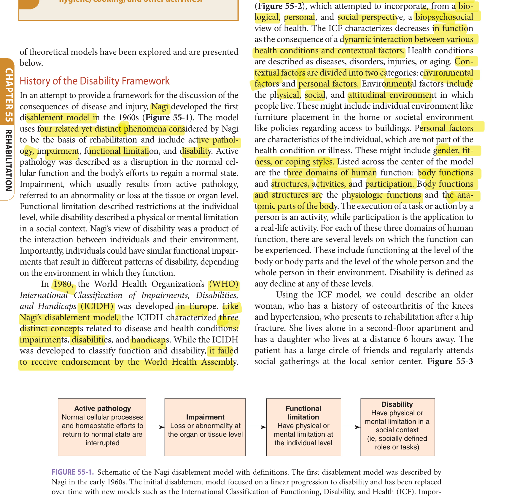
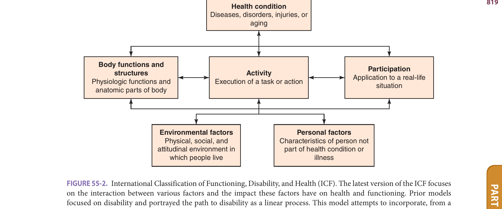
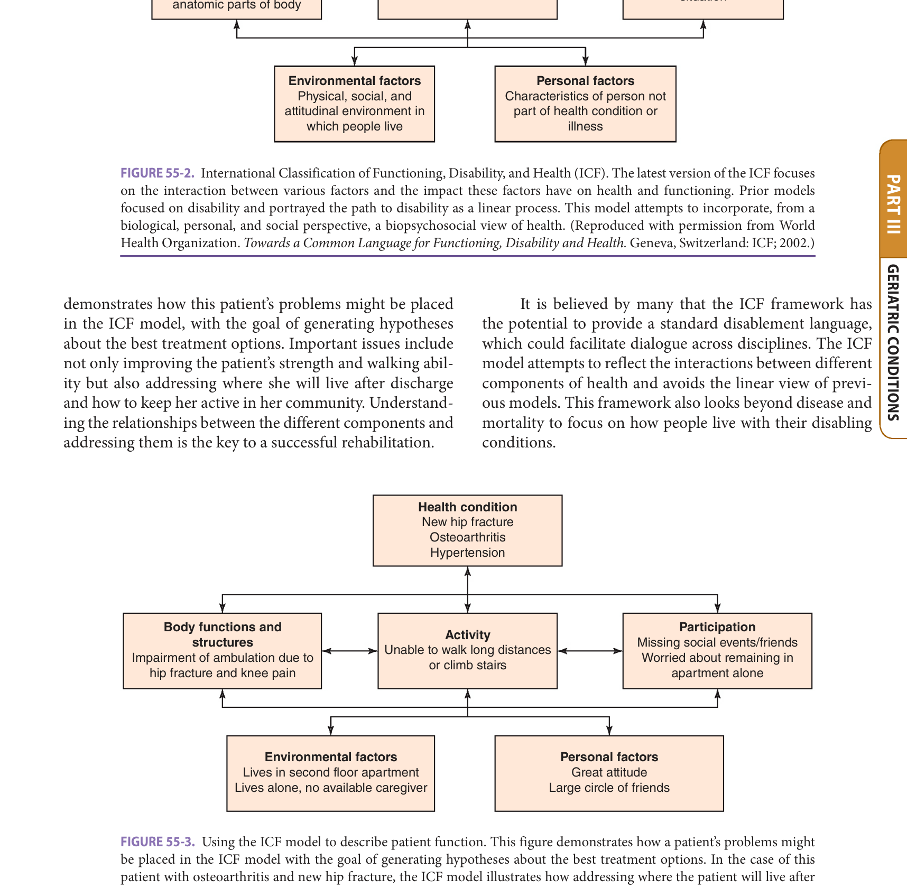
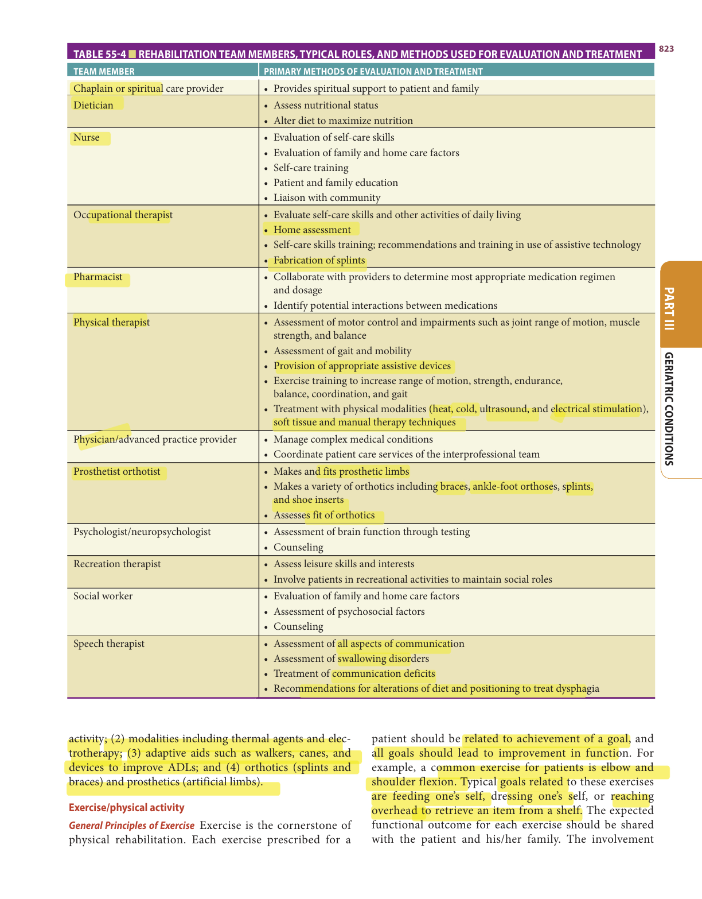
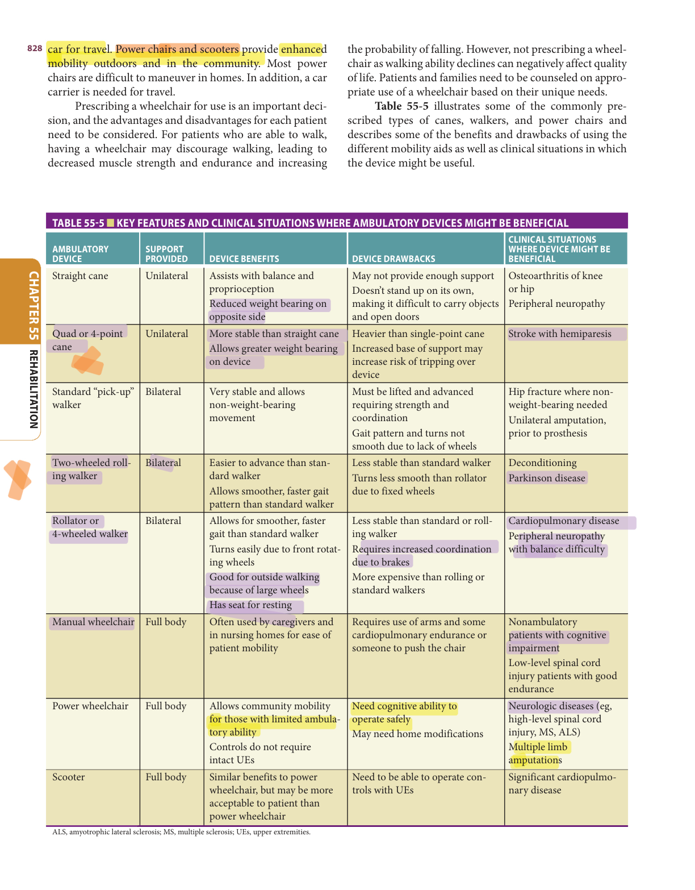

# Hazzard's Geriatric Medicine and Gerontology, 8e — Chapter 55: Rehabilitation

Cynthia J. Brown

> **Fast build from the book, 22 Sep; not lane-reviewed.**

**[p. 817]**

#### Learning Objectives

- Name and describe the conceptual models used as the framework for rehabilitation.
- Explain the advantages and disadvantages of each site of care for rehabilitation.
- List providers who are commonly members of the interprofessional rehabilitation team.
- Identify common rehabilitation interventions, in addition to exercise.
- Name at least two types of adaptive aids and how they are used.

#### Key Clinical Points

1. In addition to the history and physical examination, an evaluation should include assessments
2. It is important for the provider to understand the range of available rehabilitation settings, both inpatient and community
3. An interdisciplinary team is often required to meet the complex rehabilitation needs of older patients, and while team members have defined roles and functions, there is considerable overlap in the services provided.
4. Exercise is the cornerstone of physical rehabilitation, with each prescribed exercise being related to achievement of a goal and ultimately to an improvement in function.
5. Adaptive aids include devices that allow persons with physical limitations to

## Rehabilitation

## Defining Rehabilitation

The purpose of rehabilitation is to restore some or all of a person’s physical and mental capabilities that have been lost as a result of disease, injury, or illness and to help achieve the highest possible level of function, independence, and quality of life. The techniques and modalities used to achieve these goals are numerous and typically do not differ for younger versus older persons. However, rehabilitation outcomes and approaches are frequently different for the older adult. For example, most young adults experience a single acute event that results in disability. Older adults are more likely to have multiple comorbid conditions that, over time, result in disability. Even if the older persons have acute events, like a hip fracture or a stroke, their underlying comorbid conditions may impact on the outcomes of rehabilitation. Older patients may also have subclinical physical or cognitive comorbidities, which become evident when challenged by a new disability. For example, mild cognitive impairment may be first recognized during rehabilitation after a hip fracture, when the patient has difficulty learning how to use a new assistive device.

Goals of rehabilitation for older adults usually focus on recovery of self-care ability and mobility, while for younger persons reentering the workforce or returning to school may be the goal. In general, recovery for older adults requires a longer period of time to achieve, and functional outcomes are usually worse when compared with younger adults. It is important to discuss rehabilitation goals with all patients and focus therapy toward achieving those goals. For example, older persons may have been avid golfers or fishermen, and return to this activity may be important for their quality of life. Rehabilitation efforts and goals of care may also be impacted by a person’s values and beliefs about exercise and social roles. For example, if a patient has never cooked and does not believe that this is an important task to learn, taking the patient to the kitchen to learn how to prepare a meal may be viewed as a useless task. Participation by the patient and family in the development of the goals of rehabilitation is critical to achieve a successful outcome.

Disability is common in older persons and can have a significant impact on function and quality of life. In order to better understand the process of disablement, a variety

**[p. 818]**
**participate in activities, such as basic and instrumental activities of daily living, with greater ease and/or less pain. Categories of adaptive aids include mobility aids to assist people to move around within their home and community, bathroom aids to assist with bathing and toileting, and selfcare aids that assist with dressing, personal hygiene, cooking, and other activities.**

of theoretical models have been explored and are presented below.

### History Of The Disability Framework

In an attempt to provide a framework for the discussion of the consequences of disease and injury, Nagi developed the first - disablement model in the 1960s ( **Figure 55-1** ). The model uses four related yet distinct phenomena considered by Nagi to be the basis of rehabilitation and include active pathology, impairment, functional limitation, and disability. Active --pathology was described as a disruption in the normal cellular function and the body’s efforts to regain a normal state. Impairment, which usually results from active pathology, referred to an abnormality or loss at the tissue or organ level. Functional limitation described restrictions at the individual level, while disability described a physical or mental limitation in a social context. Nagi’s view of disability was a product of the interaction between individuals and their environment. Importantly, individuals could have similar functional impairments that result in different patterns of disability, depending on the environment in which they function.

In 1980, the World Health Organization’s (WHO) _International Classification of Impairments, Disabilities, and Handicaps_ (ICIDH) was developed in Europe. Like Nagi’s disablement model, the ICIDH characterized three distinct concepts related to disease and health conditions: impairments, disabilities, and handicaps. While the ICIDH was developed to classify function and disability, it failed - to receive endorsement by the World Health Assembly.

A major criticism of these early disablement models was that these presented the response to disease or illness as a static process with a linear progression through the disablement process. It was recognized that the interaction between disease and disability is more complex, particularly for older persons. Recognition of this complexity led to significant dialogue within the rehabilitation community and to a major revision of the ICIDH.

In 2001, the WHO released the _International Classification of Functioning, Disability, and Health_ (ICF) ( **Figure 55-2** ), which attempted to incorporate, from a biological, personal, and social perspective, a biopsychosocial view of health. The ICF characterizes decreases in function as the consequence of a dynamic interaction between various health conditions and contextual factors. Health conditions are described as diseases, disorders, injuries, or aging. Contextual factors are divided into two categories: environmental factors and personal factors. Environmental factors include _. the physical, social, and attitudinal environment in which people live. These might include individual environment like furniture placement in the home or societal environment like policies regarding access to buildings. Personal factors are characteristics of the individual, which are not part of the health condition or illness. These might include gender, fitness, or coping styles. Listed across the center of the model are the three domains of human function: body functions and structures, activities, and participation. Body functions and structures are the physiologic functions and the anatomic parts of the body. The execution of a task or action by a person is an activity, while participation is the application to a real-life activity. For each of these three domains of human function, there are several levels on which the function can be experienced. These include functioning at the level of the body or body parts and the level of the whole person and the whole person in their environment. Disability is defined as any decline at any of these levels.

Using the ICF model, we could describe an older woman, who has a history of osteoarthritis of the knees and hypertension, who presents to rehabilitation after a hip fracture. She lives alone in a second-floor apartment and has a daughter who lives at a distance 6 hours away. The patient has a large circle of friends and regularly attends social gatherings at the local senior center. **Figure 55-3**

<!-- Start of picture text -->
Disability Active pathology Functional Have physical or Normal cellular processes Impairment limitation mental limitation in a and homeostatic efforts to Loss or abnormality at Have physical or social context return to normal state are the organ or tissue level mental limitation at (ie, socially defined interrupted the individual level roles or tasks) <!-- End of picture text -->

> *FIGURE 55-1. Schematic of the Nagi disablement model with definitions. The first disablement model was described by Nagi in the early 1960s. The initial disablement model focused on a linear progression to disability and has been replaced over time with new models such as the International Classification of Functioning, Disability, and Health (ICF). Importantly, the Nagi model was the first attempt to describe the process of disability.*

> Highlighting is the owner's annotation, not the book's.

**[p. 819]**
<!-- Start of picture text -->
Health condition Diseases, disorders, injuries, or aging t  t Body functions and Participation structures Activity Application to a real-life Physiologic functions and Execution of a task or action situation anatomic parts of body t  t  t {,  {, Environmental factors Personal factors Physical, social, and Characteristics of person not attitudinal environment in part of health condition or which people live illness <!-- End of picture text -->

> *FIGURE 55-2. International Classification of Functioning, Disability, and Health (ICF). The latest version of the ICF focuses on the interaction between various factors and the impact these factors have on health and functioning. Prior models focused on disability and portrayed the path to disability as a linear process. This model attempts to incorporate, from a biological, personal, and social perspective, a biopsychosocial view of health. (Reproduced with permission from World Health Organization. _Towards a Common Language for Functioning, Disability and Health._ Geneva, Switzerland: ICF; 2002.)*

> Highlighting is the owner's annotation, not the book's.

demonstrates how this patient’s problems might be placed in the ICF model, with the goal of generating hypotheses about the best treatment options. Important issues include not only improving the patient’s strength and walking ability but also addressing where she will live after discharge and how to keep her active in her community. Understanding the relationships between the different components and addressing them is the key to a successful rehabilitation.

It is believed by many that the ICF framework has the potential to provide a standard disablement language, which could facilitate dialogue across disciplines. The ICF model attempts to reflect the interactions between different components of health and avoids the linear view of previous models. This framework also looks beyond disease and mortality to focus on how people live with their disabling conditions.

<!-- Start of picture text -->
Health condition New hip fracture Osteoarthritis Hypertension {,  {, Body functions and Participation Activity structures - - - Missing social events/friends Unable to walk long distances Impairment of ambulation due to Worried about remaining in or climb stairs hip fracture and knee pain apartment alone t  t  t I {,  {, Environmental factors Personal factors Lives in second floor apartment Great attitude Lives alone, no available caregiver Large circle of friends <!-- End of picture text -->

> *FIGURE 55-3. Using the ICF model to describe patient function. This figure demonstrates how a patient’s problems might be placed in the ICF model with the goal of generating hypotheses about the best treatment options. In the case of this patient with osteoarthritis and new hip fracture, the ICF model illustrates how addressing where the patient will live after discharge and how to keep the patient active in the community are as important as improving the patient’s strength and walking ability. Understanding the relationships between the different components and addressing them is the key to successful rehabilitation. (Data from WHO ICF model.)*

> Highlighting is the owner's annotation, not the book's.

**[p. 820]**

> **820 EVALUATION**

### Goals Of Evaluation

An important goal of evaluation is to identify the cause of the disability for which rehabilitation is required. While there is frequently a final common pathway for many disabling conditions, the cause may impact on treatment and outcomes. For example, a person’s walking difficulty could be caused by osteoarthritis of the knee or a meniscal tear. For the patient with osteoarthritis, an exercise program focused on strengthening the musculature around the knee has been demonstrated to decrease pain and improve the ability to walk. For the patient with a meniscal tear, surgical intervention may be a better option. Evaluation prior to rehabilitation is also important to identify comorbidities that may directly or indirectly affect rehabilitation outcomes. While the older person may have osteoarthritis causing limited walking ability, they may also have poor cardiac or pulmonary function that further limit walking ability. Another goal of evaluation is to determine the best site for rehabilitation to occur. Several settings are available, including an inpatient rehabilitation facility, a subacute nursing home, or a home. The appropriate setting is usually determined through evaluation of the disability and comorbid conditions that may affect rehabilitation. The next section outlines the evaluation process and focuses on creation of an individual treatment plan that addresses the patient’s unique disabling conditions.

### Function-Oriented History And Physical Examination

During the initial evaluation, the history and physical examination can help characterize the disabling conditions and lead the clinician toward the most effective types of treatment. Determining if the functional decline occurred suddenly or has taken a more slowly progressive course may be very helpful in determining the cause of the disability. Symptoms associated with a given activity may also help narrow the cause to a specific organ system. For example, while the impairment may be difficulty in walking, the limitation could be caused by shortness of breath or pain with weight bearing. Differentiating the causal pathway, in this case cardiopulmonary versus musculoskeletal, helps to refine the work-up required and assists the provider in targeting the appropriate therapy. Functional status and residence prior to the illness or injury may also help guide expectations of rehabilitation.

**Table 55-1** lists several brief screening maneuvers, which can be done in the physician’s office when evaluating a patient for disability. These assessment tools can be used to quickly assess baseline functional status as well as monitor progress during rehabilitation. If these screening tests are positive, additional testing should be performed, as the screening tests are often not as accurate as more detailed maneuvers. A variety of standardized measures are

**Table 55-1 — Physical performance tests used to assess function**

|**SCREENING** **ACTIVITY**|**ATTRIBUTE** **ADDRESSED**|**FUNCTIONAL** **IMPLICATION**| |---|---|---| |Put a heavy book on an overhead shelf|Upper extremity strength and range of motion|Ability to perform housework| |Grasp a piece of paper and resist its removal|Pinch strength|Grooming and feeding self| |Write a sentence|Fine motor coordination|Feeding self| |Timed rise to standing five timesa|Lower extremity strength|Ambulation and stair … *(table text runs longer in the printed book; not fully reproduced in this fast build)*

4 weeks prior to assessment|Addresses factors in addition to physical function that might impair mobility|
|Rhomberg; stand- ing with eyes closed and assess sway or loss of balance|Proprioception|Ability to balance without visual input|

_Data from_a _Studenski SA, Perera S, Wallace D, et al. Physical performance measures in the clinical setting. J Am Geriatr Soc. 2003;51(3):314;_b _Peel C, Sawyer-Baker P, Roth DL, et al. Assessing mobility in older adults: the UAB Study of Aging Life-Space Assessment. Phys Ther. 2005;85:1008–1019._

available to further test function during basic and instrumental activities of daily living (IADLs).

For example, lifting a heavy book overhead tests shoulder range of motion and strength. If a person is unable to achieve this task, additional range of motion and muscle testing should be done to isolate the cause of the difficulty.

Many of the screening tests listed have normative values and have been well validated for the geriatric population. The short physical performance battery includes three of the screening tests, gait speed, timed chair stands, and static balance with worse scores being associated with falls, nursing home placement, and mortality. The University of Alabama at Birmingham (UAB) Study of Aging LifeSpace Assessment is a validated instrument that measures a person’s mobility in the home and community during the month preceding the assessment. Importantly, the Study of Aging Life-Space Assessment goes beyond measuring the individual’s ability to perform specific tasks by assessing

**[p. 821]**

the person’s actual pattern of mobility, which may help identify factors other than physical impairment, such as emotional or socioeconomic factors, which might be limiting mobility.

In addition to the history and physical examination, an evaluation should include assessments of cognition, motivation, depression, social support, and financial resources, as these factors can have a significant impact on rehabilitation outcomes. A variety of validated assessment tools can be used to screen for cognition and depression, such as the Montreal Cognitive Assessment (MoCA) and the Geriatric Depression Scale, respectively. Assessment of current methods utilized by the patient for coping with disability, including use of ambulatory or assistive devices, level of assistance needed, and any limitation of activities, should also be explored.

### Determining Rehabilitation Potential

Many factors influence the choice of who would benefit from rehabilitation and the success of those rehabilitation efforts. Assessment for rehabilitation potential needs to be done when the acute medical illness has resolved. A patient with a hip fracture and concurrent delirium may do poorly on initial assessment but, once the delirium clears, may progress nicely with rehabilitation. At times, the medical condition will need to be treated concurrently with rehabilitation efforts. After a prolonged intensive care unit (ICU) stay, a patient may have significant orthostatic hypotension, which will resolve as they regain the upright position during rehabilitation. **Table 55-2** lists a variety of acute medical

**Table 55-2 — Factors for which rehabilitation may need to be delayed until resolved**

|**FACTOR OF INTEREST**|**REASON FOR POSSIBLE DELAY** **IN REHABILITATION**| |---|---| |Delirium or altered level of consciousness|Unable to cooperate or learn| |Hemodynamic instability|May make it unsafe to carry out certain types of exercise| |Occult fracture and bony metastasis|Weightbearing or resistance exercise could worsen fracture or cause fracture| |Acute infections (eg, bladder infection and pneumonia)|May cause confusion, fatigue, and/or hypotension| |Acute … *(table text runs longer in the printed book; not fully reproduced in this fast build)*

### Illnesses That Might Delay Referral To Rehabilitation Until These Are Resolved.

Other determinants of rehabilitation benefit include motivation, cognition, and prior functional status. Comorbid illness may have a significant effect on rehabilitation efforts and may even cause a change in rehabilitation approaches. For example, a patient with chronic obstructive pulmonary disease (COPD) on home oxygen who falls and fractures a hip may not be able to tolerate more than 5 minutes of therapy at one time. The rehabilitation approach might be changed to include frequent walks of short duration by therapy and nursing, as opposed to an hour-long therapy session twice a day. **Table 55-3** lists a variety of factors that might influence either the use of rehabilitation or the goals of the rehabilitation. In some cases, like terminal illness with a short life expectancy, the goals of care may need to be addressed with the patient and family, and palliative care may be a more appropriate option. For other factors, like lack of motivation, well-defined patientcentered goals that are easily measured may help overcome this potential obstacle.

After careful evaluation, including a function-oriented history and physical examination, assessment of factors that may impact on rehabilitation outcomes, and the development of goals with the team, including the patient and

**Table 55-3 — Factors that may influence the success of rehabilitation interventions**

|Cognitive impairment|Goals may be more limited. Take advantage of skills patient already has, use interventions that do not require carryover.| |---|---| |Disability has been pres- ent for many years|Goals may be more limited and directed to compensatory strategies or treatment of deconditioning.| |Motivation is limited|Goals need to be well defined and reached in measurable steps.| |Patient had prior rehabilitation for the same problem|Rehabilitation may be … *(table text runs longer in the printed book; not fully reproduced in this fast build)*

ations, and cultural beliefs may preclude use of certain tech- niques or technologies.|
|Malnutrition|Unable to build muscle; reha- bilitative interventions may be limited unless nutritional status is improved.|

**[p. 822]**

> the family, we are ready for the final step prior to initiation of rehabilitation, choosing the site for rehabilitation. Determining the optimal setting in which rehabilitation should occur is based on many of the factors previously evaluated, as well as patient preference.

## Components Of Rehabilitation

### The Organization Of Rehabilitation

**Settings for care** A variety of settings are available, both inpatient and community based, in which to receive rehabilitation services. It is important for the provider to understand the range of available settings and the advantages and disadvantages of each setting. While the provider may be responsible for helping match the patient to the optimal setting, insurance and cost also play a role. Rehabilitation services are available through Medicare Part A on a time-limited basis. Patients must demonstrate that they are making progress with rehabilitation goals in order to qualify for services.

Inpatient rehabilitation is offered in rehabilitation centers and Medicare-skilled nursing facilities. In order to qualify as a Medicare-certified inpatient rehabilitation hospital, a certain percentage of all admitted patients must have at least one of 13 conditions, which include diagnoses like --stroke, burns, and neurologic disorders. Patients must be managed by an interdisciplinary team of skilled nurses and therapists, be seen daily by a physician, and require 24-hour rehabilitation nursing care. Rehabilitation is intensive with patients receiving a minimum of 3 hours of therapy daily. As the rehabilitation center offers 24-hour-a-day medical care, patients in need of close medical supervision during therapy can receive it. However, the patient must be able to tolerate the intensity of therapy provided, which may be difficult for the older patient.

Like the rehabilitation center, Medicare-approved skilled nursing facilities must provide 24-hour nursing care. While physicians must be available 24 hours a day, they supervise care and can visit the patients less frequently. Interdisciplinary care may not occur, although therapy services, dietary, pharmacy, and social services are available. There are no requirements for intensity or duration of therapy sessions, or any required case mix. This setting allows for a slower rehabilitation pace, which may be necessary for some older patients with multiple comorbid diseases. The availability of 24-hour nursing care is also a benefit for persons who are unable to care for themselves or who do not have caregivers at home.

Home health benefits for rehabilitation, including part-time nursing and therapy services, are also available through Medicare to patients who are defined as “homebound.” This includes patients for whom leaving the home is difficult or who require help of another person to get out of the home. A physician or allowed practitioner (advanced practice providers or clinical nurse specialists) must order Medicare home health services, certify a patient’s eligibility

for the benefit, and a face-to-face encounter must occur within the 90 days prior to the start of home health care, or within the 30 days after the start of care. These services must be recertified every 60 days. While the intensity of the rehabilitation is less and the nursing services are part time, many patients prefer rehabilitating in their own home. If the patient has the necessary support system, this can be an excellent option.

While a number of studies have examined the effect of the rehabilitation setting on outcomes, the results remain unclear. For patients with hip fracture, the setting of care does not appear to have an impact on outcomes. After a stroke, patients who are treated in inpatient rehabilitation hospitals or special stroke units are more likely to be discharged to home and with improved function. Ultimately, factors such as patient prognosis, level of medical and nursing care needed, and intensity of therapy the patient can tolerate will help determine the optimal setting for rehabilitation.

### Rehabilitation Team Members

An interdisciplinary team is often required to meet the complex rehabilitation needs of older patients. While team members have defined roles and functions, there is considerable overlap in the services provided. For example, while the physical therapist may focus on transfer and gait training, the occupational therapist may also encourage practice of transfers while performing self-care skills. In addition, there are different levels of education and licensure required for different providers. **Table 55-4** outlines the types of rehabilitation team members and their usual roles, methods of evaluation, and treatment.

Key members of this interdisciplinary team are the patient and the family. Indeed, the patient and family are at the center of the interprofessional team. An important component of chronic disease management is patient self-management, and patients must be active participants in the decision-making process. The team is responsible for establishing goals, in collaboration with the patient and the family, and developing a treatment plan to achieve those goals. In addition to teaching the patient, a key component of rehabilitation is training the caregiver or the family. Specifically, caregivers must be taught how to assist with exercise programs, ambulation, and activities of daily living (ADLs). The caregiver may need to know how to use adaptive equipment or even how to transfer the patient safely, if the patient is not independent with this task. Communication among all team members, including the patient and their family, is critical for success.

### Process Of Care: Rehabilitation Interventions

A variety of interventions are available to treat physical impairments and disability. The selection of intervention strategy is determined by the results of the assessment. All interventions should either directly or indirectly lead to an improvement in activity and/or participation. Major categories of interventions include (1) exercise/physical

**[p. 823]**
**Table 55-4 — Rehabilitation team members, typical roles, and methods used for evaluation and treatment**

|**TEAM MEMBER**|**PRIMARY METHODS OF EVALUATION AND TREATMENT**| |---|---| |Chaplain or spiritual care provider -I l|• Provides spiritual support to patient and family| |Dietician|• Assess nutritional status • Alter diet to maximize nutrition| |Nurse -|• Evaluation of self-care skills • Evaluation of family and home care factors • Self-care training • Patient and family education • Liaison with community| |Occupational therapist|• Evaluate self-care skills and other … *(table text runs longer in the printed book; not fully reproduced in this fast build)*

ch as joint range of motion, muscle strength, and balance • Assessment of gait and mobility • Provision of appropriate assistive devices • Exercise training to increase range of motion, strength, endurance, balance, coordination, and gait • Treatment with physical modalities (heat, cold, ultrasound, and electrical stimulation), soft tissue and manual therapy techniques|

> *Table 55-4 reproduced as a page image (printed p. 823) — the grid did not extract reliably as text for this fast build.*

> Highlighting is the owner's annotation, not the book's.

activity; (2) modalities including thermal agents and electrotherapy; (3) adaptive aids such as walkers, canes, and devices to improve ADLs; and (4) orthotics (splints and braces) and prosthetics (artificial limbs).

### Exercise/physical Activity

**_General Principles of Exercise_** Exercise is the cornerstone of physical rehabilitation. Each exercise prescribed for a

patient should be related to achievement of a goal, and all goals should lead to improvement in function. For example, a common exercise for patients is elbow and shoulder flexion. Typical goals related to these exercises are feeding one’s self, dressing one’s self, or reaching - overhead to retrieve an item from a shelf. The expected functional outcome for each exercise should be shared with the patient and his/her family. The involvement

**[p. 824]**

> of the patient and the family is important to maximize adherence.

In setting goals for exercise programs, it is important to consider any pathology that is present. If there is irreversible damage to the neuromuscular system, then the potential for improvement in muscle function is limited. Amyotrophic lateral sclerosis is an example of a pathology in which improvement in muscle function is limited. However, in most cases, decline in muscle strength results from a combination of pathology and deconditioning occurring secondary to inactivity. The deconditioning component is reversible, and therefore some improvement in muscle strength is possible.

A common question often asked is whether exercise is safe for older adults. The number of adverse events reported as a result of exercise in adults is relatively low, with adverse events being more common with vigorous exertion and in persons with atherosclerotic heart disease. To facilitate a safe response, close monitoring before exercise, during exercise, immediately after exercise, and 24 hours after exercise is important. In addition, prior to the initiation of an exercise program, it is important for medical conditions such as congestive heart failure and diabetes to be stable and under optimal medical management. Exercise should be supervised initially to assure appropriate changes in heart rate and blood pressure. There is an expectation that minor muscle soreness will occur with most types of exercise, and patients should be counseled to expect some discomfort. Some patients with osteoarthritis may actually experience a decrease in joint discomfort with exercise. Because increased activity typically has a positive effect on insulin resistance, patients with diabetes may experience a need for less medication to control blood glucose levels.

For exercise to cause a change in physical function, the body must be stressed greater than the usual stress of everyday life. Therefore, it is important that patients are challenged in their exercise programs. For example, when a patient achieves a specific goal, such as walking 30 m at 0.5 m/s, the goal needs to be increased to a greater distance and/or speed. In comparison to younger adults, older adults need a longer recovery time both during an exercise session (between bouts) and between sessions. Improvement may also take longer for older versus younger adults, which should be considered when setting time frames for the achievement of goals.

There are many classification systems for types of exercise. In the following discussion, we will describe exercise types based on the anticipated outcome, including exercise to increase muscle strength, aerobic capacity, bal--ance, flexibility, and motor control.

**_Exercise to Increase Muscle Strength_** A typical exercise program to increase muscle strength involves movements performed against resistance. The resistance can be weights, rubber tubing or bands, or the person’s own body weight. To achieve optimal results, the resistance should be 60% to 80% - of the person’s maximal lifting ability. For the majority of

older adults who are starting an exercise program, it is wise to begin at a lower level (~ 40%–50% of maximal capacity) until the person has mastered the movement patterns.

Bone density can be positively affected by exercises designed to increase muscle strength. Prior to initiating a program to increase muscle strength, it is important to know the individual’s bone status, or the extent and location of osteoporosis and/or osteopenia. In persons with osteoporosis, the amount of resistance may need to be modified to avoid overstressing bones and causing a fracture.

**_Exercise to Increase Aerobic Capacity_** Exercise programs designed to increase aerobic capacity involve continuous activity (such as walking, cycling, and stair stepping), usually performed for at least 20 minutes at an intensity that is 50% to 80% of one’s maximal oxygen consumption. Older adults who are beginning a program may need to start with 5 to 10 minutes of continuous activity at a lower intensity. In fact, several sessions of shorter duration (ie, 10 minutes) per day have shown similar benefits as one session of 30 minutes. To achieve benefits, endurance training needs to be performed three to five times per week. For older persons in rehabilitation programs who have physical limitations, the specific activities may need to be modified. For example, cycling may not be possible for a person who has significant hemiparesis after a stroke. Adaptations, such as securing the person’s foot to the pedal, may allow the individual to exercise. Moving to another venue, such as a therapeutic pool, may be another option.

A benefit of aerobic capacity training is an increase in maximal oxygen consumption, which is defined as the amount of oxygen consumed while performing the maximal workload that one can perform for 2 to 3 minutes. Improving the maximal amount of work that a person can perform is not necessarily a direct benefit because daily activities are performed at submaximal, rather than maximal, levels of exertion. However, with an increase in maximal oxygen consumption, a given amount of submaximal work is performed at a lower percent of maximal oxygen consumption. Consequently, as a result of aerobic capacity training, submaximal work expressed as a percentage of maximal oxygen consumption is lower. From a functional perspective, activities such as dressing, bathing, and performing housework can be performed with less fatigue and for longer time periods.

Aerobic exercise has positive benefits for persons with hypertension, hypercholesterolemia, and obesity. Regular - aerobic exercise has been shown to decrease resting blood pressure, resulting in either a decrease in the amount of or a need for medications. Although aerobic exercise often does not decrease total cholesterol, many studies have shown positive benefits for high-density lipoprotein cholesterol and triglyceride levels. For both treatment and prevention of obesity, aerobic exercise is a key component of a successful program.

Aerobic exercise also has benefits for cardiovascular and pulmonary diseases. For persons with angina,

**[p. 825]**

participation in a regular endurance exercise program produces an increase in the “anginal threshold,” allowing persons to exercise at higher levels prior to the onset of angina. Persons with chronic pulmonary disease typically experience less breathlessness with activities, as a result of a regular exercise program. One of the most effective treatments for claudication is walking to the onset of pain, which ultimately produces an increase in the distance walked prior to the onset of claudication.

**_Exercise to Improve Balance_** Balance, defined as the ability to remain upright as the body’s center of gravity shifts relative to the base of support, declines as people age. The somatosensory, visual, and vestibular systems contribute to our ability to maintain balance. Balance is an essential component to walking because walking involves a continuous shift of the body’s center of gravity relative to the base of support.

Balance exercises are important for persons who have fallen or who are at high risk of falls. Exercises are prescribed that are appropriate for the individual’s current level of function. For example, low-level exercises may involve standing and shifting one’s center of gravity. As the person progresses, he/she may practice standing on one extremity or walking on a balance beam. Exercises performed with eyes closed force the use of the vestibular and somatosensory systems. Exercises performed on altered surfaces, such as foam or carpet, force the use of the visual and vestibular systems. For persons with a specific abnormality of the vestibular system, such as benign positional vertigo, there are specific exercises that often are helpful.

**_Flexibility Exercises_** The goal of flexibility exercises is to increase range of motion of a body part by increasing muscle length and/or joint motion. The most effective and safe approach is a prolonged, low-intensity stretch of the muscle/ joint with limited motion. Having a sufficient amount of motion is important for many functional activities. For example, going up and down stairs using a reciprocal gait pattern requires at least 90 degrees of knee flexion. Reaching overhead requires 120 to 150 degrees of shoulder flexion and abduction. In addition, sufficient range of motion at the hip and ankle is important for maintaining standing balance. Excessive range of motion, however, decreases stability and can lead to pain, decreased mobility, and falls.

Parkinson disease is an example of a common condition in older adults in which flexibility exercises are important. Persons with Parkinson disease assume a flexed posture, resulting in loss of cervical and thoracic extension. Prescribing exercises early in the course of the disease may prevent the severity of the postural abnormalities. Maintaining spinal extension is important to prevent compromise of respiratory capacity and to minimize gait and balance disorders.

**_Task-Oriented Exercises to Improve Motor Control_** Older persons may lose their ability to perform tasks because of abnormal tone (spasticity) and/or muscle weakness. Task-oriented

exercises are used to improve coordination and motor per- formance. Constraint-induced movement therapy (CIMT) is one method used to improve motor function. With CIMT, the stronger, less affected extremity is “constrained” using a cast or mitt. The person is forced to use the affected extremity and practice tasks needed for daily living. This method typically involves participation in therapy for 4 to 6 hours per day. The approach is based on learning theory and assumes plasticity of the central nervous system with reforming of neural connections after injury. A Cochrane review reported greater improvements in upper extremity motor function in persons poststroke with CIMT compared to conventional treatment. These differences were not significant at 6 months.

A second method used to improve walking performance and balance is treadmill training with partial body support. A harness is connected to an overhead system, which is mounted on a treadmill. By providing partial weight support in combination with a speedcontrolled treadmill, patients can perform a greater amount of task-specific practice compared to traditional methods of gait training. A Cochrane review of treadmill training with and without body weight support after stroke concluded that persons who are able to walk appear to benefit the most from this intervention. Potential benefits include an increase in walking speed and walking endurance.

**_Designing Exercise Prescriptions_** Exercise should be prescribed in an individualized manner similar to prescriptions for medications. The components of an exercise prescription include mode (type of activity), frequency (number of times per day or week), intensity (level of exertion), and duration (length of time of each individual session). Sufficient research is not available to determine the ideal exercise prescription for older adults with the variety of comorbidities that are typically present. However, for some types of exercise, such as moderate- to high-intensity strength training, there is evidence that exercising every other day or every third day is optimal because of the need for recovery time. Because specific guidelines for persons with pathology are not available, pre- and postexercise monitoring is essential. Vital signs and blood glucose levels (if diabetes is present) need to be checked prior to and after exercise. Persons who are beginning an exercise program or increasing their current exercise level need to be asked how they are feeling 24 hours after exercise. Severe muscle soreness and general body fatigue are signs that the exercise stress was excessive.

**Physical modalities** Physical modalities that are often used with older adults include heat and cold agents, aquatic or pool therapy, electrotherapy, and phototherapy (monochromatic infrared energy—MIRE). For most of these agents, there is limited evidence of effectiveness as a sole intervention. However, when used in combination with other therapies, especially exercise therapy, these modalities can enhance the effectiveness of the overall intervention. The most common indication for use of physical

**[p. 826]**

> modalities is pain management. Because older adults may have reduced mental status, or impaired circulation and sensation, using modalities in older adults requires caution. Educating patients and their families on the rationale for use of modalities is essential, especially if these are to be used in the home environment.

**_Thermal Agents (Including Aquatic Therapy)_** Thermal agents include superficial and deep heating modalities and cryotherapy. Physiologic effects of heat include increased blood flow and edema, increased extensibility of connective tissue structures, and decreased pain. Superficial modalities primarily increase the temperature of the skin and underlying subcutaneous tissue and include hot packs, heating pads, and paraffin. Superficial heat is beneficial for persons with osteoarthritis, rheumatoid arthritis, and conditions resulting in cervical and low-back pain. The most popular deep heating modality is ultrasound, a form of acoustic energy, which when absorbed by tissues is converted into heat. Ultrasound is often used for tissue contractures, tendonitis, and pain resulting from musculoskeletal disorders. Ultrasound should not be administered close to the brain, eyes, - reproductive organs, pacemakers, or arthroplasties.

Cryotherapy includes cold packs, ice massage, cold water immersion, and vapocoolant sprays. Physiologic effects of cold include cutaneous vasoconstriction, decreased nerve conduction velocity, decreased spasticity, and increased joint stiffness. Cold therapy provides short-term analgesia and often allows patients to move when movement otherwise would be too painful. Cold therapy should be avoided in persons with arterial insufficiency, impaired sensation, cold hypersensitivity, and Raynaud disease.

Aquatic or pool therapy is an alternative to physical modalities and/or exercise on land. A therapeutic pool provides a combination of heat and buoyancy for support of upright activities. Patients with muscle weakness and pain often can walk and exercise in a therapeutic pool when movement on land is limited. Because total body heating produces significant vasodilation, patients with cardiac insufficiency may experience chest pain. All patients need to be careful exiting the pool because of the possibility of postural hypotension. Persons with heat intolerance, such as those with multiple sclerosis, may require a “cool” pool with temperatures below 90°F.

**_Electrotherapy_** Electrotherapy can be used as an intervention for pain management, muscle activation, wound healing, and urinary incontinence. Transcutaneous electrical nerve stimulation (TENS), a popular treatment for pain, involves placing electrodes over peripheral nerves, nerve roots, or painful areas. The mechanism of action is unclear but probably involves the release of endogenous endorphins in the cerebrospinal fluid, which block pain by binding to opiate receptors. Adverse effects of TENS are minor and typically involve skin irritation secondary to sensitivity to the electrodes or gel. Contraindications to the use of TENS include persons with impaired sensation and/or cognition and persons with either a pacemaker or an implanted cardiac

defibrillator. A recent Cochrane review was unable to conclude that, in people with chronic pain, TENS is beneficial for pain control, disability, health-related quality of life, or use of pain relieving medicines.

Neuromuscular stimulation is used to activate muscles addressing treatment goals in persons after stroke, spinal injury, or knee surgery. For persons poststroke, electrical stimulation can be used to enhance functional movement patterns, such as contraction of the anterior tibialis muscle to prevent foot drop during the swing phase of gait or contraction of the quadriceps at heel strike during gait. After knee surgery or injury, persons often “forget” how to contract the quadriceps muscle as a result of pain and/or joint effusion. Neuromuscular simulation can be used to “retrain” the quadriceps muscle counteracting atrophy that occurs with immobilization.

An important difference between normal muscle contraction and electrically induced muscle contraction is the order of recruitment of motor units. With normal muscle contraction, the smaller fatigue-resistant motor units are recruited first, followed by larger, fatigable motor units. With electrical stimulation, the larger-diameter fatigable fibers are recruited first. The consequence is that fatigue occurs fairly quickly with neuromuscular stimulation. Providing adequate rest periods and limiting the duration and frequency of contractions are strategies to lessen fatigue.

Electrotherapy used for wound healing involves application of electric current either directly to a wound or to the skin surrounding the wound. Electrical stimulation is approved for Medicare coverage for the treatment of stasis, arterial pressure, and diabetic ulcers that have not responded to conventional therapy. Animal and human studies have shown that electrical stimulation increases both DNA and collagen synthesis; directs epithelial, fibroblast, and endothelial cell migration into wound sites; inhibits the growth of some wound pathogens; and increases the strength of scar tissue. The effectiveness of electrical stimulation is demonstrated in randomized controlled trials, with the strongest evidence being demonstrated in the treatment of pressure ulcers.

**_Phototherapy (MIRE)_** Devices that deliver MIRE were approved by the Food and Drug Administration (FDA) in 1994 to increase circulation and decrease pain. This treatment involves placing pads over the lower leg and foot. The pads contain diodes that emit light energy in the near-infrared spectrum (890-nm wave length). The typical treatment protocol involves 30-minute treatments, three times a week, for a total of 12 treatments. The infrared photo energy is thought to release nitric oxide from hemoglobin. Nitric oxide relaxes smooth muscle cells, dilating blood vessels and improving circulation. MIRE has been used for the treatment of peripheral neuropathy, with the goal to improve sensation and decrease neuropathic pain. Research studies are conflicting; however, the majority of them have shown that MIRE was no more effective than placebo in improving sensation.

**[p. 827]**

**Adaptive aids** Adaptive aids include devices that allow persons with physical limitations to participate in activities, such as basic and IADLs, with greater ease and/or less pain. Categories of adaptive aids include mobility aids to assist people to move around within their home and community, bathroom aids to assist with bathing and toileting, and selfcare aids that assist with dressing, personal hygiene, cooking, and other activities. It is not unusual for older persons to have devices that they do not need, often as a gift from a friend or relative. The opposite also occurs when older persons need devices that are not prescribed. The devices described below need to be prescribed by a professional, and the patient or family or caregiver needs to be instructed in their use. Devices that are used incorrectly can lead to falls and other adverse events. It can be helpful for the professional (typically a physical or occupational therapist) to make a home visit to assess whether the prescribed adaptive devices can be used safely in the patient’s home.

**_Mobility Aids_** Canes are the most popular mobility aid for older adults because they are lightweight and easy to use when space is limited. Canes are used to decrease weight bearing (and pain) in an extremity with an arthritic joint and to improve balance by increasing the base of support. When adjusted to the proper height, the handle of the cane is at the level of the wrist when the arm is fully extended. Canes should be used in the hand on the side opposite of the involved extremity. Many people will incorrectly use the cane in the hand on the side of the involved extremity. The cane then acts as a brace for the involved extremity, producing an abnormal gait pattern and limiting range of motion of both the hip and the knee of the involved side. To achieve a normal gait pattern, patients are instructed to hold the cane in the hand opposite the involved extremity and advance the cane and the involved extremity simultaneously. Patients then swing through with the uninvolved extremity while bearing weight on the cane and, to a lesser degree, the involved extremity. For stairs, patients are taught to go “up with the good and down with the bad.” To ascend the stairs, the uninvolved extremity is advanced up the stairs first, while the involved extremity and the cane remain on the lower step. To descend the stairs, the involved extremity and the cane are lowered first and then the uninvolved extremity descends to the same step. For persons with decreased sensation in the lower extremities, a cane can also provide proprioceptive input to the brain by transmitting information from intact proprioceptors in the hand.

Two major types of canes are straight and quad canes. Straight canes are usually made of aluminum or wood, with a variety of handles available. Quad canes are aluminum canes with a four-legged base. One advantage of a quad cane is that the cane does not fall if the person releases the handle. A disadvantage of some quad canes is that their base is too large to place on stairs, making stair climbing difficult.

Crutches are usually not used with older adults because a higher level of coordination and skill is required.

The two major types of crutches are axillary and forearm crutches. If axillary crutches are used incorrectly, shoulder injury and/or axillary nerve damage can occur. Forearm crutches are more functional because a cuff secures the crutch on the patient’s arm allowing use of the hand to manipulate objects. Crutches are usually used to provide bilateral support. However, a single crutch can be used instead of a cane if additional unilateral support is needed.

A walker usually is prescribed when a cane does not provide sufficient support. Walkers provide bilateral support and are easier to use than crutches. Walkers should be adjusted so that the user maintains an erect posture and is not required to lean forward to reach the walker. There are several types of walkers that vary in stability and function. The standard four-point or “pick-up” walker requires that the person pick it up with each step, requiring arm strength and endurance, and producing a slow walking speed. With a two-wheeled rolling walker, the person can use a more normal gait pattern and speed. Having two rather than three or four wheels provides more stability. A four-wheeled walker, called a “rollator,” has hand brakes so that it can be locked when the user is standing up and sitting down. This type also has a platform seat for resting and a basket for carrying objects. The rollator requires greater skill because of the use of the hand brakes. It is preferred for outdoor use because the wheels are larger and move easier over sidewalks and slightly rough terrain. A final option is the Merry Walker, which provides the maximal amount of support. This type of walker includes front, side, and back bars, and a seat for resting. Merry Walkers are larger and more difficult to manipulate in homes. They are often used in institutional settings for persons with severe balance and coordination deficits.

A wheelchair should be prescribed for a person who can no longer walk safely or when walking endurance is - low. The wheelchair allows the person to continue to do activities such as shopping that require extended periods of standing and walking. Quality of life is maintained and social isolation is avoided. Two main types of wheelchairs are manual and power chairs. There are many options available for customizing a chair for individual needs. In considering the optimal chair, both stability and mobility need to be considered. For example, a back height that is too high makes propelling the chair independently difficult thus impairing mobility, whereas a back height that is too low may not provide adequate trunk support. There are a variety of manual wheelchairs available with many different features. The width of the seat can range from narrow to wide to accommodate larger persons. Removable arm rests and foot rests are available and make transfers easier and safer. Fixed foot rests are not recommended because they can contribute to falls. Consultation with the occupational therapist or physical therapist is recommended, as the therapist would know best how to order appropriate parts to maximize function.

Manual wheelchairs are lighter in weight than power chairs and are fairly easy to fold and load into a

**[p. 828]**

> car for travel. Power chairs and scooters provide enhanced - mobility outdoors and in the community. Most power chairs are difficult to maneuver in homes. In addition, a car carrier is needed for travel.

Prescribing a wheelchair for use is an important decision, and the advantages and disadvantages for each patient need to be considered. For patients who are able to walk, having a wheelchair may discourage walking, leading to decreased muscle strength and endurance and increasing

the probability of falling. However, not prescribing a wheelchair as walking ability declines can negatively affect quality of life. Patients and families need to be counseled on appropriate use of a wheelchair based on their unique needs.

**Table 55-5** illustrates some of the commonly prescribed types of canes, walkers, and power chairs and describes some of the benefits and drawbacks of using the different mobility aids as well as clinical situations in which the device might be useful.

**Table 55-5 — Key features and clinical situations where ambulatory devices might be beneficial**

|**AMBULATORY** **DEVICE**|**SUPPORT** **PROVIDED**|**DEVICE BENEFITS**|**DEVICE DRAWBACKS**|**CLINICAL SITUATIONS** **WHERE DEVICE MIGHT BE** **BENEFICIAL**| |---|---|---|---|---| |Straight cane|Unilateral|Assists with balance and proprioception Reduced weight bearing on opposite side|May not provide enough support Doesn’t stand up on its own, making it difficult to carry objects and open doors|Osteoarthritis of knee or hip Peripheral neuropathy| |Quad or … *(table text runs longer in the printed book; not fully reproduced in this fast build)*

 Gait pattern and turns not smooth due to lack of wheels|Hip fracture where non- weight-bearing needed Unilateral amputation, prior to prosthesis|

> *Table 55-5 reproduced as a page image (printed p. 828) — the grid did not extract reliably as text for this fast build.*

> Highlighting is the owner's annotation, not the book's.

ALS, amyotrophic lateral sclerosis; MS, multiple sclerosis; UEs, upper extremities.

**[p. 829]**

**_Bathroom and Self-Care Aids_** For many older adults with physical disabilities, the bathroom is a challenging and unsafe place. Devices are available for use in a typical home bathroom to make activities easier and safer. Grab bars located close to the toilet and shower or tub should be considered for all older adults. Many older adults have difficulty rising from a regular toilet seat because of the low height. A raised toilet seat can be secured to a regular toilet. For persons who need more assistance, bedside commode chairs are available. Some bedside commode chairs have wheels, and can be rolled over a regular toilet. Tub benches are available for individuals who have difficulty getting out of a regular tub, and shower chairs are available for persons who cannot stand independently to take a shower.

Devices are also available to assist patients with ADLs. Occupational therapists can assist with identifying the most appropriate adaptive aids. Some examples for dressing include aids to assist with manipulating buttons, securing pants, and putting on/off shoes and socks. For eating, enlarged handles on utensils and modified plates are available. Having an appropriate aid often results in independence in performing a task versus needing to ask for assistance.

###### **_Electronic Devices (Environmental Control Units/Augmentative_**

**_Communication Aids)_** Devices are available that use more sophisticated technologies to allow patients a greater degree of independence and enhanced communication. Environmental control units typically are used for patients with severe disabilities to allow turning on/off lights and controlling other electronic devices. Whatever voluntary motion is available is used to control the unit, usually through a joystick, mouth stick, or eye motion. Devices used to enhance communication include communication boards, voice amplifiers, and telephone adaptations. For strategies to enhance communication, consultation with a speech and language pathologist is recommended.

**Orthotics and prosthetics** Orthotics and prosthetics are external devices used to enhance function. Orthoses typically are used to either restrict or assist motion and are named according to the joints or body parts that are affected. For example, ankle-foot orthoses (AFOs) include the foot and ankle, and knee-ankle-foot orthoses extend from the thigh to the foot.

The most commonly used orthoses for older adults are foot orthoses and AFOs. Foot orthoses include shoe inserts and other devices placed inside the shoe. Inserts can be used to relieve pain or to protect insensitive feet. Examples of commonly used foot orthoses include heel spur cushions, scaphoid pads to correct flattening of the arches, and metatarsal pads to transfer weight from the metatarsal heads to the metatarsal shafts. AFOs are used for patients with either weakness or paresis of dorsiflexors to prevent -- foot drop during gait. These orthoses can be made of plastic or metal. Plastic orthoses can be interchanged between shoes but do not provide as much support as metal orthoses.

Appropriate use of foot and ankle orthoses can improve function by providing a safe, more comfortable gait.

For individuals with diabetes and severe diabetic foot disease, Medicare will cover one pair of therapeutic shoes and inserts or shoe modifications each year. Physicians must provide a pedorthist or podiatrist with certification that the person has diabetes.

Many older adults require prostheses because of amputation resulting from vascular disease. In prescribing prostheses for older adults, important considerations include ease of donning and doffing, stability during activities, and overall function. In persons with severe dementia or advanced cardiopulmonary disease, wearing a prosthesis may not be practical. Persons who are not independent in basic ADLs skills, such as transferring and dressing, typically are not good candidates for prosthetic use. To achieve the optimal outcome, the patient should be involved in a preprosthetic training program to improve strength and endurance. The physician should work closely with the physical therapist and prosthetist to assure that the prosthesis is evaluated for correct fit and that the patient receives training on use of the prosthesis.

## Specific Conditions Treated With Rehabilitation

### Pulmonary Rehabilitation

Patients with chronic respiratory diseases frequently experience disability owing to decreased exercise tolerance and symptoms like dyspnea and anxiety. The established benefits of pulmonary rehabilitation (PR) include improved exercise capacity, a decreased sensation of dyspnea, and overall improvement in quality of life. The cornerstone of most PR programs is exercise, although other components may include education and behavioral modifications like energy-conservation techniques. As with other rehabilitation programs, PR can occur in inpatient, outpatient, and home settings with equal success. Exercise programs are individually tailored to meet the patients’ needs, and patients are usually encouraged to exercise three times a week or more to a level where they experience moderate dyspnea. Training regimens vary, depending on the goal of the rehabilitation. For example, many patients with COPD experience dyspnea with upper body activity, like bathing or grooming. An exercise program that targets strengthening of the arms with elastic bands or light weights helps decrease the dyspnea and work effort required for these tasks. Treadmill or track training will improve walking endurance but not strength, so a variety of training exercises are usually utilized.

A Cochrane review concluded that PR showed both statistical and clinical improvements in dyspnea and disease-specific quality-of-life-measures and current guidelines recommend PR for all patients with COPD who experience ongoing symptoms despite optimal pharmacologic therapy. Supervised programs offered greater benefit

**[p. 830]**

> than unsupervised ones, and patients with severe disease appeared to benefit the most when compared to those with mild-to-moderate COPD. However, many questions still remain about what components are essential and how to best assess outcomes after rehabilitation.

### Cardiac Rehabilitation

Cardiac rehabilitation (CR) is increasingly recognized as an important component of an interdisciplinary treatment strategy for patients with a history of myocardial infarction (MI) and stable angina and patients after coronary artery bypass graft (CABG) surgery. Many of the benefits of CR occur through the exercise component of these programs. Exercise training has been found to decrease coagulability, increase fibrinolysis, improve endothelial function by moderating inflammation, and improve endotheliumdependent vasodilation. These beneficial effects can be demonstrated by the reduction in C-reactive protein seen with exercise and the improvement in hyperemic myocardial flow after CR. Disability or functional decline is often associated with a variety of cardiac conditions, and participation in CR can improve fitness and reduce the signs and symptoms of exercise intolerance. This can lead to improved functional independence. In addition to exercise training, CR provides a structured environment for risk factor management through patient monitoring plus support of compliance and adherence. However, despite evidence of the beneficial effects, CR remains underutilized, with approximately one-third of eligible patients receiving CR.

In low-risk individuals with heart failure and after MI or stenting, exercise-based CR has been found to be safe with no increase in short-term mortality and effective with demonstrated reductions in risk of hospital admission and improvements in patient’s health-related quality of life compared with control. Studies have also demonstrated equal effectiveness of home-based and center-based programs in improving outcomes of exercise-based CR. In a study of more than 600,000 Medicare patients hospitalized for acute coronary syndrome, percutaneous coronary intervention, or CABG, the 12% who participated in CR had a lower rate of mortality compared to nonparticipants (2.3% vs 5.3%). This benefit was sustained at 5 years with a mortality rate of 16% for participants versus 25% for nonparticipants. In addition, there was a dose-response relationship with participants who attended 25 or more sessions having a 20% lower 5-year mortality rate compared to those who attended fewer than 25 sessions.

For patients with congestive heart failure, randomized clinical trials conducted during the last decade have demonstrated that CR can improve exercise tolerance, quality of life, and disease-related symptoms, without adversely affecting left ventricular function. While there is no consensus regarding the optimal exercise program, guidelines support the use of regular aerobic and/or strengthening exercises. Exercise training induces peripheral and central

- adaptations, including improvement in vasodilation among - active muscle, decreased sympathetic nervous system activation, and increases in peak cardiac output, heart rate, and stroke volume. These adaptations lead to a reduction in the commonly observed exercise intolerance because of fatigue and dyspnea. Using peak oxygen consumption (VO2) to measure exercise capacity, improvements have ranged from 15% to 30%. Other common symptoms associated with heart failure such as shortness of breath, ability to perform ADLs, anxiety, depression, and general well-being have all been improved with CR. The magnitude of improvement has ranged from 15% to 50% for each of these variables, and improvements in quality of life can be seen as early as 2 months after initiation of the exercise program. In addition to improvements in symptoms and quality of life, reduction in mortality has also been demonstrated. Increased sympathetic nervous system activity and higher plasma and tissue cytokine concentrations are associated with worsening disease and poorer prognosis in patients with heart failure. Exercise training causes a downregulation of these systems, with a resultant 28% reduction in total mortality and hospitalization and a 29% reduction in death rate. Prior to initiation of an exercise program, patients must be clinically stable with controlled fluid status for at least 3 to 4 weeks.

The literature demonstrates a beneficial effect of CR for a variety of cardiac diagnoses, including acute MI, congestive heart failure, and after CABG surgery. Exercise training positively affects both the basic pathophysiology of coronary artery disease and the underlying disease process. This, in turn, minimizes the impact of disability, improves quality of life, and reduces mortality. Referral to CR increases the likelihood of participation and long-term compliance, which can have significant beneficial effects for the patient.

### Peripheral Arterial Disease

Studies have demonstrated that the optimal exercise rehabilitation program for improving the distance walked prior to the onset of claudication uses intermittent walking to the onset of pain. The increased distance achieved occurs through improvements in cardiopulmonary function, peripheral circulation, and walking economy. Improvements require an exercise program of at least 6 months duration to be effective. Treadmill walking has been shown to be more effective than strength training in achieving these results.

### Amputation

During the initial postoperative period, goals include relieving pain, preventing medical complications, and preventing mobility problems, particularly muscle atrophy and contractures. Between 60% and 80% of persons undergoing a lower extremity amputation experience phantom limb pain. Approximately 10% of those who experience phantom pain rate the pain as severe enough to be disabling. Conflicting evidence exists regarding the success of

**[p. 831]**
adequate pain control preoperatively or perioperatively on the incidence of phantom pain. However, there is little controversy regarding the importance of adequate pain control for persons undergoing amputation.

Common medical problems after amputation include poor wound healing, skin breakdown, and falls. Early mobilization with or without a prosthesis is critical for recovery of function. Older persons who already have decreased lean muscle mass are at risk of additional muscle atrophy. Joint contractures occur when patients spend significant periods of time sitting in a chair or a wheelchair and can have a negative impact on their ability to ambulate with prosthesis. Initially after amputation, older persons are instructed in the basics of self-care and mobility and then discharged to home. Rehabilitation occurs later after healing of the amputation site and can occur in a rehabilitation facility, in the home, or as an outpatient.

For the older adult, comorbid conditions and premorbid functional status impact the success of the surgery and subsequent rehabilitation. Prior to surgery, the older person should be medically stable, with special attention being paid to cardiopulmonary status. Level of amputation should also be considered. The energy expenditure required for a transtibial amputee is much less than for a transfemoral amputee and may predict a person’s ability to regain ambulatory ability. However, while preserving the knee joint may be beneficial, preoperative evaluation should carefully assess the risk and benefit of knee preservation to avoid surgical revisions and longer lengths of stay in the hospital.

Prosthesis use can decrease energy expenditure with transfers and ambulation and should at least be considered, irrespective of age. While firm criteria for prosthetic prescription do not exist, Medicare has developed a guide for selection of prosthetic knee and ankle components. Indications for prosthesis are based on the likelihood that a person will reach or maintain a defined functional state within a reasonable time and that the person is motivated to ambulate. For example, an individual with the potential to be ambulatory at a household level may qualify for a lower performance prosthetic knee than someone with the potential to be active in the community and/or pursue athletic activities.

Considerations in determining the potential functional status of someone after an amputation may include prior ability to walk, medical status as it relates to the person’s ability to meet the physiologic demands associated with prosthetic use, and ability to learn new skills. These measures would certainly be useful when developing goals for the patient after amputation. A variety of lower limb prosthetic devices are available. To date, studies have not included a large enough sample of older persons to determine the optimal socket or foot design for this population. This determination should be made with the input of the patient, physician, prosthetist, therapists, and insurance company.

### Stroke Rehabilitation

Rehabilitation after stroke can begin as early as 24 to 48 hours poststroke once the patient is medically stable and focuses on return to previous mobility and self-care activities, as well as the prevention of medical complications like pressure ulcers or deep vein thrombosis, and minimization of spasticity. Provision of emotional support to the patient and family is essential. There appears to be a statistically significant and clinically important benefit from organized inpatient interdisciplinary rehabilitation in the postacute period. In several randomized controlled trials, either organized inpatient interdisciplinary rehabilitation or stroke unit care demonstrated improved outcomes, including reduced odds of death. Guidelines for the management of stroke were developed by Veterans Affairs and the Department of Defense and rate the quality of available evidence. The guidelines present algorithms for initial assessment as well as management after rehabilitation referral.

Techniques used during stroke rehabilitation vary and are tailored to the needs and deficits of an individual patient. Strengthening, facilitation techniques that progress movement and task-oriented approaches, like constraint-induced therapy, are common. The goal of therapy, no matter the approach, is improvement of function and quality of life.

After a stroke, patients may have a variety of impairments in addition to muscle weakness. Dysphagia places patients at risk of aspiration and can be silent in up to onethird of patients with dysphagia. Communication disorders including aphasia also occur in one-third of patients, with prognosis being worse for patients of advanced age, or with delayed treatment. During the first month after a stroke, the incidence of bladder incontinence is 50% to 70%, although it returns to levels seen in the general population by 6 months. Treatment can include timed voiding schedules and monitoring of postvoid residuals. Hemiplegic shoulder pain is also a common occurrence, affecting 34% to 84% of patients poststroke. Major risk factors include advanced age and changes in muscle tone, which occur after the stroke. Treatment involves proper positioning to avoid joint subluxation and early range-of-motion exercises to prevent contractures and spasticity. There is some evidence that electric stimulation can improve hemiplegic shoulder pain for up to 6 months after treatment. Depression is another frequent complication after stroke, one that can have a sig- ... nificant negative effect on rehabilitation. Incidence ranges from 15% to 70% depending on the study, and several antidepressant medications have been associated with improvement. An organized, interdisciplinary team approach helps to address these common sequelae after stroke.

### Parkinsonism

At this time, there are no guidelines or generally accepted rehabilitation techniques for persons with Parkinson disease. Traditionally, therapy has focused on improving posture, range of motion, exercise capacity, and gait. There is evidence that exercise programs including resistive and

**[p. 832]**

> flexibility exercises can improve physical function. One review demonstrated improvements in gait speed, balance and freezing episodes with exercise. Another commonly used technique is an external cueing strategy where auditory pacing, use of a walking stick, or visual cues can help improve gait and decrease episodes of freezing for some patients. Because of the success of rhythmic cueing, studies are being done to explore the use of treadmill training as a method to improve the gait pattern of patients with parkinsonism. Results from a systematic review are promising, with improvements in gait speed, stride length, and walking distance being seen. The “Training Big” program is being used increasingly frequently to improve motor performance through the use of repetitive high-amplitude movements. Originally used to amplify voice, studies are reporting significant improvements in gait speed and other functional measures. The long-term benefits of all the exercise interventions are still unknown.

### Osteoarthritis And Total Joint Replacement

Several randomized trials have demonstrated the efficacy of strengthening exercises to lessen pain and improve function. Weight loss combined with strengthening exercises was shown to be more effective than weight loss alone for improving function and reducing pain. If pain occurs with an exercise, that exercise should be avoided, and monitoring by a physical therapist during the initial rehabilitation period is reasonable. Osteoarthritis of the hip is less amenable to exercise, probably because improving strength in the ball and socket hip joint does not provide the same support as strengthening the hinged knee joint. Efforts to relieve pain will help the person with arthritis maintain physical activity levels and minimize the effects of deconditioning and muscle weakness.

Total joint arthroplasty is the most common elective surgical procedure done in the United States. The primary indications for arthroplasty are mobility limitation and progressive pain, despite conservative treatments like exercise and use of mobility aids. After total joint replacement, the principal goal is to attain the highest level of functional independence possible. Rehabilitation after a total hip replacement focuses on strengthening exercises and gait training. Precautions to reduce the risk of hip dislocation may be required during the initial months of post hip replacement. For example, in the early stages of recovery from the traditional posterolateral approach, patients may need to avoid crossing their legs, flexing their hips more than 90 degrees and rolling their legs in and out to decrease the risk of hip dislocation. Raised toilet seats are also recommended to prevent excessive hip flexion during the first few months after surgery. After total knee replacement, rehabilitation is focused on pain control, reduction of swelling, improving range of motion, and strengthening the muscles around the knee. Recovery from total knee replacement requires the patient work hard to attain and maintain range of motion during the

first few months after surgery, which is distinct from hip replacement surgery.

### Hip Fracture

The initial rehabilitation efforts are focused on early mobilization to prevent complications of bed rest, like deconditioning and deep vein thrombosis. Post repair, decreased weight bearing on the fractured limb is standard and patients are taught to walk with an appropriate assistive device. The amount of weight that can be placed on the repaired limb depends on fracture stability. If possible, patients should be allowed to bear weight as tolerated as opposed to “touchdown” weight bearing, which is often difficult for older patients to achieve. There is mounting evidence that exercise following hip fracture is beneficial with higher-intensity/duration programs showing more promising outcomes, although the optimal exercise program to maximize function after hip fracture has not been determined.

### Sarcopenia And Deconditioning

While no consensus exists regarding the optimal training program, numerous studies have demonstrated resistance exercises to be very beneficial in the treatment of sarcopenia and deconditioning. Increased muscle mass and strength occur with loading the muscle at 60% to 80% of one-repetition maximum (1RM), two to three times a week. (Some researchers also recommend that at least once a week low-intensity, high-velocity resistance training should be done to address the loss of power that occurs with sarcopenia.)

Improvement in muscle strength and power through endurance exercise can reduce the difficulty older adults may experience in performing daily functional activities and may promote spontaneous additional physical activity. While sarcopenia owing to aging may not be reversible, other components of the observed decline in physical activity can be ameliorated with exercise.

## Physical Activity And Exercise Postrehabilitation

Many people complete rehabilitative episodes of care with persistent impairments and loss of function. These individuals are at higher risk for the development of secondary and tertiary complications due to lack of physical activity and exercise. Facilitating the transition of individuals with disability from rehabilitation to community-based physical activity and exercise programs is one strategy that is proving to be successful in increasing activity. Physicians and other professionals should be aware of the importance of promoting healthy lifestyles in individuals postrehabilitation.

## Conclusion

Because disability is common among older persons, rehabilitation is an important component of geriatric health care. Defining the cause or causes of disability will allow the

**[p. 833]**

rehabilitation team to provide treatment in the optimal setting for the individual patient. Much remains unknown about the most effective rehabilitation techniques for patients with

multiple comorbidities; however, available literature sup- ports the continued use of rehabilitation to improve function, independence, and quality of life for older persons.

## Further Reading

- Anderson L, Sharp GA, Norton RJ, et al. Home-based versus centre-based cardiac rehabilitation. _Cochrane Database Syst Rev_ . 2017;6(6):CD007130.

- Bourbeau J, Gagnon S, Ross B. Pulmonary rehabilitation. _Clin Chest Med_ . 2020;41:513–528.

- Gerhard-Herman MD, Gornik HL, Barrett C, et al. 2016 AHA/ACC guideline on the management of patients with lower extremity peripheral artery disease: a report of the American College of Cardiology/American Heart Association Task Force on Clinical Practice Guidelines. _Circulation_ 2017;135(12):e686–e725.

- Jette AM. Toward a common language for function, disability, and health. _Phys Ther_ . 2006;86(5):726–734.

- Kumar KR, Pina IL. Cardiac rehabilitation in older adults: new options. _Clin Cardiol_ . 2020;43:163–170.

- Lee DJ, Costello MC. The effect of cognitive impairment on prosthesis use in older adults who underwent amputation due to vascular-related etiology: a systematic review of the literature. _Prosthet Orthot Int_ . 2018;42(2): 144–152.

- Lee KJ, Um SH, Kim YH. Postoperative rehabilitation after hip fracture: a literature review. _Hip Pelvis_ . 2020; 32(3):125–131.

- Lindsay LR, Thompson DA, O’Dell MW. Updated approach to stroke rehabilitation. _Med Clin N Am_ . 2020; 104:199–211.

- Marzetti E, Calvani R, Tosato M, et al. Physical activity and exercise as countermeasures to physical frailty and sarcopenia. _Aging Clin Exp Res_ . 2017;29(1):35–42.

- McDonnell MN, Rischbieth B, Schammer TT, Seaforth C, Shaw AJ, Phillips AC. Lee Silverman Voice Treatment (LSVT)-BIG to improve motor function in people with Parkinson’s disease: a systematic review and metaanalysis. _Clin Rehab_ . 2018;32(5):607–618.

- Mehrholz J, Thomas S, Elsner B. Treadmill training and body weight support for walking after stroke (Review). _Cochrane Database Syst Rev_ . 2017;8(8):CD002840.

- Mora JC, Valencia WM. Exercise and older adults. _Clin Geriatr Med_ . 2018;34(1):145–162.

- Peel C, Sawyer-Baker P, Roth DL, et al. Assessing mobility in older adults: the UAB Study of Aging Life-Space Assessment. _Phys Ther_ . 2005;85:1008–1019.

- Pereira AP, Marinho V, Gupta D, Magalhaes F, Ayres C, Teixeira S. Music therapy and dance as gait rehabilitation in patients with Parkinson disease: a review of evidence. _J Geriatr Psychiatry Neurol_ . 2019;32(1):49–56.

- Rutherford RW, Jennings JM, Dennis DA. Enhancing recovery after total knee arthroplasty. _Orthop Clin N Am_ . 2017;48:391–400.

- Smith TO, Jepson P, Beswick A, et al. Assistive devices, hip precautions, environmental modifications and training to prevent dislocation and improve function after hip arthroplasty. _Cochrane Database Syst Rev_ . 2016;7(7):CD010815.

- Stinear CM, Lang CE, Zeiler S, Byblow WD. Advances and challenges in stroke rehabilitation. _Lancet Neurol_ . 2020;19:348–360.

- Studenski SA, Perera S, Wallace D, et al. Physical performance measures in the clinical setting. _J Am Geriatr Soc_ . 2003;51(3):314.

- Treat-Jacobson D, McDermott MM, Bronas UG, et al. Optimal exercise programs for patients with peripheral artery disease. A scientific statement from the American Heart Association. _Circulation_ . 2019;139:e10–e33.

- Urits I, Seifert D, Seats A, et al. Treatment strategies and effective management of phantom limb-associated pain. _Curr Pain Headache Rep_ . 2019;23:64.

- Winstein CJ, Stein J, Arena R, et al. Guidelines for adult stroke rehabilitation and recovery. _Stroke_ . 2016;47:e98–e169.

**[p. 834]**

