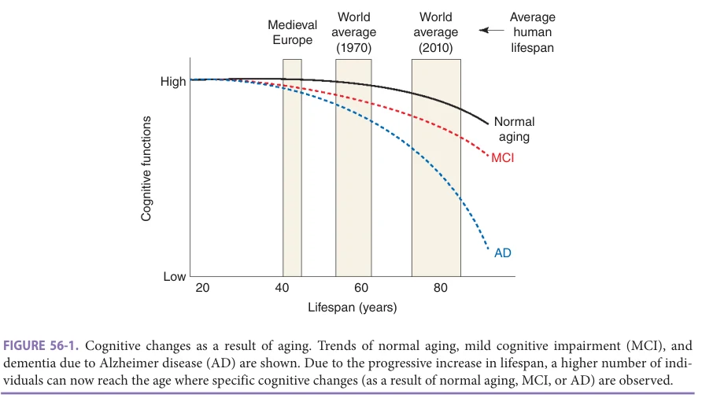
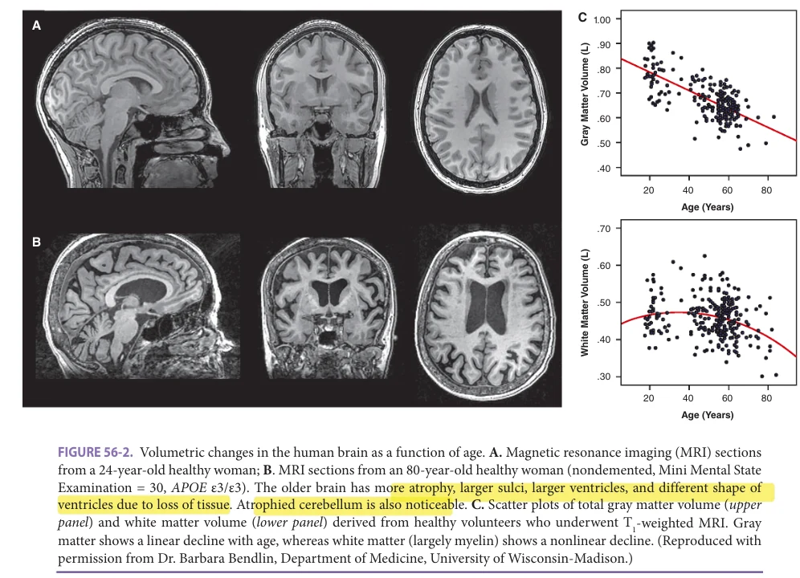
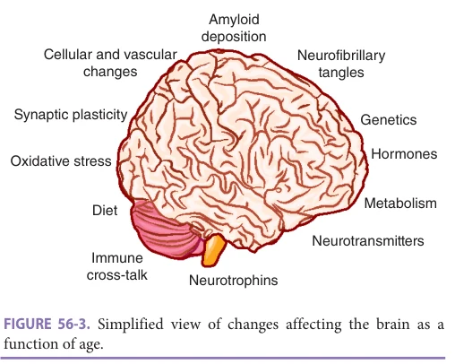
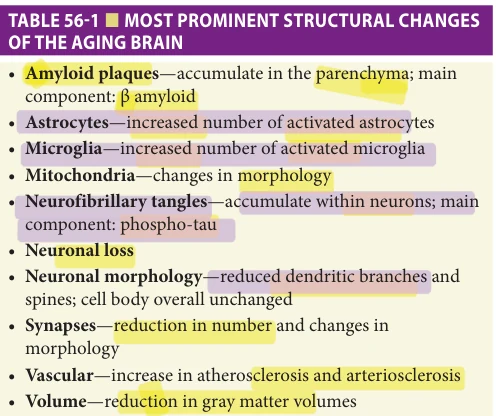
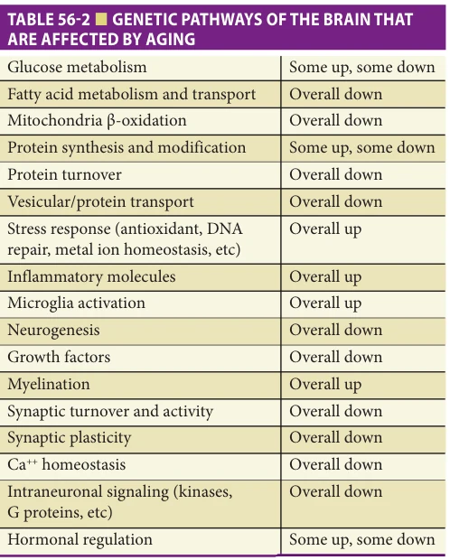
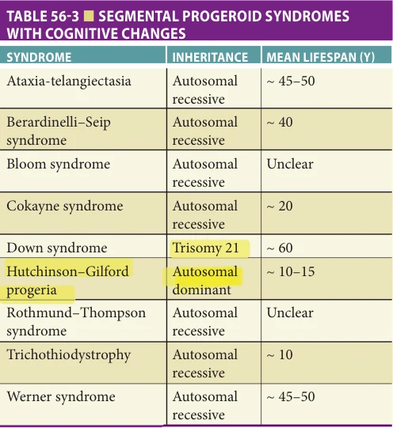
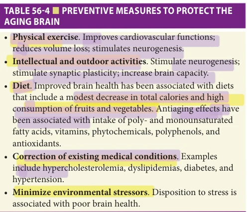
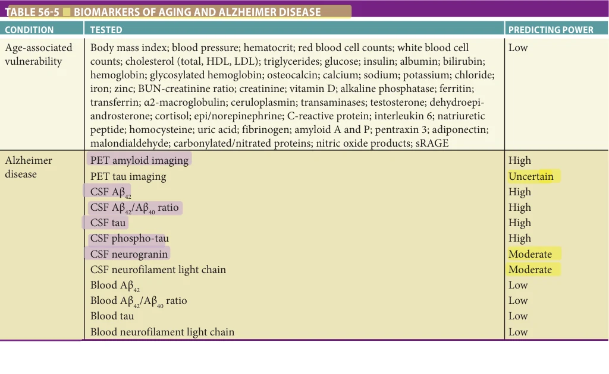

# Hazzard's Geriatric Medicine and Gerontology, 8e - Chapter 56: The Aging Brain

Luigi Puglielli

> **Status.** Fast build from the book; not lane-reviewed.

> Cited in the 2020-22 past papers (Hazzard 7e, linked by chapter).

> **Source and method.** Printed pages 835-852, from the marked 8th-edition copy (PDF page = printed page + 34). Prose follows its text layer; tables and figures are source-page crops. The book is canonical.

**[p. 835]**

The success of modern medicine during the last century has been followed by a sharp increase in the average lifespan of the world population. As a result, we have transitioned to a society where problems linked to age-associated disabilities and diseases are highly prevalent. These disabilities and diseases currently absorb a growing fraction of the costs associated with health care management. Importantly, within the next decade, the disability caused by cognitive decline and dementia combined is expected to become the most expensive. Therefore, efforts to study how aging affects brain functioning and why these changes predispose us to cognitive decline and/or dementia have become a priority for our society. Many cellular and molecular aspects of brain aging are shared with other organ systems, including defective autophagy, reduced efficiency in maintaining protein homeostasis, accumulation of intracellular and extracellular protein aggregates, increased oxidative damage to proteins, nucleic acids and membrane lipids, and impaired energy metabolism. However, given the molecular and structural complexity of neural cells, which express approximately 50 to 100 times more genes than cells in other tissues, there are agerelated changes that are unique to the nervous system. For example, complex cellular signal transduction pathways involving neurotransmitters, trophic factors, and cytokines that are involved in regulating neuronal excitability and plasticity are subject to modification by aging. These events are immediately reflected by changes in synaptic plasticity, functional connectivity, and global cognitive adaptability. This chapter describes cellular and molecular changes that occur in the brain during aging and how such changes may predispose to neurodegenerative diseases.

#### Learning Objectives

- Understand how aging affects the brain at the histologic, cellular, and molecular levels, and how these changes are linked to cognitive decline and common neurodegenerative diseases.

- Gain a clear understanding of the most prominent biochemical and molecular aspects of the aging brain.

- Learn about the effects of aging on cognition and neurodegenerative diseases.

- Recognize novel active areas of research in the field of cognitive neuroscience.

- Learn how environmental factors influence normal brain aging.

#### Key Clinical Points

1. Given the steady increase in average human lifespan, the number of individuals who will experience some degree of cognitive decline is rising.

2. Healthy aging is associated with atrophy of the gray matter; however, it is not indicative of presence of a disease.

3. Comprehensive clinical evaluation is necessary to differentiate mild cognitive impairment and dementia from normal aging-associated cognitive decline.

4. Specific aging-associated histologic, cellular, and molecular changes can predispose to neurodegenerative diseases.

5. Environmental factors can be modified to mitigate potential effects of aging on brain functions.

**[p. 836]**

*FIGURE 56-1. Cognitive changes as a result of aging. Trends of normal aging, mild cognitive impairment (MCI), and dementia due to Alzheimer disease (AD) are shown. Due to the progressive increase in lifespan, a higher number of individuals can now reach the age where specific cognitive changes (as a result of normal aging, MCI, or AD) are observed.*

*Owner annotations/highlights are from the marked source copy, not the book.*

## AGING AND COGNITION

A large segment of the world population will experience some degree of cognitive decline during aging (Figure 56-1). This decline most typically affects working memory as well as short-term and delayed memory recall; however, a smaller group of individuals will also experience reduced information processing speed and spatial memory. Most of the decline appears to occur after the age of 60 with minimal or nonexistent changes occurring between the age of 20 and 60. Functional magnetic resonance imaging and positron emission tomography studies suggest that the cognitive decline might be linked to the progressive reduction in the volume of specialized memory-forming and processing brain areas (Figure 56-2). Similar age-associated changes have been observed in nonhuman primates, dogs, rats, and mice, suggesting intrinsic age-associated events. Nonmedical interventions, such as physical exercise, cognitive stimulation, and diet together with treatment of common medical comorbidities, such as obesity, hypertension, hypercholesterolemia, diabetes, and metabolic/hormonal imbalances, might help mitigate age-associated declines.

It is widely projected that an exponentially increasing number of individuals will suffer from dementia and other cognitive disorders that will affect their daily function and increase mortality (see Figure 56-1). In 2000, the number of patients with dementia worldwide was estimated to be over 20 million. This number is projected to exceed 100 million by 2040, with an average of 5 million new cases every year. Rates of increase are not uniform. Developed countries initially shared most of the “dementia burden”; however, as a result of significant improvement in economic and social conditions, developing countries are now experiencing a larger disease burden. Consequently, the rate of increase

in the number of patients with dementia is projected to be almost 100% in developed countries and over 300% in developing countries. Major attention is now being given to the diagnosis of mild cognitive impairment (MCI), a transitional stage between normal aging and dementia. Patients with MCI display more severe cognitive deficits and more evident brain structural changes. In general, when diagnosed, they retain independence and are able to function normally within the society. However, they are at high risk to develop dementia, most typically Alzheimer disease, with an annual rate of conversion between 10% and 15%. Careful memory evaluation, lifestyle changes, and medical correction of existing risk factors might help delay conversion into clinical dementia.

The ability of the brain to reorganize, develop, and prune neural pathways is called synaptic plasticity. There are two components of synaptic plasticity that are thought to be important for learning and memory formation: longterm potentiation (LTP) and long-term depression (LTD). LTP involves a rapid influx of calcium into the neuronal cell, leading to the enhancement of cell excitability by the activation of intracellular signaling cascades that increase protein transcription, translation, and the insertion of new receptors into the cell membrane. LTD has the opposite effect, modulating transcription, translation, and the induction of receptors back into the cell that leads to decreased cell excitability. It is commonly believed that LTP and LTD are the cellular correlates of learning and memory and, therefore, great attention has been devoted to understanding how they are influenced by aging. In general, aged rodents show consistent deficits in induction and maintenance of LTP in the cornu ammonis area 1 (CA1) and in the dentate gyrus, two essential memory-forming areas of the brain.

**[p. 837]**

*FIGURE 56-2. Volumetric changes in the human brain as a function of age. A. Magnetic resonance imaging (MRI) sections from a 24-year-old healthy woman; B. MRI sections from an 80-year-old healthy woman (nondemented, Mini Mental State Examination = 30, APOE ε3/ε3). The older brain has more atrophy, larger sulci, larger ventricles, and different shape of ventricles due to loss of tissue. Atrophied cerebellum is also noticeable. C. Scatter plots of total gray matter volume (upper panel) and white matter volume (lower panel) derived from healthy volunteers who underwent T1-weighted MRI. Gray matter shows a linear decline with age, whereas white matter (largely myelin) shows a nonlinear decline. (Reproduced with permission from Dr. Barbara Bendlin, Department of Medicine, University of Wisconsin-Madison.)*

*Owner annotations/highlights are from the marked source copy, not the book.*

These deficits correlate with performance in hippocampaldependent memory tasks. Furthermore, LTP is reduced in the hippocampus of aged rats that demonstrate cognitive impairments relative to aged unimpaired (resilient) rats. Studies have also demonstrated that aged impaired rats are more susceptible to LTD. Specifically, the stimulus threshold for the induction of LTD is lower in aged rats, perhaps making it easier to erase memories. Finally, mouse models of accelerated aging display early and evident deficits in both LTP and LTD that correlate with memory impairment on behavioral tests.

In conclusion, the normal aging process is accompanied by specific changes in neuronal activities that are related to the formation and consolidation of memory, thus leading to a decline in cognitive functions. Given the significant increase in average lifespan that we are experiencing, the cognitive decline is becoming more evident forcing us to devote significant efforts in understanding the genetic, molecular, and biochemical changes that characterize the aging brain.

A similar important target of research is trying to understand why a subset of the aging population retains sufficient cognitive functions to remain fully functioning and independent throughout most of their life while others do not. This resistance or resilience to age-associated cognitive

decline or to age-associated dementia is observed even in the face of similar post-mortem brain alterations. Indeed, brain abnormalities that are typical of the aging brain (as well as the diseased brain), such as amyloid plaques, neurofibrillary tangles (NFTs), Lewy bodies, vascular changes, cortical atrophy, and hippocampal sclerosis, can be equally observed in brain autopsy among individuals that displayed age-associated cognitive decline or age-associated dementia and those that were able to maintain their cognitive functions. Therefore, dissection of the genetic, molecular, and biochemical events that underlie this evident resistance and resilience to aging itself or to age-associated dementia might help us understand how the brain adapts to age and disease, and identify appropriate preventive/therapeutic strategies.

## STRUCTURAL CHANGES IN THE AGING BRAIN

Aging is characterized by significant molecular, structural, cytoskeletal, neurochemical, and vascular changes (see Figure 56-2) in the brain. Structural changes (Figure 56-3) are diffuse and affect the cerebellum as well. Gray matter volumes show a linear decline, while white matter volumes show a nonlinear decline. At the cellular level, all major cell

**[p. 838]**

*FIGURE 56-3. Simplified view of changes affecting the brain as a function of age.*

*Owner annotations/highlights are from the marked source copy, not the book.*

types in the brain undergo structural changes as a function of age. These changes include nerve cell death, dendritic retraction and expansion, synaptic loss and remodeling, and glial cell (specifically, astrocytes and microglia) reactivity. Such structural changes may result from alterations in cytoskeletal proteins and the deposition of insoluble proteins such as tau and α-synuclein inside neuronal cells and amyloid in the extracellular space. Finally, alterations in cellular signaling pathways that control cell growth and motility may contribute to both adaptive and pathologic structural changes in the aging brain. Table 56-1 provides a brief summary of the most prominent changes.

### Functional Connectivity Changes

MRI-based analysis of structural and functional connectivity has revealed that the brain has highly connected regions, such as the hippocampal formation, cingulate gyrus, cuneus, precuneus, and superior frontal and parietal regions. These regions have a high density of intra- as

*TABLE 56-1 ■ MOST PROMINENT STRUCTURAL CHANGES OF THE AGING BRAIN*

*Owner annotations/highlights are from the marked source copy, not the book.*

well as inter-connectivity. Several cross-sectional studies support the conclusion that old age is associated with lower “within-network” and higher “between-network” connectivity. This shift is associated with reduced performance on memory- and executive-based tasks. The between network connectivity might reflect a compensatory attempt to maintain functional regional activity. Interestingly, there is also evidence that older adults display increased bilateral brain activation, while younger adults display preferential unilateral activation to achieve the same task-based performance. A major caveat of these studies is that they are almost exclusively cross-sectional; indeed, the few longitudinal studies performed so far have generated inconclusive results.

### Vascular Changes

As in other organ systems, vessels that supply blood to the brain are vulnerable to age-related atherosclerosis and arteriosclerosis, which render the vessels susceptible to occlusion or rupture (stroke), a major cause of disability and death in the older population. Reduced brain perfusion in the absence of overt stroke may play a role in agerelated cognitive dysfunction. Decreased cerebral blood flow occurs with advancing age and is accompanied by declines in cerebral metabolic rate for oxygen and glucose use. Age-related changes in cerebral vasculature are generally similar to those that occur in vessels elsewhere in the body and are therefore likely to result from common cellular and molecular changes, including accumulation of atherosclerotic plaques, oxidative damage to vascular endothelial cells, and an inflammatory response in which macrophages may penetrate the blood-brain barrier.

Age-dependent cerebral vascular changes are strongly linked to heart disease and hypertension. Interestingly, apolipoprotein E polymorphisms are linked to increased risk of both atherosclerosis and Alzheimer disease, with the apolipoprotein E4 increasing the risk. This association suggests that age-related vascular changes may make an important contribution to the neurodegenerative process in Alzheimer disease. Finally, important transport functions of cells (endothelial cells and astrocytes) that comprise the blood-brain barrier may also be impaired in the aging brain and more so in Alzheimer disease. Many of the same medical, behavioral, and dietary approaches now recognized to forestall cardiovascular disease may also forestall cerebrovascular disease; these approaches include correcting existing risk factors such as hypertension and hypercholesterolemia, engaging in physical and mental activities, preventing and/or correcting obesity, and taking a low-calorie and a high antioxidant diet.

### Synaptic Changes

Synapses are dynamic structural specializations where neurotransmission and other intercellular signaling events occur. There is considerable evidence for synaptic “remodeling” in the brain as we age. Most studies using nonbiased methods indicate that aging does not induce a substantial loss of total neurons in memory-forming and processing

**[p. 839]**

areas of the brain. However, several studies in rodents and nonhuman primates indicate that neurogenesis decreases in the aging brain, with the greatest decline occurring in middle-age groups. In addition to decreased neurogenesis, evidence suggests that aging is accompanied by loss of synapses. As an example, the extent of synaptic loss in the hippocampus has been correlated to the severity of learning impairment observed in aged rodents, supporting the notion that the loss of hippocampal synapses directly contributes to the cognitive impairment. The synaptic loss observed in the hippocampus of aged rats may be due to the loss of both presynaptic and postsynaptic terminals. Ultrastructural studies using electron microscopy have also revealed age-related changes in the type of terminals formed. For example, aged female monkeys with memory impairment have fewer multiple-synapse boutons and twice as many nonsynaptic boutons in the dentate gyrus. Furthermore, aged rodents and monkeys display significant loss of postsynaptic spines in the hippocampus and cortex associated with reduced cognitive performance.

Synapse loss occurs in neurodegenerative disorders and strongly correlates with clinical symptoms. Accumulating data suggest that synaptic degeneration, resulting from excitotoxic events localized to synapses, may initiate the neuronal death process in Alzheimer disease, Parkinson disease, Huntington disease, and stroke. Glutamate receptors are highly concentrated in postsynaptic dendritic spines, which represent sites of massive calcium influx during normal physiologic synaptic transmission. Age-related decreases in energy availability and increases in oxidative stress, and disease-specific alterations, such as amyloid β-peptide (Aβ) accumulation in Alzheimer disease and trinucleotide expansions of the huntingtin protein, may render synapses vulnerable to excitotoxic injury.

### Cytoskeletal Changes

The cell cytoskeleton consists of polymers of different sizes and protein compositions. The three major types of polymers are actin microfilaments (6 nm in diameter), microtubules (25 nm in diameter), which are composed of tubulin, and intermediate filaments (10–15 nm in diameter), which are made of specific intermediate filament proteins that differ in different cell types (eg, neurofilament proteins in neurons and glial fibrillary acidic protein in astrocytes). To regulate the processes of filament assembly and depolymerization, and to link the cytoskeleton to membranes and other cell structures, neurons and glial cells employ an array of cytoskeleton-associated proteins. For example, neurons express several microtubule-associated proteins (MAPs) that are differentially distributed within the complex architecture of the cells; MAP-2 is present in dendrites but not in the axon, whereas tau is present in axons but not in dendrites. While there are no major changes in the levels of the most abundant cytoskeletal proteins with aging, there are changes in the cytoskeletal organization and in posttranslational modifications (PTMs) of cytoskeletal proteins.

For example, increased amounts of phosphorylated tau occur in some brain regions, particularly those involved in learning and memory (eg, hippocampus and basal forebrain). In addition, there is evidence that calcium-mediated proteolysis of MAP-2 and spectrin (a protein that links actin filaments to membranes) is increased in some neurons during aging. Oxidation of certain cytoskeletal proteins is suggested by studies demonstrating their modification by glycation and covalent binding of the lipid peroxidation product 4-hydroxynonenal. A consistent feature of brain aging in humans and laboratory animals is an increase in levels of glial fibrillary acidic protein, a marker of astrocyte activation, which may represent a reaction to subtle neurodegenerative changes.

Tau proteins are perhaps the most studied MAPs in neurobiology. They consist of a group of alternatively spliced proteins that ensure microtubule-dependent neuronal functions by binding and stabilizing the microtubules. In general, the degree of phosphorylation inversely correlates with binding. As a result, hyperphosphorylated tau proteins dissociate from microtubules and aggregate to form cytosolic filaments, which ultimately result in NFTs, pathogenic aggregates that characterize different forms of age-associated frontotemporal dementias (globally referred to as tauopathies) as well as Alzheimer disease. The number and distribution of NFT also increase as a function of age. In addition to the phosphorylation status, the proaggregating properties of tau depend on the differential splicing of the MAPT gene, which results in the different tau isoforms. The pattern of phosphorylation and splicing of tau differs in the fetal and adult brain and in the central and peripheral nervous system. It also differs among mammals, probably explaining why only humans and nonhuman primates develop classical NFT. Work in multiple mouse models has shown that abnormal tau metabolism can cause memory deficits. Furthermore, genetic disruption of tau in mouse models of Alzheimer disease can rescue the cognitive deficits associated with the disease phenotype. Finally, mutations in the gene encoding tau proteins (MAPT) have been associated with hereditary forms of frontotemporal dementias, whereas polymorphisms in the same gene appear to act as genetic risk factors for sporadic progressive supranuclear palsy and corticobasal degeneration.

Intraneuronal pathogenic aggregates are also observed in other neurodegenerative diseases, underscoring common features. In Parkinson disease, degenerating neurons of the central nervous system accumulate Lewy bodies, which are composed of α-synuclein, ubiquitin, and neurofilament protein, with associated MAPs (particularly MAP-1b) and actin-related proteins such as gelsolin. In amyotrophic lateral sclerosis, lower motor neurons are filled with aggregates made of superoxide dismutase 1 (SOD1), TDP-43, and neurofilaments, which concentrate in proximal regions of the axon. The specific molecular events involved in the formation of cytoskeletal alterations in different neurodegenerative disorders have not been

**[p. 840]**

clearly and definitively established. More information on specific pathogenic aggregates that characterize different neurodegenerative diseases can be found in Chapters 59, 61, and 63.

### Amyloid Accumulation

The amyloid β-peptide (Aβ) is a 38- to 49-amino acid peptide that arises from a much larger membrane-spanning precursor, the amyloid precursor protein (APP). During normal aging, and to a much greater extent in Alzheimer disease, Aβ forms insoluble aggregates in the brain parenchyma and vasculature. Of the above different Aβ species, the 40- and 42-aa long peptides are by far the most abundant; Aβ40 preferentially accumulates in the vasculature, while Aβ42 preferentially accumulates in the parenchyma. Small Aβ aggregates (oligomers) can be neurotoxic and can increase neuronal vulnerability to metabolic, excitotoxic, and oxidative insults. Aβ aggregates are organized as fibrils of approximately 7 to 10 nm in the amyloid plaques (also referred to as senile plaques), which accumulate in the brain parenchyma and are intermixed with nonfibrillary forms of the peptide and often surrounded by dystrophic neurites.

In addition to Alzheimer disease brains, amyloid/senile plaques are also present in the hippocampus and neocortex of cognitively normal aged individuals and tend to increase in an age-dependent fashion. Although still under debate, it is now becoming apparent that the number and/or distribution of amyloid plaques does not immediately correlate with cognitive decline. The synaptic loss and the number/distribution of NFTs appear to be better predictors of memory deficits. Indeed, the neuronal/synaptic loss of the hippocampal formation, entorhinal cortex, and entorhinal-hippocampal association system appears to be the only feature able to distinguish normal aging from MCI and the early stages of Alzheimer disease. Although amyloid plaques do not closely correlate with memory deficits, a high plaque load is rarely observed in the absence of cognitive impairment.

Aβ originates from proteolytic cleavage of a much larger precursor, the APP, a type I membrane protein that inserts in the endoplasmic reticulum (ER) before being transported to the neuronal surface. Proteolysis of APP can occur within the secretory pathway while transiting to the cell surface or on the cell surface itself. Substantial evidence indicates that intracellular Aβ aggregates are more pathogenic than amyloid plaques and strongly associate with neuronal and synaptic loss.

Detailed information on the mechanisms that lead to the generation and accumulation of Aβ in the brain as well as Alzheimer disease–relevant pathogenic features can be found elsewhere in this book (see Chapter 59).

### Inflammatory Microglia

Microglia are different for other brain-resident cells in the sense that they do not originate from the neural tube. They derive from the yolk sac and invade the central nervous system at approximately the same time neurons are

formed. As the brain develops, microglia establish close connections with neurons and participate in many important developmental functions such as neurogenesis, synapse pruning, and modeling of synaptic networks. In the adult brain, microglia maintain strong connections with mature neurons and continue participating in essential neuronal functions. They respond to neuronal activity but are also capable of triggering neuronal responses. An essential aspect of microglia biology is their ability to respond to a variety of noxae and transition from a quiescent to an immune-active state. The quiescent state is recognized by a ramified morphology and is mostly maintained through soluble molecules that are secreted by healthy neurons. In the presence of neuronal damage, microglia assume phagocytic features and become ameboid-like. When activated, microglia can migrate to the site of injury and secrete proinflammatory cytokines that are essential during the acute phases of injury. Fundamental functions of activated microglia include elimination of damaged/dystrophic neurites, phagocytosis of cellular debris and toxic protein aggregates, promotion of neuronal repair, and neurotrophism.

Compelling evidence indicates that microglia can undergo a process of cellular aging that significantly alters their functions. “Senescent” microglia have dystrophic morphology with process abnormalities such as shortening, deramification, and swelling, as well as cytoplasmic fragmentation and cytorrhexis. They also display reduced motility and phagocytic abilities. The most consistent cellular features of senescent microglia include ER stress, reduced autophagy, accumulation of iron, and secretion of many proinflammatory molecules. This altered proinflammatory signature appears to be a fundamental aspect the aging brain. Importantly, the transcriptome of activated, senescent microglia differs significantly from the transcriptome of normal activated microglia supporting the concept that indeed these are two different cellular states. Such a profile is also observed during age-associated neurodegenerative diseases including Alzheimer disease, Parkinson disease, and tauopathies. Dystrophic “senescent-like” microglia are found in close proximity of amyloid plaques, NFTs, and Lewy bodies. They also appear to react to protein aggregates such as Aβ, NFTs, or α-synuclein. Finally, mutations and genetic variants in genes related to microglia functions have been linked to different late-onset/sporadic forms of neurodegenerative diseases. Examples are TREM2 and CD33 in Alzheimer disease, TLR2 and LRRK2 in Parkinson disease, and CSF1R in dementia with parkinsonism.

## ALTERATIONS IN ENERGY METABOLISM AND MITOCHONDRIAL FUNCTION IN THE AGING BRAIN

During the aging process, changes that occur in cerebral blood vessels, as well as in the neural cells themselves, appear to result in reduced energy availability to neurons. These age-related changes may be accelerated in several

**[p. 841]**

different neurodegenerative disorders including Alzheimer disease and Parkinson disease.

### Cerebral Metabolism

Reduced glucose use, and changes in enzymes involved in energy metabolism, may occur during normal aging, but are not dramatic. Studies of aging rodents document decreases in glucose and ketone body oxidation, oxygen consumption, local cerebral glucose use, and glycolytic compounds (eg, fructose-1,6-diphosphate). Additional studies show that brain cells in older animals exhibit increased vulnerability to metabolic stresses. Incorporation of glucose into amino acids declines in the brain of aging mice, and older people are much more vulnerable to metabolic encephalopathy than young people. In contrast to normal aging, activities of several enzymes involved in energy metabolism are severely reduced in Alzheimer disease brain tissue. Three such enzymes, which are involved in mitochondrial oxidative metabolism, are the pyruvate dehydrogenase complex, the α-ketoglutarate dehydrogenase complex, and cytochrome c oxidase. These defects may result from age-associated oxidative damage to the DNA encoding these enzyme systems and/or reduced activity of the proteins in these systems.

Another factor that may contribute to reduced neuronal energy metabolism is impairment of the function of glucose transporter proteins in neuronal membranes. Studies of postmortem brain tissue of Alzheimer disease patients document reduced levels of glucose transporters, and experimental studies of cultured hippocampal neurons and synaptosomes show that insults relevant to the pathogenesis of Alzheimer disease (exposure to Aβ and oxyradical-generating agents) can impair glucose transport. Impairment of glucose transport and mitochondrial dysfunction would be expected to lead to ATP depletion and render neurons vulnerable to excitotoxicity.

### Mitochondrial Function

Age-related structural changes in synaptic mitochondria have been reported and include a decrease in numbers and increase in size. During normal aging, levels of mitochondrial protein synthesis are unchanged. However, decreases in synthesis of specific mitochondrial proteins that are components of the electron transport chain occur in aging rodents. Damage to mitochondrial DNA progressively increases in somatic cells during the aging process, with the most pronounced damage occurring in postmitotic cells such as neurons. Mitochondrial dysfunction has been linked to several neurodegenerative disorders. In Parkinson disease, there are marked decreases in complex I and αketoglutarate dehydrogenase activities. Exposure of cultured dopaminergic neurons to insults relevant to the pathogenesis of Parkinson disease (eg, MPTP and Fe2+) causes mitochondrial dysfunction. In Alzheimer disease, cytochrome c oxidase and α-ketoglutarate dehydrogenase activity levels are markedly reduced in vulnerable

brain regions. Interestingly, mitochondrial deficits are also observed in nonneuronal cells, including platelets and fibroblasts, of Alzheimer disease patients. When mitochondria from platelets of Alzheimer disease patients are introduced into cultured neuroblastoma cells, levels of oxidative stress are increased, suggesting an important contribution of mitochondrial alterations to the increased oxidative stress present in neurons of Alzheimer disease brain. Mitochondrial alterations in neurons have been documented in studies of mouse models of Alzheimer disease (APP and presenilin mutant mice), Parkinson disease (α-synuclein mutant mice), Huntington disease (huntingtin mutant mice), and stroke (middle cerebral artery occlusion).

## NEURONAL ION HOMEOSTASIS IN THE AGING BRAIN

Among the properties of neurons that set them apart from many other cell types is their excitability, which is regulated by a complex array of neurotransmitters and ion channels. Neurons express voltage-dependent sodium channels, as well as multiple types of calcium and potassium channels that are differentially expressed among neuronal populations, and are segregated in different cellular compartments (eg, L-type calcium channels in the cell body, N-type calcium channels in the dendrites, and T-type calcium channels in presynaptic terminals). In addition, neurons possess ion-motive ATPases that play critical roles in reestablishing ion gradients following neuronal stimulation. A variety of age-related alterations in electrophysiologic parameters of neurons have been described in rodents (described earlier in this chapter) and, in some cases, in humans, including increased thresholds for induction of action potentials in cranial nerves, increased after hyperpolarizations in hippocampal neurons, and impaired LTP/LTD of synaptic transmission in the hippocampus. Moreover, a generalized decrease in neuronal inhibition appears to occur during the aging process.

The calcium ion plays fundamental roles in regulating neuronal survival and plasticity in both the developing and adult nervous system. Calcium mediates some of the effects induced by neurotransmitters and neurotrophic factors on neurite outgrowth, synaptogenesis, and cell survival in many different regions of the developing nervous system. Furthermore, in the adult nervous system, calcium regulates neurotransmitter release from presynaptic terminals and influences postsynaptic changes associated with learning and memory processes. Aging may result in decreases in the activity of the plasma membrane calcium ATPase and in levels of calcium-binding proteins, while increasing calcium influx through voltage-dependent channels and increasing the activation of calcium-dependent proteases.

Several studies have measured and determined changes in calcium transmission across the neuronal membrane in aged rodents. The final step in synaptic transmission that triggers LTP or LTD is dependent on the amount

**[p. 842]**

of calcium entering the cell. Therefore, changes in calcium conductance across the cell membrane could have significant effects on synaptic plasticity in aged animals. Studies have revealed that aged rats display an increased density of L-type Ca++ channels in CA1 pyramidal cells, leading to increased L-type Ca++ currents. In addition, CA1 pyramidal cells from aged rodents also show an increased duration of calcium-mediated action potentials. The inward flux of calcium in response to an action potential activates a calciummediated inward potassium current. These potassium channels are slower to open and close than calcium channels, which leads to a temporary after-hyperpolarization of the cell following an action potential. Studies have revealed that this phenomenon is increased in aged rodents and rabbits, leading to less frequent firing of action potentials in response to a prolonged depolarizing current. Taken together, these data demonstrate that age-related changes in calcium transmission underlie detrimental changes in synaptic plasticity and may partially explain the deficits in plasticity seen over the course of aging.

## NEUROTRANSMITTER SIGNALING IN THE AGING BRAIN

A number of alterations in different neurotransmitter systems have been documented in studies of aging rodents and in analyses of brain tissues from humans with agerelated neurodegenerative disorders. While some of these alterations likely result from neuronal degeneration, others appear to occur in the absence of cell injury.

### Cholinergic Systems

Acetylcholine is employed as a neurotransmitter in select populations of neurons in the brain, prominent among which are basal forebrain neurons that innervate widespread regions of the neocortex and hippocampus; these cholinergic neurons are known to play key roles in learning and memory processes in humans and rodents. Deficits in one or more aspects of cholinergic signal transduction may occur with aging including choline transport, acetylcholine synthesis, acetylcholine release, and coupling of muscarinic receptors to their GTP-binding effector proteins. Cholinergic deficits are much more severe in Alzheimer disease patients and differ qualitatively from the changes observed during normal aging. Particularly striking is a reduced ability of muscarinic agonists to activate GTP-binding proteins in cortical neurons. Increased levels of membrane lipid peroxidation in neurons may contribute to impaired cholinergic signaling; for example, Aβ, Fe2+, and the lipid peroxidation product 4-hydroxynonenal can impair coupling of muscarinic receptors to the GTP-binding protein Gq11.

### Dopaminergic Systems

Prominent reductions in both pre- and postsynaptic aspects of dopaminergic neurotransmission occur during brain aging. Decreases in dopamine levels and dopamine

transporter levels in the striatum occur with advancing age, and there is an age-related decrease in levels of D2 receptor-binding sites in striatum. As with cholinergic signal transduction, there also appears to be an age-related impairment of coupling of dopamine receptors to their GTP-binding effector proteins. The contribution of oxidative stress to changes in dopaminergic signaling has not been established, although the prominent role of oxyradicals in the pathogenesis of Parkinson disease argues that similar oxidative processes contribute to dopaminergic dysfunction during normal aging. These changes in dopaminergic signaling likely play a role in age-related deficits in motor control and may explain the fact that the older adults are susceptible to extrapyramidal effects of dopamine receptor antagonist drugs.

### Monoaminergic Systems

Norepinephrine and serotonin are the major monoamine neurotransmitters in the brain. Noradrenergic neurons are located primarily in the locus caeruleus and serotonergic neurons in the raphe nucleus; both types of neurons project to widespread regions of cerebral cortex. There are several subtypes of receptors for norepinephrine, some of which couple to GTP-binding proteins. There are also several subtypes of serotonin receptors; some couple to GTP-binding proteins while others are ligand-gated ion channels. There appears to be increased levels of norepinephrine with aging in some brain regions, while levels of α2-adrenergic receptors may decrease in cerebral cortex with advancing age. Levels of serotonin may decrease in the striatum, hippocampus, and cerebral cortex. Age-related decreases in levels of evoked serotonin release and of serotonin-binding sites have been reported and may contribute to affective disorders such as depression.

### Amino Acid Transmitter Systems

The amino acid glutamate is the major excitatory neurotransmitter in the human brain. Glutamate stimulates ionotropic receptors that flux calcium and sodium; excessive activation of ionotropic glutamate receptors may play a role in the degeneration of neurons in several age-related disorders including stroke, Alzheimer disease, Parkinson disease, and Huntington disease. Levels of ionotropic glutamate receptors were reported to decrease with aging, but these decreases may be the result of degeneration of the neurons expressing the receptors. The contribution of dysfunction of glutamatergic transmission, in the absence of neuronal death, to age- and disease-related deficits in brain function is unknown. The major inhibitory neurotransmitter in the human brain is γ-aminobutyric acid (GABA). Relatively little information is available concerning the impact of aging on GABAergic systems, although levels of glutamate decarboxylase and GABA-A binding sites may be decreased. Interestingly, GABAergic interneurons are typically spared in various neurodegenerative disorders including Alzheimer disease.

**[p. 843]**

## NEUROENDOCRINE CHANGES IN THE AGING BRAIN

A variety of age-related alterations in neuroendocrine systems have been documented. Of particular importance for human brain aging and neurodegenerative disorders are changes in levels of steroid hormones, particularly glucocorticoids and estrogens. There is considerable evidence for age-related alterations in the diurnal regulation of circulating glucocorticoid levels and an increase in the mean level. Moreover, regulation of the hypothalamic-pituitaryadrenal axis is altered in Alzheimer disease patients, such that plasma levels of glucocorticoids are increased. Increased levels of glucocorticoids, including those induced by physiologic or psychological stress, can increase the vulnerability of hippocampal neurons to injury and death caused by ischemic and excitotoxic insults, suggesting that glucocorticoids may have a negative impact on the outcome of both acute (eg, stroke) and chronic (eg, Alzheimer disease) age-related neurologic disorders. Estrogen (17β-estradiol) may have a beneficial effect on brain aging. Epidemiologic studies suggest a reduced risk of Alzheimer disease in postmenopausal women who take estrogen replacement therapy, and older women who take estrogens perform better on cognitive tasks. Surgical ovariectomy in rodents causes changes in neurotrophin receptor signaling, promotes the generation and accumulation of Aβ, and is associated with memory deficits. These effects are abrogated by exogenous estrogens. Finally, animal and cell culture studies have shown that 17β-estradiol can protect neurons from being damaged and killed by insults relevant to ischemia and Alzheimer disease, including glucose deprivation, exposure to Aβ, and expression of Alzheimer disease–linked presenilin mutations. Results of clinical findings, however, have not provided convincing evidence that estrogen treatment either reduces risk for Alzheimer disease or related illnesses or enhances cognition.

## IMMUNOLOGIC FACTORS IN THE AGING BRAIN

While the blood-brain barrier limits access of circulating lymphocytes to neurons in the brain, it is becoming increasingly evident that the brain is by no means devoid of immune responses. The brain possesses resident immune effector cells called microglia (described earlier in this chapter) that may respond to age- and disease-related neurodegenerative processes. Some data suggest that a decline in peripheral immune function during aging may lead to an autoimmune-like phenomenon in the brain wherein microglia is activated. Inflammatory processes are associated with, and contribute to, the neurodegenerative process in Alzheimer disease and other age-related neurodegenerative disorders; these include activation of microglia in the affected brain regions, increased local cytokine production in association with the neuropathologic changes,

and activation of components of the complement cascade system. Collectively, the emerging data suggest a role for chronic inflammatory reactions in the pathogenesis of at least some neurodegenerative disorders. Recent studies have revealed that the choroid plexus, an epithelial monolayer that produces cerebrospinal fluid (CSF) and maintains a dynamic interface between the CSF and the blood, undergoes age-associated changes that are consistent with a type I interferon effect. Importantly, blocking type I interferon activity in aged mice is sufficient to reestablish a “young” choroid plexus activity and improve memory functions. Also intriguing is the fact that these changes appear to be driven by inflammatory changes that originate from both the brain parenchyma and the systemic circulation. Together, these results suggest that changes in inflammatory markers in the brain or in the periphery can influence (positively or negatively) memory functions; they also suggest that the choroid plexus plays an important role in the age-associated cognitive decline.

## NEUROTROPHIC FACTORS IN THE AGING BRAIN

Cells in the nervous system produce a variety of proteins that serve the function of promoting neuronal survival and growth, and protecting the neurons against injury and death. Examples of such “neurotrophic factors” (also referred to as neurotrophins) include nerve growth factor (NGF), brain-derived neurotrophic factor (BDNF), neurotrophin-3, neurotrophin-4, basic fibroblast growth factor (bFGF), and insulin-like growth factor (IGF). Neurotrophic factors are remarkable in that they can protect neurons against a variety of insults relevant to the pathogenesis of age-related neurodegenerative conditions. For example, bFGF can protect hippocampal and cortical neurons against metabolic, oxidative, and excitotoxic insults, and can greatly reduce brain damage in rodent models of stroke. One or more neurotrophic factors have also been shown to protect neuronal populations against neurodegenerative disorder-specific insults. Examples are the ability of BDNF to protect dopaminergic neurons against MPTP toxicity (Parkinson disease model) and hippocampal neurons against Aβ-mediated toxicity (Alzheimer disease model). The precise mechanism(s) whereby neurotrophic factors can rescue or prevent neuronal degeneration are unclear and might be different in different neuronal populations. In addition to preserving existing neurons, neurotrophic factors may stimulate the production of new neurons from neuronal stem cells. Such neural stem cells may be able to replace lost or damaged neurons and are therefore receiving considerable attention for their potential use in the treatment of neurodegenerative disorders. An intriguing feature of neurotrophic factors is that their expression is increased by activity in neuronal circuits. Experimental studies in cell culture and in vivo show that such activitydependent production of neurotrophic factors plays a

**[p. 844]**

major role in promoting neuronal survival and neurite outgrowth. Rearing of rodents in an “intellectually enriched” environment results in expansion of dendritic arbors and increased numbers of synapses in hippocampus and certain regions of cerebral cortex.

The activity and the specificity of neurotrophic factors depend on specific cell-surface receptors. Examples are the tyrosine-kinase family of receptors, TrkA, TrkB, and TrkC, and the p75 neurotrophin receptor (p75NTR). These receptors can assemble as homo- and heterodimers, which display different affinity to specific neurotrophic factors and provide signaling specificity. For example, TrkA:p75NTR heterodimers have higher affinity to NGF than TrkA:TrkA and p75NTR:p75NTR homodimers. Therefore, depending on how these receptors assemble on the neuronal surface, they can transduce slightly different or completely different signals. During aging the levels of TrkA decrease while those of p75NTR increase, thus an expression pattern that favors the formation of TrkA:TrkA homodimers will switch toward an expression pattern that favors the formation of TrkA:p75NTR heterodimers and p75NTR:p75NTR homodimers. While this switch occurs, the levels of NGF remain overall unchanged. However, since the affinity of the above receptor complexes for NGF is different, the signaling cascade will change as a result of aging. As an example, the above TrkA-to-p75NTR switch has been linked to cognitive decline and increased risk of Alzheimer disease in rodents. A TrkAto-p75NTR switch has also been observed following surgical menopause in rodents, suggesting a possible impact in postmenopausal women.

The above competing activity of neurotrophin receptors is further complicated by the competing activity of neurotrophins. An example is BDNF competing with NGF for binding on TrkA:TrkA homodimers and pro-NGF competing with NGF for binding on p75NTR:p75NTR homodimers and TrkA:p75NTR heterodimers. Importantly, levels of pro-NGF increase as a function of age while those of NGF remain unchanged. Mice with increased levels of proNGF develop a brain phenotype that resembles Alzheimer disease, and postmortem Alzheimer disease brain tissues express more pro-NGF than age-matched controls. In conclusion, complex scenarios can result as a function of aging leading to different neurotrophin-receptor interactions and, ultimately, to different biological effects. Since some of these changes are brain areas specific, we can expect different physiologic/pathologic outcomes.

## AUTOPHAGY AND THE AGING BRAIN

Autophagy is an evolutionary conserved catabolic process that enables the cell to respond to both extracellular and intracellular stress signals in order to maintain cellular homeostasis. It helps dispose of large toxic protein aggregates that form within the cell, digest sick/damaged organelles, respond to pathogenic infections, and manage a plethora of metabolic challenges. The basic process of

autophagy requires “sequestration” of unwanted material (ie, toxic protein aggregates or damaged organelles) into a double-membrane vesicular structure called autophagosome, which then will fuse with lysosomes where enzymatic digestion of the entire autophagosome occurs. This process is tightly regulated and involves more than 40 different proteins collectively referred to as the “autophagy machinery.” To ensure correct activation and recruitment of this machinery, the cell has devised a series of organelleand compartment-specific receptors that allow autophagy to be activated in a very specific and targeted fashion. Words like reticulophagy/ER-phagy, mitophagy, and nucleophagy are examples of commonly used expressions to indicate ER-specific autophagy, mitochondria-specific autophagy, and nucleus-specific autophagy, respectively.

Malfunction of autophagy contributes to the progression of many diseases across lifespan, including sporadic and hereditary forms of neurodegeneration, cancer, inflammation, and many age-associated diseases. Reduced or malfunction of autophagy is also considered a hallmark of cellular aging. Many progressive forms of neurodegenerative diseases, including Alzheimer disease, Parkinson disease, and taupoathies are characterized by the aberrant accumulation of toxic protein aggregates. Compelling data indicate that increased levels of autophagy can be beneficial in mouse models of diseases characterized by increased accumulation of toxic protein aggregates. As such, improving normal proteostatic mechanisms is an active target for biomedical research, thus explaining the large number of ongoing clinical trials exploring the therapeutic potential of stimulating autophagy.

Genetic or pharmacological stimulation of autophagy in Caenorhabditis elegans, Drosophila Melanogaster, and mammals improves metabolic health and proteostasis (protein homeostasis), and extends lifespan. The lifespan extension can go from as low as 20% to as high as 80% indicating a rather robust effect. Conversely, genetic manipulations that reduce or block the autophagic response lead to reduced lifespan and a plethora of phenotypic manifestations that are consistent with accelerated forms of pathogenic aging. An example of this complexity is the ER acetylation machinery, which is responsible for the disposal of toxic protein aggregates that form within the ER and secretory pathway. ER acetylation is ensured by a membrane transporter, AT-1, which translocates acetylCoA from the cytosol into the ER lumen. In the ER lumen, acetyl-CoA is used by two ER-based acetyltransferases, ATase1 and ATase2, which acetylate ER resident- and transiting-nascent glycoproteins. Genetic manipulations that lead to increased influx of acetyl-CoA into the ER and increased ER acetylation in the mouse (AT-1 sTg mice) cause a segmental form of progeria. The phenotype is reminiscent of the progeria-like manifestations of patients with gene duplications of AT-1, and includes alopecia, skin lesions, rectal prolapse, osteoporosis, cardiomegaly, muscle atrophy, cognitive impairment, systemic inflammation, and

**[p. 845]**

accumulation of senescent cells. Biochemical inhibition of the ATases, downstream of AT-1 can restore the proteostatic function of the ER and rescue the progeria phenotype of AT-1 sTg mice. Furthermore, genetic or biochemical inhibition of the ATases can significantly delay the progression of Alzheimer disease in the mouse.

A major caveat of the translational approaches aimed at stimulating autophagy and improving the proteostatic capacity of the cell is the fact that—as mentioned above— autophagy itself is highly selective and can be triggered to dispose of toxic protein aggregates in different places (ie, ER and secretory pathway, cytosol, mitochondria). Therefore, a “one-approach strategy” that fits all neurodegenerative diseases will not be viable, and different autophagy-stimulating compounds will have high degree of disease specificity.

## GENETIC FACTORS IN BRAIN AGING AND NEURODEGENERATIVE DISORDERS

Several microarray studies have now been performed in mice, rats, nonhuman primates, and humans to analyze the genetic profile of the aging brain. They all indicate that normal aging is not accompanied by a genome-wide dysregulation of transcription but rather by specific changes that affect only a small subset of genes, which accounts for about 3% to 5% of all the genes expressed in the brain. These changes (Table 56-2) will not be discussed here as their overall biological significance is still uncertain. Of note, a similar expression profile was also found in patients with

*TABLE 56-2 ■ GENETIC PATHWAYS OF THE BRAIN THAT ARE AFFECTED BY AGING*

*Owner annotations/highlights are from the marked source copy, not the book.*

Alzheimer disease supporting the view that a continuum might exist between normal aging and Alzheimer disease.

### Longevity Genes

It is now evident that specific genetic, biochemical, and molecular pathways are intrinsically related to aging. Some of these pathways were initially identified in lower organisms and then later confirmed in higher organisms, while others were immediately identified in higher organisms. These include the insulin-like growth factor 1 receptor (IGF-1R), Delta40p53, and Klotho.

Among them, IGF-1R has probably received more attention. The first evidence that IGF-1R signaling can regulate the progression of aging came from C elegans, where mutations that reduce IGF-1R activity were able to increase the lifespan of the animal. Similar results were then obtained in D melanogaster and, later on, in mammals. Importantly, mutations that act on IGF-1R downstream targets were also able to modify the lifespan of the animals providing robust and definitive connection between IGF-1R and aging. Overall, reduced IGF-1R activity extends lifespan and delays age-associated events, while increased IGF-1R activity achieves the opposite effects. A partial block of IGF-1R signaling is also achieved by caloric restriction, which extends the maximum lifespan and delays many biological changes that are associated with aging. In humans, genetic variations that reduce IGF-1R signaling appear to be beneficial for old age survival and preservation of cognitive functions, suggesting that the mechanisms regulating lifespan and aging via this pathway are evolutionary conserved. Finally, reduced IGF-1R signaling can rescue Alzheimer disease in mouse models.

Delta40p53 is a short N-terminal truncated isoform of the tumor suppressor gene TP53. The common TP53 gene generates at least 12 different proteins through a combination of alternative promoter usage, alternative splicing, and alternative initiation of translation. Of them, p53 is the most “famous” and most studied due to its pathogenic role in many forms of cancer. Delta40p53 (also referred to as p44 or p47) lacks the first N-terminal 39 amino acids of fulllength p53 but retains the DNA-binding domain as well as one of the two transactivation domains. Delta40p53 retains some of p53 functions but lacks others; it retains some of the regulatory elements but lacks others. Mice overexpressing full-length p53 (“Super p53” mice) are resistant to cancer development but have normal maximum lifespan. In contrast, mice overexpressing Delta40p53 (p44+/+ mice) display a segmental progeria phenotype that mimics an accelerated form of pathogenic aging. The phenotype includes early onset of diabetes, osteoporosis, memory impairment, and reduced lifespan. To date at least five additional mouse models with altered p53 activity have been shown to develop an accelerated aging phenotype providing robust and definitive connection between TP53 and aging. Recent studies have also shown that Delta40p53 regulates the generation of Aβ as well as the phosphorylation status of tau,

**[p. 846]**

suggesting a possible connection with the accumulation of amyloid plaques and NFTs that characterizes the aging as well as the Alzheimer disease brain (discussed earlier in this chapter). Interestingly, mice engineered to overexpress p44 develop an accelerated form of Alzheimer disease neuropathology.

Klotho is a cell-surface membrane protein that can also be released in the circulation. Klotho has glycosidaselike activity. Its levels and enzymatic activity decline during aging. Genetic variants of KLOTHO are associated with human aging and klotho-deficient mice display a progeroid phenotype that resembles aging. The phenotype includes atherosclerosis, skin atrophy, osteoporosis, reduced fertility, emphysema, memory defects, and reduced lifespan. In contrast, mice overexpressing klotho display increased lifespan and increased resistance to several age-associated features. A possible connection between klotho and IGF-1R has also been delineated. Human variations that lead to increased circulating levels of klotho are associated with greater cortical volumes in the brain. Finally, overexpression of klotho in the mouse enhances cognition and rescues some of the deficits that characterize Alzheimer disease.

In addition to the above, polymorphisms that are associated with longevity and preserved physiologic functions have also been identified in two cholesterol-related genes, apolipoprotein E (APOE) and cholesteryl ester transfer protein (CETP). APOE carries cholesterol in the circulation, while CETP facilitates the transfer of cholesteryl esters and triglycerides between circulating lipoproteins. Individuals normally inherit two APOE alleles, of which there are three isoforms (E2, E3, and E4). The E2 allele has been linked to longevity and reduced incidence of Alzheimer disease. In contrast, the E4 allele has been linked to increased risk for Alzheimer disease. Certain CETP variants have been linked to increased levels of high-density lipoproteins (HDLs), reduced progression of atherosclerosis, and longevity. The “longevity effect” of APOE and CETP might be explained, at least in part, by their ability to reduce the progression of atherosclerosis in the vasculature.

Another possible longevity gene is that encoding an isoform of angiotensin-converting enzyme, although its mechanistic links to aging are unclear. Finally, the multigene major histocompatibility system appears to influence lifespan and may act by sustaining functions of the immune system. Additional information on longevity genes and their impact in age-associated events can be found in Chapter 1.

### Disorder-Specific Genes

Considerable progress has been made in studying human genetic disorders that cause progeroid syndromes, which are characterized by a disease phenotype mimicking an “accelerated” form of aging. Although progeroid syndromes can be classified as unimodal (affecting one tissue/ organ) and segmental (affecting multiple tissues/organs), the term progeroid syndrome is usually limited to the segmental forms of the disease (Table 56-3). Examples

*TABLE 56-3 ■ SEGMENTAL PROGEROID SYNDROMES WITH COGNITIVE CHANGES*

*Owner annotations/highlights are from the marked source copy, not the book.*

include Werner syndrome, Bloom syndrome, Rothmund– Thomson syndrome, Hutchinson–Gilford progeria syndrome, and Cokayne syndrome. Patients affected by these disorders have limited lifespan and develop a complex array of disease manifestations, including type 2 diabetes, osteoporosis, hair loss, skin atrophy, atherosclerosis, cardiomyopathy, heart failure, chronic obstructive pulmonary disease, renal insufficiency, and neurologic abnormalities. The neurologic defects are often subtle and difficult to diagnose; when evident, they include bulbar, extrapyramidal and cerebellar symptoms, deafness, retinopathy, cognitive deficits, corticospinal symptoms, and peripheral neuropathy. Brain imaging shows diffused white matter pathology as well as different degrees of gray matter pathology in memory-forming and processing areas. The genetic defect has been mapped in most classical forms of progeroid syndromes. Specifically, Werner syndrome has been associated with mutations in WRN; Bloom syndrome has been associated with mutations in BLM; Rothmund–Thomson syndrome has been associated with mutations in RECQL4; Hutchinson–Gilford progeria syndrome has been associated with mutations on LMNA; and Cokayne syndrome has been associated with mutations in ERCC8 and ERCC6. All the above genes encode proteins that are involved in different aspects of DNA transcription, repair, or recombination underscoring common pathogenic elements.

Although progeroid syndromes manifest with symptoms and physical features that are—at least in part— reminiscent of an accelerated form of aging, they must be viewed as diseases rather than true forms of accelerated aging. It is plausible to assume that the dissection of the molecular phenotype of these diseases will inform us about aging. However, it is also plausible to expect that the

**[p. 847]**

underlying defects of human progerias are substantially different from those of normal aging. Additional discussion of human progerias can be found in Chapter 1.

Considerable progress has also been made in identifying genetic factors that play pathogenic roles in Alzheimer disease, the most common form of dementia associated with aging. Specifically, disease-causing mutations in APP, PSEN1, and PSEN2 have been identified in familial (early-onset) forms of Alzheimer disease. In addition, several “predisposition” genes have been identified in which polymorphisms increase the risk for developing sporadic (late-onset) Alzheimer disease. Description of the most important polymorphisms identified to date as well as pathogenic roles of APP, PSEN1, and PSEN2 can be found in Chapter 59.

### The Brain as a Regulator of Lifespan

Among the very first mouse models of extended lifespan were the Ames and the Snell dwarf mice. Both models had a selective defect in the secretion of key hormones from the pituitary gland, specifically, growth hormone (GH), prolactin, and thyroid-stimulating hormone. The 40% to 60% extension of lifespan was also accompanied by evidence of delayed aging. The increased lifespan of the Ames and Snell mice was primarily linked to the deficiency of the GH-IGF1 axis. GH is released in the circulation by the pituitary gland; upon binding to its own receptor in the liver, it causes secretion of IGF1, which then binds to IGF-1R and stimulates IGF-1R signaling. Mice with isolated deficiency in growth hormone secretion (Little mice) or lacking the growth hormone receptor (GHR-KO mice) also displayed longevity. The lifespan extension in the Little and GHR-KO mice was in the 25% to 55% range. Finally, mice with reduced secretion of IGF1 or reduced levels of IGF-1R also displayed different levels of increased lifespan. In essence, the Ames and Snell mice represent the very first evidence that the brain itself (or specialized sets of neurons in the brain) could influence the lifespan of the animals. Following studies in lower organisms (C elegans and D melanogaster) clearly confirmed this conclusion. More recently, genetic disruption of IRS2, an adaptor protein that acts downstream of IGF-1R and the insulin receptor, in the mouse brain (bIrs–/+ and bIrs–/–) also caused a significant increase in the lifespan of the animals. Regardless of the specific mechanism(s) involved in the phenotype of the above genetic models, it is now well accepted that in addition to being affected by aging, the brain (or the nervous system) itself can affect aging.

## EMERGING AREAS OF STUDY

### Epigenetics

A series of transcriptome-based studies across different species indicate that the aging brain is characterized by global changes within different genetic pathways. In general, genes involved in vesicular transport, synaptic turnover,

and plasticity appear to be reduced, while genes involved with neuroinflammation and stress response appear to be upregulated. These changes are likely the result of alterations in the normal mechanisms of epigenetic regulation of gene expression, which include DNA methylation, histone PTMs, and small noncoding microRNA (miRNA).

DNA methylation of the pyrimidine ring of cytosine within CpG and non-CpG sites is associated with repression of transcription. Studies in aged cognitively animals have reported hypermethylation among synapse-related genes and hypomethylation among neuroinflammatory genes. However, these findings have not been consistently replicated across laboratories and animal species. This inconsistency might—at least in part—be explained by the different behavior of CpG and non-CpG sites with the former remaining unchanged and the latter becoming hypermethylated as a function of age. However, to date, the effect of age on DNA methylation in the brain remains unclear.

Histone PTMs include acetylation, methylation, phosphorylation, ubiquitination, and sumoylation. The effect of these modifications remains to be fully understood as it might depend on the specific modification, the extent of modification, and the location of the histone tag. As with DNA methylation, no general conclusions can be drawn on the effect of age on histone PTMs. Furthermore, the PTM profile of histone proteins does not appear to highlight specific changes in memory functions among young or old animals or to distinguish cognitively normal and impaired aged humans.

miRNAs are small (18–25 nucleotide long) noncoding RNAs that can pair with complementary sequences within coding mRNAs and inhibit translation. An intriguing aspect of miRNAs is that they can be found packed into small single-membrane circulating vesicles referred to as exosomes. Exosomes appear to originate from different cells and tissues and can cross biological membranes. As such, they might function as a general communication system connecting different cells, tissues, and organs by delivering cargo molecules. No study has reported consistent changes in either levels or types of miRNAs as a function of brain aging. However, the fact that miRNAs are present within exosomes has spurred great interest. So far, differences in experimental approaches as well as inconsistent characterization of exosomal preparations have limited the study outcomes. Furthermore, it is still unclear whether they can enter the brain or can interact with neurons (or other cell types) to deliver miRNA with high specificity.

### The Glymphatic System

The glymphatic system serves as a “waste drainage” system for the brain. It includes a perivascular network for the flux of the CSF connected to the lymphatic system that is associated with meninges, cranial nerves, and large vessels exiting the skull. The flux of CSF is achieved by convection through the astrocyte end-processes and toward the perivenous space to ultimately reach the lymphatic system. CSF

**[p. 848]**

transport across the astrocyte network requires aquaporin 4 (AQP4), a member of the AQP family of water channels. Animal studies suggest reduced efficiency of glymphaticmediated transport of cargo material as a function of age. A similar decline has been documented in mouse models of Alzheimer disease, stroke, and traumatic brain injury. Aging, stroke, and traumatic brain injury are the strongest risk factors for Alzheimer disease. Although it is still unclear how important the glymphatic system is for the removal of macromolecules from the brain, there are sufficient data indicating that both Aβ and tau oligomers use— at least in part—this route. Consistently, genetic knockout of AQP4 in the mouse appears to impair Aβ removal. A major area of concern is the fact that the glymphatic system has been almost entirely characterized in the rodent brain and it is unknown whether an identical system is in place in humans and whether it is efficient enough to play a fundamental role in the removal of macromolecules.

## DIETARY FACTORS IN BRAIN AGING AND NEURODEGENERATIVE DISORDERS

It is now evident that the diet can affect one’s risk of agerelated neurodegenerative disorders. In particular, emerging findings indicate that several dietary risk factors for prominent age-related diseases including cardiovascular disease, cancer, and diabetes are also risk factors for Alzheimer disease, Parkinson disease, and stroke. A summary of possible preventive measures to improve brain health can be found in Table 56-4.

### Calorie Intake

Apart from genetic manipulation, the only known means of increasing the lifespan of rodents and nonhuman primates is by decreasing their calorie intake; both maximum and mean lifespan can be increased by up to 40%. The average lifespan of humans is certainly decreased by overeating,

*TABLE 56-4 ■ PREVENTIVE MEASURES TO PROTECT THE AGING BRAIN*

*Owner annotations/highlights are from the marked source copy, not the book.*

although it remains to be determined whether maximum lifespan can be increased through calorie restriction. Epidemiologic data suggest that individuals with a low-calorie intake are at a reduced risk for Alzheimer disease and Parkinson disease. Biochemical markers of aging, and deficits in learning and memory and motor function, are retarded in rodents maintained on dietary restriction. Neurons in the brains of rats and mice maintained on dietary restriction are more resistant to dysfunction and death in experimental models of Alzheimer disease, Parkinson disease, Huntington disease, and stroke. A 20-year longitudinal study in Rhesus macaques showed that a 30% reduction in daily calorie intake reduced the rate of age-related deaths as well as the incidence of typical age-associated diseases, such as diabetes, cancer, cardiovascular disease, and brain atrophy. The ability of calorie restriction to prevent brain atrophy was observed across several gray matter areas involved in both motor and executive functions. Magnetic resonance imaging also showed preserved volumes and insulin sensitivity in memory-forming and processing areas, while postmortem histology showed reduced astrogliosis. Therefore, a large body of evidence from lower organisms to nonhuman primates delineates a relationship between calorie intake and progression of aging and/or incidence of ageassociated events. The mechanism whereby caloric restriction increases the resistance of neurons to the adverse effects of aging is not entirely known. Studies in yeast, worms, flies, rodents, and monkeys suggest that the reduced calorie intake causes a comprehensive metabolic reprogramming that involves key nutrient-responsive signaling pathways.

### Folic Acid (Homocysteine)

It was recognized long ago that folic acid deficiency can cause abnormalities in the developing nervous system. Subsequently, it was shown that people with low levels of folic acid tend to have elevated levels of homocysteine and that this condition is associated with increased risk of cardiovascular disease and stroke. Homocysteine is produced during metabolism of methionine, and folic acid plays an important role in removing homocysteine via remethylation. Epidemiologic findings suggest that people with elevated homocysteine levels may be at increased risk of Alzheimer disease and Parkinson disease. Animal studies support a cause-effect relationship between elevated homocysteine levels and neuronal vulnerability to neurodegenerative disorders. For example, hippocampal neurons of APP mutant mice (Alzheimer disease model) and substantia nigra dopaminergic neurons in MPTP-treated mice (Parkinson disease model) exhibit increased vulnerability to degeneration when maintained on a folic acid–deficient diet. By increasing homocysteine levels, folic acid deficiency may promote accumulation of DNA damage by inhibiting DNA repair. In neurons, the increased DNA damage can trigger apoptosis, particularly under conditions of increased oxidative or metabolic stress. Of note, results of clinical studies to date have failed to provide any convincing evidence that

**[p. 849]**

folic acid supplementation either reduces risk for dementia or vascular diseases.

### Stimulatory Phytochemicals and Antioxidants

Epidemiologic findings suggest that individuals who regularly consume vegetables and fruits have a lower risk of developing age-related neurodegenerative disorders compared to those who eat few such plant products. Several phytochemicals have been reported to enhance neuronal plasticity and survival in studies of animal models of neurodegenerative disorders. Examples include sulforaphane, curcumin, allicin, resveratrol, and other grape-derived polyphenols. Instead of functioning as direct antioxidants, many of these beneficial phytochemicals may stimulate mild adaptive stress responses that result in increased production of antioxidant enzymes, neurotrophic factors, and other protective proteins in neurons. The possible therapeutic benefits of several such stimulatory phytochemicals are currently being tested in human subjects with agerelated neurologic disorders.

Epidemiologic findings also support a protective effect of antioxidants found in fruits and vegetables against stroke, and possibly Alzheimer disease. Studies in animal models of Alzheimer disease, Parkinson disease, Huntington disease, stroke, and amyotrophic lateral sclerosis have documented beneficial effects of some antioxidants. Positive effects have been reported for several commonly used dietary supplements, including vitamin E, creatine, and ginkgo biloba. However, the effects of such antioxidants are relatively subtle compared to the quite striking neuroprotective effects of dietary restriction.

## PHYSICAL VERSUS COGNITIVE TRAINING AND THE AGING BRAIN

Several studies have revealed that both cognitive and physical training of older adults can cause changes in brain connectivity that is reflected in improved cognitive functions. Proposed mechanisms responsible for the positive changes imparted upon by physical training include angiogenesis and improved vascular functions, synaptogenesis, and neurotrophin-mediated signaling. Comparison of cognitive and physical training shows almost similar positive effects with the exception of the hippocampus and frontal brain regions, where physical training appears to induce effects that are more robust. When studying changes within specific cognitive domains, both trainings positively affect executive functions, as well as working-, short- and long-term memory. However, physical training appears to be more effective with spatial and speed memory, while cognitive training appears to be more effective with problem solving and multitasking. Whether physical and cognitive training can complement each other is currently unclear, although some studies do report complementary improvement of structural and functional connectivity.

## BIOMARKERS OF AGING, BRAIN AGING, AND ALZHEIMER DISEASE

Given the steady increase in average human lifespan, there is a substantial need to identify old individuals that are at higher risk for morbidity or mortality. Several studies have tried to address this need by identifying “static” and/or “dynamic” biomarkers of aging that could predict the future onset of age-associated diseases. Ideally, such an instantaneous and unbiased profile would provide valuable information about the “biological age” of the body and the overall vulnerability to diseases and death. Such a “snapshot” would also provide opportunities to investigate how different variables, such as socioeconomic status, demographic distribution, and behavior, can interact with biological and genetic factors to influence rates of aging and disease vulnerability in individuals. The list of potential biomarkers differs among the different studies and can encompass more than 40 different variables (selected markers are listed in Table 56-5). In general, markers of cognitive performance, systemic inflammation, cardiovascular disease/failure, and metabolic imbalance appear to be strong predictors. However, there is discussion on whether static or dynamic profiles are more informative. For example, visit-to-visit variability of blood pressure appears to be a stronger predictor of cardiovascular risk and all-cause mortality among the 70 to 75 age group than stable moderate hypertension. In the case of Alzheimer disease, longitudinal changes in CSF- and MRI-based biomarkers and in cognitive test scores are stronger predictors. In essence, there is consensus that maintaining stable trajectory of certain “biomarkers” or risk factors for major age-associated diseases may be more beneficial to reduce both morbidity and mortality. The identification of a biomarker profile is complicated by the genetic profile and the socioeconomic makeup of the individual (and population). This is particularly evident when trying to assess cognitive abilities and functional independence, which are heavily influenced by intrinsic individual- and race-based differences.

The steady increase in average human lifespan has also been accompanied by a steady increase in both prevalence and incidence of Alzheimer disease. As discussed in Chapter 59, clinical diagnostic criteria for Alzheimer disease have limited accuracy, do not specifically separate Alzheimer disease from other neurodegenerative diseases, and do not correlate strongly with the severity of the neuropathology as assessed at autopsy. Therefore, there has been great effort to identify biomarkers of Alzheimer disease with the purpose of differentiating Alzheimer disease from other neurodegenerative diseases and from “normal” brain aging. In general, CSF-based biomarkers have shown much higher predicting power than peripheral bloodbased biomarkers (see Table 56-5). Due to their central pathogenic role, it is not surprising that Aβ and tau have emerged as the strongest predictors. In the case of Aβ, the progressive decrease in CSF Aβ42 differentiates Alzheimer

**[p. 850]**

*TABLE 56-5 ■ BIOMARKERS OF AGING AND ALZHEIMER DISEASE*

*Owner annotations/highlights are from the marked source copy, not the book.*

disease patients from cognitively normal/stable individuals and correlates with the severity of the pathological changes observed at autopsy. Although there is no experimentally proven explanation for the association between reduced CSF Aβ42 measured in living patients and the amyloid plaque load observed at the autopsy, the fact that they correlate has been consistently documented. The predicting power of measuring CSF Aβ improves when both the 42 and 40 amino acid-long forms of the peptide are measured. Indeed, the Aβ42/Aβ40 ratio shows higher concordance with amyloid PET imaging. Again, although there is no experimentally proven explanation for the increased predicting value of the Aβ42/Aβ40 ratio, the association with the severity of the disease shows a mean sensitivity and specificity around 85% to 90%. Furthermore, the CSF Aβ42/Aβ40 ratio appears to resolve nonspecific features of Aβ42 measures alone. Indeed, decreased CSF Aβ42 levels are also observed in other forms of dementia, such as frontotemporal dementia and Lewy body dementia, while changes in CSF Aβ42/ Aβ40 ratio are not. CSF levels of total tau appear to correlate very strongly with the severity of AD patients. Tau is a cytosolic protein and its release to the extracellular space can only occur as a result of neurodegeneration. As such, it is not surprising that levels of tau reflect the severity of the neurodegenerative damage. Although CSF levels of total tau do not differentiate Alzheimer disease from other neurodegenerative diseases, levels of phosphorylated (phospho)-tau appear to be quite specific for Alzheimer disease. Currently, different biochemical assays are available for the analysis of phospho-tau species. Combining Aβ and tau

measures in the CSF offers improved diagnostic potential even in prodromal stages of the disease. The combination of these biomarkers with amyloid-based PET imaging seems to offer a very consistent and reliable way to follow the progression of the Alzheimer form of dementia in an unbiased fashion.

Among emerging CSF biomarkers of brain aging and neurodegeneration, neurogranin and the neurofilament light chain appear to hold the strongest potential. Both are cytosolic proteins and, therefore, as with tau, they reflect neurodegenerative events rather than early forms of neuronal toxicity. When looking at “naturally secreted” CSF biomarkers, the BDNF and the pro-nerve growth factor (pro-NGF) appear to be among the strongest predictors. Indeed, several studies have reported decreased CSF levels of BDNF and increased levels of pro-NGF as part of aging. Both BDNF and pro-NGF are members of the large family of neurotrophins and play fundamental biological functions for brain physiology. As such, they are particularly attractive. Neurotrophins and their receptors have been discussed earlier in this chapter.

## CONCLUSION

Structural changes occur in the brain during aging and appear to be compensatory responses to adverse changes in cellular metabolism that accompany the aging process. There are several biochemical processes that may predispose neurons to dysfunction and death in aging and neurodegenerative disorders. The discovery that the lifespan

**[p. 851]**

of an organism can be regulated by specific genetic, molecular, and biochemical pathways has changed our view of aging itself and has spurred active interest in studying the basic biology of aging to understand diseases. At the same time, disease-driven research has helped discover pathways that are relevant for aging.

Convergence between age- and disease-related research has yielded an unprecedented body of information that will help us understand how the brain evolves and adapts to aging and how we can modulate these changes to improve the quality of life of a growing segment of our population.

## FURTHER READING

Bishop NA, Lu T, Yankner BA. Neural mechanisms of age-

ing and cognitive decline. Nature. 2010;464:529. Blennow K, Zetterberg H. Biomarkers for Alzheimer’s dis-

ease: current status and prospects for the future. J Intern Med. 2018;284:643. Bonafe M, Barbieri M, Marchegiani F, et al. Polymorphic

variants of insulin-like growth factor I (IGF-I) receptor and phosphoinositide 3-kinase genes affect IGF-I plasma levels and human longevity: cues for an evolutionarily conserved mechanism of life span control. J Clin Endocrinol Metab. 2003;88:3299. Cohen E, Paulsson JF, Blinder P, et al. Reduced IGF-1

signaling delays age-associated proteotoxicity in mice. Cell. 2009;139:1157. Colman RJ, Anderson RM, Johnson SC, et al. Caloric

restriction delays onset and mortality in rhesus monkeys. Science. 2009;325:201. Costantini C, Scrable H, Puglielli, L. An aging pathway con-

trols the TrkA to p75NTR receptor switch and amyloid β-peptide generation. EMBO J. 2006;25:1997. de Cabo R, Carmona-Gutierrez D, Bernier M, Hall MN,

Madeo F. The search for antiaging interventions: from elixirs to fasting regimens. Cell. 2014;157:1515. Dubal DB, Yokoyama JS, Zhu L, et al. Life extension factor

Klotho enhances cognition. Cell Rep. 2014;7:1065. Frake RA, Ricketts T, Menzies FM, et al. Autophagy and

neurodegeneration. J Clin Invest. 2015;125:65.

Freude S, Hettich MM, Schumann C, et al. Neuronal IGF-1

resistance reduces Aβ accumulation and protects against premature death in a model of Alzheimer’s disease. FASEB J. 2009;23:3315. Kapogiannis D, Mattson MP. Disrupted energy metabolism

and neuronal circuit dysfunction in cognitive impairment and Alzheimer’s disease. Lancet Neurol. 2011;10:187. Madeo F, Zimmermann A, Maiuri MC, et al. Essential

role for autophagy in life span extension J Clin Invest. 2015;125:85. Mattson MP. Energy intake and exercise as determinants of

brain health and vulnerability to injury and disease. Cell Metab. 2012;16:706. Pehar M, O’Riordan KJ, Burns-Cusato M, et al. Altered

longevity-assurance activity of p53:p44 in the mouse causes memory loss, neurodegeneration and premature death. Aging Cell. 2010;9:174. Pehar M, Puglielli, L. Molecular and cellular mechanisms

linking aging to cognitive decline and Alzheimer’s disease. In: Perloft JW, Wong AH, eds. Cell Aging. New York: Nova Science Publishers Inc; 2012:153. Peng Y, Shapiro SL, Banduseela VC, et al. Increased transport

of acetyl-CoA into the endoplasmic reticulum causes a progeria-like phenotype. Aging Cell. 2018;17:e12820. Puglielli L. Aging of the brain, neurotrophin signaling, and

Alzheimer’s disease: is IGF1-R the common culprit? Neurobiol Aging. 2008;29:795.

**[p. 852]**
