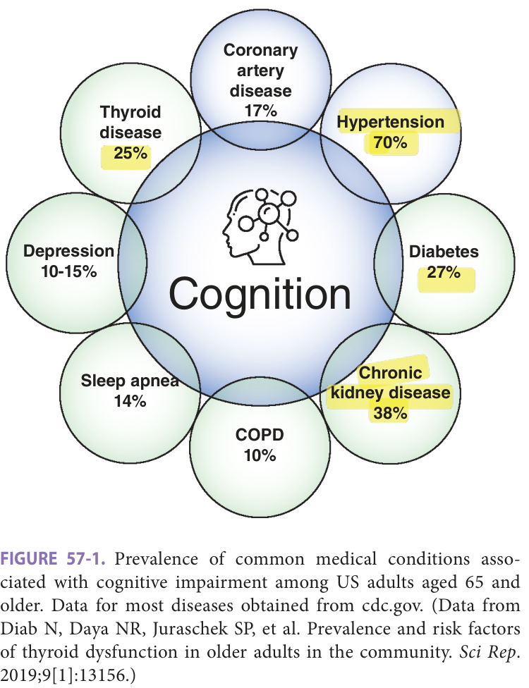
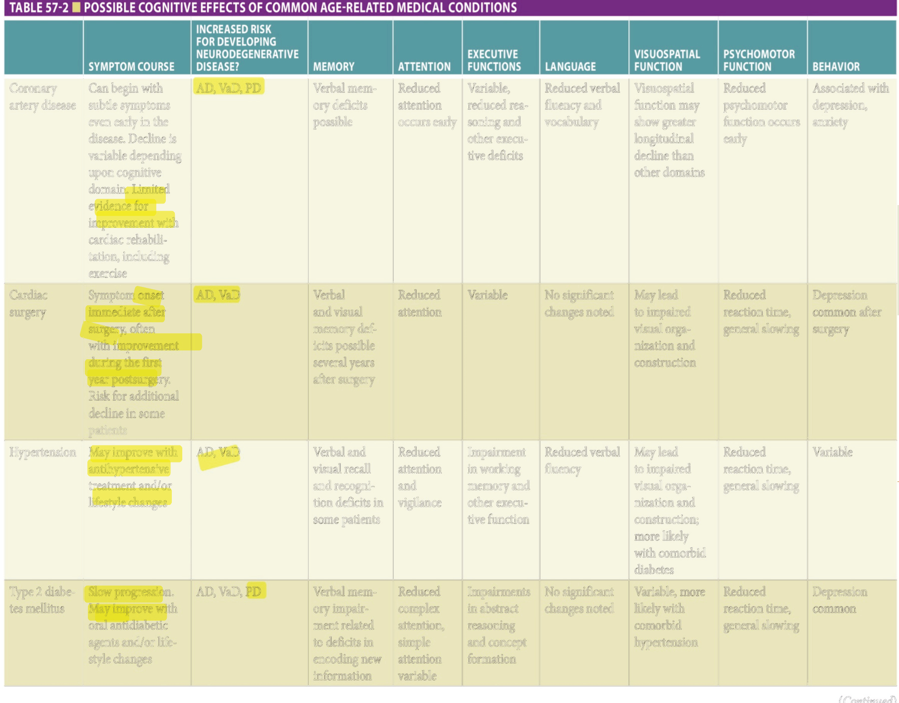
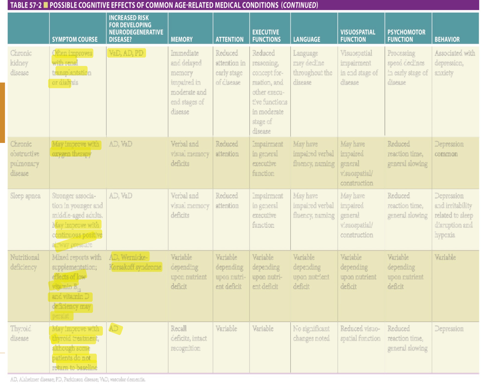
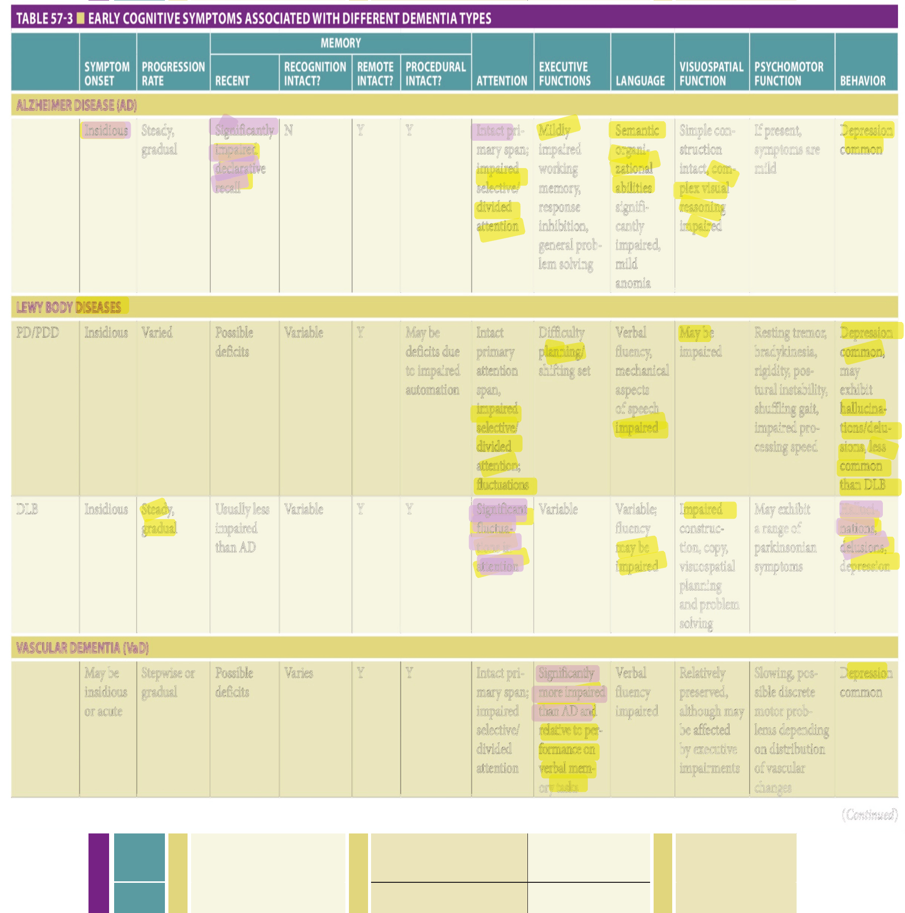
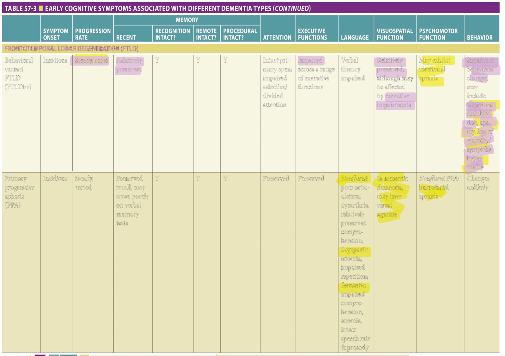
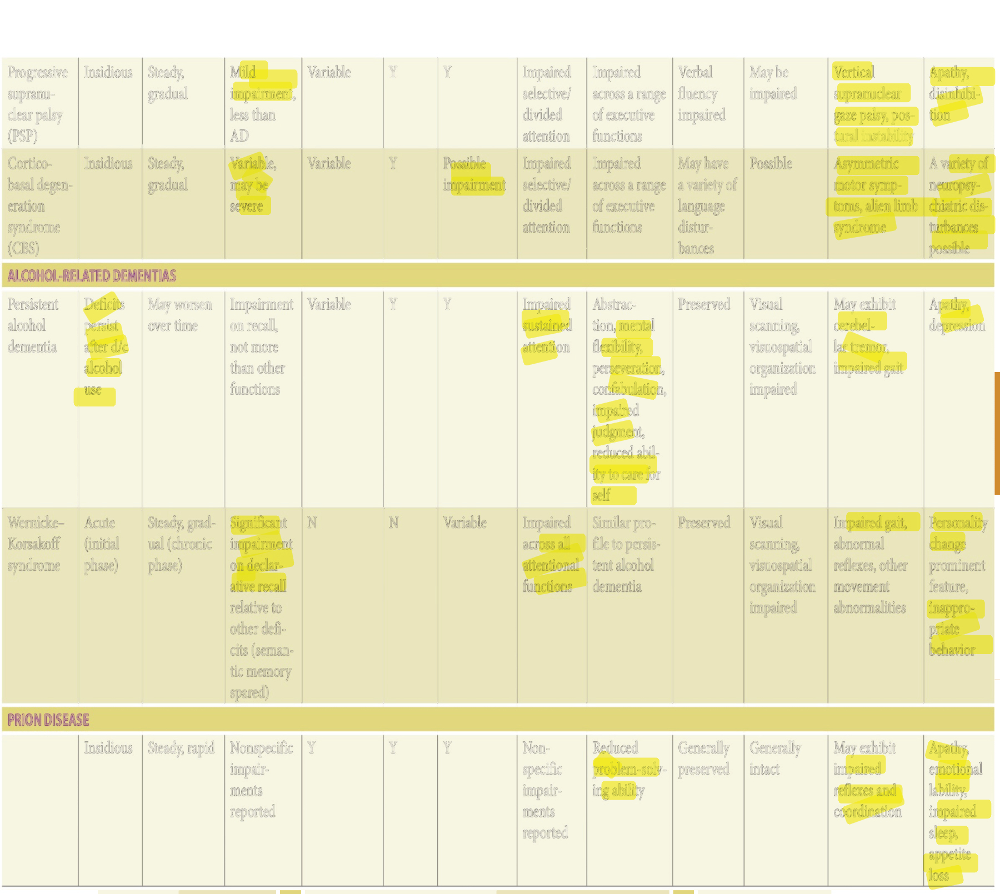
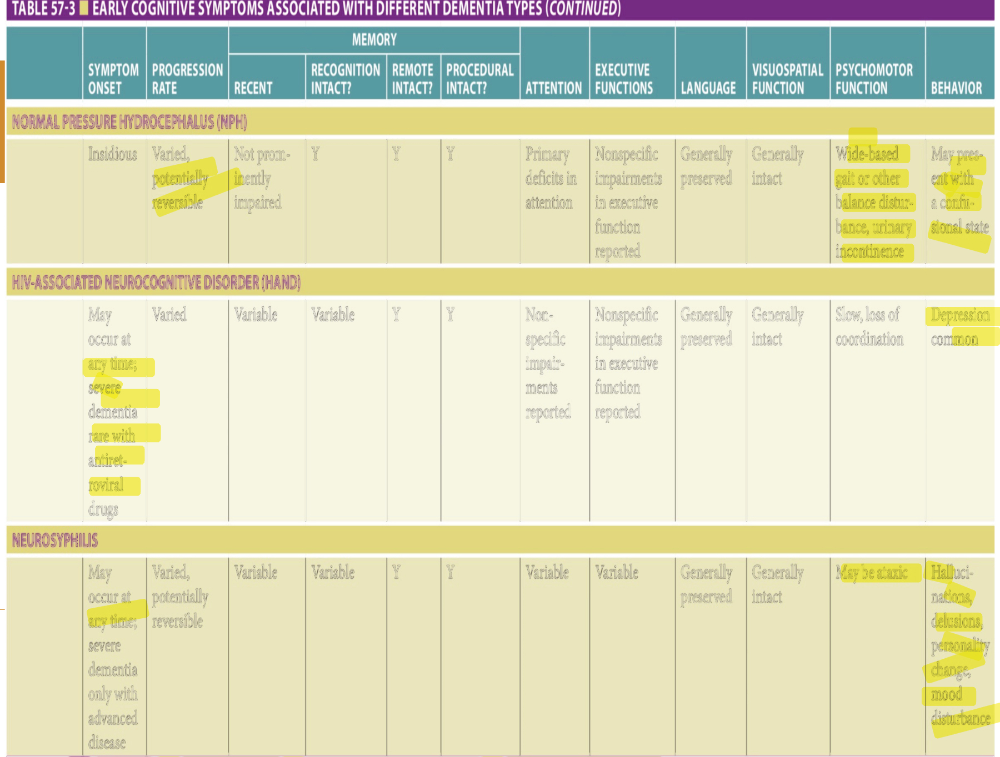
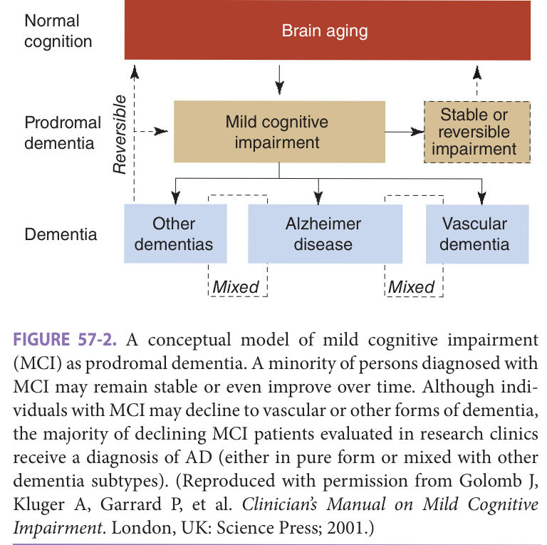
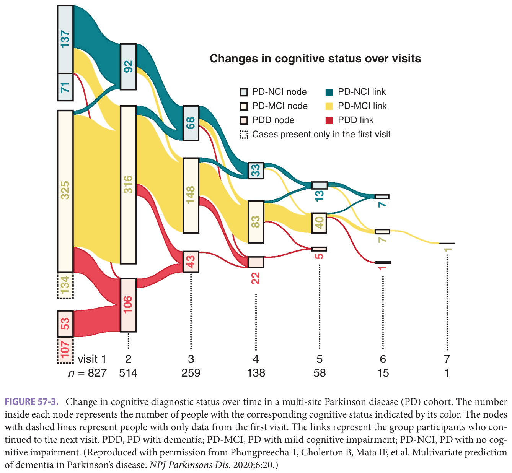

# Hazzard's Geriatric Medicine and Gerontology, 8e — Chapter 57: Cognitive Changes in Normal and Pathologic Aging

Bonnie C. Sachs, Brenna Cholerton, Suzanne Craft

> **Fast build from the book, 22 Sep; not lane-reviewed.**

**[p. 853]**

#### Learning Objectives

- Describe the expected effects of aging on a variety of cognitive functions.
- Identify age-related medical conditions that can negatively impact cognition.
- Describe the key clinical features of Alzheimer disease (AD) dementia, as well as current primary tools used for diagnosis.
- Describe the differences and similarities between AD dementia and other neurodegenerative diseases.

#### Key Clinical Points

1. Normal aging is associated with mild changes in circumscribed aspects of cognition; these changes are much less significant than cognitive effects associated with age-related medical conditions and neurodegenerative disease.
2. Physical disease is often linked with adverse cognitive consequences and increased risk for neurodegenerative disease; effective management of common age-related conditions may thus reduce the negative impact on cognition that is often considered an unavoidable outcome of aging.
3. Late-onset depression in older adults may be a symptom of prodromal neurodegenerative disease.
4. Certain medications can lead to adverse cognitive effects and even increased risk for dementia in older adults.
5. Alzheimer disease dementia is the eventual clinical manifestation of underlying pathology that is often present for years or decades before symptoms are noticed; thus, careful history-taking and new clinical and research tools may aid in early diagnosis.
6. Non-Alzheimer neurodegenerative diseases typically manifest with distinct cognitive and behavioral symptoms early in the disease process, although differentiation becomes more difficult with advancing dementia.

_“Age does not depend upon years, but upon temperament and health. Some men are born old, and some never grow so.”_

Tyron Edwards

_“A man is as old as his arteries.”_

Thomas Sydenham

The dogma that aging brings inevitable cognitive decline is being challenged by studies of the rapidly expanding oldest segment of our society, adults older than 60 years. Although some aspects of cognition are affected by aging, many changes in cognition previously considered the unavoidable consequence of brain senescence may instead result from incremental insults on brain function associated with aging-related medical conditions. The detection of such changes, which may stabilize or even reverse with appropriate intervention, and their differentiation from the cognitive changes associated with neurodegenerative disease or other neurologic disorders is a critical task. The primary goal of this chapter is to describe changes in various cognitive abilities that occur with normal aging and with common age-related medical and neurologic conditions.

## The Effects Of Normal Aging On Cognitive Function

### General Intellectual Functioning

Age-related changes in intelligence are extremely variable, with notable interindividual differences. Overall, studies of aging have consistently shown that crystallized abilities (acquired knowledge and skills gained from experience) remain relatively intact with aging, while fluid intelligence, which involves flexible reasoning and problem-solving approaches, declines. This general pattern has been documented in both cross-sectional and longitudinal research designs. More specifically, it has been theorized that reductions in speed of information processing may account for many of the age-related changes noted in fluid intelligence. Below, we review the literature on the effects of normal aging on specific cognitive functions, summarized in **Table 57-1** .

### Attention

Attention involves the ability to attend to, or focus on, one or more pieces of information long enough to register and make meaningful use of the data. Attention requires both

**[p. 854]**

simple and complex immediate processing and provides a foundation for working memory and other cognitive functions. Sustained attention, or vigilance, entails attending to one type of information over a period of time. After controlling for reaction time and sensory changes, sustained attention and strategies for maintaining vigilance do not appear to change significantly with age. Divided attention, or the ability to concentrate on more than one piece of information at a time, may decline with age, although research in this area has produced mixed results. Increased distractibility (difficulty blocking out irrelevant stimuli), decreased use of effective strategies, and reduced processing speed may be responsible for some of the noted declines in divided attention. Pronounced impairment of attention is not typical of normal aging, however, and a complete evaluation of medical and psychosocial issues is warranted for individuals who demonstrate such changes. Attention can be negatively impacted by perceptual or sensory changes, illness, chronic pain, certain medications, and psychological disturbance (in particular, depression and anxiety), all of which are common in an older population. As the ability to effectively attend is a requisite for nearly all other cognitive functions, it is important to identify the cause/s of attentional impairment whenever possible and to implement any changes in medications or treatment that may help to resolve these problems.

### Executive Functions

Executive functions include the ability to control, inhibit, and direct behavior, make meaningful inferences and

appropriate judgments, plan and carry out tasks, manipulate multiple pieces of information at one time (working memory), complete complex motor sequences, and solve abstract and complex problems. Neuropsychological test performance on executive tasks declines slightly with age, and several current theories posit that deficits in working memory and executive function underlie many age-related changes in cognition. Neurocognitive tasks that require response inhibition, such as the Wisconsin Card Sort Test, Stroop Color Word Test, the Go-No-Go Task, and Brown– Peterson Distractor Test, may be affected.

Alternatively, many have suggested that a reduction in cognitive processing speed rather than executive function per se may be at least in part responsible for decreased performance on executive tasks. It should be noted that changes in the executive system that occur with normal aging are much less severe than the deficits associated with dysexecutive syndromes, including those caused by stroke, heavy and prolonged alcohol use, head injury, and some neurodegenerative diseases. In fact, successful aging appears to produce little impact on “real-world” executive functions requiring planning and executing multiple - tasks. Thus, it is important to assess an individual’s actual functional abilities in addition to performance on neuropsychological tests of executive function.

### Memory

Memory changes are perhaps the most common cognitive complaints reported by older adults; reports of occasionally “walking into a room and forgetting why” are almost ubiquitous. Patients often wonder if their subjective concerns reflect normal age-related changes or some pathologic condition. For patients with a family history of Alzheimer disease (AD) or other forms of dementia, even minor memory failings can cause significant anxiety. One of the difficulties in answering such questions lies in the complex nature of the memory process. Different processes are invoked when learning new information (declarative memory), recalling prior life events (remote memory), recalling general knowledge not tied to a specific event (semantic memory), and remembering procedures for performing tasks such as riding a bicycle (procedural memory). In addition, some

**Table 57-1 — Cognitive effects of normal aging**

||**PRESERVED COGNITION FUNCTIONS**|**COGNITIVE FUNCTIONS SHOWING DECLINE**| |---|---|---| |**General intellectual** **functioning**|Crystallized, verbal intelligence|Fluid, nonverbal intelligence, speed of information processing| |**Attention**|Sustained attention, primary attention span|Divided attention (possibly)| |**Executive function**|“Real-world” executive functions|Novel executive tasks| |**Memory**|Remote memory, procedural memory, semantic recall|Learning and recall of new … *(table text runs longer in the printed book; not fully reproduced in this fast build)*

**[p. 855]**

conditions result in modality-specific deficits, differentially affecting verbal or visual memory.

A number of models describe the different stages or processes involved in forming and recalling memories. One example, the modal model, describes memory processes in terms of sensory memory, short-term (working) memory, and long-term memory. First, when a patient senses and attends to a given stimulus, a large amount of information is briefly held in sensory memory. Information is then rehearsed or manipulated in short-term or working memory. Although many factors are involved in determining what information is transferred to long-term storage, sufficient rehearsal is a common requirement for successful transfer. Thus, it is clear that when a patient complains of memory changes, additional information is required to make sense of the problem.

Although it is true that some older adults continue to demonstrate memory performances comparable to young adults, on average even healthy older adults do show changes in some aspects of memory. For example, when a large group of healthy, nondemented older subjects were followed over a 7-year period, a general memory factor showed significant decline with time. Other studies have attempted to describe which aspects of memory change with healthy aging. In general, older adults without significant illness demonstrate increased difficulty learning new information compared to younger cohorts. When older adults are given repeated chances to practice learning new information, they demonstrate a slower learning curve and a lower total amount learned.

Although healthy older adults may retain slightly less information over time than younger adults, this effect is less pronounced than the slowed learning rate. For delayed memory tests, patients are generally asked to recall information 15 to 30 minutes after the initial presentation of the material. Although patients recall less information at the delay with age, the proportion of the information that they initially learned generally remains stable. In general, longitudinal studies of aging show only small declines in delayed memory with age, particularly on tests of visual memory. Some older adults also appear less likely to use cognitive strategies (eg, clustering information by category) to aid memory recall than younger subjects. This may be due to generational differences in learning style. However, it may be significant because the use of memory strategies reduces the age effect observed on free recall tests.

A number of memory processes do not appear to change with the typical aging process. Remote memory, or recall of events that occurred in the distant past, remains relatively intact, as does sensory memory. In addition, while older patients often have medical problems that limit physical movement, procedural memory appears to be unaffected by healthy aging. Lastly, semantic memory, such as vocabulary knowledge and general information about the world, remains largely unchanged by aging until very late in life.

Longitudinal studies have consistently shown that as groups age, the variability in cognitive performance increases. Overall, studies of healthy aging suggest that there are some statistically significant declines in memory in late life. However, the memory functions of patients who age successfully are typically adequate for the demands of independent living.

### Language

Language abilities incorporate multiple levels of processing, and general language functions tend to remain relatively stable with increasing age. Some linguistic abilities, however, particularly those involving language output, show reliable declines in older adults. As with other cognitive functions, there are multiple potential intervening factors, including trauma, illness, and sensory disruption, that may lead to more severe changes in the language functions.

Language comprehension involves discerning the simple and complex rules of language and incorporating both visual and auditory information into a meaningful concept, and is generally associated with few age-related impairments. While hearing loss, which is common in older adults, does not affect language per se, it can impact the ability to successfully perceive spoken language and can mimic difficulties with true language comprehension. Therefore, this should be assessed and ruled out as a contributing factor in older adults complaining of comprehension difficulties.

The ability to recognize basic word structure and word representation is typically measured using “lexicaldecision” tasks (in which letters are rapidly presented and the person is asked to identify whether or not it is a word) and simple word reading tasks. While some studies have suggested an inverse relationship between performance on these tasks and age, it is generally believed that such changes are the result of decreased reaction time and processing speed rather than the ability to comprehend word structure and meaning. In addition, there is some indication that the level of lexical processing changes slightly with age, in that older adults tend to rely more on word recognition than do younger adults, while ignoring other factors such as word length. Phonological understanding of language does not appear to change significantly with age, although hearing loss may appear to reduce auditory comprehension. Overall, it is generally accepted that language comprehension remains relatively intact throughout the lifespan.

Basic syntactic abilities also do not appear to change significantly with advancing age, although minor repetitions, longer pauses, and an increased use of pronouns and other vague words while speaking have been noted. Additionally, a recent longitudinal study suggests a decline in spoken grammatical complexity during the eighth decade of life. The authors note, however, that there is high interindividual variability throughout the lifespan in terms of syntactic aptitude.

Semantic abilities require aptitude with naming and retrieval of long-stored information. There is a steady

**[p. 856]**

increase in vocabulary knowledge throughout middleadulthood, and such knowledge typically remains stable in the later years. A frequent complaint from older adults, however, involves the “tip-of-the-tongue” phenomenon, in which there is a notable struggle with spontaneous word finding. In contrast to the dysnomia that often accompanies dementia, however, such changes appear to result primarily from difficulties retrieving rather than storing information, and thus there is usually a marked improvement when cues are given. Tasks of verbal fluency, which are most akin to demands required in fluid, conversational speech, also appear to change somewhat with age. Multiple research findings support a decrease in semantic fluency (“name all the animals you can”), while phonemic fluency (“tell me as many words as you can that begin with the letter F”) generally remains stable. Younger adults tend to produce more words and change categories more frequently than do older adults on semantic fluency tasks, while older adults may generate the same amount of words but more “clusters” on tasks of phonemic fluency. Thus, older adults likely rely more on structural word knowledge than on word meaning.

### Visuospatial Skills

Visuospatial skills are commonly tested by constructional tasks in which patients are asked to draw figures or assemble objects. In general, as patients age, they become slower at completing visuospatial tasks. However, as noted previously, one of the more consistent findings in the field is that normal aging is associated with general slowing of psychomotor and cognitive speed. Therefore, performance on tests of visuospatial functioning is often confounded by generalized slowing. Some studies have attempted to separate the effects of the two domains. For instance, after controlling for processing speed and executive functioning, the effects of age on the commonly used Wechsler Block Design test were dramatically reduced. Similarly, an 11-year follow-up of older adult subjects analyzed both speed and quality of performance (errors) on a parallelogram test. As expected, speed declined with age, but the quality of the performance actually improved significantly. This body of literature suggests that declining speed contributes to some of the findings that report visuospatial processing deficits in normal aging.

Speed does not appear to account for all of the visuospatial changes observed in healthy aging, however. Mental rotations of objects or spatial coordinates, accurate copy of complex geometric designs, and mental assembly of objects typically worsen with age even when unlimited time is allowed to perform such tasks. Furthermore, when speed is included in scoring, some studies have reported disproportionate slowing on visuospatial tasks compared to verbal tasks. Overall, some studies may exaggerate the visuospatial decline observed in normal aging because of the role speed plays in many tasks used to assess visuospatial function. However, abstract spatial abilities may decline with age, even when speed is controlled.

### Psychomotor Functions

Age-associated slowing in reaction time, related to both a general reduction in the speed of cognitive processing and to changes in peripheral motor skills, has been consistently reported. Age-related declines in brain dopamine activity and periventricular white matter changes may be associated with reduced cognitive speed and basic motor functions. As a result, performance on tests requiring speed and quick reaction to stimuli are likely to decline. As previously noted, increased psychomotor speed and reaction time are believed to underlie many of the age-related changes noted on neurocognitive testing, particularly tasks involving perceptual speed, attention, and working memory. In addition, changes in psychomotor functions can be associated with changes in real-world tasks, such as driving. As a result, it is important to monitor the manner in which physical changes are impacting an individual’s level of safety in performing daily activities.

## Cognitive Effects Of Common Age-related Medical Conditions

In the following section, cognitive symptoms associated with common diseases affecting older adults are reviewed. Prevalence of common medical conditions that may impact cognition in older adults are presented in **Figure 57-1**. A summary of cognitive symptoms associated with common medical conditions is presented in **Table 57-2**.

> *FIGURE 57-1. Prevalence of common medical conditions associated with cognitive impairment among US adults aged 65 and older. Data for most diseases obtained from cdc.gov. (Data from Diab N, Daya NR, Juraschek SP, et al. Prevalence and risk factors of thyroid dysfunction in older adults in the community. _Sci Rep_ . 2019;9[1]:13156.)*

> Highlighting is the owner's annotation, not the book's.

> Figure values (for text search/screen readers): Hypertension 70%, chronic kidney disease 38%, diabetes 27%, thyroid disease 25%, coronary artery disease 17%, sleep apnea 14%, depression 10-15%, COPD 10%.

**[p. 857]**

> *Table 57-2 (first half — coronary artery disease, cardiac surgery, hypertension, type 2 diabetes mellitus) reproduced as a page image (printed p. 857) — the grid did not extract reliably as text for this fast build.*

> Highlighting is the owner's annotation, not the book's.

**[p. 858]**

> *Table 57-2 reproduced as a page image (printed p. 858) — the grid did not extract reliably as text for this fast build.*

> Highlighting is the owner's annotation, not the book's.

**[p. 859]**

### Cardiovascular Disease

Cardiovascular disease increases risk for developing both debilitating cognitive decline due to large vessel stroke and/ or vascular dementia (VaD) and milder cognitive deficits. While much of the cognitive dysfunction associated with cardiovascular disease can be discussed in terms of its effects on the cerebrovasculature and resulting vascular cognitive impairment (VCI), here we focus on independent cardiovascular disease–associated risk factors for cognitive decline in older adults, including the effects of coronary artery disease, cardiac surgery, and hypertension.

**Coronary artery disease** Subtle impairments in cognition can be seen early in the disease, including among patients diagnosed at midlife. Specific impairments have been reported across measures of reasoning and other executive deficits, verbal memory, vocabulary, semantic and phonemic fluency, visuospatial function, and global cognition. Increased length and greater severity of coronary artery disease are consistently associated with reduced cognitive performance even in the absence of strokes or obvious cerebrovascular disease. Indeed, among older adults without a history of stroke enrolled in the Cardiovascular Health Study, there was a greater than 60% prevalence of cognitive impairment. Factors associated with cognitive impairment among patients with coronary artery disease include cardiac surgery, presence of an apolipoprotein E ( _APOE_ ) ε4 allele, presence and degree of heart failure, use of concurrent anticholinergic medications, hormone disruptions (eg, thyroid), and elevated inflammatory biomarkers (eg, interleukin-6, C-reactive protein, brain-derived neurotrophic factor).

**Cardiac surgery** In addition to the risk of immediate postoperative delirium following cardiac surgery, postoperative cognitive decline (POCD) after cardiac surgery is reported in 30% to 70% of patients at the time of hospital discharge. Factors that increase the risk of POCD include older age, cerebrovascular disease, underlying neurodegenerative disease, cardiopulmonary bypass time, manipulation of the ascending aorta, and cerebral hyperthermia. A wide range of cognitive deficits, including problems with attention and concentration, processing speed, memory, and visuospatial function, have been noted in patients immediately following surgery. Several reports suggest that postoperative cognitive function stabilizes or even improves after a period of approximately 12 months in those patients who demonstrate initial decline. However, the prevalence of cognitive dysfunction remains relatively high at 12-month follow-up (15–25%), and longitudinal data suggest that these patients are at higher risk for continued cognitive deterioration and multiple dementia types (including AD, VaD, and mixed dementias). PostCABG neurocognitive status is related to overall quality of life, and current recommendations underscore the importance of closely monitoring cognitive status in the years following cardiac surgery.

**Hypertension** Essential hypertension is associated with risk of cognitive impairment independent of secondary disease or organ damage. Uncontrolled hypertension may impact cognition and increase dementia risk via several mechanisms, including arterial stiffening, inflammation in the blood vessels, disruption of the blood–brain barrier, development of subcortical white matter lesions, adverse impacts on cerebral blood flow, and disrupted energy substrate delivery. Potential cognitive effects of primary hypertension include reductions in mental status, slowed reaction time, reduced attention and vigilance, weakened executive function, poor verbal fluency, and impaired visual organization and construction. Memory functions, including spatial recall, verbal recall, and word recognition, may also be affected in some hypertensive patients. Beyond effects on specific cognitive functions, hypertension, particularly at mid-life, is a significant risk factor for later dementia. Thus hypertension has been identified as one of the major modifiable risk factors for dementia. Treating hypertension with medication and/or lifestyle changes may reduce dementia risk, although evidence regarding the use of specific antihypertensives to prevent later cognitive impairment is mixed. Interestingly, blood pressure often _declines_ in the period immediately preceding the onset of AD, and it has been suggested that low blood pressure in older adults may compromise brain function as a result of hypoperfusion. In addition, sudden aggressive lowering of blood pressure in older adults with long-term hypertension may interact with their chronically upregulated cerebral vascular resistance and induce cerebral hypoperfusion. Thus careful monitoring of blood pressure and gradual titration of medication regimens is of particular importance. Additional interest has been focused on the question of whether particular treatment methods may confer particular protective effects on cognition. Additional controlled randomized trials are needed to answer this question.

### Type 2 Diabetes Mellitus

Much attention has been given to the rampant epidemic of type 2 diabetes mellitus (T2DM) in older adults, a trend thought to be largely attributable to obesity and physical inactivity. Current prevalence estimates in the United States suggest that between 20% and 30% of adults older than 65 years are afflicted with T2DM. The negative impact of T2DM on multiple medical systems is well known. The clear impact of T2DM on cognitive function in older adults is less-widely known, but accruing evidence demonstrates that these patients show pronounced impairment in attention and verbal memory when compared to healthy agematched adults and accelerated cognitive decline over time. Complex attentional impairment is most common, involving the inability to handle multiple streams of information or attend to information in the face of competing stimuli. Verbal memory deficits typically affect the ability to encode new verbal information. The magnitude of such impairment may vary from subtle subjective complaints to

**[p. 860]**

pronounced impairment that interferes with daily activities and may interfere with the patient’s ability to adhere to complex treatment regimens. The mechanisms causing attentional and memory impairments are likely multifactorial and include vascular factors, as described earlier, in addition to the potential negative effects of hyperglycemia and glucose toxicity thought to cause oxidative injury. Notably, successful treatment of T2DM has been shown to improve cognitive function. Recent work also suggests that insulin resistance, independent of hyperglycemia, may have negative consequences on brain systems mediating memory and attention, suggesting that therapeutic strategies focused on improving insulin sensitivity may be preferable to those focused on augmenting insulin levels. The importance of treating and preferably preventing T2DM has been underscored by its associated risk for various forms of neurodegenerative disease, including AD, VaD, and Parkinson disease (PD).

### Chronic Kidney Disease

Cognitive impairment among patients with chronic kidney disease (CKD) is quite common, with prevalence estimates ranging from 10% to 40% depending upon length and severity of disease. CKD patients perform more poorly than controls on tests of orientation, attention, abstract reasoning and concept formation, executive function, memory, language, and global cognition. Such changes can occur early in the disease, but progress at different rates depending on the domain assessed. For example, language may continue to decline, while other domains remain stable for long periods of time. The underlying cause of cognitive impairments in CKD patients is not entirely understood currently. Cerebrovascular disease is a common comorbidity of CKD and thus likely to underlie some of the cognitive impairments associated with the disease. However, as cognition often improves or stabilizes following dialysis and/or renal transplantation, underlying vascular disease is most likely not the sole culprit. Rather, it has been suggested that dialysis-related factors (hemodynamic instability, cerebromicrobleeds), uremic metabolites, anemia, and depression may all potentially impact cognitive function among those with CKD.

### Chronic Obstructive Pulmonary Disease

Emphysema and chronic bronchitis obstruct airflow, resulting in hypoxemia and hypercapnia. Cognitive dysfunction is commonly observed in chronic obstructive pulmonary disease (COPD), although the specific skills affected appear to be broad and diffuse. Deficits in verbal and visual memory, attention, abstraction, psychomotor speed, information processing speed, and global cognition have all been reported. These changes in cognition appear to be due to hypoxemia. The decrease in arterial oxygen partial pressure correlates with neuropsychological impairments, and most studies indicate that oxygen therapy results in modest improvements in cognition. However, a diagnosis

of COPD, especially at midlife, does increase risk for later life mild cognitive impairment (MCI) and dementia.

### Obstructive Sleep Apnea

The prevalence of obstructive sleep apnea (OSA) increases in geriatric populations. Cognitive changes in OSA can be diverse but may include reduced performance on measures of global cognition, attention, concentration, processing speed, working memory, executive functioning, and verbal and visual learning and memory. Interestingly, the association between cognitive impairment and OSA is stronger in younger and middle-aged adults. In older adults, OSA may have weaker or no association with specific cognitive impairments; however, there is increased risk over time for MCI, AD, and VaD. Cognitive deficits may be related to severity of hypoxia, hypersomnolence, or comorbid conditions. In addition, recent evidence suggests a possible association between OSA and presence of AD biomarkers. Continuous positive airway pressure treatment may improve aspects of cognitive functioning in some patients.

### Nutritional Deficiency

Older adults are at considerable risk for nutritional deficiencies as a consequence of poor diet and malabsorption syndromes. Much research in this area has focused on deficiencies of B vitamins, antioxidants, and vitamin D.

Lower B12 levels and folate are associated with reduced cognition and increased risk of AD, although the evidence is mixed. B vitamins play an important role in homocysteine metabolism. Homocysteine is an independent risk factor for cerebrovascular and cardiovascular disease. In patients with both AD and VaD, elevated plasma homocysteine levels have been reported, and recent studies suggest that homocysteine levels are related to cognitive function in normal aging. Reduced performance on tests of mental status, nonverbal pattern abstraction, construction, and processing speed are reported in patients with high plasma homocysteine. Given that plasma homocysteine and folate levels are inversely related, it is conceivable that such cognitive deficits are related to reduced folate rather than to increased homocysteine per se. Recent data suggest, however, that homocysteine increases the risk for cognitive decline independent of both folate levels and other vascular risk factors. In addition, although supplementation of vitamin B is shown to reduce homocysteine levels in older adults, concurrent benefits on cognition have not been widely reported. Nonetheless, among older adults with cognitive deficits, routine laboratories and repletion of B vitamins are recommended when applicable.

There has been much debate about the potential protective effects of antioxidants in dementia. For example, both deleterious and protective effects of vitamin E have been reported. Overall there is little evidence that vitamin E supplementation reduces risk for cognitive decline. A largescale clinical trial, however, showed reduced functional decline with high-dose vitamin E supplementation (2000

**[p. 861]**

IU per day) for mild-to-moderate AD. Although these results appear promising, additional work is needed to clarify the risk-to-benefit ratio for vitamin E supplementation.

More recently, concerns about vitamin D deficiency have been raised in relation to increased risk for a number of negative health outcomes, including cognitive decline and dementia. Meta-analyses indicate associations between vitamin D deficiency and worse performance on tests measuring global cognition, visuospatial abilities, processing speed, and attention, while memory skills appear to be less affected. Unfortunately, vitamin D supplementation has not been strongly associated with improved cognition in older adults to date.

### Thyroid Disease

Both hypo- and hyperthyroidism are associated with potential adverse cognitive changes, particularly in younger and middle-aged adults. Hypothyroidism may increase risk for dementia, as well as result in specific deficits in visuospatial skills, psychomotor speed, and memory. There is some evidence that the memory deficits associated with hypothyroid conditions are related to retrieval rather than immediate recall or learning; thus, disproportionately better performance may be observed on tests of cued or recognition memory than on free recall tests. Thyroid replacement therapy frequently improves cognitive functioning, although skills may not return to baseline levels in some patients. Hyperthyroid may also increase dementia risk, and related cognitive symptoms may include deficits in attention, executive functioning, and memory. Interestingly, dementia risk from hyper- and hypothyroid conditions does not appear to extend to adults in the older age ranges (eg, 75 and older). There is also some evidence for sex differences, such that a stronger relationship between thyroid disease and dementia risk in women as compared to men has been reported. Overall, however, thyroid hormone abnormalities occur in a large proportion of patients with dementia and thus should be routinely monitored as a treatable contributor to cognitive decline.

### Depression

Depression is an increasingly common problem in older adults, with prevalence estimates ranging from 11% to 30%. Situational risk factors for depression in older age include the loss of social support, death of family members and close friends, changing social roles, illness, and physical limitations. Depressive symptoms, including lack of initiation, impaired executive function, cognitive slowing, poor attention and concentration, and mild memory impairment, can mimic early signs of dementia and may potentially lead to misdiagnosis and/or lack of appropriate medical intervention. As depression is a potentially reversible cause of cognitive impairment, the differential diagnosis between depression and dementia is vital when evaluating older patients. Factors that are useful in discriminating between depression and dementia include the

clinical course of symptoms, relationship to a specific crisis or stressful event, history of previous psychiatric problems, quality of effort, and level of impaired processing on cognitive evaluation.

Late-onset depression is also an independent risk factor for the development of neurodegenerative diseases, including AD, VaD, and Lewy body disease (LBD). Depressive symptoms may thus represent a preclinical phase of progressive dementia in some patients. In patients with early cognitive loss, depressive symptoms may represent realistic self-evaluation of such decline and/or may coincide with actual changes in neuroendocrinologic status. In the absence of predisposing situational factors, late-onset affective disorders are quite rare. Thus, cognitive ability and independent functional status must be carefully evaluated in older patients, and an in-depth qualitative analysis of depressive symptoms may be useful. For example, major depressive disorder is associated with a range of affective, cognitive, and vegetative symptoms, while depressive symptoms in early dementia are more likely to include cognitive and motivational symptoms (eg, poor concentration, lack of initiation) in the relative absence of central affective disturbance. Continued monitoring of the cognitive status of depressed older patients is essential in order to rule out progressive cognitive decline.

### Medications

A number of medications have the potential to cause both subtle cognitive changes and alterations in overall mental status, particularly in older adults. Medications known to adversely affect cognitive status include opiates and opioidlike analgesics, benzodiazepines, anticonvulsants, antipsychotic and antidepressant medications, antiparkinsonian agents, central nervous system stimulants, antihistamines and decongestants, and certain cardiovascular medications. Anticholinergic medications, used to treat a variety of conditions including insomnia, bladder spasms, gastrointestinal disorders, dizziness, and others, have been linked to an increased risk for dementia in older adults in a large-scale prospective community-based study. Despite this finding, these drugs are widely prescribed in older adult populations. A variety of other medications, particularly those that readily cross the blood–brain barrier, may impact cognitive function in certain individuals. In addition, drug interactions in older adults can lead to more serious physiologic and cognitive consequences than those observed in younger adults, and adverse medication interactions are more likely to occur in an older population. As a result, changes in cognitive status must be carefully evaluated in light of a patient’s current medication profile.

### Delirium

Older adults are at a significantly increased risk for developing delirium, particularly following surgery or in response to medication changes or interactions. Delirium is a reversible condition that can be distinguished from most

**[p. 862]**

neurodegenerative diseases by a rapid onset of symptoms that include significant disorientation and disturbance in consciousness, reduced awareness of the environment, and attention deficits. While recent memory is generally impaired, altered consciousness is the primary indicator of delirium. Hallucinations, delusional thinking, and other disturbed thought processes may also be present. Delirium usually resolves quickly, but may persist for several weeks. It should also be noted that postoperative delirium may signify the presence of a beginning dementia. A primary concern is to identify and treat the underlying cause while providing a supportive and nonthreatening environment for the patient.

## Neurodegenerative Disease

The following section reviews the cognitive and behavioral profiles associated with common neurodegenerative disorders ( **Table 57-3** ). Early identification of such disorders, many of which are diagnosed solely on these parameters, has become increasingly important due to potential therapies that may delay disease progression.

### Dementia Due To Alzheimer Disease

AD dementia, the most prevalent of the primary neurodegenerative disorders, is the clinical manifestation of underlying AD neuropathology, primarily the accumulation of β-amyloid protein and neurofibrillary tangles leading to neuronal loss and synaptic degeneration. Diagnostic criteria by the National Institutes on Aging and the Alzheimer’s Association (NIA/AA) initially put forth in 2011 and updated in 2018 recognize AD as a continuum, with underlying neuropathologic processes often beginning 20 years or more before the onset of clinical dementia symptoms. These criteria allow use of biomarkers that reflect these processes, alongside supporting clinical information, for use in early differential diagnosis. Currently, cerebrospinal fluid (CSF), β-amyloid and phosphorylated tau, and imaging studies (amyloid or tau positron emission tomography [PET]) may be used to determine the presence of β-amyloid deposition and/or aggregated tau to provide diagnostic evidence for or against AD as the underlying pathology, and anatomic magnetic resonance imaging (MRI), fluorodeoxyglucose (FDG)-PET, and CSF total tau may be incorporated as markers of severity of neurodegeneration. Currently in development, several blood-based biomarkers may serve as useful diagnostic tools in the future, the most promising of which is plasma phosphorylated tau181, which is closely associated with CSF phosphorylated tau and tau PET, and may be useful in both staging of AD and in differentiating between AD and non-AD dementia types. In the absence of current availability of such tools, however, conventional diagnostic criteria are considered to be reasonably accurate, particularly when the evaluation is comprehensive and includes a complete medical and psychosocial history, medical evaluation, and neurocognitive testing.

The NIA/AA criteria for AD dementia require (1) that the patient meets criteria for dementia (cognitive symptoms that interfere with independently completing daily activities [managing medications or finances, driving, cooking, etc] that occur within at least two cognitive domains, represent a decline from previous function, and are not better explained by delirium or psychiatric disturbance), (2) evidence/report of an insidious onset, and (3) worsening cognition by report or observation of the patient, informant, or clinician. The initial cognitive symptoms may be amnestic or nonamnestic to account for variants that present with deficits in cognitive domains other than memory, such as posterior cortical atrophy (which presents with initial visuospatial deficits) or language-predominant forms, though amnestic presentations are by far the most common. The term “probable AD” should not be used if another medical/neurologic disease could account for the symptoms. “Possible” AD dementia may be diagnosed if the symptom history is atypical or unclear or if there is a mixed dementia picture.

**Patient history** A complete medical and psychosocial history is a vital component of any dementia assessment. Such a history should be obtained both from the patient and a reliable informant, preferably someone who has regular contact with the patient and who has an adequate opportunity to observe their daily functional abilities. Typically, a patient in the earliest stages of AD will not exhibit deficits in basic self-care activities, such as feeding or bathing. However, more complex daily tasks, including driving, managing finances, shopping, and other chores and activities, are likely to be affected. A gradually progressive course and insidious onset of cognitive symptoms is a hallmark of AD, and thus a careful history regarding the nature and timing of symptom onset and progression must be obtained. An inventory of all current medical and psychiatric concerns, family history, past major medical and mental health problems, and medications must be evaluated in order to rule out conditions that may be either causing cognitive problems or exacerbating their expression.

**Medical examination** An important goal of the medical evaluation is to exclude the presence of medical conditions that may be responsible for the observed cognitive deficits. It is critical to investigate potentially reversible causes of dementia such as uncontrolled liver or kidney disease, adverse reactions to medications, and delirium. Laboratory blood tests, such as complete blood count, complete metabolic panel, and B12 levels, can aid in ruling out systemic illnesses, vitamin deficiency, or organ malfunction. Structural brain scans, such as CT or MRI, are used to evaluate major cerebrovascular events, tumors, normal pressure hydrocephalus (NPH), and other neurologic conditions, while functional brain scans (eg, PET) can identify patterns of activity that may be useful in classifying dementia type. As noted, ruling out the possible contribution of psychiatric conditions, such as major depression, is also a critical piece of this examination.

**[p. 863]**

> *Table 57-3 reproduced as a page image (printed p. 863) — the grid did not extract reliably as text for this fast build.*

> Highlighting is the owner's annotation, not the book's.

**[p. 864]**

> *Table 57-3 reproduced as a page image (printed p. 864) — the grid did not extract reliably as text for this fast build.*

> Highlighting is the owner's annotation, not the book's.

**[p. 865]**

> *Table 57-3 reproduced as a page image (printed p. 865) — the grid did not extract reliably as text for this fast build.*

> Highlighting is the owner's annotation, not the book's.

**[p. 866]**

> *Table 57-3 reproduced as a page image (printed p. 866) — the grid did not extract reliably as text for this fast build.*

> Highlighting is the owner's annotation, not the book's.

> Table 57-3 footnote (from the page's text layer; not present in the crop above): *DLB, dementia with Lewy bodies; PD, Parkinson disease; PDD, Parkinson disease with dementia.*

**[p. 867]**

**Neuropsychological assessment** Neuropsychological assessment of cognitive function not only provides confirmatory evidence for cognitive impairment but may also aid in disease staging and clarification of dementia type. Given the extensive variation in rate of AD progression between patients, successive neuropsychological examinations early in the disease can also provide information regarding an individual’s rate of progression and remaining cognitive strengths, which is essential for advising patients and family about possible safety issues that arise. Perhaps one of the most valuable assets of neuropsychological evaluation is the sensitivity of the tests to detect early cognitive decline. While there has been debate regarding the usefulness of providing an early AD diagnosis, it is generally accepted that such a diagnosis will allow the patient to avail themselves of current and emerging therapies, as well as to make decisions regarding health care, finances, and legal issues while they still have the capacity to do so. In a typical neuropsychological evaluation, patients are given tests that sample a variety of domains of cognitive function. Results are compared to normative data based on age, and often education, and also to an individual’s estimated premorbid abilities (based on educational and occupational background and performance on tests that tend to remain stable over time). Pattern analysis of test results, in combination with data from the patient history and medical evaluation, is then used to generate diagnostic possibilities. The following sections discuss cognitive impairment patterns typical in patients with AD.

**_Memory_** The hallmark of AD, and most often the first cognitive symptom of the disorder, is anterograde amnesia, evidenced by difficulty with learning and retaining new information, which is often described as “rapid forgetting.” Deficits are noted in declarative memory as a result of prominent impairment in information encoding, retrieval, and in particular, storage of new material. Patients are likely to exhibit deficits in recent episodic recall, and they or their caregivers often report they misplace items, forget recent events or conversations, and frequently repeat questions or statements. In contrast to impaired episodic recall and difficulty learning new information, procedural memory is rarely impaired, and remote memory remains relatively intact until later stages of the disease.

In order to adequately evaluate short-term memory loss and establish a pattern of impaired learning and memory storage or retention, neuropsychological evaluations include tests of both immediate and delayed verbal and visual recall. While cognitive screeners such as the Folstein Mini-Mental State Examination (MMSE) and Montreal Cognitive Assessment (MoCA) assess general mental status and orientation, they are not adequate for a comprehensive understanding of memory impairment. To satisfactorily assess a person’s true memory ability, tasks that are high in cognitive demand, that exceed the primary memory span (such as story recall and list learning tasks that include at

least 10 items), and that have a recognition component are recommended. On neuropsychological examination, verbal and visual free immediate and delayed recall and recognition are significantly impaired in patients with AD relative to same-age peers, and patients typically exhibit a high number of intrusion errors and repetitions. Semantic recall is generally the most predominantly impaired, and thus verbal recall tasks are often the most sensitive to early memory loss.

**_Attention and Executive Function_** Certain aspects of attention and concentration are often impaired early in the disease process, and recent research has supported that it may in fact be one of the earliest abilities affected in AD. While patients with AD are likely to have relatively intact simple attention (eg, primary memory span), tests requiring selective, divided, and complex aspects of attention are likely to be impaired, particularly as task demands increase. This pattern of performance strongly supports the presence of a deficit in working memory (the ability to simultaneously attend, process, and respond to multiple pieces of information) early in the disease process, and a converging body of evidence supports a primary executive component in AD.

In addition to problems on tasks of complex attention and working memory, patients are likely to exhibit mild deficits in response inhibition, evidenced by intrusion errors and perseverative responses, on neuropsychological testing. Deficits in abstract reasoning, general problemsolving ability, and making appropriate judgments are also commonly noted. In assessing for judgment and abstraction, patients may be asked the meaning of proverbs (eg, “you can lead a horse to water but you can’t make it drink”) and are often given hypothetical situations in which they must decide an appropriate course of action (eg, “What would you do if you were in a crowded shopping mall and saw smoke and fire?”). On these tasks, even early AD patients may provide incorrect, concrete, or inappropriate responses.

**_Language_** Semantic processing is considered the primary language deficit in AD and is present in more than half of all AD patients at the time of diagnosis. Word finding problems are commonly reported in both AD and normal aging, but patients with AD have more severe deficits and are more likely to produce a significantly higher number of semantic paraphasias and circumlocutions. Patients are generally impaired on tasks of confrontational naming (eg, naming a visually presented item), and, unlike changes that occur with normal aging, are not likely to be assisted by phonemic cues (eg, providing the sound the word starts with). Syntactic processing, in contrast to semantic processing, is typically unaffected in mild AD. For example, patients with early AD can typically process even complex sentences at the same level as their healthy counterparts, and generally remain unimpaired on repetition and fluent speech. Verbal fluency tasks are particularly useful in evaluating both semantic and syntactic processing. Semantic, or category,

**[p. 868]**

fluency (eg, “Tell me as many animals as you can”) is generally impaired disproportionately to syntactic, or phonemic, fluency (eg, “Tell me as many words that begin with the letter ___”) in AD. While decreased information processing and working memory may impair an AD patient’s responses on certain syntactic processing tasks, and comprehension and intelligible speech are likely to decline slowly as the disease advances, patients who present first with nonfluent aphasia or impaired comprehension should be carefully evaluated for conditions other than AD.

**_Visuospatial Function_** Deficits in visuospatial abilities are frequently seen in patients with AD, although they generally appear later than memory deficits. Patients may become lost while driving, or even in familiar places (eg, grocery store). Eventually, disorientation may lead to confusion in one’s own home and subsequent wandering behavior. Early deficits, however, are more likely to involve visuospatial problem solving. Neuropsychological tests commonly used involve comparing simple construction or copying, typically not impaired early in the disease, to complex visual reasoning. The presence of constructional apraxia early in the disease may indicate greater pathology in visual processing areas of the brain and has been associated with more rapid symptom progression. In general, more complex drawing tasks, such as three-dimensional figure copy, may be more precise measures of the most common early visual spatial deficits in AD than simple copying tasks.

**_Motor Function_** While motor dysfunction has not been typically considered to be a defining symptom of AD, recent research suggests that AD patients may display impairments in gait, motor speed, and general level of activity, and these changes may even be evident during the prodromal phase of the disease. In addition, converging evidence provides support for greater neuropathologic overlap between AD and other conditions, such as dementia with Lewy bodies (DLB), making motor changes such as tremor or gait disturbance more likely in these patients. Importantly, there have been reports of gait disturbance in patients taking cholinesterase inhibitors, a factor that should be carefully monitored when prescribing these medications.

Patients with AD may also exhibit mild ideomotor and ideational apraxia (deficits in skilled movements) due to concrete responses, lack of sufficient external cues, or a disruption in conceptualization ability. However, moderate-to-severe apraxia is not generally present until later stages of the disease. Incorporating an apraxia assessment into a dementia evaluation is useful, particularly for excluding other disorders that may initially present with more severe skilled movement disorders.

**Behavioral changes** Mood disturbance is common in patients with AD and has even been recognized more recently as a possible prodrome to the development of dementia in older adults. Depression in AD may manifest as apathy, indifference, poor initiation, or emotional lability. Irritability, agitation, and paranoid ideation can also

occur in AD, and may worsen with disease progression, prompting wandering behavior and aggressive outbursts. Repetitive and aimless behavior may also increase as the disease progresses. More severe psychotic symptoms, such as hallucinations and severe delusions, are typically rare in earlier stages of AD in the absence of coexisting disorders. Given the wide range of behaviors that may be exhibited in AD, it is imperative that the patient’s family be provided with ample dementia education, that they have access to social support, and that they possess the coping skills necessary to provide adequate care.

**Awareness of deficits** Patients in the early stages of AD typically vary in their level of deficit awareness. Whatever the starting point, deficit awareness declines with disease progression. Even when patients do acknowledge their cognitive decline, such awareness may not be “complete” as a result of deficits in executive function. For example, patients may be unable to translate cognitive problems into everyday functional difficulties, and as a result may not understand how their deficits affect certain activities, such as driving, cooking, and managing finances. Again, providing the patient’s caregivers with ample education can increase the likelihood that patients and family will comply with physician recommendations to limit certain unsafe behaviors.

**Variant AD presentations** While most often the primary early deficit in AD involves recent memory, there are several, less common variant forms of AD that involve primary deficits in executive functioning, language (logopenic aphasia [LPA]) or visuospatial function (posterior cortical atrophy). In such cases, differential diagnoses, including frontotemporal lobar dementia (FTLD), primary progressive aphasia (PPA), Lewy body disease (LBD), and others, must be carefully considered prior to assigning a diagnosis of AD.

### Mild Cognitive Impairment Due To AD

“Mild cognitive impairment” describes age-atypical levels of cognitive impairment that do not meet the criteria for dementia and that are not the result of a known medical condition or neurodevelopmental disorder. MCI and AD are not fully distinct entities and can be considered as existing on a cognitive and functional continuum. In its most common usage, the term MCI is assigned to cognitive impairments thought to be related to underlying AD pathology, although criteria for prodromes of other neurodegenerative dementias (eg, Parkinson disease dementia [PDD], FTLD) have been proposed. The clinical conceptualization of MCI relies largely on characteristic cognitive and functional symptoms. Current NIA/AA criteria for MCI due to AD include the following: (1) concerns regarding a change in cognition by either the patient, informant, or a skilled clinician, (2) objective impairment in one or more cognitive domains compared to the patient’s estimated premorbid level of functioning based on age and

**[p. 869]**

education, (3) preserved independence in functional abilities, although patients may require some assistance or have mild impairments on more complex tasks such as financial management, navigation to unfamiliar places, etc, and (4) absence of dementia. Other causes, such as traumatic brain injury, cerebrovascular disease, and medical or metabolic abnormalities, should be ruled out as the primary etiology, though they may still play a smaller, contributing role.

While cognitive screeners can detect certain levels of cognitive impairment, they are not all equally sensitive to MCI, especially in persons with higher levels of educational attainment. Further, they may incorrectly identify cognitive impairment in individuals from diverse racial and ethnic backgrounds and those with lower levels of education. In contrast, a comprehensive neuropsychological evaluation is particularly useful in distinguishing normal age-related changes in cognition from MCI, as this type of testing can help ascertain subtle decrements in performance compared to an individual's estimated baseline level of functioning. Serial neuropsychological assessments are also helpful for monitoring subsequent change in cognition. On these types of assessments, scores that fall 1 to 1.5 standard deviations below the mean for age and education matched peers are typically considered "abnormal," though no formal cutoff thresholds exist. As is the pattern with AD, MCI typically, though not always, presents with early episodic memory impairment on cognitive testing.

Longitudinal research suggests that 80% of those diagnosed with MCI will go on to develop AD within 5 to 8 years, and will convert at a rate of approximately 10% to 15% per year compared to general population conversion rates of 1% to 2%. Amnestic forms of MCI are more likely to progress to AD than nonamnestic (eg, executive or language forms). However, the current criteria acknowledge that even initial nonamnestic presentations may also progress to AD. Progression to AD is also thought to be more likely when multiple cognitive domains are affected (amnestic-multi-domain MCI). In addition to converting to AD, both single-domain and multi-domain MCI may further progress to other forms of dementia such as vascular or Lewy body dementia. Because of the heterogeneity inherent to the construct of MCI, as many as 15% to 40% of those diagnosed with MCI may subsequently perform in the normal ranges on neuropsychological assessments or "revert" to normal. The exact reason that individuals with MCI may subsequently revert is multifactorial and incompletely understood. Studies have found that those from community- or population-based versus clinic-based samples are more likely to revert, as are those without positive biomarkers, those who are younger and have fewer medical conditions, and those with higher levels of education (**Figure 57-2**).

> *FIGURE 57-2. A conceptual model of mild cognitive impairment (MCI) as prodromal dementia. A minority of persons diagnosed with MCI may remain stable or even improve over time. Although individuals with MCI may decline to vascular or other forms of dementia, the majority of declining MCI patients evaluated in research clinics receive a diagnosis of AD (either in pure form or mixed with other dementia subtypes). (Reproduced with permission from Golomb J, Kluger A, Garrard P, et al. Clinician's Manual on Mild Cognitive Impairment. London, UK: Science Press; 2001.)*

> Highlighting is the owner's annotation, not the book's.

Biomarkers, while not yet commonplace in the clinical diagnosis of MCI, are playing an increasingly important role in understanding the pathophysiology of MCI and AD. Further, they can provide some support when deciding whether a particular clinical phenotype may be due to AD and in estimating likelihood of progression to dementia. For instance, one set of proposed criteria grade the likelihood of progression to AD on the basis of biomarker outcomes: MCI due to AD-high likelihood is assigned when there are positive biomarkers for both β-amyloid accumulation and neuronal injury on the basis of imaging and/or lumbar puncture, while the absence of positive biomarkers indicates a process that is unlikely to be related to AD. A more recent set of biomarker-based research criteria for MCI and AD incorporates measures of amyloid, tau, and neurodegeneration. However, these criteria are not yet recommended, nor widely used, in clinical diagnosis. In the future, these biomarkers as well as less invasive and less costly blood-based biomarkers currently in development (eg, plasma phosphorylated tau181) may eventually be widely used in both clinical and research settings to differentiate between MCI due to AD and other dementia types.

**Palliative care concerns specific to AD** Patients with AD generally have a gradual progression of cognitive and functional impairment, though the absolute course and trajectory is slightly different for each person. Education about the expected course of illness and potential safety concerns is useful, as it allows patients and families to prepare advance directives and durable powers of attorney. Some may also make other lifestyle changes, like moving to a single level house or considering a move to a continuing care retirement community. Addressing driving safety is important in AD and all varieties of dementia, as patients with dementia will ultimately need to refrain from driving. Behavioral or lifestyle interventions, such as increasing exercise, healthful eating behaviors, and engagement in cognitive and social activities, are also useful at this

**[p. 870]**

stage and help maintain physical health and quality of life. There are several pharmacological interventions that are approved by the US Food and Drug Administration for memory loss in AD, including donepezil, galantamine, rivastigmine (early-to-moderate stage), and memantine (moderate-to-severe-stage), that can be considered by the patient’s treating physician. In moderate-to-later stages of the disease course, patients will become dependent for basic daily activities such as eating, bathing, and grooming, and may also display challenging behaviors like wandering or agitation. Maintaining a regular, predictable schedule that includes some form of activity, ensuring good nighttime sleep, and assessing for other causes of agitation (eg, infection; pain) can be helpful in these situations. Occasionally, medications can be prescribed to combat agitation or aggression, though certain types of medications (eg, antipsychotics, sedatives) often have unwanted side effects in older adults or those with dementia, so these decisions need to be made judiciously. Patients with late-stage disease often experience difficulties with swallowing, communication, and/or bladder and bowel control and need round-the-clock-care. In moderate to late stage disease, many families find they need to rely on hired caregivers or consider an assisted living facility for assistance in managing their loved ones’ needs. Caregiver support and education is essential at all stages of the disease.

### Lewy Body Disorders

Lewy body dementia (LBD) encompasses both DLB and PDD. The primary neuropathologic feature in both diseases is the accumulation of cortical Lewy bodies, resulting from abnormal aggregation of α-synuclein. However, additional pathologic features, including accumulation of tau protein, concurrent vascular and/or AD pathology, neurotransmitter abnormalities, and frontostriatal projections that have been disrupted by loss of dopaminergic neurons, can all contribute to the cognitive decline associated with these diseases.

Although PD and DLB have historically been considered related but separate clinical entities, many of the neuropathologic, clinical, cognitive, and psychiatric characteristics of the two diseases have considerable overlap. Both are associated with cognitive fluctuations, visual hallucinations, psychiatric symptoms, and REM sleep behavior disorder in the context of PD motor symptoms, and thus recent debates have examined whether PD, PDD, and DLB should be placed along a clinical continuum representing the same underlying pathology. Currently, the differential diagnosis is based on the timing of the onset of the cognitive symptoms. A patient with PD who develops dementia after 1 year of well-established motor symptoms is classified as “PDD,” while a patient with motor symptoms occurring after the onset of dementia (or within one year of motor symptom onset) is classified as “DLB.”

**Parkinson disease** Diagnosis of PD according to the United Kingdom Parkinson Disease Society Brain Bank clinical diagnostic criteria requires specific motor symptoms,

including bradykinesia and at least one of the following: muscular rigidity, rest tremor, and/or postural instability. Although motor symptoms have long been considered the defining feature of PD, a wide range of associated nonmotor symptoms, such as impaired sleep patterns, psychiatric symptoms, gastrointestinal dysfunction, and cognitive impairment, are increasingly recognized as having substantial impact on functional abilities and quality of life for these patients. Of these nonmotor symptoms, cognitive dysfunction is a substantial concern, with upwards of 80% of patients who live for 20 years or more with PD expected to develop PDD over the course of the disease. Current Movement Disorder Society task force recommended consensus diagnostic criteria for PDD include (1) a diagnosis of PD, (2) PD symptoms developed prior to the onset of dementia, (3) impaired global cognition (eg, on MMSE or MoCA), (4) cognitive impairment severe enough to impair activities of daily living, and (5) impairments in more than one cognitive domain on detailed neurocognitive testing. Additional supportive symptoms may include psychiatric symptoms (eg, depression, apathy, delusions) or impaired sleep. Even among patients without dementia, however, the rate of concurrent cognitive impairment can be quite high. PD-mild cognitive impairment (PD-MCI), similar to MCI due to AD, is characterized by subjective cognitive decline (noted by the patient, collateral, or clinician), objective impairments on neuropsychological assessment, and absence of functional impairment sufficient to significantly interfere with functional independence in the presence of clinically verified PD. PD-MCI is common, with overall prevalence estimates approximately 30% to 40%. Cognitive deficits often emerge early during the course of the disease, with 10% to 30% of newly diagnosed patients with PD identified with cognitive impairment. However, there is substantial variability in the nature and course of cognitive symptoms in PD, with many patients maintaining a stable or fluctuating course and others demonstrating more rapid decline ( **Figure 57-3** ). Several variables associated with more rapid cognitive decline have been identified, including age, disease duration, sex, and specific genetic mutations.

Most patients with PD exhibit at least some decline in attention, working memory, processing speed, or other executive functions, although the nature and degree of impairments across other domains are variable. PDD is often characterized by worsening visuospatial deficits, impaired verbal fluency, difficulty planning or shifting to a new stimulus, slowed information processing speed, and impaired memory. Memory impairment is most frequently attributable to a retrieval deficit since recognition is often intact. Procedural learning may be impaired, a pattern atypical in normal aging or in AD. Some language skills are intact, such as vocabulary, while others that tap additional cognitive domains, such as verbal fluency, may be impaired. Mechanical aspects of speech are often impaired as well. Although PDD has been previously characterized as a “subcortical” dementia to distinguish it from cortical dementias

**[p. 871]**

> *FIGURE 57-3. Change in cognitive diagnostic status over time in a multi-site Parkinson disease (PD) cohort. The number inside each node represents the number of people with the corresponding cognitive status indicated by its color. The nodes with dashed lines represent people with only data from the first visit. The links represent the group participants who continued to the next visit. PDD, PD with dementia; PD-MCI, PD with mild cognitive impairment; PD-NCI, PD with no cognitive impairment. (Reproduced with permission from Phongpreecha T, Cholerton B, Mata IF, et al. Multivariate prediction of dementia in Parkinson’s disease. _NPJ Parkinsons Dis_ . 2020;6:20.)*

> Highlighting is the owner's annotation, not the book's.

such as AD, this characterization has been criticized more recently and may serve simply as a gross depiction of the cognitive profile. Indeed, recent research suggests that while initial mild cognitive deficits in PD likely result from depleted dopamine in the midbrain and resulting defects in the frontostriatal loop, cortical pathology is required for progression to dementia.

**Dementia with Lewy bodies** Current consensus criteria for probable DLB include (1) a diagnosis of dementia (defined as cognitive impairment sufficient to impair functional abilities) and (2) two or more core clinical features (fluctuating cognition, well-formed visual hallucinations, rapid eye movement [REM] sleep behavior disorder, and/or one or more cardinal motor symptoms of PD), or one core clinical features in the presence of one or more indicative biomarkers (eg, reduced dopamine uptake on SPECT or PET scan, REM sleep disorder diagnosed by polysomnography). As discussed above, DLB and PDD share many of the same features, including cognitive fluctuations, neuropsychiatric features, and motor symptoms. However, the timing and severity of these symptoms may differ. Visual

hallucinations often occur earlier in DLB, delusions may be more common, and a differential response to antiparkinsonian medications has been reported. In terms of cognition, prominent visuospatial and executive impairments are noted, similar to PDD. Memory impairments, although not necessary for diagnosis, tend to be more prominent in DLB. It is thus unsurprising that among patients with DLB, there tends to be a likelihood of concurrent AD pathology.

Given the overlap in symptoms and pathology, differential diagnosis between DLB and AD can thus also be difficult. The presence of visual hallucinations in patients with MMSE scores greater than 20 is highly suggestive of DLB. Neuropsychological studies have identified typical cognitive profiles that may aid in diagnosis. In DLB, patients have more difficulty than AD patients in copying complex designs, assembling pieces of an object, or completing other tasks requiring visuospatial skills. In contrast, AD subjects generally show significantly more impairment on delayed recall tasks than patients with DLB. DLB patients have attentional skills that are generally equivalent to those of AD patients; however, patients with DLB exhibit

**[p. 872]**

- significant attentional fluctuations. As a result, evaluating attention over time is more helpful than the overall severity of attention problems in the differential diagnosis. Finally, these cognitive profiles are most evident early in the course of the diseases. As the diseases progress, all cognitive functions become impaired and neuropsychological testing is less helpful for diagnosis.

**Palliative care concerns specific to PD and DLB** There is increasing recognition that appropriate palliative care that addresses cognitive changes in PD and DLB is both vital and underutilized. Given the range of symptoms in PD and associated caregiver and patient burden, an early focus on nonmotor symptom control, adjustment to cognitive changes, and advance care planning is strongly recommended in addition to routine care that has historically focused nearly solely on motor symptom management. To address the problems associated with increasing cognitive decline, occupational therapy, integrated care models, and psychoeducational programs for patients and family members may be helpful tools. In general, however, both patients and caregivers report that they are not provided with enough information about the nature and prognosis of the diagnosis, and thus lack the tools necessary to address end-of-life care issues and mitigate problems associated with advancing cognitive disease, such as medication reconciliation and home safety issues. DLB is associated with specific difficulties in accessing palliative care, largely due to lack of knowledge about the diagnosis in the general medical community and related difficulty in adequately diagnosing DLB. Further, patients with DLB often present with behavioral problems that may result in difficulty accessing resources. As a result, patients are often not appropriately medicated and physicians rarely discuss what to expect as the disease progresses. Assessment resources such as the Palliative Care Outcome Scale or the Edmonton Symptom Assessment System may be helpful to identify care needs in patients. However, provider education is a vital initial step to providing adequate community palliative care for PD/ DLB.

### Vascular Cognitive Impairment

VCI is an umbrella term that includes both mild VCI and major VCI (VaD) in the context of imaging evidence for cerebrovascular disease. A diagnosis of mild VCI requires impairment in at least one cognitive domain with mild or no impairment in activities of daily living that are independent from any motor or sensory impairments caused by the vascular event. A diagnosis of major VCI (or VaD) requires significant deficits in at least one cognitive domain along with correlated impairment in daily functional activities (again that are independent of any motor or sensory sequelae associated with the vascular event). VaD subtypes include poststroke dementia (the only subtype that requires a clear temporal relationship between vascular event and cognitive decline), subcortical ischemic VaD, multi-infarct

dementia, or mixed dementia (representing combined suspected vascular disease and other neurodegenerative diseases including AD and LBD).

Cognitive profiles of patients with VCI, especially in mild or early forms, can be quite variable given the underlying neuropathologic heterogeneity associated with the diagnosis. Executive function deficits, reduced verbal fluency, and slow processing speed are common. Depression, irritability, and lack of initiative are also frequently seen in patients with VCI. Contrary to long-standing clinical lore, VCI does not necessarily present primarily with a clear temporal relationship to a known vascular event nor to stepwise deterioration in cognition. Rather, continuous small vessel insults can lead to slowly progressive decline in cognitive abilities. Thus, it can be difficult to differentiate VaD from AD on the basis of the clinical course of symptoms. Detailed review of cardiovascular risk factors and cognitive profile may provide better differentiation. A review of studies examining early-stage AD and VaD found that the latter group had more pronounced deficits in executive function on tests such as the Wisconsin Card Sorting Test and the executive function scale of the Mattis Dementia Rating Scale than did adults with AD. Interestingly, performance between the two groups was similar on tests of selective attention and working memory such as the Trail-Making Test and Stroop Color Word Interference Test. In contrast, VaD patients had better performance than AD patients on tests of verbal learning and story recall, such as the California Verbal Learning Test and the Logical Memory subtest of the Wechsler Memory Scale-Revised (WMS-R), with fewer intrusions. However, VCI can impact the structure and function of the hippocampus, thus leading to more notable memory deficits in some patients, although these impairments may not occur until later in the disease process. Because memory impairment is most often the reason patients seek evaluation, adults with VaD may have more progressed dementia and greater cognitive impairment at the time of diagnosis. It is important to note that as both VaD and AD progress, the cognitive profiles become more similar, so that differentiating mid-stage disease is very difficult. In addition, neuropathologic studies have shown that many patients previously diagnosed with VaD due to presence of vascular risk factors such as diabetes, hypertension, and radiologic evidence of ischemia have prominent AD pathology as well. Prevalence estimates of the co-occurrence of AD and VaD range from 20% to 40% of patients with dementia. Few studies have attempted to differentiate between mixed AD/VaD and either form of dementia on a neuropsychological basis, although it has been suggested that mixed dementia most closely resembles VaD from a cognitive perspective. Vascular pathology increases the likelihood that patients with neuropathologic AD will show significant cognitive impairment.

**Palliative care concerns specific to VCI** Given the variable (and often unknown) progression of cognitive symptoms in

**[p. 873]**

VCI, palliative care concerns are likely to be patient-specific, and may include lifestyle interventions aimed at maximizing retained cognitive abilities, quality of life, and overall physical health. Occupational therapy, psychoeducation, managing comorbid depression, and training and support for caregivers may all be helpful interventions. In advanced major VCI, palliative care interventions and end-of-life planning and preparation similar to those used most frequently in AD are recommended.

### Frontotemporal Lobar Degeneration

Frontotemporal lobar degeneration (FTLD) is caused by a range of underlying neuropathologic conditions (including intracellular inclusions of tau or transactive response DNA-binding protein [TDP-43], among others). FTLD onset occurs at slightly younger ages than other conditions such as AD, with onset occurring most commonly in the late 50s-to-early 60s. It is thought to be the second most common form of dementia in individuals under the age of 65. Roughly 30% to 40% of FTLD cases are linked to genetic mutations, including granulin (GRN) and microtubuleassociated protein tau (MAPT) mutations, and patients with some types of genetic mutations may develop symptoms at even earlier ages. As with AD, FTLD patients show insidious onset of symptoms with a gradual progression. Various clinical presentations can be caused by FTLD, primarily resulting in gradually progressive disturbances in language and/or behavior. Although comparisons of AD and FTLD groups do not always reveal significantly different cognitive profiles, in general, FTLD patients show relatively spared memory performance in comparison to their executive and language functioning, especially when memory cues are provided. Apraxia is also more common in FTLD than in AD. Often a multidisciplinary approach may be most helpful in the differential diagnosis since studies indicate that up to 75% of pathologically confirmed FTLD patients also appear to meet clinical criteria for probable AD, and certain subtypes of FTLD are often misdiagnosed as a primary psychiatric disorder early on. The following diagnostic variants are currently recognized as most likely resulting from FTLD, although the extent to which these conditions may have shared pathology with other diseases, and the likelihood that these represent distinct disorders is not currently well defined.

**Behavioral variant FTLD** This diagnostic category (bvFTD) accounts for nearly 50% to 60% of all FTLD diagnoses. This variant most often presents initially with a prominent decline in social cognition and behavior and/or executive dysfunction, with relative sparing of other cognitive functions, and includes at least three of the following: (a) disinhibition, (b) apathy, (c) diminished empathy/sympathy, (d) perseverative, stereotyped, or compulsive behaviors, and/or (e) hyperorality/dietary changes. These behavioral and/or executive symptoms are the source of impairment in daily activities. While these criteria are sufficient for a

diagnosis of “possible” bvFTD, a diagnosis of “probable” bvFTD requires neuroimaging findings of disproportionate frontal or temporal lobe involvement, or a pathogenic mutation. Early in the disease process, performances on formal neuropsychological testing may be remarkably well preserved, underscoring the importance of a thorough diagnostic interview and history with the patient and an informant; however, many individuals do display impaired selective and divided attention, difficulty shifting mental set, poor abstraction and reasoning, impaired verbal fluency, and perseverations. Unfortunately, cognitive screeners such as the MMSE are not very helpful in screening for early bvFTD since many patients score within normal limits early in the disease.

**Primary progressive aphasia** PPA typically occurs in the fifth or sixth decade of life, and its rate of progression varies greatly. The diagnosis of PPA requires initial prominent language dysfunction with relative sparing of other cognitive domains early on, and the absence of radiologic evidence of cerebrovascular or other neurologic injury that would account for the aphasia. Because anomia and other language deficits may occur in a number of neurodegenerative conditions, the differential diagnosis of PPA rests on the clear demonstration that nonlinguistic cognitive and behavioral functions are intact during the initial stages of the disease. The clinician must carefully determine whether poor performance on memory and other nonlanguage tests is due to language deficits such as impaired comprehension of instructions. Differential diagnosis is also complicated by the heterogenous etiologies of PPA demonstrated by the different subtypes. Although not consistent across all cases, agrammatic PPA is often associated with tau pathology, logopenic PPA with AD pathology (although not always in brain regions typically associated with AD), and semantic PPA with TDP-43 pathology. PPA variants include (1) agrammatic/nonfluent aphasia and (2) semantic variant PPA (sometimes called semantic dementia [SD]). As noted, a third variant, LPA, is often included under the larger umbrella of PPA; however, neuropathologically, LPA is primarily attributed to AD-type pathology, so it is often considered a language-variant of AD.

**_Progressive Nonfluent/Agrammatic Aphasia_** Progressive nonfluent/agrammatic aphasia (PNFA) is characterized by labored articulation and/or agrammatism, frequently occurring alongside apraxia of speech. Patients with PNFA also typically have intact comprehension for simple speech and phrases but impaired comprehension for complex or syntactically irregular phrases. Semantic knowledge is also well preserved.

**_Semantic Dementia_** SD, on the other hand, involves a loss of ability to understand words (semantic knowledge of words and objects), which is accompanied by marked deficits in confrontational naming. Other deficits include difficulty with visual recognition of objects, dyslexia, and dysgraphia.

**[p. 874]**

Patients with semantic dementia may display prominent visual agnosias and may not be able to demonstrate object use accurately. In contrast to PNFA, speech production remains intact in early disease as does repetition.

**_Logopenic Aphasia_** LPA is the most recently characterized PPA variant. LPA presents with impaired word retrieval in spontaneous speech and difficulty with naming, in addition to impaired sentence repetition, and in some instances, sentence comprehension. The hypothesized mechanism behind some of the language deficits in LPA, especially impaired sentence repetition, is a deficiency in short-term working memory, and hence, single-word repetition, which requires minimal working memory, is well preserved. The naming deficit in LPA is not as dramatic as in SD, and these patients also have preserved object knowledge. While patients with LPA demonstrate effortful word retrieval, this again is less severe than in PNFA and their speech is usually grammatically accurate and free from motor speech abnormalities, which marks another useful distinction between LPA and other PPA subtypes.

**FTLD movement disorders** Certain movement disorders, which may also include behavioral and/or language disturbance, may be caused by or associated with FTLD.

**_FTLD-Motor Neuron Disease_** Frontotemporal dementia with motor neuron disease (FTD-MND) tends to be a rapidly progressive condition, with death typically occurring 3 to 5 years after symptom onset. Age of onset is more variable and can range from 35 to 75, on average. The FTD-MND syndrome is typically characterized by gradual onset of both cognitive and psychiatric symptoms, in addition to, though not necessarily simultaneously to, development of classic upper and/or lower motor neuron dysfunction, such as muscle wasting, paraparesis, fasciculations, or abnormal reflexes. Early bulbar involvement can also lead to symptoms of dysphagia and pseudobulbar affect, or uncontrollable episodes of laughing or tearfulness. Behaviorally, these patients may display similar symptoms to patients with bvFTD. Cognitive symptoms can include variable language and executive dysfunction.

**_Progressive Supranuclear Palsy_** Although Lewy bodies are found in only the minority of progressive supranuclear palsy (PSP) cases, PSP is frequently misdiagnosed as PD. A core feature of the disorder is vertical supranuclear gaze palsy, although this symptom may not present early in the course of the disease. Patients also present with postural instability, and falls are often seen shortly after onset. Cognition is characterized by mental and psychomotor slowing and notable executive dysfunction, often fairly early in the disease course. Memory impairments are observed, but they are not as severe as in AD. Language functions resemble those seen in PD. Visual spatial deficits and increased apathy are also observed.

**_Corticobasal Syndrome_** Corticobasal syndrome (CBS) is the primary clinical phenotype of corticobasal degeneration,

which is characterized by abnormal tau deposition, and relatively focal and asymmetric cortical atrophy in frontal and parietal brain regions on imaging. The mean age of onset for CBS is in the early 60s. CBS is characterized by progressive, asymmetric motor symptoms such as tremor, loss of coordination, rigidity, and myoclonus, and a higher prevalence of alien limb syndrome. Unilateral apraxia (most commonly ideomotor) is common. A range of language abnormalities including slowed verbal fluency, and/or executive dysfunction may also be seen in CBS. In contrast to AD, memory is typically well preserved early on, but may worsen with disease progression and may even become prominent in some patients. Neuropsychiatric and behavioral symptoms are common and can include apathy, personality change, disinhibition, and irritability.

**Palliative care concerns specific to FTLD** Given the heterogeneity in FTLD phenotypes, care recommendations vary by subtype. Many of the core symptoms of bvFTD and related subtypes, including impulsivity, poor judgment, and disinhibition, can be distressing for family members, so education about bvFTD and early support for family and caregivers is essential. Education about possible environment and behavioral modifications is recommended and typically focuses on mitigating safety risks (eg, driving impulsively, poor management of money, falling victim to scams, etc) given reductions in insight and self-awareness are quite common in bvFTD. Early consultation with a psychiatrist is often helpful as well; there is some evidence that treatment with selective serotonin reuptake inhibitors may be helpful in managing unwanted behavioral symptoms. Patients with either primary (PPA subtypes) or secondary language dysfunction (PSP; CBS; FTD-MND) may benefit from consultation with a speech-language pathologist (SLP) early on in the course of their disease, who may be able to provide useful strategies. Augmentative and alternative communication devices can also be employed as the condition progresses. SLPs may also be of benefit as part of a multidisciplinary team as some of these patients may have, or go on to develop, dysarthria and/or dysphagia. Physical therapy can also be a valuable tool to assist with early motor dysfunction in FTD-MND, PSP, and CBS. Like most neurodegenerative conditions, motor and/or sensory dysfunction can occur in other FTLD subtypes as well as the disease progresses to moderate or severe stages.

### Dementia Due To Suspected Non-Alzheimer Disease Pathophysiology

Dementia due to suspected non-Alzheimer disease pathophysiology (SNAP) is a relatively new biomarker-based term that is used to describe individuals who have evidence of neurodegeneration on neuroimaging, but who lack biomarkers classic to AD—specifically, amyloid. SNAP is more prevalent with increasing age. While there is little

**[p. 875]**

evidence of SNAP in persons younger than 50, prevalence increases with increasing age after the age of 60. Most commonly, the term SNAP has been used to describe individuals with either normal cognition or MCI who lack evidence of clinically significant amyloid but have evidence of neurodegenerative changes in the brain. Neurodegeneration characteristic of SNAP is also observed in individuals with clinical dementia; however, these individuals’ condition is usually attributed to a non-AD etiology based on clinical presentation (eg PPA, DLB), and it is hypothesized that TDP-43, hippocampal sclerosis, vascular disease, and/or other pathophysiological processes may be the causative factor. No definitive cognitive phenotype has been identified in individuals with SNAP who are deemed clinically normal, though SNAP does appear to confer risk for subsequent cognitive decline. Not surprisingly, those with SNAP and MCI have greater likelihood of progression to dementia than those with SNAP and no evidence of MCI. Further, those with SNAP, regardless of cognitive status, have a greater risk of decline compared to those without SNAP. The data is mixed on the risk of decline in SNAP compared to those without SNAP but who are amyloid and/or tau positive, though it is generally accepted that the presence of neurodegeneration, amyloid, and tau combined confers the greatest risk for accelerated cognitive decline.

### Limbic-Predominant Age-Related TDP-43 Encephalopathy

Limbic-predominant age-related TDP-43 encephalopathy (LATE) is a common, but relatively recently described finding in those in their eighth or ninth decade of life. Estimates vary, but recent autopsy studies of individuals aged 80 and older have identified evidence of LATE in 5% to 50% of their samples. This proteinopathy was first discovered in autopsies of individuals with cognitive impairment that mimicked AD; that is, these individuals had an amnestic cognitive syndrome similar to AD. Like AD, LATE can also evolve to include multiple cognitive domains but the clinical presentation remains distinct from other TDP-related conditions such as FTLD-TDP. Given the occurrence in very late life, it is unsurprising that the pathological changes of LATE often co-occur with those of AD, LBD, and/or VCI. While data on this entity is still in its infancy, there is some indication cognitive changes progress more slowly in those who only have evidence of LATE compared to those with evidence of multiple pathologies.

### Alcohol-Related Dementia

Contradictory evidence exists as to the role of mild-tomoderate alcohol and risk for developing certain dementias, including AD and VaD. Chronic and profound alcohol use, however, can have a negative effect on cognition and may exacerbate the cognitive symptoms of other dementias and brain injuries. Poor nutrition (thiamine

deficiency in particular) resulting from alcohol abuse is a primary contributor to the onset of cognitive problems. In addition, liver disease can interfere with thiamine regulation in the brain and may be a factor in the multiple cognitive and motor impairments associated with long-term alcohol use.

**Persistent alcohol dementia** Alcohol dementia involves impairment in more than one area of cognitive function that persists after the patient stops drinking for a period of time. Visuospatial problem-solving deficits and executive problems, including apathy, decreased judgment, and reduced interest in self-care, are prominent in these patients. Memory problems, in particular anterograde amnesia, are also common, but are generally not more impaired than other cognitive domains, and recognition is often intact. Typical neuropsychological sequelae include impairments on tasks requiring visual scanning, visuospatial organization, perceptual-motor speed, sustained attention, abstraction, and mental flexibility, while language functions are generally preserved. Perseveration and confabulation are common indicators of impaired executive function in the responses of patients with chronic alcohol use. It is also noteworthy that chronic alcohol use may potentiate the onset of AD, and produce a clinical picture of conjoint cognitive deficits.

**Wernicke–Korsakoff syndrome** The most severe neurologic outcome of heavy and prolonged alcohol use, and the result of critical malnutrition, is Wernicke–Korsakoff syndrome. In contrast to patients with persistent alcohol dementia, Wernicke–Korsakoff patients exhibit an acute symptom onset, often beginning with a grave confusional state, nystagmus, and significant ataxia. During this phase, symptoms progressively and rapidly worsen if treatment (immediate thiamine replacement) is not applied. This phase is almost always followed by a chronic and progressive stage that is associated primarily with impaired frontal and cerebellar functions. Unlike persistent alcohol dementia, Korsakoff patients have significant impairments in memory relative to other cognitive effects, and memory impairment includes both retrograde and anterograde amnesia for episodic events, frequently with prominent confabulation. In contrast to AD, semantic memory is relatively spared in the Korsakoff patient. Patients show a characteristic gradient of remote memory impairment, with better recall for remote events and progressively reduced recall of recent events. As with persistent alcohol dementia, executive dysfunction and visuospatial impairments are also significant symptoms of the syndrome. Cerebellar atrophy and peripheral nerve damage lead to impaired gait, decreased or abnormal reflexes, and other movement abnormalities in these patients.

**Palliative care concerns specific to alcohol-related dementias** Alcohol-related dementias, unlike progressive dementias such as AD and DLB, may be amenable to interventions if

**[p. 876]**

made in a timely manner (such as drinking cessation and nutritional supplementation), which may improve cognitive symptoms or stall further cognitive decline. Once these important interventions have been put in place, encouraging skill maintenance, providing adequate scaffolding for cognitive skills, maintaining daily structure and routine, and help with general self-care may be useful for maintaining maximal cognitive function.

### Prion Diseases

The prion diseases are a group of rare fatal spongiform encephalopathies that result from mutations and polymorphisms in the prion protein gene ( _PrP_ ), causing rapid neurodegeneration. These diseases, of which Creutzfeldt– Jakob is the most well-known, produce a profound and quickly progressive dementia, and may be sporadic, familial, or infectious. Sporadic cases are the most common, and are generally diagnosed in people in their 60s, with a typical age range between 40 and 80. Early cognitive signs of the prion diseases are usually vague and nonspecific, such as poor memory, concentration, and problem solving. Initially, there are also often psychiatric symptoms, including apathy, emotional lability, impaired sleep, and appetite loss. Early frank neurologic symptoms are not common, but as the disease progresses, hyperreflexia, impaired coordination, changes in saccadic eye movements, and incontinence may occur. Given the early vague symptoms and dearth of neurologic symptoms, patients are not likely to present for evaluation until they are in the more moderate-toadvanced stages, which can occur in a matter of months. Diagnosis typically involves measuring electroencephalographic changes, hyperintensities on MRI, and abnormal 14-3-3 protein deposits in the CSF. The most common differential diagnoses include depression, AD, and LBD. Given the generally rapid course of disease in combination with diagnosis that typically occurs in the later stages of disease, palliative care often consists largely of hospice care, social work interventions to address disability and making end-of-life decisions, and bereavement resources and interventions for caregivers.

### Normal Pressure Hydrocephalus

NPH is a potentially reversible dementia that makes up about 6% of dementia cases. Abnormalities in the production, absorption, or flow of CSF result in ventricular dilatation. Patients may present with a triad of clinical symptoms that include gait or balance disturbance, urinary incontinence, and cognitive deficits. Unlike most other dementias, cognitive symptoms often present later in the course. This can make early clinical diagnosis difficult since gait abnormalities and incontinence have a variety of etiologies in geriatric populations. Radiographic evidence and intraventricular pressure measurement aid in the diagnosis. When cognitive deficits are present, they are most frequently observed in executive functioning. Although many subjects may have subjective memory

complaints, memory deficits are not a prominent early symptom, and some memory declines are attributable to attention problems, which are more common. However, many of these patients may have concurrent underlying neurodegenerative disease, and thus may present with varied cognitive profiles.

When treated, a ventriculoperitoneal shunt is usually used to divert CSF for better absorption. However, surgery in geriatric populations always involves added risks, and the benefits of shunt surgery remain unclear. A wide variety of success rates have been reported, with better outcomes often reported after shorter follow-up periods. Patients with the full triad of symptoms appear to respond best to shunt surgery. Gait problems show the most frequent improvement, while cognitive function improves in the fewest patients. Recently, findings from a 5-year follow-up of NPH patients with and without shunt surgery showed that at the 6-month assessment, 83% of the shunt cases improved in gait and 46% improved in memory. Of surviving shunt cases 5 years after surgery, 39% remained improved in gait, and fewer than 10% continued to show improvements on cognitive tests. Results suggested that outcomes may be improved in younger patients. Palliative care may involve inpatient and outpatient rehabilitation, physical therapy, occupational therapy, and other interventions aimed at maximizing retained cognitive functions.

### HIV-Associated Neurocognitive Disorder

Although there is often the perception that geriatric patients are not at risk for human immunodeficiency virus (HIV) infection, the Centers for Disease Control and Prevention reported that 10% of all HIV cases in the United States are in patients of 50 years or older, and these numbers are expected to grow. With the use of combination antiretroviral therapies, progression to HIV-associated dementia is rare (2–3%). However, the prevalence of milder cognitive deficits is more frequent, with prevalence estimates ranging from 50% to 60%. Commonly affected areas of cognition are speed of information processing, attention, and motor speed, although it is increasingly recognized that impairments in broader executive functions, learning, and prospective memory are prevalent. As a result, differentiating these symptoms from early AD can be difficult clinically and may require more careful evaluation of both AD- and HIV-related CSF and imaging biomarkers. Palliative care depends upon severity of disease but should focus on managing potential multiple medical and psychosocial comorbidities and end-of-life planning as appropriate.

### Neurosyphilis

Despite successes in treatment and education, syphilis cases have continually increased since 2000. Neurosyphilis can occur any time during the disease; however, syphilitic dementia may occur as the disease advances (generally 5–25 years after initial infection) that may present with

**[p. 877]**

hallucinations, delusions, mood disturbance, personality change, strokes, ataxia, or cognitive decline. Deficits are observed in short-term memory and mental status with progressive cognitive decline in all areas of functioning. Although neurosyphilis is often classified as a reversible dementia, there is only limited evidence to support cognitive benefits with penicillin treatment. Thus, following treatment with penicillin, palliative care may include occupational therapy or cognitive rehabilitation to help maximize remaining cognitive function. Neurosyphilis is more likely to occur in patients with comorbid HIV, and thus both should be considered during differential diagnosis. Neurosyphilis should further be considered in a differential diagnosis of dementia of unclear etiology in geriatric patients.

## Conclusion

We have greatly furthered our understanding that age-related medical conditions not considered classically neurologic in nature can nevertheless impact the central nervous system and thereby affect cognition. This knowledge

has led to the realization that many of the changes in cog- nition previously thought to be unavoidable concomitants of normal aging are in fact preventable and in some cases even reversible. The deleterious consequences of not treating such disorders have become evident, given that many common diseases such as T2DM and hypertension appear to be risk factors for dementia. In turn, early identification of dementia or the prodromal condition MCI will become critical as therapeutic options for delaying disease progression proliferate. Careful characterization of cognitive status through neuropsychological assessment can provide the clinician with essential information to determine whether the patient is experiencing symptoms that warrant concern or further treatment. As the field of geriatrics approaches the goal of controlling or even preventing endemic late-life chronic diseases, it will become increasingly clear that deleterious cognitive changes that occur with healthy aging are fewer and more subtle than we thought, and that they are accompanied by age-related strengths in experience and knowledge that will enable us to lead vital, productive lives well into our 80s and beyond.

## Further Reading

- Albert MS, DeKosky ST, Dickson D, et al. The diagnosis of mild cognitive impairment due to Alzheimer’s disease: recommendations from the National Institute on Aging-Alzheimer’s Association workgroups on diagnostic guidelines for Alzheimer’s disease. _Alzheimers Dement_ . 2011;7(3):270–279.

- Bennett S, Thomas AJ. Depression and dementia: cause, consequence or coincidence? _Maturitas_ . 2014;79(2):184–189.

- Berger I, Wu S, Masson P, et al. Cognition in chronic kidney disease: a systematic review and meta-analysis. _BMC Med._ 2016;14(1):206.

- Biessels GJ, Despa F. Cognitive decline and dementia in diabetes mellitus: mechanisms and clinical implications. _Nat Rev Endocrinol_ . 2018;14(10):591–604.

- Burkauskas J, Lang P, Bunevičius A, et al. Cognitive function in patients with coronary artery disease: a literature review. _J Int Med Res._ 2018;46(10):4019–4031.

- Cairns NJ, Bigio EH, Mackenzie IR, et al. Neuropathologic diagnostic and nosologic criteria for frontotemporal lobar degeneration: consensus of the Consortium for Frontotemporal Lobar Degeneration. _Neuropathol._ 2007;114(1):5–22.

- Cheng C, Huang CL, Tsai CJ, et al. Alcohol-related dementia: a systematic review of epidemiological studies. _Psychosomatics._ 2017;58(4):331–342.

- Emre M, Aarsland D, Brown R, Clinical diagnostic criteria for dementia associated with Parkinson’s disease. _Mov Disord._ 2007;22(12):1689–1707.

- Inouye SK, Westendorp RG, Saczynski JS. Delirium in elderly people. _Lancet._ 2014;383(9920):911–922.

- Iwasaki Y. Creutzfeldt-Jakob disease. _Neuropathology._ 2017;37(2):174–188.

- Krause D, Roupas P. Effect of vitamin intake on cognitive decline in older adults: evaluation of the evidence. _J Nutr Health Aging_ . 2015;19(7):745–753.

- Laursen P. The impact of aging on cognitive function: an 11-year follow-up study of four age cohorts. _Acta Neurol Scand Suppl_ . 1997;172:7–86.

- Litvan I, Goldman JG, Tröster AI, et al. Diagnostic criteria for mild cognitive impairment in Parkinson’s disease: Movement Disorder Society Task Force guidelines. _Mov Disord_ . 2012;27(3):349–356.

- Loggia G, Attoh-Mensah E, Pothier K, et al. Psychotropic polypharmacy in adults 55 years or older: a risk for impaired global cognition, executive function, and mobility. _Front Pharmacol._ 2020;10:1659.

- McKeith IG, Boeve BF, Dickson DW. Diagnosis and management of dementia with Lewy bodies: fourth consensus report of the DLB consortium. _Neurology_ . 2017;89(1):88–100.

- McKhann GM, Knopman DS, Chertkow H, et al. The diagnosis of dementia due to Alzheimer’s disease: recommendations from the National Institute on Aging-Alzheimer’s Association workgroups on diagnostic guidelines for Alzheimer’s disease. _Alzheimers Dement_ . 2011;7(3):263–269.

**[p. 878]**

- Olaithe M, Bucks RS, Hillman DR, et al. Cognitive deficits in obstructive sleep apnea: insights from a meta-review and comparison with deficits observed in COPD, insomnia, and sleep deprivation. _Sleep Med Rev._ 2018;38:39–49.

- Oliveira LM, Nitrini R, Román GC. Normal-pressure hydrocephalus: a critical review. _Dement Neuropsychol._ 2019:13(2):133–143.

- Skrobot OA, Black SE, Chen C, et al. Progress toward standardized diagnosis of vascular cognitive impairment: Guidelines from the Vascular Impairment of Cognition Classification Consensus Study. _Alzheimers Dement_ . 2018;14(3):280–292.

- Smail RC, Brew BJ. HIV-associated neurocognitive disorder. _Handb Clin Neurol._ 2018;152:75–97.

