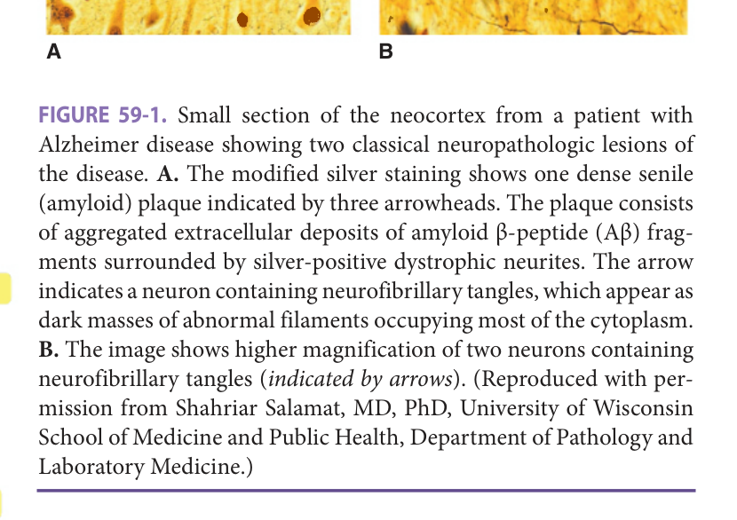
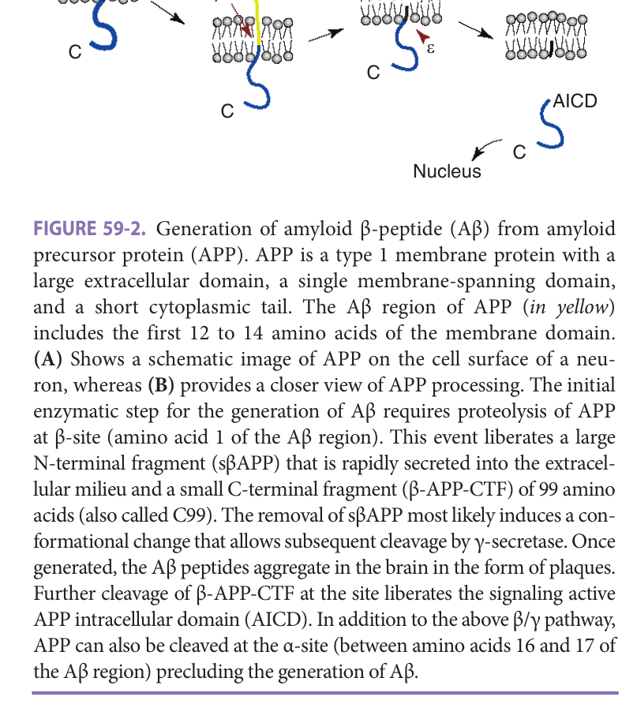
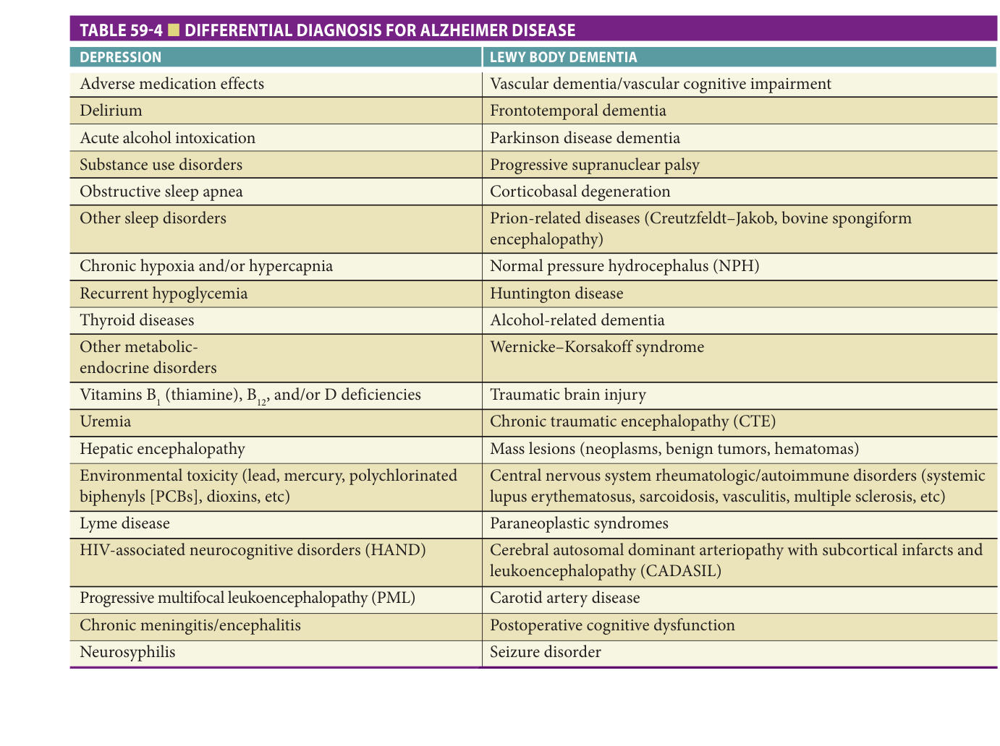
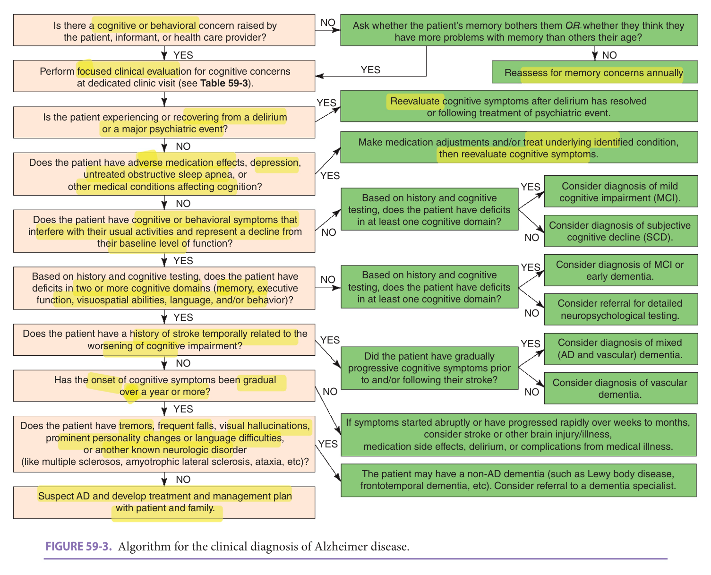
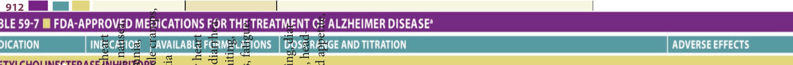
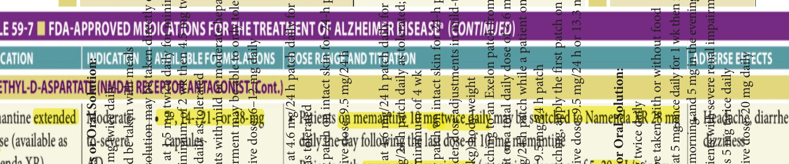
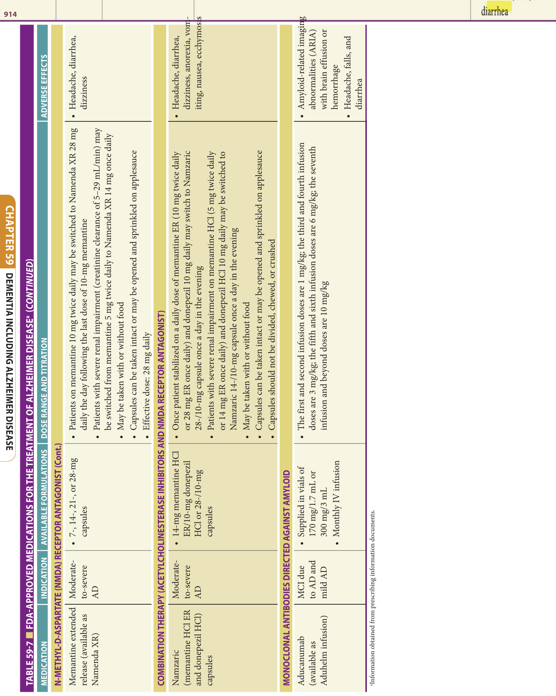

# Hazzard's Geriatric Medicine and Gerontology, 8e — Chapter 59: Dementia Including Alzheimer Disease

Cynthia M. Carlsson, Nathaniel A. Chin, Carey E. Gleason, Luigi Puglielli, Sanjay Asthana

> **Fast build from the book, 22 Sep; not lane-reviewed.**

**[p. 893]**

#### Learning Objectives

- Describe the current diagnostic criteria for dementia, Alzheimer disease (AD), and mild cognitive impairment (MCI), and how these conditions differ from normal cognitive aging.
- Understand the effects of age and other genetic and nongenetic risk factors on risk of developing AD.
- Identify key neuropathologic features and mechanistic pathways associated with AD.
- Recognize common reversible causes of cognitive dysfunction.
- Describe an effective dementia care management plan across care settings and stages of disease, integrating use of pharmacologic and nonpharmacologic interventions, education, and community resources.

#### Key Clinical Points

1. AD is the most common neurodegenerative disorder affecting older adults with prevalence rates increasing with advancing age.
2. While aging is the most established risk factor for late-onset AD, various other genetic, lifestyle, and environmental factors also influence dementia risk.
3. The diagnostic evaluation for dementia, AD, and MCI depends heavily on a careful assessment of an individual’s change in functional status, a structured cognitive assessment, a thorough clinical examination, and exclusion of other competing causes of cognitive decline.
4. There are currently no proven preventive or disease-modifying therapies for AD; however, aducanumab is the first FDA-approved medication that reduces amyloid burden in the brain, but without significant improvement in cognition. The current standard-ofcare management plans integrate use of
5. Advanced care planning prior to loss of decisional capacity is of critical importance in developing patient-centered goals of care in persons with cognitive impairment.

Alzheimer disease (AD) is the most common neurodegenerative disorder affecting older adults, projected to affect more than 13 million Americans and 115 million individuals worldwide by 2050. Compared to projections in high-income countries, the number of individuals with AD in low- and middle-income nations is increasing at an even greater rate. The disease is characterized by diffuse functional and structural abnormalities in the brain that lead to progressive cognitive and behavioral deficits and functional decline. AD is associated with significant morbidity and mortality and is currently the sixth most common cause of death in the United States. The physical, psychological, functional, and socioeconomic impact of AD substantially affects the well-being and quality of life of patients and their caregivers. Caring for patients with AD places heavy financial burden on patients, families, communities, and the health care system at large. In the United States in 2020, the average lifetime cost of caring for a person with AD exceeded $350,000. The total cost of caring for Americans with AD exceeds $355 billion annually. Evidence is beginning to emerge on the economic impact of dementia care in low- and middle-income countries as most of the costs in these nations are related to informal care.

Recognizing the enormity of the burden of AD, international collaborations between clinicians, researchers, policy makers, patient advocacy groups, the media, and many others have increased public awareness of the global impact of the disease and have laid the foundation for the development of effective preventive and therapeutic strategies as well as improvements in care management for patients with AD. An example of such a coordinated effort is the 2011 United States National Alzheimer’s Project Act (NAPA), a law designed to create and maintain an integrated national plan to address AD. The plan encompasses federal coordination of AD research and services and aims to improve early diagnosis and coordination of care, accelerate development of effective treatments, promote health equity in AD care among ethnic and racial minority populations, and stimulate coordination with international groups to address AD globally. Such national and international collaborations will help accelerate optimal diagnosis and care of patients at risk for AD and related dementias. Another example is the public health prevention effort underway to address 12 recognized modifiable risk factors that

**[p. 894]**

contribute to dementia and recommend policy interventions to mitigate these risks. In the United States, this is the focus of the Alzheimer’s Association’s Centers for Disease Control and Prevention: Building Our Largest Dementia (BOLD) Public Health Center of Excellence on Dementia Risk Reduction supported by the BOLD Infrastructure for Alzheimer’s Act—PL115-406.

## Definition

In defining AD features, it is widely recognized that the clinical cognitive and behavioral signs and symptoms do not always correlate with the degree of AD neuropathologic changes noted in the brain. The discrepancy between the neuropathologic changes and the individual clinical expression of disease is likely related to additional unidentified physiologic, metabolic, or genetic factors that either accelerate or slow cognitive decline. For example, some older adults with normal cognitive function just prior to death have been found to have significant AD neuropathology on autopsy. These individuals may have unrecognized neuroprotective factors that help preserve cognitive function despite notable neuropathologic changes. Thus, in order to disentangle the clinical syndrome from the neuropathologic changes, the current AD core clinical criteria are distinct from the AD neuropathologic guidelines, yet encourage clinicians and researchers to postulate the most likely neuropathology underlying the clinical presentation of disease.

In 2011, the National Institute on Aging and the Alzheimer’s Association (NIA-AA) released cosponsored revised clinical diagnostic guidelines for dementia, dementia due to AD, MCI, and a theoretical framework for defining the preclinical stages of AD. Core clinical diagnostic criteria for dementia, AD, and MCI were designed for use in all clinical settings and are summarized in **Tables 59-1** and **59-2** . In 2013, the American Psychiatric Association published the _Diagnostic and Statistical Manual of Mental Disorders, Fifth Edition_ (DSM-5). Within this edition, the term “dementia” was replaced with “major neurocognitive disorder” and the term “mild cognitive impairment” with “mild neurocognitive disorder.” While the DSM-5

and NIA-AA terminologies differ, the diagnostic criteria for major neurocognitive disorder and dementia as well as those for mild neurocognitive disorder and MCI are nearly identical (see **Tables 59-1** and **59-2** ) and, thus, in most circumstances are interchangeable. For simplicity, this chapter uses the terms “dementia” and “MCI.”

## Epidemiology

AD is the most common cause of dementia in older adults, currently affecting more than 6 million Americans. Worldwide more than 44 million individuals currently have AD or a related dementia. Unless effective preventive strategies are identified, it is anticipated that the prevalence of AD will double every 20 years. The United Nations predicts that the major rate of increase in the prevalence of AD will likely occur in developing countries that may not possess the essential resources, public health support system, or medical expertise to care for patients with AD. There is clear evidence that a number of risk factors significantly enhance the overall risk for developing AD. These risk factors relate to both genetic and nongenetic markers and are discussed below.

## Aging

Age is the single most important and validated risk factor - for AD. Epidemiologic studies indicate that the incidence and prevalence of AD both increase with age. Based on data from the 2010 US Census, the prevalence of AD was approximately 3% among adults between the ages of 65 to 74, 17% in persons aged 75 to 84, and 32% in individuals age 85 and older. With the average human lifespan increasing, the prevalence of AD is expected to accelerate at an even greater rate in coming decades. Although not clearly understood, converging research findings provide clues concerning the potential molecular pathway(s) underlying the association between aging and AD. Increases in the pathologic hallmarks of AD, notably amyloid plaques and neurofibrillary tangles, have been noted in the brains of older adults.

Age-related changes in molecular pathways involving insulin-like growth factor 1 receptor (IGF1-R), neurotrophin signaling, β-site amyloid precursor protein cleaving enzyme 1 (BACE1), and amyloid precursor protein (APP) metabolism may account for some of the increase in incidence and prevalence of AD with aging. Additionally, aging and IGF1-R signaling are both associated with cerebrovascular dysfunction, which may play a key role in the development of AD. An increased exposure time to age-dependent vascular risk factors or an interaction between aging and vascular risk factors may in part account for the effects of aging on the pathobiology of AD.

## Apolipoprotein E Genotype

Late-onset AD is the most common form of the disorder, accounting for greater than 95% of all AD cases.

**[p. 895]**
**Table 59-1 — Nia-aa core clinical diagnostic criteria for all-cause dementia and dementia due to alzheimer disease**

**DEMENTIA** The patient has cognitive or behavioral symptoms that: - Interfere with the ability to function at work or at usual activities - Represent a decline from previous levels of functioning and performing - Are not explained by delirium or major psychiatric disorder Cognitive impairment is detected and diagnosed through a combination of: - History-taking from the patient and a knowledgeable informant - An objective cognitive assessment, either a “bedside” mental status … *(table text runs longer in the printed book; not fully reproduced in this fast build)*

### Probable Dementia Due To Alzheimer Disease

The patient meets criteria for dementia _and_ has the following characteristics:

- Insidious onset over months to years, not sudden over hours or days

- Clear-cut history of worsening cognition by report or observation

- Initial and most prominent cognitive deficits are evident on history and examination in one of the following categories:

- °°_Amnestic presentation_(most common presentation)—Deficits should include impairment in learning and recall of recently learned information, plus cognitive dysfunction in at least one other cognitive domain.

- °°_Nonamnestic presentations_c:

- _Language presentation_ —The most prominent deficits are in word finding, but deficits in other cognitive domains should be present.

- _Visuospatial presentation_ —The most prominent deficits are in spatial cognition, but deficits in other cognitive domains should be present.

- _Executive dysfunction_ —The most prominent deficits are impaired reasoning, judgment, and problem solving, but deficits in other cognitive domains should be present.

The diagnosis of probable AD dementia _should not_ be applied when there is evidence of:

- Substantial concomitant cerebrovascular disease (defined by a history of a stroke temporally related to onset or worsening of cognitive impairment or presence of multiple or extensive infarcts or severe white matter hyperintensity burden)

- Core features of dementia with Lewy bodies

- Prominent features of behavioral variant frontotemporal dementia

- Prominent features of primary progressive aphasia

- Active neurologic disease or a medical comorbidity or use of medication that could have a substantial effect on cognition

aDiagnostic criteria for DSM-5 “major neurocognitive disorder” require a significant cognitive decline in one or more cognitive domains (complex attention, executive function, learning and memory, language, perceptual-motor, or social cognition). bThe diagnosis of “probable AD dementia with increased level of certainty” is made when there is a documented cognitive decline and/or evidence of a causative genetic mutation (APP, PSEN1, or PSEN2, not APOE4) in addition to the above diagnostic criteria.

cDiagnostic criteria for DSM-5 “major neurocognitive disorder due to Alzheimer disease” require that one of the affected cognitive domains be memory and learning. _Data from McKhann GM, Knopman DS, Chertkow H, et al. The diagnosis of dementia due to Alzheimer’s disease: recommendations from the National Institute on Aging-Alzheimer’s Association workgroups on diagnostic guidelines for Alzheimer’s disease, Alzheimers Dement. 2011;7(3):263–269._

Although some cases of younger-onset AD have strong links to the genes coding for _APP_ and presenilin 1 ( _PSEN1_ ) and 2 ( _PSEN2_ ) proteins, many cases of late-onset AD are seen in individuals without any clear genetic predisposition. A common polymorphism in the apolipoprotein E ( _APOE_ ) gene is the major determinant of risk in families with late-onset AD. Of the three allelic forms ( _ε_ 2, _ε_ 3, and _ε_ 4), AD risk is increased fourfold in individuals with at least one _ε_ 4 allele and 12-fold in persons with two copies of the _ε_ 4 allele. While _ε_ 4 genotype modifies an individual’s risk of the disease, by itself it is neither necessary nor sufficient for the development of AD.

In the Framingham study, 55% of _ε_ 4 homozygote carriers, 27% of _ε_ 4 heterozygote carriers, and 9% of noncarriers developed AD by age 85. _APOE ε_ 4 genotype may contribute to AD by influencing processes related to the development of AD, including altering the rate of production, clearance, or aggregation of amyloid β-peptide and/or influencing cerebral cholesterol metabolism and inflammation.

## Vascular Risk Factors

Midlife vascular risk factors, including hypercholesterolemia, hypertension, diabetes mellitus, metabolic

**[p. 896]**
**Table 59-2 — Nia-aa core clinical diagnostic criteria for mild cognitive impairment**

**MILD COGNITIVE IMPAIRMENT The patient, an informant who knows the patient well, or a clinician observing the patient notes a concern regarding a change in cognition in comparison to the patient’s previous level. There is evidence of lower performance in one or more cognitive domains (memory, executive function, attention, language, and/or visuospatial skills) that is greater than would be expected for the patient’s age and educational background. The patient maintains … *(table text runs longer in the printed book; not fully reproduced in this fast build)*

epressive disorder, schizophrenia). Identification and exclusion of other neurologic, psychiatric, and medical disorders is implied in the text of the NIA-AA MCI diagnostic criteria. _Modified with permission from Albert MS, DeKosky ST, Dickson D, et al. The diagnosis of mild cognitive impairment due to Alzheimer’s disease: recommendations from the National Institute on Aging-Alzheimer’s Association workgroups on diagnostic guidelines for Alzheimer’s disease, Alzheimers Dement. 2011;7(3):270–279._

syndrome, obesity, and physical inactivity, have all been associated with a greater risk of developing AD in later life. High midlife total cholesterol and blood pressure levels are associated with a two- to nearly threefold increased risk of developing AD decades later and may convey an even greater risk than that caused by _APOE ε_ 4 allele. Abnormal cholesterol metabolism is related to _APOE ε_ 4 allele, suggesting that some of the adverse effects of this genotype on AD risk may be partially mediated through lipoprotein dysregulation. In a community-based cohort study, higher glucose levels were associated with an increased risk of dementia in populations both with and without diabetes mellitus. Metabolic syndrome is also associated with increased risk for AD, although this cluster of risk factors is more consistently related to greater risk of vascular dementia. Midlife obesity (RR 1.60, 95% CI 1.34–1.92) and physical inactivity (RR 1.82, 95% CI 1.19–2.78) are interrelated and both independently increase the risk for developing AD in late life. With more than 35% of current US adults meeting criteria for obesity, there is concern that this risk factor could further accelerate projected increases in AD incidence rates over the coming decades.

Studies support that vascular factors exert an independent additive effect on AD risk. The presence of multiple cardiovascular risk factors at midlife substantially increases the risk of late-life dementia in a dose-dependent manner. The positive corollary to these findings is that about a third of AD cases worldwide might be attributable to potentially modifiable risk factors, thus, providing a target for preventive strategies. Vascular risk factors exert their adverse effects on AD pathology through a variety of mechanisms, including modulation of β-amyloid (Aβ) metabolism, effects on insulin receptors, blood-brain barrier (BBB) integrity, endothelial dysfunction, and cerebral

blood flow. These vascular-mediated changes subsequently lead to tissue hypoxia, increased oxidative stress, inflammation, and cognitive decline.

## Traumatic Brain Injury

There is increasing epidemiologic evidence that moderate or severe traumatic brain injury (TBI) is a risk factor for AD in late life and may precipitate earlier onset of the disease. In longitudinal studies, the magnitude of AD risk increases with TBI severity. Compared to controls, World War II veterans with moderate TBI were twice as likely to develop AD, whereas the risk was fourfold in veterans with severe TBI with loss of consciousness. Neuropathologic examination of brains from patients with a history of head trauma generally reveals changes of diffuse amyloid plaques together with tau pathology, inflammatory response, and loss of cholinergic neurons. These pathologic changes may be related to transient upregulation of BACE1 together with increased generation of Aβ. These features are accompanied by tau hyperphosphorylation and increased caspase-mediated cleavage of APP. Thus, head trauma may lead to AD by triggering accelerated neurodegeneration.

Newer evidence demonstrates that recurrent mild TBI, including both concussive and subconcussive injuries, may also contribute to future risk of cognitive decline. However, it has been difficult to establish risk estimates of the impact of repetitive mild TBI on risk for AD due to a variety of methodologic challenges. The high frequency of concussive and subconcussive injuries, the variability in definitions and measurements of mild TBI, the heterogeneity of injuries among various cohorts (ie, military combat veterans vs contact sport athletes), and selection and recall biases have complicated research of this area. Repetitive concussive injuries may also lead to chronic traumatic encephalopathy (CTE), a condition that is neuropathologically distinct from AD. Symptoms of CTE frequently include headaches and disturbances in attention or concentration and depression—Chapter 64 provides additional details on CTE. Research is underway to clarify the varying types and severity of TBI and the effects of such injuries on risk for posttraumatic neurodegeneration.

## Depression

More than 30% of patients with AD develop depression during the course of their illness, and some may present with depressive symptoms as their first clinical manifestation of underlying AD. While depression has long been recognized as a common psychiatric condition in older adults that may mimic dementia, depression is likely also a risk factor for AD. Findings of a meta-analysis involving over 20 population-based prospective studies supported an increased risk of AD in patients with a history of late-life depression (pooled risk OR [95% CI] 1.65 [1.42–1.92]). To date, the precise mechanisms underlying the association between depression and enhanced AD risk are unknown. Several potential mechanisms have been proposed that are

**[p. 897]**

common to both AD and depression, including elevated levels of cytokines, increased vascular risk factors, and the potential role of _APOE4_ allele. More research is needed to better understand the biological basis of increased risk of AD in patients with a history of depression.

## Race And Ethnicity

The assessment of differences in AD prevalence rates across geographic regions worldwide and among various racial and ethnic groups has proven to be challenging. Differences in education, literacy, life expectancy, access to health care, nutrition, social stressors, vascular risk factors, and cultural beliefs in what is considered normal aging can all influence AD prevalence estimates. In the Indianapolis/ Ibadan studies, the incidence and prevalence of AD were significantly lower among Africans in Ibadan, Nigeria, than among age-matched African Americans in Indianapolis, suggesting that differences in environmental factors may play a larger role than race in influencing the development of AD. The significant influence of environmental factors on AD risk is also supported by data showing that migrant populations tend to have dementia rates that fall between those seen in their homeland and adopted countries. Standardized approaches to case ascertainment of dementia and statistical comparisons across nations have been implemented to better assess variations in prevalence rates among low-, middle-, and high-income countries. These approaches have produced age-adjusted dementia prevalence estimates of approximately 5% to 9% in people older than age 60 across global regions.

Studies assessing ethnic and racial variations in dementia rates within countries have identified some group differences in AD incidence and prevalence. In a population-based study in the Washington Heights and Inwood communities of New York City, the cumulative incidence of AD was increased twofold among individuals of African-American and Caribbean Hispanic origin. The group differences in AD incidence did not change following corrections for differences in years of education or history of vascular risk factors. In a study in Houston, Texas, both the incidence and prevalence of AD were higher among older African-American and Hispanic individuals compared to non-Hispanic White adults. In Singapore, ethnic Malays and Indians had higher rates of dementia compared to ethnic Chinese, independent of vascular risk factors. While some research suggests there may be biological or genetic differences driving variations in AD risk, other studies support that these racial and ethnic group differences will not persist after rigorously accounting for important social, cultural, and environmental factors influencing risk of dementia.

## Education

Low educational attainment, poor educational quality, and illiteracy have been shown to be associated with increased risk for AD. In a meta-analysis of 13 cohort and six

case-control studies, low education had a pooled relative risk (RR) estimate for AD of 1.80 (95% CI 1.45–2.27) compared to high education, although the estimate from cohort studies (RR 1.59 [95% CI 1.35–1.86]) was significantly lower than the estimate based on case-control studies (2.40, [1.32–4.38]). Prospective cohort studies likely provide a more accurate assessment of the association between education and dementia since they allow for documentation of a decline from a previous level of cognitive performance. Some studies have found that education may be a marker of cognitive reserve as it modifies the association between AD neuropathology and level of cognitive function. For the same degree of brain pathology, persons with higher education demonstrate less cognitive impairment. In addition, higher levels of education may help individuals cope more effectively with cognitive changes. Access to higher levels of education may also be a marker of socioeconomic status, coexisting chronic diseases, access to health care resources, and premorbid intellectual abilities. Thus, while low educational attainment is associated with increased AD risk, it is not clear to what extent low education contributes to AD or whether early educational interventions will protect against the development of dementia.

## Gender

> There is some evidence that AD is more common among -

> women, although study results are conflicting. In population-based studies, more than half reported a greater risk of AD in women, while the others found no difference. Some data support that estrogen deficiency following menopause may contribute to the development of AD; however, the effect of hormone replacement therapy on cognition remains controversial. The discrepant findings between

> studies assessing sex-based variations in dementia risk are -- likely due to methodologic differences in accounting for potential gender-related variability in life-expectancy, education, occupation, and lifestyle factors that can directly affect AD risk.

## Pathophysiology

## Genetics Of Alzheimer Disease

Based on the onset of symptoms, AD is normally divided into two groups: younger-onset (< 65 years) and late-onset (> 65 years) disease. Younger-onset patients include individuals with familial AD which accounts for between 1% and 5% of all AD cases and to date has been linked to mutations in the genes for the APP (gene name - _APP_ ) on chromosome 21, presenilin 1 (PS1; gene name _PSEN1_ ) on chromosome 14, and presenilin 2 (PS2; gene name _PSEN2_ ) on chromosome 1. Among these genes, more than 250 different mutations have so far been identified, accounting for approximately 40% of all cases of familial AD, yet only 0.5% of AD cases overall. Most of the mutations (~ 200) are found in the - _PSEN1_ gene and account for 78% of the - familial AD mutations. _APP_ mutations (~ 33) account for

**[p. 898]**

> about 18% of younger-onset autosomal dominant cases and _PSEN2_ (~ 22 mutations) for about 4%. Familial AD is characterized by younger onset of cognitive symptoms (typically in the late 40s or early 50s), but is clinically indistinguishable from late-onset AD.

Late-onset AD, also called sporadic AD, accounts for greater than 95% of all cases of the disease. _APOE_ - is the only established susceptibility gene consistently found associated with late-onset AD in both case-control and genetic studies. _APOE_ maps to chromosome 19 in a cluster with the --genes encoding translocase of outer mitochondrial membrane 40 ( _TOMM40_ ), apolipoprotein C1, and apolipoprotein C2. The _APOE_ gene exists as three major alleles (ε2, ε3, - and ε4) that encode three different ApoE isoforms: ApoE2, - ApoE3, and ApoE4. Interestingly, these isoforms only differ in amino acid sequences at either position 112 or 158 of the protein. The inheritance of the ε4 allele confers an increased risk for developing AD, while the ε2 allele confers protection. For example, presence of one copy of the ε4 allele increases risk of AD fourfold, whereas inheritance of two copies enhances the risk by 12-fold. However, unlike genetic mutations associated with familial AD, the presence -

of _APOE ε_ 4 alone is insufficient to cause AD without additional factors. Even though the first report of an association between _APOE ε_ 4 and AD was published decades ago, the precise molecular mechanisms underlying this association still remain elusive. It is currently unknown if the _APOE4_ allele influences the rate of production, clearance, or aggregation of Aβ peptide or whether it influences cholesterol metabolism and inflammation that reportedly play a major role in the pathobiology of AD.

With the advent of genome-wide association studies (GWASs), a number of new genetic loci with genome-wide significance have been identified. In addition to _APOE4_ , more than 40 other polymorphisms have been associated with increased risk for late-onset AD. However, none of these associations has been uniformly confirmed in every population group studied to date. Over 20 genetic loci have been associated with late-onset AD, leading to four main mechanisms: Aβ metabolism, lipid metabolism, immune response, and cell signaling. Further research is needed to clarify the impact of other genetic changes on AD risk, genetic-environmental interactions, and the impact of such genetic factors on mechanisms of neurodegeneration and neuroprotection.

## Neuropathology Of Alzheimer Disease

The neuropathologic hallmarks of AD include amyloid - plaques, neurofibrillary tangles, and neuritic plaques ( **Figure 59-1** ). The latter are a subset of amyloid plaques that are closely associated with neuronal injury and occur with dystrophic neurites. Cerebral amyloid angiopathy (CAA) frequently co-occurs with amyloid plaques, resulting from deposition of Aβ into cerebral vessels. Sporadic CAA is observed in 80% to 90% of AD patients and may cause lobar intracerebral hemorrhages and microbleeds. Together these processes contribute to loss of neurons and

> *FIGURE 59-1. Small section of the neocortex from a patient with Alzheimer disease showing two classical neuropathologic lesions of the disease. **A.** The modified silver staining shows one dense senile (amyloid) plaque indicated by three arrowheads. The plaque consists of aggregated extracellular deposits of amyloid β-peptide (Aβ) fragments surrounded by silver-positive dystrophic neurites. The arrow indicates a neuron containing neurofibrillary tangles, which appear as dark masses of abnormal filaments occupying most of the cytoplasm. **B.** The image shows higher magnification of two neurons containing neurofibrillary tangles ( _indicated by arrows_ ). (Reproduced with permission from Shahriar Salamat, MD, PhD, University of Wisconsin School of Medicine and Public Health, Department of Pathology and Laboratory Medicine.)*

> Highlighting is the owner's annotation, not the book's.

> synapses in the neocortex, hippocampus, and other sub--

> cortical regions of the brain. The predominance of amyloid - plaques versus neurofibrillary tangles or amyloid angiopathy can differ from one patient to another. However, neuronal/synaptic loss is a constant feature and eventually the direct cause of dementia. The distribution of the disease pathology seems to follow a region-specific pattern with amyloid plaques being more prevalent in the neocortex and neuronal/synaptic loss being more prevalent in the hippocampus, posterior cingulate, and corpus callosum—areas of the brain closely involved with memory formation and higher cortical activities. Finally, brains of persons with AD are also characterized by a diffuse and widespread invasion of reactive astrocytes, mostly concentrated in the hippocampus and around areas of neuronal loss. These astrocytic changes are not specific to AD and can be observed in other neurodegenerative disorders associated with inflammation and neurotoxic insults.

The dominant component of the amyloid plaque core is Aβ organized in fibrils of approximately 7 to 10 nm intermixed with nonfibrillar forms of the peptide. Neuritic plaques are characterized by a dense core of aggregated fibrillar Aβ, surrounded by dystrophic dendrites and axons, activated microglia, and reactive astrocytes. In addition, diffuse deposits of Aβ, likely representing a prefibrillary form of the aggregated peptide, are found without any surrounding dystrophic neurites, astrocytes, or microglia. These diffuse plaques can be found in limbic and association cortices, as well as in the cerebellum.

The other neuropathologic hallmark of AD is the presence of neurofibrillary tangles found exclusively in the cytoplasm of neurons (see **Figure 59-1** ). The tangles

**[p. 899]**

appear as paired, helically twisted protein filaments composed of highly stable polymers of cytoplasmic proteins called tau. Tau comprises a group of alternatively spliced proteins found in the cytoplasm that possess either three or four microtubule-binding domains and can assemble with tubulin, thus helping the formation of cross bridges between adjacent microtubules. Tau proteins can be phosphorylated in multiple sites, and the degree of phosphorylation is inversely correlated with binding to microtubules. As a result, highly phosphorylated tau proteins dissociate from microtubules and polymerize into filaments forming neurofibrillary tangles. In addition to AD, the abnormal accumulation of filamentous tau is observed in frontotemporal forms of dementia, progressive supranuclear palsy, corticobasal degeneration, and Pick disease. Contrary to prior belief, tau proteins themselves can cause dementia, and multiple mutations in the _tau_ gene have been found in frontotemporal dementia (FTD) with parkinsonism. The precise role of tau proteins in the pathogenesis of AD and their potential interaction with Aβ are still unclear.

In 2012, NIA and the Alzheimer’s Association published revised criteria for AD neuropathologic change. These criteria recommended reporting on the presence and extent of hallmark lesions for AD observed at autopsy independent of the individual’s cognitive state. These new guidelines took into account several well-established neuropathologic scoring criteria and integrated them into an “ABC score” based on three parameters ( _A_ myloid, _B_ raak, _C_ ERAD): criterion “A” ranks the Aβ plaque score (based on criteria from Thal et al.), criterion “B” measures the neurofibrillary tangle stage (modified from Braak criteria), and criterion “C” assesses the neuritic plaque score (modified from the Consortium to Establish a Registry for Alzheimer Disease [CERAD]). For reporting, these ABC scores are then transformed into one of four levels of neuropathic change: none, low, intermediate, or high. While CAA is not considered in the “ABC” score, the guidelines recognize that these changes frequently co-occur with parenchymal Aβ plaques and recommend neuropathologists comment on such changes separately within the neuropathology report.

## Amyloid Precursor Protein Processing And Generation Of Aβ

Aβ is a 39 to 43 amino acid hydrophobic peptide proteolytically released from a much larger precursor, APP. Although APP is the major source of toxic Aβ, it also exerts several important functions in the nervous system, including serving as a cell-surface receptor, growth factor, protease inhibitor, cell–cell interaction molecule, coreceptor/partner in the endocytic/lysosomal network, coagulation inhibitor factor, cell-surface scaffold protein, kinesin-interacting molecule for axonal transport, and transcription factor. The generation of Aβ from APP ( **Figure 59-2** ) requires the sequential recruitment of two enzymatic activities: β-secretase, also called BACE1, and γ-secretase, a multimeric protein

> *FIGURE 59-2. Generation of amyloid β-peptide (Aβ) from amyloid precursor protein (APP). APP is a type 1 membrane protein with a large extracellular domain, a single membrane-spanning domain, and a short cytoplasmic tail. The Aβ region of APP ( _in yellow_ ) includes the first 12 to 14 amino acids of the membrane domain. **(A)** Shows a schematic image of APP on the cell surface of a neuron, whereas **(B)** provides a closer view of APP processing. The initial enzymatic step for the generation of Aβ requires proteolysis of APP at β-site (amino acid 1 of the Aβ region). This event liberates a large N-terminal fragment (sβAPP) that is rapidly secreted into the extracellular milieu and a small C-terminal fragment (β-APP-CTF) of 99 amino acids (also called C99). The removal of sβAPP most likely induces a conformational change that allows subsequent cleavage by γ-secretase. Once generated, the Aβ peptides aggregate in the brain in the form of plaques. Further cleavage of β-APP-CTF at the site liberates the signaling active APP intracellular domain (AICD). In addition to the above β/γ pathway, APP can also be cleaved at the α-site (between amino acids 16 and 17 of the Aβ region) precluding the generation of Aβ.*

> Highlighting is the owner's annotation, not the book's.

complex containing presenilin, nicastrin, Aph-1, Pen-2, and CD147. The β-cleavage is the rate-limiting step and occurs before the γ-cleavage. It liberates a large N-terminal fragment of the protein (sβAPP) that is released in the extracellular milieu and a small (~12 kDa) membrane-anchored fragment called β _-_ APP-CTF (or C99). The release of the large N-terminal domain allows subsequent γ-cleavage, and liberation of Aβ and the signaling of active intracellular domain (AICD) of APP (see **Figure 59-2** ). Generation of Aβ40 and Aβ42 results from γ-cleavage of Aβ at positions 40 and 42, respectively. The release of Aβ in the extracellular milieu is followed by oligomerization and aggregation in the form of fibrils and amyloid plaques. Additionally, small Aβ aggregates are also found in the soma of the neurons suggesting that the Aβ fragments can escape secretion and aggregate in the intracellular environment. The molecular

**[p. 900]**

> mechanisms underlying the toxicity of Aβ are still being investigated and currently incompletely understood. However, research seems to indicate that small Aβ aggregates (oligomers), which represent the “preplaque” neurotoxic species of Aβ, act as the proximate cause of neuronal injury and synaptic loss associated with AD. Additionally, the C-terminal tail of APP can undergo further processing at amino acid 664 of APP695 liberating two small cytosolic fragments, Jcasp and C31. Both of these fragments are generated only after γ _-_ cleavage, require caspase-mediated processing of APP, and can activate proapoptotic pathways in a variety of cellular systems.

The most critical clinical link between Aβ and AD came from the observation that patients with Down syndrome (trisomy 21) had a higher propensity for developing a clinical and pathologic phenotype resembling AD, thereby suggesting a potential association between AD and chromosome 21. This observation was further strengthened by the fact that Aβ was the major component in plaques from both patients with Down syndrome and AD, and that its genesis was related to a gene ( _APP_ ) located on chromosome 21, close to the obligate Down syndrome region. Following the identification of APP, several groups found mutations in the _APP_ gene that were linked to familial forms of AD. Given that the duplication of the _APP_ locus could result in early AD and that Down syndrome patients with partial trisomy 21 developed AD only when the trisomy was proximal to the _APP_ locus, the potential direct relationship between APP metabolism and AD seems strong. Furthermore, causative mutations in the genes that encode for PS1 and PS2, which are also implicated in the metabolism of APP, have been found and are associated with familial forms of AD, thereby conferring additional strength to the linkage between APP/ Aβ metabolism and AD.

Although the generation of Aβ from APP seems to be a pivotal step in the pathobiology of AD, it does not explain all the neuropathologic changes observed in patients with AD. For example, examination of the brain of transgenic mice expressing human APP harboring one or more familial AD-associated mutations reveals the presence of amyloid plaques and some synaptic loss and cognitive deficits, but absence of tau pathology and astrocytosis. This suggests that additional biochemical/molecular events are required to develop the full pathologic spectrum of AD. To circumvent this issue, several new animal models have been generated where human APP is accompanied by additional genes. These genes include the _presenilins_ (harboring familial AD-associated mutations), _tau_ , and _APOE_ . Recently, several transgenic mice models harboring three or five familial AD-associated mutations (respectively called 3X and 5X mice) in two or more genes have been generated. All of these models demonstrate that Aβ is an essential element for the development of AD-like neuropathology and revealed a close relationship between Aβ and the phosphorylation/aggregation state of tau. However,

none of the mouse models fully reproduce the classical AD phenotype, thereby again suggesting that Aβ seems to be necessary but not sufficient to produce the entire spectrum of AD neuropathology. Transgenic mice expressing the human microtubule-associated protein tau develop the typical tau-related pathology found in individuals suffering from FTD with parkinsonism; however, they do not develop amyloid plaques, suggesting that tau is not required for the formation of plaques. Crossing these mice with APP transgenic mice potentiates tau-related pathology and neuronal loss but does not aggravate plaque pathology, suggesting that Aβ acts upstream of tau in the classical AD phenotype. However, studies from patients with AD, mouse models, and ex vivo cellular systems indicate that Aβ and tau can interact synergistically, thereby fostering their respective aggregation and neuronal loss. Thus, the true relationship between Aβ and tau is more complex than previously thought and likely involves additional molecular and biochemical pathways acting upstream of both Aβ and tau production in the AD brain.

## Clinical Presentation

> The most common clinical onset of AD is an amnestic -

> presentation, characterized by slowly progressive memory loss for recent events. Patients with AD frequently have problems remembering recent conversations, dates, appointments, and may misplace items. Many patients are not aware of these deficits and are brought to medical attention by their family members or friends. For some patients, memory loss symptoms are first noted by others during a stressful life event, such as the patient’s hospitalization or the death of a spouse; however, a thorough interview frequently reveals that the cognitive deficits preceded such an event by months to years. The memory deficits of AD are generally differentiated from those caused by normal aging by the fact that AD-related deficits are progressive and interfere with the individual’s usual daily activities. Memory loss leading to a change in functional status is not a part of normal aging and warrants further evaluation.

Nonamnestic presentations of AD are also common and may include prominent initial impairments in language abilities, visuospatial skills, and executive function. As these presentations are less commonly recognized by patients, families, and clinicians alike as being early symptoms related to AD, individuals with nonamnestic presentations are frequently misdiagnosed or experience a delay in diagnosis. In addition to the more common amnestic presentation, nonamnestic presentations are specifically identified in the NIA-AA diagnostic criteria for AD (see **Table 59-1** ). Patients who initially present with language impairment frequently will complain of marked word-finding problems with subsequent progression to paraphasic errors and circumlocution. AD patients with a visuospatial presentation may have prominent deficits

**[p. 901]**

in spatial cognition, including poor object and face recognition, an inability to perceive multiple visual elements simultaneously, and difficulty understanding written language. Executive dysfunction is another common initial presenting symptom of AD, leading to impairments in reasoning, judgment, problem solving, and an inability to complete complex demanding tasks. Deficits in concentration and attention frequently occur in patients with AD, but these changes may also be notable in persons with depression, attention deficit disorder, sleep disorders, or adverse medication effects.

As the disease progresses, changes in personality are commonly seen in patients with AD and may include increased passivity, lack of interest, agitation, restlessness, and/or overactivity. AD patients may exhibit increased irritability when confronted with memory loss symptoms, such as when struggling to find a word, being reminded of a prior conversation or event, or searching for a misplaced item. More than 30% of persons with AD develop symptoms of depression, which may be the first clinical presentation of the disease. Early signs of depression in patients with AD include increased irritability, alterations in appetite or sleep, trouble concentrating or making decisions, low energy, social withdrawal, and a decline in physical function. Worsening of behavior and cognitive symptoms in the evening is also common in patients with AD and may be related to changes in circadian rhythm from loss of sunlight.

In the later stages of the disease, individuals may have increased confusion, dysphagia, impaired gait, and repeated falls. In some patients with AD, disruptive behaviors may increase with aggression, agitation, and physical or verbal hostility; in others, these behavioral symptoms lessen with disease progression. The majority of patients become increasingly frail and dependent for self-care and activities of daily living with many patients developing bowel - and bladder incontinence. Persons in the late stages of AD may become immobile and bed-bound, which increases their risk of developing pressure sores, malnutrition, and dehydration. The most common causes of death in patients with AD include pneumonia, urinary sepsis, dehydration, pressure sores, fractures, and malnutrition. The median survival period from the time of diagnosis to death generally ranges from 7 to 10 years, although some patients, especially those with familial AD, die earlier.

## Evaluation

For many older patients with cognitive complaints, their evaluation, diagnosis, and management may be effectively completed within a primary care setting. If available, utilization of multidisciplinary team members from nursing, social work, psychology, and/or pharmacy can greatly aid a primary care physician in the diagnosis and management of patients with cognitive concerns. A smaller subset of patients will need more in-depth neuropsychological assessment and clinical evaluation from a dementia specialist.

The NIA-AA clinical diagnostic criteria for dementia, AD, and MCI (see **Tables 59-1** and **59-2** ) were designed to be used across all clinical settings, including primary care, specialty clinics, and long-term care. The clinical diagnoses of MCI and dementia are primarily ascertained through completion of a focused interview with the patient and an informant who knows the patient well, a thorough review of the patient’s medical history and medication use, a comprehensive physical examination, a formal assessment of cognitive function, basic laboratory tests, and neuroimaging ( **Table 59-3** ). While the differential diagnosis for AD is extensive ( **Table 59-4** ), a systematic approach to dementia diagnosis can help primary care clinicians identify common confounding medical and psychiatric conditions and medications that can adversely affect cognition. In addition, a structured evaluation may facilitate accurate diagnosis of the most common causes of dementia—AD and AD mixed with vascular dementia as well as predementia syndromes such as MCI. Integrating various established diagnostic criteria, **Figure 59-3** shows a primary care diagnostic algorithm developed to guide clinicians in their assessment of patients with cognitive complaints.

Identification of a cognitive concern is the first step in the evaluation. While early cognitive changes in some patients may be readily identified by the individuals themselves, their families, and/or their clinicians, such symptoms may not be as apparent in other patients due to a variety of factors, including poor insight, attribution of such changes to normal aging, cultural views of dementia, or lack of corroborative history from others. Whether all older adults should undergo routine screening for dementia remains controversial. The US Preventive Services Task Force recommends against routine screening for dementia in asymptomatic older adults based on insufficient evidence that such widespread screening impacts individual or societal outcomes. However, the US Medicare Annual Wellness Visit requires that clinicians assess cognitive function by “direct observation,” although no cognitive screening tool is endorsed. In an effort to operationalize the Medicare Annual Wellness Visit requirements, the Alzheimer’s Association recommends using self-reported memory concerns, clinician observations, or concerns from a person who knows the patient well to trigger a formal memory assessment. Screening questions such as “Does your memory bother you?” or “Do you think your memory is worse than others of your age?” also may be used to determine which older patients need a formal evaluation of cognitive performance. Identifying memory concerns through self-report or screening questions may reduce the number of unnecessary formal cognitive screening tests administered to asymptomatic adults at low risk for dementia. However, individuals without a close informant may need structured cognitive tests to identify memory concerns. When a cognitive concern is identified, a separate clinic visit should be arranged to investigate the underlying cause (see **Figure 59-3** and **Table 59-3** ).

**[p. 902]**
**Table 59-3 — Evaluation of the patient with cognitive concerns**

**History of cognitive changes** Primary symptom(s) at onset (memory loss, language/spelling errors, impaired reasoning, difficulties in multitasking, personality changes, etc) Date of onset and time course of cognitive decline (gradually progressive, stepwise, fluctuating, abrupt, rapidly progressive, etc) and whether or not it was associated with delirium Past and present function at higher level tasks (including tasks at work, hobbies, daily household chores including instrumental … *(table text runs longer in the printed book; not fully reproduced in this fast build)*

### Past Medical And Psychiatric History

Vascular risk factors (including how well they have been controlled over time)

Strokes and/or transient ischemic attacks (assess whether cerebrovascular event was associated with onset of cognitive symptoms) Atrial fibrillation, carotid artery disease, patent foramen ovale, and/or other risk factors for stroke

Coronary artery bypass surgery (assess whether surgery was associated with onset of cognitive symptoms)

Other major central nervous system (CNS) event (traumatic brain injury with loss of consciousness, anoxic brain injury, postoperative cognitive dysfunction, etc)

Hearing and/or vision loss

Obstructive sleep apnea (including how well it is treated with continuous positive airway pressure [CPAP] or other modalities) Alcohol or other substance abuse

Depression, anxiety, posttraumatic stress disorder, or other psychiatric illness

Parkinson disease, parkinsonism, amyotrophic lateral sclerosis, or multiple sclerosis

Seizure disorder

History of malignancy with or without prior treatment with chemotherapy

### Medication Review

Prescription and nonprescription medications and supplements (especially those with anticholinergic or sedating side effects) Timing of onset of cognitive symptoms with medication/supplement initiation or dose change

### Social History

Family, friends, and other social support

Use of community resources (including home aides, senior centers, meal services, etc)

Educational history (including formal years of education and/or technical training, any interruption in schooling or repeated grades, any suspected or diagnosed learning disabilities or attention deficit disorder, etc)

Work history (including types of responsibilities associated with occupation)

Military history (including exposure to combat or blast injuries) Hobbies and other daily activities

Substance use history (including any prior history of heavy alcohol use)

### Family History

History of AD or other dementias (including age of onset of symptoms in affected family members) History of other neurodegenerative disorders, strokes, psychiatric illnesses, etc

### Physical Examination

General appearance (attention, comprehension, cooperation, personal hygiene and grooming, social appropriateness, psychomotor slowing, word-finding difficulties)

Mental status (behavior, attitude, mood, affect, insight, judgment, thought content, thought process, speech, language) Cranial nerves (facial symmetry, visual acuity, pupillary responses, eye movements, visual fields, hearing impairment) Motor function and integration (strength, tone, cogwheeling, simulation of motor actions to test for apraxia)

Sensory function and integration (sensation to light touch, identification by touch of an object placed in the hand or a number written on the hand, ability to perceive simultaneous bilateral tactile stimuli)

Coordination (rapid alternating movements, finger-to-nose testing, heel-shin testing) Deep tendon reflexes Gait

 **[p. 903]**
**Table 59-3 — Evaluation of the patient with cognitive concerns (** **_continued_ )**

**Screening cognitive tests** (time to administer) Mini Mental State Examination (MMSE) (5–10 min) Montreal Cognitive Assessment (MoCA) (10 min) Saint Louis University Mental Status (SLUMS) Examination (5–10 min) Mini-Cog (3 min) Memory Impairment Screen (MIS) (3–4 min) General Practitioner Assessment of Cognition (GPCOG) (4 min)

### Depression Screen

Geriatric Depression Scale—Short Form (GDS-SF) (5–7 min—may be self-administered)

### Informant Assessment

Eight-Item Interview to Differentiate Aging and Dementia (AD8) (3 min) ... GPCOG Informant Questionnaire (2 min) Informant Questionnaire on Cognitive Decline in the Elderly (IQCODE) (10–15 min) **Laboratory evaluation** Vitamin B12, thyroid-stimulating hormone (TSH), 25-OH vitamin D, complete blood count, glucose, blood urea nitrogen and creatinine, basic metabolic profile, liver enzymes

### Neuroimaging

Noncontrast head CT

MRI

**Table 59-4 — Differential diagnosis for alzheimer disease**

|**DEPRESSION**|**LEWY BODY DEMENTIA**| |---|---| |Adverse medication effects|Vascular dementia/vascular cognitive impairment| |Delirium|Frontotemporal dementia| |Acute alcohol intoxication|Parkinson disease dementia| |Substance use disorders|Progressive supranuclear palsy| |Obstructive sleep apnea|Corticobasal degeneration| |Other sleep disorders|Prion-related diseases (Creutzfeldt–Jakob, bovine spongiform encephalopathy)| |Chronic hypoxia and/or hypercapnia|Normal pressure hydrocephalus … *(table text runs longer in the printed book; not fully reproduced in this fast build)*

 polychlorinated biphenyls [PCBs], dioxins, etc)|Central nervous system rheumatologic/autoimmune disorders (systemic lupus erythematosus, sarcoidosis, vasculitis, multiple sclerosis, etc)|

> *Table 59-4 reproduced as a page image (printed p. 903) — the grid did not extract reliably as text for this fast build.*

> Highlighting is the owner's annotation, not the book's.

**[p. 904]**

> *FIGURE 59-3. Algorithm for the clinical diagnosis of Alzheimer disease.*

> Highlighting is the owner's annotation, not the book's.

Within a dedicated primary care clinic visit, an optimal cognitive assessment includes gathering information not only from the patient’s perspective, but also independently in a separate interview from an informant who knows the patient well. Depending on available time and resources, an independent informant interview may be accomplished through utilizing a variety of health care team members, such as social workers, medical assistants, nurses, or psychologists to conduct a brief structured informant interview or a full detailed assessment. Important historical elements include establishing when the cognitive symptoms began and the very first symptoms noted (such as problems with memory, language, executive function, apraxia, or personality changes). A careful delineation of the time course of progression will narrow the differential diagnosis and will help identify whether there are multiple contributing factors or one underlying process. Frequently, an inciting event that disrupts coping skills, such as a hospitalization or the death of a spouse, will draw the attention of family members to a patient’s memory problems. The family may give a history of an acute onset of memory impairment following the inciting event, but careful questioning may identify cognitive

problems preceding that time period and point to a gradually progressive course.

A key component to the interview is establishing the patient’s baseline cognitive and functional performance, taking into account past educational opportunities, estimated baseline intellectual function, occupational history, and prior established skills and abilities. Understanding the patient’s baseline function will put neuropsychological test results into context in order to prevent over- or underdiagnosing dementia in patients who present with cognitive concerns. Changes in the person’s ability to carry out tasks related to their occupation, hobbies, household management, and other volunteer activities should then be ascertained.

There are common reversible causes of cognitive dysfunction that next should be addressed. One of the first steps should be a careful review of prescription and nonprescription medications. Drugs with known anticholinergic properties (such as antihistamines, tricyclic antidepressants, bladder antispasmodic agents, etc) or sedating side effects (such as high-dose gabapentin, other antiepileptic medications, narcotic analgesics, benzodiazepines, sleeping aids, etc) should be carefully reviewed to see if

**[p. 905]**

the benefit of the offending medication outweighs the adverse cognitive effects. Patients should be included in shared decision-making with any medication adjustments as the value placed on various symptoms is likely to differ between individuals.

Clinicians should carefully evaluate their older patients for depression, anxiety, or other mood disorders that can affect cognitive performance. Depression may be a prodromal syndrome prior to dementia onset, but also commonly co-occurs with this syndrome. Pointed questions assessing for changes in sleep duration and/or quality, interest in activities, feelings of guilt, loss of energy, impaired concentration, changes in appetite, psychomotor slowing, and suicidal thoughts should be assessed. A brief screening tool such as the Geriatric Depression Scale (GDS) can be administered by a health care team member or self-administered while the patient is waiting for the clinician. Older patients with depression frequently complain of problems with poor concentration and forgetfulness and may perform poorly on tests of attention, speed of processing, and memory. In such patients, it is important to differentiate a loss of interest related to depression from a lack of initiative due to a neurodegenerative disorder. Treating depression and anxiety may lead to improvements in cognitive performance as well as mood.

Hearing loss may mimic cognitive dysfunction as patients who cannot hear well may not be able to properly encode new information from conversations or other auditory-received information. Questions on hearing loss symptoms and use and fit of any prescribed hearing aids can alert the provider as to whether hearing loss is contributing to cognitive symptoms or if further hearing evaluation is needed (see Chapter 34 for approach to screening for hearing loss).

A careful assessment of alcohol use should be completed in all patients, especially if cognitive performance varies widely from visit to visit or if the patient lives alone. Risk for obstructive sleep apnea should be assessed with several screening questions assessing the patient’s snoring, witnessed apneic episodes, excessive daytime sleepiness, or nonrestorative sleep. In patients with diagnosed sleep apnea, their ability to effectively and regularly use their continuous positive airway pressure (CPAP) device should be assessed and any difficulties should be reported to the sleep medicine and/or respiratory therapy team to seek out other mask options for better fit and tolerance. Obstructive sleep apnea with its related hypoxia can cause profound effects on cognition.

Vascular disease may contribute to cognitive impairment through a variety of mechanisms. In addition to stroke causing acute cognitive decline, chronic low cerebral blood flow leading to subclinical hypoperfusion may also contribute to cognitive impairment and AD. Thus, a careful assessment of vascular risk factors should be completed to make sure they are well treated. Carotid bruits or a history of sudden cognitive changes should prompt work-up

for cerebrovascular disease with neuroimaging (computed tomography [CT] or preferably magnetic resonance imaging [MRI]) and either carotid ultrasound or magnetic resonance angiogram (MRA).

Delirium is associated with an acute or subacute onset of fluctuating cognitive dysfunction and may be caused by a wide variety of medical conditions and medications. In patients with delirium, a careful history frequently can tease out the temporal relationship between the onset of potentially reversible cognitive symptoms and contributing underlying medical problems or medications. Patients who have had a significant medial illness may exhibit signs of delirium for weeks to months following the inciting illness. Care should be made to avoid making a diagnosis of dementia in the presence of a resolving delirium. Since dementia is a risk factor for delirium, however, the presence of a delirium may suggest an underlying neurodegenerative disorder.

Additional information on safety should be obtained, including inquiries on medication management, driving, - kitchen safety, use of firearms or heavy equipment or power tools, wandering, and susceptibility to financial scams. A review of systems should include questions on depression, tremors, falls, visual hallucinations, symptoms of stroke or transient ischemic attack, ataxia, dysphagia, urinary incontinence, waxing and waning level of consciousness, agitation, and personality changes.

The patient’s past medical history should be reviewed for medical and psychiatric conditions affecting cognition, including cardiovascular and cerebrovascular disease and associated risk factors, surgical procedures including coronary artery bypass surgery, significant hearing loss, depression, Parkinson disease, TBI, seizures, and/or heavy alcohol use. A thorough medication review should be conducted to assess all prescription and nonprescription medications and the association of any medication initiation and/ or dose adjustment with changes in cognitive symptoms. Patients should be encouraged to bring in all pill bottles to the clinic visit. The social history should assess the patient’s education and occupational baseline, their social support network, and their use of community resources. An accurate assessment of prior or current alcohol or illicit drug use and a sexual history with special attention to sexually transmitted disease (notably syphilis and HIV) risk factors are critical to a correct diagnosis. An assessment of family history of dementia should include age of onset and time course of any symptoms of family members with memory loss.

The physical examination should include assessment of general appearance and a mental status examination (see **Table 59-3** ). Careful observation upon interviewing a patient can provide rich information as to their ability to care for themselves, their organizational ability, their ability to provide detail within their conversation, and their comprehension of posed questions and the appropriateness of their response. Ears should be checked for any cerumen

**[p. 906]**

> accumulation and/or hearing loss. A neurologic examination should screen for focal deficits, gaze palsies, increased muscle tone, cogwheeling, tremors, and ataxia. A detailed review of a comprehensive mental status and neurologic examination in older adults is described in Chapter 9. Cardiac arrhythmias, carotid bruits, or abdominal or femoral bruits may suggest a vascular contribution. The remainder of the physical examination should focus on ascertaining any major medical conditions that could have significant cognitive effects, such as hypoxia or significant active infection.

While there is no consensus as to which is the best cognitive screening tool, there are a variety of cognitive screening tests that have been validated in a primary care setting. Clinicians should identify several with which they are comfortable so that they can be used consistently over time with their patient population. The Mini-Mental State Examination (MMSE), the Montreal Cognitive Assessment (MoCA), and the Saint Louis University Mental Status Examination (SLUMS) have been widely used in primary care settings. The Alzheimer’s Association recommends use of the General Practitioner Assessment of Cognition (GPCOG), the Mini-Cog, or the Memory Impairment Screen (MIS) for cognitive screening related to the Medicare Annual Wellness Visit, as these tests take less than 5 minutes to administer, have good psychometric properties, and can be administered by a variety of health care team members. Informant assessment of changes in patient performance may include the GPCOG informant questionnaire, the Eight-Item Interview to Differentiate Aging and Dementia (AD8), or the Informant Questionnaire on Cognitive Decline in the Elderly (IQCODE) (see **Table 59-3** ). If time and resources allow, additional interview time with an informant may identify specific areas of safety concerns and help tailor the management plan.

In adults with high baseline cognitive functions, these screening tests may be normal in the presence of obvious functional impairment necessitating referral to a neuropsychologist for more detailed cognitive testing. In individuals with lower educational levels or learning disabilities, cognitive screening tests may suggest impairment, but the history may not suggest any changes in functional status. Thus, it is critical to use age- and education-adjusted norms, and integrate historical information on baseline function to decide if further neuropsychological testing is warranted or if abnormal testing actually reflects the patient’s baseline cognitive performance.

Laboratory data can assist in identifying factors that may be contributing to cognitive decline. Rarely do these factors alone account for the overall cognitive changes that lead to the presentation of a patient with significant memory loss. Nevertheless, treating such factors may improve cognitive symptoms in patients with pronounced laboratory abnormalities, numerous comorbid illnesses, or an underlying neurodegenerative process. Recommended laboratory tests include vitamin B12, folate, thyroid-stimulating

hormone (TSH), electrolytes, complete blood count, liver enzymes, and 25-OH vitamin D. If symptoms are atypical or if there are specific risk factors, then an HIV test or serologic test for syphilis may be performed. In patients with assumed heavy alcohol use, thiamine (vitamin B1) levels should be checked. In some European countries, routine assessment of cerebrospinal fluid (CSF) for β-amyloid and tau levels is done as part of the clinical evaluation. While CSF β-amyloid and tau levels may increase diagnostic accuracy of MCI and dementia due to AD, in general they are not recommended for widespread clinical practice as in most cases they do not change a patient’s management plan. CSF collection may be used in memory specialty clinics, though, to differentiate between different dementias, including Creutzfeldt–Jakob disease, normal pressure hydrocephalus (NPH), or other less-common causes of neurodegeneration (see **Table 59-4** ). Genetic testing for _APOE ε4_ genotype is not recommended in routine clinical practice. Testing for _PSEN1_ , _PSEN2_ , or _APP_ genes should be reserved for specialists evaluating cases in which there is a suspicion for familial AD.

In patients with documented cognitive impairment, it is recommended tha <mark>t either a CT or MRI scan</mark> of the brain be obtained. If neuroimaging was obtained for another indication prior to the onset of cognitive symptoms, in most cases the patient should be reimaged. Typical findings for AD on neuroimaging can range from a fairly normal scan to focal or diffuse cerebral atrophy. A CT of the head without contrast is usually sufficient to screen for significant cerebrovascular disease, brain tumors, subdural hematoma, or NPH. MRI can provide more information if lacunar infarcts are suspected. MRA may be helpful in identifying significant stenosis that could cause hypoperfusion. In persons with suspected seizure disorder or Creutzfeldt– Jakob disease, an electroencephalogram (EEG) may be considered. Use of fluorodeoxyglucos <mark>e (FDG)</mark> positron emission tomography (PET) and amyloid PET imaging to differentiate FTD from AD should be reserved for specialty clinic use. Tau PET imaging is a novel research tool that is not yet approved for clinical practice.

## Formulating A Diagnosis

Once a cognitive concern is recognized and delirium is ruled out, the clinician should identify and document any impaired cognitive domains (such as memory, executive function, language, or visuospatial skills) on cognitive testing and any functional loss in the individual’s daily activities. Each potentially reversible cause of cognitive impairment should be outlined (ie, medication side effects, alcohol, sleep apnea, depression, or other medical comorbidities) and a plan to address these conditions should be developed. Objective cognitive impairment in the context of a supportive clinical history plus a decline in the individual’s daily functional abilities are key elements necessary to differentiate normal cognitive aging and subjective cognitive decline (SCD) from MCI and dementia. With normal

**[p. 907]**

aging, individuals may experience a decline in mental processing speed and may have more difficulty learning new material, but these cognitive changes should not affect their usual function within their daily activities. For example, a healthy older adult may have more difficulty recalling an acquaintance’s name or learning a new computer program, but their cognitive testing should be normal and daily functional activities should remain intact. SCD is a term used primarily in research settings to broadly describe symptoms within a pre-MCI stage of neurodegeneration. SCD is currently defined as a self-identified persistent decline in cognitive capacity compared with the individual’s previous normal status in a person who still performs in the normal range on standardized cognitive tests. An example would be a business manager with normal performance on cognitive testing, who has noticed a subjective decline in her efficiency in managing numerous projects simultaneously despite maintaining a similar work load for many years. It is not yet known what percentage of patients presenting with SCD progress on to MCI and eventually AD; however, there is converging evidence that risk for progression to MCI and dementia increases in persons with SCD. Identification of patients with SCD allows clinicians to complete a thorough evaluation for other medical, psychological, and medication factors that could contribute to cognitive decline. Patients with SCD should be screened for cognitive dysfunction annually to evaluate for objective evidence of a decline in cognitive performance.

Once a person with SCD develops deficits in at least one cognitive domain, they may meet criteria for MCI (see **Table 59-2** ), a symptomatic predementia syndrome noted in up to 15% to 20% of older adults. Individuals with MCI may present with cognitive complaints and describe a variety of methods they use to compensate for these cognitive changes, such as increasing use of lists, calendars, alarms, and other reminders. They maintain their level of function, but are less efficient in doing so. For example, a cabinetmaker who demonstrates impairment in executive function on testing may complain that in order to complete a cabinet work order with his same level of quality workmanship, it now takes him 2 to 3 weeks, whereas a few years ago he could complete such an order in 1 week. Once an individual’s cognitive impairment progresses to the point that they can no longer maintain their baseline level of function, they may meet criteria for dementia. In the previous example, as the cabinetmaker’s cognition declines he may no longer be able complete a cabinet order at all or may finish it with poorer-quality workmanship. At that point he may have progressed to a dementia.

Approximately 12% to 15% of persons with MCI will progress each year to AD or other forms of dementia. MCI patients who have impairment in memory performance (single-domain amnestic MCI) or in memory plus another cognitive area (multidomain amnestic MCI) are more likely to progress to AD. Older individuals with nonamnestic MCI may be more likely to progress to other forms of

dementia, such as FTD, dementia with Lewy bodies, or vas- cular dementia. Once a diagnosis of dementia is suspected, the clinician must differentiate between various causes of dementia. AD is the most common form of dementia in the United States, accounting for 50% to 90% of all dementia cases. Dementia with Lewy bodies, vascular dementia, and FTD are other common forms of dementia ( **Table 59-5** ). Details of the clinical and pathologic features of these dementias are covered in Chapter 63. Differentiating AD from other causes of memory loss can help clinicians choose effective therapies, anticipate behavior changes and other potential complications, and provide patients and caregivers information on prognosis.

If a patient does not meet the criteria for AD yet clinical suspicion remains, the clinician may consider obtaining more detailed neuropsychological testing or repeating screening cognitive testing in 6 to 12 months to clarify the diagnosis as the symptoms become more apparent. Persons with suspected MCI should be reassessed on an annual basis to evaluate for progression to dementia. If the symptoms or course of the disease are atypical for AD, the level of functional decline is out of proportion to neuropsychological testing results, or if there are significant behavioral issues that need to be addressed, then referral to a geriatrician, neurologist, or psychiatrist with expertise in dementia is recommended.

## Future Diagnostic Tools

Novel biomarkers are continually being investigated for use in the diagnosis of AD and other types of dementia, as well as in identifying predementia syndromes. Many of these tools are still used chiefly in research settings, but are being studied to evaluate their potential role in clinical practice. Current investigations are focusing on specific neuroimaging modalities and biomarkers (including blood and CSF) with strong relationships to clinically relevant outcomes that could be used not only for diagnosis of dementia, but also for identifying asymptomatic persons at risk for cognitive decline. Neuroimaging modalities have shown great promise in documenting not only the late effects of neuronal damage in AD (regional and global cerebral atrophy), but also in identifying preclinical pathology (such as in vivo amyloid and tau imaging on PET) and the functional consequences of such pathology (such as changes in activation patterns on functional MRI or glucose uptake on FDGPET). CSF levels of Aβ and tau have been shown to predict risk for progression to AD in older adults and persons with MCI. With the recent advances in the safety and acceptability of lumbar punctures, CSF markers may eventually find their way into the widespread clinical diagnostic work-up of preclinical AD. Identification of reliable blood biomarkers is a rapidly expanding field with significant clinical applications. Future research is focusing on how novel biomarkers may be used in combination with cognitive tests to identify which individuals are at greatest risk for AD, who would benefit most from preventive therapies, and how effective

**[p. 908]**
**Table 59-5 — Clinical features of common dementias**

|**TYPE OF** **DEMENTIA**|**ALZHEIMER DISEASE**|**VASCULAR DEMENTIA**|**DEMENTIA WITH LEWY BODIES**|**FRONTOTEMPORAL DEMENTIA**| |---|---|---|---|---| |**MUST FIRST**|**MEET DIAGNOSTIC CRITE**|**RIA FOR DEMENTIA (SEE TA**|**BLE 59-1)**|| |**Typical** **Course**|Insidious onset and gradually progressive|Acute onset of cognitive impairment with some stabilization (if only one vascular event) and/or stepwise deterioration (if multiple infarcts)|Progressive cognitive … *(table text runs longer in the printed book; not fully reproduced in this fast build)*

e(s) and/or severe subcortical cerebrovascu- lar disease|Cognitive symptoms may fluctuate May have prominent impair- ment in visuospatial ability, attention, and/or executive function|Will have early behavioral disinhibition and apathy (frontal lobe predominance) or early prominent language abnormalities (temporal lobe predominance) Deficits are chiefly noted in executive tasks with relative sparing of memory and visuo- spatial skills|
|**Other** **Associated** **Symptoms/** **Signs**|Some patients may have agitation and/or behavioral changes|May or may not have focal neurologic signs on examination Should have evidence of relevant cerebrovascular disease by brain imaging|May have recurrent well- formed visual hallucinations (usually people or animals), parkinsonism (including tremor, rigidity, and postural instability), recurrent falls and syncope, rapid eye movement (REM) sleep behavior disorder, neuroleptic sensitivity, and/or delusions|In behavioral variant fronto- temporal dementia, may have early behavioral disinhibi- tion, apathy, loss of empathy, perseverative behaviors, and hyperorality|

these therapies are in modifying the underlying disease process in asymptomatic and symptomatic individuals.

## Updated NIA-AA Research Framework

As noted earlier, the NIA-AA criteria for AD diagnosis were created in 2011. In April 2018, the NIA-AA released a report proposing a new research framework for studying AD that served to update the 2011 guidelines with subsequent scientific progress. The most important, paradigmshifting change in the 2018 report was redefining AD by its biological changes in the brain rather than the clinical phenotype. By moving away from the prior definition based on clinical-pathological presentation to biological characterization, the NIA-AA framework aimed to create a common language in research studies, allow for more aligned comparison of research findings, and facilitate future clinical trials.

The current clinical framework for diagnosing AD is based on symptoms reported by the patient and corroborated by a collateral historian, together with an objective assessment of cognitive decline. The level of confidence in this diagnosis ranges from possible to probable, depending on the presence of typical symptoms, as well as the absence of alternative causes of cognitive decline. A biological diagnosis of AD, which is considered the only definitive

diagnosis, presently relies on autopsy findings of amyloid plaques and tau neurofibrillary tangles. Numerous studies have found discordant findings between clinical diagnoses and neuropathological outcomes. It is reported that 10% to 30% of clinically diagnosed persons with AD dementia do not display the neuropathological hallmarks of amyloid plaques and tau neurofibrillary tangles on autopsy. Differentiating the clinical syndrome, composed of symptoms not necessarily specific to AD, from the biological changes seen on neuropathology would allow discovery of novel mechanisms underlying AD neurobiology. Furthermore, enrollment of participants with biologically confirmed AD diagnosis will be critical in evaluating efficacy of diseasemodifying therapies as they become available in the future.

The 2018 updated research framework proposed a biomarker classification system called AT(N). The framework categorizes individuals based on the presence or absence of the following core AD pathological features: aggregated amyloid beta protein (A), aggregated tau protein (T), and neurodegeneration or neuronal injury (N). The • biomarkers for amyloid and tau were selected for their high - - specificity to AD-related changes found in autopsy studies. In the AT(N) framework, AD is defined by the presence of both amyloid (A) and tau (T). Since neurodegeneration is not a feature used in the neuropathological diagnosis of AD

**[p. 909]**

**Table 59-6 — Csf biomarkers of alzheimer disease**

|**AD PATHOLOGY-RELATED** **MECHANISM**|**CSF MEASURE**| |---|---| |Amyloid deposition|Aβ40, Aβ42, sAPPα, sAPPβ, Aβ oligomers, BACE1 levels/ activity, ratios, eg, Aβ42/p-tau, Aβ40/Aβ42, N-terminal trun- cated Aβ42 APLP-1| |Neurodegeneration|Total tau, p-tau, oligomeric forms of tau| |Neuronal/axonal damage and white matter integrity|Neurofilament L (NFL)| |Synaptic function/damage|Neurogranin, SNAP25, visinin-like-protein 1 (VLP1)| |Neuroinflammation|YKL-40, MCP1, … *(table text runs longer in the printed book; not fully reproduced in this fast build)*

lerated discovery of novel CSF and more recently blood-based biomarkers of amyloid, tau, neurodegeneration, neuroinflammation, and other pathological changes seen in AD. Many of these biomarkers, especially the core AD biomarkers including Aβ-42, total tau (t-tau), and phosphorylated tau-181 (p-tau-181), can now be reliably measured in CSF and correlate well with PET brain imaging and neuropathological findings. Although validation of various AD biomarkers in CSF, blood, and autopsy brain studies is ongoing, they are being actively used to enroll participants in treatment trials and clinical and translational studies. Based on data emerging from longitudinal cohort studies and randomized clinical trials, the reported accumulation of AD biomarkers over time points to a continuum of disease progression, as opposed to the older clinical conceptualization of distinct levels of disease staging.

There is converging evidence that amyloid deposition in the brain is the first neuropathological change seen in persons with AD. This conclusion is based on studies of people with early-onset AD due to an autosomal dominant mutation, those living with Down syndrome, and findings from transgenic animal models of AD. However, the presence of amyloid alone is viewed as only an early stage within the Alzheimer continuum and is necessary, but not sufficient, for the biological diagnosis of AD. While the amyloid cascade hypothesis suggests amyloid accumulation causes changes leading to tau accumulation and eventually neurodegeneration, it is also accepted that, unlike tau, amyloid is not strongly linked to cognitive function. Amyloid

may have downstream effects on tau and neurodegenera- tion, but the AT(N) framework does not assume an order of causality.

One of the most notable contributions of the AT(N) framework is to effectively screen and identify participants for enrollment in clinical trials based on their biomarker profile rather than nonspecific clinical presentations. The framework also provides validated and uniform biological outcome measures to assess the efficacy of disease modifying therapies, and determine dose-response relationships. Given AD is a chronic and slowly progressive condition, trials to find effective treatments are challenged with finding reliable surrogate outcomes that could change quickly, rather than wait for alterations in clinical or behavioral phenotype that would require longer and costly trials. The AT(N) framework would enrich treatment trials with biologically confirmed AD participants at higher risk of decline, as well as serve as a surrogate end-point in disease modifying therapy trials. Additionally, it could serve as a marker of treatment response.

The AT(N) framework is not meant to be comprehensive and exclusive, but rather adaptive to newer scientific discoveries. A new evolution in the framework is ATX(N), with “X” representing novel candidate biomarkers to help expand and explain underlying mechanisms in AD. Examples of potential mechanisms include neuroinflammation, synaptic dysfunction, microvascular changes, mitochondrial oxidative damage, glial activation, neurochemical deficits, and BBB dysfunction. The ATX(N) framework would help expand the scientific understanding of AD as well as investigate the heterogeneity of the disease.

## AD Biomarkers

**Cerebrospinal fluid AD biomarkers** Amyloid and tau biomarkers are central in identifying AD pathology and will help explore disease heterogeneity. They will likely play critical roles in AD, including early diagnosis, disease progression, screening, risk prediction, target engagement, treatment monitoring, and validation of novel biomarkers. The core AD biomarkers, namely amyloid Aβ-42, t-tau, and p-tau181, have been validated through multiple CSF, -- PET brain imaging, and neuropathological studies. Given their proven reliability, amyloid and tau biomarkers will serve as a framework for identification of novel biomarkers to address contributions from potential coexisting pathologies, such as vascular insults, Lewy body dementia, Parkinson disease, and TDP (TAR DNA-binding protein)-43 that likely contribute to clinical symptoms and cognitive decline.

In the past decade, new CSF biomarkers have been identified representing multiple mechanisms active in AD. These mechanisms include glial activation, neuroinflammation, synaptic degeneration, and neuronal/axonal death. Importantly, many AD biomarkers can now be measured in CSF and several in blood as well. Although the validation of CSF biomarkers is currently ongoing, once

**[p. 910]**

> approved, they will have major clinical applications in the diagnosis, progression, and treatment of AD and related disorders. **Table 59-6** summarizes CSF biomarkers representing various molecular pathways active in AD. While some of the CSF biomarkers, such as t-tau, NfL, YKL-40, and interleukins, may not be specific to AD, they elucidate disease progression and are related to symptoms. Measures of neurodegeneration may be particularly important, given clinical features of AD tend to track closely with synaptic dysfunction, and eventually neuronal death. Synaptic loss is an early pathological change in AD and closely associated with cognitive impairment.

**Neuroimaging AD biomarkers** The multimodal neuroimaging AD biomarkers, including CAT, MRI, amyloid PET, and tau PET brain scans, have been examined over years and validated as effective measures to help in the diagnosis and progression of AD, and exclusion of other treatable causes of dementia, such as stroke, tumor, or NPH. Recent advances in neuroimaging include novel PET radiotracers to image neuroinflammation and translocator protein (TSPO) PET and synaptic vesicle protein 2A (SV2A) PET, respectively, to study synaptic dysfunction and loss. Clinically, [18F] FDG PET is available to visualize synaptic dysfunction, neuronal cell loss, and metabolic dysfunction to help differentiate AD from non-AD dementias such as FTD and Lewy body disease. Additionally, amyloid PET and tau PET are available in research settings, but not yet approved for clinical use or reimbursement. Once approved, amyloid and tau PET scans will become important for biological diagnosis of AD. **Blood-based AD biomarkers** Although highly informative, the utility of CSF and PET biomarkers is limited by their cost, logistical matters and practical barriers related to the lumbar puncture procedure. These limitations make CSF measures unlikely to become widely used in the clini-

**Blood-based AD biomarkers** Although highly informative, the utility of CSF and PET biomarkers is limited by their cost, logistical matters and practical barriers related to the lumbar puncture procedure. These limitations make CSF measures unlikely to become widely used in the clinical setting. Consequently, the pursuit of blood-based AD biomarkers has intensified. Several AD biomarkers can now be measured in blood through emerging analytical techniques. However, a major limitation in broad utility of these biomarkers is significant heterogeneity in results due to multiple factors, including variance in sample collection, storage, preanalytical processing, assays, and data analysis. Among the AD biomarkers that can be measured in plasma include Aβ42, Aβ40, total tau, p-tau181, p-tau217, p-tau231, neurofilament light (NfL), interleukins, and YKL-40. Highly sensitive mass spectrometry assays are used to measure plasma levels of Aβ42, Aβ40, and their ratios, while single molecule array (SIMOA) technology is used to assay NfL, interleukins, and p-tau and its analogues in plasma. Phosphorylation of tau occurs at multiple sites and certain isoforms, such as threonine 231 (p-tau231) and threonine 217 (p-tau217) change early in AD pathobiology and have been shown to accurately identify amyloid positivity along the AD biomarker continuum and clinical spectrum.

Plasma neurofilament light (NfL), a promising biomarker of neurodegeneration, albeit not specific to AD, has been shown to increase in persons with cognitive impairment due to many neurodegenerative disorders, including AD, Parkinson disease, FTD, and cerebral vascular disease. Elevated plasma NfL is a sign of early neuronal death and can increase during preclinical stages of AD. The field of plasma AD biomarkers is advancing rapidly and new biomarkers that change during early stages of AD will become invaluable for early diagnosis, progression from preclinical to symptomatic stages of AD, and treatment monitoring and response. However, these biomarkers are not yet ready for clinical applications, given that larger studies are necessary to validate, examine the relationship with clinical phenotype, and harmonize their measurement in plasma.

## Management

Managing patients with AD involves presentation of the diagnosis, initiation of medical therapy, assessment and treatment of concomitant depression and/or behavioral concerns, identification of a social support network, education of patients and caregivers, provision of caregiver support, and initiation of appropriate safety measures.

## Presenting The Diagnosis

Presenting the diagnosis of AD to a patient is difficult, as it may generate significant emotional responses from the patient and their family and trigger fear of future demise. Frequently, patients and family members suspect the diagnosis before it is presented, but how they respond to the news depends on personal coping mechanisms, cultural influences, family dynamics, and their preconceived understanding of AD. Clinicians may help patients and families adjust to this diagnosis by using an empathetic, yet honest approach and by providing them with educational and support resources, including those provided by agencies such as the Alzheimer’s Association and the National Institute on Aging Alzheimer’s Disease Education and Referral (ADEAR) Center. In addition, the clinician should emphasize the goals of diagnosing AD in order to take steps to protect the patient’s memory, delay the progression of the disease, and maintain the person’s safety. It is widely recommended to tell both the patient and family the diagnosis using the term “Alzheimer disease,” thus, providing patients and families with a starting point for education. Encouraging both persons with the disorder and caregivers to utilize resources such as local support groups, community resources, and national Alzheimer organizations is an important part of the patient management plan.

## Drug Therapy And Nonpharmacologic Therapy

Acetylcholinesterase inhibitors (AChEIs) are the mainstay of therapy for AD. AChEIs increase the levels of the neurotransmitter acetylcholine in neuronal synapses, thereby

**[p. 911]**

enhancing cholinergic activity in the affected brain regions. Although 18% to 48% of persons may experience improvements in cognition after taking these medications, the majority of patients do not have any noticeable improvement, but instead experience a plateau or slowing of their rate of cognitive decline. While prior studies raised questions as to the cost-effectiveness of treating AD patients with AChEIs, newer studies integrating generic drug cost estimates have demonstrated that these drugs are costeffective. Delaying the progression of cognitive decline may lead to improvements in quality of life, reduced caregiver burden, and decreased economic cost associated with long-term care. AChEIs have not been shown to be effective in delaying progression from MCI to AD and, thus, are chiefly recommended for use in patients who already have a diagnosis of dementia.

Three FDA-approved AChEIs are actively prescribed in the United States: **donepezil (Aricept), galantamine (Razadyne), and rivastigmine (Exelon)** - -- ( **Table 59-7** ). While all three of these compounds are available as generic medications, some specific long-acting formulations and solutions of these drugs are still under patent (see **Table 59-7** ) and, thus, are not yet available in generic form. In general, the most common adverse effects associated with AChEI use are nausea, anorexia, and diarrhea. Bradycardia, atrioventricular (AV) nodal block, and syncope and unintentional weight loss are additional potentially serious adverse side effects that would trigger deprescribing. It is recommended that patients are started on a low dose of the medication with dose increases approximately every 2 months until a therapeutic dose is achieved (see **Table 59-7** ). Gastrointestinal side effects may be alleviated by taking the medications with food. Sleep disturbances are also common and may improve with altering the dosing schedule.

**Memantine (Namenda)** is an FDA-approved medication for use in moderate-to-severe AD. Memantine is an uncompetitive N-methyl-D-aspartate (NMDA) receptor antagonist. At high concentrations, memantine can inhibit mechanisms related to learning and memory, but at lower concentrations, it can preserve or enhance memory in animal models of AD. Memantine can protect against the excitotoxic destruction of cholinergic neurons and may inhibit β-amyloid production. In persons with moderate-to-severe AD, memantine may slow the progression of cognitive decline. In addition, studies support that use of memantine was well tolerated and led to better outcomes on measures of cognition, activities of daily living, and behavior. Additional studies are needed before memantine can be recommended for earlier stages of AD. In patients with moderate-to-severe AD, combined treatment with a cholinesterase inhibitor and memantine has not been shown to be superior to treatment with either agent alone with regards to cognitive, functional, and behavioral outcomes. In patients who do not tolerate cholinesterase inhibitors due to gastrointestinal side effects or bradycardia, memantine

may be used as first-line therapy. With use of either AChEIs or memantine, clinicians should educate families on what to expect with use of the medications, namely that they work to delay the progression of symptoms and not to significantly improve cognition. Consideration should be given to the modest expected benefit and monthly cost of both types of medications.

In June 2021, the US FDA approved **aducanumab** under accelerated approval based on the reduction in brain amyloid demonstrated in its clinical trials in patients with MCI and early stage AD. Aducanumab is a human monoclonal antibody targeting aggregated amyloid and amyloid oligomers. It is designed to enter the brain through the BBB, bind to amyloid plaques and oligomers, and stimulate microglia to clear the amyloid protein. In two clinical trials leading to the FDA approval, aducanumab was shown to significantly lower amyloid burden in the brain assessed by amyloid PET scans, in some study participants to near normal levels. In one of the two trials, treatment resulted in a 22% reduced rate of cognitive decline in the primary outcome measure (the Clinical Dementia Rating—Sum of Boxes) over an 18-month period; however, no statistically significant benefit was seen in the other study. Importantly, the aducanumab studies were initially halted based on futility analyses; however, reanalysis of datasets including newly collected data revealed statistically significant reduction in the rate of cognitive decline in only the high-dose group. Importantly, administration of aducanumab was associated with adverse effects on MRI imaging. These side effects called amyloid-related imaging abnormalities-effusion (ARIA-E) and -hemorrhage (ARIA-H) were seen in 34% to 36% of participants receiving the high dose. Approximately 80% of those with ARIA did not have symptoms; however, those with symptoms experienced headache, dizziness, visual disturbances, and nausea.

Controversy has arisen over how the study data were analyzed, the true clinical benefit to an individual as measured by the study outcomes, and the social and political pressure on the FDA approval process. Despite these concerns, the FDA approval of aducanumab has ushered in a new research-clinical paradigm that, for the first time, utilized amyloid clearance as a surrogate measure in the approval of a disease-modifying therapy. It is projected that approval of aducanumab will lead to the discovery of newer analogues of antiamyloid monoclonal antibodies with more favorable adverse effect profiles and demonstration of clinical efficacy.

Additionally, there are no clear guidelines on several issues directly relevant to aducanumab treatment, including patient selection, inclusion/exclusion criteria, payment for amyloid PET scan and MRIs necessary to monitor presence and progression of ARIA, and duration of treatment.

In addition to targeting β-amyloid pathways, novel research is focusing on the effects of inhibitors of tau phosphorylation and aggregation and the stabilization

**[p. 912]**

> *Table 59-7 reproduced as a page image (printed p. 912) — the grid did not extract reliably as text for this fast build.*

> Highlighting is the owner's annotation, not the book's.

**[p. 913]**

> *Table 59-7 reproduced as a page image (printed p. 913) — the grid did not extract reliably as text for this fast build.*

> Highlighting is the owner's annotation, not the book's.

**[p. 914]**

> *Table 59-x reproduced as a page image (printed p. 914) — the grid did not extract reliably as text for this fast build.*

> Highlighting is the owner's annotation, not the book's.

**[p. 915]**

of microtubules. Other potential therapeutic agents are directed toward inflammation and oxidation, insulin signaling, mitochondrial function, and nerve growth factor signaling.

Clinical trials have not conclusively shown that treating vascular risk factors delays the development or progression of AD. However, aggressive treatment of vascular risk factors in many patients with memory complaints, including those associated with AD, may be warranted. Vascular risk factor modification has known cardiovascular benefits that may lead to reduction in cerebrovascular disease, stroke, myocardial infarction, and coronary artery bypass grafting—factors strongly linked to cognitive decline. Trials are under way to clarify if vascular risk factor reduction and improved cerebral perfusion modify the course of AD. Until the completion of such trials, clinicians should follow established cardiovascular prevention guidelines for patients presenting with memory complaints, taking into account the patient’s comorbid illnesses, quality of life, treatment costs, and life expectancy.

Evidence also supports that encouraging AD patients to engage in nonpharmacologic interventions, including physical activity and exercise, mentally stimulating activities, and social activities, may lead to cognitive benefits. Depending on an individual’s physical abilities, comorbid illness, social situation, and interests, clinicians should encourage AD patients and persons with cognitive impairment to seek out opportunities for exercise and activities that promote use of their intact areas of cognitive function. For example, an AD patient with prominent language deficits but intact visuospatial skills may find crosswords or word search puzzles very frustrating, but may enjoy playing checkers or painting birdhouses. Such activities may need to be adjusted over time to account for progressive cognitive changes.

## Behavioral Management

Noncognitive neuropsychiatric symptoms of dementia include aggression, agitation, depression, anxiety, delusions, hallucinations, apathy, and disinhibition. Such behaviors may be more distressing to family and caregivers than the actual memory decline. Neuropsychiatric symptoms may be managed by nonpharmacologic as well as pharmacologic interventions. Nonpharmacologic therapies should in general be explored prior to using pharmacologic therapy, unless the person’s agitation threatens his or her safety or living situation. Chapter 60 includes detailed information on pharmacological and nonpharmacological management of behavioral symptoms of dementia.

## Safety Management

Reviewing common safety concerns in persons with dementia may help identify significant risks and provide an opportunity for educating family members and caregivers on what areas to monitor closely and what safeguards to take to protect the person with AD. Some patients may

require further evaluation to assess driving safety, which can be done through some occupational therapy departments, local driving schools, state Department of Motor Vehicles, or other similar agencies. Pill boxes, electronic reminders, or other similar medication planners may facilitate correct administration of medications and allow family or caregivers to help in setting up the medications properly. Other safety concerns, such as proper use of the stove, woodworking equipment, and access to firearms, should be discussed and appropriate supervision and/or limitations be arranged.

## Caregiver Support

There is convincing evidence that the effects of AD are felt not only by the patient but also by the caregivers. Caregivers have increased depression, work absence, and health problems compared to those not caring for a family member with dementia. Clinicians and health care team members should direct caregivers toward educational resources on the disease, practical tips on helping someone with AD optimize their function, effective communication strategies, legal and financial planning, and the importance of caregiver health and social support. Use of respite services from family, friends, neighbors, home health agencies, and local adult day centers may allow for caregivers to take the appropriate time needed to maintain their own health and social connections. Local support groups allow for caregivers to share ideas and experiences. Other initiatives such as memory cafés, dementia-friendly communities, and online resources may provide caregivers important support and interaction.

## Prevention

The Systolic Blood Pressure Intervention Trial Memory and Cognition in Decreased Hypertension (SPRINT-MIND) randomized trial has shown that targeting a systolic blood pressure goal of 120 mm Hg relative to what was at the time standard, 140 mm Hg, led to a statistically significant, 19% reduction in the incidence of MCI (see Chapter 79 for details). Currently, there are no established preventive therapies for AD and no approved medications to treat MCI. Evidence supports that therapies that either delay or prevent the onset of AD may need to be started in midlife in high-risk populations in order to significantly influence the onset and course of the disease. As the underlying pathologic changes that eventually lead to clinical AD begin decades before the onset of symptoms, primary prevention trials with conversion to AD as their primary outcome will be costly and time consuming. Integrating biomarkers with strong relationships to clinically relevant outcomes into such primary prevention trials may allow for earlier identification of disease-modifying effects of potential preventive therapies. Given the multifactorial nature of AD, future preventive strategies will most likely target a variety of mechanisms related to disease progression, similar to those

**[p. 916]**

> used in cardiovascular disease prevention. Some potential prevention therapies currently under investigation include antiamyloid therapies, vascular risk factor modification, anti-inflammatory medications, antioxidants, and lifestyle interventions such as exercise, social engagement, and cognitive stimulation.

## Special Issues

## Comorbidity

Managing comorbid illnesses in a person with AD can be challenging. Patients may forget to take important medications for comorbid conditions which, in turn, may exacerbate confusion. Persons with AD may not be able to remember symptoms related to other comorbid illnesses, such as recent episodes of chest pain, shortness of breath, or localization of arthritis pain. Thus, it is important to educate families and caregivers on how they can best assist their loved one in managing their comorbid illnesses. For example, a caregiver of an AD patient with diabetes may need to directly observe insulin administration and meal intake to maintain good glucose control. An AD patient with significant chronic pain may need their caregiver to write down the time of day that they become more agitated with the goal of optimizing the timing of their pain medications. Each management plan will need to be tailored to the AD patient’s comorbid illnesses and social situation, utilizing community resources as available.

Persons with dementia are more likely to experience delirium in response to medical illness or surgery. Thus, educating families that acute episodes of confusion may suggest a harboring infection or other illness may help families seek out appropriate medical care when watching for behavioral changes. Caregivers should be forewarned that an AD patient is at increased risk for delirium following surgical procedures and that interventions such as avoiding anticholinergic and sedative hypnotic medications, maintaining good sleep-wake cycles, optimizing pain control, using hearing aids and glasses as appropriate, and establishing daytime activities may help reduce risk of escalating postoperative delirium (see also Chapter 58).

## Care Settings

Ensuring a safe living environment is a high priority for patients with any form of dementia including AD. Patients living in their own house or independent apartment may need additional safety measures implemented around their home, such as by posting emergency numbers on the wall, using timers to remind them to turn the stove off, using medical alert systems, and optimizing use of home care services to assist with tasks such as bathing, cleaning, meal preparation, transportation, and medication administration. Once patients can no longer identify what to do in an emergency situation, then 24-hour supervision is recommended. Through partnering with family and friends and use of community resources, some individuals with

AD are able to stay in their own home their entire lives. However, a variety of social circumstances, medical or behavioral issues, or economic limitations may necessitate that a person with AD move to a more structured, supervised setting. The choice of setting (eg, assisted living facility, skilled nursing facility, or locked dementia unit) varies from patient to patient and depends on the degree of cognitive impairment, cultural preferences, comorbid illnesses, economic resources, and behavioral and safety concerns.

## Palliative And End-Of-Life Care

Upon diagnosis of AD, many patients and families have questions as to what to expect in the years ahead. Since the course of AD progression may depend not only on genetic and environmental factors but also comorbid medical conditions, the rate of decline is difficult to predict. Once an AD patient is medically treated and after all potentially reversible contributing factors have been addressed, obtaining repeat cognitive testing may give the clinician an idea of the trajectory of the individual’s decline and help inform the family on what to expect in the years ahead. Providing information to family and caregivers early in the disease course on end-of-life planning may help smooth this difficult transition later in the illness. Use of respite services, home health aides or family members, or palliative care may help the person with AD stay in the home longer. If their social network cannot support the patient as care needs increase, then nursing home placement or hospice care may be necessary. Caregivers of AD patients may go through feelings of guilt when a loved one is moved from home to a facility, so appropriate support should be provided. Capacity for decision making should be assessed regularly throughout the course of the illness with appropriate activation of advanced care planning when the patient is no longer able to make their own health care decisions.

Advanced dementia is associated with poor nutritional intake, urinary incontinence, skin breakdown, and infections such as pneumonia. Palliative and end-of-life care services are increasingly being used for patients with end stages of AD and other forms of dementia. As the disease progresses, patients may reach a point when they are no longer able to express their needs. When patients are at a stage of disease where they no longer are able to engage meaningfully in social interactions or participate in selfcare, then consideration should be given to discontinuing cholinesterase inhibitors and/or memantine therapy. At that point, medication regimens may be simplified to focus on therapies that optimize patient comfort. As swallowing difficulties develop, modified diets and one-on-one feeding may be needed to maintain a patient’s nutritional sta■ - 1 tus. Feeding tubes are not recommended in end-of-life for patients with advanced AD as they do not prolong survival or increase comfort and have not been shown to reduce the risk of pressure sores, infection, or aspiration.

**[p. 917]**

Hospice care can help with symptom management late in the course of the illness. Caregiver involvement in Alzheimer support groups can provide comfort during the unique grieving process related to dementia, as family and caregivers watch the cognitive and personality transformations in their family member with AD.

## Summary

AD is the leading cause of dementia with 44 million individuals currently affected worldwide. Unless effective preventive strategies are identified, it is anticipated that the prevalence of AD will double every 20 years. Given the widespread prevalence of AD and its impact on the well-being and quality of life of patients and their caregivers, it is critical for clinicians to be well-trained in identifying early cognitive changes, differentiating AD from other common medical and psychiatric conditions, diagnosing the disorder, and developing an effective management plan with their patients and families. Knowledge and use of educational and community resources can provide additional culturally tailored support to AD patients and their caregivers. In most situations, AD can be effectively diagnosed and managed within a primary care setting, through careful

history-taking, a physical examination, and brief cognitive testing. Ancillary laboratory tests and neuroimaging can help differentiate between various causes of memory loss and different types of dementia. AD treatment involves not only pharmacologic therapy—with cholinesterase inhibitors, NMDA receptor antagonists, and soon aducanumab and potentially other monoclonal antibodies directed against amyloid—but also careful assessment of safety, behavioral concerns, and education for the patient, family, and other caregivers. While preventive therapies have not yet been established, novel therapies are under investigation to delay or preferably arrest the development and progression of AD. Clinicians are encouraged to be active champions of educational and research efforts to improve early diagnosis, treatment, and prevention of AD by promoting clinical research participation among willing patients and families. Annual updates on large-scale initiatives such as the United States National Alzheimer’s Project Act (NAPA), Alzheimer’s Disease International’s World Alzheimer Report, the Alzheimer’s Association’s Facts and Figures, and other international collaborations and publications will keep clinicians informed on global efforts to optimize early diagnosis and effective care of patients at risk for AD and related dementias.

## Further Reading

- Albert MS, DeKosky ST, Dickson D, et al. The diagnosis of mild cognitive impairment due to Alzheimer’s disease: recommendations from the National Institute on Aging-Alzheimer’s Association workgroups on diagnostic guidelines for Alzheimer’s disease. _Alzheimers Dement_ . 2011;7(3):270–279.

- Callahan CM, Boustani MA, Unverzagt FW, et al. Effectiveness of collaborative care for older adults with Alzheimer disease in primary care: a randomized controlled trial. _JAMA_ . 2006;295(18):2148–2157.

- Cordell CB, Borson S, Boustani M, et al; Medicare Detection of Cognitive Impairment Workgroup. Alzheimer’s Association recommendations for operationalizing the detection of cognitive impairment during the Medicare Annual Wellness Visit in a primary care setting. _Alzheimers Dement_ . 2013;9(2):141–150.

- Hyman BT, Phelps CH, Beach TG, et al. National Institute on Aging-Alzheimer’s Association guidelines for the neuropathologic assessment of Alzheimer’s disease. _Alzheimers Dement_ . 2012;8(1):1–13.

- Jack CR Jr, Bennett DA, Blennow K, et al. NIA-AA Research Framework: Toward a biological definition of Alzheimer’s disease. _Alzheimers Dement._ 2018; 14(4):535–562.

- Kales HC, Gitlin LN, Lyketsos CG; Detroit Expert Panel on Assessment and Management of Neuropsychiatric

Symptoms of Dementia. Management of neuropsychiatric symptoms of dementia in clinical settings: recommendations from a multidisciplinary expert panel. _J Am Geriatr Soc_ . 2014;62(4):762–769.

- Livingston G, Huntley J, Sommerlad A, et al. Dementia prevention, intervention, and care: 2020 report of the Lancet Commission. _The Lancet._ 2020;396:413–446.

- McKhann GM, Knopman DS, Chertkow H, et al. The diagnosis of dementia due to Alzheimer’s disease: recommendations from the National Institute on Aging-Alzheimer’s Association workgroups on diagnostic guidelines for Alzheimer’s disease. _Alzheimers Dement_ . 2011;7(3):263–269.

- Norton S, Matthews FE, Barnes DE, Yaffe K, Brayne C. Potential for primary prevention of Alzheimer’s disease: an analysis of population-based data. _Lancet Neurol_ . 2014;13(8):788–794.

- Sachdev PS, Blacker D, Blazer DG, et al. Classifying neurocognitive disorders: the DSM-5 approach. _Nat Rev Neurol_ . 2014;10(11):634–642.

- Sperling RA, Aisen PS, Beckett LA, et al. Toward defining the preclinical stages of Alzheimer’s disease: recommendations from the National Institute on AgingAlzheimer’s Association workgroups on diagnostic guidelines for Alzheimer’s disease. _Alzheimers Dement_ . 2011;7(3):280–292.

**[p. 918]**

- US Department of Health and Human Services National Alzheimer’s Project Act. http://aspe.hhs.gov/nationalalzheimers-project-act. Accessed September 10, 2015.

   - US Food and Drug Administration Postmarket Drug Safety Information for Patients and Providers: Aducanumab (marketed as Aduhelm) Information. https://www

.fda.gov/drugs/postmarket-drug-safety-informationpatients-and-providers/aducanumab-marketedaduhelm-information

- Zetterberg H, Bendlin BB. Biomarkers for Alzheimer’s disease—preparing for a new era of disease-modifying therapies. _Molecular Psychiatry_ . 2021;26:296–308.

