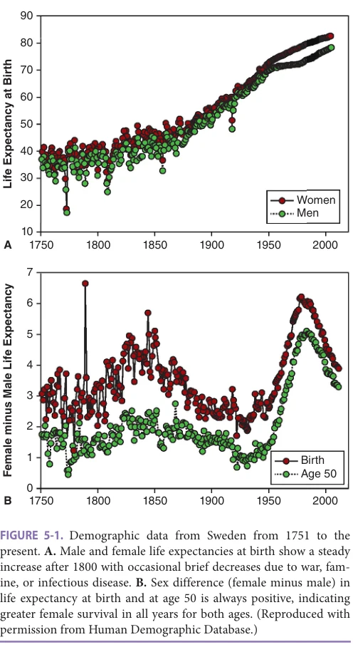
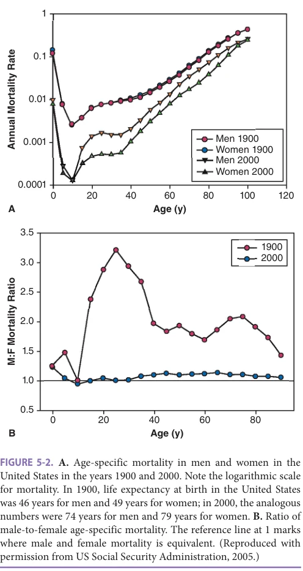
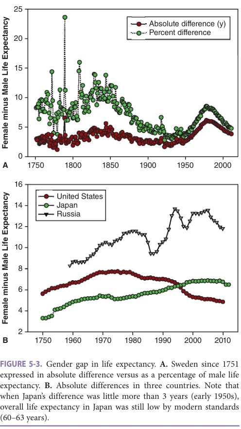
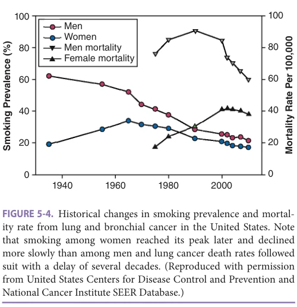
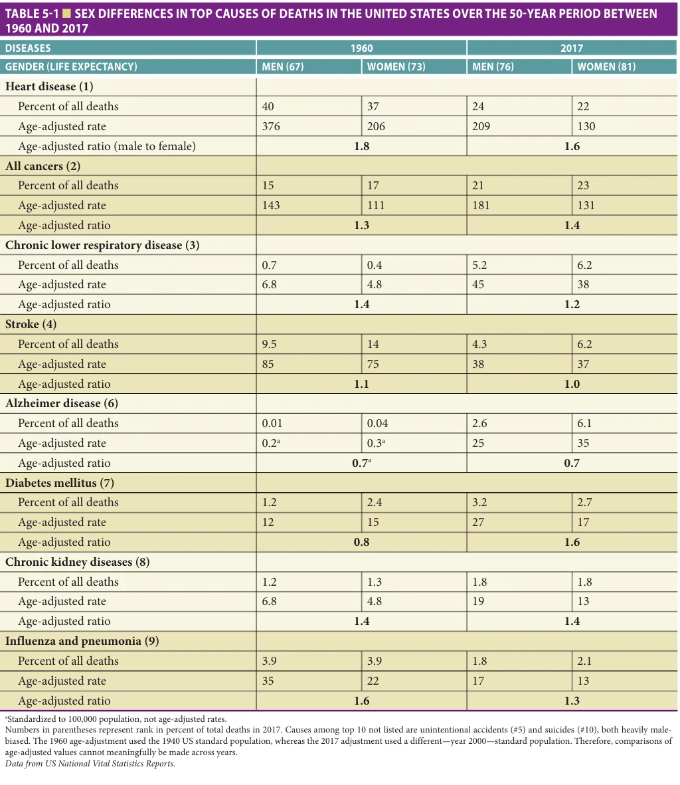
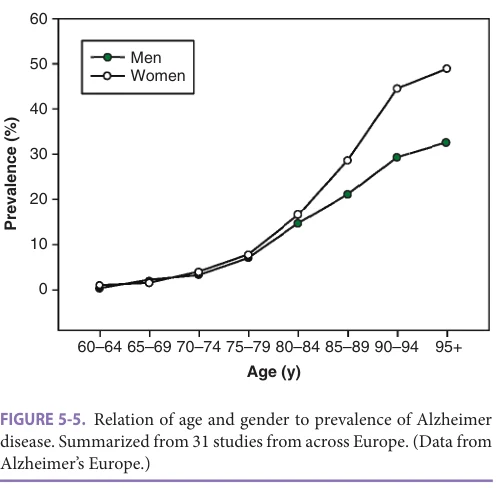
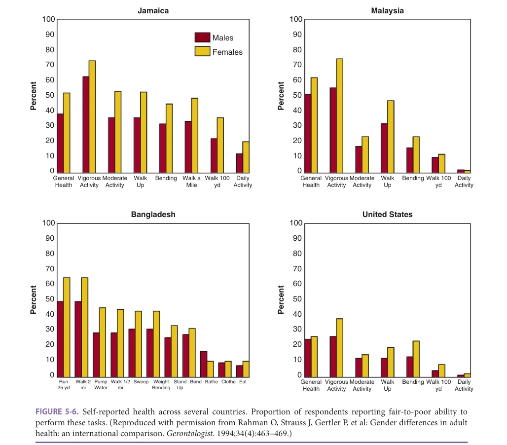

# Hazzard's Geriatric Medicine and Gerontology, 8e - Chapter 5: Sex Differences in Health and Longevity

Steven N. Austad

> **Status.** Fast build from the book; not lane-reviewed.

> Excluded from the IMA required reading list (P005-2026); not cited in the 2020-2026 past papers.

> **Source and method.** Printed pages 83-94, from the marked 8th-edition copy (PDF page = printed page + 34). Prose follows its text layer; tables and figures are source-page crops. The book is canonical.

**[p. 83]**

## THE ROBUSTNESS OF SEX DIFFERENCES IN LONGEVITY

Women live longer than men in every country and in every historical epoch for which reliable information exists. This fact is documented in the Human Mortality Database (www.mortality.org), which compiles historical demographic information from 41 countries over periods for which data are particularly dependable. Accordingly, the length of these records varies. Sweden has the longest period of reliable birth and death records of any country. Beginning in 1751 these records are moderately reliable, and they are very reliable from 1860 to the present day. Sweden’s life expectancy over this 250+-year period dipped as low as 18 years during periods of famine or pestilence and has risen as high as today’s 83 years. However, in each and every year, regardless of overall life expectancy, women have outlived men (Figure 5-1). The same is true for each of the 41 countries in the Human Mortality Database for every year on record!

#### Learning Objectives

- Understand the demographic metrics that define the female longevity advantage.

- Identify disease patterns that differentially affect men and women.

- Describe the health impacts of hormone transitions and replacement therapies for men and women.

#### Key Clinical Points

1. Women live longer than men in every country and in every historical epoch for which reliable information exists.

2. Women appear more resistant than men to multiple fatal diseases, acquiring them at lower rates and/or later in life.

3. Despite their broad survival advantage, women are more likely to suffer from physical ailments than men later in life.

### Understanding Life Expectancy

To interpret sex differences in longevity—call it the “life expectancy gender gap”—it is useful to understand the meaning of two demographic parameters. The first of these is life expectancy itself. Life expectancy, unlike its name suggests, does not measure the expectation of future life, which is by its nature not really knowable. Life expectancy, as typically used in describing human longevity, measures past life. That is, as most commonly reported, life expectancy is equivalent to the average age of death of all individuals who died during a specific period—usually 1 year. So life expectancy in the United States in 2017—76 years for men, 81 years for women—is equivalent to the average age of all people who died during 2017. More technically, such a measure is called the period life expectancy at birth because it is the average of deaths at any age from birth during a defined period. Unless otherwise specified, life expectancies reported in this chapter (as they are in the literature generally) will be period life expectancies at birth. Life expectancy can be calculated for any other age as well. Life expectancy at age 50, for instance, is the average age of death of those who survived for at least 50 years. Such a measure is useful for eliminating the impact of infant

mortality or other early-life events such as military combat, therefore providing better comparisons on the health of older populations. Life expectancy from age 50, as at birth, uniformly favors women not only in Sweden (Figure 5-1B) but in all other countries and at all times recorded in the Human Mortality Database.

Prior to the middle of the twentieth century, most deaths worldwide occurred in infancy. Consequently life expectancy at birth was not particularly informative about the health of the older population. For example, in 1773, the year in which Swedish life expectancy at birth fell dramatically to 18 years (Figure 5-1A), about half of all deaths occurred before age 5. Most adults died in their 40s and 50s, however. Thus the 18-year life expectancy at birth would be highly misleading if used as an indicator of typical ages of adult deaths. Life expectancy at age 50 is considerably more informative about survival of older adults and shows that in the same year, there was a relatively small life expectancy difference (1 year) between men and women. However, as

**[p. 84]**

*FIGURE 5-1. Demographic data from Sweden from 1751 to the present. A. Male and female life expectancies at birth show a steady increase after 1800 with occasional brief decreases due to war, famine, or infectious disease. B. Sex difference (female minus male) in life expectancy at birth and at age 50 is always positive, indicating greater female survival in all years for both ages. (Reproduced with permission from Human Demographic Database.)*

*Owner annotations/highlights are from the marked source copy, not the book.*

infant and early-life mortality in developed countries has plummeted in recent decades (only 5% or fewer of deaths now occur before age 50 in most industrialized countries), life expectancy—even life expectancy at birth—has become an increasingly useful measure of health in old age because virtually all deaths occur in older adult age groups.

Note that these “period” life expectancies combine deaths from people who were born at different times. That is, a 50-year-old who died in 2010 would have lived through a considerably different health environment than a 90-year-old who died in the same year. For instance, antibiotics and vaccinations against a number of common infectious diseases did not become widely available until the latter half of the twentieth century, so people born earlier in the century survived threats to health not faced by later generations. Sometimes it is useful to compare survival of people who were born during the same period—thus lived in similar health environments from birth—rather than

who died during the same period. Life expectancy of people born during the same period is called cohort life expectancy. Cohort life expectancy can be dramatically different from period life expectancy because it records deaths that occur after—often many decades after—rather than during the eponymous year. Compared to the 18-year period life expectancy in Sweden in 1773, cohort life expectancy was 39 years for women, 36 years for men, and at age 50 it was 21 years for women, 19 years for men. A disadvantage of cohort life expectancy is that it can only be calculated precisely when all the people born at a certain time have died. Therefore, it can only tell us about the relatively distant past. Cohort life expectancies can also fluctuate wildly with events like wars or epidemics where people of a certain age are particularly prone to die. French men from the 1895 birth cohort, for instance, had a 16-year life expectancy disadvantage compared to women, due to the massive war casualties among 19- to 24-year-old men during World War I. Regardless of how it is calculated, life expectancy of women always exceeds that of men wherever records are reliable. The gender gap in life expectancy may be one of the most robust features of human biology known.

The accumulated effects of women’s lifelong survival advantage means that with advancing age there is a progressive excess of women compared to men. Again, using Sweden with its precise, historical birth and death records as an example, there are currently 105 women born per 100 men. By age 80, there are roughly 150 women per 100 surviving men, by age 90 there are 200 women per 100 men, and by age 100 there are nearly 350 women per 100 men. The Gerontology Research Group (https://gerontology.wikia. org/wiki/Oldest_Validated_supercentenarians_All-Time) is a global e-group of researchers in gerontology that tracks and seeks to validate reports of supercentenarians (age 110 or older). According to their records, about 95% of supercentenarians are women.

### Impact of Age-Specific Mortality on the Gender Gap in Longevity

Life expectancy differences are the product of survival differences over the life course. A reasonable question is whether women survive better than men at all ages or whether their survival advantage is confined to certain periods of life. Using the United States as an example, during a period in which the gender gap in life expectancy was particularly small (the year 1900 when the gap was 2.6 years), and a period during which it was larger (the year 2000 when it was 5.4 years), several patterns appear (Figure 5-2). First, age-specific mortality, the probability of dying in a specific year, drops sharply from birth to age 10 for both sexes during both historical periods, then climbs at varying rates thereafter. Second, from age 35 on, that climb is log-linear, the so-called Gompertz mortality pattern—a pattern of aging in which mortality accelerates at a constant rate. From age 50, mortality rate doubling, which is determined by the slope of the line, is virtually the same—about

**[p. 85]**

*FIGURE 5-2. A. Age-specific mortality in men and women in the United States in the years 1900 and 2000. Note the logarithmic scale for mortality. In 1900, life expectancy at birth in the United States was 46 years for men and 49 years for women; in 2000, the analogous numbers were 74 years for men and 79 years for women. B. Ratio of male-to-female age-specific mortality. The reference line at 1 marks where male and female mortality is equivalent. (Reproduced with permission from US Social Security Administration, 2005.)*

*Owner annotations/highlights are from the marked source copy, not the book.*

8 years—in the year 2000 as it was in 1900. It is just that mortality declined by a nearly equivalent amount at all ages. Finally, although survival was markedly improved at all ages, the largest gains over this 100-year time span were those prior to age 50. Women clearly gained significantly more than men.

The logarithmic scale of Figure 5-2A makes it difficult to distinguish sex differences in mortality pattern particularly in 1900 where the differences were small, so the ratio of male-to-female mortality is shown in Figure 5-2B. This analysis shows that in 1900 when overall mortality was high, women survived better during the first years of life, there was little sex difference during childhood, adolescence, and the early reproductive years, then women gained a small but consistent survival advantage throughout the rest of life. Similar patterns are seen in 1900 Sweden and 1947 Japan which also had life expectancies of

around 50 years, although in both these cases female mortality slightly exceeded male mortality through the teenage years. It is apparent that as mortality fell and life expectancy increased throughout the twentieth century, women benefited more than men. In particular, men died at much higher rates than women at all ages from age 20 onward. The huge peak in mortality difference shown in Figure 5-2B through the 20s and 30s is as a result of excess male deaths from accidents, homicides, and suicides. This pattern is seen in many, but not all countries. In current Japan, for instance, although male mortality is roughly double that of females through their 20s and 30s, the largest mortality differences are at ages 60 to 80.

Special attention should be paid to lower female than male mortality in the first years of life. A gender gap favoring females in survival from birth to 1 year appears to be as universal as greater female life expectancy, being found in every year of every country in the Human Mortality Database. Given that female babies less than 1 year are unlikely to receive better care than male babies, particularly in the distant past, this survival difference likely reflects an important biological difference between the sexes. The gender gap in survival even extends to prematurely born infants. Neonatologists consistently report that response to therapy and survival among prematurely born infants also favors female over male babies. Thus females appear better designed for survival than males perinatally and even prenatally.

A similar pattern of increasing mortality differences between the sexes over the course of the twentieth century has also been observed in analyses of cohort mortality. An examination of birth cohorts from 1800 to 1935 across 13 developed countries found that the gender gap in adult (ages 40–90) mortality rates widened dramatically among those born in the late nineteenth and early twentieth centuries (thus typically dying in the latter half of the twentieth century). This widening gap—termed excess male mortality by the authors—was particularly noticeable at ages 50 to 70 years. The causes for these changes are examined below.

### Temporal Trends in the Gender Gap

There is considerable variability in the magnitude of the sex difference in life expectancy across time and countries. It may be difficult to avoid biological explanations for the seemingly universal advantage that women have over men in terms of life expectancy. However, the magnitude of the gender difference above a certain irreducible biological minimum is likely to be affected by cultural, environmental, and behavioral factors. Investigation into this variation might provide insight into how some of these factors affect health. For instance, in Sweden between 1750 and about 1950, variability in the gender gap is considerably more pronounced in life expectancy at birth than at age 50 (see Figure 5-1B), indicating that the magnitude of the gap was largely driven by sex differences in survival in early and midlife. However, since the middle of the twentieth

**[p. 86]**

century when early-life deaths became a much smaller contributor to life expectancy calculations, the gap has changed in parallel fashion whether measured from birth or from age 50. During this time a striking pattern has emerged. Between 1950 and about 1980, the gender gap rose from near its lowest magnitude to its highest sustained level, then plummeted at its most rapid historical level to its current 3.5-year difference. Such a clear pattern demands explanation.

First, though, it should be pointed out that Figure 5-1B is misleading in one sense. It depicts the gender gap as absolute difference in number of years. Between 1750 and 1950, the period during which the differences appear consistently lower than they became later on, Swedish life expectancy climbed from about 40 years to more than 70 years. An absolute difference of 3 years in life expectancy is arguably more meaningful if overall life expectancy is 40 years rather than 70 years. If the difference is expressed as a percentage of male life expectancy (Figure 5-3A), a somewhat different picture emerges. The gender gap was actually larger for

*FIGURE 5-3. Gender gap in life expectancy. A. Sweden since 1751 expressed in absolute difference versus as a percentage of male life expectancy. B. Absolute differences in three countries. Note that when Japan’s difference was little more than 3 years (early 1950s), overall life expectancy in Japan was still low by modern standards (60–63 years).*

*Owner annotations/highlights are from the marked source copy, not the book.*

the most part prior to 1850, then declined until the 1930s after which it rose abruptly, although never reaching earlier levels, and then it declined rapidly.

Before discussing possible reasons for this pattern, it might be revealing to look at patterns in several other representative countries (Figure 5-3B). For some time countries of the former Soviet Union have had the world’s largest gender gap in life expectancy. In Russia that difference now approaches 12 years. This large difference is not due to exceptionally long-lived women, but to exceptionally short-lived men. Russian women are in fact among the shortest-lived women in the industrialized world— their current life expectancy of 77 years is only marginally higher than it was in the 1960s. But health and longevity of Russian men is abysmal. Their life expectancy of 65 years is a consequence of poor diet, poor sanitation, a virtual absence of preventative medical care, and dreadful health habits. As a result, 25% of Russian men die by age 55 compared with less than 10% of women. To place this statistic in an international perspective, only 5% of Swedish or Japanese men die by age 55. The main factors driving the Russian gender gap in life expectancy are smoking and alcoholism. Russian men have traditionally had among the highest smoking prevalence in the world. Fluctuations in the life expectancy gap has also marched in lock step with the availability of vodka. Specifically, in 1985 vodka production was drastically cut and vodka was not allowed to be sold before lunch-time. The gender gap abruptly shrunk as men began living longer. When alcohol availability was later liberalized, the gap expanded again just as abruptly. Since 2006 when new restrictions were implemented, the gap has again begun to shrink.

Has there been a consistent pattern of change in the gender gap as overall life expectancy has rocketed upward in most industrialized countries in recent decades? Again using Sweden as an example, the life expectancy gap both at birth and at age 50 rose dramatically after World War II, but has fallen steadily since the 1980s (see Figure 5-1B). This is the most common pattern among high-income countries. Similar patterns of rapid increase in the gender gap after World War II, followed by a rapid decrease beginning in the 1980s or 1990s and continuing to the present have been seen in the United States, Canada, Australia, Iceland, and most European countries. The life expectancy gender gap is not declining everywhere, however. In Japan, where life expectancy at birth has grown explosively—nearly 5 years per decade—since the end of World War II, the sex difference also steadily increased until the 2000s where it appears to have stabilized at about 7.5 years (see Figure 5-3B).

The major reason for these various patterns—at least after World War II when causes of death were more reliably recorded—appears to be largely the delayed impact of historical smoking habits. In the United States and most of Europe women’s deaths from lung cancer and respiratory diseases have declined slowly if at all, compared to a relatively rapid decline among men. Smoking of course

**[p. 87]**

adversely affects multiple aspects of health in addition to its effects on the lungs, but lung cancer and respiratory diseases serve as convenient indicators of smoking’s impact on general health. As noted previously, women in most western countries took up smoking in large numbers more recently than men and have been slower to stop. In Sweden, smoking is now more prevalent among women than men. An example of the delayed effect of smoking can be seen in data from the United States (Figure 5-4). As with smoking itself, deaths due to respiratory diseases and lung cancer (now the number one cause of cancer deaths in women) peaked among women somewhat later and have so far declined more slowly than among men. In Japan where the gender gap in life expectancy has not closed appreciably, smoking prevalence among women has always been—and continues to be—very low compared with men. Importantly, both history and biology suggest that despite the recent contraction of the gender gap in life expectancy across most high-income countries, there is likely to be an irreducible floor to the gap of probably about 3 to 4 years.

The gender gap is now playing a role in the US declining rank in life expectancy among countries internationally: from 12th in the world in 1950, sexes combined, to 39th for women and 40th for men in 2010—near the bottom of all industrialized countries. The US National Research Council investigated the reasons for this pattern and concluded that American women began smoking in large numbers earlier and more intensively than women in Europe and Japan. Damage from smoking was estimated to account for nearly four-fifths of the sluggish improvement in US women’s life expectancy relative to Europe and Japan. As US women also began reducing smoking earlier than women in many other high-income countries, it is expected that

*FIGURE 5-4. Historical changes in smoking prevalence and mortality rate from lung and bronchial cancer in the United States. Note that smoking among women reached its peak later and declined more slowly than among men and lung cancer death rates followed suit with a delay of several decades. (Reproduced with permission from United States Centers for Disease Control and Prevention and National Cancer Institute SEER Database.)*

*Owner annotations/highlights are from the marked source copy, not the book.*

their life expectancy rank may begin to rise over the next several decades.

## DO WOMEN AGE MORE SLOWLY THAN MEN?

Does the universal difference in life expectancy between men and women suggest that men age more rapidly than women? This is not an easy question to answer as it requires defining aging—a task that defies simplicity.

### Demographic Evidence

One definition often favored by demographers is that aging in a population can be measured by the rate of increase in age-specific mortality. By this definition, men and women age at surprisingly similar rates (see Figure 5-2A). Note in the figure that in the United States whether one considers data from 1900 when life expectancy was 46 years and 49 years for men and women, respectively, or data from 2000 when life expectancy reached 74 years for men and 79 years for women, age-specific mortality increases from age 40 in almost perfectly parallel fashion in the two sexes. Women simply die at lower rates throughout later life. The same general pattern is seen in almost all countries with reliable death statistics. So at least by this metric, women do not age more slowly than men. They are simply better designed for survival regardless of age.

### Causes of Death

Another way to define relative aging rates might be to compare the ages at which they get major diseases of later life. Do women tend to die of the same diseases as men, they just get them later? If so, then plausibly women age more slowly than men. Alternatively, maybe women are more resistant than men to only one or a few major causes of death such as cardiovascular diseases and stroke; except for that difference, perhaps they would age at the same rate as men. This latter hypothesis seems unlikely given that the major causes of death have changed historically, while women have always lived longer. It is also not supported by available evidence. Men die at higher rates than women from a broad swathe of diseases with one particularly interesting exception (Table 5-1).

Comparing causes of death between the sexes and even within a sex over time requires some careful thinking. One common metric of comparison is the simple percentage of deaths caused by a disease. Using this metric, some causes of death have decreased over the past 50 years (eg, heart disease, stroke) while others have increased (eg, cancer, diabetes). This metric can be seriously misleading though. For instance, in 2017 roughly 24% of all men’s deaths in the United States were due to heart diseases, whereas for women the analogous figure was about 22%. Thus, at first glance heart disease seems to be roughly an equivalent health problem for men and women. Similarly, cancer causes a higher percentage of deaths today (23%)

**[p. 88]**

*TABLE 5-1 ■ SEX DIFFERENCES IN TOP CAUSES OF DEATHS IN THE UNITED STATES OVER THE 50-YEAR PERIOD BETWEEN 1960 AND 2017*

*Owner annotations/highlights are from the marked source copy, not the book.*

than it did 57 years ago (16%). Does this mean that we are getting progressively worse at preventing and treating cancer?

Obviously not. The occurrence of heart disease or cancer, like 9 of the 10 top causes of death (excluding only cause #10—suicide) in the United States today, accelerates with age. Today, we live roughly 9 years longer than we did

in 1960, sexes combined. Thus, we are more frequently succumbing to cancer today compared with 50 years ago simply because we are not dying of other things first. We are also less frequently succumbing to heart diseases despite not dying of other things first and despite living longer. This is truly one of the signature accomplishments of modern medicine.

**[p. 89]**

A critical limitation of using percent of deaths caused by specific diseases is that it masks information on the ages at which death occurs. Presumably, heart disease or cancer should be considered a more serious health problem if it kills earlier in life rather than later. In addition, delaying the onset or progression of these diseases should be considered a sign of medical progress. There is a meaningful health difference in other words between dying of a heart attack at age 50 versus age 80.

The confounding impact of age in the interpretation of health trends can be removed by using age-adjusted mortality rate. This metric gives the relative probability of dying from a disease while controlling for age. If the percent of deaths caused by a particular disease is similar, but the age-adjusted rate is lower for women than men, it indicates that women are contracting the disease later in life or are surviving longer with the disease. For instance, there is currently minimal difference between sexes in percent of deaths due to heart disease (24% for men, 22% for women), but a major difference in the age-adjusted rate (209 vs 130 per 100,000 for men vs women, respectively), indicating that women typically have heart diseases later in life or are better at surviving them. The former appears to be true. For example, US women have their first heart attack 8 years later than men on average, but are in fact less likely to survive (probably because they are 8 years older when it occurs).

Sex-specific profiles of deaths can be compared as they were reported over a 57-year interval using the 1960 and 2017 US Vital Statistics Reports (see Table 5-1). Because the age-adjustment for 1960 was calculated based on a different standard population than in 2017, comparison of age-adjusted rates between years is not meaningful. Age-adjustment in this case is useful for making comparisons within years. However, the ratio of male-to-female age-adjusted rates does allow comparison of gender bias in death rates across years.

Note that across this 57-year time interval, life expectancy increased by 9.5 years for men, but only 7.8 years for women. Also note the dramatic reduction in percent deaths due to heart diseases, stroke, and respiratory infections. As might be expected with the much older population in 2017, percentage of total deaths from a range of diseases of aging such as cancers, chronic lower respiratory disease, diabetes, chronic kidney disease, and especially Alzheimer disease (AD) increased fairly dramatically as well.

In 1960, males died at higher age-adjusted rates for 8 of the top 10 causes of death. Males died at 80% higher rates from heart diseases and 60% higher rates from influenza and pneumonia. Not shown in the table for 1960 are accidents, cirrhosis of the liver, and tuberculosis, all of which were male-biased as well (male/female age-adjusted ratios: 1.3, 2.1, and 2.8, respectively). The comparative female resistance to dying of infectious diseases such as pneumonia, influenza, and tuberculosis is not specific to the United States. In Japan in 1960, men

died of tuberculosis at twice the age-adjusted rate of women. Such resistance in fact may help explain the historical female survival advantage. In 1900 and presumably earlier, pneumonia/influenza was the leading cause of death, followed closely by tuberculosis. Not shown for 2017 are deaths from accidents, cause #5 (age-adjusted sex ratio: 2.0), and cause #10, suicides (age-adjusted sex ratio: 1.4). By 2017, 9 of the 10 top causes of death were male-biased, although only slightly so for stroke. Thus across a span of 50 years despite better overall improvement in health and survival among men than women, men still died at higher age-adjusted rates from virtually all of the top causes of death.

Note that the same pattern holds true for COVID-19. When the data are in from 2020 and 2021, COVID-19 will rank among the top causes of death. In fact from midNovember 2020 to the current time (February 2021), COVID-19 killed roughly twice as many Americans as either of the previous top two causes of death, heart disease and cancer. As with influenza and pneumonia, men died at higher rates than women from this emerging disease.

The trend for men to die at greater age-adjusted rates from a diversity of causes is by no means unique to the United States. Among the 28 countries of the European Union, in which life expectancy ranges from 74 years (Latvia, Lithuania) to 83 years (Iceland), men die at higher age-adjusted rates than women of nearly every top cause of death as well. The same is true in Japan, the country with the highest life expectancy in the world.

In sum, as women do seem to contract multiple diseases of aging (fatal diseases anyway) later in life than men, it is at least arguable that despite the demographic evidence, women age more slowly than men.

It is important to note the source and limitations of the US national statistics as presented in Table 5-1. These data are compiled from causes of death listed on US Standard Death Certificates filled out by a physician, medical examiner, or coroner at the time of death. Determining cause of death is an inexact process and frequently opens to interpretation even with a complete autopsy; complete autopsies are infrequently done today. Even in cases where the cause of death would be clear upon autopsy, for example myocardial infarction, studies have found that death certificates frequently misattribute the cause. This is particularly an issue for chronic diseases.

Diabetes mellitus is one chronic disease for which death reporting may be problematic. In the United States, diabetes deaths were female-biased by 25% in 1960 but male-biased by 57% in 2017. In fact, over the 57-year period between these two reports, there has been a steady gradual shift from female-to-male bias. (Other studies both from the United States and Europe reported female bias in deaths from diabetes in the first half of the twentieth century as well.) Now, however, similar male biases to those found in the United States are reported across the European Union as well as in Japan. Changing diagnostic criteria for

**[p. 90]**

diabetes and variable death certificate reporting are likely contributors to these differences.

Women and dementia An outlier in the pattern of virtually complete female dominance in resistance to lethal disease appears to be AD, which according to 2017 US national statistics is our sixth leading cause of death and which kills women at substantially higher rates than men whether raw percentages or age-adjusted rates are used (see Table 5-1). That is, US women currently die more than twice as often as men from AD both because they live longer and because they are generally more susceptible. In comparing the 2017 to the 1960 data in Table 5-1, the percentage of total deaths reported due to AD (called senile psychosis in 1960) increased more than 250-fold for men and more than 150-fold for women over this 57-year period. As diagnostic criteria for AD were not well established in 1960, AD was dramatically underdiagnosed then and so very few deaths were attributed to AD. Thus, the 1960 data are not interpretable. A more accurate portrayal of what AD means at present on American death certificates is probably “AD and other dementias,” which is how causes of death are categorized in the United Kingdom. For UK women, AD and other dementias have now surpassed heart disease as the number one cause of death, whereas for men it is now number five.

The current female bias in US deaths from AD is consistent with a large body of data from the rest of the developed world. In Japan and across Europe, the age-adjusted sex ratio of AD deaths is similar to the United States. Figure 5-5, which summarizes 31 independent studies from across Europe, shows the relative prevalence of AD as it accelerates with age in each gender. Thus, as populations become older, AD will likely become more and more female-biased.

Sex hormones, health, and disease The pattern of women’s increased susceptibility to dementias in addition to their

*FIGURE 5-5. Relation of age and gender to prevalence of Alzheimer disease. Summarized from 31 studies from across Europe. (Data from Alzheimer’s Europe.)*

*Owner annotations/highlights are from the marked source copy, not the book.*

consistently increased resistance to most other fatal diseases relative to men, provokes speculation about the role of sex hormones in health and disease. This has been a fraught topic in aging research at least since the late nineteenth century when French-American physiologist Charles-Édouard Brown-Séquard began injecting himself with a cocktail of macerated dog and guinea pig testicles and subsequently proclaimed that he was rejuvenated in both mind and body.

Sex hormones such as testosterone, estrogens, and progestins decline with age in both sexes, although male testosterone decline is considerably more gradual than the relatively abrupt change across the menopausal transition in women. That restoring these hormones to youthful levels will have a generalized rejuvenating effect is a plausible hypothesis. Hormone replacement for women is reviewed in Chapter 36. Data from observational epidemiology and laboratory rodent studies suggested that replacing female hormones might lead to multiple health benefits. However, such hormonal therapy does not enhance longevity and has mixed effects on various age-related diseases. Hormone replacement for men is reviewed in Chapter 97. It has limited benefits on age-related conditions in normal older men.

The reverse is also plausible. That is, one could equally reasonably speculate that declining hormone levels with age are an adaptive response to reduce hormonally-induced adverse health effects with increasing age. Returning hormones to youthful levels, according to this hypothesis, may actually cause harm. Indeed, some historical information from the complete removal of gonadal hormones is provocative. For instance, a review of longevity records for 81 eunuchs employed as guards or servants of the royal court of Korea during the seventeenth and eighteenth centuries found that eunuchs lived on average 20 years longer than intact men of similar rank and status—a result notable mainly for the magnitude of the difference. These findings echo a previous study comparing nearly 300 castrated men with more than 700 intact controls who lived in the same institution for the intellectually disabled in the United States in the early twentieth century. This study found not only a large (> 13-year) difference in life expectancy favoring the castrated men but also a bigger survival advantage the earlier-in-life surgery was performed. Whether these studies have any relevance to men living with modern hygiene, diets, and medical monitoring is of course not clear.

## HEALTH DISPARITIES AND GENDER

The United States has been particularly well studied regarding how gender interacts with nonbiological determinants of health such as income, education, race, health habits, or access to medical care to influence longevity. This work has been motivated by a desire to understand why despite spending far more on health care than any other country, US life expectancy—especially among women—increasingly lags behind most other high-income countries.

**[p. 91]**

As noted earlier, the gender gap in life expectancy in the United States grew rapidly from about 1950 to around 1980 and has been steadily shrinking since the early 1980s (see Figure 5-3). This pattern is due to a more rapid gain in women’s life expectancy relative to men’s prior to the early 1980s followed by a slower gain thereafter. Specifically, between 1985 and 2017, life expectancy of US women increased by only 3.2 years compared with 5.2 years for men. Although life expectancy of neither gender grew as rapidly as in many other high-income countries, the growth for women was particularly slow—only 50%, 55%, and 73% the rate of Japanese, French, and Swedish women, respectively. Compare that with the equivalent figures for men. US men’s life expectancy grew 13% faster than Japanese men’s, 78% and 88% as fast as French and Swedish men.

A useful tool for assessing whether this national pattern could be due to inequalities in health within the United States is a county-by-county analysis. Not only are life expectancies and mortality rates available for each of the 3143 counties in the United States, so are data on income, racial composition, education level, and a host of other variables potentially informative for understanding the reasons underlying observed health disparities. There is tremendous variability among counties across the United States in all these variables. For instance, per capita income varies by more than sixfold from the poorest to the richest county, and the life expectancy gap between the longest- and shortest-lived counties is nearly 18 years for men and 13 years for women. This gap is greater than the life expectancy gap between Sweden and Nicaragua. Reiterating the larger historical and international perspective presented earlier, despite this striking variation among US counties, female life expectancy exceeded male life expectancy in every county for every year between 1960 and the present.

Several interesting patterns appear in such an analysis. First, variability among county life expectancies has been consistently greater for men than women since at least 1960. Second, life expectancy inequalities within each gender were smallest in the early 1980s when the gap between genders was at its maximum. Since then, within-gender inequalities have steadily risen for both sexes.

The period between 1985 and 2010 has been particularly well studied. An astonishing finding has been that while the most advantaged counties have continued a steady increase in life expectancy for both sexes, there has been little change in life expectancy over the past 25 years for the least advantaged counties. This is particularly true for women for whom more than 42% of counties in the United States showed no increase in women’s life expectancy whatsoever across the entire 25-year period. Furthermore, nearly 10% of counties showed a significant decrease. Analogous figures for men reveal that fewer than 5% of counties showed no increase and fewer than 1% showed a decrease. A separate county-by-county study traced mortality rates (rather than life expectancy) from the early 1990s through 2006 and found similar results. Average mortality

rates fell by 9.8% over that period for men and only 1.5% for women. Male mortality rate actually increased in only 3.4% of counties, whereas women’s mortality rate increased in almost 43% of counties! In sum then, although national US averages continue to show steady gains in life expectancy during the past 25 years, for a significant fraction of women there have been no gains—or even losses—in life expectancy over that time period.

Two additional patterns emerge from an inspection of the causes of death. First, mortality due to cardiovascular disease has been falling steadily for both sexes for over 60 years. As mentioned previously, this should be considered a major medical and public health triumph. During the period—roughly 1960 to 1980—when the gender gap in life expectancy was increasing, men were more frequently dying from lung cancer and chronic respiratory diseases than women. Since then as the gender gap has been shrinking, reduction in cardiovascular disease has continued although at a slower rate for women relative to men, and the relative rate of increase in deaths from lung cancer and chronic respiratory diseases has risen. Second, that pattern was particularly marked in counties in which women lost life expectancy in recent years. Clearly these patterns, as with the international patterns, reflect differences in current and past smoking behavior.

Beyond that, there is a puzzling geographic component above and beyond obvious socioeconomic factors. Most counties with increased women’s mortality were in the South, or in counties in the West with a significant proportion of Native American residents. Local diets would be one obvious place to look for clues to the reasons for this geographic component. Possibly more interesting than what variables were associated with decreasing life expectancy, are variables that were not. No simple correlations were found, for instance, between change in life expectancy and per capita income, educational attainment, percent of adults who were obese, availability of primary care providers, or proportion of the population lacking health insurance.

If instead of focusing on the counties that did worse over time, we focus on the ones that did better, which after all was the overwhelming number of counties for men and the majority for women, we find more of the expected explanatory factors. The two most significant associations with improved men’s survival were percent of adults with a college degree and percent of Hispanic residents. The Hispanic effect is due to the so-called Hispanic paradox, the observation that Hispanic people of both sexes live longer than White people of equivalent socioeconomic status. Still significant, but somewhat less strongly associated, were population density (the higher, the better), and median household income. Similarly, in counties in which women’s health improved over these study years, significant associations were seen with higher proportion of Hispanic people, higher proportion with college degrees, higher population density, and higher median household income. For neither

**[p. 92]**

sex was obesity or obvious medical care factors, such as percent of the population with health insurance or number of primary care physicians, statistically involved.

It is important to understand that the lack of statistical association between a socioeconomic or behavior factor and increasing versus declining survival in a countyby-county study does not indicate that a particular factor is unimportant for health or survival. For example, many studies have identified obesity as a significant contributor to poor health. The lack of association with obesity described above just means that a county-by-county analysis is too crude a tool to pick up a likely obesity effect.

The trend in the United States for women to gain less than men in life expectancy over time is particularly apparent if one examines differing education levels and ethnicities. Education generally can be considered almost a miracle drug for improved health and life expectancy regardless of ethnicity. For instance, among White Americans, the impact of having 16 years or more of education compared with having not completed high school was a difference in life expectancy of 10 years for women and 13 years for men. To emphasize the magnitude of this education effect, it is comparably greater than the magnitude of life expectancy difference between Sweden and Paraguay. Education is hypothesized to exert its impact via better health habits, better ability to deal with stress, and more effective management of chronic conditions. More disturbing is the impact of low education. White women and men with less than a high school diploma actually lived about 5 and 3 years less, respectively, in 2008 than they did in 1990! Puzzlingly, this temporal decline in life expectancy for poorly educated Americans was not seen in African-American or Hispanic populations. In fact, in those ethnic groups life expectancy rose over that time period for all education levels, including those not completing high school.

In sum, health disparities within the United States are generally larger for men than women, but a substantially larger fraction of women than men are showing worse health now compared with 25 years ago.

## THE HEALTH-SURVIVAL PARADOX

As robust and widespread as is women’s survival advantage over men, equally robust, widespread, and puzzling, is men’s health advantage over women. Although women live longer than men everywhere, women also display greater overall rates of physical illness and functional limitations than men from adolescence throughout life. In the United States, for instance, women make more doctor visits, spend more days in hospital, miss more work due to illness, and take more medications than do men. Women also self-report more functional limitations and are overrepresented relative to their proportion of the population in residential care facilities.

This health-survival paradox is a worldwide phenomenon. In most of the world’s 187 countries, unlike in the

United States, women’s life expectancy is increasing slightly faster than men’s. Also, increasing faster in women than men is the number of unhealthy years they live. One measure of ill health is “years living with disability (YLD),” which is the severity-adjusted prevalence of disability. Across countries of the world per capita YLD is generally higher for women than for men, particularly at young and middle ages. Thus the additional unhealthy years lived by women compared to men are not just those at the end of life. Additionally, self-reported health surveys of people over 50 years from the US and Europe revealed that despite more men than women being overweight and currently smoking, women in all countries were more likely to have functional difficulties or disabling conditions. Similarly consistent differences were found in a comparative study of the United States, Jamaica, Malaysia, and Bangladesh, in which participants were asked about their ability to perform a variety of tasks, such as walk a certain distance, bend over, or climb stairs (Figure 5-6).

One hypothesis to explain the health-survival paradox is that women are more attentive to physical discomfort and more willing to seek medical attention when they perceive it. However, empirical evidence to support such an explanation is uneven and sometimes contradictory. Also, if this hypothesis is valid, it would have to be a worldwide phenomenon rather than a cultural feature of wealthy, Western countries. Figure 5-6 shows that the same patterns obtain in poor, culturally diverse countries such as Jamaica, Malaysia, and Bangladesh. A second plausible hypothesis is that because men die at higher rates than women throughout life, ill men are more likely to die than ill women. Thus the surviving men will be more highly selected for health and vigor than surviving women. If this sex-selection hypothesis is valid, one would predict that the sex differences in various health metrics would increase with age as more and more ill men die while more and more ill women survived. As intriguing as is this hypothesis, several large cross-national studies have failed to find such predicted divergence in health status with age. They find instead a relatively constant male health superiority throughout life.

The ubiquity of these health differences between the sexes begs for a biological explanation. One of the most consistent findings among dozens of studies investigating sex-based morbidity differences is that women are subject to more bone and joint diseases, including idiopathic back pain and osteoarthritis. Chronic pain can limit activities and cause sufferers to seek medical attention. In addition, it can have more far-reaching, secondary health consequences from sequelae such as sleep deprivation and chronic stress. So, a plausible, if partial, biological hypothesis for the health-survival paradox may be sex differences in joint components such as cartilage and ligaments. Uterine connective tissue undergoes extensive remodeling and increasing elasticity during pregnancy under the influence of various reproductive hormones. Could it be that a side

**[p. 93]**

*FIGURE 5-6. Self-reported health across several countries. Proportion of respondents reporting fair-to-poor ability to perform these tasks. (Reproduced with permission from Rahman O, Strauss J, Gertler P, et al: Gender differences in adult health: an international comparison. Gerontologist. 1994;34(4):463–469.)*

*Owner annotations/highlights are from the marked source copy, not the book.*

effect of the responsiveness of women’s cartilage, tendons, ligaments, and muscle to female reproductive hormones is an increased susceptibility of women to joint instability and resultant inflammation and pain? Provocatively, female athletes in sports such as soccer and basketball are 5 to 10 times more likely to suffer anterior cruciate ligament knee injuries than male athletes, and most are from noncontact events. Also, the prevalence of idiopathic knee osteoarthritis is similar in men and women prior to menopause, but much greater in women after menopause, again suggesting a hormonal influence on joint health. Women also tend to have more robust inflammatory and immune responses than men, perhaps helping to account for their greater resistance to infectious diseases, and also greater susceptibility to autoimmune and inflammatory joint diseases such as osteo- and rheumatoid arthritis. Taken together, these sex differences may contribute to the health-survival paradox.

## CONCLUSION

Several robust features of human biology emerge from considering sex differences in health and longevity. Most particularly, women appear more resistant than men to multiple fatal diseases, acquiring them at lower rates and/or later in life. Women also appear to be more resistant to a range of infectious diseases from early in life. A notable exception to this pattern is AD and other dementias, to which women are more susceptible than men worldwide. Despite the broad survival advantage, women are more likely to suffer from physical ailments than men later in life even controlling for age effects. It is tempting to hypothesize that differential lifetime exposure to sex hormones contributes to both the positive and negative sex differences. Yet to date, no simple answers on how lifetime sex hormone exposure relates to diseases and disabilities of later life have materialized. In the United States, there is a puzzling trend over the

**[p. 94]**

past several decades for women to gain life expectancy at a slower rate than men, and some groups of disadvantaged women are even shorter-lived today than they were decades ago. Learning more about sex difference in health and longevity will be critical to determining how to reduce health disparities in both sexes.

Since the US National Institutes of Health (NIH) Revitalization Act of 1993, women have been required to be adequately represented in NIH-funded clinical studies. Today, roughly half of clinical research participants are women. However, similar attention has not been paid to sex

balance in studies with laboratory animals or cells, which are heavily male-biased. Mechanistic understanding of health and disease relies to a large extent on studies of laboratory animals or cells. In May 2014, the NIH issued a policy statement promising to redress this imbalance through program oversight and review, as well as through collaboration with publishers. One desired outcome of this new direction would be a better understanding of biological sex differences in health. Ultimately, would it not be desirable that men live as long as women and women achieve the lifetime health of men?

## FURTHER READING

Austad SN. Sex differences in longevity and aging. In:

Masoro EJ, Austad SN, eds. Handbook of the Biology of Aging. 7th ed. San Diego, CA: Academic Press; 2011: 479–496. Beltrán-Sanchez H, Finch CE, Crimmins EM. Twentieth

century surge of excess adult male mortality. Proc Natl Acad Sci U S A. 2015;112(29):8993–8998. Boyan BD, Hart DA, Enoka RM, et al. Hormonal modula-

tion of connective tissue homeostasis and sex differences in risk for osteoarthritis of the knee. Biol Sex Differ. 2013;4(1):3. Bronikowski AM, Altmann J, Brockman DK, et al. Aging in

the natural world: comparative data reveal similar mortality patterns across primates. Science. 2011;331(6022): 1325–1328. Clayton JA, Collins FS. NIH to balance sex in cell and ani-

mal studies. Nature. 2014;509(7500):282. Crimmins EM, Kim JK, Solé-Auró A. Gender differences

in health: results from SHARE, ELSA, and HRS. Eur J Public Health. 2010;21(1):81–91. Crimmins EM, Preston, SH, Cohen B, eds. International

Differences in Mortality at Older Ages: Dimensions and Sources. Washington, DC: National Academies Press; 2011. Ezzati M, Friedman AB, Kulkani SC, Murray CJ. The

reversal of fortunes: trends in county mortality and cross-county mortality disparities in the United States. PLoS Med. 2008;5(4):e66. Hamilton JB, Mestler GE. Mortality and survival: a compar-

ison of eunuchs with intact men and women in a mentally retarded population. J Gerontol. 1969;24(4):395–411.

Human Mortality Database. University of California,

Berkeley (USA), and Max Planck Institute for Demographic Research (Germany). www.mortality.org or www.humanmortality.de. Accessed November 2014. Kindig DA, Cheng ER. Even as mortality fell in most US

counties, female mortality nonetheless rose in 42.8 percent of counties from 1992 to 2006. Health Aff (Millwood). 2013;32(3):451–458. Macintyre S, Ford G, Hunt K. Do women ‘over-report’

morbidity? Men’s and women’s responses to structured prompting on a standard question on long standing illness. Soc Sci Med. 1999;48(1):89–98. Manson JE. Current recommendations: what is the clini-

cian to do? Fertil Steril. 2014;101(4):916–921. Min K-J, Lee C-K, Park H-N. The lifespan of Korean

eunuchs. Curr Biol. 2012;22(18):R792–793. Rahman O, Strauss J, Gertler P, Ashley D, Fox K. Gender

differences in adult health: an international comparison. Gerontologist. 1994;34(4):463–469. Saloman JA, Wang H, Freeman MK, et al. Healthy life

expectancy for 187 countries, 1990–2010: a systematic analysis for the Global Burden Disease Study 2010. Lancet. 2012;380(9867):2144–2162. Stanczyk FZ, Bhavnani BR. Current views of hormone

therapy for management and treatment of postmenopausal women. J Steroid Biochem Mol Biol. 2014;142:1–2. Wang H, Schumacher AE, Levitz CE, Mokdad AH, Murray

CJ. Left behind: widening disparities for males and females in US county life expectancy, 1985–2010. Popul Health Metr. 2013;11:8.
