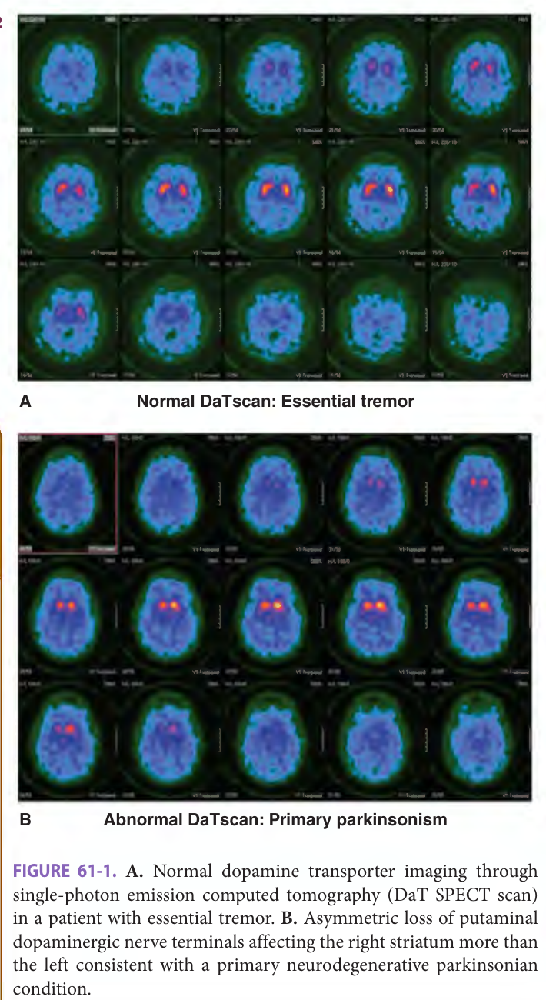
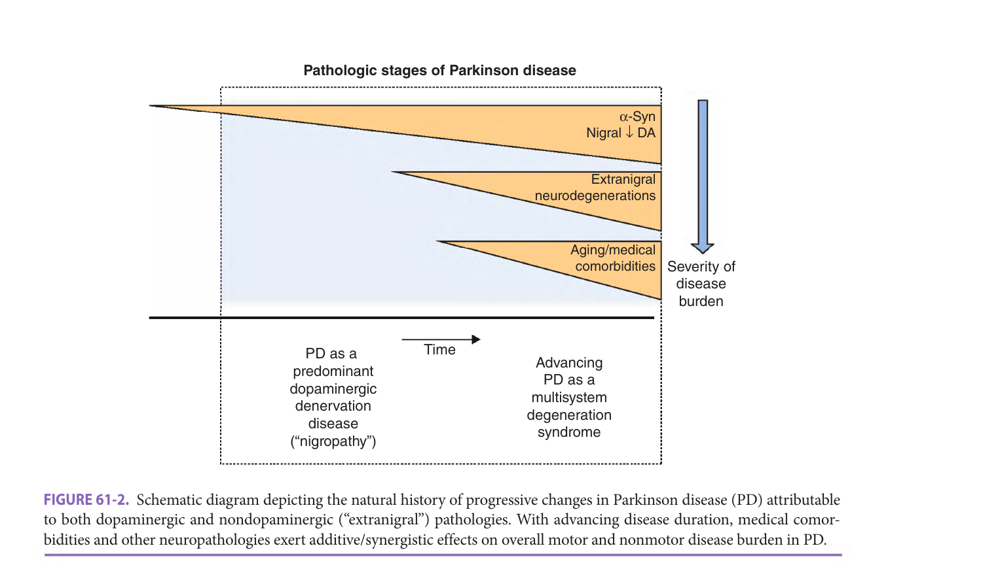

# Hazzard's Geriatric Medicine and Gerontology, 8e — Chapter 61: Parkinson Disease and Related Disorders

Vikas Kotagal, Nicolaas I. Bohnen

> **Source and method.** Printed pages 935–951 of the 8th edition, from the publisher's own text layer (1,824-page copy; PDF page = printed + 34; page 950 is printed sideways and was read rotated). Prose, both boxes, all seven tables and both figure captions. Figure 61-1 (DaT SPECT scans) and Figure 61-2 (diagram) are supplied as images, not transcribed. Checked against an independently typeset copy of the same chapter (see the check report). Page markers are **printed** page numbers, the ones the examiners cite. The two boxes are moved up to follow the opening paragraph; nothing else is reordered. A paragraph that runs over a page break sits under the page where it starts.

> **2026 exam.** Chapter 61 was the second most-examined chapter of the 2026 specialist sitting: **5 questions** (Q15, Q31, Q60, Q75, Q83 — IMA reference list 885647). The pages they were sourced to are flagged inline with ⟨2026⟩.

> **As printed, not corrected.** Key Clinical Point 1 reads "PD is he most common" (book typo). Table 61-5 lists "selegiline, selegiline"; Table 61-2 prints the gene as "FBX07" (see the note under that table). The text gives MPTP as "...tetrahydropyradine". All left as the book prints them.

**[p. 935]**

## Definition And Terminology

Parkinsonism is the unifying term that describes a constellation of motor and nonmotor neurologic features. Parkinsonism can be defined as a variable combination of six specific, independent motor features: bradykinesia (slowness of movement), tremor at rest, rigidity, loss of postural reflexes, flexed posture, and freezing of gait (where the feet are transiently “glued” to the ground). Of these features, bradykinesia—either affecting the arms or legs (“appendicular bradykinesia”) or midline structures including the trunk, head and neck, oropharynx, or eyes (“axial bradykinesia”)—is the most central element of parkinsonism and is caused by loss of dopaminergic neurons in a midbrain structure called the substantia nigra pars compacta (SNpc) responsible for innervating a group of critical motor nuclei within the deep portions of the brain collectively labeled the basal ganglia.

#### Learning Objectives

- Learn the epidemiology, pathobiology, clinical manifestations, and genetics of Parkinson disease (PD).
- Understand the latest terminology and major clinical differences between parkinsonism and PD.
- Learn the common presenting features of diseases, such as progressive supranuclear palsy (PSP), corticobasal degeneration (CBD), and MSA that mimic and require differentiation from PD.
- Acquire new knowledge about the latest tests to diagnose PD and indications and adverse effects of cutting-edge therapies, including dopaminergic and nondopaminergic agents and surgical treatments for PD.
- Understand the significance of exercise, physical activity, and supportive care for management of patients with PD.

#### Key Clinical Points

1. Parkinsonism includes a constellation of motor and nonmotor features. Parkinson disease (PD) is he most common neurodegenerative cause of parkinsonism. Other causes include medications, structural lesions of the brain, and diseases that present with extrapyramidal manifestations
2. The gold standard of making a diagnosis of PD remains an autopsy that shows Lewy bodies in substantia nigra.
3. PD affects more than 1 out of every 100 individuals older than age 60 and is more common in men.
4. Patients with PD almost always respond to dopaminergic medications, while those with parkinsonism generally do not. The symptoms most responsive to treatment include bradykinesia and rigidity.
5. Besides symptoms, dopamine transporter single-photon emission computed tomography (SPECT) imaging helps to diagnose PD and differentiate it from essential tremor.
6. Deep brain stimulation (DBS) surgery is typically indicated for patients with difficult motor complications and medication-refractory tremors.

There are multiple causes of parkinsonism. The most common and extensively studied is idiopathic Parkinson disease (PD), which is estimated to affect approximately 1% to 2% of people older than age 60. PD is a complex disorder with a wide variety of clinical presentations whose exact pathogenesis is incompletely understood. The eponymous name “Parkinson disease” was coined following the publication of “An Essay on the Shaking Palsy” by the British surgeon James Parkinson in 1817. In more recent years, the term “Parkinson disease” has been favored over “Parkinson’s disease” given that Dr. Parkinson neither personally contracted nor “owned” the disease that over time has been associated with his surname.

There are numerous causes of parkinsonism, almost all of which becoming increasingly common with advancing age. These include (a) secondary parkinsonism caused by toxins, medications, or structural lesions in the brain; (b) atypical parkinsonian conditions including progressive supranuclear palsy (PSP), multiple system atrophy (MSA), corticobasal syndrome (CBS), and dementia with Lewy bodies (DLB); and (c) more rare neurodegenerative conditions with heterogeneous manifestations that can include parkinsonism such as juvenile Huntington disease, spinocerebellar ataxia type 3, and Wilson disease (Table 61-1).

**[p. 936]**

**Table 61-1 — Classification of the parkinsonian states**  *(printed 936)*

- Primary parkinsonism (Parkinson disease)
- Sporadic
- Known genetic etiology (see Table 61-2)
- Secondary parkinsonism (environmental etiology)
    - Drugs
        - Dopamine receptor blockers (most commonly antipsychotic medications)
        - Dopamine storage depletors (reserpine)
    - Postencephalitic
    - Toxins—Mn, CO, MPTP, cyanide
    - Vascular
    - Brain tumors
    - Head trauma
    - Normal pressure hydrocephalus
- Parkinsonism-plus syndromes
    - Progressive supranuclear palsy (PSP)
    - Multiple system atrophy (MSA)
    - Corticobasal syndrome (CBS)
    - Dementia with Lewy bodies (DLB)
- Heterodegenerative disorders
    - Alzheimer disease
    - Wilson disease
    - Huntington disease
    - Frontotemporal dementia on chromosome 17
    - X-linked dystonia parkinsonism

It should be noted that there are a variety of overlapping and often outdated names frequently used to describe certain parkinsonian conditions that can be confusing to the nonspecialist. For example, the term olivopontocerebellar atrophy was formerly used to describe a collection of neurodegenerative conditions including MSA and some other progressive neurodegenerative cerebellar disorders. Similarly, the terms Lewy body dementia (LBD) and DLB are used interchangeably to refer to the same disorder. Finally, the term “diffuse Lewy body disease” is also used loosely by both clinicians and pathologists to describe the topographical distribution of postmortem findings that can be seen in DLB.

## Epidemiology

Like other insidiously developing progressive disorders of aging, there are inherent challenges in identifying the true prevalence of PD. The diagnosis of PD is typically made on the basis of clinical examination. There are numerous adjunctive clinical diagnostic measures, including a documented favorable response to a trial of dopaminergic medications, that can enhance certainty in the diagnosis of PD but these may not be used in large epidemiologic studies. The gold standard for making the diagnosis of PD remains autopsy where characteristic intracellular cytoplasmic inclusions of α-synuclein called Lewy bodies are seen in the SNpc and other brain and nervous system regions. Longitudinal clinical postmortem studies suggest that 10% to 20% of patients thought to have PD in life will have alternative diagnoses on autopsy. Interestingly, midbrain Lewy bodies are also seen on autopsy in about 20% of older individuals without a known history of parkinsonism suggesting that PD may be either underdiagnosed or not yet have manifested the typical motor features of the disease during life. Alternatively, these individuals may have so-called prodromal DLB.

Many epidemiologic studies of PD identify cases through medical records rather than through door-to-door examinations of well-defined populations. Incidence rates of PD vary not only by age but also by gender. Estimates across all possible ages and genders tend to range from 4.5 to 19/100,000 person-years reflecting differences in ascertainment methods and biological susceptibility. Among individuals older than age 60, incidence rates range from 27.2 to 107.2 cases/100,000 person-years. The median age of onset is in the early sixties and there is increasing risk for PD seen with each successive decade of life.

Since most people with PD live many years before death, prevalence rates of PD are higher than the incidence rates. Across all age ranges and genders, PD is thought to affect between 100 and 200 out of every 100,000 people. For people older than age 60, PD is thought to affect slightly more than 1 out of every 100 individuals. Parkinson disease is about 1.5 times more common in men than in women for reasons that may reflect differences in underlying biological susceptibility.

In most cases, PD is not a direct cause of death and frequently goes unmentioned on death certificates. Death in individuals with PD is occasionally due to secondary acute comorbidities seen in patients with mobility restrictions including aspiration pneumonia, traumatic falls, deep vein thrombosis, and pulmonary embolus. Mortality rates in PD are slightly higher in comparison to age- and gender-matched populations, although differences in life expectancy are most profound in individuals with early-onset PD. Individuals with PD and dementia also **[p. 937]** have a higher risk of death. PD patients who follow with a neurologist have a lower likelihood of death compared to those whose PD is managed exclusively by primary care physicians.

**Table 61-2 — Genetic forms of primary parkinsonism**  *(printed 937)*

| Name | Gene Symbol | Protein | Chromosome |
|---|---|---|---|
| **Autosomal dominant transmission** | | | |
| PARK1/PARK4 | *SNCA* | α-Synuclein | 4q21.3 |
| PARK3 | Unknown | Unknown | 2p13 |
| PARK5 | *UCH-L1* | Ubiquitin C-terminal hydrolase-L1 | 4p14 |
| PARK8 | *LRRK2* | Leucine-rich repeat kinase 2 | 12p12 |
| Dopa-responsive dystonia |  | GTP cyclohydrolase 1 | 14q22.1–q22.2 |
| PARK13 | *HTRA2* | High-temperature requirement protein | 2p13 |
| PARK17 | *VPS35* | Vacuolar protein sorting 35 | 16q11 |
| PARK18 | *EIF4G1* | Eukaryotic translation initiating factor 4 gamma | 3q27 |
| **Autosomal recessive transmission** | | | |
| PARK2 | *PRKN* | Parkin (ubiquitin ligase) | 6q25 |
| PARK6 | *PINK1* | PTEN-induced kinase 1 (PINK1) | 1p36 |
| PARK7 | *DJ-1* | DJ-1 | 1p36 |
| PARK9 | *ATP13A2* | ATPase | 1p36 |
| PARK10 |  |  | 1p32 |
| PARK14 | *PLA2G6* | Phospholipase A2, group 6 | 22q13 |
| PARK15 | *FBX07* | F-box protein 7 | 22q12 |
| PARK19 | *DNAJC6* | DNAJC6 | 1p32 |
| PARK20 | *SYNJ1* | Synaptojanin 1 | 21q22 |
| **Other PD-associated genes** | | | |
| GBA | *GBA1* | β-Glucocerebrosidase | 1q21 |
| VPS35 | *VPS35* | Vacuolar protein sorting 35 | 16p12.1-q12.1 |
| PARK10 | Unknown | Unknown | 1p32 |
| PARK11 | *GIGYF2* | Unknown | 2q36 |
| PARK12 | Unknown | Unknown | Xq21 |
| PARK16 | Unknown | Unknown | 1p32 |

> **As printed.** VPS35 appears twice, as PARK17 (16q11) and under Other PD-associated genes (16p12.1-q12.1); PARK10 appears under both Autosomal recessive and Other. "FBX07" is printed with a digit zero: the publisher's text layer encodes the character as 0 (U+0030); the page image alone cannot tell 0 from O at this resolution.

PD is caused by a complex interaction between genetic and environmental risk factors. Nevertheless, to date, relatively few environmental risk factors for sporadic PD have been identified. Exposure to pesticides containing the pyridine compound 1-methyl-4-phenyl-1,2,3,6-tetrahydropyradine (MPTP), industrial solvents, and heavy metals including manganese have all been suggested to associate with a higher risk of incident PD. Higher incidence in rural areas has been associated with farming-related exposures to pesticides and/or drinking from well water. There are several factors that have been consistently demonstrated to have an inverse relationship with PD risk including cigarette smoking, caffeinated coffee consumption, high plasma levels of uric acid, and endogenous estrogen exposure. The biological principles that mediate these associations are incompletely understood.

Although over 90% of cases of PD are considered sporadic, there is a growing understanding of the influence of primary monogenetic genetic causes of PD. Mendelian inheritance is implicated in several PD risk factor genes, all of which share a common naming schema as *PARK* genetic loci. To date, there are 20 *PARK* genes (Table 61-2). The most notable of these include *PARK1* or α-synuclein mutations, which were the first genetic variant identified to cause familial parkinsonism. There are now several identified autosomal-dominant and autosomal-recessive causes of PD some of which show variable penetrance depending on the underlying mutation. More recently, common haplotypes of genes known to play a role in other neurodegenerative conditions have been recognized as incremental risk factors for PD. These include the *MAPT* gene encoding the tau protein implicated in neurofibrillary tangles of Alzheimer disease (AD). Allelic variations including point mutations and deletions in the *GBA* gene, whose loss of function is implicated in causing impaired lysosomal activity in Gaucher’s disease, have also been linked to cases of **[p. 938]** early-onset PD, particularly among individuals of Ashkenazi Jewish ancestry.

Understanding the pathobiology of these genetic PD subtypes has advanced the field’s understanding of causative factors leading to the majority of “idiopathic” PD as well. PD is now thought to occur because of the confluence of several interrelated neurobiological risk states that each grow more problematic in the setting of aging. These include (1) autophagy-lysosomal dysfunction (ALD), (2) oxidative stress and dopamine toxicity, (3) selective neuronal vulnerability, and (4) network frailty and the prion-like spread of toxic alpha-synculein pathology. First, ALD is implicated in PD with GBA1 and LRRK2 mutations and may play a bidirectional causative role in propagating toxic alpha-synuclein aggregation, which in turn may deleteriously affect autophagy-lysosomal function. Second, the generation of toxic oxidative species by neuronal dopamine metabolism may impair mitochondrial function, which may in turn lead to secondary ALD related to the turnover of dysfunctional mitochondria. Third, ALD and oxidative stressors may make certain projection neurons with unusually large axonal arborization characteristics particularly vulnerable to the effects of inefficient cellular metabolism. Certain neuronal groups affected by alpha-synuclein pathology show extensively branched axonal trees, perhaps making them particularly vulnerable. In some cases, this vulnerability can be accelerated by local neuroinflammation at the site of nascent neurodegeneration accelerated by adjacent glial cell populations. Finally, toxic alpha-synuclein appears to spread from one cell to the next in “prion-like” fashion where a misfolded peptide aggregate can seed a connected neuron in its functional network, thereby causing it to develop alpha-synuclein pathology as well. These findings have collectively set the stage for new disease-modifying approaches currently being tested in PD clinical trials.

> **As printed.** "alpha-synculein" (sic): the book spells it "synuclein" on the same page (p938). Left as printed.

Atypical parkinsonian conditions including PSP, MSA, and CBS manifest with a prevalence rate that is roughly 5% to 10% of PD prevalence. DLB is more common than the other atypical parkinsonisms, although prevalence estimates of DLB are confounded by its significant clinical and pathologic overlap with other common neurodegenerative conditions including PD and AD. Risks for developing PSP and CBS have been linked to allelic variation in the *MAPT* gene, and mutations in the *GBA* gene are seen with increased frequency in both PD and DLB.

## Pathophysiology

PD is most strongly associated with two specific postmortem hallmarks: (a) the development of cytoplasmic, eosinophilic inclusions of the misfolded synaptic protein α-synuclein called Lewy bodies and (b) the loss of SNpc dopaminergic neurons innervating the striatum.

Nigrostriatal dopaminergic denervation is seen as part of the spectrum of normal aging, albeit to a milder degree than is seen in PD. It is estimated that with every year of life after the third decade, we lose 0.5% to 1% of nigrostriatal nerve terminals, including the dorsal putamen a structure charged with mediating speed and precision of motor movements. By the time motor symptoms of PD are present, however, the posterior putamen has undergone profound denervation equating to the loss of over 60% to 80% of dopaminergic terminals. Although in this way, PD could be conceptualized as an accelerated form of nigrostriatal aging, the nerve terminal loss in PD has a particular predilection for the posterior and dorsal putamen compared to more anterior and ventral striatal regions. In contrast, normal aging is associated with more mild and diffuse striatal losses of nerve terminals.

Within the striatum, dopaminergic innervation is organized into two broad conceptual pathways: the direct pathway and the indirect pathway. Although this model is continually updated, it has formed the scientific basis accounting for a number of advances in neurobiology including the development of DBS. In this conceptual model, the striatum is viewed as a series of interconnected relay nuclei that upregulate or downregulate inputs from both the cortex and deep nuclei of the brain stem and spinal cord, yielding a well-regulated motor output to the cortex, thalamus, and brainstem pedunculopontine nucleus, which is part of the mesencephalic locomotor center.

The “direct pathway” is a monosynaptic, D1 receptor– mediated excitatory connection between the striatum and the globus pallidus pars interna (GPi) and substantia nigra pars reticulata (SNpr). When stimulated, these latter two nuclei lead to an increase in motor output via thalamocortical afferents. The “indirect pathway” is a polysynaptic pathway that depends on inhibitory D2 receptors affecting the globus pallidus pars externa (GPe) and the subthalamic nucleus (STN), which then innervate the GPi/SNpr. The net effect of the indirect pathway is to suppress motor output via thalamocortical afferents. Like many models of complex biological phenomena, the direct and indirect pathway model is an oversimplification of more nuanced network and has been challenged and revised over time. It nevertheless provides a useful conceptual framework to think about the pathologic changes in PD. Since D1 receptors are excitatory and D2 receptors are inhibitory, loss of dopamine in PD has the net effect of reducing transmission through the direct pathway (less stimulation of voluntary motor activity) and increasing transmission via the indirect pathway (more inhibition of motor activity) leading to an output that is characterized by a paucity of movement.

Significant advances in neurobiology over the last 20 years have improved our understanding of cellular pathology in PD. Abnormal processing of misfolded α-synuclein is now thought to occupy a central role in PD pathogenesis. α-Synuclein itself is an endogenously produced neuronal protein involved in synaptic vesicle trafficking. The breadth of mendelian genetic mutations linked to inherited forms of PD has given rise to several theories about the pathogenesis of sporadic PD, many of **[p. 939]** ⟨2026: Q15, Q31 (939-940, Table 61-3)⟩ which coexist and contribute in additive fashion toward cell death in at-risk neuronal populations including the SNpc. These possibilities include (1) damage to the protein degradation properties of lysosomes leading to α-synuclein accumulation and aggregation; (2) effects from oxidative stress, such as the reaction of oxyradicals with nitric oxide; (3) impaired mitochondrial function leading to both reduced ATP production and accumulation of electrons that aggravate oxidative stress, with the final outcome being apoptosis and cell death; and (4) inflammatory changes in the nigra producing cytokines that augment apoptosis.

A description of contemporary models of PD pathogenesis would be incomplete without discussing the developing hypothesis that pathogenesis and disease progression of PD may be mediated through a prion-like cell-to-cell spread of misfolded α-synuclein. Prion proteins whose unusual morphology allows the induction of pathologic changes in adjacent cells by promoting misfolding of endogenous proteins, thereby transmitting cell death to adjacent neurons in an infectious-like fashion. In vitro and in vivo experiments in preclinical models of PD have shown the ability of misfolded α-synuclein to induce similar changes in adjacent neurons leading to neurodegeneration.

The “Braak model” of PD pathogenesis is a temporal and topographic schema of Lewy body or Lewy neurite deposition based on findings in a cohort of older individuals with Lewy bodies found on autopsy. In the originally proposed model, Lewy body formation begins in the medulla oblongata and then progresses in a rostral fashion to involve the upper brain stem followed by the diencephalon and cortex. Coincidentally, with the brainstem medulla deposition, this model posits also early deposition in the olfactory tubercle, which then may progress to adjacent regions. Lewy body deposition in the original Braak stage 3 (of total six stages) involves the nigra and is thought to correspond with the onset of motor features of PD. Braak stages 1 and 2 correspond with premotor features of PD, including olfactory, sleep, and autonomic symptoms that can often predate the diagnosis of PD by several years. Similarly, cortical Lewy body formation seen in Braak stages 5 and 6 correspond with cognitive impairment and dementia seen later in the disease course in PD. More recent revisions of this model suggest even earlier involvement of Lewy body deposition in peripheral autonomic nerve terminals, including the intestines, stomach, and myocardium antedating the motor symptoms of PD decades before.

Unlike PD, both PSP and CBS are not thought to be disorders of α-synuclein but instead are attributable to misfolded tau. The parkinsonism seen in these disorders is attributable to tau-based neurodegeneration of the SNpc and basal ganglia. MSA is characterized by the development of argyrophilic cytoplasmic inclusion bodies that are positive for α-synuclein in glial cells rather than typical neuronal Lewy bodies. DLB has neuropathological overlap with PD with dementia (PDD) in that both disorders are characterized by Lewy body formation in the cortex. PDD is clinically defined by the so-called 1-year rule where motor symptoms antedate cognitive symptoms for over 1 year, whereas motor and cognitive symptoms coincide within a year in DLB. Although different in the temporal profile of the emergence of cognitive and neurobehavioral symptoms, typical features of DLB and/or PDD include hallucinations, especially visual, fluctuations in cognition and dream enactment behavior. DLB, however, also features significant cerebral amyloidopathy more characteristic of AD. Although DLB is often characterized as representing an overlap between PD and AD neuropathology, neurofibrillary tangles are less common in DLB compared to prototypical AD.

## Presentation And Evaluation

The diagnosis of PD is of prognostic importance, as well as of therapeutic significance, because PD almost always responds somewhat to dopaminergic medications whereas the atypical parkinsonian conditions often do not. In general, the features of PD that tend to improve the most with levodopa or dopamine agonists include bradykinesia, especially fine motor distal motor dexterity, and rigidity in the arms and legs. In some individuals, features of rest tremor can improve significantly with levodopa, especially in the presence of more prominent bradykinesia. Axial motor features including hypophonia, dysphagia, and postural instability are often medication refractory and signify the influence of nondopaminergic changes superimposed on top of nigrostriatal dopaminergic denervation.

While it may be difficult to distinguish between PD and Parkinson-plus syndromes in the early stages of the illness, with disease progression over time, the clinical distinctions of the Parkinson-plus disorders become more apparent with the development of other neurologic findings, such as loss of downward ocular movements in PSP or cerebellar ataxia and autonomic dysfunction (eg, postural hypotension, loss of bladder control, and impotence), which can be seen to a mild-moderate degree in PD but are often very prominent in MSA.

PD begins insidiously and gradually progresses. Three of the most helpful clues that one is likely dealing with an alternative cause of parkinsonism other than idiopathic PD are (1) a symmetrical onset of symptoms (PD often begins asymmetrically on one side of the body), (2) a lack of a substantial clinical response to adequate levodopa therapy, and (3) the absence of rest tremor—though this latter feature is less specific and is present to variable degrees in PD. There are three commonly cited clinical criteria for diagnosing PD: the UK Brain Bank Clinical Diagnostic criteria, the Gelb criteria, and the 2015 Movement Disorders Society (MDS) Criteria. Each criterion emphasizes that bradykinesia, the most prevalent motor feature of PD, must be present and that other causes of parkinsonism should preferably be excluded. The UK Brain Bank criteria use the presence of postural instability as an **[p. 940]** ⟨2026: Q31 (939-940, Table 61-3)⟩ inclusion criterion for PD, whereas the Gelb criteria deemphasize this feature—given that it can also be seen in atypical parkinsonian conditions—and suggest that asymmetry of motor presentation should be the key inclusion criteria for PD. The MDS criteria for “clinically established” PD require, the absence of exclusionary criteria, the presence of bradykinesia, and at least 2 of 4 supportive criteria: (1) a levodopa treatment response, (2) levodopa-induced dyskinesias, (3) rest tremor, and (4) either olfactory loss and/or cardiac sympathetic denervation. Clinical features suggesting an alternative parkinsonian diagnosis, so-called “red flags,” are listed in Table 61-3 and a comparison of diagnostic features for PD and atypical parkinsonian conditions is presented in Table 61-4. One common misdiagnosis is tremor due to essential tremor, which can even be unilateral, although it more commonly is bilateral. Helpful in the diagnosis is that the tremor caused by PD is a predominant rest tremor, whereas essential tremor is not typically present at rest, but appears with holding the arms in front of the body (postural tremor) and increases in amplitude with activity of the arm (kinetic or action tremor), such as with handwriting or performing the finger-to-nose maneuver. The presence of mixed and asymmetric tremor syndromes can be particularly challenging as sometimes PD and essential tremor may coexist in the same patients.

**Table 61-3 — Criteria to exclude the diagnosis of Parkinson disease in favor of another cause of parkinsonism**  *(printed 940)*

| &nbsp; | Likely diagnosis |
|---|---|
| History of: |  |
| &nbsp;&nbsp;&nbsp;&nbsp;Encephalitis | Postencephalitic |
| &nbsp;&nbsp;&nbsp;&nbsp;Exposure to carbon monoxide, manganese, or other toxins | Toxin induced |
| &nbsp;&nbsp;&nbsp;&nbsp;Recent exposure to neuroleptic medications or metoclopramide | Drug induced |
| Onset of parkinsonian symptoms following: |  |
| &nbsp;&nbsp;&nbsp;&nbsp;Head trauma | Posttraumatic |
| &nbsp;&nbsp;&nbsp;&nbsp;Stroke | Vascular |
| Presence on examination of: |  |
| &nbsp;&nbsp;&nbsp;&nbsp;Cerebellar ataxia | MSA, primary ataxic disorders |
| &nbsp;&nbsp;&nbsp;&nbsp;Loss of downward ocular movements | PSP |
| &nbsp;&nbsp;&nbsp;&nbsp;Pronounced postural hypotension not because of concurrent medication | MSA |
| &nbsp;&nbsp;&nbsp;&nbsp;Pronounced unilateral rigidity with or without dystonia, apraxia, cortical sensory loss, alien limb | CBS |
| &nbsp;&nbsp;&nbsp;&nbsp;Myoclonus | CBS, MSA |
| &nbsp;&nbsp;&nbsp;&nbsp;Falling or freezing of gait early in the course of the disease | PSP |
| &nbsp;&nbsp;&nbsp;&nbsp;Autonomic dysfunction not because of medications | MSA |
| &nbsp;&nbsp;&nbsp;&nbsp;Excessive drooling of saliva | MSA |
| &nbsp;&nbsp;&nbsp;&nbsp;Early dementia or hallucinations from medications | DLB |
| &nbsp;&nbsp;&nbsp;&nbsp;Dystonia induced with low-dose levodopa | MSA |
| Neuroimaging (MRI or CT scan) revealing: |  |
| &nbsp;&nbsp;&nbsp;&nbsp;Lacunar infarcts | Vascular parkinsonism |
| &nbsp;&nbsp;&nbsp;&nbsp;Capacious cerebral ventricles | Normal pressure hydrocephalus |
| &nbsp;&nbsp;&nbsp;&nbsp;Cerebellar atrophy | MSA, primary ataxic disorders |
| &nbsp;&nbsp;&nbsp;&nbsp;Atrophy of the midbrain or other parts of the brain stem | PSP, MSA |
| Effect of medication: |  |
| &nbsp;&nbsp;&nbsp;&nbsp;Poor response to levodopa | PSP, MSA, CBS, vascular, NPH |
| &nbsp;&nbsp;&nbsp;&nbsp;No dyskinesias despite high-dose levodopa | Same as above |

CBS, corticobasal syndrome; CT, computed tomography; DLB, dementia with Lewy bodies; MRI, magnetic resonance imaging; MSA, multiple system atrophy; NPH, normal pressure hydrocephalus; PSP, progressive supranuclear palsy.

Although the diagnosis of PD rests largely on the clinical history and examination, there are adjunctive diagnostic measures that can be useful in making the proper diagnosis. A history of a positive response to levodopa or other dopaminergic medications, for example, is seen in almost all patients with PD. That having been said, many patients with atypical parkinsonian conditions—in particular MSA and DLB—will also describe a generally milder improvement in certain motor features from dopaminergic medications. Dopamine transporter imaging through SPECT (I-123 ioflupane SPECT or DaTscan) scan provides molecular imaging evidence to confirm the loss of nigrostriatal dopaminergic nerve terminals, consistent with parkinsonism (Figure 61-1). It cannot, however, differentiate between PD and other causes of neurodegenerative parkinsonism, such as DLB, PSP, or MSA; all of these conditions will have evidence of nigrostriatal losses **[p. 941]** ⟨2026: Q60 - Table 61-4⟩ on dopamine transporter imaging. Dopamine transporter SPECT imaging has been approved to distinguish essential tremor from PD in patients with atypical tremor manifestation. This imaging modality can also be helpful to distinguish PD from drug-induced parkinsonism. Impaired performance on olfactory identification testing has also shown good correlation with postmortem findings of PD in patients presenting for suspected parkinsonism but can also be seen in other neurodegenerative conditions, such as AD or DLB. Scratch-and-sniff tests for odor identification are available commercially and can be completed and scored in the clinic relatively quickly.

**Table 61-4 — Comparison of diagnostic features for PD and other atypical parkinsonian conditions**  *(printed 941)*

| Disease | Relative inclusion criteria | Criteria supportive of the diagnosis | Relative exclusion criteria |
|---|---|---|---|
| PD | Bradykinesia Rigidity Rest tremor Asymmetric onset (++) | Gradually progressive course Good response to dopaminergic therapies (++) Motor fluctuations (+++) Dyskinesias (+++) Motor symptom duration > 5 y Olfactory impairment Rapid eye movement (REM) sleep behavior disorder Cardiac sympathetic denervation | Focal brain lesions within the basal ganglia Recent history of neuroleptic medication use Severe dysautonomia unrelated to medications Supranuclear gaze palsy Prominent postural instability at initial presentation (–) Prominent cerebellar atrophy on MRI (–) Freezing of gait developing within 3 y of motor symptom onset (–) |
| PSP | Supranuclear gaze palsy (+++) Slowing of vertical eye movements/saccades (+++) Tendency to fall in the first year following the onset of motor symptoms (++) | Gradually progressive course Symmetric parkinsonism Increased neck tone and axial rigidity (++) Early dysphagia Early cognitive features including apathy, decreased verbal fluency, and pseudobulbar effect Early frontal release signs on neurologic examination “Hummingbird sign” on sagittal brain MRI (++) | Alien limb syndrome Hallucinations Early cerebellar signs Early dysautonomia |
| CBS | Asymmetric motor findings at presentation (+) Limb dystonia at presentation (+) Limb myoclonus (++) Alien-limb phenomenon (+++) | Cortical sensory deficit (++) Frontal lobe cognitive symptoms including executive dysfunction, behavioral/personality changes, aphasia (++) Focal cortical parietofrontal atrophy on brain MRI | Rest tremor Good response to dopaminergic medications Hallucinations Cerebellar signs Prominent dysautonomia |
| MSA | Cerebellar features on examination (++) Prominent dysautonomia (+++) Hyperreflexia and other pyramidal tract findings (+) | Relatively few cognitive features Respiratory stridor (++) Orofacial dyskinesias “Hot cross bun” sign on axial brainstem MRI | Dysautonomia only in relation to medications Hallucinations |
| DLB | Hallucinations (+++) Fluctuations in level of alertness (++) Dementia within 1 y of the onset of motor features of parkinsonism | REM sleep behavior disorder (+) Sensitivity to medications, especially neuroleptics (++) | Active delirium explained by concurrent medications or an alternative process Supranuclear gaze palsy |

+/– denotes strength of association between a particular feature and a specific disorder. CBS, corticobasal syndrome; DLB, dementia with Lewy bodies; MSA, multiple system atrophy; PD, Parkinson disease; PSP, progressive supranuclear palsy; REM, rapid eye movement. The above table presents a summary of published diagnostic criteria. The lists of inclusion and exclusion criteria for any given disorders are not exclusive/exhaustive of all possibilities. For any given disease, not all inclusion criteria are required to make an affirmative diagnosis. Similarly, the presence of a single exclusion criterion does not represent an absolute contraindication to diagnosing a specific disorder.

**[p. 942]**

> *FIGURE 61-1. A. Normal dopamine transporter imaging through single-photon emission computed tomography (DaT SPECT scan) in a patient with essential tremor. B. Asymmetric loss of putaminal dopaminergic nerve terminals affecting the right striatum more than the left consistent with a primary neurodegenerative parkinsonian condition.*

Updated diagnostic criteria for DLB were published in 2017. Individuals meet the threshold for “probable DLB” if they show findings of a progressive dementia and have at least two of core features of DLB: (1) parkinsonism, (2) cognitive fluctuations, (3) rapid eye movement (REM) sleep behavior disorder (RBD), and (4) recurrent visual hallucinations. A positive biomarker test—including an abnormal striatal DaT SPECT, polysomnography findings consistent with RBD, or sympathetic denervation on myocardial scintigraphy—can also be substituted for one of these four core criteria in order to meet the “probable DLB” diagnostic threshold. The US Food and Drug Administration (FDA) has approved PET radiopharmaceuticals to detect the presence of amyloid plaques (eg, florbetapir) and neurofibrillary tangles (flortaucipir) and may be useful for diagnostic purposes if diagnostic uncertainty remains. The FDA is expected to review applications shortly for diagnostic amyloid-beta blood tests that would allow the detection of cerebral amyloid disorders, including AD, in relevant clinical contexts. Whether these tests may be employed to distinguish different prognostic trajectories in individuals with common early synucleinopathies is a topic worth monitoring—this is especially true given that manifest DLB is characterized by higher cortical amyloid-beta plaque levels than idiopathic PD.

A recent proposal to distinguish the so-called body-first versus brain-first subtypes of PD may blur the line between PD and DLB diagnoses. The proposed subtyping is based on the temporal relationship between the onset of RBD and motor diagnosis of PD. A gut-first subtype would be defined when RBD precedes the motor diagnosis with at least 1 year compared to post-motor symptom emergence of this parasomnia or its absence. This subtyping may have an advantage of early stage prognostication but its utility in more advanced disease is questionable.

Although there are many motor features seen in early PD, the scope of nonmotor features associated with early PD is even larger. These can include (but are not limited to) olfactory impairment, sleep difficulties, depression, anxiety, chronic constipation, limb pain, apathy, erectile dysfunction, cognitive impairment, drooling, rhinorrhea, and other autonomic features. Although some of these features can be a secondary development due to disability accrued from PD, almost all of them are aggravated by primary Lewy body–related neuronal changes seen in various areas of the nervous system ranging from the enteric nerves of the gastrointestinal tract to the cholinergic nerves arising from the basal forebrain, which innervate the cerebral cortex. Although many of these features become increasingly common with age, the concomitant development of three or more of these features in an older individual without a clear alternate explanation should prompt a work-up for a parkinsonian condition.

Early cognitive changes seen in PD include difficulty with memory, attention, and executive dysfunction, the latter of which refers to planning, multitasking, and decision-making capacity. In some patients, these cognitive features may be stable for many years, whereas in others they may progress to dementia. It is estimated that about 50% of individuals with PD will develop dementia (PDD) within 10 years of their initial diagnosis.

MSA is a parkinsonian disorder characterized by aggressive α-synuclein–related cellular loss in the brain stem, cerebellum, and basal ganglia. The median age of onset is in the sixth decade of life with a mean time to severe disability of approximately 5 years from the time of diagnosis. Progressive cell death occurs not only in dopaminergic cells but in many different neuronal systems including the basal ganglia, substantia nigra, locus coeruleus, pontine nuclei, cerebellar Purkinje cells, and the intermediolateral cell column of the spinal cord. MSA is typically grouped into two clinical categories: MSA-P, where parkinsonism is seen, and MSA-C, where cerebellar features including ataxic gait, **[p. 943]** dystaxic limb movements, and ataxic speech predominate. Other characteristic features of both MSA-P and MSA-C that differ from PD include severe autonomic symptoms including orthostatic light-headedness, blood pressure fluctuations, and urinary dysfunction. Patients with MSA can also experience nocturnal stridor characterized by laryngeal obstruction secondary to vocal fold hypokinesia, which manifests with a high-pitched inspiratory noise. Unlike obstructive sleep apnea, nocturnal stridor can be acutely life threatening. While emergency tracheostomies have been performed in MSA for life-threatening stridor, this may be inconsistent with overall goals of care for such patients. Following with an otolaryngologist on an annual basis can be an effective method for monitoring this symptom overtime and some patients may benefit from nasal continuous positive airway pressure (CPAP). Unlike other atypical parkinsonian conditions, cognitive impairment is not a typical feature of MSA but may be present in a small subset.

**Table 61-5 — Dopaminergic agents**  *(printed 943)*

- Dopamine precursor: levodopa
- Peripheral decarboxylase inhibitors: carbidopa, benserazide
- Dopamine agonists: pramipexole, ropinirole, rotigotine, apomorphine
- Catechol-*O*-methyltransferase inhibitors: entacapone, opicapone
- Dopamine releaser: amantadine
- Peripheral dopamine receptor blocker: domperidone
- MAO type B inhibitor: selegiline, selegiline, rasagiline, safinamide
- A2A antagonist: istradefylline

MAO, monoamine oxidase.

PSP and CBS are both tauopathies associated with parkinsonism. PSP tends to present in the sixth and seventh decades of life with early oculomotor findings including downgaze impairment, axial rigidity, and postural instability. Patients with PSP also develop a frontal-predominant cognitive syndrome characterized by apathy, executive dysfunction, and pseudobulbar effect. CBS is the clinical diagnosis given for patients with suspected CBD, the latter of which refers specifically to neuropathologic findings. Clinically defined CBS is associated with several distinct postmortem histopathologies, including CBD, other forms of tau-related frontotemporal lobar degeneration, such as PSP, and AD. Motor manifestations of CBS also tend to occur in the sixth or seventh decade of life and are characterized by progressive asymmetric rigidity, myoclonus, parkinsonism, and an unusual motor phenomenon termed “alien limb” during which patients experience adventitious semipurposeful movements of one limb. CBS is one of the exceptions to the general rule that asymmetric limb motor involvement favors a diagnosis of PD. Early cognitive changes include praxis difficulties and language impairment. Cortical sensory loss can also be seen. The variable presence of these clinical features and their overlap with features seen in PSP, PD, and frontotemporal dementia (FTD) has led clinicians to use the term CBS to describe clinically probable, though not pathologically confirmed, CBD.

## Management

Treatment of patients with PD can be divided into three major categories: medications, physical (and mental health) therapy, and surgery. Although the pharmacologic strategies described below apply primarily to PD, they can also be tried in atypical parkinsonian conditions. MSA, PSP, and CBD, however, are typically associated with a more limited response to medications, underscoring their overall worse prognosis.

### Dopaminergic Therapies

Dopamine replacement therapy is the primary medical approach to treating PD, and a variety of dopaminergic agents are available (Table 61-5). The most powerful oral drug is levodopa, the immediate precursor of dopamine. Levodopa, an amino acid precursor molecule of dopamine, can enter the brain, whereas dopamine is blocked by the blood-brain barrier. Levodopa is usually administered combined with a peripheral decarboxylase inhibitor (carbidopa or benserazide) to prevent formation of dopamine in the peripheral tissues, thereby increasing levodopa’s bioavailability and also markedly reducing gastrointestinal side effects. The brand name Sinemet is a combination of carbidopa and levodopa; the brand name Madopar is a combination of benserazide and levodopa. Such combination drugs are available in standard (ie, immediate-release) and extended-release formulations. The former allows a more rapid and predictable “on,” and the latter allows for a slightly longer plasma half-life, but with a slower and less predictable “on.” The combination of the two release formulations can be administered in an attempt to smooth out and extend plasma levels of levodopa. A version of carbidopa/levodopa that dissolves under the tongue (Parcopa) and enters the stomach via swallowing saliva is also available. This orally dissolving formulation has particular usefulness for patients who have swallowing difficulties.

Although levodopa is the most effective drug to treat the symptoms of PD, over half of patients develop troublesome complications of disabling response fluctuations (“wearing-off”) and/or dyskinesias after 5 years of levodopa therapy. Besides being metabolized by aromatic amino acid decarboxylase (commonly known as dopa decarboxylase), levodopa is also metabolized by catechol-O-methyltransferase (COMT) to form 3-O-methyldopa. Entacapone is a currently available COMT inhibitor. This agent extends the plasma half-life of levodopa with and also increases its peak plasma concentration, and thereby prolongs the duration of action of each dose of levodopa. Its clinical indication is to help reduce motor fluctuations, that is, increase “on” time and reduce “off” time. Because entacapone enhances **[p. 944]** levodopa’s efficacy, it can increase dyskinesias and the dosage of levodopa may need to be lowered. Entacapone is very short acting, and each 200-mg tablet is taken simultaneously with levodopa. Entacapone is also available in a combination pill with carbidopa/levodopa (Stalevo). Tolcapone (100- and 200-mg tablets) is more potent and has a longer duration of action, but it is encumbered by a greater risk of diarrhea and hepatotoxicity, the latter of which has led to its removal from the market in the United States. After levodopa, the next most powerful oral drugs in treating PD symptoms are the dopamine agonists. Several of these are available. The ergot compounds of pergolide, bromocriptine, and cabergoline have the potential to induce fibrosis (cardiac valvulopathy and retroperitoneal, pleuropulmonary, and pericardial fibrosis), so these agents are not recommended; indeed, pergolide has been withdrawn from the US market. Pramipexole and ropinirole appear to be equally effective at therapeutic levels. Dopamine agonists are more likely than levodopa to cause hallucinations, confusion, and psychosis, especially in the older adults. Thus, it is safer to utilize levodopa in patients older than 70 years. On the other hand, clinical trials have shown that dopamine agonists are less likely to produce dyskinesias and the wearing-off phenomenon than levodopa. These differences are most likely due to the relatively lower potency/efficacy and longer half-life of dopamine agonists compared to levodopa. Slow-release preparations of ropinirole and pramipexole are also available. Other problems more likely to occur with dopamine agonists than levodopa are sudden sleep attacks, including falling asleep at the wheel, daytime drowsiness, ankle edema, and impulse control problems such as hypersexuality and compulsive gambling, shopping, and binge eating. The newest dopamine agonist is rotigotine which is applied via a dermal patch to the upper torso or arms. It is useful for those with swallowing difficulties and may help smooth out motor fluctuations and nocturnal akinesia when the last prebedtime dose of levodopa does not last throughout the night. Rotigotine is a high-potency agonist at human dopamine D1, D2, and D3 receptors with a lower potency at D4 and D5 receptors. Therefore, rotigotine differs from conventional dopamine D2 agonists used in the treatment of PD, such as ropinirole and pramipexole, which lack activity at the D1 and D5 receptors, but resembles that of apomorphine, which has greater efficacy in PD than other dopamine agonists. The preferential D1 receptor agonism may explain rotigotine’s higher efficacy in treating freezing of gait in PD compared to pramipexole and ropinirole. Another advantage of rotigotine is the transdermal delivery facilitating more steady drug delivery throughout the day.

Apomorphine may be the most powerful dopamine agonist, but can cause intense nausea and historically has needed to be injected subcutaneously. It is used to provide faster relief to overcome a disabling “off” state. A newly developed formulation of Apomorphine is now available in a sublingual film (Kynmobi) and may be useful for treating patients with precipitous motor fluctuations (see Treatment of “Wearing Off”).

Amantadine is adjunctive antiparkinsonian drug with several pharmacologic actions; it has mild antimuscarinic effects, but more importantly, it can activate release of dopamine from nerve terminals, block dopamine uptake into the nerve terminals, and block glutamate N-methyl-D-aspartate (NMDA) receptors. Its dopaminergic actions make it a useful drug to relieve symptoms in approximately two-thirds of patients, but it can induce livedo reticularis, ankle edema, visual hallucinations, and confusion. Its antiglutamatergic action is useful in reducing the severity of levodopa-induced dyskinesias, and in fact, is the only established effective antidyskinetic agent. The dose of amantadine for its anti-PD effect is usually 100 mg twice daily, but its antidyskinetic effect requires higher dosages, usually 300 to 400 mg/day. Unfortunately, the antidyskinetic effect tends to lessen over time. Older individuals often do not tolerate amantadine well because of mental adverse effects of confusion and hallucinations.

Domperidone is a peripherally active dopamine receptor blocker and is useful in preventing gastrointestinal upset from levodopa and the dopamine agonists. It is not available in the United States but is available in other countries including Canada. Monoamine oxidase type B (MAO-B) inhibitors (selegiline, rasagiline) offer mildly effective symptomatic benefit and are without significant hypertensive diet-linked side effects seen with MAO-A inhibitors, and therefore can be used in the presence of levodopa therapy. Although there has been considerable debate about possible protective or disease-modifying benefit of MAO-B inhibitors, numerous well-powered trials have failed to convincingly demonstrate a neuroprotective benefit. The results of these trials have been interpreted variably, however, given that selegiline and rasagiline appear to have a symptomatic benefit, which has contributed to some methodological concerns regarding specific trial designs. Selegiline, but not rasagiline, is metabolized to L-amphetamine and methamphetamine. Both of these drugs can reduce the severity of motor fluctuations with levodopa. The newly developed drug safinamide is thought to offer greater specificity for MAO-B, which in theory may reduce off target side effects related to diet.

### Motor Complications of Dopaminergic Therapies

Many patients on levodopa therapy develop motor complications (Table 61-6). These motor complications, also referred to as “motor fluctuations,” usually begin as mild wearing-off, which can be defined as when an adequate dose of levodopa does not last at least 6 hours and motor symptoms of bradykinesia, rigidity, or tremor emerge or worsen. Typically, in the first couple of years of treatment, there is a long-duration response so that the timing of doses of levodopa is not important. Over time, the long-duration response becomes lost, and only a short-duration response occurs; patients then develop the wearing-off phenomenon. **[p. 945]** ⟨2026: Q83⟩ The “off” episodes tend to be mild at first, but over time become more frequent or severe with more severe parkinsonism. Simultaneously, the duration of the “on” response becomes shorter. Eventually, some patients develop random, sudden “offs” in which the deep state of parkinsonism develops over minutes rather than tens of minutes, and they are less predictable in terms of synchrony with the dosing of levodopa. Many patients who develop response fluctuations also develop abnormal involuntary movements, that is, dyskinesias.

**Table 61-6 — Pattern of development of response fluctuations, dyskinesias, and other complications**  *(printed 945)*

- Dyskinesias (chorea and dystonia)
    - Peak-dose dyskinesias
    - Diphasic dyskinesias (beginning and end of dose dyskinesias)
- Fluctuations
    - Wearing-off
    - Delayed “ons”
    - Dose failures
    - Sudden, unpredictable “offs” (on-offs)
    - Early morning “off” dystonia
    - “Off” dystonia during day
    - Nonmotor “offs” (eg, exacerbated fatigue, word-finding difficulty, restlessness, etc.)
- Alertness
    - Drowsy from a dose of levodopa
    - Reverse sleep-wake cycle
- Behavioral and cognitive
    - Vivid dreams
    - Mild hallucinations
    - Severe hallucinations
    - Delusions
    - Punding
    - Apathy
    - Paranoia
    - Delirium
    - Dementia

### Treatment of “wearing-off”

The wearing-off phenomenon, when mild, may be ameliorated slightly with the addition of selegiline, rasagiline, or safinamide. Each MAO-B inhibitor potentiates the action of levodopa. A higher dose of levodopa may be necessary but more frequent dosing of levodopa may be the simplest approach to manage this motor complication. Many patients can require six or more doses of levodopa per day, and then, eventually, can develop dose failures owing to poor gastric emptying. These patients are often considered for duodenal infusion of levodopa or DBS (see Surgical Therapy later).

Continuous-release carbidopa/levodopa (Sinemet CR) can also be effective in patients with mild wearing-off in some patients or use the combination of both immediate- and extended-release formulations. Newer formulations of carbidopa/levodopa have attempted to address the clinical need for more uniform levodopa dosing throughout the day. These include Rytary—a capsule that contains immediate and extended release levodopa with carbidopa. Rytary and Sinemet make use of slightly different doses that may merit close monitoring when transition from one drug to the other. Optimally, Rytary may be a useful Sinemet substitution in patients who depend on levodopa administration every 2 to 4 hours throughout the day, hopefully allowing for less frequent dosing. A short-acting formulation of levodopa delivered in an inhaler (Inbrija) may be useful in the setting of precipitous motor “offs.” It may start working within 10 to 30 minutes though—much like inhalers for pulmonary conditions—its efficacy can be altered by the technique of inhaler utilization. Dopamine agonists, which have a longer biological half-life than levodopa, can also be used in combination with immediate-release or continuous-release versions of carbidopa/levodopa. The addition of a dopamine agonist tends to make the “off” state less severe when used in combination with carbidopa/levodopa. COMT inhibitors have been found useful for treating wearing-off. Because of the short half-life of entacapone, it is given with each dose of carbidopa/levodopa and is about as equally effective as rasagiline in reducing the amount of daily “off” time. For those patients who have “offs” at a specific time of day, entacapone can be strategically given just with the dosage of carbidopa/levodopa that precedes this “off” period. Once daily dosing is now possible with a newly developed COMT inhibitor, opicapone. Adenosine A2A receptors are expressed in the striatum and a newly approved A2A-receptor antagonist (istradefylline) may serve to reduce activity of the basal ganglia’s indirect pathway, thereby relieving parkinsonian hypokinesia. Istradefylline is a once-daily medication used to reduce off-time when used in conjunction with carbidopa/levodopa in PD patients with motor fluctuations.

Behavioral or sensory “offs” can also occur as do motor “offs,” often in the absence of any motor “off,” which means a return of parkinsonism. Behavioral and sensory “offs,” tend not to be easily recognized, because visibly the treating physician sees no motor changes. Behavioral/sensory “offs” can consist of pain, akathisia, depression, anxiety, dysphoria, or panic, and usually a combination of more than one of these. Sensory “offs,” like dystonic “offs,” are very disabling. It is often the presence of one of these sensory and behavioral phenomena, more so than motoric parkinsonian or dystonic “offs,” that drives the patient to take more and more levodopa, leading a few patients to develop an addictive relationship with dopaminergic medications, so-called dopamine dysregulation syndrome.

**[p. 946]**  ⟨2026: Q75⟩

### Treatment of Dyskinesias

Dyskinesias are involuntary movements and occur in two major forms—chorea and dystonia. Choreiform movements are irregular, nonrhythmic, unsustained dance-like movements that seem to flow from one body part to another and can appear like benign fidgeting. Dystonic movements are more sustained, twisting contractions. Many patients have a combination of choreiform and dystonic dyskinesias.

Peak-dose dyskinesias occur when the plasma concentrations of levodopa or dopamine agonists are at their peak, and the synaptic brain concentration of dopamine is too high. Reducing the individual dosage can resolve this problem of peak-dose dyskinesias. However, the patient may need to take more frequent doses at this lower amount. An alternative approach is to add amantadine, which suppresses the severity of dyskinesias, possibly because of its antiglutamatergic action. Start with a dose of 100 mg BID and increase up to 200 mg BID if necessary. Buspirone in dose up to 20 mg/day may also of benefit in treating dyskinesias in some patients.

Some patients may develop “off” dyskinesias. In the absence of so-called early morning “off” dystonia, which responds well to dopaminergic therapies, such patients are encouraged to consider DBS (see later under Surgical Therapy). Depending on their distribution within the body and the disability associated with them, dystonic dyskinesias can also be treated with local injections of a chemodenervation agent such as botulinum toxin. This treatment can be associated with a significant improvement in quality of life but will also weaken a muscle group and thereby can impact a patient’s function, particularly if the dystonic movements are occurring in the hands.

Diphasic dyskinesias are dyskinesias that occur at the beginning and end of dose, not during the time of peak plasma and brain levels of dopaminergic medications. They tend to particularly affect the legs with a mixture of chorea and dystonia.

### Dopamine Medication–Related Nonmotor Complications

In addition to motor features, a number of nonmotor problems can also occur as complications from dopaminergic therapy. Mental changes of psychosis, confusion, agitation, hallucinations, paranoid delusions, punding, impulse control disorders, and excessive sleeping are probably related to activation of dopamine receptors in anteroventral striatal regions, or nonstriatal regions, particularly the cortical and limbic structures.

Drug-induced hallucinations tend to be mild, visual in nature rather than auditory, and not frightening. Consideration should be given to reducing the total dose of dopaminergic medication to whatever degree is tolerable for the patient. A complete review of medications is indicated as well to identify any other symptomatic treatments that might be worsening encephalopathy, including benzodiazepines, anticholinergics, and opioids. Adjunctive treatment can begin with the addition of either quetiapine, starting with 25 mg at bedtime or pimavanserin (17 mg 1–2 times daily, although dosing may need to be reduced in patients taking CYP3A4 inhibitors). Pimavanserin is a newer drug that targets serotoninergic neurotransmission through its action as an inverse agonist and antagonist at 5HT-2A receptors. Unlike quetiapine, pimavanserin has prospective clinical trial data supporting its efficacy for treating psychosis in PD. Even so, the relative safety and easy dosing of quetiapine have led to its continued use as symptomatic treatment. Currently, a head-to-head trial is underway aimed at comparing the safety and efficacy of these two drugs in PD with psychosis. The dose should be increased steadily until the hallucinations are brought under control. If quetiapine or pimavanserin are ineffective or if the hallucinations are frightening, clozapine, a stronger antipsychotic that will not worsen motor features of PD, should be considered. As mentioned previously, the reason clozapine is not the first drug of choice in dopaminergic-induced hallucinations is because clozapine causes agranulocytosis in approximately 1% to 2% of patients. Patients must have their blood counts monitored weekly for this potential complication, and then discontinue the drug if leukopenia develops. Both quetiapine and clozapine often cause drowsiness, so bedtime dosing is recommended.

> **Currency — declared gap.** This paragraph reports a quetiapine-versus-pimavanserin trial as in progress. Its result is not held here; the sentence is current only as of the book.

If the psychosis is severe or if the patient is in an acute delirious state, hospitalization may be necessary, with immediate initiation of antipsychotic medications, and some reduction in anti-PD medication. These medications could even be withdrawn temporarily to overcome the psychosis, but this should be done stepwise over a 3-day period to avoid the neuroleptic malignant-like syndrome that could occur with sudden withdrawal of levodopa.

Dopamine agonist medications are associated with sleep attacks and impulse control disorders. Both of these issues can also be seen with levodopa but are much less common and less severe. Sleep attacks often manifest with a sudden wave of sleepiness that comes on with little warning and can be particularly dangerous for patients who are driving at the time. Impulse control disorders consist of behavioral changes such as compulsive gambling, shopping, and eating, and hypersexual behaviors. Not surprisingly, these changes can often have significant detrimental effects on family relationships. Both of these side effects are, to some degree, dose-dependent and typically necessitate reducing the dose of the dopamine agonists or stopping them altogether. Memantine, an NMDA receptor antagonist, has shown to be of benefit in some patients with dopamine agonist–induced impulse control disorders in PD.

### Nondopaminergic Therapies

Nondopaminergic agents (Table 61-7) are useful to treat both motor and nonmotor symptoms of PD. Antimuscarinic drugs have been used since the 1950s to treat parkinsonian tremor but have limited efficacy and **[p. 947]** frequently lead to cognitive impairment and hallucinations in the elderly population. For this reason, antimuscarinics should be avoided in patients older than 70 years. Furthermore, exposure to antimuscarinic drugs has been linked to a higher risk of developing freezing of gait in PD.

**Table 61-7 — Nondopaminergic agents**  *(printed 947)*

- Parkinsonian motor symptoms:
    - Antimuscarinics (for tremor): trihexyphenidyl, benztropine
    - Antiglutamatergics (to reduce dyskinesia): amantadine
    - Muscle relaxants: cyclobenzaprine, diazepam, baclofen
- Nonmotor symptom control:
    - Depression: selective and nonselective serotonin reuptake inhibitors, tricyclics, electroconvulsive therapy
    - Psychosis (hallucinations, paranoia): clozapine, quetiapine
    - Insomnia: mirtazapine, trazodone, quetiapine, zolpidem
    - REM sleep behavior disorder: clonazepam, melatonin
    - Excessive daytime sleepiness: modafinil
    - Dementia: donepezil, rivastigmine
    - Orthostasis: fludrocortisone, midodrine, droxidopa
    - Restless legs: dopamine agonists, levodopa, gabapentin, opioids

> **Note — table against text.** The table lists antimuscarinics (trihexyphenidyl, benztropine) for tremor without restriction. The paragraph beginning on [p. 946](#p946) says, on p. 947, that antimuscarinics should be avoided in patients older than 70 years (cognitive impairment, hallucinations) and links them to freezing of gait.
> **Note — table against text.** The psychosis row lists clozapine and quetiapine only. The text on [p. 946](#p946) adds pimavanserin (17 mg 1–2 times daily) and says that, unlike quetiapine, it has prospective clinical trial data supporting its efficacy for psychosis in PD.

Depression is common in patients with PD, and often precedes the motor symptoms of PD. Selective serotonin reuptake inhibitors (SSRIs), serotonin-norepinephrine reuptake inhibitors (SNRIs), and other antidepressants including bupropion and tricyclic antidepressants are useful antidepressants. If insomnia is a problem for the patient, using an antidepressant that is also a soporific can be doubly advantageous: medications such as the tricyclic nortriptyline (which has fewer anticholinergic effects than amitriptyline) or an SNRI, such as low-dose mirtazapine, are good options. Recent data also suggest cognitive behavioral therapy (CBT) may improve PD depression more than existing medication-based approaches and can be delivered through telephone/virtual appointments.

Benzodiazepines including clonazepam are effective in reducing symptoms of dream enactment behavior attributable to rapid eye movement (REM) sleep behavior disorder (RBD). Nevertheless, they should be used with caution given their potential for cognitive side effects, increased risk of falls, rebound anxiety, and addictive potential.

Psychosis induced by levodopa and the dopamine agonists can usually be controlled by quetiapine and clozapine without worsening the parkinsonism. Other antipsychotic agents—be they typical or atypical neuroleptic mediations—are more likely to worsen the parkinsonism; therefore, they should be avoided. Clozapine is more effective than quetiapine, but because clozapine treatment requires weekly blood cell counts due to risk of agranulocytosis, low-dose quetiapine should be tried first.

> **As printed.** "neuroleptic mediations" (sic): the book means "medications", which it prints on p935 of this chapter. Left as printed.

Insomnia in PD requires a detailed history to distinguish specific causes of impaired sleep that may require different management approaches. Common causes of insomnia in PD include restless legs, persistent tremor, nocturnal akinesia, dream enactment behavior, bladder dysfunction, and early morning motor “off” symptoms or dystonia. Both sleep-onset insomnia and sleep-maintenance insomnia occur in PD, though sleep-maintenance insomnia may be more common and troublesome. Sleep-onset insomnia is treated conventionally with low doses of hypnotics and sedating antidepressants such as low-dose mirtazapine or trazodone. In demented patients, low nighttime doses of the atypical antipsychotic quetiapine may be useful if neurobehavioral disturbances occur at night. Sleep maintenance insomnia is due often to motor dysfunction. Bradykinesia with difficulty moving in bed or adjusting bedclothes is a common cause of sleep maintenance insomnia in PD. Levodopa has a relatively short serum half-life and a common experience is loss of levodopa effect in the middle of the night with worsening bradykinesia and nocturnal arousals. Medication schedule manipulations such as instituting or increasing a bedtime dose of levodopa may be useful. Similarly, use at bedtime of extended-release levodopa preparations, adjunctive agents that lengthen the levodopa half-life, or dopamine agonists that possess relatively long half-lives may ameliorate this form of sleep-maintenance insomnia. An additional common source of sleep-maintenance insomnia in more advanced PD is bladder dysfunction, which in men with PD may coexist with prostate enlargement. Specifically, autonomic dysfunction leading to urinary frequency, urgency, and incontinence is common in more advanced PD. Conventional approaches to treating bladder dysfunction may be useful. Nocturnal use of gabapentin can also be of benefit in some patients.

RBD is common in patients with PD, DLB, and MSA and often precedes the appearance of these disorders. RBD manifests with complex, nonstereotyped dream-enactment behavior and is usually associated with vivid or frightening dream content. Normally, dreaming in REM sleep is associated with muscle paralysis to all skeletal muscles outside of the eyes and diaphragm. This normal REM-associated muscle paralysis is reduced in RBD. RBD in PD, as in other settings, does not seem to cause daytime sleepiness but can result in injuries or disrupt bed partner rest. Infrequent and mild episodes of RBD probably do not require treatment but more severe episodes can be of dangerous to the bed partner or patient. Withdrawal of antidepressants that can precipitate or exacerbate RBD may be worthwhile. Safety measures within the sleeping room may be necessary. These can include use of separate beds, placement of mattresses on the floor, efforts to sleep on the first floor, and removing dangerous objects from the bedroom. The mainstay of medical treatment is use of hour-of-bedtime clonazepam (0.5–2 mg), which appears to be effective and is tolerated well by the majority of patients. Melatonin—though less effective—may be tried first and can be combined with clonazepam. In some patients, cholinesterase inhibitors may also help RBD symptoms. Dopaminergic therapy probably has little or no effect on RBD.

**[p. 948]**

Periodic leg movements of sleep (PLMS) and restless legs syndrome (RLS) are estimated to be twice as common in PD as in matched populations. Despite this association, the relationship between PD and RLS is complex. While both RLS and PLMS may contribute to insomnia in PD, one study has shown no significant worsening in daytime sleepiness seen in PD patients with RLS compared to those without. No evidence exists that RLS predisposes patients to develop PD later in life. Though dopaminergic dysfunction may play a role in both PD and RLS, imaging studies of subjects with RLS without PD have not shown convincing evidence of a nigrostriatal dopaminergic deficit. These findings suggest that RLS may not in fact be a precursor to the cardinal motor symptoms of PD and may not be a “secondary” symptom of PD, but rather a separate disease entity that can be exacerbated by PD. Assessment and management of RLS in PD involve an evaluation for iron deficiency and iron supplementation when appropriate and use of low doses of dopaminergic agents such as long-acting dopamine agonists or L-dopa. In patients with poor or complicated responses to dopaminergic agents, gabapentin, clonazepam, or low-dose opiates may be useful.

Fatigue is an increasingly noted nonmotor symptom in PD of unclear etiology but has shown to be correlated with poor sleep and depression. Clinicians should attempt to differentiate fatigue from excessive daytime sleepiness, the latter of which is often due to poor quality of sleep at night or adverse effects associated with excess dopaminergic medications, necessitating a different approach to diagnostic work-up and management. Many patients describe fatigue as their first presenting symptom. Management should be aimed at underlying causes, such as depression. If needed, medications such as modafinil or nonprescription therapies such as liberalizing caffeine consumption can provide some benefit.

Mild cognitive symptoms can be seen in some PD patients with early disease and worsen with increasing disease duration. Early features typically include impaired attention, verbal memory, and executive dysfunction summarized as a subcortical-frontal syndrome. Dementia in PD is often associated with the development of significant visuospatial impairments, memory difficulties, and hallucinations—the latter of which may also be seen in response to dopaminergic or anticholinergic drugs. PDD and DLB patients are at a particularly high risk for developing delirium, either in association with new medications or because of underlying acute medical illnesses. Symptoms of delirium often involve profound disorientation and psychosis that can sometimes take weeks to resolve. Cholinergic deficits affecting subcortical and cortical structures are thought to play a significant role in PD cognitive impairment. Cholinesterase inhibitors, including donepezil and rivastigmine, are useful therapies for improving cognitive symptoms at all stages of PD. They are, however, limited in their efficacy due to limited central nervous system (CNS) bioavailability.

Orthostatic hypotension is common in PD and can be due to the disease itself or to dopaminergic medications, the latter of which lower blood pressure. It can also represent an early manifestation of an atypical parkinsonian condition, namely MSA. Fludrocortisone, midodrine, or droxidopa can overcome this symptom to some extent.

Constipation is common in PD. It may be further aggravated by anticholinergic medications. Besides changing dietary habits by increasing intake of more fiber and dried fruits, polypropylene glycol, or lubiprostone can be effective. For those who have bloating because of suppression of peristalsis when they are “off,” keeping them “on” with levodopa can be beneficial.

### Diet

There is emerging evidence that dietary pattern may modulate the course of PD, including at the prodromal level. A recent analysis of the Nurses’ Health Study found that adherence to a Mediterranean diet was inversely associated with the presence of prodromal PD features, including constipation, excessive daytime sleepiness, and depression. Adherence to the Mediterranean diet is also associated with lower risk of PD. These studies are consistent with clinical research models highlighting the relevance of gut-brain axis functions in PD.

### Exercise and Physical Activity

An active exercise program encourages patients to have ownership over their own care, allows muscle stretching and full range of joint mobility, increases aerobic capacity, muscle strength, motor skills, and improves a patient’s mental attitude toward fighting the disease. Preclinical studies have shown that exercise slows the degeneration of dopamine neurons following local toxin, theoretically because exercise leads to an increase in brain neurotropic factors. There is also increasing evidence to suggest that sedentary behaviors, irrespective of the amount of formal exercise one performs, may have a deleterious impact on not only physical condition but also metabolic functions. These changes increase the risk for frailty among patients with PD subjects leading a decline in health. Encouraging patients to reduce the amount of time they spend seated each day is a good way to empower patients to regulate their own PD prognosis.

A regular routine of physical exercise, be it cardiovascular training or weight-based exercises, should be implemented as soon as the diagnosis is made, but is useful in all stages of disease. Stretching exercises may help to compensate for the tendency of patients to have a reduced range of motion. In moderate-to-advanced stages of PD, formal physical therapy is more valuable by keeping the joints from becoming frozen, and by providing guidance how best to remain independent in mobility, particularly with gait training and prevent injurious falls. One of the non-motor symptoms of PD is the tendency toward apathy and **[p. 949]** conservative decision making with decreased motivation. Encouraging activity may help fight these symptoms.

### Surgical Therapy

DBS surgery for PD was approved by the US FDA in 2002 and is associated with significant gains in quality of life for PD patients who are good surgical candidates. DBS surgery is typically indicated for PD patients with difficult-to-manage motor complications (fluctuations and/or dyskinesias) or with medication-refractory parkinsonian tremor. DBS involves placement of an impulse pulse generator (IPG) in the chest that looks much like a pacemaker. A lead from the IPG is tunneled under the skin surface to a specific region of the brain, either the STN or the GPi.

When stimulation is optimized, patients will experience an “on” state without disabling “off” features. Patients are also able to reduce their dose of dopaminergic medications, and in this way, are able to reduce dyskinesias as well. With the exception of tremor, motor features that generally do not improve with dopaminergic medications (eg, postural instability, other axial motor features, some gait freezing) also do not improve with DBS. DBS typically has little effect on the nonmotor features of PD unless they are directly related to on-off fluctuations seen with dopaminergic medications. Currently, DBS for PD is delivered in an “open loop” context, meaning that the type and intensity of stimulation delivered to each electrode is programmed and occurs constitutively once a stimulation paradigm is turned on in the IPG. The next important advance in DBS care will be the testing and validation of “closed loop” systems that can tailor stimulatory inputs to the brain based on DBS-detection of local neurophysiologic biomarkers that fluctuate in real-time depending on the neural correlates of relevant volitional movements.

Patients with significant speech, gait, depression with suicidal ideation or cognitive difficulties are usually not good candidates for DBS, not only because these symptoms do not respond to stimulation, but also because in some patients, these features may become notably worse after DBS, including the risk of suicide. The selection of appropriate candidates for DBS is often best done under the guidance of an experienced movement disorder neurologist. DBS is not suggested for patients with atypical parkinsonian conditions since the majority of these motor features do not respond to dopaminergic medications.

Focused ultrasound (FUS) was FDA-approved in 2018 for the treatment of parkinsonian tremor; it delivers a radiofrequency ablation to the STN and can be directed to other structures as well. FUS does not involve anesthesia and may be an appropriate therapy for those surgical candidates who cannot or do not wish to undergo conventional DBS surgery. One relative advantage is that unlike DBS, FUS does not necessitate future IPG replacements or frequent outpatient programming sessions. A disadvantage though is that FUS is permanent and nonprogrammable; compared to DBS, this limits FUS’s ability to be titrated to an individual’s most disabling symptoms as the disease advances.

## Care Considerations

No two patients with PD are alike in their clinical presentation or their rate of disease progression. In addition, not all motor features of PD have the same clinical or prognostic significance. Gait and cognitive difficulties, for example, play a more significant role in patient autonomy, disease staging, and overall disability. Different motor phenotypes in PD have been distinguished, such as tremor-predominant or imbalance-predominant (so-called postural instability and gait difficulties [PIGD]) subtypes. PIGD features, however, tend to be less responsive to common medication strategies including dopaminergic therapies and can worsen at variable rates for reasons that appear to have little to do with dopaminergic neurotransmission.

There is an increasing body of literature implicating nondopaminergic or extranigral brain changes seen with aging as a mediator of disease progression in PD. Cerebral amyloid deposition and a decline in cerebrovascular integrity occur as part of brain aging. In individuals without PD, when these progressive changes exceed a critical threshold, patients who develop clinical symptoms are diagnosed with specific disorders including AD and vascular dementia. When these changes are milder, however, most people are able to use existing neuronal reserve to compensate and prevent the development of clinically significant disability. In PD, where the severe loss of striatal dopaminergic neurons is seen from the earliest stage of diagnosis, neuronal compensation mechanisms are relatively impaired, leading to the development of clinically significant disease features in the presence of even low levels of age-related comorbid brain pathologies (Figure 61-2). Longitudinal studies of PD have suggested that the severity of medical comorbidities is a chief determinant of progression to a disability, dementia, and death. For this reason, we recommend that all patients with PD attend carefully to common chronic medical conditions including cardiovascular risk factor reduction through physical exercise, appropriate diet, and medication management of comorbidities like hypertension and diabetes mellitus. The longitudinal role of a geriatrician or primary care doctor is hence indispensible for individuals with PD.

Recent data suggest that specialist care through a neurologist specifically is associated with reduced mortality in PD. Neurologists who are familiar with PD can be instrumental in making medication adjustments over time and can serve as an access point for newly approved medications and for DBS once patients have progressed from early-stage to mid-stage PD characterized by motor fluctuations. Multidisciplinary care models for delivering rehabilitative services have been trialed against standard physical therapy in carefully controlled settings and have been shown to improve quality of life. Home-based exercise programs have also been shown to improve off-state motor function **[p. 950]** in PD in recent randomized trials. Developing reimbursement models to initiate, sustain, and broaden the impact of these clinical trial findings is an important priority for PD patients, advocates, and clinicians. Patients with late-stage PD or with significant disability from atypical parkinsonian conditions often benefit from consultations with palliative care physicians. This is particularly helpful for later-stage patients who are either confined to a wheelchair or who are considering nursing home placement because of inability to perform activities of daily living. Progressive dysphagia can be seen in some patients with advanced PD or atypical parkinsonian conditions and may necessitate a discussion about feeding tube placement. Discussing goals of care with patients at risk for loss of autonomy can empower patients to have control over a difficult disease.

> *FIGURE 61-2. Schematic diagram depicting the natural history of progressive changes in Parkinson disease (PD) attributable to both dopaminergic and nondopaminergic (“extranigral”) pathologies. With advancing disease duration, medical comorbidities and other neuropathologies exert additive/synergistic effects on overall motor and nonmotor disease burden in PD.*

## Conclusion

Parkinsonian conditions including PD are common sources of disability in older individuals and are typically responsive to a wide variety of treatments. Longitudinal care with skilled geriatric and neurology providers is perhaps the most important step to ensure an individualized medical approach that prioritizes quality of life.

## Acknowledgments

We wish to thank Dr. Stanley Fahn, the previous author of this chapter.

## Further Reading

Braak H, Ghebremedhin E, Rub U, Bratzke H, Del Tredici K. Stages in the development of Parkinson’s disease-related pathology. Cell Tissue Res. 2004;318(1):121–134.

Chaudhuri KR, Healy DG, Schapira AH. Non-motor symptoms of Parkinsons disease: diagnosis and management. Lancet Neurol. 2006;5(3):235–245.

Cheng EM, Tonn S, Swain-Eng R, Factor SA, Weiner WJ, Bever CT Jr. Quality improvement in neurology: AAN Parkinson disease quality measures: report of the Quality Measurement and Reporting Subcommittee of the American Academy of Neurology. Neurology. 2010;75(22):2021–2027.

Dauer W, Przedborski S. Parkinson’s disease: mechanisms and models. Neuron. 2003;39(6):889–909.

Deuschl G, Schade-Brittinger C, Krack P, et al. A randomized trial of deep-brain stimulation for Parkinson’s disease. N Engl J Med. 2006;355(9):896–908.

Glimcher PW. Understanding dopamine and reinforcement learning: the dopamine reward prediction error hypothesis. Proc Natl Acad Sci U S A. 2011;108(suppl 3): 15647–15654.

**[p. 951]**

Klein C, Schlossmacher MG. Parkinson disease, 10 years after its genetic revolution: multiple clues to a complex disorder. Neurology. 2007;69(22):2093–2104.

Krack P, Batir A, Van Blercom N, et al. Five-year follow-up of bilateral stimulation of the subthalamic nucleus in advanced Parkinson’s disease. N Engl J Med. 2003; 349(20):1925–1934.

Langston JW. The Parkinson’s complex: parkinsonism is just the tip of the iceberg. Ann Neurol. 2006;59(4):591–596.

Marras C, Lang A. Invited article: changing concepts in Parkinson disease: moving beyond the decade of the brain. Neurology. 2008;70(21):1996–2003.

Martínez-Fernández R, Máñez-Miró JU, Rodríguez-Rojas R, et al. Randomized trial of focused ultrasound subthalamotomy for Parkinson’s disease. N Engl J Med. 2020;383:2501–2513.

Miyasaki JM, Shannon K, Voon V, et al. Practice parameter: evaluation and treatment of depression, psychosis, and dementia in Parkinson disease (an evidence-based review): report of the Quality Standards Subcommittee of the American Academy of Neurology. Neurology. 2006;66(7):996–1002.

Pahwa R, Factor SA, Lyons KE, et al. Practice parameter: treatment of Parkinson disease with motor fluctuations and dyskinesia (an evidence-based review): report of the Quality Standards Subcommittee of the American Academy of Neurology. Neurology. 2006;66(7):983–995.

Postuma RB, Gagnon JF, Montplaisir JY. REM sleep behavior disorder: from dreams to neurodegeneration. Neurobiol Dis. 2012;46(3):553–558.

Trinh J, Farrer M. Advances in the genetics of Parkinson disease. Nat Rev Neurol. 2013;9(8):445–454.

Williams-Gray CH, Mason SL, Evans JR, et al. The CamPaIGN study of Parkinson’s disease: 10-year outlook in an incident population-based cohort. J Neurol Neurosurg Psychiatry. 2013;84(11):1258–1264.

**[p. 952]**

## 2026 exam: the five questions sourced to this chapter

> Question wording is an English rendering of the IMA paper as read from its page image (the Hebrew original is the authority). Keys are from key 899478 (after appeals). The support line is the book's own text, with its printed page.

**Q15** — sourced to [p. 939](#p939). Which combination of symptoms is expected to respond best to levodopa in a patient with Parkinson disease?

- א. Tremor and dysphagia
- ב. Tremor and autonomic dysfunction
- ג. Bradykinesia and limb rigidity  ← **key**
- ד. Bradykinesia and hypophonia

> Book: p939: the features that tend to improve the most with levodopa or dopamine agonists include bradykinesia and rigidity in the arms and legs; axial features including hypophonia and dysphagia are often medication refractory.

**Q31** — sourced to [p. 939–940](#p939). Which clinical pattern supports Parkinson disease and not parkinsonism?

- א. Dystonia developing on low-dose levodopa
- ב. Freezing of gait and orthostatic hypotension as initial symptoms
- ג. Dementia developing a year from the onset of motor symptoms
- ד. Onset of asymmetric rest tremor of the hands  ← **key**

> Book: Table 61-4 (p941): PD inclusion criteria include rest tremor and asymmetric onset (++) (ד); DLB inclusion includes dementia within 1 y of the onset of motor features (ג); PD exclusion includes freezing of gait developing within 3 y of motor onset (–) (the freezing half of ב). Table 61-3 (p940): dystonia induced with low-dose levodopa → MSA (א); pronounced postural hypotension → MSA (the other half of ב). p939: PD often begins asymmetrically.

**Q60** — sourced to [p. 941](#p941). A 68-year-old man with parkinsonism presents with severe orthostatic hypotension, urinary incontinence, erectile dysfunction and cerebellar ataxia; cognition is preserved. Which finding most supports multiple system atrophy over Parkinson disease?

- א. Presence of tremor
- ב. Severe, early autonomic dysfunction  ← **key**
- ג. Asymmetric onset
- ד. Visual hallucinations

> Book: Table 61-4 (p941): MSA inclusion, prominent dysautonomia (+++); PD exclusion, severe dysautonomia unrelated to medications; hallucinations are an MSA exclusion (disposes of ד). p943: features of MSA that differ from PD include severe autonomic symptoms (orthostatic light-headedness, blood pressure fluctuations, urinary dysfunction).

**Q75** — sourced to [p. 946](#p946). An 80-year-old man with Parkinson disease on a dopamine agonist develops prominent visual hallucinations and confusion. Initial work-up excluded infection, a metabolic disturbance and an acute finding on brain CT. What is the most appropriate strategy?

- א. Start haloperidol
- ב. Start entacapone
- ג. Reduce the dopaminergic burden  ← **key**
- ד. Stop all antiparkinsonian drugs immediately

> Book: p946: consider reducing the total dose of dopaminergic medication to whatever degree is tolerable; if drugs are withdrawn, do it stepwise over 3 days, because sudden levodopa withdrawal can cause a neuroleptic malignant-like syndrome. p947: other antipsychotics, typical or atypical, "are more likely to worsen the parkinsonism; therefore, they should be avoided" (disposes of א).

**Q83** — sourced to [p. 945](#p945). A 69-year-old woman with Parkinson disease on immediate-release carbidopa/levodopa every 4 hours reports worsening bradykinesia and rigidity about 30–45 minutes before each dose; a clear "off" state is seen on examination. Which strategy is recommended?

- א. Increase the frequency of levodopa dosing or add a COMT inhibitor  ← **key**
- ב. Stop carbidopa/levodopa and switch to dopamine-agonist monotherapy
- ג. Quetiapine to reduce the fluctuations
- ד. Start deep brain stimulation early

> Book: p945 (wearing-off): more frequent dosing of levodopa may be the simplest approach; COMT inhibitors have been found useful for treating wearing-off.

