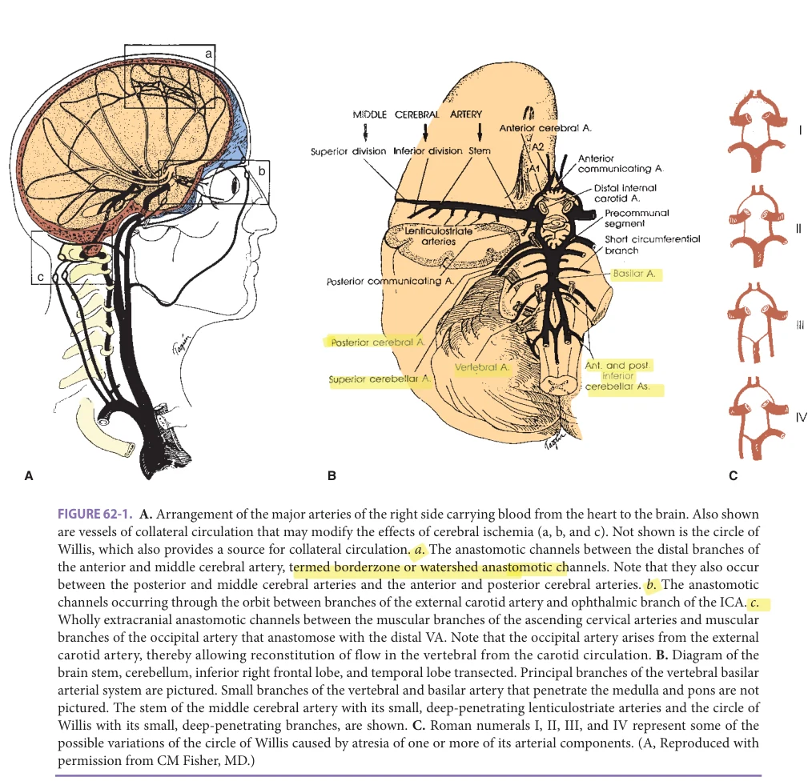
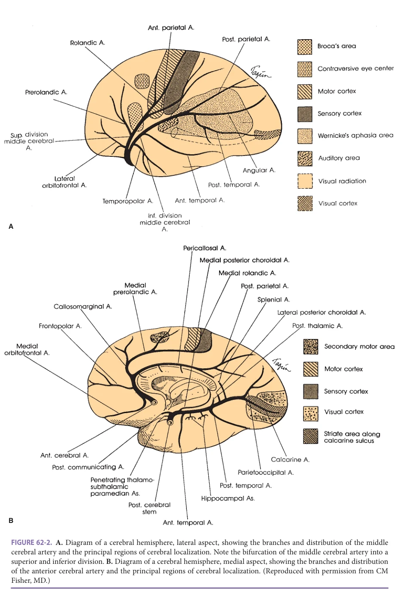
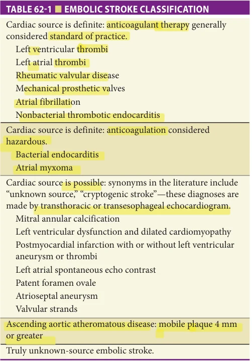
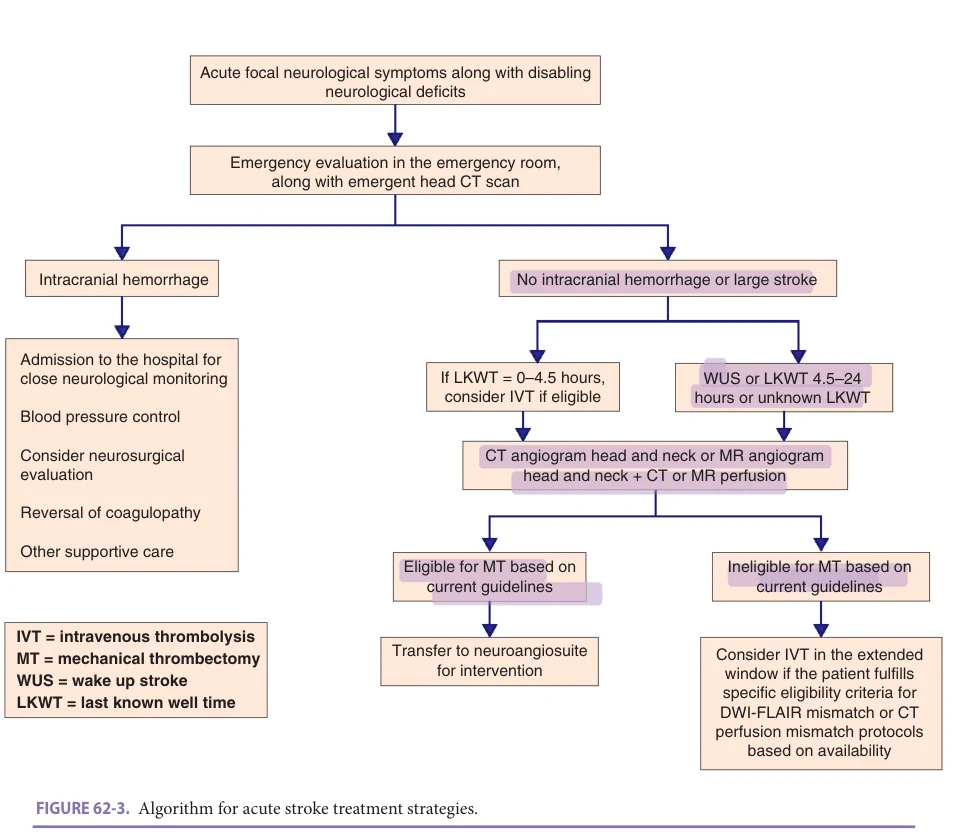
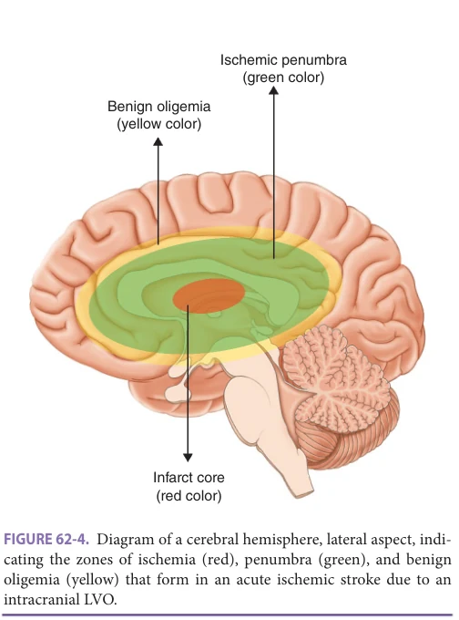
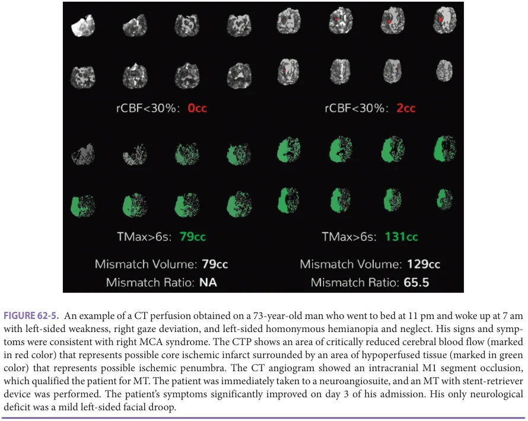

# Hazzard's Geriatric Medicine and Gerontology, 8e - Chapter 62: Cerebrovascular Disease

Nirav R. Bhatt, Bernardo Liberato

> Excluded from the IMA required reading list (P005-2026); cited once in past papers.

> **Status.** Fast build from the book; not lane-reviewed.

> **Source and method.** Printed pages 953-980, from the marked 8th-edition copy (PDF page = printed page + 34). Prose follows its text layer; tables and figures are source-page crops. The book is canonical.

**[p. 953]**

Although stroke is the fifth leading cause of death in the United States, it remains the single most important cause of disability. Ischemic stroke and transient ischemic attack (TIA) are parts of the same spectrum, and their diagnosis usually implies inadequate blood flow to variable areas in the brain, brain stem, or cerebellum. Many varied pathologic processes lead to either occlusion of an extra- or intracranial artery or vein causing ischemic stroke or TIA, or rupture of an intracranial artery causing hemorrhagic stroke. A precise clinical diagnosis with appropriate localization strategies and determination of likely etiology are key to establishing appropriate treatment in the acute phase as well as planning the most adequate secondary prevention according to best practice and evidence available (Figures 62-1 and 62-2). This chapter focuses on identifying the pathology, clinical features, and treatment strategies that allow for the proper care of stroke victims, with a particular emphasis in the older population.

#### Learning Objectives

- Understand the pathophysiology and clinical presentations of different types of strokes, and specific symptoms and signs associated with the involvement of each major cerebral artery and location of infarction.

- Learn about the state-of-the-art neuroimaging techniques and other tests available to evaluate and diagnose stroke.

- Acquire latest information about the pharmacology, specific indications, and adverse effects of various drugs and surgical interventions available to treat different stages and types of strokes.

- Learn about the results of pivotal clinical trials forming the basis for latest guidelines to treat different types of strokes.

- Understand the rationale for various preventive strategies commonly used for different types of strokes.

#### Key Clinical Points

1. It is important to identify the pathophysiology in each stroke patient, as it drives selection of the best treatment choice.

2. Magnetic resonance imaging (MRI) brain scans with diffusion-weighted imaging (DWI) are the best way of identifying cerebral infarcts acutely and accurately. While computed tomography (CT) scan is less sensitive to detect recent infarcts of less than 12 hours, it is the initial method of choice in the hyperacute setting since most acute treatment decisions can be made based on its results.

3. Imaging of the cervical and cerebral large arterial system with CT angiography (CTA) or MR angiography (MRA) should be urgently performed to assess the arterial system. CTA offers the best resolution and suffices for acute decision making.

## EPIDEMIOLOGY

Stroke is a leading cause of mortality and morbidity in the United States. In 2018, according to statistics from the Centers for Disease Control and Prevention (CDC) and American Heart Association (AHA), one in every six deaths from cardiovascular disease (CVD) was due to stroke. In the United States, someone has a stroke every 40 seconds and every 4 minutes one death is due to a stroke. That burden is greater in the older population since stroke incidence and mortality increase with age which is reflected in the fact that approximately 66% of people hospitalized for a stroke will be 65 years or older. Stroke incidence becomes more evident in the aging population and its impact on greater longevity is demonstrated by the fact that 17% of all strokes will occur in patients 85 years and older. According to the AHA, stroke incidence is expected to more than double by 2050 with the greater increase in the population 75 years and older, underscoring the need for greater awareness and knowledge about stroke among those health professionals involved in the care of that group of patients. As in CVD in general, incidence by gender shows a predominance in men in the 60- to 79-year-old age group while women are slightly more affected in the 80 years and older age group.

**[p. 954]**

4. Recombinant tissue plasminogen activator (rt-PA) initiated within 4.5 hours of symptom onset has been shown to reduce stroke-related disability. In general, benefits of rt-PA in older adults with stroke outweigh risks.

5. Mechanical thrombectomy for selected patients with large vessel occlusion is highly effective in reducing morbidity and mortality and is supported by Level Ia evidence.

6. Stroke carries a worse prognosis in older individuals overall; however, both intravenous rt-PA and mechanical thrombectomy have been found effective in this population and should be strongly considered when clinically appropriate.

7. Efficacy of carotid endarterectomy and carotid stenting for symptomatic disease with more than 70% stenosis is high and should be performed when clinically indicated. Clinical, demographic, and technical aspects should be considered when choosing the best method.

8. Oral anticoagulation is highly effective in preventing stroke in the setting of atrial fibrillation (AF) especially in the older population. Direct oral anticoagulants (DOACs) are used increasingly and present a better safety profile compared to warfarin.

9. Antiplatelet monotherapy continues to be the cornerstone for secondary prevention of noncardioembolic strokes, with dual antiplatelet therapy reserved for a short course in high-risk TIA/minor stroke. Dual antiplatelet therapy can also be considered in cases of strokes secondary to moderate to severe stenosis seen in intracranial atherosclerotic disease (ICAD).

Overall, prognosis is worse following a stroke in the older adults, and is associated with a higher riskadjusted mortality, greater disability, longer hospitalization, and reduced chances of being discharged home after an admission to a hospital. However, despite an overall worse prognosis in older adults compared to younger age groups, more aggressive therapeutic and multitargeted secondary prevention strategies have resulted in more favorable stroke outcomes in the older population, including a decline in the crude stroke death rate. Importantly, these promising outcomes are seen across all older age groups including those 85 years and older.

## ISCHEMIC STROKE OR TIA SUBTYPE

Pathophysiology and Clinical Presentation It is important to recognize that ischemic stroke and TIA share the same pathological causation, such that efforts to define the underlying arterial pathophysiology of the ischemic stroke or TIA should be the focus of a treatment strategy. The term “cerebral vascular accident” or “CVA” should be discarded, and the terms “TIA” and “ischemic stroke” should be used with further characterization of the subtype of stroke according to its likely etiology, a definition that goes beyond nomenclature and carries implication when choosing the most appropriate therapeutic and prevention strategies. Despite more recent challenges to the classic etiologic categorization, in clinical practice, ischemic stroke/ TIA can still be conveniently divided into five subtypes: (1) large artery atherosclerosis, including intra- and extracranial (25%); (2) small-vessel lacunar (25%); (3) cardioembolic (20%); (4) cryptogenic (25%); and (5) other (5%), such as arterial dissection, venous sinus occlusion, and arteritis. The prevalence of various ischemic strokes or TIA subtypes vary across different ethnic population groups. Specifically, African-Americans are at a relatively higher risk of having a lacunar stroke and atherothrombotic stroke, particularly that portion of atherothrombotic stroke caused by intracranial arterial atherosclerosis. Likewise, Asians have a higher frequency of intracranial arterial atherosclerotic disease. Conversely, extracranial atherosclerotic disease shows a predilection for Caucasians.

When transient or sustained focal neurologic symptoms or signs develop in a patient, history, general physical examination, and neurologic examination are important to diagnose stroke, localize the affected territory of the brain or spinal cord and the corresponding vascular distribution, and even suggest the pathophysiologic subtype. Strokes and TIAs require not only immediate imaging of the brain parenchyma but also noninvasive assessment of the extra- and intracranial arterial vasculature focusing on the arteries supplying the suspected symptomatic arterial territory. CT scan of the head is the neuroimaging modality of choice for the hyperacute evaluation of a suspected stroke, mostly to rule out other pathologies that could mimic an ischemic stroke, particularly hemorrhagic stroke. CT has nearly perfect sensitivity for acute intracerebral hemorrhage (ICH) (approaching 100%) and good sensitivity for acute subarachnoid hemorrhage (SAH) (~ 90%). Sensitivity for ischemic infarction in the acute setting is, however, much lower. Ischemic infarction may not be demonstrable by noncontrast CT for 12 to 14 hours after symptom onset. In addition, infarction involving only the cortical surface supratentorially, or infarction in the posterior fossa, can often be obscured by bone artifact. Therefore, the main reason for obtaining a head CT scan in the acute phase is to exclude intracranial hemorrhage and detect early signs of ischemia as well as define the extent of early ischemic changes. In the acute phase, vascular imaging, usually

**[p. 955]**

*Figure 62-1, printed p. 955.*

with CTA of head and neck, is mandatory to look for vessel pathology that could be responsible for the ischemic changes suggested by the neurological examination. Only with the precise knowledge of parent vessel pathology, or its absence, can therapy be properly considered. Also, given the well-defined role for mechanical thrombectomy (MT) in select patients with a large vessel occlusion (LVO) demonstrated on CTA, such imaging modality is essential part of the acute stroke evaluation. Even though MRI is the gold standard for identification of an ischemic stroke, its role in the hyperacute evaluation is limited given the longer examination time. Brain MRI, however, is indicated for most ischemic stroke patients early on after hospital admission, and other vascular imaging modalities that can be considered include a combination of MRA, carotid duplex ultrasound, and transcranial Doppler (TCD) (see Figure 62-2). A combination

of these imaging modalities is often necessary before a definite etiology can be determined and an appropriate preventive strategy can be devised. The following sections outline each of the four ischemic stroke and TIA subtypes, and intracerebral and SAH, in terms of their pathophysiologic process and clinical presentation. A discussion of a focused diagnostic approach to confirm that clinically presumed diagnosis follows. Based on the particular TIA or stroke subtype and its causative pathologic process, acute, subacute, and preventive management strategies can then be addressed.

Definition The classical definition of a TIA is that of sudden focal neurological symptoms lasting less than 24 hours. This definition is purely a clinical one and does not take into consideration neuroimaging findings on MRI after an

**[p. 956]**

*Figure 62-2, printed p. 956.*

**[p. 957]**

acute ischemic episode. The more complete definition establishes that if an acute focal neurological dysfunction shows an imaging correlate (DWI positivity on MRI) it is considered a stroke regardless of the persistence or not of the initial focal symptoms. In that case, it is called a minor stroke. For the majority of patients with persistent focal deficits beyond 24 hours (clinical stroke), neuroimaging will show a correlated lesion on MRI. The semantics do not carry great relevance for the diagnostic work-up for these patients since both a TIA and a stroke demand urgent and complete investigation. Its major importance lies in the fact that TIA or minor strokes carry an overall risk of about 10% for recurrent stroke in the following 90 days, the greatest risk being in the first 48 hours after its occurrence. This risk varies with the type of underlying vessel pathology, neuroimaging, and clinical features of the event. Based on clinical features, scales have been created to help stratify the short-term risk of recurrence of a TIA. The most commonly used scale is the ABCD2 scale where clinical features, when present, receive points and the sum of them will translate into higher risk of recurrence. The clinical features and the points assigned to each are as follows:

1. Age > 60 years – 1 point 2. Blood pressure on presentation > 140/90 – 1 point 3. Clinical features of the TIA—isolated speech (1 point), unilateral weakness (2 points) 4. Duration—< 10 min – 0 points; 10–59 min – 1 point; ≥ 60 min – 2 points 5. History of Diabetes—1 point

The sum of the points yields the final score and a score ≥ 4 represents an elevated risk for recurrence. This score was used in many acute prevention trials as criteria for enrolling patients (see below). The early time frame for highest recurrence risk underscores the need for urgent evaluation and implementation of therapeutic and preventive strategies after a TIA or minor stroke.

## STROKE SUBTYPES

Large-vessel, atherothrombotic stroke/TIA subtype Atherothrombotic cerebral vascular disease accounts for approximately 25% of all ischemic strokes. To determine that a stroke is secondary to large-vessel atherosclerotic disease, it is required that the artery supplying the ischemic territory (extra- or intracranial) reveals a degree of vessel lumen stenosis > 50% of the normal lumen. It is divided into two categories according to the site of atherothrombotic involvement:

1. Extracranial atherosclerotic disease (ECAD) 2. Intracranial atherosclerotic disease (ICAD)

When considered as a group, atheromatous process commonly has a predilection for four extra- and

intracranial arterial locations (see Figure 62-2): (1) the internal carotid artery (ICA) origin, (2) the carotid siphon portion, (3) the middle cerebral artery stem, and (4) the vertebrobasilar junction. Although the origins of the common carotid and vertebral arteries (VA) also are sites of atheromatous disease, they are less often the cause of stroke or TIA. Atherosclerotic narrowing can also involve the proximal intracranial VA and origins of the posterior cerebral arteries (PCAs), but rarely involve the more distal branches of the cerebral and cerebellar arteries. At each of the sites of predilection, several mechanisms are possible and responsible for causing the stroke or TIA: (1) Embolism: thrombus forms on an atherothrombotic plaque and a piece of clot travels distally to occlude a more distal vessel. This is called an “artery-to-artery” embolus. (2) Thrombus propagation: this is less common, but if the thrombus propagates to occlude a distal vessel off the circle of Willis, large strokes can occur. (3) Hypoperfusion: the atherothrombotic process might occlude or narrow the vessel to such a degree that distal flow is diminished and not compensated via collateral flow through the circle of Willis. This lowflow state may result in border-zone infarctions where an area between the middle cerebral artery-anterior cerebral artery (MCA-ACA) or MCA-PCA territories is affected cortically or in the distal field of the lenticulostriate penetrating arteries, affecting the deep white matter.

In general, both artery-to-artery embolism and lowflow strokes occur when the vessel is narrowed to a degree that decreases pressure across the arterial segment. Lowflow stroke or TIA occurs less often from a cervical lesion because the circle of Willis can usually provide needed distal collateral circulation when a proximal stenosis becomes hemodynamically significant. Low-flow stroke or TIA occurs more often with atheromatous disease in the intracranial vasculature as this compromises the ability of the circle of Willis to provide sufficient collateral flow. In 70% of the population, the circle of Willis is incompetent, with one or more of the connecting arteries atretic or functionally inadequate (see Figure 62-2). In this circumstance, low-flow TIA or stroke may arise from atherothrombosis at the ICA origin or in its petrous or siphon portions.

a. Atherothrombotic disease of the anterior cerebral

circulation (origin of the ICA, its major branches, and the common carotid artery) In the anterior circulation, atheroma occurs most often at the bifurcation of the common carotid artery (CCA), and usually begins on the posterior wall of the ICA origin.

• Internal carotid artery: Most often, atheroma at the origin of the ICA becomes symptomatic after it has narrowed the lumen to the point where the pressure begins to drop across the stenosis, allowing both embolic or low-flow ischemic TIA and stroke to occur. Embolism from thrombus forming in an ulcerated plaque may occur at 50% to 70% stenosis, but it is less common, and rarely occurs with

**[p. 958]**

lesser degrees of stenosis. Artery-to-artery embolism can also occur if the atheromatous process occludes the ICA origin forming a thrombus at the site. At times, the occluding thrombus may also propagate without embolization, reaching the ophthalmic artery origin and producing monocular blindness, or extending even more distally to the MCA origin and producing a devastating, full-territory stroke.

Low-flow symptoms caused by ICA origin stenosis are less common than artery-to-artery embolism, and occur only if two conditions exist: (1) the lesion has to be hemodynamically significant, that is, severe enough to provoke a drop in pressure across the lesion, (2) recruitment of the main collateral channels (circle of Willis and anastomotic connections between the external carotid artery and ophthalmic artery) is inadequate, leading to a low-pressure state either in the MCA or in one or both of the anterior cerebral arteries. If there is ICA occlusion and little distal collateral flow, then a complete middle cerebral syndrome may result. The PCA territory may also be vulnerable to low flow in the setting of carotid disease when this artery arises directly from the ICA, a variant called “fetal PCA” that is estimated to occur in up to 30% of the population. If the circle of Willis is complete, then occlusion of the ICA can be asymptomatic if it does not have an associated embolic or propagated thrombotic component.

The signs and symptoms of artery-to-artery embolism from the ICA are variable and depend on which intracranial branches are affected. The MCA, receiving majority of the blood flow originating from the ICA will be the most often affected but different symptoms can be the presentation of distal embolization, including from small emboli to the ipsilateral ophthalmic artery. In that case the symptom is called amaurosis fugax, in which a descending shade affecting the ipsilateral eye is usually described by the patient as a brief, usually self-limited phenomenon. In more extreme cases complete and persistent visual loss can occur, usually secondary to a central retinal artery occlusion (CRAO). This constitutes a neuro-ophthalmological emergency and should prompt emergent evaluation for the possibilities of an ipsilateral carotid disease either of atherosclerotic or inflammatory origin (giant cell arteritis [GCA]).

Atheromatous disease in the ICA siphon occurs less often but shares the same type of physiologic mechanisms for TIA and stroke as seen with atheromatous disease of the ICA origin. More proximal involvement, with CCA stenosis or occlusion, is much less common than ICA involvement and can present with similar symptoms.

• MCA: MCA territory symptoms can be divided into those involving the stem territory (M1 segment; see Figure 62-2) and those involving the superior or inferior territory divisions (M2 segments) or one of their cortical surface branches (see Figures 62-1 and 62-2). When the stem of the MCA is occluded (M1 occlusion), a complete MCA syndrome may occur. It produces a complete contralateral hemiplegia and sensory loss involving the face, arm, hand, leg, and foot. Gaze deviation toward the ischemic hemisphere occurs due to involvement of the frontal eye fields. Ischemia in the dominant hemisphere causes global or partial aphasia and ischemia of the nondominant hemisphere results in neglect (visuospatial and tactile) and anosognosia. The degree of cortical involvement, usually evident clinically by the presence of gaze deviation, aphasia, or neglect, depends on the level of occlusion and the degree of cortical surface collateral flow (see Figure 62-1). Smaller emboli cause single superior or inferior branch of the MCA syndromes, or partial branch syndromes. Superior division infarcts, typically present with either isolated contralateral weakness or isolated expressive aphasia or a combination of the two. Inferior division syndromes include difficulty with reading, writing, auditory comprehension of language, or fluent aphasic speech with no limb weakness. Paraphasic errors are common. Neglect of the left visual hemifield and extinction to double tactile stimulation are signs of cortical involvement seen most often in nondominant hemispheric syndromes but may also occur on the right with dominant syndromes. • Anterior cerebral artery (ACA): ACAs divide into two segments: A1 or stem, a part of the circle of Willis and A2 segment, distal to the anterior communicating artery (see Figure 62-1). The A1 segment gives rise to several deep penetrating arteries that supply the anterior limb of the internal capsule, the anterior perforated substance, portions of the anterior hypothalamus, and the posterior part of the head of the caudate nucleus. Infarction in these territories is more often caused by an embolus than by local atheromatous disease. ACA infarcts result predominantly in contralateral leg weakness with varying degrees of contralateral shoulder weakness. If the right and left A2 segments arise from a single anterior cerebral artery A1 segment due to contralateral hypoplastic A1 segment, a normal anatomic variant, an occlusion of this single A1 segment causes bilateral frontal lobe infarction resulting in bilateral leg weakness. Other symptoms of ACA infarcts include urinary incontinence, abulia, gait apraxia, and forced grasping of the hand. • Anterior choroidal artery (AChA): This artery arises from the ICA and supplies the posterior limb of the

**[p. 959]**

internal capsule and its adjacent white matter and medial temporal lobe, also supplying some geniculocalcarine fibers. The complete clinical syndrome consists of contralateral hemiparesis, hemianesthesia, and hemianopia. However, because this territory is also supplied by penetrating vessels of the MCA stem and the posterior communicating and the posterior choroidal arteries, syndromes with minimal deficits can occur. b. Atherothrombotic disease of the posterior cerebral

circulation: vertebrobasilar and posterior cerebral arteries and their branches As seen in the anterior circulation, atherosclerosis has a predilection for certain parts of the posterior circulation—namely the proximal origins of the VA, which falls under the category of ECAD, the distal (intracranial) VA, the proximal to mid-basilar artery, and the proximal PCA, which fall under the category of ICAD (see Figure 62-1).

• Vertebral and posterior inferior cerebellar artery: An occlusion of the distal vertebral or its major branch, the posterior inferior cerebellar artery (PICA), may be caused by either atherothrombosis or by embolism from a proximal arterial source or the heart. VA dissection is another possibility. Atherothrombotic VA stroke is often heralded by TIA or minor stroke. Occlusion of either the VA or the PICA produces infarction in the lateral medulla, resulting in the lateral medullary (Wallenberg) syndrome. The symptoms and signs vary, but more commonly include vertigo, nausea and vomiting, hoarseness, dysphagia, ipsilateral facial numbness associated with impaired sensation of pain and temperature over the ipsilateral face and contralateral arm and leg, ipsilateral Horner syndrome, and ipsilateral limb ataxia. The PICA also supplies the posteroinferior cerebellum that may become infarcted if collateral circulation from the superior cerebellar artery (SCA) is inadequate. The infarct resulting from vertebral occlusion does not differ anatomically from that produced by PICA occlusion, except for a greater involvement of the restiform body (inferior cerebellar peduncle) in the latter. With moderate to large areas of cerebellar infarction, edema might occur and be fatal if not detected early and suboccipital craniectomy performed to relieve the mass effect on the brain stem. • Basilar artery: TIA usually precedes atherothrombotic basilar artery occlusion and the consequent accompanying devastating brain stem infarction. The symptoms of a TIA in the territory of the distal vertebral and the basilar artery are more varied than in the carotid–middle cerebral territory because of the many different anatomic structures involved. Moreover, brain stem TIAs may be caused by disease of either of the small penetrating branches of the basilar or VA or disease of the basilar or VA

themselves. Penetrating branch disease may be due to atherothrombosis, involving the proximal origins of these small branch vessels, or lipohyalinosis, involving the small vessels deeper in the brain stem (see “Lacunar stroke/TIA subtype” later in this chapter). Therefore, when brain stem TIA or acute stroke occurs, it is extremely important to determine whether the problem lies in the basilar artery or in one of its smaller branches. Disease of a basilar branch produces unilateral infarction, whereas disease of the basilar artery itself usually causes bilateral infarction. Transient dizziness associated with diplopia, dysarthria, and numbness around the mouth strongly indicates the presence of basilar insufficiency. Other important symptoms occurring less often include a general profound feeling of weakness of the entire body, staggering, and/or a feeling of propulsion. Bilateral signs such as gaze paresis or internuclear ophthalmoplegia (INO) associated with ipsilateral sensory loss or weakness signify ischemic infarction in both sides of the pons, and therefore exclude single penetrating branch disease as the culprit.

Syndromes of unilateral brain stem infarction typically involve some combination of ipsilateral signs of the head and face, from involvement of cranial nerve nuclei or their fascicles, and contralateral motor and sensory signs in the limbs, from involvement of ipsilateral crossed long tracts, such as the corticospinal tract or spinothalamic tract respectively. • Major basilar branches—anterior inferior cerebellar artery (AICA), SCA, PCA: These major branches of the basilar artery produce their own distinct pathophysiologic syndromes. They are most often caused by artery-to-artery embolism from an atherothrombotic source within the proximal basilar artery or the VA. An aortic or cardiogenic embolic source can be found, especially when the SCA is involved. Rarely, primary atherothrombotic stenosis or occlusion at their origins is the cause of the stroke or TIA. • SCA: Occlusion of the SCA results in one or more of the following symptoms: ipsilateral cerebellar ataxia (caused by ischemia of the middle and/or superior cerebellar peduncle, or dentate nucleus); nausea and vomiting; dysarthria and contralateral loss of pain and temperature sensation over the extremities, body, and face (caused by ischemia of the spinal and trigeminal thalamic tract); and ataxic tremor or choreiform movements of the ipsilateral upper extremity. Ipsilateral Horner syndrome can be present. Partial syndromes occur frequently. Due to involvement of the cerebellar vermis, a pronounced truncal ataxia and gait impairment can be seen.

SCA territory infarction should prompt a thorough investigation for a potential embolic source.

**[p. 960]**

• Anterior inferior cerebellar artery (AICA): The territory it supplies usually includes the lateral midpons, middle cerebellar peduncle, cerebellum, and the labyrinth and cochlea. The principal symptoms may include ipsilateral deafness, facial weakness, vertigo, nausea, vomiting, nystagmus, tinnitus, cerebellar ataxia, Horner syndrome, and paresis of conjugate lateral gaze. Contralateral loss of pain and temperature sensation is also seen. • Paramedian and short circumferential branches of the basilar artery: Occlusion of one of short circumferential branches of the basilar artery affects the lateral two-thirds of the pons and/or middle or superior cerebellar peduncle, whereas occlusion of one of the paramedian branches of the basilar artery affects a wedge-shaped area on either side of the medial pons. Many brain stem syndromes with cranial nerve abnormalities and crossed hemiplegia have been described. • PCA: Arising from the bifurcation at the top of the basilar artery, each PCA divides into two segments: (1) P1 (proximal) segment, beginning at the top of the basilar artery and extending to the posterior communicating artery takeoff, with penetrating branches to the subthalamus, thalamus, and midbrain, (2) P2 segment, beginning at the posterior communicating artery takeoff, supplies the medial inferior temporal lobe and the medial occipital lobe. Twenty percent of the time, one or both of the right or left P1 segments are atretic and the P2 segment is supplied by the ICA via the posterior communicating artery. As discussed previously, this is referred to as a “fetal” PCA origin. The majority of ischemic syndromes result from embolism (artery-to-artery or cardiac) and less commonly atherothrombotic disease of the PCA. • P1 segment: Syndromes are related to midbrain, subthalamic, and thalamic signs that vary depending on whether the embolus occludes the top of the basilar area, the right or left PCA proximal segment, or the penetrating artery branches that emerge from the proximal PCA. Top of the basilar artery occlusion results in the devastating syndrome of coma and quadriplegia, resulting from infarction of the reticular activating system and bilateral corticospinal tracts within the midbrain. Branch occlusions cause third nerve palsy and contralateral motor or sensory findings by involvement of the midbrain. The artery of Percheron is a normal anatomic variant in which a single large medial mesencephalic artery supplies both sides of the subthalamus and thalamus and part of the midbrain. Occlusion of this artery results in bilateral ptosis, paralysis of upgaze, and decreased consciousness, caused by involvement of both thalami and bilateral midbrain. When only a single penetrating artery territory is involved,

small-vessel lacunar disease results (see “Lacunar or Small-Vessel Disease” later in this chapter). • P2 segment: Syndromes result from involvement of cortical branches to the medial inferior temporal lobe, giving rise to memory loss and delirium, and branches to the medial occipital lobe, giving rise to contralateral homonymous visual field defects. Distal field border zone ischemia of the PCAs and MCAs gives rise to visual impairment syndromes that include inability to recognize faces or pictures or to put items in a picture together to form an object (Balint syndrome).

Small-vessel, lacunar stroke/TIA subtype A lacunar infarct results from an occlusion of a small single penetrating artery arising from the circle of Willis, the middle cerebral stem, the basilar artery, or PCA and is defined as a small noncortical lesion measuring up to 1.5 to 2 cm in diameter. The cause is lipohyalinotic narrowing or occlusion in the mid- or distal part of the artery or atherothrombotic lesion at its origin; embolism is less often the cause. Lacunar strokes account for 25% of all ischemic strokes. These strokes cause recognizable clinical syndromes that evolve over hours to days, and may be preceded by transient symptoms (lacunar TIAs). The location of the ischemia determines the nature and severity of the symptoms. Recovery occurs often within days, but in some with especially strategically placed infarcts, significant disability is persistent and increasing age is associated with worse prognosis. Lacunar strokes are often asymptomatic but when multiple and recurrent are associated with more widespread white matter disease and an increased risk for cognitive decline and dementia.

The most common lacunar syndromes are the following:

• Pure motor hemiparesis is the most common lacunar stroke syndrome. It is usually from an infarct in the posterior limb of the internal capsule, corona radiata, or basis pontis. Less commonly, cerebral peduncle in the midbrain can be involved. The face, arm, leg, foot, and toes are equally paretic or plegic, but with no sensory deficit. The weakness may be intermittent (TIA), progress in a stepwise manner, or appear abruptly. • Pure sensory stroke from an infarct in the ventrolateral thalamus. This type of infarct produces face, arm, and leg sensory involvement with numbness, tingling, and loss of pain and temperature. The patient generally recovers but often is left with an abnormal sensation. On rare occasions, an intolerable pain syndrome with dysesthesia occurs in the involved extremities some months afterward (Dejerine-Roussy syndrome). • Sensorimotor stroke usually results from infarction between the thalamus and internal capsule and presents with contralateral weakness of face, arm, and leg as well as decreased sensation on the same side.

**[p. 961]**

• Ataxic hemiparesis from an infarct usually in the basis pontis or the internal capsule. This results in contralateral weakness and ataxia. • Dysarthria—clumsy hand syndrome caused by lacunar infarction of the genu of the internal capsule or, less frequently, the corona radiata or the paramedian rostral pons, with resulting mild contralateral arm ataxia or arm weakness, and dysarthric speech.

Cardioembolic stroke/TIA subtype Cardiomebolic strokes account for approximately 20% of all stroke subtypes and can reach twice this number in the older population. Despite the downtrend in stroke incidence worldwide, cardioembolic stroke incidence has tripled in the last few decades and is estimated to triple again in the next 30 years, possibly due to more extensive diagnostic evaluation. Many cardiac conditions predispose to stroke occurrence (Table 62-1).

On clinical grounds, it is usually diagnosed when a sudden deficit, reaching a peak soon after its onset, appears in the territory of a large intracranial artery or in one of its major branches, and the extra- or intracranial arterial supply to this ischemic territory zone does not have a significant stenotic or thrombotic occlusive lesion. In some cases, the embolic fragment may be seen, on imaging, to occlude the vessel or a distal branch. In other cases, the suspected embolic material is not visualized because it has already

*Table 62-1, printed p. 961.*

been dissolved by the endogenous fibrinolytic system, but not before significant ischemia has occurred.

The clinical presentations of embolism in the anterior and posterior cerebral circulation are similar to that of artery-to-artery embolism. The nature and severity of the symptoms depend entirely on the location of the embolic fragment occluding the artery and the spared collateral circulation to its cerebral territory. Which intracranial artery or arteries that get occluded will depend on the size of the embolic fragment and the extracranial artery it enters.

The radiological characteristics of an embolic infarction differ according to the size of the embolic material as well as the diameter of the artery affected. When a more proximal large artery is involved (such as the distal ICA or proximal MCA) a large area of ischemia, involving both deep and cortical structures, occurs. When the embolic material is smaller, it lodges in more distal branches and gives rise to the more typical embolic pattern of a cortically based, wedge-shaped ischemic lesion. The clinical suspicion together with the radiological appearance of a distal cortical-subcortical lesion should prompt a more aggressive investigation for a cardioembolic source such as a structural heart or aortic lesion or an atrial arrhythmia, even if clinically occult.

Many different heart conditions predispose to cardioembolic strokes (see Table 62-1), but AF is not only the most prevalent of these conditions but also the one with the best evidence-based treatment strategies. Estimated to affect more than 30 million people worldwide, it is associated with a three- to fivefold risk of stroke. Particularly relevant is its occurrence in the older population where, for individuals older than 65 years, its prevalence increases by 5% per year. Not only is it more prevalent with aging but the risk of stroke associated with it also increases in older adults, a notion emphasized by the fact that the proportion of ischemic strokes attributable to AF increases with age and can be as high as 40% in the oldest old age groups. The statistics of AF prevalence and stroke risk in the geriatric population should stress the importance of exhaustive search for AF in this age group, sometimes utilizing longterm rhythm monitoring strategies such as prolonged Holter monitoring or implantable rhythm monitoring device. In practical terms, the absence of an obvious etiology for an ischemic stroke, such as a lacunar or large vessel pattern, demands prolonged rhythm monitoring in the older population. With more studies demonstrating the effectiveness of prolonged rhythm monitoring strategies in detecting AF in stroke patients, it is also reasonable to consider such monitoring strategies in the older population, even when an alternative etiology is more immediately apparent.

Other conditions, even though less prevalent than AF, can represent high-risk conditions for embolic strokes and include congestive heart failure, recent myocardial infarction (MI) (both associated with left ventricular [LV] thrombus formation), complex aortic arch atheromas, valvular heart disease, and infective endocarditis.

**[p. 962]**

Patent Foramen Ovale and Embolic Stroke Patent foramen ovale (PFO) is the consequence of failure of complete closure of the atrial septum primum and septum secundum immediately following birth, thereby leaving a communication between the right atrium and left atrium. PFO has been associated with stroke in epidemiologic studies, which indicate it is present in as many as 50% of patients with cryptogenic embolic stroke. Stroke may be more common in those with PFO because the atrial communication provides a channel by which a venous embolism can pass from the right to left side of the heart with the potential for subsequent cerebral embolism (so-called “paradoxical embolism”). Alternately, the PFO may itself be the source of thrombus formation with subsequent embolism. The PFO may be identified by transthoracic echocardiography with injection of agitated saline. Transesophageal echocardiography offers increased sensitivity. TCD ultrasound can also be used to detect the presence of right-to-left shunting by documenting the passage of agitated microbubbles into the cerebral circulation following a peripheral venous injection. It has equal or greater sensitivity than transthoracic echocardiography and can be used to guide the cardiac evaluation.

There is considerable controversy regarding the significance and therapeutic implications of PFO in stroke. PFOs are common and present in approximately 15% to 35% of the general population. After a thorough diagnostic work-up for stroke etiology, it is often difficult to determine if a PFO is related to the stroke or an “innocent bystander.” If a PFO is identified, the patient should be screened for the presence of deep venous thrombosis (DVT), which would itself be an indication for a period of anticoagulation. PFO is likely more relevant in younger patients with few or no risk factors for stroke than in the older population, where other traditional cardiovascular risk factors make other stroke etiologies more likely.

Cryptogenic stroke In up to 30% of stroke patients, despite an extensive work-up, a causative etiology cannot be found, and the stroke is classified as cryptogenic. A minimally complete etiological work-up should include neuroimaging with CT or MRI, cervical and intracranial vessel imaging, and 24-hour heart rhythm monitoring. The absence of a clear etiology is more frequently seen in younger patients but can be seen in older individuals, even when multiple cardiovascular risk factors are present. Since a largevessel stenotic atherosclerotic lesion and a lacunar pattern must be excluded, the majority of cryptogenic strokes will fall under the category of embolic stroke of undetermined source (ESUS). This most recent stroke subclassification acknowledges that many times cryptogenic strokes will appear indistinguishable from strokes from a known embolic source. Its radiological and clinical characteristics will be of an embolic looking stroke (above) with no obvious cardiac source of embolism. This entity is important not only because it is relatively frequent but because an even more extensive work-up in this group of patients

often reveals an underlying cardioembolic source, namely atrial fibrillation. Studies have shown that in this group, after more prolonged heart rhythm monitoring (at least 6 months) with implantable monitoring devices, the prevalence of paroxysmal AF can be as high as 30%. Such results have obvious clinical significance given the superior protection that long-term oral anticoagulation offers for secondary prevention, when compared to antiplatelet therapy.

For the ESUS patients with no AF detected after months of continuous rhythm monitoring, the possibility that long-term anticoagulation might be more effective than antiplatelet therapy is being investigated by current studies where structural and electrical abnormalities of the left atrium (atrial cardiomyopathy) are considered as potential markers of increased embolic risk. Like AF, such a condition is more prevalent in older adults and likely predisposes to strokes. Results from such studies will help determine the best secondary prevention strategies for this group.

Other causes of cerebral infarction Although other causes of cerebral infarction account for only 5% of all ischemic strokes, they are extremely important because their precise pathophysiologic diagnosis can lead to effective treatment.

Dissection of the cervical cerebral arteries is the most common cause of stroke in this category subtype. A dissection is a tear in the arterial wall leading to intramural hematoma formation. A subintimal dissection occurs when an intramural hematoma is between the intima and the media layers and may lead to arterial narrowing and thrombus formation. A subadventitial dissection occurs when an intramural hematoma is between the media and the adventitia layers, and may lead to the formation of a dissecting aneurysm (sometimes referred to as pseudoaneurysm).

ICA dissections usually occur 2 cm distal to the carotid bifurcation near the base of the skull. VA dissections occur in the cervical transverse foramen but more commonly at the base of the skull, at the V3-V4 segments. Intracranial dissections are less common than cervical dissections and can lead to ischemic stroke and bleeding in the subarachnoid space. Trauma, either severe or trivial, are common causes of dissection, but Valsalva maneuvers associated with coughing and vomiting, weightlifting, contact sports, or chiropractic manipulations are other recognized associations. Spontaneous dissections, without a clear antecedent cause, are not uncommon. Dissections occur at all ages but tend to be less frequent in older individuals.

The most common symptom of arterial dissection is headache or neck pain. The clinical hallmark of carotid dissection is an ipsilateral Horner syndrome usually with unilateral cervical pain. Artery-to-artery embolism or lowflow syndromes occur, just as they do for atherothrombotic disease of the ICA. Similar pathophysiologic circumstances exist for VA dissections; with them, cervical spine pain and occipital headache are the suggestive symptoms. The most common site of infarction in vertebral dissection is the lateral medulla, with or without concomitant involvement of

**[p. 963]**

the PICA territory in the cerebellum. Dizziness, ataxia of gait, hiccups, nausea and vomiting with a unilateral Horner syndrome, and ipsilateral face numbness with contralateral body numbness are the hallmark symptoms (Wallenberg syndrome). Occasionally, diplopia and a hoarse voice are evident. Artery-to-artery emboli arising from a thrombus at the site of dissection in the VA may migrate to distal branches of the basilar artery, producing brain stem, cerebellar, or thalamic infarction. Sometimes spontaneous dissection can be seen in the context of underlying fibromuscular dysplasia (FMD), a noninflammatory, nonatherosclerotic vascular disease that can result in arterial stenosis, occlusion, aneurysm, or dissection. FMD most frequently involves the renal artery but can also involve the extracranial carotid and VA. It is usually seen in younger patients.

Vasculitis is inflammation of the blood vessels. There are numerous causes such as infection, malignancy, immune diseases, and drugs. Infectious vasculitis from bacterial or syphilitic infections is no longer a common cause of cerebral thrombosis. Infectious arteritis may rarely follow infection with varicella zoster virus (VZV), particularly if the ophthalmic division is involved, and is usually associated with involvement of larger caliber vessels. Cerebral arteritis may rarely accompany certain systemic vasculitides, including polyarteritis nodosa or Wegener granulomatosis. Necrotizing granulomatous arteritis, or primary angiitis of the central nervous system, involves the distal small branches (< 2 mm diameter) of the main intracranial arteries and produces small ischemic infarcts in the brain, optic nerve, and spinal cord. By definition, there is no systemic involvement. This rare disease is often relentlessly progressive. Presenting symptoms are varied and nonspecific, but headache is the most frequent complaint. MRI is frequently abnormal, but the findings are nonspecific. Findings include cortical and subcortical infarcts, parenchymal and leptomeningeal enhancement, subarachnoid and intraparenchymal hemorrhage, or mass lesions. Angiography can demonstrate areas of stenosis alternating with normal or dilated segments but both sensitivity and specificity are not ideal. Diagnosis of primary angiitis of the central nervous system can be difficult and typically requires either angiographic criteria be met or a tissue diagnosis.

Giant cell arteritis is a relatively common affliction of older persons, in which the external carotid system— particularly the temporal arteries—is the site of a subacute granulomatous infiltration with an exudate of lymphocytes, monocytes, neutrophilic leukocytes, and giant cells. The etiology of giant cell arteritis is not entirely clear, but it is likely secondary to multiple genetic and environmental factors with numerous infectious etiologies having been suspected in the past, including VZV. The pathogenesis is believed to involve an initial antigen-driven event that leads to the recruitment of T cells with subsequent inflammation potentially causing vascular damage and intimal hyperplasia, the result of which can cause stenosis or occlusion.

Clinically, the chief complaint is headache or jaw claudication. Systemic manifestations, through the release of inflammatory cytokines, can include fever, loss of weight, malaise, and polymyalgia rheumatica. Blindness of one or both eyes results from occlusion of the branches of the ophthalmic artery. Occasionally, an ophthalmoplegia caused by involvement of extrinsic ocular muscles occurs. In some cases, an arteritis of the aorta and its major branches, including the carotids, subclavian, coronary, and femoral arteries, has been found at postmortem examination. Significant inflammatory involvement of the intracranial arteries is rare, but strokes occur occasionally due to occlusion of the internal carotid, middle cerebral, or vertebral-basilar system with a predilection for affecting the latter.

Per the American College of Rheumatology, the diagnosis is made if three of the five following criteria are met: (1) age of onset is greater than 50, (2) new headache, (3) temporal artery abnormality (tenderness to palpation or decreased pulsation unrelated to arteriosclerosis of the cervical arteries), (4) elevated erythrocyte sedimentation rate (ESR) (≥ 50 mm/h), and (5) abnormal findings on temporal artery biopsy. The hallmark neurologic symptom is transient monocular blindness, but ischemic stroke can rarely be the presenting feature. In older patients with new-onset headaches, especially if associated with visual complaints and/or ischemic stroke, high clinical suspicion warrants obtaining urgent ESR and C-reactive protein (CRP) levels.

Moyamoya disease is a poorly understood nonatherosclerotic occlusive disorder involving the progressive stenosis of large intracranial arteries, especially the distal ICA, the stem of the MCA, and the ACA. Even though being a disease predominantly seen in children and young adults, it can rarely be seen in adults older than 60 years.

Reversible cerebral vasoconstriction syndrome (RCVS) is a reversible angiopathy that presents with severe “thunderclap” headache, often recurrent, and fluctuating neurologic symptoms and signs as well as angiographic findings of alternating areas of constriction and dilation. It affects predominantly women in the fourth and fifth decades but has been reported in patients in their sixties and seventies. Brain imaging can be normal or show cerebral infarction, hemorrhage, or transient cerebral edema. The etiology is unknown. Eclampsia, the postpartum period, head injury, migraine, and sympathomimetic and SSRIs have all been associated with this entity. Conventional angiography is the gold standard for establishing the diagnosis although newer imaging techniques such as CTA and MRA are proving useful. Cerebrospinal fluid (CSF) is normal in most cases and this is one of the characteristics that helps distinguish this entity from primary angiitis of the central nervous system. The disease is self-limited, and, with adequate supportive care and withdrawal of the offending agent, partial or complete recovery occurs in most cases. The headaches and arterial vasoconstriction usually resolve within a few weeks.

**[p. 964]**

Cerebral autosomal dominant arteriopathy with subcortical infarcts and leukoencephalopathy (CADASIL) is a rare primary arteriolopathy affecting small penetrating vessels to the basal ganglia, thalamus, and cerebral white matter. The disease is caused by a variety of mutations in the Notch3 gene. The clinical presentation is varied, but there are five primary symptoms including late-onset migraine headaches with aura, subcortical ischemic strokes, mood disturbances, cognitive impairment, and apathy. It is part of the differential diagnosis of progressive cognitive impairment and diffuse matter after disease but is rarely seen in older adults.

Binswanger subcortical leukoencephalopathy, a rare cause of dementia, is a syndrome seen with advanced small-vessel hypertensive disease. Diffuse vascular lesions are seen in the subcortical layers of the cerebral hemispheres and there is widespread white matter demyelination. It usually affects individuals around 50 years and is characterized by fluctuations in mood and consciousness and perhaps even seizures. Dementia may be an early and prominent symptom preceded or accompanied by symptoms and signs of one or more small-vessel infarctions. Confusional states, memory difficulties, and abulia are prominent, and are sometimes accompanied by focal cortical-subcortical deficits such as aphasia, apraxia, or neglect. Focal neurologic deficits or unior bilateral limb signs may lead to a pseudobulbar state and gait difficulties are prominent. There is often evidence of vascular compromise in other body districts. Binswanger disease must be differentiated from disorders with prominent subcortical white matter involvement on CT or MRI such as hypertensive encephalopathy, cerebral amyloid angiopathy (CAA), and CADASIL.

Hematologic diseases such as acute and chronic leukemia, essential and secondary thrombocytosis, thrombocytopenia, and sickle cell disease can be complicated by ischemic or hemorrhagic stroke. Acquired hypercoagulable states, mainly with the detection of antiphospholipid antibodies can be part of the investigation of cryptogenic stroke in older patients while other hereditary conditions are more relevant in the investigation of stroke in the young. Cancer also increases the risk of hypercoagulability and hence ischemic stroke, and should be considered in older patients, especially when traditional stroke risk factors are absent.

Stroke can also occur during the course of a severe attack of migraine, especially migraine with aura (“migraine-induced stroke”). It is less often seen in the older population and is usually a diagnosis of exclusion, since other more common etiologies in that age group have to be considered and ruled out first.

## EVALUATION

History, Physical Examination, and Initial Imaging Evaluation The initial history and physical examination are the hallmark of the evaluation to obtain the pathophysiologic stroke or TIA subtype diagnosis. Urgent brain and vascular

imaging must be performed in all patients. Noncontrast head CT, for most centers, is the initial imaging evaluation as it allows rapid exclusion of hemorrhage. While not sensitive enough to detect acute ischemic changes, especially small areas of infarction, in the first 12 hours after stroke, a head CT scan can answer the main questions in the acute setting such as:

1. Is there hemorrhage? 2. Is there an alternative diagnosis evident on initial imaging (tumor, abscess)? 3. Is the stroke already evident on initial imaging, and if so, how extensive is it?

Regarding the last question, part of the evaluation of the stroke characteristics on initial CT include estimating the extent of ischemic involvement mostly by determining areas of hypoattenuation and loss of gray-white matter differentiation. The ASPECTS scale (Alberta Stroke Program Early CT Score) is used to estimate extent of early ischemic changes and has been strongly related with prognosis. It divides the MCA-distribution territory in 10 different areas and subtracts 1 point for each area affected. A score < 6 is generally associated with a worse prognosis and is often used as a cutoff for guiding acute interventional therapies. However, it is not a strict rule and individual case-by-case decisions are still warranted when considering acute revascularization strategies in daily practice. Besides analysis of parenchymal involvement on noncontrast CT, acute vessel imaging with CT angiogram of the head and neck should be part of the acute stroke evaluation. Knowing the anatomy of intra- and extracranial vessels as well as presence and location of a LVO is critical information in the acute decision-making process. CT Perfusion (CTP) is also part of the same radiological armamentarium, and many times provides key information on tissue viability, especially in patients who present in an extended time window from stroke onset and might still be candidates for acute intervention (MT). Details of this modality can be found elsewhere but it consists of a CT scan modality in which a contrast bolus is tracked, by serial scanning, as it passes through the tissue and the results deconvoluted into a map of perfusion times. In practical terms, the critical information one looks for when obtaining a CTP in an acute stroke is whether there is still viable tissue (ischemic penumbra) that can potentially be saved by recanalization strategies (see below). For the reasons above, the information provided by CT or CTA (and in some cases CTP) is usually fast and reliable and in most cases will suffice to help determine eligibility for acute treatment, either intravenous thrombolysis (IVT) or MT (see below).

Despite a greater accuracy for detecting acute ischemic stroke changes, MRI of the head is less practical in the hyperacute setting and is usually reserved for completion of stroke evaluation at a later time or when a challenging case demands more information for the

**[p. 965]**

acute decision-making process. In patients who are not candidates for acute intervention, a more complete diagnostic work-up should be initiated. MRI of the brain with diffusion-weighted imaging (DWI) is the best way of identifying cerebral infarcts acutely and accurately. Susceptibility sequences identify subacute hemorrhagic infarcts and small areas of chronic hemorrhage (microbleeds) that might be associated with small-vessel diseases such as amyloid angiopathy or hypertensive vasculopathy. MRI is far more sensitive than CT scan not only for detecting infarction at different stages but also for identifying other pathologies that can mimic an acute stroke clinically such as brain tumor, abscess, and demyelinating/inflammatory lesions. MRI also has a high sensitivity and specificity for the detection of hemorrhage. Determining the location and pattern of ischemia on MRI is the first step in determining the most likely stroke etiology.

Imaging of the cervical and cerebral large arterial system with CTA, MRA, or carotid duplex and TCD ultrasound are modalities used for determining the vessel anatomy and its associated pathology. If done in the acute setting, CTA of the head and neck is usually sufficient and other modalities can be reserved for inconclusive studies or when administration of intravenous iodinated contrast is to be avoided. MRA of the head and neck does not offer the same anatomical resolution of the arterial system as conventional transfemoral angiography or CT angiography. MR perfusion-weighted imaging can, in an analogous way to CT perfusion imaging, identify areas of perfusion delay that indicate tissue at risk of progression to infarction.

Neurosonology tests include carotid duplex ultrasound and TCD assessment of the extra- and intracranial arterial system, respectively. Carotid duplex Doppler assesses flow in the CCA, its bifurcation, and the internal and external carotid arteries. In addition, flow in the middle portion of the VA is typically assessed to identify more proximal or distal obstructive lesions. TCD allows assessment of flow in the intracranial carotid artery and the ophthalmic artery through the transorbital approach. The transtemporal approach permits assessment of flow in the middle, anterior, and PCA stems. The occipital foramen magnum approach allows determination of flow in the distal VA and in the proximal and mid sections of the basilar artery. These tests have the advantage of being simple, noninvasive, and portable. Neurosonology tests can be used to follow the progression of the arterial pathology subacutely and chronically. Detection of microbubbles after injection of agitated saline is also helpful in detecting evidence of right to left shunt as seen in the presence of PFO. Prolonged monitoring with emboli detection and study of cerebral vasoreactivity are examples of the clinical utility of TCD in the etiological evaluation of ischemic strokes. The quantification of carotid artery atheromatous disease and its progression is an especially important use of carotid duplex combined with TCD.

Laboratory Evaluation After completion of all acute neuroimaging modalities, the initial blood work should include the standard complete blood count, basic coagulation studies, and general chemistry examination. Checking a fasting lipid panel and screening for diabetes with hemoglobin A1c should also be performed for stroke risk factor modification. Special clotting studies are not essential, but are often useful when a hypercoagulable state is suspected, mostly in younger patients. In the majority of older patients an extensive hypercoagulable panel is usually not warranted. The screen of thyroid function with a thyroid-stimulating hormone has helped us in identifying clinically inapparent hyperthyroidism, a condition that may be associated with AF or hyperlipidemia. ESR should be considered in the older population, especially when other risk factors are missing and there is suspicion of GCA or endocarditis as the cause of the stroke.

Cardiac evaluation In addition to obtaining a baseline electrocardiogram, cardiac echocardiography and cardiac rhythm monitoring should be performed, especially when a cardiac embolism is considered in the differential diagnosis. In practical terms, unless there is an obvious causative etiology identified (lacunar or large artery atherosclerosis), given the high prevalence of AF in the older population, cardiac rhythm monitoring should always be considered in this patient population. Outpatient prolonged cardiac rhythm monitoring, ideally with an implantable loop recorder device, is very helpful if AF or other cardiogenic arrhythmias are considered and is now standard of care to look for AF in cases of suspected cardiac embolism. The suggested duration of monitoring is usually for 6 months at least, or until paroxysmal AF is identified.

Therapeutic Strategies for Acute Ischemic Stroke With the acute onset of neurologic deficits secondary to cerebral ischemia, the goal is to facilitate or reestablish blood flow to the ischemic zone. The therapeutic strategy should always be guided by the ischemic stroke pathophysiology and mechanism, whether presumed (history and physical examination) or confirmed (history, physical examination, and diagnostic data including neuroimaging, echocardiography, heart rhythm monitoring, and laboratory testing). The diagnosis should include not only the ischemic stroke or TIA subtypes noted earlier, but also the presence or absence of pathology in the parent vessel supplying the ischemic zone and the extent of the spared collateral flow to it. The time of onset to treatment determines the therapeutic options available, which typically include (1) acute reperfusion therapies, (2) early stroke prevention strategies, and (3) long-term stroke prevention strategies.

After the pathophysiologic diagnosis has been determined and the patient has been evaluated for therapies designed to facilitate or reestablish cerebral perfusion and prevent subsequent strokes, further management efforts

**[p. 966]**

*Figure 62-3, printed p. 966.*

are directed at preventing common complications, such as DVT and aspiration pneumonia, and assisting with neurologic recovery through rehabilitation.

Acute reperfusion therapies Within the first few hours of cerebral ischemia, rapid restoration of blood flow to the affected area is the cornerstone of acute stroke treatment, and this goal is achieved by either pharmacological treatment with IVT or mechanical clot removal via endovascular thrombectomy (EVT) or MT (see Figure 62-3).

Intravenous Thrombolysis For patients in whom treatment can be initiated within 3 hours of symptom onset, IVT with alteplase, at a dose of 0.9 mg/kg with 10% given as an immediate bolus and the remainder infused over 1 hour, has been shown to reduce stroke-related disability. In the pivotal National Institute of Neurological Disorders and Stroke (NINDS) rt-PA Stroke trial, patients treated with IVT had a 12% greater absolute chance of a good outcome, defined as minimal or no stroke-related disability. This benefit was present despite a 6% risk of symptomatic intracranial hemorrhage (sICH) in the IVT group, of which more than half were fatal. Posthoc analysis of the trial did

not show statistical evidence that the treatment effect varied by presumed stroke subtype, although the power to detect differences was modest. Subsequently, a trial of IVT given to patients with acute ischemic stroke within 3 to 4.5 hours showed a significant benefit of IVT as compared to placebo. In this study, the European Cooperative Acute Stroke Study (ECASS) III, the mean time to administration of rt-PA was 3 hours 59 minutes. Patients receiving IVT had a 7.2% absolute chance of a better outcome, defined as a modified Rankin score of 0 or 1 at 90 days. Mortality did not differ between the two groups. The rate of any intracranial hemorrhage was, as expected, higher in the IVT group (27% vs 17.6%) as was the rate of sICH (2.4% vs 0.3%), though lower than in the NINDS rt-PA trial. It is important to note that in ECASS III patients were excluded if older than age 80, if they had a severe stroke, or if they had a history of previous stroke and diabetes mellitus. However, updated AHA/ASA guidelines for acute stroke treatment cite a careful assessment of the published evidence to indicate that these exclusion criteria may not always be justified in clinical practice and recommend a detailed evaluation of individual risks versus benefits of IVT among patients

**[p. 967]**

presenting in the 3- to 4.5-hour time window. Further, both in NINDS and in ECASS III, the earlier the patients received IVT, the better were their outcomes. Therefore, it is of utmost importance to initiate thrombolytic therapy in patients with acute ischemic stroke as soon as possible, that is, aiming for shorter “door-to-needle” times.

Extended-window IVT: About 20% strokes occur during sleep, but a witnessed last-known-well (LKW) time of > 4.5 hours in these patients would disqualify them from receiving IVT due to the uncertainty regarding the true onset of stroke symptoms. Several studies have shown that a significant proportion of these patients suffer stroke symptoms in the early morning hours just before waking up because of the circadian fluctuations in blood pressure, heart rate, hemostatic processes, and occurrence of AF. Various neuroimaging modalities such as MRI (DWI-FLAIR Mismatch), CT perfusion, and MRI perfusion studies have been recently shown to reliably identify patients who may benefit from acute reperfusion therapies. The concept of DWI-FLAIR mismatch, that is, presence of an acute ischemic lesion on DWI in the absence of a hyperintense lesion on FLAIR serving as a surrogate marker of time elapsed since the actual onset of stroke symptoms has been recently evaluated in a randomized trial of MRI-guided intravenous thrombolysis in stroke patients with unknown time of symptom onset (WAKE-UP). The basis of this clinical trial was a proposition supported by previous studies that DWIFLAIR mismatch on an MRI was reliably able to identify a majority of the patients whose stroke symptoms started within the preceding 4.5 hours. The trial included patients who presented with a new stroke, were LKW more than 4.5 hours earlier, had no thrombectomy planned, fulfilled the prespecified imaging criteria (DWI-FLAIR mismatch), and in whom treatment with IV alteplase could be initiated within 4.5 hours of symptom recognition. The trial was terminated prematurely owing to cessation of funding after the enrolment of 503 out of 800 patients and showed an excellent outcome in 53.3% patients receiving MRI-guided thrombolysis versus 41.8% in the control arm (p = 0.02). Alteplase was associated with a nonsignificantly higher risk of sICH (2% vs 0.4%, p = 0.15) and a nonsignificantly higher mortality at 90 days (4.1% vs 1.2%). Of note, the majority of the patients treated had mild to moderately disabling stroke with a median NIHSS of 6.

In acute ischemic stroke, there is a core of irreversibly damaged tissue surrounded by an ischemic penumbra representing potentially salvageable tissue, provided normal blood circulation within that tissue is rapidly restored (discussed later in this section). Studies have shown that a CT-perfusion or an MRI-perfusion study is able to identify the core and penumbra to a reliable extent, often represented as core/perfusion mismatch. The Thrombolysis Guided by Perfusion Imaging up to 9 Hours after Onset of Stroke (EXTEND) trial compared alteplase with placebo in patients presenting between 4.5 and 9 hours after stroke onset, or after awakening with stroke (if within 9 hours

from the midpoint of sleep), using predetermined CT or MRI core/perfusion mismatch criteria to select patients. After 225 of a planned 310 patients had been enrolled, the study was terminated because of a loss of equipoise after the publication of the WAKE-UP trial. This trial showed that alteplase was associated with an excellent 90-day outcome in 35.4% patients as compared to 29.5% patients receiving placebo (adjusted odds ratio 1.44, 95% CI 1.01–2.06, p = 0.04). The risk of sICH was higher in the alteplase group, 6.2% versus 0.9% (adjusted risk ratio 7.22, 95% CI 0.97–53.53, p = 0.053). The 90-day mortality was similar between the alteplase (11.7%) and placebo (8.9%) groups (adjusted risk ratio 1.17; 95% CI 0.57–2.40; p = 0.67). The publication of these trials among other studies has contributed to the expansion of IVT eligibility in a subset of acute stroke patients in whom the time they were LKW was either unknown or more than 4.5 hours prior to waking up with stroke symptoms, depending upon the center they are treated at and the resources available at that center. One limitation of the MRI-based approach is that it requires immediate access to an MRI scanner and collateral information from the patient/family members to establish MRI safety (absence of ICD/pacemakers or metallic prosthesis in the patient’s body). On the other hand, a CT-perfusionbased approach requires access to an automated software that enables rapid calculation of ischemic core and penumbra estimates. Moreover, in both these trials, there were a substantial proportion of patients with a LVO who may have qualified for MT based on the updates from two novel endovascular trials that were subsequently published (discussed later in this section). These limitations have restricted the widespread adoption of these approaches depending upon the region, access to care, and resources available, but they may remain reasonable options for a select subgroup of acute stroke patients. The 2019 updates for the early management of acute ischemic stroke published by the AHA/ASA suggest the MRI-based approach (DWI-FLAIR mismatch) for IVT as a reasonable choice for a carefully selected group of acute ischemic stroke patients in the extended time window.

Because of the risks of hemorrhage, the decision to administer IVT should be based on an individual assessment of the benefits and risks for the specific individual, with careful attention to the treatment inclusion and exclusion criteria. Patients with acute disabling neurological deficits without hemorrhage or established infarct on initial head CT should be considered for IVT. Exclusion criteria must be reviewed carefully prior to IV rt-PA administration. An important concept to understand is the disabling nature of the neurological symptoms at presentation. A phase IIIb, double-blind, multicenter study to evaluate the efficacy and safety of alteplase in patients with mild stroke, rapidly improving symptoms, and minor neurologic deficits (the PRISMS trial) tested the efficacy of IV alteplase versus aspirin for emergent stroke with presenting symptoms that were deemed to be nondisabling in nature

**[p. 968]**

by the treating physician. Of a planned 948 patients, the trial was able to recruit 313 patients and failed to show a benefit of IV alteplase over aspirin, and consequently the current AHA/ASA guidelines recommend against IVT administration among patients who do not have presenting neurological deficits that would interfere with their daily lives. There has been concern about treatment of older adults because age may be a risk factor for IVT-related hemorrhage; however, the NINDS trial data show that this increased risk does not outweigh the potential benefit in older persons.

Although the rate of sICH after IVT is relatively low, it remains the most feared and sometimes fatal complication of this treatment. Rapid identification and administration of procoagulant factors such as cryoprecipitate or prothrombin complex concentrates (PCC) or tranexamic acid (or a combination of these aforementioned options) along with the provision of neurosurgical and hematological consultations under the care of experienced neurocritical care teams form the mainstay of management of sICH after IVT administration.

More recently, tenecteplase (TNK) instead of alteplase as the thrombolytic agent in acute ischemic stroke has been gaining some traction among the vascular neurology community. TNK is a recombinant tissue plasminogen activator like alteplase but exhibits a higher degree of fibrin specificity and a longer half-life that allows for a single bolus dose administration. Preliminary studies have shown that it is at least comparable, and in some situations, could be more effective than alteplase for acute ischemic stroke. Consequently, many centers worldwide are beginning to offer TNK as an alternative to alteplase as more evidence is awaited.

Mechanical thrombectomy EVT with thrombolytics/ thrombus retrieval devices had been studied over the past two decades over many studies without much success in clinical outcomes. But, in 2015, several pivotal randomized clinical trials established an overwhelming benefit of EVT/ MT in treatment of patients with acute ischemic stroke and a LVO who fulfilled certain criteria, establishing this treatment as a standard-of-care for this patient population. The reasons for such tremendous success of the newer trials were thought to be related to their better patient selection criteria and utilization of more effective reperfusion devices. The exact details differ among these trials, but overall, there were many common features that contributed to the success of these studies and EVT/MT, in general. First, all these trials required the presence of a LVO defined as an occlusion of the intracranial segment of the ICA or proximal segment of the middle cerebral artery (MCA), denoted by M1. The more distal blood vessels are denoted by M2, M3, and so on. Very few patients harbored an occlusion of M2 in these trials and none had more distal occlusions. Second, all trials except MR CLEAN (Multicenter Randomized Clinical trial of Endovascular treatment for Acute ischemic stroke in the Netherlands) required evidence of

absence of severe ischemic changes in the affected brain tissue on a noncontrast CT scan represented by an Alberta Stroke Program Early CT Score (ASPECTS), and although MR CLEAN did not have these requirements in the study entry criteria, it recruited very few patients who had evidence of advanced ischemic changes. Third, all trials encouraged rapid attempt at recanalization, and while most of the trials implemented 0- to 6-hour time window since LKW for study entry, ESCAPE (endovascular treatment for small core and anterior circulation proximal occlusion with emphasis on minimizing CT to recanalization times) and REVASCAT (randomized trial of revascularization with Solitaire FR device versus best medical therapy in the treatment of acute stroke due to anterior circulation LVO presenting within 8 hours of symptom onset) proved the benefit of MT in patients up to 8 hours from symptom onset. Fourth, for the majority of the patients, MT was carried out using the second-generation stent retriever devices. In this procedure, a catheter is advanced into an artery, and using fluoroscopic guidance, a stent retriever is inserted into the catheter. The stent reaches past the clot, expands to stretch the walls of the artery, and is retrieved, removing the clot. Finally, these trials required the patients to have decent baseline level of functioning for them to be able to participate. This allowed for adequate participation in the rehabilitation therapies following the thrombectomy procedure and promoted neurological recovery among the treated patients. A meta-analysis combining data from 1287 patients from five of these pivotal trials showed that the rate of successful recanalization among patients undergoing MT was 71%. Patients who underwent MT had a higher likelihood of achieving good 90-day clinical outcome with return to functional independence, 46% versus only 26.5% in the control group. Finally, the number needed to treat for one patient to have reduced disability was found to be 2.6, thus confirming the highly effective nature of MT as a treatment for anterior circulation LVO among acute ischemic stroke patients with disabling symptoms and who were LKW within 8 hours. Moreover, this benefit persisted across all age groups, even octogenarians, and although the overall mortality remained lower in the intervention group (15.3% versus 18.9% in the control group), this difference was not shown to be statistically significant.

The penumbra concept for patient selection: An intracranial occlusion causing complete cessation of blood flow to brain tissue it supplies renders that tissue at risk of irreversible damage. The larger the area supplied by this occluded vessel, the larger the tissue is at risk and while intracranial and extracranial collateral circulation may help compensate for some of the lack of blood flow, as time passes, even the collateral circulation runs the risk of failing, thereby causing irreversible tissue injury. Moreover, the normal average blood flow is about 50 mL/ 100 g/min. When this flow drops to 20 to 30 mL/100 g/min, there is a selective loss of neuronal functions with electrical

**[p. 969]**

*Figure 62-4, printed p. 969.*

failure and inability to conduct the electrical impulses, but the cell structure is still intact. However, when this flow reduces below a critical level between 10 and 20 mL/ 100 g/min, there is loss of ATP function of the cell resulting in cell membrane damage, swelling, and subsequent cell death. Because of a close interplay of these phenomena, an intracranial occlusion leads to the formation of three zones of brain injury (see Figure 62-4): the ischemic core (tissue irreversibly injured), the ischemic penumbra (tissue with very slow blood flow, with cessation of neuronal functions but intact cell structure allowing for slow functional recovery if adequate blood flow is rapidly restored), and the zone of benign oligemia (tissue with milder reduction in the blood flow that does not lead to tissue at risk). Over the last few years, neuroimaging techniques with CT perfusion and MRI perfusion have been developed that can rapidly provide a reliable estimate of these zones of ischemia, penumbra, and benign oligemia. Although both the modalities have their pros and cons, they have been increasingly used in acute stroke imaging and form the basis of DAWN (DWI or CTP assessment with clinical mismatch in the triage of wake-up and late presenting strokes undergoing neurointervention) and DEFUSE 3 (endovascular therapy following imaging evaluation for ischemic stroke 3) trials published in 2018, which allowed for expansion of MT in patients who presented with acute disabling stroke symptoms beyond 6 hours of LKW time and had a salvageable penumbra measured by the automated quantitative

perfusion on CT perfusion or an MR perfusion study (see Figure 62-5). There were some differences in the clinical and imaging selection between the two trials, but essentially DAWN enrolled patients between 6 and 24 hours of their LKW time and DEFUSE 3 enrolled patients within 6 to 16 hours of their LKW time. DAWN enrolled 207 patients and showed the largest treatment effect size in terms of functional outcome with 49% of the patients undergoing MT achieving functional independence at 3 months versus only 13% patients in the medical management arm. Similarly, in DEFUSE, enrollment was terminated early for efficacy after 182 patients were randomized and showed the rate of return to functional independence in 41% patients undergoing MT versus only 15% in the medical management arm. The findings from these trials have shifted the paradigm of stroke treatment from being a strictly time-based approach toward a more inclusive salvageable tissue-based approach and expanded its eligibility to a much broader population. Like in the early time window, the efficacy for MT has been unequivocally accepted for all adult age groups, including octogenarians. Although these trials established the benefit of MT among patients in the extended time window, it is very important to understand that the patients who fulfill these criteria are relatively few and the survivability of the brain tissue depends upon the collateral circulation status of a patient. With time, this collateral circulation may fail, although definite timepoints at which this may happen are almost impossible to predict. Thus, even when dealing with a patient with favorable core/perfusion mismatch showing salvageable penumbra, it is crucial that these patients receive MT without any additional delay to harness the maximal benefit from reperfusion.

Post-reperfusion management: After the completion of the acute reperfusion therapies, patients should be admitted to a dedicated neurological care unit to monitor for neurological deterioration and cardiovascular or systemic complications and to complete investigations to determine the ischemic stroke mechanism. Upon successful reperfusion, the goal is to maintain hemodynamic stability, targeting gradual normotension. Severe resistant hypertension has been shown to increase the risk of ICH and so, after IVT, the widely accepted routine practice is to maintain blood pressure ranges < 180/105 mm Hg for at least 24 hours while avoiding rapid fluctuations, followed by a 24-hour CT scan or an MRI of the brain to rule out intracranial hemorrhage. To achieve this goal, intravenous antihypertensive medications such as labetalol, as needed, or continuous infusions of medications such as nicardipine are generally used. Typically, until the 24-hour CT/MRI scan rules out an ICH, pharmacological DVT prophylaxis and antithrombotic agents are avoided unless there is a strong indication to do so. There are no clear guidelines regarding optimal blood pressure goals after successful MT but depending on the degree of reperfusion, targeting normotension is a widely accepted routine practice until there

**[p. 970]**

*Figure 62-5, printed p. 970.*

is more robust data available. Similarly, hyperglycemia has been shown to be associated with poor stroke outcomes, and the patients admitted to the hospital who have severe hyperglycemia should be on standardized insulin protocols to treat and closely monitor their regular blood sugars. The Stroke Hyperglycemia Insulin Network Effort (SHINE) randomized controlled trial enrolled 1151 acute ischemic stroke patients and randomized nearly half of them to an interventional protocol with IV insulin to maintain blood sugar between 80 and 130 mg/dL and did not find any benefit in this group of patients when compared to the other half of the patients in the group that received standard care with subcutaneous insulin to maintain blood glucose between 80 and 179 mg/dL. Subsequently, intensive lowering of blood sugar is not currently recommended in routine practice caring for acute stroke patients. For patients who do not receive acute reperfusion therapies, maintaining cerebral perfusion pressures is critical, and the blood pressure is allowed to autoregulate with permissible systolic blood pressure (SBP) up to 220 mm Hg in the first 24 to 48 hours, subsequently aiming to gently lower blood pressure (with SBP goals of 160–180 mm Hg) within 24 to 72 hours of ischemic stroke onset. Close attention must be paid to the neurologic examination, as abrupt blood pressure drops may lead to hypoperfusion of an arterial territory at risk of infarction.

Common medical complications of stroke include aspiration pneumonia, DVT, and pulmonary embolism. When indwelling bladder catheters are used, urinary tract infection is an additional concern. All stroke patients with evidence of dysarthria, aphasia, cough, or aspiration should have a formal swallowing evaluation before being allowed to take food, liquid, or medicines by mouth. Some patients may require placement of a percutaneous endoscopic gastrostomy (PEG) feeding tube, which, in most cases, can be removed in several months when the ability to swallow improves. DVT can be prevented by the administration of subcutaneous heparin or the use of pneumatic compression boots, followed by ambulation as soon as possible. Attention should be made to avoid hyperthermia, which may lead to poorer stroke outcomes.

Early stroke prevention strategies Aspirin is the most common antithrombotic agent used for secondary stroke prevention after a stroke or a TIA. Typically, unless there are contraindications or excessive risks of bleeding, aspirin 50 to 325 mg/day is initiated as soon as possible after an ischemic stroke or a TIA. The risk of recurrent stroke after an ischemic stroke or a TIA is the highest in the first few days/ weeks after the index event, thought to be as high as 10% within a week after a TIA or minor stroke, depending on the underlying stroke etiology. Although aspirin has been

**[p. 971]**

shown to be beneficial for long-term secondary stroke prevention, the most benefit is obtained in the first few days after the index TIA/stroke. Caution should be exercised when prescribing aspirin to patients who have known history of gastrointestinal ulceration/bleeding, although aspirin in 50 to 325 mg/day doses has been shown to be tolerated well in general. Clopidogrel is also used as a first-line agent for secondary stroke prevention. In a randomized, blinded trial of clopidogrel versus aspirin in patients at risk of ischemic events (CAPRIE) that randomized patients with a recent stroke, MI, or peripheral arterial disease to daily treatment with clopidogrel or aspirin, clopidogrel was associated with a modest reduction in overall primary outcome of stroke, MI, or vascular death, but in subgroup analysis, the outcomes between the two groups did not differ among patients who had a recent MI or a stroke. Some patients exhibit nonresponsiveness to clopidogrel, and although ticagrelor has been considered an effective substitute, it was not shown to be superior to aspirin alone for secondary prevention of stroke, MI, or death at 90 days in the Acute Stroke or Transient Ischemic Attack Treated with Aspirin or Ticagrelor and Patient Outcomes (SOCRATES) trial. The choice of antiplatelet therapy is dependent mainly on patient tolerance, contraindications, availability, and cost, and while the combination of aspirin plus extended-release dipyridamole has shown modest benefit over aspirin, its side effect profile with headache and gastrointestinal symptoms has limited its use. There is some data on the use of cilostazol as a second-line agent for patients with aspirin allergy in Asian patients, but high-quality data supporting the use of cilostazol in non-Asian ethnic groups is lacking and has limited its use.

Due to the high stroke recurrence rate in the early period after the index stroke/TIA, there has been an ongoing interest to find optimal treatment strategies to minimize this risk. The Clopidogrel in High-Risk Patients with Acute Nondisabling Cerebrovascular Events (CHANCE) trial randomized patients with acute high-risk TIA or a minor stroke to an interventional arm consisting of treatment with aspirin and clopidogrel for 3 weeks post the index event followed by placebo until 90 days and a control arm consisting of daily aspirin-treated patients and compared the primary outcome of recurrent stroke among these patients in 114 clinical centers in China. A total of 5170 patients were enrolled, and recurrent strokes occurred more frequently in the control arm at 11.7% versus the interventional arm at 8.2%, showing that addition of clopidogrel within first 24 hours after the index high-risk TIA or minor stroke for a total of 21 days resulted in 32% risk reduction for recurrent stroke, without increasing the bleeding risks significantly. Recently, a multicenter, multinational, randomized clinical trial, titled Platelet-Oriented Inhibition in New TIA and minor stroke (POINT), tested the efficacy of a combination of dual antiplatelet therapy (DAPT) in the intervention arm against single antiplatelet therapy in the control arm for a total of 90 days after the index high-risk TIA or

minor stroke and enrolled 4881 patients in North America, Europe, Australia, and New Zealand. The primary efficacy outcome for recurrent ischemic stroke, MI, or death from ischemic vascular causes was significantly lower in the intervention arm (5%) versus control arm (6.5%); however, the risk of major hemorrhage in the intervention arm (0.9%) was also higher as compared to the control arm (0.4%). The reason for higher risk of major hemorrhage was thought to be possibly related to the higher loading dose of clopidogrel, and a longer duration of treatment with DAPT in the POINT trial (3 months) as compared to CHANCE trial (3 weeks). Moreover, the benefit of DAPT in recurrent ischemic stroke reduction was shown to be maximum in the first 30 days after the index event, whereas the bleeding risk built up after a week of initiating the DAPT. Combining the findings of these two studies, the current AHA/ASA guidelines on early management of acute ischemic stroke strongly recommend considering a short course of DAPT with aspirin and clopidogrel initiated within 24 hours from symptom onset after a high-risk TIA or a minor ischemic stroke (provided the patient did not receive IVT) for a total of 21 days. This benefit of DAPT was mirrored in another randomized clinical trial, Acute Stroke or Transient Ischemic Attack Treated with Ticagrelor and ASA for Prevention of Stroke and Death (THALES), that utilized ticagrelor as the second antiplatelet agent substituting clopidogrel. However, the risk of major hemorrhage, including fatal and intracranial hemorrhage, was elevated among patients randomized to the intervention arm receiving aspirin plus ticagrelor for a total of 30 days.

Acute cerebral venous sinus thrombosis (CVST) may have varied presentations including ischemic stroke, ICH, headache, seizures, etc. It is routine practice to consider early anticoagulation with either unfractionated heparin (UFH) or low-molecular-weight heparin (LMWH) for the treatment of this condition, oftentimes even if the patient presents with baseline ICH. Following a period of neurological stabilization, the mode of anticoagulation is switched to oral anticoagulants, such as warfarin for a period of 3 to 6 months, or until resolution of CVST on follow-up imaging depending on the risks versus benefits. In a recent study, dabigatran was found to have similar efficacy in patients with mild to moderate CVST in preventing recurrent sinus thrombosis.

Extracranial cervical artery dissection is another established etiology of acute ischemic stroke, which is more common in young adults as opposed to the geriatric population. It may present with headache, Horner syndrome, cranial neuropathies, or ischemic stroke/TIA. Although evidence in support of optimal treatment is limited, it suggests that the either aspirin/dual antiplatelet therapy or anticoagulation for short term may be reasonable choices for secondary stroke prevention. The choice of antithrombotic regimen should be based on the treating physician’s experience, radiological findings including size of stroke, if any, patient comorbidities after a detailed discussion of

**[p. 972]**

risks versus benefits with the patient, and consideration of patient preference for subsequent therapy.

Early recurrent stroke prevention management is dependent on the presumed stroke mechanism, as explored below.

Extracranial Large-Artery Atherosclerosis Surgical therapeutic options can be considered in this subacute phase. Carotid revascularization procedures may be applied in two distinct clinical settings: (1) symptomatic disease and (2) asymptomatic disease. The efficacy of carotid endarterectomy for symptomatic disease is high when there is a 70% to 99% stenosis, but modest when there is a 50% to 69% stenosis. Carotid endarterectomy for mild-to-moderate stroke or TIA in the territory of the ICA has been proven effective by the North American Symptomatic Carotid Endarterectomy Trial (NASCET) study, for patients with both 70% to 99% and 50% to 69% stenosis. Patients with severe stroke in the middle cerebral artery territory are not appropriate for carotid endarterectomy in the subacute phase. If the patient with severe stroke improves in rehabilitation to the point where worsening of the deficit would be problematic from recurrent stroke, then endarterectomy can be reconsidered. The surgical benefit for patients with symptomatic moderate stenosis was statistically significant but small, with only 1.5% absolute risk reduction per year, and therefore surgery should only be considered in centers with low perioperative rates of surgical morbidity. The decision to perform carotid endarterectomy for symptomatic moderate carotid stenosis should be made on an individual basis, considering the patient’s surgical risk, center-specific perioperative complication rate, and the patient’s life expectancy. Because the surgical risk occurs upfront during the perioperative period, the benefit from surgery accrues with increased years of life. For the older adults, the risks and benefits must be carefully weighed, and surgery should be withheld for patients with life expectancy fewer than 5 years. When there is symptomatic severe stenosis (70%–99% luminal narrowing), the surgical benefit is, by contrast, quite high, and most patients will benefit from surgical rather than medical management.

Carotid artery stenting (CAS) with angioplasty and stenting of the ICA plaque has gained ground as an alternative to carotid endarterectomy. Advantages include shorter hospital stay, lack of a neck incision, avoidance of general anesthesia, and a lower incidence of cranial neuropathy as a complication. A significant concern, however, is the risk of distal embolization of thrombus or fragments of atheroma dislodged during arterial access, balloon inflation, or stent deployment. An evolving array of embolization protection devices, deployed distal to the stent, are designed to limit this risk. Stenting is still an option for patients at high risk for complications from endarterectomy, including those with medical comorbidities, unfavorable neck anatomy, contralateral carotid occlusion, and restenosis at previous endarterectomy site. Randomized trials have

addressed whether stenting can produce results as good as endarterectomy. Two trials, Endarterectomy versus Angioplasty in Patients with Symptomatic Severe Carotid Stenosis (EVA-3S) and Stent-Supported Percutaneous Angioplasty of the Carotid Artery versus Endarterectomy (SPACE), showed that, in symptomatic patients with greater than 60% ICA stenosis, carotid endarterectomy was associated with lower 30-day rates of major complications such as stroke and MI when compared to carotid stenting. By contrast, the Stenting and Angioplasty with Protection in Patients at High Risk for Endarterectomy (SAPPHIRE) trial, which included only patients who were deemed poor operative candidates for endarterectomy, showed equivalency between stenting and endarterectomy, with slightly lower complication rates in the stenting group. The Carotid Revascularization Endarterectomy versus Stent Trial (CREST) randomized patients with recent hemispheric TIA, ocular TIA, or minor stroke, with at least 50% to 70% carotid stenosis. There were no significant differences between endarterectomy and stenting for the composite outcome of stroke, MI, or death over a 4-year follow-up period. However, during the 30-day periprocedural period there were significantly higher risks of stroke in patients undergoing stenting, and of MI in patients undergoing endarterectomy. Of interest, an interaction between age and treatment efficacy was detected (p = 0.02), with a crossover at an age of approximately 70 such that CAS tended to show greater efficacy at younger ages, and carotid endarterectomy at older ages. Thus, the treatment choice for carotid revascularization in symptomatic carotid artery stenosis is dependent on multiple factors and is usually decided after a multidisciplinary discussion with the neurologists, neurointerventionalists, and specialists performing carotid endarterectomy with shared decision-making involving the patient/family members considering the risks/benefits and patient preference for each of these procedures.

The timing of carotid revascularization for ischemic stroke is of major importance. If the ischemic stroke is small, then early intervention, up to 2 weeks poststroke, is preferable. In more extensive strokes, however, the risk of cerebral reperfusion injury after a revascularization procedure is high, especially in severe or critical intracranial carotid stenosis. In this circumstance, carotid revascularization procedures should be deferred to a later date to allow the infarcted territory to heal and to allow normalization of the local cerebral blood volume. Precise assessment of the degree of severity of the stenosis and its effect intracranially is extremely helpful when determining the urgency of timing of surgery. In addition, an image through CTA or MRA is also helpful in identifying the pathology not only in the ICA origin, but also in the arteries distally and in those arteries providing collateral flow. On the other hand, the benefit of carotid revascularization procedures for asymptomatic carotid artery stenosis (lack of ipsilateral stroke or TIA in the past 6 months) is currently not well established.

**[p. 973]**

Although earlier clinical trials provided some evidence of a modest benefit in this population, it is important to note that at the time of those trials, the medical management strategies were not as advanced as they are today and were not able to successfully achieve the currently accepted goals of lipid lowering, blood pressure reduction, and platelet inhibition. Moreover, with a strong emphasis on healthy lifestyle changes in addition to the medical management strategies, it is currently unclear whether carotid revascularization among patients with asymptomatic carotid stenosis is truly superior to conservative management with a combination of medical management and lifestyle changes for the goal of stroke prevention. As we eagerly await the results of CREST-2, carotid revascularization for asymptomatic carotid stenosis is not offered to patients routinely but considered on a case-by-case basis.

Cardioembolic Stroke For patients with nonvalvular AF, anticoagulant therapy with warfarin has been proven by randomized clinical trials to reduce the risk of recurrent cerebral or systemic embolism by close to 70%, as compared to aspirin. The international normalized ratio (INR) goal is 2 to 3. Novel oral anticoagulants (NOACs) such as the direct thrombin inhibitor dabigatran, and direct factor Xa inhibitors rivaroxaban, apixaban, and edoxaban have been shown to be noninferior to warfarin in prevention of cerebral or systemic embolism in nonvalvular AF. Further, NOACs as a group have a significantly lower risk of intracranial hemorrhage as compared to warfarin, despite a significantly higher risk of major systemic bleeding, mainly gastrointestinal. Despite this, there appears to be a net therapeutic benefit of NOACs over warfarin therapy. An additional advantage to these novel anticoagulants is that they do not require routine hematologic monitoring. Their current major disadvantage, however, is the limited availability of specific antidotes to counter bleeding from these medications. Anticoagulation is relatively contraindicated in infective endocarditis and in left atrial myxomatous syndromes because of associated cortical surface mycotic and myxomatous aneurysm with the risk of hemorrhage in the early phases of these diseases.

In advanced congestive heart failure, the risk of ischemic stroke or systemic embolism may be elevated due to the formation of intracardiac clots, especially in extensive anterior wall MI with an apical aneurysm. Anticoagulation may be recommended early on in this setting to prevent initial or recurrent embolism. The Warfarin versus Aspirin in Reduced Cardiac Ejection Fraction (WARCEF) study enrolled patients with left ventricular ejection fraction less than 35% and who were in sinus rhythm. Patients were randomized to aspirin 325 mg daily or warfarin with goal INR 2 to 3, and were followed up to 6 years, with mean follow-up of 3.5 years. There was no significant overall difference in the risk of ischemic stroke, hemorrhagic stroke, or death between treatment with warfarin and treatment with aspirin. A reduced risk of ischemic stroke with warfarin

was seen, but this was offset by an increased risk of major systemic hemorrhage. Thus, there is currently no clear evidence for anticoagulation of patients with congestive heart failure past the acute to subacute phases of ischemic stroke. A PFO as a source of paradoxical embolism (thromboembolism from the veins into the arteries) causing a stroke has attracted a lot of interest over the last several decades. Earlier clinical trials showed no benefit of endovascular PFO closure over medical management with antiplatelet therapy, but recently several trials have shown a modest reduction in the risk of secondary stroke in carefully selected patients that underwent endovascular PFO closure. It is important to note that all these trials enrolled patients between 18 and 60 years, who were thought to be higher risk of paradoxical embolism and majority of the patients had high-risk PFO morphology that rendered them at a higher risk of secondary stroke due to the PFO. It is currently unclear whether endovascular PFO closure among these patients is superior to therapeutic anticoagulation.

Lacunar Infarction The mainstay of early therapy in lacunar infarctions, in patients who do not receive IVT, is mostly supportive, aiming to avoid clinical decompensation, which can occur in the form of a stuttering lacunar syndrome in up to 30% of patients. Antiplatelet therapy should be instituted early on, blood pressure allowed to autoregulate, and glucose closely monitored. The choice of antiplatelet is mainly individual as all are equally effective for secondary ischemic stroke prevention, as discussed later in this section. Longer-term DAPT with aspirin 325 mg and clopidogrel 75 mg daily was not superior to aspirin therapy alone for reduction of recurrent lacunar stroke risk in the Secondary Prevention of Small Subcortical Strokes (SPS3) trial. Further, this combination promoted harm, leading to a significantly higher risk of bleeding and death. There is also no clear evidence that anticoagulation can improve clinical outcomes in lacunar stroke. Therefore, dual antiplatelet therapy and anticoagulation are not recommended for patients with lacunar stroke.

Intracranial Atherosclerosis For patients with symptomatic severe intracranial stenosis, warfarin was also shown in a randomized trial to be no more effective than aspirin in preventing recurrent stroke. A more recent trial, the Stenting and Aggressive Medical Management for Preventing Recurrent Stroke in Intracranial Stenosis (SAMMPRIS) trial, randomized patients with severe (> 70%) symptomatic intracranial stenosis to intensive medical therapy alone versus intensive medical therapy and intracranial stenting with the Wingspan device. All patients received aspirin 325 mg daily and clopidogrel 75 mg daily for 90 days. Intensive medical therapy consisted of management of primary and secondary risk factors, aggressive blood pressure control, and intensive lipid lowering (target LCL-C < 70 mg/dL). The trial was stopped prematurely as the rate of stroke or death was significantly higher in the stenting group as compared to the patients receiving medical management only.

**[p. 974]**

This has led to widespread adoption of the medical management practices implemented in SAMMPRIS (DAPT, high-dose statins, tight blood pressure control, and healthy lifestyle and dietary habits for secondary stroke prevention in patients with symptomatic ICAD).

Cryptogenic Embolism In cryptogenic embolism, debate exists as to the efficacy of anticoagulant therapy. Aspirin or other antiplatelet agents have been prescribed in lieu of anticoagulant therapy, but their efficacy also has not been proven by randomized clinical trials. Stroke and TIA subtypes were not identified in those studies in which aspirin was compared to placebo or to another antiplatelet agent for the secondary prevention of recurrent stroke or TIA after a previous minor primary stroke or TIA. One study in which the primary and secondary stroke subtypes were accurately identified was WARSS, which compared the efficacy of warfarin to aspirin in secondary stroke prevention. When all the stroke subtypes were combined, there was no difference in the risk of stroke with warfarin compared to aspirin. When the data for primary individual stroke subtypes were analyzed in terms of secondary stroke prevention, there was a trend in favor of anticoagulant therapy for patients with cryptogenic embolism. More recently, ESUS has become a popular term denoting patients in whom there is a strong suspicion for an underlying embolic source, but without a definite diagnosis after a standard stroke work-up. Two large-scale randomized clinical trials investigated the benefits of utilizing anticoagulation with NOACs versus standard antiplatelet management among ESUS patients. The Rivaroxaban Versus Aspirin in Secondary Prevention of Stroke and Prevention of Systemic Embolism in Patients with Recent Embolic Stroke of Undetermined Source (NAVIGATE ESUS) enrolled 7213 participants and randomized half of them to receive the intervention with rivaroxaban 15 mg PO daily and the other half to standard of care aspirin daily. While rivaroxaban was not associated with any benefit in the rate of occurrence of primary outcome (recurrent ischemic or hemorrhagic stroke or systemic embolism), the rate of major bleeding, life-threatening bleeding, and hemorrhagic stroke was higher among patients receiving the study medication versus the standard of care. Similarly, another trial compared the efficacy of dabigatran against aspirin in patients with ESUS and found no benefit in reduction in the rate of recurrent stroke (ischemic or hemorrhagic), while increasing the risk of bleeding complications. Because of these two trials, routine anticoagulation among patients with ESUS is not recommended.

Giant Cell Arteritis (GCA) and Vasculitis Immunosuppression is the mainstay treatment for patients with tissue diagnosis of GCA or vasculitis. Maintaining a high index of suspicion is critical in the diagnosis of GCA, as early institution of glucocorticoids has been shown to minimize disability and to reduce the recurrence of flare ups in this condition. Long-term steroid therapy is usually pursued, with the

introduction or other immunomodulatory medications such as tocilizumab, an IL-6 inhibitor to minimize recurrence of neurological and/or ophthalmological symptoms. The duration of immunosuppression is usually determined in a multidisciplinary setting with consensus from the treating neurologists, rheumatologists, and ophthalmologists in the context of patient’s comorbidities that influence the risks versus benefits of such long-term immunosuppression. The role of antiplatelet therapy is not well studied and again is usually determined based on individual risks versus benefits of such therapy.

Management of malignant cerebral infarction Hemicraniectomy may be considered when progressive cerebral edema in the nondominant hemisphere becomes severe enough to compromise cerebral perfusion or cause brain herniation. This operation can prevent herniation and death by relieving intracranial pressure (ICP) but is unlikely to restore significant neurologic function because it is typically performed in the setting of extensive brain infarction. A pooled analysis of three small trials confirms that hemicraniectomy prevents severe dependency or death in patients younger than 60 years. Among patients 61 years or older with a malignant middle cerebral artery infarction, hemicraniectomy increased survival without severe disability. However, most survivors required assistance with most bodily needs.

In cerebellar ischemic strokes larger than 2 to 3 cm in diameter, decompressive posterior fossa craniectomy may also be performed if the patient shows signs of clinical deterioration, to avoid brain stem compression and upward herniation.

## Long-term Preventive Strategies

Preventive strategies for controlling primary risk factors Treatment of hypertension is, by far, the most important aspect of risk factor control. Achieving and maintaining blood pressure treatment targets are probably more important than class effects of the drugs. Among other recommendations for a healthy cardiovascular health, AHA/ASA strongly encourages people to aim achieving optimal targets in seven metrics that compose Life’s Simple 7 as follows: (1) no smoking or quitting smoking for > 12 months; (2) BMI < 25 kg/m2; (3) physical activity of at least 150 min/week of moderate activity or at least 75 min/week of vigorous activity or at least 150 min/week of moderate and vigorous activity; (4) diet that includes (a) more than 4.5 cups/ day of fruits and vegetables, (b) more than 2 servings/ week of fish, (c) more than 3 servings/day or whole grains, (d) no more than 36 oz/week of sugar-sweetened beverages, and (e) 1500 mg/day of sodium; (5) blood pressure < 120/80 mm Hg, (6) total cholesterol < 200 mg/dL; and (7) fasting plasma glucose < 100 mg/dL. Following the Third Report of the National Cholesterol Education Program Expert Panel on Detection, Evaluation, and Treatment of High Blood Cholesterol in Adults (ATP III) guidelines for prevention of MI, the primary goal is lowering the lowdensity lipoprotein (LDL). Risk factor adjustments

**[p. 975]**

including diet, exercise, weight reduction, cessation of smoking, and diabetes management are all important first steps. Hydroxymethylglutaryl coenzyme A (HMG-CoA) reductase inhibitors (“statins”) are associated with reduction in the risk of stroke, as well as reduction in the risk of MI. The Stroke Prevention with Atorvastatin to Reduce Cholesterol Levels (SPARCL) trial showed that, among patients with large-vessel atherothrombotic or lacunar stroke subtypes and LDL greater than 100 mg/dL, highdose atorvastatin (80 mg every day) was superior to placebo in reducing subsequent stroke. Recently, the Treat Stroke to Target (TST) trial established the benefit of intensive treatment to achieve serum LDL < 70 mg/dL among patients who have had a recent stroke or a TIA and also have evidence of atherosclerotic disease (intracranial/extracranial atherosclerotic stenosis, history of coronary artery disease, or aortic arch atheroma) in preventing a composite primary outcome consisting of recurrent ischemic stroke, MI, new symptoms leading to urgent coronary or carotid revascularization, or death from cardiovascular causes.

Stroke recovery Patients with stroke-related disability should be evaluated by specialists in physical therapy, occupational therapy, or speech therapy as appropriate. A substantial number of patients may benefit from inpatient rehabilitation following their acute hospital stay. There is evidence from observational studies that patients treated in dedicated stroke units, with experienced physician, nursing and rehabilitation staff, have better outcomes than those treated in general medical or surgical wards.

Stroke recovery may require 6 months to a year, or even longer, because of the slow nature of neuroplastic changes following brain injury. Late complications of stroke include spasticity, contracture, pressure ulcers, shoulder joint dislocation, and depression. The injection of botulinum toxin in affected muscles has been shown to improve symptoms of stroke-related spasticity. Earlier, a recovery trial had shown that early use of fluoxetine with physical therapy enhanced motor recovery in stroke patients with moderate-to-severe deficits, independent of the drug’s effect on mood; however, three recently concluded trials did not show the benefit of oral fluoxetine on functional outcome after stroke. However, it did show an increased risk of bone fractures among patients receiving fluoxetine and is as such not recommended routinely for indications other than mood disorders among stroke survivors.

## INTRACRANIAL HEMORRHAGE

Intracranial hemorrhages are classified according to the site of origin. The diagnosis, treatment, and secondary prevention of intracranial hemorrhage depend on the assessment of the underlying specific pathophysiology, analogous to the way in which ischemic stroke diagnosis and treatment depend on identifying the ischemic stroke subtype. There are four locations of origin: intracerebral, subarachnoid, subdural, and epidural. Subdural and epidural hemorrhages

are predominantly traumatic and are not considered a form of hemorrhagic stroke. This section will therefore be concerned with ICH and SAH. Hemorrhagic stroke accounts for approximately 15% of all strokes. ICH may be further divided by location into deep ICH (arising in the deep hemispheric portions of the brain, including the basal ganglia, thalamus, brain stem, and cerebellum) and lobar ICH (arising in the cortex or at the junction of the cortex and the white matter). Hypertension is the most common cause of spontaneous ICH, while CAA is the most common cause of spontaneous lobar ICH in the older adults.

## Intracerebral Hemorrhage

Deep hemispheric hemorrhage Hypertension is by far the major cause of hemorrhage in deep brain locations. The most common sites are the putamen, thalamus, pons, and cerebellum. A penetrating artery arising from one of the major intracranial arteries (middle cerebral stem or M1 segment, basilar artery, or PCA) is generally the source of the hemorrhage. These same vessels are also frequently affected by lipohyalinosis, and when occlusion occurs rather than rupture, lacunar infarction is the outcome.

Clinical Presentation Each of the four sites of deep ICH produces a characteristic clinical syndrome. In putaminal hemorrhage, there is contralateral hemiplegia and conjugate deviation of the eyes toward the hemorrhage side. Stupor is evident at the onset in most cases. Thalamic hemorrhage typically presents with contralateral sensory loss and gaze abnormalities. Involvement of the internal capsule results in contralateral hemiparesis. Aphasia can occur in left thalamic ICH and visuospatial abnormalities can occur in right thalamic ICH. Involvement of the reticular activating system results in reduced consciousness and sleepiness. Pontine hemorrhage produces coma, quadriplegia, decerebrate rigidity, impairment of horizontal eye movements, and pinpoint pupils. Cerebellar hemorrhage typically presents with headache, vertigo, nausea, vomiting, and instability of gait. Facial weakness and gaze palsies can also occur. Coma may result from brain stem compression or upward or downward herniation of cerebellar structures.

Lobar hemorrhage Lobar hemorrhages occur spontaneously in the supratentorial white matter and cerebral cortex of all lobes of the brain. The manifestations are dependent on the area involved. Frontal hemorrhages may present with contralateral hemiparesis, expressive aphasia, and gaze deviation toward the hemorrhage. Parietal hemorrhages may result in contralateral neglect and sensory loss, while occipital hemorrhages could present with contralateral homonymous hemianopia. Temporal hemorrhages of the dominant hemisphere may present with receptive aphasia. Headache is sometimes present and may be most severe near the location of the hemorrhage. If the hemorrhage is large, then depressed consciousness may be present. The symptoms usually evolve over minutes or hours, in contrast

**[p. 976]**

to embolic ischemic stroke where the onset of symptoms is abrupt. A precise cause of lobar ICH is found in a significant number of cases: CAA and vascular malformations are the most common; metastatic disease is less frequent, but well known. A proportion of lobar ICH is likely caused by hypertension. Lobar ICH is more readily accessible for surgical evacuation because of its superficial location. A subgroup analysis of the Surgical Trial for Intracerebral Hemorrhage (STICH) showed a benefit for surgery, compared to initial conservative management, for ICH less than 1 cm from the cortical surface.

CAA is a common cause of both single and recurrent lobar hemorrhages in the older population and is diagnosed conclusively only by postmortem demonstration of amyloid in the media of cortical and leptomeningeal arterioles and capillaries. Sporadic amyloid angiopathy is caused by the deposition of β-amyloid only in the cerebral arteries, without systemic amyloidosis. But the clinical history of repeated supratentorial lobar hemorrhages and the demonstration of small, 1- to 2-mm areas of hypointensity on MRI susceptibility-weighted sequences, indicative of prior small asymptomatic hemorrhages (cerebral microbleeds), strongly suggest the diagnosis. These small, silent hemorrhages may be the cause of recurrent focal symptoms sometimes seen in these patients. A clinical-pathologic correlation study suggests that CAA is the cause of approximately 70% of primary lobar ICH in persons older than 55 years. Other than avoidance of antithrombotic medications, treatment options remain elusive. There is a high recurrence rate of 10% to 14% per year in sporadic lobar ICH, mostly caused by CAA, which is significantly higher than the recurrence rate of 2% to 4% per year observed in survivors of deep ICH. Careful control of associated hypertension, if present, seems prudent.

A small number of cases are associated with vascular or perivascular inflammation that frequently responds to a pulse of steroids, although late relapses may occur. Inflammatory CAA typically presents with cognitive impairment, seizure, or focal neurologic signs rather than hemorrhagic stroke. Asymmetric white and gray matter hyperintensities, often with small silent hemorrhages on susceptibility sequence, are observed on MRI. Biopsy is usually indicated to exclude other causes of vasculitis.

Lobar Hemorrhages Caused by Metastatic Disease Cerebral metastases, particularly malignant melanoma, may give rise to cerebral hemorrhage. Usually, the metastases are multiple and can easily be demonstrated by contrast MRI or CT scans.

Evaluation of ICH: Noncontrast head CT scan has excellent sensitivity for ICH and is the initial modality of choice in ICH diagnosis. There are no clinical signs or symptoms specific for ischemic stroke compared to hemorrhagic stroke, making CT mandatory in all patients presenting with potential stroke. Vessel imaging with CTA or MRA should be performed for the diagnosis of cerebral

aneurysm or vascular malformation. Venous imaging with CT venography (CTV) or MR venography (MRV) should be performed if concern for venous sinus thrombosis exists. Catheter angiography should be performed if suspicion remains high for vascular abnormality despite negative CTA or MRA. Contrast-enhanced CT or MRI should be performed when suspicion of underlying mass lesion exists. A “spot sign” on CTA is the finding of contrast extravasation into a hematoma and is associated with hemorrhage expansion and poor outcome. MRI also has excellent sensitivity for detecting ICH. Hemorrhage on special T2-weighted sequences such as gradient recalled echo (GRE) or susceptibility-weighted imaging (SWI) appears as hypointensity or low signal compared to surrounding brain. Cerebral microbleeds are small areas of hypointensity that represent chronic small hemorrhage. Their location often points to an underlying etiology with deep microbleeds mainly due to hypertension and lobar microbleeds due to CAA. Older patients with a history of hypertension and hemorrhage in a typical location do not need angiographic assessment. In contrast, younger patients and those with an atypical-appearing hemorrhage should have angiography. When hemorrhages occur in atypical locations or in the absence of a history of hypertension, a follow-up MRI brain scan with and without contrast is performed in up to 3 months, following ICH resorption, to screen for an underlying lesion such as a vascular malformation or tumor. Acute laboratory assessment should include platelet count, prothrombin time, partial thromboplastin time, and INR to exclude bleeding diathesis. An ESR, CRP, and blood cultures should be considered in patients at risk for septic embolism from bacterial endocarditis. The history, physical examination, and imaging should exclude secondary causes of hemorrhage such as coagulopathy, brain tumor, aneurysm rupture, and hemorrhagic transformation of ischemic infarction.

The size and location of the hematoma determine the treatment and prognosis. Supratentorial hematomas greater than 5 cm in diameter have a poor prognosis. Infratentorial hematomas greater than 3 cm in size are generally fatal if they are in the pons. Other factors associated with poor prognosis are the presence of intraventricular blood and worse level of consciousness at presentation.

Treatment of ICH: All patients with ICH should be initially managed in an intensive care unit. General supportive care should be provided. Eunatremia, normoglycemia, and normothermia are mainstays of treatment. Seizures may occur and should be treated with anticonvulsant medications when they occur. Seizure prophylaxis is generally not recommended. Patients taking warfarin at the time of ICH must have the INR aggressively corrected emergently with vitamin K and vitamin K–dependent factors and the warfarin discontinued. Patients with ICH on antiplatelet medications should have these antiplatelet medications

**[p. 977]**

discontinued. A randomized clinical trial evaluated the utility of platelet transfusion in patients with spontaneous intracranial hemorrhage and found empiric platelet transfusion to be associated with a higher rate of death or dependence at 3 months as compared to standard of care and is currently not recommended routinely unless there is a neurosurgical procedure planned. Prompt anticoagulation reversal may be useful in reducing hematoma expansion and subsequent morbidity/mortality but this often comes at a cost of inadvertent procoagulant effects of the anticoagulant reversal agent that may contribute to thrombotic complications. For warfarin, IV vitamin K is used along with fresh frozen plasma/cryoprecipitate or prothrombin complex concentrate (PCC). NOAC-specific reversal agents (idarucizumab for dabigatran and andexanet alpha for direct thrombin inhibitors) are currently not widely available on a routine basis; therefore, PCC is often used in that scenario. The relationship between blood pressure and outcomes after ICH is complex. Although blood pressure reduction is crucial in prevention of hematoma expansion, the exact levels of blood pressure reduction have yet to be defined. Current guidelines state that it is likely safe to reduce SBP to 140 mm Hg acutely when the presenting SBP is between 150 and 220 mm Hg. For patients presenting with SBP > 220 mm Hg, aggressive reduction of blood pressure with continuous intravenous infusion of antihypertensive medication and frequent blood pressure monitoring to maintain SBP around 140 mm Hg to 160 mm Hg is recommended. In clinical trials, a more sudden reduction of blood pressure to achieve SBP < 140 mm Hg was associated with increased renal complications and was not clearly associated with any benefit in overall outcomes. Elevated ICP can result either from hematoma or associated cerebral edema. Patients with Glasgow Coma Scale (GCS) less than or equal to 8, evidence of transtentorial herniation or hydrocephalus, or significant intraventricular hemorrhage should have ICP monitoring and treatment. Osmotic agents such as mannitol or hypertonic saline are frequently used to lower ICP. Ventriculostomy with an external ventricular drain is often used in obstructive or communicating hydrocephalus.

The surgical indications for ICH depend mainly on the location of the ICH. Patients with cerebellar hemorrhages greater than 3 cm and neurologic deterioration or brain stem compression and/or hydrocephalus should have early hematoma evacuation. For other locations, surgical evacuation is controversial. The STICH trial failed to find a benefit for surgical evacuation over medical management. In STICH, patients with ICH less than 1 cm from the cortical surface had a trend toward favorable outcome with early surgery. Surgical evacuation for deep ICH accompanied by decreasing level of consciousness caused by increasing mass effect is also considered. Less invasive surgical methods are currently being developed and could be used widely in the future.

Vascular malformations Increasingly recognized with advances in neuroimaging techniques, vascular malformations are classified into four types: venous malformations, capillary telangiectasias, arteriovenous malformations (AVMs), and cavernous malformations or angioma. Vascular malformations may cause hemorrhage in either deep or lobar locations.

The management of patients with vascular malformations is best accomplished by an experienced team comprised of neurosurgeons and physicians who can consider both surgical and endovascular approaches, sometimes in combination. Radiosurgical obliteration may also be an option in some cases (ie, deep, inaccessible lesions associated with repeated hemorrhages or progressive neurologic deficits). Each case requires a unique approach that takes into account the extent and location of the vascular malformation, and the feasibility and safety of the various therapeutic approaches.

Subarachnoid Hemorrhage The most common cause of atraumatic SAH is rupture of an aneurysm. Other less-common causes include blood dyscrasia or leukemia, tumors (such as ependymoma or meningioma, glioblastoma, renal cell, or metastasis), vascular malformation, or, rarely, venous sinus disease or meningitis.

Ruptured aneurysms occur at the branch points of arteries at the base of the brain and following rupture, give rise to SAH, or sometimes ICH. Histologic examination shows interruption of the internal elastic lamina with an aneurysmal outpouching that appears like a berry. Although usually single, aneurysms can be multiple in 15% to 20% of cases. The most common sites are the anterior communicating artery, junction of the posterior communicating artery with the ICA, middle cerebral stem bifurcation, top of the basilar artery, origin of the major branches of the basilar artery, and at the origin of PICA. Intracranial aneurysms can be associated with coarctation of the aorta and are more common in autosomal domination polycystic kidney disease.

Prodromal symptoms and signs, prior to rupture occur in as many as a third of cases. These symptoms may include headache, diplopia, or blurred vision. Pinpoint pain behind the eye with or without a third nerve palsy is the most common and indicates the presence of an aneurysm at the posterior communicating artery–ICA junction. It represents a medical emergency. Juxtaclinoid aneurysms compress the optic nerve, leading to amblyopia. Supraclinoid aneurysms can be confused with suprasellar tumors, sometimes producing a hypothalamic syndrome. Aneurysms in the vertebrobasilar system can produce occipital headaches and cerebellar or long-tract signs as well as cranial nerve deficits.

The most common symptom of aneurysmal rupture is a sudden, severe headache, often characterized as the

**[p. 978]**

“worst headache of life.” Other symptoms may include loss of consciousness, nausea and vomiting, and meningismus. Focal neurologic signs occur infrequently. Focal signs occur when the hemorrhage ruptures into the brain parenchyma and help in localization of the rupture site. For example, anterior communicating artery aneurysmal rupture produces a slowed or abulic state with contralateral weakness of the leg while middle cerebral artery aneurysm rupture produces contralateral hemiparesis and aphasia if the dominant hemisphere is involved.

Evaluation of SAH: A noncontrast head CT is the initial modality of choice and has excellent sensitivity for SAH. At our institution a CTA of the head, to look for a cerebral aneurysm, is also performed at the time of the noncontrast head CT. If the head CT is negative for SAH, but high suspicion remains, a lumbar puncture (LP) must be performed. The main findings consistent with SAH on the LP are elevated red blood cell count, xanthochromia, and elevated opening pressure.

Delayed clinical syndromes mainly consist of rerupture syndromes, hydrocephalus, and the syndromes resulting from cerebral vasospasm. Re-rupture is most frequent during the first 72 hours after the initial rupture. Early surgical or endovascular intervention now precludes many re-ruptures. Fever (≥ 38°C) in the absence of a discernible infective etiology is common in SAH, and in some instances, may be confused with florid meningitis. Hydrocephalus may be acute in the first day or two after the SAH and requires ventricular drainage. Delayed hydrocephalus presents several days to weeks after the SAH and may require ventriculoperitoneal shunting. Worsening stupor is a sign of both early and delayed hydrocephalus. Cerebral vasospasm usually develops between days 4 and 14 following the SAH. Its location and severity have been related to the extent and location of the subarachnoid blood, with thick clot typically present around the artery developing spasm. In 30% of cases, the spasm is severe enough to give rise to ischemic symptoms and infarction may ensue. In middle cerebral artery stem vasospasm, the resulting infarction may cause devastating cerebral edema. The extent and location of blood in the basal cisterns postoperatively may represent patients likely to have severe vasospasm to develop signs of ischemia or infarction.

Management of the patient with SAH from a ruptured berry aneurysm should focus on (1) medical stabilization, with aggressive treatment of elevated blood pressure and good supportive neurocritical care, (2) early surgical clipping or endovascular coiling in non-moribund patients to prevent re-re-rupture, and (3) prevention and treatment of delayed ischemia caused by vasospasm. The International Subarachnoid Aneurysm Trial (ISAT) showed that, for aneurysms equally accessible for surgical clipping or endovascular treatment with detachable coils, the endovascular strategy was associated with less death or dependency at 1 year. Volume expansion and blood pressure elevation together with calcium channel blockers are often used

to prevent symptomatic ischemia from vasospasm. Oral nimodipine, 60 mg given every 4 hours, has been shown in multiple clinical trials to reduce mortality and the incidence of delayed ischemia. For refractory cases local intra-arterial infusion of vasodilators such as nicardipine, or angioplasty of the affected arteries, may alleviate arterial stenosis caused by vasospasm.

Given the above complications and expertise necessary to perform highly technical neurosurgical and endovascular approaches to obliterate aneurysms, the patient should be managed at a center capable of carrying out these maneuvers.

## PALLIATIVE CARE

Palliative care is an approach that optimizes quality of life, comfort, and family-centered care by anticipating, preventing, and treating suffering. It involves addressing physical, intellectual, emotional, social, and spiritual needs of the patients and their loved ones. Stroke is associated with significant morbidity and mortality, especially in older adults. Large ischemic strokes, catastrophic ICHs and SAHs carry a significant mortality and disability in older patients and almost half of the deaths occur in an inpatient setting (acute care hospital or rehabilitation facilities). Primary palliative care is administered by the patient’s primary treatment team that may consist of neurologists, hospital medicine specialists, physical and rehabilitation medicine specialists, speech therapists, etc. Pain is a significant symptom among poststroke patients and should be adequately addressed to enhance patients’ well-being and neurological recovery. Some of the common pain syndromes include central poststroke pain, hemiplegic shoulder pain, and painful spasticity. While amitriptyline for relief of pain is often the drug-of-choice in younger patients, caution should be exercised when prescribing this medication to older adults because of its side effects, and often nortriptyline is the preferred treatment. For patients with hemiplegic shoulder pain, heat, ice, soft tissue massage, or intra-articular steroid injections, intramuscular botox injections, etc. are considered reasonable treatment choices. Other comorbidities such as fatigue, urinary incontinence, sleep-disordered breathing, depression, and anxiety should be promptly identified and addressed.

An essential part of establishing goals of care for a stroke patient is to obtain a thorough understanding of the aspects of functional recovery that are crucial to the individual patient—for example, ability to ambulate, ability to communicate, etc. A lot of patients express their strong desire to refrain from pursuing any lifesaving treatments if their current medical condition severely limits the likelihood of returning to their functional baseline in some of these aspects. Ideally, these goals of care discussions especially in the elderly should begin at the planning stage of administering acute stroke treatments, as often these treatments necessitate coadministration of other life-sustaining

**[p. 979]**

strategies such as mechanical ventilation, further requiring a variable amount of stay in a critical care unit as patients recover from their acute illness. As such, the discussions around risks versus benefits of acute stroke treatments should include a clear explanation of risks versus benefits of these additional life-sustaining measures that are necessary to obtain the maximum benefit from stroke treatment. While accurate prognostication regarding stroke recovery is prone to several uncertainties, a careful assessment of individual patient’s comorbidities, size of stroke, and eloquence of the affected brain tissue may allow for a more informed shared decision-making between the patients/ families and the clinical teams. A sizable proportion of stroke patients suffer from dysphagia requiring artificial nutrition and hydration (ANH) through a nasogastric tube or PEG. In patients who cannot swallow safely, it is reasonable to offer a trial of a nasogastric tube for up to 2 to 3 weeks before considering a PEG. During this trial period, aggressive speech therapy making every effort at establishing the true extent of patients’ swallowing capabilities should be made and reviewed with the patient/their

## FURTHER READING

Albers GW, Marks MP, Kemp S, et al. Thrombectomy for

stroke at 6 to 16 hours with selection by perfusion imaging. N Engl J Med. 2018;378(8):708–718. Berkhemer OA, Fransen PSS, Beumer D, et al. A random-

ized trial of intraarterial treatment for acute ischemic stroke. N Engl J Med. 2015;372:11–20. Brott T, Bogousslavsky J. Treatment of acute ischemic

stroke. N Engl J Med. 2000;343(10):710–722. Brott TG, Brown RD Jr, Meyer FB, Miller DA, Cloft HJ,

Sullivan TM. Carotid revascularization for prevention of stroke: carotid endarterectomy and carotid artery stenting. Mayo Clin Proc. 2004;79:1197–1208. Connolly ES, Rabinstein AA, Carhuapoma JR, et al. Guide-

lines for the management of aneurysmal subarachnoid hemorrhage: a guideline for healthcare professionals from the American Heart Association/American Stroke Association. Stroke. 2012;43(6):1711–1737. Goyal M, Demchuk AM, Menon BK, et al. Randomized

assessment of rapid endovascular treatment of ischemic stroke. N Engl J Med. 2015;372:1019–1030. Goyal M, Menon BK, van Zwam WH, et al. Endovascu-

lar thrombectomy after large-vessel ischaemic stroke: a meta-analysis of individual patient data from five randomised trials. Lancet. 2016;387(10029):1723–1731.

family members. Finally, in patients who have suffered a severe degree of illness limiting their ability to achieve their desired outcome and wishing to pursue end-of-life or comfort measures, a multidisciplinary team approach in consultation with palliative care expertise should be promptly offered. Patients with a life expectancy of 6 months or less may be appropriate candidates for hospice. Depending on their health care needs, hospice care can be instituted in an inpatient setting or in appropriate context, even at home. Hospice care does not necessarily mean cessation of all medical treatments, but rather aims to offer comfort to the patient, prevent suffering, and focuses on the quality of life at the patient’s terminal stage of illness.

## ACKNOWLEDGMENT

The authors utilized information contained in a similar chapter in the 7th edition of this textbook and wish to thank Erica Camargo, MD, PhD, MSC, Ming-Chieh Ding, MD, PhD, Eli Zimmerman, MD, and Scott Silverman, MD, for their contributions to that chapter.

Hemphill JC 3rd, Greenberg SM, Anderson CS, et al. Guide-

lines for the Management of Spontaneous Intracerebral Hemorrhage: A Guideline for Healthcare Professionals From the American Heart Association/American Stroke Association. Stroke. 2015;46(7):2032–2060. Kern R, Ringleb PA, Hacke W, Mas JL, Hennerici MG.

Stenting for carotid artery stenosis. Nat Clin Pract Neurol. 2007;3:212–220. Kleindorfer DO, Towfighi A, Chaturvedi S, et al. 2021

Guideline for the Prevention of Stroke in Patients With Stroke and Transient Ischemic Attack: A Guideline From the American Heart Association/American Stroke Association. Stroke. 2021;52(7):e364–e467. Nogueira RG, Jadhav AP, Haussen DC, et al. Thrombec-

tomy 6 to 24 hours after stroke with a mismatch between deficit and infarct. N Engl J Med. 2018;378(1):11–21. Powers WJ, Rabinstein AA, Ackerson T, et al. Guidelines

for the Early Management of Patients With Acute Ischemic Stroke: 2019 Update to the 2018 Guidelines for the Early Management of Acute Ischemic Stroke: A Guideline for Healthcare Professionals From the American Heart Association/American Stroke Association. Stroke. 2019;50(12):e344–e418.

**[p. 980]**
