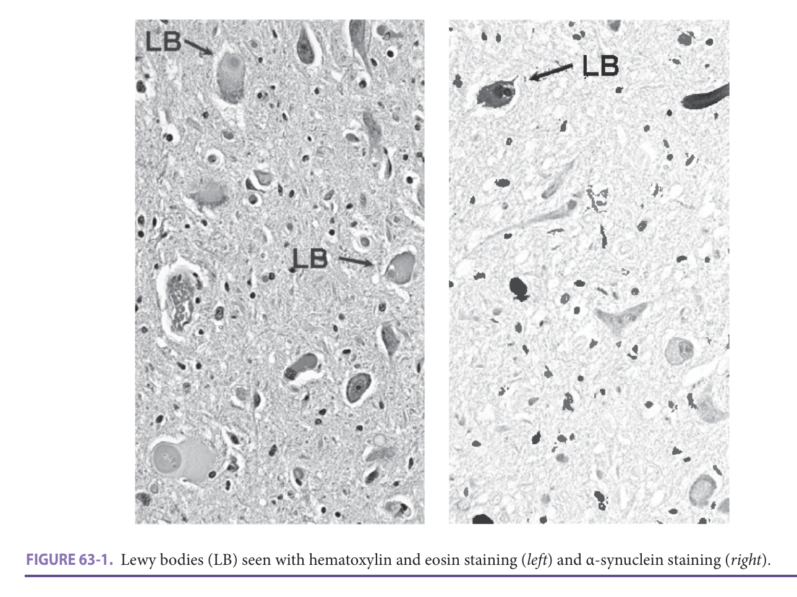
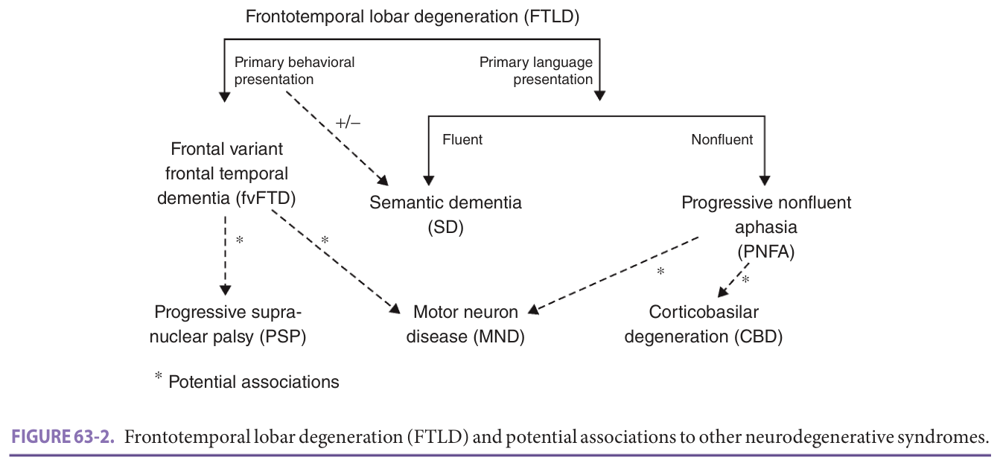
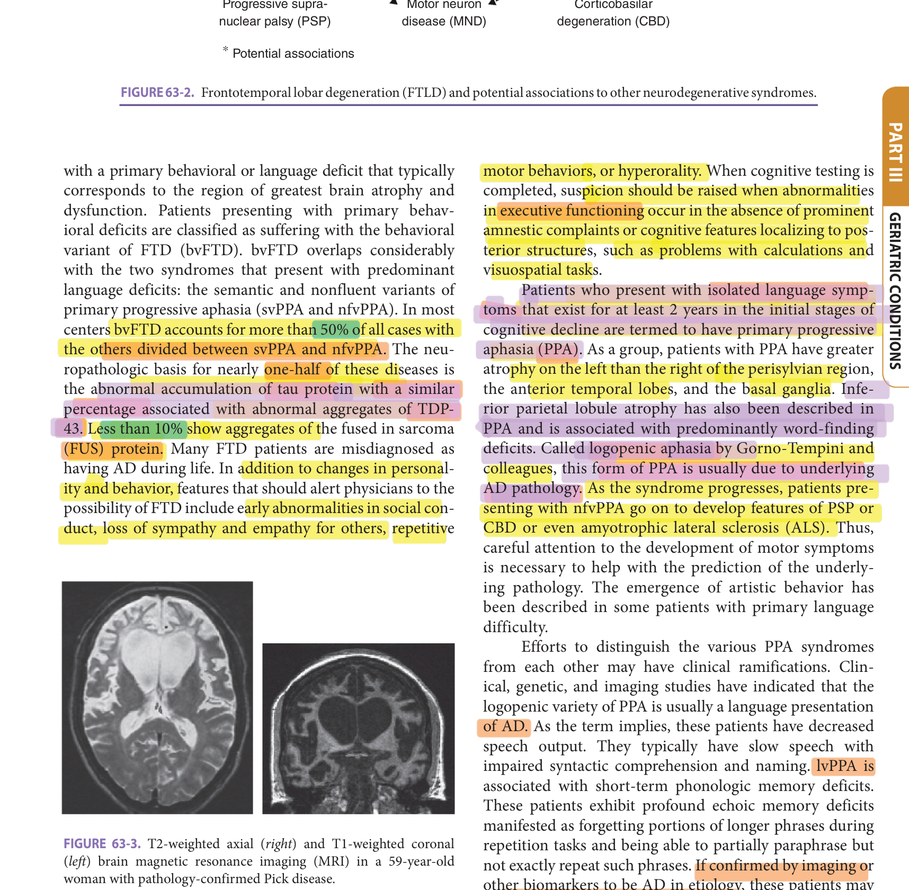
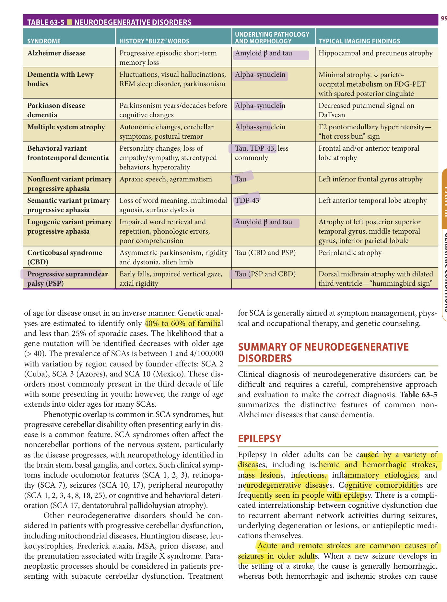

# Hazzard's Geriatric Medicine and Gerontology, 8e — Chapter 63: Other Neurodegenerative Disorders

John Best, Howie Rosen, Victor Valcour, Bruce Miller

> **Lane-reviewed against the book, 25 Sep 2026.**

**[p. 981]**

#### Learning Objectives

- Learn about the epidemiology, common clinical presentations, diagnosis, and treatment of non-Alzheimer type of neurodegenerative diseases.
- Gain new knowledge about recent discoveries related to the genetics, pathology, and pathobiology of common tau- and α-synucleopathies in older adults.
- Learn about the specific behavioral and nonbehavioral symptoms, clinical signs, diagnostic criteria, and common neuroimaging, genetic, and laboratory tests used to diagnose non-Alzheimer types of dementia.
- Understand the scientific rationale, indications, and limitations of currently available and emerging therapies for common non-Alzheimer type neurodegenerative diseases.

#### Key Clinical Points

1. The evaluation of neurodegenerative disorders includes careful attention to the cognitive, behavioral, and motor symptoms along with a thorough neurologic examination.
2. In older age, it becomes increasingly common for there to be more than one type of pathology causing a dementia syndrome.
3. The characteristic features of Lewy body dementia include cognitive impairments with profound fluctuation, spontaneous parkinsonism, rapid eye movement (REM) behavior sleep disorder, and visual hallucinations.
4. About 30% of patients with Parkinson disease develop dementia. In these patients, unlike Alzheimer disease (AD), the motor and other symptoms of Parkinson disease generally predate dementia by many years.
5. The dominance of behavioral and personality changes in the absence of memory and perceptual symptoms is highly suggestive of the behavioral variant of frontotemporal dementia (FTD).
6. History of falls and dysphagia with abnormalities in vertical gaze and preserved oculocephalic reflex is suggestive of a diagnosis of progressive supranuclear palsy (PSP).

Alzheimer disease (AD) is the most common neurodegenerative disorder encountered by the practicing geriatrician; however, a sizable number of other neurodegenerative diseases will be seen in a typical practice, rendering a working knowledge of these disorders critical for clinicians. Furthermore, there is increasing evidence that with greater age, many individuals die with mixed pathology—with AD, vascular changes, frontotemporal lobar degeneration (FTLD), and Lewy body changes often seen in a single brain. This chapter provides an overview of the more common neurodegenerative disorders with emphasis on those that influence behavior and cognition early in the course. We begin by reviewing the clinical approach to neurodegenerative cognitive disorders and then review the clinical presentation, epidemiology, and examination findings of the more common neurodegenerative syndromes. We attempt to link clinical presentation to anatomy and neuropathology whenever possible.

## Approach To The Evaluation Of Cognitive And Behavioral Disorders In Adults

The evaluation of neurodegenerative disorders is multifaceted, requiring careful attention to the cognitive, behavioral, and motor history combined with a comprehensive neurologic examination aiming to identify the brain regions involved. Isolating anatomy in patients who present with slowly progressive neurodegenerative disorders greatly facilitates the determination of the correct diagnosis.

Emphasis should be placed on the earliest presenting symptoms, whether cognitive, behavioral, or motor in origin. These early features may be critical to the identification of the pathologic substrate. As diseases progress, signs and symptoms merge between the different disorders, making diagnosis more difficult. An early history of repeated falls, for example, should warrant concern for progressive supranuclear palsy (PSP), vascular dementia, or Parkinson disease. This finding is valuable when it is present early in the illness, although most dementias are associated with basal ganglia involvement later in their disease course, diminishing the value of falls for diagnosis in the later stages. Likewise, inappropriate behavior and disinhibition **[p. 982]** are commonly seen in patients with advanced dementia syndromes, regardless of disease etiology; however, when these findings are a prominent presenting feature in the relative absence of amnestic symptoms, frontotemporal dementia (FTD) should be considered more likely.

Cognitive histories should be comprehensive and must include evaluation of memory, language, visuospatial function, executive functioning, behavior, and attention ( **Table 63-1** ). The comprehensive history should probe for autonomic symptoms and sleep patterns, with emphasis on symptoms associated with disorders of REM sleep behavior and sleep apneas.

The assessment of behavioral symptoms can be particularly helpful and sometimes critical in non-Alzheimer neurodegenerative disorders. Behavioral variant frontotemporal dementia (bvFTD) is the most common cause of dementia in patients younger than age 60. Behavioral symptoms or personality change are commonly the presenting symptoms of this disorder (see discussion later in this chapter). Recent research criteria for bvFTD require three of the following six symptoms to meet “possible” criteria: early disinhibition, early apathy, early loss of sympathy or empathy for others, early repetitive motor behaviors, early hyperorality, and deficits in frontal executive function with relative sparing of visuospatial abilities. For probable bvFTD, in addition to meeting the “possible” criteria just listed, frontotemporal atrophy or the presence of a known causative mutation is required. The emergence of predominant behavior and personality changes in the absence of episodic memory and perceptual complaints localizes disease to the frontal or anterior temporal lobes, although presence of memory loss does not rule out bvFTD.

**Table 63-1 — Assessment of major cognitive domains in neurodegenerative disorders**

- *Memory*: repetitive statements, misplacing items, missed appointment or medications, recalling recent/remote events
- *Language*: speech fluency, comprehension, reading, writing, articulation, word-finding, content of speech, output, spelling
- *Visuospatial*: getting lost, driving, object perception, completing household repairs, parking
- *Executive*: planning, flexibility/rigidity in thinking, organization, multistep tasks
- *Motor*: gait, falls, tremor, dysphagia, weakness, handwriting, coordination
- *Autonomic*: light-headedness, bowel/bladder function, impotence, hypotension

The neurologic examination is a critical component to the assessment of neurodegenerative disorders and typically confirms the clinical impression obtained from the history. The motor examination identifies both pyramidal and extrapyramidal signs as well as features characteristic of FTD, dementia with Lewy bodies (DLB), corticobasal degeneration (CBD), and PSP. Examination of cranial nerves includes an assessment of eye movements and range of gaze. Abnormalities in vertical gaze, either reduced amplitude or complete palsy, with a preserved oculocephalic reflex are a characteristic finding in PSP. Horizontal gaze abnormalities are more typical of CBD. Abnormalities in saccadic eye movements can be seen in several neurodegenerative disorders ranging from AD to PSP. Saccadic movements are tested by asking the patient to focus on an object in front of them (such as a pen tip held by the examiner) then to quickly refocus on an item in their peripheral field (such as the examiner’s finger) while the examiner watches carefully for saccadic latency (delay in initiation of movement), incomplete saccades (gaze palsy), and interrupted or jerky saccadic movement. Saccades should be tested in all four directions. The examiner should test ocular pursuit by having the patient track an object, such as the examiner’s finger, in both horizontal and vertical directions.

The examination should probe for changes in cognition, behavior, and movement with emphasis upon the earliest abnormalities. It is important to realize that early symptoms reflect where the illness began, and this is usually helpful in the determination of disease etiology. Confirmatory imaging and laboratory work and standard laboratory tests to exclude treatable etiologies of cognitive impairment can then be completed ( **Table 63-2** ).

**Table 63-2 — Some laboratory tests commonly used in the evaluation of cognitive disorders**

- Chemistries, including liver function tests and renal function tests
- Complete blood count
- Vitamin B12
- Homocysteine
- Methylmalonic acid
- Syphilis serology
- HIV
- Thyroid function

**[p. 983]**

## Disorders Associated With α-Synuclein Deposition

### Dementia With Lewy Bodies

The precise role of α-synuclein in health and disease is not fully understood. High concentrations of α-synuclein in synaptic regions suggest a role in synaptic plasticity. In DLB, α-synuclein accumulates with the brain stem, basal ganglia, and cortex, resulting in a progressive neurodegenerative cognitive, behavioral, and motor disorder. The prevalence of DLB is still uncertain, and the coassociation of Lewy body and AD pathology is extremely common in aging dementia populations. Indeed, even with classical AD associated with apolipoprotein E4 genotype, more than 50% of subjects show Lewy bodies, and genetic disorders that predispose to Lewy bodies often show the coassociation of Aβ-42. Based on autopsy studies, DLB, especially cooccurring DLB and AD, is often underdiagnosed during life.

The reported mean onset of disease is 75 years with a range from 50 to 80 years, and there is a slight predominance of DLB in men compared to women. The clinical and pathologic overlap between DLB and AD and with Parkinson disease dementia (PDD) is well recognized, resulting in some diagnostic challenges. Accurate diagnosis has clinical implications, as patients with DLB compared to AD tend to have a robust response to cholinesterase inhibitors, and patients with DLB often have sensitivity to neuroleptic medications.

The core features of DLB are cognitive impairment with profound fluctuations in attention and cognition, spontaneous parkinsonism, REM behavior sleep disorder (the physical enactment of dreams), and recurrent well-formed visual hallucinations. The typical neuropsychological profile differs somewhat from that of AD. DLB often involves early executive dysfunction and, when present, more severe visuospatial dysfunction. In DLB there is typically better performance on episodic memory tasks, and recognition memory when compared to AD patients. Invariably, memory becomes impaired over time in both disorders. Combined cortical and subcortical deficits are common, and deficits in attention are a core feature of the disease.

The degree of cognitive fluctuation can be so profound as to affect Mini Mental State Examination (MMSE) scores up to 50% from day-to-day, and many patients repeatedly move in and out of delirium. Unfortunately, eliciting a history of fluctuation can be difficult, and this symptom may not be well described by caregivers. Clinicians should consider several different approaches, including questions focused on marked alteration in attention, staring spells, daytime sleepiness, and episodes of incoherent speech. On occasion, the fluctuation can be so severe as to result in emergency room evaluation for a transient ischemic attack (TIA) or delirium. Several structured scales exist to assist in assessment of fluctuation, including the One Day Fluctuation Assessment Scale and the Clinical Assessment of Fluctuation.

A common feature of neurodegenerative disorders with α-synuclein pathology is REM sleep behavior disorder (RBD), defined as vivid and often frightening dreams that are frequently acted out verbally or motorically. RBD occurs in 85% of DLB cases, compared to 15% of Parkinson disease patients and 60% of patients with multiple system atrophy (MSA). It is uncommon in other forms of dementia where α-synuclein pathology is absent. In the DLB diagnostic criteria, RBD is considered a core feature. Autonomic dysfunction is also common and can be profound with repeat syncope and unexplained loss of consciousness. When REM behavior occurs in association with severe autonomic symptoms, MSA rather than DLB should also be considered. Significant depressive symptoms occur in up to 40% of cases and can often precede other symptoms by years.

About two-thirds of DLB cases will exhibit visual hallucinations, misperceptions or, less frequently, delusional misidentification. When delusional misidentification, such as mistaking the spouse, friend, or relative as an impostor, occurs as the first symptom of a dementia, DLB is highly likely. The visual hallucinations of DLB can be vivid with distinct colors and the inclusion of human figures and animals. In contrast to the hallucinations sometimes seen with more advanced AD, visual hallucinations occur early in DLB. In one pathology-based study, visual hallucinations corresponded to a greater number of Lewy bodies in the anterior/inferior temporal lobes and to larger deficits in acetylcholine. Visual hallucinations often respond to boosting brain acetylcholine with cholinesterase inhibitors.

Spontaneous parkinsonism is a hallmark feature of DLB, eventually occurring in up to 70% of cases. Common findings include bradykinesia, axial and appendicular rigidity, postural instability, slowed response times, and hypomimia. In contrast to Parkinson disease, the parkinsonism of DLB is more commonly bilateral and less frequently includes tremor. Parkinsonism rarely occurs in isolation as an early finding in DLB although early features of the cognitive syndrome are commonly overlooked. Response to levodopa treatment is less frequent than the response seen in Parkinson disease; however, efficacy data may be biased. Clinicians are more likely to avoid such drugs in DLB patients for fear of adverse effects such as orthostasis or aggravations of hallucinations.

Parkinsonism contributes substantially to the disability in DLB and alters the clinical course. Mean survival among postmortem confirmed cases of DLB is 10 years, with a rate of disability at approximately 10% per year, often exceeding that of Parkinson disease. Cases of rapid progression to death in 1 to 2 years have been described. Risk factors for higher mortality include older age, hallucinations, greater degrees of fluctuation, and neuroleptic sensitivity.

Diagnostic criteria for DLB assist in identification of disease and are particularly useful for research purposes **[p. 984]** ( **Table 63-3** ). In the revised schema, core features include prominent fluctuation, recurrent visual hallucinations, RBD, and spontaneous features of parkinsonism such as rigidity, bradykinesia, and hypomimia. Supportive and suggestive features are also defined. To meet diagnostic criteria for probable disease, two core features or the combination of one core feature and one supportive feature are required. If one core feature without any suggestive features, or suggestive features are present in the absence of any core features, the term “possible DLB” is used.

**Table 63-3 — McKeith criteria for DLBa**

- *Central features*: Progressive cognitive decline with functional impairment; Prominent memory impairment may not occur early but is usually evident with progression; Deficits in attention, executive functioning, and visuospatial ability may be prominent early
- *Core features*: Fluctuating cognition with prominent variations in attention and alertness; Recurrent visual hallucinations; Spontaneous parkinsonism
- *Suggestive features*: REM sleep behavior disorder; Neuroleptic sensitivity; Low dopamine transporter uptake in the basal ganglia (SPECT, PET)
- *Supportive features*: Repeated falls; Transient, unexplained loss of consciousness; Severe autonomic dysfunction; Systematized delusions; Depression; Hallucinations in nonvisual modalities; Relative preservation of medial temporal lobe structures on CT/MRI; Generalized low uptake on SPECT/PET with reduced occipital activity; Abnormal MIBG scintigraphy; Prominent slow wave activity on EEG with temporal lobe transient sharp waves

aProbable DLB requires two core features or one core feature and at least one suggestive feature. Possible DLB requires one or more suggestive features. Probable DLB should not be based on suggestive features alone.

CT, computed tomography; DLB, dementia with Lewy bodies; EEG, electroencephalogram; MIBG, metaiodobenzylguanidine scintigraphy; MRI, magnetic resonance imaging; PET, positron emission tomography; SPECT, single-photon emission computed tomography.

_Data from McKeith IG, Dickson DW, Lowe J, et al. Diagnosis and management of dementia with Lewy bodies: third report of the DLB Consortium. Neurology. 2005;65(12):1863–1872._

The pathologic hallmark of DLB is the presence of neuronal spherical intracytoplasmic inclusions of α-synuclein, termed Lewy bodies ( **Figure 63-1** ). The Lewy bodies seen in DLB are very similar in appearance to those that are seen in Parkinson disease; however, in DLB, the distribution extends beyond the substantia nigra and locus coeruleus to involve the neocortex and limbic system. Cortical Lewy bodies lack the typical dense core with pale halo appearance that is seen in Parkinson disease. Other intraneuronal aggregates of α-synuclein (Lewy neurites), cortical senile plaques, and sparse tau pathology are all described in DLB. As described above, AD copathology is frequently encountered.

Currently, imaging studies do not add substantially to differentiating DLB from other neurodegenerative disorders and are only included as supportive features in diagnostic criteria. Structural magnetic resonance imaging (MRI) often identifies less atrophy of the medial temporal lobes in cohorts of DLB compared to AD and variably identifies greater atrophy in the basal ganglia structures and the dorsal midbrain. In group studies, single-photon emission computed tomography (SPECT) with99m Tc-hexamethylpropyleneamine oxime (HMPAO) tends to show decreased regional cortical brain activity in parietal-occipital regions of DLB compared to AD patients. This is relative sparing of the posterior cingulate cortical perfusion in DLB compared to the occipital cortex, a highly specific finding called the cingulate island sign. DLB patients exhibit decreased dopamine transport in the putamen and caudate by dopaminergic SPECT and decreased postganglionic sympathetic cardiac innervation by I-metaiodobenzyl guanindine (MIBG) SPECT imaging. The modest performance characteristics of these tests limits their clinical utility.

The clinical course of DLB is often faster than that seen in AD and a drop of four to five points on MMSE per year is common (in contrast to three points per year, which is typical for AD). Patients with DLB should be tried on cholinesterase inhibitors. Often this results in responses that exceed those seen in AD, including frequent reduction or elimination of hallucinations. Social stimulation and physical exercise to maximize balance and strength should be recommended. Symptomatic treatment with levodopa can be used, if indicated, for parkinsonian symptoms once fluctuation and visual hallucinations are stabilized with a cholinesterase inhibitor. Patients should be advised to avoid anticholinergic medications, including many common over-the-counter cold remedies. RBD, if severe, can be treated with melatonin or clonazepam. Atypical neuroleptic medications should be cautiously considered only if intolerable behavioral disturbances emerge.

### Parkinson Disease Dementia

The temporal relationship between the onset of dementia and the development of parkinsonism is the primary clinical feature distinguishing DLB from PDD. In PDD, cognitive deterioration occurs in well-established Parkinson disease, typically years to decades after motor systems are identified. In contrast, research criteria for DLB require cognitive symptoms that predate parkinsonism by 12 months; although this “1-year rule” is often difficult to **[p. 985]** apply in the clinical setting. This temporal distinction is arbitrary, and many believe that the two disorders represent different points in the spectrum of the same disease, and abnormalities in α-synuclein accumulation underlie both disorders.

> *FIGURE 63-1. Lewy bodies (LB) seen with hematoxylin and eosin staining ( _left_ ) and α-synuclein staining ( _right_ ).*

> Highlighting is the owner's annotation, not the book's.

Approximately one-third of older Parkinson disease patients will develop sufficient cognitive symptoms during the course of their illness to impair function. Indeed, the diagnosis of Parkinson disease puts a patient at high risk for mild cognitive impairment (MCI) and then PDD following in many patients. In pure PDD, the prominent findings include motor and psychomotor slowing, decreased response times, and alterations in concentration and attention. The recognition that medications used to treat Parkinson disease can affect cognition and the understanding that, because of age, a substantial number of Parkinson patients will develop concurrent AD result in a scenario where cognitive symptoms in this population can be multifactorial. Possible predictors for dementia in Parkinson disease include older age at onset of motor symptoms, bradykinesia, nontremor prominent Parkinson disease, bilateral onset of motor signs, and declining response to levodopa. Depression and visual hallucinations may increase the risk as well. Patients with DLB typically exhibit a faster clinical decline than do patients with PDD.

### Multiple System Atrophy

MSA is a sporadic disease marked by degeneration of multiple neurologic systems and resulting in relentlessly progressive clinical course. Death typically occurs within 6 to 10 years with an estimated 10-year survival of 40%. Relatively infrequent, the incidence is estimated to be 0.6/100,000 person-years or between 1.86 and 4.9/100,000 population. The incidence increases to 6/100,000 person-years among patients older than 50 years. The mean age of onset is 54. While currently speculated to have a combination of environmental and genetic predispositions, neither has been definitively established. Epidemiologic studies suggest a potential risk associated with exposure to pesticides. MSA is about three times more frequent in men than women and limited epidemiologic data suggest that it may be less frequent among smokers.

The term MSA was first used in 1969 and encompasses diseases previously labeled as striatonigral degeneration (now termed MSA-P for parkinsonism), Shy-Drager syndrome, and olivopontocerebellar degeneration (now termed MSA-C for cerebellar). The MSA subtypes are indicative of the predominant neurologic component involved. Patients with prominent orthostatic features tend to have decreased survival compared to other subtypes. Several derivations of diagnostic consensus statements exist with mixed sensitivity.

The presenting symptoms of MSA are variable and include cerebellar findings, autonomic failure, pyramidal findings, and parkinsonism. Parkinsonism (MSA-P) is prominent in most cases (80%) with cerebellar symptoms (MSA-C) more prominent in about 20% of cases. The more common presenting parkinsonian features are **[p. 986]** akinesia, rigidity, and postural (rather than resting) tremor. Autonomic symptoms precede motor symptoms in most cases. Gait instability is common but falls occur less frequently in early stages than in PSP. In early stages, MSA can mimic Parkinson disease but more symptoms evolve within 5 years. Gait ataxia, limb kinetic ataxia, and dysarthria are the more frequent presenting symptoms in patients with cerebellar-dominant MSA. The dysarthria caused by cerebellar dysfunction has a characteristic appearance of jerky, intermittently explosive, and slurred output often associated with poor separation of syllables.

Autonomic symptoms include orthostasis, erectile dysfunction, constipation, and urinary incontinence. While orthostasis is common, syncope occurs infrequently. Diagnostic criteria for the orthostatic component of MSA require a 30 mm Hg drop in systolic blood pressure; although in practice, a 20 mm Hg drop in systolic blood pressure or 10 mm Hg drop in diastolic blood pressure is thought to be significant in the absence of appropriate increased heart rate. Occurrence of symptoms suggestive of MSA in an individual younger than 30 years or in an individual with a family history of similar disease should raise suspicion for alternative diagnoses.

Most MSA patients complain of sleep problems, commonly sleep fragmentation (53%), early waking (33%), and insomnia (20%). As with other synucleinopathies, RBD is common, occurring in up to 60% of MSA patients. Nocturnal stridor and obstructive sleep apnea are also frequent in MSA. Stridor is associated with decreased survival and risk of sudden death.

Historically, MSA was characterized as a primary movement disorder without significant cognitive impairment. The current consensus criteria for MSA considered dementia as a nonsupporting feature. There is emerging evidence of higher prevalence of variable cognitive impairment, typically later in the clinical course. The pattern of cognitive impairment is most commonly frontal-executive dysfunction, likely secondary to deafferentation of frontostriatal neural pathways. Disruption of cerebellocortical circuitry in MSA-C can also lead to impaired attention, visuospatial function, and affect regulation.

Brain MRI changes occur in some patients but lack sensitivity and specificity for definitive diagnosis. These findings include hypointensity and atrophy of the putamen on T2-weighted images with a slit-like marginal hypointensity just lateral to the putamen on axial images. A characteristic “hot cross bun” sign has been described in the pons and middle cerebral peduncles thought to be caused by degenerative changes in pontocerebellar fibers. This finding lacks sensitivity and is sometimes seen in Parkinson disease, limiting specificity. Atrophy of the brain stem, middle cerebellar peduncles, and cerebellum may also be seen. Volumetric analyses of the striatum and brain stem, where atrophy is very severe in MSA but not in simple Parkinson disease, demonstrate some promise in discriminating these two disorders. Electromyography (EMG) abnormalities at the anal sphincter can be seen in MSA, although the clinical utility for distinguishing MSA from Parkinson disease in early stages of disease has not been established.

The hallmark pathology of MSA is cell loss, gliosis, and glial inclusions in multiple neurologic systems including the spinal cord and cortex. Prominent abnormalities are also seen in the basal ganglia, substantia nigra, and olivopontocerebellar pathways, as suggested by the terminology, with anatomy reflecting symptoms. On gross inspection, the putamen is shrunken and displays a green-gray discoloration that can appear cribriform when disease is severe. As with DLB and Parkinson disease, there is an accumulation of α-synuclein as half-moon–, oval-, or conical-shaped argyrophilic glial cytoplasmic inclusions.

Treatment is generally symptomatic with about one-third of patients responding to levodopa in the early stages of the disease. Patients should be encouraged to sleep in a lateral decubitus rather than supine position to minimize airway obstruction. Use of positive airway pressure devices should be considered. Invasive means of controlling stridor and apneas have included tracheotomy but should be approached cautiously within the full context of ethical and quality-of-life considerations. RBD may respond to melatonin or low-dose clonazepam at night. Labile blood pressures may develop and should raise concern when symptomatic. Avoiding alcohol, heavy meals, or straining at micturition and defecation is recommended. Elastic stockings and elevating the head of the bed may provide some relief. Pharmacologic approaches designed to increase sympathetic tone (midodrine) or volume expansion (fludrocortisone) may be required. Patients with MSA-C tend to maintain function for a longer time than those with MSA-P.

## Neurodegenerative Disorders Associated With Tau, TDP-43, Or FUS Pathology

### Frontotemporal Lobar Degeneration Syndromes

FTLD is the term used to capture a neuropathologically linked group of non-AD dementing conditions associated with frontotemporal and basal ganglia pathology. FTD subsumes three clinical syndromes, bvFTD, semantic variant primary progressive aphasia (svPPA), and nonfluent variant primary progressive aphasia (nfvPPA). Recent evidence indicates that FTLD is closely related to several other neurodegenerative disorders: CBD, PSP, and motor neuron disease ( **Figure 63-2** ).

The core anatomic feature of FTLD is the focal, often asymmetric cortical degeneration of frontal and anterior temporal regions with general sparing of posterior cortical structures. The resultant brain atrophy can be severe, sometimes described as “knife-edge,” and the brain can weigh as little as 750 g at autopsy ( **Figure 63-3** ). Patients present **[p. 987]** with a primary behavioral or language deficit that typically corresponds to the region of greatest brain atrophy and dysfunction. Patients presenting with primary behavioral deficits are classified as suffering with the behavioral variant of FTD (bvFTD). bvFTD overlaps considerably with the two syndromes that present with predominant language deficits: the semantic and nonfluent variants of primary progressive aphasia (svPPA and nfvPPA). In most centers bvFTD accounts for more than 50% of all cases with the others divided between svPPA and nfvPPA. The neuropathologic basis for nearly one-half of these diseases is the abnormal accumulation of tau protein with a similar percentage associated with abnormal aggregates of TDP-43. Less than 10% show aggregates of the fused in sarcoma (FUS) protein. Many FTD patients are misdiagnosed as having AD during life. In addition to changes in personality and behavior, features that should alert physicians to the possibility of FTD include early abnormalities in social conduct, loss of sympathy and empathy for others, repetitive motor behaviors, or hyperorality. When cognitive testing is completed, suspicion should be raised when abnormalities in executive functioning occur in the absence of prominent amnestic complaints or cognitive features localizing to posterior structures, such as problems with calculations and visuospatial tasks.

> *FIGURE 63-2. Frontotemporal lobar degeneration (FTLD) and potential associations to other neurodegenerative syndromes.*

> Highlighting is the owner's annotation, not the book's.

> *FIGURE 63-3. T2-weighted axial ( _right_ ) and T1-weighted coronal ( _left_ ) brain magnetic resonance imaging (MRI) in a 59-year-old woman with pathology-confirmed Pick disease.*

> Highlighting is the owner's annotation, not the book's.

Patients who present with isolated language symptoms that exist for at least 2 years in the initial stages of cognitive decline are termed to have primary progressive aphasia (PPA). As a group, patients with PPA have greater atrophy on the left than the right of the perisylvian region, the anterior temporal lobes, and the basal ganglia. Inferior parietal lobule atrophy has also been described in PPA and is associated with predominantly word-finding deficits. Called logopenic aphasia by Gorno-Tempini and colleagues, this form of PPA is usually due to underlying AD pathology. As the syndrome progresses, patients presenting with nfvPPA go on to develop features of PSP or CBD or even amyotrophic lateral sclerosis (ALS). Thus, careful attention to the development of motor symptoms is necessary to help with the prediction of the underlying pathology. The emergence of artistic behavior has been described in some patients with primary language difficulty.

Efforts to distinguish the various PPA syndromes from each other may have clinical ramifications. Clinical, genetic, and imaging studies have indicated that the logopenic variety of PPA is usually a language presentation of AD. As the term implies, these patients have decreased speech output. They typically have slow speech with impaired syntactic comprehension and naming. lvPPA is associated with short-term phonologic memory deficits. These patients exhibit profound echoic memory deficits manifested as forgetting portions of longer phrases during repetition tasks and being able to partially paraphrase but not exactly repeat such phrases. If confirmed by imaging or other biomarkers to be AD in etiology, these patients may **[p. 988]** be amenable to treatment with cholinesterase inhibitors or other emerging treatment strategies.

### Nonfluent Variant Primary Progressive Aphasia

Patients with nfvPPA typically have apraxic, labored speech with errors in grammar, and difficulty with more complex syntax. Speech apraxia is the inability to produce speech caused by difficulty in programming the sensorimotor commands for the positioning and movement of muscles used to produce speech. This leads to difficulty with initiation of speech, sound substitutions, omissions, transpositions of syllables, and a slower rate of expressing sentences punctuated with inappropriate starts and stops. Patients may sound as if they are stuttering or having trouble enunciating, or otherwise mispronouncing words. The distortions can include sounds not present in their native language and the errors produced in apraxic speech are typically inconsistent. The problems are usually worse for multisyllabic words. Speech apraxia is localized to the left opercular and anterior insular region.

Anomia is variably present and phonemic paraphasias are frequently observed. Speech output is decreased and dropped words, often articles such as “the,” occur. In patients with nfvPPA, sentences tend to have more nouns than verbs. In contrast to patients with svPPA, these patients maintain single word comprehension and semantic knowledge. Thus, nfvPPA is not likely in a patient who has preserved articulation, preserved grammar, and deficits in semantic knowledge. Insight into the condition can be exquisitely preserved with nfvPPA, and patients often develop depression. Other behavioral problems are uncommon in early stages of disease.

MRI studies of nfvPPA have revealed atrophy that is asymmetrically left-dominant with preferential involvement of the inferior frontal lobe, the insular region, and the caudate. Hypometabolism of the left frontal region can be observed on fluorodeoxyglucose positron emission tomography (FDG-PET). Most patients show tau pathology at autopsy with CBD being most common, followed by PSP and Pick changes. Approximately 20% show TDP pathology, usually TDP-43 type A.

### Semantic Variant Primary Progressive Aphasia

In contrast to patients with nfvPPA, patients with svPPA have fluent speech that is grammatically accurate, but they exhibit the hallmark loss of semantic knowledge. Semantic memory is the encyclopedic knowledge of people, objects, facts, and words. Unlike episodic memories, individuals are not aware of where or when they learned these facts. Eventually individuals with svPPA lose all knowledge about the fact or word and exhibit features of a multimodality agnosia. Therefore, even when they are provided with the name of the object, the object is not recognized. Early in the disease, patients are often aware of word-finding difficulties and can also be aware of comprehension difficulties (eg, acknowledging that they don’t recognize a word they should know). Semantic paraphasias are frequent, with supraordinate substitutions of words and common use of nonspecific grouping words such as “stuff” and “things.” Repetition and prosody are preserved, as are syntax and verb recognition.

Patients with svPPA display surface dyslexia manifest by difficulty pronouncing irregularly spelled words, such as “gnat,” “heir,” or “pint,” when pronunciation does not follow standard phonologic rules. On neuropsychological testing, patients with svPPA have difficulty with category fluency and confrontational naming, particularly with low-frequency words. More recently, a right hemispheric variant of svPPA has been described. These patients have difficulty naming and recognizing famous people and develop a number of behavioral symptoms similar to bvFTD. In contrast to AD, many svPPA patients have greater deficits for remote compared to recent memory, when memory deficits become involved.

Of all the PPA syndromes, svPPA has the greatest propensity to include behavioral problems, which are included as supportive evidence in diagnostic criteria. As with FTD, the behavioral issues seen with svPPA often involve hyperorality, disinhibition, and aberrant motor behavior. Diagnostic criteria include behaviors such as loss of sympathy and empathy, narrowed preoccupations, and parsimony (excessive frugality, stinginess). Rigidity in thinking can be striking. svPPA patients can develop compulsions and have been described to have visual hypervigilance, such as recognizing that a hair is subtly out of place on an examiner or quickly seeing a coin on the street. They may exhibit difficulty in the interpretation of emotions, particularly negative emotions such as sadness, anger, and fear. Emergence of behavioral symptoms correlates with duration of illness but can also be an early finding. The presence of early behavioral issues in a patient with a PPA syndrome should alert to the possibility of svPPA.

Anatomic studies may explain why svPPA patients often exhibit behavioral abnormalities. The disorder begins in the amygdala and anterior temporal lobes. When it starts on the left side, language deficits predominate, while right-sided presentations are characterized by loss of empathy for others or deficits in the recognition of familiar people. These patients sometimes meet research criteria for bvFTD while others are more typical of svPPA. While svPPA begins in the anterior left temporal lobe, it typically spreads anteriorly to involve the frontal regions. Eventually it spreads to the right medial frontal lobe, the right orbitofrontal lobes, and the right insular region, areas associated with behaviors such as disinhibition and apathy. The absence of behavioral problems in the logopenic variety of PPA and in nfvPPA is likely due to the general sparing of these same structures in those diseases.

Patients with svPPA often have TDP-43 type C–positive, tau-negative inclusions at autopsy. The etiology for svPPA and for TDP type C aggregates is unknown. Rarely are these cases familial. Recent work suggests that a **[p. 989]** significant subset of these patients have a history of autoimmunity and increased levels of tumor necrosis factor (TNF) in the serum.

### Behavioral Variant Frontotemporal Dementia

bvFTD presents with the insidious onset of change in personality and inappropriate behaviors. The mean age of onset is in the mid-fifties. Most commonly, symptoms include disinhibition, poor impulse control, loss of sympathy or empathy for others, overeating, compulsive behaviors, and deficits in executive control or multitasking ( **Table 63-4** ). Patients can develop stereotyped behaviors, defined as repetitive, invariant behaviors that lack purpose. Examples include counting, pacing, organizing, or the repetitive use of catch phrases. Socially inappropriate activities can include shoplifting and other criminal behavior, public urination, offensive speech, and public masturbation. Perseveration is common. Cravings for sweets are often observed. When associated with the decreased sense of satiety that can occur, large, unhealthy weight gain results. Hyperorality and oral exploratory behavior, similar to human Klüver-Bucy syndrome, can occur.

Patients with bvFTD are often misdiagnosed as having psychiatric illness. In other instances, any patient with an atypical dementia syndrome is considered to have bvFTD. Delusions can occur, often with bizarre or grandiose overtones. Patients exhibit lack of empathy and can have a cold, blunted effect. When the anterior cingulate and medial frontal lobes are involved, apathy can be particularly prominent, and some degree of apathy, especially in later stages, is almost universal. Some patients undergo large changes in their beliefs and attitudes, including religious sentiments. In contrast to AD, depression is uncommon in bvFTD.

**Table 63-4 — Symptoms in behavioral variant of frontotemporal dementia**

- Antisocial behavior
- Apathy
- Change in beliefs (hyperreligiosity, change in attitude)
- Cravings (sweets, weight gain)
- Criminal behavior (theft, assault, public urination)
- Delusions
- Disinhibition
- Euphoria (inappropriate jocularity)
- Hyperorality (oral exploratory behavior in late disease)
- Hypersexuality (offensive statements, masturbation)
- Impotence and decreased sexual drive
- Impulsivity
- Loss of empathy (coldness, self-centered)
- Obsessive-compulsive behavior
- Perseverative behavior
- Poor insight
- Stereotyped behavior (counting, pacing, repetitive use of catch phrases)

Neuropsychological testing demonstrates abnormalities in executive functioning, working memory, and social cognition with general sparing of visuospatial skills and verbal memory. Consequently, the MMSE score can be quite high even among patients with marked functional disability. BvFTD patients also display problems with set-shifting, concept formation, and abstract reasoning. They may demonstrate disinhibition, impulsivity, and poor judgment during testing. These behaviors can falsely lower verbal memory scores. When closely scrutinized, poor scores on such tests are accompanied by frequent intrusions of novel words and endorsement words that were not part of the original list learned (false positives on recognition testing). Although poor performance on executive function tasks is a feature bvFTD, it may not be present in early cases and can also be a feature of AD and other dementias, even early in the course. Thus, executive function tests should not be considered mandatory for a diagnosis of bvFTD, and when present it should not be the main reason for making a diagnosis of bvFTD. Rather, it should only be used to support a diagnosis when other, behavioral features of bvFTD are present.

Behavioral symptoms are a common late finding in most dementia syndromes. Thus, the emergence of behavior and personality symptoms in a patient with well-established dementia should be looked upon with caution when considering a change in diagnosis to bvFTD. The importance of the first symptom (often the presenting symptom) in the evaluation of patients with neurodegenerative disorders cannot be overstated.

Patients with bvFTD will typically have profound, usually bilateral, frontal, anterior insular, and anterior temporal lobe atrophy. Patients with greater atrophy on the right frontal lobe than left have more severe behavioral symptoms. Stages of atrophy have been described with the earliest stage involving only mild atrophy of the orbital and superior medial frontal lobes and hippocampus. As the disease progresses, the anterior frontal and temporal cortices and basal ganglia are increasingly involved. The severity of atrophy increases as disease advances. William Seeley has demonstrated that in many instances, the first neurons afflicted in bvFTD are von Economo neurons that sit in the anterior insular and cingulate cortex. These neurons are a unique feature in the brains of humans, other primates, and a few other species of mammals. SPECT and FDG-PET techniques have been used to differentiate FTD from AD with PET receiving Food and Drug Administration (FDA) approval for this indication. Both SPECT and FDG-PET demonstrate bilateral frontal hypometabolism/ hypoperfusion in patients with FTD. Amyloid imaging is extremely valuable in separating AD from bvFTD, particularly in patients under the age 70 in whom the presence amyloid is not highly prevalent.

### Pick Disease

Pick disease is a pathologic diagnosis and occurs in approximately 20% of clinical cases presenting with signs and **[p. 990]** symptoms of bvFTD. Less commonly it presents as nfvPPA. First described in 1892 by a German neurologist, Arnold Pick, the pathologic hallmark of Pick disease is argyrophilic cellular inclusions known as Pick bodies and swollen achromatic tau-positive neurons termed Pick cells. This is invariably associated with loss of large pyramidal neurons, resulting in a spongiform histologic appearance with selective atrophy of the frontal and anterior temporal lobes. Pick bodies are localized to the limbic cortex, paralimbic cortex, and predominantly the ventral aspect of the temporal lobe. The pre- and postcentral gyri are notably spared. The largest concentration of Pick bodies is found in the hippocampus and amygdala. Pick bodies are composed of randomly arranged tau filaments. In AD, tau pathology (neurofibrillary tangles) can spare the dentate gyrus; however, in Pick disease, this region is heavily involved.

### Other FTLD Neuropathologies

FTLD is associated with tau pathology in about half of cases. The tau gene product has six isoforms, half of which result in three microtubule-binding repeats (3Rtau) and the other half result in four microtubule repeats (4Rtau). Pick disease is usually associated with 3Rtau. PSP and CBD, in contrast, are associated with 4Rtau. The clinical features and neuropathology of PSP and CBD are described later in this chapter.

Among FTLD cases that do not stain for tau protein, the histopathology will typically indicate a variable pattern of neuronal loss and gliosis with the presence of TAR DNA binding protein 43 (TDP-43) inclusions. TDP-43 neuropathology has been subdivided into four types, TDP-A to TDP-D, depending on the pattern of the TDP inclusions within the nucleus and cytoplasm. TDP type A is often associated with mutations in the progranulin gene, although sporadic cases have been seen. Type B is often associated with motor neuron disease, and the most common genetic mutation associated with familial FTD-ALS, _C9orf72_ , often shows type B changes. TDP-C is the pattern associated with svPPA, while type D is seen with the rare FTD-causing mutation in valosin.

### The Genetics Of FTD

Our understanding of the genetics of FTLD is evolving. In 1998 it was discovered that a mutation in the microtubule-associated protein tau ( _MAPT_ ) gene was responsible for a familial form of FTD associated with Parkinson disease (FTDP-17). This mutation appears to be more common in Southern Europe and France than in Northern Europe, and a few mutations have been reported in China and Japan. The disease onset with mutations is variable with several variants presenting in the third of fourth decade. Mean disease onset is approximately 52 years. The mechanism for disease pathogenesis with tau mutations appears to be variable. In some cases, a mutation in an intron adjacent to exon 10 leads to an excess of the 4R form of tau with abnormal aggregation of tau. In other mutations, abnormal microtubule-binding or excessive formation of oligomers appears to be the mechanism for neurodegeneration.

A mutation in the progranulin ( _GRN_ ) gene (only 1.7 Mb away from the tau gene) was identified in 2006. This mutation appears to account for up to 11% of sporadic and 25% of familial FTD cases. Disease onset tends to be later than with tau, and approximately 10% of mutation carriers remain asymptomatic after age 70. There are mutations that modify progranulin expression that may be partially responsible for this clinical variability. The onset of disease can range from 35 to 80 years. The phenotype is more variable than with _MAPT_ mutations, and syndromes vary from bvFTD, nfvPPA, CBD, and Parkinson disease to AD. Asymmetry is common, sometimes with one hemisphere being massively atrophic and the other relatively normal. The pathophysiologic mechanisms associated with _GRN_ mutations are also debated; loss of neuronal growth attributed to low levels of the progranulin protein, excessive inflammation associated with low progranulin levels, and a relative increase in the granulin proteins cleaved from progranulin are all possible. All these hypothesized mechanisms probably contribute to illness. Autoimmunity is seen in more than 10% of mutation carriers and can precede neurologic disease.

In 2011 a mutation in the _C9orf72_ gene was discovered as the major cause for familial forms of FTD, ALS, and FTD-ALS. A large expansion of a hexanucleotide repeat in the intron of C9 leads to overproduction of RNA and the production of dipeptides generated from the RNA in a non-ATG manner. The clinical onset is typically in the sixth decade but patients in the fourth and eighth decades have been described. The illness can begin as a psychiatric illness with highly variable symptoms ranging from borderline personality disorder, bipolar illness, depression, and conversion disorder to drug addiction. Similarly, whether a mutation carrier is diagnosed with bvFTD or ALS is also variable, and in some instances, both syndromes emerge together. The mechanism for disease may reflect Rna-mediated neurodegeneration caused by large nuclear RNA aggregates that interfere with nuclear functions, the toxic effects of dipeptides, and possibly gene haploinsufficiency.

Other isolated cases of FTLD-related mutations have been described, including in the valosin-containing protein gene ( _VCP_ ), and charged multivesicular body protein 2B ( _CHMP 2B_ ) genes. Patients with the _VCP_ mutation develop a rare disease with inclusion body myopathy, early Paget’s disease of bone, and FTD (IBM-PDB-FTD). Additionally, predominantly ALS but sometimes bvFTD phenotypes can occur with mutations in the TDP-43 and FUS proteins. The list of mutations continues to grow, but thus far most of the more recently discovered mutations account for a small proportion of mutation related FTLD.

### Treatment Of FTLD

Treatment approaches for FTD and related disorders are generally aimed at symptom management, as there are **[p. 991]** not yet any effective disease-modifying therapies. Selective serotonin reuptake inhibitor (SSRI) medications may be beneficial for behavioral symptoms, including carbohydrate craving and compulsions. If delusions are problematic, atypical neuroleptics can be considered. There is no theoretical basis for the use of cholinesterase inhibitors, which can aggravate agitation. Attention to caregiver issues is important as the stressors often differ from those seen in typical AD and can be particularly burdensome. The different social and behavioral issues presented to FTLD compared to AD caregivers and the younger age of both patients and caregivers in FTLD can lead caregivers to feel isolated in support groups focused on typical AD.

Disease-modifying approaches are being investigated. Tau-lowering strategies are emerging for tau forms of FTD including tau mutations, Pick disease, PSP, and CBD. Monoclonal antibodies that target tau appear to show efficacy in animal models and have potential to diminish the brain’s tau burden. Several other approaches are being investigated that could be effective for treatment of FTLD associated with TDP-43 inclusions, including sporadic and mutation-related disease.

## Amyotrophic Lateral Sclerosis (LOU Gehrig Disease)

ALS was first identified in 1869 by the French neurologist, Jean-Martin Charcot who described a progressive neurodegenerative disease with mixed upper and lower motor neuron signs. The disease’s name is derived from myelin pallor identified in the lateral aspects of the spinal cord representing axonal degeneration from upper motor neurons as they descend to the limbs. In the United States, the disease is best known as Lou Gehrig disease, named after the famous baseball player who died of the disease in 1941. It occurs with an incidence of approximately 1 to 2/100,000 patients each year with a nearly 2:1 male-to-female predominance. About 5000 people develop ALS annually. As with FTLD, peak incidence occurs in midlife; however, disease can be seen in advancing ages.

Patients with ALS typically present with complaints of weakness in one or more limbs, resulting in unexplained tripping or dropping of items. Clumsy fine finger movements lead to difficulty with tasks such as buttoning clothes or writing. Patients often complain of cramping. Bulbar symptoms such as speech slurring, difficulties with swallowing, and hoarseness occur in many patients. Bulbar symptoms are presenting symptoms in about 25% of cases and more commonly occur in older patients. Patients may complain of difficulty chewing or swallowing. Up to 45% of patients will develop pseudobulbar effect characterized by episodes of uncontrolled laughter or crying, often in inappropriate settings. Many patients have symptoms of a slowly progressive behavioral syndrome including apathy, lack of insight, and loss of empathy.

The neurologic examination identifies both upper and lower motor neuron abnormalities. Muscle atrophy is seen, usually in the hands and often noted at the thenar or hypothenar eminence. Fasciculations and weakness are noted as lower motor neuron findings. Upper motor neuron findings include spasticity, hyperreflexia, and abnormal plantar responses. Much of the diagnostic work-up is aimed at ruling out alternative etiologies and EMG is diagnostic for ALS.

The clinical course is relentlessly progressive with only a 50% survival at 3 years, with aspiration or respiratory failure the most common cause of death. Mild muscle weakness progresses to inability to walk, difficulty with speaking, and dysphagia. The FDA has approved riluzole for treatment of ALS, which extends survival and delays the need for ventilation support. Treatment is otherwise directed at symptom control and quality of life. This is best achieved with a multidisciplinary approach, including ancillary services such as physical therapy, respiratory therapy, and social work.

The neuropathology of ALS includes neuronal cytoplasmic inclusions of a ubiquitinated protein, most commonly seen in lower motor neurons. These inclusions were shown to contain the 43-kDa TAR DNA-binding protein (TDP-43), the same protein that has been identified in FTLD-ALS or pure FTLD. This finding is consistent with previously recognized associations between ALS and FTD. The highly penetrant SOD1 mutation was previously thought to be the main cause of ALS prior to discovery of the _C9orf72_ mutation. About 15% of patients with FTLD develop ALS. Similarly, about 50% of ALS patients develop cognitive and behavioral symptoms of FTLD, and a smaller percentage of these develop dementia.

## Corticobasal Degeneration

CBD is a tauopathy that was initially described in patients with dementia, apraxia, cortical sensory deficits, and asymmetric parkinsonism with a rigid akinetic arm. It is now recognized that the manifestations of CBD range from bvFTD, nfvPPA, executive and motor deficits to the asymmetric parkinsonian syndrome originally described. Often a bvFTD or nfvPPA syndrome is present for many years before the onset of motor symptoms. The mean age of disease onset for CBD is in the mid-sixties. A few series suggest that women may be more commonly affected than men. CBD is generally sporadic in occurrence, although familial cases have been described in association with both tau and progranulin mutations. Many cases are not correctly diagnosed during life.

When parkinsonian features emerge, they are often, but not always, asymmetric. Severe upper limb dystonia can result in internal contracture of the limb with the fingers clutching the thumb with flexion at the wrist. An alien limb phenomenon sometimes occurs with the limb not only levitating, but often hooking onto clothing or grabbing other body parts and behaving as if it were no longer under the control of the patient. On occasion, the alien limb will **[p. 992]** interfere with actions of the other hand. Simple levitation of the lower extremity is described as well but is less specific to CBD. Focal reflex myoclonus that is typically present first in the fingers, then in the hand, can be elicited with distal percussion.

Concurrent cortical sensory loss is seen without deficits to peripheral sensory modalities. This is identified by testing for agraphesthesia, agnosia, or problems with two-point discrimination. Bilateral limb apraxia is common, and apraxia of opening or closing the eyes can occur. Close evaluation of eye movements will often reveal saccadic latency with normal velocity, often in the horizontal plane. Supranuclear vertical gaze palsy can occur.

CBD shares many neuropathologic abnormalities with FTD and PSP, suggesting the possibility that they represent a spectrum of similar diseases linked by underlying tau pathology. Ballooned neurons throughout the neocortex associated with neuronal loss and astrocytic tau-staining plaques are the diagnostic histologic features of CBD. Unlike Pick disease, the distribution of ballooned neurons is extensive and involves both the primary sensory and motor regions. Pick bodies are absent. Commonly, the superior frontal lobes and the parietal lobes are most heavily affected and are reflected in patterns of neuropsychological testing. Secondary degeneration of the corticospinal tracts occurs. Grossly asymmetric atrophy of the parasagittal superior frontal gyrus and superior parietal lobule is common, with relative sparing of the temporal and occipital regions.

The treatment of CBD is symptomatic as disease-altering therapies are not known. Levodopa is beneficial in the minority of patients. Muscle relaxants and physical therapy with range-of-motion exercises can be useful, with occasional consideration of botulinum toxin therapy for dystonic limbs. Clonazepam may be instituted for myoclonus. There is no theoretical basis for the use of cholinesterase inhibitors in this disease.

## Progressive Supranuclear Palsy

PSP, also referred to as Steele-Richardson-Olszewski syndrome, is a progressive neurodegenerative disease with prominent extrapyramidal motor findings and supranuclear ocular abnormalities. Patients with PSP present to both movement disorder clinics for motor abnormalities and behavioral clinics for cognitive or psychiatric complaints. The frequency of PSP in the general population is around 1 in 100,000, increasing to 7 in 100,000 among people older than 55 years. Diagnosis typically occurs in the sixth to seventh decade of life. There are only a few published reports of familial cases, suggesting that an autosomal-dominant mutation plays only a small role in the disease.

The initial descriptions of PSP emphasized abnormalities in movement with nearly all patients exhibiting early gait abnormalities, and 60% presenting with falls as the first manifestation of disease. Patients often pivot with turns and tend to fall backward. Increased tone (axial more than appendicular) and dysphagia (affecting 46% in the first 5 years) are other common motor findings while bradykinesia is seen in only about a quarter of autopsy-proven cases. Spastic dysarthria results in slurred speech. Ultimately patients become mute.

Eye movement abnormalities are the hallmark feature of the disease, with vertical supranuclear palsy a critical feature for diagnosis. While vertical gaze palsy can be upward or downward, downward gaze palsy has greater specificity for PSP because mild vertical gaze limitation is normal with aging. The oculocephalic reflex for vertical movement is preserved early in disease despite the vertical gaze palsy. Square wave jerks and both latency and hypometria of eye movements are often seen, typically greater with command (saccadic movements) rather than pursuit. A decreased blink rate and furrowed brow can be noticed when interviewing the patient.

Cognitive or psychiatric features are often present, even in the early stages of illness. The pattern of cognitive dysfunction is characterized by abnormalities localizing to the frontal and temporal lobes and subcortical structures. Thus, slowing of cognitive performance and below expectation performance in verbal fluency and executive functioning tasks are often documented, typically with retained verbal and visual memory performance. Behavioral symptoms of apathy, compulsions, perseveration, and utilization behavior are common. This pattern of neuropsychological and behavioral findings is similar to what is seen in FTD, consistent with the overlapping pathology of the two entities. Of note and differing from FTD, insomnia, depression and anxiety are often seen in PSP.

Treatment of PSP is focused on control of symptoms. Occupational therapy to address speech and visual limitations can be successful. Prevention of falls is critical but often challenging as impulsivity and lack of insight can limit the effectiveness of therapeutic interventions. Levodopa can be helpful in some patients with PSP, but eventually loses its efficacy. Survival is between 6 and 10 years at the time of diagnosis.

## Spinocerebellar Ataxia Syndromes

Spinocerebellar ataxias (SCAs) are a heterogeneous group of disorders with prominent, progressive cerebellar involvement. The current classification system corresponds to the order in which gene mutations have been identified. A comprehensive database, including scientific reviews and a listing of laboratories that will evaluate for mutations, is available at www.geneclinics.org.

Many of the SCA genetic mutations that have been identified to date are associated with expansion of repeated trinucleotides and are inherited in an autosomal-dominant manner. However, penetrance can vary greatly. The length of the polyglutamine repeat appears to be a major determinant **[p. 993]** of age for disease onset in an inverse manner. Genetic analyses are estimated to identify only 40% to 60% of familial and less than 25% of sporadic cases. The likelihood that a gene mutation will be identified decreases with older age (> 40). The prevalence of SCAs is between 1 and 4/100,000 with variation by region caused by founder effects: SCA 2 (Cuba), SCA 3 (Azores), and SCA 10 (Mexico). These disorders most commonly present in the third decade of life with some presenting in youth; however, the range of age extends into older ages for many SCAs.

Phenotypic overlap is common in SCA syndromes, but progressive cerebellar disability often presenting early in disease is a common feature. SCA syndromes often affect the noncerebellar portions of the nervous system, particularly as the disease progresses, with neuropathology identified in the brain stem, basal ganglia, and cortex. Such clinical symptoms include oculomotor features (SCA 1, 2, 3), retinopathy (SCA 7), seizures (SCA 10, 17), peripheral neuropathy (SCA 1, 2, 3, 4, 8, 18, 25), or cognitive and behavioral deterioration (SCA 17, dentatorubral pallidoluysian atrophy).

Other neurodegenerative disorders should be considered in patients with progressive cerebellar dysfunction, including mitochondrial diseases, Huntington disease, leukodystrophies, Frederick ataxia, MSA, prion disease, and the premutation associated with fragile X syndrome. Paraneoplastic processes should be considered in patients presenting with subacute cerebellar dysfunction. Treatment for SCA is generally aimed at symptom management, physical and occupational therapy, and genetic counseling.

## Summary Of Neurodegenerative Disorders

Clinical diagnosis of neurodegenerative disorders can be difficult and requires a careful, comprehensive approach and evaluation to make the correct diagnosis. **Table 63-5** summarizes the distinctive features of common non-Alzheimer diseases that cause dementia.

> *Table 63-5 reproduced as a page image (printed p. 993) — the grid did not extract reliably as text for this fast build.*

> Highlighting is the owner's annotation, not the book's.

## Epilepsy

Epilepsy in older adults can be caused by a variety of diseases, including ischemic and hemorrhagic strokes, mass lesions, infections, inflammatory etiologies, and neurodegenerative diseases. Cognitive comorbidities are frequently seen in people with epilepsy. There is a complicated interrelationship between cognitive dysfunction due to recurrent aberrant network activities during seizures, underlying degeneration or lesions, or antiepileptic medications themselves.

Acute and remote strokes are common causes of seizures in older adults. When a new seizure develops in the setting of a stroke, the cause is generally hemorrhagic, whereas both hemorrhagic and ischemic strokes can cause **[p. 994]** chronic seizures. A common causes of hemorrhagic stroke is hypertension; however, this generally causes hemorrhages in deep brain structures. Thus hypertension is not the most common cause of strokes associated with seizures. Cortical hemorrhages commonly occur in cerebral amyloid angiopathy (CAA). CAA is characterized by amyloid deposition in the small vessels of both the brain and leptomeninges. This is the same abnormal protein that accumulates in AD, with or without deposition of amyloid in the brain parenchyma. CAA predisposes to small microbleeds and larger intracerebral and subarachnoid hemorrhages.

Brain tumors are another common cause of epilepsy in older adults. Although primary brain tumors can cause seizures, metastatic lesions are the most common type of intracranial tumors that present with epilepsy in older persons. The tumors that most often metastasize to the brain originate from lung, breast, kidney, colon, rectum, and skin (melanoma).

Encephalitis due to underlying autoimmune or paraneoplastic diseases commonly presents with subacute cognitive or behavioral changes and seizures, and requires direct testing for antibodies for diagnosis. In addition to antiepileptic drugs, treatment of encephalitis requires immunosuppressive drugs, as well as identification and treatment of underlying malignancy. A wide variety of infections in the older adults can present with seizures. Given the higher prevalence of valvular heart diseases and cardiac surgeries, infections can present with septic emboli or even CNS abscesses from endocarditis and present with epilepsy.

Neurodegenerative disorders are another setting in which epilepsy can be a symptom. The rate of epilepsy in AD ranges from 10% to 22% across studies, and the prevalence of epilepsy in this disease is higher than that in other diseases causing dementia. The most common seizure type is complex partial seizures, often presenting with features that are typical of medial temporal lobe seizures, including auras such as deja-vu and olfactory hallucinations, and speech arrest in an unresponsive, awake state. Secondary generalization to tonic-clonic seizures also occurs commonly. Although these events were classically considered a feature of late stage AD, recent reports suggest they can develop when cognitive symptoms are mild or even in the asymptomatic stages of the disease. There are several proposed mechanisms for epileptogenesis in AD, including excessive presynaptic glutamate release as well as impaired GABAergic interneuron activity, especially in the dentate gyrus. Comorbid epilepsy and AD is associated with earlier onset of dementia and faster rate of decline; however, it is unclear if treatment of seizures can favorably alter the rate of disease progression.

A major factor in choosing epilepsy treatment in older adults is the potential for side effects, including cognitive dysfunction, reduction in bone mineral density and dizziness that may increase risk for falls. Choice of treatment should also include consideration of medical comorbidities, especially impaired hepatic or renal function and cardiac conduction abnormalities. These impairments together with other aging-associated changes in organ physiology may affect serum drug levels due to diminished adipose tissue mass, increased volume of distribution and differential liver or kidney function. In addition, polypharmacy and drug–drug interactions are a common concern in the older population. Given these concerns, ideal drugs should have minimal side effects and reduced chances for drug–drug interactions. Suitable agents for treatment of epilepsy in the older population include but are not limited to lamotrigine, levetiracetam, lacosamide, and oxcarbazepine.

## Acute Traumatic Brain Injury

Traumatic brain injury (TBI) remains a common cause of neurologic dysfunction at all ages, including the older population. The impact of injury on neurological function depends on several factors, including the severity of injury, frequency of recurrence, and whether the injury is “penetrating” versus “nonpenetrating.” There is converging evidence that repeated head blows that may cause only mild or no acute symptoms appear to increase risk of dementia. This entity, called chronic traumatic encephalopathy, is discussed in Chapter 64 in this textbook.

Penetrating traumatic brain injuries, also termed “open head injuries,” are associated with the highest morbidity and mortality. A penetrating TBI is characterized by disruption of the dura mater, the outermost and thickest meningeal layer protecting and covering the brain. The typical mechanism of injury is a high velocity object such as a bullet or other fragments, as well as skull fractures with subsequent cavitation of bone into the cranial cavity. Due to the mechanism of injury, penetrating injuries are more common in younger people. Penetrating head injuries typically require intensive level care, especially for monitoring intracranial pressure and infections. Importantly, the risk of development of post-traumatic epilepsy is greater than 50% after a penetrating head injury.

Nonpenetrating (or closed) head injury is more typically seen in older people. Falls are the most common cause, with progressive visual and gait dysfunction, deconditioning, and use of sedating medications as important risk factors. Severity of head injury is defined by the Glasgow Coma Scale (GCS), with 13 to 15 being mild injury, 9 to 12 moderate injury, and < 9 defined as severe TBI. Subdural hematoma is a common complication of falls in older adults, and may be an explanation for subacute cognitive changes even after incidents that may have had minimal impact on the head. Notably, both head injury and subdural hematoma are risk factors for further cognitive decline and epilepsy.

Mild TBI, synonymous with “concussion” and defined as head injury with less than 30 minutes of loss of consciousness, less than 24 hours of posttraumatic amnesia **[p. 995]** and an initial GCS of 13 to 15, is frequently encountered in the older population following falls. Even after recovery from the acute trauma, people with mild TBI often report a constellation of symptoms termed “post-concussive syndrome,” characterized by ongoing headaches, dizziness (especially vertigo), insomnia, or other sleep disturbances. There are also behavioral symptoms such as irritability, anxiety, and depression, and even subtle personality changes. Additionally, impaired memory and cognition, fatigue, and decreased cognitive stamina can occur. The prevalence of postconcussive syndrome following brain injury ranges from 30% to 80%; the severity of injury does not directly correlate with the development of postconcussive syndrome. Treatment is supportive and the symptoms generally resolve over time (sometimes many months); however, they may persist indefinitely.

## Concluding Remarks On Non-Alzheimer Disease Neurodegenerative Disorders

Scientific advances over the past decade have remarkably enhanced our understanding of non-AD neurodegenerative disorders. Yet, large knowledge gaps remain. In many cases, neuropathology can now be identified, facilitating the process of linking disease syndromes to pathologic substrate and supporting a deeper understanding of disease pathobiology. In such cases, clinical researchers can begin to accurately describe the clinical presentation of pathology-proven cases to provide clinicians with clues to neuropathology. When combined with emerging noninvasive diagnostic tools, we can achieve the ultimate goal of promoting pathology-driven treatment approaches, and one day a cure.

## Further Reading

- Aarsland D, Creese B, Politis M, et al. Cognitive decline in Parkinson disease. _Nat. Rev Neurol._ 2017;13(4):217–231.

- Fabbrini G, Fabbrini A, Suppa A. Progressive supranuclear palsy, multiple system atrophy and corticobasal degeneration. In: Reus VI, Lindqvist D, eds. _Handbook of Clinical Neurology_ (3rd series, Vol. 165). Elsevier; 2019:155–177.

- Lee SE, Khazenzon AM, Trujillo AJ, et al. Altered network connectivity in frontotemporal dementia with _C9orf72_ hexanucleotide repeat expansion. _Brain_ . 2014;137(pt 11): 3047–3060.

- Manto MU. The wide spectrum of spinocerebellar ataxias (SCAs). _Cerebellum_ . 2005;4(1):2–6.

- McKeith IG, Boeve BF, Dickson DW, et al. Diagnosis and management of dementia with Lewy bodies. _Neurology_ . 2017;89:88–100.

- Miller B, Guerra JL. Frontotemporal dementia. In: Reus VI, Lindqvist D, eds. _Handbook of Clinical Neurology_ (3rd series, Vol. 165). Elsevier; 2019:33–35.

- Rascovsky K, Hodges JR, Knopman D, et al. Sensitivity of revised diagnostic criteria for the behavioural variant of frontotemporal dementia. _Brain_ . 2011;134:2456–2477.

- Vanes MA, Hardman O, Chio A, et al. Amyotrophic lateral sclerosis. _Lancet_ . 2017;390:2084–2098.

**[p. 996]**

