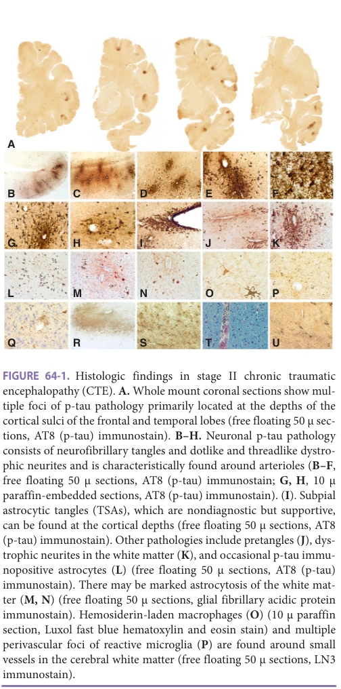
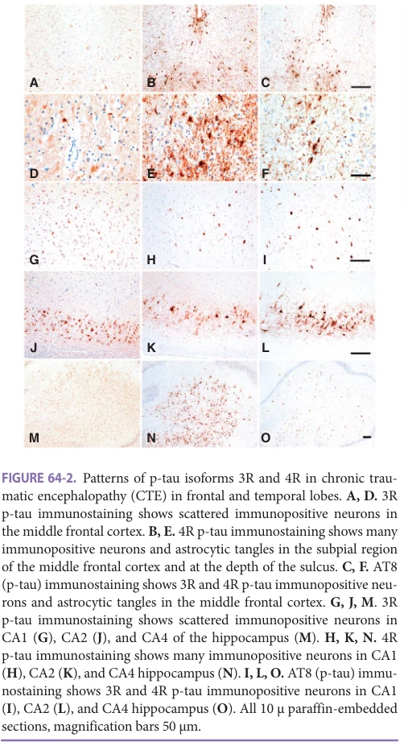
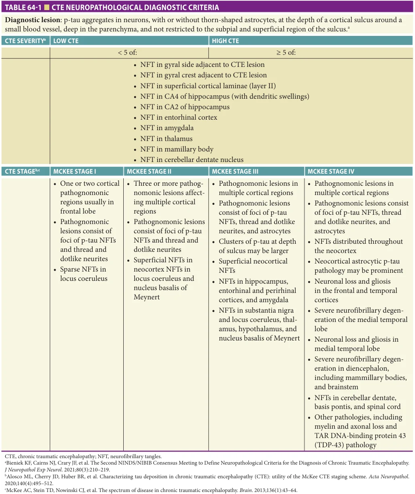
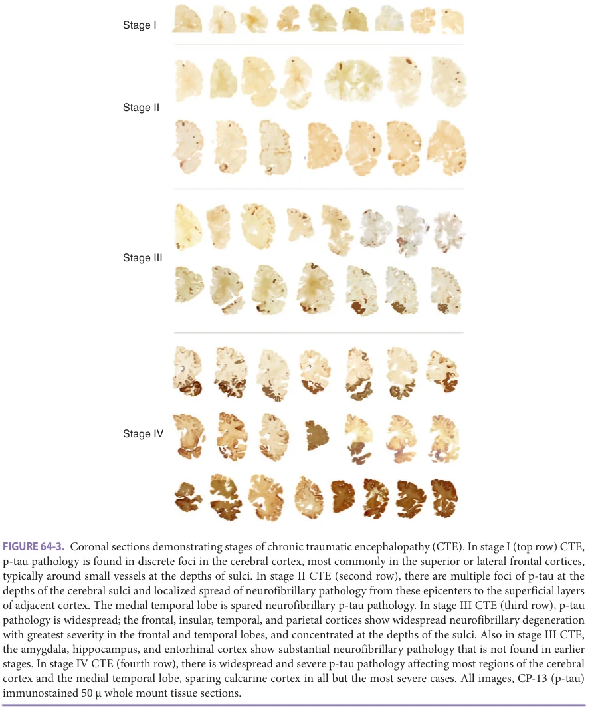
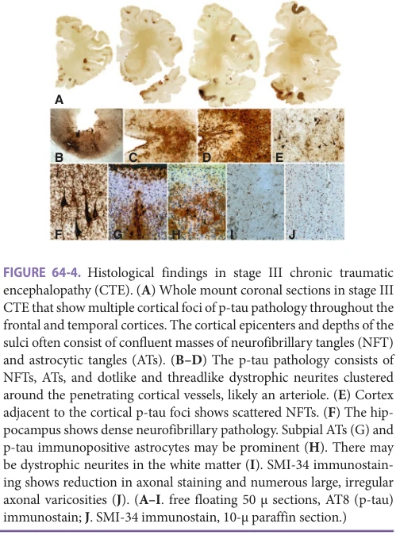
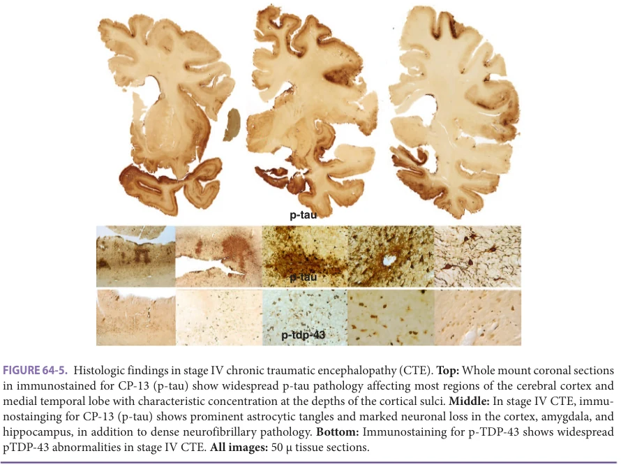

# Hazzard's Geriatric Medicine and Gerontology, 8e - Chapter 64: Traumatic Brain Injury and Chronic Traumatic Encephalopathy

Ann C. McKee, Daniel Kirsch

> **Status.** Fast build from the book; not lane-reviewed.

> **Source and method.** Printed pages 997-1006, from the marked 8th-edition copy (PDF page = printed page + 34). Prose follows its text layer; tables and figures are source-page crops. The book is canonical.

**[p. 997]**

## TRAUMATIC BRAIN INJURY AND DEMENTIA

For decades, traumatic brain injury (TBI) has been considered a risk factor for Alzheimer disease (AD), yet recent large cohort studies indicate that TBIs of all severities (mild, moderate, severe) are a risk factor for dementia, but the neuropathology underlying this risk is largely unknown. Some of the difficulties in understanding the neuropathological consequences of TBI are that TBI is a heterogeneous condition, consisting of different grades of severity: mild, moderate, severe. The grade of severity is based on: the Glasgow Coma Scale; duration of loss of consciousness (LOC); development of posttraumatic amnesia; and frequency (single, multiple), types (focal, diffuse), nature (penetrating, blunt impact, blast), and presence or absence of skull fracture, hemorrhage, contusion, infarction, and/or other secondary processes. In a pooled analysis of 7130 participants from the Religious Orders Study, Memory and Aging Project (ROSMAP) and Adult Changes in Thought (ACT) cohorts, TBI with LOC was not associated with a clinical diagnosis of AD dementia or with AD neuropathological changes at autopsy. These findings were confirmed and extended by a recent study of more than 4000 autopsy participants from the National Alzheimer’s Coordinating Center (NACC) that also found no association between TBI and AD neuropathological change or Alzheimer disease–related dementias (ADRDs) using Consortium to Establish a Registry for Alzheimer’s Disease (CERAD) scores for neuritic plaques and Braak stage for neurofibrillary tangles (NFTs). There was also no association with cortical Lewy bodies (LBs), hippocampal sclerosis, infarcts, microinfarcts, or amyloid angiopathy. In contrast, exposure to repetitive mild TBI or repetitive head impacts (RHI) such as concussions and subconcussive impacts from contact sport participation, military service, or physical abuse, is associated with chronic traumatic encephalopathy (CTE), a distinctive hyperphosphorylated tau protein (p-tau)-based neurodegeneration. In CTE, the pathological diagnosis is based on its pathognomonic lesion consisting of a perivascular accumulation of p-tau in neurons and neurites in an irregular pattern at the depths of the cortical sulci (Figure 64-1). A supportive, yet nondiagnostic, feature of CTE is the preferential distribution of NFTs in the superficial regions of the cerebral cortex, quite

#### Learning Objectives

- Understand the epidemiology, pathophysiology, clinical manifestations, and adverse outcomes of traumatic brain injury (TBI) in older adults.

- Acquire cutting-edge knowledge about chronic traumatic encephalopathy (CTE) and the risk of developing dementia following repeated traumatic insults to the brain.

- Learn about the neuropathology, common clinical symptoms, diagnostic criteria, and progression of CTE over time.

- Recognize the various strategies and treatments used to address cognitive deficits associated with TBI and CTE.

#### Key Clinical Points

1. Chronic traumatic encephalopathy (CTE) is diagnosed neuropathologically and is a primary tauopathy with a distinct well-defined pattern of tau pathology.

2. The clinical presentations of CTE are nonspecific and can be grouped into behavioral, cognitive, dementia, and motor. Currently, there are no neuroimaging, laboratory, or cognitive tests that can definitively diagnose the disease during life.

3. The classic neuropathology of CTE includes a neurofibrillary tangle with “dot-like” neurites around a small arteriole in the brain.

4. In CTE, pathology becomes progressively worse over time with worsening of clinical presentations that are generally nonspecific.

5. CTE is associated with exposure to repetitive head impacts and pathology is increased with duration of exposure.

6. Over time, the CTE pathology progresses and involves other parts of the brain, including the hippocampus, entorhinal cortex, amygdala, brainstem, and cerebellum.

**[p. 998]**

*Figure 64-1, printed p. 998.*

unlike the laminar distribution of NFTs in cortical layers 3 and 5 found in AD. Because the criteria for the diagnosis of CTE were defined only recently and require the use of p-tau immunohistochemistry (IHC) beyond the standard silver staining recommended by CERAD, the prevalence of CTE in neurodegenerative disease brain banks is currently unknown. The few studies that have reexamined brain bank cohorts for CTE using newly defined National Institute of Neurological Disorders and Stroke (NINDS) criteria and p-tau IHC found CTE in 1% to 30% of cases, and some cases previously considered to be only AD have been rediagnosed comorbid AD and CTE.

There have been remarkably few detailed case studies of the neuropathology of remote moderate–severe TBI, although there are many speculative reviews. Several small neuropathologically focused studies support a relationship

between moderate–severe TBI and atypical AD neuropathological changes characterized by an unconventional distribution of p-tau and amyloid-beta (Aβ) pathology. Johnson et al. examined the brains of 39 individuals diagnosed with a single moderate–severe TBI after 1 to 47 years’ survival and found that Aβ plaques were greater in density in the TBI group compared to controls. In addition, in subjects 60 years or younger at the time of death, NFTs were more frequent in the TBI group compared to age-matched controls and were distributed more commonly in the superficial layers of the cortex with clustering of NFTs among the depths of the sulci, an NFT distribution unlike AD and suggestive of CTE. Similarly, in a study of chronic severe TBI survivors without dementia, Scott et al. found increased Aβ accumulation by 11C-Pittsburgh compound positron emission tomography (PET) imaging in nine TBI subjects after severe TBI compared to age-matched controls and in a pattern distinct from the Aβ accumulation seen in AD patients. Clinical, neuroimaging, and neuropathological characteristics of two subjects who developed early onset dementia after sustaining a single moderate-severe TBI many years earlier have been described. One subject also had a history of RHI from military combat. Our study demonstrated the diversity and complexity of the neuropathology after remote TBI. In both cases, the pathologic findings included severe cerebral atrophy (brain weight < 930 g), white matter degeneration (which was particularly severe in the posterior corpus callosum), atypical AD, atypical CTE (with an unusual distribution of NFTs in the superficial layers of the cortex, but without the diagnostic pathognomonic perivascular lesion of CTE), widespread diffuse and sparse neuritic Aβ plaques, cerebral amyloid angiopathy (CAA), neuronal loss, and astrocytosis. Unusual α-synuclein and TAR DNAbinding protein 43 (TDP-43) proteinopathies were also found in one case. The size and distribution of the LBs and TDP-43 pathology were not characteristic of typical Lewy body disease (LBD) or frontotemporal lobar degeneration (FTLD). In a third recently reported case of a long-term survivor of moderate–severe TBI, there were widespread NFTs, α-synuclein positive LBs, diffuse Aβ plaques, and CAA. Other pathological changes reported in long-term survivors of TBI are axonal loss and disruption, reduced cortical thickness, blood-brain barrier dysintegrity, white matter degeneration, and chronic inflammation.

Axonal injury is one of the most common neuropathologies after TBI across all severities of injury. Hay et al. reported 47% of long-term individuals who experienced a single moderate–severe TBI who survived a year or more after injury had evidence of chronic blood-brain barrier disruption with multifocal abnormal fibrinogen and immunoglobulin G immunostaining in the cortex compared to limited localized immunostaining in controls. In this same group of long-term TBI survivors, Johnson et al. reported increased persistent neuroinflammation with significantly increased microglial density and reactive morphology, and reduced corpus callosum thickness compared to controls.

**[p. 999]**

Findings in animal models of TBIs have also demonstrated axonal loss, myelin loss, white matter degeneration, astrocytosis, neuronal loss, and chronic inflammation.

These studies suggest that TBI is a heterogeneous entity that is influenced by the biomechanics of the acute traumatic event, secondary consequences of the acute injury, and chronic, poorly understood pathophysiological processes including deposition of multiple neurodegenerative disease proteins (p-tau, Aβ, TDP-43, α-synuclein), cerebral atrophy, white matter degeneration, axonal loss, blood-brain barrier disruption, and persistent neuroinflammation. Other factors that may exert substantial influence over the long-term outcome of TBI include the frequency and severity of the TBI (mild, moderate, or severe) as well as the underlying characteristics of the individual who experienced the TBI, including genetic factors, age, gender, cardiovascular health, and cognitive reserve, among others. Clearly, there is a fundamental need for rigorous clinicopathological case evaluations to determine the full spectrum of clinical features and neuropathological alterations that occur after remote TBI, much needed data that will advance the field and highlight pathways for successful intervention and treatment.

## TRAUMATIC BRAIN INJURY AND PARKINSON DISEASE

Multiple studies have implicated any lifetime history of TBI as a risk factor for Parkinson disease (PD). Whether TBI sustained in older adulthood increases short-term risk of PD can be obscured by recall bias or reversecausation. However, Gardner et al. found that among middle-aged and older patients, there is a 44% increased risk of being diagnosed with PD in those who experienced a TBI compared to those with nonbrain-related traumatic injury. Furthermore, the risk was significantly higher with more severe or more frequent TBI, providing additional support for a causal association. The Crane et al. study of ROSMAP and ACT participants also showed that TBI with LOC < 1 hour predicted increased risk for cortical LBs, and TBI with LOC > 1 hour predicted increased risk for cerebral microinfarcts. In addition, in the ACT cohort, TBI with LOC > 1 hour was associated with clinical diagnosis of PD. Contact sport athletes are also at increased risk of developing PD and parkinsonism. Adams et al. recently showed that the number of years an individual was exposed to RHI through contact sports was associated with the development of neocortical LBD, and LBD, in turn, was associated with parkinsonism and dementia. Furthermore, in the Framingham Heart Study (FHS) community cohort, years of contact sports play were associated with neocortical LBD (OR = 1.30 per year, p = 0.012), and in a pooled analysis, a threshold of more than 8 years of play best predicted neocortical LBD (ROC analysis, OR = 6.24, 95% CI = 1.5–25, p = 0.011), adjusting for age, sex, and APOE ε4 allele status.

## CHRONIC TRAUMATIC ENCEPHALOPATHY

CTE is a neurodegenerative tauopathy associated with repetitive mild head trauma, including concussion and asymptomatic subconcussive impacts. CTE has been identified in American football, ice hockey, soccer, baseball, and rugby players, professional wrestlers, a bull rider, military veterans exposed to blast, and victims of assault and domestic violence. In 2009, using 50 μm whole mount landscape slides and p-tau IHC, the distinctive regional pathology of CTE was described in two former boxers and one former National Football League (NFL) player. The findings were compared to the 48 cases of neuropathologically confirmed CTE previously reported. The pathology of CTE was distinctive from other tauopathies in that it was irregular, patchy, and perivascular, with a tendency to be most severe at the depths of the sulci in the frontal and temporal cortex (Figure 64-2). In addition, the p-tau neurites

*Figure 64-2, printed p. 999.*

**[p. 1000]**

were dot-like, unlike the neuropil threads of AD, and there were p-tau immunoreactive astrocytes in the subpial and periventricular regions.

Clinical Symptoms and Diagnosis The symptoms of CTE vary and generally include cognitive, behavioral, and motor symptoms that progress with the disease. The initial symptoms may include headache, loss of concentration, mood swings, short-term memory loss, and depression. With disease progression, these symptoms worsen and become associated with impairments in decision-making and judgment, explosive behavior, aggression, paranoia, parkinsonism, and gait abnormalities. Additional symptoms may include visuospatial abnormalities, verbal and physical violence, and suicidal ideation and attempts. In general, behavioral and mood symptoms are more common in younger patients, with motor and cognitive symptoms dominating in older adults.

Definitive diagnosis of CTE can only be made on autopsy; thus, patient evaluation should focus on characterizing the clinical phenotype and excluding other diseases that could account for the presenting symptoms. Clinical evaluation should focus on symptoms and history of exposure to contact sports, repeated head trauma, concussions, military employment with traumatic or blast injuries, and behavioral, cognitive, mood, or motor symptoms. Neurological examination should look for signs of LBD, muscle fasciculations, evidence of parkinsonism, language abnormalities, and motor neuron disease. Each patient should undergo neuropsychological testing to identify deficits in memory, attention, language, and visuospatial function. Routine labs and an MRI brain scan as well as amyloid and tau PET scans could be considered to confirm tau deposition in the brain. Alternatively, cerebrospinal fluid could be collected to assay amyloid, tau, and other analytes. Given the diagnosis of CTE can only be made on neuropathological examination of the brain, the remainder of this chapter is focused on the pathology of CTE.

Neuropathology of CTE Preliminary criteria for the neuropathological diagnosis of CTE were presented in 2013 as part of a clinicopathological case series of 68 male subjects with CTE, ranging in age from 17 to 98 years (mean 59.5 years) and 18 age- and gender-matched controls without a history of brain trauma. The neuropathological criteria proposed by McKee et al. for CTE required the presence of focal epicenters of p-tau immunoreactive NFTs and abnormal neurites around a small vessel, distributed at the depths of the sulci in the cerebral cortex, NFTs distributed in the superficial layers of cortex, and p-tau immunoreactive astrocytes in the sub -pial layer at the depths of the sulcus most often found in the frontal and temporal cortices (Figure 64-1). Other frequent pathologies in CTE included axonal loss in the subcortical white matter and the cooccurrence of TDP-43 immunoreactive inclusions and neurites.

In addition, McKee and colleagues proposed a staging scheme for characterizing the progressive p-tau pathology in CTE (McKee CTE Staging Classification Scheme) (Table 64-1). The method of staging CTE p-tau pathology was based on the previous work of Braak and Braak in AD, who examined a series of 83 autopsy brains and found a characteristic distribution pattern of NFTs and neuropil threads (NTs) that permitted the differentiation of six pathological stages of AD. The Braak staging system for NFT forms the basis for the neuropathological diagnosis of AD used by the National Institute on Aging, and similar staging schemes are now available for Aβ plaques in AD and LBs in PD. Based on the 68 CTE cases, McKee and colleagues identified four pathological stages of CTE (I–IV), primarily using large hemispheric slides immunostained for p-tau (Figure 64-3). In the earliest stage of CTE, stage I, there are one or two isolated epicenters of NFTs and dot-like neurites (ie, “CTE lesions”) arranged around small blood vessels at the depths of the sulci in the frontal, temporal, or parietal cortices. The small blood vessels at the center of the CTE lesions are usually small arterioles and may be associated with p-tau immunopositive thorn-shaped astrocytes (TSAs) in the subpial region. In stage II CTE, three or more CTE lesions are found in multiple cortical regions, the CTE lesions are larger, superficial NFTs are found along the sulcal wall and at gyral crests of the adjacent cortices, and there is more neurofibrillary pathology in the locus coeruleus and nucleus basalis of Meynert (Figure 64-1). In stage III CTE, confluent perivascular patches of p-tau mmunoreactive NFTs and dotlike- and threadlike-neurites are found at the sulcal depths, as well as NFTs in the superficial cortical laminae. Diffusely distributed NFTs are also found in medial temporal lobe structures, including the hippocampus, entorhinal cortex, perirhinal cortex, amygdala, as well as additional brainstem structures. Neurofibrillary degeneration in stage III CTE involves CA4 and CA2, as well as CA1 of the hippocampus (Figure 64-4). In CTE stage IV, CTE lesions and NFTs are densely distributed throughout the cerebral cortex, diencephalon, brain stem, cerebellar dentate nucleus, and spinal cord with neuronal loss and gliosis in the frontal and temporal cortices and astrocytic p-tau pathology (Figure 64-5). CTE pathology in stages I and II is considered to be mild and is considered to be severe in stages III and IV.

McKee and colleagues found a significant correlation between the stage of CTE pathology and duration of football career, supporting a dose-response relationship between cumulative head trauma exposure and CTE severity. They also found a significant association between CTE stage, number of years after retirement from football, and age at death, data supporting progression of p-tau pathological severity over time. By contrast, number of concussions, years of education, lifetime steroid use, and position played did not significantly relate to CTE stage.

Using the McKee criteria in 2015, the NINDS and National Institute of Biomedical Imaging and

**[p. 1001]**

*Table 64-1, printed p. 1001.*

Bioengineering (NIBIB) funded a consensus meeting of expert neuropathologists to evaluate 25 cases of various tauopathies blinded to all clinical, demographic, and gross neuropathological information. The tauopathies included CTE, AD, progressive supranuclear palsy (PSP),

argyrophilic grain disease (AGD), corticobasal degeneration (CBD), primary age-related tauopathy (PART), and parkinsonism dementia complex of Guam (G-PDC). All cases were of moderate to severe pathological severity and without comorbid diseases. Unknown to the

**[p. 1002]**

*Figure 64-3, printed p. 1002.*

neuropathologists before their analysis, the cases included 10 cases of suspected CTE that were part of the NINDSfunded Understanding Neurological Injury and Traumatic Encephalopathy (UNITE) or Veterans Affairs—Boston University—Concussion Legacy Foundation (VA-BUCLF) brain bank at Boston University School of Medicine (BUSM), including seven cases of CTE with Aβ plaques and three cases without Aβ plaques. Five cases of AD with Braak stages V–VI, two cases of PSP, and two cases of CBD were also selected from the Alzheimer’s Disease Center (ADC) brain bank at BUSM. Two cases of GPDC and two

cases of AGD were selected from the Alzheimer’s Disease Research Center (ADRC) brain bank at Mayo Clinic-Jacksonville, and two cases of PART were selected from the ADRC brain bank at Columbia University. A single laboratory processed all the cases uniformly and the resulting slides were scanned into digital images that were provided to neuropathologists.

There was good agreement between the evaluating neuropathologists regarding the overall neuropathological diagnosis of all 25 cases (Cohen’s kappa, 0.67), and even better agreement regarding the specific diagnosis of CTE

**[p. 1003]**

*Figure 64-4, printed p. 1003.*

(Cohen’s kappa, 0.78), using the proposed McKee criteria. Of the 10 cases submitted with the presumptive diagnosis of CTE, 64 of the 70 reviewer’s responses (91.4%) indicated CTE as the diagnosis. There was a significant decrease of errors that paralleled the sequence of cases evaluated. The log of the expected errors significantly decreased by 0.43 for each case of CTE reviewed (p = 0.024). There were common additions to the CTE diagnosis, including “changes of Alzheimer’s disease” (ADC) and AD in the cases with Aβ plaques. Other comorbid diagnoses included hippocampal sclerosis (HS), AGD, and PART. Of the 15 other tauopathy cases submitted for review with diagnoses other than CTE, the reviewers generally agreed with the submission diagnoses of AD (97.1% of responses), CBD (92.8%), and PART (78.5%); however, there were frequent discrepancies in cases with presumptive diagnoses of PSP, AGD, and GPDC.

The NINDS consensus group defined the single pathognomonic criterion for CTE as “an accumulation of abnormal p-tau in neurons, astrocytes, and cell processes around small vessels in an irregular pattern at the depths of the cortical sulci.” They also concluded that the criteria reliably distinguished CTE from other tauopathies and made refinements of the original McKee criteria primarily in distinguishing CTE from age-related tau astrogliopathy (ARTAG).

The consensus panel defined supportive criteria for CTE as follows: “(1) abnormal p-tau-immunoreactive

*Figure 64-5, printed p. 1003.*

**[p. 1004]**

pretangles and NFTs preferentially affecting superficial layers (layers II–III); (2) in the hippocampus, pretangles, NFTs or extracellular tangles preferentially affecting CA2 and pre-tangles and prominent proximal dendritic swellings in CA4; (3) abnormal p-tau-immunoreactive neuronal and astrocytic aggregates in subcortical nuclei, including the mammillary bodies and other hypothalamic nuclei, amygdala, nucleus accumbens, thalamus, midbrain tegmentum, and isodendritic core (nucleus basalis of Meynert, raphe nuclei, substantia nigra, and locus coeruleus); (4) p-tau-immunoreactive thorny astrocytes at the glial limitans most commonly found in the sub-pial and periventricular regions; and (5) p-tau-immunoreactive large grain-like and dot-like structures (in addition to some threadlike neurites).”

The panel noted that the diagnosis was often aided by inspection of the slide at low power inspection that revealed the distinctively irregular spatial pattern of p-tau in CTE. In addition, they observed that the pattern of superficial cortical involvement and hippocampal degeneration was unlike AD, the p-tau neurites were often dotlike, and that the TDP-43-immunoreactive inclusions in CTE were distinctive. They also made recommendations for the diagnosis and practical evaluation process of potential CTE cases.

The preliminary NINDS criteria for the pathological diagnosis of CTE were subsequently validated by Bieniek and colleagues in a study of participants from the Mayo Clinic Brain Bank in which the brains of 66 contact sport athletes and 198 controls without a history of brain trauma or contact sports were reanalyzed for p-tau pathology. Using the NINDS criteria, the authors found CTE in 21 of the 66 contact sport athletes (32%) and none of the 198 controls. Multiple international groups have used the NINDS criteria to evaluate and publish the neuropathological findings of CTE in various cohorts, including soccer players, American football players, a bull-rider, and rugby players.

In 2016, the consensus panel met again to validate and refine the preliminary pathological criteria for CTE, provided by the first NINDS consensus conference, using a second blinded sample of 27 cases of tauopathies (including 17 CTE cases representing all severities of disease) and blinded to clinical and demographic information to (1) develop the minimum threshold for diagnosis and (2) to determine whether the McKee CTE Staging Classification Scheme was reliable using a limited number of paraffin-embedded slides. Generalized estimating equation analyses showed a statistically significant association between the raters and CTE diagnosis for both the blinded (OR = 72.11, 95% CI = 19.5–267.0) and unblinded rounds (OR = 256.91, 95% CI = 63.6–1558.6).

In addition, the group discussed the minimum threshold for the diagnosis of CTE and the pathological features critical to a strict definition of “pathognomonic CTE lesion.” The group endorsed a single pathognomonic lesion in the cortex as the minimum threshold for CTE. The group

also clarified that the pathognomonic lesion of CTE is a neuronal lesion characterized by NFTs and disordered neurites that may or may not contain p-tau immunoreactive astrocytes. The following features of the pathognomonic lesion were considered necessary: p-tau aggregates in neurons, with or without concomitant p-tau-immunoreactive TSAs, at the depth of the sulcus around small blood vessels, in deeper cortical layers not restricted to subpial and superficial regions. The panel unanimously confirmed that based on case material available, purely astrocytic perivascular p-tau lesions (including subpial ARTAG) did not meet criteria for CTE. Furthermore, clusters of p-tau immunoreactive astrocytes in the white matter of the frontal and temporal cortex, basal ganglia, or lateral or medial brain stem were considered consistent with ARTAG and not specific features of CTE.

Recognizing that the McKee criteria for staging CTE were based on a comprehensive panel of representative paraffin-embedded slides from multiple brain regions as well as hemispheric whole mount tissue sections, the panel suggested a simplified scheme to assess CTE severity using a restricted number of slides. The panel also proposed a working protocol for the diagnosis of CTE and assessment of CTE severity as “low CTE” or “high CTE,” corresponding to CTE stages I–II and CTE stages III–IV, respectively (Table 64-1, Figure 64-3).

CTE Is a Primary Tauopathy CTE is a primary tauopathy, and early stage CTE is characterized pathologically by a distinctive accumulation of p-tau in neurons as NFTs and dot-shaped NTs around small arterioles in the absence of any Aβ pathology. The arteriole at the center of the CTE lesion is often thickened and surrounded by a wide perivascular space containing occasional hemosiderin-laden macrophages. Subpial TSAs may be found in association with the CTE lesion, but in isolation, are not diagnostic for CTE. Moreover, Aβ deposition is not a feature of early CTE, but diffuse Aβ plaques commonly develop in CTE with aging and may occur in parallel with CTE p-tau pathology.

Astrocytes in CTE and Distinction from ARTAG Age-related tau astrogliopathy (ARTAG) is a neuropathological entity often found as a comorbidity in older individuals. There are several publications in which ARTAG pathology is misclassified as mild CTE. These reports are accompanied by mistaken claims that CTE pathology is often found in normal controls. In contrast, a comprehensive study of p-tau pathology in 310 older Europeans showed no cases of CTE despite ARTAG presence in 38%.

Progression in CTE P-tau pathology becomes progressively more severe in most subjects with CTE with age; this progressive pathology forms the basis of the McKee CTE Staging Classification

**[p. 1005]**

Scheme. Some individuals, however, show low levels of CTE pathology at an advanced age, supporting an indolent disease course. Nonetheless, for the majority of former American football players whose brains were donated to the UNITE brain bank, the McKee staging scheme correlates with duration of football career, number of years after retirement from football, and age at death, findings that support a progression of p-tau pathology severity with survival over time. Neuroinflammation, p-tau IHC staining density, and white matter rarefaction also increase in severity in association with the CTE stage and correlate with dementia. Among 177 American football players with CTE, semiquantitative assessments of p-tau pathology showed a graded increase from stage I, where p-tau pathology was highest in frontal cortex and locus coeruleus; to stage II, where the p-tau pathology increased and was highest in the frontal, temporal parietal, septal, insular and entorhinal cortices, amygdala, thalamus, substantia innominata, substantia nigra, and locus coeruleus; to stage III, where there were further increases in p-tau pathology across all previous regions and hippocampus; to stage IV with still larger increases across all regions (Figure 64-3). The McKee CTE Staging Classification Scheme also correlates with quantitative regional assessments of p-tau pathology and dementia status. Other factors, such as the development of comorbidities with advancing age, may also drive progression of clinical symptoms in CTE in addition to increasing p-tau pathology.

## SUMMARY

TBI is risk factor for dementia and parkinsonism, although the precise neuropathological underpinnings of these clinical conditions are unclear. TBI is a heterogeneous condition

## FURTHER READING

Barnes DE, Byers AL, Gardner RC, Seal KH, Boscardin

WJ, Yaffe K. Association of mild traumatic brain injury with and without loss of consciousness with dementia in US military veterans. JAMA Neurol. 2018;75(9): 1055–1061. Bieniek KF, Cairns NJ, Crary JF, et al. The Second NINDS/

NIBIB Consensus Meeting to Define Neuropathological Criteria for the Diagnosis of Chronic Traumatic Encephalopathy. J Neuropathol Exp Neurol. 2021;80(3): 210–219. Crane PK, Gibbons LE, Dams-O’Connor K, et al. Associa-

tion of traumatic brain injury with late-life neurodegenerative conditions and neuropathologic findings. JAMA Neurol. 2016;73(9):1062–1069. Dams-O’Connor K, Guetta G, Hahn-Ketter AE, Fedor

A. Traumatic brain injury as a risk factor for Alzheimer’s disease: current knowledge and future directions. Neurodegener Dis Manag. 2016;6(5):417–429.

consisting of different grades of severity (mild, moderate, severe), frequency (single, multiple), types (focal, diffuse), nature (penetrating, blunt impact, blast), and presence or absence of skull fracture, hemorrhage, contusion, infarction, and/or other secondary processes. Neuropathological alterations after TBI include changes of AD, LBD, motor neuron disease, accumulation of p-tau or TDP-43, axonal disruption and loss, cerebral atrophy, blood-brain barrier dysintegrity, white matter degeneration, and chronic inflammation. Repetitive mild TBI or RHI, such as those typically experienced during contact sport participation, combat military service, and physical abuse, have been associated with CTE, a distinctive p-tau–based disorder. Histologically, CTE pathology is defined by irregular, patchy, and perivascular accumulation of p-tau NFTs and dotlike neurites, with a tendency to be most severe at the depths of the sulci in the frontal and temporal cortices. CTE is a progressive tauopathy that expands over time to involve deep brain structures such as the hippocampus, entorhinal cortex, amygdala, brainstem, and cerebellum. The pathological severity of CTE is divided into four (I–VI) stages using the McKee CTE Staging Classification Scheme that have been shown to correspond with quantitative regional assessments of p-tau pathology and significantly correlates with age at death and duration of football career. Recently, a NINDS consensus conference proposed an abbreviated scheme for classifying the pathology into low or high based on a limited number of paraffin-embedded blocks. At the current time, CTE can only be diagnosed by postmortem neuropathological evaluation; thus, there is an urgent need to develop diagnostic biomarkers to advance diagnosis during life and to evaluate potential therapeutic targets.

Doherty C, O’Keeffe E, Keaney J, et al. Neuropolypathology

as a result of severe traumatic brain injury? Clin Neuropathol. 2018;38:14–22. Fann JR, Ribe AR, Pedersen HS, et al. Long-term risk of

dementia among people with traumatic brain injury in Denmark: a population-based observational cohort study. Lancet Psychiatry. 2018;5(5):424–431. Goldstein LE, Fisher AM, Tagge CA, et al. Chronic trau-

matic encephalopathy in blast-exposed military veterans and a blast neurotrauma mouse model. Sci Transl Med. 2012;4(134):134ra60–134ra60. Jafari S, Etminan M, Aminzadeh F, Samii A. Head

injury and risk of Parkinson disease: a systematic review and meta-analysis. Mov Disord. 2013;28(9): 1222–1229. Johnson VE, Stewart W, Arena JD, Smith DH. Traumatic

brain injury as a trigger of neurodegeneration. Neurodegener Dis. 2017;15:383–400.

**[p. 1006]**

Kenney K, Iacono D, Edlow BL, et al. Dementia after

moderate-severe traumatic brain injury: coexistence of multiple proteinopathies. J Neuropathol Exp Neurol. 2018;77(1):50–63. Lee Y-K, Hou S-W, Lee C-C, Hsu C-Y, Huang Y-S, Su Y-C.

Increased risk of dementia in patients with mild traumatic brain injury: a nationwide cohort study. PloS One. 2013;8(5):e62422. Ling H, Morris HR, Neal JW, et al. Mixed pathologies

including chronic traumatic encephalopathy account for dementia in retired association football (soccer) players. Acta Neuropathol. 2017;133(3):337–352. Marras C, Hincapié CA, Kristman VL, et al. System-

atic review of the risk of Parkinson’s disease after mild traumatic brain injury: results of the international collaboration on mild traumatic brain injury prognosis. Arch Phys Med Rehabil. 2014;95(3, Supplement): S238–S244. McKee AC, Cairns NJ, Dickson DW, et al. The first NINDS/

NIBIB consensus meeting to define neuropathological criteria for the diagnosis of chronic traumatic encephalopathy. Acta Neuropathol. 2016;131:75–86. McKee AC, Daneshvar DH, Alvarez VE, Stein TD. The

neuropathology of sport. Acta Neuropathol. 2014;127(1): 29–51. McKee AC, Stein TD, Nowinski CJ, et al. The spectrum

of disease in chronic traumatic encephalopathy. Brain. 2013;136(1):43–64.

Mez J, Daneshvar DH, Abdolmohammadi B, et al. Duration

of American football play and chronic traumatic encephalopathy. Ann Neurol. 2020;87(1):116–131. Mez J, Daneshvar DH, Kiernan PT, et al. Clinicopatho-

logical evaluation of chronic traumatic encephalopathy in players of American football. JAMA. 2017;318(4): 360–370. Nordström A, Nordström P. Traumatic brain injury and the

risk of dementia diagnosis: a nationwide cohort study. PLoS Med. 2018;15(1):e1002496. Ojo JO, Mouzon B, Algamal M, et al. Chronic repetitive

mild traumatic brain injury results in reduced cerebral blood flow, axonal injury, gliosis, and increased T-tau and tau oligomers. J Neuropathol Exp Neurol. 2016;75(7):636–655. Plassman BL, Grafman J. Traumatic brain injury and late-

life dementia. Handb Clin Neurol. 2015;128:711–722. Stewart W, McNamara PH, Lawlor B, Hutchinson S,

Farrell M. Chronic traumatic encephalopathy: a potential late and under recognized consequence of rugby union? QJM Int J Med. 2016;109(1):11–15. Wilson L, Stewart W, Dams-O’Connor K, et al. The chronic

and evolving neurological consequences of traumatic brain injury. Lancet Neurol. 2017;16(10): 813–825. Yaffe K, Lwi SJ, Hoang TD, et al. Military-related risk fac-

tors in female veterans and risk of dementia. Neurology. 2019;92(3):e205–e211.
