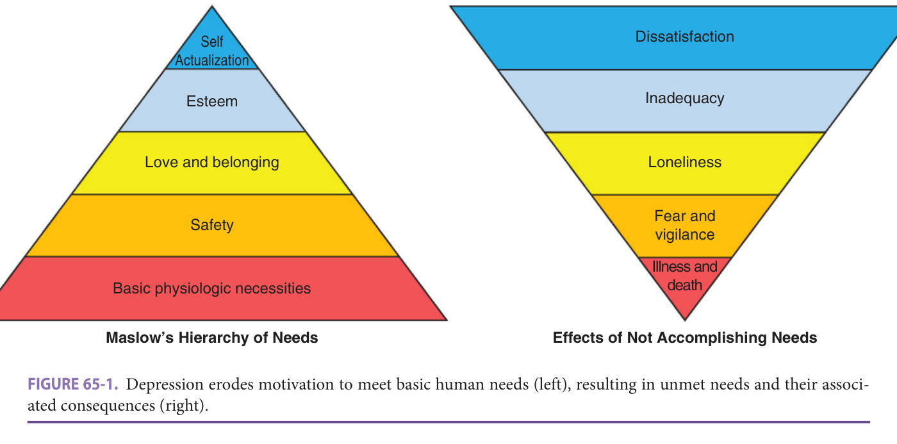
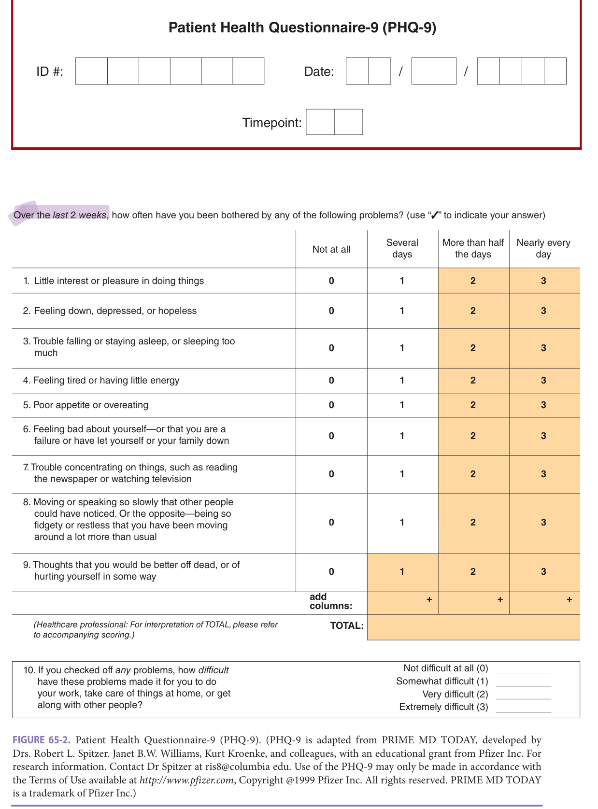
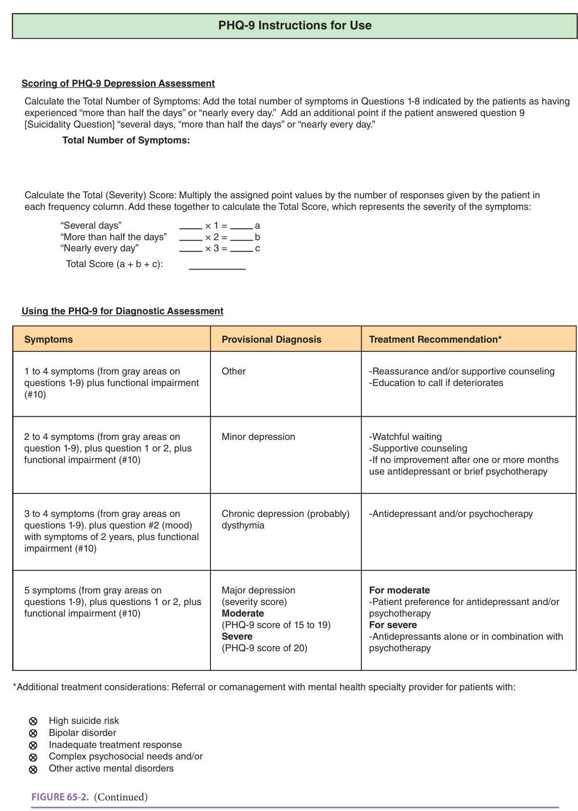
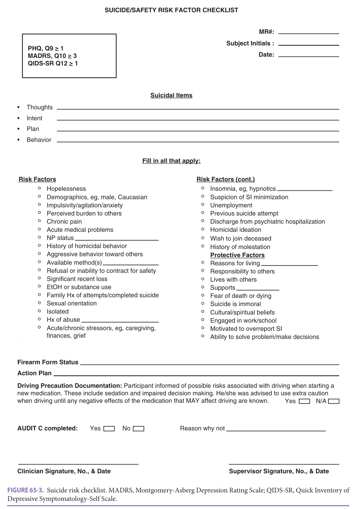
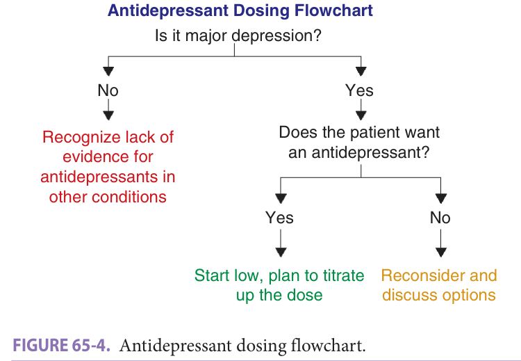

# Hazzard's Geriatric Medicine and Gerontology, 8e — Chapter 65: Major Depression

Whitney L. Carlson, William Bryson, Stephen Thielke

> **Fast build from the book, 22-23 Sep; not lane-reviewed.**

**[p. 1007]**

#### Learning Objectives

- Identify and characterize major depression; and understand how to recognize it within the context of common biological, psychological, social, and developmental challenges that older adults experience.
- Understand and select evidence-based treatment options for major depression in older adults, in light of their risks and limitations, and accounting for availability and patient preferences.
- Identify and be ready to apply practical strategies to support and develop therapeutic alliance with depressed older adults.
- Appreciate the importance of assessing suicide risk, and develop expertise in assessing suicidality in clinical encounters.

#### Key Clinical Points

1. Treating older adults with depression can challenge clinicians emotionally, and it is important to consider one’s reactions to the experience. Clinicians interacting with depressed older adults can convey empathy and genuine human concern for their well-being.
2. Although aging is associated with new life challenges, depression is not a normal part of getting older. Depression should be identified and treated when present.
3. There is significant overlap between depression, social disconnection, and inability to meet basic human needs. The presence of anhedonia (lack of interest or pleasure) or hopelessness can indicate the presence of depression.
4. There are several evidence-based treatments for major depression in older adults, including medications, psychotherapy, and electroconvulsive therapy (ECT). Availability and patient preference are more important considerations than effectiveness.
5. In most cases, it is reasonable to consider tapering off an antidepressant after symptoms resolve or after an adequate trial produces no clear benefit. Exceptions would be a history of multiple depressive episodes or known decompensation with prior attempted dose taper.
6. All depressed older patients should be assessed for suicide risk. At minimum, this should entail evaluation of suicidal thoughts, intent to act on suicidal thoughts, suicidal plans, and access to lethal means.

## Epidemiology And Pathophysiology

### Distinctive Features Of Geriatric Depression

Various theories have tried to explain generally why people become depressed at different ages, but little fundamental understanding has developed around the causes of depression. Instead of sifting through theories and research, we summarize several generally accepted principles, which are usually taught as part of medical or psychology training, but which may be forgotten during a productive career. These, and the findings of research, form the groundwork for the recommendations we make about assessment and management.

**Depression is not just part of getting older** Although challenging life events, such as health problems and the loss of family and friends, may occur more often in later life, and although the prospect of one’s own death may seem distressing, such cumulative negative events have not been shown to cause depression. In fact, aging generally involves resilience. Multiple studies demonstrate that around 5% of older adults meet criteria for major depression, which is lower than in other age groups. The likelihood of newonset depression peaks in middle age. Among older adults, it appears that greater age involves a similar likelihood of becoming depressed, but a higher likelihood of remaining depressed. Therefore, it would be misguided and unproductive to normalize depression in older patients. Younger clinicians might learn from their older patients about how to navigate through the later stages of life.

**Older age brings new challenges** It is unlikely that any two people have ever experienced aging in exactly the same way, but certain generalizations hold. For our purposes, “older” means after the middle stage of life. Erik Erikson’s theory of life stages conceives that mid-life (roughly age 40–65) involves a tension between generativity and stagnation. If individuals can continue to make progress in work, society, and family matters, they will feel comfortable, but if they lack direction or become stymied, they will experience distress. If navigated successfully, this stage builds the virtue which Erikson defined as “care.” In later life (after age 65), the challenges shift to ego integrity versus despair: can individuals accept their lives in full, and conclude that they made some contribution to the world? Or do they feel

**[p. 1008]**

guilty about their actions, and believe that everything was meaningless? If ego integrity is sustained through later life, people develop the virtue of wisdom. Although there is no necessary association with major depression and this theory, clinicians can remain attuned to this change in life tension and goals.

**Depression is not just subjective distress** Depression in later life has serious consequences for overall health and quality of life. It is associated with disability, cognitive impairment, perception of poorer health and quality of life, social disconnection, greater difficulty managing medical comorbidities and chronic pain, increased healthcare utilization, greater mortality, and higher costs. The relationship between depression and adverse health outcomes is likely bidirectional, with depression worsening health and function, and impaired health and function deepening

depression in return. Consequences of the relationship between depression and overall health and function include (a) the emergence of close connections between depression, social disconnection, and motivation to meet one’s basic human needs, and (b) the potential for a downward spiral as depression and poor health exacerbate one another. We expand upon these consequences in the following section.

### Interactions Between Geriatric Depression And Aspects Of Health And Social Well-Being

**Geriatric depression and basic human needs** The relationship between depression and ability to meet one’s basic needs is complex. Abraham Maslow’s theory of human motivation, from which his hierarchy of needs derives, highlights clinical insights and potential pitfalls at the interface between depression and basic needs. Starting with basic physiological needs (eg, food, shelter, critical medicine) as the most fundamental source of motivation, the hierarchy progresses to basic physical and emotional safety, love and belonging, esteem, and, finally, self-actualization. Two core features of geriatric depression that distinguish it from other late-life mood disturbances are anhedonia (lack of interest or pleasure) and hopelessness. These, especially in combination, erode motivation to meet one’s basic needs. It can be hard to identify depression as the underlying problem when other aspects of health and well-being are wanting, especially when deficits in basic needs are often more apparent than depressed mood. In these situations, anhedonia and hopelessness may be important clues to the presence of depression.

Life circumstances resulting in unmet basic needs can also precipitate depression in older adults. **Figure 65-1** illustrates this relationship. Deprivations in the higher levels of basic needs, self-actualization, and esteem tend to manifest as feelings of dissatisfaction and inadequacy, respectively, but not full-blown depression. Clinicians

> *FIGURE 65-1. Depression erodes motivation to meet basic human needs (left), resulting in unmet needs and their associated consequences (right).*

> Highlighting is the owner's annotation, not the book's.

**[p. 1009]**

eager to diagnose and treat depression might overdiagnose it in these scenarios, by misinterpreting minor mood symptoms as a pathological condition. Depression tends to emerge when love and belonging needs are unmet. Abundant empirical evidence and theoretical frameworks, such as interpersonal theory, point to the critical importance of meaningful social connections in sustaining mood among older adults who experience changes in social roles (eg, retirement, grandparenthood), grief and loss, and, sometimes, functional and mobility limitations.

Although not inevitable or considered to be a part of normal aging, vulnerability to social disconnection can increase in these and other common scenarios, and such social deprivations are tightly linked to depression. Deficits in the most fundamental needs, including safety and basic physiological needs, are usually more urgent than love and belonging deficits and the depression that may accompany them. There is another potential pitfall here, as some clinicians will focus on treating depression as a more tractable issue than addressing safety and physiological needs (like housing and food insecurity), hoping that the patient will be able to find solutions to these more fundamental needs once depression is treated.

**Social disconnection, loneliness, and depressed mood in older adults** The link between social disconnection and depression among older adults has become increasingly recognized as a general finding, a source of clinical concern, and an opportunity for intervention. Broadly, social disconnection is linked to physiologic and behavioral changes, such as chronic inflammation, changes in oxytocin and monoamine signaling, hypothalamic-pituitary-adrenal axis reactivity, unhealthy behaviors (eg, substance use, poor sleep hygiene, sedentary lifestyle), and challenges in coping and decision-making. The structural aspects of social connection include objective measures of network size (the number of contacts one has), frequency and duration of contacts, and living situation. Such connections sustain an individual’s emotional well-being, and deprivation in structural connection is often termed _social isolation_ . The term _loneliness_ designates the perception that the function and/or quality of one’s social connections are lacking. These distinct but closely related concepts offer another perspective from which to view geriatric depression, its health consequences, and treatment options.

Social isolation can develop in several common late-life scenarios, including retirement, widowhood, distance from adult children, sensory and mobility impairments, chronic medical comorbidities, and selective pruning of social contacts to the most meaningful few. Some forms of social isolation, such as living alone and selectivity, may reflect capability, independence, and preference, which are associated with positive health outcomes, so care must be taken not to assume that all social isolation signifies a problem.

Loneliness, however, is unlikely to be an adaptive coping mechanism. Someone can be surrounded by family and friends and still feel lonely if the quality of those

relationships is poor, or those people are offering kinds of support that the person does not want, but loneliness typically occurs in the context of some degree of social isolation. Loneliness is fundamentally related to the experience of depression, as the perceived lack of love and belonging overlap with depressed mood, negative self-appraisal, and feelings of worthlessness and being a burden. The opposite direction of causation, in which depression leads to loneliness, is also common, as depression inhibits motivation and ability to sustain relationships and feel good about them. The mutual reinforcement of social disconnection and depression can plunge older adults into a downward spiral that exacerbates morbidity and mortality. Treatment planning should consider the social factors that may either mitigate or compound it.

**Practically addressing social disconnection in geriatric care** Psychosocial treatments have been developed to address the _social_ aspects of depression, including interpersonal psychotherapy and behavioral activation. These are effective treatments for geriatric depression, but they require expertise that is not always available in geriatric medicine settings. An alternative, simpler model that was developed to support mental wellness at the population level and in clinical settings is **Act-Belong-Commit** . In basic terms, “Act” refers to doing something, which could include physical activity, reading, or hobbies. “Belong” refers to doing something with other people that fosters a sense of inclusion and community, like game nights or book clubs. “Commit” refers to doing something meaningful, like value-driven volunteer work. Act-Belong-Commit is straightforward and systematic enough to use in a busy geriatric medicine or primary care clinic, while also targeting depression through behavioral activation, love and belonging needs through social activity, and esteem and self-actualization needs through value-driven engagement. Prescriptions for specific kinds of desired social activity can help with credibility and accountability. While not a replacement for more traditional depression treatments, and not extensively studied in older adults, Act-BelongCommit is a useful framework that geriatricians can incorporate into daily clinical practice.

**Clinical symptoms and diagnosis of major depression** As a clinical phenomenon, depression deserves careful definition. Although people use the word “depressed” and “depression” in general speech to describe a low mood or feeling of distress, major depression involves specific hallmark findings. For the assessment of major depression in older adults, it is clinically useful and valid to use a brief, self-report rating scale such as the Patient Health Questionnaire-9 (PHQ-9) ( **Figure 65–2** ). The PHQ-9 is based on the _Diagnostic and Statistical Manual_ (DSM)-5 of the American Psychiatric Association criteria for major depression. Note that symptom frequency is an important part of the assessment. Depression is thus quite different than having a bad day, or dealing with challenging circumstances. Scores of 0 to 4 indicate either no depression or

**[p. 1010]**

Over the _last 2 weeks_, how often have you been bothered by any of the following problems? Scores of 0 to 4 indicate either no depression or clinically insignificant depressive symptoms; 5 to 9 indicate mild (subsyndromal) depression; 10 or higher typically correlates with a diagnosis of major depression and warrants further evaluation.

> *FIGURE 65-2. Patient Health Questionnaire-9 (PHQ-9). (PHQ-9 is adapted from PRIME MD TODAY, developed by Drs. Robert L. Spitzer. Janet B.W. Williams, Kurt Kroenke, and colleagues, with an educational grant from Pfizer Inc. For research information. Contact Dr Spitzer at ris8@columbia edu. Use of the PHQ-9 may only be made in accordance with the Terms of Use available at _http://www.pfizer.com_ , Copyright @1999 Pfizer Inc. All rights reserved. PRIME MD TODAY is a trademark of Pfizer Inc.)*

> Highlighting is the owner's annotation, not the book's.

**[p. 1011]**

Scoring: add the number of symptoms (Questions 1–8) endorsed as "more than half the days" or "nearly every day," plus 1 if Question 9 (suicidality) is endorsed at any frequency, for the **Total Number of Symptoms**. Multiply each frequency column's count by its weight (several days ×1, more than half the days ×2, nearly every day ×3) and sum for the **Total (Severity) Score**. The diagnostic table below maps symptom count to provisional diagnosis — 1–4 symptoms plus functional impairment: other; 2–4 symptoms plus Q1/Q2 plus functional impairment: minor depression; 3–4 symptoms plus Q2 (depressed mood) present **2 years** plus functional impairment: probable dysthymia (chronic depression); 5+ symptoms plus Q1/Q2 plus functional impairment: major depression, graded moderate at PHQ-9 **15–19** and severe at **≥20** — and treatment recommendation; refer for high suicide risk, bipolar disorder, inadequate treatment response, complex psychosocial needs, or other active mental disorders.

> *FIGURE 65-2. (Continued) — PHQ-9 instructions for use, scoring, and diagnostic assessment table.*

> Highlighting is the owner's annotation, not the book's.

**[p. 1012]**

> clinically insignificant depressive symptoms. Scores of 5 to 9 indicate mild depression, generally subsyndromal, while scores of 10 or higher typically correlate with a diagnosis of clinical (“major”) depression and warrant further evaluation and clinical intervention. The PHQ-9 is a good tool for measurement-based care to document the presence of symptoms and their change during treatment. Such instruments are also useful for educating patients and pinpointing which symptoms represent targets for intervention. Item 9 on the PHQ-9 asks the patient about death wishes or more intensive suicidal ideation; this is clearly an important part of the assessment. There is a broad range of risk and protective actors for suicide in older adults ( **Figure 65–3** ).

Although subsyndromal depression seems to have about the same effects on health and quality of life as major depression, antidepressant medications do not produce benefit in the treatment of subsyndromal depression. This creates a problem for clinicians. It is important to address patients’ concerns, and the message, “You do not merit treatment” can seem discouraging or deflating. Instead of refusing to provide a treatment, we recommend using—and explaining—nonpharmacologic approaches. Subsyndromal depression might merit a “watch and wait” approach. And, as discussed below, major depression does not necessarily require treatment with an antidepressant medication, because other options exist, and patients prefer them to medications.

## Treatment

### Efficacy Of Treatments In The Real World

Observational studies about real-world depression care paint a rather bleak picture. About 5% of older adults in primary care settings have clinically significant depression. Of these, about half are recognized and diagnosed. Of that group, about one in five receives guideline-concordant care. Therefore about 10% of depressed older adults are receiving what would be considered “adequate.”

Unfortunately, such “adequate”—or guidelineconcordant—care does not guarantee positive outcomes. Clinical research has identified a variety of treatments that show statistically better outcomes than either no treatment or placebo, but such findings do not translate well into realworld clinical practice. First, the clinical studies generally recruit a restricted group of patients who do not represent the real world, either because they do not have other problems or because researchers can recruit them easily. Second, the process of engaging in research entails additional attention, such as frequent check-ins, which does not happen in typical care. The “active” treatment arm receives more than just the treatment, as does the “control” arm. Third, most research studies last for weeks or months, and may produce short-lived outcomes. Finally, the benefits of treatment found in most clinical trials are relatively modest, often in the range of five or ten percentage points higher likelihood of a positive outcome.

The challenge of improving depression care in populations becomes evident in follow-up of collaborative care treatments for major depression. Collaborative care has, after extensive research and implementation, become recognized as the most effective structured approach for treating geriatric depression across primary care settings. Based on a large retrospective analysis of various clinic systems, patients in collaborative care had substantially greater likelihood of improvements in depression than those in usual care. Nevertheless, even in this “gold standard” approach, less than half of patients experienced a depression response (a ≥ 50% reduction in a symptom scale) at 6 months, and less than a third had remission of depression. Two-thirds of the patients in collaborative care thus remained effectively depressed. This “real-world” rate is considerably lower than in clinical trials of collaborative care. Tremendous heterogeneity in response was common: some clinics had less than 10% rates of depression response in patients who engaged in collaborative care, while others had over 80%.

This perspective may seem pessimistic, but it can be seen another way. By acknowledging that no single treatment will yield substantially better outcomes, clinicians can select from a variety of available options, and can engage with patients to identify approaches that will best suit patient preferences and resources. Despite the apparently low rates of response just mentioned, over time depression does and can improve. The challenge lies in finding ways to hasten response.

### Selection Of Best Treatment For The Patient

In busy clinical settings, medications have become the mainstay for treating depression. Most primary care providers have learned about depression and its management, and comfortably write prescriptions for antidepressant medications. Yet several other reasonable options exist, and the clinician will benefit from having considered them, both theoretically and with each patient. We propose several critical steps to increase the success of this process:

1. Elicit and discuss patient preferences for depression treatment.

2. Recognize that antidepressant medications involve risks, in particular falls, syndrome of inappropriate secretion of antidiuretic hormone, and mortality.

3. Address misconceptions about treatment options.

4. After selecting a treatment, ensure that it is (within bounds of safety) given a full trial.

5. Keep checking on symptoms during treatment.

6. If a treatment does not work, try another.

The core message for patients is, “We have a variety of treatments which might work for you. None is a guarantee, but let’s try one that is safe and fits best with what you want. If that doesn’t work, we’ll try another.”

The options that clinicians may want to consider are not all necessarily evidence-based, but some of them may

**[p. 1013]**

The sample suicide/safety risk factor checklist below (triggered by PHQ Q9 ≥1, MADRS Q10 ≥3, or QIDS-SR Q12 ≥1) prompts direct questions on suicidal thoughts, intent, plan, and behavior; a structured review of risk factors (eg, hopelessness, impulsivity, isolation, access to lethal means, prior attempts) and protective factors (eg, reasons for living, social supports); and documentation of firearm status, an action plan, and driving-safety counseling when a new psychoactive medication is started.

> *FIGURE 65-3. Suicide risk checklist. MADRS, Montgomery-Asberg Depression Rating Scale; QIDS-SR, Quick Inventory of Depressive Symptomatology-Self Scale.*

> Highlighting is the owner's annotation, not the book's.

**[p. 1014]**

resonate well with patients, and this gives a promising sign. Some modalities may not be available, especially in rural or underserved communities. The discussion below considers each option, and touches on some common preconceptions. Medications are treated separately.

**Watch and wait** Patients may recognize depression, but not want to take action. Especially if symptoms remain mild, it may be reasonable to continue to check in about them. This may seem antithetical to the mission of medicine, but it should be tempered by the discussion above about the effectiveness of treatments, and also by the recognition of low adherence. If the clinician has any concerns about safety or self-harm, this is obviously not a first choice.

**Specialist referral** In complex cases, such as the combination of depression with cognitive impairment or other forms of psychiatric illness, referral to a geriatric mental health specialist may provide the most benefit for the patient. Nevertheless, such management, even when available, does not provide any guarantees.

**Electroconvulsive therapy (ECT)** ECT has suffered from negative press and stereotypes. It remains by far the most effective treatment for depression, with response rates over 80%, and remission rates over 60%, in most studies. No trial has ever found medications to be more effective than ECT. Older patients seem to be even more responsive to ECT than younger adults. In its current form, ECT is a safe treatment with few side effects. Short-term memory loss almost always resolves within a few weeks after the course of treatment. The average initial course involves three to six treatments per week for 2 to 4 weeks.

Unfortunately, the beneficial effects tend to decay over time, even with medications, and “maintenance” ECT is sometimes required. ECT should be considered as an early option for patients with severe or psychotic depression, and for those who have had limited medication response.

**Collaborative care** As discussed above, collaborative care has the best record of success of any system-level intervention for geriatric depression. It involves coordination between the patient, a designated care manager (who checks in with the patient, develops plans, measures symptoms, and carries out brief interventions), the primary care provider (who prescribes medications), and a consulting psychiatrist (who monitors outcomes and communicates with the care manager). An information system tracks symptoms and treatments. Given the positive effects for patients and providers, systems that offer collaborative care can more efficiently and effectively manage geriatric depression. Yet also as discussed above, this approach does not guarantee remission of depression, and not all clinic systems have successfully applied the model.

**Individual or group psychotherapy** Various types of psychotherapy, such as cognitive behavioral therapy and interpersonal therapy, can produce lasting improvements in mood, and development of coping skills and insights. Group approaches, including reminiscence therapy, have been shown to yield significant effects. In the largest treatment trial of geriatric depression to date, 51% of participants preferred counseling or psychotherapy, and 38% preferred antidepressant medications. Research studies of psychotherapy have used structured, short-term interventions, lasting roughly 3 months at most. The treatments involve clear goals and processes, and they do not need to commit to “being analyzed.” If no improvements have occurred after about 1 or 2 months, that particular psychotherapy modality may not be an effective strategy. Limited availability remains a key challenge.

**Brief assessment of life stressors** Depression, as a clinical syndrome, involves more than just a stressful situation or two. But sometimes patients can become so burdened by aspects of their lives that their ability to cope with or work through problems suffers. This may be especially true for individuals taking care of others, especially a spouse with dementia. The clinician can provide referrals for social support services, or respite care for the spouse of the patient. Sometimes caregivers require permission from an individual with expertise, such as a health care provider, that it is okay to take care of themselves instead of always providing care to others.

**Physical activity** Numerous studies have assessed the association between exercise and depression. Although it does not appear that exercise serves as a treatment for depression, people who exercised more often had lower rates of depression onset or recurrence. Because physical activity has other benefits, clinicians can sincerely recommend this as an approach to sustain mental and physical health.

### Effective Use Of Medications To Treat Depression

Antidepressant medications will likely remain the mainstay of treatment in most settings. Although research has identified some subtle differences between antidepressant classes and specific drugs, no single treatment has clear superiority. Because numerous sources, including electronic interaction checkers, address side effects, we will not discuss them here. Instead, we present several findings that clinicians may not recognize or remember. Chapter 60 contains detail about specific antidepressants and other psychotropics.

**The placebo effect is powerful** In quite a few studies, antidepressant medications have offered no statistically significant benefit over placebo, and response rates to placebo are often quite large. This appears especially so in less severe cases, and some meta-analyses have suggested that the actual effects of antidepressant medications (above and - beyond the effects of placebo) occur only in more severe cases of depression. In all cases, the clinician can sincerely tell the patient that believing the medication will help increase the likelihood that it does help. Appreciating this point is especially important because most antidepressants take 6 to 8 weeks to have a measurable effect, and if a patient expects to feel better within a week or two, they may question whether the drug has any value.

**[p. 1015]**

**Antidepressants treat major, not minor, depression** Although antidepressant medications have a number of other indications, such as anxiety disorders, they do not show evidence of benefit for minor or subsyndromal depression. It may seem logically that "a little bit of antidepressant" will treat "a little depression," but this does not hold up under scrutiny. Starting an antidepressant for a condition that may resolve spontaneously runs the risk of assuming that the antidepressant produced the effect, thus committing the patient to continue the medication, or to face the problem of stopping it.

**Antidepressants do not generally work in dementia** Based on a large number of negative studies, there is general consensus that the usefulness of antidepressants in dementia is questionable. This creates a problem for patients with dementia, who are also unlikely to be able to engage in psychotherapy. Often other behavioral interventions, in particular related to caregiver support, can enhance mood. Insofar as polypharmacy is a significant problem in dementia care, it does not make sense to continue an antidepressant unless it yields a measurable benefit.

**Slow up-titration may have benefits** Older adults who were started on a lower dose of antidepressant, and then titrated up over multiple visits, had much better medication adherence than those who were started on a higher initial dose, even though they reached the same eventual dose. This is somewhat surprising, because one might expect that the sooner a target dosage is reached, the sooner a response would happen. More likely, the patient receives more personalized attention during dosage increases, and fewer side effects occur with titration.

**There is no standard dosage for antidepressant effect** Research about the dose-response curve for antidepressants does not support that there is a minimum effective dosage for each medication, or a narrow therapeutic window. For most antidepressants, there is only a small relationship between the dosage and the depression response, and the effect of zero dose (placebo) is substantial across all medications. Therefore, the best dosage is not a number fixed in stone, but rather the dosage that works for that individual patient. Safety, side effects, and interactions will dictate the maximum dosage.

**Patients may not tell you about side effects** Unless specifically asked, patients may be reluctant to report side effects, especially involving sexual dysfunction. They may choose instead simply to stop the medication. By presenting and normalizing the common side effects, including related to sexual issues, and by inquiring routinely about side effects of antidepressants, the clinician will enable patients to share concerns. If side effects are concerning enough, an antidepressant from another class could be tried, which is a better outcome than the patient deciding never to take an antidepressant again.

In an effort to improve adherence, patient satisfaction, and outcomes, astute clinicians will achieve better responses by ensuring (1) that the condition is amenable to antidepressant treatment; (2) capitalizing on the placebo effect by increasing positive expectations; (3) planning to titrate up slowly rather than starting at a full dosage; (4) not assuming that each drug has a set therapeutic window that applies across patients; and (5) encouraging discussion of side effects. We propose the flowchart (see **Figure 65-4**) as a simple way to guide this decision.

> *FIGURE 65-4. Antidepressant dosing flowchart.*

> Highlighting is the owner's annotation, not the book's.

### Optimal Duration Of Antidepressant Treatment

DSM-5 defines major depression as an "episode" for good reason: the symptoms typically will improve over time, even without treatment. Persistent depressive disorder (dysthymia) involves long-term, but less intense, symptoms, and is less common. This introduces a problem about ongoing medication use. If the depression remits, should the patient keep taking the medication to protect against future episodes? And if the depression does not improve, should the medication be kept simply because there is still a problem? Either case entails a sort of logical trap, which requires reasoning about what the condition would have been like, in an alternative world, if the antidepressant had not been started. This situation is impossible to resolve.

It is difficult to say how many older adults are prescribed antidepressants "unnecessarily," but it is likely a great many. In some populations, such as nursing home residents, almost half of individuals are prescribed an antidepressant, far higher than any estimates of depression prevalence. It is likewise difficult to quantify the harms and benefits that attend such a high level of prescription, except that polypharmacy in general, and some medications in particular, are consistently associated with negative consequences such as falls and hospitalizations. That especially becomes a problem if the medication is in fact providing no benefit.

Another important challenge is that cessation of many antidepressants, especially SSRIs and SNRIs, involves withdrawal effects. The typical effects include sweating, chills, dizziness, flu-like symptoms, GI upset, insomnia, vivid and excessive dreaming, depressed mood, vertigo, numbness,

**[p. 1016]**

and shock-like sensations. These experiences can produce distress, and a sense that the mental health condition is worsening, or, in other words, a confusion of withdrawal with lack of efficacy. As a review by Shelton succinctly points out, “It is especially important to recognize the symptoms of discontinuation and to distinguish them from relapse and recurrence because a misdiagnosis may lead to unnecessary tests, useless treatments, and increased costs.”

It is easy to be swayed by concerns about “doing no harm” into continuing medications that might provide no clear benefit, because (one reasons) they might also be preventing the return of a condition like depression. The safest defensive position would seem to involve a strong offense. Yet that metaphor does not apply well in this setting, and the potential benefits of treatment always come at a potential cost.

When studied scientifically, the risks of stopping antidepressant medications are surprisingly low. There have been few studies focusing on older adults, but, as Gueorguieva and colleagues indicate, across age groups, “the existence of similar relapse trajectories on active medication and on placebo suggests that there is no specific relapse signature associated with antidepressant discontinuation. Furthermore, continued treatment offers only modest protection against relapse.” In other words, if a patient does well after an episode of depression, it may have nothing to do with the continued use of an antidepressant, and stopping the medication may be no different than continuing it.

Psychiatric research has shown that depression often relapses, even after complete remission, and that the likelihood of additional relapses increases with each additional episode. If someone has had a single episode of depression, she or he would have little need for a perpetual “maintenance” medication, but if the patient had had six or 10 such episodes, and did not relapse while taking a medication, she or he would most likely benefit from long-term use. The proof of the effect of medications ultimately lies in repeated experience, not in hypothesizing about potential effects. Also, medications do not provide a guarantee against relapse, and side effects may develop or worsen to a medication that was prescribed for years. All of this argues for thoughtful consideration, at every visit, of whether the antidepressant is providing a material benefit.

In this background, the only settings where antidepressants might reasonably be continued indefinitely and without reexamination are when depression has returned in relation to stopping the medication but not simply during withdrawal from it, or when multiple episodes of depression have occurred in the past (which is effectively the same situation, because presumably the medication was not in place at the time of the relapses). In other cases, it makes sense deliberately and slowly to consider discontinuing the medication, while monitoring symptoms. The time frames are not exact, but most SSRIs, SNRIs, and mirtazapine can be tapered over 2 to 4 weeks, and tricyclics require

several months. Fluoxetine, which has a long half-life, does not require tapering, and can be used to smooth out the last stage of withdrawal (see below).

We propose this rough framework around stopping of antidepressants, which clinicians can tailor to their own practices:

1. Consider the end game when starting a medication. How long would you plan to use it, if there was a positive or a negative response?

2. At each appointment, reassess whether the antidepressant has benefit.

3. Allow time to taper off the medication. This will increase the likelihood that the patient does not experience distress, which will in turn increase the willingness to try medications again in the future if needed.

4. Continue to assess symptoms during withdrawal, and question whether symptoms can be attributed to withdrawal, lack of efficacy, or natural fluctuation.

5. If withdrawal symptoms happen even with a long taper, consider giving a single dose of fluoxetine 20 mg, which has a long half-life and tapers itself.

Practically, it is easier to start than to stop medications, and drug refills usually take but an instant. It may be expedient not to scrutinize the patient’s medication regimen at each visit, but it ultimately undermines the goals of doing no harm and helping patients choose treatments that will work best for them.

## Approach To The Patient

### Challenges In Treating Older Adults With Depression

A common saying in geriatrics is that one of the best ways to care for the patient is to care for the caregiver. This applies to health care providers as well as to family, informal, and paid caregivers. Treating older adults who are experiencing symptoms of depression can challenge a clinician’s patience and empathy. Even mental health providers who make it their life work often feel distress or frustration when interacting with people who have low mood, little energy, thoughts of death, and the other hallmark findings of depression. As is clear from the discussion above, patients with depression are almost never the “life of the party.” We encourage providers to recognize and reflect on the feelings, both positive and negative, that develop when working with people faced with these problems. **Table 65-1** lists some of the challenges.

If clinicians start to feel especially negative emotions toward patients, or feel that they are emotionally exhausted by them, they might consider talking with a colleague, or taking a minute to reflect and recharge after an appointment that deals with mental health. It is especially important to remember that, despite our best efforts, we cannot

**[p. 1017]**

**Table 65-1 — Challenges with treating older adults who have depression**

- People with depression are often slow to answer questions and do not offer straightforward or succinct replies. Talking with them can be like "pulling teeth."
- Hearing about and witnessing depressive symptoms can make the clinician feel emotionally drained, helpless, or depressed themselves.
- Older adults with depression may seem to have bottomless needs. They may report a variety of medical symptoms that require work-up, but that have no physiologic basis.
- Family members of people with depression are often concerned and want to explain at length what they have observed, and their wish to have their loved one "back to themselves." This is usually easier said than done.
- It requires emotional effort to cheer someone up, and people with depression often do not respond to attempts at cheering.
- The origins of the depression may seem easily fixable, but patients often seem unable or unwilling to do anything reasonable to solve their problems.
- Patients with depression may seem never to get better, and to be resistant to treatment. This tests the clinician's desire to heal and ease suffering, and may make the clinician feel like a failure.
- Treatments, when effective, usually take weeks or months to produce benefit.
- It is difficult to find providers willing and able to provide specialty care for older adults with depression, leaving the provider on their own.
- Suicidal thoughts may require time-consuming immediate action. A suicidal patient introduces medicolegal concerns about protecting the patient's safety and ensuring that the provider documents fully.
- If a patient does commit suicide, the provider often feels guilty that they could have done more, or that they will be in medicolegal jeopardy.

“fix” people’s mental health problems for them. We can provide support, presence, and specific types of help, but ultimately individuals heal themselves (just as a wound heals itself, even if assisted by interventions). It can be frustrating to get the sense that one is doing nothing, but simply being emotionally present and listening to another person’s distress is often enough.

### Acknowledging Patients’ Distress

Patients may express or demonstrate feeling sad, depressed, lonely, or ill, and this may or may not involve a clinical diagnosis of major depression. Some of the distress that older adults feel may relate to feeling a sense of disconnect from their medical providers and other people in their immediate circle. As the frequency of visits with primary care providers and specialty providers increases with new and chronic medical illnesses, the quality of these interactions will be important opportunities to help patients feel seen

and heard. Activities as basic as sitting down to talk to a patient, briefly touching them on the arm, and making regular eye contact instead of looking at notes, the computer, or phone can mean the difference between a meaningful interaction and one that does not result in a patient feeling understood. Asking a patient “Is there anything else I should know?” or “What other things are going on in your life?” also helps build genuine interactions and give a deeper context for a patient’s presenting concerns. In other words, **simple human presence** is probably the most important way to ensure that older patients can express themselves.

### How To Support Patients Between Appointments

It is difficult to ascertain what patients want. As Franz Kafka noted in a story, “To write prescriptions is easy, but to come to an understanding with people is hard.” Some people might want a prescription, although research suggests that many do not. It is likely that what most people are truly seeking is genuine empathy and understanding and someone to help them navigate their circumstances and suffering. Therefore, regular contact with patients for check-ins when they are experiencing life stresses can make a significant difference. This is likely one of the reasons behind the relative success of collaborative care models. They have shown that the “person who cares” does not need to be a mental health professional. Staff in a busy primary care clinic such as nurses or care coordinators can play a role in checking in more informally with patients who need support in between visits. Helping patients identify helpful resources for connection and practical supports can also go a long way to helping to alleviate anxiety, frustration, and the overwhelm that older adults often experience trying to navigate our fast-paced and complex society.

### Management Of Suicidal Ideation

Suicidal ideation is sometimes the way a patient communicates the level of their suffering. It also may be a genuine wish to die. Suicidal thoughts are very difficult to understand. Some theories suggest that suicidality is mainly a problem-solving approach, in which the best course of action is not to be alive. Others have proposed that the suicidal condition represents a “negative quality of life,” in which someone would take action to increase the quality of life to zero, that is, death. These theories may help a clinician to keep a balanced perspective, and to focus on effective problem-solving. In many instances, suicidal thoughts may help patients ensure they will receive support when they are feeling hopeless or overwhelmed with trying to navigate grief, social problems, or adjustments to the loss of function when they feel their needs are not being met or understood rather than a true desire to end their life.

Obviously, suicidal statements and expressions of hopelessness or a desire to die should always be taken seriously. Supporting a patient with such thoughts can come in many forms, often addressed by helping the patient have a

**[p. 1018]**

way of talking about their suffering but also having readily at hand ways to connect them with mental health specialty and community support if that is needed. But there is no “one-size-fits-all” approach to addressing suicidality.

Several factors are associated with increased risk of suicide (see **Figure 65-3** ), including male gender, social isolation, and substance abuse. Uncontrolled pain is one significant factor in expressions of suicidal ideation and a risk factor for completed suicide, particularly in older men. Those with more social connections and supports are often able to navigate difficult circumstances, particularly if they have been successful in attaining resolution of problems at other developmental life stages. However, the quality of their social supports is the most important factor in assessing whether others can be helpful when a patient expresses suicidal ideation.

It is most important to assess whether a patient expressing suicidal ideation has started to develop a plan or has one already formulated. If patients indicate that they have started rehearsing or gotten close to acting on a specified plan, this is an indication that the risk is especially high. Finding out if the patient has the means at hand, especially if their plan involves a firearm is especially important in these circumstances as removing the firearm or other means can decrease immediate risk. This may involve contacting someone in the patient’s life about the situation, both to alert them of the concern as well as to assist in decreasing access to the means, especially where firearms are involved. Even when an expressed plan does not include the use of firearms, asking a patient if they own a gun is an important safety check.

Some patients may need to be considered for hospitalization, especially if they express that their plan is imminent and means are readily available. Hospitalization can provide a safe environment to better understand the circumstances that are contributing to the patient’s feelings of hopelessness and assist in identifying supports and connections to community and mental health resources. Referral to a mental health professional for ongoing care can be an important step to help with ongoing assessment and care but may not be immediately available except in an emergency room setting. Patients with suicidal ideation who are expressing symptoms of psychosis are also at particular risk, particularly if their symptoms include command auditory hallucinations to harm themselves or others.

### Quality Of Life And Depression In Old Age

Older adults are often concerned about the quality of their life as they age, especially as they experience sensory deficits, loss of physical functioning, and pain. Goals of care should be discussed in depth and at frequent intervals. One of the benefits of the emergence of palliative care medicine is the identification of ways for such discussions to happen alongside primary care and specialty providers. One does not need to specialize in palliative care, however, in order

to identify ways to alleviate suffering. Conversations about what a person sees as quality of life can often lead away from pursuing aggressive and potentially unsuccessful treatment. Alleviating suffering, including relieving pain, supporting practical needs, and identifying and providing meaningful emotional and spiritual supports are the cornerstones of palliative care medicine.

Palliative care should not be confused with end-oflife care or hospice as it applies to a much broader range of patients. Identifying ways to avoid unnecessary or unwanted treatments by discussing advanced care directives with patients is one important way of giving patients control over end of life situations. Primary care and specialty providers will also face situations where the family of a patient may not agree with choices their family member is expressing. Providing a place for difficult conversations to occur and supporting patient choices, options, and agency are some of the most important things providers can do to make patients feel supported.

### Management Of Depression In Long-Term Care Settings

Considering the setting of where there is a concern for a patient who might have depression also offers valuable opportunities for education of staff about ways to tailor a patient-centered care plan that can lead to alleviating patient and family concerns. Since antidepressants are commonly prescribed in nursing homes which then require consideration of gradual dose reduction, it is sometimes much easier to go about improving supports for patients in distress by identifying meaningful activities, social interactions and community supports as well as discussing issues in their environment and care delivery that are contributing to a less than satisfactory quality of life which often leads to feelings of helplessness and loss of control. Offering choices, managing environmental noise, reminding staff of important social interactions outside of care delivery, and identifying things a patient most values for comfort and peace are good places to start such conversations with the larger care network, including identifying caregiver stress that may be impacting those caring for patients either at home or in a long-term care setting. Reminiscence therapy has shown good benefits for improving depressive symptoms in long-term care settings.

### Indications For Specialty Care Referrals

Not all patients with depression necessarily need to see a mental health specialist, though this is often part of the treatment plan when therapy is involved. If a patient with major depression is being treated and not improving, if their condition is worsening, or if ECT or complex augmentation strategies are being considered, this may be a time to consider a psychiatry consultation or referral. There are very few geriatric psychiatry specialists relative to the number of older adults needing care. Such subspecialty referral is not necessarily needed; most general psychiatrists should feel

**[p. 1019]**
comfortable evaluating and treating older adults. Medically complex or cognitively impaired patients and those with a major depressive episode related to bipolar disorder or with psychotic features associated with their mood disorder may be best suited for geriatric subspecialty care given the risks of medications in this population.

### Acknowledgment

Many thanks to Charles F. Reynolds, III, MD, for his contributions to the Depression chapter in the 7th Edition of this book. Material from that chapter on diagnosis of depression, including two figures, has been incorporated into this one.

## Further Reading

- Cameron IM, Reid IC, MacGillivray SA. Efficacy and tolerability of antidepressants for subthreshold depression and for mild major depressive disorder. _J Affect Disord_ . 2014;166:48–58.

- Carlson WL, Ong TD. Suicide in later life: failed treatment or rational choice? _Clin Geriatr Med._ 2014;533–576.

- Casey DA. Depression in the elderly: a review and update. _Asia Pac Psychiatry_ . 2012;4(3):160–167.

- Donovan RJ, Anwar-McHenry J. Act-Belong-Commit: lifestyle medicine for keeping mentally healthy. _Am Lifestyle Med_ . 2016;10:193–199.

- Farina N, Morrell L, Banerjee S. What is the therapeutic value of antidepressants in dementia – a narrative review. _Geriatric Psychiatry_ . 2017;32(1):32–49.

- Gueorguieva R, Chekroud AM, Krystal JH. Trajectories of relapse in randomised, placebo-controlled trials of treatment discontinuation in major depressive disorder: an individual patient-level data meta-analysis. _Lancet Psychiatry._ 2017;4(3):230–237.

- Hegerl U, Snhonknech P, Mergl R. Are antidepressants useful in the treatment of minor depression: a critical update of the current literature. _Curr Opin Psychiatry_ . 2012;25(1):1–6.

- Kobak KA, Taylor L, Katzelnick DJ, et al. Antidepressant medication management and Health Plan Employer Data Information Set (HEDIS) criteria: reasons for nonadherence. _J Clin Psychiatry._ 2002;63:727–732.

- Lutz JL, Van Orden KA, Bruce ML, et al. Social disconnection in late life suicide: an NIMH workshop on state of the research in identifying mechanisms, treatment targets, and interventions. _Am J Geriatr Psychiatry_ . 2021;29(8):731–744.

- Maslow AH. A theory of human motivation. _Psychological Rev_ . 1943;50:370–396.

- National Academies of Sciences, Engineering, and Medicine. _Social Isolation and Loneliness in Older Adults: Opportunities for the Health Care System_ . Washington, DC: The National Academies Press; 2019.

- Ostrow L, Jessell L, Hurd M, Darrow SM, Cohen D. Discontinuing psychiatric medications: a survey of long-term users. _Psychiatr Serv_ . 2017;68(12):1232–1238.

- Park M, Unützer J. Geriatric depression in primary care. _Psychiatr Clin North Am_ . 2011;34(2):469.

- Phelps J. Tapering antidepressants: is 3 months slow enough? _Med Hypotheses._ 2011;77:1006–1008.

- Santini ZI, Jose PE, Cornwell EY, et al. Social disconnectedness, perceived isolation, and symptoms of depression and anxiety among older Americans (NSHAP): a longitudinal mediation analysis. _Lancet Public Health_ . 2020;5:e62-e70.

- Schatzberg AF, Blier P, Delgado POL, et al. Antidepressant discontinuation syndrome: consensus panel recommendations for clinical management and additional research. _J Clin Psychiatry._ 2006;67(suppl 4):27–30.

- Shelton RC. Steps following attainment of remission: discontinuation of antidepressant therapy. _Prim Care Companion J Clin Psychiatry_ . 2001;3(4):168–174.

- Thielke S, Diehr P, Unützer J. Prevalence, incidence, and persistence of major depressive symptoms in the Cardiovascular Health Study. _Aging and Mental Health._ 2010;14(2):168–186.

- Tulner LR, Kuper IMJA, Frankfort SV, et al. Discrepancies in reported drug use in geriatric outpatients: relevance to adverse events and drug-drug interactions. _Am J Geriatr Pharmacother_ . 2009;7(2):93–104.

- Tveito M, Bramness JG, Engedal K. Psychotropic medication in geriatric psychiatry patients: use and unreported use in relation to serum concentrations. _Eur J Clin Pharmacol._ 2014;70:1139–1145.

- Undurraga J, Baldessarini RJ. Randomized, placebocontrolled trials of antidepressants for acute major depression: thirty-year meta-analytic review. _Neuropsychopharmacology._ 2012;37:851–864.

- Unützer J, Carlo AC, Arao, et al. Variation in the effectiveness of collaborative care for depression: does it matter where you get your care? _Health Aff._ 2020;39(11): 1943–1950.

- Unützer J, Katon W, Callahan CM, et al. Collaborative care management of late-life depression in the primary care setting: a randomized controlled trial. _JAMA._ 2002;288(22):2836–2845.

- Wu C-H, Farley JF, Gaynes BN. The association between antidepressant dosage titration and medication adherence among patients with depression. _Depress Anxiety._ 2012;29:506–514.

**[p. 1020]**

