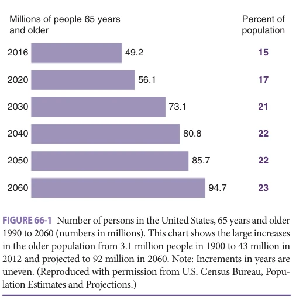
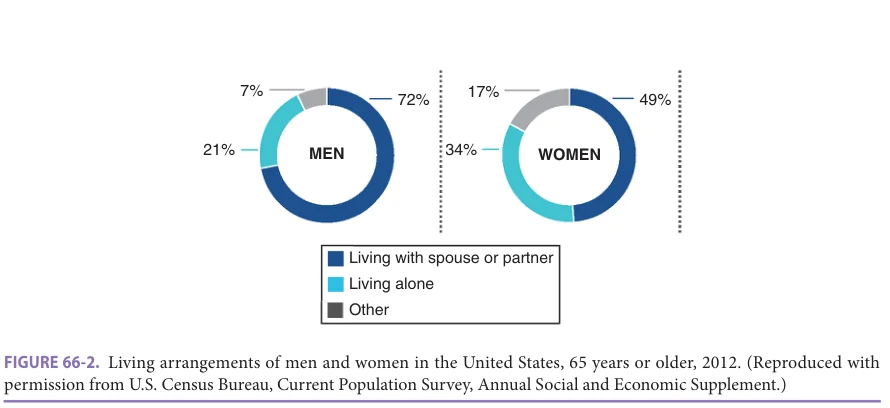
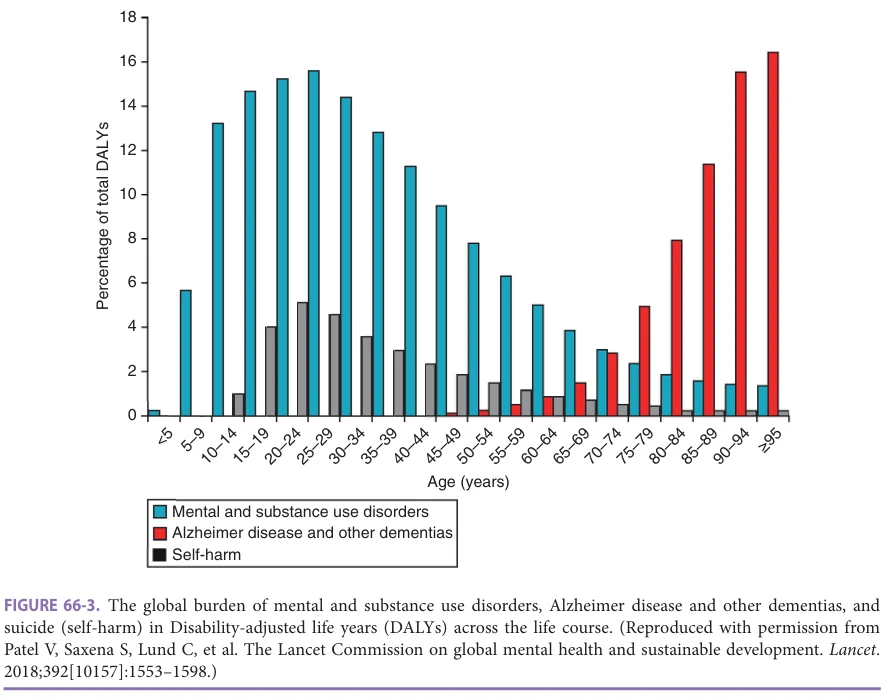
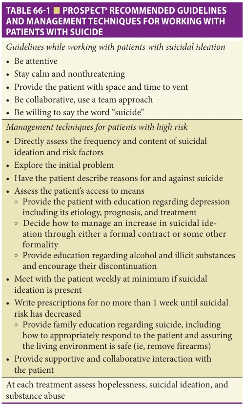

# Hazzard's Geriatric Medicine and Gerontology, 8e - Chapter 66: General Topics in Geriatric Psychiatry

Ellen E. Lee, Jeffrey Lam, Dilip V. Jeste

> **Status.** Fast build from the book; not lane-reviewed.

> Cited in the 2020-22 past papers (Hazzard 7e, linked by chapter).

> **Source and method.** Printed pages 1021-1044, from the marked 8th-edition copy (PDF page = printed page + 34). Prose follows its text layer; tables and figures are source-page crops. The book is canonical.

**[p. 1021]**

## MENTAL HEALTH ISSUES IN AGING

### Relevant Population Demographic Information

The fact that the population in the United States will grow older in the coming decades is now widely recognized. Health care professionals continue to devote increasing time to the management of geriatric patients reflecting the dramatic growth in the old and very old adult populations. The overall structure of the population will also change. Projections by the United States Census Bureau estimate that by 2050, the number of individuals older than 65 years will increase from the 49 million in 2016 to 86 million. Those in the oldest age group, 85 years and older, will increase from 6.4 to 19 million individuals. Figure 66-1 depicts the rapid growth in individuals 65 years or older between 1900 and 2060. Changes are also projected in racial and ethnic diversity with increases in both the older and the oldest old cohorts over the next four decades. By 2060, the self-reported racial distribution of those 65 and older will become more diverse, with White and non-Hispanic White groups decreasing, and all other groups increasing. Notably, from 2016 to the projections in 2060, Hispanic or Latino populations will increase their percent of resident population from 18% to 29%, Asians from 6.2% to 9.7%, and two or more races from 2.1% to 6.1%. While female life expectancy and proportion of older women are projected to continue to exceed those of men, this gap is narrowing, which could lead to secondary social and economic changes. Among the 65 years and older age group, the percentage of women will decrease from 56% in 2016 to 54% in 2060. Among those 85 years and older, the percentage of women will decrease from 65% to 61%.

#### Learning Objectives

- Understand the prevalence of mental health and psychosocial problems associated with aging, and their adverse consequences on longevity and quality of life.

- Learn about the epidemiology, common clinical presentations, evaluation tools, and management of psychiatric conditions commonly seen in older adults.

- Acquire information necessary to recognize suicidal behavior in older adults, best ways to assess suicide risk, and effective strategies to manage suicidal patients.

- Understand the principles underlying use of antipsychotic medications in older adults, assessment of their risk-benefit ratio, clinical indications, side effect profile, and monitoring of clinical response.

- Learn about the prevalence, diagnosis, and treatment of substance use and personality disorders in older adults.

- Gain new knowledge about how “successful aging” can enhance emotional and psychological health in older adults, and promote longevity through salutary effects on cognition, physical function, and social interaction.

#### Key Clinical Points

1. The prevalence of psychiatric diseases increases with aging and exerts adverse effects on longevity, cognition, physical health, social interactions, and comorbid illnesses.

2. Mood disorders are common in older adults and associated with a high risk of suicide. It is important to recognize suicidal behavior and learn how to assess suicide risk and best ways to manage suicidal patients.

3. Use of antipsychotic medications in older adults is associated with serious adverse effects, including higher death rates in patients with dementia. None of these (Continued)

The federal Administration on Aging data reveal the current living arrangements and incomes for older adults. In 2019, 57% of community-dwelling older adults lived with their spouse (72% of men and 49% of women) and 28% were living alone (19% of men and 35% of women). Over 2% of older adults lived in institutional settings, including nursing homes; however, this number increases substantially with increasing age and rises to 10% for those 85 years and older. Figure 66-2 displays this information separately for men and women. Data from 2018 showed the median income of older persons was $26,000, $34,000 for men and $20,000 for women. These data varied by race

**[p. 1022]**

medications are Food and Drug Administration (FDA) approved for management of behavioral or psychological symptoms of dementia (BPSD), and there is no evidence from randomized trials that they are effective in managing psychotic symptoms.

4. Anxiety disorders are common in older adults and can present in many forms, including as generalized anxiety disorder (GAD), posttraumatic stress disorder (PTSD), obsessive-compulsive disorder (OCD), or panic disorder (PD). Additionally, anxiety symptoms are often associated with depression, dementia, medical comorbidities, and substance abuse. Psychotherapy and selective serotonin reuptake inhibitors (SSRIs) or serotonin-norepinephrine reuptake inhibitors (SNRIs) are the cornerstone of therapy for most anxiety disorders.

5. Promoting the principles of “successful aging” and positive psychological traits, such as optimism, resilience, and social engagement, enhances neuroplasticity and improves cognition, physical function, and overall quality of life.

with non-Hispanic Whites averaging a higher median income than Hispanics, African-Americans, and Asians.

### Epidemiology of Psychiatric Disorders in Later Life

Mental well-being in older age is no less crucial than at any other stage of life. The Centers for Disease Control

*FIGURE 66-1 Number of persons in the United States, 65 years and older 1990 to 2060 (numbers in millions). This chart shows the large increases in the older population from 3.1 million people in 1900 to 43 million in 2012 and projected to 92 million in 2060. Note: Increments in years are uneven. (Reproduced with permission from U.S. Census Bureau, Population Estimates and Projections.)*

*Owner annotations/highlights are from the marked source copy, not the book.*

and Prevention (CDC) estimates 20% of individuals older than 55 years suffer from a mental health disorder. In older adults, the burden from Alzheimer disease (AD) and other dementias increases, while the burden of other mental disorders, substance use disorders, and self-harm is reported to decrease over lifetime. However, this latter trend may be confounded by underreporting and underdiagnosis. The burden of mental health disorders among older adults is exacerbated by the stigma and lack of help-seeking. Figure 66-3 presents additional information about the burden of mental disorders across the lifespan.

As the United States shifts from a youth-dependent population to an older-aged-dependent population and with the rise of the burden of neurocognitive disorders among older adults, the health care system must keep up with the growing demand for geriatric mental health care. The timely recognition, diagnosis, and treatment of neuropsychiatric illnesses are crucial to maintaining and bolstering the quality of life in older adults, but there is a substantial gap between the supply and demand of mental health care professionals for older adults, which is anticipated to only worsen over the coming years. As health care providers, it will be essential to prepare for these dramatic shifts in population demographics in order to ensure that a proportional growth in geriatric-specific mental health care occurs.

## PSYCHOSOCIAL DEVELOPMENT ACROSS THE LIFESPAN

Health-defining, expected psychosocial developmental tasks or goals, sometimes referred to as psychological developmental milestones, vary according to age range. Psychologist Erik Erikson conceived of one of the most widely used and best-known models for human psychosocial development from infancy through old age and the end of life. Just like Sigmund Freud, Erikson believed that personality develops in a series of stages, however, Erikson’s theory represented a marked a shift from Freud’s psychosexual theory. While Freud’s theory of psychosexual development essentially ended at early adulthood, Erikson’s theory described development through the entire lifespan from birth until death and took into account the impact of social experience across the entire lifespan. The importance of Erikson’s contribution to our modern understanding of psychosocial development cannot be overstated. For example, his efforts have inspired modern contemporaries such as George Valiant, author of a number of books in this area including the book Aging Well. In large part, because of the concepts and theories that Erikson espoused, it is now widely understood that adults of all ages, including the oldest old, may benefit from various forms of psychotherapy as long as these individuals have intact short-term memory and are motivated to make changes in their thoughts, beliefs, and behaviors.

In Erikson’s model, the eighth and final stage of psychosocial development is characterized by the core conflict of

**[p. 1023]**

*FIGURE 66-2. Living arrangements of men and women in the United States, 65 years or older, 2012. (Reproduced with permission from U.S. Census Bureau, Current Population Survey, Annual Social and Economic Supplement.)*

*Owner annotations/highlights are from the marked source copy, not the book.*

integrity versus despair. This late adult stage includes those in the oldest age group 65 years and older. During this time, individuals grapple with answering deeper, existential questions such as, “Did I have a meaningful life?” and they reflect back on the life that they had. Wisdom is the “basic virtue” or resolution for this stage. Those who feel proud and satisfied with their accomplishments will master a sense of integrity. They have a sense of wisdom and acceptance when facing death and other end of life challenges. In contrast, someone who fails to master the developmental milestones of this stage may feel that his or her life has been

wasted or lacked meaning and may experience feelings of regret, bitterness, and despair.

### Ageism

In spite of the steadily growing interest among scientists, clinicians, and members of the general public, aging and later-life stages are often characterized by negative generalizations, myths, and stereotypes. While in the past, many scholars believed that aging was associated with increases in psychopathology, recent research demonstrates that older adults can be emotionally health, and on average may be

*FIGURE 66-3. The global burden of mental and substance use disorders, Alzheimer disease and other dementias, and suicide (self-harm) in Disability-adjusted life years (DALYs) across the life course. (Reproduced with permission from Patel V, Saxena S, Lund C, et al. The Lancet Commission on global mental health and sustainable development. Lancet. 2018;392[10157]:1553–1598.)*

*Owner annotations/highlights are from the marked source copy, not the book.*

**[p. 1024]**

emotionally even healthier than younger and middle-aged adults. Depression and anxiety are not normal parts of growing older. The assumptions of inevitable decline in mental health with aging are often propagated by various forms of media and may even be perpetuated by health care professionals whose opinions are inaccurately biased by sampling error, for example, daily professional exposure to only those older individuals who are ill and in distress. In addition, the older individual may also adopt inaccurate understandings or expectations, when a pejorative view of later life obtained through media or some other type of exposure is internalized and enacted. In addition to stigmas associated with aging in general, an even greater stigma exits for people living with a diagnosis of neurocognitive impairment. Perceptions of the relationship between sexuality, aging, and dementia illustrate some of these misconceptions and stereotypes. While some studies have found sexual activity decreases in frequency with increasing age, there is no limit to sexual responsiveness, and many older people, including those with cognitive impairment, remain sexually active. Furthermore, sexuality has become increasingly important in successive groups of older cohorts. In professional training programs and in clinical care venues, there is a pressing need to challenge these biases and to correct these inaccurate views because of their potential to impact negatively the health and well-being of older adults. For example, because of the ageistic belief that older individuals do not engage in sexually intimate experiences, a clinician may omit questions about the older individual’s recent and ongoing sexual experiences resulting in a missed opportunity to discuss how condom use is not only a form of contraception but also a good method to reduce the risk of sexually transmitted diseases. In addition, ageistic beliefs may be one reason that some clinicians are surprised to learn that many older adults living with dementia illness are leading meaningful, productive, and satisfying lives and may contribute to missed opportunities to help these older adults achieve the highest quality of life possible in spite of their dementia illness.

### Common Emotional and Psychosocial Challenges Associated With Aging

With aging, certain mental health and psychosocial issues begin to emerge. Most notably, the later years of life may be characterized by various losses that for many may not have been present in earlier life stages. Some of these losses are specific to the individual such as loss of function, physical limitations, and decline in physical health and cognition. Medical comorbidities, injuries, or pain may limit mobility, while cognitive decline may jeopardize instrumental activities of daily living or other aspects of independence. As these new issues arise, aging adults may draw upon previous patterns of coping or discover opportunities for positive change and growth. Retirement is a common change and a potential challenge that arises later in life. Many look forward to retirement as the golden years of their life.

Although retirement may offer opportunities for traveling, spending time with family, nurturing old hobbies, and exploring new ones, it also marks a dramatic role transition and change in identity that may not measure up to idealized expectations and may contribute to social isolation. Many individuals also experience notable losses to their social support system including family members, friends, and peers during these years. In these settings, bereavement and grieving are normal responses to loss, but monitoring for an adjustment disorder, complicated grief, depression, or substance misuse may be warranted. Complex grief affects up to 7% of geriatric patients. It may present symptomatically like a major depressive disorder (MDD) triggered by a loss. An individual with complicated grief may meet criteria for MDD and may require treatment of the depression with pharmacotherapy, individual therapy, supportive counseling groups, referral to a specialist or some combination of these options. Feelings of self-worth are often preserved in normal grief reactions. Symptoms such as pervasive hopelessness, helplessness, guilt, diminished ability to experience pleasure, and suicidal ideation should raise concern for a major depressive episode. While a longing to be reunited with a deceased loved one or family member is often normal, careful screening and aggressive treatment may be indicated for more well-defined or active thoughts of suicide.

As physical and functional challenges arise in older patients, the need for a caregiver increases. The primary caregiver is often a spouse or adult child of the older patient. The role of a caregiver is wrought with physical, psychological, and emotional challenges when caring for someone with or without dementia. The caregiver may often suffer from significant morbidity and mortality, and new-onset mental health issues may arise in caregivers during this time. Screening for stressors, coping, and social support helps the clinician direct caregivers to helpful resources and information, which indirectly also helps support the patient and family or caregiving unit. Resources and support groups are often underutilized but effectively offer an opportunity for education, stress management, community, and solidarity. When resources are available, a hired caregiver may help ease the caregiving burden or may be necessary when support from family or close friends is not available.

Older adults are at a particularly high risk for loneliness, defined as the subjective distress arising from an imbalance between desired and perceived social relationships. Subjective loneliness differs from objective social isolation. Aging-related risk factors include widowhood, physical disability, poor health, and caregiving responsibilities. Several studies have found that loneliness increases with aging and that adults aged in the late 80s were more lonely than 60 to 80 year-old adults. Loneliness is associated with negative mental and physical health outcomes— including alcohol and drug abuse, poor nutrition, sedentary behaviors, poor physical functioning, as well as increased mortality. While the relationship is bidirectional, loneliness

**[p. 1025]**

predicts development of depressive and anxiety symptoms. Nine longitudinal studies of nearly 41,000 older adults have reported loneliness to be a significant predictor of cognitive decline as well as development of mild cognitive impairment and dementia. Though the underlying biological processes have not been elucidated, increased amyloid-β and tau burden have been observed in cognitively normal older adults who are lonely.

### Impact of COVID-19 Pandemic

The COVID-19 pandemic has disproportionately affected older adults. Older populations are at a higher risk of experiencing more severe complications and higher mortality when contracting SARS-CoV-2. Due to these heightened risks, older adults have been required to make important adjustments to their day-to-day lives, including stringent physical distancing measures to decrease the chances of exposure. Tragic cases of outbreaks in the nursing home settings and senior housing facilities have further restricted the everyday activities of these populations. As preventive social distancing measures have increased, social isolation has also proportionally increased. The COVID-19 pandemic has been particularly isolating to older adult populations given the lower familiarity levels with technologies to facilitate social interactions or virtual visits by family, friends, or even health professionals.

From a mental health perspective, the dynamic nature of the global COVID-19 pandemic has led to uncertainty, stress, and for some, bereavement. Preliminary evidence indicates that the combination of the challenges due to the pandemic has led to worsening mental health outcomes, including increased incidence of depression and anxiety among all age groups. However, contrary to expectations, preliminary evidence demonstrates that older adults have been more resilient, experiencing fewer negative mental health outcomes compared to other ages.

## COMMON EVALUATION TOOLS

### Cognitive Tests

Cognitive tests are effective tools for screening and diagnosis in ambulatory clinic and inpatient settings when patients are suspected to have cognitive impairment or a neurocognitive disorder. Several different tests are widely used, each with different strengths and weaknesses. Short questionnaires such as the Mental Test Score (MTS) or 6-Item Cognitive IT (6 CIT) are quick to administer but provide limited information. These are used most effectively as screening tools in a population with a high prevalence of cognitive impairment or deficits. The Clock Drawing Test, General Practitioner Assessment of Cognition (GPCOG), Mini-Cog, and Memory Impairment Screen have higher selectivity for neurodegenerative disease and are also quick to administer but similarly provide a limited amount of information. Multi-domain evaluation tools include the Mini-Mental State Examination (MMSE), Montreal

Cognitive Assessment (MoCA), St. Louis University Mental Status Examination (SLUMS), Addenbrooke’s Cognitive Examination (ACE), and Test Your Memory (TYM). These tests provide broader and somewhat more comprehensive picture of the patient’s cognitive abilities and may be best used to detect mild cognitive problems. Disadvantages of these tools include a longer time to administer with the exception of the TYM, which is a self-administered report. These tools are most helpful when assessing patients who are presenting with known memory problems. They help characterize the type and quantify the severity of cognitive deficits when they exist. While these tests are effective in identifying cognitive deficits, they are limited in their ability to diagnose or determine the etiology and type of a dementia.

The gold standard for diagnosing dementia and assessing neurodegenerative diseases and other cognitive deficits is a neuropsychological battery also called neuropsychiatric testing. This extensive and comprehensive assessment is performed by a specialist and may require at least 3 to 5 hours depending on the case. In addition to a full history and clinical interview, a complete neuropsychiatric battery often includes, but is not limited to, the following: California Verbal Learning Test (CVLT-2), Wechsler Adult Intelligence Scale (WAIS-4), subtests of the Wechsler Abbreviated Scale of Intelligence Second Edition (WASI-2), the Mattis Dementia Rating Scale (DRS), subtests of the Wechsler Memory Scale such as Visual Reproduction and Logical Memory, Test of Memory Malingering (TOMM), the Boston Naming Test (BNT), the Halstead-Reitan Battery, the Wide Range Achievement Test (WRAT-4), the Clock Drawing Test, the Trail Making Tests Part A and Part B, the Verbal Fluency tests from the Delis-Kaplan Executive Function Scale (D-KEFS), and the Wisconsin Card Sorting Test-64 (WCST-64). This type of testing also often includes screens for depression and anxiety symptoms which could be influencing cognitive performance such as the Geriatric Depression Scale (GDS) and Geriatric Anxiety Inventory (GAI), respectively. Other psychiatric screening tools which may be used in conjunction with, or in addition to, neuropsychiatric testing for clinical suspicion of other diagnoses or comorbidities include the PHQ-9 for depression, the Young Mania Rating Scale, GAD-7 for anxiety, PC-PTSD for PTSD, and Y-BOCS for OCD.

### Other Evaluation Modalities

Other evaluation modalities, in addition to cognitive testing and screening, help determine the etiology of cognitive deficits or other psychiatric problems. For example, brain imaging, whether obtained from a computed tomography (CT) or magnetic resonance imaging (MRI), may help exclude a neurologic or general medical condition in the differential diagnosis. A brain CT or MRI may also help establish the etiology of dementia. Specifically, a brain CT or MRI assesses cerebral grey matter volume, cortical thickness, and vascular changes such as those that result from

**[p. 1026]**

chronic untreated hypertension or atherosclerosis. Referrals to specialists in geriatric psychiatry and neurology may be warranted when considering or interpreting results of these tests. Other diagnostic tests and emerging methods specifically for making a diagnosis of Alzheimer dementia include cerebrospinal fluid (CSF) amyloid and tau, computer-assisted volumetric brain imaging, fluorodeoxyglucose positron emission tomography (FDG-PET), which measures cerebral glucose metabolism, and single-photon emission computed tomography (SPECT), a measure of cerebral perfusion. At present, Medicare will pay for an FDG-PET in cases when the clinician is not certain whether the patient has Alzheimer dementia or frontotemporal dementia. Future studies seek to identify reliable biomarkers or the combined use of several biomarkers for diagnosing dementia and its subtypes and engaging in prevention and treatment measures early in the course of the disease.

### Evaluation for Delirium

Including delirium in the differential diagnosis is appropriate when assessing changes in mentation, confusion, notable behavioral changes from a previous baseline, and new or sudden onset of psychiatric symptoms. An evaluation for delirium involves a clinical interview and diagnostic evaluation of possible medical causes including medical conditions, medication side effects, or substance intoxication and withdrawal among others. The clinical hallmark of delirium is fluctuations in mental status, especially attention and alertness, and the symptoms are potentially reversible. Tools used in cognitive screening such as the MoCA or SLUMS and other cognitive exercises requiring sustained attention are especially helpful in making the diagnosis of delirium.

## PSYCHOSIS IN OLDER PATIENTS

### Introduction

Psychosis is a general term referring to a mental condition affecting thinking, perceptual experiences, and behaviors in a way that almost always impairs functioning. “Positive” psychotic symptoms include delusions, hallucinations, disorganized speech, and disorganized behavior. “Negative” psychotic symptoms may include reduced social interaction, reduced facial expressivity, reduced physical activity, reduced thought content, and reduced speech. Psychotic symptoms are common in older adults where they may be related to chronic psychotic disorders, mood disorders, neurocognitive disorders, or a symptom of delirium (ie, related to an underlying medical condition). Psychosis is almost always distressing for both patients and their families, and is associated with decreased quality of life and functioning, more caregiver distress, increased health care costs, and increased risk for placement in long-term care facilities. The most common primary psychotic disorders found in older adults are discussed here; mood disorders and delirium are discussed in detail elsewhere in the text.

### Schizophrenia

Schizophrenia is a chronic psychotic disorder that causes significant social and occupational dysfunction. Symptoms of schizophrenia may include delusions, hallucinations, disorganized speech, disorganized or catatonic behavior, and negative symptoms. A diagnosis of schizophrenia requires at least two of these symptoms, one of which must be delusions, hallucinations, or disorganized speech. The symptoms must persist over at least a 6-month period of time and other conditions explaining the symptoms must be ruled out (eg, delirium, mood disorders). The prevalence of schizophrenia is estimated to be 0.6% among adults ages 45 to 64 and 0.1% to 0.5% in older populations. A minority of patients, approximately 20%, have onset of schizophrenia after age 40. Therefore, a majority of older adults with schizophrenia have had an earlier onset followed by a chronic course over many years. Studies suggest that schizophrenia with onset between the ages of 40 and 60, which is described as late-onset schizophrenia (LOS), differs from early-onset schizophrenia (EOS) in several important ways. Specifically, LOS is generally associated with a lower average severity of positive symptoms (ie, delusions, hallucinations, disorganized speech, or behavior), and lower average antipsychotic dose requirement. Further, the vast majority of patients with LOS are women. Accordingly, some have proposed that LOS is a distinct subtype of schizophrenia. At this time, it is not clear if LOS incidence in aging men will increase due to their gradually increasing life expectancy. However, the term LOS has not been incorporated into the Diagnostic and Statistical Manual of Mental Disorders, Fifth Edition (DSM-5), which states “late-onset cases can meet the diagnostic criteria for schizophrenia, but it is not yet clear whether this is the same condition as schizophrenia diagnosed prior to mid-life.”

### Delusional Disorder

Delusional disorder is characterized by the presence of delusions without other primary symptoms of schizophrenia (eg, hallucinations, disorganized speech or behavior, restricted affect). The disorder typically first appears in middle to late adulthood, with an average age at onset of 40 to 49 years for men and 60 to 69 years for women and is, therefore, more common in older adults than their younger counterparts. A diagnosis of delusional disorder can only be made when all other possible explanations for delusions have been ruled out (eg, delirium, neurocognitive disorders, mood disorders, and schizophrenia). According to DSM-5, the lifetime prevalence of delusional disorder is estimated to be 0.2%.

### Psychosis in Neurocognitive Disorders

Psychotic symptoms are common in neurocognitive disorders. For example, it is estimated that 41% of patients with AD will experience psychotic symptoms at some point in the course of their illness. Some common psychotic symptoms in AD include misidentification of caregivers, suspiciousness, and delusions of theft. Hallucinations in AD are

**[p. 1027]**

less common but may occur. Visual hallucinations are common in Lewy body disease and psychotic symptoms may also be associated with other neurocognitive disorders.

### Evaluation

The evaluation of psychotic symptoms in older adults begins with a careful history, ideally by interview with both the patient and a reliable informant such as a family member. The time-course of symptoms can be particularly helpful as patients with chronic psychotic disorders (such as schizophrenia) and mood disorders, which are generally episodic, have a history of symptoms consistent with their diagnosis. Because psychosis is a common symptom of delirium, a medical evaluation should be performed to assess for any possible underlying medical condition. This evaluation may include a physical and neurological examination, laboratory tests, and brain imaging. A careful review of medications that could be contributing to the symptoms should also be done and substance use should be ruled out. The importance of a thorough medical evaluation cannot be over emphasized. Studies suggest that undetected contributing medical conditions may contribute to as many as 34% of hospital admissions for behavioral symptoms in older individuals. The possible explanations for this phenomenon have ranged from the influence of ageism (eg, the myth that paranoia is expected in older individuals), the extra time and effort required to obtain immediately useful historical information from older individuals due to normal age-associated changes in communication (eg, increasingly circumstantial speech, delayed retrieval of information stored in memory and slower speech production), discomfort associated with performing certain aspects of the physical examination in an older individual such as pelvic and rectal examinations, or the extra steps and staff needed to perform certain components of the physical examination in an older individual with a neurodegenerative illness, which has taken away the patient’s ability to understand and cooperate with the examiner. In spite of these and other potential barriers to an optimal medical evaluation, accurately diagnosing and optimally treating medical conditions lead to more rapid restoration of the patient’s health and avoid wasting increasingly precious resources. After assessment for contributing medical conditions and medication side effects referral to a geriatric psychiatrist may be helpful.

### Management and Treatment

Antipsychotic and other medications Antipsychotic medications are commonly used to treat psychotic symptoms in older adults. Antipsychotic medications have been approved by the Food and Drug Administration (FDA) primarily for treatment of schizophrenia. In addition, some are FDA-approved for use in the treatment of bipolar disorder and for use in combination with antidepressants in the treatment of MDD. Antipsychotics are also widely used “off-label” in the treatment of psychosis related to neurocognitive disorders despite limited data to support the

long-term safety and effectiveness of these medications in this population. This widespread “off-label” use of antipsychotics reflects the lack of FDA-approved pharmacological alternatives for psychosis associated with neurocognitive disorders and the stress and suffering these symptoms cause for patients, their families, and others such as individuals living in the same residential care environment. In spite of what is known about the risks of prescribing antipsychotic medications to older individuals, it bears remembering that there are no FDA-approved medications from any class or category for the treatment of BPSD including psychosis nor have there been an adequate number and quality of head-to-head comparison studies of various antipsychotic medications versus medications from other classes or categories to determine if any of the other possibly helpful medications are better at reducing symptoms and/or less likely to cause serious side effects. The American Psychiatric Association Council on Geriatric Psychiatry recently published online a “Resource Document on the Use of Antipsychotic Medications to Treat Behavioral Disturbances in Persons with Dementia.” This document is, perhaps, the most thoughtful, balanced, and helpful summary currently available to help guide clinicians and references recent longitudinal findings indicating that it may actually be the symptoms of psychosis and agitation that lead to increased rates of mortality and institutionalization rather than the antipsychotic medications themselves. In addition, this document emphasizes that nonpharmacological behavioral treatment strategies should be attempted as first-line approaches unless the behaviors are so severe that the patient or others are in imminent danger. Lastly, this document notes that the currently available evidence demonstrating that nonpharmacological approaches are safer or more effective than antipsychotics in the treatment of dementia-related psychosis or behavioral disturbance is limited.

Despite their widespread use, caution is warranted and the potential benefits and risks of antipsychotic use in each older individual patient must be carefully weighed. Pharmacokinetic and pharmacodynamic changes that occur with age lead to an increased sensitivity to antipsychotics in older individuals. Specifically, decreases in total body water and muscle mass combined with a relative increase in the proportion of adipose tissue result in an increased volume of distribution and slower elimination of antipsychotic medications, while decreased hepatic protein synthesis results in more “free” drug in the circulation. Further, increased permeability of the blood-brain barrier occurring with age can lead to higher concentrations of antipsychotic medications in the CNS. Aging is also associated with decreased synthesis and increased metabolism of dopamine, a decreased number of dopaminergic neurons, and decreased density of dopamine (D2) receptors in the brain. This age-related increase in sensitivity to antipsychotics often translates to lower antipsychotic dose requirements for treatment of psychotic symptoms in older adults and places older adults

**[p. 1028]**

at greater risk for antipsychotic-induced side effects such as extrapyramidal symptoms (EPS, eg, parkinsonism). Also of concern in older adults is an increased risk of falls in those taking antipsychotics, likely due to a combination of the autonomic effects, EPS, and sedative properties of the medications.

Because second generation or “atypical” antipsychotics (eg, risperidone, olanzapine, quetiapine, ziprasidone, aripiprazole, paliperidone, iloperidone, asenapine, lurasidone) are generally associated with a lower risk for parkinsonism and tardive dyskinesia than first-generation antipsychotics, they have become popular for treatment of psychosis. Numerous studies, however, have now documented other liabilities associated with atypical antipsychotics including elevated risk of metabolic side effects and the FDA has issued a warning regarding increased risk for cerebrovascular adverse events and mortality in older patients with neurocognitive disorders treated with both atypical antipsychotics and, subsequently, for typical antipsychotics. One study evaluating the long-term safety and effectiveness of atypical antipsychotics in older adults compared four commonly prescribed atypical antipsychotics (aripiprazole, olanzapine, quetiapine, and risperidone) in 332 outpatients older than 40 years with psychotic symptoms related to a variety of psychiatric diagnoses over 2 years of treatment. Concerning findings included a high 1-year cumulative incidence of metabolic syndrome (36% in 1 year), high rates of both serious and nonserious (51%) adverse events, and no significant improvement in symptoms. Further, over half of the study participants discontinued their assigned medication within 6 months, most often due to side effects (52%) or lack of efficacy (26%). These findings suggest that the commonly used atypical antipsychotic medications may be helpful short-term but neither safe nor effective over longer periods of treatment in middle-aged and older adults.

The use of antipsychotic medications to treat schizophrenia in older adults is largely based on studies conducted on younger adults. Risperidone and olanzapine have been shown to be effective for treatment of psychotic symptoms in middle-aged and older adults with schizophrenia in short-term studies. Single short-term trials suggest that aripiprazole and paliperidone could also be beneficial. It is noteworthy that many older adults with early-onset schizophrenia have fewer and less severe delusions and hallucinations compared to their younger counterparts, and small minority of patients may experience sustained remission of illness. A reduction in dose or discontinuation of antipsychotic medication, therefore, may be possible in later years in some aging patients with schizophrenia. Their use for treatment of LOS has not been adequately studied. LOS is generally associated with a better prognosis and lower daily antipsychotic dose requirement than early-onset illness. Data regarding the pharmacological treatment of delusional disorder in older adults are limited in part because patients with delusional disorder tend to lack insight and

are difficult to enroll in randomized placebo-controlled trials. A survey of 48 experts in geriatric care in 2004 found antipsychotics to be the only recommended treatment for delusional disorder in older adults. Case studies and retrospective studies published since that time continue to support that view.

As noted above, there are currently no FDAapproved pharmacological treatments for psychosis related to neurocognitive disorders. However, given the lack of safe and effective evidence-supported alternatives, atypical antipsychotics continue to play a role in the treatment of some patients with memory illness, particularly when the symptoms are severe (with potential for harm to self or others) requiring aggressive treatment. The risk to benefit analysis in these situations is often complex. Potential benefits may include mitigation of agitation-associated injuries to patients (including falls), staff, and family members. Most dementia illnesses are progressive and the need for antipsychotic may recede as the patient’s illness advances and associated additional brain injury has occurred. The only way to determine if antipsychotic medication is still required is to reduce the dose incrementally and observe whether problem symptoms reemerge on the lowered dose. Standardized measures of behavioral symptoms in neurocognitive disorders, such as the Pittsburgh Agitation Scale or the Cohen-Mansfield Agitation Inventory, can be useful to monitor the effects of treatment. Finally, it should be noted that patients with Lewy body disease are commonly sensitive to antipsychotic medications and particularly at risk for severe adverse reactions including parkinsonism, and anticholinergic and hypotensive effects. This sensitivity is most commonly associated with the antipsychotic medications, which are known to be potent dopamine receptor subtype 2 (D2) blockers, but it has also been observed and reported even with the very lowpotency antipsychotics such as quetiapine.

Educating patients and their caregivers about possible risks and benefits associated with antipsychotic use in older adults and sharing the decision-making process are critical. Whatever treatment plan is implemented the prescribing clinician should carefully document in the patient’s record the fact that informed consent was obtained from the patient or, when the patient lacks capacity for the decision, the appropriate proxy decision maker for the patient. If antipsychotic medications are used in older adults for any condition, we recommend starting with a low initial dose (25%–50% of that used in a younger patient) and titrating slowly. In patients who have been stably maintained on antipsychotic medications consideration should be given to incremental dose decreases in order to determine the lowest effective dose. Patients should be vigilantly monitored for side effects and to determine whether the prescribed medication is effectively treating their symptoms.

Non-Antipsychotic Medications In clinical practice, mood stabilizers, antidepressants, and sedative hypnotics are

**[p. 1029]**

frequently used to treat psychosis and associated symptoms such as agitation and aggression, especially in persons with neurocognitive disorders. Yet, none of these medications have received FDA approval for those conditions. Moreover, they carry a clear risk of several major side effects. Therefore, considerable caution is warranted in using these medications in older patients.

Nonpharmacological interventions There are several nonpharmacological interventions which are beneficial for older adults with psychotic disorders. Cognitive Behavioral Social Skills Training (CBSST), a 36-session weekly group therapy program combining cognitive behavioral therapy (CBT), social skills training, and problem-solving training, resulted in improved functioning in of middle-aged and older patients with schizophrenia or schizoaffective disorder compared with a supportive therapy control. Helping Older People Experience Success (HOPES), a year-long program combining social skills training and preventive health care, was associated with improved community living skills and functioning, greater self-efficacy, and lower levels of negative symptoms in older adults with serious chronic mental illness, more than half of whom had schizophrenia or schizoaffective disorder. Functional Adaptation and Skills Training (FAST), a 24-week functional skills course, was also associated with improvement in functioning and decrease in utilization of emergency medical services in older adults with schizophrenia.

As noted above, data regarding psychosocial interventions for psychosis related to neurocognitive disorders are more limited. Small studies have reported benefit with interventions such as one-to-one social interaction, support groups, music therapy, dance therapy, aromatherapy, bed baths, person-centered bathing, and muscle relaxation therapy. Thus far studies testing these approaches, however, have been limited by small sample sizes, lack of appropriate control groups, and suboptimal outcome measures. More research is therefore needed in this area including better-powered, well-designed randomized controlled trials. Many studies of psychosocial interventions for behavioral symptoms in patients with neurocognitive disorders report a high placebo response rate suggesting that increased attention they receive as part of a research study is beneficial.

## MOOD DISORDERS

### Introduction and Suicidal Behavior

Given the preference of many older patients to seek mental health care from their primary care provider coupled with their reluctance to seek care from a mental health specialist, including psychiatrists, the primary care physician often is presented with the very challenging task of assessing and caring for older patients at risk for suicide. Although the emerging trend of “embedding” mental health providers within the primary care clinic environment seems to be an effective method of overcoming the resistance of older

individuals to receive care from psychiatrists and other mental health clinicians, for the time being most older individuals, including those at risk for suicide, will be evaluated and treated by primary care providers.

Chapter 65 of this text provides a very helpful summary of mood disorders in older individuals. This section of the current chapter provides additional information about three topics related to mood disorders: suicide, suicide risk assessment, and the treatment of suicidal ideation.

Older individuals account for a significant proportion of death by suicide in the United States. Statistics from the CDC in 2018 indicates that the rate of suicide among all older adults has increased in the last decade. In 2018, the most recent year for which data are available statistics show that those aged 55 to 64 have the highest suicide rates (20.20 per 100,000), with those aged 65 to 74, 75 to 84, and 85 and older also displaying relatively high numbers (16.31, 18.7, and 19.1 per 100,000, respectively). White males have the highest risk among all adult age groups. Moreover, older adults have the highest rate of completed suicides. With increasing age, the use of firearms as the method for completed suicide has become more common in the United States.

### Suicide Risk Assessment

Establishing rapport is essential when caring for older patients. This is especially true when evaluating and assessing suicide. No matter how skilled the interviewers are, older patients are less likely to disclose thoughts about suicide and self-harm and yet the evaluation is an integral part of the treatment process because it opens up discussion between the patient and clinician, thereby allowing prevention through decreasing access to available means of suicide, building trust, facilitating a supportive therapeutic relationship, and tailoring treatment interventions.

Common barriers to open, effective communication about suicide with older patients include: (1) the belief that people should be able to deal with emotional problems without medical help; (2) the fear of being labeled “mentally ill”; and (3) the fear of being negatively judged by the clinician, fear of being referred to a psychiatrist, and the beliefs that primary care physicians do not understand and cannot help people suffering from depression. Using an empathic approach, the clinician should correct any misinformation. Educating patients and members of their social support system is essential. Tremendous benefits are usually obtained by sharing with the older patients that depressive illness is relatively common, that scientific research has begun to illuminate the underlying physiological basis for the illness and, therefore, views that depression is invariably a sign of character weakness or moral corruption are antiquated, and that scientifically proven, highly effective treatments are now available for depression and associated suicidal symptoms.

All patients with mood, substance use, and psychotic disorders should be assessed for suicide risk. This assessment

**[p. 1030]**

need not be time consuming, especially when occurring in the context of an established therapeutic relationship. Simply asking questions pertaining to suicide can yield very helpful information. A suicide risk assessment requires the identification of suicidal ideation and intent, risk factors, and protective factors. The most important questions to ask concern present suicidal ideation. Contrary to the common belief, asking about suicidal ideation does not increase the likelihood of a patient subsequently developing suicidal ideation. Often using a “normalizing” statement as preface to questions about suicide is helpful. For example: “Sometimes individuals suffering from depression contemplate taking their lives. Have you had similar thoughts?” If a patient responds that he or she is having thoughts of suicide, the clinician should ask if any plans have been made. The lethality of plan should be weighed. For example, a plan to shoot oneself represents high lethality, whereas a plan to drink oneself to death represents lower lethality. If a plan has been made, the clinician should inquire if steps have already been made to carry out the plan such as buying ammunition for a firearm, purchasing rope, or stockpiling medications. Asking about a plan helps the clinician get a better sense of the patient’s actual intent to act on the suicidal thoughts.

Another important part of the interview of a patient with depression is the identification of risk factors. A history of suicide attempts represents the most important risk factor for future attempts; however, most completed suicides are not preceded by unsuccessful attempts. Additional risk factors include hopelessness, including having no reason for living or no sense of purpose in life; feelings of helplessness; high levels of pessimism, rage, or anger; a desire for revenge; impulsiveness, increasing use of drugs or alcohol; withdrawal from friends and family; anxiety; agitation; insomnia; diminished “social connectedness” (eg, being single or living alone or living in a rural area); uncontrolled or chronic pain; male sex; and firearm access. Recent social losses also represent important risk factors, such as the death of a friend or family member, divorce, loss of employment, financial loss, and loss of housing. Worrisome activities include carrying out preparations for death, such as reassigning the responsibility of caring for dependents (children, pets, or a spouse), creating or updating wills, and giving away personal belongings.

Among psychiatric diagnoses, mood disorders carry the greatest risk. The majority of suicide occurs within the context of an active mood episode. The presence of an active substance use disorder along with a mood disorder leads to even greater risk. Physical illness, such as stroke, and disability are also important risk factors for suicide. Generally, the greater is the number of physical illnesses from which an individual suffers, the greater is the risk of suicide. Risk is also elevated the week following admission to, or discharge from, a psychiatric inpatient unit. The impact of neurocognitive disorder on suicide risk is difficult to establish; however, impairment in executive function has been found to be more prevalent in depressed older patients with

a history of suicide attempts compared to those without a history of attempts.

Protective factors are also important to identify. High perceived social support, close interpersonal relationships, feelings of usefulness, perceived ability to achieve goals, a realistic and positive future outlook, and a successful adjustment to aging are examples of protective factors. The presence of these protective factors generally indicates a positive future orientation, meaning that the patient expects life to continue. Additional protective factors include religiousness and spirituality, being married, having children, and having a sense of responsibility to family. Using the above information, a general assessment of risk, should as low, moderate or high should be determined and should be documented in the patient’s medical record. Determining the overall risk for suicide subsequently helps to determine the nature of the treatment that is required. Table 65-1 in the Major Depression chapter (Chapter 65 of this text) outlines the risk factors for suicide as well as protective factors that may decrease the possibility of suicide.

To increase the reliability of the interview, structured suicidal assessment scales can be used. A commonly used suicide risk assessment tool is the Scale for Suicide Ideation, which is a 19-item clinician-rated measure that assess suicidal thoughts and behaviors during the preceding 7 days as well as for the worst moments in the patient’s life as determined by the patient. The Scale for Suicide Ideation thoroughly measures many components of suicide, including suicidal plan, behavior, preparation for an attempt, and anticipation of an attempt. The Geriatric Suicide Ideation Scale is a recently developed, relatively easy to administer scale specifically developed for use with older individuals which has standardized administration and scoring procedures and is sensitive to suicide detection. This scale consists of 66 items and assesses four factors including suicidal ideation, death ideation, loss of personal and social worth, and perceived meaning of life. The SAFE-T is yet another recently developed structured suicide assessment. The SAFE-T reflects the American Psychiatric Association Practice Guidelines for the Assessment and Treatment of Patients with Suicidal Behaviors and consists of the following five steps: (1) eliciting any modifiable risk factors; (2) discovering protective factors that may help reduce suicide risk; (3) inquiring about current suicidal thoughts, behaviors, plans, and intent; (4) weighing factors 1 to 3 to calculate a level of risk and then identifying potential interventions to reduce risk; and (5) documenting risk, risk mitigation efforts and their respective rationales, and plans for follow-up. The well-written guidelines for use of the SAFE-T are available on the internet. In addition, a free pocket card of the SAFE-T is available on the Suicide Prevention Resource Center website (www.sprc.org).

### Management and Treatment of Suicidal Patients

Any patient assessed to be at high, acute risk of suicide should receive an emergent mental health evaluation. If such

**[p. 1031]**

services are not immediately available, most states have laws permitting emergency hospitalization for psychiatric evaluation of patients who, due to a mental illness, present an imminent risk of harming themselves. In general, various types of law enforcement officers are prepared to assist in securing and transporting patients for such an evaluation.

Managing and treating geriatric patients with suicidal tendencies initially involves three steps. The first is to diagnose and treat the current psychiatric disorder. The second step is to assess the suicidal intent and lethality with an emphasis on prevention. And the third is to construct a specific treatment plan tailored to the patient. Guidelines for managing suicide in adults were provided by the American Psychiatric Association’s (APA) 2003 practice guidelines for the assessment and treatment of patients with suicidal behavior.

Major goals of treatment are to help the patient reduce modifiable risk factors while reinforcing protective factors. For example, prescribing no more than a 1-week supply of medication or less if the patient is taking multiple medications that, in combination in overdose, could be lethal. Enlisting the help of family members to remove firearms from the home is another valuable intervention especially given that removing the means of suicide is one of the most effective interventions in suicide prevention. Improving social support through increased supervision from family members and friends, as well as referrals as appropriate to home care and other supportive services, can also markedly diminish suicide risk. In any instance in which a clinician has significant concerns about suicide risk, a referral to a psychiatrist is highly recommended.

For older adults, specific guidelines for treating and managing suicide were provided from the Prevention of Suicide in Primary Care Elderly: Collaborative Trial (PROSPECT). Table 66-1 shows the PROSPECT general recommendations for working with patients with suicide as well as management techniques for patients at high risk. In addition, guidelines for managing suicidal ideation in adults are provided by the American Psychiatric Association.

More recent reviews have identified collaborative primary-care-based depression screening and management as the intervention with the most evidence for preventing suicidal behavior. Other interventions include treatment with pharmacotherapy or psychotherapy, telephone counseling, and community-based prevention.

## ANXIETY DISORDERS

### Introduction

Anxiety disorders are the most common psychiatric disorders from which people suffer, and this remains true for individuals in later life. In fact, twice as many older individuals suffer from anxiety disorders as suffer from major neurocognitive disorders and anxiety disorders affect about five times more older individuals than do mood disorders. The nature of anxiety in older adults, however, does tend to differ in characteristic ways from that of their younger counterparts.

*TABLE 66-1 ■ PROSPECTa RECOMMENDED GUIDELINES AND MANAGEMENT TECHNIQUES FOR WORKING WITH PATIENTS WITH SUICIDE*

*Owner annotations/highlights are from the marked source copy, not the book.*

aPROSPECT, Prevention of Suicide in Primary Care Elderly: Collaborative Trial. Data from Brown GK, Bruce ML, Pearson JL. High-risk management guidelines for elderly suicidal patients in primary care settings. Int J Geriatr Psychiatry. 2001;16(6):593–601.

For example, in older individuals, somatic preoccupation is more common and more intense, and, due to a weakened autonomic response, the intensity of the physical symptoms associated with panic attacks is diminished. Fewer older patients meet full criteria for an anxiety diagnosis, though subthreshold anxiety affects a greater proportion of this population. Prevalence rates for full-criteria anxiety disorders among older adults have been estimated to range from about 5% to 15%, with a 2:1 female predominance. Generalized anxiety disorder (GAD) represents approximately 50% of all anxiety disorders diagnosed in later life, and about half of all cases of GAD develop after an individual reaches 65 years of age. Specific phobia represents approximately 40% of anxiety disorders in older patients. The most common phobia in older adults is fear of falling. Approximately 60% of older adults with a history of falling and 30% of older individuals with no such history report this fear. PTSD, OCD, and PD represent almost all of the remaining 10% of anxiety diagnoses in older individuals.

**[p. 1032]**

Anxiety disorders often present atypically in older individuals including the reported frequency of certain symptoms of anxiety and the manner in which the anxiety symptoms are described. For example, shortness of breath or stomach discomfort may be the only way an older individual may be able to describe feelings of anxiety. In addition to differences in reporting, the diagnostic differential is far broader. A methodical approach to evaluation is recommended with the first step being to assess whether medical conditions and medications/substances might be mimicking, precipitating, or exacerbating the patient’s anxiety symptoms. Medical conditions known to precipitate anxiety include delirium, chronic obstructive pulmonary disease (COPD), pulmonary embolism (PE), anemia, hypoglycemia, hyponatremia, hyperkalemia, angina, and arrhythmias. If the symptoms of anxiety are determined to indeed be the physiological consequence of a medical condition (such as panic attacks caused by a COPD exacerbation, or anxiety due to a seizure disorder), anxiety disorder due to another medical condition should be diagnosed.

Substance-induced anxiety disorder should be diagnosed if the anxiety symptoms are due to substance intoxication or withdrawal. The substance may or may not be a medication (eg, both cocaine and albuterol are “substances”). To accurately make this diagnosis (and, that is, to exclude a primary psychiatric or medical etiology of the anxiety), establishing timing of symptoms in relation to use of the substance(s) in question is crucial. Importantly, the anxiety symptoms should not have been experienced prior to use of the substance and the symptoms should not continue in the absence of continued use of the substance. Anxiogenic medications include anesthetics and analgesics, sympathomimetics and other bronchodilators, anticholinergics, insulin, thyroid preparations, oral contraceptives, antihistamines, antiparkinsonian medications, corticosteroids, antihypertensive and cardiovascular medications, anticonvulsants, lithium, antipsychotics, and antidepressants. In addition, alcohol or benzodiazepine withdrawal is commonly accompanied by intense anxiety, as is caffeine, cocaine, and amphetamine intoxication.

Primary psychiatric diagnoses should be considered after a medical etiology has been ruled out. The clinician should seek to ensure as much parsimony in diagnosis as possible. For example, might the pathology of an individual with three specific phobias be better explained by a diagnosis of GAD. The DSM-5 made few major changes to the diagnostic criteria for most anxiety disorders; perhaps the most substantial change was eliminating the requirement that a patient have insight that their anxiety is “excessive.” Instead, the focus is placed on the frequency of the worry and degree of impairment it causes.

### Specific Diagnoses

Neurocognitive disorder with features of anxiety Anxiety is common in the setting of neurocognitive disorder. In

this clinical context, preexisting anxiety disorders may be altered in character or sometimes exacerbated and newonset anxiety symptoms may arise. Degeneration in various brain regions has been implicated, including the dorsolateral prefrontal cortex, which is involved in modulating the anxious response. A bidirectional effect has been well established in this clinical setting: cognitive impairment tends to worsen anxiety symptoms and anxiety tends to worsen cognition. Just as neurocognitive disorder in the setting of a depressive episode is known to often portend the development of a neurocognitive disorder, so too can new-onset late-life anxiety be a prodrome of neurocognitive disorder. Parkinson disease, with its subcortical pattern of neurodegeneration and characteristic autonomic dysfunction, has been of particular interest because of its high association with not only anxiety but also depressive symptoms. Interestingly, PTSD has been shown to be a risk factor for neurocognitive disorder. Unfortunately, as a person’s neurocognitive disorder progresses, the benefits of previous successful psychotherapeutic treatment may be lost and problematic symptoms may reemerge. Cognitive declines may result in loss of previously mastered coping strategies. For example, loss of inhibitory control in an individual suffering from PTSD can result in a return of anxious rumination about past traumas.

Depressive disorder with features of anxiety Approximately 25% of all older individuals with an anxiety disorder also suffer from MDD, while nearly 50% of older individuals with MDD also suffer from an anxiety disorder. In some individuals, anxiety may be of clinical significance only during depressive episodes, but in others the anxiety is chronic and seems to be an independent risk factor for developing late-life MDD. Those who suffer with both GAD and MDD may be more difficult to treat successfully. Fortunately, in many cases when depression is properly treated, patients will experience an improvement or even remission of anxiety.

Generalized anxiety disorder GAD represents the extreme on the continuum of human anxiety. The core feature is excessive, uncontrollable, an often irrational worry about a broad range of life circumstances. This clinical vignette highlights that in older individuals the focus of their anxiety is often related to their own health, including fears of memory loss and death. Worries also commonly include the health of loved ones, finances, falls, and loss of independence. The worries are also accompanied by physical symptoms such as muscle tension, insomnia, irritability, restlessness, being easily fatigued, and difficulty concentrating. The worries severely interfere with the patient’s ability to function and, as a result, many people become more isolated and limit social and other activities.

When evaluating for GAD, it is important to ask about a broad array of age-appropriate topics that might be a source of anxiety, such as health and finances. With the patient’s permission, interviewing friends and family may

**[p. 1033]**

help to determine if the worry is substantially adversely affecting life quality and to obtain confirmation regarding the frequency and severity of symptoms. If new-onset GAD is suspected, it is recommended that the clinician also check closely for signs of a depressive disorder, as GAD-like anxiety can be a prominent feature of a major depressive episode. GAD is particularly important to diagnose and treat, as it is one of the least likely mental illnesses to spontaneously remit.

Panic disorder A panic attack is a brief, time-limited, wellcircumscribed period of autonomic hyperarousal accompanied by physical symptoms (chest pain or palpitations, sweating, tremor) and cognitive symptoms (fear of imminent death or “losing control”). An individual who suffers repeat panic attacks and who develops a fear of future events as well as avoid situations which they associate with panic is said to suffer from PD. Fortunately, PD rarely develops after the age of 65, and, as previously noted panic attacks tend to be less severe. If an individual does develop panic attacks after the age of 65, there is a substantial chance the panic symptoms are related to a medical condition, such as Parkinson disease, exacerbations of asthma, COPD, or angina.

Agoraphobia Agoraphobia literally means “fear of the marketplace” and an individual suffering from this disorder tends to avoid public places because of fear they will be unable to escape should they develop a panic attack or other embarrassing symptoms (such as incontinence). The condition often develops after an event which the sufferer interprets as being traumatic, such as a myocardial infarction or fall-related injury. Stroke has been associated with late-life onset of agoraphobia. In DSM editions prior to the DSM-5, agoraphobia was linked with PD, but this is no longer the case. In DSM-5, the two are now recognized as distinct, but often overlapping, entities.

Posttraumatic stress disorder Following exposure to a traumatic (generally life threatening) stressor, the development of specific, characteristic symptoms defines PTSD. Briefly, the affected individual involuntarily reexperiences the event (via thoughts, flashbacks, or dreams), avoids situations that induce memories of the event (but may also experience generalized detachment from life), and develops abnormal symptoms of arousal/reactivity, such as an exaggerated startle response or irritability.

Compared to the general population, older adults are less likely to meet the full criteria for PTSD; in particular, fewer symptoms of hyperarousal and avoidance have been noted. Life events associated with aging, such as the death of a spouse, financial and physical decline, and chronic pain may cause reemergence of quiescent symptoms of PTSD (called “delayed PTSD”).

Obsessive-compulsive disorder Unwanted, persistent obsessions and their repetitive, often ritualized compulsive responses, form the core of OCD. Most cases of geriatric

OCD represent a continuation of an illness that most commonly has an onset in the teen years; in other words, new onset of OCD is quite rare in the geriatric population. Interestingly, brain lesions, especially in the basal ganglia, have been detected in those rare individuals who develop late-onset OCD, suggesting neurodegeneration and other brain injury as possible mechanisms.

Social anxiety disorder and illness anxiety disorder A fear of negative evaluation and the anxiety, avoidance, and other responses to social situations that follow characterize social anxiety disorder (SAD). SAD appears to decrease slightly in prevalence with age, as do the precipitating circumstances. Common concerns include incontinence, anxiety related to poor hearing or because of problems remembering people’s names and embarrassment about personal appearance. Illness anxiety disorder, previously referred to as hypochondriasis, is characterized by worry about having a serious illness. One study has shown it to affect about 3% of the visitors to primary care settings. Individuals are often unconvinced by their physician’s reassurances that, in fact, do not have such an illness.

Specific phobias and other specified anxiety disorder The essence of a specific phobia is fear or anxiety about circumscribed objects or situations that is out of proportion to the actual risk posed, coupled with avoidance behavior. Other specified anxiety disorder is diagnosed when the anxiety features do not meet full criteria for a specific anxiety disorder, such as panic attacks with less than four (of the possible 13) associated symptoms. Unspecified anxiety disorder (previously “anxiety disorder NOS”) is most commonly given when an anxiety disorder is suspected, but further information and work-up would be needed to arrive at a more conclusive diagnosis (such as in emergency room settings). Adjustment disorder, with anxiety, should be diagnosed when the reaction to a stressor is out of proportion to reaction that would normally be expected.

### Overview of Treatment

Psychotherapy is mentioned here first because, while it requires more time to administer and may present additional difficulties in the geriatric population, it is largely free of adverse side effects. The most rigorously studied modality is CBT. However, while the CBT literature consistently documents a positive response relative to no treatment, response rates in the older population, generally, are lower than for younger adults. Further, there is no consistent evidence that CBT provides greater benefit than other therapy modalities (eg, supportive therapy). Psychotherapy represents the prominent mode of treatment of agoraphobia, SAD, and illness anxiety disorder, and is used in conjunction with pharmacotherapy in the treatment of other anxiety disorders. Complementary therapy is also useful and largely without adverse side effect; examples include biofeedback, progressive relaxation, acupuncture, yoga, massage therapy, art, music, dance therapy, meditation, prayer,

**[p. 1034]**

and spiritual counseling. A phobia of falling is first treated by accurately assessing the risk of falls and instituting fall-risk precautions, as well as vision optimization, weight-bearing exercise, and balance training such as Tai chi.

In terms of pharmacological management, the treating clinician should first consider which of the patient’s medications might be removed. Older patients are particularly at risk for various forms of suboptimal prescribing, including unnecessary polypharmacy which, even in the absence of agents well-known to cause anxiety, may provoke subclinical delirium and associated anxiety symptoms. For example, a patient with overactive bladder suffering from anxiety might first be treated by testing the efficacy of a decreased dose of oxybutynin before prescribing an anxiolytic medication.

The cornerstone of pharmacological treatment is similar across anxiety disorders. Current evidence most strongly supports the use of an SSRI or SNRI at a dose higher than would be usually used to treat a depressive disorder. The recommended starting dose in geriatric individuals is generally half that recommended for a younger adult. The maximal antianxiety effect of an SSRI generally is achieved after 6 to 12 months of treatment with a therapeutic dose. In treating GAD, there is some evidence that buspirone is effective, but generally requires 2 to 4 weeks to reach maximal efficacy. Gabapentin and to a lesser extent pregabalin have also be studied and appear to be helpful. These medications can be given on a PRN basis, have little habitforming potential and also possess analgesic properties. PD is typically treated with a high dose SSRI combined with psychotherapy (typically CBT and exposure therapy). Surprisingly few rigorous studies of pharmacologic treatment of PTSD have been conducted in older adults. Evidence of efficacy has been shown in individual studies of citalopram, mirtazapine and, for sleep-related PTSD problems only, prazosin. Caution is advised with the use of tricyclic antidepressants (TCAs), given their known cardiotoxicity and anticholinergic side effects (confusion, sedation). Benzodiazepines are also to be used with great caution in older patients, given their negative impact on cognition, tendency to cause physiologic dependence, increased risk of falls and risk of driving impairment. Prescribing benzodiazepines as a knee-jerk reaction to a complaint of anxiety also can reinforce a message to patients that anxiety must be immediately relieved. If benzodiazepines are used, there is only infrequently an indication to continue for more than 6 weeks. In addition to drug–drug interactions, SSRIs carry risks of hyponatremia, bleeding (particularly GI bleeding, and especially when used in conjunction with an NSAID), and may rarely cause parkinsonism and akathisia.

## SLEEP DISORDERS

### Introduction

The DSM-5 defines insomnia as “a predominant complaint of dissatisfaction with sleep quantity or quality,” associated with at least one of the following: difficulty initiating sleep,

maintaining sleep, and/or early morning wakening. The symptoms must cause “significant distress or impairment in functioning” and must occur at least 3 nights per week for at least 3 months.

In a survey of 9000 adults older than 65 years, more than 80% reported at least one problem with sleep, and more than half reported that at least one sleep complaint occurred nearly all the time. Poor sleep is distressing to patients and associated with poor outcomes including depression, anxiety, falls, mortality, long-term care placement, and decreased quality of life. Polysomnography (PSG) studies have confirmed age-related changes in sleep including increased fragmentation of sleep. The proportion of time spent in the lighter stages of sleep (stages 1 and 2) increases with age, especially between early adulthood and midlife, and there are reductions in both the amount of slow-wave (deep) sleep and rapid eye movement (REM) sleep. Most sleep disturbances in older adults, however, are not a normal part of aging. Sleep complaints are often comorbid with medical and psychiatric conditions, and a number of medications and substances are known to cause problems with sleep. Disturbed sleep is, therefore, often a multifactorial problem and careful assessment for all possibly contributing factors is required before concluding the patient’s sleep complaints represent expected age-associated changes in sleep.

Older adults often have medical or psychiatric conditions that contribute to sleep problems. Conditions that cause pain or discomfort, respiratory symptoms, or nocturia are common causes of sleep disturbance. Gastroesophageal reflux disease, diabetes, cancer, neurodegenerative diseases, and mental illnesses are associated with high rates of sleep disturbance. It is also important to consider the effects of medications in older adults who are often taking multiple prescription and over-the-counter medications. Medications that may cause insomnia include stimulants, antihypertensives, bronchodilators, corticosteroids, decongestants, diuretics, and many antidepressants. In addition, sedating medications can cause daytime sleepiness and napping, disrupting nighttime sleep.

### Sleep-Disordered Breathing

Breathing abnormalities occurring during sleep range from snoring to partial (hypopnea) or complete (apnea) cessation of airflow. These events may be caused by airway collapse during sleep or impaired central nervous system signaling and can lead to hypoxemia and repeated arousals throughout the night. A diagnosis of sleep-disordered breathing (SDB) is made when the total number of apneas plus hypopneas per hour is more than 5 to 10. Obstructive sleep apnea (OSA) syndrome is SDB with excessive daytime sleepiness. SDB is more common in older than younger adults. Young and colleagues reported the prevalence of SDB in 5615 adults older than 60 years to be 32% for those ages 60 to 69, 33% for ages 70 to 79, and 36% for ages 80 to 99.

**[p. 1035]**

### Periodic Limb Movements in Sleep and Restless Legs Syndrome

Periodic limb movements in sleep (PLMS) are repetitive movements that can disrupt sleep usually by preventing the patient from falling asleep. The prevalence of PLMS may be up to 45% in adults older than 65 years. Restless legs syndrome (RLS) is a neurologic condition in which patients experience an urge to move the legs or arms, usually accompanied by a dysesthesia that is relieved or partially relieved by movement. The symptoms usually occur at rest or are worse during periods of rest and tend to be worse during the evening. RLS can be secondary to anemia or end-stage renal disease, and there is a growing body of evidence linking other chronic illnesses with RLS, including rheumatoid arthritis, chronic obstructive pulmonary disease, asthma, fibromyalgia, diabetes, Parkinson disease, and multiple sclerosis. The prevalence of RLS is between 8.7% and 19% in older adults and increases with age.

### REM Sleep Behavior Disorder

REM sleep behavior disorder (RBD) is a condition in which the skeletal muscle atonia normally present in REM sleep is intermittently absent, resulting in movements such as punching, kicking, waving, or yelling during REM sleep. RBD typically affects older adults, mostly men. Associations between RBD and neurodegenerative diseases, including Parkinson disease, major neurocognitive disorder due to Lewy body disease, and multiple-system atrophy, have been established and RBD may precede the onset of the clinical neurologic symptoms by years.

### Circadian Rhythm Disturbances

Ageing is associated with less robust circadian rhythms which can result in weaker sleep rhythms. Exposure to synchronizing cues changes with age. Older adults are exposed to less bright light, particularly those with neurocognitive disorders and those living in nursing homes. Less light exposure is associated with more awakenings. Nocturnal secretion of melatonin decreases with age. The timing of the sleep wake rhythm advances and sleep and wake times are routinely several hours earlier than conventional sleep and wake times. This phase shift causes problems if sleepiness in the early evening prevents individuals from engaging in activities they enjoy. Those who stay up may become tired when their wake time remains advanced. Falling asleep in the early evening, (napping) can lead to difficulty falling asleep at the desired and usual bedtime. In these cases, advanced sleep phase disorder is diagnosed. The prevalence of the disorder in older adults has not been established but age is a risk factor.

### Evaluation

Because treatment strategies differ depending on the etiology of the sleep disturbance, a careful and systematic approach to diagnosis is recommended. Assessment of sleep disruption should begin with a detailed sleep history.

It can be helpful to have the patient complete a sleep diary and to get input from a caregiver who may be aware of symptoms (eg, snoring, gasping for air, limb movements) of which the patient is not aware. A medical history may reveal comorbid conditions. Both prescription and overthe-counter medications should be carefully reviewed. In addition, patients should be asked about caffeine, alcohol intake, and the use of recreational and illicit substances such as marijuana and methamphetamine. Primary insomnia is a diagnosis of exclusion when all other potential causes have been investigated and ruled out.

Older adults with SDB may present with symptoms similar to younger adults such as loud snoring, excessive daytime sleepiness, nonrestorative sleep, gasping arousals, witnessed apneas, dry mouth, or headaches upon awakening or may present with complaints of insomnia, nocturnal confusion, cognitive difficulties, enuresis, nocturia, or falls. Although body mass index is a risk factor, older adults with OSA may not be obese. Diagnosis is confirmed by PSG. Patients with PLMS may be unaware of them and may present with other complaints such as difficulty falling asleep, staying asleep, or excessive daytime sleepiness. The diagnosis of PLMS requires an overnight PSG. The diagnosis of RLS can be made on the basis of history. Patients can be asked about unpleasant, restless feelings in their legs, especially in the evening, that are relieved by walking or movement. In patients with significant cognitive impairment, signs of discomfort in the legs such as rubbing or kneading the legs and increased motor activity that are present or worse during inactivity and are lessened by activity may be observed. Exclusion of other conditions that may be mistaken for RLS, such as neuropathy, arthritis, akathisia, pruritus, vascular insufficiency, and anxiety, is important. The RBD screening questionnaire is a 10-item instrument asking questions about dreaming and movements which can be helpful in the assessment of RBD. The relationship between REM sleep and reported complex motor behaviors can be confirmed with PSG that includes video recording. In the assessment of circadian rhythm disturbances, examination of sleep patterns recorded in a sleep diary can be helpful. Objective assessment of sleep (eg, with actigraphy) can also be helpful but is not required.

### Management and Treatment

Treatment of comorbid medical and psychiatric conditions should be optimized, medications that contribute to sleep disturbances avoided, and caffeine and alcohol consumption limited. Treatment of SDB begins with education. Weight loss, in appropriate patients, can yield a reduction in the severity of SDB. Continuous positive airway pressure (CPAP) is the gold-standard treatment. Respiratory depressants, which can increase the duration of apneas, should be avoided.

Treatment of secondary RLS necessitates treatment of the underlying disease. Otherwise treatment of RLS/PLMS in older patients involves the careful use of pharmacologic

**[p. 1036]**

agents. Dopamine agonists (eg, ropinirole and pramipexole) have been shown to reduce the number of kicks and arousals and are the preferred therapy for RLS/PLMS in older patients. Treatment of RBD includes education of the patient and bed partner. Patients and their bed partners can consider taking measures to avoid being injured such as the use of bedrails or sleeping in separate beds. The long-acting benzodiazepine clonazepam is often used for treatment of RBD; however, older adults are more at risk for daytime sedation, falls, and cognitive symptoms with benzodiazepine use.

Evening light exposure has been found to delay circadian rhythms. Some, but not all, studies have shown improvements in objective sleep measures, while a subjective improvement in sleep is consistently observed. The optimal time for light exposure is between 7:00 PM and 9:00 PM, so light boxes are helpful, especially during the time of year when the length of daylight is the shortest. It can also be helpful to minimize morning light exposure by the use of sunglasses when outside in the first half of the day.

For primary insomnia, nonpharmacologic interventions, including education about sleep hygiene, are preferred in older adults. Cognitive behavioral therapy for insomnia (CBT-I) combines cognitive restructuring with one or more behavioral interventions (eg, stimulus control, sleep restriction, relaxation techniques). CBI-I is as effective as medications for short-term treatment of insomnia and is associated with better long-term outcomes in older adults.

In older adults it is especially important to consider potential side effects and medication interactions prior to considering pharmacological treatment. Longacting hypnotics can cause excessive daytime sleepiness, impaired motor coordination, impaired cognition, respiratory depression and may be associated with tolerance and withdrawal symptoms upon discontinuation. There are data to support the short-term effectiveness of nonbenzodiazepine receptor agonists (zolpidem, zolpidem MR, zaleplon, and eszopiclone) in older adults. Eszopiclone and zolpidem MR are FDA-approved for long-term use; however, safety concerns remain including increased risk for falls, cognitive symptoms, driving accidents, and psychiatric disturbances. Several studies support the effectiveness of ramelteon, a melatonin receptor agonist, in older adults with insomnia. Ramelteon is not extensively metabolized by the cytochrome P450 CYP3A4 isoenzyme, reducing the potential for drug–drug interactions but is metabolized by first-pass metabolism, which should be taken into account for patients with hepatic impairment. In practice, it is common to see medications from other classes prescribed for insomnia (eg, antihistamines, antidepressants, antipsychotics, anticonvulsants). There is no systematic evidence to support the effectiveness of these medications, while they are associated with risks in older adults.

## SUBSTANCE USE DISORDERS

### Introduction

According to the 2018–2019 National Survey on Drug Use and Health, estimates indicate about 62% use of alcohol, 21% use of tobacco products, 9.5% use of marijuana, and 0.6% use of cocaine in adults older than 50 years in the prior year. While other substances have not been examined closely in the older population, some estimates place hallucinogen use at 0.3%, inhalants at 0.2%, and methamphetamine at 0.4%. These studies also suggest a gradual increase in prevalence rates of drug misuse as younger cohorts age. Today an estimated 5.7 million older individuals need treatment for substance use disorders. According to this same survey, 3.4% and 1.1% of adults older than 50 years had alcohol use disorder and illicit drug use disorder, respectively. Unfortunately, substance misuse among older adults has not led to increasing emphasis on substance treatment for older adults. While these rates are lower than those in younger adult population, substance use disorders in older adults are often overlooked, understudied, underdiagnosed, and undertreated. Among the many suggested reasons for this is ageism and the associated inaccurate beliefs that the prevalence of substance use among the aging population is low and that the exploration of possible alcohol and substance misuse is not routinely indicated in older adults.

### Alcohol Misuse

Alcohol is the most misused substance across the lifespan, the most well-studied substance and the substance most associated with an increased rate of other substance use in the older population. The National Institute on Alcohol Abuse and Alcoholism recommends no more than three servings of alcohol in 1 day and seven servings per week for older adults, both male and female. Approximately 16% of men and 11% of women older than 65 years meet this criterion for at-risk drinking. Research also indicates that these individuals are more likely to suffer from associated mental health issues such as depression and anxiety.

The impact of alcohol on the aging body should not be underestimated. Older adults experience significantly higher blood alcohol concentrations from a given quantity of alcohol as compared to younger adults; therefore, a safe amount of alcohol use significantly decreases with age. In addition to the normal age-associated physical and physiological changes, a higher rate of comorbid medical issues and the greater use of various medications in older adults also significantly increase the risk for serious adverse consequences from alcohol consumption in older individuals.

The best treatments for alcohol misuse are prevention, early screening, and early intervention. Screening for alcohol use should be routinely conducted in the context of a thorough medical and psychiatric history and physical. Special attention should be paid to the onset of use, the current and past use pattern, the frequency of use, the indications for tolerance, and any evidence of withdrawal symptoms.

**[p. 1037]**

Collateral information from family members or significant others is important as older adults may not report accurate alcohol use patterns due to impairment from use itself or from cognitive deficits. Physical signs of excessive alcohol such as an enlarged or tender liver, bilateral symmetric tremor of the hands, especially when the arms are extended, or changes in the skin such as red palms or acne rosacea, the latter of which is not caused by alcohol use but may be significantly worsened by alcohol. Helpful laboratory tests include elevated mean corpuscular volume, γ-glutamyl transpeptidase level, and aspartate aminotransferase levels. After chronic use, elevated carbohydrate-deficient transferase, serum uric acid, and decreased albumin levels are often seen. The CAGE questionnaire for alcohol use has variable sensitivity and specificity in older adults. Two 10-item questionnaires that have been specifically validated in older adult populations include the Short Michigan Alcohol Screening Test–Geriatric Version (SMAST-G) and the Alcohol Use Disorders Identification Test (AUDIT).

Alcohol contributes to significant morbidity in older adults. Isolated, often binge drinking episodes can lead to increased falls, confusion, poor executive functioning, and other traumatic events. Long-term, chronic use can lead to multiple organ system damage. Alcohol use in the older adult often accompanies depression and anxiety. In fact, often alcohol use treatment must take into account concurrent mental health disorder treatment. Notably, alcohol use is the second most common category of psychiatric risk for suicide attempts and completions. Additional consequences of alcohol use are sleep pattern changes and both short-term (black outs) and long-term (dementia) cognitive deficits.

If formal treatment is indicated, a combination of nonpharmacological and pharmacological treatment routes should be considered. Unfortunately, older-agespecific studies of nonpharmacological interventions for alcohol misuse have been characterized by small sample sizes and have yielded unclear outcomes. Pharmacological options for alcohol use are designed to either decrease craving or negatively reinforce use. Naltrexone is the most well-studied medication for alcohol use disorder in older adults and is an opioid-receptor antagonist that decreases craving by attenuating pleasure derived from alcohol use. Acamprosate is another drug with limited efficacy demonstrated in older adults that is believed to affect the reward pathway in the brain, also reducing craving. Disulfiram inhibits aldehyde dehydrogenase leading to uncomfortable accumulation of acetaldehyde, which results in flushing, sweating, nausea, and other uncomfortable symptoms. Disulfiram, however, is seldom used in older adults due to significant side effects such as changes in blood pressure and heart rhythm that can complicate heart disease and a number of significant drug–drug interactions due to inhibition of the metabolism of a number of medications including warfarin, phenytoin, isoniazid, and some benzodiazepines (eg, diazepam).

One of the most important aspects of alcohol misuse management in older adults is the accurate recognition and appropriate treatment of withdrawal. Alcohol withdrawal is especially dangerous in older patients due to the increased likelihood of seizures, irreversible damage to the brain, delirium, and other serious consequences. In the context of possible alcohol withdrawal, clinical assessment must be detailed and special attention must be paid to comorbid medical conditions and associated medication use. Supportive therapy must be initiated immediately to replace volume loss, correct electrolyte abnormalities, prevent falls, and correct vitamin deficiencies. The standard of care regarding medication to mitigate withdrawal symptoms and to prevent delirium tremens is a benzodiazepine. Unlike in younger adults, chlordiazepoxide is not the preferred or common choice of benzodiazepines. Lorazepam, oxazepam, or temazepam are preferred for older patients due to their intermediate half-life, relatively low lipid solubility, which minimizes undesirable accumulation in the lipid compartment, and their major biotransformation pathway of conjugation with glucuronic acid resulting in 70% to 75% of the administered dose being excreted as the glucuronide conjugate in the urine. This last characteristic allows for their use even in patients with severe hepatic dysfunction. Even with these advantages for the older patient, the use of one of these benzodiazepines must proceed with great care in order to avoid compounding the problems of withdrawal by increasing risks associated with excessive sedation and delirium including falls and respiratory sedation. The combined effect of the benzodiazepine with other medications being used by the older patient must be continuously assessed.

### Benzodiazepine Misuse

While benzodiazepines are integral in treatment for alcohol withdrawal, they are also often misused in the older population. Commonly they are over prescribed and dosed above the amount required for the intended indication. Even when initially started at appropriate doses, benzodiazepines are continued without a definitive end point of use, which often leads to increased tolerance.

One of the most common reasons for benzodiazepine prescription is insomnia. As discussed in the section of this chapter devoted to sleep disorders, the causes and contributors to insomnia in older adults are various and include gender (higher risk for women), relationship status (single, widowed, or divorced), medical (multiple medical conditions), cognitive (dementia), polypharmacy, poor sleep hygiene, and mood disturbances. Despite these numerous possible etiologies of insomnia, benzodiazepines are often inappropriately used as the first-line agent for sleep complaints.

Another common reason for benzodiazepine prescription is for the treatment of anxiety. As with insomnia, causes of anxiety are often multifactorial and benzodiazepines are not be the ideal treatment in most instances.

**[p. 1038]**

Agarwal and Landon reported increasing rates of outpatient benzodiazepine prescribing over a 12-year period, yet Gerlach and colleagues found limited evidence of benefits from benzodiazepine usage in older adults. Over time many patients require increasing doses to achieve anxiety symptom abatement, which leads to complications, adverse events, and ultimately, the potential for dependence. As with alcohol, older adults have increased sensitivity to benzodiazepines, as metabolism is significantly slower in older adults. The risk for cognitive impairment, delirium, falls, sedation, and other unwanted effects are elevated. With physiological dependence setting in, benzodiazepine withdrawal mimics that of alcohol withdrawal and puts the older adult at similar risk as that of alcohol misuse. The evaluation and treatment of benzodiazepine withdrawal is virtually identical to that of alcohol withdrawal. To prevent benzodiazepine overuse, misuse, and complications, clinicians should carefully elicit the etiology of the sleep or anxiety complaints in order to find the optimal treatment and to minimize the use or benzodiazepines.

### Opiate Misuse

Increased opioid misuse in older age cohorts has become an increasingly worrisome trend. Older adults are the most likely age group to be prescribed opioids long-term. A disturbing trend in the United States is opiate pain medication misuse. The most common rationale for opiate use is the treatment of chronic pain. Although the undertreatment of pain continues to be a problem for older adults, there is no evidence that sustained, long-term use of opiate-family pain medications leads to better outcomes. Opioids increase the risk of psychological and physiological tolerance. Furthermore, as older adults are more sensitive to medications, opiate misuse often causes sedation, constipation, cognitive impairment, and respiratory suppression, especially in context of polypharmacy and concurrent alcohol use.

Even with these unacceptable side effects, opioids remain one of the most potent pain-relieving medications. There is great controversy over appropriate guidelines on when and how to prescribe these medications. Many of the guidelines focus on curtailing long-term use, appropriate selection of drug and dose, and developing strategies for continual screening and monitoring.

Clinicians can prevent opiate misuse by maximizing the use for alternative treatments for pain in older adults. These other treatments can be tailored to each patient by examining the causes for the pain complaints and by not treating pain as a single entity unto itself. Even the medication alternatives to opiates for pain control also have potential serious adverse reactions and side effects. For example, overuse of NSAIDs can lead to gastropathies and TCAs are not well-tolerated in the older population. Considering acetaminophen as the first-line agent for pain control is recommended. Additionally, consideration should be given to SNRIs, gabapentin, and pregabalin as treatments for chronic pain. In context of opiate dependence, the clinician

is advised to consider community substance use programs that include peer support and educational groups. The use of methadone, naltrexone as buprenorphine as treatments for opiate dependence has not been well studied in older populations.

### Marijuana Misuse

Rates of marijuana use and misuse have increased substantially in the last few years. While marijuana use in adults older than 65 years in the United States was 0.4% in 2006, this rate has increased to 5.1% in 2019. The prevalence of marijuana use will likely continue to increase in older adults given marijuana use prevalence in younger cohorts and the growing movement toward marijuana legalization in the United States.

While there have been dramatic increases in marijuana use rates among older adults, scientists still know little about its effects on cognition, drug interactions, pharmacokinetics, and risk for adverse effects in this age cohort. In the older adult population, the full health impact of chronic marijuana use has yet to be determined, but recent studies indicate that marijuana negatively impacts cognitive function. Contrary to previous expectations, there is no adequate evidence to support the belief that marijuana can serve as an effective treatment for dementia or for symptoms of depression or anxiety. At this time, clinicians are recommended to screen for and provide counseling for possible marijuana misuse in older adults.

### Misuse of Other Substances

Older adults also commonly misuse tobacco, with 8.2% of adults older than 65 years engaging in current cigarette smoking behavior. Despite widespread cigarette smoking prevention and cessation efforts, among older adults, misconceptions about nicotine use persist. For example, some continue to believe that in older adults, smoking cessation does not yield any benefit and that smoking can help with pain, mood, and cognition. None of these are validated nor should be reasons to omit screening for smoke cessation when caring for an older adult. Additionally, smoking is commonly related to comorbid anxiety and other substance misuse. Behavioral modifications can be very helpful for smoking cessation. Pharmacological methods for cessation include nicotine replacement therapy and medications designed to impact the reward pathway for smoking. Bupropion and varenicline have good evidence for smoking cessation in adults but evidence for their effectiveness in older adults is lacking. Bupropion is also potentially mood elevating and may lead to increased anxiety symptoms in some patients. For varenicline, there is a widely publicized negative effect on mood and potential to increase suicidal behavior. With a high prevalence rate of co-occurring anxiety and depression in older adults with substance use issues, it is important that varenicline’s potential negative effect on mood and suicidal behavior is closely monitored by the clinician.

**[p. 1039]**

## PERSONALITY DISORDERS

Research in personality and personality pathology in older cohorts is an emerging field primarily driven by the increasing number of older individuals, but already some patterns and key findings have emerged. Personality traits are enduring, consistent behaviors forming a unique profile that distinguishes individuals from each other and predicts an individual’s response to experiences or stressors. These traits are apparent as older adults respond to normal milestones and pathology associated with aging. Because personalities are defined by long-standing patterns of behavior, global personality, and personality structure tend to remain stable with aging; however, neurologic or degenerative disease and brain injury in addition to positive changes associated with aging can lead to observed personality changes and shifts. For example, traits such as neuroticism, extraversion, and openness tend to decrease with age, while altruism and conscientiousness increase with age.

Personality disorders are organized into three groups or clusters in the DSM-5. Cluster A disorders include paranoid, schizoid, and schizotypal personality disorders. They are characterized by bizarre, eccentric behavior, and magical or delusional-type thinking. The cluster B disorders include antisocial, borderline, histrionic, and narcissistic personality disorders. Cluster B disorders are characterized by impulsive behaviors, interpersonal instability, and unstable or labile affect. The cluster C disorders are avoidant, dependent, and obsessive-compulsive personality disorders. Disorders in this cluster are driven by an anxious diathesis that leads to worry, fear, rigidity, and isolation.

The prevalence of personality disorders in the general adult population is about 12%. While personality disorders in older adults have not been well studied, large epidemiological surveys have found the prevalence of at least one personality disorder in older adults ranging from 11% to 15%. In certain geriatric subpopulations, however, the prevalence may be higher. For example, in geriatric patients with MDDs and dysthymia, up to a third also have a personality disorder, most commonly avoidant, dependent, or other cluster C disorders and traits. In older adults, the odd traits associated with cluster A personality disorder and the anxious behaviors of cluster C personality disorders are more common that the impulsive behaviors seen in cluster B personality disorders, which are more common in younger adults. Of those older adults in the psychiatric outpatient population, anywhere from 5% to 33% meet criteria for personality disorder. Rates increase in geriatric patients receiving inpatient mental health treatment with prevalence rates ranging from 7% to 80%. In some cases, the impact and severity of symptoms in those with a known diagnosis of a personality disorder may worsen later in life. For example, an exacerbation of symptoms and behaviors may occur in the setting of significant social stressors such as the loss of a supporting person or other stabilizing environmental factors such as a job. Currently, prevalence data

in older age groups are limited by the current methods and assessment tools used in epidemiologic studies directed at personality and personality disorders, which may inadequately correlate to the specific behaviors in older individuals. Further research and attention to this emerging field is needed to better understand the manifestation of traits and diagnosis of personality disorder in older adults. Additional disorders outside of this classification system include personality change due to another medical condition, other specified personality disorder and unspecified personality disorder.

In the DSM-5, personality disorders are defined as “an enduring pattern of inner experience and behavior that deviates markedly from the expectations of the individual’s culture.” This definition suggests a chronic course of longstanding, maladaptive coping behaviors with typical onset in adolescence or early adulthood that may persist into later life stages. The diagnosis of a personality disorder in an older adult requires integrating multiple sources of information such as patient information and medical history, self-reported autobiographical history, self-description, collateral from peers, family, supports or other informants, clinical observation of exhibited behaviors, and patterns of coping. Structured interviews or personality questionnaires may also aid in the diagnosis and synthesizing a formulation of personality and behavior patterns.

The diagnosis of a personality disorder can be challenging in the presence of an exacerbation of acute psychiatric symptoms, especially in the setting of limited history or collateral. For example, maladaptive coping behaviors and traits observed in an individual with a mood or anxiety disorder may be symptoms of the mental illness. In this case, further history or resolution of the behaviors or traits with treatment of the underlying mental illness may help clarify the diagnosis. Making a distinction between functional impairments due to psychological or environmental factors associated with aging and impairments resulting from personality pathology may further complicate assessment and diagnosis of a personality disorder.

Borderline personality disorder (BPD) is commonly encountered challenge in primary care and mental health settings with high comorbidity associated with other psychiatric disorders, chronic pain, fibromyalgia, and migraines. In addition, it is associated with worse outcomes in the treatment of other comorbid psychiatric illnesses. The disorder is characterized by interpersonal instability that is not only present in their personal life and support systems but may also play out in the doctor patient relationship through what is commonly referred to as transference and countertransference. Other traits include affective instability, emotional lability, impulsive behavior, identify disturbance, fear of abandonment, and feelings of emptiness or other dissociative symptoms. The etiology is often multifactorial including genetic vulnerability, brain abnormalities, developmental arrests, and experiences early in life especially with respect to trauma, abuse, abandonment, and absence

**[p. 1040]**

of secure attachments. Remission rates are relatively high compared to other personality disorders; however, relapses can occur. In addition, remission of diagnostic criteria does not necessarily correlate with functional improvement. Up to 80% of patients with BPD exhibit suicidal behavior, and 60% to 70% make suicide attempts. Although this suicidal behavior does not necessarily lead to completed suicide, it remains a significant cause of death in this population. In addition, the severity or potential lethality of suicide attempts may increase or escalate with subsequent attempts or suicidal behaviors. Manualized, structured therapies such as dialectical behavior therapy (DBT), transferencefocused psychotherapy, and mentalization-based therapy (MBT) are the mainstays of treatment. While symptomfocused psychopharmacology can be a helpful adjunctive treatment, polypharmacy should be avoided when possible.

Geriatric patients with personality disorders are at greater risk of depression, suicide, cognitive impairment, and social isolation. Developing a treatment plan that addresses the symptoms, behaviors, and associated functional impairments is an essential part of recovery and wellness in this population. There are several approaches to the treatment of personality disorder, and depending on the case, a multifactorial strategy may be warranted, especially in complicated or treatment-resistant cases.

In the evaluation and diagnostic period, the first step is to identify and treat any comorbid primary psychiatric illnesses. This will help clarify the target symptoms and clarify the nature of more long-standing maladaptive behaviors in contrast to symptoms of a mental illness. Common diagnoses or comorbidities to consider in the differential diagnosis include mood or depressive disorders, anxiety disorders, late-onset schizophrenia, delusional disorder, and delirium. Medical comorbidities should also be considered and ruled out. Somatization is a common symptom encountered in personality disorders where physical symptoms and perceptions may be psychologically driven. If somatic symptoms persist even after medical conditions have been ruled out, consideration of an underlying personality disorder, somatization disorder, or other commonly comorbid condition such as fibromyalgia and their respective treatments may be warranted.

Given the chronic and pervasive nature of personality disorders, full remission may be unrealistic, but evidence-based treatments have been characterized that improve the severity of symptoms, decrease impairment, and provide insight. Research in older adults with personality disorders demonstrates that DBT and schema therapy are effective treatment options. Other possible therapies include CBT, interpersonal therapy (ITP), and problem-solving therapy (PST). The efficacy of therapy may be more limited in the setting of significant neurocognitive disorders with associated memory and executive functioning impairments.

Other effective behavioral interventions include the implementation of structure and clear boundaries.

Clinicians can use aspects of the therapeutic treatment frame to set appropriate boundaries and limitations, schedule regular appointments to check in and prevent escalating crisis, and communicate with all providers to unify the treatment strategy and avoid common defenses such as splitting between members of the treatment team. Clear communication, minimizing polypharmacy, and learning how to respond to commonly encountered behaviors further enhances therapeutic rapport and positive treatment outcomes. The use of a behavior contract or treatment agreement is helpful, especially in cases problem behaviors persist despite the aforementioned measures. This is a document drafted in conjunction with the patient where boundaries, expectations, treatment goals, and consequences to nonadherence are agreed upon by the patient and the treatment team. Therapeutic power of a treatment agreement is increased if members of the patient’s support system are allowed to read and then subsequently support its content. Signing such a document adds an additional level of clarity to boundary setting and commitment to the treatment.

Some studies also suggest improved outcomes with a combination of therapy and medications, which also speaks to the high rate of comorbidities between personality disorders and other psychiatric illness or diagnoses. When considering pharmacotherapy, strategies should consider targeting specific symptoms or the predominant presenting problems. Classes of medication to consider when targeting individual symptoms include second-generation antipsychotics, mood stabilizers, and serotonergic medications. Naltrexone and clonidine are used in the setting of self-mutilation and the associated impulsivity of this harmful, maladaptive behavior. Similar to treatment of any medical or psychiatric condition in a geriatric patient, safe and effective pharmacotherapy accounts for compliance and risk for noncompliance, abuse potential, pharmacokinetics, pharmacodynamics, interactions with other medications, and effect on other age-specific comorbidities.

## SUCCESSFUL AGING

As part of the trend toward ever increasing life expectancy and the unprecedented increase in the proportion of the population which is older, a new focus has been placed on what is now called “successful aging.” The concept of “successful aging” stands in stark contrast to the deep-rooted cultural and societal ageistic beliefs, which were discussed above and which affect our patients and how they may be perceived. The definition of “successful aging” and its determinants remains variable. The original model by Rowe and Kahn included three domains: absence of disease and disability, high cognitive and physical functioning, and active engagement with life. This model, however, has been criticized for its overemphasis on health and because it fails to account for many individuals who do not meet the Rowe and Kahn criteria for physical health and yet subjectively rate themselves as aging successfully and report a

**[p. 1041]**

high degree of satisfaction in later life stages. Newer definitions of “successful aging” have been modified so that they apply to older individuals with and without medical and psychiatric morbidities. Qualitative studies of successful aging indicate that older adults consider the ability to adapt to circumstances and positive attitude toward the future as being more important than an absence of physical disease and disability. Investigations have revealed a paradox of aging: even as the physical health declines, self-rated successful aging and other indicators of psychosocial functioning improve in later life.

Neuroscience research during the past 15 years has demonstrated neuroplasticity of aging—that is, if there is optimal physical, cognitive, and social activity, development of new synapses, dendrites, blood vessels, and even neurons in specific regions such as dentate gyrus of the hippocampus can happen, in older animals and probably in humans. Clinical research supports a model in which positive psychological traits such as resilience, optimism, and social engagement interact with and feed into each individual’s evaluation of the degree of well-being, and are a stronger predictor of outcomes such as self-rated successful aging than physical health. Moreover, several of these traits have been shown to have a positive effect on survival that rivals or exceeds that of well-established health risk factors such as smoking, hypertension, obesity, and sedentary lifestyle. One quality that has been reported to increase with age in some, but not all, studies is wisdom, conceptualized as a complex trait associated with advanced cognitive and emotional development, which is experience-driven. Research on wisdom has only recently gained some interest among scientists, although the concept of wisdom dates back to ancient times. Despite variability among the different published definitions of wisdom, there are several common elements, including prosocial attitudes and behaviors (eg, compassion, empathy), social decision making, insight,

## FURTHER READING

Abrams RC, Bromberg CE. Personality disorders in the

elderly: a flagging field of inquiry. Int J Geriatr Psychiatry. 2006;21:1013–1017. American Psychiatric Association. Diagnostic and Statis-

tical Manual of Mental Disorders. 5th ed. Washington, DC: American Psychiatric Association; 2013. APA Council on Geriatric Psychiatry. Resource Document

on the Use of Antipsychotic Medications to Treat Behavioral Disturbances in Persons with Dementia. Published online March 2014. http://www.psychiatry.org/practice/ professional-interests/geriatric-psychiatry/geriatric. Accessed February 22, 2022. Blazer DG, Wu LT. The epidemiology of substance use and

disorders among middle aged and elderly community

decisiveness, acknowledgement of uncertainty, emotional regulation, openness to new experience, spirituality, and sense of humor. What unites these components is their utility for the self (eg, greater well-being) and for others (serving common good).

Successful aging is also seen in some people with serious mental illness. Studies have found that relative to their younger counterparts, middle-aged and older adults with schizophrenia tend to have better psychosocial functioning, including better adherence to medications and self-rated mental health, and lower prevalence of substance use and psychotic relapse. Survivor bias is not the primary explanation for this finding. A minority of older persons with schizophrenia experience sustained remission. Reported predictors of sustained remission include psychosocial support, early initiation of treatment, better premorbid functioning, and having been married.

Mental health and primary care providers have a unique opportunity to help promote “successful aging” by teaching patients and their family members the principles of health, nutrition, and wellness and by facilitating improved quality of life by treating symptoms, improving function, and developing psychosocial interventions. Ongoing studies of “successful aging” are continuing to clarify the definition and are focusing on findings that have clinical utility. Strategies to enhance successful aging include calorie restriction, physical exercise, stopping smoking and substance use, eating the so-called super foods (eg, broccoli, cabbage, cauliflower, spinach, vitamin E, curcumin) rich in antioxidants, and ensuring appropriate health care. Equally important are cognitive and psychological strategies such as developing positive attitudes and resilience, learning new skills, engaging in stimulating activities, and optimizing stress. An important principle to remember is that it is never too early nor too late to start on the path to successful cognitive and emotional aging.

adults: National Survey on Drug Use and Health (NSDUH). Am J Geriatr Psychiatry. 2009;17(3): 237–245. Bostwick M, Rackley S. Addressing suicide in primary care

settings. Curr Psychiatry Rep 2012;14:353–359. Conwell Y, Van Orden K, Caine ED. Suicide in older adults.

Psychiatr Clin North Am. 2011;34(2):451–468. Granholm E, Holden J, Link PC, et al. Randomized con-

trolled trial of cognitive behavioral social skills training for older consumers with schizophrenia: defeatist performance attitudes and functional outcome. Am J Geriatr Psychiatry. 2013;21:251–262. Holt-Lunstad J, Smith TB, Baker M, Harris T,

Stephenson D. Loneliness and social isolation as risk

**[p. 1042]**

factors for mortality: a meta-analytic review. Perspect Psychol Sci. 2015;10(2):227–237. Hornyak M, Trenkwalder C. Restless legs syndrome and

periodic limb movement disorder in the elderly. J Psychosom Res. 2004;56(5):543–548. Jeste DV, Savla GN, Thompson WK, et al. Association

between older age and more successful aging: critical role of resilience and depression. Am J Psychiatry. 2013; 170:188–196. Jin H, Shih PA, Golshan S, et al. Comparison of longer-term

safety and effectiveness of 4 atypical antipsychotics in patients over age 40: a trial using equipoise-stratified randomization. J Clin Psychiatry. 2013;74:10–18. Kotwal AA, Holt-Lunstad J, Newmark RL, et al. Social isola-

tion and loneliness among San Francisco Bay area older adults during the COVID-19 shelter-in-place orders. J Am Geriatr Soc. 2021;69(1):20–29. Krendl AC, Perry BL. The impact of sheltering-in-place

during the COVID-19 pandemic on older adults’ social and mental well-being. J Gerontol B Psychol Sci Soc Sci. 2021;76(2):e53–e58. Lee EE, Depp C, Palmer BW, et al. High prevalence and

adverse health effects of loneliness in community-dwelling adults across the lifespan: role of wisdom as a protective factor. Int Psychogeriatr 2019;31(10):1447–1462. Lenze EJ, Wetherell JL. Anxiety disorders. In: Blazer DG,

Steffens DC, eds. The American Psychiatric Publishing Textbook of Geriatric Psychiatry. Arlington, VA: American Psychiatric Publishing, Inc; 2009:333–345. Mohlman J, Bryant C, Lenze EJ, et al. Improving recog-

nition of late life anxiety disorders in Diagnostic and Statistical Manual of Mental Disorders, Fifth Edition:

observations and recommendations of the Advisory Committee to the Lifespan Disorders Work Group. Int J Geriatr Psychiatry. 2012;27(6):549–556. National Institute on Alcohol Abuse and Alcoholism.

Alcohol and Aging. http://niaaa.nih.gov. Accessed February 22, 2022. Neikrug A, Ancoli-Israel S. Sleep disorders in the older

adult—a mini-review. Gerontology. 2010;56(2):181–189. Norman D, Loredo JS. Obstructive sleep apnea in older

adults. Clin Geriatr Med. 2008;24(1):151–165. Okolie C, Dennis M, Simon Thomas E, John A. A system-

atic review of interventions to prevent suicidal behaviors and reduce suicidal ideation in older people. Int Psychogeriatr. 2017;29(11):1801–1824. Penders KA, Peeters IG, Metsemakers JF, Van Alphen SP.

Personality disorders in older adults: a review of epidemiology, assessment, and treatment. Curr Psychiatry Rep. 2020;22(3):1–14. Stanley B, Brown G. Safety Plan Treatment Manual to

Reduce Suicide Risk: Veteran Version. 2008. http://www .mentalhealth.va.gov/mentalhealth/suicide_prevention. Accessed February 22, 2022. Uchida H, Mamo DC, Mulsant BH, et al. Increased antipsy-

chotic sensitivity in elderly patients: evidence and mechanisms. J Clin Psychiatry. 2009;70(3):397–405. Wenneberg AM, Canham SL, Smith MT, et al. Optimiz-

ing sleep in older adults: treating insomnia. Maturitas. 2013;76(3):247–252. Woo BK, Daly JW, Allen EC, et al. Unrecognized medi-

cal disorders in older psychiatric inpatients in a senior behavioral health unit in a university hospital. J Geriatr Psychiatry Neurol. 2003;16(2):121–125.

**[p. 1043]**

IV Part

Chapter 67. Palliative Care and Special Management Issues / 1045 Chapter 68. Pain Management / 1055 Chapter 69. Management of Common Nonpain Symptoms / 1071 Chapter 70. Palliative Care Across Care Settings / 1077 Chapter 71. Effective Communication Strategies For Patients with Serious Illness / 1089 Chapter 72. Ethical Issues / 1097

**[p. 1044]**
