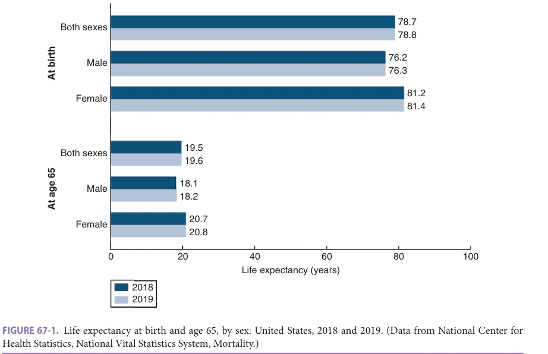
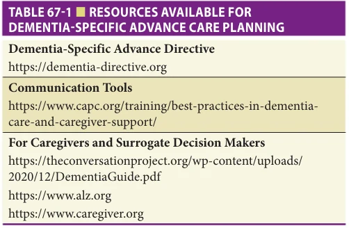
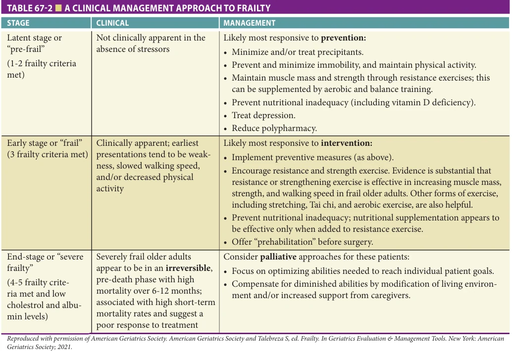
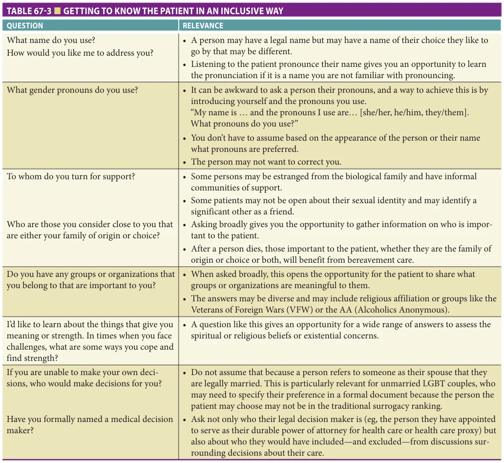
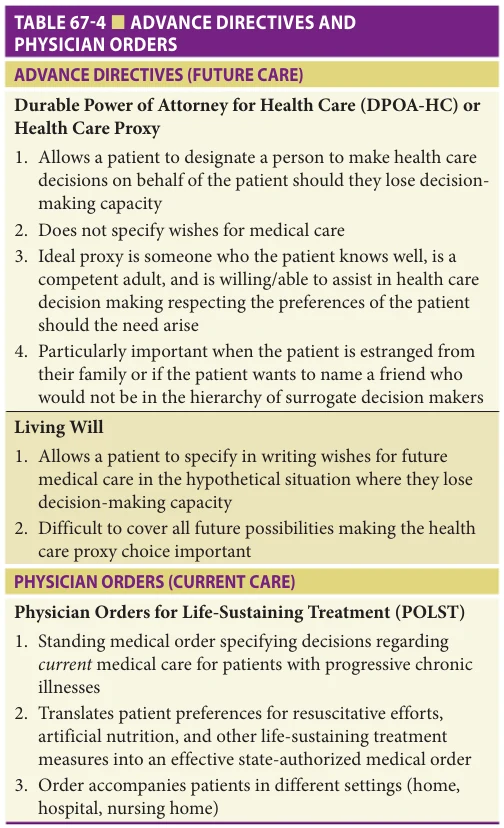
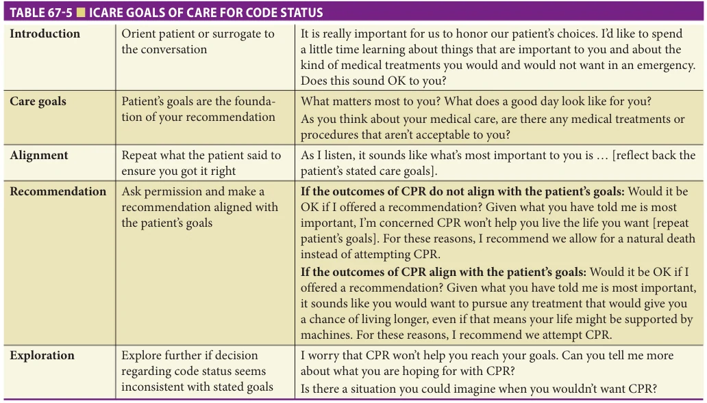

# Hazzard's Geriatric Medicine and Gerontology, 8e - Chapter 67: Palliative Care and Special Management Issues

Paul Tatum, Shannon Devlin, Shaida Talebreza, Jeanette S. Ross, Eric Widera

> **Status.** Fast build from the book; not lane-reviewed.

> **Source and method.** Printed pages 1045-1054, from the marked 8th-edition copy (PDF page = printed page + 34). Prose follows its text layer; tables and figures are source-page crops. The book is canonical.

**[p. 1045]**

## INTRODUCTION

Palliative medicine is an essential skill set for health care professionals caring for older adults. Supporting the needs and goals of older adults as they age is a complex process that often involves balancing: goals of life prolongation, functional status preservation and restoration, risk and harm mitigation, and symptom relief. Palliative care aims to ensure that these goals match the individualized care plans through interprofessional care and careful communication and goal setting.

#### Learning Objectives

- Identify the palliative needs of an aging population and recognize the potential benefits palliative care delivers in collaboration with or as part of geriatric medicine practice.

- Describe the unique palliative care needs of older adults including patients with dementia, frailty, or multimorbidity, as well as diverse populations.

- Distinguish the various advance care planning (ACP) formats and tools and adapt a three-step process to prognostication in older adults as part of ACP.

#### Key Clinical Points

1. Multiple randomized trials show palliative care improves outcomes including quality of life, satisfaction with care, reduced family distress, and increased hospice utilization.

2. For older adults with multiple chronic illness, a five-step approach to palliative care includes the following: a. Determine patient preferences. b. Interpret the evidence for treatment with recognition of the limitations applying it to an older adult population. c. Let prognosis frame clinical management decisions. d. Consider treatment complexity and feasibility as part of management decisions. e. Optimize therapies and care plans.

Palliative care for older adults poses distinct challenges. For older patients with diminished reserve to respond to stressors, the potential for harm of interventions can be substantially greater than younger populations. Cognitive impairment may limit the participation of patients at times when the most difficult decisions need to be made. The interaction of multiple illnesses in multimorbidity may reduce the potential benefit of interventions, which are otherwise therapeutic in single disease state.

## DEFINING PALLIATIVE CARE

Palliative care aims to improve the quality of life for both the patient with serious illness and the family. Palliative care focuses on providing patients with relief from the symptoms, pain, and stress of a serious illness. It is appropriate for any type of diagnosis, any stage of a serious illness, and importantly, can be provided together with curative treatment.

Specialty palliative care consists of care by an interprofessional team of physicians, nurses, and social workers, chaplains and other individuals with expertise in palliative medicine, who work with patients’ other health care professionals to provide care that matches patients’ goals. In addition to palliative care specialists, the core principles of palliative care can be implemented by all health care professionals (often described as primary palliative care). The key components of primary palliative care include symptom management, coordination of care, communication about goals of care and advance care planning (ACP), caregiver support, and when needed, referral to specialist palliative care teams.

Hospice Care Hospice care is a specialized form of palliative care for patients with limited life expectancy. Hospice care provides

medical, psychosocial, and spiritual support to the patient. Hospice also supports family members coping with the complex consequences of illness, disability, and functional decline as death nears and includes bereavement support after death of the patient. Hospice care does not aim to shorten or prolong life, but rather provides comfort and support services to help people live out the time they have remaining to the fullest extent possible.

The Medicare hospice benefit employs an interdisciplinary team of professionals including doctors, nurses,

**[p. 1046]**

*Figure 67-1, printed p. 1046.*

aides, social workers, and spiritual care coordinators to address the patient’s physical, emotional, social, and spiritual needs. Under the Medicare hospice benefit, a patient is eligible for hospice care when the patient’s attending physician and the hospice medical director certify that she or he is terminally ill with an expected prognosis of less than 6 months “if the disease runs its usual and expected course.” The Centers for Medicare and Medicaid Services (CMS) has guidelines entitled local coverage determinations (LCDs) to help physicians determine a prognosis of 6 months or less. These LCDs are available on the CMS website and are guidelines to help determine prognosis, they are not rules or requirements for hospice admission. Once a patient is admitted, the hospice agency is required to provide services that are reasonable and necessary for the palliation and management of a patient’s terminal illness and related conditions, including doctor and nursing visits, hospice aide and counseling services, medications, medical equipment and supplies, and short-term respite and inpatient stays to manage pain and symptoms.

## PALLIATIVE CARE NEEDS OF AN AGING POPULATION

Health care in the United States has made tremendous advances which have allowed for an aging population. The typical death has been transformed from the nineteenthcentury picture of an acute illness over a short time from infectious disease into a process of decline over years with increasing morbidity and functional dependency from

chronic disease. The average age at the time of death in the United States per 2019 data is now 79 (81 years for females and 73 for males) and survivors to age 65 live on average another 20 years (Figure 67-1).

While chronic illness of older adults is increasingly complicated by multiple illnesses, in 2018 two major diseases, heart disease and cancer, still accounted for nearly half of all 2018 deaths. Apart from acute respiratory illness, accidents, and suicide, the majority of deaths of older adults are associated with a period of chronic disease. In 2018, two-thirds of people aged 65 and older had multiple chronic conditions per the Centers for Disease Control and Prevention (CDC).

The exponential increase in COVID-19 illness in the United States has led to a significant number of cases and mortality particularly in older adults in 2020 to 2021, becoming deadlier than heart disease and cancer. COVID-19’s impact on older adults perfectly demonstrates the unique needs of the older adult population. Geriatric palliative care during the COVID-19 pandemic and future pandemics can work within systems to balance potentially burdensome interventions with complex goals and to deal with the common sequela of decline in performance status after infectious illness.

As the patient’s number of comorbid conditions rises, the complexities of delivering care have had profound consequences. Patients with multimorbidity are at increased risk of disability and institutionalization, poorer quality of life, and higher risk of harm from medical treatments. Over time, the care that these patients get often becomes

**[p. 1047]**

more fragmented. Among Medicare fee-for-service decedents in 2015, deaths in the home or community setting occurred in 40% and a change in the setting of care in the last 3 days of life occurred among 10% of decedents.

## THE BENEFIT FOR PALLIATIVE MEDICINE

Palliative medicine is now well established as a discipline, and as the field matures, there is a growing body of literature showing its benefit.

The Evidence for Palliative Care Systems The evidence for specialist palliative care interventions includes multiple randomized trials showing palliative care improves outcomes including quality of life, satisfaction with care, reduced family distress, and increased hospice utilization. The landmark Temel study demonstrated the value of concurrent care, that is, palliative care delivered early and simultaneously with curative, disease-focused care in advanced lung cancer patients. Early palliative care for newly diagnosed metastatic lung cell cancer patients was associated with higher quality of life, less depression, and a statistically significant longer median survival (12 months vs 8.9 months). Subsequent, larger cluster randomized trial of advance cancer patients with good performance status representing a wide variety of cancer types demonstrated improved quality of life with early palliative care. Notably, the statistical significance in many outcomes was not achieved until the fourth month of palliative care, emphasizing the importance of early referral to palliative care to impact quality of life measures beyond pain control. The ENABLE III study showed that initiating concurrent palliative care at the time of a cancer diagnosis had a significant impact on 1-year survival compared to initiating palliative care 3 months after initial cancer diagnosis (63% early vs 48% delayed) and involved multiple types of cancer not only lung cancer.

Extensive evidence is accumulating for palliative care delivery for noncancer diagnosis as well. A 2020 meta-analysis of 28 trials of palliative care in noncancer patients (13,664 patients, mean age 74) including patients with heart failure (10 studies), dementia (4 studies), chronic obstructive lung disease (3 studies), and multimorbidity (11 studies) showed that palliative care is associated with less emergency department use, less hospitalization, and lower symptom burden. Trials to date of palliative care have been least promising in dementia and highlight opportunities to better tailor palliative care to the special needs of persons living with dementia.

The Evidence for Hospice Hospice has been shown in numerous studies to improve symptom control, increase patient satisfaction and quality of life, and help patients and families prepare for death. The highest-quality outcomes tend to occur for patients

who were enrolled in hospice care for longer than 30 days. Since 2014 the CMS has collected quality data via the Hospice Item Set, which has seven key domains of patient quality.

A major benefit of hospice over usual care is that hospice allows patients to die in their own place of residence when that is the patient’s wishes. Hospice care adds value by delivering high-quality care while reducing Medicare costs primarily through caring for patients in the home setting. Cost savings increase with greater time spent in hospice care. The maximum reduction in expenditures tends to occur when the hospice length of stay exceeded 50 days.

A specific concern of geriatricians and policy makers is whether hospice adds benefits for patients with dementia in long-term care. Nursing home residents with dementia and cancer who received hospice care in the last 30 days of life were less likely to die in a hospital than those who did not receive hospice, and hospice enrollment increases the likelihood that patients with dementia who have pain receive an opioid.

## PALLIATIVE CARE IN SPECIAL POPULATIONS

Palliative care and geriatrics are both designed to serve the needs of the most vulnerable patients with a “common central philosophy of patient-centered commitment to holistic and humane care.” Due to the growing geriatric population, there is an unprecedented need to provide excellent palliative care to older adults, especially those with dementia, frailty, and multimorbidity. Partnerships between geriatricians and palliative medicine specialists can be especially useful for management of patients with these conditions, with each specialty working together to ensure the highest level of evidenced-based compassionate care to older adults.

Dementia Older adults with dementia have unique palliative medicine needs given the progressive nature of their illness with significant, prolonged disability and predictable increases in symptom burden as dementia advances. This population especially benefits from combined geriatric and palliative medicine approaches.

It is imperative that health care professionals provide appropriate management of behavioral and psychological symptoms of dementia. As discussed in detail in the management of agitation in Chapter 60, management should involve (1) identifying the specific problem behavior and its severity, (2) identifying potential triggers for the behavior, (3) removing underlying physiologic and environmental triggers whenever possible, (4) attempting nonpharmacologic interventions to improve behavior, and (5) as a final resort, using recommended targeted pharmacotherapy for behaviors that do not respond to attempts

**[p. 1048]**

of nonpharmacologic management in situations that risk patient or caregiver safety. As part of the American Board of Internal Medicine (ABIM) “Choosing Wisely” initiative, the American Geriatrics Society (AGS) recommends against the use of antipsychotics as first-line treatment for behavioral and psychological symptoms of dementia. Notably, a cluster randomized trial of nursing home patients with behavioral problems using an empiric stepwise protocol to treat pain resulted in a decrease in the number of symptoms. Most patients were treated with the first step of the protocol, acetaminophen. Opioids may be tried for nonresponders. The Pain Assessment in Advanced Dementia (PAINAD) Scale may be a useful tool in this situation.

In advanced stages of dementia, weight loss and dysphagia are common with the latter putting patients at risk for aspiration pneumonia. Weight loss may be secondary to decreased appetite, depression, oral problems such as ulcers or ill-fitting dentures, increased wandering, or medication side effects. A reversible etiology for weight loss is not always present. The addition of nutritional supplements or appetite stimulants has not been shown to improve clinically important outcomes. For patients with dysphagia, several organizations, in the ABIM “Choosing Wisely” initiative, recommend against percutaneous feeding tubes and recommend in favor of offering oral assisted feeding. Studies have shown that feeding tubes in advanced dementia do not increase survival or quality of life, prevent aspiration pneumonia, or improve pressure ulcer healing or nutritional parameters (weight, albumin). In fact, feeding tube usage has been associated with the development of pressure ulcers and the use of pharmacologic and physical restraints. The majority of feeding tubes in patients with advanced dementia are inserted during an acute hospitalization.

Infections, specifically urinary tract infections and pneumonia, are frequently diagnosed in advanced dementia and commonly occur as patients near end of life. In nursing home residents with advanced dementia, observational data show suspected urinary tract infections rarely meet criteria for antibiotics; however, the majority are treated with them. Findings from a prospective cohort study suggest that the treatment of suspected urinary tract infections in this population does not prolong survival. Antibiotic therapy for aspiration pneumonia in advanced dementia has been associated with improved survival but not improved comfort. For aspiration pneumonia, the most aggressive treatment approaches with intravenous therapy and hospitalization have been associated with the greatest discomfort, and the survival benefit associated with antibiotic therapy was similar regardless of administration route. Interventions such as opioids, fans, and acetaminophen can increase comfort. In addition to using the minimal clinical criteria for the initiation of antibiotics, appropriate management of infections in advanced dementia requires an attention to a patient’s primary goals (ie, life prolongation, comfort, safety) in order to avoid unnecessary or unwanted treatment burden.

Health care professionals caring for older adults with dementia should engage patients and their families in ACP early and include an assessment of understanding of diagnosis, prognosis, and disease trajectory. The hope is to align treatment preferences with patient values and decrease stress on future caregivers. ACP discussions may result in completion of an advance directive document in which the patient-specifies preferences for future care and/or designates an authorized surrogate decision maker to communicate their preferences in circumstances when they no longer possess medical decision-making capacity (see more details in Chapters 7 and 10). Dementia-specific advance directive documents are now available given dementia’s distinct clinical course. While barriers to these conversations exist such as difficulty with prognostication, lack of decision-making capacity, and patient or family reluctance to engage, both geriatricians and palliative medicine specialists are well equipped to conduct these vital discussions. Online resources are available for assistance (Table 67-1).

ACP discussions with surrogate decision makers should continue as dementia progresses. Older adults with advanced dementia living in nursing homes who have proxies with an understanding of their terminal prognosis are less likely to receive burdensome interventions. Consideration for hospice care in end-stage dementia is also important as enrollment is associated with greater satisfaction in patient care. Determining a 6-month prognosis in advanced dementia can be challenging. Factors such as irreversible weight loss, low body mass index, functional dependence, and advanced age are associated with limited prognosis. Palliative medicine specialists can also help with prognostication.

Frailty While the exact definition of frailty remains a subject of debate (see Chapter 42), frail patients are particularly vulnerable to adverse outcomes and have significant palliative care needs. For instance, severely frail older adults have shown poor response to treatment and may not benefit from intensive rehabilitation efforts. Attempting rehabilitation of the most frail may in fact cause harm. The key to

*Table 67-1, printed p. 1048.*

**[p. 1049]**

managing the palliative needs of frailty is determining goals and recognizing the patient with poor potential to improve. When in doubt, a therapeutic trial of improving performance status is always appropriate, but if not achieved should prompt a repeat discussion of goals and prognosis.

Determining the severity of frailty and the potential for reversibility can help clinicians recommend appropriate treatment. Frailty definitions, staging, and recommended treatment options for each stage are described in Table 67-2.

Patients with frailty and multimorbidity may still be eligible for hospice even if they do not have a single terminal illness. While CMS has stated that frailty, debility, or adult failure to thrive are not accepted as the principal hospice diagnosis reported on the Medicare hospice claims form, this does not mean that frail patients are not eligible for the Medicare hospice benefit. A patient is considered hospice eligible if the attending physician and hospice medical director have certified the patient to be terminally ill with a prognosis of less than 6 months. This prognosis is determined based on the severity and irreversibility of the patient’s frailty as well as their multimorbidity. The hospice Medical Director could utilize the hospice LCDs available on the CMS website to support their determination that the patient has a prognosis of less than 6 months.

Multimorbidity Providing optimal care for older adults with multiple chronic conditions, or multimorbidity, presents one of the greatest challenges in geriatrics. Patients with multimorbidity have increased use of health care resources, poorer quality of life, higher rates of institutionalization, disability, and death. To address the challenge of providing patientcentered care to older adults with multimorbidity, a stepwise approach can integrate patient care with the key principles of geriatric and palliative medicine in five domains: (1) patient preferences, (2) interpreting the evidence, (3) prognosis, (4) clinical feasibility, and (5) optimizing therapies and care plans. The American Geriatrics Society’s “PatientCentered Care for Older Adults with Multiple Chronic Conditions: A Stepwise Approach: Expert Panel on the Care of Older Adults with Multimorbidity” is an excellent online resource: https://geriatricscareonline.org/ProductAbstract/ Framework-for-Decision-making-for-Older-Adults/ CL026 [geriatricscareonline.org].

Considerations for Providing Inclusive Care The US population is ethnically diverse and there may be differences on perceptions and readiness for palliative care based on race and socioeconomic factors. Ornstein’s 2020

*Table 67-2, printed p. 1049.*

**[p. 1050]**

analysis of racial disparities in the use of hospice and end of life treatments found that Black individuals were significantly less likely to use hospice and more likely to have multiple emergency department visits and hospitalizations and undergo intensive treatment in the last 6 months of life compared with White individuals regardless of cause of death. Barzargan examined the awareness of palliative, hospice care and advance directives in a large sample of an ethnically diverse population. Hispanic and non-Hispanic Black participants are far less likely to report that they have heard about palliative and hospice care and advance directives than their non-Hispanic White counterparts. In this study, 75%, 74%, and 49% of Hispanics, non-Hispanic Blacks, and non-Hispanic White participants, respectively, claimed that they had never heard about palliative care.

Patients who are unable to speak the language of the care team are at risk of receiving care that may not match their wishes. Use of family members as interpreters risks information being withheld or incomplete translation. A trained medical interpreter at bedside or a telephone translator service is recommended.

The National Academy of Medicine (NAM) report on health care disparities and unequal treatment determined that patients’ attitudes toward health care and treatment preferences were not the major source of disparities. At the level of clinical encounter, factors that lead to disparities include bias or prejudice, stereotypes (beliefs held by the provider about the behavior or health of minorities), and uncertainty about preferences. The key systems factors in disparities per the NAM study were factors such as cultural and linguistic barriers, fragmentation of health care systems, and the types of incentives in place.

While all persons with serious illness endure difficulties, those patients who are lesbian, gay, bisexual, and transgender/transsexual (LGBT) may face unique issues distinct from the heterosexual population. LGBT older adults have a history of having experienced stigmatization, discrimination, victimization, or violence during their lifespan by their families, school, workplaces, and even health care providers. LGBT persons may present at more advanced stages of illness because they are more reluctant to seek health care, or they lack health insurance. LGBT persons may need to rely on close friends rather than on family for caregiving. Nonfamily caregiving may be due to estrangement from the person’s biological family or because LGBT persons are less likely to have children. Informal communities of support are also known as “lavender families” or “families of choice” and should be respected and included as family as identified by patients. The support from the “lavender family” may become essential in caring for an LGBT individual at the end of life. It may be challenging for LGBT persons who need custodial care to find a long-term care facility that is “LGBT friendly.” LGBT patients may hide their sexual identities to be able to access a long-term care facility also known as “going back in the closet.”

Transgender patients may face several unique stressors. Having a gender-variant body and requiring assistance for basic needs of daily living like bathing, dressing, or feeding puts the transgender individual in a vulnerable position and at risk of being physically abused.

It is of extreme importance that the LGBT person takes steps to legally document their preferences for health care and other legal matters. Individuals that may be closer to the LGBT person may not be identified as the default surrogate by law should the LGBT person no be able to make his or her own decision; and it is possible that the default decision maker may not be respectful of the individual’s chosen gender identity.

LGBT patients should designate a Health Care Power of Attorney (HCPOA) and additionally explicitly give that person the power to direct health care professionals with the preferences of name, pronoun of choice, and appearance consistent with their gender identity. Given that the HCPOA and advance directives are no longer effective as soon as the person dies, it is important for LGBT persons to also put in place a Disposition of Bodily Human Remains (DBHR) document so that he or she can name who is the person to have authority over the remains of a person once deceased. For example, a same-sex partner who had HCPOA would not be able to claim the deceased body of his or her loved one unless he or she had been designated to do so in a DBHR document.

LGBT persons also may face challenges during the bereavement process, particularly if in the case of a samesex relationship, the couple had not been openly acknowledged. The surviving individual may experience “silent mourning” and not have access to traditional grief support. Table 67-3 offers open-ended inclusive questions to use to better understand patients’ needs and to interact with them in a way that is aligned with their values and identity.

## PROGNOSTICATION IN OLDER ADULTS

Prognostication is a vital aspect of decision making as it provides patients and families with information to determine realistic and achievable goals of care, is used in determining eligibility for benefits such as hospice, and helps in targeting interventions to those likely to live long enough to benefit from a proposed intervention. For example, it may take many years for the benefits to accrue for preventative interventions such as cancer screening and tight glycemic control. For frail older adults whose life expectancy is less than this time horizon to benefit, they are exposed to potential immediate harms of these preventative interventions without the possibility of receiving the benefits.

Prognostication can be broken into three general steps: (1) estimating the probability of an individual developing a particular outcome over a specific period of time, (2) the act of communicating the prognosis with the patient and/or family, and (3) the interpretation of the prognosis by the patient and/or family.

**[p. 1051]**

*Table 67-3, printed p. 1051.*

Step 1: Estimating Prognosis Estimating prognosis in geriatric populations is more complicated than in younger populations, as older adults are more likely to have more than one chronic progressive illness that impacts life expectancy. Estimation of prognosis in multimorbid older adults requires clinicians to account for interaction of their medical problems, clinical and laboratory findings, and functional and cognitive status. While prognostication based on clinician judgment is correlated with actual survival, it is subject to numerous biases, most importantly that clinicians tend to overestimate patient survival by a factor of 3 to 5. Prognostic indices that incorporate age and clinical characteristics such as multimorbidity and functional status may improve the accuracy of prognostication compared to clinician judgment alone. A helpful repository of published geriatric prognostic indices can be found at www.ePrognosis.org.

Step 2: Communicating Prognosis Numerous studies have shown that most individuals and their families want prognostic information, yet they are often not given the opportunity to discuss it with health care providers. This is despite evidence that effective communication around end-of-life issues can provide benefits to patients and families, without worsening of anxiety, hopelessness, or depression.

When delivering prognosis, it is first helpful to ask about the patient’s understanding of their illness and perception of what the future may have in store for them. It is also helpful to assess the readiness of the patient and/or family member to have a discussion of prognosis by asking them permission to talk about it. Based on this information, the clinician should deliver prognostic information tailored to the patient’s current desire and level of understanding.

**[p. 1052]**

When delivering prognostic estimates, clinicians should acknowledge the inherent uncertainty in most prognostic estimates. One way to do so is by giving ranges in prognostic estimates (ie, days to weeks, weeks to months, months to years to live) or by giving the best case, worst case, and most common scenarios. In addition, delivering information on prognosis is likely to bring emotional reactions in patients and their family members. Use of empathic statements, including naming the emotion, and the use of therapeutic silence can be helpful in supporting patients and their surrogate decision makers.

Step 3: Interpreting Prognosis Patients’ and surrogates’ personal estimates of prognosis are often different, and generally more optimistic than what is communicated to them by health care providers. Furthermore, few surrogates solely rely on prognostication information delivered by physicians to determine their own prognostic estimates. Rather, their interpretation of prognosis is influenced by many factors, including perceptions of the patient’s strength, will to live, unique history, individual observations of physical appearance, and the surrogate’s presence, optimism, intuition, and faith. Given this information, it is helpful when delivering prognosis to include the factors that influence the clinician’s prognostic estimate, as it may also influence the patient’s or surrogate’s interpretation of prognosis. It is also valuable to enquire how the clinician’s prognostic estimate influenced how the patient or surrogate is currently thinking about the prognosis.

## ADVANCE CARE PLANNING AND ADVANCE DIRECTIVES

ACP is a process that supports adults at any age or stage of health in understanding and sharing their personal values, life goals, and preferences regarding future medical care. ACP should be ongoing as the values or priorities of people may change as they go through life and should include continued support and preparation for future medical decision making. The focus of ACP is on meaningful conversations in order to create a care plan that aligns recommended treatments with patient preferences. There is evidence that ACP increases patient and surrogate satisfaction with both communication and medical care and decreases surrogate distress. ACP does not increase anxiety or lead to loss of hope. To effectively deliver ACP, health disparities, systemic racism, and cultural differences need to be addressed. These conversations are appropriate at any time in an older adult’s life, but clinicians should especially consider initiating goals of care discussions if they answer “no” to the question “Would you be surprised if this patient dies in the next year?” Documentation of these discussions may include advance directives or physician orders further described in Table 67-4. Advance directives are written documents that state a patient’s preferences for addressing future medical decisions. Advance directives can be

*Table 67-4, printed p. 1052.*

executed at any time by a competent adult person and go into effect when the person is no longer capable of making health care decisions.

Priorities in ACP discussions vary depending on the setting. In a relatively healthy person, the focus may be on making goals of care choices based on hypothetical situations or choosing a health care proxy. If a health care proxy is not chosen, the surrogate decision maker authorized to make health care decisions for an incapacitated patient is based on a hierarchy of closeness to the patient (eg, spouse, adult children, parents, etc), which may vary based on the state. In someone with a predictable progressive condition who is likely to lose functional or cognitive abilities, such as ALS or dementia, the conversation should include information on treatment options with significant long-term impact, such as tracheostomy or hemodialysis, as well as prognosis. In a seriously ill person, the choices are less hypothetical and an actual decision regarding treatment may be needed. In this circumstance, it is important to inform patients (or their proxies) of the risks, benefits, and alternative treatments available. Consideration should

**[p. 1053]**

also be given to deactivating devices such as implantable cardioverter-defibrillators in patients close to death.

ACP is complex, and communication techniques differ based on the clinical situation. Chapter 71 expands on useful communication strategies. The Gerontological Society of America also has resources available to assist clinicians with communication with patients with cognitive and sensory impairments. A variety of resources to improve communication effectiveness in ACP are available online and include vitaltalk.org and capc.org. ICARE, a communication model used within the Veterans Health Administration, is provided as an example of discussing “Do not resuscitate orders” in Table 67-5. When having conversations about cardiopulmonary resuscitation (CPR), it is important to discuss the likelihood of this intervention meeting a patient’s goals. A recommendation for or against CPR may differ, for example, for a patient who prioritizes maintaining independence and one who prioritizes living as long as possible. In adults older than 65 years, 17% of patients who undergo in hospital CPR survive to hospital discharge and 7% are discharged home. The presence of serious conditions such as metastatic cancer, sepsis, or multiple organ failure are associated with worse CPR outcomes.

In 2020 as the COVID-19 pandemic spread throughout the world, ACP required immediate attention and innovation. For older adults at high risk for serious disease, readdressing care plans and eliciting preferences specifically pertinent to COVID-19, such as hospitalization, intubation, and CPR, were urgently needed. Telehealth increased and remains a powerful tool for patient outreach. When using telemedicine for ACP, it is important to create

a welcoming environment with the electronic device situated at eye level with adequate sound to promote patient engagement, to invite patients to include those they would want involved in the discussion, to provide an overview of a telehealth visit, and to monitor for nonverbal and environmental cues. Sending an electronic summary of the visit can also be helpful.

Addressing Spiritual Needs Comprehensive palliative care attends to the whole needs of the patient. The founder of modern palliative care, Dr. Cicely Saunders, coined the term Total Pain, meaning that palliative care attended to the pain that was physical, psychological, social, and spiritual. An international consensus project defines spirituality as “a dynamic and intrinsic aspect of humanity through which persons seek ultimate meaning, purpose, and transcendence, and experience relationship to self, family, others, community, society, nature, and the significant or sacred. Spirituality is expressed through beliefs, values, traditions, and practices.”

While patients with serious illness wish to have spiritual needs addressed as part of their care, most physicians report discomfort doing so. Screening for spiritual needs allows for referral for support, which can be in the form of pastoral support of a health care team or within the patient’s own spiritual support network. A screening tool that has been well validated is FICA Spiritual History Tool. FICA asks questions about Faith, Importance, Community, and how to Address these issues. Additional questions for communication within the FICA framework can be found at https://smhs.gwu.edu/spirituality-health/.

*Table 67-5, printed p. 1053.*

**[p. 1054]**

## CONCLUSION

An essential component of geriatric medicine is the routine delivery of effective primary palliative care that includes attention to symptom management, prognostication,

## FURTHER READING

Acquaviva, KD. LGBTQ-Inclusive Hospice and Palliative

Care: A Practical Guide to Transforming Professional Practice. New York, NY: Harrington Park Press; 2017. American Geriatrics Society Expert Panel on the Care of

Older Adults with Multimorbidity. Patient-centered care for older adults with multiple chronic conditions: a stepwise approach from the American Geriatrics Society: American Geriatrics Society Expert Panel on the Care of Older Adults with Multimorbidity. J Am Geriatr Soc. 2012;60:1957–1968. American Geriatrics Society. Ten things physicians and

patients should question, 2013. https://www.choosingwisely.org/societies/american-geriatrics-society/ [choosingwisely.org]. Accessed February 18, 2022. Bakitas M, Tosteson T, Lyons K, et al. Early versus delayed

initiation of concurrent palliative oncology care: patient outcomes in the ENABLE III randomized controlled trial. J Clin Oncol. 2015;33:1438–1445. Bernacki RE, Block SD. American College of Physicians

High Value Care Task Force. Communication about serious illness care goals: a review and synthesis of best practices. JAMA Intern Med. 2014;174:1994–2003. Fried LP, Tangen CM, Walston J, et al. Frailty in older adults:

evidence for a phenotype. J Gerontol A Biol Sci Med Sci. 2001;56:M146–M156. Gerontological Society of America (GSA). Communicating

With Older Adults: An Evidence-Based Review of What Really Works. Washington, DC: Gerontological Society of America. 2012. Hanson LC, Ersek M, Gilliam R, Carey TS. Oral feeding

options for people with dementia: a systematic review. J Am Geriatr Soc. 2011;59:463–472. Husebo BS, Ballard C, Sandvik R, Nilsen OB, Aarsland D.

Efficacy of treating pain to reduce behavioural disturbances in residents of nursing homes with dementia: cluster randomised clinical trial. BMJ. 2011;343:d4065. IOM (Institute of Medicine). Dying in America: Improv-

ing Quality and Honoring Individual Preferences Near the End of Life. Washington, DC: The National Academies Press; 2014. https://www.nap.edu/catalog/18748/ dying-in-america-improving-quality-and-honoringindividual-preferences-near [nap.edu]. Accessed February 18, 2022. IOM (Institute of Medicine). Unequal Treatment: Con-

fronting Racial and Ethnic Disparities in Health Care, 2002. http://nationalacademies.org/hmd/reports/2002/

communication, ACP, and individualized care plans. Appropriate referrals to specialty-level palliative care should also be considered when palliative needs are great, given the increasingly robust evidence base of benefit for both palliative care and hospice.

unequal-treatment-confronting-racial-and-ethnicdisparities-in-health-care.aspx. Accessed May 10, 2016. IOM (Institute of Medicine). (US) Committee on Les-

bian, Gay, Bisexual, and Transgender Health Issues and Research Gaps and Opportunities. The Health of Lesbian, Gay, Bisexual, and Transgender People: Building a Foundation for Better Understanding. Washington, DC: The National Academies Press; 2011. https://nationalacademies.org/hmd/reports/2011/the-health-of-lesbiangay-bisexual-and-transgender-people.aspx. Accessed May 10, 2016. Johnson KS. Racial and ethnic disparities in palliative care.

J Palliat Med. 2013;16:1329–1334. Mitchell SL, Teno JM, Kiely DK, et al. The clinical

course of advanced dementia. N Engl J Med. 2009;361: 1529–1538. National Hospice and Palliative Care Organization. NHP-

COs Facts and Figures. Hospice Care in America. http://www.nhpco.org/hospice-statistics-researchpress-room/facts-hospice-and-palliative-care. Accessed May 10, 2021. Quinn KL, Shurrab M, Gitau K, et al. Association of

receipt of palliative care interventions with health care use, quality of life, and symptom burden among adults with chronic noncancer illness: a systematic review and meta-analysis. JAMA. 2020;324:1439–1450. Sampson EL, Candy B, Jones L. Enteral tube feeding for

older people with advanced dementia. Cochrane Database Syst Rev. 2009;2:CD007209. Sidebottom AC, Jorgenson A, Richards H, Kirven J,

Sillah A. Inpatient palliative care for patients with acute heart failure: outcomes from a randomized trial. J Palliat Med. 2015;18:134–142. Singer AE, Meeker D, Teno JM, Lynn J, Lunney JR, Lorenz

KA. Symptom trends in the last year of life from 1998 to 2010: a cohort study. Ann Intern Med. 2015;162:175–183. Temel JS, Greer JA, Muzikansky A, et al. Early palliative

care for patients with metastatic non-small-cell lung cancer. N Engl J Med. 2010;363:733–742. Teno JM, Gozalo PL, Mor V, et al. Site of death, place of

care, and health care transitions among US Medicare beneficiaries, 2000-2015. JAMA. 2018;320:264–271. Zimmermann C, Swami N, Krzyzanowska M, et al. Early

palliative care for patients with advanced cancer: a cluster-randomised controlled trial. Lancet. 2014;383: 1721–1730.
