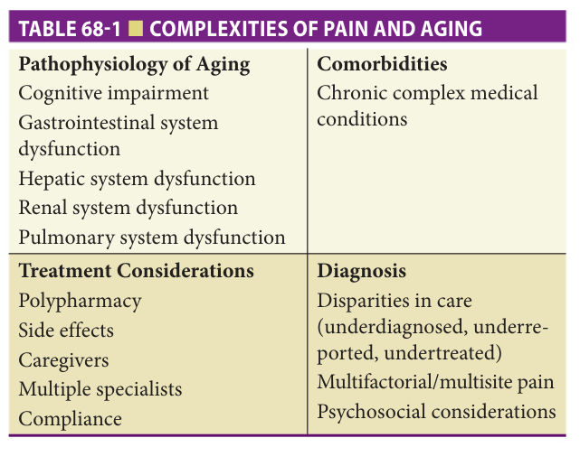
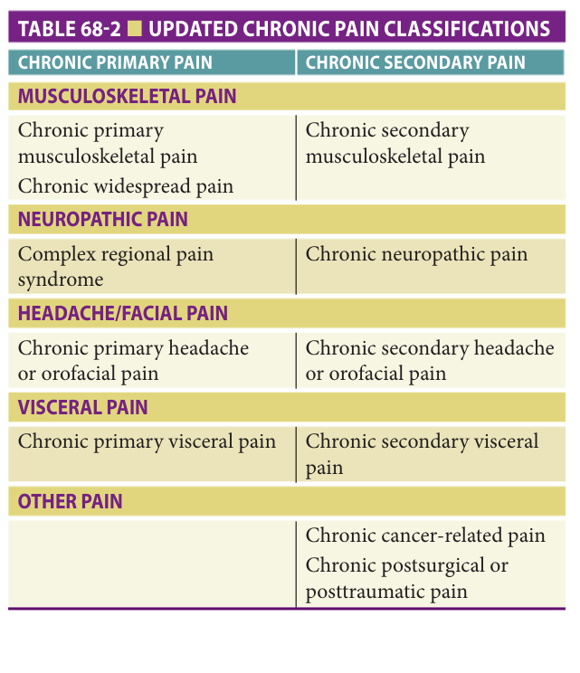
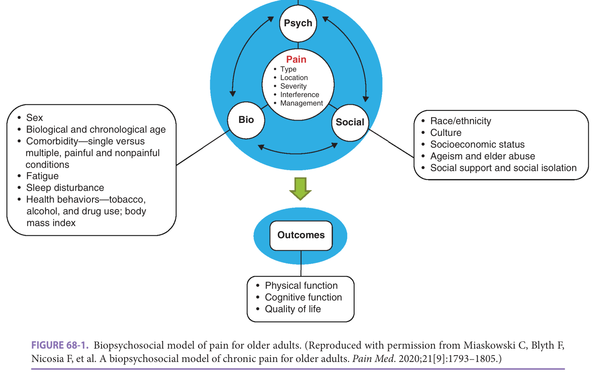
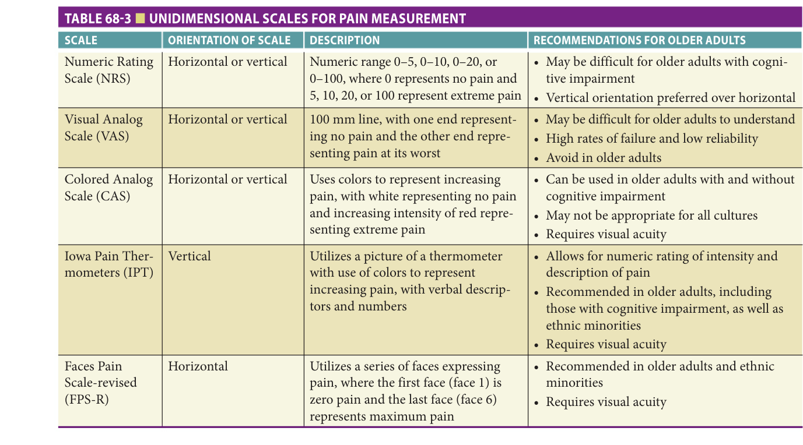
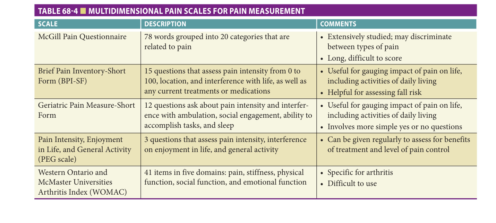
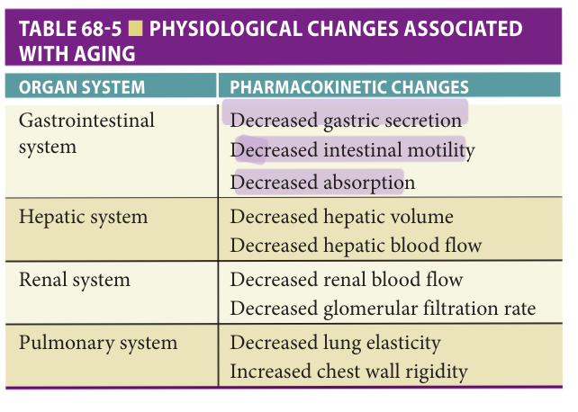
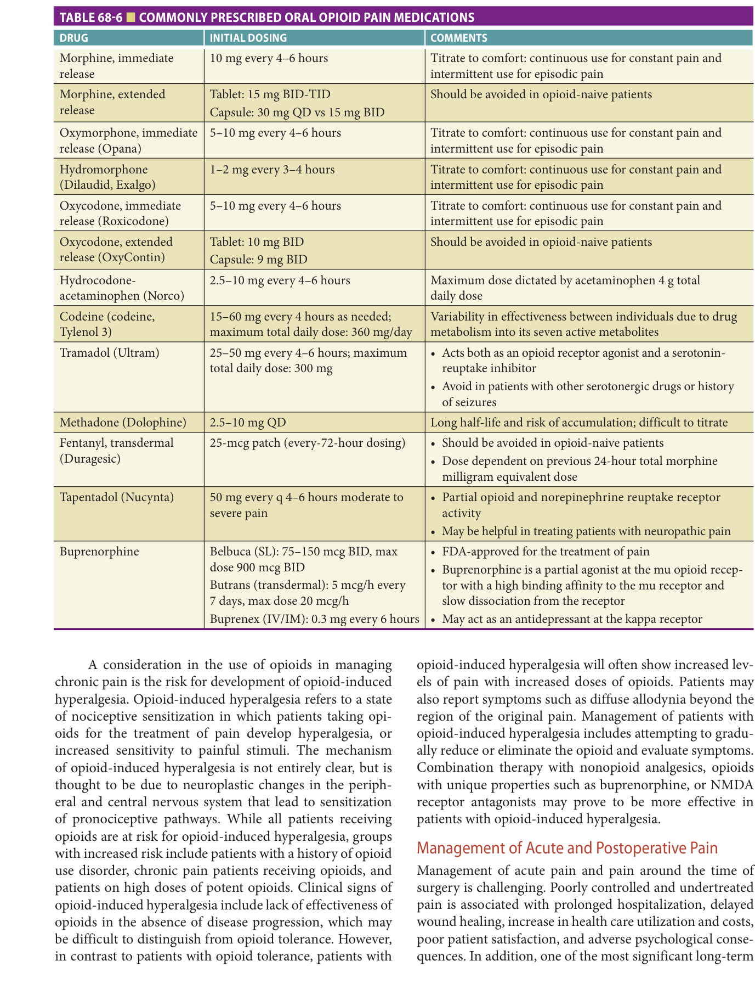
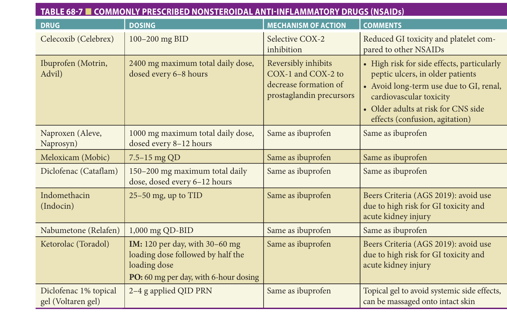
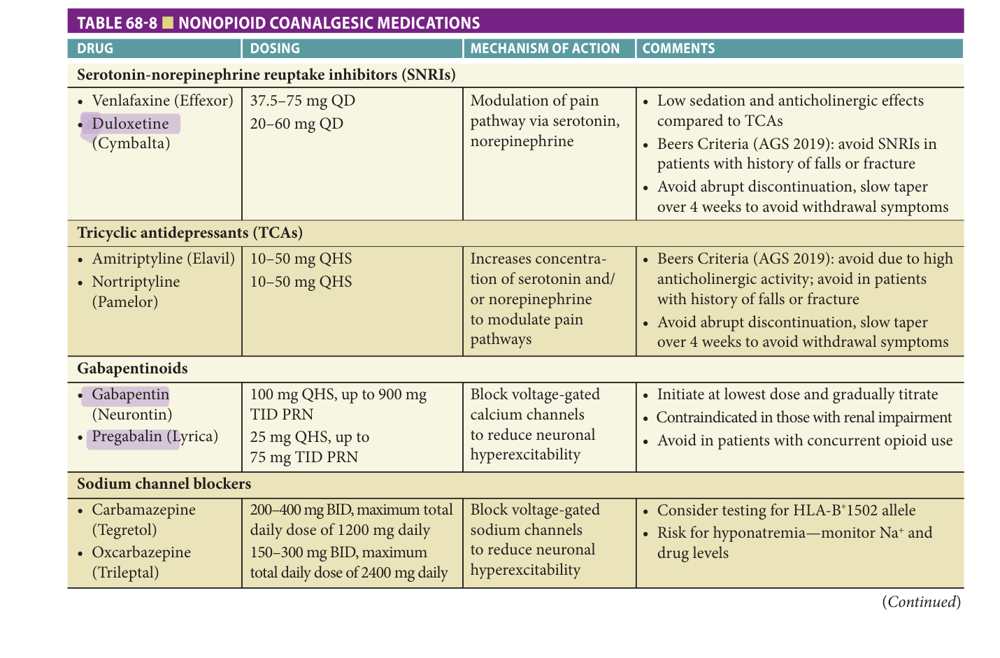
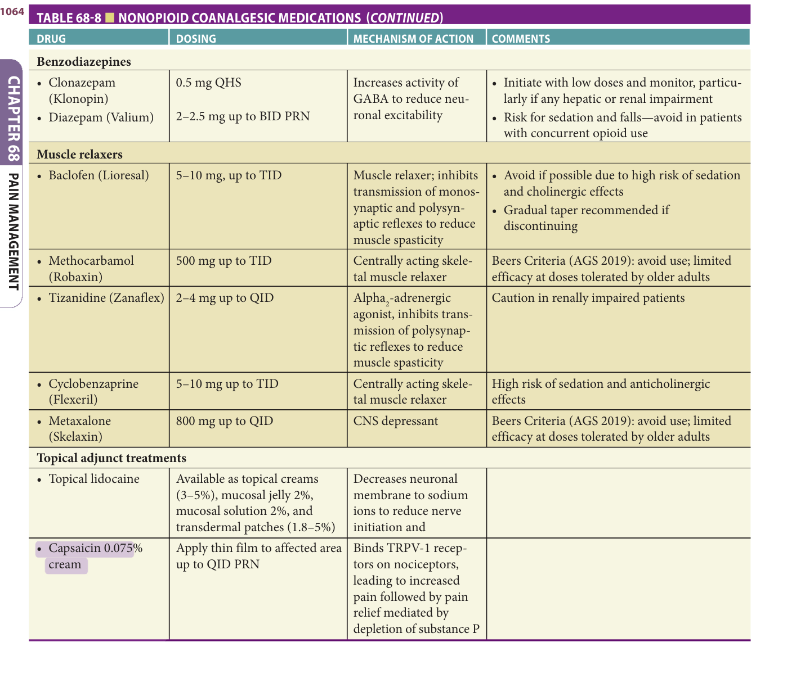

# Hazzard's Geriatric Medicine and Gerontology, 8e — Chapter 68: Pain Management

Roxanne Bavarian, Amber K. Brooks

> **Fast build from the book, 22 Sep; not lane-reviewed.**

**[p. 1055]**

#### Learning Objectives

- Classify different types of pain.
- Describe pathophysiological findings in chronic pain.
- Review key aspects of pain evaluation and management.

#### Key Clinical Points

1. Pain in older adults is often underdiagnosed and undertreated.
2. Careful evaluation of pain requires a thorough history, physical examination, and use of validated pain measures.
3. Comprehensive pain management in older adults requires a patient-centered, multidimensional pain management strategy that recognizes the biological and psychosocial complexities and utilizes a combination of medication and nonmedication therapies.

## Overview

Pain is one of the most common reasons adults seek medical care. Pain prevalence increases with age and is associated with wide-ranging adverse health outcomes including increased risk of falls, increased functional disability, declining mobility, cognitive decline, and decreased quality of life. The most common pain conditions in older adults include osteoarthritis, chronic neuropathic pain (eg, diabetes, herpes zoster), vertebral compression fractures (VCFs), pain associated with cancer and its treatments, and pain associated with other chronic illnesses. The prevalence of chronic (persistent) pain among older adults is estimated at 25% to 75% and higher in residential care settings. Chronic pain tends to be more complex in older adults with 60% to 70% of them describing multisite pain and more than 60% describing multiple types of pains. Diagnosing and treating chronic pain in older adults is further complicated by age-related changes in pathophysiology, such as cognitive impairment and organ system dysfunction; coexisting chronic medical conditions; and complex treatment considerations, such as polypharmacy and increased susceptibility to side effects, among other factors ( **Table 68-1** ).

## Classification Of Pain

Pain is defined as an unpleasant sensory and emotional experience associated with actual or potential tissue damage.

## Acute Versus Chronic Pain

Acute pain is defined by its sudden onset, association with a noxious stimuli, and short duration of tissue healing (approximately ≤ 3 months). Examples of acute pain include trauma and postoperative pain. Poorly controlled acute postoperative pain is a particularly vulnerable period for older adults and is associated with increased stress response (ie, increased heart rate, blood pressure, and respiratory rate), limited mobility, prolonged hospital stays, and increased risk of developing chronic pain. Conversely, acute pain that is appropriately managed during the perioperative period may help prevent the development of chronic pain.

## Chronic Pain

Chronic (persistent) pain is defined as pain that persists or recurs for more than 3 months. In 2019, the International Association for the Study of Pain (IASP) updated its chronic pain classifications for the International Classifications of Diseases (ICD-11) ( **Table 68-2** ). Pain that is deemed a disease in its own right, such as fibromyalgia or nonspecific low back pain, is called “chronic primary pain.” In the other six subgroups, pain is secondary to an underlying disease: chronic secondary musculoskeletal pain, chronic neuropathic pain, chronic secondary headache or orofacial pain, chronic secondary visceral pain, chronic cancer-related pain, and chronic postsurgical or posttraumatic pain.

High-impact chronic pain is defined as chronic pain that limits life or work activities on most days or every day during the past 6 months. In 2016, an estimated 8% of US adults (20 million) had high-impact pain, with higher

**[p. 1056]**

> *Table 68-1 — Complexities of pain and aging (printed p. 1056).*

> Highlighting is the owner's annotation, not the book's.

prevalence among older adults (11% for 65 to 84-year-old adults and 16% for ≥85-year-old adults).

## Pathophysiology Of Chronic Pain

In a normal response to tissue injury with a noxious stimulus, the body will respond by activating immune cells, such as macrophages, leukocytes, and mast cells, that release proinflammatory mediators. These proinflammatory mediators include bradykinin, histamine, tumor necrosis factor, interleukin-1β, and interleukin-6, all of which promote the release of substance P and calcitonin gene-related peptide from nerve endings to ultimately activate spinal pathways that cause pain. These pain signals occur in response to the initial inflammation to help “teach” a person to avoid further injuring the damaged tissue during the healing process. In acute pain, healing occurs over the ensuing days to weeks, leading to resolution of inflammation and pain signals in the body. Contrarily, in patients with chronic pain, the nervous system will continue to send signals for pain even after the initial injury has subsided. The pathophysiology of chronic pain revolves around this concept of central

> *Table 68-2 — Updated chronic pain classifications (printed p. 1056).*

> Highlighting is the owner's annotation, not the book's.

plasticity of the brain (“neuroplasticity”) in which neural connections are rewired and sensitivity to stimuli changes in response to an initial injury.

Neurological changes associated with chronic pain include hyperalgesia, allodynia, and the spread of pain. Hyperalgesia is defined as an increased sensitivity to painful stimuli, such as an exaggerated pain response to a gentle pinprick, scratch, or heat. Hyperalgesia occurs when the threshold of local nociceptors in the tissue is lowered, which increases the excitability of nociceptor neurons and pain pathways. Similarly, the receptive field of activation of these nociceptors can spread, leading to the spread of pain to adjacent, noninjured areas. Hyperalgesia and spread of pain is caused by a process known as peripheral sensitization, in which inflammation causes release of chemical mediators like histamine and bradykinin that influence the threshold and field of activation of nociceptors in the peripheral tissues. Central sensitization refers to the maladaptive plasticity within the central nervous system. This maladaptivity leads to an increase in the synaptic strength of pain pathways, with a reduction in pain inhibitory pathways, which ultimately lead to increased pain processing in the brain. Subsequently, allodynia may ensue: nonpainful touch stimuli activate mechanoreceptor neurons that have been rewired to stimulate pain pathways. Patients may also report their pain being triggered by a cool breeze against the painful area or the weight of their clothing or bedsheets brushing against the area.

Although the pathophysiological concepts behind chronic pain, such as hyperalgesia, allodynia, and spread of pain, have been verified in animal models of chronic pain, understanding why some patients develop chronic pain is a subject that warrants further research.

## Nociceptive Versus Neuropathic Pain

For treatment purposes, it is important to distinguish the underlying mechanism of pain in order to best tailor the treatment plan, particularly in regard to medications so as to minimize the risk of polypharmacy. Pain that results from the stimulation of pain receptors is called nociceptive pain. Nociceptive pain may arise from tissue injury, inflammation, or mechanical malformation. Examples include trauma, burns, infection, arthritis, ischemia, and tissue distortion. Pain from nociception usually responds well to analgesic medications.

Neuropathic pain, on the other hand, is caused by a lesion or disease of the somatosensory system, including peripheral nerves and central neurons, and affects 7% to 10% of the population. Neuropathic pain conditions commonly seen in older adults include diabetic peripheral neuropathy, postherpetic neuralgia, and

**[p. 1057]**

posttraumatic neuralgia (postamputation or phantom limb pain). Neuropathic pain conditions are often persistent and difficult to treat in older adults, as they are more susceptible to the side effects of commonly used neuropathic pain medications such as oversedation and falls. However, it is important to begin treatment as early as possible with a regimen associated with the least amount of harm in order to prevent long-term complications of persistent pain such as physical and psychological disability.

## Aging And Its Effect On Pain Perception

Age-related changes in the nervous system may alter pain perception. A decrease in the number of pain receptors in the skin and other organs, altered nerve conduction, and even central nervous system changes have been linked to altered sensory processing in older adults. Similarly, studies of experimental pain have also been linked to age-related changes in perception. These experimental pain studies used a heat probe, electrical stimulation, or other methods to induce pain in volunteers in an effort to identify a pain threshold or pain tolerance. These studies

reveal that aging may decrease sensitivity for pain of low intensity; reduced sensitivity is especially apparent for heat pain; and aging has no strong effect on pain tolerance. It is believed by most researchers that age-associated changes in pain perception are subtle, and their clinical relevance may be minimal. Conversely, older adults may have sensory impairments (visual or auditory), cognitive impairment, or sensory neuropathies that may interfere with the ability to appropriately communicate or even recognize pain symptoms.

## Biopsychosocial Model For Older Adults With Pain

Chronic pain requires a multidimensional approach to treatment that incorporates the biological, psychological, and social factors that modulate a person’s pain. The biopsychosocial model (BPS) of chronic (persistent) pain describes the intricate interplay between these factors. The original BPS model has since been adapted for older adults ( **Figure 68-1** ). A number of biological factors are associated with chronic pain in older adults, including age (usually described as ≥ 65 years of age), sex, multiple coexisting chronic medical conditions, genetic factors, common

> *FIGURE 68-1. Biopsychosocial model of pain for older adults. (Reproduced with permission from Miaskowski C, Blyth F, Nicosia F, et al. A biopsychosocial model of chronic pain for older adults. _Pain Med_ . 2020;21[9]:1793–1805.)*

> Highlighting is the owner's annotation, not the book's.

**[p. 1058]**

coexisting symptoms (fatigue and sleep disturbance), and a variety of health-related behaviors (smoking, alcohol use, and illicit drug use). Psychological considerations include depression, anxiety, stress, substance misuse or abuse, pain-specific psychological factors (pain catastrophizing, pain coping, fear avoidance, and self-efficacy). Social influences include race/ethnicity, culture, socioeconomic status, ageism and elder abuse, social support, and social isolation. Ultimately, it is the combination of these biopsychosocial factors that determine outcomes like physical function, cognitive function, and quality of life.

## Diagnosis Of Pain In Older Adults

The diagnosis of pain relies heavily on self-report from the patient, which is considered the gold standard in measuring pain in both clinical practice and research. A thorough assessment of pain should include a series of questions regarding the location of pain, along with its onset, frequency, intensity, quality of pain, and any modifying factors. When inquiring about pain intensity, it may be helpful to ask the patient about a range of their pain intensity over the past week, rather than solely in the present moment. The assessment of the pain characteristics should be done regularly, both at the initial visit to accurately diagnose a patient and the source of pain (ie, musculoskeletal, visceral, neuropathic, or a combination of the above) and also at follow-up visits to assess the benefit of any treatment rendered. As discussed in the previous sections, the longer pain goes untreated, the more likely for the pain to spread to neighboring areas of the body and become more difficult to diagnose.

Other pertinent questions in the assessment of pain include any history of trauma (eg, falls or injuries) or indirect trauma (eg, whiplash), especially given the risk for falls and occult fractures in older adults. Sleep quality should also be assessed for any indicators of poor sleep quality (eg, insomnia, frequent arousals, daytime hypersomnolence), which could impact the patient’s perception of pain. With the patient’s permission, a discussion of any recent personal stressors, such as the loss of a loved one, that may have contributed to the onset and/or intensity of pain may be relevant, particularly in neuropathic pain conditions where psychological stress is a known trigger.

In patients with pain, a review of systems should include whether the patient reports generalized muscle pain, generalized joint pain, swelling or erythema, or neurologic symptoms like numbness, tingling, or autonomic symptoms. The medical history should also be reviewed for any other chronic pain conditions and their history of management, which can help clinicians assess what treatment modalities have alleviated pain in the past. Other conditions associated with pain include psychiatric conditions, such as anxiety, depression, and posttraumatic stress disorder, which can potentially contribute or exacerbate symptoms of pain and may indicate a need for interdisciplinary treatment with a pain psychologist. Understanding the

patient’s lifestyle and social history can also be informative, including their average daily activities, their stress levels, and their social support system. In addition, any history of drug addiction or alcoholism either in the patient or their family should be documented to assess their risk for opioid use disorder.

In older patients, obtaining an accurate history of their pain symptoms and review of systems may be difficult due to cognitive limitations and inability to respond to questions. In older adults, the line of questioning should be simple and transparent. For example, asking “Does this hurt?” may be more informative than “How are you doing?” For patients with difficulty responding to pain questions, a nonverbal observational pain scale may be indicated to better assess their pain. In patients with cognitive impairment or dementia, family or caregivers should also be asked to provide information regarding the patient’s pain.

Various verbal and nonverbal pain assessment scales have been reviewed in the evaluation of pain in older patients. These scales are generally classified as unidimensional or multidimensional. A unidimensional pain scale focuses on a single factor, such as the severity of pain or impact of pain on function. In patients with chronic pain, the impact of the pain on physical and mental function, such as their mobility, mood, and fatigue, may be more meaningful than the pain intensity itself. **Table 68-3** provides a review of unidimensional pain scales. Multidimensional scales, on the other hand, include questions to assess pain intensity, interference with enjoyment of life, or history of pain treatments and relief. **Table 68-4** shows a review of multidimensional pain scales that can be useful in assessing pain in older adults.

Following the initial intake, a thorough physical examination should be completed. The affected location of pain should be evaluated for erythema or edema, which could be a marker of inflammation or infection. The musculoskeletal system can be evaluated by palpating for tender trigger points that duplicate the patient’s chief complaint, as well as assessing range of motion, posture, and gait. A neurologic examination for signs of focal muscle weakness, atrophy, or sensory impairments such as numbness or tingling should also be performed to rule out any peripheral or central neuropathic condition.

## Treatment

## Physiologic Considerations And Medication Management In Older Adults

Age-related organ dysfunction poses significant challenges for nonopioid and opioid pain medication management in older adults. The gastrointestinal, hepatic, renal, and respiratory systems are particularly important to consider when initiating and dosing pain medications in this population. There is a plethora of age-related pharmacokinetic changes that clinicians should consider before prescribing pain medications ( **Table 68-5** ). Decreases in gastric secretion

**[p. 1059]**

> *Table 68-3 reproduced as a page image (printed p. 1059) — the grid did not extract reliably as text for this fast build.*

> Highlighting is the owner's annotation, not the book's.

and intestinal motility lead to altered absorption of certain medications. Aging is also associated with increased body fat and decreased lean body mass, total body water, and serum albumin—all of which affect the distribution of drugs throughout the body. Circulating albumin and other proteins bind analgesic medications, such as nonsteroidal anti-inflammatory drugs (NSAIDs) and tricyclic antidepressants (TCAs). More unbound drug can lead to increased toxicity and drug–drug interactions.

In addition, alterations in hepatic and renal function in older adults can affect drug metabolism and elimination.

Hepatic blood volume and blood flow decrease with age. Similarly, increasing age is associated with decreased renal blood flow and glomerular filtration rate, which may lead to increased serum concentrations of renally cleared medications and their metabolites. The resultant decline in hepatic and renal function may lead to increased risk for adverse medication events and drug–drug interactions secondary to elevated serum parent drug and metabolite concentrations.

Lastly, changes in the pulmonary systems such as decreased elasticity of the lung and increased chest wall

> *Table 68-4 — Multidimensional pain scales for pain measurement (printed p. 1059).*

> Highlighting is the owner's annotation, not the book's.

**[p. 1060]**

> *Table 68-5 — Physiological changes associated with aging (printed p. 1060).*

> Highlighting is the owner's annotation, not the book's.

rigidity may lead to an increase in respiratory complications such as respiratory depression, which is of paramount importance when prescribing and dosing opioid medications.

## Opioid Medication And Prescribing Practices For Older Adults

The first wave of the opioid epidemic began with the increased prescribing of opioids in the 1990s, with overdoses increasing since at least 1999. Furthermore, an analysis of Medicare beneficiaries’ prescription opioid use in 2016 showed one in three Medicare Part D beneficiaries received a prescription for an opioid. Unfortunately, older adults are not immune from the detrimental consequences of opioid misuse disorder, including overdoses and deaths. The Centers for Disease Control and Prevention (CDC) reported an increase in drug overdoses and opioid deaths in the aging population, with a 7.7% increase in deaths related to opioid overdose in persons older than 65 years from 2013 to 2014. Older adults with opioid use disorder appear to be at higher risk of death compared to younger adults with the disorder. This disparity in death may be related to altered age-related organ function and accidental medication-related deaths.

In 2016, the CDC released its landmark guideline for prescribing opioids for chronic pain, which includes special considerations for prescribing practices in older adults. First, given reduced renal function and medication clearance even without renal disease, older adults may be more susceptible to the accumulation of opioids and, therefore, identifying the therapeutic window between safe dosages and higher dosages associated with respiratory depression and overdose may be extremely challenging. Cognitive impairment may increase the risk for medication-related errors and opioid-induced confusion. Prescribing providers should pay particular attention to prescribing immediate-release opioids (recommendation #4); prescribing the lowest effective dose possible (recommendation #5); and maintaining close follow-up within 1 to 4 weeks of starting opioid therapy, with subsequent follow-up at least every 3 months or more frequently

(recommendation #7). Clinicians should also consider instituting bowel regimens to prevent constipation, performing risk assessments for falls, monitoring for cognitive impairment, and performing random urine drug screen monitoring, especially when there are other caregivers involved in the patient’s care. In response to the opioid epidemic in the United States, the CDC has also recommended that prescribers utilize state-wide prescription drug monitoring programs (PDMPs) prior to prescribing any opioid or other controlled substance to monitor a patient’s use of controlled substances and minimize the risk for abuse, overdose, and diversion.

## Commonly Used Opioid Medications

For patients with moderate acute or chronic pain that has failed to respond to conservative management with nonopioid medications or nonpharmacological therapies, weak opioids such as hydrocodone, codeine, and tramadol may be considered after a thorough discussion with the patient about potential risks versus benefit. In patients with severe acute or persistent pain, more potent opioids are available, including morphine, methadone, fentanyl, oxycodone, buprenorphine, hydromorphone, and oxymorphone. Of note, in opioids combined with nonopioid analgesics, the maximum dose is typically dictated by the maximum dose of acetaminophen, NSAID, or aspirin. A table of commonly used opioid medications with recommended starting doses is featured in **Table 68-6** .

Despite the number of different opioid medications, they generally possess similar mechanisms of action and pharmacokinetics. The mechanism of opioid medications in alleviating pain is mediated by their binding to opioid receptors in the central nervous system to inhibit the ascending pain pathway. In terms of pharmacokinetics, opioids are rapidly absorbed in the gut and then undergo a high rate of first pass metabolism in the liver, where they are conjugated and form metabolites. Opioids then vary in their distribution due to their differing protein affinity, and lastly are excreted via bile to feces or via the kidneys. As discussed above, older adults may be prone to side effects of opioids due to slower gastrointestinal transit time associated with aging and risk of increased gastric pH due to concurrent use of proton pump inhibitors or antacids. In addition, the increased adipose tissue and decreased lean body mass and total body water leads to changes in drug distribution and a longer time for elimination. Thus, with any opioid medication, older patients are at risk for side effects such as central nervous system depression, sedation, respiratory depression, and constipation. Because of the increased risk of side effects in older adults, it is recommended to start opioids at a lower dose, about 25% to 50% of the dose given to younger patients. The CDC recommends carefully evaluating a patient for benefits and risks of opioid doses beyond more than 50 morphine milligram equivalents per day (MME/day) and avoiding doses more than 90 MME/day.

**[p. 1061]**

> *Table 68-6 reproduced as a page image (printed p. 1061) — the grid did not extract reliably as text for this fast build.*

> Highlighting is the owner's annotation, not the book's.

A consideration in the use of opioids in managing chronic pain is the risk for development of opioid-induced hyperalgesia. Opioid-induced hyperalgesia refers to a state of nociceptive sensitization in which patients taking opioids for the treatment of pain develop hyperalgesia, or increased sensitivity to painful stimuli. The mechanism of opioid-induced hyperalgesia is not entirely clear, but is thought to be due to neuroplastic changes in the peripheral and central nervous system that lead to sensitization of pronociceptive pathways. While all patients receiving opioids are at risk for opioid-induced hyperalgesia, groups with increased risk include patients with a history of opioid use disorder, chronic pain patients receiving opioids, and patients on high doses of potent opioids. Clinical signs of opioid-induced hyperalgesia include lack of effectiveness of opioids in the absence of disease progression, which may be difficult to distinguish from opioid tolerance. However, in contrast to patients with opioid tolerance, patients with

opioid-induced hyperalgesia will often show increased levels of pain with increased doses of opioids. Patients may also report symptoms such as diffuse allodynia beyond the region of the original pain. Management of patients with opioid-induced hyperalgesia includes attempting to gradually reduce or eliminate the opioid and evaluate symptoms. Combination therapy with nonopioid analgesics, opioids with unique properties such as buprenorphine, or NMDA receptor antagonists may prove to be more effective in patients with opioid-induced hyperalgesia.

## Management Of Acute And Postoperative Pain

Management of acute pain and pain around the time of surgery is challenging. Poorly controlled and undertreated pain is associated with prolonged hospitalization, delayed wound healing, increase in health care utilization and costs, poor patient satisfaction, and adverse psychological consequences. In addition, one of the most significant long-term

**[p. 1062]**

consequences of poorly treated acute postsurgical pain is the development of chronic pain. However, advances in modern medicine offer promising new approaches for the management of acute pain, especially postoperative pain.

Enhanced Recovery after Surgery (ERAS) protocols have become more commonplace across the United States, especially in light of the opioid epidemic. The mainstay of ERAS protocols is the judicious use of multimodal analgesia. ERAS protocols attempt to minimize the use of opioids and offer opioid-sparing techniques such as intravenous or oral acetaminophen, intravenous or oral NSAIDs, intravenous lidocaine infusion, intravenous ketamine infusion, liposomal bupivacaine, neuraxial and peripheral regional anesthesia regional techniques for select surgeries, as well as patient-controlled modalities. Opioids still play an important role in the treatment of acute and postoperative pain, but are limited by their side effects and other sequelae, especially in older adults. If using opioid medications for acute pain in the inpatient setting, it is important to consider the following risk factors for opioid-related respiratory depression (and other adverse events), including a history of sleep apnea, obesity, concomitant administration of other respiratory depressant drugs such as benzodiazepines, opioid-naïve patients, opioid-tolerant patients, and chronic obstructive pulmonary disease. While supplemental oxygen is commonly used after surgery, it may produce acceptable oxygen saturation levels via pulse oximetry even with substantial hypoventilation. Thus, patients with risk factors for opioid-related respiratory depression should be considered for perioperative monitoring with continuous end-tidal carbon dioxide monitoring, especially during the first 24 hours after surgery.

## Management Of Chronic Pain

For patients with mild chronic pain, nonopioid analgesics, such as NSAIDs or acetaminophen, are recommended. These medications are available in tablet, capsule, topical, and injection form with many being available over the counter.

**Acetaminophen** Acetaminophen (Tylenol) is a widely available analgesic and antipyretic that can be used for mild-tomoderate pain of any etiology. While its mechanism of action is not yet fully understood, it is thought to activate descending serotonergic inhibitory pathways in the central nervous system to reduce pain perception. While acetaminophen is considered relatively safe in its side effect profile when compared to NSAIDs, the main adverse reaction is hepatotoxicity due to acetaminophen overdose. In older adults, initial dosing is recommended at 500 to 1000 mg every 6 hours. The maximum total daily dose of acetaminophen is 4000 mg. In patients with hepatic impairment or a history of alcohol use, a maximum daily dose of 2000 to 3000 mg is recommended. Given the availability of acetaminophen as an over-the-counter analgesic, prescribed medication, as well as combined with other medications,

such as opioids, it is important to review all of a patient’s current medications to ensure the patient is not taking higher than the recommended dose.

**Nonsteroidal anti-inflammatory drugs (NSAIDs)** NSAIDs represent another class of widely available medications that has both anti-inflammatory and analgesic effects that alleviate mild-to-moderate pain, and in particular, pain of an inflammatory origin, such as osteoarthritis or rheumatoid arthritis. There are a variety of NSAIDs available either as a prescription or over the counter, each with different dosing regimens and tolerability profiles. Often, if one particular type of NSAID is not effective for a patient, it may be worthwhile trying a different NSAID. **Table 68-7** reviews the most common NSAID medications and their doses.

NSAIDs work to reduce pain by reversibly inhibiting the activity of cyclooxygenase enzymes, COX-1 and COX-2, and consequently preventing the synthesis of prostaglandins, which mediate inflammation as well as the transmission of pain. NSAIDs that act as nonselective COX inhibitors are not recommended for long-term use due to side effects associated with inhibition of COX-1. COX-1 is present throughout the body and plays a role in protecting the gastric mucosal lining and maintaining renal and hepatic function, among other functions. Inhibition of COX-1 is associated with increased risk for gastrointestinal ulcers and bleeding. Thus, patients on NSAIDs for any period of time should be monitored for any symptoms of gastrointestinal pain or bleeding. Caution should be given when prescribing either NSAIDs or aspirin to older adults who are on anticoagulant therapy due to increased risk of bleeding. Other complications of long-term NSAID use include increased risk for cardiovascular events and kidney disease.

COX-2, on the other hand, is present throughout the body in lower concentrations and is expressed in response to injury and inflammation. Utilization of NSAIDs that selectively target and inhibit COX-2 enzymes, such as celecoxib (Celebrex), can effectively reduce inflammation and pain, while sparing patients from the organ toxicity associated with other NSAIDs. However, COX-2-selective NSAIDs are not risk-free and, similar to nonselective COXinhibiting NSAIDs are associated with increased risk for cardiovascular events.

For older adults at risk for adverse events associated with systemic NSAIDs, topical agents such as diclofenac 1% gel, represent a safe form of an anti-inflammatory treatment that can be massaged onto intact skin overlying painful areas, such as joints affected by osteoarthritis or other inflammatory conditions.

## Other Adjunct Medications For Chronic Pain

In addition to opioids analgesics, a number of other medications may be helpful in the management of chronic pain depending on the diagnosis and etiology of the patient’s pain. **Table 68-8** reviews common medications used in the

**[p. 1063]**

> *Table 68-7 reproduced as a page image (printed p. 1063) — the grid did not extract reliably as text for this fast build.*

> Highlighting is the owner's annotation, not the book's.

> *Table 68-8 reproduced as a page image (printed p. 1063) — the grid did not extract reliably as text for this fast build.*

> Highlighting is the owner's annotation, not the book's.

**[p. 1064]**

> *Table 68-8 reproduced as a page image (printed p. 1064) — the grid did not extract reliably as text for this fast build.*

> Highlighting is the owner's annotation, not the book's.

management of chronic pain. These medications are often categorized as being “adjuvant” or “co-analgesics,” as their initial indication was for conditions other than pain, such as depression or seizures; however, many of these medications can be used as a first-line treatment option for specific chronic pain conditions.

Tricyclic antidepressants (TCAs) and serotoninnorepinephrine reuptake inhibitors (SNRIs) can be used in the management of chronic pain. By increasing the activity of serotonin and norepinephrine, these medications modulate the pain pathway to inhibit ascending pain pathways and promote descending pain inhibitory pathways. These medications have been shown to be effective in treating neuropathic pain as well as musculoskeletal pain. Despite their efficacy at low doses, TCAs like amitriptyline and nortriptyline possess potent anticholinergic activity, which can lead to adverse effects, particularly in older individuals.

These adverse effects can include memory impairment, confusion, and hallucinations. Patients are also at risk for dry mouth, blurred vision, constipation, nausea, urinary retention, impaired sweating, and tachycardia. SNRIs should also be initiated with caution due to their serotonergic activity and risk for seizures. Additionally, Beers Criteria (American Geriatric Society, 2019) recommend avoidance of SNRIs in patients with a history of falls and fractures.

For patients with chronic neuropathic pain conditions, such as diabetic neuropathies, postherpetic neuralgia, and trigeminal neuralgia, medications in the category of anticonvulsants may be helpful. These include gabapentinoids, such as gabapentin and pregabalin, and sodium channel blockers, such as carbamazepine and oxcarbazepine. These medications have a high risk for side effects such as central nervous system depression, fatigue, dizziness, and disorientation. Such disorientation can cause patients to take the

**[p. 1065]**
incorrect dosing or precipitate falls. Thus, dosing should always be initiated at a low dose with a gradual increase of the dose as needed to treat symptoms. Noteworthy, precautions include prescribing gabapentinoids with opioids due to the combined effects of central nervous system depression.

Clonazepam is a benzodiazepine that may be indicated for chronic neuropathic pain conditions, such as tinnitus or burning mouth syndrome, as well as movement disorders. However, benzodiazepines must be prescribed with caution in older adults because of the potential risk for sedation, confusion, and falls. For similar reasons, benzodiazepines and opioid medications should not be taken concomitantly. In addition, due to the risk for abuse and addiction, benzodiazepines such as clonazepam are included along with opioids in state-wide prescription drug monitoring programs and measured as lorazepam milligram equivalents (LMEs). Older adults taking daily benzodiazepines for more than 30 days may develop physiologic dependence and should be gradually tapered to avoid risk of withdrawal symptoms.

While sodium channel blockers like carbamazepine and oxcarbazepine represent highly efficacious frontline treatments for neuropathic pain such as trigeminal neuralgia, these medications require caution and close monitoring when prescribing. Due to the side effects of sedation, clinicians should consider advising the patient to have a family member or caregiver monitor the patient when first initiating carbamazepine or oxcarbazepine. Due to these drugs’ effect on sodium levels and on the bone marrow, regular monitoring of sodium levels along with serum drug levels, a complete blood count with differential, and liver and renal function tests are recommended when initiating either of these medications. In addition, patients with either a HLA-B* 1502 and HLA-A* 3101 allele (most common in South Asian ancestry) are at risk for severe skin reactions, such as Stevens–Johnson syndrome, and thus, genotype screening may be indicated. Carbamazepine is also a potent cytochrome P 450 inducer that can interfere with the metabolism of other drugs, particularly those with narrow therapeutic indices like warfarin or lithium.

In patients with moderate-to-severe chronic musculoskeletal pain, muscle relaxants may be indicated to alleviate pain. A variety of muscle relaxants are available, including baclofen, methocarbamol, tizanidine, and cyclobenzaprine. While these medications are typically indicated on an as-needed basis to treat muscle spasm, patients with chronic musculoskeletal pain such as temporomandibular joint and muscle disorders caused by parafunctional habits (ie, jaw clenching and tooth grinding) may benefit from a nightly dose to reduce their pain. However, all muscle relaxants carry potential side effects of sedation and anticholinergic effects. The lowest possible dose is recommended when initiating therapy, with patients gradually increasing the dose either as needed or as tolerated.

## Nonpharmacological Treatments

Chronic pain in older adults is often treated with a multimodal pain management approach: a combination of medications, physical therapy, psychological interventions, or interventional pain management. Interventional pain management is defined as the discipline of medicine devoted to the diagnosis and treatment of pain-related disorders, principally with the application of interventional techniques (commonly referred to as injection therapies), independently or in conjunction with other treatment modalities. Interventional pain procedures are performed by a myriad of providers, including, but not limited to, anesthesiologists, physiatrists, neurologists, neurosurgeons, orthopedic surgeons, rheumatologists, and radiologists. Interventional pain procedures have the added benefit of targeting specific nociceptive transmission sites with the goal of minimizing the intake of oral medications and their end organ effects. Thus, interventional pain management techniques offer older adults an alternative treatment pathway with potentially fewer side effects.

**Low back pain** _Lumbar epidural steroid injection_ (ESI) is a commonly used procedure for treating lumbar spinal stenosis, lumbar disc herniation, lumbar degenerative disc disease, and lumbosacral radicular pain. Pertinent imaging such as plain films, magnetic resonance imaging (MRI), and computed tomography (CT) scans should be reviewed before performing an ESI, although physical examination findings and pain symptoms do not always correlate to image findings. ESIs are preferably performed with image guidance (CT or fluoroscopy) for increased accuracy using an interlaminar approach (midline or paramedian) or transforaminal approach. The transforaminal approach (placement of a needle within the neuroforamen) is preferentially used for patients with lumbosacral radicular pain who may also have low back pain. Contraindications to ESIs include coagulopathy, current anticoagulation use, infection (localized near injection site or systemic), uncontrolled diabetes, allergy to medication being injected (contrast, local anesthetic, steroid), anatomic changes that would prevent a safe procedure (congenital or surgical), or immunosuppression. Potential complications include bleeding, infection, neural injury, inadvertent injection of steroid or local anesthetic outside of the epidural space, and an allergic reaction to medications administered.

There is considerable controversy surrounding the efficacy of ESIs. The results of clinical trials are influenced by the type of interventional pain management specialist, injection approach (interlaminar vs transforaminal), pain type, and injectate. Nonetheless, there is general consensus that ESIs provide short-term relief (weeks to months) in well-selected patients. ESIs should be used in combination with other forms of pain management with the goal of reducing pain and improving function.

**_Lumbar Facet Injections_** Lumbar facet-mediated pain is a common cause of low back pain in older adults that is often associated with functional limitations. Lumbar facet joints,

**[p. 1066]**

or zygapophyseal joints, are synovial joints in the lumbar region that are innervated by the medial branch (MB) nerves of the dorsal primary ramus. Lumbar facet-mediated pain may manifest in the low back and commonly refers pain to the groin, hip, or thighs, but rarely below the knee. Patients commonly report pain with bending over, twisting movements, lateral rotation, and prolonged sitting or standing. Typical examination findings include pain with direct palpation over the facet joints and pain with extension and lateral rotation, also known as facet loading. Diagnostic studies (plain films, CT, or MRI) can be helpful in characterizing the degree of lumbar facet arthropathy (mild, moderate, or severe). Lumbar facet mediated-pain injections can be performed by injecting directly into the joint space (intra-articular) or by aiming the injection at the junction of the superior articular process and transverse process where the MB nerves reside. Facet MB joint diagnostic nerve blocks are most commonly performed due to fair to good evidence regarding efficacy. In addition, an 80% reduction in pain after facet MB joint nerve blocks offers the added advantage of proceeding to MB nerve radiofrequency denervation in an attempt to provide longer lasting relief.

**_Sacroiliac Joint Injections_** The sacroiliac joints (SIJs) are small, diarthrodial joints located at the junction of the sacrum and ilium, whose primary purpose is to act as a shock absorber for the spine. The ability for the SIJ to absorb shock from the spine decreases with age and is associated with increased pain. SIJ degenerative changes may be seen on imaging studies (plain films, CT, or MRI). Physical examination findings may include tenderness to palpation directly over the joint space or positive provocative tests (ie, Faber, distraction, compression, Gaenslen’s, or thigh thrust). The SIJ can refer pain to the hip, buttocks, sacrum, or thighs, but usually does not extend past the knee. It can be difficult to distinguish SIJ pain from other causes of low back pain like discogenic pain, lumbar myofascial pain, or lumbar facet-mediated pain. Like facet-mediated pain, intra-articular steroid injections or nerve blocks of the L5 dorsal primary rami and the lateral branch (LB) of the S1-3 dorsal rami may be performed. Evidence regarding the efficacy of intra-articular SIJ with steroids is limited. The best recommendation is to use these injections in combination with other multimodal pain management including physical therapy, medication management (muscle relaxants, anti-inflammatories), SIJ stretching exercises, heat, ice, or transcutaneous electrical nerve stimulation unit. If 80% relief from the nerve blocks is appreciated, the patient may proceed to radiofrequency denervation of the L5 dorsal primary rami and the lateral branch (LB) of the S1-3 dorsal rami for more prolonged relief.

**_Percutaneous Vertebral Augmentation for Compression Fractures_** VCFs are the most common fragility fracture reported in the literature. VCFs, by definition, compromise the anterior half of the vertebral body and the anterior longitudinal

ligament leading to a characteristic wedge-shaped deformity. In older adults, the most common risk factor for VCFs is osteoporosis. The prevalence is highest among women older than 50 years, affecting an estimated 25% of postmenopausal women in the United States. An estimated 40% to 50% of people older than 80 years have sustained a VCF. Furthermore, people who have had one osteoporotic VCF are at five times the risk of sustaining a second VCF. Only a quarter of VCFs result from falls; most are precipitated by routine daily activities such as bending or lifting. VCFs most frequently occur at the thoracolumbar junction (ie, the segment from T12 to L3) and can be diagnosed with plain films, CT scan, or MRI. An MRI may provide more additional information regarding the acuity of the VCF, regarding whether it is, acute, subacute, or chronic. Patients afflicted with VCFs report wide-ranging symptoms including no pain, while others report severe pain. Symptomatic patients may benefit from conservative treatment including pain medications, immobilization via bracing, and physical therapy, while others fail to respond.

Two minimally invasive procedures, vertebroplasty (VP) and kyphoplasty (KP), are commonly used to treat persistent, acutely painful VCFs. In VP, cement is injected percutaneously into the fractured vertebral body via a cannula. KP is similarly performed percutaneously, but involves injection of the cement into an inflated balloon that creates a cavity that encapsulates the cement. Potential complications of both VP and KP include cement leakage into the spinal canal with resultant neurologic deficits and cement leakage into surrounding vascular structures with subsequent risk of pulmonary embolism. Contraindications to VP and KP include existing coagulopathy or use of blood thinners, burst fractures with retropulsed bone, and vertebral height loss greater than 66%.

**Osteoarthritic joint pain and the use of interventional pain management** Osteoarthritis (OA) is highly prevalent in older adults, with 60% of people 65 years and older diagnosed with arthritis or chronic joint pain. OA is a leading cause of disability, economic burden, and functional decline in older adults. OA is characterized by an active, dynamic process arising from an imbalance between the repair and destruction of joint tissues. Structural alterations in articular cartilage, adjacent bone, ligaments, synovium, and capsule have all been described in OA. Interventional pain management for knee and hip OA offers older adults nonsurgical and relatively low risk pain management therapy options. Interventional pain management for knee and hip OA is most often performed using fluoroscopy, MRI, CT scan, or ultrasonography (US) to help guide needle placement and increase accuracy of the procedure.

**_Intra-Articular Injections_** In general, three types of intraarticular injections may be performed including corticosteroid, hyaluronic acid (HA) also known as viscosupplementation, and platelet-rich plasma (PRP). These injections are commonly offered to patients with moderate-to-severe

**[p. 1067]**

symptomatic OA that have responded unfavorably to physical therapy or nonsteroidal anti-inflammatory medications. Corticosteroid medications usually contain 40 to 80 mg of a depot steroid preparation such as triamcinolone acetate or methylprednisolone acetate in combination with a local anesthetic such as bupivacaine or lidocaine.

HA is naturally found in the knee and acts as a shock absorber and lubricant. Decreasing levels of HA are associated with OA. There are several commercially available HA preparations in the United States including Supartz, Synvisc, and Orthovisc. These formulations vary in origin (rooster combs vs bacterial), molecular weight, and the number of recommended injections (1–5).

PRP is the injection of autologous plasma with a high concentration of platelets into an affected joint or other area of interest. PRP injections are thought to relieve OA-related symptoms via the interaction of platelets, intrinsic joint tissues, and the release of growth factors and cytokines by activated platelets, which ultimately act to reduce inflammation and promote local healing.

In general, all three types of injections are safe and have relatively few side effects. Decisions about frequency, type, and imaging guidance for injection therapies are highly variable, but should be tailored to the patient.

**_Knee Pain Injection Treatments_** The knee is the largest joint in the body and the most common site of OA. Its prevalence is two times higher in men than women. Frequently reported symptoms are pain with ambulation, crepitus (cracking or popping sensation), warmth with palpation of the joint, or effusion (ie, swelling). Patients are good candidates for knee injections if they have radiographic evidence of moderate or severe OA. Corticosteroid, viscosupplementation, and PRP may be injected into the knee joint. In the short term (< 3 months), intra-articular steroid injections of corticosteroids and local anesthetic mixtures are more effective than placebo. However, long-term benefits are not well established. PRP injections for knee OA, especially end-stage OA, show promising efficacy (up to 12 months in some studies). However, there remains high variability in the administration of PRP including injection techniques, injection schedules, and number of centrifugations of autologous plasma, which can drastically alter the concentration of platelets injected.

**_Hip Pain Injection Treatments_** The hip joint is a ball and socket joint consisting of the articulation of the femoral head with the acetabulum. OA-related hip pain commonly travels to the groin but can also travel to the low back or buttock area. Patients report increased pain with standing and walking. Pain with internal rotation of the hip is a hallmark physical examination finding. Corticosteroid in combination with a local anesthetic is the most commonly performed intraarticular hip injection, which is done under the guidance of imaging (fluoroscopy, CT, or ultrasound). Additional clinical studies are needed to evaluate the short- and long-term efficacy of HA and PRP injections for hip pain.

**Neuropathic pain conditions and the use of interventional pain management** Neuropathic pain conditions are more common in older adults, as the risk for conditions that cause neuropathic pain increase with age. For example, conditions like diabetes, herpes zoster, stroke, as well as cancer treatment can all result in neuropathic pain. While most patients respond to standard medications like anticonvulsants and gabapentinoids, older adults may not tolerate frontline treatment with anticonvulsants or gabapentinoids due to side effects of sedation and impaired cognition. Although relatively rare, neuropathic pain affecting the orofacial pain region, such as trigeminal neuralgia and postherpetic neuralgia, can be particularly difficult to manage due to its impact on speaking, chewing, and swallowing. Nerve blocks represent a safe, minimally invasive treatment option that can be both diagnostic, allowing clinicians to localize the source of pain, and therapeutic, in reducing the intensity or frequency of pain. For patients with suspected neuropathic pain of the facial region, an MRI of the brain with trigeminal protocol is recommended to rule out any mass lesion or vascular compression of the trigeminal nerve. Nerve blocks frequently performed in the orofacial region include inferior alveolar nerve blocks for trigeminal neuralgia of the V3 distribution, posterior superior alveolar nerve blocks for trigeminal neuralgia of the V2 distribution, occipital nerve blocks for occipital neuralgia and cervicogenic headaches, and sphenopalatine ganglion blocks for cluster headaches. While the duration of relief with a nerve block can be variable, for some patients, periodic nerve blocks can be helpful for treating flares of pain while avoiding polypharmacy with multiple analgesics and anticonvulsant medications. For older adults with persistent, refractory orofacial pain who cannot tolerate frontline treatments such as anticonvulsant medications, referral to neurosurgery is recommended for consideration of microvascular decompression of the trigeminal nerve, rhizotomy, or gamma knife radiosurgery targeting the trigeminal nerve.

## Behavioral Therapies For The Treatment Of Pain

In addition to the aforementioned pharmacological and nonpharmacological interventions, behavioral therapy plays a central role in the management of pain, particularly in older patients who are prone to the side effects of medications or may not be candidates for interventional treatment. Behavioral therapies represent safe and noninvasive techniques targeted to reduce pain, restore function and mobility, and improve overall physical and mental health. In fact, many patients themselves often directly state to their doctors that they are eager to try a more conservative treatment rather than initiate a new medication or undergo an invasive procedure.

For patients with chronic musculoskeletal pain, such as osteoarthritis or myofascial pain, physical therapy represents a noninvasive treatment to improve mobility,

**[p. 1068]**

alleviate pain, and ultimately reduce disability and improve function for patients. For patients who do not have access to physical therapy, home care with stretching exercises and use of moist heat or ice as needed can help improve pain. In chronic pain conditions such as fibromyalgia, physical activity is recommended to reduce symptoms of pain and stiffness with the ultimate goal of improving daily function. While a combination of aerobic, resistance, and flexibility training is ideal, each regimen of exercise should be tailored to the individual and their functional goals. For example, in older patients with chronic pain and stiffness, a low impact alternative such as aquatic-based physical therapy or aquatic-based exercise may be indicated to maintain their mobility and reduce their pain.

Patients with chronic pain frequently experience significant emotional limitations due to their condition. In addition to their persistent, distressing pain, they may experience difficulties in obtaining a diagnosis and effective management, leading to feelings of discouragement and depressed mood. Some patients may develop disability due to their pain and isolate themselves from others. Psychological interventions have been well studied in the treatment of chronic pain conditions such as fibromyalgia, chronic low back pain, and rheumatoid arthritis. The goal of this treatment is to help patients cope with their pain and minimize any disability and distress. Evidence-based psychological interventions for patients with chronic pain

include both talk-based and behavioral therapy, such as cognitive behavioral therapy, acceptance and commitment therapy (ACT), and biofeedback. For patients who either lack access to a psychologist trained in cognitive behavioral therapy or are otherwise resistant to initiate treatment with a psychologist, mindfulness-based stress reduction techniques may be helpful as another mind-body approach to improve a patient’s physical and mental health. Examples of stress reduction techniques include meditation, yoga, deep breathing exercises, and body scans. Such techniques are evidence-based to improve chronic pain such as low back pain, with the underlying goal of helping patients increase their awareness from moment to moment and allow them to accept any uncomfortable emotions and physical discomfort.

There are various complementary and alternative therapies that can potentially reduce pain, including acupuncture, massage therapy, Reiki healing, and dietary modifications or supplements, which many patients may seek out as an alternative to conventional Western medicine. As a clinician, it is important to support the patient as they develop their own approach to adapt to their chronic pain and maintain functionality and discuss these treatment options. Dietary modifications and supplements should also be reviewed with the patient to ensure no harmful side effects or interactions with their current medication regimen.

## Further Reading

- Booker SQ, Herr KA. Assessment and measurement of pain in adults in later life. _Clin Geriatr Med_ . 2016; 32(4):677–692.

- Brooks AK, Udoji MA. Interventional techniques for management of pain in older adults. _Clin Geriatr Med_ . 2016;32(4):773–785.

- By the 2019 American Geriatrics Society Beers Criteria® Update Expert Panel. American Geriatrics Society 2019 Updated AGS Beers Criteria® for potentially inappropriate medication use in older adults. _J Am Geriatr Soc_ . 2019;67(4):674–694.

- Centers for Disease Control and Prevention. (2016, January 1). Increases in drug and opioid overdose deaths— United States, 2000–2014. _Morbidity and Mortality Weekly Report_ . https://www.cdc.gov/mmwr/preview/ mmwrhtml/mm6450a3.htm?s_cid=mm6450a3_w. Accessed May 29, 2021.

- Chau DL, Walker V, Pai L, Cho LM. Opiates and elderly: use and side effects. _Clin Interv Aging_ . 2008;3(2):273–278.

- Chiu IM, von Hehn CA, Woolf CJ. Neurogenic inflammation and the peripheral nervous system in host defense and immunopathology. _Nat Neurosci_ . 2012;15(8):1063–1067.

- Dahlhamer J, Lucas J, Zelaya, C, et al. Prevalence of Chronic Pain and High-Impact Chronic Pain Among

   - Adults — United States, 2016. _MMWR Morb Mortal Wkly Rep_ 2018;67:1001–1006.

- Department of Health and Human Services. (2016). Opioids in Medicare Part D: Concerns about extreme use and questionable prescribing. _Office of the Inspector General_ . https://oig.hhs.gov/oei/reports/oei-02-17-00250 .asp. Accessed May 29, 2021.

- Dowell D, Haegerich TM, Chou R. CDC guideline for prescribing opioids for chronic pain—United States, 2016. _MMWR Recomm Rep_ . 2016;65(No. RR-1):1–49.

- Lautenbacher S, Peters JH, Heesen M, Scheel J, Kunz M. Age changes in pain perception: a systematic-review and meta-analysis of age effects on pain and tolerance thresholds. _Neurosci Biobehav Rev_ . 2017;75: 104–113.

- Lee M, Silverman SM, Hansen H, Patel VB, Manchikanti L. A comprehensive review of opioid-induced hyperalgesia. _Pain Physician_ . 2011;14(2):145–161.

- Mitra S, Carlyle D, Kodumudi G, Kodumudi V, Vadivelu N. New advances in acute postoperative pain management. _Curr Pain Headache Rep_ . 2018;22(5):35.

- Pergolizzi J, Böger RH, Budd K, et al. Opioids and the management of chronic severe pain in the elderly: consensus statement of an International Expert Panel with focus on

**[p. 1069]**

the six clinically most often used World Health Organization Step III opioids (buprenorphine, fentanyl, hydromorphone, methadone, morphine, oxycodone). _Pain Pract_ . 2008;8(4):287–313.

Treede RD, Rief W, Barke A, et al. Chronic pain as a symptom or a disease: the IASP Classification of Chronic Pain

for the International Classification of Diseases (ICD-11). _Pain_ . 2019;160(1):19–27.

Williams ACC, Fisher E, Hearn L, Eccleston C. Psychological therapies for the management of chronic pain (excluding headache) in adults. _Cochrane Database Syst Rev_ . 2020;8(8):CD007407.

**[p. 1070]**

