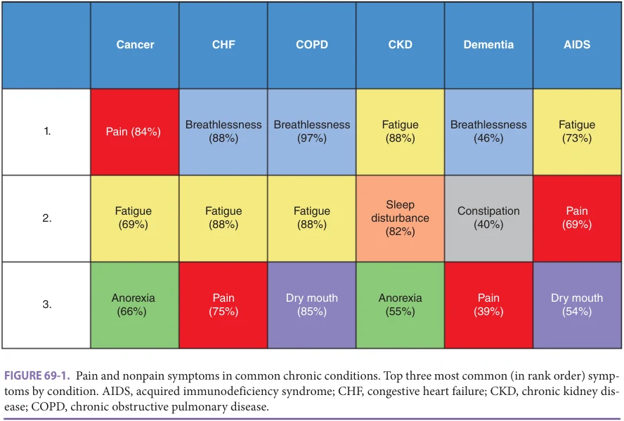
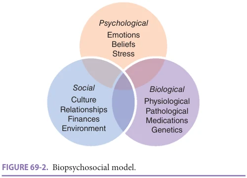
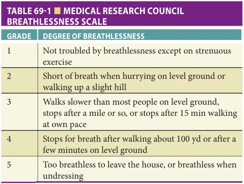

# Hazzard's Geriatric Medicine and Gerontology, 8e - Chapter 69: Management of Common Nonpain Symptoms

Christine S. Ritchie, Alexander Smith, Christine Miaskowski

> **Status.** Fast build from the book; not lane-reviewed.

> **Source and method.** Printed pages 1071-1076, from the marked 8th-edition copy (PDF page = printed page + 34). Prose follows its text layer; tables and figures are source-page crops. The book is canonical.

**[p. 1071]**

## OVERVIEW: COMMON NONPAIN SYMPTOMS IN OLDER ADULTS

Advances in medicine have led to our ability to stave off many acute life-threatening events and have contributed to the development of numerous co-occurring chronic conditions defined as multimorbidity. The experience of multiple conditions is often characterized by an array of symptoms associated with these conditions and/or their treatments. The presence of bothersome symptoms in older adults may contribute to illness burden in ways that may not be predictable on the basis of any one diagnosed disorder. However, these symptoms have a negative influence on older adults’ function and quality of life (QoL).

#### Learning Objectives

- Review the prevalence of and assessment strategies used to evaluate common nonpain symptoms in older adults.

- Address the evaluation and management of fatigue and dyspnea.

- Describe symptom management considerations in the context of multimorbidity.

#### Key Clinical Points

1. Many older adults experience a higher symptom burden associated with multiple co-occurring conditions. Screening for common symptoms should be a routine component of a comprehensive geriatric assessment (CGA).

2. Multicomponent interventions that rely on nonpharmacologic treatments are most effective for the management of fatigue and breathlessness.

3. Because the evidence base for symptom management in older adults is sparse, especially for those with multiple chronic conditions, a thoughtful approach that is informed by patient preferences is necessary to optimize benefit and minimize adverse effects.

Many symptoms are addressed throughout this textbook: anorexia is covered in Chapter 30, sleep disorders in Chapter 44, dizziness in Chapter 45, pain in Chapter 68, depressed mood and anxiety in Chapters 65 and 66, and constipation in Chapter 87. The focus of this chapter is on overall symptom assessment, evaluation, and management of fatigue and shortness of breath, especially for those with advanced illness, and special considerations in the context of multimorbidity.

Multiple symptoms occur frequently in chronically ill older adults. Because many individual conditions, such as cancer, heart failure, and chronic obstructive pulmonary disease (COPD), are associated with high symptom burden, their accumulation contributes to a large and complex array of symptoms (Figure 69-1). In a nationally representative study of older adults that assessed for pain, fatigue, breathing difficulty, sleeping difficulty, depressed mood, and anxiety, 28% of the population had three or more symptoms. Of note, reduced physical function and falls were more common in those with higher symptom burden. In a population-based sample of older adults using a 10-item symptom tool, the average number of symptoms was 3.7 and one-third of the population had five or more. In this cohort, the most common nonpain symptoms were fatigue (48%), weakness (39%), constipation (36%), anxiety (36%), anhedonia or depression (37%), shortness of breath (35%), and poor appetite (17%). In a study of 318 adults followed by a housecalls program, 43% reported severe

burden from one or more symptoms. The symptoms with the highest severity ratings were depression, pain, loss of appetite, and shortness of breath. Few longitudinal studies of the general older adult population have assessed changes in the symptom experience over time. Among 754 older adults in their last year of life, the monthly occurrence of one or more “restricting symptoms” was fairly constant in the first half of the year prior to death (20%). At approximately 5 months prior to death, the rate increased rapidly from 27% to 57% in the month prior to death.

**[p. 1072]**

*Figure 69-1. Pain and nonpain symptoms in common chronic conditions. Top three most common (in rank order) symptoms by condition. AIDS, acquired immunodeficiency syndrome; CHF, congestive heart failure; CKD, chronic kidney disease; COPD, chronic obstructive pulmonary disease. Printed p. 1072.*

## OVERALL EVALUATION OF SYMPTOMS

A CGA, historically did not include an assessment of pain or nonpain symptoms. More recent CGA versions have included systematic assessments of these symptoms.

Many symptom measures were developed initially for cancer patients and only evaluate symptoms over short time intervals. Other symptom measures focus on a particular disease without capturing the impact of nonindex conditions on symptoms. With few exceptions, nondisease-specific symptom inventories are not available for older adults with multiple conditions. One screening tool developed from a community-dwelling population of 1000 older adults, the Brief Symptom Inventory, assesses 10 common symptoms in older adults: shortness of breath, feeling tired or fatigued, problems with balance or dizziness, weakness, daily pain, stiffness, constipation, poor appetite, anxiety, and anhedonia. The tool shows discriminant and convergent validity. Another recently developed tool in Denmark captured 36 symptoms in a representative sample of 100,000 Danish people 20 years and older. The average number of symptoms reported by the population was 5.4. For each additional comorbid condition, one new symptom was added.

Many comprehensive symptom assessments were borrowed from oncology. The Memorial Symptom Assessment Scale (MSAS) measures the occurrence, severity, and distress of 32 symptoms and the Edmonton Symptom Assessment Scale measures 9 common symptoms on a 0 to 10 numerical rating scale. These instruments have been

used to assess symptoms and multiple dimensions of the symptom experience in both geriatric and palliative care noncancer patients. The large number of items in the MSAS can be a practical barrier to its use in the clinical setting.

## EVALUATION AND MANAGEMENT OF FATIGUE AND DYSPNEA

Evaluation of Fatigue The prevalence of generalized fatigue in older adults varies from 5% to almost 70% depending on the measure used, the characteristics of the older adult population, the time of day fatigue is assessed, and the cut points used to determine fatigue. Regardless of the assessment tool, fatigue is associated with decreased function and increased mortality. In a study of 492 older primary care patients, the question “Do you feel tired most of the time?” identified older adults with a one and a half to almost twofold increased risk of mortality over 10 years. Other assessments for fatigue tend to be longer and assess multiple dimensions of fatigue, again, predominantly derived from oncology. The Brief Fatigue Inventory, a nine-item instrument that assesses severity of fatigue and the impact of fatigue on daily functioning in the past 24 hours, has good psychometric properties but has been predominantly used in cancer populations. More recently, the concept of fatigability developed as a complement to the symptom of fatigue. Fatigability measures how fatigued an individual feels in relation to defined activities (eg, how fatigued a person feels after a 5-minute treadmill test). It offers

**[p. 1073]**

*Figure 69-2. Biopsychosocial model. Printed p. 1073.*

a more standardized way to measure fatigue but is more difficult to integrate into standard practice.

A more comprehensive assessment of fatigue should address (1) when the fatigue began, whether the onset was sudden or more gradual; (2) the pattern of fatigue over the course of a day; (3) what exacerbates or improves the fatigue; and (4) the impact that fatigue has on daily function and relationships. Sleep characteristics and medications should be reviewed. Because psychological factors are often associated with fatigue, systematic assessment for depression is warranted.

The biopsychosocial model, commonly used to characterize pain, applies well to other symptoms, including fatigue. The biopsychosocial model posits that psychological, social, spiritual, and physical factors influence an individual’s symptoms (Figure 69-2). In the case of fatigue, other factors such as obesity, depression, social isolation, loneliness, and spiritual distress may influence the experience of fatigue. A number of physical conditions are characterized by fatigue including electrolyte disturbances, occult malignancy, polymyalgia rheumatica, occult hepatitis, or HIV. Fatigue may be a silent harbinger of anemia or infection. In older adults, where atypical presentations of acute conditions are common, new-onset fatigue may indicate a recent myocardial infarction (MI) or heart failure. Hypogonadism is a less common cause of fatigue. Findings from the history and physical examination should dictate further diagnostic evaluation.

Management of Fatigue Very few studies have addressed the management of fatigue in older adults; more trials have focused on chronic fatigue syndrome in younger adults. A few studies have evaluated fatiguability in context of frailty. Approaches that have not shown promise include protein supplementation, thyroid supplementation (in subclinical hypothyroidism), or testosterone (in men). Counseling, vitamin D3 (in those with vitamin D deficiency), and functional training have shown some promise. Improvement of older adults’ sleep hygiene through both nonpharmacologic and pharmacologic

strategies (see Chapter 44) may reduce fatigue. While antidepressants may be beneficial, antidepressants with strong anticholinergic effects should be avoided (see Chapter 65). In the palliative care setting for older adults with advanced or life-limiting illnesses, psychostimulants such as methylphenidate or modafinil may be considered.

In a study of predominantly older prostate cancer patients (ages 52–94), methylphenidate reduced fatigue severity compared to control. However, a number of patients had to discontinue treatment due to increased blood pressure and tachycardia. A recent within-person crossover trial cast doubt on methylphenidate treatment of fatigue in advanced cancer. Among 43 participants who alternated between methylphenidate and placebo three times over a 9-day period, no improvement in fatigue during days with methylphenidate was observed. In older adults with known cardiovascular disease or arrhythmias, psychostimulants should not be used. While anecdotal reports touted the benefit of donepezil in treatment of opioid-induced fatigue in cancer patients, a subsequent clinical trial did not support these claims. In summary, fatigue is a common condition in older adults with likely multiple factors contributing to its prevalence.

Evaluation of Dyspnea (Breathlessness) Due to the high rates of COPD and heart failure in older adults, along with an array of other comorbid conditions, shortness of breath (dyspnea) is very common in older adults. In an Australian primary care practice, over half of those who presented with shortness of breath were older than the age of 65. The prevalence of dyspnea in community-dwelling older adults ranges between 17% and 62%, depending on the population studied and cut point used to define “dyspnea.” Dyspnea will likely occur at some point during a number of serious illnesses experienced by older adults (eg, cancer, heart failure, advanced lung disease), and at the end of life. The biopsychosocial model applies to dyspnea as well as it does to fatigue. Anxiety, disappointment, financial stressors, and questions about meaning often contribute significantly to the experience of dyspnea. Dyspnea, in turn, serves as a source of patient and caregiver distress and is associated with decreased QoL, decreased function, and increased health care utilization.

Physiologic mechanisms of dyspnea often fall under three categories: increased respiratory effort due to obstruction (eg, COPD, asthma, masses) or restriction (eg, obesity, pleural effusion); weakness (eg, multiple sclerosis, amyotrophic lateral sclerosis); or ventilation/perfusion mismatch (eg, anemia, pulmonary embolism, heart failure). More subtle systemic changes can contribute to the occurrence of dyspnea, especially at the end of life. For example, in the National Hospice Survey, 24% of patients with no known cardiopulmonary disease experienced dyspnea. The most appropriate measure of shortness of breath is the older adult’s self-report. Dyspnea does not always correlate with hypoxia, hypercarbia, or the presence of tachypnea. Most self-report

**[p. 1074]**

*Table 69-1. Medical Research Council breathlessness scale. Printed p. 1074.*

tools to assess dyspnea come from the obstructive lung disease literature. One of the most common assessment tools is the Medical Research Council (MRC) breathlessness scale. First published in the 1950s, the MRC scale characterizes, through five statements, a range of disability caused by level of breathlessness (Table 69-1). It correlates well with other dyspnea scales and with other direct measures of function, such as walking speed.

Management of Shortness of Breath Nonpharmacologic approaches to breathlessness have few side effects, unlike morphine for example, and avoid polypharmacy, a major concern in the older adults. They should be considered alongside pharmacologic approaches as first-line therapy. Nonpharmacologic approaches that can be helpful in the treatment of dyspnea include the use of a fan, breathing techniques, mindfulness and relaxation, anxiety management, and energy conservation. Breathing techniques that can reduce the sensation of dyspnea include pursed lip breathing, prolonged exhalation, and posture modification. In addition to mindfulness and relaxation, guided imagery and distraction strategies (eg, music, TV, reading by self or caregiver) were shown to reduce the sensation of breathlessness.

In patients with COPD and hypoxia, long-term oxygen therapy increases QoL and prolongs survival. Likewise, in a subset of patients with COPD, noninvasive ventilatory support such as with bilevel positive airway pressure (BiPaP) can improve QoL and prolong survival. In patients with advanced cancer and other nonpulmonary causes of dyspnea, the value of oxygen supplementation in improving outcomes is less clear. These results may be in part due to the fact that less than half of advanced cancer patients with dyspnea are hypoxic. In a study of nasal cannula– delivered air versus nasal cannula–delivered oxygen (median age 65), no difference was found in dyspnea relief between the two modalities when patients were not hypoxic; in two studies of hypoxic cancer patients, more

benefit from oxygen was noted. Recent studies of noninvasive ventilation in advanced cancer patients suggest that it may improve symptoms. In a multisite study of 200 predominantly older adults with advanced cancer (mean age 71), noninvasive ventilation was more effective than oxygen supplementation alone in reducing dyspnea and decreasing the amount of morphine needed to control symptoms. However, more patients in the noninvasive ventilation arm discontinued treatment primarily due to mask intolerance and anxiety.

Pharmacologic treatment for dyspnea should first and foremost be directed to the underlying cause of dyspnea, if known. Treatment may include a β-agonist for COPD or a diuretic in the case of heart failure. In a subset of patients, breathlessness persists at rest or on minimal exertion despite optimal treatment of the underlying chronic condition. These patients are described as having refractory dyspnea. In patients with refractory dyspnea, opioids may be beneficial. A number of studies of opioids for the treatment of refractory dyspnea in the setting of advanced illness demonstrate some benefit. However, the findings of reduced dyspnea (compared to control) are not consistent, and many studies remain underpowered to produce conclusive findings. Unfortunately, many of these studies use morphine, which has active metabolites (eg, morphine-6-glucornide, morphine-3-glucoronide). Morphine-3-glucoronide builds up in renal insufficiency, common in older adults and is responsible for symptoms of neurotoxicity (eg, hyperalgesia, allodynia, myoclonus). In older adults, opioids are associated with decreased mental functioning. For some patients, decreased mental functioning will not be acceptable despite its potentially positive impact on breathing.

## IMPACT OF MULTIMORBIDITY ON SYMPTOM MANAGEMENT AND PATIENT DECISION MAKING

For older adults, multimorbidity is the norm not the exception. Over 90% of Americans age 65 and older have two or more chronic conditions. In older adults, symptom burden increases with increasing numbers of co-occurring conditions and is associated with doubled mortality rates and reduced QoL.

Symptom Management in Multimorbidity Multimorbidity can constrain options for management of symptoms. Many pharmacologic treatments for symptoms have adverse effects that are magnified in patients with multimorbidity. For those with heart failure or hypertension, nonsteroidal anti-inflammatory agents often exacerbate these conditions. For those with cognitive impairment, opioids may make confusion more marked. Well known to those caring for older adults, initiation of one medication for one condition or symptom often leads to side effects

**[p. 1075]**

that require use of a second medication to manage the side effects—the “prescribing cascade.” Analgesics provide an apt illustration of this phenomenon. The use of a nonsteroidal anti-inflammatory drug (for those in whom it is not contraindicated) often requires additional medications to reduce the risk of potential negative gastrointestinal (GI) (eg, the addition of a proton pump inhibitor to reduce risk of GI bleeding) or cardiovascular (eg, the addition of aspirin to reduce the risk of MI or stroke) outcomes. In the case of opioids, patients must routinely be started on bowel stimulants or other laxatives to avoid the expected side effect of constipation.

Even without taking into account these challenges, many medications used to address symptoms have not been evaluated in older adults or in adults with multimorbidity. Among the symptom-focused studies done in older adults with advanced illness or multimorbidity, the most evidence exists for management of pain, and to a much lesser degree, dyspnea in cancer. There is a dearth of evidence for how to manage symptoms in noncancer illnesses, let alone in patients with several diseases. Therefore, the true benefits and the true risks are largely unknown. For this reason, pharmacologic management of symptoms warrants thoughtful discussions with the patient and/or family caregivers, as well as cautious initiation and careful monitoring of both the positive and negative effects of the treatment. For many older adults, symptom management involves both relief of discomfort and development of new drug-induced challenges. Anticipatory and ongoing discussion of the benefits and burdens of pharmacologic symptom management in the context of the patient’s goals and preferences offers an ongoing person-centered approach to improving the older person’s QoL.

The Role of Patient Preference in Symptom Management Given the lack of evidence for optimal symptom management for older adults in general and in particular for older adults with multimorbidity, treatment strategies for symptom management are preference sensitive—that is there is often more than one reasonable treatment option, or a particular option offers uncertain benefit. For preferencesensitive decisions, the clinician must understand what is most important to the patient to determine what might be the best treatment option. A starting point may involve asking patients to prioritize a set of universal health outcomes that can be applied across individual diseases. Typical outcomes would include living as long as possible, maintaining function, staying cognitively intact, and alleviating pain and other symptoms. Other outcomes may include staying out of the hospital or dying at home. While not always mutually exclusive, understanding how patients prioritize these various outcomes can help guide decisions about symptom management. This broad-based approach provides a more

unified starting point, rather than asking patients or caregivers to make specific treatment decisions.

Optimal decisions regarding symptom management require that the patient is adequately informed about the expected benefits and harms of different treatment options for their symptoms, recognizing that in many instances optimal information is lacking. Actual decision-making preferences vary widely by patients and family caregivers. Some individuals prefer to make the decision themselves, while others prefer that the decision for a specific treatment be made by the clinician. In either instance, most individuals want their opinion used to guide the decision-making process. Then, the clinician can develop a management plan and evaluate at regular intervals whether the management plan remains concordant with patient’s wishes. Reevaluation of treatment plans is critical as studies suggest that older adults with multimorbidity engage in dynamic reassessments of their conditions, as they shift between experiencing disruption from the condition and finding the ability to adapt to the condition’s challenges.

The following case illustrates these decision-making issues. Consider an 86-year-old man with advanced COPD who presents to the emergency department acutely dyspneic. He wants to live a few more days to say goodbye to family members and friends, even if it means living in the hospital. He does not want to be intubated or sent to the intensive care unit (ICU). He agrees to try BiPAP while initiating diureses. He expresses immediate profound relief of dyspnea upon securing the mask. However, the next morning, he asks that the mask be removed as it seems suffocating. He has had the opportunity to talk to his family and the distress associated with the BiPAP mask no longer makes it worthwhile. The patient’s clarity around what is important to him can guide the clinician in these preference-sensitive treatment decisions.

## SUMMARY

Experiencing multiple symptoms is common in older adults and particularly common in older adults with multimorbidity. For most symptoms, pharmacologic and nonpharmacologic approaches have some evidence base. Unfortunately, the evidence base is very limited for older adults, especially for those with multiple chronic conditions. Because the evidence base for symptom management is so sparse, treatments are preference sensitive and should take into account the values and preferences of older patients and their caregivers. Universal outcomes around function, cognition, comfort, and survival may be good starting points regarding which treatment options make the most sense. Ultimately more research will be needed to ascertain which treatments are the most beneficial for older adults and those with multimorbidity.

**[p. 1076]**

## FURTHER READING

Eldadah BA. Fatigue and fatigability in older adults. PMR.

2010;2(5):406–413. Elnegaard S, Andersen RS, Pedersen AF, et al. Self-reported

symptoms and healthcare seeking in the general population—exploring “The Symptom Iceberg”. BMC Public Health. 2015;15:685. Glynn NW, Santanasto AJ, Simonsick EM, et al. The Pitts-

burgh Fatigability Scale for older adults: development and validation. J Am Geriatr Soc. 2015;63(1):130–135. Hardy SE, Studenski SA. Fatigue predicts mortality among

older adults. J Am Geriatr Soc. 2008;56(10):1910–1914. Jones PW, Harding G, Berry P, Wiklund I, Chen W-H, Leidy

NK. Development and first validation of the COPD assessment test. Eur Respir J. 2009;34:648–654. Jones PW, Quirk FH, Baveystock CM. The St George’s

respiratory questionnaire. Respir Med. 1991;85(suppl B): 25–31. King DE, Xiang J, Pilkerton CS. Multimorbidity trends in

United States adults, 1988-2014. J Am Board Fam Med. 2018;31(4):503–513 Lehti TE, Öhman H, Knuutila M, et al. Symptom burden is

associated with psychological wellbeing and mortality in older adults. J Nutr Health Aging. 2021;25(3):330–334. Mahmoud AM, Biello F, Maggiora PM, et al. A randomized

clinical study on the impact of Comprehensive Geriatric Assessment (CGA) based interventions on the quality of life of elderly, frail, onco-hematologic patients candidate to anticancer therapy: protocol of the ONCO-Aging study. BMC Geriatr. 2021;21(1):320. Martinez-Amezcua P, Simonsick EM, Wanigatunga AA,

et al. Association between adiposity and perceived physical fatigability in mid- to late life. Obesity (Silver Spring). 2019;27(7):1177–1183.

Mendoza TR, Wang XS, Cleeland CS, et al. The rapid

assessment of fatigue severity in cancer patients—use of the Brief Fatigue Inventory. Cancer. 1999;85:1186–1196. Mitchell GK, Hardy JR, Nikles CJ, et al. The effect of meth-

ylphenidate on fatigue in advanced cancer: an aggregated N-of-1 trial. J Pain Symptom Manage. 2015;50(3): 289–296. Morris RL, Sanders C, Kennedy AP, Rogers A. Shifting

priorities in multimorbidity: a longitudinal qualitative study of patient’s prioritization of multiple conditions. Chronic Illn. 2011;7(2):147–161. Nava S, Ferrer M, Esquinas A, et al. Palliative use of non-

invasive ventilation in end-of-life patients with solid tumours: a randomised feasibility trial. Lancet Oncol. 2013;14(3):219–227. Patel KV, Guralnik JM, Phelan EA, et al. Symptom

burden among community-dwelling older adults in the United States. J Am Geriatr Soc. 2019;67(2):223–231. Portenoy RK, Thaler HT, Kornblith AB, et al. The Memo-

rial Symptom Assessment Scale: an instrument for the evaluation of symptom prevalence, characteristics and distress. Eur J Cancer. 1994;30A:1326–1336. Ritchie CS, Hearld KR, Gross A, et al. Measuring symp-

toms in community-dwelling older adults: the psychometric properties of a brief symptom screen. Med Care. 2013;51(10):949–955. Smith MEB, Nelson HD, Haney E, et al. Diagnosis and

Treatment of Myalgic Encephalomyelitis/Chronic Fatigue Syndrome. Evidence Report/Technology Assessment No. 219. AHRQ Publication No. 15-E001-EF. Rockville, MD: Agency for Healthcare Research and Quality; December 2014. Addendum July 2016. www.effectivehealthcare.ahrq.gov/ reports/final.cfm. Accessed January 3, 2022.
