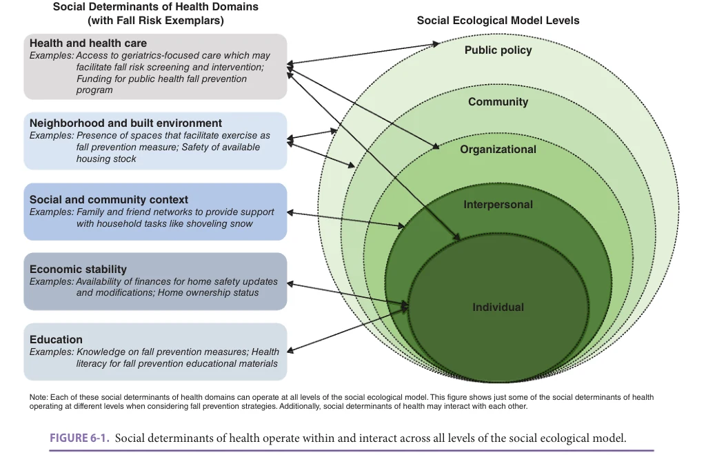
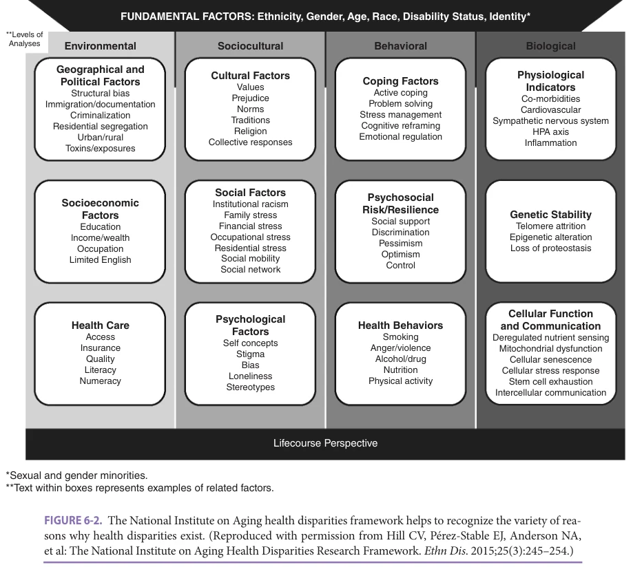
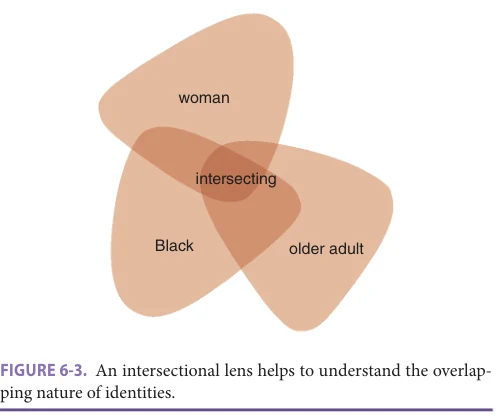
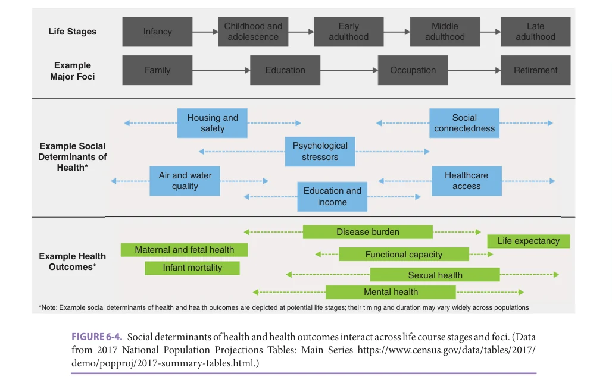
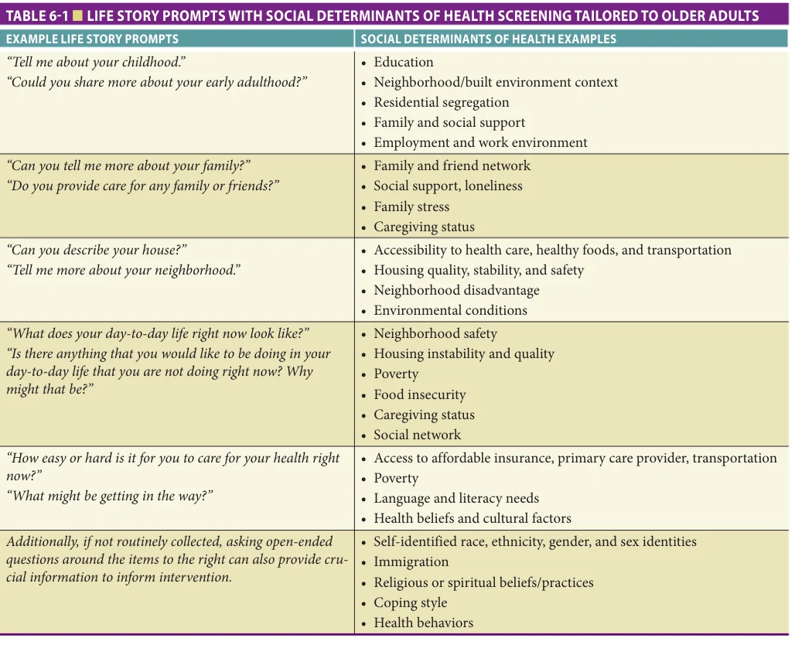
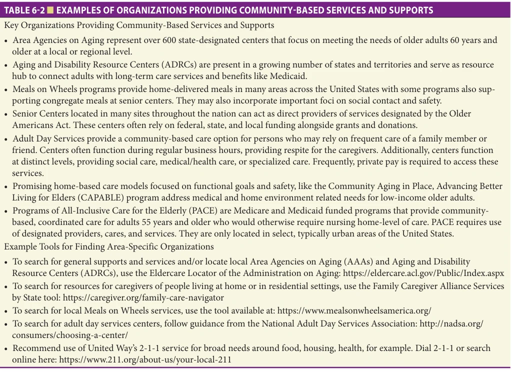

# Hazzard's Geriatric Medicine and Gerontology, 8e - Chapter 6: Social Determinants of Health, Health Disparities, and Health Equity

Laura Block, W. Ryan Powell, Andrea Gilmore-Bykovskyi, Amy J. H. Kind

> **Status.** Fast build from the book; not lane-reviewed.

> Excluded from the IMA required reading list (P005-2026); not cited in the 2020-2026 past papers.

> **Source and method.** Printed pages 95-108, from the marked 8th-edition copy (PDF page = printed page + 34). Prose follows its text layer; tables and figures are source-page crops. The book is canonical.

**[p. 95]**

## INTRODUCTION

Scientific progress in aging and geriatrics has led to longer life expectancy, improved quality of life, and many advancements in geriatric medicine. Unfortunately, these benefits are not equally distributed across populations. Lower life expectancy, higher age-related disease incidence including Alzheimer disease, chronic disease burden, and worse health care quality and access disproportionately affect historically disenfranchised groups in the United States—which include but are not limited to racial and ethnic minorities, persons living in rural areas or who are socioeconomically disadvantaged, and sexual and gender minorities. Such health differences are broadly referred to as health disparities, and across the life course these negative health impacts are often compounded, exerting a cumulative influence on age-related health outcomes in older adults.

#### Learning Objectives

- Define social determinants of health, health disparities, and health equity.

- Understand historical and contemporary contributing factors to health disparities in older adults within historically disenfranchised groups.

- Apply a life course perspective to health equity and its role in older adult health.

- Describe features of effective interventions to foster health equity.

#### Key Clinical Points

1. Social determinants of health reflect the educational, economic, health care, neighborhood/environmental, and social and community context of everyday life. Social determinants of health play a key role in approaches to prevent and address adverse health outcomes.

2. Health disparities are common among older adults and are often rooted in unfavorable exposure to social determinants, for example, disparate access to health opportunities and barriers.

3. Multiple factors, including biological, health behavior–related, sociocultural, and environmental, interact and operate across the life course to influence later-life health outcomes.

4. Individualized assessments are needed to understand opportunities and barriers to older adult health, and to avoid biased assumptions about individuals.

5. Consideration of social determinants and their contribution to age-related health disparities requires increasing levels of collaboration among members of the care team, including geriatrics, mental health, and communitybased supports and services (CBSS).

Getting to the root causes of health disparities requires a well-rounded understanding of the social/environmental, behavioral/psychological, and biological processes involved and how they interrelate. We often have a better understanding of geriatric conditions from a biological and sometimes behavioral vantage point, yet less often do we understand how unequal exposure to disadvantaged social and environmental contexts drives health disparities. Frailty risk, for example, is shaped by biological (female sex) and behavioral (physical activity level and cognitive status) factors along with social and environmental factors, such as access to safe spaces within which to exercise or financial resources to wear proper footwear for safe exercise. However, social and environmental factors are frequently overlooked in key clinical and research domains.

Social determinants of health are the conditions within which we live, grow, work, play, and age that impact health. They are particularly salient in the development and reinforcement of health disparities, playing a role in an estimated 80% of health outcomes. They include factors related to financial wealth and stability, education, the social and community context, the neighborhood and built environment, and health care access and quality. Social determinants of health exert influence at individual, family, community, organizational, and policy levels.

Laura Block and W. Ryan Powell contributed equally and are co-first authors of this chapter.

**[p. 96]**

It is important to recognize that social determinants of health affect the health of older adult populations. Having an awareness of the mounting evidence on these complex factors, along with being equipped with a strong conceptual, will help geriatricians and other clinicians to recognize and respond effectively to social factors that drive health disparities later in life. This chapter provides a practical foundation for defining and understanding social determinants, health disparities, and health equity as they relate to the health of older adults. While this chapter provides many examples pertaining to the United States, the underlying themes apply globally even if their manifestation and consequences are unique by country and region. Both a historical lens and a life course approach are applied to deepen understanding of the fundamental causes of health disparities. Interventions to foster health equity across individual, community, and policy levels are presented to illustrate real-world approaches to applying this knowledge.

## DEFINITIONS

Understanding the key concepts of social determinants of health, health disparities, and health equity, and how they are interrelated is necessary for untangling the historical and contemporary forces that shape health for older adults and the multilevel interventions sought to foster equitable outcomes.

### Social Determinants of Health

Social determinants of health are the conditions in daily life that impact health. They include the social, economic, physical, and environmental factors that shape everyday lives, and the opportunities and barriers to health older people may experience. Examples of social determinants of health can include the lack of access to quality education; economic stability commonly tied to employment and income; neighborhood and built environment factors like housing, safety, and access to healthy food options; and the social and community context such as challenges due to discrimination. Social determinants of health can also influence the nature of care delivery, and care delivery can further influence health outcomes—creating a compounding effect. Domains of the social determinants of health are shown in Figure 6-1, as adapted from the Centers for Disease Control and Prevention Model.

Some social determinants, such as air pollution contributing to asthma and related exacerbations, have a clear, direct pathway to health outcomes. However, many social determinants operate indirectly to affect health; for example, chronic exposure to social and environmental stressors can be linked to disproportionate rates of respiratory and cardiovascular conditions. Thanks to new targeted funding efforts, an understanding of these indirect pathways is an active area of investigation, with the hopes of making new mechanistic discoveries that explain the link between social determinants and adverse health outcomes.

*FIGURE 6-1. Social determinants of health operate within and interact across all levels of the social ecological model.*

*Owner annotations/highlights are from the marked source copy, not the book.*

**[p. 97]**

Social determinants of health can often originate from systems and structures, yet they influence persons and families. The social ecological model provides a helpful visual for appreciating that individuals are situated within a larger context and shaped by these cross-cutting social determinants of health. Social determinants of health can operate within and interact across levels of society (the individual, organization, community, public) as depicted in Figure 6-1. For example, when considering fall prevention strategies for older adults, home modifications may not be an affordable or feasible option for persons who are not home-owners; and though conversations on fall prevention may be operating on a person or individual level, consideration of rental agreements may function at an interpersonal and organizational level, access to affordable housing may occur at a community level, and patterns in home-ownership may be impacted by public policy.

### Health Disparities

Health disparities are differences in health outcomes driven by unjust, inequitable causes that negatively affect a

population or groups of individuals. The presence and persistence of health disparities require understanding their sources and addressing their occurrence. Though health disparities have long existed in the United States, groundbreaking reports, including the 1984 Department of Health and Human Services Report, “Health, United States, 1983,” and the 2003 Institute of Medicine Report “Unequal Treatment: Confronting Racial and Ethnic Disparities” brought broader attention to these inequities by highlighting the social and structural health system factors involved.

Older adults may experience age-related health disparities that result from unjust, inequitable access to aging-specific care, supports, and services. They may experience the accumulation of health disparities across the lifespan, resulting in long-standing and new negative health outcomes. Within the context of aging, the National Institute on Aging (NIA) provides a framework for understanding the environmental, sociocultural, behavioral, and biological factors that shape health and lead to health disparities across the lifespan (Figure 6-2). The NIA framework

*FIGURE 6-2. The National Institute on Aging health disparities framework helps to recognize the variety of reasons why health disparities exist. (Reproduced with permission from Hill CV, Pérez-Stable EJ, Anderson NA, et al: The National Institute on Aging Health Disparities Research Framework. Ethn Dis. 2015;25(3):245–254.)*

*Owner annotations/highlights are from the marked source copy, not the book.*

**[p. 98]**

## Note:

Though health disparities often exist for historically disenfranchised populations (eg, Indigenous, Black, or rural populations), a person’s group membership or identity itself does not create health disparities. However, these individuals may be disproportionately impacted or intentionally targeted by systemic, contextual, and relational forces that result in health disparities. To illustrate this point, a common misconception is that race is a risk factor for poor health—for example, that Black identity directly leads to early mortality. However, the true driver in this association is the systemic racism operating at multiple levels that results in the development and perpetuation of a health disparity, for example, shaping access to resources needed for health. Race is a social construct. It is not a biological construct. Yet, this erroneous perception of race as a biological construct remains pervasive across a wide array of venues. Such flawed interpretations support the need for better medical education and training, and the need for wider efforts to address the structural factors that promulgate such errors.

provides nested classifications for each factor, helping us to consider some of the potential underlying drivers of health at each level—and to also consider the timing and influence of each on health across the lifespan.

### Health Equity

Health equity is the assurance of the condition of optimal health for all people, centering those who are historically disenfranchised and most vulnerable. Health equity is an ongoing process and never fully achieved; instead, it is pursued through addressing social determinants of health and reducing health disparities. Older adults should be centered as active agents and recipients of health equity conversations, as age is not an exclusionary criterion to achieve health potential.

### Related Concepts

Racism Racism, or discrimination based on race, can occur at systemic, organizational, and interpersonal levels. Often, systemic and organizational racism is referred to as “institutional racism.” Less recognized, although insidious, is “internalized racism” or the biases people carry due to larger narratives about race. Racism is experienced by many older adults of color and can often be intertwined and compounded with experiences of ageism.

Intersectionality The confluence of lifelong experiences and social identities interact in specific and individual ways that contribute to older adults’ health in late life. An intersectional lens emphasizes a more nuanced and accurate

*FIGURE 6-3. An intersectional lens helps to understand the overlapping nature of identities.*

*Owner annotations/highlights are from the marked source copy, not the book.*

understanding of how health is shaped by the many ways people experience disadvantage. Avoiding oversimplifications, intersectionality instead takes into account that the experiences and identities of race, social class, gender, age, and more intermingle to confer a lack of privilege. It can also facilitate an understanding of how health experiences are inseparable from their multiple identities; for example, the experience of managing diabetes as an older adult will be tightly tied to experiences navigating health care settings as someone who identifies as Black or someone who identifies as non-gender conforming. Moreover, multiple overlapping identities are not experienced separately but in tandem, and disadvantage is not always simply additive. For example, an older Black woman cannot leave their age, race, or gender at the door before walking into a clinical encounter, and all of these must be considered when discussing and considering their health experiences, as depicted in Figure 6-3.

## HISTORICAL PERSPECTIVE

To develop a better understanding of the complex nature and persistence of health disparities in the United States, a brief historical review is needed. While it is not possible to capture all historical experience here, these are some of the salient examples in which history continues to have lasting effects on society. In this section, the manner in which phenomena such as colonialism, slavery, segregation, and contemporary sources of control over individuals based on skin color and other social identities continue to deny key resources to populations, affecting life, opportunity, and health is reviewed. A historical lens allows us to understand the manner in which social identities have been constructed over time. The lasting effects of these historical and contemporary forces, although described in the United States context, are perpetuated across multiple axes (eg, race, sex, gender, disability, immigrant status) and worldwide. Though manifestations and impacts may

**[p. 99]**

be unique by country and region, the resultant health disparities often share similar features.

Colonialism has resulted in ongoing repercussions on Indigenous health and may be considered a distal or underlying determinant of Indigenous health—in other words, a cause of the causes of health determinants. Not only can colonialism be linked to Indigenous health, as an underlying determinant and source of historical trauma, but it paved the way for the continued displacement and marginalization of Indigenous persons, systemic underfunding of health resources (including the Indian Health Services), failure to recognize Indigenous health traditions, and erasure of the successes of Indigenous communities, including self-governance and self-determination.

For African-Americans, a history of slavery followed by sharecropping, segregation, and state-sponsored oppression (eg, redlining and lending bias) have shaped the opportunities for housing, employment, education, and health across families and neighborhoods. For example, notably yet often overlooked is the intense violence against and systematic removal of supports for freed slaves during the post-Civil War Reconstruction era followed by 10 decades of subservience and segregation. This, in part, fueled the Great Migration of African-Americans out of Southern States from approximately 1916 to 1970 for risky jobs in other areas of the country with little to no family wealth or education. Some narratives portray slavery, segregation, and racism as a thing of the past, or if present, a rare interpersonal occurrence. These narratives forget recent history along with contemporary events that demonstrate persistence and long-lasting harms of racist and often state-sponsored tools that oppress opportunity and health.

Disadvantage is perpetuated by a history of discriminatory practices (including in the workplace and community), and denial of rights and certain protections against many groups including women, persons with disabilities, persons from immigrant backgrounds, and lesbian, gay, bisexual, and transgender (LGBT+) people, generating health disparities over the lifespan. For example, LGBT+ people have long-faced legal discrimination: the ways in which family and partnerships have been defined block access to health insurance in safety net programs like Medicaid as well as social security, employment, and veteran benefits. Home equity is often the main source of family wealth, yet discriminatory lending practices contribute to widening wealth gaps. These lending practices have often discriminated based on place, race or ethnicity, and immigrant status. For example, mortgage discrimination in the form of redlining or denying credit, has origins which trace back to the 1930s, dispersing and segregating communities in addition to damaging home equity. Furthermore, the practice of reverse redlining during the housing crisis of the 2000s has garnered attention, where risky, high-cost subprime loans were disproportionately offered to borrowers in Black and Latinx neighborhoods. Given the allocation of

resources by place, and the manner in which neighborhood and health are tied together, not only does displacement, redlining, and mortgage bias impact opportunity, but it also hurts health.

While concentration of populations within certain regions and neighborhoods may not be, in itself, a negative phenomenon, restriction of movement of these persons based on their social identity represents discriminatory policies and practices. Moreover, these regions and neighborhoods are more likely to be zoned in manners that allow industrial and mixed environments, resulting in poorer air and water quality, less access to food and green space, and greater likelihood of highway construction. Another modern phenomenon is the mass incarceration of disproportionately non-White populations, which can contribute to family separation, poverty and trauma, and subsequent poor health.

Additionally, in a disturbingly persistent manner, health care professionals have wielded medicine as a tool of oppression against specific groups. For example, there is a long history of people with disabilities being involuntarily sterilized, a practice which was upheld in a 1927 Supreme Court ruling and after which resulted in forcible sterilization of roughly 70,000 people, often disproportionately women, racial minorities, and poorer people.

## Note:

A historical lens can help us understand that the “mistrust” toward health care systems is in fact the absence of earned trust.

## POPULATION TRENDS

The United States is undergoing major population shifts. In less than 20 years, people 65 years and older will outnumber those under the age of 18. Soon after, groups considered to be racial and ethnic minorities will outnumber White populations. And by 2060, persons 65 years and older will have grown nearly 69% larger and represent 23% of the total population, with White persons representing half of the entire population 65 years and older (see Chapter 2).

Other notable trends include the rising numbers of adults 65 years and older remaining in the labor force and the decrease in poverty rates among older adults. However, poverty rates remain around 10% and are nearly double for racial and ethnic minorities. The US population is becoming more diverse, and correspondingly so are older adults. This diversity can be seen in the growing number of older adults who identify as Black, Indigenous, Latinx, for example—all identities which have experienced historical disenfranchisement and therefore may experience corresponding consequences on health. A nonexhaustive review of population trends for historically disenfranchised groups and unique health considerations is presented below; yet

**[p. 100]**

further investigation is merited with caution to the harms that can occur with assuming individuals may conform to and experience wider phenomena.

• Indigenous populations (Native American, American Indian, and Alaska Native) are growing and expected to be 1.4% of the total population by 2060, with corresponding growth in numbers of older adults. Nearly half of older Indigenous adults have one or more disabilities, and twice as many experience poverty compared to counterparts. • There are an estimated 1.5 million older adults who identify as lesbian, gay, or bisexual, with poorly established numbers for transgender older adults. This number is expected to nearly double by 2030. LGBT+ older adults are more likely to be single and without children and to experience poverty as compared to non-LGBT+ counterparts. There has also been a history of systemic denial of services and benefits based on LGBT+ identity and same-sex marriage status. LGBT+ older adults often face discrimination and ignorance by health care providers, lesser health insurance coverage, delays in seeking and receiving care, and sexual and mental health stigma. • An often-overlooked group of older adults includes those living in federal and state prisons. A growing number of incarcerated persons are 50 years and older. Incarceration may accelerate aging by 10 to 15 years, with age 50 often cited as the cutoff point for older age among persons who are incarcerated. Incarcerated older adults are at greater risk for mental and chronic health conditions, cancer, dementia, and HIV/AIDS; have higher rates of disability; experience more substance abuse and addiction; and have higher rates of prior trauma. Prisons are often underprepared and under-resourced for supporting medical and mental health needs, particularly for older adults who may be experiencing higher disease burden. • There are also unique challenges faced by older adults upon release from prison—a trend which may increase with compassionate release laws—due to barriers and discrimination in accessing CBSS. Additionally, some of these adults require nursing home-level care, yet these facilities are often unequipped to support individuals in successful reentry. • Older adults who identify as immigrants or foreign-born are growing in number, representing longterm and recent migration patterns. These populations have specific economic, familial, cultural, and language-related needs—all of which may be moderated by social supports, education, and literacy levels. Integrated translation services, accessible materials, and culturally responsive services that flexibly integrate family and friend supports are important in the care of older adult immigrants. Today, a majority of US immigrants come from the following origin countries:

Mexico, China, India, Philippines, and El Salvador. When considering culturally responsive services for older adult immigrants, it is imperative to consider the heterogeneity of immigrant populations rather than broad classifications of older adults as Latinx or Asian, as these categorizations do not account for the rich diversity in language and culture of subpopulations. Status as a naturalized citizen, lawful permanent resident, unauthorized immigrant, and refugee can also affect an older adult’s health status and interaction with health care services, for example, impacting resource eligibility. • Older adults living in rural areas often face extreme barriers in access to health care that can negatively influence their health outcomes and lead to increased mortality. Older adults living in rural areas are also more likely to experience poverty and chronic health conditions exacerbated by a lack of updated built infrastructure. Adults identifying as Indigenous, Latinx, and Black and living in rural areas may experience compounded barriers to health access and care. In rural areas, not only are health outcomes shaped by poor health care access, but also by limited options to access healthy food and safe places for exercise.

## LIFE COURSE PERSPECTIVE

Applying a life course perspective to health disparities among older adults allows us to understand how experiences throughout the lifetime and across generations may differentially influence health opportunities and outcomes. As experiences are often shaped by the social and physical environment, a life course perspective recognizes the accumulation of social determinants of health across time. There are two major schools of thought regarding life course perspectives:

• A developmental life course perspective emphasizes critical periods or developmental windows with adaptation in response to adversity. These factors across the life course affect health in later life. Exposure during these windows or periods can result in acute and chronic adverse health outcomes. Critical periods can include fetal and infant developmental stages, where exposures may result in irreversible health consequences. • A structural life course perspective emphasizes the historically and socially influenced nature of health. It also emphasizes that health-promoting or harming exposures may be disproportionally and cumulatively experienced differently by different groups. This perspective gives way to the weathering hypothesis, where structural inequalities create chronic exposure to disadvantage that can result in disproportionate rates of disease.

**[p. 101]**

*FIGURE 6-4. Social determinants of health and health outcomes interact across life course stages and foci. (Data from 2017 National Population Projections Tables: Main Series https://www.census.gov/data/tables/2017/ demo/popproj/2017-summary-tables.html.)*

*Owner annotations/highlights are from the marked source copy, not the book.*

Life course perspectives have been applied to and investigated in common chronic health conditions, including diabetes, cardiovascular disease, respiratory disease, and specific cancers. Life course perspectives also examine trajectories in both exposures and health, and the intergenerational transmission of exposure-related health determinants. As historical and social structures remain in place across generations, exposures and related health impacts may be experienced across time.

Applied to geriatrics, a life course perspective requires assessment of early life and cumulative exposures to adverse social and environmental stressors, and their consideration in care approach design to maximize health. Practical considerations toward this end are presented later in the chapter.

Figure 6-4 depicts major life stages and accompanying foci at each life stage. Example social determinants of health are depicted; these may occur and shape health at specific critical periods and may accumulate longitudinally across the lifespan. Example health outcomes that may be particularly sensitive to social determinants are also portrayed.

## HEALTH EQUITY AND GERIATRICS INTERVENTIONS

Understanding health disparities—including their root causes, impact on health across the lifespan, and nature in geriatrics populations—is an important first step toward being able to realize health equity.

Health care providers are poised to deliver multilevel health equity interventions that can accelerate the elimination of health disparities. The Social Ecological Model and NIA Disparities Framework can help inform targeting of health equity interventions at multiple levels (individual, interpersonal, community, organizational, and public policy) and social determinant domains (environmental, sociocultural, behavioral, and biological). Though intervening at the highest level of the Social Ecological Model (public policy) may hold potential to influence the most persons, meaningful change must also occur at the interpersonal level, such as during provider–patient interactions.

There are numerous interventions providers can utilize before, during, and after the delivery of care to promote health equity. As a prerequisite, a comprehensive understanding of population and area-specific social determinants of health can equip providers with knowledge to inform assessment and tailored recommendations. From there, a life-story perspective that considers the potential life course impact of social determinants for an older adult can promote understanding of factors influencing presentation and help tailor recommendations to maximize effectiveness. A systematic, non-biased approach to assessment of social determinants is key, with suggestions presented later in the chapter.

### Sample Individual Health Equity Interventions

• Screen for social determinants of health by conducting thorough psychosocial assessments and life-story

**[p. 102]**

reviews to assess for education, past and current occupations, income, health care access, and additional social determinants of health. • Create an open dialogue around the manner in which racism and discrimination may be influencing an older adult’s health. Ask about prior negative experiences with health care, along with historical and contemporaneous forces of oppression. • Balance consideration of risk behaviors with older adult health promoting and coping behaviors. • Consider intersectionality, including the interaction of social determinants with fundamental identity factors, and avoid siloed approaches. • Recognize and utilize the language preferred by older adults, engaging translation services when necessary.

## Note:

Patient–provider communication is a key driver of health quality and outcomes. Promoting the use of inclusive language, can be a step toward strengthening patient– provider relationships. Use preferred pronouns and terminology, acknowledging that there is at times no general consensus, and always seek the terms your patients prefer to self-identify. For example, some patients from Indigenous American groups may identify as Native Americans while others might use the term American Indian to self-identify.

### Sample Interpersonal and Community Health Equity Interventions

• Involve older adult support systems as identified by that individual, including family and friends; avoid restrictive definitions of support systems. • Consider ways in which health behaviors may be rooted in family and cultural practice; avoid bias, labeling, stigmatization, and imposing your own preferences or values. • Realize the trauma that lifelong family, financial, occupational, and residential stress can create for individuals and families across generations. • Recognize that racism and discrimination is a lived experience that impacts older adults’ support systems and that this may lead to additional stress.

### Sample Organizational and Public Policy Health Equity Interventions

• Advocate for expanded funding of programs that promote older adult health. • Promote integration of health services and communitybased services and supports. • Appreciate that a diverse workforce is a strength and reflects on organizational practices and policies that

may or may not foster and create opportunities for historically underrepresented populations. • Advocate for implicit bias, antiracist, and cultural competency training for your organization.

## Note:

While some medical school programs have begun to incorporate education on implicit bias, cultural competency and humility, and antiracism, such training is not universal. Programs should universally strive to include these constructs across educational venues and levels.

## Note:

Though cultural competency can help inform practice, generalizations should be avoided. Assuming culture based on a person’s identity can be incredibly error prone and damaging in and of itself.

## SOCIAL DETERMINANTS OF HEALTH SCREENING

Provider-older adult interactions create opportunity for social determinants of health screening. At a minimum, this should include: self-identified race and ethnicity, employment and education, use of tobacco/alcohol/drugs, car and firearm safety, domestic violence history, marital and children status, housing status, social supports, and information on neighborhood and built environment.

Geriatricians and teams have opportunities to identify unmet needs and provide immediate resources or act as a bridge to community-based services that have the potential to create meaningful change in the health and quality of life of older adults. Social determinants of health screening also has the potential to encourage person-centered, trauma-informed care; improve diagnosis and reduce missed diagnosis; provide resources that increase medication adherence; and potentially avoid unnecessary health care utilization.

When conducting assessments that consider social determinants of health, there are important considerations to prevent common errors and maximize organizational efficacy:

• While some clinics conduct social determinants of health screening through use of structured templates and tools, an open-ended, life-story approach may be better suited to older adults. Several visits may be required for a thorough life story and social determinants of health screening in order to promote greater buy-in and reduce burden on both the older adult and clinician. Allow the older adult to disclose the manner in which they identify with different social categories;

**[p. 103]**

*TABLE 6-1 ■ LIFE STORY PROMPTS WITH SOCIAL DETERMINANTS OF HEALTH SCREENING TAILORED TO OLDER ADULTS*

*Owner annotations/highlights are from the marked source copy, not the book.*

match the language they use. Table 6-1 includes example life-story prompts that may allow for probing of social determinants of health and unmet needs impacting older adult health. • Comprehensive assessment of social determinants of health and use of a life-story approach may heighten awareness of barriers that older adults may face to their health and of lifelong stressors that may be shaping current status. Be ready to meet newly identified older adult needs by: • Partnering with community-based organizations to streamline referrals • Integrating mental health services to address lifelong stressors and trauma • Do not assume a person’s social identities based on their visible characteristics, or previously recorded responses. Not only are social identities self-constructed, but some can shift over time. • Do not withhold treatment or therapy based on the potential that someone’s social determinants of health may make access or implementation more

challenging. Rather, gauge the client’s preferences for treatment or therapy and find individualized, tailored resources that will make that preference possible. • Do not commit attribution error in associating a health issue with someone’s identity or background, which could contribute to invasive, inappropriate questioning, or escalation of care. Rather, recognize that social determinants of health often work in concert with other factors to shape health outcomes.

To initiate social determinants of health screening and intervention, begin a conversation within your organization on the timing and location for social needs screening and intervention delivery; determine team process for conducting assessment and intervention; tailor screening tools to the local older adult population and known unmet needs; determine process for matching older adults with local resources based on their self-identified unmet needs and establish relationships with corresponding community-based organizations; and develop a process for documentation and follow-up.

**[p. 104]**

*TABLE 6-2 ■ EXAMPLES OF ORGANIZATIONS PROVIDING COMMUNITY-BASED SERVICES AND SUPPORTS*

*Owner annotations/highlights are from the marked source copy, not the book.*

## COMMUNITY-BASED SUPPORTS AND SERVICES

A preliminary understanding of available communitybased supports and services (CBSS) is needed prior to making recommendations, with examples specific to the United States context provided in Table 6-2. CBSS aim to meet educational, wellness, nutritional, counseling, financial, safety, and housing needs, yet CBSS availability and quality vary greatly. For example, CBSS in rural areas may provide services to older adults across several counties, requiring providers and older adults to drive long distances for access. While more than 20% of older adults regularly access CBSS, there may be unmet needs among these adults and those not yet connected to CBSS.

CBBS for older adults were first expanded by the 1965 passage of the Older Americans Act (OAA). Funding is allocated to services in at least these areas: supportive services, congregate and home-delivered meals, preventive health, caregiver support, abuse prevention, and ombudsman. The OAA made possible the Administration on Aging (AoA) and corresponding state-specific Area Agencies on Aging (AAAs). AAAs operate on federal, state, and municipal funding, though they also rely on private funding sources.

Over 3 million older adults rely on meal services, caregiver supports, home care, adult day services, and transportation on a regular basis, with over 9 million receiving these services intermittently. These services result in less meals skipped and greater nutrition, social contact, decreased caregiver burden, delays to institutionalization, among other outcomes. Resources vary by state and region. In some areas, waiting lists for these services are long.

## A CASE STUDY

A 75-year-old veteran, Marshall, who self-identifies as African-American is being evaluated in a memory clinic for cognitive concerns. Upon evaluation in clinic, Marshall is found to have significant visuospatial and short-term memory impairment. He also shared that he recently had several, “fender benders”, raising concerns regarding his driving safety. Dr. M., the geriatrician evaluating Marshall, asks if he has any family that could be contacted as they have determined that Marshall can no longer drive safely. Marshall says there is only one person he knows they could call. Dr. M. reviews Marshall’s social history, sees that he is married, and asks if Marshall knows his wife’s number,

**[p. 105]**

assuming this is the individual he would like to have called. Marshall grabs his car keys off the desk, yells “No!”, and storms out of the office. Security cannot locate Marshall in a timely manner. On his way home, Marshall suffered minor injuries in a motor vehicle accident and is admitted to the hospital for treatment.

Several days later, on rounds, Dr. M. swings by Marshall’s room. While Marshall is getting a CT scan, there is a visitor in the room. Dr. M. asks if he is a friend of Marshall’s, and the visitor informs Dr. M. that he is Marshall’s partner. Dr. M. learns that although Marshall was married and had several children, he identified as queer his entire life and suffered considerable discrimination and harm during his years of service in the military

over questions of his sexual orientation. Due to the discrimination he encountered, he limited his social circle, made very few friends, and lost contact with much of his family, leaving him isolated. About 5 years ago, he decided to come out to his children as he wanted to spend the end of his life with his partner, but this resulted in him losing contact with all of his children. The visitor asks Dr. M. why he was not called when Marshall had his first visit, so he could come and take him home.

Reflection questions: (1) How does intersectionality play a role in this case study, specifically in the way Marshall may interact with the health care system? (2) When providing care to older adults, what are the risks of labels or assumptions?

## FURTHER READING

Bailey ZD, Krieger N, Agénor M, Graves J, Linos N,

Bassett MT. Structural racism and health inequities in the USA: evidence and interventions. Lancet. 2017;389(10077):1453–1463. Ben-Shlomo Y, Kuh D. A life course approach to chronic

disease epidemiology: conceptual models, empirical challenges and interdisciplinary perspectives. Int J Epidemiol. 2002;31(2):285–293. Bharmal N, Derose KP, Felician MF, Weden MM. Under-

standing the Upstream Social Determinants of Health. Santa Monica, CA: RAND Corporation; 2015. Braveman P. What are health disparities and health equity?

We need to be clear. Public Health Rep. 2014;129 (Suppl 2): 5–8. Carbado DW, Crenshaw KW, Mays VM, Tomlinson B.

Intersectionality: mapping the movements of a theory. Du Bois Rev. 2013;10(2):303–312. Czyzewski K. Colonialism as a broader social determinant

of health. Int Indig Policy J. 2011;2(1):5. Hammonds EM, Reverby SM. Toward a historically

informed analysis of racial health disparities since 1619. Am J Public Health. 2019;109(10):1348–1349.

Hill CV, Pérez-Stable EJ, Anderson NA, Bernard MA. The

National Institute on Aging Health Disparities Research Framework. Ethn Dis. 2015;25(3):245–254. Jones NL, Gilman SE, Cheng TL, Drury SS, Hill CV, Geroni-

mus AT. Life course approaches to the causes of health disparities. Am J Public Health. 2019;109(Suppl 1): S48–S55. National Academies of Sciences, Engineering, and

Medicine. Integrating social care into the delivery of health care: moving upstream to improve the Nation’s health. Washington, DC, National Academies of Sciences, Engineering, and Medicine, 2019. Phelan JC, Link BG, Tehranifar P. Social conditions as

fundamental causes of health inequalities: theory, evidence, and policy implications. J Health Soc Behav. 2010; 51 Suppl:S28–40. Tsai J, Cerdeña JP, Khazanchi R, et al. There is no ‘African

American Physiology’: the fallacy of racial essentialism. J Intern Med. 2020;288(3):368–370. US Department of Health and Human Services, Office of

Disease Prevention and Health Promotion: Healthy People 2030. https://health.gov/healthypeople/objectives-anddata/social-determinants-health. Accessed March 23, 2021.

**[p. 106]**

**[p. 107]**

II Part

## Principles of Geriatrics

**[p. 108]**

### Alimentation / 405 Chapter 31. Disorders of Swallowing / 437 Chapter 32. Oral Health / 453
