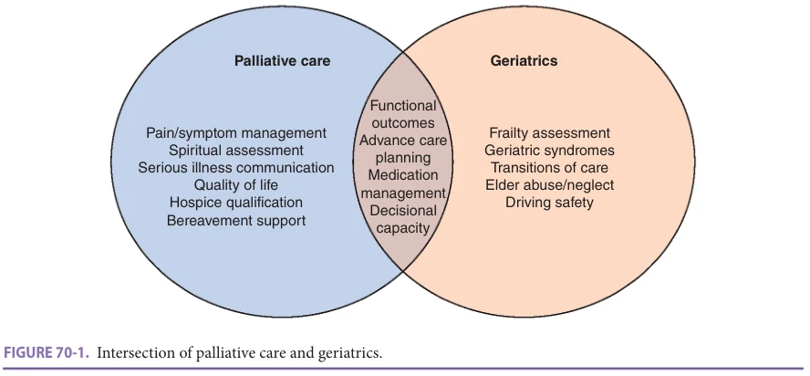
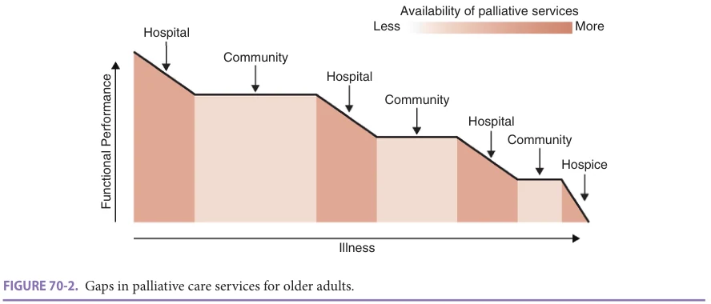
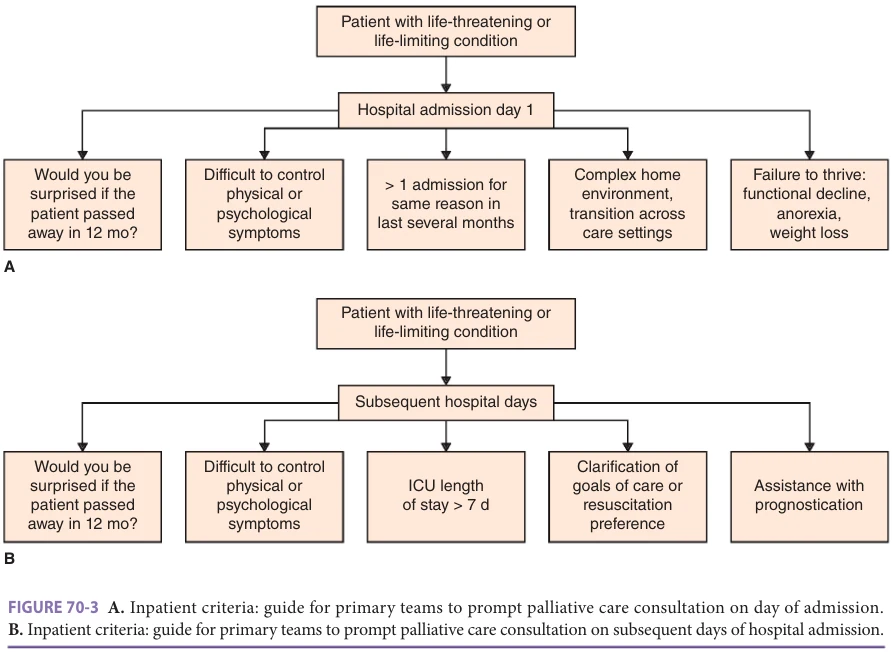
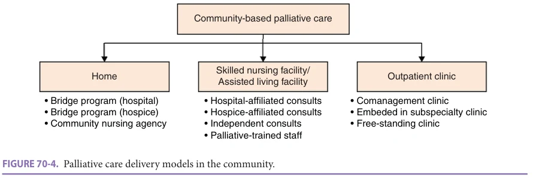

# Hazzard's Geriatric Medicine and Gerontology, 8e - Chapter 70: Palliative Care Across Care Settings

Lisa Cooper, Laura Frain, Nelia Jain

> **Status.** Fast build from the book; not lane-reviewed.

> **Source and method.** Printed pages 1077-1088, from the marked 8th-edition copy (PDF page = printed page + 34). Prose follows its text layer; tables and figures are source-page crops. The book is canonical.

**[p. 1077]**

## INTRODUCTION

Consider Mrs. M, an 85-year old woman with congestive heart failure, mild cognitive impairment, and multijoint osteoarthritis, who lives alone in a second-floor, walk-up apartment. Mrs. M retired from her part-time secretarial work at the age of 70 to care for her husband with Lewy body dementia and has been widowed for the past 5 years. Mrs. M recently agreed to try ambulating with a walker after her third trip to the emergency room for falls but frequently forgets to use it. Her daughter, an only child, lives in the same city and helps her mother shop and clean. In the past, she accompanied her mother to medical appointments but has been unable to do so regularly in the past 2 years due to her work schedule and helping care for her grandchildren. Although Mrs. M never missed medical appointments in the past, she now has “no-showed” to most visits including for follow-up after being evaluated in the emergency room. Her daughter receives a call from a concerned neighbor who reports that her mother only rarely comes out of her apartment, and when she does, seems confused and unsteady. Her daughter has had similar concerns, and additionally worries that her mom appears to be in pain most days, depressed, and losing weight. She takes a day off from work to bring her mom to see her primary care doctor; but, prior to the appointment, she gets a call from the emergency room that her mother fell again resulting in a broken hip requiring surgery. Mrs. M’s postoperative course is complicated by delirium and pain. She is transferred to a skilled nursing facility for rehabilitation where the team raises the concern that Mrs. M now has moderate dementia, frailty, and significant gait impairment. They recommend a more supportive living environment. Mrs. M moves in with her daughter and enrolls in a home-based primary care program. Initially, Mrs. M does well, with notable improvements in her mood, weight, walking, pain control, and cognitive health. However, over the next 2 years, her dementia progresses with increasingly severe behavioral and psychological symptoms and rising care needs. She becomes nearly wheelchair bound due to pain when walking. With limited support for her mom at home and now facing her own medical issues, her daughter admits Mrs. M to a nursing home. Mrs. M is hospitalized three times over the next year. She enrolls in hospice after the third hospitalization and survives another year.

#### Learning Objectives

- Conceptualize the ideal model of palliative care provision for the aging population facing multimorbidity and progressive functional impairment across care settings.

- Identify existing deficiencies and barriers to the adequate delivery of palliative care for older adults across the care continuum.

- Illustrate how effective collaboration between geriatrics and palliative care services with integration of palliative care interventions into existing models of care can help bridge these gaps.

#### Key Clinical Points

1. The palliative care needs of older adults differ from younger populations due to differences in illness trajectories, treatment preferences, and patterns of health care utilization.

2. Although the highest proportion of palliative care needs for older adults exists in the community setting, access to palliative care is concentrated in acute care settings and through hospice utilization.

3. Older adults often experience advancing frailty and multiple complex conditions, necessitating an integrated approach between geriatrics and palliative care specialties to meet the needs of this population across their trajectory of functional decline and increasing needs for care and support.

The case of Mrs M illustrates the need for a truly integrated system of palliative and geriatric care that meets the medical and social needs of older adults across the care continuum. Palliative care aims to improve the quality of life for persons with serious and advanced illness by decreasing symptom burden, addressing psychological and spiritual distress, and promoting well-being of patients and

**[p. 1078]**

their families. The types of care that would help support Mrs. M’s quality of life vary as her health circumstances and care settings change. These include, but are by no means limited to, (1) advance care planning conversations to delineate the patient’s goals, values, and preferences and ensure goal-concordant care; (2) assessment and treatment of postoperative pain and delirium with heightened monitoring for postoperative cognitive and functional decline; (3) an interprofessional team that can provide longitudinal care for the patient across various settings; (4) caregiver training and support for the patient’s daughter; and (5) functional assessment and home adjustments to address needs for adaptive devices and therapy services.

Unfortunately, in reality, our current health care system is fragmented with a disproportionate focus on acute care and immediate post-acute care, often leading to a lack of emphasis on matching treatments to patient goals. In this chapter, we will describe the ideal of a palliative care system for older adults that delivers integrated care across the care continuum, including hospice. We will contrast this ideal with the barriers to and lack of an integrated system for delivery of palliative care across the continuum. We will identify opportunities for improvement. We begin by discussing the tremendous overlap between the fields of geriatrics and palliative care.

## GERIATRICS AND PALLIATIVE CARE ARE BETTER TOGETHER

The case of Mrs. M illustrates the blurred boundaries between geriatrics and palliative care (Figure 70-1). Geriatrics and palliative care both emphasize improving quality of life in late life. Both fields require excellence in management of persons with multimorbidity, dementia, and disability. Both fields emphasize attention not just to the patient, but also the patient’s caregiver, and the situation of the patient within the context of family and community.

Both fields are directed primarily toward the sickest and most frail older adults, those that account for about half of health care spending in the United States.

By 2030, the number of Americans aged 65 or older is predicted to approach 73 million, representing 21% of the total US population. Eighty percent of all older adults have at least one chronic condition and 50% have a least two or more chronic conditions. Notably among these, the number of Americans living with Alzheimer disease is anticipated to double from 5.8 million, currently, to 13.8 million by 2050. It is also increasingly recognized that a substantial proportion of community-dwelling older adults are frail (~ 15%) and prefrail (45%). Like dementia, frailty is even more common at older ages, among women and racial and ethnic minorities, and with additional variability in prevalence based on geographic region, location of residence, and socioeconomic status.

In the setting of frailty and multiple chronic illnesses, older adults commonly experience long trajectories of functional decline and episodic fluctuations in health status. They frequently face repeated, nonlinear, and often difficult transitions across care settings, including the community, hospital, rehabilitation, and nursing facilities, and ultimately experience disjointed care. Older adults’ family and physicians often have a poor understanding of their goals of care and have rarely engaged in discussions regarding treatment preferences.

Spurred by the needs of the aging population, there is increasing recognition that palliative care does not equate to “comfort care only” for the terminally ill. The recognition that geriatric palliative care approaches can have a major impact on symptom management, communication around goals of care, management of multiple chronic conditions, and caregiver support for all patients with advanced illness and frailty from the time of diagnosis is an invaluable step toward improving the quality of life for older adults.

The fields of geriatrics and palliative care have many common grounds, including providing goal-oriented care,

*Figure 70-1, printed p. 1078.*

**[p. 1079]**

working within an interprofessional team, using multidimensional assessments to identify unmet needs, attending to psychosocial factors, addressing caregivers’ needs and including them in care planning and delivering, and adding valuable services to the most vulnerable and frail older adults. On the other hand, these intersections between geriatric medicine and palliative care give rise to unclear boundaries and limited understanding between the two professions. In addition, there are several gaps between the two fields. Palliative care contributes to patient care by offering intensive symptom management and psychosocial support; prognostication; alignment of goals and treatments between patients, families, and clinicians; and support in ethical decision making. Geriatric medicine offers a comprehensive geriatric assessment, including a better understanding of frailty and resilience, functional status, and expected trajectory. As such, the two specialties best serve patients when applied in a blended, interconnected way to deliver integrated patient care rather than in series (geriatrics, then palliative care). These care models can be implemented in different settings and best serve mutual patients as each specialty brings a unique and important aspect to the patient’s care, with an ability to intensify or de-intensify a particular service’s involvement depending on the patient’s health state.

By simultaneously advocating for the holistic care of older adults, recognizing the specialized knowledge base and skills possessed by each discipline, and ensuring competency of future trainees in both geriatrics and palliative care, clinicians from both fields will be able to work together to target the sickest 5% of our population at highest risk, and match these patients with delivery models best suited to address their needs.

## THE IDEAL OF A CARE CONTINUUM

The ideal of a continuum of care has been defined as, “a client-oriented system composed of both services and integrating mechanisms that guides and tracks clients over time through a comprehensive array of health, mental health, and social services spanning all levels of intensity of care.” The introductory chapter in this section on palliative care introduced the concept that palliative care is appropriately initiated from the time of diagnosis with serious or advanced illness. For many, though not all, serious and advanced illnesses are diagnosed in the outpatient setting. The ideal care continuum would integrate palliative care into the settings where patients spend the most time after diagnosis, that is, in their homes. This would involve access to robust palliative care services along with integration of basic palliative care principles in ambulatory and homebased settings.

As patients develop more serious conditions, such as advancing frailty and dementia in the case of Mrs. M, they may require more care in acute institutional settings like skilled nursing facilities, hospitals, and nursing homes.

The ideal continuum of care would track patients as they move between settings, coordinate care across providers, and offer comprehensive services as people move between the community and the inpatient setting. As a patient’s goals increasingly shift toward a focus on quality of life, high-quality palliative care services should take on a greater role in care, and be available in all settings.

## THE REALITY OF PALLIATIVE CARE FOR OLDER ADULTS

Palliative care has been noted to improve quality of life and symptom management for patients, increase satisfaction of patients and their family members, and reduce health care costs. However, in the current health care system, palliative care is most readily made available to patients during times of crisis (acute inpatient hospitalization) or at the end of life (hospice). The majority of older adults’ last months and years are still spent in the community, with institutionalization occurring only in the very late stages of life. There has been less progress noted in the area of nonhospice palliative care in nursing homes or the community setting, including assisted living and home-based programs, suggesting that the current level of palliative care services does not adequately address the needs of older adults.

Palliative care needs for older adults with advancing frailty differ from the needs of younger adults. Older adults tend to have prolonged illness duration with numerous chronic and complex medical conditions. Older patients experience greater functional and cognitive decline, and they also have increased caregiving needs for longer periods of time. Less is known about how older adults and their caregivers cope with the stressors of chronic illness compared to younger adults with sudden changes in health such as a new cancer diagnosis. Additionally, due to exclusion of older adults with multimorbidity from many research studies, there is a paucity of evidence to guide symptom management in this population. While older adults typically die of chronic, slowly progressive illnesses with multiple acute exacerbations, current Medicare coverage is targeted to the acute episodes of illness. This has resulted in palliative care that has been implemented in a reactionary fashion to these acute episodes. This approach insufficiently addresses patients’ longer-term needs and creates missed opportunities for palliation along the disease trajectory (Figure 70-2).

In addition, frailty increases with age. While there are many different ways to define and capture frailty, they all are based on multidimensional vulnerabilities that cause susceptibility to stressors and reduced adaptive capacity and resilience to these acute events. Since increasing levels of frailty can present with gradual functional and cognitive decline, the trajectory might be less clear than single disease-based clinical evaluation. This also means that palliative care and supportive care might be needed for a longer period of time. Currently, there is no indicator of frailty in hospice-eligible criteria since the removal of

**[p. 1080]**

*Figure 70-2, printed p. 1080.*

“adult failure to thrive” and “debility” as principle diagnoses for hospice eligibility in 2014 despite the Centers of Medicare and Medicaid Services 2009 report indicating a marked increase in the use of these diagnoses.

Better defining frailty and its expected trajectory, together with periodic measures and assessment of increasing health care needs, might assist in engaging palliative care approaches earlier and help in understanding poor outcomes from medical interventions. One area that can be addressed with increasing levels of frailty is polypharmacy and deprescribing, which has been shown to be beneficial in frail older adults, especially when the focus becomes more on quality of life and symptom control and avoiding side effects and medications that are unlikely to contribute any meaningful effect. Palliative care approaches are needed when patients and family are facing advancing frailty; however, due to the complexity of definition and wide range of presentation, these needs are often unmet. A true collaboration between geriatrics and palliative care experts can address this increasing gap.

In order to adequately address the needs of older adults, palliative care must be instituted in a timely manner, earlier in the course of a patient’s illness. Upstream involvement of palliative care in the care of older adults, particularly while they are still residing in the community, allows for increased opportunities for shared decision making, constant evaluation of a patient’s prognosis and symptom burden, and longitudinal care throughout different care settings. In addition to routine palliative care, clinicians have the opportunity to work with patients’ primary care physicians, geriatricians, and specialists to emphasize function, financial planning, and maintenance of social roles within a community. This collaboration is even more integral when caring for older adults who often experience multiple concurrent progressive conditions that may challenge the formulation of prognostic estimates in terms of time and function. Effective palliative care for older adults will require moving away from a focus on single

disease trajectory toward understanding and assessment of patient’s reserves and vulnerabilities in addition to their values and treatment preferences to guide medical decision making. This foundation will aid in easing transitions to higher levels of care and help patients avoid inappropriate or burdensome treatments.

## PALLIATIVE CARE IN THE ACUTE CARE SETTING

Of all settings, palliative care services in the acute inpatient setting have enjoyed the most successful implementation and advancement in the last 20 years. In the inpatient setting, palliative care teams are interprofessional, comprised of a mix of physicians, social workers, nurses, and chaplains. These teams offer expertise in symptom management, support to medical teams as well as patients and families, knowledge about community-based palliative care services and hospice organizations, and assistance in prognostication over a variety of illnesses.

Given that the majority of patients with advanced or serious illness will spend some time in the hospital throughout the course of their illness, and that up to 50% of adult deaths occur in the hospital setting, ensuring adequate palliative care services in the inpatient setting is of particular importance. There is increasing evidence that inpatient palliative care interventions improve the quality of clinical care, increase patient and family satisfaction, improve transitions of patients out of the hospital, and reduce health care costs. Patients who receive inpatient palliative care consultations incur less laboratory and radiology costs, are less likely to be admitted to the intensive care unit (ICU), and spend less days in the ICU once admitted compared to patients receiving usual care, particularly among patients who die during hospitalization.

Older adults receiving palliative care consultation differ in characteristics and interventions compared to younger patients. Referral for palliative care consultation

**[p. 1081]**

for older adults is more likely to be requested for disease processes other than cancer and for goals of care discussions rather than symptom management. Older adults tend to be referred to palliative care earlier in their hospital courses and have documented code statuses of “do-notresuscitate” at time of consult. In the oldest subset of the population (80 and older), patients were more likely to be referred to palliative care for diagnosis of dementia, less likely to be included in discussions around goals of care due to lack of decisional capacity, and more likely to be discharged to nursing homes. In reviewing palliative care interventions offered by age, there are fewer interventions for pain or symptom management offered in older adults and an increased likelihood of limits placed on life-sustaining treatments after consultation. Given these differences, inpatient palliative care teams should be prepared to meet the unique palliative care needs of older adults.

Despite the advancements that have been made in inpatient palliative care, as well as the positive patient and family outcomes that have been observed, challenges remain in the delivery of palliative care in the inpatient setting. Inpatient palliative care teams continue to struggle with late requests for consultation. In addition, constant turnover of inpatient treatment teams, hesitation to move away from a curative focus, and varying levels of knowledge about and alignment with palliative care from referring clinicians pose ongoing barriers to optimal palliative care provision. Due to the acuity and complexity of medical issues present in the hospitalized patient population, it is often difficult for palliative care teams to address all of the needs of these patients during the acute hospitalization, particularly when caring for older adults with complex comorbidities and multifaceted care needs.

In order to address deficiencies that remain in the delivery of palliative care in the inpatient setting, there are opportunities to consider upstream involvement of palliative care as well as integration of palliative care services within existing models of care in the inpatient setting. Rates of presentation to the emergency department (ED) increase with age, and the percentages of patients requiring hospital admission are highest in older adults. As the population continues to age, there will be a rising number of seriously ill older adults who will present to the ED. These needs may be met by identification of ED palliative care “champions” such as nurse managers and care facilitators, routine use of screening tools to evaluate the need for palliative care assessment in this population, development of care pathways as a product of collaboration between ED and palliative care teams, availability of palliative care consultative services to the ED, and familiarity with community palliative care and hospice resources among ED teams.

An organized approach to the identification, assessment, and management of older adults’ complex medical, social, psychological, and functional concerns and vulnerabilities is key. For patients admitted to inpatient hospital floors, utilization of such a systematic approach by

an interprofessional team will ensure the needs of older adults are met. As previously discussed, older adults receiving palliative care consultation are more likely to have nononcologic diagnoses, which are associated with less predictable hospital courses and illness trajectories. As the hospital course unfolds, communication interventions should target the status of the patient’s overall condition, estimated prognosis in terms of functional recovery and life expectancy, and available treatment options in the context of associated risks and likelihood of benefit. Clinicians with an understanding of basic palliative care assessment may be successful in appropriately identifying palliative care needs on day of admission, engaging palliative care teams upstream in the hospital stay of seriously ill older adults, monitoring progress on clinical improvement and achievement of patient’s goals, and frequently reevaluating to identify new palliative care needs in the older adult population as they arise throughout the hospitalization (Figure 70-3A and 3B).

Emerging opportunities for early introduction of palliative care models include programs such as geriatric comanagement with orthopedic surgery and general surgery, with the geriatric-surgery verification program from the American College of Surgeons being adopted by an increasing numbers of medical centers, and with emerging geriatric-ED initiatives. Such programs advocate for early collaboration with geriatric medicine clinicians, who perform an early frailty, cognitive and functional assessment, and assist the team in tailoring treatment plans to specific characteristics and needs of the older patient. Within these models, comanagement with palliative care teams may be considered for patients in instances such as facilitation of complex communication and medical decision making, reevaluation of goals of care based on changes in the patient’s clinical trajectory, or easing end of life transitions.

The ICU is another location in the inpatient setting with the most opportunities for successful delivery of palliative care to older adults. Older adults admitted to the ICU have high mortality rates during the course of their hospitalization, and older ICU survivors have elevated palliative care needs for ongoing physical and/or psychological distress. They also remain at increased risk for rehospitalization and 6-month mortality. Studies have demonstrated that patients, families, and clinicians may possess unrealistic expectations about prognosis and effectiveness of ICU interventions. Critically ill patients and their caregivers often seek more honest and open discussions regarding prognosis and appropriate therapies based on patients’ values and goals. ICU clinicians should all receive training in core skills of primary palliative care, including seriousillness communication skills and symptom management. Palliative care “bundles” have been suggested to improve communication and promote the comfort of critically ill patients (IPAL-ICU). Key quality measures in these bundles include early identification and documentation of surrogate decision makers and advance directives, regular

**[p. 1082]**

*Figure 70-3, printed p. 1082.*

symptom assessment, involvement of social work and spiritual care, and regular family meetings to update the patient and family on the status of the patient’s illness. By emphasizing compassionate communication, symptom management, and shared decision making, palliative care can be successfully integrated for critically ill patients at all stages of illness.

Across the inpatient setting, collaboration between palliative care teams and patients’ longitudinal outpatient clinicians, in particular geriatricians and/or primary care physicians, care managers or care transition specialists can bridge gaps in knowledge of patients’ values and treatment preferences, communication, and appropriate identification of community resources to best meet the patients’ needs for their current health state. Additionally, novel pathways to meet the unique hospital-based considerations of older adults offer further opportunity for palliative care integration and comanagement, particularly for patients experiencing high symptom burden or for those patients and families benefiting from ongoing goal clarification and assistance in complex medical decision making.

## PALLIATIVE CARE IN POSTACUTE CARE SETTINGS

Many older adults with complex care needs are living and now also dying in the community. Older individuals of advancing age often live alone, particularly women, with

estimates of over 50% for women ages 85 and older in 2018. Approximately 21% of these community-dwelling older adults, totaling approximately 7.5 million individuals, are partly or completely homebound, and tend to be older, female, ethnic and cultural minorities, and have lower income. Despite a high burden of chronic conditions, especially dementia, and reports of lower health status, these older adults struggle or are not able to access the ambulatory care needed for their complex medical, psychosocial, and neurologic needs, and have high rates of hospitalization, leading to increased fragmentation of care. Despite the cycle of recurrent fluctuations in health and transitions in care, older adults’ family (if present) and physicians often have limited understanding of their goals of care and care needs, prognosis, and have rarely engaged in discussions regarding treatment and care preferences. This is particularly problematic as family caregivers still provide the majority of direct care for US older adults with complex health conditions, and much of this care occurs in the community as opposed to nursing facilities. Additionally, growing evidence suggests that older adults living at home with dementia are more likely to have bothersome pain, dyspnea, and mood symptoms compared with people living in nursing or other residential facilities, with similar patterns seen among other vulnerable older adults in the community. Community-based palliative care services are currently available through both home-based and institutional-based models (Figure 70-4).

**[p. 1083]**

*Figure 70-4, printed p. 1083.*

## PALLIATIVE CARE IN THE CLINIC

For older adults whose functional status remains preserved or who have sufficient assistance to access care in the ambulatory setting, palliative care clinics facilitate the development of an early relationship between clinicians and patients, improve communication between primary care clinicians and other subspecialty clinicians, and increase satisfaction with care from the perspective of patients and their families. These clinics also serve as an appropriate setting for posthospital discharge follow-up for patients seen by inpatient palliative care teams.

There are a variety of existing models of palliative care clinics in our current health care system (Improving Outpatient Palliative Care [IPAL]). Some clinics are affiliated with particular specialties by which they generate all of their referrals. Other clinics are stand-alone clinics that function independently or share space and staffing with a primary care clinic or specialty clinic in a partially or completely embedded framework. Additionally, clinics vary in the focus of their care, ranging from providing task-specific to symptom-specific palliative care. Palliative care clinicians will often choose between providing care in a consultative or comanagement fashion for the majority of patients, while some patients will be taken care of entirely by the palliative care specialist. Finally, some clinics have the capability to extend their services beyond the clinic and into the community, providing visits to clinic patients who become homebound or transfer to a facility.

Outpatient palliative care services have been associated with improved patient outcomes, such as significant symptom improvement and high satisfaction with services. Care provided in palliative care clinics has also been associated with better maintenance of performance status, increased discussions about advance care planning and end-of-life care, and better long-term outcomes for caregivers. Patients receiving care in palliative care clinics in addition to usual care experience fewer hospital days and skilled nursing facility days, as well as increased hospice use. Clinicians also benefit, with increased rates of satisfaction observed in referring clinicians as well as palliative care clinicians.

Presently, the majority of outpatient palliative care clinics focus on care for patients with cancer diagnoses. As outpatient clinic services expand, particularly to nononcology populations, clinicians may face challenges, including the lack of standardization of the development process, need for adequate marketing, and insufficient staffing to accommodate anticipated growth of the clinics. Promising examples of outpatient palliative care for individuals with serious, life-limiting non–cancer-related diagnoses are emerging. A 2020 pragmatic trial of integrated palliative care at three academic tertiary centers for individuals with Parkinson disease and related disorders demonstrated better quality of life, improved symptom burden and motor symptoms, as well as higher rates and quality of advance care directives in the intervention group compared to those receiving standard of care. Additionally, the study was suggestive of a benefit on caregiver strain by 1 year. Although care at each site was provided in an ambulatory setting and by an interprofessional team using standardized checklists, the specific model of care varied by institution. Encouragingly, the impact on outcomes was equally effective across sites and suggests flexibility may exist in the design of integrated palliative care in the outpatient clinical setting if fidelity to key palliative care quality domains is maintained.

There are several limitations that impede the delivery of ideal palliative care in the clinic setting. Patients with severe and advanced illness, particularly those with chronic illnesses, are always at risk of declining to the point that they are unable to make their outpatient clinic appointments. Unless clinics are associated with bridge programs designed to extend palliative care services to homes and facilities until patients qualify for hospice, provided the latter is an acceptable option to them, chronically ill patients with progressive functional and cognitive decline often experience a gap in the continuation of their palliative care services. In addition, clinics are often limited by their hours of operation and staffing, particularly lacking coverage by a health care provider 24 hours a day to manage any acute crises that may arise. Finally, given the heavy reliance on referrals from the inpatient setting, primary care clinics, and subspecialty clinics, palliative care clinics require a

**[p. 1084]**

certain amount of “buy-in” from other disciplines in order to continue to operate. As the population with chronic conditions continues to grow and age, increased attention to availability of palliative care clinics, reimbursement for palliative care services, and relationship building between hospitals, long-term care institutions, and community-based home care organizations is needed to ensure that this population of patients will be able to receive palliative care outside of the hospital setting.

## PALLIATIVE CARE IN THE HOME

There are an increasing proportion of older adults living at home with chronic illness with intensive symptom management and advance care planning needs who do not qualify for hospice. As older adults become increasingly homebound, they are at increased risk for symptom and illness burden. Completely homebound patients have a 2-year mortality of approximately 40%, demonstrating a natural intersection of palliative care provision within home-based care. The ideal home-based palliative care model is comprised of an interdisciplinary team of physicians, nurses, social workers, chaplains, home health aides, and pharmacists (similar to the home hospice model) who are able to provide services in coordination with the primary care clinician and specialists. Services would include pain and nonpain management, medication management, discussions about health care decision making and goals of care, caregiver support, attention to spiritual concerns and quality of life, arrangement of respite care, and assistance with the transition to hospice if needed. Specifically tailored to the chronically ill, frail older adult, home-based palliative care would ideally integrate with home-based primary care or other community geriatric care models with an expanded focus that includes education and support for caregivers, timely access to medications, optimal use of applicable community resources, home safety and comfort, and 24/7 access to a health care clinician in order to ensure continuity of care and manage acute crises. A closely integrated model of home-based palliative care with home-based primary/geriatric care is especially beneficial for patients and families who are facing the strain of longer, often unpredictable, but ultimately terminal illness trajectories with challenging, day-to-day prognostication and frequent health exacerbations due to even minor physiologic stressors. This situation is commonly faced when caregivers and clinicians provide longitudinal care for patients with frailty, dementia, and complex multimorbidity. While highly integrated palliative and primary care models existed in limited, most often capitated, health care settings, the most notable and long-standing being the VA Home-Based Primary Care program, new partnerships are now arising between other home-based primary/ geriatric and palliative care programs in the context of the United States’ evolving alternative payment models and the growth of for-profit practices in home-based medical care. Home-based palliative care organizations would benefit

from relationships with home-based primary care as well as institutions such as hospitals, primary care clinics, specialty clinics, nursing homes, and hospice agencies in order to increase the referral base and promote longitudinal care across the care continuum.

Studies on existing models of home-based palliative care have demonstrated beneficial outcomes. The patient populations receiving home-based palliative care include patients with both cancer and noncancer diagnoses (eg, dementia, cardiac disease, pulmonary disease, etc). Benefits noted include improved symptom scores in areas such as depression, dyspnea, and anxiety, decreased overall cost of care, increased completion of advance directives, and increased rates of dying at home. Fewer visits to the ED and lower rates of hospitalization have been observed, without a difference in overall survival. Rates of referral to hospice are higher than among control patients without home-based palliative care. Of the patients who do enroll in hospice, those who have received home-based palliative care prior to this transition are noted to have longer days of enrollment in hospice as compared to those with usual care.

Despite the positive impact home-based palliative care programs have on community dwelling patients with serious and advanced illnesses, the advancement of palliative care in the arena of home-based care has limitations. Home-based palliative care delivery is highly variable and delivered by diverse sources including hospitals and large health systems, community hospice and home health agencies, and individual practices or organizations. Programs face economic barriers such as insufficient reimbursement for services in proportion to time spent, particularly for professions other than physicians and nurses, and a lack of incentive to reduce costs. Organizational barriers exist as well, primarily driven by the lack of adequate staffing to meet the needs of homebound older adults, as well as the lack of recognition and training around quality standards and measurement. At present, there is no standardization of home-based palliative care practices or institutional support, leading to difficulty in translating the beneficial outcomes that have been noted in existing home-based palliative care models to the broader population. While progress has been made in developing a quality framework that adequately represents the needs of the homebound population, there are ongoing efforts to address implementation, measurement, and reimbursement challenges. These standardized quality metrics have the potential to ensure that frail, cognitively impaired and functionally limited people experience improved quality of life while potentially reducing burdensome hospital visits and health care costs.

## PALLIATIVE CARE IN LONGTERM CARE FACILITIES

In adults older than the age of 65, approximately 25% of all deaths will occur in a nursing home, with projections of an increase to up to 40% of deaths of older Americans

**[p. 1085]**

occurring in nursing homes by 2030. The majority of residents in long-term care facilities are older adults, experience progressive frailty and functional impairment, and require increased assistance in activities of daily living. For older adults in long-term care facilities, life expectancies are typically shorter in the order of years. With projections suggesting that the number of frail older adults may triple or quadruple in the next 30 years, closer examination is needed on the state of palliative care services in long-term care facilities. For many long-term care residents, hospice is the only form of specialty palliative care available.

What is known about palliative care services in longterm care facilities at present is limited. There are several studies that demonstrate long-term care residents suffer from uncontrolled symptoms, depression, existential suffering, and difficulty adjusting to the long-term care facility as their permanent place of residence. Older adults who do receive palliative care consultation have lower rates of endof-life hospitalizations, with those who receive consultation further upstream in their illness experiencing lower overall rates of hospitalization and an almost 50% reduction in potentially burdensome transitions such as an emergency room visit within 30 days of death or admission to hospice within 3 days of death.

A number of significant barriers to providing adequate palliative care in long-term care facilities exist. Demographics of patients in long-term care facilities, particularly nursing homes, are changing, with increased numbers of patients with chronic illness and multiple medical problems. A large percentage of these patients have noncancer diagnoses, leading to increased difficulty with prognostication and late referrals to hospice. Nursing home residents are often high utilizers of acute care settings, increasing the risk that patient’s values and treatment preferences are unknown or have not sufficiently been elucidated. These issues are further complicated by the fact that there is often high staff turnover at long-term care facilities, making it difficult to sustain palliative care educational efforts and ensure palliative care competency among staff.

With current reimbursement policies focusing on rehabilitation needs and sustenance, a seemingly high proportion of patients undergo aggressive restorative treatment such as intravenous hydration or insertion of feeding tube placement instead of shifting to aggressive palliative care or hospice care. In addition, short-stay residents in nursing homes who are paid for under the Medicare skilled nursing facility benefit following a hospitalization are only able to access the Medicare Hospice benefit if they revoke the skilled nursing facility benefit and pay for room and board out of pocket. These out-of-pocket costs are a major financial disincentive to short-stay residents to exercise the Medicare hospice benefit.

Guidelines for quality palliative care in nursing homes emphasize that palliative care does not require patients to forgo curative treatments nor relinquish subacute rehabilitation or hospitalization (National Consensus Project

Guidelines for Quality Palliative Care). Three different models of delivering palliative care services in nursing homes have been proposed: (1) hospice partnerships, (2) external palliative care consultation services, and (3) facility-based palliative care teams. Regardless of the approach taken, sustainability is key. Measures that are critical to sustainability of palliative care interventions in the longterm care facility setting include ongoing education efforts, “buy-in” of palliative care by nursing home staff and clinicians, increased availability of nurses and patient aides, and working relationships with hospitals and community organizations including hospice to ensure continuity of palliative care across all settings.

## HOSPICE

Hospice care is the most well-known provider of palliative care services in the community. Hospice care is a philosophy of care in which patients facing a life-limiting illness are approached in a holistic manner, with a focus on medical care and symptom management, as well as an interest in the emotional, spiritual, and future planning needs of the patient and family. There are now more than 4600 hospice organizations nationally, and these organizations serve over 1.5 million people. Of Medicare beneficiaries receiving hospice care in 2018, greater than 60% were older adults aged 65 and older. The greatest increase in hospice utilization was observed in patients aged 85 and older. Research on hospice care has demonstrated increased survival compared to usual care, increased patient and family satisfaction with end-of-life care, increased rates of patients dying in their location of choice, and decreased inappropriate health care resource utilization. Despite tremendous growth in the use of hospice services over the last 30 years, hospice care is still underutilized. A substantial number of patients who would prefer to die at home still die in the hospital. At present, the majority of patients receive hospice care at home. Nationally, hospice is not available in all long-term care facilities, and only 6% of residents in nursing homes elect the hospice benefit annually, far lower than one would expect given the short lengths of stay prior to death for many long-term care facility residents.

The Medicare hospice benefit requires that patients have a life expectancy of 6 months or less. An unfortunate but common misconception is that palliative care and hospice care are equivalent. This leads to missed opportunities for palliative care involvement in patients independent of prognosis, as well as late referrals to hospice care until clinicians are confident the patient is dying. This has translated to a median length of service in a hospice organization of 18 days. Over half of patients are enrolled in hospice for 30 days or less, of which 28% of patients die in the first 7 days. The extent of comprehensive palliative care delivered by hospice organizations also varies, with larger hospice organizations having the ability to provide more intensive services such as 24-hour physician staffing, ethics

**[p. 1086]**

committees, and regularly using standardized assessment tools for pain and symptom management.

Cancer remains the most frequent principal hospice diagnosis of beneficiaries of hospice care. As discussed previously, the diseases affecting older adults are largely chronic in nature, with fluctuating trajectories marked by acute exacerbations and difficulties in prognostication, which in turn may reflect the timing with which clinicians refer older adults for hospice. To avoid the continued pattern of late referrals of older adults to hospice until they are in an advanced terminal state, efforts will need to be shifted upstream, with increased emphasis on improved palliative care delivery across care settings, and increased communication and collaboration between primary care and/or specialty clinicians caring for older adults with specialists in palliative care and hospice. Access and utilization of hospice care by older adults will improve by expanding coverage of hospice services to patients with longer life expectancies and eliminating the need for patients to choose between hospice services and other homecare or institutional-level services. Newer programs such as the Medicare Care Choices Model are exploring opportunities to provide eligible beneficiaries access to hospice services while they continue to receive disease-modifying treatment. Thus far, participants in this program have demonstrated increased likelihood of hospice enrollment, decreased reliance on inpatient care, and positive caregiver experiences. By reconceptualizing the population for whom hospice care is offered away from eligibility based on prognosis, and instead, on patients and their caregivers with increasing vulnerabilities and need for care and in-home supports, older adults may be able to benefit from the supportive and holistic care provided by hospice agencies for longer periods of time.

## FURTHER READING

Bandeen-Roche K, Seplaki CL, Huang J, et al. Frailty

in older adults: a nationally representative profile in the United States. J Gerontol A Biol Sci Med Sci. 2015;70(11):1427–1434. Bowman BA, Twohig JS, Meier DE. Overcoming barriers

to growth in home-based palliative. Care. J Palliat Med. 2019;22(4):408–412. Bryant EA, Tulebaev S, Castillo-Angeles M, et al. Frailty

identification and care pathway: an interdisciplinary approach to care for older trauma patients. J Am Coll Surg. 2019;228(6):852–859.e1. Chen CY, Thorsteinsdottir B, Cha SS, et al. Health care out-

comes and advance care planning in older adults who receive home-based palliative care: a pilot cohort study. J Palliat Med. 2015;18(1):38–44. Cooper L, Abbett SK, Feng A, et al. Launching a Geriat-

ric Surgery Center: recommendations from the Society

## CONCLUSION

The field of palliative care has enjoyed significant advancements over the years. Its rapid growth is evidenced by an increased number of clinicians choosing to train in the field and the increased availability of palliative care teams in a variety of care settings. The more widespread implementation of palliative care has led to improved quality of life and symptom management for patients; improved satisfaction among patients, families, and health care providers; and, decreased health care costs. However, the presence of adequate palliative care for older adults has lagged behind. Older adults have unique palliative care needs that are best met by providing longitudinal palliative care across the care continuum. Implementation of palliative care for older adults at the time of diagnosis of advanced or serious illness or at a time where they are noted to develop progressive frailty or cumulative burden from multiple comorbidities would be ideal. Increased involvement of palliative care with a focus on collaboration and comanagement with geriatricians and other longitudinal clinicians will help older adults reside longer in their communities, maintain their level of function, cope with care transitions, and participate in shared decision making regarding their treatment preferences. The health care system will also need to change in order to train clinicians in primary palliative care skills, expand access to specialty palliative care particularly in the community, and increase coordination of care among institutions and community organizations. Addressing these gaps in the current palliative care models will improve the quality of palliative care delivered to older adults across the care continuum.

for Perioperative Assessment and Quality Improvement. J Am Geriatr Soc. 2020;68(9):1941–1946. Hamaker ME, van den Bos F, Rostoft S. Frailty and pallia-

tive care. BMJ Support Palliat Care. 2020;10(3):262–264. Harrison KL, Ritchie CS, Patel K, et al. Care settings and

clinical characteristics of older adults with moderately severe dementia. J Am Geriatr Soc. 2019;67:1907–1912. Kamal AH, Currow DC, Ritchie CS, Bull J, Abernethy AP.

Community-based palliative care: the natural evolution for palliative care delivery in the U.S. J Pain Symptom Manage. 2013;46(2):254–264. Kluger BM, Miyaski J, Katz M, et al. Comparison of inte-

grated outpatient palliative care with standard care in patients with Parkinson disease and related disorders: a randomized clinical trial. JAMA Neurol. 2020;77(5): 551–560.

**[p. 1087]**

Leff B, Carlson CM, Sailiba D, Ritchie C. The invisi-

ble homebound: setting quality-of-care standards for home-based primary and palliative care. Health Affairs. 2015;34(1):21–29. Miller SC, Lima JC, Intrator O, Martin E, Bull J, Han-

son LC. Palliative care consultations in nursing homes and reductions in acute care use and potentially burdensome end-of-life transitions. J Am Geriatr Soc. 2016;64(11):2280–2287. Nelson JE, Curtis JR, Mulkerin C, et al. Choosing and

using screening criteria for palliative care consultation in the ICU: a report from the Improving Palliative Care in the ICU (IPAL-ICU) Advisory Board. Crit Care Med. 2013;41(10):2318–2327. Olden AM, Holloway R, Ladwig S, Quill TE, Van Wijn-

gaarden E. Palliative care needs and symptom patterns of hospitalized elders referred for consultation. J Pain Symptom Manage. 2011;42(3):410–418. Ornstein KA, Leff B, Covinsky KE, et al. Epidemiology of

the homebound population in the United States. JAMA Intern Med. 2015;175(7):1180–1186.

Pacala JT. Is palliative care the “new” geriatrics? Wrong

question—we’re better together. J Am Geriatr Soc. 2014;62(10):1968–1970. Ritchie CS, Leff B. Population health and tailored medical

care in the home: the roles of home-based primary care and home-based palliative care. J Pain Symptom Manage. 2018;55(3):1041–1046. Smith AK, Thai JN, Bakitas MA, et al. The diverse

landscape of palliative care clinics. J Palliat Med. 2013;16(6):661–668. Visser R, Borgstrom E, Holti R. The overlap between geri-

atric medicine and palliative care: a scoping literature review. J Appl Gerontol. 2021;40(4):355–364. Voumard R, Rubli Truchard E, Benaroyo L, Borasio

GD, Büla C, Jox RJ. Geriatric palliative care: a view of its concept, challenges and strategies. BMC Geriatr. 2018;18(1):220. Zimbroff RM, Ritchie CS, Leff B, Sheehan OC. Home-

based primary and palliative care in the Medicaid program: systematic review of the literature. J Am Geriatr Soc. 2021;69(1):245–254.

**[p. 1088]**
