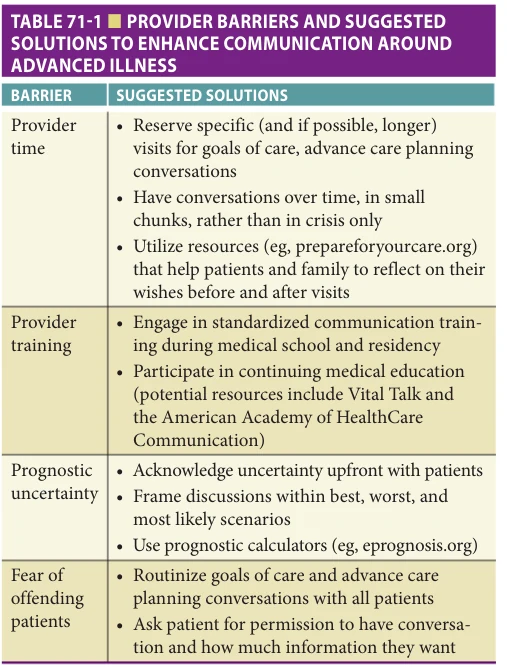
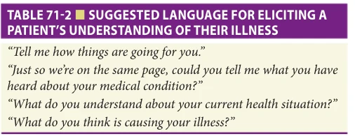
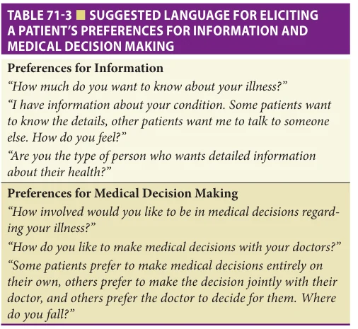
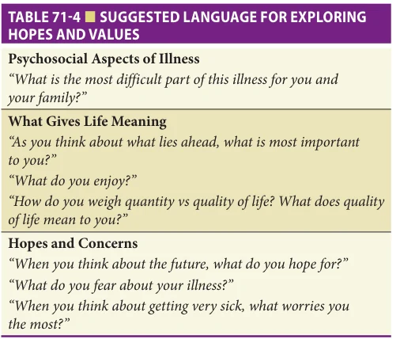
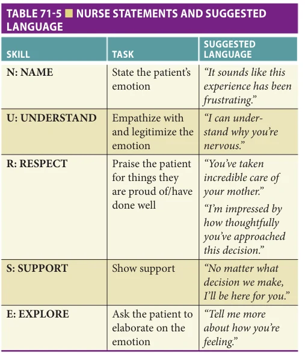
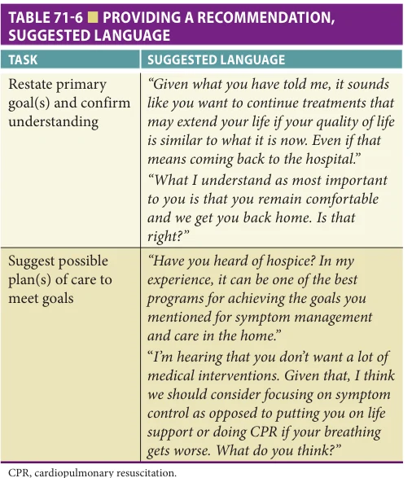
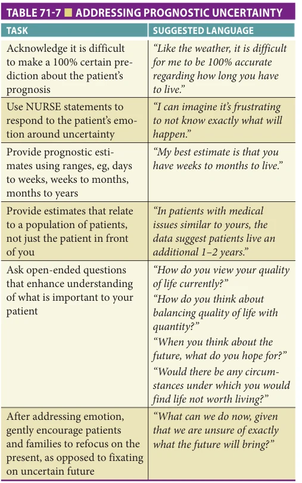
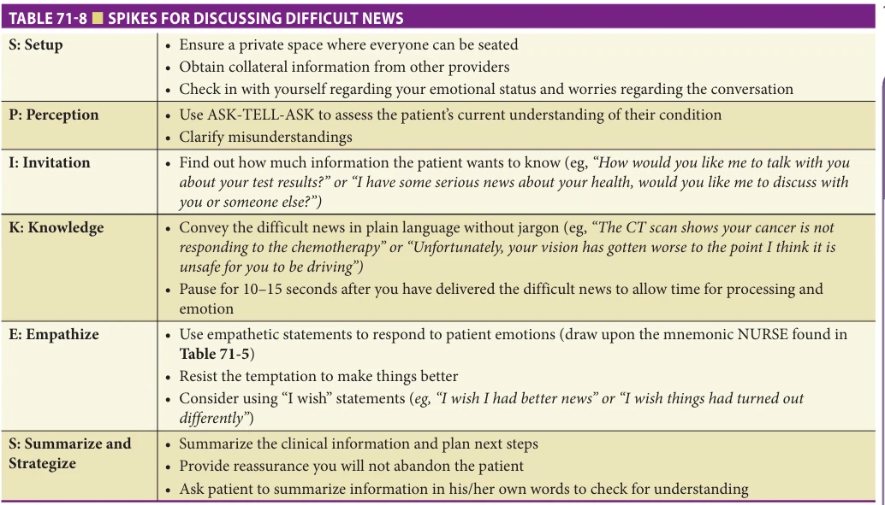

# Hazzard's Geriatric Medicine and Gerontology, 8e - Chapter 71: Effective Communication Strategies For Patients with Serious Illness

Brook Calton, Matthew L. Russell

> **Status.** Fast build from the book; not lane-reviewed.

> Not cited in the 2020-2026 past papers.

> **Source and method.** Printed pages 1089-1096, from the marked 8th-edition copy (PDF page = printed page + 34). Prose follows its text layer; tables and figures are source-page crops. The book is canonical.

**[p. 1089]**

## INTRODUCTION

Older adults are living longer, and with more chronic diseases, than ever before. The number of Americans ages 65 and older is projected to double from 52 million in 2018 to 95 million by 2060. The average US life expectancy increased from 68 years in 1950 to 79 years in 2017. Approximately 80% of older adults have at least one chronic medical condition; with 77% having at least two. In fact, the majority of hospice diagnoses are now noncancer related, such as congestive heart failure, chronic obstructive pulmonary failure, or dementia. Taken together, these data suggest effective communication around advanced illness is of ever-increasing importance for our older adults facing longer life trajectories, complex chronic illness, and debility and decline. Having achieved longevity, many older adults living with advanced illness prioritize goals such as function, comfort, and family support. Skillful communication is needed to ensure the treatments we offer align with these goals.

#### Learning Objectives

- Describe a suggested six-step process for addressing goals of care and treatment preferences with patients who are seriously ill.

- Identify unique challenges to communicating with seriously ill older adults and strategies to address them.

- Summarize key communication techniques including ASK-TELL-ASK and SPIKES.

#### Key Clinical Points

1. Data suggest patients and families generally desire to have open conversations with their medical providers around their goals of care, treatment preferences, and end-oflife wishes.

2. Conversations around goals, values, and treatment preferences should be held over time, as a patient’s health status and/or perspectives evolve.

3. Clarifying patients, and families, understanding as well as effectively addressing emotions around serious illness can help make these conversations easier.

Effective communication with patients and families can have a number of benefits. It has been shown to improve diagnostic accuracy, health outcomes, treatment adherence, and patient satisfaction. In addition, effective end-of-life communication has been associated with decreased intensity of care, increased quality of life, and improved quality of dying for patients.

Studies consistently confirm the majority of patients facing advanced illness desire to have honest conversations about their goals, values, and end-of-life care with their providers. A recent systematic review of advance care planning in older adults found between 61% and 91% of older individuals wanted to discuss their end-of-life care with their providers. Benefits cited by patients included assurance their wishes would be respected, an opportunity to address important medical care and treatment issues before cognitive impairment or being physically unwell occurred, and to assist loved ones with decision making. They felt this responsibility to begin the discussion lies with physicians, they wanted to have the conversation in an open and honest manner, and preferred these conversations began early in their illness course.

However, despite the fact that communication around advanced illness is not only beneficial but also desired by

most patients, this communication often remains inadequate. In studies, only an estimated 2% to 29% of frail older adults have discussed some form of end-of-life plans with a health care professional. In general, these discussions are often dominated by the clinician—in one study of 60 recorded patient-internist advance directive discussions, physicians spent 70% of the time talking and initiated more detailed discussions about patients values and goals less than 33% of the time. There are a number of challenges to effective communication that may contribute to the gaps described above. Potential barriers and suggested solutions are presented in Table 71-1.

In this chapter, we will provide an approach as well as key skills to prepare providers for having important

**[p. 1090]**

*TABLE 71-1 ■ PROVIDER BARRIERS AND SUGGESTED SOLUTIONS TO ENHANCE COMMUNICATION AROUND ADVANCED ILLNESS*

*Owner annotations/highlights are from the marked source copy, not the book.*

conversations about goals of care and advance care planning with patients and families. We will also discuss unique challenges and situations specific to communication with older adults.

## SUGGESTED APPROACH TO COMMUNICATING WITH PATIENTS WITH ADVANCED ILLNESS

Communication around advanced illness can take many forms. Potential conversations may include, but are not limited to, providing prognostic information, discussing treatment preferences, engaging in advance care planning, and transitioning to comfort care and/or hospice. It is important to remember, particularly in the outpatient setting, that any of these topics should be thought of as a process that occurs over time using open and honest communication that accounts for the patient’s personal desire for information.

It is likely that patients’ goals and preferences will shift over time as their illness progresses and/or what is important to them changes. Below we provide a suggested six-step approach that can be adapted to any of the conversations described above.

Step 1: Prepare In the outpatient setting, if possible, it is optimal to ensure an adequate amount of protected clinic time to

have the conversation. Encourage the patient to bring family or caregivers with them that they would like to hear and/or participate in the conversation. Clarify medical treatment options and prognostic information with other providers engaged in the patient’s care prior to the visit. In the inpatient setting, it is important to arrange for a private place to have the conversation and again, invite key family members, caregivers, and health care providers (eg, consulting MDs, bedside nurses, chaplains, etc) based on the patient’s preferences. Prior to the conversation, meet briefly with the participating health care providers (premeeting) to agree upon an agenda, prognosis, suggested treatment course, etc. Step 2: Clarify Patient’s Understanding of Illness and Preferences for Information/Decision Making Any conversation around advanced illness requires that the provider first assess the patient’s understanding of their illness. If the patient is unable to participate in the conversation, the same process should be undertaken with the patient’s family and/or designated medical decision maker, depending on the circumstances. This step, using open-ended questions, facilitates the provider’s ability to successfully provide education around the patient’s illness, discuss treatment options based on a shared understanding of the patient’s condition, and avoid potential misunderstandings (Table 71-2). Next, the patient’s preferences for information and medical decision making should be clarified. This is critical because while most patients desire information about their illness and want to be involved in decision making, a significant minority do not. Asking these questions (and then proceeding accordingly) will build the patient’s trust and empower them in these conversations (Table 71-3). Step 3: Education and Exploration Step 3 involves patient education and exploration of patients’ hopes and values to facilitate medical decision making. Once you have a sense of the amount of information the patient desires, the foundational communication skill ASK-TELL-ASK can be useful for providing patient education. You’ve already done the first “ASK” in step 2, by eliciting the patient’s understanding of their illness. The provider should next “TELL” the patient in straightforward language the information they are hoping to

*TABLE 71-2 ■ SUGGESTED LANGUAGE FOR ELICITING A PATIENT’S UNDERSTANDING OF THEIR ILLNESS*

*Owner annotations/highlights are from the marked source copy, not the book.*

**[p. 1091]**

*TABLE 71-3 ■ SUGGESTED LANGUAGE FOR ELICITING A PATIENT’S PREFERENCES FOR INFORMATION AND MEDICAL DECISION MAKING*

*Owner annotations/highlights are from the marked source copy, not the book.*

convey (eg, help them better understand their illness, treatment preferences, difficult news, etc) in short, digestible chunks. The second “TELL” is an additional check for understanding or perspective. An easy way to ask is, “To make sure I was explaining things clearly, can you summarize what I just said?” This ASK-TELL-ASK cycle is often repeated several times during the same conversation, to ensure information is provided in a sensitive manner in digestible pieces. Understanding a patient’s hopes and values can help the provider provide sound medical advice in line with what is most important to the patient. A list of suggested questions is given in Table 71-4. Step 4: Respond to Emotions Providers often focus on the details of medical care and miss emotional cues. Responding to emotional cues is a key aspect of successful communication, building

*TABLE 71-4 ■ SUGGESTED LANGUAGE FOR EXPLORING HOPES AND VALUES*

*Owner annotations/highlights are from the marked source copy, not the book.*

trust, and supporting patients. Clinicians can express empathy nonverbally and verbally. Eye contact, open body position, leaning in toward the patient, and when appropriate, light touch can be useful tools for showing nonverbal empathy. An invaluable tool for expressing verbal empathy employs the mnemonic “NURSE.” Details of the mnemonic and sample language are provided in Table 71-5. Step 5: Guide Decision Making Every conversation is different and in many cases, exploring hopes, values, and emotions can be extremely beneficial, even without a specific medical decision to make. If there are decisions to make, the next step involves providing options to the patient that are consistent with what has been found out is important to them. Providers do not need to identify every possible option, particularly those that are inconsistent with the patient’s expressed goals. Information should be given in small chunks and jargon should be avoided. Again, using Ask-Tell-Ask can allow for frequent stops to check for comprehension and provide clarifications or corrections if necessary. In many situations, based on what is understood about the patient’s decisionmaking preferences from step 2, providers can ask for permission to provide a recommendation based on the patient’s values and what is known about the medical circumstances. Many patients and families may need time and multiple discussions before they can make big changes in care or decisions, for example, to enroll in hospice or decide whether to go into a nursing home.

*TABLE 71-5 ■ NURSE STATEMENTS AND SUGGESTED LANGUAGE*

*Owner annotations/highlights are from the marked source copy, not the book.*

**[p. 1092]**

*TABLE 71-6 ■ PROVIDING A RECOMMENDATION, SUGGESTED LANGUAGE*

*Owner annotations/highlights are from the marked source copy, not the book.*

In practice, this often means not expecting a decision to be made at the end of one discussion. Suggested language is in Table 71-6. Step 6: Summarize and Plan To close the conversation, the provider should summarize any decisions that were made during the discussion, offer to answer questions, and arrange a plan for follow-up. This is also an opportune time to reaffirm nonabandonment regardless of the outcome of the conversation and the goals of care. In both the outpatient and inpatient setting, this is also an opportune time to thank the patient for having this difficult conversation and remind them you are hoping this process of exploration and decision making will be an ongoing one, as time goes on and their health evolves.

## STRATEGIES TO ADDRESS COMMUNICATION CHALLENGES WITH OLDER ADULTS

Communicating with older adults can come with a unique set of challenges. Specific age-related issues (eg, hearing and/or vision loss, decline in memory, slower processing of information) alongside psychosocial factors related to aging (eg, loss of identity, lessening of power/influence of one’s life, and separation from family and friends) can impact communication. Studies have found in general, providers spend less time and take more of a paternal approach with older patients. Older patients may withhold information

about symptoms or conditions the patient considers “normal for their age,” such as pain—potentially hindering successful management of these important issues.

### Hearing

Hearing loss is the third most common chronic condition reported by older adults.

Although older adults can compensate to a certain extent by devoting more cognitive effort to comprehension, this practice may limit the patient’s ability to encode information into long-term memory, draw interferences, and follow complex conversations. Tips for communicating with patients with hearing loss include the following:

• Increase volume of speech slightly, speak a bit slower, and present information as clearly as possible. • Avoid shouting as speaking loudly raises the pitch of the voice, making it difficult for patients with hearing impairment to understand. • Keep good eye contact and sit directly facing the patient so the patient can supplement what they hear with lip reading. Keep lips at the patient’s face level. • Minimize use of the computer if possible. • Make sure the meeting space is as quiet as possible. Close the door to noisy hallways. Turn off background music and TVs. • Make use of pocket-talkers and encourage the patient to use their hearing aides, when available.

### Memory Loss and Dementia

Working memory declines with age. Working memory is important for processing complex sentences (specifically, sentences with multiple imbedded clauses), which are common when discussing serious news, goals of care, and advance care planning with patients with advanced illness. To enhance comprehension, providers should attempt to break up individual pieces of information into separate sentences that could stand on their own. ASK-TELL-ASK (described earlier in this chapter) is a useful tool for confirming comprehension.

In cases where a patient suffers from dementia advanced enough to impair their ability to make their own medical decisions (or the patient lacks decision-making capacity for other reasons, such as delirium), effective communication with surrogate decision makers is critical. Important medical decisions by surrogates for patients with advanced dementia are common. In a study of 323 health care proxies for patients with advanced dementia, 40% recalled making at least one medical decision—the most common being around feeding (27%) and infections (21%). In a study of nursing home residents living with advanced dementia and in their last 3 months of life, surrogate decision makers who had an understanding of the patient’s poor prognosis and the expected clinical complications in advanced dementia were much less likely to elect burdensome interventions than surrogates who lacked

**[p. 1093]**

this understanding. This finding demonstrates the need for providers to, over time, educate the family for what to expect in the advance stages of dementia and to foreshadow what decisions may arise in the future.

In situations where a medical decision does need to be made by a surrogate decision maker for a patient with advanced dementia (or a patient who otherwise lacks capacity), the following communication approach is recommended. First, background information should be obtained, including reviewing the patient’s advance directive with the surrogate decision maker, if available, and assessing what conversations the surrogate decision maker has had with the patient previously regarding their values and treatment preferences. This information may be sufficient to make some medical decisions, and in most situations, preferences on an advance directive should be honored.

When further discussion is needed, the next decisionmaking step relies on substituted judgment—asking what the patient would have wanted if he or she could tell us. Time spent with the surrogate decision maker reflecting on the patient’s values (eg, what brought the patient pleasure of life, what did quality of life mean to them) can be invaluable in aiding with complex medical decisions. These include deceptively simple questions like, “Tell us about your mother.” We recommend, for this step, bringing the patient’s “voice” into the decision-making process; for example, “What would your mother choose if she could tell us?” or “Knowing your mother, what do you think would be most important to her right now?” An appeal to substituted judgment may remove some of the burden, by framing the decision as the patient’s own choice rather than the surrogate’s.

When there is no reasonable basis on which to interpret how a patient would have made a medical decision, decisions should be made that are in the best interest of the patient. That is, the best path to promote the well-being of the patient as a unique person, in the context of their relationships, values, religion and spiritual beliefs, and culture. Providers should encourage surrogates to weigh the harms and benefit of various treatment options, including pain and suffering, the degree of and potential of benefit, and any impairments that will result from the treatment in question. Provider treatment recommendations, based on your understanding of the patient’s values, can be very helpful here—and are encouraged. When best interest standards apply, the question becomes, “What do you think is best for your mother?” Occasionally, conflicts between what providers and surrogates feel is best to do arise, including questioning whether the surrogate is truly making decisions in the patient’s best interest. Providers are encouraged to consult with their medical center’s administration regarding next steps in these difficult, ethical situations.

### Engaging the Supportive Network

Older patients may have formal or informal caregivers as well as family and friends who form a part of their support network. Engaging patient-identified supports is

key to promoting fruitful discussions. Family members and caregivers often accompany older adults to medical appointments. It is particularly important that caregivers (specifically, surrogate decision makers) be present for key conversations regarding an older adult’s goals of care so they too can understand the patient’s preferences. However, a common occurrence is that caregivers of older adults may unintentionally (or intentionally) fall into a pattern of “speaking for” the older patient. Sometimes, but not always, this is due to difficulties in communication including hearing or vision problems or memory impairment.

Although it is sometimes necessary for a caregiver to provide supplemental information, it should not serve as a substitute for direct communication between the older adult patient and provider. Maintain direct eye contact with the patient, allow extra time for the patient to answer questions, and avoid speaking in the third person about the patient. To help establish the patient’s sense of autonomy and participation in their health care, continually attempt to redirect the conversation back to the patient if you find the caregiver is tending to talk over the patient.

### Prognostic Uncertainty

As mentioned in the introduction, older adults are living longer, with more chronic conditions that affect their quality of life and prognosis. When it comes to prognosticating, this population can be more challenging to the provider than, for instance, patients with a more predictable, terminal illness such as metastatic cancer. Prognostic uncertainty may heighten providers’ hesitancy to discuss prognosis with these complex patients. However we know these conversations are important, and desired by patients. In one study of frail older patients with a mean age of 73, a life-limiting illness, and a need for assistance in at least one instrumental activity of daily living, over half of the patients whose physician had never discussed prognosis reported wanting to discuss it. While providers often consider prognosis conversations as important to medical decision making (including, but not limited to, chronic disease management, cancer screening, initiation of dialysis, and advance care planning), many older adults find this information helpful in determining life choices (eg, financial decisions, longterm care and housing, and quality-of-life considerations like spending time with family). Using prognostic indexes, many of which can be found on the user-friendly E-Prognosis website (www.eprognosis.com), can help inform your estimates alongside the clinical picture for your individual patient. Additional techniques for approaching conversations where prognostic uncertainty is present are summarized in Table 71-7.

## SPECIAL SITUATIONS

### Discussing Difficult News

Difficult news is defined as any news that drastically and negatively alters the patient’s view of his/her future. Although

**[p. 1094]**

*TABLE 71-7 ■ ADDRESSING PROGNOSTIC UNCERTAINTY*

*Owner annotations/highlights are from the marked source copy, not the book.*

we often associate discussing difficult news with the practice of oncology, all providers, regardless of specialty, are called upon to discuss difficult news with patients. Difficult news may relate to a diagnosis (eg, terminal, chronic, cancer, etc), prognosis, test results significant for disease progression, a bad outcome, or even medical mistakes. For older adults, difficult news may come in the form of a loss of independence, such as being deemed unsafe to continue driving a car or, requiring a higher level of care that will force the patient to move from their home of many years. It is important to remember that (1) most patients want to know difficult news (in studies, 75–90%) and (2) how a patient responds to news is influenced by a patient’s perspective, life experiences, occupation, personality and coping skills, religion, and social support. It is also important to recognize that a patient’s desire for medical information and a family’s desire to disclose such information (eg, the difficult news of a new cancer diagnosis) is influenced by a number of factors including, but not limited to, culture, ethnicity, religion, and past experiences with illness. Asking specifically about your patient’s preferences regarding how much information they want to know about their health,

diagnosis, and treatment options and also how they prefer to make medical decisions is key to providing person-centered medical care.

When difficult news is communicated in an effective manner, it can have an important impact on patient satisfaction and decreasing patient anxiety and depression. Discussing difficult news poorly can not only negatively impact patient outcomes, but can also have short-term (eg, anxiety) and long-term (eg, feelings of failure, regret, identification, higher rate of “burn-out”) effects on the provider. Challenges to discussing difficult news include providing information consistent with the patient’s understanding of their disease, concerns about taking away patient hope, and addressing emotion. A useful roadmap for discussing difficult news uses the acronym SPIKES (Table 71-8). The GUIDE framework from VitalTalk (www.vitaltalk.org) can also be useful.

### Tube Feeding in Advanced Dementia

Outcomes including death, aspiration pneumonia, functional status, and patient comfort are similar, if not better in some cases, for careful hand feeding compared to tube feeding in patients with advanced dementia (eg, bed-bound, unable to ambulate, and typically limited, if any, ability to communicate verbally alongside feeding difficulties, such as refusal of food, dysphagia, and/or recurrent aspiration). Additionally, the risk of hospitalization, ER visits, agitation, use of physical and chemical restraints, and incidence of pressure ulcers all appear to be higher with tube feeding as compared to careful hand feeding. Given this data, the American Geriatrics Society, in their “Choosing Wisely Campaign,” does not recommend percutaneous feeding tubes in patients with advanced dementia and recommends oral assisted feeding instead.

Despite data that feeding tube placement in advanced dementia may not provide benefit, and may even cause harm, one of the most common communication challenges providers caring for older adults face revolves around these decisions. Insufficient education of patients and surrogates on the potential risks of tube feeding likely contributes to this challenge as does the important social and symbolic role food plays in many cultures and religions.

One of the best strategies for effectively addressing this issue is to start the conversation early. In most cases, outpatient providers will have an opportunity over months to years to observe their patient with advanced dementia’s swallowing ability and progressively decreasing oral intake. After ruling out reversible causes, providers should continually educate patients (if able to engage), family members, caregivers, and surrogates that feeding difficulties are a sign of progressive, advanced dementia and you anticipate they will worsen over time. ASK-TELL-ASK, summarized earlier in Step 3: Education and Exploration, can be a particularly useful skill here to assess what a patient or family understands and provided targeted education around the natural history of dementia and feeding difficulties.

Discussions regarding preferences for feeding support should begin early in the course of dementia, ideally

**[p. 1095]**

*TABLE 71-8 ■ SPIKES FOR DISCUSSING DIFFICULT NEWS*

*Owner annotations/highlights are from the marked source copy, not the book.*

when the patient’s cognition is intact enough to express their own preferences. These discussions should not be delayed until a crisis develops. Any decisions made with the patient should be documented in the medical record and an advance directive. This decision-making process includes aligning what patients and families are hoping for, with the realistic expectations and potential outcomes of tube feeding. Questions that can be particularly helpful, both early in the patient’s illness and in crisis situations (eg, recurrent hospitalizations for aspiration pneumonia in a patient with advanced dementia) include, “What do you hope a feeding tube would do for you (or your loved one)?,” “What worries do you have about feeding tubes?,” and “Have you seen any other patients with severe dementia with a feeding tube? What do you think that experience was like for them?”

### End-of-Life Preferences

As older adults with advanced illness reach the end of their life it is important to be sure that the patients’ wishes regarding resuscitation and ICU care are confirmed and documented. A recent study from Teno et al. found an evolving trend toward less in-hospital care, more deaths at home and in assisted living facilities, and fewer transitions of care among Medicare beneficiaries near the end of life. Equally if not more important is ensuring patients’ wishes, including desire for hospitalization, hopes for what the end of their life would look like, and preferred place of death are discussed. Patient preferences should be revisited as their health status evolves as patient preferences for medical care change over time. When possible, it is critically important to ensure surrogate decision makers are present for

these important conversations so they are aware of the patient’s wishes and appreciate nuisances of patient’s preferences that may go uncaptured on advance care planning documents. Suggested language for exploring a patient’s end-of-life preferences, beyond resuscitation, is given as following:

• “If you were close to the end of your life, what would be most important to you?” • “Do you have a sense of where you would prefer to be at the end of your life?” • “Some patients feel strongly they’d like to die at home, while others don’t have a preference. Do you?”

## CONCLUSION

Effective communication with older adults with advanced illness requires a diverse and flexible set of skills. Techniques including ASK-TELL-ASK, use of NURSE statements to address emotion, and the SPIKES model for delivering difficult news can be invaluable in overcoming some of the challenges to caring for older adults, including sensory deficits, memory problems, and prognostic uncertainty for patients facing multimorbidity and/or frailty. Despite the challenges, having these important conversations can be extremely rewarding. Most patients want to discuss these important issues with their providers. Furthermore, conversations around a patient’s quality of life, goals of care, and advance care planning allow clinicians to match our treatment recommendations to patient’s ultimate goals and values to provide them with the best care possible.

**[p. 1096]**

## FURTHER READING

AGS Choosing Wisely Workgroup. American Geriatrics

Society identifies five things that healthcare providers and patients should question. J Am Geriatr Soc. 2013; 61(4):622–631. Back AL, Arnold RM, Baile WF, Tulsky JA, Fryer-Edwards

K. Approaching difficult communication tasks in oncology. CA Cancer J Clin. 2005;55(3):164–177. Back AL, Arnold RM, Tulsky JA. Mastering Communication

with Seriously Ill Patients: Balancing Honesty with Empathy and Hope. Cambridge, MN: Cambridge University Press; 2009. Clayton JM, Hancock KM, Butow PN, et al. Clinical prac-

tice guidelines for communicating prognosis and endof-life issues with adults in the advanced stages of a life-limiting illness, and their caregivers. Med J Aust 2007;186:S77, S79, S83–108. Fischer R, Ury W, Patton B. Getting to Yes: Negotiating

Agreement Without Giving In. New York, NY: Penguin Books; 1981. Mitchell SL, Teno JM, Kiely DK, et al. The clinical course of

advanced dementia. N Engl J Med. 2009;361(16): 1529–1538. Ritchie CS, Roth DL, Allman RM. Living with an

aging parent: “It was a beautiful invitation.” JAMA. 2011;306(7):746–753.

Smith AK, Williams BA, Lo B. Discussing overall progno-

sis with the very elderly. N Engl J Med. 2011;365(23): 2149–2151. Sulmasy DP, Snyder L. Substituted interests and best judg-

ments: an integrated model of surrogate decision making. JAMA. 2010 3;304(17):1946–1947. Teno JM, Gozalo P, Trivedi AN, et al. Site of death, place

of care, and health care transitions among US Medicare beneficiaries, 2000-2015. JAMA. 2018;320(3):264–271. The Gerontological Society of America. Communicating

with Older Adults, An Evidence-Based Review of What Really Works. Washington, DC; 2012. van Vliet LM, Lindenberger E, van Weert JC. Communica-

tion with older, seriously ill patients. Clin Geriatr Med. 2015;31(2):219–230. von Gunten CF, Ferris FD, Emanuel LL. The patient-

physician relationship. Ensuring competency in end-oflife care: communication and relational skills. JAMA. 2000;284(23):3051–3057. Widera EW, Rosenfeld KE, Fromme EK, Sulmasy DP,

Arnold RM. Approaching patients and family members who hope for a miracle. J Pain Symptom Manage. 2011;42(1):119–125.
