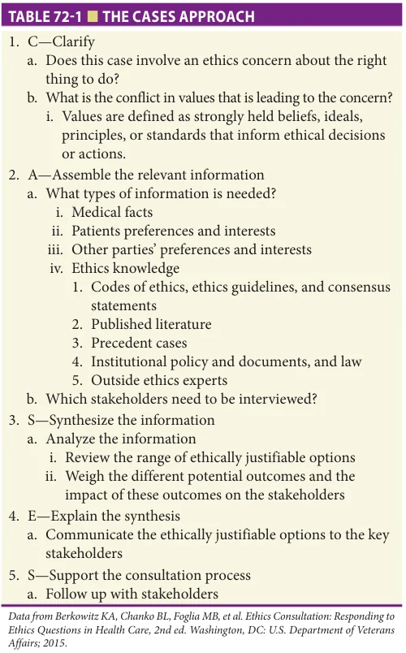
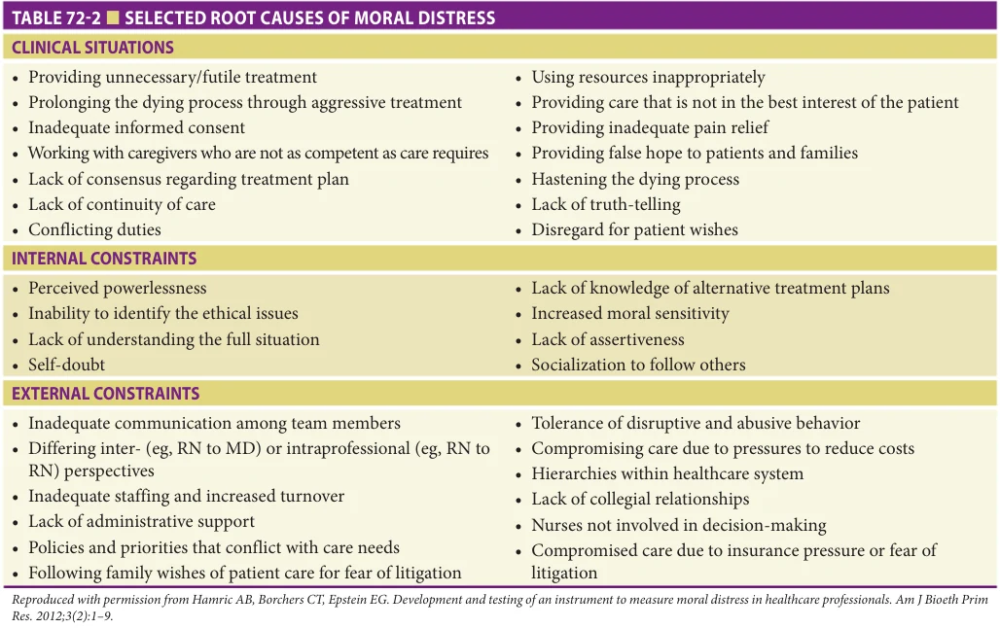
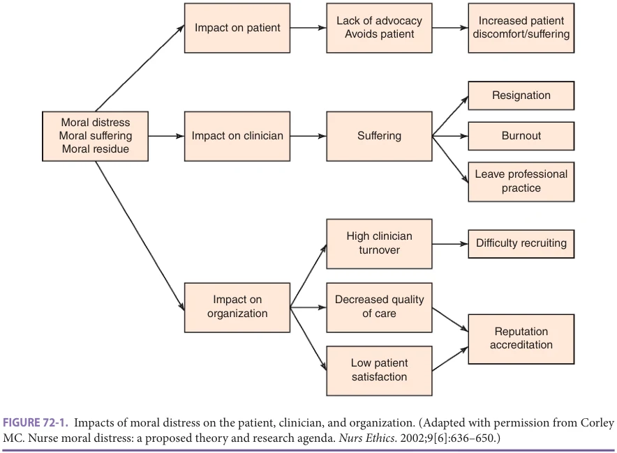
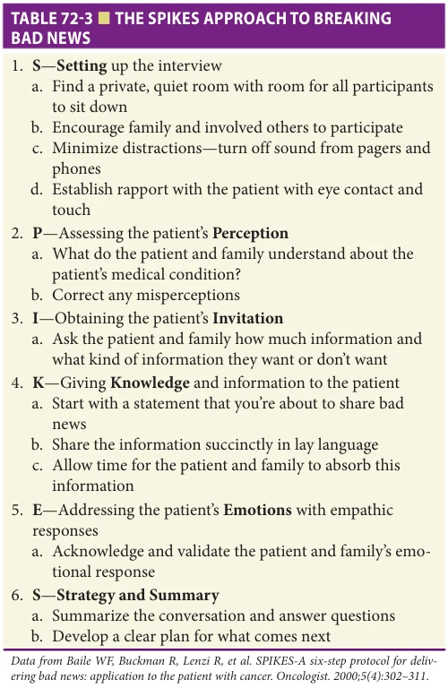
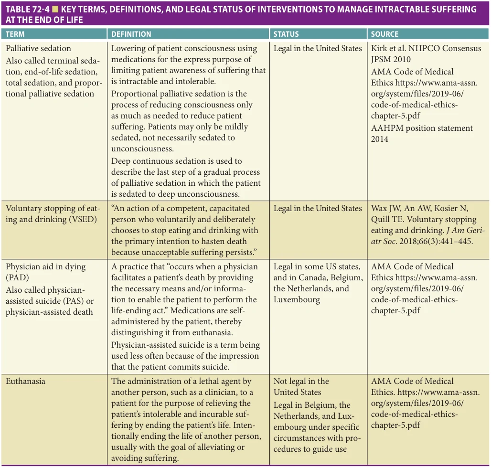
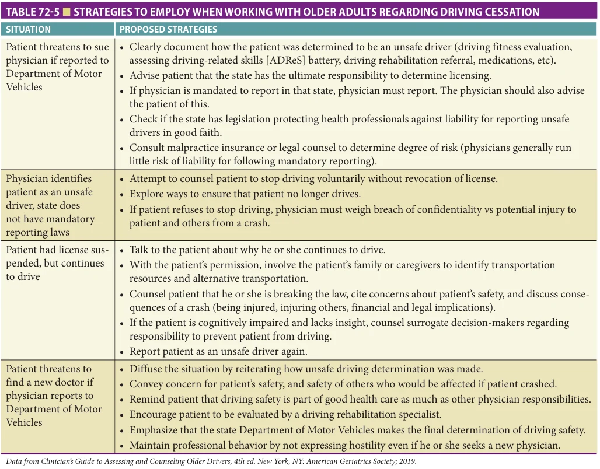
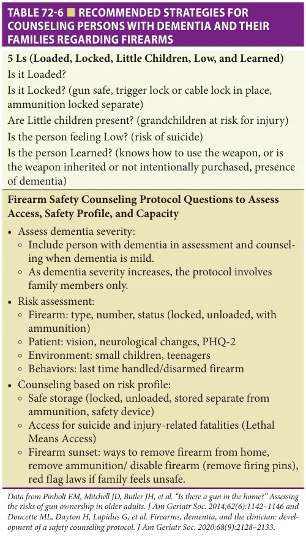
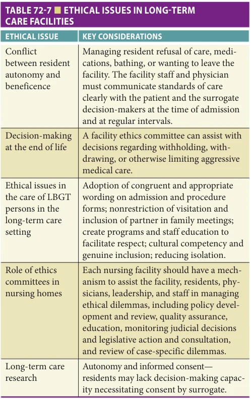
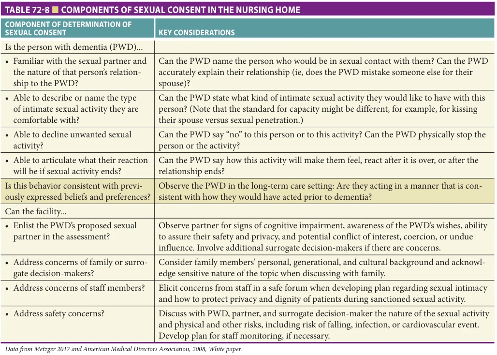

# Hazzard's Geriatric Medicine and Gerontology, 8e - Chapter 72: Ethical Issues

Timothy W. Farrell, Caroline A. Vitale, Christina L. Bell, Elizabeth K. Vig

> **Status.** Fast build from the book; not lane-reviewed.

> **Source and method.** Printed pages 1097-1114, from the marked 8th-edition copy (PDF page = printed page + 34). Prose follows its text layer; tables and figures are source-page crops. The book is canonical.

**[p. 1097]**

## INTRODUCTION

Health care professionals who work with older individuals in diverse settings such as their homes, assisted living facilities, skilled nursing facilities, outpatient clinics, and hospitals may encounter ethical dilemmas in their work. Ethical dilemmas arise when there is uncertainty or disagreement between stakeholders about the right thing to do in a situation. Ethical dilemmas pertinent to older patients may include questions about the balance of patient privacy versus patient safety, patients’ abilities to make their own medical decisions, decisions about preferred treatments at the end of life, and decisions made by surrogate decision-makers.

#### Learning Objectives

- Discuss the steps in the CASES approach and how it is used to address ethical dilemmas.

- Define moral distress and identify risk factors for developing it.

- Explain the steps in the SPIKES approach to breaking bad news.

- Understand the need for surrogate decision-making to ensure appropriate care of many older adults.

- Explore the concepts of substituted judgment versus best interest.

- Gain insight into the experience of surrogate decisionmakers and potential for surrogate distress after making difficult medical decisions.

- Describe the indications for palliative sedation.

- Recognize the barriers to cessation of driving.

- Discuss examples of ethical dilemmas that arise in nursing homes when the desire to maintain quality of care indicators is in conflict with promoting patient preferences and quality end of life care.

- Recognize ethical principles underlying health care resource allocation under conditions of resource scarcity, including arguments against excluding patients from healthcare resources based on age.

#### Key Clinical Points

1. Health care professionals who work with older patients may encounter ethical dilemmas which arise out of conflicts in values about the right thing to do.

2. Patients with decisional capacity have the right to make decisions that their medical teams and families don’t agree with.

3. Moral distress is a condition in which clinicians feel forced to provide care they believe is wrong, which can lead to burnout and to them leaving their jobs and professions.

In this chapter, we will discuss a framework for approaching ethical dilemmas, and provide an overview of the ethics topics especially relevant to the care of older adults. Sections include: an approach to thinking about ethical dilemmas, moral distress in professional caregivers, breaking bad news, surrogate decision-making, ethical decisions at the end of life, dilemmas between honoring self-determination and individual/societal safety, ethical challenges in the nursing home setting, and resource allocation and ageism.

## AN APPROACH TO THINKING ABOUT ETHICAL DILEMMAS

Case Mrs. C is an 88-year-old woman with congestive heart failure, hypertension, atrial fibrillation, and chronic kidney disease. She lives alone in her own home. She was hospitalized last month for delirium secondary to a urinary tract infection. She is admitted again this month after a fall. While in the hospital, she is evaluated by physical therapy and occupational therapy who both recommend a short stay in a nursing home for rehabilitation. Mrs. C refuses to go to a nursing home and demands to return to her home. Her medical team insists that going directly home is not a safe discharge plan, and wants to require her to go to rehab.

Question: What is an ethically appropriate discharge plan for Mrs. C?

Health care professionals working with older patients may encounter ethical dilemmas, regardless of their discipline

**[p. 1098]**

4. The majority of people want to be told if they have dementia.

5. Making medical decisions for loved ones can be very stressful for surrogate decision-makers.

6. Through a process of shared decisionmaking, patients or their surrogates share information about their goals and care preferences with clinicians, and their clinicians share pertinent medical information and make care recommendations based on the patient’s values and goals.

7. Palliative sedation is a legal intervention of last resort to promote relief of intractable suffering for terminally ill patients who have comfort as their primary goal of care.

8. Physician aid in dying (PAD), also called physician-assisted suicide, is legal in some US states and countries. Euthanasia is not legal in the United States, but is legal in Belgium and the Netherlands.

9. Patients may raise the topic of PAD as a way to begin a conversation about the end of life. Clinicians should view this as an opportunity to talk about sources of intractable suffering and fears about dying regardless of whether or not they live in a state where the practice is legal.

10. Questions about whether or not to report concerns about an older individual’s driving are answered by weighing the clinician’s duty to protect the patient’s safety, with the duty to maintain confidentiality, and the duty to protect the public. Some US states have mandatory reporting requirements.

11. Ethical issues prevalent in nursing homes include not only those in which the patient and family’s care goals are in conflict, but also those in which regulations are in conflict with quality end of life care.

12. Triage committees, and not front-line health care providers, should make decisions about allocation of limited heath care resources under conditions of resource scarcity, and patient age should not factor into these decisions.

or work setting. Ethical dilemmas usually stem from a conflict in values between stakeholders. For example, an older patient with multiple comorbidities, who values being alive regardless of his condition, may disagree with his physician

about the best way to manage his advanced kidney disease. To add complexity, older adults are a heterogeneous group with diverse values, preferences, and goals that may or may not be influenced by their race, ethnicity, or religious backgrounds. In terms of their beliefs about end-of-life care, for example, older patients may have more heterogeneous views than their clinicians. Because of this heterogeneity, clinicians should not assume that they know a patient’s values and goals without engaging in a conversation with the patient.

Ethical dilemmas may be distressing to health care professionals. Although health care professionals learned about ethics in their training, many are not familiar with a standard approach to thinking about and responding to ethical dilemmas. Without knowledge of such an approach, ethical dilemmas encountered may lead to moral distress and burnout. Familiarity with a framework and using a standard approach to thinking about ethical dilemmas may help health care professionals to find ways to resolve them, while honoring patient preferences, and reducing their own stress.

Different frameworks for approaching ethical dilemmas exist. One approach is the four-box method from Jonsen et al., in which important information about the patient’s medical condition, preferences, quality of life, and other contextual features of the case is collected. Another is the CASES approach to ethical dilemmas which has been developed and is used by ethics consultants throughout the Veterans Administration (VA) health care system (see Table 72-1 and Further Reading). Although this approach was developed for use by ethics consultants, the approach also can be applied by others who are trying to better understand ethical dilemmas. Since the second step of the CASES approach is similar to the four-box method, let us apply the CASES approach to the case of Mrs. C above.

The first step of the CASES approach is to Clarify whether the dilemma is really about ethics or something else, such as a legal issue. This is done by identifying whether there is a conflict in values between two of the involved stakeholders about the right thing to do. To do this, we try to understand the perspectives and values of the involved stakeholders, and identify which values are in conflict. In the case of Mrs. C, the conflict in values is between Mrs. C, who doesn’t want to go to a nursing home for rehab, but wants to go home, and her medical team that believes sending her home would be harmful to her. This dilemma also can be viewed as a conflict between ethical principles. In the case of Mrs. C, the conflict in principles is between honoring Mrs. C’s autonomy/self-determination and promoting both beneficence and nonmaleficence.

In the second step of the CASES approach, information relevant to the case is Assembled. This information includes medical information, patient preferences, other parties’ preferences, and ethics knowledge. In the case of Mrs. C, we already know that she has multiple medical problems, lives alone, is in her second hospitalization, and

**[p. 1099]**

*TABLE 72-1 ■ THE CASES APPROACH*

is staunch in her refusal to go to a nursing home for rehab. Knowing her reason for refusing this would be helpful. For example, she might tell us that her husband died in a nursing home after a prolonged decline from dementia, and that she gets flashbacks and panic attacks whenever she enters a nursing home. Or, she might tell us that she needs to get home to care for her frail neighbor. We would want to hear more from Mrs. C’s medical team about their concerns, and what they believe they can and cannot allow their patients to do. In thinking about this case, it also might be helpful to look at the hospital’s policies around informed consent and refusal of care, and to search for pertinent literature about this issue (see Further Reading).

Once we have gathered the relevant information about Mrs. C’s case, including the stakeholders’ perspectives, we would need to begin to consider the different possible options and the impacts of each option on the stakeholders. In the Synthesize step, we would weigh the potential risks and benefits to Mrs. C of honoring her preference and sending her home versus insisting that she be discharged to sub-acute rehab. An important aspect of the case is whether Mrs. C. has decisional capacity

to make the “poor” decision to return to her home or not. (Decisional capacity is discussed in Chapter 10.) In assessing her capacity to make this specific decision, it would be important to find out if she understands the risks and benefits of going to a nursing home for rehab versus going directly home.

If Mrs. C has decisional capacity to make the decision to go home, her medical team cannot force her to go to a nursing home against her will. In light of this, her team should consider ways to promote her continued recovery and safety at home. This could include arranging for more resources in her home, such as a visiting nurse, physical therapist, occupational therapist, Meals on Wheels, and a product she could use to quickly call for help in the future. Or it might involve brainstorming about how to get help for her frail neighbor, so she would feel more comfortable going to the nursing home for rehab.

If Mrs. C lacks decisional capacity to make the decision to go home, then the medical team will need to involve her legal surrogate decision-maker to help make this decision. Since some states have laws forbidding placement of individuals in nursing homes against their will, finding a solution could prove to be difficult, and might involve substantial negotiating and developing creative solutions.

When the CASES approach is used by health care professionals to understand the nuances of ethical dilemmas in their work, the last two steps of the approach are less critical than they are for ethics consultants. These last two steps are included for ethics consultants to help ensure that their recommendations are shared with those involved with the case and that appropriate follow-up occurs. However, as a health care professional uses this approach and gains a deeper understanding of a case, he/she may want to share that information with others who are involved. It also may be helpful to identify recurrent ethical dilemmas within an organization, and determine if systems level interventions are needed.

## ETHICAL DILEMMAS CAN LEAD TO MORAL DISTRESS IN PROFESSIONAL CAREGIVERS

Case Mr. G is a 78-year-old skilled nursing facility resident with multiple medical problems, including mild dementia, who is admitted to the intensive care unit with pneumonia and possibly sepsis. He is intubated. Over the next 2 weeks, he develops acute respiratory distress syndrome (ARDS), Clostridium difficile colitis, and a pressure ulcer. His renal function is deteriorating. He remains delirious, and is therefore unable to participate in medical decision-making.

Mr. G’s advance directive states that he wouldn’t want life-prolonging measures for a terminal condition, and would want care focused on comfort. His wife, whom he designated as his health care agent through a Durable Power of Attorney for Health Care, insists that treatments

**[p. 1100]**

with the goal of life prolongation be continued. His nurses are concerned that his prognosis is poor and his preferences aren’t being honored. His physicians say he isn’t “terminal” yet.

His nurses are concerned that he has pain. They note that he grimaces when they care for him. His wife refuses for him to have pain medications because of a fear that they will prevent him from waking up.

When the doctors, nurses, social workers, and the chaplain have tried to talk to Mrs. G about her husband’s goals of care or his pain management, she becomes agitated and threatens lawsuits. Team members are frustrated. Rumors begin to circulate that Mrs. G is demented, in denial, revengeful, and wanting to keep him alive for his pension. Some have commented that scarce resources are being wasted in keeping him alive.

Question: In reading this case, can you sense the distress experienced by those caring for Mr. G?

Moral distress is a term that was coined by Jameton in 1984. Moral distress occurs when someone or something prevents you from doing what you believe is right, forcing you to act contrary to your core values. In other words, you believe you are providing care that is morally wrong. Although moral distress has been studied most in nursing, it has been documented in numerous health care professions, and even in health care leaders. Health care professionals who interact with older patients may personally

experience moral distress, and also may interact with colleagues who are experiencing it.

There are numerous root causes of moral distress (see Table 72-2). These causes may be due to clinical factors of a case, but also may be due to individual characteristics of members of the care team, or to institutional factors. Multiple members of the care team may experience moral distress about a given case, but may experience this distress from different aspects of the case.

One theory of moral distress holds that one’s level of distress does not return to baseline after experiencing an episode of moral distress, but that, with each case, one’s “moral residue” increases to a new baseline. Thus, over time, there is a crescendo in a clinician’s moral residue. This crescendo of moral residue and “untreated” moral distress can lead to burnout, to individuals leaving their positions, and even to individuals leaving their professions. This can be psychologically costly for individuals and financially costly for institutions (Figure 72-1).

After recognizing that a case is causing moral distress, what can health care professionals do about it? One helpful intervention is for the team to talk about the case and the aspects of the case that are giving each of them moral distress. Building one’s moral resilience may be helpful (see Further Reading). Finally, if organizational factors are leading to moral distress in staff, these need to be brought to the attention of the organization’s management.

*TABLE 72-2 ■ SELECTED ROOT CAUSES OF MORAL DISTRESS*

**[p. 1101]**

*FIGURE 72-1. Impacts of moral distress on the patient, clinician, and organization. (Adapted with permission from Corley MC. Nurse moral distress: a proposed theory and research agenda. Nurs Ethics. 2002;9[6]:636–650.)*

## TRUTHFUL DISCLOSURE

Case Mr. W is an 83-year-old man who is brought to see his primary care provider by his wife. She confronts the physician outside the examination room and expresses concern that her husband has become more forgetful and no longer is able to pay their bills. She remarks, “If he has Alzheimer’s disease, please don’t tell him.”

Question: What is the ethically justifiable option for the clinician after he examines Mr. W?

In the past, when medicine was more paternalistic, physicians did not routinely inform patients of life-threatening diagnoses. The rationale for not sharing diagnoses, such as cancer, with patients was that this information would cause harm. However, most people want to know their diagnoses. A systematic review of 23 articles with over 9000 participants found that 91% of cognitively intact people and 85% of cognitively impaired people wanted to know if they had dementia. A second study found that there were no increases in rates of depression or anxiety after people learned of a dementia diagnosis.

As medicine has moved from being paternalistic to being patient-centered, the practice of withholding information from patients decreased. In this era of patientcentered care, patients should be offered the opportunity to learn about their medical conditions. Patients also have the

right to decline to hear about their conditions. In certain cultures, it is still standard to not share information about serious illness with patients, but with their family members (ie, familismo). In some cultures, there is a belief that talking about bad things will make them happen. Thus if a patient doesn’t want information, for any reason, giving this information without permission is not ethically justifiable, and could cause harm.

One method advocated for use when breaking bad news is the six-step SPIKES approach (see Further Reading). The steps of this approach are explained in Table 72-3.

In response to the case of Mr. W, it would be appropriate to understand Mrs. W’s reasons for not wanting her husband to know his diagnosis. Perhaps he has asked her on multiple occasions not to ever tell him if he develops dementia, because of a previous experience with a family member who suffered from dementia. In this case, it might be appropriate not to share this information with Mr. W. Ultimately, however, he has a right to this information, if he wants it. After hearing her reasons, we could use the SPIKES approach to talk to Mr. W. We would ask about his understanding of his current situation and whether he would want information or not. In the case of dementia, it is appropriate to share information about the diagnosis with a patient with mild dementia who has decisional capacity to make the decision about whether or not to hear the cause of his memory loss. It might not be appropriate to repeat this information over and over to a patient with more advanced

**[p. 1102]**

*TABLE 72-3 ■ THE SPIKES APPROACH TO BREAKING BAD NEWS*

dementia, who might experience the emotional distress of receiving this diagnosis multiple times or might not be able to fully understand what this means.

## DECISION-MAKING IN CHRONIC AND ADVANCED ILLNESS

Case Mrs. S is an 82-year-old woman with mild dementia, coronary artery disease, hypertension, and peripheral vascular disease. She misses a meal in the dining room of her assisted living facility, and is found in her apartment lethargic and confused. She is sent to the hospital, admitted to the ICU, and diagnosed with urosepsis. She has a Physician Orders for Life-Sustaining Treatment (POLST) form, which accompanies her to the hospital, with preferences for Do Not Resuscitate status (DNR), Limited Additional Interventions, antibiotics to prolong life, and a trial of use of a feeding tube.

Despite aggressive care in the ICU, she remains delirious. Over the next 2 weeks in the ICU, she suffers a nonST segment elevation MI, develops a pneumonia thought secondary to aspiration, and her kidney function worsens.

Her adult children, who are her legal decision-makers, are given regular updates, but are overwhelmed by the numerous medical decisions they are asked to make including: whether to insert a temporary feeding tube in her nose, followed later by whether to insert a more permanent tube in her stomach, and whether to start dialysis. Although they had initially told the ICU to do “everything” to make their mother better, short of resuscitating or intubating her, they begin to wonder if they are doing the right thing. They wonder how long their mother would want this level of care continued. During a routine meeting with the family, the ICU team uses the term “futile” and recommends that they change the goal of care to focus on maximizing their mother’s comfort.

Question: What should the family and ICU team consider in deciding how to proceed?

In older patients with chronic medical conditions, a multitude of medical decisions may arise during acute illness, and in the course of worsening of the chronic conditions. When patients are unable to make their own decisions, surrogates are called on to make these decisions. Decision-making for others can be stressful for surrogates, while knowledge of a loved one’s preferences can reduce the burden of decisionmaking for surrogates. In the case of Mrs. S, her children have attempted to implement her wishes, but her condition has worsened, and they are no longer sure of the right thing to do. In what follows, several decisions related to this case will be discussed.

We operate under the notion that the patient possesses a fundamental legal and moral right to have his or her care preferences respected. Understanding any prior conversations or specific directives (such as her POLST form), and knowing her overall values, hopefully Mrs. S’s family would be able to speak on behalf of Mrs. S, as though they were relaying her explicit wishes, or “standing in her shoes.” This concept illustrates the ethical principle of substituted judgment. When such patient preferences are known, it is expected that the patient’s surrogate decision-maker would operate under this principle, communicating the patient’s wishes, and choosing the option that would best fit her stated care preferences.

Often, the patient’s explicit wishes regarding a specific clinical scenario are not known. It can be difficult to anticipate all of the different clinical scenarios and medical decisions that may need to be considered in one’s future ahead of time. In this type of situation, surrogate decision-makers often need to rely on the principle of best interest. In deciding what satisfies a person’s best interest, the surrogate decision-maker—ideally with guidance from the primary team of health care providers caring for the patient—is able to objectively weigh risks, potential benefits and treatment burdens to make an individualized decision for the patient. However, when evidence of the patient’s wishes does exist, making decisions by

**[p. 1103]**

substituted judgment should take precedence so that the patient’s care preferences are honored.

At the beginning of her hospitalization, Mrs. S’s children believed that they were doing what she would want in inserting a temporary nasogastric tube. When she didn’t improve despite aggressive interventions and remained unable to swallow safely, her children were less sure if she would want a more permanent tube inserted. Although the literature, position statements from organizations such as the American Geriatrics Society, and the Choosing Wisely campaign have argued against the insertion of feeding tubes in patients with advanced dementia (which is discussed elsewhere), the appropriate use of feeding tubes in other situations is less clear. In Mrs. S’s situation, the decision of whether or not to place a permanent feeding tube depends on her overall goals of care. It is not clearly right or wrong to place it.

Another decision that families often will make for their loved ones is whether to treat infections with antibiotics. Antibiotic therapy is thought to be beneficial and the usual standard of care in conditions such as pneumonia and urinary tract infections, which often arise among older adults. In some patients with advanced serious illness, however, antimicrobials can carry substantial risk and treatment burdens that need to be carefully weighed, especially among patients receiving end of life care. For example, patients receiving antimicrobials are at increased risk of acquiring infections with resistant organisms as well C. difficile infections. Some of the unintended consequences of antimicrobial therapy not only include burdens to the individual patient, but also extend to other patients, and to society through the possible selection of antimicrobial resistance. Studies are conflicting as to whether antimicrobial treatment of pneumonia may provide symptomatic benefit among patients with advanced dementia. A recent prospective study of patients with advanced dementia and pneumonia demonstrated an association between antimicrobials and increased discomfort. For patients receiving comfort-focused care near the end of life, the treatment of pain, fever, and dyspnea with opioids and antipyretics remains effective to provide symptomatic benefit. Whether a course of antibiotics is warranted will depend on the risks and benefits of the treatment and whether providing that course of treatment is consistent with the patient’s goals of care.

In living with chronic conditions, older patients may have acute or chronic worsening of their kidney function. The number of older individuals who are beginning chronic dialysis is increasing. Many of these individuals start dialysis while in the hospital for an acute illness. Studies have shown that older people with poor functional status, multiple chronic conditions, and age over 85 when starting dialysis may not necessarily live longer with dialysis. Conservative management programs for older patients with advanced kidney disease who are forgoing dialysis are prevalent in

the United Kingdom, but not elsewhere. In deciding about whether or not to begin dialysis, Mrs. S’s children need to be fully informed about the risks and benefits of short- and long-term dialysis. As with other decisions, the decision to start dialysis depends on Mrs. S’s goals of care.

After a trial of aggressive therapies aimed at life prolongation, Mrs. S’s clinicians begin to talk about her situation being “futile.” This term is used by health care professionals, but not by lay people, and therefore should not be used in routine conversations with patients or their loved ones. The term is also commonly used when clinicians don’t believe that continuing on the current trajectory is “worth it.” Different definitions of futility exist, including quantitative futility (very low probability of survival) and qualitative futility (patient’s quality of life is below an acceptable standard). These definitions can be problematic because clinicians cannot accurately predict a patient’s chances of survival and may not be able to separate their own views about acceptable quality of life from the patient’s perceived quality of life. In the case of Mrs. S, decision-making might be easier if both the medical team and her family were clear about her goals of care; what makes life worth living for her (in keeping with the Institute for Healthcare Improvement and John A. Hartford Foundation’s Age-Friendly Health Systems’ 4Ms Framework in which eliciting what Matters to the patient is emphasized), and would she consider life to be acceptable if she lived in a nursing home, leaving three times a week for dialysis, and being fed through a tube.

When patients are very sick and care is focused on life prolongation, it can be hard for clinicians and family members to step back and examine the big picture. When the goal is to do “everything,” medical teams may want to better understand what this means to a patient and family. They should not feel compelled to offer every intervention that is technically feasible. Instead, they should consider whether the intervention is clinically meaningful, and whether it will help to meet the patient’s goals of care.

Mrs. S’s medical team has recommended a change in the focus of her care from life prolongation to comfort care. Although this may be a clinically acceptable option, it is important that care recommendations be based on an understanding of the patient’s values and preferences. Making recommendations tailored to patient preferences would be consistent with a shared decision-making approach. At the same time, it is important to acknowledge that although withholding and withdrawing care is ethically equivalent, withdrawing life prolonging measures may be more psychologically difficult for decision-makers.

In deciding how to proceed with Mrs. S’s care, consulting a palliative care team may be helpful. The palliative care team could not only help the medical team develop a richer understanding of Mrs. S’s values, care preferences, and goals of care by engaging in in-depth conversations with her children about her life, but also support her family during a stressful time.

**[p. 1104]**

## MANAGING REFRACTORY SYMPTOMS CAUSING INTRACTABLE SUFFERING NEAR THE END OF LIFE

Case Mr. P is a 90-year-old man with widely metastatic prostate cancer receiving hospice services in a nursing home. He continues to have severe bone pain from his metastatic disease despite the use of opioids, steroids, zolendronic acid injections, and a course of palliative radiation. As his opioid doses are increased, he develops myoclonus and confusion. Rotation to two different opioids over the next two weeks is minimally effective. His confusion worsens, becoming hyperactive delirium with bouts of yelling and attempting to climb out of bed. Addition of antipsychotic medications is only slightly effective.

His family and the nursing staff are distressed about his situation and their inability to ensure his comfort and safety.

Question: What are the ethically and legally appropriate options to reduce Mr. P’s suffering?

In terminally ill patients such as Mr. P, questions may arise about ways to reduce his intractable suffering and promote his comfort at the very end of life, to ensure a peaceful death. His family may ask if there is something that could be done to end his suffering, such as euthanasia. Those taking care of him may wonder about the use of palliative sedation or physician aid in dying (PAD; also known as physicianassisted suicide) and whether alternative options exist. The differences between these entities can be confusing to families and clinicians, and are defined in Table 72-4.

*TABLE 72-4 ■ KEY TERMS, DEFINITIONS, AND LEGAL STATUS OF INTERVENTIONS TO MANAGE INTRACTABLE SUFFERING AT THE END OF LIFE*

**[p. 1105]**

Palliative sedation is legal in the United States. It is an intervention provided to relieve intractable and intolerable symptoms at the end of life, and is accomplished by intentionally lowering the patient’s level of consciousness using sedating medications. Palliative sedation should be used as an intervention of last resort in the setting of a palliative care interdisciplinary team strategy to achieve symptom control within the spectrum of palliative care interventions. The American Medical Association, the American Academy of Hospice and Palliative Medicine, and guidelines from Europe, Canada, and Japan consider palliative sedation to unconsciousness to be appropriate as a last resort in terminally ill patients with goals for comfort and severe refractory distressing symptoms including agitated delirium, dyspnea, pain, nausea and vomiting, shortness of breath, urinary retention due to clot formation, gastrointestinal pain, uncontrolled bleeding, and myoclonus. Palliative sedation for suffering that does not result from physical symptoms, but from existential, psychological, or spiritual distress remains controversial.

The recommendations on palliative sedation from the American Academy of Hospice and Palliative Care in 2014 are summarized as follows: (1) it is ethically defensible if used after careful interdisciplinary evaluation and treatment of the patient; (2) it should be used when palliative treatments that are not intended to affect consciousness have failed or, in the judgment of the clinician, are very likely to fail; (3) it should be used where its use is not expected to shorten the patient’s time to death; and (4) it should be used only for the actual or expected duration of symptoms. Ideally, the patient, family, and participating interdisciplinary health care professionals should be in agreement that this intervention is consistent with patient goals and is the right thing to do. Health care professionals who believe that participating in palliative sedation is morally wrong should not be forced to participate in the care of patients undergoing this intervention. Treatment of existential suffering should include the full interdisciplinary team including mental health and spiritual care experts. Respite sedation, or sedation for a limited time with subsequent removal of sedation to reassess the patient, may be an alternative approach.

An alternative to palliative sedation is the voluntary cessation of eating and drinking (also called voluntary stopping of eating and drinking or VSED). This practice is legal if chosen because of intractable suffering by a competent person with decisional capacity who is approaching the end of life. Many individuals who are approaching the end of life do not have an appetite, and thus do not experience discomfort from VSED. For others, symptoms resulting from voluntary cessation of eating and drinking may require intervention by a palliative care team. Individuals are encouraged to let their medical teams and families know if they decide to pursue VSED. However, there are cases in which older individuals who had decided to pursue this were evicted from long-term care facilities due to legal concerns.

VSED is a patient-initiated, voluntary process, which necessitates that the patient remains competent at least at the start of the process. The health care team may need to palliate symptoms of thirst and delirium, and sustain the continued withholding of food and fluids from some patients who pursue VSED. Due to the loss of decisional capacity inherent in the progression of dementia, VSED in the setting of dementia deserves further thoughtful consideration. While some dementia-specific directives allow for delineation of potential withholding or withdrawing of food and fluids (ie, stopping eating and drinking by advance directive, or SED by AD) when one’s dementia progression reaches a certain point, implementation of these directives across varying state jurisdictions will need to be understood and studied further. While the concept of SED by AD has gained traction among some advocates for advance care planning, these directives have also been criticized for utilizing a potentially problematic ethical concept called “precedent autonomy” in which a fully cognizant and healthy patient directs their care preferences to be carried out after loss of decisional capacity, should their degree of functional incapacity and circumstance meet preset conditions, regardless of the clinical situation and social setting in which the patient might land. SED by AD is a process in which a surrogate decision-maker directs the withholding of food and fluids when a certain degree of cognitive and functional impairment is reached due to dementia progression. Advocates have focused on the ethical principle of patient autonomy to direct preferences for SED by AD, as is the case with more general advance directives. However, others, including a recent position statement put forth by the Ethics Subcommittee of AMDA—The Society for Post-Acute and Long-Term Care Medicine, argue that the principle of justice (the obligation to treat all individuals equally regardless of race, gender, cognitive or physical ability needs to be the overarching principle to guide these decisions), as well as the physician’s obligations to beneficence and nonmaleficence, thereby advocating that comfort feeding should be implemented for those with advanced dementia. Some of the more detailed directives, that include specific preferences for SED by AD, are difficult to implement in care settings such as nursing homes and inpatient hospices. Specific instructions to discontinue hand feeding in advanced dementia or to instruct surrogates to not allow hand feeding if one loses the ability to feed oneself are potentially difficult to implement in care settings where the provision of oral food and fluids are considered basic and comfort-oriented care, especially if the patient appears to derive enjoyment comfort out of eating or tasting food. A policy of comfort feeding in advanced dementia, on the other hand, allows for continued assisted feeding for those who are accepting food and fluids as tolerated until their feeding behaviors indicate refusal or show signs of any distress with eating.

PAD, also called physician-assisted suicide or death with dignity, is legal in some US states and the

**[p. 1106]**

District of Columbia. The patient pursuing PAD intentionally self-administers lethal doses of medications with the intention of ending their suffering. The Death with Dignity laws in Oregon and Washington and similar laws in other states in the United States stipulate that only terminally ill patients who are decisionally intact and voluntarily making this request are eligible to use the law. Interested individuals are required to make two verbal and one written request, and must be adult residents of their state. Two attending physicians must verify that the patient is terminally ill with intact decisional capacity. The majority of people requesting this are already receiving hospice services, and often make the request because of concerns about loss of autonomy and control. Approximately one-third of individuals who obtain medications do not use them. Finally, patients may raise the subject of PAD with their clinicians as a way to begin a conversation about death and dying. Even if clinicians cannot or will not participate, they should still view this as an opportunity to talk about the patient’s sources of unbearable suffering, and fears about dying.

Euthanasia is a process by which an individual, such as a clinician, intentionally administers a lethal dose of medication to a terminally ill patient, which directly ends their life. In contrast to PAD, euthanasia is not legal in the United States. Internationally, it is legal in Belgium and the Netherlands, which have widespread palliative care policies and availability of palliative care professionals. In these countries, the practice of euthanasia is considered one option to manage intractable suffering at the end of life, and is provided in conjunction with palliative care. Of note, a qualitative study characterizing the Dutch experience with euthanasia or physician-assisted suicide requests among older adults without terminal illness and with multiple geriatric conditions between 2013 and 2019 was recently published. These older adults attributed unbearable suffering to a combination of medical, social, and existential issues that include loss of mobility, fear of decline, social isolation, and loss of meaning. This study found that patients whose suffering was attributed to multiple geriatric conditions accounted for 4% of all cases of euthanasia or physician-assisted suicide in the Netherlands during this period, calling attention to the potential for a “slippery slope” of allowing the use of euthanasia or physician-assisted suicide for suffering due to nonterminal conditions that could instead be addressed with enhanced geriatric or palliative supportive efforts to enhance quality of life.

The ethical distinction between palliative sedation and euthanasia has been debated, hinging on three areas: intention, monitoring, and methods. Palliative sedation does not have the intention to hasten death, the patient is monitored to provide the minimum level of sedation required to provide symptom relief, and the medication is carefully titrated to achieve this minimum level of sedation required to provide symptom relief. The American Medical Association (AMA) asserts that the distinction between palliative sedation and euthanasia may be evident on

examination of the medical record, as repeated doses and continuous infusions suggest palliative sedation, while one large dose or rapidly accelerating doses out of proportion to the level of immediate patient suffering may reflect an intention to hasten death. Other indications of inappropriate palliative sedation include inadequate communication and support between patients, relatives, and staff; inadequate evaluation of psychological distress and existential suffering; and inadequate monitoring. There are multiple published guidelines on appropriate indications, monitoring, and methods for palliative sedation, and most guidelines include the recommendation that cases in which this procedure is being considered should include a physician with expertise in palliative care.

## BALANCING AUTONOMY AND SELFDETERMINATION WITH INDIVIDUAL AND SOCIETAL SAFETY DRIVING

Case Mr. J is an 89-year-old man living temporarily in a skilled nursing facility where he is receiving physical and occupational therapy after he fell and sustained a patellar fracture. He is doing well, and the interdisciplinary team informs you that he will be ready to discharge home soon. He lives in a one-story home with his wife. He drives to the neighborhood shopping center to meet his friends for lunch, buy groceries, and do other chores. During your assessment, you note that his memory is mildly impaired, with only one out of three items recalled after 5 minutes, and he has difficulty with attention. His clock-drawing test is markedly abnormal, with impaired spacing and numbering.

Questions for the interdisciplinary team: Should he still be driving? What do we do about it?

Decisions regarding older adults’ driving ability can lead to ethical dilemmas for health care professionals, especially when the patient is upset at the loss of the independence and autonomy that driving provides. Common reasons for recommending driving cessation are epilepsy, stroke, dementia, visual impairment, and medication adverse effects. Strategies to employ when addressing driving decisions with patients are summarized in Table 72-5. Some key ethical considerations with regard to driving include protecting the patient’s safety, the public’s safety, and patient confidentiality. Protecting Mr. J would include counseling him about conditions or medications that may impair his ability to drive safely. Some states have mandatory reporting requirements for physicians regarding driving ability, and some states have found physicians liable for harm to others because their patients were not warned about conditions or medication side effects that could impair driving performance. Physicians must weigh the responsibility for ensuring patient confidentiality against the responsibility for the patient’s safety and public safety. Involving patients and family, and carefully counseling patients,

**[p. 1107]**

*TABLE 72-5 ■ STRATEGIES TO EMPLOY WHEN WORKING WITH OLDER ADULTS REGARDING DRIVING CESSATION*

including providing a written letter of recommendations regarding driving cessation, can be helpful to navigate these challenging situations. Careful documentation of a patient’s risks regarding driving and counseling provided, as well as additional referrals made to social workers, driving rehabilitation or other professionals, may reduce clinician liability. In addition, physicians must make sure they are in compliance with their own state reporting laws for physicians, available from each state’s Department of Motor Vehicles (DMV). Six states have mandatory reporting requirements (California, Delaware, Nevada, New Jersey, Oregon, and Pennsylvania). In states without mandatory reporting laws, providers need to obtain release of information to report patients to the DMV, or they could be held liable for breach of confidentiality. Some states provide civil immunity if health care professionals report in good faith.

## FIREARMS

The possession of firearms by people with dementia is another area in which the autonomy and self-determination of the individual needs to be weighed against the safety of the

individual and of society. Of people with dementia, 60% have firearms in their homes and only 17% of families report storing these weapons unloaded and locked. Having firearms in the home increases the likelihood of suicide completion. Ten states and the District of Columbia require a permit to buy a firearm. Hawaii restricts persons with organic brain syndromes from possessing firearms, while Texas prohibits persons with dementia from obtaining a license to carry a handgun in public. There are “red flag laws” called extreme risk protection order (ERPO) laws in 17 states, which provide a means for court-ordered firearm removal based on reasonable or substantial threat. Strategies for assessing and counseling firearm safety in patients with dementia and their families are shown in Table 72-6. As dementia progresses, the recommendations become more focused on counseling families to restrict access to the firearm and remove the firearm from the home environment. A website has been developed to assist families and caregivers in discussing changes regarding safety in dementia, including firearms, driving and home safety (https:// safetyindementia.org/).

**[p. 1108]**

*TABLE 72-6 ■ RECOMMENDED STRATEGIES FOR COUNSELING PERSONS WITH DEMENTIA AND THEIR FAMILIES REGARDING FIREARMS*

## MANAGING SEXUAL INTIMACY AND OTHER ETHICAL ISSUES IN NURSING HOMES

Case Mrs. N, an ambulatory 87-year-old nursing home resident with moderate dementia, is found by nursing staff in the room of Mr. O, an 85-year-old nursing home resident with COPD, Parkinson disease, and dementia. They are seated on Mr. O’s bed, hugging. Mr. O is wearing his incontinence briefs, but no pants, and is audibly wheezing.

Question: What is the appropriate way to approach sexual intimacy in the long-term care setting?

Common ethical issues encountered in long-term care are summarized in Table 72-7. In general, ethical issues in the nursing home often involve tension between honoring resident autonomy and protecting their health and safety. During the COVID-19 pandemic, for example, many nursing homes prioritized beneficence and safety over resident

*TABLE 72-7 ■ ETHICAL ISSUES IN LONG-TERM CARE FACILITIES*

autonomy. This has resulted in isolation and cognitive decline.

Sexual intimacy in the long-term care setting requires a specific approach that is different from usual medical decision-making capacity evaluations. One recommended approach is summarized in Table 72-8.

In the case, the physician caring for Mrs. N and Mr. O must assess their capacity for sexual consent and the long-term care facility must develop a plan for sexual intimacy within the facility. Involving the residents’ surrogate decision-makers is recommended for open communication and a coordinated approach that balances patient preference (if the patient is determined to have capacity for sexual consent) with safety and privacy.

## RESOURCE ALLOCATION AND AGEISM

Case A hospital system is approaching 100% ICU capacity due to the COVID-19 pandemic. This health system’s crisis standards of care specify that adults older than age 85 should not enter the resource allocation algorithm, meaning that

**[p. 1109]**

*TABLE 72-8 ■ COMPONENTS OF SEXUAL CONSENT IN THE NURSING HOME*

this group would be denied intensive care should crisis care standards need to be invoked.

Question: Which ethical principles should guide the fair allocation of health care resources under conditions of resources scarcity, especially when considering age?

The specter of denying health care resources to patients under conditions of resource scarcity is perhaps one of the starkest examples in which health care professionals rely on sound and transparent ethical principles for guidance. In usual conditions in Western societies, the principle of autonomy dominates health care decision-making, but under conditions of resource scarcity, the principle of justice has greater weight. During the 2009 H1N1 pandemic, many states began adopting crisis standards of care documents designed to provide guidance to hospitals faced with conditions of resource scarcity. More recently, the COVID-19 pandemic in 2020 brought renewed attention to these crisis standards of care as ICU capacity in terms of “space” (ie, ICU beds), “staff” (eg, intensivists, nurses, respiratory therapists), and “stuff” (eg, ventilators, remdesivir) was pushed to the brink, and many hospitals developed scarce resource allocation triage teams and revised relevant protocols.

A key ethical consideration with respect to allocating health care resources under conditions of resource scarcity

is that clinicians engaged in patient care on the “front line” should not be making decisions regarding resource allocation. Leaving resource allocation decisions to individual clinicians increases the chance that resources will be allocated in an ad hoc and not a systematic fashion, increases the risk of bias including the potential for decisions to disadvantage underrepresented groups (eg, a first-come, first-serve approach), and also burdens the clinician with moral distress. Each hospital should have an interdisciplinary triage committee that is removed from clinical care and that applies their state’s crisis standards of care guidelines, with outcomes of these deliberations communicated to clinicians who apply the triage committee’s recommendation. It is critically important that triage committees apply crisis standards of care fairly and that their decisions are subject to retrospective review. Otherwise, public confidence in the process by which limited resources are allocated may be undermined.

In early 2020, reports surfaced in Italy of rationing limited health care resources based on age. In the United States, some states’ crisis standards of care included age-based cutoffs beyond which patients would not be eligible to receive limited health care resources. Additional age-related provisions include “tiebreaker” provisions in which older age counts against a patient if two patients

**[p. 1110]**

have identical scores on measures of physiological function such as the MSOFA (Modified Sequential Organ Failure Assessment) score. Although the MSOFA is not based on age, other assessments used to distinguish between patients during times of crisis, such as the 4C mortality score, weight age heavily. While it is the case that older adults with COVID-19 have a higher overall mortality rate than younger adults with COVID-19, the use of age per se to ration health care resources has been criticized because the use of age alone does not consider individual differences that contribute to short-term prognosis. Other arguments to ration health care resources based on age include longterm predicted life expectancy and utilitarian frameworks such as maximizing “life-years saved.” Long-term predicted life expectancy has been criticized in this context due to difficulty with prognosticating life expectancy and because, among underrepresented patients, it overlooks the fact that life expectancy may be shorter due to social determinants of health outside of patients’ control. The “life-years saved” approach does not consider individual differences among patients and instead withholds resources based on membership in a class (ie, one’s age group). Finally, the “fair innings” argument contends that older adults have a lesser claim on health care resources than younger adults since

## FURTHER READING

American Medical Directors Association, 2008, White

paper, The role of a facility ethics committee in decisionmaking at the end of life. Available at https://paltc.org/ amda-white-papers-and-resolution-position-statements/ role-facility-ethics-committee-decision-making. Accessed February 22, 2021. American Medical Association Code of Medical Ethics.

Chapter 5: Opinions on caring for patients at the end of life. Available at https://www.ama-assn.org/system/ files/2019-06/code-of-medical-ethics-chapter-5.pdf. Accessed February 7, 2021. American Medical Directors Association. 2016, Capacity for

sexual consent in dementia in long-term care. Available at https://paltc.org/amda-white-papers-and-resolutionposition-statements/capacity-sexual-consent-dementialong-term-care. Accessed January 10, 2021. Baile W, Buckman R, Lenzi R, Glober G, Beale EA, Kudelka

AP. SPIKES—a six-step protocol for delivering bad news: application to the patient with cancer. Oncologist. 2000;5:302–311. Betz ME, McCourt AD, Vernick JS, Ranney ML, Maust DT,

Wintemute GJ. Firearms and dementia: clinical considerations. Ann Intern Med. 2018;169(1):47–49. Clinician’s Guide to Assessing and Counseling Older Drivers.

Fourth edition. American Geriatrics Society 2019. Available at https://geriatricscareonline.org/ProductAbstract/

they have lived through more “innings.” However, opponents of this argument argue that value judgments about which “innings” of life are more important than others cannot be made. Although situations in which patients are truly tied after an exhaustive consideration of individual characteristics such as physiological parameters should be rare, promising approaches to settling these ties using assessments that are not based on age, such as the Clinical Frailty Scale, are gaining acceptance.

Although the principle of justice outweighs the principle of autonomy under conditions of resource scarcity, autonomy should still be respected. It is critically important to consider the role of advance care planning in ensuring that older adults’ preferences are honored even under these difficult conditions. Clinicians should engage in advance care planning conversations, but should be careful to avoid pressuring patients to make decisions for the sole purpose of conserving resources, regardless of whether the patient is healthy or ill at the time the advance care planning conversation occurs. Some have argued that adults should voluntarily relinquish their claim on health care resources to benefit younger generations, but this position is controversial and should not be assumed or imposed on older adults.

clinicians-guide-to-assessing-and-counseling-olderdrivers-4th-edition/B047. Accessed February 22, 2021. Epstein, EG, Hamric AB. Moral distress, moral residue, and

the crescendo effect. J Clin Ethics. 2009;20(4):330–342. Farrell TW, Widera E, Rosenberg L, et al. AGS position

statement: making medical treatment decisions for unbefriended older adults. J Am Geriatr Soc. 2017;65(1): 14–15. Farrell TW, Francis L, Brown T, et al. Rationing limited

healthcare resources in the COVID-19 era and beyond: ethical considerations regarding older adults. J Am Geriatr Soc. 2020;68(6):1143–1149. Fox E, Berkowitz KA, Chanko BL, Powell T. Ethics Consulta-

tion: Responding to Ethics Questions in Health Care. Second edition. Available at http://vaww.ethics.va.gov/docs/integratedethics/ec_primer.pdf. Accessed February 22, 2021. Gruenewald DA. Voluntary stopping eating and drinking: a

practical approach for long-term care facilities. J Palliat Med. 2018;21(9):1214–1220. Metzer E. Ethics and intimate sexual activity in long-term

care. AMA J Ethics. 2017;19(7):640–648. Preshaw DHI, Brazil K, McLaughlin D, Frolic A. Ethical

issues experienced by healthcare workers in nursing homes: literature review. Nurs Ethics. 2016;23(5):490–506. Quill T, Arnold RM. Evaluating requests for hastened death

#156. J Palliat Med. 2008;11:1151–1152.

**[p. 1111]**

Rushton, CH. Cultivating moral resilience. Am J Nurs.

2017;117(2 Suppl 1):S11–S15. Wong SP, Sharda N, Zietlow KE, Heflin MT. Planning for

a safe discharge: more than a capacity evaluation. J Am Geriatr Soc. 2020;68(4):859–866. van den Berg V, van Thiel G, Zomers M, et al. Euthanasia and

physician-assisted suicide in patients with multiple geriatric syndromes. JAMA Intern Med. 2021;181(2):245–250. VHA National Center for Ethics in Health Care. Ethics

guidance for pandemics 2020. Available at http://vaww

.ethics.va.gov/ETHICS/activities/pandemic/Ethics_ Guidance_for_Pandemics_2020.pdf. Accessed February 22, 2021. Wax JW, An AW, Kosier N, Quill TE. Voluntary stopping

eating and drinking. J Am Geriatr Soc. 2018;66(3): 441–445. Wright JL, Jaggard PM, Holahan T. Stopping eating

and drinking by advance directives (SED by AD) in assisted living and nursing homes. J Am Med Dir Assoc. 2019;20(11):1362–1366.

**[p. 1112]**

**[p. 1113]**

V Part

## Organ Systems and Diseases

**[p. 1114]**

### Chapter 92. Gastrointestinal Malignancies / 1435 Chapter 93. Skin Cancer / 1455

### Anemia / 1473 Chapter 95. Hematologic Malignancies (Leukemia/

### Lymphoma) and Plasma Cell Disorders / 1483 Chapter 96. Coagulation Disorders / 1509

### Thyroid Endocrine Disorders / 1525 Chapter 98. Thyroid Diseases / 1545 Chapter 99. Diabetes Mellitus / 1559

### Giant Cell Arteritis / 1589 Chapter 101. Rheumatoid Arthritis and Other Autoimmune

### Diseases / 1607 Chapter 102. Back Pain and Spinal Stenosis / 1629 Chapter 103. Fibromyalgia and Myofascial Pain

### Syndromes / 1643

Selection / 1667 Chapter 105. Bacterial Pneumonia and Tuberculosis / 1679 Chapter 106. Urinary Tract Infections / 1699 Chapter 107. Other Viruses: Human Immunodeficiency Virus

### Infection and Herpes Zoster / 1719 Chapter 108. Influenza, COVID-19, and Other Respiratory

### Viruses / 1733
