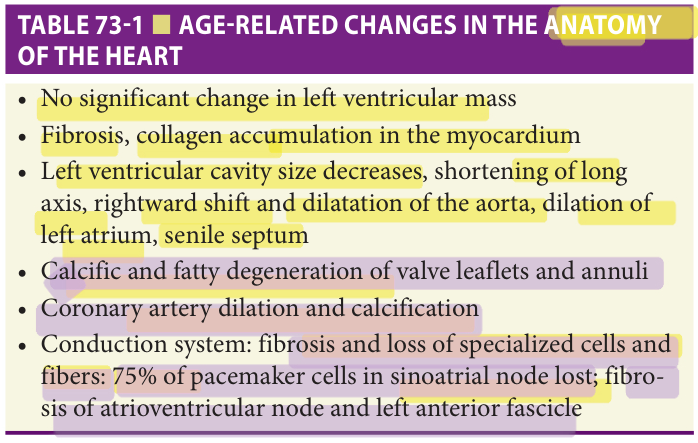
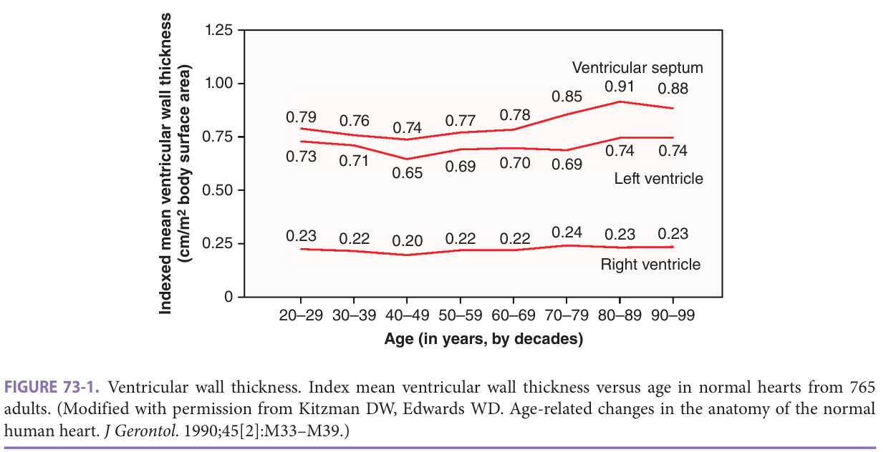
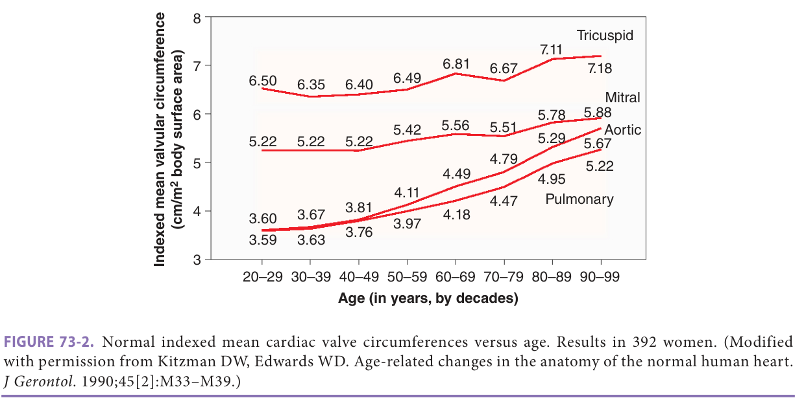
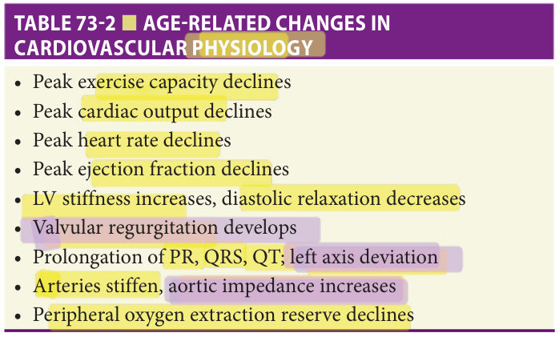
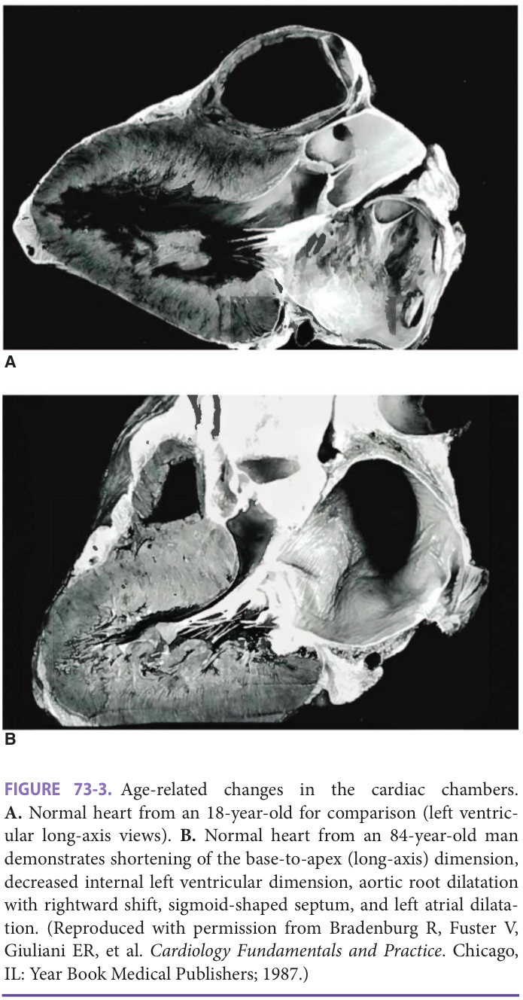

Study summary of Chapter 73; the book is the reference.

# Chapter 73 Study: The Aging Cardiovascular System

**Full chapter available: [Read Chapter 73](?chapter=73).**

Fast build from the book; not lane-reviewed.

## Summary

### Aging, disease, and reserve

**[p. 1115]**
- Aging reduces physiologic reserve and resilience: a challenge is harder to withstand and recovery is less complete. Aging itself does not inevitably produce disease; it lowers the threshold for disease and can amplify established disease.
- Studies of "normal aging" must separate clinical and subclinical disease, environment, social determinants, and cohort/period effects. Resting measurements can conceal the loss of reserve that exercise exposes. (p1115)

**[p. 1116]**
- Screen especially for occult coronary atherosclerosis and hypertension before attributing cardiovascular changes to age. Sedentary behavior and obesity add effects distinct from intrinsic aging; regularly scheduled activity can partly prevent or reverse declines in cardiovascular and exercise performance. (p1116)
- **Myocytes:** loss exceeds replacement. Oxidative stress and mitochondrial damage promote necrosis, apoptosis, autophagy, and cellular senescence. Across the lifespan, total cardiomyocyte number may fall by **50%** in healthy human and animal hearts. Remaining cells enlarge and become more variable in size; the largest are most stress-vulnerable. This is not uniform myocyte shrinkage. (p1116)
- Focal basophilic degeneration reflects abnormal glycogenolysis. Lipofuscin darkens aged myocardium and occupies up to **10%** of myocyte volume in very old hearts. Mitochondrial DNA deletions may increase, but their implications are uncertain. (p1116)
- **Anatomy summary:** no significant increase in LV mass; myocardial fibrosis/collagen accumulation; smaller LV cavity and shorter long axis; dilated, right-shifted aorta; larger left atrium; senile septum; calcific/fatty degeneration of valve leaflets and annuli; coronary dilation/calcification; loss and fibrosis of conduction tissue. (Table 73-1, p1116)
- **Book discrepancy to retain:** Table 73-1 gives **75%** loss of sinoatrial pacemaker cells (p1116); the narrative gives **90% by age 70** (p1117). Both concern the **SA node**, not the AV node. Amyloid deposition is discussed on the next printed page. (p1116–1117)

Related book source: Table 73-1 — cardiac anatomy (p1116)

*Highlighting is the owner's annotation, not the book's.*

### Pacemaker cells, calcium handling, fibrosis, and amyloid

**[p. 1117]**
- **Conduction:** SA nodal volume falls; the narrative reports **90%** pacemaker-cell loss by **age 70**, with much of the volume replaced by fat. AV nodal cell loss is more modest; distal conduction-system changes are minimal. L-type calcium-channel function declines, with reduced calcium-transient amplitude and slower inactivation; increased calcium-blocker sensitivity was observed in an older guinea-pig pacemaker model. (p1117)
- **Contraction/relaxation:** older cardiomyocytes are intrinsically stiffer. Older rat papillary muscle generates force and relaxes more slowly without a change in peak force. Sympathetic inotropic and lusitropic responses decline. Small calcium entry through L-type channels triggers **10–20-fold** greater release from the sarcoplasmic reticulum (SR). Calcium sequestration by SERCA and extrusion through the sodium–calcium exchanger support relaxation. (p1117)
- In the young heart, **90%** of calcium cycles through the SR. Aging reduces SR calcium accumulation and retention, reduces effective calcium reuptake, and increases spontaneous calcium leak ("sparks"). Reuptake falls by almost **50%** in old rat/mouse hearts; SERCA content also falls in old human hearts. These changes impede relaxation and reduce the calcium available for the next beat. The text also reports a smaller compensatory increase in SR Ca-ATPase activity in old rats and experimental improvement with gene therapy. (p1117)
- **Fibrosis:** increased interstitial collagen produces diffuse delicate fibrosis, distinct from post-infarction scars. Ischemia and hypertension accelerate it but are not required. The book reports approximately doubled collagen content, with thicker, more cross-linked fibers; conduction-system and atrial fibrosis can favor conduction abnormalities and atrial arrhythmias. Human imaging evidence is not uniform: a small healthy-volunteer study found increasing fibrosis with age, whereas a healthy MESA subset did not. (p1117)
- **Amyloid:** deposition occurs to varying degrees in **>90%** of hearts from people **older than 90**, but is uncommon before **60**. It is especially visible along LA endocardium and may increase LV diastolic stiffness. Occasionally the burden produces progressive heart failure, termed systemic senile amyloidosis in the book; this is much less common than atrium-restricted amyloid. Do not equate frequent age-associated deposition with harmlessness in a symptomatic patient. (p1117)
- Fat mass typically peaks at **60–75 years**; the discussion of epicardial and myocardial fat continues below. (p1117)

### Fat, neurohormones, chamber size, and wall thickness

**[p. 1118]**
- **Fat distribution:** epicardial fat particularly accumulates over the RV and AV groove, most prominently in women and obesity. Echocardiographic fat stripes may mimic pericardial effusion. Metabolically active pericardial fat is associated with coronary calcification/atherosclerosis, AF, and particularly HFpEF. Myocardial triglyceride accumulation, accentuated by diabetes/obesity, is linked to lipotoxicity, apoptosis, impaired relaxation, and reduced exercise reserve. (p1118)
- **Neurohormonal signaling:** angiotensin-related pathways may contribute to hypertrophy, fibrosis, and diastolic dysfunction. Circulating catecholamines rise, but β-adrenergic receptors become uncoupled from adenylyl cyclase, reducing responsiveness. (p1118)
- **LV mass:** early studies differed by sex, but more recent well-screened echo/MRI cohorts show little change after accounting for body size. The chapter's synthesis is no change to a slight reduction, especially in middle and later life; not obligatory LV mass gain. (p1118)
- **LV cavity:** reports are heterogeneous; larger echo/MRI cohorts support a decline in end-diastolic volume with age. **LA size increases** even without apparent cardiovascular disease. Frank enlargement before **age 70** may reflect disease; after **70**, aging alone can contribute. Age and disease have additive effects. (p1118)
- LA enlargement reflects chronic pressure/volume loading but does not distinguish systolic dysfunction, diastolic dysfunction, restriction, or infiltration; it cannot by itself diagnose HFpEF. LA dilation also has implications for AF and is associated with age-adjusted stroke and mortality risk. (p1118)

**[p. 1119]**
- **Wall geometry:** autopsy data show increasing septal thickness with comparatively constant free-wall thickness; most echo studies show mild age-related septal and LV free-wall thickening. A sigmoid/senile basal septum may resemble hypertrophic cardiomyopathy; hypertension may contribute. Evidence for increasing concentricity is mixed and any intrinsic age effect appears modest. (p1119)
- **Valves:** aortic/mitral leaflets thicken, especially at closure margins, with collagen degeneration, lipid, and focal dystrophic calcification. Aortic sclerosis is thickening without major hemodynamic dysfunction; CHS found it in **26%**, associated with **1.5-fold** cardiovascular mortality risk. The book questions its classification as merely normal aging. (p1119)
- Degenerative calcification of a tricuspid aortic valve can progress to stenosis. The relation to near-universal mild leaflet change remains uncertain; lack of benefit from statins argues against ordinary atherosclerosis as its driver. **Stenosis is not the routine physiologic counterpart of aging.** (p1119)
- Gross mitral annular calcification is likely disease, despite microscopic calcium accumulation with age. It occurs in up to **40%** of hearts from women **older than 90**, with **4:1** female predominance; associations include AV/bundle-branch block and modest regurgitation, rarely important mitral stenosis. (p1119)

Related book source: Figure 73-1 — wall thickness (p1119)

*Highlighting is the owner's annotation, not the book's.*

### Annuli, pericardium, atrial septum, and coronaries

**[p. 1120]**
- Valve annular circumferences increase, especially at semilunar valves. Annular dilation contributes to regurgitation: by **age 80**, **90%** of apparently healthy subjects had multivalvular regurgitation, with aortic involvement earliest and greatest. Physiologic regurgitation is **trivial or mild, central, with otherwise age-appropriate leaflets**. Severe aortic regurgitation is a disease presentation, potentially exaggerating annular degeneration. (p1120)
- **Pericardium:** collagen bands straighten and the membrane thickens and stiffens; its contribution to impaired compliance remains uncertain. (p1120)
- **Atrial septum:** thickens and stiffens through fat and fibrosis, with less respiratory mobility. A thin hypermobile septum warrants evaluation for septal aneurysm, patent foramen ovale, or atrial septal defect using color Doppler and agitated-saline contrast. Lipomatous hypertrophy can resemble a tumor but has a characteristic dumbbell shape. (p1120)
- PFO prevalence falls from approximately **35%** in normal hearts **younger than 30** to **20% at 80**, while defect size increases. Paradoxical embolism can contribute to atypical stroke in older adults too. (p1120)
- **Coronaries:** become dilated and tortuous. Increased collaterals may reflect atherosclerosis. Atherosclerosis is disease; Mönckeberg medial calcification probably reflects age-related degeneration and contributes to arterial stiffness and systolic-pressure elevation. The "senile calcification syndrome" combines aortic-cusp, mitral-annular, and coronary calcification despite unaltered calcium metabolism. These changes can reduce coronary calcium-score specificity after **75**. (p1120)

Related book source: Figure 73-2 — valve circumferences (p1120)

*Highlighting is the owner's annotation, not the book's.*

### Integrated anatomy and cardiovascular physiology

**[p. 1121]**
- The older heart commonly has a shorter long axis, mildly smaller LV cavity, dilated/right-shifted aortic root, larger LA, and a sigmoid septum. (p1121)
- **Complete physiology checklist:** peak exercise capacity, cardiac output, heart rate, and ejection fraction decline; LV stiffness rises and diastolic relaxation slows; valvular regurgitation develops; PR/QRS/QT prolong and left-axis deviation occurs; arteries stiffen and aortic impedance rises; peripheral oxygen-extraction reserve falls. (Table 73-2, p1121)
- Resting heart rate is unchanged in healthy adult aging, whereas maximum exercise heart rate falls. The book's healthy-adult prediction is **208 − (0.7 × age)**. With autonomic input blocked, intrinsic heart rate declines **5–6 beats/min per decade**; in an **80-year-old**, resting rate is not much slower than intrinsic rate. (p1121)
- Earlier resting studies often found preserved output, stroke volume, rate, and EF; a carefully screened cohort found smaller LV volume, higher filling pressure, and lower resting stroke volume with age. Preserve this distinction between overall patterns and study-specific findings. (p1121)

Related book source: Table 73-2 — cardiovascular physiology (p1121)

*Highlighting is the owner's annotation, not the book's.*

Related book source: Figure 73-3 — complete younger/older heart comparison (p1121)

*Highlighting is the owner's annotation, not the book's.*

### Rest of the chapter: function, exercise, and vascular aging

**[p. 1122]**
- Autonomic responsiveness and heart-rate variability decline. The age-related fall in maximum heart rate persists despite vigorous training and despite higher, rather than lower, norepinephrine levels. Atrial and isolated ventricular ectopy can occur in carefully screened healthy older adults. (p1122)

**[p. 1123]**
- Normal aging shifts filling away from early diastole toward atrial contraction and lengthens isovolumic relaxation. Use age-appropriate reference ranges: the book favors "delayed relaxation" or "normal for age." Pseudonormal/restrictive patterns differ from expected aging and suggest disease. Resting global LV systolic function is generally preserved. Exercise exposure and some lifestyle interventions may improve diastolic function, especially earlier in aging. (p1123)

**[p. 1124]**
- Regional wall-motion abnormalities are not normal aging. Asynchronous contraction/relaxation may shorten available filling time. RV longitudinal systolic function and relaxation can decline despite preserved RV EF; increased pulmonary vascular stiffness/resistance adds afterload. Lower resting oxygen uptake is linked to lower cardiac output/stroke volume; resting oxygen extraction may increase. (p1124)

**[p. 1125]**
- "Homeostenosis" describes depleted reserve: infarction, acute pressure loading, and other insults are less well tolerated. Ischemic preconditioning is diminished in older experimental hearts. Age-associated cardiac/vascular changes facilitate HFpEF when disease is added. Maximum oxygen uptake declines even in well-screened adults; training modifies but does not wholly halt its age-related decline. (p1125)

**[p. 1126]**
- The Fick relationships organize exercise physiology: oxygen uptake = cardiac output × arteriovenous oxygen difference; output = stroke volume × heart rate; stroke volume = end-diastolic minus end-systolic volume. Declining peak cardiac output, primarily maximum heart rate and also stroke volume, explains much of declining aerobic capacity. (p1126)

**[p. 1127]**
- Older hearts have less Frank–Starling compensation, contractile reserve, and peak stroke-volume response; greater afterload contributes. A flat exercise EF response in older men or mild decline in older women can be normal, but newly appearing wall-motion abnormalities remain abnormal. (p1127)

**[p. 1128]**
- The chapter's exercise figures compare filling pressure, rate, EF, LV volume, and stroke volume across age groups and exercise stages, illustrating the reduced volume response underlying limited reserve. (Figures 73-8 and 73-9, p1128)

**[p. 1129]**
- Peak peripheral oxygen extraction may be preserved while its **reserve from rest to exercise** falls. Training can improve exercise capacity through peripheral adaptations, including leg blood flow. Muscle loss, fat infiltration, fiber-type changes, and mitochondrial changes also contribute. Vascular aging involves elastin fragmentation, medial calcification, collagen accumulation/cross-linking, endothelial senescence, inflammation, and reduced nitric oxide. (p1129)

**[p. 1130]**
- Endothelium-dependent dilation declines, while responsiveness to a direct nitric-oxide donor may remain intact. Microvascular rarefaction, impaired neurovascular coupling, altered permeability, and reduced angiogenesis can compromise tissue oxygenation and repair. Aortic length/diameter and stiffness increase; pulse-wave velocity is a clinically relevant stiffness measure. (p1130)

**[p. 1131]**
- Faster reflected waves return during systole instead of after valve closure: afterload and pulse pressure increase, while diastolic coronary support is reduced. The stiff aorta buffers pulsatile flow less effectively, exposing smaller vessels to pulsatile pressure. Physical conditioning may reduce stiffness. The book stresses that amyloid and gross mitral-annular calcification may represent disease, while aging overall lowers the threshold for heart failure, valve disease, arrhythmias, and conduction disturbances. (p1131)

**[p. 1132]**
- The chapter closes by supporting regular physical activity and conditioning because some age-related declines in cardiovascular and exercise performance are partly preventable and reversible. (p1132)

## Recall

**2. Which node has the greatest pacemaker-cell loss, and why must its quoted percentage be qualified?**

Answer

The SA node. Table 73-1 gives 75% loss (p1116), whereas the narrative gives 90% by age 70 (p1117). AV nodal losses are more modest; the figures should not be transferred to the AV node.

**3. What happens to SR calcium storage and release between beats?**

Answer

Accumulation, retention, and effective reuptake decrease; spontaneous leak increases, leaving less calcium available for the next contraction and slowing relaxation. The almost 50% reduction in reuptake is from old rat/mouse hearts; reduced SERCA content is also described in humans. (p1117)

**4. How does age-associated fibrosis differ from an infarct scar?**

Answer

Increased interstitial collagen creates a diffuse delicate pattern rather than focal post-infarction scar patches. Ischemia and hypertension can accelerate it but are not required; human imaging studies of healthy aging are not uniform. (p1117)

**5. Does common amyloid deposition in very old hearts rule out clinically significant amyloid cardiomyopathy?**

Answer

No. Deposition may increase diastolic stiffness, and in some patients the burden causes progressive heart failure. Systemic senile amyloidosis is much less common than atrium-restricted deposition. (p1117)

**6. What is the chapter's synthesis of indexed LV mass and LA size with healthy aging?**

Answer

LV mass usually shows no change to a slight reduction after body-size adjustment, while LA size commonly increases. LA size alone does not identify the cause of chronically raised filling pressure. (p1118)

**11. What distinguishes coronary atherosclerosis from Mönckeberg medial calcification in this chapter?**

Answer

Atherosclerosis is disease; medial calcification is described as probably age-related degeneration. Aging also brings coronary dilation and tortuosity. (p1120)

**12. State the directions of change in PR/QRS/QT, LV relaxation, and aortic impedance.**

Answer

PR/QRS/QT lengthen; LV stiffness increases and relaxation decreases; aortic impedance increases as arteries stiffen. (Table 73-2, p1121)

**13. How do resting and maximum exercise heart rate differ with healthy aging?**

Answer

Resting rate is generally unchanged, while maximum exercise rate declines. The book's prediction for healthy adults is 208 − (0.7 × age). (p1121)

**14. Can a restrictive filling pattern or new regional wall-motion abnormality be dismissed as normal aging?**

Answer

No. Expected delayed relaxation should be interpreted against age norms; restrictive/pseudonormal filling suggests disease (p1123). Regional wall-motion abnormalities remain abnormal (p1124, p1127).

### Table 73-1 — existing book image

[Hazzard 8e, Table 73-1, p.1116](#p1116)

[2023-Jun Q1](?chapter=bank&q=mcq-d852902c476364b525be2fb0) · [2024-May Q41](?chapter=bank&q=mcq-16df878cdfb1631a3395a00d)

### Table 73-2 — existing book image

[Hazzard 8e, Table 73-2, p.1121](#p1121)

[2025-Jun Q2](?chapter=bank&q=mcq-f6a934085589d01c76d9730c)
