# Hazzard's Geriatric Medicine and Gerontology, 8e - Chapter 73: The Aging Cardiovascular System

Ambarish Pandey, George E. Taffet, Dalane W. Kitzman, Bharathi Upadhya

> **Status.** Fast build from the book; not lane-reviewed.

> **Source and method.** Printed pages 1115-1132, from the marked 8th-edition copy (PDF page = printed page + 34). Prose follows its text layer; tables and figures are source-page crops. The book is canonical.

**[p. 1115]**

## PRINCIPLES OF AGING BIOLOGY PERTINENT TO THE CARDIOVASCULAR SYSTEM

As the aging process begins after maturation, deteriorative, regenerative, and compensatory changes develop over time and result in diminished physiologic reserve capacity and an increased vulnerability to challenges, and, as a result, a decrease in the ability to fully recover from and survive challenges (resilience). Importantly, aging itself does not result in disease; however, it does lower the threshold for the development of disease and can intensify and accelerate the effects of the disease once initiated. The increased vulnerability with age to external or internal challenges is one of the tenets of geriatrics and gerontology.

#### Learning Objectives

- Understand the effects of normal aging on cardiac and vascular structure and function.

- Describe the effects of normal aging on the anatomy and physiology of the heart and vasculature.

- Understand the possible implications of the age-related changes in resting cardiovascular function.

- Understand the role of age-related changes on lowering the threshold for clinical disease.

- Describe the effect of age on the cardiovascular response during exercise.

#### Key Clinical Points

1. Normal aging is accompanied by substantial alterations in the anatomy and physiology of the heart and vasculature.

2. There are declines in most cardiovascular function aspects, which create significantly reduced reserve capacity, which becomes more apparent during exercise and stress.

3. Many of the age-related changes may lower the threshold for clinical disease and predispose to various cardiovascular disorders in older people. (Continued)

These concepts are particularly relevant to the aging of the human cardiovascular system, especially older persons living in developed countries. When studying normal aging in these populations, it is essential to consider screening for clinical and subclinical disease, particularly atherosclerosis, and consider the impact of cultural and environmental factors and social determinants of health that are distinct from aging yet can mimic aging effects. These can manifest in human population studies as cohort and period effects, subtle or overt, and easily confused with aging. For example, numerous observational studies indicate that blood pressure increases with aging. However, recent studies comparing age–blood pressure associations over a lifetime (to age 60) in westernized versus non-westernized Amerindian communities, the Yanomami and the Yekwana, from remote rainforests in Venezuela, suggest the strong association between age and

**[p. 1116]**

4. Awareness of the principles of aging biology, in general, will help clinicians tailor intelligent treatments to older patients.

5. Age-related declines in cardiovascular and exercise performance have been shown to be partially preventable and reversible with exercise training. Thus, maintaining regularly scheduled physical activity is an important strategy to mitigate the adverse effects of aging on cardiovascular function.

blood pressure may instead be due to diet and lifestyle. There is an age-associated increase in BP among individuals from the Yekwana community, who have been exposed to western lifestyle, but not in the Yanomami community, who are largely hunter-gatherers-gardeners and have remained isolated from western lifestyle influences. It has been proposed that a true age-related change should be absent in young persons, increase with age, be universally present in very old persons, and not be related to any known, definable disease.

In some early human aging studies, individuals with clinical and subclinical diseases were not excluded, leading to an overestimation of the effects of aging on the cardiovascular system. Coronary atherosclerosis is highly prevalent in western societies and is an important disorder that can be occult and can significantly affect cardiac function. Systemic arterial hypertension is even more common. Therefore, reasonable screening for these two most common disorders is prudent to separate aging from disease.

In addition to the effects of subclinical disease, there are additional effects of physical inactivity. Humans and many animals become increasingly sedentary as they age. For example, rats given free access to a running wheel will run 20 km/week when they are young, but this decreases to less than 7 km/week when approaching the age of 23 months. Many older people are even less active, with Americans older than 70 years on average engaging in less than 10 minutes per day of physical activity. Another increasingly important lifestyle-related factor relatively new to civilization is obesity. Adipose tissue owing to excess caloric intake has numerous adverse effects involving nearly all physiologic systems, including cardiovascular, and obesity increases substantially with age. Thus, the changes seen in an older population reflect the combination of all these factors, period, cohort, lifestyle, disease-related changes, and the biological effect of age itself. It is often challenging to precisely separate and discern, both qualitatively and quantitatively, the latter from the former. However, awareness of the important nuances of normal aging can help avoid most errors.

## AGING CHANGES IN THE HEART

Substantial changes occur with aging in myocardial composition, cardiac structure, and cardiovascular function at rest and during exercise. The changes in anatomy are summarized in Table 73-1.

## Cellular Changes of the Aging Heart

Myocyte hypertrophy and degeneration Cardiomyocyte hypertrophy has been recognized as part of the response to the arterial changes and increased afterload described below. However, this should be interpreted in light of the evidence that the heart is renewing itself, continuously repopulated from resident stem cell populations and/or those from the bone marrow. Age-associated cardiomyocyte hypertrophy may mark depletion of the process, as the youngest cells, those most recently differentiated into cardiomyocytes, are thought to be the smallest, and in mouse hearts, myocyte size heterogeneity increases dramatically with age. Interestingly, the largest cells are also the most vulnerable to stress.

The loss of myocytes with age is greater than the ability to repopulate the heart. This loss is due to aginginduced oxidative stress and mitochondrial damage that trigger cardiomyocyte death, including necrosis, apoptosis, and autophagy. The exact mechanisms of oxidative stressinduced aging are still not precisely known. Increased reactive oxygen species lead to cellular senescence, which may stop cellular proliferation in response to damage. The total number of cardiomyocytes may be reduced by 50% in healthy human and animal hearts across the lifespan. Those remaining cardiac myocytes are increased in size and are much more variable in size. Nearly universal findings in hearts from older individuals are focal basophilic degeneration resulting from abnormal glycogenolysis and lipofuscin, a “wear-and-tear” pigment, which results in a macroscopic darkened appearance of the aged myocardium. Lipofuscin occupies up to 10% of myocyte volume in very old hearts. Each mitochondrion has its own genome, with a relatively sparse ability to correct mutations. Several investigators find mitochondrial DNA deletions may increase with age. The implications of this finding remain

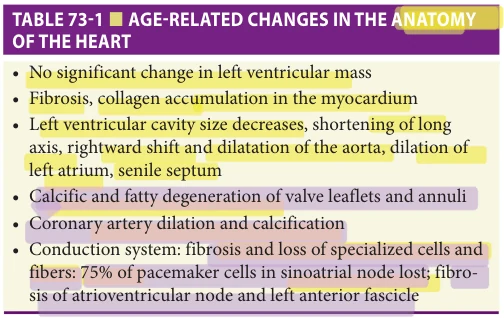

*Table 73-1, printed p. 1116.*

**[p. 1117]**

uncertain since there are approximately 1000 mitochondria per myocyte, and there is evidence of active mitochondrial quality control mechanisms, which may also be altered with age.

Nowhere is cellular dropout more impressive than in the sinoatrial node, decreasing the sinoatrial node volume with age. The number of pacemaker cells is reduced (90% by the age of 70), with most volume replaced by fat. More modest cellular losses occur at the atrioventricular (AV) node, and minimal changes occur in the distal conduction system. The dropout of sinoatrial nodal cells is accompanied by a decrease in the slow, L-type calcium channel critical to the initiation of depolarization. Although the density of the L-type Ca2+ channels does not seem to be affected by age, the function seems to decline: a reduction in Ca2+ transient amplitude and slower channel inactivation has been associated with aging. The sensitivity of the older sinoatrial node to calcium channel blockers appears to increase, as assessed in the older guinea pig pacemaker.

Alterations in myocyte calcium homeostasis and active relaxation Older cardiomyocytes are intrinsically stiffer. In isolated papillary muscles from older rat hearts, a change in the pattern of contraction and relaxation is seen: slower force generation and slower relaxation with no change in peak force. The inotropic and lusitropic (facilitating relaxation) responses to sympathetic stimulation are also decreased with age. Calcium fluxes dictate cardiac contraction and relaxation. For contraction, a small amount of calcium enters the cells via the slow L-type calcium channels stimulating the release of 10- to 20-fold more calcium from the sarcoplasmic reticulum (SR), permitting actin and myosin to generate force. Active relaxation includes the calcium reuptake by the cardiac SR after contraction and extrusion from the cell by the Na-Ca exchanger and the SR Ca-ATPase (SERCA) pump. SERCA hydrolyzes ATP to translocate Ca2+ from the cytosol back into the SR, allowing relaxation of the cardiac muscle. In the young heart, 90% of calcium cycles in and out of SR. Aging reduces the capacity of SR to accumulate, retain Ca2+, and inhibit excitationcontraction coupling in the cardiomyocytes by interfering with the calcium transient. Calcium reuptake into the SR is decreased by almost 50% in old hearts from rats and mice, and the content of SERCA is decreased in old human hearts as well. Concurrently, the old SR has enhanced calcium leak manifested by small spontaneous localized releases called calcium sparks. All these impede cardiac relaxation, perhaps increase diastolic calcium concentrations, and result in smaller Ca stores in the SR for release in the next contraction. To a small extent, compensation occurs in other calcium fluxes in that the SR Ca-ATPase activity is increased in old rat hearts. Gene therapy, increasing the SR Ca-ATPase, has improved the function of old rat hearts.

Connective tissue fibrosis and scarring Age-related cardiac fibrosis reflects the net result of multiple pathways modulated by natriuretic peptides, neurohormonal drive,

endothelin (ET) effects, reactive oxidation species, inflammation, advanced glycosylation end products, hemodynamics, and other influences, many of which will be subject to polymorphic genetic variation. Diffuse foci of fibrosis are seen microscopically in the myocardium owing to an increase in interstitial collagen, a delicate pattern, unlike the patches of fibrosis seen after acute injuries, such as after myocardial infarction. Age-related fibrosis does not appear to require either ischemia or hypertension, although both disorders accelerate the process. Quantitatively, collagen content approximately doubles in the old heart as measured by magnetic resonance imaging (MRI). The collagenous weave is thicker and more cross-linked, conferring greater rigidity to the myocardium. Aging may produce a shift in the balance between matrix metalloproteinases (MMPs) and tissue inhibitors of MMPs that ultimately translates into increased matrix accumulation. Increased age-related fibrosis has been found in the cardiac conduction system (the SA node, the AV node, the His bundle, and the left bundle branch) and left ventricular (LV) tissue. These changes may partly underlie age-related alterations in diastolic filling. In addition, the proliferation of cardiac fibroblasts and collagen deposition in the atria with age will affect the myocardium’s electrophysiological properties. Atrial fibrosis might lower the threshold for the development of atrial arrhythmias.

The association between healthy aging and myocardial fibrosis has been a matter of debate. In a small study, 32 healthy volunteers underwent cardiac MRI-based assessment of myocardial extracellular volume (ECV); older age was associated with greater myocardial fibrosis. These observations are consistent with animal studies by MRI and histological assessments. However, these findings have not been seen uniformly. In a subset of 314 healthy individuals from the Multiethnic Study of Atherosclerosis (MESA) cohort, the degree of myocardial fibrosis, as assessed by ECV, and myocardial scar burden, was not associated with aging.

Senile amyloid deposition Another histopathological change found in cardiac tissue of older adults is amyloid deposition. Senile cardiac amyloid deposition is seen to varying degrees in the majority of hearts from persons older than 90 years with a prevalence greater than 90% but is uncommon before age 60. It is easily recognized at autopsy, particularly along the left atrial (LA) endocardium. Its physiologic and clinical significance are incompletely understood, but it might contribute to LV diastolic stiffness. In some cases, amyloid deposition occurs at a level that leads to the progressive development of heart failure (HF). This infiltrative cardiomyopathy is defined as systemic senile amyloidosis (SSA). SSA is far less common than atrium-restricted amyloidosis.

Epicardial adiposity and intramyocardial fat deposition Aging affects all organ systems and alters body composition. Typically, fat mass increases with age and peaks at age 60 to 75 years. With aging, adipose deposits, particularly in

**[p. 1118]**

the right ventricular (RV) epicardium and the AV groove. This is most pronounced in women and the obese. These observations at autopsy correlate with the increase in epicardial and pericardial fat stripes that superficially mimic pericardial effusion on echocardiography. In the Framingham Heart Study (FHS), the incidence and size of clear echocardiographic spaces (fat stripes) in the pericardium increased with age in both posterior and anterior regions. The increase in adipocytes may reflect a loss of control of differentiation of resident stem cells. Emerging data suggest that this adipose may impair cardiac function—the cells are metabolically and hormonally active and can generate various factors, including cytokines. Increased pericardial fat has been associated with atherosclerosis and coronary calcification, risk of atrial fibrillation (AF), and HF, particularly HF with preserved ejection fraction (HFpEF).

Besides epicardial fat deposition, myocardial triglyceride content increases with aging, which is further accentuated by comorbidities such as diabetes and obesity. Aging-associated increase in myocardial triglyceride content may be related to reduced fatty acid oxidation in the aging heart. As noted in older individuals, greater myocardial triglyceride content is associated with increased fatty acid intermediates in the myocytes that alter myocardial structure and function and lead to myocardial lipotoxicity and increased cardiomyocyte apoptosis. Clinically, this may manifest as impaired myocardial relaxation, reduced cardiac exercise reserve, and increased risk of HFpEF.

Neurohormonal signaling The two main pathways are the renin-angiotensin-aldosterone system (RAAS) and βadrenergic signaling. RAAS plays an important role in regulating blood volume and systemic resistance. Several studies have revealed similarities between angiotensin II–treated heart and the aging heart, suggesting that angiotensin II may play a role in cardiac aging. These similarities consisted of the development of cardiac hypertrophy, fibrosis, and diastolic dysfunction. Neurohormonal signaling also involves β-adrenergic receptors. These receptors regulate heart rate, myocardial contractility, and ventricular structural remodeling after stimulation by catecholamines. With aging, circulating catecholamine levels increase, leading to uncoupling of β-adrenergic receptors from their effector, adenylyl cyclase. This explains the reduced β-adrenergic responsivity observed with age.

## Changes in Cardiac Structure

Left ventricular mass Seminal autopsy studies from subjects aged 20 to 99 without a history of hypertension or coronary atherosclerosis demonstrated that mean heart weight indexed to body surface area was not associated with age in men but increased with age in women. The interaction between age and gender has also been confirmed in other autopsy studies using 2D-guided M-mode echocardiographic measurements of LV mass and in the Cardiovascular Health Study (CHS), an NHLBI-funded population-based, observational cohort study of 5000 older adults. Recent

studies evaluating cross-sectional and longitudinal associations between aging in healthy individuals (without cardiovascular disease [CVD] including hypertension, diabetes, smoking) and LV mass using echocardiographic and cardiac MRI examinations have demonstrated no significant changes in LV mass with aging in men and women, particularly after accounting for body size. Taken together, there are modest effects of age on LV mass, with no change to a slight reduction in LV mass noted with aging, particularly in middle-aged or older individuals.

Left ventricular and atrial size Changes in LV cavity size with aging have been a matter of debate, with some crosssectional studies demonstrating a decrease in LV internal diameter in systole and diastole with aging while others showing no change to an increase. Cross-sectional analyses from the Baltimore Longitudinal Study of Aging (BLSA) using MUGA scan-based LV size assessment suggested increasing LV end-diastolic volume with aging in men but not women. However, these observations have not been confirmed in other studies, and a decline in the LV end-diastolic volume with aging has been demonstrated in a cohort of 104 healthy volunteers who were rigorously screened to exclude prevalent CVD. Larger cohort studies using cardiac MRI or echo-based assessment of LV parameters demonstrated a decline in LV end-diastolic volume with aging in cross-sectional as well as longitudinal analysis with repeated follow-up assessments.

Most echocardiographic and autopsy studies have found a significant age-related increase in LA size in subjects without apparent CVD, with an increase in LA dimension between ages 30 and 70. However, frankly increased LA volume before age 70 may reflect disease, whereas after age 70, increased LA volume can occur from aging alone. The mechanisms of this age-related increase in LA volume are unknown but may be related to the age-related alterations in diastolic LV function. Serial echocardiographic measurements of LA size in humans have indicated that age and disease have additive effects on increases in LA size over time. Some have suggested an assessment of LA size to evaluate the presence of HFpEF. However, this is likely confounded by the effects of aging alone. While LA size appears to reflect chronic elevations in LV end-diastolic pressures, it does not discriminate whether this is due to systolic or diastolic dysfunction or restriction from pericardial or infiltrative processes. Therefore, LA volume may not be helpful in discriminating between the types of cardiac dysfunction that cause the elevations in pressure or volume. However, age-related LA dilation likely has consequences for specific disorders common in older adults, such as AF. Further, in population-based cohorts, LA size is significantly associated with the age-adjusted risk for stroke and death in both sexes.

Left ventricular wall thickness and geometry In the large autopsy study described earlier, RV and LV free wall thicknesses remained relatively constant with age, while

**[p. 1119]**

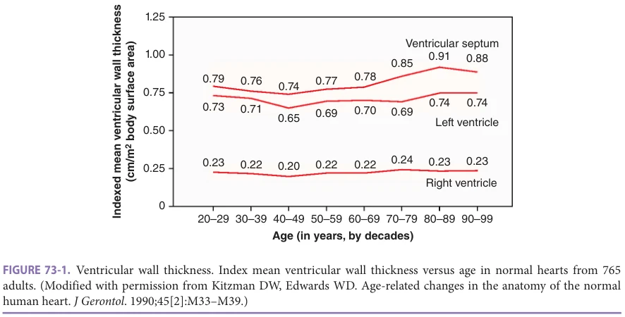

*Figure 73-1, printed p. 1119.*

ventricular septal thickness increased with age for both men and women, as shown in Figure 73-1. Wall thickness measurements at autopsy may not correlate well with those made in living individuals when measurements can be made in systole and diastole. However, most echocardiographic studies of healthy subjects confirmed autopsybased findings showing mild age-related increases in ventricular septal and LV free wall thickness in women and men.

A frequent finding at autopsy and on echocardiograms of persons without apparent heart disease is the mild disproportionate thickening of the basal ventricular septum. This has been called sigmoid ventricular septum and senile septum and can confound to some degree the diagnosis of hypertrophic cardiomyopathy in older patients. The septal thickening may reflect hypertension rather than biological aging.

Due to increasing LV mass and free wall thickness and shrinking LV size, prior studies among healthy individuals demonstrated increasing relative wall thickness concentricity (mass/volume ratio) with aging. In more recent studies with MRI-based assessments, changes in relative wall thickness with aging have been less uniformly described. In a cross-sectional analysis from healthy individuals from MESA, the mass/volume ratio increased with aging in women but not men. In healthy individuals from the FHS, MRI-relative wall thickness did not increase with age in cross-sectional analysis. Among healthy Coronary Artery Risk Development in Young Adults (CARDIA) study participants, longitudinal echocardiographic assessment in young adulthood and middle age (20 years apart) did not show significant increases in relative wall thickness. These data suggest age-related changes relative to wall thickness are modest and may occur after middle age.

Valves The cardiac valves undergo several age-related changes. When measured at autopsy, the thicknesses of normal aortic and mitral leaflets increase, particularly

along the closure margins. This is associated microscopically with collagen deposition and degeneration, lipid accumulation, and focal dystrophic calcification in the leaflets and annuli.

In those subjects most affected, this is recognized clinically and echocardiographically as aortic valve sclerosis, valve thickening without significant hemodynamic dysfunction. In the CHS, aortic sclerosis was found in 26% of participants, associated with male gender and hypertension. The relationship between age-related degenerative changes and the development of clinical aortic stenosis is incompletely defined, but aortic sclerosis is independently associated with a 1.5-fold increased risk of cardiovascular mortality, calling into serious question whether this should be considered a normal age-related change.

Age-related degenerative calcification of an otherwise normal-appearing tricuspid aortic valve may result in progressive aortic stenosis, the most common cause of aortic stenosis requiring valve replacement. The relationship between near-universal age-related thickening and mild calcification of the aortic valve leaflets and the development of degenerative calcific aortic stenosis is unclear, but the lack of efficacy of statins in modifying this natural history suggests that typical atherosclerosis is unlikely to be the driver.

The mitral annulus develops microscopic calcium deposits with aging, but gross mitral annular calcification is likely a disease process. Relatively little is known about the pathophysiology or natural history of mitral annular calcification. It is present in up to 40% of hearts from women older than 90 years with a large (4 to 1) female predominance. It is often associated with AV block and bundle branch block and modest mitral regurgitation but rarely with significant mitral stenosis.

The circumferences of all four cardiac valves, measured at autopsy, increase with age in normal hearts from

**[p. 1120]**

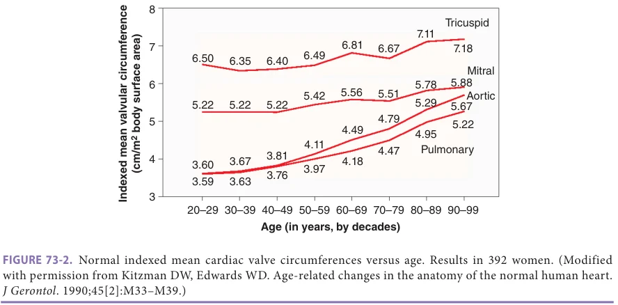

*Figure 73-2, printed p. 1120.*

women (Figure 73-2) and men and are associated with collagen degeneration and lipid accumulation in the valve annuli. This is most notable for the semilunar (aortic and pulmonary) valves than the AV (mitral and tricuspid) valves. In the case of the aortic annulus, this normal agerelated dilatation has been confirmed in living subjects with echocardiography.

Annular dilatation likely contributes to the agerelated increase in valvular regurgitation documented in healthy, normal, asymptomatic subjects. By the age of 80, 90% of apparently healthy subjects had multivalvular regurgitation; the aortic valve was affected earliest and to the greatest extent. The degree of valvular regurgitation caused by normal aging is always trivial or mild, central, and associated with normal (for age)-appearing leaflets. Age is the strongest risk factor for isolated severe aortic regurgitation. The idiopathic dilatation of the aortic annulus is the most common cause of aortic regurgitation in patients undergoing aortic valve surgery. This disease may exaggerate the age-related degenerative change with additional contributing factors as yet unidentified.

Pericardium Wavy bands of collagen bundles comprise the normal pericardium. The straightening of these wavy bands allows a degree of distensibility when pericardial pressure or volume increases acutely. With aging, these collagen bands become straighter, and the pericardium becomes thicker, and the pericardium of older subjects becomes stiffer. The significance of this is unknown, but it could impact diastolic compliance in older adults. As discussed earlier, the degree of epicardial and pericardial fat increases with age, particularly in women and obese persons.

Atrial septum The atrial septum thickens and becomes stiffer with age, probably owing to fatty infiltration and fibrosis. The atrial septum becomes less mobile with phasic respiration. If on echocardiography, a thin, hypermobile atrial septum is seen in an older person, then an atrial septal aneurysm (which often is accompanied by fenestrations),

patent foramen ovale, or atrial septal defect should be suspected and prompt further evaluation with color Doppler and peripheral venous injection of agitated saline contrast.

An exaggerated form of the age-related fatty infiltration of the atrial septum is found almost exclusively in older adults and is called lipomatous hypertrophy. It can mimic an intracardiac tumor but is recognizable by its characteristic dumbbell shape.

A patent foramen ovale is seen in approximately 35% of normal hearts younger than 30 years and in 20% at age 80. The lower prevalence of patent foramen ovale is accompanied by increased patent foramen ovale size in older individuals. While paradoxical embolism is usually considered when an atypical stroke occurs in a person younger than 55 years, it can contribute to strokes among older adults. Because of this, injection of venous-agitated saline contrast is often used as an adjunct to echocardiographic imaging even in older patients referred with atypical stroke.

Coronary arteries With aging, the coronary arteries become more dilated and tortuous, possibly because of hemodynamic drag. Coronary collaterals may increase in number and size with age, but this may reflect atherosclerosis. While atherosclerosis is a disease process, Mönckeberg medial calcification (arteriosclerosis) probably represents an age-related degenerative process. It is nearly universally found in the very old independent of gender. In the peripheral vasculature, it contributes to the age-related elevation in systolic blood pressure and arterial stiffening. Often seen in older patients and those with end-stage renal failure is the triad of cardiac calcifications (aortic cusps, mitral annulus, and coronary arteries), called the senile calcification syndrome. In these older persons, calcium metabolism is unaltered and, although a relationship with elevated serum cholesterol levels has been described, the etiology is unknown. These age-related changes could contribute to the loss of specificity of coronary calcium score in persons older than 75 years.

**[p. 1121]**

Overall Appearance A characteristic geometric configuration is imparted to the older heart by these age-related changes, particularly those observed in the cardiac chambers: shortening of the longaxis dimension, a mild decrease in the internal systolic and diastolic LV cavity dimensions, dilatation, and rightward shifting of the aortic root, and dilatation of the left atrium as shown in Figure 73-3. These changes, plus mild regional calcification in the aortic and mitral valve annuli, are so characteristic that they serve as clues to help detect the age group of patients during blinded echocardiogram readings.

Changes in Cardiac Function with Age at Rest Since there are significant changes in the anatomy of the cardiovascular system, one would expect alterations in cardiac physiology as well. Several important age-related

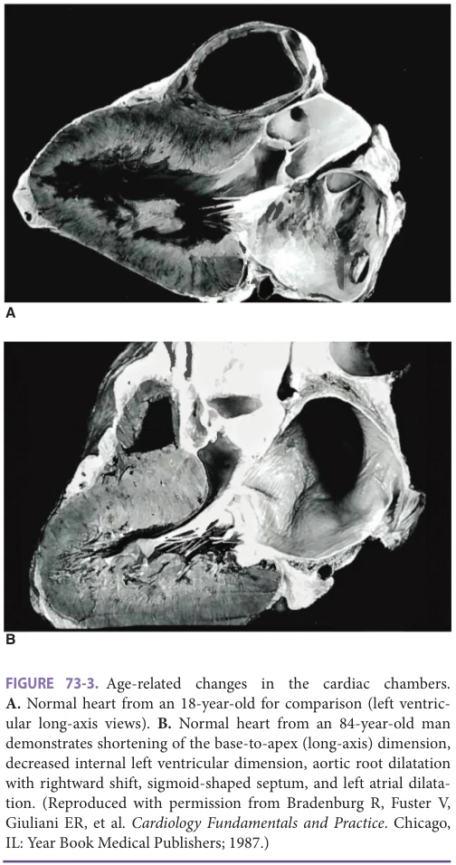

*Figure 73-3, printed p. 1121.*

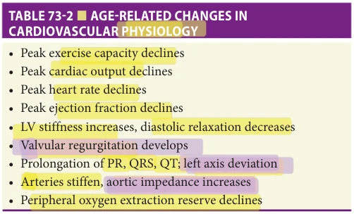

*Table 73-2, printed p. 1121.*

changes have already been discussed briefly earlier, including changes in valvular function and the potential anatomic substrates for impaired diastolic function. While the effect of age on cardiac function has long been a research topic, only recently have studies been performed using adequately robust techniques combined with appropriately screened reference populations. However, it is still true that little information is available regarding how these changes in function impact the epidemiology, presentation, diagnosis, prognosis, and therapy of CVD. Changes with age in cardiovascular function are summarized in Table 73-2.

Most earlier studies of cardiovascular function at rest show either no substantial change in cardiac output, stroke volume, heart rate, and ejection fraction with aging or mild-to-moderate and significant increases in systemic and pulmonary arterial blood pressure, with resultant increases in left and right ventricular afterload. However, in a cohort of healthy, well-screened individuals who underwent detailed resting and exercise hemodynamic and radionuclide assessment of LV volumes, there was a significant cross-sectional association between older age and smaller LV size, higher LV filling pressure, and lower stroke volume at rest, suggesting alterations in Frank-Starling mechanisms.

Heart rate and rhythm There is no change in resting heart rate with healthy adult aging (Figure 73-4). However, as will be discussed in the section on exercise, there is a clear and marked decrease in maximum heart rate in response to exercise that is highly predictable and can easily be estimated by a simple equation. For healthy adults, the equation (208 – [0.7 × age]) predicts the maximum heart rate for exercise testing.

The age-related change in maximum heart rate is perhaps the most substantial change in cardiac function, both in magnitude and in consequence. Although its mechanism(s) are not fully understood, several studies have been performed. In the presence of the β-adrenergic antagonist, propranolol, and the parasympathetic antagonist, atropine, ablating both sympathetic and parasympathetic input to the heart, the intrinsic heart rate is seen. Intrinsic heart rate decreases by 5 to 6 beats/min each decade of age so that the resting heart rate in an 80 years old is not much slower than the intrinsic heart rate. At rest, the parasympathetic

**[p. 1122]**

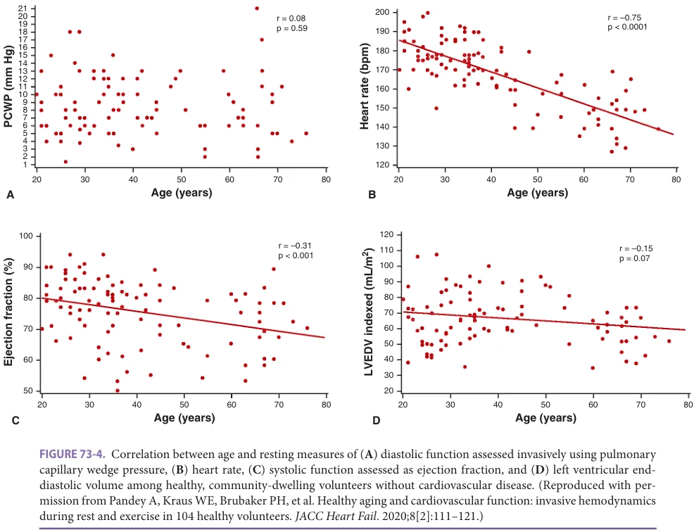

*Figure 73-4, printed p. 1122.*

nervous system is minimally slowing the heart. As would be expected, the increase in heart rate after atropine is less in older adults than the young.

There is also decreased response to sympathetic agonists. Administration of sympathomimetic agents to healthy young and old adults demonstrated chronotropic effects were attenuated in the old. At doses that increased heart rate by 25 beats/min in young males, heart rate increased only 10 beats/min or less in older adults.

Supporting the decline in maximal heart rate as a primary age-related biological change is that it is not modified by vigorous exercise training; it is not a consequence of reduced physical activity. Also, it does not appear to reflect inadequate sympathetic stimulation, as plasma norepinephrine levels are increased, not decreased, at rest in normal older adults. Further, norepinephrine increases even more with exertion in older than in young persons under similar stress.

Perhaps as a direct reflection of the decreased parasympathetic nervous system input and decreased responsiveness to autonomic input, there is a significant decrease in heart rate variability. Heart rate variability measures the variations in instantaneous heart rate (or RR interval) over time. Loss of variability results in decreased complexity,

which correlates with the decrease in physiologic reserve. Any loss of complexity may then render the older individual less likely to tolerate challenges to their homeostasis. Furthermore, the loss of complexity with age occurs in a number of physiologic systems and is forestalled by interventions like exercise training.

In highly screened older adults, to exclude potential confounding effects of disease, the prevalence of atrial premature beats (APBs) reaches 88% on 24-hour ambulatory monitoring. Because there is no association with cardiac risk over the next decade with the presence of APBs, they are not thought to reflect subclinical coronary artery disease. At exercise testing, isolated ventricular ectopic beats occurred in more than half of highly screened adults older than 80 years. Therefore, the increases in ectopy of both atrial and ventricular origin are considered normal aging processes.

Diastolic function Increased LV stiffness associated with aging using invasive techniques was first described in young and old beagles. Ten years later, similar findings were identified by invasive techniques in humans. The advent of spectral Doppler echocardiography in between these two developments greatly expanded the ability for

**[p. 1123]**

noninvasively assessing LV diastolic filling. All studies, including the large population-based databases from the FHS and the CHS, have uniformly found that diastolic LV filling is substantially altered in older normal adults. In addition, similar changes with aging are found in monkeys, rats, dogs, and mice.

The age-related changes in diastolic LV filling patterns—measured by reduction in early diastolic LA emptying, increased late diastolic emptying from atrial contraction, and increase in isovolumic relaxation time on pulsed Doppler echocardiography—have been confirmed in noninvasive human studies. The echocardiographic indexes of diastolic filling may be altered early in the course of various disorders that are common and sometimes unrecognized in older adults. A number of physiologic variables significantly influence them. Thus, it had been questioned whether the age-related alterations in Doppler diastolic filling indexes were simply secondary to these or whether they occurred independently of CVD and other confounding physiologic variables. However, physiologic studies with invasive and noninvasive hemodynamic assessments in old and young healthy volunteers rigorously screened for CVD have confirmed that an alteration in diastolic LV filling pattern is a primary, biologic effect of aging, intrinsic to the aged human heart, and not explicable by other physiologic and pathologic changes that frequently accompany the aging process.

Since normal healthy older individuals are expected to have an altered Doppler LV filling pattern, what should be considered abnormal? Data from echocardiographic assessments in older healthy adults without CVD included in large community-based cohort studies such as the CHS and FHS have yielded important data informing the normative range for diastolic function parameters in older men and women. Thus, Doppler diastolic filling patterns within this range should be considered normal in patients in this age range. Accordingly, it is preferable to use the term “delayed relaxation” or “normal for age” in clinical descriptions of this finding, rather than the terms “impaired relaxation” or “abnormal relaxation,” which denote abnormality and are inconsistent with aging principles. In addition, findings obtained in older patients during basal conditions that fall outside these ranges should be considered abnormal, regardless of age. Second, the pattern of LV filling is helpful. Certain patterns, such as the pseudonormalized and restrictive patterns can be more easily discerned from normal and can be more specific for disease when found in older than in younger patients because these differ more from the expected pattern. Mitral annulus tissue Doppler has significantly boosted the ability to assess LV diastolic function noninvasively because the annular velocity measures are relatively load-dependent. As would be expected, based on the above study, age alters the tissue Doppler velocities as well. Unfortunately, age-related normative reference data are relatively sparse.

The age-related differences in LV diastolic function and LV compliance have also been assessed by invasive hemodynamic studies. Among healthy, community-dwelling individuals age 20 to 76 well-screened for CVD, a crosssectional assessment demonstrated higher pulmonary capillary wedge pressure and smaller LV size with increasing age suggesting worse diastolic function and alteration in LV relaxation (Figure 73-4). Some studies have attributed the age-related difference in LV diastolic function to greater intrinsic LV stiffness with a slowing in LV relaxation in early middle age and a significant reduction in diastolic LV function after the age of 65. Other studies have questioned the contribution of impairment in LV relaxation toward the age-related decline in LV diastolic function and implicated changes in the LA properties.

Age-related alterations in LV diastolic function are also evidenced by an atrial gallop (S4) physical examination findings in those older than 75 years. An atrial gallop is a manifestation of the increased contribution of LA systole to ventricular filling. The decrease in rapid cardiac relaxation during early diastole results in increased dependence on LA systole in late diastole for adequate LV cardiac filling. However, as things worsen, LA pressures increase, and early filling subsequently increases again. This pseudonormalization of LV filling is another marker that the aging process has tipped over to HF.

The age-related changes in diastolic function can also be modified and improved by exercise behavior and cardiorespiratory fitness levels. In old rats trained on treadmill exercise for 1 to 2 months, SR calcium uptake and cardiac relaxation improved to that seen in young sedentary rats. In mechanistic hemodynamic studies among humans, older individuals with greater lifetime exercise exposure have been shown to have more favorable LV diastolic function than sedentary individuals. Furthermore, recent exercise training studies in human participants have also demonstrated significant improvement in invasive measures of LV diastolic stiffness with intense, long-duration (up to 2 years) exercise training in middle-aged but not older age adults. Humans on caloric restriction diets have better diastolic function than age-matched controls, corroborating experiments in experimental animals. While this approach may not be highly practical, only 5 years of caloric restriction is needed to produce the change. Furthermore, intentional weight loss interventions have also demonstrated significant improvements (~20% reduction) in invasively assessed left-sided filling pressures. Taken together, these findings suggest that the age-related diastolic impairment may be modifiable, particularly, early in the course of the aging process, with lifestyle interventions.

Systolic function In healthy humans, no age-related changes in measurable, overall LV contractility, assessed at rest by the ejection fraction, fractional shortening, or mean velocity of circumferential fiber shortening, have been reported. (Figure 73-4). Wall motion abnormalities should not be

**[p. 1124]**

considered normal, even in very old adults. In the CHS, the prevalence of unexpected wall motion abnormalities, in the absence of history and symptoms of coronary heart disease, was 0.4% in women and 0.5% in men.

The contraction and relaxation of the older LV are not uniform. In older people, segments of the heart have started to relax while others are still contracting. As LV pressure must be low before filling can start, this prolonged contraction shortens the time available for filling to occur.

Aging alters several Doppler measures of aortic outflow. Aortic peak flow velocity, time-velocity integral, and acceleration are reduced with advancing age. While these hemodynamic factors relate to LV systolic performance, they are also substantially affected by afterload, which increases with aging.

Right ventricular structure and function Autopsy studies of the RV have demonstrated a progressive loss of myocytes and increased myocyte volume per nuclei suggestive of cellular hypertrophy with increasing age. However, the magnitude of cellular hypertrophy is insufficient to make up for the loss of RV mass, which declines significantly with aging. In human cohort studies, cross-sectional comparison of echocardiographic RV parameters across different age groups of healthy individuals, aging was associated with

lower RV longitudinal systolic function as measured by the tricuspid annular plane systolic excursion. RV ejection fraction is relatively preserved with aging. Furthermore, studies have also demonstrated a decline in RV relaxation and increased right atrial pressure, as assessed by echocardiography, with aging. Doppler indices, reflective of flow pattern, demonstrate a reduced early RV diastolic filling, increased late filling, and reduced myocardial diastolic velocities. The abnormalities in RV systolic and diastolic function with aging have been attributed to increasing pulmonary artery pressure and RV afterload with aging, mostly secondary to increased pulmonary arterial stiffness and vascular resistance in the pulmonary vasculature. No significant differences in RV size were noted with aging in cross-sectional echocardiographic assessments.

Implications of the Age-Related Changes in Resting Cardiovascular Function Aging is associated with a decline in resting oxygen uptake driven by decreases in cardiac output. The decline in cardiac output is related to the reduction in stroke volume. The resting peripheral oxygen extraction has been shown to increase with aging; however, its clinical significance is not well established (Figure 73-5).

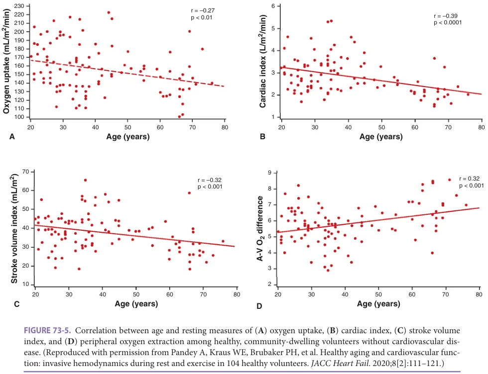

*Figure 73-5, printed p. 1124.*

**[p. 1125]**

Aging decreases one’s ability to tolerate challenges to homeostasis. This is most evident in the cardiovascular system. For example, the mortality and probability of developing HF after a myocardial infarction increase dramatically with age. While clearly, the pathogenesis of atherosclerosis and the myocardial infarction itself is not normal aging, the response to the systemic challenges produced by the infarction may well be impaired because of the aging process. Consistent with this, there is an age-related increase in mortality after experimental infarction in mice and rats. We suggest that homeostenosis, the depletion of reserves, may be the cost of invoking compensatory mechanisms to maintain homeostasis.

Similarly, acute hypertension is poorly tolerated in the old. Old (18 months) and adult (9 months) rats had afterload increased by constriction of the aorta. Immediate early response gene signals were attenuated in the old rats. Decreased skeletal actin expression after pressure overload was present, and skeletal actin expression precedes cardiac actin expression in most hypertrophy models. Atrial natriuretic peptide (ANP) stimulates the excretion of water and sodium by the kidney. The atria only express ANP in normal young hearts, but ANP is a marker of stress and compensation when seen in the ventricles. ANP is elevated in the ventricles at baseline in the old rat and could not be further stimulated after additional stress. This suggested that the hypertrophy response was already invoked as part of aging in the older rats and was less available to respond to acute stress.

While the normal heart is unlikely to ever be exposed to ischemia, ischemic preconditioning is an adaptation of the young heart that is not present in the old heart. If repeatedly exposed to brief episodes of ischemia, young hearts tolerate longer episodes well with less resultant damage by increasing heat-shock protein levels, opening ATPgated potassium channels, stimulating the tumor necrosis factor-alpha (TNF-α) cascade, and activating antioxidant enzymes. Old hearts cannot make this adaptation, perhaps contributing to the increased mortality after myocardial infarct in the old. However, exercise training, caloric restriction, and certain growth factors may restore this adaptive capability.

The responsiveness is decreased to some cardioactive drugs, including atropine, dobutamine, and other βadrenergic active agents, as noted above. These agents may require higher doses to reach a desired effect in the old. HF becomes increasingly common, reaching a prevalence of more than 10% and being the most common reason for hospitalization of Medicare beneficiaries. The syndrome of HFpEF, the most common form among older persons, is likely facilitated by the above- and below-discussed agerelated changes in diastolic function, myocardial composition, and vasculature added to the arterial and myocardial changes caused by hypertension and other diseases. Findings from large epidemiological cohort studies have shown that risk of HFpEF increases with age.

Furthermore, age-related decline in exercise capacity and diastolic function are important predictors of HFpEF development. Age-related changes in vessels and the heart do not by themselves produce disease, but because of the changes in compliance, systolic hypertension is common. Finally, these changes make the old cardiovascular system more prone to decompensation in response to other insults.

Effect of Age on the Cardiovascular Response During Exercise If aging affects cardiovascular performance even at rest or with moderate stress, one would expect this to be magnified and become even more apparent during exercise. This is indeed the case. Exercise capacity can be quantified objectively by measurement of maximal oxygen consumption (VO2max) during exercise. It is solidly established that a reduction in VO2max inescapably accompanies normal aging. While the age at which this decline begins is unclear, it is probably variable and begins early in adult life. The reduction in VO2max is independent of gender and changes in body size. The magnitude of the decline is approximately 3% to 8% per decade, the rate of decline increasing with each decade and can be modified but not wholly halted or reversed by exercise training.

Initial studies from the BLSA in the 1980s had suggested a relatively small (~3%) decline in VO2max with aging attributed largely to loss of muscle mass with a modest decline in exercise cardiac function. However, these findings were at substantial variance with other studies. At the time, the difference compared with prior studies was attributed to rigorous screening. A subsequent report from the BLSA in 2005, which examined a large number of subjects, both sedentary and well-conditioned by training, during 8 years of follow-up, thereby providing true longitudinal rather than cross-sectional data, showed that, in actuality, the decline in exercise capacity (VO2max) among older persons was more accelerated and greater in magnitude than all previous estimates, with the rate of decline accelerating from 3% to 6% per decade till 40 years of age to more than 20% per 10 years among those older than 70 years. In addition, another subsequent report from the BLSA in 1995 showed that, in contrast to the original study in 1984, both men and women do indeed have substantial agerelated declines in maximal exercise cardiac output, accompanying and contributing to a 40% decline in VO2max. Similarly, in a recently reported study of 104 healthy, community-dwelling individuals aged 20 to 76 years who were rigorously screened for subclinical or clinical CVD, a 40% decline in VO2max was observed across the six decades. This is in accord with reports from all other studies. Thus, there is now uniform agreement that aging, even in the absence of any identifiable disease, is associated with substantial declines in overall cardiovascular performance and reserve capacity, including maximal cardiac output (Figure 73-6).

**[p. 1126]**

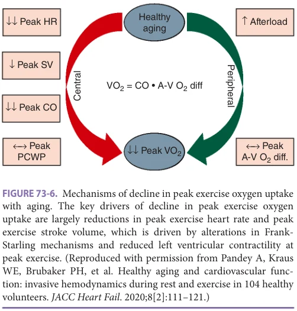

*Figure 73-6, printed p. 1126.*

By the Fick principle for oxygen, only a limited number of factors could be responsible for a decline in VO2max. The following equations are pertinent to this discussion:

VO2 = cardiac output × arteriovenous oxygen (A-VO2 diff) difference

Cardiac output = stroke volume × heart rate

Stroke volume = end-diastolic volume – end-systolic volume

The A-VO2 is determined by a number of noncardiac factors, including peripheral vascular and skeletal muscle mass and metabolic function. Thus, if VO2max declines with aging, there must be a decline in peak cardiac output or A-VO2 or both during exercise.

Measurement of cardiac output in healthy human subjects during exercise is challenging methodologically. Investigators have used various techniques, including direct Fick (probably the most reliable), dye dilution, equilibriumgated radionuclide angiography, and gas rebreathing. Each of these methods uses multiple variables to derive the cardiac output measurement. Direct measurement of A-VO2 by oximetry, however, is quite accurate and reliable. Most investigators who have measured A-VO2 during maximal exercise have documented no difference or increased A-VO2 in older compared with young subjects. By simple algebra, this suggests that the age-related decline in VO2max must be because of reduced cardiac output. This has, indeed, been the finding reported by virtually all investigators. Accordingly, a decrease in the inotropic (contractility), chronotropic (heart rate), and as well as lusitropic (diastolic function) responses to dobutamine/exercise may all have a potential role in the age-related decline of VO2max (Table 73-3).

The age-related decline in VO2max appears to be driven primarily by reduced exercise cardiac output, stroke volume, and heart rate among older versus younger individuals, as shown in Figure 73-7. Specifically, the reduction in peak exercise stroke volume was most notable among individuals who were 60 years and older. Other studies using the direct Fick technique, dye dilution, or acetylene rebreathing to assess cardiac output have also demonstrated a decline in maximal cardiac output with aging. The primary mechanism of the age-related decline in exercise cardiac output is the age-related reduction in maximal heart rate. Reduced maximal exercise heart rate appears to be a universal observation and meets the basic biological aging phenomenon criteria. Future studies are needed to understand better the biological mechanisms underlying the age-related decline in maximal heart rate.

Although reduced maximal heart rate is the primary mechanism for reduced exercise cardiac output and oxygen

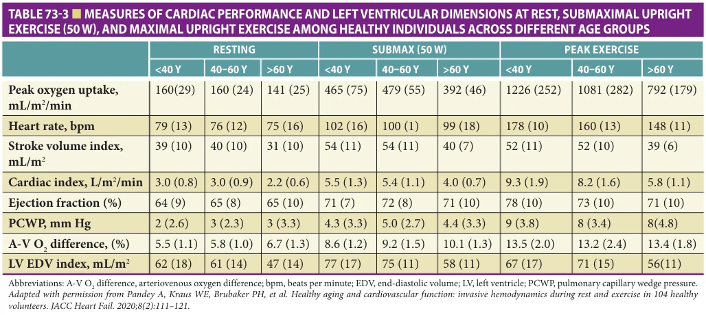

*Table 73-3, printed p. 1126.*

**[p. 1127]**

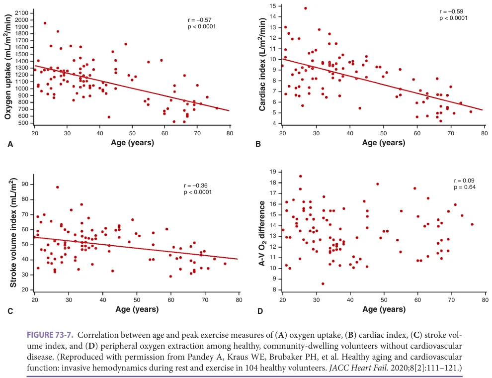

*Figure 73-7, printed p. 1127.*

consumption in older subjects, younger subjects in whom exercise heart rate is limited, either by congenital complete heart block or by a β-adrenergic blockade, stroke volume is increased and partially compensates for the reduced heart rate via the Frank-Starling response (increased enddiastolic volume). The effect of aging on the FrankStarling mechanism and maximal stroke volume response to exercise depends on the age range examined. Specifically, studies limited to younger and middle-aged individuals (< 50 years) have failed to appreciate a significant decline in maximal exercise stroke volume with aging. The most recent and largest study of aging effects studied invasively in 104 well-screened, health healthy men and women reported by Kitzman and colleagues; there was a modest continuous decline in Frank-Starling from age 30 to age 80 (the oldest age studied), demonstrated by lower invasively measured end-diastolic and stroke volumes, lower LV ejection fraction, a trend toward higher pulmonary capillary wedge pressure during exhaustive upright exercise in the old (Figure 73-8).

Furthermore, the decline in end-diastolic and stroke volumes and ejection fraction were noted at both submaximal and maximal exercise levels with aging highlighting a consistent alteration in the Frank-Starling mechanisms in response to exercise (Figure 73-9). A lower exercise stroke

volume in older adults could be because of higher endsystolic volume or lower end-diastolic volume. LV endsystolic volume was higher, and ejection fraction was lower at peak exercise in the older subjects in most studies in which these were measured. Thus, systolic LV function reserve is reduced with aging as well. Reduced stroke volume could also result partially from increased afterload since systolic blood pressure, aortic impedance, and systemic vascular resistance are higher during exercise in old than in young, healthy subjects. When afterload is taken into account, maximal stroke work is fairly similar in young and old subjects.

When evaluating older patients for coronary heart disease, it should be recognized that in healthy older people, the LV ejection fraction does not increase as much from rest to peak exercise as it does in young, healthy subjects. In fact, a flat response in older men and a mild decline in older women should be considered normal. However, the development of wall motion abnormalities should be considered abnormal, even in the presence of a mild nonspecific decline in ejection fraction.

There has been less information regarding peripheral cardiovascular function with aging, including systemic arterial function, which is required to deliver oxygenated

**[p. 1128]**

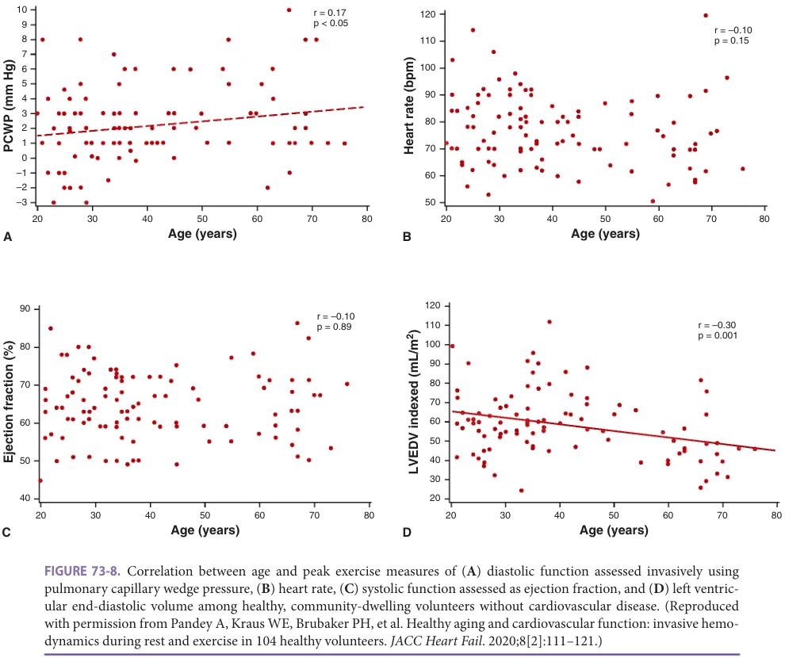

*Figure 73-8, printed p. 1128.*

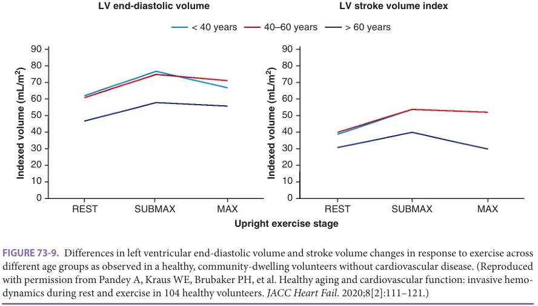

*Figure 73-9, printed p. 1128.*

**[p. 1129]**

blood to working muscle efficiently and working muscle itself. Some studies have demonstrated a decline in exercise A-VO2 with aging, while others have failed to observe this association. An invasive hemodynamic characterization of 104 healthy individuals at rest and peak exercise did not observe a significant association between A-VO2 at peak exercise and age (Figure 73-7). However, a significant inverse association between age and A-VO2 reserve (change from resting to peak exercise) with a smaller absolute increase in A-VO2 from rest to peak exercise in older versus younger individuals was reported suggesting that reduced peripheral oxygen extraction ability in older age may contribute, to some degree, to the age-related decline in VO2max (Table 73-3). In an invasive hemodynamic study of old and young individuals without CVD, Beere et al. demonstrated that in addition to reduced peak exercise cardiac output, older men had reduced exercise leg blood flow. The study also repeated the detailed measurements of central and peripheral cardiovascular functions following exercise training. Their results confirmed the findings of a number of previous investigators that exercise training could improve VO2max by 15% or more and thereby “reverse” some of the age-related declines in physical work capacity. Furthermore, they found that the primary mechanism of improvement in exercise capacity following training in older subjects was a large improvement in leg arterial blood flow.

Skeletal muscle function is another potential contributor to the age-related reduction in VO2max. There is

a decline in skeletal muscle mass and increased fatty infiltration, a shift in fiber type, and variable alterations in mitochondrial density and function with aging. Each of these could contribute to reduced exercise capacity in older persons.

## AGING OF THE VASCULATURE

Age-Related Changes in Arterial Structure With age, a number of changes occur in the aorta, and all appear to contribute to increased stiffness (see Table 73-4). Elastin becomes fragmented in the internal elastic lamina and media, perhaps because of inappropriate activation of MMPs. The MMPs may also liberate proinflammatory signals such as NFκB. Calcification of the media is also seen. Collagen content increases and becomes increasingly cross-linked, making a stiff matrix, especially in the subendothelium.

Irregularities in size and shape of endothelial cells are seen at areas of turbulence, and high cellular turnover occurring at those sites suggests replicative or cellular senescence may occur at those sites. Further evidence of this “in situ” replicative senescence may be provided by manipulations that inhibit telomere shortening. In endothelial cells with persistently long telomeres, age-associated abnormalities may be significantly reduced. In contrast, senescent endothelial cells have upregulated adhesion molecules, proinflammatory cytokines, and decreased NO production. Senescence of endothelial progenitor cells is

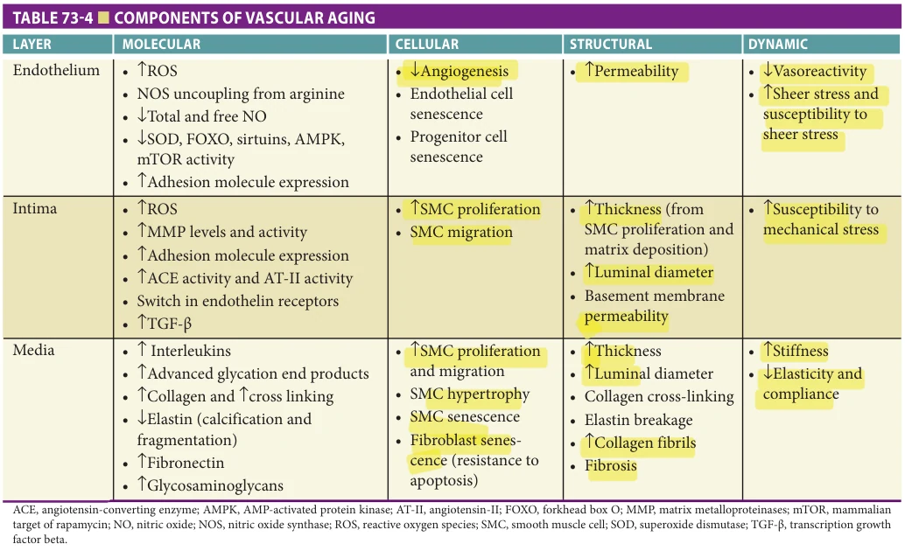

*Table 73-4, printed p. 1129.*

**[p. 1130]**

associated with decreased angiogenesis and impairment of the complex vascular repair system intended to attenuate the chronic vascular injury and inflammation that may lead to atherosclerosis. In contrast to the endothelial senescence, pulsatile stretch stimulates vascular smooth muscle cell (SMC) proliferation and hypertrophy; SMCs may become increasingly polyploid with multiple sets of chromosomes. The proliferative SMCs may migrate from the media to the subintima.

Functional Changes of Aging Arteries Multiple functional changes occur with aging in conduit arteries. For example, nitric oxide (NO) is a vasorelaxant and contributes to the balance that dictates resting arterial tone. Aortic strips isolated from older animals have higher NO synthase activity but produce less NO. Old aortas will relax appropriately when exposed to direct NO donors (nitroprusside) but are less responsive to agents whose effects are mediated by NO, such as acetylcholine. Similarly, forearm arterial blood flow is increased less in older individuals in response to acetylcholine compared to younger and athletically active older individuals. Flow-mediated dilation (FMD), the increase in artery diameter in response to blood pressure cuff-induced ischemia, is attenuated with age. The decline in endothelium-dependent dilation of conduit arteries is related to vascular dysfunction and occurs later in the aging process than the increase in arterial stiffness. As FMD is essentially NO-dependent and NO is produced from circulating arginine, with age, a relative increase in arginase (a scavenging enzyme that competes for arginine) results in reduced arginine availability for the endothelium. This explains, in part, the relatively poor efficacy of arginine supplementation. As the response to direct-acting agents, like nitroprusside, is unchanged by age, endothelial dysfunction must play a critical role. The integrity of the vessels is also dependent upon the endothelium and is less well maintained. Increased vascular permeability facilitates the transit of immune and inflammatory cells and signaling molecules into the vessel wall that stimulate MMP activity and, perhaps, atherosclerosis.

Tonically contracted arteries are partially due to an age-related increase in vasoconstricting (ETA) and loss of vasodilating (ETB) receptors for endothelin-1 and increased circulating levels of this potent vasoconstrictor. This results in a decreased maximum response to added endothelin in older persons. Exercise training appears to decrease basal endothelin-1 levels and restore its responsiveness.

Aging and the Microvasculature The importance of the smallest blood vessels in agerelated disease and dysfunction is increasingly recognized. The number of capillaries per volume of tissue (capillarity) is decreased, with aging in many organs, including skin, skeletal muscle, and brain. This is seen after a middle-age increase in capillarity in some tissues,

perhaps compensation for metabolic demands. Arterioles may play a larger role in oxygen and nutrient delivery in older age as compensation for the decreased capillarity. As arteriolar density is less homogeneous, this leads to disparities in oxygen available to regions of the aged brain and heterogeneous levels of oxygenation, including “hypoxic micropockets” clearly seen in the brains of awake, treadmill walking normal old, but not middle age or young, mice. Alteration in endothelial function is found in the small vessels of the aging brain leading to vascular dysregulation similar to that as described for the arteries, but the added fine vascular regulation of neurovascular coupling is also impaired in aging. The altered endothelial function is one of many age-associated changes that lead to changes in the blood-brain barrier, resulting in selective increases in permeability. These changes have potential implications since they are associated with cognitive dysfunction. A generalized age-related decrease in collateral vessels that lowers the threshold for damage during ischemia is seen in other organs.

Alterations in Angiogenesis with Aging Angiogenesis is impaired in the old vascular tree in response to ischemia or chemical signals. Explants of arteries from old animals have decreased spouting of microvessels and decreased vascular invasion of implants. As noted above, there is no deficit of SMC proliferation, but endothelial cell proliferation is impaired. Endothelial cellular senescence, increased oxidative stress, reduced endothelial NO production, and reduced responsiveness to angiogenic growth factors contribute to lower angiogenesis in older individuals.

Clinical Implications of the Age-related Changes in Vascular Structure and Function The aortic root and lumen diameter increase with age, as do vessel length and wall thickness. Because the aorta is fixed proximally and distally, the increase in length results in the tortuous, ectatic, and rightward-shifted aorta seen often on chest X-rays of older persons. Arterial wall stiffness can be assessed noninvasively as pulse wave velocity (PWV, the rate at which pressure travels in the artery wall), augmentation index (AI-central peak pressure/pulse pressure), distensibility, and systolic and pulse (systolic-diastolic) blood pressure. Aging is an important determinant of large artery stiffness with PWV increases twofold from age 20 to 80, independent of blood pressure. The age-related changes in large artery structure and function have been demonstrated in the absence of clinical CVD and CV risk factors highlighting the direct, more causal association between aging and vascular dysfunction.

A stiffer arterial wall allows pressure to reflect from the periphery to the heart while the aortic valve is still open, increasing the load on the heart. Thus PWV is a physiologically relevant parameter. In younger persons, PWV is relatively low. The reflected wave arrives back to the heart

**[p. 1131]**

after the aortic valve closure, supporting diastolic pressure and improving coronary perfusion without contributing to LV afterload. With aging and arterial stiffening, PWV increases, and the reflected pressure waves are of greater amplitude and arrive back at the heart before aortic valve closure, resulting in increased LV afterload, LV hypertrophy, diastolic dysfunction, relative coronary hypoperfusion, lower diastolic blood pressure, and increased pulse pressure. Augmentation index, a more direct measure of the additive impact of the reflected pressure waves, increases fourfold from 20 to 80, contributing to the increase in systolic pressure that occurs with age. For men in the Framingham study, systolic BP increased 5 mm Hg per decade until the age of 60; then, the slope shifted to 10 mm Hg per decade. For women, systolic BP started lower but shifted to the higher slope earlier. Over the same age range, diastolic BP increases a little and then decreases. Thus the age-related arterial stiffening results in systolic hypertension.

Older athletes have lower systolic pressures and lower PWV than sedentary older adults, but higher than young people. In fact, PWV correlates inversely with maximum oxygen consumption (VO2max) in healthy people across ages. VO2max is strongly associated with measures of vessel stiffness, particularly PWV, suggesting a significant contribution to the age-related decline in exercise capacity via several mechanisms, including increased afterload on the LV and altered peripheral blood flow distribution.

The net result of these changes is reduced compliance and increased impedance, leading to increased systolic blood pressure and little, if any, effect on diastolic blood pressure, such that pulse pressure increases. The aorta and proximal large arteries act as an elastic buffering chamber, storing half the LV stroke volume delivered during systole in young adults and during diastole; the elastic forces of the aortic wall push this volume to the peripheral circulation, thus creating nearly continuous peripheral blood flow. The stiffer large arteries in older adults are less able to smooth out the flow, and thus smaller vessels are exposed to pulsatile flow and pressure. The age-related increases in arterial stiffening likely impact the prevalence and severity of a range of common disorders in older persons, including coronary, cerebrovascular, and peripheral artery disease, systolic hypertension, stroke, HF, particularly HFpEF, cognitive dysfunction, and renal disease.

Arterial stiffness is associated with frailty through CVD, but abnormal arterial structure and physiology may be independently associated with frailty. Crosssectional studies show that markers of arterial stiffening are associated with frailty, as measured by both the Fried and Rockwood criteria. Increased PWV was associated with sarcopenia and slow gait speed as well.

As noted above, lifelong athletes have lower arterial stiffness than sedentary controls. Training for a marathon with thrice-weekly long runs resulted in lower arterial stiffness and modest blood pressure changes. This suggests that

the aging changes may be reduced with aggressive exercise. Furthermore, novel therapies such as Alagebrium, a prototypical advanced glycosylation end-product collagen cross-link breaker, have effectively decreased PWV and augmentation index in older primates and people, highlighting this potential role in ameliorating age-related arterial stiffness. Pharmacologic therapies that reduce diastolic blood pressure appear able to arterial stiffness. While this may decrease the passive stretch when arterial stiffness is measured, studies focused on arterial stiffness showed no effect of classic anti-hypertensive drugs on PWV. RAAS antagonists reduce arterial collagen deposition. Reninangiotensin blockers inhibit the expression of proinflammatory mediators and attenuate adverse vascular remodeling, but definitive studies in normotensive older people are not available.

## SUMMARY

Normal aging is accompanied by substantial alterations in the anatomy and physiology of the heart and vasculature. There are declines in most cardiovascular function aspects, including cardiac output and blood flow distribution, and oxygen utilization, which create significantly reduced reserve capacity, which becomes more apparent during exercise and stress.

The age-related alterations in the anatomy and physiology of the heart likely have varying degrees of significance. Some may not have functional significance and are essentially epiphenomena of aging. Others, such as aortic sclerosis, ventricular septal thickening, and attenuated cardiac function response during exercise, may simulate disease. Some findings associated with age and are prevalent in older hearts, such as senile amyloid and calcified mitral annulus, are likely part of disease processes rather than aging.

Vascular aging also plays a critical role in the aging of the cardiovascular system, increasing the load on the heart and altering the perfusion of the target organs. While aging is a separate process from atherosclerosis, aging increases the risk of the development of atherosclerosis. The primary research focus has been large artery changes, but agerelated alterations in the microvasculature may be just as important.

With the currently available information, it is not always possible to distinguish the effects of aging from the effects of the disease, particularly in very old persons. However, it is reasonable to propose that many of the age-related changes discussed may lower the threshold for clinical disease and, thus, predispose to a variety of cardiovascular disorders in older adults, including HF, hypertensive hypertrophic cardiomyopathy, valvular stenosis and regurgitation, systolic hypertension, supraventricular arrhythmias, and conduction disturbances. Awareness of these age-related changes and the principles of aging biology,

**[p. 1132]**

in general, will help investigators avoid potential errors in research study design or interpretation and help clinicians tailor intelligent treatments to older adults. Since many of these age-related declines in cardiovascular and exercise performance are modifiable and have been shown to be

## FURTHER READING

Cieslik KA, Trial J, Entman ML. Defective myofibroblast

formation from mesenchymal stem cells in the aging murine heart rescue by activation of the AMPK pathway. Am J Pathol. 2011;179:1792–806. DeSouza CA, Shapiro LF, Clevenger CM, et al. Regular aero-

bic exercise prevents and restores age-related declines in endothelium-dependent vasodilation in healthy men. Circulation. 2000;102(12):1351–1357. Hermeling E, Hoeks AP, Winkens MH, et al. Non-invasive

assessment of arterial stiffness should discriminate between systolic and diastolic pressure ranges. Hypertension. 2010;55:124–130. Jones MR, Ravid K. Vascular smooth muscle polyploidiza-

tion as a biomarker for aging and its impact on differential gene expression. J Biol Chem. 2004;279(7):5306–5313. Kawaguchi M, Hay I, Fetics B, Kass DA. Combined ventric-

ular systolic and arterial stiffening in patients with heart failure and preserved ejection fraction: implications for systolic and diastolic reserve limitations. Circulation. 2003;107:714–720. Lakatta EG, Levy D. Arterial and cardiac aging: major share-

holders in cardiovascular disease enterprises: part II: the aging heart in health: links to heart disease. Circulation. 2003;107:346–354. Lakatta EG, Sollott SJ. Perspectives on mammalian cardio-

vascular aging: humans to molecules. Comp Biochem Physiol. 2002;132:699–721. Lee TM, Su SF, Chou TF, Lee YT, Tsai CH. Loss of precondi-

tioning by attenuated activation of myocardial ATP-sensitive potassium channels in elderly patients undergoing coronary angioplasty. Circulation. 2002;105:334–340. Leung DY, Boyd A, Ng AA, Chi C, Thomas L. Echocardio-

graphic evaluation of left atrial size and function: current understanding, pathophysiologic correlates, and prognostic implications. Am Heart J. 2008;156:1056–1064. Longobardi G, Abete P, Ferrara N, et al. “Warm-up” phe-

nomenon in adult and elderly patients with coronary

partially preventable and reversible with exercise training, maintaining regularly scheduled physical activity and conditioning is a potentially important strategy to mitigate the potential adverse effects of aging on cardiovascular function.

artery disease: further evidence of the loss of “ischemic preconditioning” in the aging heart. J Gerontol A Biol Sci Med Sci. 2000;55:M124–M129. Matsushita H, Chang E, Glassford AJ, Cooke JP, Chiu CP,

Tsao PS. eNOS activity is reduced in senescent human endothelial cells: preservation by hTERT immortalization. Circ Res. 2001;89(9):793–798. Moeini M, Lu X, Avti PK, et al. Compromised microvascu-

lar oxygen delivery increases brain tissue vulnerability with age. Sci Rep. 2018;8(1):8219. Nichols WW. Clinical measurement of arterial stiffness

obtained from non-invasive pressure waveforms. Am J Hypertens. 2005;18(1 pt 2):S3–S10. Novelli M, Pocai A, Skalicky M, Viidik A, Bergamini E,

Masiello P. Effects of life-long exercise on circulating free fatty acids and muscle triglyceride content in ageing rats. Exp Gerontol. 2004;39(9):1333–1340. Olsen H, Vernersson E, Lanne T. Cardiovascular response

to acute hypovolemia in relation to age. Implications for orthostasis and hemorrhage. Am J Physiol Heart Circ Physiol. 2000;278:H222–H226. Pandey A, Kraus W, Brubaker P, Kitzman D. Healthy aging

and cardiovascular function: invasive hemodynamics during rest and exercise in 104 healthy volunteers. JACC Heart Fail. 2020;8(2):111–121. Redfield MM, Rodeheffer RJ, Jacobsen SJ, et al. Plasma

brain natriuretic peptide concentration: impact of age and gender. J Am Coll Cardiol. 2002;40:976–982. Tanaka H, Monahan KD, Seals DR. Age-predicted maximal

heart rate revisited. J Am Coll Cardiol. 2001;37:153–156. Vaitkevicius PV, Lane M, Spurgeon H, et al. A cross-link

breaker has sustained effects on arterial and ventricular properties in older rhesus monkeys. Proc Natl Acad Sci USA. 2001;98(3):1171–1175. Wang M, Takagi G, Asai K, et al. aging increases aortic

MMP-2 activity and angiotensin II in nonhuman primates. Hypertension. 2003;41:1308–1316.
