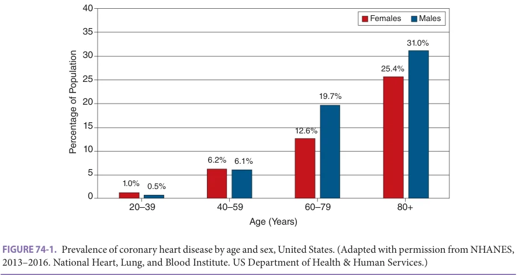
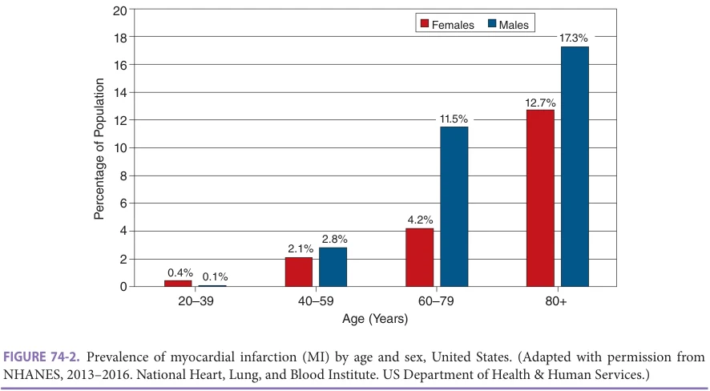
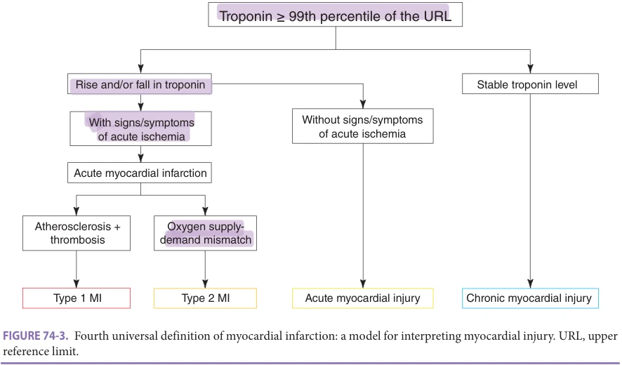
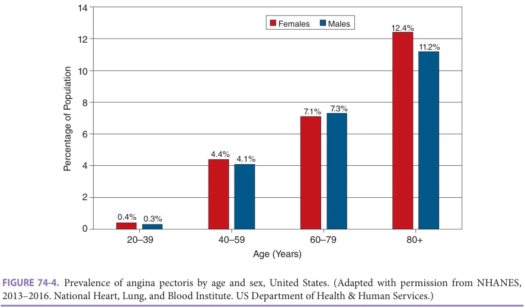
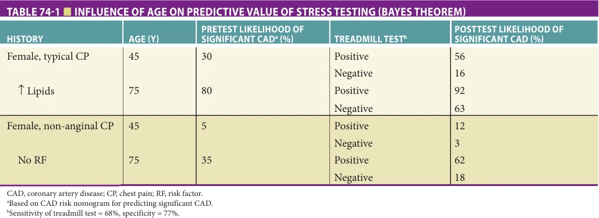
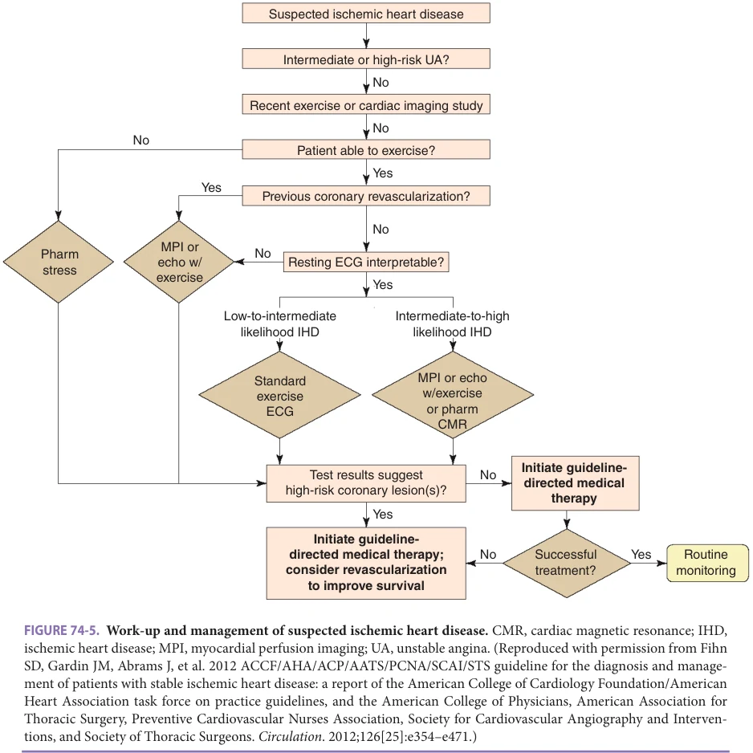
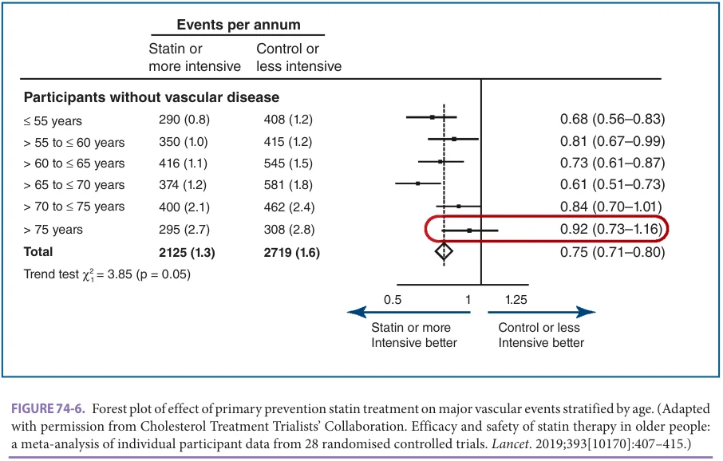

# Hazzard's Geriatric Medicine and Gerontology, 8e - Chapter 74: Coronary Heart Disease and Dyslipidemia

Michael G. Nanna, Karen P. Alexander

> **Status.** Fast build from the book; not lane-reviewed.

> **Source and method.** Printed pages 1133-1148, from the marked 8th-edition copy (PDF page = printed page + 34). Prose follows its text layer; tables and figures are source-page crops. The book is canonical.

**[p. 1133]**

## INTRODUCTION

The spectrum of coronary heart disease (CHD) includes subclinical CHD, asymptomatic or stable ischemic heart disease, and acute coronary syndromes including unstable angina and acute myocardial infarction (MI). Atherosclerosis in the coronary circulation contributes to luminal narrowing and increases risk of vascular dysfunction and thrombosis. Clinical presentations of CHD result from insufficient oxygen supply for the demands of the myocardium. Dyslipidemia is a major risk factor for the development of CHD in individuals up to age 80. There are multiple available therapeutic options to reduce blood cholesterol levels, many of which also modify future risk of cardiovascular events.

#### Learning Objectives

- Understand the prevalence of coronary heart disease (CHD) in older adults.

- Recognize the clinical aspects—including symptoms, signs, and diagnostic test results—that are common among older adults with CHD.

- Understand treatment of CHD, including treatment of dyslipidemias, in older adults.

#### Key Clinical Points

1. CHD is common and has high morbidity and mortality in older adults.

2. Many older patients have asymptomatic, stable, or subclinical ischemic heart disease.

3. Total cholesterol, low-density lipoprotein cholesterol (LDL-C), and triglyceride (TG) levels increase from the third to seventh decade of life. Typically, LDL-C remains stable or even declines in older age cohorts.

4. Dyslipidemia is a well-established risk factor for cardiovascular disease, but strength of this association is diminished with age and limited data exists for those older than age 80.

5. Typical angina is the most common presenting symptom of CHD regardless of age.

6. Delays in recognizing other symptoms such as dyspnea, fatigue, or epigastric discomfort may contribute to later presentations among older adults.

7. Evaluation for symptoms suggestive of CHD should be similar in older and younger patients. Functional testing is a valuable diagnostic and prognostic tool in older adults. Modified protocols or pharmacologic-based stress tests may be used for those who

## EPIDEMIOLOGY

Despite declining mortality over the past three decades, CHD remains the leading killer of both men and women in the United States. More than 80% of deaths from CHD occur in those older than 65 years. In the United States, the prevalence of CHD, MI, and angina all increase with age in both men and women (Figures 74-1 and 74-2). The initial manifestation of CHD may be an acute MI, occurring in about 40% of cases, or sudden death in 10% to 20% of cases. The average age of first MI is 66 years for men and 72 years for women. In-hospital mortality following an MI also rises sharply with age: less than 1% in those younger than 50 years old, ~2.5% in those 60 to 69 years old, ~4% in those 70 to 79 years old, and ~8% among those 80 years or older. One-year mortality similarly increases with age. Furthermore, the majority of patients with CHD older than 75 years are women because of their longer life expectancy and the 10-year lag in CHD manifestations as compared with men.

Clinically evident CHD represents the tip of the iceberg with many older patients having asymptomatic and subclinical coronary disease. The Cardiovascular Health Study examined the prevalence of clinical and subclinical cardiovascular disease (CVD) in a large communitydwelling Medicare population. Using a composite measure of MI on electrocardiogram (ECG) or echocardiography and abnormal carotid artery wall thickness or

**[p. 1134]**

experience difficulty with standard exercise protocols.

8. Management of CHD should be similar in older and younger patients prioritizing risk factor modification, symptomatic relief, and goals of care.

9. Revascularization is an effective method for relief of frequent angina particularly if symptoms remain despite optimally tolerated medical therapy.

ankle-brachial blood pressure index, they found that disease prevalence doubled from 22% in women aged 65 to 70 to 43% in those aged 85 or older. Similarly, the frequency of subclinical vascular disease in men increased from 33% to 45% in these age groups, respectively.

## PATHOPHYSIOLOGY OF DYSLIPIDEMIA AND CHD

The development of CHD is associated with a variety of well-established risk factors, including the presence of dyslipidemia, hypertension, diabetes mellitus, tobacco use, obesity, chronic renal insufficiency, and genetic risk factors for CHD. Other risk factors, such as early menopause, connective tissue disease, and human immune deficiency virus, have also been linked with higher risk for future cardiovascular events. A complete discussion of these risk factors is beyond the scope of this chapter and is discussed elsewhere in this textbook. This chapter’s focus is on the link between dyslipidemia and CHD.

Dyslipidemia and Age Elevated total cholesterol and LDL-C increase the risk for atherosclerotic cardiovascular disease (ASCVD) in middle-aged men and women. Multiple cross-sectional studies have demonstrated changes in lipid patterns across age groups. In general, total cholesterol, LDL-C, and TG levels all increase in both men and women from the third to the seventh or eighth decades of life. Changes in LDL-C are accelerated in women starting at menopause with the reduction in systemic estrogen. Beyond the seventh and eighth decades of life, LDL-C and cholesterol levels plateau and often decline. Lower cholesterol levels in adults 75 years or older may be related to healthy survivorship bias with individuals with lower cholesterol levels more likely to survive to old age. The decline in cholesterol levels observed in older populations may also be related to a variety of other less favorable factors, including malnutrition, multimorbidity, inflammation, and frailty. The data supporting the association between LDL-C and the development of CHD in older adult populations is therefore less clear. For example, in a well-characterized cohort of US adults older than 75 years and free of CVD at baseline, LDL-C was not associated with 5-year CVD risk. In another analysis from the Copenhagen General Population Study, higher LDL-C was associated with future risk of MI among individuals aged 70 to 100. Comorbidities and frailty also confound the association between cholesterol and mortality. Older persons at both ends of the cholesterol curve, with the lowest and the highest cholesterol levels, may be at higher risk for cardiovascular events and mortality. Ultimately, regardless of the attributable risk associated with hypercholesterolemia in older adult populations, studies are ongoing to identify whether targeting lipids with pharmacologic therapies can improve cardiovascular

*FIGURE 74-1. Prevalence of coronary heart disease by age and sex, United States. (Adapted with permission from NHANES, 2013–2016. National Heart, Lung, and Blood Institute. US Department of Health & Human Services.)*

**[p. 1135]**

*FIGURE 74-2. Prevalence of myocardial infarction (MI) by age and sex, United States. (Adapted with permission from NHANES, 2013–2016. National Heart, Lung, and Blood Institute. US Department of Health & Human Services.)*

outcomes in older adults (which is discussed in more detail in the “Evaluation and Management” section).

There are five major subpopulations of lipoproteins that provide additional information on risk. These include chylomicrons, very low-density lipoproteins (VLDLs), intermediate-density lipoproteins (IDLs), low-density lipoproteins (LDLs), and high-density lipoproteins (HDLs). Each differs in composition, metabolic function, and atherogenic potential. Atherogenic lipid particles include apolipoprotein B (ApoB) and lipoprotein(a) (Lp[a]). ApoB is the primary lipoprotein for chylomicrons, VLDLs, IDLs, and LDLs and functions as the ligand for the LDL receptor. Lp(a) is a lipoprotein particle similar to LDL cholesterol (LDL-C) that binds to ApoB. While these subparticles are associated with risk, LDL-C remains the focus of existing therapies. The relationship between aging and changes in the concentration of these subparticles, as well as their association with cardiovascular risk, represents an important area for future investigation.

CHD and Age Cardiovascular changes are common with age. Arterial stiffening is prevalent and results in isolated systolic hypertension with widened pulse pressures, factors known to increase risk of cardiovascular events. Heart failure with preserved ejection fraction (EF) is a prevalent and similar condition, which elevates end-diastolic pressures and impairs diastolic filling of the coronary circulation. Ageassociated endotheliopathy, defined by progressive endothelial dysfunction and blunted responses to protective vasodilatory mediators, results in atherosclerotic plaques with increasing numbers and severity. The composition of these atherosclerotic lesions also changes with age, with reduction in the soft lipid core and an increase in calcification and fibrosis. While more advanced calcified plaques

are actually less likely to rupture, the sheer increase in lesion numbers is associated with a higher likelihood for CHD events in older adults.

The pathophysiology of MI involves atherosclerotic plaque rupture, platelet activation/aggregation, endothelial dysfunction, inflammation, and thrombus formation. If a clot completely occludes a coronary artery, the patient suffers an acute MI, and an injury pattern (eg, ST elevation) is often seen on the ECG. In contrast, patients with plaque rupture can also form a nonocclusive thrombus, resulting in subendocardial ischemia. The distinction between unstable angina and MI shifted with the advent of high-sensitivity troponins as they can now identify very low levels of circulating cardiac troponin. Even lowest levels of circulating troponin above the detection threshold are associated with increased risk. In practice, MI type is also often stratified by ECG findings of ST-segment elevation MI (STEMI) or nondiagnostic ECG considered non-ST–segment elevation MI (NSTEMI). Most recently, the fourth universal definition of MI provides updated definitions for myocardial injury and MI (Figure 74-3).

## PRESENTATION

CVD may be diagnosed following an acute cardiovascular presentation, identification of ischemia on noninvasive testing, or finding obstructive coronary artery disease (CAD) on coronary imaging. Some examples of presentation types include evidence of prior silent MI on ECG, stable angina without ischemia on noninvasive testing, or asymptomatic ischemia found on noninvasive testing. The presence of obstructive CAD and angina may also vary across these presentations. Coronary calcifications, frequently noted on nongated chest imaging, identify the presence of atherosclerosis, and should trigger evaluation

**[p. 1136]**

*FIGURE 74-3. Fourth universal definition of myocardial infarction: a model for interpreting myocardial injury. URL, upper reference limit.*

and management of risk factors and/or symptoms. An MI requires the presence of acute myocardial injury detected by abnormal cardiac biomarkers in conjunction with clinical evidence of acute myocardial ischemia. Abnormal cardiac biomarkers are generally defined as an elevated cardiac troponin value above the 99th percentile upper reference limit (URL). Signs of myocardial ischemia include clinical symptoms, ischemic ECG changes, pathological Q waves on ECG, imaging evidence of ischemia, or identification of coronary thrombus on angiography or autopsy. When patients present with a cardiac troponin level greater than or equal to the 99th percentile of the URL with a characteristic rise and fall and signs/symptoms of acute ischemia, they meet criteria for an acute MI. If the MI is due to atherosclerosis and thrombosis (with either complete or partial occlusion of a coronary artery), patients meet criteria for a type 1 MI. This is often triggered by plaque rupture or erosion. If, however, the findings are related to an oxygen supply and demand imbalance, such as due to fixed coronary atherosclerosis, coronary spasm, coronary embolism, coronary dissection, severe anemia, severe hypotension/hypertension or tachyarrhythmia, then the patient meets criteria for type 2 MI. When the patient has a characteristic rise and fall in troponin but without clinical signs of acute ischemia, they meet criteria for acute myocardial injury, which may be due to conditions such as acute heart failure or myocarditis. Finally, if troponin levels are stable without a characteristic rise and fall, this represents chronic myocardial injury. This can be seen with left ventricular hypertrophy, structural heart disease, or chronic kidney disease.

The prevalence of angina increases with age (Figure 74-4), but it is also the case that older individuals

often have anginal equivalent symptoms such as dyspnea, epigastric pain, fatigue, confusion, or malaise that may be misinterpreted as consequences of aging or comorbid illness. Findings from the Global Registry of Acute Coronary Events, a large, prospective, multinational registry of ACSs, demonstrated that patients presenting with anginal-equivalent symptoms were less likely to receive appropriate cardiac medications, undergo cardiac catheterization, and were at higher risk of in-hospital morbidity and mortality. Older people can also have an impaired ischemia warning system. In a series of patients with CHD undergoing treadmill testing, researchers found that patients older than age 70 took more than twice as long as their younger counterparts to report angina after ECG-documented ischemia was noted.

Difficulty in recognizing symptoms contributes to later presentation of acute events in older patients. More than two-thirds of patients with MI, older than age 65, fail to reach an emergency department within 6 hours after the onset of their symptoms. The Rapid Early Action for Coronary Treatment study quantified delay time as an additional 14 minutes for every 10-year increment in age, beginning with the age of 30. While time to first medical contact has improved as community and state efforts have targeted improving MI systems of care, delays in MI presentation still have strong prognostic implications. Prehospital delays may result from atypical presentation, medical comorbidities, previous experiences within the health care system, socioeconomics, access to care, and cognitive and functional impairments. Thus, clinicians should advise that cardiac symptoms can vary and patients should seek rapid medical attention if concerning symptoms occur.

**[p. 1137]**

*FIGURE 74-4. Prevalence of angina pectoris by age and sex, United States. (Adapted with permission from NHANES, 2013–2016. National Heart, Lung, and Blood Institute. US Department of Health & Human Services.)*

## EVALUATION

Evaluation of Stable CHD Given the prevalence of CHD in older patients, clinicians must have a high index of suspicion to make the diagnosis. In taking a history, clinicians must consider risk factors as well as temporal course of symptoms suggestive of CHD. Patients with new, progressive, or refractory symptoms typically require an expedited—and possibly inpatient—evaluation.

A systematic approach to the physical examination may provide further clues to the presence of CHD. Some older patients develop calcific vascular disease, and pseudohypertension may be observed. Diminution of the femoral pulses or brachial-femoral delay may suggest the presence of atherosclerotic aorto-iliac disease, and these findings may accompany observed dermatologic changes with lower extremity hair loss. Performing ankle-brachial indices remains a useful and sensitive screening tool for identifying patients with peripheral vascular disease, a known risk factor for increased cardiovascular events. The cardiac examination may include signs of left- or rightsided heart failure (pulmonary edema, displaced point of maximal impulse, an S3, or peripheral edema) or characteristic murmurs of valvular heart disease. Once a thorough history and physical has been completed, further diagnostic evaluation should be based on the patient’s symptoms as outlined below. Risk factors, particularly blood pressure, should be measured. Obtaining a baseline ECG is also reasonable because of the high prevalence of silent MIs in older individuals. Beyond the standard history, physical examination, and laboratory tests, further diagnostic testing (carotid ultrasound, treadmill testing, echocardiography, or computed tomography) in the asymptomatic older

patient to detect occult or subclinical CHD remains controversial and is not generally recommended.

Symptomatic older patients should undergo a similar assessment for obstructive coronary disease as younger patients based on algorithms that take into account symptom characteristics, including angina type (non-anginal, anginal-equivalent, or typical), its course (stable, progressive, or unstable), and its duration. This initial assessment of a patient’s pretest probability of disease should guide diagnostic testing. In particular, clinicians need to be cognizant that, according to Bayesian theory, the predictive value of a test is influenced by the disease prevalence in the population tested. For example, clinicians may interpret a negative stress test in a high-risk older woman (pretest probability of disease 80%) as “ruling out” the presence of CHD, whereas this patient’s posttest likelihood remains more than 60% (Table 74-1). For these reasons, older patients with high pretest likelihood for coronary disease should be considered for direct referral for cardiac catheterization (if revascularization is an appropriate option). At the other extreme, patients with a low pretest probability for CAD less than or equal to 20% (ie, no risk factors, normal ECG, and very atypical symptoms) can often be followed clinically and/or be assessed for other etiologies of their symptoms (gastrointestinal, pulmonary, musculoskeletal, etc). Older patients with an intermediate pretest probability for CHD (between 20% and 70%) are those in whom stress testing has its greatest impact on clinical decision-making.

When stress testing is indicated, guidelines recommend exercise ECG as a first strategy for patients with a normal baseline ECG. The exercise ECG provides important prognostic information (including exercise duration and hemodynamic response), as well as electrocardiographic indications of ischemia (ST depression). Older

**[p. 1138]**

*TABLE 74-1 ■ INFLUENCE OF AGE ON PREDICTIVE VALUE OF STRESS TESTING (BAYES THEOREM)*

patients, however, frequently experience difficulty with exercise testing because of deconditioning or disability and may need modified protocols starting at lower levels with slower stage progression. Alternatively, for patients who cannot exercise, a pharmacologic-based stress test (dobutamine, adenosine, or dipyridamole) can be performed. In older patients with baseline ECGs abnormalities (resting ST depression, left bundle branch block, left ventricular hypertrophy with strain, or paced rhythms), imaging modalities, such as nuclear perfusion or stress echocardiography, are required. While these modalities significantly add to the cost of the test, these improve the diagnostic accuracy beyond stress ECG alone and provide information as to the location and extent of coronary disease. Thus, the choice of diagnostic test should consider the clinical setting as well as local availability and expertise (Figure 74-5). In the PROMISE trial, functional testing was able to distinguish future risk of CV death/MI in individuals 65 years and older, whereas a positive result, defined as stenosis ≥ 70% or ≥ 50% left main stenosis, on anatomic testing (CCTA) did not correlate with future outcomes in older patients. There is likely a role for CCTA to exclude surgical disease in asymptomatic nonfrail older adults with low EF. There is no need to repeat stress tests without a change in symptoms. Guidelines advise against repeat testing within 2 years of percutaneous coronary intervention (PCI) and 5 years of coronary artery bypass graft (CABG).

Cardiac catheterization is as safe in contemporary practice in older patients as in younger patients, but it should always be performed based on a favorable riskbenefit ratio and in alignment with the patient’s goals of care. Vascular injury, bleeding, MI, stroke, and even mortality can result, albeit rarely, and advanced age increases these risks. However, the risk to life remains less than 0.2%, and the risk of other serious adverse events is less than 0.5%, even in those aged 75 or older. Cardiac catheterization should be considered for those at high risk of severe coronary disease, or refractory ischemic symptoms despite maximally tolerated medical treatment. At the same time,

it is safe to defer cardiac catheterization for initial medical management in patients with stable ischemic heart disease. This is a helpful clarification particularly for older patients with multimorbidity and in those with even moderate to severe ischemia on stress testing as demonstrated in the International Study of Comparative Health Effectiveness with Medical and Invasive Approaches (ISCHEMIA) trial. In this study, there was no difference in the composite cardiovascular outcome or all-cause mortality with a conservative approach optimizing medical therapy compared to an initial invasive approach in patients with stable ischemic heart disease and EF greater than or equal to 35%. Revascularization does continue to provide important angina relief when frequent symptoms persist despite maximally tolerated medical therapy. It also improves survival for those with multivessel disease and EF less than 35%. In summary, if symptoms can be managed with medical therapy in stable patients, then a PCI is unlikely to add benefit and has not been shown to improve mortality. On the other hand, if patients are unable to tolerate antianginal therapies due to side effects, concerns around polypharmacy, or patient preferences, or if PCI can provide more effective symptom control and/or a more durable symptom relief, revascularization may be preferable. Given these complexities, personcentered decision-making around the management of CHD is of the utmost importance.

MI Evaluation Older patients with MI often have an acceleration of chest pain symptoms and may have more subtle changes on the ECG (eg, flipped T waves or ST depression) or more dramatic changes (eg, ST elevation). There is some evidence that plasma levels of procoagulation markers and coagulation factors are elevated in older patients, but it remains unclear whether these findings alone are responsible for increased thrombotic tendencies in older patients or alter risk when accompanied by other traditional risk factors for thrombotic events. There are also significant proportions of older patients who develop MI secondary to exacerbations

**[p. 1139]**

*FIGURE 74-5. Work-up and management of suspected ischemic heart disease. CMR, cardiac magnetic resonance; IHD, ischemic heart disease; MPI, myocardial perfusion imaging; UA, unstable angina. (Reproduced with permission from Fihn SD, Gardin JM, Abrams J, et al. 2012 ACCF/AHA/ACP/AATS/PCNA/SCAI/STS guideline for the diagnosis and management of patients with stable ischemic heart disease: a report of the American College of Cardiology Foundation/American Heart Association task force on practice guidelines, and the American College of Physicians, American Association for Thoracic Surgery, Preventive Cardiovascular Nurses Association, Society for Cardiovascular Angiography and Interventions, and Society of Thoracic Surgeons. Circulation. 2012;126[25]:e354–e471.)*

of chronic comorbid conditions or acute medical illnesses. These type 2 MIs occur in the setting of sepsis, acute blood loss or chronic anemia, pneumonia, pulmonary embolism, chronic obstructive pulmonary disease, congestive heart failure, dysrhythmias, or hypertensive urgencies. A retrospective study demonstrated that approximately 30% of patients present with an acute noncardiac condition concomitant with an MI, contributing to increased mortality and less use of cardiac medications and interventions. These secondary events usually occur in the context of increased myocardial oxygen demand or hemodynamic stress in patients with underlying CAD and represent a substantial number of cases. The distinction between a type 1, or spontaneous, MI and a type 2, or secondary, MI is helpful to determine best approach to management. In the latter, focus on supply-demand and risk stratification

is warranted, where as in the spontaneous MI group, a more typical approach with anticoagulation and cardiac catheterization is warranted.

## MEDICAL MANAGEMENT

Antiplatelet Therapy There is strong support for the benefit of aspirin in secondary prevention, and in select patients for primary prevention in the presence of risk factors. The Antithrombotic Trialists’ Collaboration, which performed a meta-analysis of aspirin trials and included more than 135,000 patients, identified a 25% risk reduction in cardiovascular events. In the Physician’s Health Study of 44,000 men without known CHD, those randomized to aspirin had a 44% lower risk for subsequent MI versus those taking placebo.

**[p. 1140]**

Observational data from the Nurse’s Health Study suggest similar benefits of aspirin for primary CHD prevention in women. The reduction in nonfatal cardiovascular events and stroke was greater for secondary prevention than for primary prevention, particularly when at low risk. Recent randomized controlled trial data have cast more doubt on the benefit of aspirin for primary prevention. The ARRIVE (Aspirin to Reduce Risks of Initial Vascular Events) trial randomized nondiabetic individuals at moderate risk for CVD (men ≥ 55 years old, women ≥ 60 years old) to aspirin 100 mg/day versus placebo. At 5 years of follow-up, the composite CV outcome was the same in both groups with more gastrointestinal bleeding in the aspirin group. A limitation of ARRIVE was that event rates were generally lower than expected due to enrollment of a lower risk cohort than intended. The ASCEND (A Study of Cardiovascular Events in Diabetes) trial examined the effect of aspirin 100 mg versus placebo for primary prevention of cardiovascular events in patients with diabetes. ASCEND demonstrated that low-dose aspirin reduced cardiovascular events over a mean follow-up of 7 years in diabetic individuals (rate ratio 0.88; 95% confidence interval, 0.79–0.97, p = 0.01), while increasing major bleeding events compared with placebo (4.1% vs 3.2%; p = 0.003). The ASPREE (Aspiring in Reducing Events in the Elderly) trial evaluated the effect of aspirin versus placebo on disability-free survival, cardiovascular events, mortality, and bleeding in healthy adults older than 70 years (or ≥ 65 years among Blacks and Hispanics in the United States). Over 5 years, aspirin did not prolong disability-free survival but led to a higher rate of major hemorrhage compared with placebo. ASPREE also demonstrated a higher mortality among individuals receiving daily aspirin, attributed to cancer-related death. As a reflection of these data, the US Preventive Services Task Force recommends weighing the impact of aspirin therapy on primary vascular events versus bleeding when considering initiation of treatment within the broader context of health trajectory and individual patient priorities. Aspirin dose continues to be debated, but efficacy of aspirin does not appear to increase at doses greater than 150 mg/day, and higher doses increase the risk for bleeding. Thus, 81 mg of aspirin is the dose with the best evidence for secondary prevention.

Clopidogrel, a thienopyridine that inhibits ADPdependent platelet aggregation, when added to aspirin in the setting on NSTEMI results in a 20% relative risk reduction in cardiovascular death, MI, or stroke as shown in the Clopidogrel in Unstable angina to prevent Recurrent Events (CURE) trial. The study found similar benefits in older patients; nevertheless, registry data suggest that the in-hospital use of clopidogrel in older patients after MI remains low. The use of clopidogrel is also recommended as an alternative to aspirin in the small subset of patients who are allergic or intolerant to aspirin. Newer ADP-dependent platelet aggregation inhibitors are used in patients following percutaneous interventions. Prasugrel has a black box warning against use in those age 75 or older or those with

prior stroke or low body mass index due to increased risk of bleeding. Ticagrelor, with a different risk profile, seems safe for use in those age 75 or older based on current evidence. Patients who require long-term dual antiplatelet therapy (DAPT) or oral anticoagulation with warfarin are advised to take a reduced aspirin dose of 81 mg daily, and all older patients should be on reduced aspirin dose, regardless of other agents.

Antithrombotic Therapy Consideration for the likelihood of a thrombotic process based on the type of MI and need for invasive management strategy should guide the approach to anticoagulation. Antithrombotic therapy reduces cardiovascular events in patients after an ACS, yet registry data show less use of antithrombotic therapy in older patients when compared to their younger counterparts. Unfractionated heparin, in conjunction with antiplatelet therapy, is associated with significant reduction in death or MI in patients with ACS. Older patients are more often susceptible to overdosing, reflected by an elevated partial thromboplastin time, and bleeding. Low-molecular-weight heparin also improves clinical outcomes for ACS with a greater relative benefit in older patients than younger patients, but caution is needed to avoid excessive dosing and bleeding complications due to its renal clearance. Bivalirudin, a direct thrombin inhibitor, is used frequently in invasively managed ACS patients, often in conjunction with oral antiplatelet loading. It has equivalent antithrombotic activity with less bleeding in several trials.

Newer oral antithrombotic therapies have been evaluated for safety and efficacy in reducing recurrent events in patients with ASCVD. The Apixaban for Prevention of Acute Ischemic Events 2 (APPRAISE-2) trial randomized high-risk patients following MI to apixaban 5 mg twice daily in addition to antiplatelet therapy. They found an increased risk of major bleeding without a significant reduction in recurrent ischemic events. The Cardiovascular Outcomes for People Using Anticoagulation Strategies (COMPASS) trial randomized a different population— patients with stable ASCVD—to a low dose of rivaroxaban (2.5 mg twice daily) plus aspirin versus aspirin alone. There was a reduction in cardiovascular events, but at the expense of more bleeding with rivaroxaban. Given the increased bleeding risk, oral anticoagulants are not recommended for acute or chronic CHD in the absence of another indication (eg, atrial fibrillation or deep venous thrombosis).

β-Blockers β-Blockers lower myocardial oxygen demand and improve coronary blood flow with anti-hypertensive and antiischemic properties. Long-term benefits from β-blockers include management of ischemic symptoms, lowering blood pressure, or improving HF outcomes in those a depressed left ventricular function. Many patients, including older adults, are placed on β-blockers initially at the time of an acute MI. A meta-analysis of 25 randomized controlled

**[p. 1141]**

trials of patients with prior MI showed β-blockers reduced all-cause mortality or MI by 25%. An observational analysis of older patients following acute MI showed those receiving β-blockers had a 33% reduction in 1-year mortality. The contemporary REACH registry analyzed use of β-blockers into three cohorts: CAD without MI, CAD with prior MI, and CAD risk factors only. There was no association between use of β-blockers and lower rates of death, nonfatal MI, or nonfatal stroke in any cohort. However, those with recent MI (≤ 1 year) had a 25% lower incidence of the composite which included cardiac rehospitalization with β-blocker use. This suggests the greatest benefit in the contemporary era for β-blockers is in the first year following an MI. Older patients are often vulnerable to drugs with hypotensive actions and have altered responses to β-blockers owing to conduction system deterioration and the physiologic desensitization of β-adrenergic receptor function, so this information is helpful in considering continuation after 1 year. Additionally, a recent trial found that early use of β-blockers in patients with MI could worsen risks for congestive heart failure and result in poorer outcomes. Thus, β-blockers should be administered to those with an identified potential for benefit, titrated with caution, and revisited based on tolerability and clinical stability over time.

Statins Cholesterol is a key determinant of risk, reflected by levels of LDL-C and non–HDL-C. There are several classes of drugs for lowering serum cholesterol, including fibrates, bile acid sequestrants, niacin, fish oil, ezetimibe, hydroxymethylglutaryl coenzyme A (HMG-CoA) reductase inhibitors (statins), PCSK9-inhibitors, and bempedoic acid. Of these, only statins—alone or in combination with ezetimibe or PCSK9 inhibitors—have proven effective for secondary prevention of cardiovascular events.

There is no question that for secondary prevention of ASCVD, moderate-intensity statin use reduces major vascular events including in those aged 75 or older. Furthermore, the guideline states that it is reasonable to continue high-intensity statin in patients aged 75 or older if tolerated. Notably, an observational study from the Veterans Affairs health system identified a graded association between statin intensity and mortality in patients with ASCVD, with high-intensity statins conferring a small but significant survival advantage compared with moderate intensity statins in older adults (76–84 years old). Another large metaanalysis from the Cholesterol Treatment Trialists found no heterogeneity of treatment effect when high-intensity statin therapy was compared with moderate-intensity statin therapy across age groups.

In the immediate post-MI period, high-intensity lipid-lowering therapy has demonstrated benefit in older patients to prevent recurrent cardiovascular events. In fact, in a post hoc analysis of the Pravastatin or Atorvastatin Evaluation and Infection Therapy—Thrombolysis in Myocardial Infarction (PROVE IT-TIMI 22) trial, patients

age 70 years and older were found to derive greater benefit than younger counterparts in terms of absolute and relative reduction in cardiovascular events. A meta-analysis of age-specific outcome data from two primary prevention statin trials, JUPITER (Justification for Use of Statins in Prevention: An Intervention Trial Evaluating Rosuvastatin) and HOPE-3 (Heart Outcomes Prevention Evaluation), demonstrated a 26% relative risk reduction for those older than 70 years for the end point of nonfatal MI, nonfatal stroke, or cardiovascular death (HR, 0.74; 95% CI, 0.61–0.91; p = 0.0048). There was no heterogeneity of treatment effect by age observed but all included patients also had elevated C-reactive protein levels and most of the events were in those between age 70 and 75.

There is a paucity of RCT data supporting statin use for primary prevention in older adults (≥ 75 years old) as reflected in the guideline recommendation for clinical assessment of risk when deciding whether to continue or initiate statin treatment (Class IIa). Further compounding this uncertainty is the fact that the guideline emphasizes pretreatment risk stratification using the Pooled Cohort Equations 10-year ASCVD risk calculator to guide treatment decisions. However, the risk calculator was derived in populations only up to age 79 and multiple studies have demonstrated suboptimal performance of the risk calculator in older adult populations. The guideline states that a moderate-intensity statin in adults 75 years or older with an LDL-C level of 70 to 189 mg/dL may be reasonable (IIb), but balances that by stating it may be reasonable to stop statin therapy when functional decline (physical or cognitive), multimorbidity, frailty, or reduced life-expectancy limits the potential benefits of statin therapy (IIb).

A meta-analysis of data from patients included in randomized trials comparing statins to placebo (n = 134,537) demonstrated no statistically significant benefit in individuals older than 75 years for statin use in primary prevention (Figure 74-6). Observational evidence for primary prevention in US Veterans age 75 or older suggests new initiation of statin reduces all-cause and cardiovascular mortality. An observational subgroup analysis of healthy individuals age 70 or older in the Aspirin in Reducing Events in the Elderly (ASPREE) trial showed statin use at baseline was not associated with disability-free survival, all-cause mortality or dementia. However, those on statins at baseline had a lower risk of physical disability and adverse cardiovascular events. The question “Is statin therapy efficacious and safe in older patients (> 75 years of age)? If so, what is a net benefit of statin therapy in this age group?” was identified as an important question needing to be addressed by future RCTs in the most recent ACC/AHA cholesterol guideline. Two large, currently ongoing trials (A Clinical Trial of STAtin Therapy for Reducing Events in the Elderly, STAREE, ClinicalTrials.gov: NCT02099123 and Pragmatic Evaluation of Events and Benefits of Lipid-Lowering in Older Adults, PREVENTABLE, ClinicalTrials.gov: NCT04262206) are focused on this question.

**[p. 1142]**

*FIGURE 74-6. Forest plot of effect of primary prevention statin treatment on major vascular events stratified by age. (Adapted with permission from Cholesterol Treatment Trialists’ Collaboration. Efficacy and safety of statin therapy in older people: a meta-analysis of individual participant data from 28 randomised controlled trials. Lancet. 2019;393[10170]:407–415.)*

Older adults (≥ 75 years old) with ASCVD received high-intensity statins less often than younger patients in the Patient and Provider Assessment of Lipid Management (PALM) registry, highlighting a potential gap in care. While closing treatment gaps is important, identifying older populations where benefit is unlikely is important as well. A recent meta-analysis of randomized clinical trials of primary prevention in adults aged 50 to 75 found that the time to benefit for 100 adults treated with statin therapy to prevent one MACE was at least 2.5 years. An evaluation of US Medicare- and Medicaid-certified nursing home facilities demonstrated that more than one-third of nursing home residents aged 65 or older with a life-limiting illness remained on statin therapy. Time to benefit is an important consideration for initiating or discontinuing statin treatment in older individuals for primary or secondary prevention.

Statin intolerance is often a concern in older patients, however evidence on this is reassuring. The Effect of Statins on Skeletal Muscle Function and Performance (STOMP) study demonstrated that high-dose atorvastatin did not decrease muscle strength or exercise performance in healthy subjects, despite a mild increase in myalgias with statin treatment (9.4% vs 4.6%, p = 0.05). The Self-assessment Method for Statin Side Effects or Nocebo (SAMSON) trial was a recent double-blind n-of-1 trial of patients who had recently discontinued statins due to side effects. In this trial, 90% of symptom burden with statin treatment was elicited by placebo alone when compared to the statin months and no-tablet months—so many muscle symptoms attributed

to statins may be due to the “nocebo” effect. Reassuringly, half of the SAMSON trial participants were able to restart a statin after trial completion. Ofori-Asenso and colleagues also looked at switching, discontinuing, and reinitiating statins among adults aged 65 or older in a random sample of the Australian population. They also found that while statin discontinuation is common, most older individuals eventually restart a statin with improved persistent use. Importantly, older patients in the PALM registry reported tolerating statin therapy similarly to younger subjects. Taken together this evidence suggests older adults can tolerate statin therapy as well as younger populations. Ultimately, improving persistence and compliance with statin therapy in all age groups is a key priority.

Other Lipid-Lowering Agents Ezetimibe, the first nonstatin lipid-lowering therapy demonstrated in a randomized controlled trial to improve cardiovascular outcomes in patients with ASCVD, targets the absorption of cholesterol from the diet. In the Vytorin Efficacy International Trial (IMPROVE-IT), 18,144 highrisk patients with an acute coronary syndrome in the preceding 10 days were randomized to simvastatin versus simvastatin plus ezetimibe. The addition of ezetimibe to statin treatment lowered LDL-C by 24%. There was also a modest 2% absolute risk reduction in the composite primary endpoint at 7 years of follow-up (cardiovascular death, MI, hospitalization for unstable angina, coronary revascularization, and nonfatal stroke). A secondary analysis of IMPROVE-IT set out to assess the effect of ezetimibe

**[p. 1143]**

and simvastatin compared with simvastatin monotherapy among patients 75 years or older with recent acute coronary syndrome included in the trial. The authors determined that older adults in IMPROVE-IT actually derived the most benefit from the addition of ezetimibe to statin therapy, with the greatest absolute risk reduction observed in those 75 years or older without any increase in adverse safety events. There are also data for primary prevention treatment with ezetimibe. The Ezetimibe Lipid-Lowering Trial on Prevention of Atherosclerotic Cardiovascular Disease in 75 or Older (EWTOPIA 75), a multicenter, prospective, randomized, open-label, blinded trial in Japan, examined the preventive efficacy of ezetimibe for patients aged 75 or older, with elevated LDL-C without history of CAD. In EWTOPIA, ezetimibe treatment was associated with a lower rate of cardiovascular events, though the open-label nature of the trial and early termination somewhat limit interpretation of the results.

Monoclonal antibodies against the proprotein convertase subtilisin kexin 9 (PCSK9) are the latest addition to the lipid-lowering clinical arsenal. In recent years, two landmark trials have been published demonstrating the safety and efficacy of alirocumab and evolocumab, respectively, to lower LDL-C levels by up to 50% and improve clinical outcomes in individuals with ASCVD. These medications are recommended by the current ACC/AHA cholesterol guideline recommendations for patients with ASCVD deemed to be high-risk and with persistently elevated LDL-C levels. However, the impact of PCSK-9 inhibitors in high-risk multimorbid older adult populations has not been described. A prespecified secondary analysis of the ODYSSEY OUTCOMES trial demonstrated that the addition of PCSK9-inhibitor alirocumab reduced ischemic cardiovascular events in post-ACS patients on maximally tolerated statin intensive therapy across age groups, with increasing absolute benefit with advancing age and no significant safety concerns.

Other Secondary Prevention Strategies Secondary prevention aims to lower the risk of recurrent cardiovascular events in patients with CHD. Since older patients with CHD face higher overall risk, the benefit of prevention in absolute terms rises with age and “number needed to treat” falls. Secondary prevention strategies target control of risk factors, such as hypertension and tobacco cessation. Exercise and lifestyle interventions should be similarly applied and are effective regardless of age. There is no upper age limit for the benefit of exercise, even if physical limitations modify the type of activity. Cardiac rehabilitation can be especially important following a cardiac event in assisting the older patient in selecting a sustainable exercise routine.

The renin-angiotensin-aldosterone system is a key determinant in hypertension, inflammation, atherosclerosis, and, ultimately, increased cardiovascular events. Angiotensinconverting enzyme (ACE) inhibitors have strong support for

safe and effective treatment of hypertension, and improving survival post-MI with depressed heart function, heart failure, or anterior MIs. The Heart Outcomes Prevention Evaluation (HOPE) study extended the benefits of ACE inhibitors to all patients with known CHD or at high risk of CHD. In HOPE, patients with CHD and other patients with high CHD risk (eg, diabetes plus one or more cardiac risk factor) were randomized to 10 mg of ramipril daily versus placebo. After 5 years, treated patients had 26% lower risk of CHD death than those who were not treated. Rates of MI, congestive heart failure, stroke, renal dysfunction, and even development of diabetes were lower in the ACE-treated patient group. The treatment effects of ACE inhibition were greater in those patients aged 65 or older than in younger patients. Current guidelines suggest consideration of ACE inhibitors in all patients having CHD with depressed ventricular function, diabetes, or hypertension. Some experts have suggested that these drugs be considered in all patients with known CHD regardless of other risk factors or left ventricular dysfunction, yet there remains conflicting evidence from clinical trials regarding this issue. Angiotensin receptor blockers (ARBs), similar to ACE inhibitors, are designed to produce antihypertensive and anti-inflammatory effects within the cardiovascular system, and recent studies demonstrate that these agents translate to decreased cardiovascular events. Several randomized control trials have shown that the ARBs can slow the progression of nephropathy in patients with diabetes and microalbuminuria in a fashion similar to ACE inhibitors. Overall, the data favor the use of established ACE inhibitors for primary and secondary prevention of cardiovascular events, with the consideration of ARB substitution in patients who are intolerant of ACE inhibitors (most commonly from troublesome cough). When used in older patients, one should monitor serum electrolytes and creatinine, as these drugs can cause decreased renal function and hyperkalemia.

## CATHETERIZATION AND REVASCULARIZATION

Unstable Angina or Myocardial Infarction Care guidelines recommend that all those diagnosed with an MI should have an assessment of both left ventricular function (via echocardiography or other means) and coronary disease severity. In patients with NSTEMI, the two options for assessment of post-MI risk are (1) routine angiography with revascularization as appropriate or (2) conservative strategy of medical therapy with selection for angiography based on refractory symptoms of ischemia (“ischemia-driven” approach). Recent clinical trials suggest that the early invasive approach might be preferable for patients at increased risk of recurrent cardiovascular events. With the introduction of contemporary trials, the Treat Angina with Aggrastat and Determine Cost of Therapy

**[p. 1144]**

with an Invasive or Conservative Strategy—Thrombolysis in Myocardial Ischemia/Infarction (TACTICS-TIMI)-18 trial randomized patients with unstable angina/NSTEMI to one or the other of these strategies and found that those in the early invasive arm (within 48 hours) had nearly 20% lower rates of death, nonfatal MI, or rehospitalization at 6 months than conservatively treated patients. Interestingly, the successful enrollment of older patients (40% of patients were ≥ 65 years) allowed the identification of a 44% relative risk reduction in 30-day death or nonfatal MI among patients 65 years or older (invasive 5.7% vs conservative 9.8%; p < 0.05) and a 56% relative risk reduction in patients older than 75 years(invasive 10.8% vs conservative 21.6%; p < 0.05) with the early invasive strategy, findings consistent with a greater benefit in older relative to younger patients.

Multiple studies in older adult populations have demonstrated similar benefits to an early invasive strategy. In an open-label randomized controlled trial of patients 80 years or older with NSTEMI or unstable angina admitted to hospitals in Norway, an invasive strategy with early coronary angiography and immediate assessment for revascularization was superior to a conservative strategy of medical treatment alone for reducing cardiovascular events. In the Italian Elderly ACS Trial, a routine invasive strategy in NSTEMI patients 80 years or older was beneficial compared with a selective invasive strategy, though the trial did not meet its recruitment goal. One study of NSTEMI patients 80 years or older with chronic kidney disease found PCI offered a survival benefit regardless of eGFR but a higher risk of bleeding with eGFR less than 30 mL/min per 1.73 m2. Similarly, a meta-analysis assessing the longterm outcome of a routine versus selective invasive strategy in patients with non–ST-segment elevation acute coronary syndromes demonstrated that increasing age is actually the strongest predictor for better outcomes with a routine invasive strategy. Taken together, a routine invasive strategy appears to be the appropriate approach in most older adults with NSTEMI.

Stable Ischemic Heart Disease A major challenge in the care of older patients with stable CHD is related to who should undergo evaluation for coronary revascularization. In younger patients, randomized clinical trials have simplified this decision-making process by identifying subgroups in which PCI or CABG surgery improves survival and/or quality of life beyond medical therapy. However, patients older than 75 years were generally not represented in these pivotal trials, so clinicians and patients must rely on a careful comparison between the acute procedural risks and potential long-term benefits. Developments in the techniques of coronary catheterization, PCI, and CABG are changing the landscape for patient selection and outcomes for revascularization. Based on Medicare data, trends and outcomes in older patients after PCI were compared between the balloon

angioplasty era (1991–1995), the bare metal stents (BMS) era (1998–2003), and the drug-eluting stents (DES) era (2004–2006). Despite a significant increase in comorbidity, the number of post-PCI adverse cardiovascular events decreased over time, including less death and MI at 3-year follow-up. The improved outcomes were due to reductions in the need for repeat target vessel/lesion revascularizations and CABG, highlighting the efficacy of evolving technologies and techniques, as well as improving adjunctive therapy.

The use of fractional flow reserve (FFR < 0.8) to identify lesions contributing to ischemia has been shown to improve associated PCI outcomes. The use of third-generation stents has also improved the outcomes of PCI among those with multivessel disease, although CABG continues to demonstrate superior survival and fewer events at 5 years compared with PCI. The selection of patients for CABG as the optimal revascularization strategy should include those with reduced EF (< 35% with viable myocardium), left main CAD or its equivalent, and diabetes.

Age-associated risk in procedural mortality is not strictly linear but rises rapidly beyond the age of 75. Additionally, at any age, patients with CABG face two- to threefold higher mortality risks compared to those undergoing angioplasty. However, technological advances have led to improved procedural success rates and lower risks for both procedures. Thus, despite the fact that procedures were performed on patients with higher risk, the risk of death after CABG in patients aged 65 or older in the Society for Thoracic Surgery database declined nearly 20% between 1990 and 1999 and now rests at just above 4%. The Society for Thoracic Surgery has devised risk models that can be used to guide the impact of patient risk factors on operative morbidity and mortality and can be used in patient management. The web-based risk calculator can be found at http://www.sts.org.

Nonfatal procedural complications (stroke, MI, and renal failure) also rise with age and are higher with CABG. Of major importance to many older patients are the procedural risks of stroke and loss in mental acuity. Patients with CABG aged 75 or older have a 3% to 6% incidence of stroke compared with less than 1% incidence of stroke with angioplasty. Additionally, by using highly sensitive neurocognitive testing, Newman and colleagues found that up to 50% of patients of all ages undergoing CABG had measurable impairments in neurocognitive function at hospital discharge. Although half of patients with initial impairment recovered by 6 months, cognitive deficits reappeared in many of them during long-term follow-up and portended an impaired functional status. However, one recent study that compared cognitive ability after CABG to angioplasty and age-matched controls noted no meaningful clinical deterioration of cognitive performance between groups. Similarly, the initial enthusiasm of improving neurocognitive outcomes by performing off-pump CABG

**[p. 1145]**

versus traditional on-pump CABG has been tempered by findings from a recent randomized trial, which demonstrated comparable cognitive outcomes between the two groups, although long-term follow-up has yet to occur. While chronologic age is a major risk factor for procedural complications or mortality, it is biological age which is most important to consider. For example, by using published risk models, an octogenarian’s likelihood for mortality with CABG ranges from 2% for a “healthy” patient without comorbidities, to less than 30% with multiple risk factors such as diabetes or preexisting CVD.

The risks of revascularization must be balanced against the potential benefits in terms of prolonged survival, improved functional outcomes, or both. The Alberta Provincial Project for Outcomes Assessment in Coronary Heart Disease registry examined the care and outcomes of more than 6000 patients aged 70 to 79 who underwent cardiac catheterization. Compared with medical therapy, those receiving CABG or PCI had significantly higher adjusted 4-year survival rates (CABG 87%, PCI 84%, medical therapy 79%, p < 0.001). These survival benefits of revascularization also held for octogenarians and increased in all aged patients in proportion with the number of diseased vessels and the degree of left ventricular dysfunction. Results from the Alberta Provincial Project for Outcomes Assessment in Coronary Heart Disease registry have been confirmed in other observational analyses. Together, these studies strongly suggest that older patients with multivessel coronary disease have higher survival rates if treated with optimal revascularization than if they are treated with medical therapy alone.

There is a growing body of literature to support the use of revascularization to reduce angina and improve functional outcomes of older patients with CHD. The Trial of Invasive Versus Medical Therapy in Elderly Patients with Chronic Symptomatic Coronary Artery Disease study randomized 305 patients with chronic angina, aged 75 or older, to diagnostic catheterization (followed by coronary revascularization as appropriate) or optimized medical therapy with intervention only for those with refractory symptoms. Of those randomized to catheterization and intervention as appropriate, 74% underwent CABG or PCI, while almost 33% of the conservative management arm crossed over to revascularization by 6 months. Patients in the early revascularization arm had significantly greater improvement in their symptoms, functional status and quality of life when compared with medically treated patients. However, there was a higher 6-month mortality rate but a lower incidence of nonfatal MI in the early invasive arm. While this randomized study had a small sample size and presented several methodological challenges, its results provide support for the consideration of revascularization in the very old patient with CHD. The Objective Randomised Blinded Investigation With Optimal Medical Therapy of Angioplasty in Stable Angina (ORBITA) trial randomized patients with stable angina and evidence of severe single-vessel stenosis

1:1 to either PCI or a placebo sham procedure (n = 200), demonstrating that PCI did not result in greater improvements in exercise times or angina frequency. However, the trial had a medical therapy run in period, and was powered for exercise treadmill-based endpoints. Both the COURAGE trial and the ISCHEMIA trial demonstrated improvements in angina with revascularization compared with medical therapy alone. In ISCHEMIA, patients with angina at baseline who underwent revascularization had improved symptom relief and quality of life compared with optimal medical therapy. Patients with more frequent angina (daily or weekly) were also more likely to be angina free at 1 year (50% of patients) compared with those on medical therapy alone (20%).

Fibrinolysis and Primary PCI The primary management objective in patients with STEMI is to provide early reperfusion therapy by pharmacologic means (ie, fibrinolysis) or percutaneous intervention. Numerous studies have confirmed that reperfusion therapy (fibrinolytic therapy or primary angioplasty) in patients presenting with STEMIs improves survival if delivered in a timely fashion. Despite this, older adults may present differently from younger adults with STEMI, more frequently having abnormal baseline ECGs and atypical symptoms that may be attributed to multifactorial causes. This is reflected in multiple studies demonstrating more frequently delayed treatment (> 90 minutes door-to-balloon time) among older individuals, including lower use of invasive cardiac procedures and primary PCI despite higher risk features in older patients. Non-White race, atypical symptoms, and heart failure are all significantly associated with prehospital delays. Given that older adults are at the highest risk for mortality, they likely derive the highest magnitude of treatment benefit from early revascularization.

An overview of the major thrombolytic trials from the Fibrinolytic Therapy Trialists’ Collaborative Group, a meta-analysis that included more than 58,000 patients, demonstrated a 15% relative risk reduction in death for patients 75 years or older with STEMI or bundle branch block treated with fibrinolytics. Despite older patients achieving a smaller relative reduction in death than younger patients, the trend toward absolute benefit in terms of lives saved with fibrinolytics was threefold greater in patients older than 75 years compared with those younger than 55 years. In addition, an observational analysis from the ACTION Registry–GWTG found that approximately 6% of patients with STEMI treated in the community were 85 years or older (median age 88). Compared to younger patients, the oldest old patients were more likely to be women, had more hypertension, and were more likely to have prior heart failure and stroke. More than 42% of the oldest old patients were also cited as having contraindications to reperfusion, but absolute or relative contraindications were only reported in 10%. Patient preference

**[p. 1146]**

was the most common reason indicated (45%). Even in reperfusion-eligible patients, the oldest old patients were less likely to receive it with neither mortality benefit nor harm in those who did receive it. Similarly, in the Nationwide Inpatient Sample, STEMI patients coming from a nursing home were compared to those coming from the community. Compared with their community-dwelling counterparts, nursing home residents are less likely to receive reperfusion therapy for STEMI and had higher in-hospital mortality.

The possible benefits of thrombolysis must be weighed carefully against the risks, especially in the older population. Data from the Fibrinolytic Therapy Trialists’ meta-analysis showed that patients older than 70 years had nearly a threefold higher relative risk of intracranial hemorrhage, the most feared complication in the postlytic period, after fibrinolysis than those aged less than 60. Bearing this in mind, clinicians should realize that intracranial hemorrhage is a rare event and the absolute risk of this complication after fibrinolysis in those older than 70 years remains between 0.7% and 2.1% in major trials and nearing 3% in those older than 85 years. The risk factors for intracranial hemorrhage include low body weight, elevated blood pressures, facial or head trauma, and dementia. Dementia was found in one trial to significantly increase the risk for intracranial hemorrhage by threefold.

In contrast with mixed results for fibrinolysis, timely reperfusion for STEMI with PCI is almost universally associated with improved outcomes in all age groups. For example, a randomized study of primary PCI versus thrombolysis in patients with STEMI showed a 40% relative risk reduction for death, MI, and stroke in patients treated within 3 hours of presentation with PCI. In the ACTION Registry, primary PCI was associated with lower 30-day and 1-year mortality when compared to no therapy or thrombolysis among older patients with acute MI. Over the past decade, the use of primary PCI overall, and in older patients, has dramatically increased, in-hospital mortality has been reduced, and complications are lower with direct revascularization. However, when percutaneous intervention is not available in a timely manner, thrombolytic therapy may improve outcomes when given in the right window of time. Ultimately, an early invasive strategy aimed toward timely revascularization is a safe and effective approach for the majority of older adults presenting with acute MI with the purpose of improving survival.

## SPECIAL CONSIDERATIONS

Multimorbidity and Frailty The diagnosis and care of older CHD patients invokes an interplay of biological differences, comorbid conditions, functional status, drug pharmacology, and goals of care. The traditional approach of one disease at a time is of limited utility in the older population. Of Medicare beneficiaries, 68% have more than or equal to two chronic conditions,

and 14% have more than or equal to six chronic conditions. Among those Medicare beneficiaries with a diagnosis of ischemic heart disease, 81% have hypertension, 69% have hyperlipidemia, 42% have diabetes, 41% have arthritis, 39% have anemia, 36% have heart failure, and 30% have chronic kidney disease. Frailty is also a common occurrence in patients with CHD, including those presenting with acute MI, in part due to shared risk factors, and common endorgan manifestations. Frailty increases mortality and morbidity among those hospitalized with MI, with a twofold increased risk of mortality, rehospitalization, bleeding, stroke, or dialysis at 1 year. Similar increased risks are noted for frail elders following PCI and CABG. Frailty has been shown to be associated with longer hospital stays, higher rates of delirium, and increased resource utilization. Despite this increased risk, PCI still confers a survival benefit in frail older individuals presenting with acute MI and recent studies have not shown a significant difference in complication rates between frail and nonfrail older individuals. Thus, frail older adults with acute MI should safely undergo PCI assuming no other contraindications to treatment.

Guidelines are based on trials performed predominately in younger patients. Patients older than 75 years comprise approximately 9% of the population enrolled in clinical trials of ACS therapies, but account for more than 37% of patients with ACS in the community. Despite calls for inclusion, this trend has shown little improvement over the last two decades. There is good reason to believe that older adult populations with acute MI have key differences from younger populations that may impact treatment strategies and outcomes. Recently, the SILVER-AMI registry assessed older adults (≥ 75 years) presenting with acute MI, demonstrating a high prevalence of functional impairments, including deficits in cognition, strength, and sensory domains; interestingly, these functional impairments included some of the strongest predictors of 6-month mortality. In fact, hearing impairment, mobility impairment, recent weight loss, and lower patient-reported health status were all predictive of 6-month post-AMI mortality in this population. Given the current knowledge gaps as well as the inherent complexity of this population, the approach to cardiac care of the older patient requires a person-centered plan incorporating goals and health state.

Procedural Considerations Despite the challenge of more complex anatomy from the right radial artery in particular, a transradial approach has a lower complication rate compared with the transfemoral approach (especially bleeding complications) and should be considered the first choice for arterial access in older patients. While BMS have been historically considered in older frail patients in order to shorten DAPT duration and reduce bleeding risk, recent data suggest that treatment with DES remains preferable. In the XIMA (Xience or Vision Stents for the Management of Angina in the Elderly) trial, a randomized trial of everolimus-eluting stents versus

**[p. 1147]**

BMS in octogenarians, DES were associated with a lower incidence of MI and target vessel revascularization without an increased risk of major hemorrhage. In another single-blind randomized trial of DES in older patients with CAD (SENIOR), a DES with short duration of DAPT improved the composite of all-cause mortality, MI, stroke, and ischemia-driven target lesion revascularization compared with BMS with a similar duration of DAPT. Thus, the use of DES is preferable to BMS in older patients who require PCI.

Role of Palliative Care Treatment algorithms for CHD are ideally focused on symptom management—aligned with the goals of palliative care—but use of palliative care itself remains low in cardiology treatment algorithms. There is a subset of patients with CHD with poor prognosis related to their coronary disease or other multimorbid conditions who benefit from palliative care, and palliative care has been increasing among individuals hospitalized with AMI (from 0.2% in 2002 to 3.0% in 2016) particularly those with cardiogenic shock (from 0.6% in 2002 to 14.0% in 2016). Older age is strongly associated with increasing odds of palliative care use. When goals of care prioritize comfort, palliative care also can be initiated in the outpatient setting to avoid future hospitalizations and invasive procedures. Ultimately, increasing uptake of palliative care for select patients with CHD will benefit from defining the optimal integration of palliative care into the CHD treatment paradigm in older adults.

Patient Preferences Cardiac treatment plans need to consider the patients’ overall health, as well as their preferences and willingness to accept risk. While some older individuals engage in very active, independent lives well into their advanced years, others are frail and suffer disabling physical and/or mental illnesses. Beyond this variability in health and functional status, there is great diversity in the health values of older patients. Some consider illness and disability to be inevitable and have no interest in extensive medical or surgical intervention. However, many older patients favor longevity if coupled with good cognitive ability and lack of disability. In hospital settings, many older patients feel vulnerable and abdicate decision-making to family or physicians entrusted to act in the patient’s best interest. Our group assessed the extent to which individual knowledge, preferences, and priorities explain lower use of invasive cardiac care among older versus younger adults presenting with acute coronary syndrome, demonstrating that age influences risk tolerance for CABG surgery, treatment goals and willingness to consider invasive cardiac care. It is incumbent on those caring for older patients to attempt to elicit preferences, while providing necessary information regarding potential risks and benefits of treatment options. Ethical mandates at the core of the shared decision-making include autonomy (goals of care) and nonmaleficence (do no harm).

Renal Function and Pharmacology An individual’s renal function remains a powerful predictor of cardiovascular morbidity and mortality. In the Cooperative Cardiovascular Project, renal dysfunction predicted adverse outcomes among an older post-MI population, such that 1-year mortality was 24% if serum creatinine was below 1.5 mg/dL and 66% if creatinine was above 2.5 mg/dL. The pitfalls attributed to using the serum creatinine as a surrogate for renal function are often compounded in the older population. Consistent with recommendations from the Panel on Acute Coronary Care in the Elderly, the creatinine clearance should be calculated on all patients 75 years or older who present with an ACS. In addition, the clinician should remain cognizant of changes in the creatinine clearance during the index hospitalization and after discharge, as several medications prescribed may have an impact on renal function. From the Global Registry of Acute Coronary Events study, a 10 mL/min decrease in creatinine clearance had the same impact on in-hospital mortality as a 10-year increase in age. The role of renal dysfunction in the management of older patients with ACSs cannot be overemphasized, as this entity plays a pivotal role at the interface of pharmacologic management.

Cardiovascular drugs are among the most commonly prescribed therapies in older patients, and altered pharmacokinetics (ie, drug distribution and metabolism) are frequently observed in older patients as a consequence of decreased lean body mass and volume of distribution. Combined, these factors lead to higher drug concentrations and prolonged half-lives. A drug’s pharmacodynamics (ie, the effect of a drug on a target cell) can be considerably altered with age. For example, increased calcification of the cardiac conduction system can increase an older patient’s sensitivity to atrioventricular nodal blocking agents and lead to profound bradycardia. Comorbid illness and frailty can also influence drug selection and safety. For instance, a frail older person may have a higher risk of falling, which can markedly increase the likelihood of bleeding complications with anticoagulants. Finally, polypharmacy is often a serious risk in older patients and can lead to life-threatening drug–drug interactions and poor adherence because of confusion over medications and/or prohibitive costs.

## SUMMARY

Despite advances in prevention and treatment, CHD remains a major health problem for older patients. As the population ages, the need for evidence-based cardiac care for patients aged 75 or older will increase substantially. Older patients benefit as much, if not more, from existing therapies as do younger patients. However, the care of CHD in older patients is in the context of their multidimensional health status and requires awareness of atypical presentations of ACS, altered pharmacokinetics of therapy, and underlying cognitive and functional status. Bearing

**[p. 1148]**

this in mind, treatment paradigms applied to younger patient groups are often appropriate when treating older patients, and adherence to guidelines translates into better outcomes. The classification of physiologic frailty may offer additional risk information for older patients considering revascularization. This information could identify a cohort who may benefit from a try at medical

## FURTHER READING

Armitage J, Baigent C, Barnes E, et al. Efficacy and safety

of statin therapy in older people: a meta-analysis of individual participant data from 28 randomised controlled trials. Lancet. 2019;393:407–415. Bach RG, Cannon CP, Giugliano RP, et al. Effect of

simvastatin-ezetimibe compared with simvastatin monotherapy after acute coronary syndrome among patients 75 years or older: a secondary analysis of a randomized clinical trial. JAMA Cardiol. 2019;4: 846–854. Dodson JA, Hajduk AM, Geda M, et al. Predicting 6-month

mortality for older adults hospitalized with acute myocardial infarction: a cohort study. Ann Intern Med. 2020; 172:12–21. Elgendy IY, Elbadawi A, Sardar P, et al. Palliative care use

in patients with acute myocardial infarction. J Am Coll Cardiol. 2020;75:113–117. Gencer B, Marston NA, Im K, et al. Efficacy and safety of

lowering LDL cholesterol in older patients: a systematic review and meta-analysis of randomised controlled trials. Lancet. 2020;396:1637–1643. Grundy SM, Stone NJ, Bailey AL, et al. 2018 AHA/ACC/

AACVPR/AAPA/ABC/ACPM/ADA/AGS/APhA/ ASPC/NLA/PCNA Guideline on the Management of Blood Cholesterol: A Report of the American College of Cardiology/American Heart Association Task Force on Clinical Practice Guidelines. Circulation. 2019;139: e1082–e1143. Kumar S, McDaniel M, Samady H, Forouzandeh F. Con-

temporary revascularization dilemmas in older adults. J Am Heart Assoc. 2020;9:e014477. Lowenstern A, Alexander KP, Hill CL, et al. Age-related

differences in the noninvasive evaluation for possible coronary artery disease: insights from the Prospective Multicenter Imaging Study for Evaluation of Chest Pain (PROMISE) Trial. JAMA Cardiol. 2020;5:193–201. McNeil JJ, Woods RL, Nelson MR, et al. Effect of aspirin

on disability-free survival in the healthy elderly. N Engl J Med. 2018;379:1499–1508. Nanna MG, Navar AM, Wang TY, et al. Statin use and

adverse effects among adults >75 years of age: insights from the patient and Provider Assessment of Lipid

therapy optimization or geriatric intervention before revascularization, or for whom alternate treatment or palliative care is the preferred route. Despite the significant challenges in cardiovascular care of the oldest old patients, redirecting efforts to a person-centered model may provide the best opportunity to improve outcomes that matter most.

Management (PALM) Registry. J Am Heart Assoc. 2018;7: e008546. Nanna MG, Peterson ED, Wu A, et al. Age, knowledge,

preferences, and risk tolerance for invasive cardiac care. Am Heart J. 2020;219:99–108. Ofori-Asenso R, Ilomaki J, Tacey M, et al. Switching, dis-

continuation, and reinitiation of statins among older adults. J Am Coll Cardiol. 2018;72:2675–2677. Orkaby AR, Driver JA, Ho YL, et al. Association of statin

use with all-cause and cardiovascular mortality in US veterans 75 years and older. JAMA. 2020;324:68–78. Ouchi Y, Sasaki J, Arai H, et al. Ezetimibe Lipid-Lowering

Trial on Prevention of Atherosclerotic Cardiovascular Disease in 75 or Older (EWTOPIA 75). Circulation. 2019;140:992–1003. Ouellet GM, Geda M, Murphy TE, Tsang S, Tinetti ME,

Chaudhry SI. Prehospital delay in older adults with acute myocardial infarction: the ComprehenSIVe Evaluation of Risk Factors in Older Patients with Acute Myocardial Infarction Study. J Am Geriatr Soc. 2017;65: 2391–2396. Rodriguez F, Maron DJ, Knowles JW, Virani SS, Lin S,

Heidenreich PA. Association between intensity of statin therapy and mortality in patients with atherosclerotic cardiovascular disease. JAMA Cardiol. 2017; 2:47–54. Sinnaeve PR, Schwartz GG, Wojdyla DM, et al. Effect of

alirocumab on cardiovascular outcomes after acute coronary syndromes according to age: an ODYSSEY OUTCOMES trial analysis. Eur Heart J. 2019;41:2248–2258. Tegn N, Abdelnoor M, Aaberge L, et al. Invasive versus

conservative strategy in patients aged 80 years or older with non-ST-elevation myocardial infarction or unstable angina pectoris (after eighty study): an open-label randomised controlled trial. Lancet. 2016;387:1057–1065. Thygesen K, Alpert JS, Jaffe AS, et al. Fourth universal

definition of myocardial infarction (2018). J Am Coll Cardiol. 2018;72(18):2231–2264. Zhou Z, Ofori-Asenso R, Curtis AJ, et al. Association of

statin use with disability-free survival and cardiovascular disease among healthy older adults. J Am Coll Cardiol. 2020;76(1):17–27.
