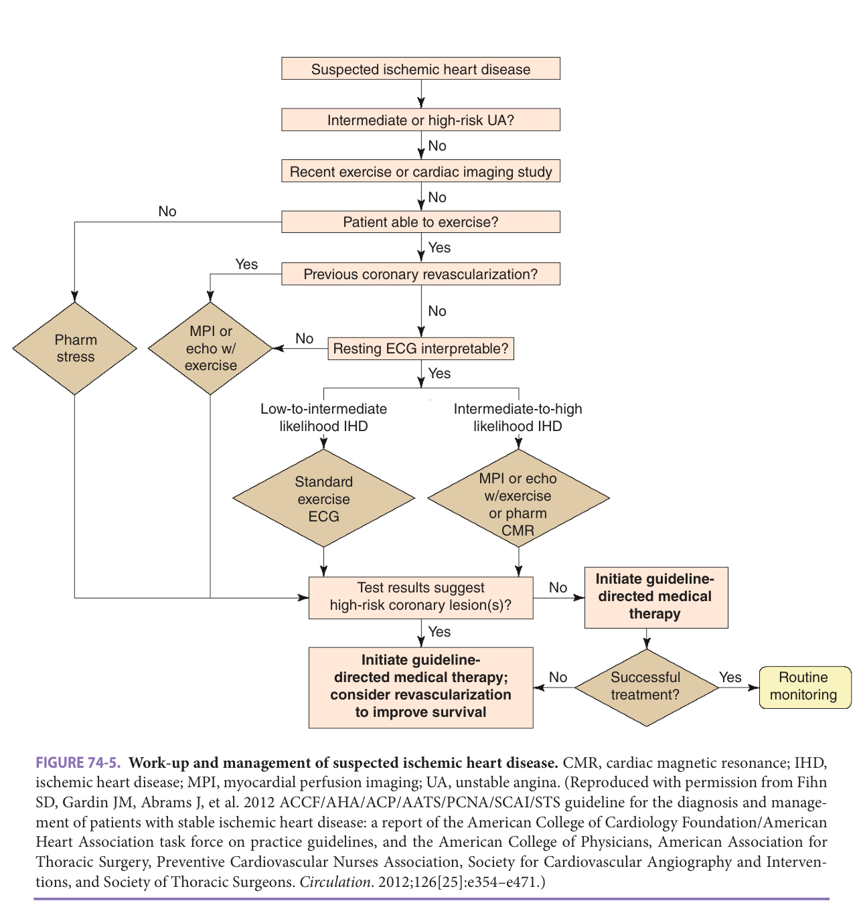

Study summary of Chapter 74 - Coronary Heart Disease and Dyslipidemia; the book and the full chapter are the reference.

# Chapter 74 Study: Coronary Heart Disease and Dyslipidemia

## Summary

**Disease & presentation**
- Coronary disease spans subclinical atherosclerosis, stable ischemia and acute coronary syndromes; ischemia reflects oxygen supply inadequate for myocardial demand (p1133).
- Typical angina remains the most common presentation regardless of age; dyspnea, fatigue or epigastric discomfort can delay recognition (p1133).
- More than **80%** of US coronary deaths occur after **65**. High baseline risk makes appropriate treatment consequential (p1133).

**Assessment**
- New, progressive or refractory symptoms need expedited, sometimes inpatient evaluation. Assess symptoms and risk factors rather than dismissing complaints because of age (p1137).
- Functional testing remains useful; modified exercise or pharmacologic stress protocols can accommodate limitations (p1133).
- After MI, assess ventricular function and coronary severity. For NSTEMI, invasive assessment versus an ischemia-driven approach depends on risk and clinical context (p1143).

**Management & drugs**
- Aspirin has strong secondary-prevention evidence; the chapter favors **81 mg daily** in older adults. Higher doses increase bleeding without clear additional efficacy (p1139–1140).
- Primary prevention is different: ASPREE did not improve disability-free survival in healthy older adults and increased major hemorrhage (p1140).
- In adults at least **75** with LDL-C **70–189 mg/dL**, moderate-intensity statin therapy may be reasonable; frailty, functional decline and limited life expectancy can limit benefit (p1141).
- ACE inhibitors are considered with coronary disease plus ventricular dysfunction, diabetes or hypertension; ARBs can substitute for ACE-inhibitor intolerance. Monitor creatinine and potassium (p1143).
- HOPE studied ramipril **10 mg daily** in coronary disease or high-risk patients; this is the trial regimen, not a universal starting dose (p1143).
- Calculate creatinine clearance in ACS patients at least **75**, and reassess as renal function changes; polypharmacy and altered drug responses increase harm (p1147).

**Exam traps**
- Do not transfer aspirin's secondary-prevention benefit directly to healthy older adults (p1139–1140).
- The chapter does not recommend oral anticoagulation solely for acute or chronic coronary disease without another indication: reduced ischemic events can be offset by bleeding (p1140).
- Primary-prevention statin evidence is limited in older adults; risk calculators derived only through age **79** perform suboptimally in older populations (p1141).

## Exam-cited book images

Book images cited by past exams. Tap an image to zoom.

## Figure 74-5 — book image

[2024-May Q3](?chapter=bank&q=mcq-a4e3d6ba430e0534aff9d3e6)

## Exam questions

Past-exam questions linked to this chapter (2):

- [2024-May Q3](?chapter=bank&q=mcq-a4e3d6ba430e0534aff9d3e6)
- [2024-May Q88](?chapter=bank&q=mcq-50a8d3094541c315ba9859cf)
