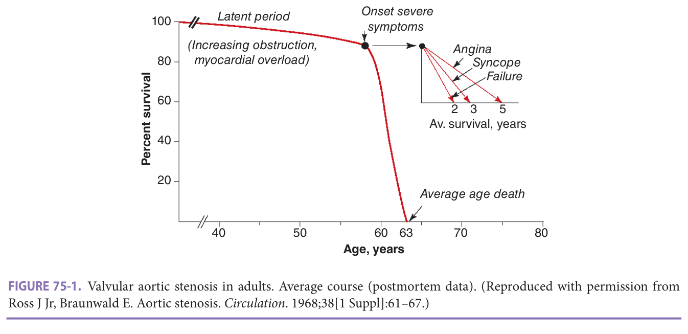
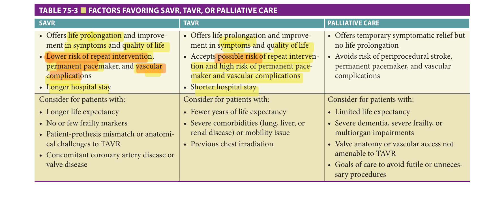
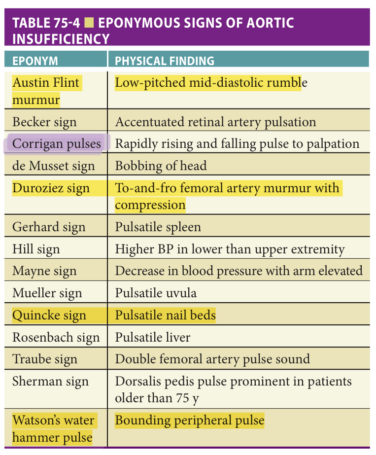
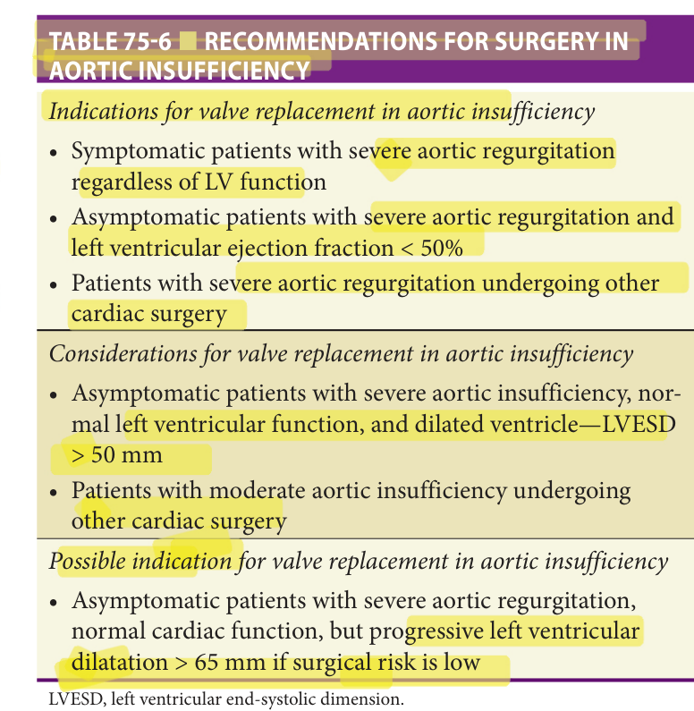
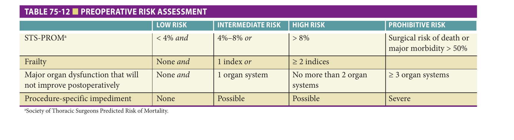
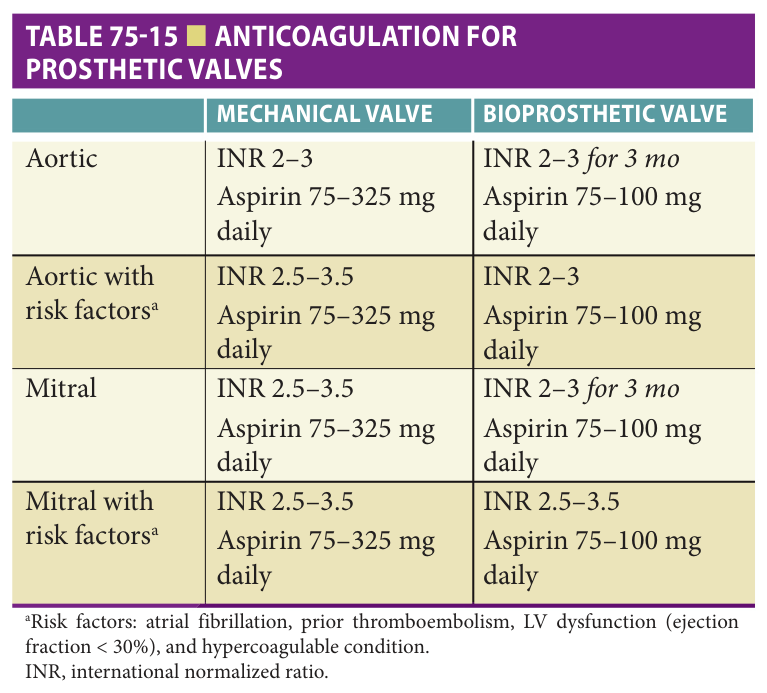

# Hazzard's Geriatric Medicine and Gerontology, 8e — Chapter 75: Valvular Heart Disease

Nikola Dobrilovic, Dae Hyun Kim, Niloo M. Edwards

> **Fast build from the book, 22-23 Sep; not lane-reviewed.**

**[p. 1149]**

#### Learning Objectives

- Describe clinical features, diagnostic modalities, and therapeutic options for common valvular diseases in older patients.
- Identify when patients with valvular disease should be offered surgical intervention.
- Perform shared decision-making discussion about treatment options after considering each patient’s personal goals and surgical and geriatric risk factors.

#### Key Clinical Points

1. Aortic stenosis is very common in older patients, and novel surgical approaches allow older patients a greater number of surgical treatment options.
2. Transcatheter aortic valve replacement (TAVR)—an alternative to surgical aortic valve replacement (SAVR)—may be considered in older patients.
3. Aortic insufficiency is managed similarly in younger and older patients (and currently may not be as well-suited for TAVR).
4. Mitral regurgitation may be structural or functional. Once symptomatic, it is better treated with mitral valve repair than replacement.
5. The primary treatment option for mitral stenosis is valvuloplasty. Surgical intervention is reserved for severely calcified valves and is associated with high risk.
6. Anticoagulation and valve degeneration are the two important risks associated with mechanical and biological prostheses, respectively.
7. A multidisciplinary team approach is advocated to provide patient goal-directed care in managing older patients with valvular heart disease.

## Introduction

As the population ages, valvular heart diseases have become a significant public health problem. The prevalence of moderate or severe valvular heart disease increases with age, from less than 1% in 18- to 44-year-olds to 13% in the population 75 years or older. Without valve replacement, valvular heart disease is associated with decreased survival, functional limitations, and poor quality of life. Due to recent advances in surgical techniques, especially minimally invasive transcatheter valve procedures, older adults who were previously not considered for surgery are treated to improve survival and restore function and quality of life. However, challenges remain as to patient selection for surgical and transcatheter valve procedures, patient goal-directed shared decision-making, and optimization of health status prior to and after the procedure. This chapter summarizes latest evidence on evaluation and management of common valvular heart diseases in older adults, with a focus on the geriatrician’s role in risk assessment and shared decision-making.

## Aortic Stenosis

### Definition

Aortic stenosis is the progressive narrowing of the aortic valve resulting in left ventricular (LV) outflow obstruction during systole. This is in distinction to aortic valve sclerosis, where the valve leaflets are calcified or thickened, but do not cause a meaningful outflow obstruction.

### Epidemiology

Aortic stenosis is present in 2% to 9% of older patients and is the leading clinically significant valvular disorder in older adults. Risk factors for developing aortic stenosis include age, a bicuspid aortic valve, and rheumatic heart disease. In 90% of patients older than 65 years, aortic stenosis is caused by calcific degeneration of a tricuspid aortic valve. Although bicuspid valves are relatively common (~2% of the population), these patients present with stenosis earlier usually in the fourth to sixth decade of life. Similarly, rheumatic heart disease also presents earlier in life and often in association with concurrent mitral valve disease.

**[p. 1150]**
**Table 75-1 — Echocardiographic findings in aortic stenosis**

| | MILD | MODERATE | SEVERE |
|---|---|---|---|
| Aortic valve area (cm²) | > 1.5 | 1.0–1.5 | < 1.0 |
| Velocity (m/s) | < 3 | 3–4 | > 4 |
| Mean gradient (mm Hg) | < 25 | 25–40 | > 40 |

### Pathophysiology

Although the causes of aortic valve calcification in aging are unclear, the process bears many similarities to atherosclerosis—both diseases are characterized by lipid deposition, inflammation, neoangiogenesis, and calcification. Bicuspid aortic valves are characterized by accelerated calcification and progressive outflow obstruction in the majority of patients. Rheumatic fever results in progressive fusion of the aortic valve leaflets causing both aortic valve stenosis and regurgitation. Aortic stenosis is classified as mild, moderate, or severe based on valve area, ejection velocity, and the pressure gradient that develops across the valve ( **Table 75-1** ).

Aortic valve sclerosis (valve thickening without outflow tract obstruction) is present in 25% of patients older than 65 years and 48% of those older than 75 years, and is associated with male gender, hypertension, smoking, diabetes, and lipid abnormalities. The rate of progression to frank stenosis occurs in approximately 10% within 5 years. The Cardiovascular Health Study has identified an increased incidence of adverse cardiovascular events in patients with sclerotic valves even when corrected for other cardiovascular risk factors. The mechanism for this association is unclear, and there are currently no guidelines for intervention.

On average, aortic valve stenosis progresses at an estimated increase in jet velocity of 0.3 m/s/year and a reduction ....

> in valve area of 0.1 cm -2 /year. Despite these average rates of disease progression, the rate for each individual is difficult to predict, therefore asymptomatic patients with mild-to-moderate disease should be followed on a regular basis.

### Clinical Presentation

Aortic stenosis has a long asymptomatic latency period, when the only finding is a harsh, late-peaking, crescendodecrescendo systolic murmur that radiates to the carotids and is best heard over the right, second interspace. The second heart sound may be paradoxically split. Aortic stenosis is associated wit <mark>h “pulsus parvus et tardus,”</mark> characterized by a weak and diminished pulse with a late upstroke that is most easily noted in the carotids. However, these physical findings may be less obvious in older adults, because of the effects of aging on the vascular bed.

Patients with aortic valve stenosis develop compensatory LV hypertrophy, which can be seen on echocardiogram, on electrocardiogram, and even on chest x-ray. The ventricular hypertrophy produces coronary malperfusion with subendocardial ischemia. Older women are prone to develop excessive ventricular hypertrophy, which may contribute to the higher perioperative morbidity and mortality in this patient cohort.

Once symptoms develop after a long latency period, the progression to death is rapid ( **Figure 75-1** ). The three classic symptoms are angina, syncope, and heart failure. While sudden death occurs in patients with aortic stenosis and may be considered a fourth symptom group, this is rarely seen in asymptomatic patients (< 1%). Unfortunately, older adults often move into the symptomatic phase of aortic stenosis undetected because of the overlap of these major symptom constellations with other changes associated with aging (eg, reduced exercise tolerance).

> Two-thirds of patients present with angina, which - - may be caused by concomitant coronary artery disease,

> *FIGURE 75-1. Valvular aortic stenosis in adults. Average course (postmortem data). (Reproduced with permission from Ross J Jr, Braunwald E. Aortic stenosis. _Circulation_ . 1968;38[1 Suppl]:61–67.)*

> Highlighting is the owner's annotation, not the book's.

**[p. 1151]**
although 40% do not have significant coronary artery disease. The most likely etiology for angina in the absence of coronary artery disease is subendocardial ischemia and the increased oxygen demands of the hypertrophied ventricle together with decreased coronary flow reserve. Untreated ~ patients with aortic stenosis and angina <mark>have a 50% 5-year</mark> survival.

~

Syncope due to aortic stenosis may be caused by inadequate cardiac output to meet demands, by a dysfunctional LV baroreceptor response, or by arrhythmias, and is associated with a 50% 3-year mortality without valve l_ ___. replacement.

Aortic valve stenosis presenting with congestive heart failure <mark>carries the worst prognosis—50%</mark> mortality at 2 years without valve replacement. Typical symptoms include paroxysmal nocturnal dyspnea, orthopnea, and dyspnea on exertion, which may be associated with signs of peripheral edema, pulmonary edema, and rales. Thickening of the left ventricle due to aortic stenosis as well as the changes associated with aging lead to diastolic dysfunction. Consequently, the older patient with aortic stenosis is more dependent on atrial contraction for ventricular filling. Therefore, these patients often present with exacerbated or new onset of symptoms if they develop atrial fibrillation.

Impaired platelet function and decreased levels of

von Willebrand factor are also associated with severe aortic stenosis, and 20% of patients may present with epistaxis or ecchymoses. Patients can also develop Heyde syndrome (gastrointestinal bleeding due to colonic angiodysplasias). Interestingly, these abnormalities resolve with valve replacement.

### Evaluation

The American Heart Association recommends evaluation of early systolic, mid-systolic grade 3 or greater, late systolic, or holosystolic murmurs with echocardiography. - Older patients may present with ominous murmurs due to aortic valve sclerosis without significant valvular stenosis. Transthoracic echocardiography is the study of choice since it allows evaluation of valve morphology, severity of stenosis, and degree of LV hypertrophy and function. Echocardiography is also useful for following disease progression.

Stress echocardiogram can be utilized in asymptomatic patients with severe aortic stenosis to assess for physiologic changes that may indicate the need for earlier intervention. Computed tomography (CT) angiography is routinely used in patients being considered for transcatheter aortic valve replacement (TAVR) but is not helpful in assessing severity of aortic stenosis. Cardiac magnetic resonance imaging (MRI) is sometimes helpful in evaluating the severity of stenosis but is not widely used. Cardiac -

catheterization is routinely performed in older patients who are scheduled for valve replacement, in order to diagnose concomitant coronary artery disease and to measure transvalvular gradients if there is a question of severity of stenosis.

### Management

**Asymptomatic patients** Survival of asymptomatic patients is the same as age-matched individuals without aortic - stenosis. However, given the significant decline in survival once symptoms develop, it is essential to consider surgical intervention and to confirm the absence of symptoms in patients who do not appear symptomatic. If a careful history fails to elicit symptoms in patients with severe aortic stenosis, exercise testing may be considered. However, exercise testing in symptomatic patients is contraindicated because of the high risk of severe hemodynamic compromise.

Patients who are asymptomatic by history but who, on exercise testing, develop symptoms, fail to generate a 20 mm Hg increase in blood pressure, or develop STsegment abnormalities, have a 19% 2-year symptom-free survival compared with 85% for patients who do not manifest these abnormalities on exercise testing. Exercise testing may elicit symptoms in as many as a third of patients thought to be asymptomatic by history alone. Close supervision and prompt termination of the study at any decline in blood pressure, significant ST-segment depression, or onset of arrhythmia is strongly advocated. On average, the probability of a patient with severe aortic stenosis remaining symptom-free at 5 years is only 50%, which has prompted some to recommend earlier surgery while the patient is “younger” and in better health.

If the patient is truly asymptomatic, continued frequent routine monitoring is reasonable, but patients should be instructed to report the development of angina, syncope, or any signs of congestive heart failure. Monitoring by echocardiography should include annual or biannual examinations for patients with severe aortic stenosis, whereas examinations should be performed every 1 to 2 years for patients with moderate aortic stenosis, every 3 to 5 years if the stenosis is mild, and as needed with referral - for possible valve replacement if the patient develops symptoms. Patients who are demonstrated to be symptom-free need not restrict their activity and may exercise.

**Symptomatic patients** Once patients develop symptoms, they should be considered for valve replacement. Currently, there is no documented medical treatment that will delay or reverse aortic stenosis. Therefore, medical management is palliative and mainly reserved for patients with a remaining life expectancy less than 1 year even with a successful procedure or high chance of poor outcomes (death or no symptom reduction) due to advanced age, frailty, dementia, and other systemic conditions. Although standard guidelines for the management of hypertension are recommended, β-blockers are salutary in patients with concomitant coronary artery disease, and angiotensin-converting enzyme (ACE) inhibitors may have a beneficial effect in LV fibrosis. Diuretics are discouraged if the left ventricle is small due to the potential decrease in cardiac output. Statins have not demonstrated a regression of stenosis in randomized controlled trials, although they are indicated

**[p. 1152]**

> for patients with concomitant coronary artery disease or at high risk for atherosclerotic cardiovascular disease.

Aortic valve replacement—surgical aortic valve replacement (SAVR) or TAVR—should be considered for all symptomatic patients whose remaining life expectancy is at least 1 year (ie, no other significant life-limiting systemic disease) because of the improvement in both symptoms and survival. Current American College of Cardiology/ American Heart Association recommendations are listed in **Table 75-2** . Due to the increased risk of sudden death, replacement should be performed as soon as feasible after the development of symptoms.

**Percutaneous aortic valvuloplasty** Balloon aortic valvuloplasty (BAV) is not a substitute for valve replacement but it can be a useful tool in the treatment armamentar-

ium for temporary palliation of symptoms for nonsurgical candidates or as a bridge for patients with hemodynamically unstable aortic stenosis. The procedure uses transvalvular balloon inflation to crack the calcified aortic valve. Unfortunately, the maximum enlargement rarely exceeds 1.0 cm2 (severe-to-moderate aortic stenosis), carries a 10% risk of complications, and results in restenosis within 6 months to a year. One-year actuarial mortality is 35% to

**Table 75-2 — American college of cardiology/ american heart association recommendations for valve replacement in aortic stenosis**

- *Indications for valve replacement in aortic stenosis*: - Symptomatic patients with severe aortic stenosis

- Asymptomatic patients with severe aortic stenosis and left ventricular dysfunction (ejection fraction <mark>< 50%</mark> )

- Asymptomatic patients with severe aortic stenosis undergoing other cardiac surgery

- Symptomatic patients with low-flow/low-gradient severe aortic stenosis with left ventricular dysfunction

- Symptomatic patients with low-flow/low-gradient severe aortic stenosis and LVEF > 50%, if clinical, hemodynamic, and anatomic data support valve obstruction as the most likely cause of symptoms
- *Considerations for valve replacement in aortic stenosis*: - Asymptomatic patients with severe aortic stenosis, low surgical risk, and decreased exercise tolerance or a fall in blood pressure with exercise

- Asymptomatic patients with very severe aortic stenosis, de

fined by aortic velocity ≥ 5 m/s, and low surgical risk

- Asymptomatic patients with severe aortic stenosis, low surgical risk, and serum B-type natriuretic peptide level > 3 times normal

- Asymptomatic patients with severe aortic valve stenosis, low surgical risk, and rapid disease progression

_Possible indication for valve replacement in aortic stenosis_

- Patients with moderate aortic stenosis undergoing other cardiac surgery

LVEF, left ventricular ejection fraction.

50%, which is no better than untreated aortic stenosis, but it can result in significant temporary relief of symptoms and improvement in quality of life and can be a useful tool to optimize acutely decompensated patients prior to TAVR or SAVR. BAV is often a component of TAVR, used immediately preceding valve deployment. Currently, though, the BAV step is being skipped in favor of using a single step deployment technique.

**Surgical aortic valve replacement** Given long-term durability data (rate of primary structural deterioration is approximately 10% after 15–20 years), SAVR with a bioprosthetic valve can be considered for patients older than 65 years. Age alone is not a contraindication to SAVR, as numerous studies have demonstrated outcomes in carefully selected older patients to be comparable to those seen in younger patients. Operative mortality in older patients ranges from 3% to 4% to as high as 24%, depending on patient selection. Medicare outcomes data for 142,000 patients older than 65 years demonstrate an operative mortality of 8.8% overall, and 6.0% mortality in high-volume centers.

Operative risk associated with SAVR should be assessed using the Society of Thoracic Surgeons (STS) Predicted Risk of Mortality or EuroSCORE II risk calculator. Predictors of surgical mortality include emergency surgery, right heart failure, severity of symptoms (New York Heart Association [NYHA] class IV), renal insufficiency, female gender, depressed LV function, associated coronary bypass, or concomitant mitral valve surgery. Emergency surgery increases the surgical risk substantially and is often the result of not referring the patient for elective surgery because it is “too risky,” but reconsidering surgery when the patient is critically ill and the medical options have dwindled to none. Unfortunately, the result is a self-fulfilling prophecy that older patients will not do well with surgery. A European study of older patients with aortic stenosis provocatively demonstrated that 41% of patients older than 70 years were not offered surgery despite severe valve stenosis and symptoms. These findings were corroborated in a second study of 1200 patients from 92 centers in 25 countries. In this study, 33% of patients older than 75 years with severe symptomatic aortic stenosis were not offered valve replacement.

Although many studies have found that concomitant coronary artery bypass or mitral valve surgery increases the surgical risk, there is clear support for performing concomitant aortic valve replacement for any patient with severe aortic stenosis, who is undergoing any other cardiac surgical procedure, regardless of symptoms. Similarly, in patients with moderate stenosis, it is “accepted practice” to replace the aortic valve at the time of other cardiac surgery. Simultaneous valve replacement in patients with mild aortic stenosis undergoing heart surgery is more controversial, although an argument can be made for concomitant replacement in patients with mild stenosis but moderate-to-severe valve calcification. However, some of the calculus of risk is changing with the availability of TAVR.

**[p. 1153]**
**Transcatheter aortic valve replacement** An alternative to SAVR is TAVR, in which a catheter-mounted bioprosthetic valve is deployed across the aortic valve. The valve can be introduced through the femoral artery, the apex of the heart, subclavian artery, carotid artery, or the aorta via small incisions. Alternatively, peripheral arteries such as femoral and subclavian can be accessed percutaneously and controlled using minimally invasive closure devices such as _Perclose Proglide_ (Abbott Cardiovascular, Plymouth, MN).

Randomized controlled trials demonstrated that TAVR, particularly transfemoral TAVR, is as effective as SAVR in symptomatic older patients who are considered low, intermediate, and high operative risk, with different procedural risks of complications. TAVR is associated with lower rates of postoperative stroke, major bleeding, and atrial fibrillation, as well as faster recovery. However, the rates of paravalvular leak, vascular complications, and pacemaker implantation are higher with TAVR. Because durability of TAVR valves beyond 5 years is unknown, some - patients may need a reintervention (“valve-in-valve” procedure). In symptomatic patients with prohibitive SAVR risk, defined as STS Predicted Risk of Morbidity and Mortality of over 50% due to comorbid disease or serious irreversible conditions, TAVR reduces mortality, hospitalizations, and symptoms, but causes higher rates of stroke and vascular complications, compared to medical management with or without percutaneous aortic valvuloplasty.

**Surgical versus transcatheter aortic valve replacement** The choice of SAVR versus TAVR should involve shared decision-making that carefully considers the patient’s age, -- preferences, procedure-specific risk factors or contraindications, procedural complications, and durability of the value relative to the patient’s remaining life expectancy ( **Table 75-3** ). A multidisciplinary team approach is invaluable for optimal procedure selection (TAVR vs SAVR). This approach to individualized risk assessment is described later in this chapter.

## Aortic Insufficiency

### Definition

Aortic insufficiency occurs when the aortic valve fails to close during diastole resulting in blood flow from the aorta back into the left ventricle.

### Epidemiology

Acute aortic regurgitation is uncommon and presents a surgical emergency. Chronic aortic insufficiency occurs in 20% to 30% of individuals older than 65 years and like aortic stenosis has a long asymptomatic latency period. However, even asymptomatic patients with normal LV function have a 0.2% incidence of sudden death, progress to symptomatic disease at a rate of approximately 3.5% per year, and develop either LV dysfunction or symptoms at a rate of approximately 6% per year. Once patients develop LV dysfunction, more than 25% each year will progress to symptomatic disease and, once symptomatic, the mortality rate for aortic regurgitation is more than 10% per year. Patients with NYHA class III or IV symptoms have an annual mortality rate of 25%, while patients with less - severe symptoms (NYHA class II) have a 6% annual mortality rate.

Risk factors for the development of LV dysfunction, symptoms, or death include age, left ventricular end-systolic dimension (LVESD)/volume, left ventricular end-diastolic dimension (LVEDD)/volume, and LV ejection fraction with exercise. Each year 19% of patients with end-systolic size greater than 50 mm develop LV dysfunction and symptoms or die. The rate of development of these same end points was 6% per year for patients with endsystolic size between 40 and 50 mm.

### Presentation

The findings and eponyms associated with aortic insufficiency are a delight to lovers of medical trivia ( **Table 75-4** ).

> *Table 75-3 — Factors favoring SAVR, TAVR, or palliative care (printed p. 1153).*

> Highlighting is the owner's annotation, not the book's.

**[p. 1154]**

> *Table 75-4 — Eponymous signs of aortic insufficiency (printed p. 1154).*

> Highlighting is the owner's annotation, not the book's.

However, the most obvious physical findings are those of a diastolic murmur and a widened pulse pressure.

Patients with acute aortic regurgitation usually present dramatically in cardiogenic shock. The most common causes are infective endocarditis and acute aortic dissection. Data suggest a dramatically large, recent increase in opiate intravenous drug abuse as a cause for endocarditis. This effect is nationwide, although it seems to be disproportionately seen in younger adults and much less in the geriatric population. However, the geriatric patient still tends to be affected by more traditional etiologies of endocarditis, such as infected foreign bodies (dialysis catheters and access, other catheters, intravenous pacing leads), dental infection, remote abscesses, sepsis, and pneumonia.

Chronic aortic regurgitation progresses slowly and insidiously. Occasionally palpitations or awareness of each heartbeat may be the first signs owing to the large regurgitant volumes. Infrequently angina may develop due to coronary flow mismatch, and as the ventricle fails congestive heart failure develops with symptoms of dyspnea on exertion, orthopnea, paroxysmal nocturnal dyspnea, and lower extremity edema.

### Evaluation

Echocardiography is the diagnostic modality of choice for both initial evaluation as well as routine follow-up. It provides both diagnostic confirmation, assessment of the severity of valve regurgitation, as well as evaluation of LV function and the aortic root. It can also help determine the etiology of the aortic regurgitation (eg, infective endocarditis or aortic dissection). The clinical stages and management recommendations are defined by symptomatic status, severity of the regurgitation, LV volume, and LV systolic function (**Table 75-5**). Transesophageal echocardiography may improve sensitivity and specificity.

**Table 75-5 — Severity of aortic regurgitation**

| | MILD | MODERATE | SEVERE |
|---|---|---|---|
| Ratio of regurgitant jet width to LV outflow tract (%) | < 25 | 25–64 | ≥ 65 |
| Vena contracta (cm) | < 0.3 | 0.3–0.59 | ≥ 0.6 |
| Regurgitant volume (mL/beat) | < 30 | 30–59 | ≥ 60 |
| Regurgitant fraction (%) | < 30 | 30–49 | ≥ 50 |
| Effective regurgitant orifice area (mm²) | < 10 | 10–29 | ≥ 30 |

Exercise testing may be reasonable for asymptomatic patients who wish to initiate an exercise regimen, but the results have not been consistently useful in predicting outcomes for asymptomatic patients with normal resting cardiac function. It may also be used to objectively assess exercise capacity in otherwise asymptomatic patients or patients with equivocal symptoms.

CT angiography is useful for the diagnosis and follow-up of patients with aortic dissections, aneurysms, or annuloaortic ectasia. Magnetic resonance angiography (MRA) similarly allows for evaluation and follow-up of aortic disease and also provides a quantitative assessment of aortic regurgitation, which can be helpful in patients with suboptimal echocardiographic images or if there is discordance between clinical assessment and noninvasive studies.

Cardiac catheterization is routinely performed in patients being evaluated for aortic valve replacement, and provides intraventricular pressure measurements, but is not recommended for routine quantification of aortic regurgitation. It is contraindicated in acute aortic dissection or when there are large mobile vegetations on the aortic valve.

### Management

> **Medical management** - Surgery is indicated for patients who develop either angina or signs of congestive heart failure, since the mortality for patients with angina is more than 10% per year and for heart failure is more than 20% per year. Medical management in symptomatic patients results in poor outcomes even if the LV function is normal. Patients older than 75 years are more likely to develop either symptoms or ventricular dysfunction at earlier stages of the disease, and have a poorer prognosis once they develop ventricular dysfunction.

The medical management of aortic insufficiency is best achieved with vasodilators that reduce afterload and wall stress. Since symptomatic disease carries such a poor prognosis without surgery, medical management is

**[p. 1155]**
primarily indicated for patients who are not surgical candidates because of comorbidities, to preoperatively optimize hemodynamics, or for asymptomatic hypertensive patients with normal ventricular function. Conflicting data exist as to the benefits of hydralazine, ACE inhibitors, and calcium channel blockers, which suggest that vasodilator therapy is not indicated for asymptomatic, normotensive patients with normal ventricular function. However, once symptoms or ventricular dysfunction develops, the patient should be considered and evaluated for surgery. Although β-blockers are not recommended as first-line medication for management of hypertension due to its bradycardic effect, they may benefit those patients who have LV dysfunction.

The absence of data indicating that exercise contributes to the progression of aortic insufficiency suggests, that the asymptomatic patient with normal LV function may participate in the full range of physical activities, with the exception of isometric exercises, which are contraindicated. However, it is prudent to exercise-test patients to the anticipated level of planned activity to assess tolerance prior to initiating an exercise regimen.

Patients with aortic regurgitation should have regularly scheduled follow-up. Mild regurgitation with normal ventricular function can be followed clinically on an annual basis with biennial or triennial echocardiograms; more severe valvular regurgitation should be followed with annual or even biannual echocardiograms depending on the presence of ventricular dilatation (60 mm). Asymptomatic patients with more severe dilatation ( _>_ 70 mm) should be followed with --echocardiograms every 4 to 6 months because the likelihood of developing symptoms or ventricular dysfunction is as high as 20% per year. Asymptomatic patients with normal LV function and dilated ventricles (LVESD > 50 mm) may be candidates for early valve replacement.

The hospital clinician should also be aware that while intra-aortic balloon counterpulsation is an excellent adjunct to medical therapy in the appropriate patient, it is contraindicated in patients with aortic insufficiency.

**Surgical management** Surgery is not indicated for asymptomatic patients with normal ventricular function and minimal ventricular dilatation regardless of the severity of valvular regurgitation. However, once symptoms or LV dysfunction develop in patients with severe aortic regurgitation, the patient should be considered for surgery ( **Table 75-6** ). Patients with severe LV dysfunction have a high operative mortality (at least 10%) and a lower postoperative survival; therefore, asymptomatic patients should be closely followed for the development of LV dysfunction.

In older patients with severe compensated aortic insufficiency, the onset of symptoms can be hard to ascertain, since mild dyspnea on exertion and fatigue often mimic the effects of aging. However, once ventricular dysfunction develops, the older patient is more likely to have persistent postoperative ventricular dysfunction and symptoms, as well

> *Table 75-6 — Recommendations for surgery in aortic insufficiency (printed p. 1155).*

> Highlighting is the owner's annotation, not the book's.

as decreased postsurgical survival. Therefore, in patients without comorbidities that contraindicate surgery, an earlier commitment to surgery is generally the preferred strategy.

If the patient is asymptomatic but the LVESD exceeds 65 mm, surgery should be considered if it is low risk, because of the high risk of sudden death. Although the surgical treatment of asymptomatic patients with severe aortic regurgitation and LV dilatation is controversial, if surgery is planned based on ventricular size or function, then two consecutive studies should confirm the findings.

Surgical valve replacement is the treatment of choice for symptomatic patients with aortic insufficiency. Patients with annuloaortic ectasia or concomitant ascending aortic aneurysms may be candidates for aortic valve repair and replacement of the ascending aorta (David procedure), although such procedures are usually reserved for experienced centers. This procedure should be judiciously used in older adults, in whom the operative risk is usually higher and aortic valve replacement alone is simpler and carries a more predictable result. Various new techniques in aortic leaflet repair and reconstruction have enjoyed recent popularity. They are mentioned here for completeness, although their application is likely more appropriate in a younger patient population. TAVR is currently not recommended in patients with aortic insufficiency.

## Mitral Stenosis

### Definition

Mitral valve stenosis is the progressive narrowing of the orifice of the mitral valve with a resultant increase in left atrial, pulmonary artery, and right ventricular pressures.

**[p. 1156]**
### Epidemiology

The overwhelming majority of mitral stenosis is caused by rheumatic heart disease, which causes thickening and calcification of the leaflets and chordae as well as shortening of the chordae and fusion of the commissures. While this tends to occur in the younger patients and is rarely seen in older patients, the number of older patients may be increasing. In developed countries, most patients present in their forties and fifties, but some studies note that a third of patients are older than 65 years. Only 60% of patients presenting with mitral stenosis recall a history of rheumatic fever, the disease progresses very slowly, and it is estimated that mitral valve area, which normally measures 4.0 to 5.0 cm2 , decreases by 0.09 to 0.32 cm2 /year. When the valve area is reduced to 2.5 to 1.5 cm2 , patients usually develop ·---symptoms. Significant valvular disease lags the development of rheumatic fever by 20 to 40 years. However, once symptoms start, the 10-year survival is only 50% to 60%. Patients who are asymptomatic or with minimal symptoms have an 80% 10-year survival, and 60% have no progression of symptoms. Patients who meet criteria for surgery but do not get operated on have a 10-year survival below 30%. Patients with severe pulmonary hypertension usually live fewer than 3 years, and most patients will die from progressive pulmonary hypertension, congestive heart failure, systemic emboli, pulmonary emboli, or infection.

Senile calcific mitral stenosis is becoming more common in the United States. This is usually associated with mitral annular calcification that extends into the leaflets and is prevalent in patients with decreased renal function, elevated inflammatory markers, and in patients with senile aortic stenosis. Although not all patients develop progressive stenosis, the rate of progression, when it occurs, is accelerated compared to rheumatic disease.

Other rarer causes of mitral stenosis include intracardiac clot, intracardiac tumor (such as myxoma), or congenital malformations.

### Presentation

Mitral stenosis often presents with new-onset atrial fibrillation or an embolic event; sometimes patients come to medical attention because of fatigue or dyspnea and rarely due to hemoptysis. The left recurrent laryngeal nerve can be compressed by the enlarged left atrium, causing hoarseness (Ortner syndrome). The onset of atrial fibrillation sometimes results in pulmonary edema and death. On physical examination an opening snap may be noted to the first heart sound as well as a diastolic rumble.

### Diagnosis

Evaluation of patients with suspected mitral stenosis includes an echocardiogram, both to confirm the diagnosis and assess the severity of the disease and therapeutic options (**Table 75-7**). Patients have mild mitral stenosis if the valve area is greater than 1.5 cm², moderate if the valve area is 1.0 to 1.5 cm², and severe if the mitral valve area is less than 1.0 cm². Additionally, pulmonary pressures should be assessed, since this also determines the disease severity.

**Table 75-7 — Echocardiographic findings in mitral stenosis**

| | MILD | MODERATE | SEVERE |
|---|---|---|---|
| Mitral valve area (cm²) | > 1.5 | 1.0–1.5 | < 1.0 |
| Pulmonary artery pressure (mm Hg) | < 30 | 30–50 | > 50 |
| Mean gradient (mm Hg) | < 5 | 5–10 | > 10 |

Transesophageal echocardiography is useful when transthoracic echocardiography provides limited images, when the presence of left atrial thrombus needs to be excluded, or when valvuloplasty is contemplated.

Cardiac catheterization is rarely used to facilitate assessment of mitral valve gradient. It is however recommended in assessing the coronaries as part of preoperative work-up, particularly in the older patient. Stress testing has a value when there is discrepancy between echocardiographic severity of mitral stenosis at rest and clinical symptoms. CT scanning is valuable in patients with senile mitral stenosis, especially those considered for surgical intervention as it complements the echocardiographic assessment of mitral annular and leaflet calcification.

### Management

**Medical management** It should be emphasized that medical management cannot reduce a mechanical narrowing like mitral stenosis. However, increasing diastolic filling time by slowing the heart rate with β-blockade may be helpful in patients in sinus rhythm and exertional symptoms. The addition of sodium restriction and a diuretic ameliorates pulmonary edema. Antibiotic prophylaxis for infective endocarditis is reserved for patients at highest risk for developing infective endocarditis or experiencing complications (see General Considerations below). Asymptomatic patients should be followed closely for the development of symptoms, at which time they should be assessed by echocardiogram.

A substantial number of older patients (30%–40%) will present with atrial fibrillation. Both, age and left atrial - --size, are predictive of the developing atrial fibrillation. Unfortunately, atrial fibrillation carries a guarded prognosis, since only 25% of mitral stenosis patients with atrial fibrillation will survive 10 years compared to 46% of those who remain in sinus rhythm. Treatment includes anticoag--ulation, rate control, and electrical or chemical cardioversion, especially if associated with hemodynamic instability. - Patients who remain in atrial fibrillation for more than 24 to 48 hours are at increased risk of embolic complications and should be promptly anticoagulated. Electrical cardioversion may be used but only after confirming the absence of a left atrial thrombus by echocardiogram. If a thrombus is present, treatment may include 3 weeks of anticoagulation,

**[p. 1157]**

followed by confirmation of the absence of thrombus by repeat echocardiography and subsequent defibrillation. In this setting, transesophageal echocardiography is the diagnostic tool of choice.

Patients with paroxysmal or persistent atrial fibrillation, prior emboli or left atrial thrombus should be anticoagulated. Systemic emboli occur in 20% of patients and age and atrial fibrillation are predictive of embolization.

Exercise is not contraindicated in asymptomatic patients with mild mitral stenosis. In patients with more severe stenosis, exercise is often limited by symptoms. Therefore exercise regimens for patients with more symptomatic or severe disease should be individually tailored. **Percutaneous mitral valvuloplasty** Percutaneous mitral valvuloplasty is successful in select patients and often doubles the valve area with a substantial decrease in valve gradient. The selection of patients for this treatment option is determined by echocardiographic assessment of the valve, and is based on leaflet mobility, subvalvular apparatus, leaflet thickening, and the presence of calcification (Wilkins Score). The lowest scores are assigned to valves with the greatest leaflet mobility, the least subvalvular thickening, the most normal leaflet thickness, and the least calcium deposition. Patients with these valve characteristics (low-

- est scores) have the best response to balloon valvuloplasty. The majority of patients (90%) will see symptomatic relief, with a freedom from valve-related complications or death of between 50% and 65% at 7 years and as high as 80% to 90% in patients with favorable (low) preprocedural echocardiographic scores.

Symptomatic patients or patients with pulmonary hypertension, those with favorable echocardiographic mitral valve scores and without atrial thrombi, should be referred for mitral valvuloplasty. The risks for percutaneous mitral valvuloplasty are low ( **Table 75-8** ). Therefore, even patients with less favorable echocardiographic scores who are at high surgical risk may be considered candidates for this approach. However, balloon valvuloplasty is contraindicated in patients with moderate-to-severe mitral regurgitation and/or the presence of left atrial clot. Unfortunately, patients older than 65 years have a lower success rate, higher incidence of complications, and shorter duration of symptom relief with this approach.

**Surgical management** As a result of the success of balloon valvuloplasty in patients with favorable valve morphology, surgery is usually indicated only if the patient has failed percutaneous intervention or if the valve has unfavorable characteristics (high Wilkins Score) for balloon valvuloplasty. Patients with mitral stenosis ineligible for valvuloplasty are best treated surgically, as are patients with left atrial thrombus. Additionally, since balloon valvuloplasty requires a significant level of expertise and the outcomes are related to experience, the American Heart Association recommends surgery if this experience is not available.

Patients with mild symptoms, severe pulmonary hypertension, and moderate-to-severe mitral stenosis may also benefit from surgery if balloon valvuloplasty is not appropriate or available. Similarly, patients with recurrent systemic emboli despite therapeutic anticoagulation may benefit from surgical intervention if ineligible for percutaneous treatment (**Table 75-9**). Notably, surgery is not recommended for patients with isolated mild mitral stenosis.

The surgical options include open repair with commissurotomy or valve replacement with either a mechanical

**Table 75-8 — Complications of percutaneous mitral valvuloplasty**

| COMPLICATION | PROCEDURAL RISK (%) |
|---|---|
| Left ventricular perforation | 0.5–4.0 |
| Systemic embolization | 0.5–3.0 |
| Myocardial infarction | 0.3–0.5 |
| Death | 1.0–2.0 |

**Table 75-9 — Surgical recommendations for mitral stenosis**

- *Indications for valve intervention in mitral stenosis*: - Percutaneous mitral balloon valvuloplasty is recommended in symptomatic patients with severe mitral stenosis, favorable morphology, and absence of contraindications

- Severely symptomatic patients (NYHA class III–IV) who are unable to undergo balloon valvuloplasty (owing to unavailability, contraindications, or unfavorable valve score) and - are not high risk for surgery

- Patients with severe stenosis undergoing other cardiac surgery
- *Considerations for valve intervention in mitral stenosis*: - Mildly symptomatic patients with severe mitral stenosis and severe pulmonary hypertension if ineligible for balloon valvuloplasty

- Percutaneous mitral balloon valvuloplasty is reasonable in asymptomatic patients with very severe mitral stenosis (MVA ≤ 1.0 cm2 ), favorable morphology, and absence of contraindications

_Possible indications for valve intervention in mitral stenosis_

- Patients with moderate mitral stenosis undergoing other cardiac surgery

- Patients with severe mitral stenosis and recurrent emboli despite anticoagulation

- Percutaneous mitral balloon valvuloplasty may be considered in patients with severe mitral stenosis, new onset of atrial fibrillation with favorable morphology, and absence of contraindications

- Percutaneous mitral balloon valvuloplasty may be considered in symptomatic patients with severe mitral stenosis, suboptimal morphology who are not candidates for surgery or at high risk for surgery

- Percutaneous mitral balloon valvuloplasty may be considered in patients with mitral stenosis less than severe if there is evidence of hemodynamically significant stenosis during exercise

MVA, mitral valve area; NYHA, New York Heart Association.

**[p. 1158]**

> or a bioprosthetic valve. The surgical risk increases with decreased preoperative functional status, older age, decreased cardiac function, pulmonary hypertension, and the presence of coronary artery disease. Operative mortality can be as high as 20% in the older patient with significant comorbidities and pulmonary hypertension. Nonetheless, it is not recommended to wait until the patient becomes severely symptomatic (NYHA class IV), since this results in a substantial increase in the surgical risk. Conversely, surgery should be considered despite severe symptoms, since both quality of life and survival are exceedingly poor without surgical intervention.

Patients with senile calcific mitral stenosis often present a surgical challenge, because the calcification involves the annulus and the base of the leaflets. Valve replacement is complex and often involves annular debridement with reconstruction, which significantly increases the operative risk. Therefore, intervention is often delayed until symptoms are severely limiting and cannot be managed medically.

Atrioventricular groove disruption is a rare but catastrophic complication of heart surgery. It is almost exclusively seen with mitral valve procedures and is most closely associated with two risk factors, age and mitral annular calcification.

## Mitral Regurgitation

### Definition

Mitral valve regurgitation is the inability of the mitral valve to close properly resulting in regurgitation of volume into the left atrium from the left ventricle during systole. It is important to distinguish between primary (organic) and secondary (functional) mitral regurgitation since this has implications in both treatment and prognosis.

### Epidemiology

Significant mitral regurgitation occurs, equally in men and women—approximately 2% of the population. The most common cause is mitral valve prolapse, which is present in 1% to 2.5% of the population and can occur either spontaneously or as a familial disorder. The latter is associated with a low but significant incidence of sudden death, presumably due to ventricular arrhythmias.

Acute mitral regurgitation is caused by disruption of the valve apparatus (leaflet perforation, chordal rupture, or papillary muscle rupture) and is often caused by endocarditis or myocardial infarction.

Chronic mitral regurgitation can be either primary (organic) regurgitation, which can be caused by mitral valve prolapse, rheumatic heart disease, endocarditis, or coronary artery disease. Secondary (functional) regurgitation is due to LV dysfunction and annular dilation.

Chronic regurgitation is better tolerated, but when severe, especially in association with a flail leaflet, is associated with a 7% per year mortality. Patients with severe

mitral valve regurgitation and a low ejection fraction have a particularly poor prognosis. The 10-year survival for patients with ejection fractions less than 50% is 32%, compared to a 70% 10-year survival for patients with ejection fraction greater than 60%. Even patients with borderline normal ejection fraction (50%–60%) have a decreased 10-year survival (53%) if untreated.

### Presentation

Patients with chronic mitral valve prolapse may present with palpitations, panic attacks, atypical chest pain, dyspnea, easy fatigue, volume overload, or congestive heart failure. Palpitations may be caused by the onset of atrial fibrillation. Cessation of caffeine, tobacco, alcohol, and other stimulants may help control the anxiety in some patients. Acute mitral regurgitation usually presents either with shock or respiratory distress.

Physical examination reveals a holosystolic murmur, which is best heard at the apex of the heart with radiation to the left axilla. If the mitral regurgitation is severe and the atrial and ventricular pressures start to equalize, the murmur may be diminished. With cardiac enlargement, a third sound may also be heard.

### Evaluation

As with other cardiac valvular problems, the diagnosis is best confirmed and quantified by echocardiogram ( **Table 75-10** ), which allows assessment of the severity of regurgitation, putative causes of the valve dysfunction, as well as assessment of LV function. Transesophageal echocardiography often provides an even better assessment of the mitral valve. Cardiac catheterization, cardiac MRI, and viability studies can help identify those patients with functional ischemic MR who might benefit from surgical intervention.

### Management

**Medical management** Asymptomatic patients with mild primary mitral regurgitation may be followed with echocardiograms every 3 to 5 years while those with moderate mitral regurgitation should be followed every 1 to 2 years.

**Table 75-10 — Severity of mitral regurgitation**

| | MILD | MODERATE | SEVERE |
|---|---|---|---|
| Color Doppler jet area | Small central jet | Jet greater than small, but no criteria for severe MR | Large jet filling large portion of atrium, or wall-impinging jet |
| Vena contracta (cm) | < 0.3 | 0.3–0.69 | ≥ 0.7 |
| Regurgitant volume (mL/beat) | < 30 | 30–59 | ≥ 60 |
| Regurgitant fraction (%) | < 30 | 30–49 | ≥ 50 |
| Regurgitant orifice area (cm²) | < 0.20 | 0.20–0.39 | ≥ 40 |

> *Printed as "≥ 40" for the severe regurgitant-orifice-area cutoff; the row's other two columns are < 0.20 and 0.20–0.39 cm², so this is almost certainly a misprint for ≥ 0.40 cm² — reproduced here exactly as printed (p1158).*

**[p. 1159]**

Asymptomatic patients with severe organic regurgitation should probably undergo exercise testing to confirm the absence of symptoms, and if truly asymptomatic, should undergo restudy by echocardiogram every 6 to 12 months. The asymptomatic patient with organic mitral regurgitation, a normal ejection fraction without pulmonary hypertension, or LV dilation may exercise without restriction.

Medical management consists of blood pressure control with vasodilators and diuretics. Asymptomatic patients with normal blood pressure and LV function do not require treatment, and endocarditis prophylaxis is recommended for all patients with mitral valve prolapse and patients with moderate or severe organic mitral regurgitation.

**Surgical management** The surgical options consist of either repair or replacement (**Table 75-11**). All patients should be considered for valve repair because of the marked improvement in survival, LV function, and the avoidance of long-term anticoagulation with valve repair compared to replacement. Although durability of repair is excellent, with freedom from reoperation equaling that of valve replacement (7%–10% at 10 years), the freedom from reoperation is dependent on the adequacy of the repair, whether the repair involved the anterior or the posterior valve leaflets, and whether chordal replacement was necessary. Patients with isolated posterior leaflet pathology are more likely to have long-term success compared to patients with anterior or bileaflet repairs.

When mitral replacement is necessary, the procedure should strive to retain as much of the mitral valve apparatus as possible. Preservation of these structures results in improved LV function, exercise tolerance, and survival. The choices for mitral valve replacement include bioprosthetic or mechanical valves. Bioprosthetic valves in the mitral position are not as durable as in the aortic position; however, this option avoids the risks of lifelong anticoagulation. Conversely, a mechanical valve has the advantage of durability but requires a commitment to lifelong anticoagulation.

Mitral valve repair or replacement is indicated for all patients with symptoms (NYHA class II–IV) and severe regurgitation even in the face of normal cardiac size and function. Asymptomatic patients benefit from surgical intervention if they develop atrial fibrillation, pulmonary hypertension, LV dysfunction (ejection fraction < 60%), or ventricular dilation (> 40 mm). In patients with atrial fibrillation, an intraoperative maze or modified maze procedure combined with suture closure of the left atrial

**Table 75-11 — Surgical recommendations for mitral regurgitation**

- *Indications for valve repair or replacement in mitral regurgitation*: - Symptomatic patients with chronic severe primary mitral regurgitation and left ventricular function > 30%

- Asymptomatic patients with severe regurgitation and decrease left ventricular dysfunction (EF 30%–60%) and/or ventricular dilatation (≥ 40 mm)

- Mitral repair is recommended in preference to replacement when surgery is indicated and regurgitation is limited to the posterior leaflet

- Mitral repair is recommended in preference to replacement when surgery is indicated and regurgitation involves the anterior leaflet or both leaflets and successful and durable repair can be accomplished

- Patients with severe primary mitral regurgitation undergoing other cardiac surgery

- Acute mitral regurgitation
- *Considerations for valve repair or replacement in mitral regurgitation*: - Repair may be considered in

 asymptomatic patients with severe regurgitation and normal left ventricular size and function if the valve can be repaired with a high degree of certainty and low mortality

- Repair may be considered in asymptomatic patients with new-onset atrial fibrillation or pulmonary hypertension at rest with severe nonrheumatic regurgitation and normal left ventricular size and function

- Repair may be considered in patients with chronic moderate primary mitral regurgitation undergoing other cardiac surgery

- Patients with severe secondary chronic mitral regurgitation

_Possible indications for valve repair or replacement in mitral regurgitation_

- Symptomatic patients with chronic severe primary mitral regurgitation and EF ≤ 30%

- Repair may be considered in patients with rheumatic mitral valve disease if there are indications and durable repair is likely or long-term anticoagulation management is questionable

- Severely symptomatic patients (NYHA class III–IV) with chronic severe secondary mitral regurgitation

- Patients with chronic moderate secondary mitral regurgitation undergoing other cardiac surgery

_Not indicated for valve replacement in mitral regurgitation_

- Replacement should not be performed in patients with isolated primary mitral regurgitation limited to less than one-half of the posterior leaflet unless repair has been attempted and was unsuccessful

EF, ejection fraction; NYHA, New York Heart Association.

**[p. 1160]**

> appendage should be considered, in order to reestablish sinus rhythm and possibly reduce the risk of systemic embolization, respectively. Once LV dysfunction develops, patient survival, even after repair or replacement, is compromised. Therefore, patients who are asymptomatic, with normal LV size and function, should be followed closely, and, if necessary, exercise testing should be considered to confirm the absence of symptoms. Surgical intervention may be warranted for asymptomatic patients with severe mitral regurgitation with none of the noted indications for surgery if and only if the mitral valve can be repaired.

Operative mortality varies based on the procedure. Mitral valve repair is associated with a 2% perioperative mortality compared to 6% for valve replacement. Patients with ischemic and functional mitral regurgitation do much worse than the patients with organic regurgitation. A study of 292 patients older than 70 years demonstrated an in-hospital mortality of 0.7% for mitral repair compared to 14% for replacement. A study comparing cohorts of patients older than 75 years, between 65 and 75 years, and younger than 65 years demonstrated an increased operative risk for older patients. However, restoration of life expectancy following surgery is the same for older as for younger patients. Current data suggest that in patients with functional mitral regurgitation there is no improvement in survival by performing a concomitant mitral repair with coronary artery bypass. Nonetheless, there may be an improvement in postoperative symptoms.

**Percutaneous options** Several percutaneous techniques for repair or replacement of the mitral valve are under investigation. Percutaneous approaches to the mitral repair include a clip that provides an edge-to-edge repair for both functional and organic mitral regurgitation. Other repair devices include a mitral annular constraint device placed into the coronary sinus and artificial cord implantation. There are several other repair devices as well as transcatheter valves that are at different phases of development that will broaden the armamentarium of treatment options available for the next generation of older patients.

## General Considerations

### Evaluation Of Surgical Risk

**Predicted risk of mortality (Table 75-12)** Many older patients have multiple comorbidities that impact risk of surgery and the decision to operate. There are, however, a number of statistical models that can be helpful in weighing the impact of individual comorbidities on operative outcome. The two most widely used are the Society of Thoracic Surgeons Predicted Risk of Mortality (STS-PROM) score and the EUROpean Score for Cardiac Operative Risk Evaluation (EuroSCORE-II), which is derived from a European surgical population. The STS-PROM, derived from a rolling cohort of North American patients, analyzes the impact of preoperative variables of patients undergoing coronary artery bypass surgery and valve surgery (with or without concomitant coronary artery bypass) on 30-day mortality and postoperative complications. It is important to recognize that these data are derived only from patients who were operated on, and therefore do not provide insight into patients who were considered for surgery but did not undergo an operation. These risk models, though very informative, should not be relied on as the only indicator for surgery.

**Frailty** Traditionally physicians have guesstimated the probability of patient survival based on clinical judgment. In an attempt to quantify these parameters there has been an increasing study of frailty as a measure of survivability. For example, one frailty index that incorporates a combination of five domains (nutritional status, activity, mobility, strength, and energy) has been evaluated for its ability to predict postsurgical survival (see Chapter 42).

**Multidisciplinary team approach** As diagnostic methods and treatment options become more sophisticated, and patients present with more comorbidities, the optimal therapeutic choice is more complex and less clear. Assessing patients using a formal "heart valve team" has proven to improve outcomes. The heart valve team is comprised of a multidisciplinary team of clinicians that include cardiologists, cardiac surgeons, structural valve interventionalists, cardiovascular imaging specialists, anesthesiologists, nurses, and often a geriatrician. The team reviews the patient and collaboratively discusses the therapeutic options, and then works with the patient and their family to arrive at a decision tailored for each individual patient that is consistent with the patient's goals of care.

### Endocarditis Prophylaxis

Although there is surprisingly a dearth of data supporting or refuting the use of antibiotic prophylaxis for patients

> *Table 75-12 — Preoperative risk assessment (printed p. 1160).*

> Highlighting is the owner's annotation, not the book's.

> Category cutoffs by STS-PROM: low risk < 4%, intermediate 4–8%, high > 8%, prohibitive = predicted risk of death or major morbidity > 50%.

**[p. 1161]**

with valvular disease, the American Heart Association recommends antibiotic coverage for a variety of dental and surgical procedures.

Prophylactic antibiotics are recommended for patients with prosthetic cardiac valves, prior endocarditis, cardiac transplants with abnormal valves, and complex congenital repairs or defects (**Table 75-13**). Standard antibiotic prophylaxis is orally administered, penicillin-based, and given 1 hour before the procedure, but other regimens may be needed (see **Table 75-14**). Patients with repaired valves usually do not require endocarditis prophylaxis as the incidence of infective endocarditis is estimated to be very low. Patients at risk of endocarditis should be covered for dental procedures that involve manipulation of gingival tissue, the periapical region of teeth, or perforation of the oral mucosa. Nondental procedures in absence of active infection do not require prophylaxis.

**Table 75-13 — Indications for endocarditis prophylaxis**

_Endocarditis prophylaxis is recommended_

- Patients with any prosthetic valve—either mechanical or bioprosthetic

- Patients who have had valve repair procedures

- Patients with abnormal native valves—eg, bicuspid aortic valve

- Mitral valve prolapse with clinical findings of regurgitation or leaflet abnormalities by echocardiogram

_Endocarditis prophylaxis is not required_

- Mitral valve prolapse without regurgitation or abnormal leaflets

- Aortic valve sclerosis if jet velocity < 2 m/s

- Physiologic mitral regurgitation with normal valve leaflets

- Physiologic tricuspid regurgitation with normal valvular apparatus

- Physiologic pulmonary valve regurgitation with normal valvular apparatus

Prior to any valve operation, all patients require dental clearance, and any potential infectious dental issues should be addressed prior to proceeding with surgery. When dental extractions are required, an interval of time is provided for recovery and to avoid bleeding before proceeding with surgery.

**Table 75-14 — Endocarditis prophylaxis antibiotic recommendations**

| | ANTIBIOTIC | DOSAGE |
|---|---|---|
| Standard | Amoxicillin | 2 g PO 1 h before procedure |
| Penicillin allergic | Clindamycin OR Cephalexin | 600 mg PO 1 h before procedure / 2 g PO 1 h before procedure |
| Unable to take oral medicines | Ampicillin | 2 g IV or IM 30 min before procedure |
| Unable to take oral medicines and penicillin allergic | Clindamycin OR Cefazolin | 600 mg IV 30 min before procedure / 1 g IV or IM 30 min before procedure |

### Anticoagulation

Anticoagulation has a significant associated morbidity particularly in the older patient. Consequently, the need for anticoagulation plays a pivotal role in the choice of valve. Patients with mechanical valves require lifelong anticoagulation, while patients with bioprosthetic valves are often anticoagulated for only 3 months (**Table 75-15**). If there is no contraindication to antiplatelet therapy, low-dose aspirin is also recommended for all patients with valve replacement.

Direct-acting oral anticoagulation agents are not approved for anticoagulation after mechanical valve replacement—therefore, chronic anticoagulation requires warfarin therapy. The recommended international normalized ratio (INR) for patients with mechanical aortic valves is between 2 and 3, although certain mechanical valves allow lower INRs of 1.5 to 2.0 after 3 months. However, if the patient has a history of prior thromboembolism, LV dysfunction, atrial fibrillation, or hypercoagulability, the INR should be maintained between 2.5 and 3.5. Patients with mechanical mitral valves should have their INR maintained between 2.5 and 3.5, and those with bioprosthetic valves are often anticoagulated (INR 2.0–3.0) for the first 3 months following implantation.

The risk of thromboembolism for anticoagulated patients with mechanical valves is approximately 1% to 2% per year. The risk is lower in bioprosthetic valves (0.7%), and lower in patients with aortic prosthetic valves compared to mitral valves, regardless of the type of prosthetic valve implanted.

Hemorrhagic complications are more likely if the INR is greater than 5. Patients with an INR between 5 and 10 can be treated by holding warfarin and administration of 1 to 2.5 mg of oral vitamin K. However, the INR should be monitored daily until the INR is below 5, at which time

> *Table 75-15 — Anticoagulation for prosthetic valves (printed p. 1161).*

> Highlighting is the owner's annotation, not the book's.

> Aspirin alongside the INR targets above: 75–325 mg/day with a mechanical valve, 75–100 mg/day with a bioprosthetic valve.

**[p. 1162]**

warfarin can be reinitiated at adjusted doses. Of note, it is often harder to manage anticoagulation in the older patient as a result of polypharmacy in this patient population. An acute reduction in the INR for patients who are actively bleeding may be achieved by administering intravenous fresh frozen plasma. Vitamin K can also help reduce a dangerously high INR, but complicates reanticoagulation.

Temporary cessation of anticoagulation in patients with mechanical valves is sometimes medically necessary. Patients with mechanical aortic valves (without risk factors) can have warfarin held 48 to 72 hours preoperatively and restarted within 24 hours following surgery without the need for bridging heparin anticoagulation. However, patients with mechanical mitral or mechanical aortic valves and high-risk factors should be bridged with heparin when the INR falls below 2. The heparin may be held 4 to 6 hours before surgery and restarted as soon as possible when the immediate postoperative risk of bleeding allows. For emergency procedures, it is preferable to administer fresh frozen plasma to reverse the effects of warfarin, since the administration of vitamin K will make reanticoagulation difficult and increases the risk of a hypercoagulable state.

### Prosthetic Valve Choices

Traditional, open-surgical, prosthetic valves fall into two broad groups: biological and mechanical valves. Mechanical valves have the advantage of durability but the disadvantage of requiring lifelong anticoagulation; bioprosthetic valves do not require anticoagulation but are limited by a finite durability. Of note, immediately following surgery, many surgeons will administer anticoagulants (or aspirin) for a limited interval (most commonly 3 months).

Notably the risk of embolization and the durability is determined, in part, by valve location. Biological aortic valves are more durable than the same valve in the mitral position, and mechanical valves in the aortic position have a lower risk of thromboembolism than in the mitral position.

Within each class of valve, mechanical and bioprosthetic, there are numerous types of prostheses; each type of valve is available in different forms (eg, porcine vs bovine pericardial or bileaflet vs tilting disc).

The choice of replacement valve is sometimes determined by the contraindication to anticoagulation (which would necessitate the implantation of a bioprosthetic valve). Otherwise, the choice resides with the patient. There are some data to suggest that the rate of bioprosthetic valve deterioration is attenuated in older patients, prompting many surgeons to recommend bioprosthetic aortic valves for patients older than 65 years and bioprosthetic mitral valves for patients older than 70 years. Valves such as On-X (Cryolife, Kennesaw, Georgia, USA) retain all the durability benefits of a mechanical valve while requiring considerably less anticoagulation (INR 1.5 to 2.0 with aspirin after - 3 months).

Other indirect factors may impact the choice of valve: atrial fibrillation, multiple valve replacement, prior mechanical valve, prior cardiac surgery, and annulus size may argue in favor of a mechanical valve. Essentially, the risk of a mechanical valve is that of anticoagulation and embolization, while the risk of a bioprosthetic valve is that of valve failure and reoperation. In the end, the choice of valve—unless there are contraindications to anticoagulation—belongs to the patient, who ultimately must live with the perils of anticoagulation or the threat of reoperation.

**Mechanical valves** The original mechanical valve was the ball-caged design, which, while durable, had inefficient flow characteristics and required higher levels of anticoagulation than the current generation of valves. The bileaflet mechanical valve is the most commonly used valve in the aortic position because of its superior flow characteristics. The risk of thromboembolism with anticoagulation is approximately 1% to 2% per year.

**Bioprosthetic valves** Stented and nonstented porcine valves and bovine pericardial valves are available, and like homografts, do not require immunosuppression or anticoagulation. The risk of embolism for this class of valves - is approximately 0.7% per year without anticoagulation. However, all the biological valves are prone to structural deterioration. The rate of deterioration is slower in older patients—at 15 to 20 years, patients at age 70 have a 90% freedom from structural valve deterioration and patients older than 75 years have freedom from reoperation of 90% to 95%. Stentless valves do not have the valve mounting and are therefore more hemodynamically efficient, but this does not increase survival in the older patient. Minimal aortic gradients can be achieved regularly with this type of valve.

**Aortic homografts** Cadaveric valves do not provide improved durability but are particularly useful in patients with endocarditis and tissue loss. The rate of thromboembolism is low, and, like the stentless porcine valves, they are hemodynamically efficient especially at small sizes. Although there is no need for antirejection medications, the valve has a propensity to become heavily calcified, making re-replacement much more challenging.

### Pulmonary Valve Autotransplant (Ross Procedure)

Mr. Donald Ross devised an operation to excise the patient’s own pulmonary valve, which is used to replace the aortic valve, and then to replace the pulmonary valve with a homograft or bioprosthetic valve. Conceptually, the lowerpressure pulmonary circuit will allow for longer durability of the homograft or bioprosthetic valve in this circuit, and the aortic valve, which is now an autologous valve, would, therefore, also have increased durability. The operative morbidity and mortality for this procedure, especially in inexperienced hands, are higher than bioprosthetic aortic valve replacement. The increased procedural risk and limited benefit in an older patient make it rarely indicated in this population.

**[p. 1163]**

A variation of this operation is also available for mitral replacement, but it is currently investigational and has the same limitations for use in an older patient.

**Transcutaneous valves** In the aortic position, various options are well-established and may be viewed from two broad categories, “balloon-expandable” and “self-expanding. No approved transcutaneous mitral valve currently exists, though multiple, multiple startup ventures are competing to fill this void. It is anticipated that a transcatheter option for the mitral valve will be available in the relatively near future.

**Sutureless (aortic) valves** Several “sutureless” valves are also currently available and offer a hybrid option. These valves are implanted through an open surgical approach

and, therefore, still require cardiopulmonary bypass sup- port. However, various features allow for a much quicker implantation—with no or considerably less suture—and a correspondingly larger aortic valve annular orifice area.

**Valve repair** Repair of the aortic or mitral valves is ideal. The ability to maintain ventricular geometry, to accommodate natural annular motion and the durability makes mitral valve repair the best option for suitable patients, since these advantages translate to lower operative mortality for mitral repair compared to replacement—1% to 2% versus 5.4% to 6.4%, respectively. Aortic valve repair for calcific disease is less durable and is rarely indicated; however, in the setting of normal leaflets, the aortic valve is repairable with excellent results (85% freedom from reoperation at 10 years).

## Further Reading

- Afilalo J, Lauck S, Kim DH, et al. Frailty in older adults undergoing aortic valve replacement: the FRAILTY-AVR Study. _J Am Coll Cardiol_ . 2017;70(6): 689–700.

- Bonow RO. Chronic mitral regurgitation and aortic regurgitation. _J Am Coll Cardiol_ . 2013;61(7):693–701.

- Carabello BA. Clinical practice. Aortic stenosis. _N Engl J Med_ . 2002;346(9):677–682.

- Carabello BA. Modern management of mitral stenosis. _Circulation_ . 2005;112(3):432–437.

- Carabello BA. The current therapy for mitral regurgitation. _J Am Coll Cardiol_ . 2008;52(5):319–326.

- Enriquez-Sarano M, Tajik AJ. Clinical practice. Aortic regurgitation. _N Engl J Med_ . 2004;351(15): 1539–1546.

- Kim DH, Afilalo J, Shi SM, et al. Evaluation of changes in functional status in the year after aortic valve replacement. _JAMA Intern Med_ . 2019;179(3):383–391.

- Leon MB, Smith CR, Mack M, et al. Transcatheter aortic-valve implantation for aortic stenosis in patients who cannot undergo surgery. _N Engl J Med_ . 2010;363(17):1597–1607.

- Otto CM, Nishimura RA, Bonow RO, et al. 2020 ACC/AHA Guideline for the Management of Patients With Valvular Heart Disease: A Report of the American College of Cardiology/American Heart Association Joint Committee on Clinical Practice Guidelines. _J Am Coll Cardiol_ . 2021;77(4):e25–e197.

- Rodes-Cabau J, Mok M. Working toward a frailty index in transcatheter aortic valve replacement. _JACC Cardiovasc Interv_ . 2012;5(9):982–983.

- Ross J Jr, Braunwald E. Aortic stenosis. _Circulation._ 1968;38(1s5):V61–V67.

- Smith CR, Leon MB, Mack MJ, et al. Transcatheter versus surgical aortic-valve replacement in high-risk patients. _N Engl J Med_ . 2011;364(23):2187–2198.

