# Hazzard's Geriatric Medicine and Gerontology, 8e — Chapter 76: Heart Failure

Mathew S. Maurer, Scott L. Hummel, Parag Goyal

> **Fast build from the book, 22 Sep; not lane-reviewed.**

**[p. 1165]**

#### Learning Objectives

- Understand the effects of aging on cardiovascular structure and function, and how these changes predispose to the development of heart failure.
- Describe the clinical features—including symptoms, signs, and results of diagnostic tests—that distinguish heart failure in older adults from heart failure occurring during middle age.
- Delineate nonpharmacologic aspects of care for older adults with heart failure.
- Understand current treatment of heart failure with reduced and preserved ejection fraction in older adults.
- Discuss management of heart failure in patients approaching the end of life.

#### Key Clinical Points

1. Cardiovascular aging is associated with significant changes in cardiac and vascular structure and function that predispose older adults to the development of heart failure.
2. The clinical features of heart failure, including symptoms, signs, and diagnostic test results, often differ in older adults with heart failure compared to those in younger patients.
3. Management of heart failure with reduced ejection fraction (HFREF) is generally similar in older and younger patients, but must be individualized in older patients given potentially reduced life expectancy and heterogeneity in patient priorities.
4. Although trials of many cardiovascular pharmacologic agents have not consistently found reduced mortality or substantially improved clinical outcomes in patients with heart failure and preserved ejection fraction (HFPEF), there has been some progress in recent trials. Nevertheless, effective treatment of this condition remains challenging.
5. Nonpharmacologic therapies, including lifestyle changes (eg, dietary interventions and exercise) and multidisciplinary care interventions, play a fundamental role in optimizing care and outcomes for older patients with heart failure.
6. The overall prognosis for heart failure in older adults is poor, and it is therefore essential to incorporate goals of care and end-of-life planning into the clinical decisionmaking process, especially as symptoms progress and quality of life declines.

## Introduction

Heart failure is a complex clinical syndrome that can result from any structural or functional cardiac disorder that impairs the ability of the ventricle to fill with or eject blood. Heart failure is not a single disease but rather a syndrome, similar to falls and incontinence that have a diverse set of etiologies and multiple underlying mechanisms. Heart failure is among the most common cardiovascular conditions experienced by older adults due to a combination of normative age-related changes in cardiovascular structure and function as well as the rising prevalence of cardiovascular risk factors and diseases with advancing age and decline in premature cardiovascular deaths. Thus, although the clinical syndrome of heart failure has been recognized by physicians for more than two centuries, it has only been within the past four decades that it has been identified as a major public health concern, which is largely attributable to the aging of the population.

## Epidemiology And Economic Impact

Despite declines in age-adjusted mortality rates from coronary heart disease and stroke, both the incidence and the prevalence of heart failure are increasing, and these trends are projected to continue for the next several decades. As shown in **Table 76-1** , several factors have contributed to the rise in heart failure cases. Foremost among these is the increasing number of older adults who, by virtue of age-related changes in cardiovascular structure and function coupled with the high prevalence of hypertension, coronary heart disease, and valvular disease with advancing age, are predisposed to the development of heart failure. In addition, advances in the treatment of other acute and chronic cardiac and noncardiac conditions, most notably atherosclerotic heart disease, hypertension, renal failure, cancer, and infectious diseases, have paradoxically contributed to the increasing burden of heart failure. Indeed, individuals who might have died in middle age from acute myocardial infarction during a prior era are now surviving to older age and developing heart failure in their later years. Similarly, improved blood pressure control has led to a 60% decline in stroke mortality, yet these patients remain at risk for the development of heart failure due to hypertension and left ventricular hypertrophy.

**[p. 1166]**

Heart failure affects approximately 6.5 million Americans, and it is projected that by 2030 the prevalence of heart failure in the United States will exceed 8 million, largely due to the aging of the population. In addition, over 1 million new cases are diagnosed each year. Moreover, both the incidence and the prevalence of heart failure are strikingly age dependent ( **Figures 76-1** and **76-2** ). Indeed, heart failure prevalence doubles for each decade after 40 years of age and exceeds 10% in both men and women older than

**Table 76-1 — Factors contributing to the rising incidence and prevalence of heart failure**

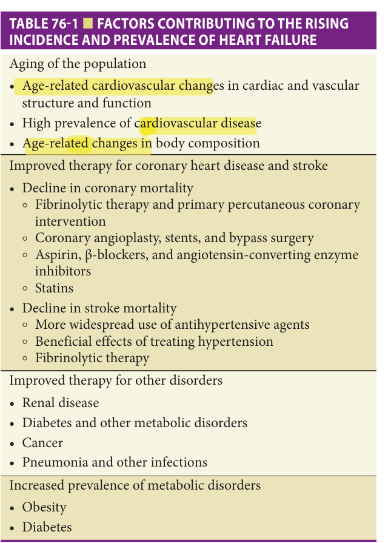

> *Table 76-1 reproduced as a page image (printed p. 1166) — the grid did not extract reliably as text for this fast build.*

> Highlighting is the owner's annotation, not the book's.

80 years. Similarly, heart failure mortality rates increase exponentially with advancing age in all major demographic subgroups of the US population.

Heart failure is also a major source of chronic disability and impaired quality of life in older adults, and it is the leading cause for hospitalization in individuals older than 65 years. In 2014, there were 1 million hospital admissions in the United States with a primary diagnosis of heart failure ( **Table 76-2** ). Of these, 71% were in patients older than 65 years, 53% were in patients 75 years or older, and 25% occurred in the 2% of the population aged at least 85 years ( **Figure 76-3** ). While the majority of heart failure patients younger than 65 years are males, women comprise more than half of heart failure hospitalizations after the age of 65, and the proportion of females continues to rise with advancing age. The prevalence of heart failure in older Caucasians and African-Americans is similar, and hospital admission rates are lower in Hispanics and Asians. Whether this represents a true difference in population prevalence or a difference in the likelihood that affected individuals will seek or receive medical attention is unknown. Heart failure is also a common reason for ambulatory care visits, with almost 2 million physician office visits with a primary diagnosis of heart failure occurring in 2016. In this regard, heart failure ranks second only to hypertension among cardiovascular reasons for outpatient physician visits.

As a result of its high prevalence and the need for intensive resource use in both the inpatient and the outpatient settings, the economic burden of heart failure is very high. Heart failure is one of the costliest diagnosis-related groups in the United States, with estimated total annual expenditures in excess of $35 billion. Projections suggest that by 2030, the total cost of heart failure will increase to $69.8 billion, amounting to ≈$244 for every US adult.

## Pathophysiology

Heart failure is the prototypical disorder of cardiovascular aging in that age-related changes in the cardiovascular system in concert with an increasing prevalence of cardiovascular risk factors and diseases at older age conspire to produce an exponential rise in heart failure prevalence with advancing age.

Aging is associated with extensive changes in cardiovascular structure and function (see Chapter 73). However, in the absence of coexistent cardiovascular disease, cardiac function at rest is well preserved even at very old age. Resting left ventricular ejection fraction and resting cardiac output are largely unaffected by age in healthy individuals.

From the clinical perspective, the changes associated with cardiovascular aging result in an impaired ability of the heart to respond to stress, be it physiologic (eg, exercise) or pathologic (eg, hypertension or myocardial ischemia). Four principal changes in the cardiovascular system

**[p. 1167]**
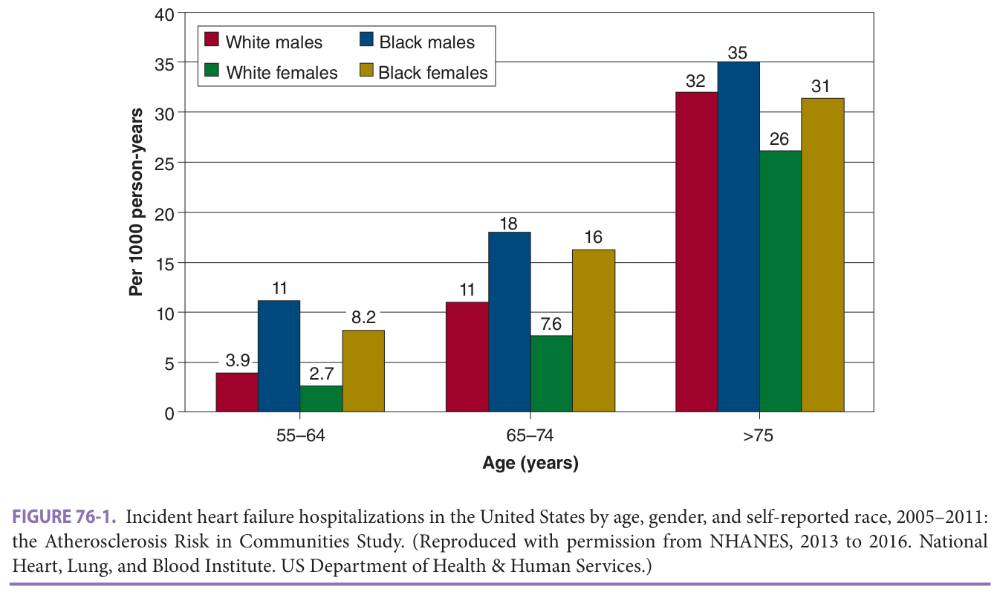

> *FIGURE 76-1. Incident heart failure hospitalizations in the United States by age, gender, and self-reported race, 2005–2011: the Atherosclerosis Risk in Communities Study. (Reproduced with permission from NHANES, 2013 to 2016. National Heart, Lung, and Blood Institute. US Department of Health & Human Services.)*

> Highlighting is the owner's annotation, not the book's.

contribute directly to the heart’s attenuated capacity to augment cardiac output in response to stress. First, aging is associated with reduced responsiveness to β-adrenergic - stimulation. This is related to increased sympathetic nervous system activity and circulating catecholamine levels resulting in β-adrenergic receptor desensitization, rather

than decreased β-receptor density on cardiac myocytes or altered responsiveness to intracellular calcium. The diminished response to β-adrenergic stimulation limits the heart’s capacity to maximally increase heart rate and contractility in response to stress, and β2-mediated peripheral vasodilatation is also impaired.

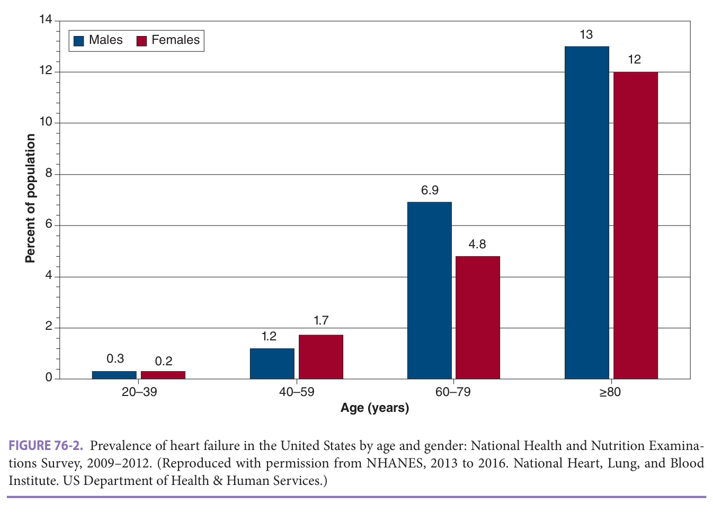

> *FIGURE 76-2. Prevalence of heart failure in the United States by age and gender: National Health and Nutrition Examinations Survey, 2009–2012. (Reproduced with permission from NHANES, 2013 to 2016. National Heart, Lung, and Blood Institute. US Department of Health & Human Services.)*

> Highlighting is the owner's annotation, not the book's.

**[p. 1168]**
**Table 76-2 — Epidemiology of heart failure in the united states**

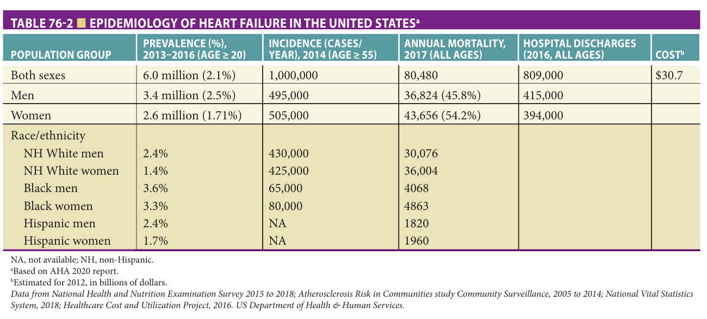

> *Table 76-2 reproduced as a page image (printed p. 1168) — the grid did not extract reliably as text for this fast build.*

> Highlighting is the owner's annotation, not the book's.

A second major effect of aging is increased stiffness of the large- and medium-sized arteries, primarily because of increased collagen deposition and cross-linking and degeneration of elastin fibers in the media and adventitia. Increased stiffness of the central conduit arteries results in increased impedance to left ventricular ejection (ie, increased afterload), and it also contributes to the increased propensity of older individuals to develop systolic hypertension ( **Figure 76-4** ).

A third major effect of aging is altered left ventricular diastolic filling. Diastole is characterized by four phases: isovolumic relaxation, early rapid filling, passive filling during mid-diastole, and late filling owing to atrial systole. The first two phases, isovolumic relaxation and early rapid filling, are largely dependent on myocardial relaxation, an active, energy-requiring process, whereas filling during the latter two phases is governed principally by intrinsic myocardial “stiffness,” or compliance. Aging is associated

with impaired calcium release from the contractile proteins and reuptake by the sarcoplasmic reticulum, inhibiting early diastolic relaxation. In addition, increased interstitial connective tissue content and collagen cross-linking reduce ventricular compliance. Compensatory myocyte hypertrophy in response to increased ventricular afterload and myocyte loss due to apoptosis further compromises left ventricular compliance. Thus, normal aging is associated with important changes, adversely impacting all four phases of diastole and substantially altering the pattern of left ventricular diastolic filling.

Age-related changes in diastolic filling and atrial function can be evaluated noninvasively using Doppler echocardiography to examine diastolic inflow across the mitral valve ( **Figure 76-5** ). In healthy young persons, the transmitral inflow pattern is characterized by a large E-wave, with a rapid upstroke representing rapid filling of the ventricle immediately following the opening of the

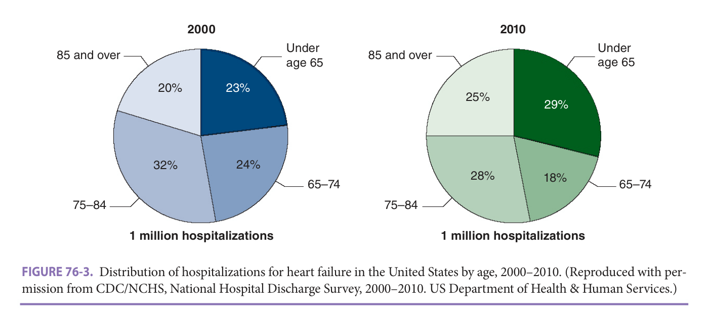

> *FIGURE 76-3. Distribution of hospitalizations for heart failure in the United States by age, 2000–2010. (Reproduced with permission from CDC/NCHS, National Hospital Discharge Survey, 2000–2010. US Department of Health & Human Services.)*

> Highlighting is the owner's annotation, not the book's.

**[p. 1169]**
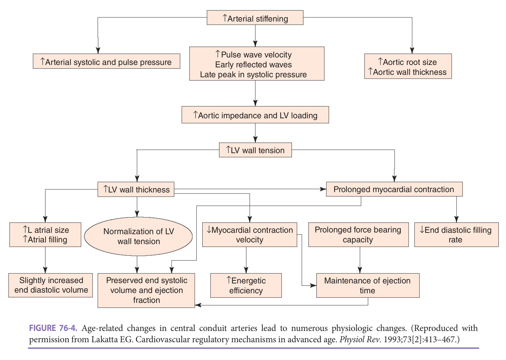

> *FIGURE 76-4. Age-related changes in central conduit arteries lead to numerous physiologic changes. (Reproduced with permission from Lakatta EG. Cardiovascular regulatory mechanisms in advanced age. _Physiol Rev_ . 1993;73[2]:413–467.)*

> Highlighting is the owner's annotation, not the book's.

mitral valve and corresponding to active ventricular relaxation ( **Figure 76-5A** ). This is followed by a period in which the rate of filling slows (the downslope of the E-wave, called the deceleration time), mid-diastolic diastasis (in which left atrial and left ventricular pressures are essentially equal), and additional left ventricular filling at the end of diastole corresponding to atrial contraction (the A-wave, or atrial “kick”). Importantly, the majority of ventricular filling

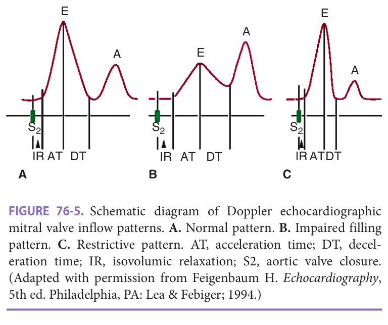

> *FIGURE 76-5. Schematic diagram of Doppler echocardiographic mitral valve inflow patterns. **A.** Normal pattern. **B.** Impaired filling pattern. **C.** Restrictive pattern. AT, acceleration time; DT, deceleration time; IR, isovolumic relaxation; S2, aortic valve closure. (Adapted with permission from Feigenbaum H. _Echocardiography_ , 5th ed. Philadelphia, PA: Lea & Febiger; 1994.)*

> Highlighting is the owner's annotation, not the book's.

occurs in the first half of diastole in young individuals, with a relatively small contribution from atrial contraction.

In older persons, alterations in left ventricular relaxation and compliance result in characteristic changes in the pattern of diastolic filling ( **Figure 76-5B** ). Early filling is impaired, and the upstroke of the E-wave is delayed. Similarly, the downslope of the E-wave (deceleration time) is less steep. To compensate for increased resistance to emptying, the left atrium enlarges. This results in a more forceful left atrial contraction and an augmented A-wave and thus, a greater proportion of filling occurs in the latter period of diastole in older individuals. As much as 30% to 40% of left ventricular end-diastolic volume is attributable to atrial contraction. Thus, older individuals become increasingly reliant on the atrial “kick” to maximize left ventricular filling.

A third pattern of diastolic filling, referred to as the restrictive pattern, occurs when the left ventricle’s ability to fill becomes severely compromised. In this situation ( **Figure 76-5C** - ), very little flow occurs after the rapid filling phase in early diastole. This pattern is characterized by a tall, narrow E-wave with a rapid downslope, with diastasis achieved early in diastole. Little additional flow occurs during mid-diastole, and the A-wave is typically small, with an amplitude that is less than 50% of the E-wave. A restrictive pattern indicates marked elevation of the left ventricular diastolic pressure, and it tends to be associated with a

**[p. 1170]**
poor prognosis. A restrictive filling pattern almost always occurs in patients with advanced cardiac disease and is not attributable to aging alone.

Age-related changes in diastolic filling have several important clinical implications. First, reduction in ventricular filling subverts the Frank-Starling mechanism (where increased preload volume results in a higher stroke volume), one of the cardinal adaptive responses (along with sympathetic activation) necessary to acutely increase cardiac output. Second, impaired diastolic filling results in a - left-shift of the normal ventricular pressure-volume relationship; consequently, small increases in diastolic volume lead to greater increases in diastolic pressures among older compared to younger individuals. This increase in diastolic pressure is transmitted back to the left atrium. Over time this alters left atrial size and function which in turn, increases the likelihood of atrial ectopic beats and atrial arrhythmias, especially atrial fibrillation. Thus, atrial fibrillation, like heart failure, increases in prevalence with advancing age. Additionally, atrial fibrillation itself is a common precipitant of heart failure in older adults for two reasons. First, the absence of a coordinated atrial contraction substantially compromises left ventricular diastolic filling due to loss of the atrial “kick.” Second, the rapid, - irregular ventricular rate associated with acute atrial fibrillation shortens the diastolic filling period, which further attenuates ventricular filling.

A third effect of altered diastolic filling is an increased propensity for older adults to develop HFPEF, formerly called “diastolic heart failure.” Because of the altered left ventricular pressure-volume relation, increases in left ventricular pressure from ischemia, venoconstriction, or multiple other factors can lead to pulmonary congestion and edema. Moreover, individuals with impaired diastolic function are often “volume sensitive”; that is, small increments in intravascular volume, as may occur with a dietary sodium indiscretion or intravenous fluid administration, result in abrupt rises in intraventricular pressure rises and consequently heart failure symptoms such as shortness of breath and/or exercise intolerance; while intravascular volume contraction, which may arise from poor oral intake or over diuresis, can cause marked falls in stroke volume, cardiac output, and blood pressure.

The fourth major effect of cardiovascular aging is altered myocardial energy metabolism at the level of the mitochondria. Under resting conditions, older cardiac mitochondria can generate enough adenosine triphosphate (ATP) to meet the heart’s energy requirements. However, when stress causes an increase in ATP demands, the mitochondria are often unable to respond appropriately.

Aging is also associated with significant changes in other organ systems, which impact directly or indirectly on the development and/or management of heart failure. Aging is accompanied by a decline in glomerular filtration rate, which impairs regulation of intravascular volume and electrolyte homeostasis (see Chapters 39 and 82).

The reduced capacity of the kidneys to respond to intravascular volume overload or dietary sodium excess increases the risk of heart failure in older individuals. In addition, older patients are less responsive to diuretics and more likely to develop diuretic-induced electrolyte abnormalities than younger patients, which complicates the management of heart failure in the older age group.

Aging is also associated with numerous changes in respiratory function, which serve to diminish respiratory reserve (see Chapter 80). Some of these effects, such as ventilation:perfusion mismatching and sleep-related breathing disorders, may contribute directly to the development of heart failure by producing hypoxemia or pulmonary hypertension. Other changes in lung compliance reduce the capacity of the lungs to compensate for the failing heart by increasing tidal volume and minute ventilation, thereby contributing to the patient’s sensation of dyspnea. In more severe cases of cardiac failure, such as pulmonary edema, acute respiratory failure may ensue, because of the inability of the lungs to maintain oxygenation and effective ventilation.

Age-related changes in central nervous system function include an impaired thirst mechanism, which may contribute to dehydration and intravascular volume contraction in patients treated with diuretics, and reduced capacity of the central nervous system’s autoregulatory mechanisms to maintain cerebral perfusion in the face of - changes in systemic arterial blood pressure. Aging is also associated with widespread changes in baroreflex responsiveness. For example, impaired responsiveness of the carotid baroreceptors to acute changes in blood pressure may cause orthostatic hypotension or syncope, and these effects may be further aggravated by many of the drugs used to treat heart failure.

- Finally, as is well recognized, aging is associated with significant changes in the pharmacokinetics and pharmacodynamics of almost all drugs. When coupled with polypharmacy, which is nearly universal in adults with heart failure, the risk for adverse drug reactions is significant in older adults with heart failure. Strong consideration for drug-drug, drug-disease, and drug-person interactions thus remain paramount when prescribing medications to older adults with heart failure and should also be taken into consideration when developing pharmacotherapeutic strategies for older heart failure patients (see Chapter 22).

## Etiology And Precipitating Factors

In general, the risk factors for heart failure are similar in older and younger patients ( **Table 76-3** ), but the etiology for heart failure in older individuals is more often multifactorial. Hypertension and coronary heart disease are the most common causes of heart failure, accounting for more than 70% of cases. The term cardiomyopathy, which refers to pathologic abnormalities of the heart, is a descriptor

**[p. 1171]**

prolapse), mitral annular calcification, valvular vegeta- tions, ischemic papillary muscle dysfunction, or altered ventricular geometry owing to ischemic or nonischemic dilated cardiomyopathy. Importantly, mitral regurgitation may be acute (eg, following acute myocardial infarction), -- subacute (eg, endocarditis), or chronic (eg, myxomatous degeneration), and the clinical manifestations may vary _. widely in each of these settings. In the United States, rheumatic mitral stenosis is a less common cause of heart failure in older adults. Functional mitral stenosis owing to severe mitral valve annulus calcification with narrowing of the mitral valve orifice is an uncommon cause of heart failure, but it is associated with a poor prognosis. Aortic insufficiency may be either acute (eg, because of endocarditis or type A aortic dissection) or chronic (eg, annuloaortic ectasia or syphilitic aortitis), but it is a relatively infrequent cause of heart failure in older adults. Finally, prosthetic valve dysfunction should be considered as a potential cause of heart failure in any patient who has undergone previous valve repair or replacement.

**Table 76-3 — Common etiologies of heart failure in older adults**

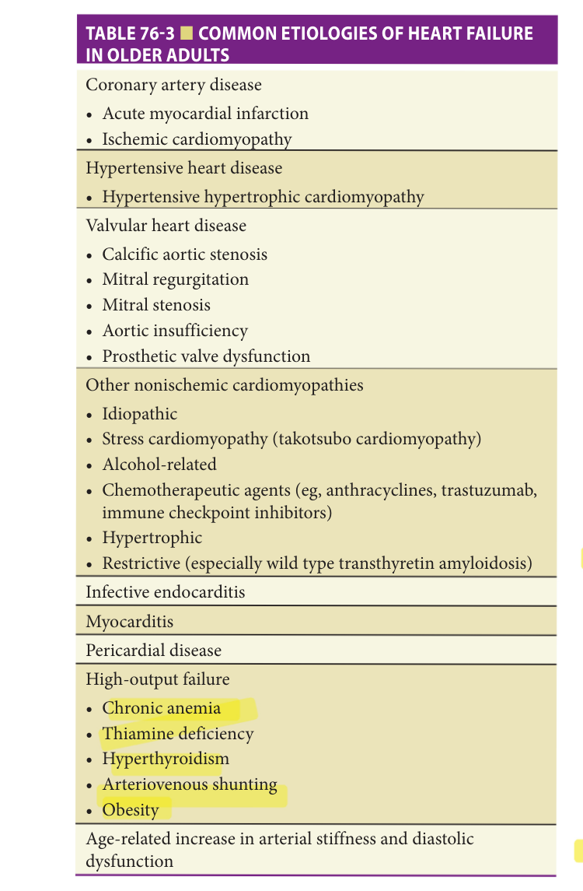

> *Table 76-3 reproduced as a page image (printed p. 1171) — the grid did not extract reliably as text for this fast build.*

> Highlighting is the owner's annotation, not the book's.

 adults, ischemic cardiomyopathy from one or more prior myocardial infarctions is the most common cause of heart failure. Nonischemic dilated cardiomyopathy is less common in older than in younger individuals; when present, it is most often either idiopathic or genetic in origin or attributable to chronic ethanol abuse or cancer chemotherapy (eg, anthracyclines or trastuzumab). Stress cardiomyopathy (also known as takotsubo cardiomyopathy) is a cause of acute heart failure usually precipitated by physical or psychological stress. The majority of patients with Takotsubo cardiomyopathy are women. Sarcomeric -- hypertrophic cardiomyopathy, once thought to be rare in the older age group, has been increasingly recognized in adults older than 65 years. Similarly, restrictive cardiomyopathy, most commonly owing to transthyretin amyloid deposition, is an increasingly recognized cause of HFPEF - in older adults. Clinical and autopsy series have shown an age-dependent prevalence of wild-type transthyretin cardiac amyloidosis (ATTRwt, formerly called senile - - cardiac amyloidosis), which is diagnosed in adults older than 60 years. Transthyretin cardiac amyloidosis is either due to the deposition of wild-type transthyretin protein (also known as prealbumin) or the result of a variant in the transthyretin gene (ATTRv), which are present in up to 4% of African-Americans, who are at increased risk for developing cardiac amyloidosis with advancing age. While the genetic defect is present from birth, penetrance is age dependent and clinical manifestations typically do not become apparent until after age 60. Wild-type transthyretin amyloidosis has been found in 13% of older adults hospitalized for HFPEF who have an increased left ventricular wall thickness of more than 12 mm. Novel therapies that inhibit production or promote stabilization of transthyretin amyloidosis, such as tafamidis, have been shown to reduce - morbidity and mortality in this disease, though concerns about cost could limit access.

 - -

frequently preceded by a modifier that indicates a potential cause of heart failure. For example, hypertensive hypertrophic cardiomyopathy represents a more severe -- form of hypertensive heart disease most commonly seen in older women and often accompanied by calcification ·- of the mitral valve annulus. These patients often manifest severe diastolic dysfunction and may exhibit dynamic left ventricular outflow tract obstruction indistinguishable from that seen in hypertrophic cardiomyopathy due to sarcomere mutations.

Valvular cardiomyopathy is an increasingly common cause of heart failure at older age. Calcific aortic stenosis is now the most common form of valvular heart disease requiring invasive treatment, and aortic valve replacement is the second most common major cardiac procedure performed in patients older than 70 years (after coronary bypass grafting). Mitral regurgitation in older individuals may be caused by myxomatous degeneration of the mitral valve leaflets and chordae tendineae (mitral valve

**[p. 1172]**
> Infective endocarditis is an uncommon but important - cause of heart failure in older patients because it is one of the few etiologies for which curative pharmacologic therapy is available. Endocarditis should be strongly suspected in any patient with persistent fever and either a prosthetic heart valve or a preexisting valvular lesion. It should also be considered in any patient with fever, recent dental work or other procedure, and a new or worsening heart murmur. It is important to recognize, however, that the clinical manifestations of endocarditis are often protean, and the absence of fever or a heart murmur does not exclude this diagnosis in older individuals.

Myocarditis is an uncommon cause of heart fail..... ure in older adults. It is most commonly infectious (eg, post-viral) but can be noninfectious (eg, owing to sarcoid or collagen vascular disease). Increasing cases are being described in the setting of cancer therapeutics, particularly immune checkpoint inhibitors. Pericardial effusions, for which there are numerous etiologies, occasionally present with heart failure symptomatology, including fatigue, exertional dyspnea, and edema. Constrictive ---pericarditis may be infectious (eg, tuberculous) or noninfectious (eg, postradiation), but it is a rare cause of heart failure in older patients.

High-output failure is cause of heart failure in older adults, but when present the diagnosis is frequently overlooked. Potential causes of high-output failure include chronic anemia, hyperthyroidism, thiamine deficiency, and arteriovenous shunting (eg, owing to a dialysis fistula or arteriovenous malformations) and morbid obesity. -

Finally, in a small percentage of older heart failure patients, detailed investigation may fail to identify any primary cardiovascular pathology. In cases with a normal left ventricular ejection fraction, heart failure may be attributed to age-related diastolic dysfunction.

### Precipitating Factors

In addition to determining the etiology of heart failure, it is important to identify coexisting factors that may have contributed to the acute or subacute exacerbation ( **Table 76-4** ). The most common precipitant in patients with preexisting heart failure is nonadherence to medications and/or diet. Indeed, nonadherence may contribute to as many as two-thirds of heart failure exacerbations. Older patients with cognitive impairment, depression, poor mobility, or limited social support may have particular difficulty following complex treatment plans, and this is important to remember when designing heart failure self-care and medication regimens.

Among cardiac factors, myocardial ischemia or infarction and new-onset or recurrent atrial fibrillation or flutter are the most common causes of an acute episode of heart failure. Other cardiac causes include ventricular arrhythmias, especially ventricular tachycardia, and bradyarrhythmias, such as marked sinus bradycardia or advanced atrioventricular block. Sick sinus syndrome, which is common in older adults, is a frequent cause of

**Table 76-4 — Common precipitants of heart failure in older adults**

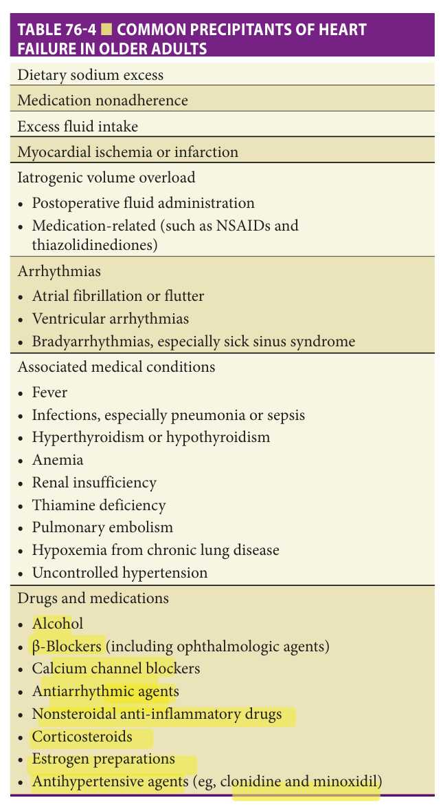

> *Table 76-4 reproduced as a page image (printed p. 1172) — the grid did not extract reliably as text for this fast build.*

> Highlighting is the owner's annotation, not the book's.

> bradyarrhythmias in this population. In hospitalized - patients, iatrogenic volume overload is also an important precipitant of heart failure.

As previously discussed, older patients have limited cardiovascular reserve and they are less able to compensate in response to increased demands. As a result, heart failure in older adults can be precipitated by acute or worsening noncardiac conditions. Patients with acute respiratory disorders, such as pneumonia, pulmonary embolism, or an exacerbation of chronic obstructive lung disease, are particularly prone to exhibit deterioration in cardiac function. Other serious infections, such as sepsis or pyelonephritis, may also lead to heart failure exacerbations. In patients with hypertension, inadequate blood pressure control is a common cause of worsening heart failure. Thyroid disease, anemia, and declining renal function may also contribute directly or indirectly to the development of heart failure. -- Substance abuse can also worsen heart failure. Alcohol is a -

**[p. 1173]**
cardiac depressant, and it may also precipitate arrhythmias, especially atrial fibrillation.

Finally, numerous drugs and medications may contribute to heart failure exacerbations. The American Heart Association issued a statement in 2016 enumerating medications that can cause or worsen heart failure. Approximately 30% to 50% of older adults with heart failure take at least one medication that can cause or worsen heart failure, an observation that likely relates to their high prevalence of multimorbidity and polypharmacy. Nonsteroidal anti-inflammatory drugs (NSAIDs) are one of the most commonly used offenders and can worsen heart failure by impairing renal sodium and water excretion and contributing to intravascular volume overload. In addition, NSAIDs antagonize the effects of angiotensin-converting enzyme (ACE) inhibitors, thereby limiting the efficacy of these agents. Corticosteroids and estrogen preparations can also cause fluid retention and an increase in plasma volume. Insulin-sensitizing thiazolidinediones (rosiglitazone and pioglitazone) can also cause fluid retention, and thus worsen heart failure. Cardiovascular medications can also potentially exert negative effects in heart failure. For example, the antihypertensive agent minoxidil also promotes fluid retention, and several other antihypertensive drugs (eg, clonidine) may have unfavorable hemodynamic effects. Even β-blockers (including ophthalmologic agents) and calcium channel blockers, which are widely used in older individuals with cardiovascular disease, when used in excess can exacerbate heart failure since they are negative inotropes. Class Ia (eg, quinidine, procainamide, and disopyramide) and Ic (eg, flecainide and propafenone) ---. antiarrhythmic agents also have important myocardial - depressant effects that may worsen cardiac function. -

## Clinical Features

### Symptoms

The most common symptoms of heart failure in older adults are exertional shortness of breath, orthopnea, - edema, bloating, fatigue, and exercise intolerance. However, atypical symptoms are common in older patients, particularly those older than 80 years ( **Table 76-5** ). As a result, heart failure in older adults is paradoxically both over- and underdiagnosed. Thus, shortness of breath in an older individual may be attributed to heart failure when the underlying cause is chronic lung disease, pneumonia, or anemia. Similarly, fatigue and reduced exercise tolerance may be caused by anemia, hypothyroidism, depression, or deconditioning. On the other hand, sedentary individuals and those limited by arthritis or neuromuscular conditions may not report exertional dyspnea or fatigue, and atypical symptoms such as those listed in **Table 76-5** may be the first and only clinical manifestations of heart failure. In such cases, the clinician must maintain a high index of suspicion or the diagnosis of heart failure may be readily overlooked.

**Table 76-5 — Atypical manifestations of heart failure in older persons**

- Nonspecific systemic complaints • Fatigue/anergia • Malaise • Weight loss • Declining physical activity level Neurologic symptoms • Confusion • Irritability • Sleep disturbances Gastrointestinal disorders • Anorexia or early satiety • Abdominal discomfort • Abdominal bloating • Nausea • Diarrhea or constipation

### Signs

The physical findings in older heart failure patients may be nonspecific or atypical. The classic signs of heart failure include pulmonary rales, an elevated jugular venous pressure, abdominojugular reflux, an S3 gallop, and pitting edema of the lower extremities. However, rales in older individuals may be due to chronic lung disease, pneumonia, or atelectasis; and peripheral edema may be caused by venous insufficiency, renal disease, immobility, or medication (eg, calcium channel blockers). Conversely, older patients may have an unremarkable physical examination despite markedly reduced cardiac performance. Inversely, impaired sensorium or Cheyne-Stokes respirations may be the only findings to suggest the presence of heart failure.

## Diagnostic Evaluation

Heart failure is difficult to diagnose in older patients with multiple comorbid conditions and either vague or nonspecific symptoms and signs. Thus, clinicians need to perform a careful history and physical examination, giving due consideration to potential alternative etiologies for the patient’s findings. While physical signs may be unreliable in older patients, certain findings, including pulsus alternans, an S3 gallop, and the presence of jugular venous distension at rest or in response to the abdominojugular reflux maneuver, are highly specific signs of heart failure in older patients. In the absence of these findings, the diagnosis often remains in doubt, and additional laboratory studies are required.

To differentiate shortness of breath attributable to heart failure from other causes, the level of B-type natriuretic peptide (BNP—a 32-amino acid hormone released by the - cardiac ventricles in response to increased wall tension) or its inactive fragment N-terminal pro-BNP (NT–pro-BNP) is the single most useful test. <mark>However, natriuretic peptide</mark>

**[p. 1174]**

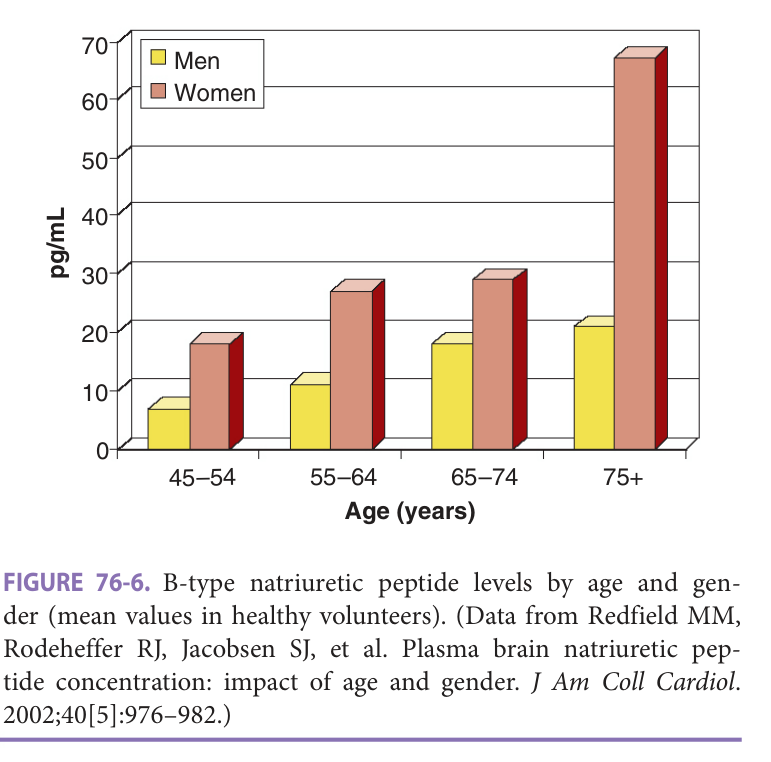

> *FIGURE 76-6. B-type natriuretic peptide levels by age and gender (mean values in healthy volunteers). (Data from Redfield MM, Rodeheffer RJ, Jacobsen SJ, et al. Plasma brain natriuretic peptide concentration: impact of age and gender. _J Am Coll Cardiol_ . 2002;40[5]:976–982.)*

> Highlighting is the owner's annotation, not the book's.

levels increase modestly with age especially in women ( **Figure 76-6** ), declining renal function, and worsening anemia; and are general <mark>ly lower with a higher BMI.</mark> Therefore, the specificity of an elevated natriuretic peptide level for identifying heart failure declines with age. BNP levels more than 500 pg/mL in the appropriate clinical context are highly suggestive of active heart failure, whereas a normal value (< 100 pg/mL) in a nonobese older adult makes the diagnosis of heart failure much less likely. In addition to the BNP level, the chest radiograph remains useful for establishing the presence of active pulmonary congestion. In patients with moderate or severe heart failure, the chest film will usually demonstrate typical findings of cardiomegaly, pulmonary vascular redistribution or edema, and pleural effusions. However, in patients with mild heart failure or coexisting pulmonary disease, the chest radiograph may be nondiagnostic.

Once heart failure has been diagnosed, the physician must address two crucial questions, the answers to which will serve as the basis for selecting appropriate therapy:

1. What is the underlying etiology and pathophysiology of heart failure (see **Table 76-3** )?

2. What additional factors, if any, contributed to or precipitated the development of heart failure (see **Table 76-4** )? Often, one or more precipitating factors can be identified, and alleviating these factors may significantly improve symptoms and reduce the likelihood of subsequent heart failure exacerbations.

In 2017, the American College of Cardiology and American Heart Association Task Force on Practice Guidelines published revised guidelines for the diagnosis and management of heart failure. **Table 76-6** outlines an appropriate initial diagnostic assessment for patients with

**Table 76-6 — Diagnostic evaluation of patients with heart failure**

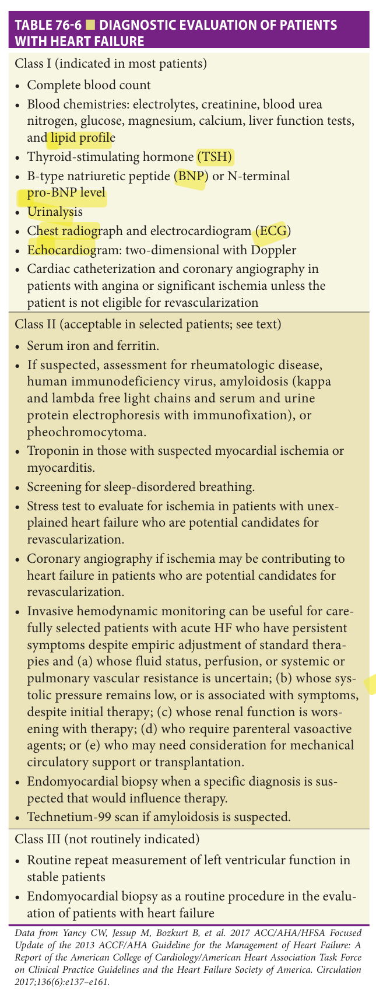

> *Table 76-6 reproduced as a page image (printed p. 1174) — the grid did not extract reliably as text for this fast build.*

> Highlighting is the owner's annotation, not the book's.

**[p. 1175]**
new-onset heart failure. Class I studies are defined as those that are indicated in most patients, class II procedures are acceptable in some patients but are of unproven efficacy and may be controversial, and class III studies are not routinely indicated and, in some cases, may be harmful. Briefly, basic laboratory studies, a thyroid function test, a chest radiograph, an electrocardiogram, and an echocardiogram with Doppler are recommended in all patients. Cardiac catheterization and coronary angiography are appropriate in patients with angina or significant ischemia on noninvasive testing, and in those who require surgical correction of a valve lesion (eg, aortic stenosis), unless the patient is not a suitable candidate for coronary revascularization.

The recommendations outlined in **Table 76-6** are targeted toward a broad range of adult heart failure patients, and most are applicable even in patients at an advanced age. Nonetheless, in older patients it is appropriate to consider the potential risks and benefits of each diagnostic procedure on an individualized basis, considering comorbid conditions, the extent of cardiac and noncardiac disability, and the patient’s goals of care. For example, in a frail 85-yearold individual with severe diabetic nephropathy, the risk of precipitating dialysis-dependent end-stage renal disease as a complication of coronary angiography must be carefully weighed against the potential benefits to be derived from a successful revascularization procedure. Similarly, patient autonomy must be respected in all cases, and it is inappropriate to exert pressure on an older patient to undergo a procedure that the patient clearly does not desire. In this regard, it is imperative to discuss the therapeutic implications of specific procedures (especially invasive procedures) with respect to the patient’s subsequent care (eg, need for coronary bypass surgery) prior to performing the diagnostic assessment.

### Heart Failure With Reduced Versus Heart Failure With Preserved Ejection Fraction

Current nomenclature distinguishes two forms of heart failure—HFREF, usually defined as ejection fraction less than 40% to 50% and HFPEF. The clinical manifestations of both forms of heart failure are similar. No single clinical feature can reliably distinguish patients with HFREF from those with HFPEF, although certain features tend to favor one form or the other ( **Table 76-7** ). The predictive accuracy of algorithms to predict HFREF versus HFPEF is modest, and additional testing is essential in order to reliably differentiate HFREF from HFPEF.

An important goal of the diagnostic evaluation is differentiating HFREF from HFPEF since the management of these two syndromes differs. As noted, it is difficult to make this distinction on clinical grounds alone, and it is therefore essential to evaluate left ventricular function directly by echocardiography, radionuclide angiography (commonly called a MUGA [multiple-gated acquisition] scan), magnetic resonance imaging, or contrast ventriculography. In general, transthoracic echocardiography is

**Table 76-7 — Clinical features of heart failure with reduced versus preserved ejection fraction**

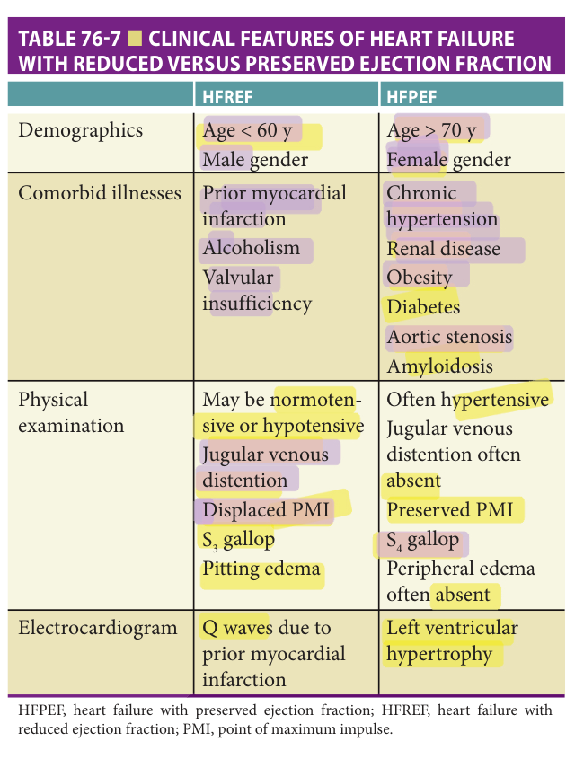

> *Table 76-7 reproduced as a page image (printed p. 1175) — the grid did not extract reliably as text for this fast build.*

> Highlighting is the owner's annotation, not the book's.

tion to providing information about systolic and diastolic function, it is helpful in evaluating chamber size, wall thickness and motion, valve function, pulmonary artery pressure, and pericardial disease. Thus, transthoracic echocardiography is appropriate in virtually all older patients with newly diagnosed heart failure and in those with an unexplained change in symptom severity. The principal limitation of echocardiography is that adequate visualization of the heart may be unobtainable in a small percentage of patients, although the availability of echo-contrast agents has reduced this problem. Alternatively, radionuclide angiography can provide an accurate assessment of left ventricular function, as well as information about cavity size and regurgitant valvular lesions. Magnetic resonance imaging provides more detail about myocardial characteristics (scar, inflammation, edema) than echocardiography but cannot assess diastolic function easily, is more expensive and less widely available, and some types of contrast administration are contraindicated in patients with impaired renal function.

Based on the results of echocardiography, radionuclide angiography, magnetic resonance imaging, or contrast ventriculography, heart failure may be classified as HFREF or HFREF (in the ensuing discussion HFREF is defined as ejection fraction < 45%, HFPEF is defined as ejection fraction ≥ 45%). However, it must be emphasized that systolic and diastolic dysfunction are not mutually exclusive.

**[p. 1176]**

> Indeed, almost all patients with significant systolic dysfunction also have concomitant echo Doppler evidence of diastolic dysfunction. Conversely, systolic dysfunction may play a role in the development of heart failure even when the ejection fraction under resting conditions is normal or near normal. Despite these limitations, the classification of heart failure as HFREF or HFPEF is useful in guiding therapy.

## Management

> The primary goals of heart failure therapy are to improve - quality of life, reduce the frequency of heart failure exacerbations, maximize independence and exercise capacity, enhance emotional well-being, and extend survival.

To achieve these goals, optimal therapy in older patients comprises three principal components: correction of the underlying etiology whenever possible (eg, aortic valve replacement for severe aortic stenosis or coronary revascularization for severe ischemia), attention to the nonpharmacologic and rehabilitative aspects of treatment, and the judicious use of medications and device-based therapies.

As will be discussed in the section on Prognosis, the outlook for patients with established heart failure is poor. Therefore, the importance of effectively treating the primary etiology and all comorbid conditions predisposing to heart failure cannot be overemphasized. Since coronary heart disease and hypertension are the most common causes of heart failure in older adults, primary and secondary prevention of these conditions are critical if the development of heart failure is to be forestalled. Indeed, it has now been shown in multiple clinical trials that effective treatment of hypertension can reduce the incidence of heart failure by more than 50%. Similarly, appropriate management of other coronary risk factors, particularly hyperlipidemia, sedentary lifestyle, and cigarette smoking, will undoubtedly further reduce the burden of heart failure through the primary prevention of coronary heart disease.

### Nonpharmacologic Therapy

Despite recent advances in the pharmacotherapy of heart failure, recurrent heart failure exacerbations are common and are more often precipitated by behavioral and social factors than by either new cardiac events (eg, ischemia or an arrhythmia) or progressive deterioration in ventricular function. In one study, lack of adherence to prescribed medications and/or diet contributed to 64% of heart failure exacerbations, while emotional and environmental factors contributed to 26% of hospital readmissions. In another study involving 140 patients 70 years or older hospitalized with heart failure, 47% were readmitted at least once during a 90-day follow-up period. Behavioral and social factors contributing to readmission included medication and dietary nonadherence (15% and 18%, respectively), inadequate social support (21%), inadequate discharge planning

(15%), inadequate follow-up (20%), and failure of the patient to seek medical attention promptly when symptoms recurred (20%). These findings suggest that interventions directed at behavioral and social factors could potentially reduce readmissions and improve quality of life in patients with heart failure, and this hypothesis has now been confirmed in numerous prospective randomized trials. In a meta-analytic review of 33 such trials, heart failure readmissions were reduced by 42%, all-cause readmissions were reduced by 24%, and mortality was reduced by 20% in patients with heart failure enrolled in a disease management program relative to conventional care.

Components of a comprehensive nonpharmacologic treatment program are listed in **Table 76-8** . As with other aspects of geriatric care, it is important to structure the treatment program to accommodate the needs of each individual patient. Not every patient will require all the components listed in the table. Similarly, the optimal intensity of any component, for example, patient education or follow-up care, will vary substantially. For these reasons, it is desirable to designate a single provider to coordinate all aspects of the patient’s care.

By virtue of age and their preexisting cardiopulmonary syndrome, older adults with heart failure are particularly vulnerable to the adverse effects of pneumonia and respiratory viruses like influenza and SARS-CoV-2. Vaccinations have been shown to be effective and safe in older adults with heart failure and are thus recommended to prevent morbidity and mortality related to these conditions. Specifically, influenza vaccination is associated with reduced risk of death in patients with heart failure, and pneumonia vaccines are also recommended by current guidelines.

### Nutrition And Diet

Dietary guidance for patients with heart failure has classically emphasized limiting sodium intake. This recommendation is based on the observation that patients with heart failure who consume excess sodium can retain fluid volume due to increased neurohormonal activation and renal sodium reabsorption. Due to increased consumption of restaurant and prepackaged foods sodium restriction is often difficult to implement in practice. Moreover, guideline recommendations for total daily sodium limit range from 1500 to 3000 mg/d and are based primarily on expert consensus rather than clinical trial data. In addition to uncertainty about appropriate targets, dietary sodium restriction can have potential harms in older patients with heart failure. First, aggressive reduction of sodium intake can lead to hypovolemia, orthostasis, decreased renal perfusion, and further activation of the neurohormonal axis. These issues can be mitigated through close clinical follow-up and adjustment of diuretics and other medications.

Less often appreciated is the relationship between sodium restriction and poor nutritional status. Malnutrition is a strong risk factor for death and hospitalization in

**[p. 1177]**

**Table 76-8 — Nonpharmacologic aspects of heart failure management**

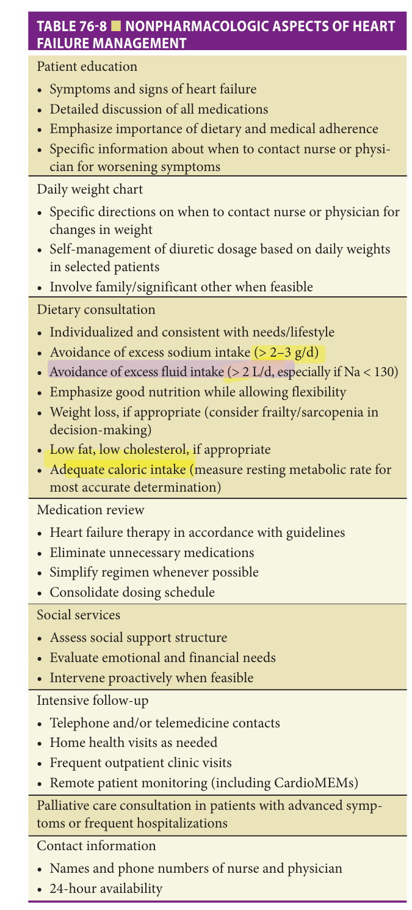

> *Table 76-8 reproduced as a page image (printed p. 1177) — the grid did not extract reliably as text for this fast build.*

> Highlighting is the owner's annotation, not the book's.

heart failure, particularly in older and/or frail individuals. Dietary sodium restriction has been associated with insufficient calorie intake and dietary deficiencies of critical micronutrients, both of which in turn predict poor clinical outcomes. Older patients with heart failure face a myriad of challenges in maintaining adequate nutrition, including age-related changes in taste and smell, symptoms such as shortness of breath, fatigue, bloating, and nausea, and

psychological and logistical factors such as depression, cognitive impairment, poor mobility, and limited social support.

Despite these issues, few dietary intervention clinical trials have been completed in patients with heart failure. The SODIUM-HF pilot study (38 patients, mean age 65) demonstrated that individualized counseling with a dietitian could achieve dietary sodium restriction without compromising overall nutrient intake. The ongoing multinational SODIUM-HF trial (recruiting 1000 patients with stable heart failure) will clarify whether dietitian-guided aggressive sodium restriction (< 1500 mg/d) improves survival free of death or heart failure hospitalization versus usual care. The Spanish PICNIC trial (Nutritional Intervention Program in Hospitalized Patients with Heart Failure) studied intensive, highly individualized monthly dietary counseling in malnourished patients (mean age 79) who survived heart failure hospitalization. In 120 participants, the 6-month nutritional intervention markedly reduced death or heart failure hospitalization at 1-year postdischarge (27% vs 61%, _p_ < 0.001).

The optimal dietary recommendations for older patients with heart failure have not been determined. The Dietary Approaches to Stop Hypertension (DASH) eating pattern and, to slightly lesser extent, the Mediterranean diet have been associated with lower long-term mortality in postmenopausal women with heart failure. Both options are reasonable, although guidance may need to be modified by food preference, economic concerns, or comorbidities (eg, potassium content of the DASH diet in the setting of chronic kidney disease). While obesity is a strong risk factor for heart failure (particularly HFPEF) and associated comorbidities, weight loss has been associated with poor outcomes in multiple heart failure cohorts. Weight loss is thus a controversial topic, and advice may need to be modified based on the presence of frailty or sarcopenia.

### Physical Activity And Exercise

Historically, patients with heart failure were advised to restrict physical activity on the basis that exercise could potentially worsen cardiac function or precipitate arrhythmias. However, it is now recognized that excessive limitation of physical activity progressively worsens functional capacity because of deconditioning. In addition, several studies have demonstrated that participation in an appropriately structured exercise program may significantly improve functional capacity and quality of life in patients with heart failure. In the largest of these trials, HF-ACTION, 2331 patients with stable heart failure and an ejection fraction less than or equal to 35% were randomized to a supervised exercise program or usual care. The mean age was 59 (25% were ≥ 68 years) and 28% were women. After a median follow-up of 30 months, patients randomized to the exercise intervention experienced a 7% reduction in the primary end point of all-cause mortality or all-cause hospitalization, but the difference was not significant ( _p_ = 0.13).

**[p. 1178]**

> After adjusting for highly prognostic baseline characteristics, exercise was associated with an 11% reduction in the primary end point ( _p_ = 0.03). In addition, exercise was associated with improved health status beginning at 3 months and persisting for up to 4 years. Based on these findings, current guidelines recommend regular exercise for most patients with heart failure. In addition, in 2014, the Centers for Medicare and Medicaid Services approved structured cardiac rehabilitation and exercise training for HFREF patients like those enrolled in the HF-ACTION trial.

While data on exercise training in older adults are limited, a randomized trial involving 200 patients 60 to 89 years (mean 72 years, 66% male) with New York Heart Association (NYHA) class II to III HFREF evaluated the effects of exercise prescription, education, occupational therapy, and psychosocial counseling. At 24 weeks of follow-up, intervention group patients experienced significant improvements in NYHA class, 6-minute walk distance, and quality of life, whereas control-group patients demonstrated no change from baseline in any of these parameters. Patients receiving the intervention also had significantly fewer hospital admissions relative to the control group. In addition, three small randomized trials in older patients with HFPEF have demonstrated that exercise training is safe and results in improved exercise capacity and quality of life. These data provide support for a beneficial effect of exercise and cardiac rehabilitation in older patients with either HFREF or HFPEF. Nonetheless, additional studies focused on traditional or remotely delivered therapy are needed to evaluate the safety and efficacy of regular exercise in older heart failure patients, especially those older than 75 years, with frailty or multiple comorbid conditions, and/or who have been recently hospitalized.

**Exercise prescription** A comprehensive exercise and conditioning program is appropriate for most older patients with mild-to-moderate heart failure symptoms and no other contraindications to exercise. **Table 76-9** enumerates specific contraindications that should be considered. **Table 76-10** outlines the basic components of such a program. In general, patients should try to exercise every day. A typical session should include some gentle stretching exercises as well as strengthening exercises using elastic bands

**Table 76-9 — Contraindications to exercise in older patients**

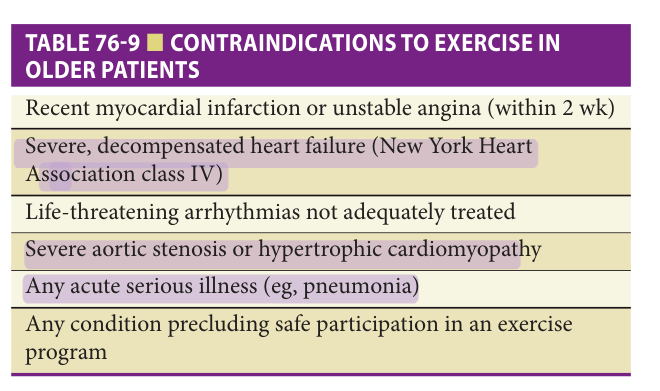

> *Table 76-9 reproduced as a page image (printed p. 1178) — the grid did not extract reliably as text for this fast build.*

> Highlighting is the owner's annotation, not the book's.

**Table 76-10 — Exercise prescription for older patients with heart failure**

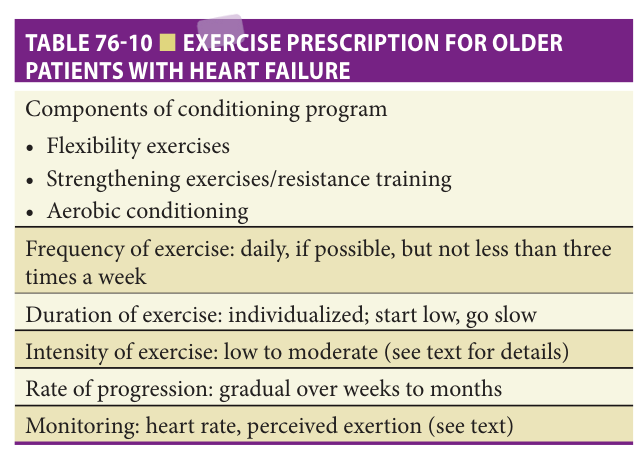

> *Table 76-10 reproduced as a page image (printed p. 1178) — the grid did not extract reliably as text for this fast build.*

> Highlighting is the owner's annotation, not the book's.

ful, and after completing the activity the patient should feel “positive” about the experience and not unduly fatigued. For many older patients with heart failure, this may mean starting with as little as 2 to 5 minutes of slow-paced walking. Once the patient feels comfortable exercising, the duration of exercise can be gradually increased over a period of several weeks. Weekly increases of 1 to 2 minutes per session are appropriate for most patients. Once the patient can exercise continuously and comfortably for 20 to 30 minutes, the intensity of exercise may be increased, if desired. More recently, high-intensity interval training, in which short bursts of higher-intensity exercise are incorporated into the exercise regimen, has been shown to be safe and to result in more rapid increases in exercise capacity in heart failure patients. These findings, while encouraging, should be regarded as preliminary, and high-intensity training should only be initiated in a monitored setting.

The two most common techniques for monitoring exercise intensity are the target heart rate method and the patient’s subjective assessment of perceived exertion. For patients not taking medications that lower heart rate (eg, β-blockers), the maximum attainable heart rate in beats/ min can be estimated from the formula 208 – 0.7 × age). The patient’s resting heart rate is then subtracted from this figure to determine the heart rate reserve. A suitable target heart rate for low-intensity exercise can be calculated as the resting heart rate plus 30% to 50% of the heart rate reserve. For moderate-intensity exercise, the target range is the resting heart rate plus 50% to 70% of the heart rate reserve.

For many older patients, calculating the target heart rate may be difficult. In addition, it may not be possible to accurately determine heart rate during exercise (unless a heart rate monitor is used). For these reasons, the patient’s

**[p. 1179]**

heart failure. Among the many β-blockers on the market, it is worth noting that these are the only three drugs that were studied and subsequently demonstrated benefit in improving outcomes in heart failure. Therefore, these are the β-blockers that should be used for the purposes of treating heart failure. Starting dosages are carvedilol 3.125 to 6.25 mg BID, metoprolol tartrate 6.25 mg BID or QID (or metoprolol succinate 12.5–25 mg daily), and bisoprolol 1.25 to 2.5 mg daily. Of note, although metoprolol succinate (long-acting) is the evidence-based formulation of metoprolol for HFREF, metoprolol tartrate (short-acting) may be a reasonable alternative when titrating to target doses. Doses should be gradually increased at approximately 2-week intervals as tolerated to achieve maintenance dosages of carvedilol 25 to 50 mg BID, metoprolol succinate 100 to 200 mg daily, and bisoprolol 10 mg daily.

subjective assessment of perceived exertion is often the most practical method for monitoring exercise intensity. In addition, perceived exertion correlates reasonably well with exercise heart rate. A simple perceived exertion scale (Borg Scale) comprises five levels: very light, light, moderate, somewhat heavy, and heavy. Older patients with heart failure should begin with very light exercise, progressing to the light range as tolerated. After several weeks, some patients may wish to increase their perceived exertion level into the moderate range, but more strenuous exercise is not recommended for patients with heart failure.

### Pharmacologic Treatment Of Heart Failure With Reduced Ejection Fraction

In general, the treatment of HFREF in older patients does not differ substantially from that in younger patients. The primary goal of pharmacotherapy for HFREF is to reduce mortality and prevent events such as HF hospitalizations. Many patients who receive aggressive therapy can experience a substantial improvement in their ejection fraction. Relatedly, many of these agents can subsequently improve symptoms and improve quality of life. However, similar to any other medication prescribed to older adults, it is naturally important to weigh the risks and potential benefits in both the short and long term in conjunction with other comorbid conditions, geriatric syndromes like frailty and cognitive impairment, overall life expectancy, and health priorities. **β-Blockers** As recently as 20 years ago, β-adrenergic blocking agents were considered contraindicated in patients with heart failure owing to their negative inotropic and chronotropic effects, both of which can diminish cardiac output. However, it is now recognized that persistent activation of the sympathetic nervous system is detrimental in patients with heart failure because it exacerbates ischemia, causes arrhythmogenesis, promotes β-receptor desensitization, and contributes to a progressive decline in ventricular function. Furthermore, several large prospective randomized clinical trials have now confirmed that long-term β-blockade improves left ventricular function and reduces both total mortality and sudden cardiac death in a broad spectrum of patients with HFREF.

Contraindications to the use of β-blockers include severe decompensated heart failure, significant bronchospastic lung disease, marked bradycardia (resting heart rate < 50/min), systolic blood pressure less than 90 to 100 mm Hg, advanced heart block (> first degree), and known intolerance to β-blockade. It is important to monitor heart rate, blood pressure, clinical symptoms, and the cardiorespiratory examination during initiation and titration of therapy. Patients should be advised that they may experience a modest worsening in heart failure symptoms especially fatigue during the first few weeks of β-blocker therapy, but that in most cases these symptoms resolve, and the long-term tolerability of β-blockers is excellent. However, if severe adverse effects occur, dosage reduction or discontinuation of treatment may be necessary. Notably, hemodynamic intolerance to β-blocker may be suggestive of an advanced stage of heart failure and thus may warrant evaluation by a specialist if not already involved in the care of the patient.

**ACE inhibitors** Numerous prospective randomized clinical trials using multiple different angiotensin-converting enzyme (ACE) inhibitors in a variety of clinical settings have conclusively demonstrated that these agents significantly reduce mortality and hospitalization rates and improve exercise tolerance and quality of life in patients with impaired left ventricular systolic function, even in the absence of clinical heart failure. Although none of these studies included patients older than 80 years, available evidence indicates that ACE inhibitors are as effective in older patients as in younger ones.

In the Study of the Effects of Nebivolol Intervention on Outcomes and Rehospitalization in Seniors with Heart Failure trial (SENIORS), 2128 patients 70 years or older (mean age 76, 37% women) were randomized to nebivolol or placebo. During a mean follow-up of 21 months, the primary composite outcome of death or cardiovascular hospitalization was significantly lower in patients randomized to nebivolol, with similar results in younger and - older patients, including those older than 85 years. Based on these studies, β-blockers are now recommended as a standard therapy in almost all patients with symptomatic HFREF in the absence of contraindications. ~-In the United States, carvedilol, bisoprolol, and metoprolol succinate have been approved for the treatment of

In older patients, therapy should be initiated with a low dose (eg, captopril 6.25–12.5 mg TID or enalapril 2.5–5 mg BID), and the dose should be gradually increased as tolerated. In hospitalized patients who are hemodynami-cally stable, the dose may be increased daily; in outpatients, the dose should be increased weekly or biweekly. Throughout the titration period, blood pressure, renal function, and serum potassium levels should be monitored.

For maintenance therapy, ACE inhibitor dosages should be commensurate with those used in the clinical trials.

**[p. 1180]**

> is 25 to 50 mg once daily, with titration up to 150 mg once - daily as tolerated. For older adults, especially where significant concern for adverse effects, it may be reasonable to start at even lower doses (cutting the lowest dose pill in half) and slowly titrating based on tolerance. As with many drugs, especially among older adults, the adage of starting low and going slow applies.

> Recommended “target” doses for selected ACE inhibitors are as follows: captopril 50 mg TID, enalapril 10 to 20 mg BID, lisinopril 20 to 40 mg daily, ramipril 10 mg daily, trandolapril 4 mg daily, quinapril 40 mg BID, and fosinopril 40 mg daily. In patients unable to tolerate full therapeutic doses of ACE inhibitors, lower doses may be used; however, the clinical benefits may be attenuated with lower dosages. Clearly, the risks and benefits of higher doses must be weighed for each individual patient. Captopril and enalapril are excellent agents for use during the titration phase given its short half-life—but once the maintenance dose has been reached, it is desirable to change to a once-daily ACE inhibitor at equivalent dosage for reasons of increased convenience, potentially improved adherence, and lower cost.

It is important to note that combining ACEI and ARB is not recommended due to the adverse effects of using both agents concurrently. In the Valsartan in Acute Myocardial Infarction trial, 14,703 patients with heart failure and/or an ejection fraction less than 35% within 10 days of experiencing an acute myocardial infarction were randomized to receive valsartan, captopril, or both drugs. During a median follow-up of 25 months, there were no differences between groups with respect to all-cause mortality or the composite end point of fatal or nonfatal cardiovascular events. However, limiting side effects were more common in patients receiving both ACE and ARBs than in those receiving either drug alone. The median age was 65 years, and results were similar in older and younger patients.

The most common side effect from ACE inhibitors is a dry, hacking cough, which may be severe enough to require discontinuation of therapy in 5% to 10% of patients during long-term use. Less common but more serious side - effects include hypotension, a decline in renal function, and hyperkalemia. These side effects tend to occur shortly after initiation of therapy and may be aggravated by intravascular volume contraction as a result of over diuresis. Indications for downward titration or discontinuation of an ACE inhibitor include symptomatic hypotension, persistent increase in serum creatinine of 1 mg/dL or greater, or a rise in the serum potassium level above 5.5 mEq/L. Note that asymptomatic low blood pressure does not necessarily mandate dosage reduction; but again, the risks and benefits -- --must be weighed for each individual patient.

The major side effects of ARBs are similar to ACEI and include hypotension, renal insufficiency, and hyperkalemia. Notably, ARBs bind directly to angiotensin II receptors on the cell membrane; thus, unlike ACE inhibitors, ARBs do not inhibit the breakdown of bradykinins, which eliminates the bradykinin-mediated side effects such as cough. --

> **Angiotensin receptor neprilysin inhibitor (ARNi)** - Sacubitril inhibits a neprilysin, a neutral endopeptidase that degrades vasoactive peptides such as BNP thereby promoting the effects of natriuretic peptides. The combination of an angiotensin receptor antagonist (Valsartan) with a neutral endopeptidase inhibitor (sacubitril) has been shown superior to therapy with an ACE inhibitor (enalapril) reducing the composite endpoint of cardiovascular death or HF hospitalization significantly by 20% in the Prospective Comparison of ARNI with ACEI to Determine Impact on Global Mortality and Morbidity in Heart Failure (PARADIGM-HF) trial. The benefit was seen to a similar extent for both death and heart failure hospitalization and was consistent across subgroups including those <75 and >75 years. ARNi therapy increases the risk of hypotension and renal insufficiency and may lead to angioedema, but the risk of an elevation in creatinine and potassium were lower with ARNi therapy compared to ACEI therapy. Transition from ACE or ARB to ARNi therapy is recommended for all patients with HFREF with at least a 36-hour wash out from ACE Inhibitors to mitigate against angioedema. ARNi therapy is also recommended as first-line therapy for stable HFREF patients and after an acute decompensation based on the results of the PIONEER trial, which specifically studied the safety and short-term efficacy of in-hospital initiation of ARNi. Since systemic hypotension is common with ARNi therapy, caution is warranted among older adults with a low system

**Angiotensin II receptor blockers** The use of ARBs for the treatment of heart failure has been evaluated in several studies. In the second Evaluation of Losartan in the Elderly trial (ELITE-II), losartan 50 mg once daily was compared to captopril 50 mg TID in 3152 patients 60 years or older (mean age 71) with moderate heart failure and an ejection fraction of 40% or less, showing similar improvements in mortality. --In the Candesartan in Heart Failure: Assessment of Reduction in Mortality and Morbidity (CHARM)—Alternative study, 2028 patients intolerant to ACE inhibitors were randomized to candesartan or placebo and followed for a median of 34 months. Compared to patients in the placebo group, patients randomized to candesartan experienced a significant 30% reduction in the composite end point of cardiovascular death or hospitalization for heart failure. All-cause mortality was reduced by 17%, which was of borderline statistical significance. The mean age of patients in the CHARM-Alternative study was approximately 66.5, and nearly one-fourth of patients were 75 years or older; however, subgroup analysis by age has not been reported. Accordingly, ARBs are approved for the treatment of heart failure with reduced ejection fraction. The recommended starting dose of valsartan is 20 to 40 mg BID, and the dose should be titrated to 160 mg BID as tolerated; the starting dose of candesartan is 4 to 8 mg once daily, with titration to 32 mg daily as tolerated; and the starting dose of losartan -

**[p. 1181]**

blood pressure. Unless patients are transitioned to ARNi from high-dose ACE or ARBs, ARNi therapy should be initiated at low dosages (eg, 24/26 mg PO BID of sacubitril/ valsartan) with uptitration over time.

**Mineralocorticoid receptor antagonists (MRA)** The MRAs spironolactone and eplerenone are relatively weak diuretics that are potassium-sparing and interfere with the effect of aldosterone. In the Randomized Aldactone Evaluation of Survival trial, spironolactone 12.5 to 50 mg once daily reduced mortality by 30% and heart failure hospitalizations by 35% in patients with NYHA class III or IV heart failure and a left ventricular ejection fraction less than or equal to 35%, when added to baseline therapy with an ACE inhibitor, digoxin, and loop diuretic. Moreover, the beneficial effects of spironolactone were at least as great in older as in younger patients. In the Eplerenone Post-Acute Myocardial -- Infarction Heart Failure Efficacy and Survival study, eplerenone 25 to 50 mg once daily significantly reduced mortality by 15% over a mean follow-up period of 16 months in patients with clinical evidence for heart failure and an ejection fraction of 40% or less within 3 to 16 days following acute myocardial infarction. Sudden death from cardiac causes and cardiovascular hospitalizations were also reduced in the eplerenone group. Compared to placebo, hyperkalemia occurred more commonly but hypokalemia occurred less frequently with eplerenone. The average age of patients in the Eplerenone Post-Acute Myocardial Infarction Heart Failure Efficacy and Survival study was 64, and although the relative benefit of eplerenone was somewhat less in older compared to younger patients, the difference was not statistically significant.

The EMPHASIS-HF trial randomized 2737 patients with NYHA class II heart failure and a left ventricular ejection fraction less than or equal to 35% to eplerenone at a dose of up to 50 mg or matching placebo. The mean age was 69 and 24% of patients were 75 years or older. The primary outcome was death from cardiovascular causes or hospitalization for heart failure. The study was stopped prematurely after a median follow-up of 21 months because eplerenone showed a marked reduction in the primary end point relative to placebo (18.3% vs 25.9%, hazard ratio 0.63, _p_ < 0.001). Results were similar in patients over or under age 75. Eplerenone also reduced all-cause mortality, allcause hospitalizations, and heart failure hospitalizations (hazard ratios 0.76, 0.77, and 0.58, respectively).

Based on the results of these studies, MRAs are recI ommended in patients with NYHA class II to IV heart failure symptoms and left ventricular ejection fraction less than or equal to 35%, and in patients with heart failure and an ejection fraction of 40% or less following myocardial infarction. These agents are contraindicated in patients with significant renal dysfunction (creatinine ≥ 2.5 mg/dL) or preexisting hyperkalemia. Older patients are at increased risk of adverse effects—accordingly, renal function and serum potassium levels should be monitored closely

during initiation and titration of therapy (such as within 3–14 days of initiation or of increasing the dose). In addition, up to 10% of patients receiving long-term treatment with spironolactone may experience painful gynecomastia requiring discontinuation of the drug; this side effect occurs rarely with eplerenone.

**Sodium-glucose cotransporter-2 inhibitors (SGLT2 inhibitors)** Sodium-glucose cotransporter-2 (SGLT-2) inhibitors are agents that were developed initially to treat hyperglycemia. SGLT2 is the primary transport protein in the kidney that promotes reabsorption of glucose back into circulation after glomerular filtration. SGLT-2 is in the proximal tubule of the kidney and is responsible for approximately 90% of glucose reabsorption. Large cardiovascular outcome trials in patients with type 2 diabetes demonstrated that SGLT2 inhibitors improve cardiovascular and renal outcomes and reduce the risk of hospitalization for heart failure. Two subsequent randomized clinical trials of SGLT2 inhibitors in patients with existing HFREF (Study to Evaluate the Effect of Dapagliflozin on the Incidence of Worsening Heart Failure or Cardiovascular Death in Patients With Chronic Heart Failure [DAPA-HF] and Empagliflozin Outcome Trial in Patients With Chronic Heart Failure With Reduced Ejection Fraction [EMPEROR-Reduced]) confirmed that these agents reduce the risk of death and heart failure hospitalizations. Additionally, they reduce the risk of renal events defined as 50% or greater sustained decline in estimated glomerular filtration rate (eGFR), end-stage renal disease (ESRD), or death due to renal disease. The efficacy of SGLT-2 inhibitors appears similar in those older than 75 years compared with younger individuals, and, surprisingly, regardless of whether diabetes mellitus is present. The most common side effects of SGLT-2 inhibitors include genital yeast infections in men and women, urinary tract infections (UTIs), urinary frequency, and renal dysfunction. These adverse outcomes were similar in younger - and older individuals. Rare but more severe side effects of diabetic ketoacidosis and amputation are more common with these agents in older adults.

**Hydralazine/nitrates** In patients who are unable to tolerate an ACE inhibitor or ARB, the combination of hydralazine with oral or topical nitrates provides an acceptable alternative. The African American Heart Failure Trial (A-HeFT) randomized 1050 Black patients with NYHA class III or IV heart failure to a fixed-dose combination of isosorbide dinitrate plus hydralazine or to placebo in addition to standard heart failure therapy. The study was stopped after an average follow-up of 10 months because of a significantly lower mortality rate in patients randomized to the intervention. Heart failure hospitalizations were also reduced, and quality of life was improved in patients randomized to hydralazine-nitrates relative to placebo. Based on the results of A-HeFT, the fixed-dose combination of isosorbide dinitrate and hydralazine has been approved for treatment of heart failure in Black patients in the United States. Although there was no

**[p. 1182]**

> upper-age restriction for the A-HeFT study, the average age of patients enrolled in the trial was 57, so the efficacy of this therapy in older Black patients remains unknown.

For older patients, treatment should begin with lower dosages (eg, hydralazine 12.5–25 mg TID–QID; isosorbide dinitrate 10 mg TID–QID), followed by gradual upward titration to achieve the doses used in the trials. The most common side effects associated with hydralazine/nitrates include headache and dizziness. A small percentage of patients developed arthralgias or other symptoms suggestive of hydralazine-induced lupus. The requirement for multiple doses over the course of the day, which may be inconvenient and contribute to increased pill burden and reduced overall nonadherence, should also be considered when prescribing to older adults.

**Diuretics** Diuretics are the most effective agents for relieving pulmonary congestion and edema, and for this reason they remain a key component of heart failure management. Although there is no data to suggest a mortality benefit, they are effective in reducing symptoms and improving many of the classic symptoms of heart failure including edema and dyspnea.

In patients with mild chronic heart failure, a thiazide diuretic may be sufficient for relieving congestive symptoms and maintaining fluid homeostasis. However, most patients will require a more potent agent, and the “loop” diuretics, including furosemide, bumetanide, and torsemide, are the - drugs most widely used. For optimal effectiveness, patients should be instructed to avoid excessive sodium and fluid intake. Typical daily doses of “loop” diuretics range from 20 to 160 mg for furosemide, 0.5 to 5 mg for bumetanide, and 5 to 100 mg for torsemide. In patients hospitalized with an acute episode of heart failure, intravenous administration may be more effective than the oral route in promoting diuresis, in part due to bowel wall edema, which may decrease the drug’s absorption. Patients who fail to respond adequately to a loop diuretic that has low bioavailability (eg, furosemide) may respond to a bioavailable loop diuretic (bumetanide or torsemide) or the addition of metolazone 2.5 to 10 mg daily.

The most common and important side effects of diuretics are electrolyte disturbances, including hypokalemia, hyponatremia, hypomagnesemia, and increased bicarbonate levels indicative of metabolic alkalosis. Owing to age-related changes in renal function as well as a higher prevalence of comorbid illnesses such as diabetes, older patients are at increased risk of serious diuretic-induced electrolyte abnormalities. For this reason, electrolytes should be monitored closely when diuretic therapy is being adjusted. This is particularly true when using metolazone, which can lead to a brisk diuretic response and cause life-threatening hyponatremia and hypokalemia even after relatively short-term use.

The relationship between diuretics and serum creatinine is complex. Patients with volume overload may have hemodilution, whereby serum creatinine will appear low

and underestimate the extent of chronic kidney disease present. In such a situation, diuresis may be accompanied by increases in creatinine with the perception that the diuretic has worsened renal function. In older adults with heart failure, contributors to chronic kidney disease include other cardiovascular risk factors like hypertension and diabetes, as well as the chronic insult of heart failure which can adversely affect kidney perfusion through impaired cardiac output and/or chronically elevated filling pressures. Thus, by achieving and maintaining euvolemia with subsequent optimization of cardiac output, diuretics can theoretically mitigate heart failure-related kidney damage. Avoiding diuretic titration and instead opting for persistent congestion can occur at the expense of symptoms, worse quality of life, and/or increased risk for hospitalization. Thus, it may be reasonable to engage in shared decision-making regarding therapeutic options and inform patients of a possible increase in creatinine resulting from the resolution of hemodilution, rather than from diuretic-related injury. It is similarly important to counsel patients about symptoms of hypovolemia such as dizziness and lightheadedness as an indicator of overdiuresis, which can subsequently worsen cardiac output and cause kidney injury.

**Digoxin** Digoxin inhibits the sodium-potassium exchange pump located within the myocyte membrane, producing a rise in intracellular sodium concentration. This facilitates sodium-calcium exchange, leading to an increase in intracellular calcium. Calcium binds with troponin C, which initiates the process of contraction by allowing myosin to bind with actin. By increasing calcium availability, digoxin induces a modest increase in the force of myocardial contraction (positive inotropic effect). This effect occurs whether or not heart failure is present, and it does not appear to be affected by age.

The Digitalis Investigation Group (DIG) reported the results of a prospective randomized trial involving 6800 patients with HFREF. Patients were randomized to receive digoxin or placebo in addition to diuretics and an ACE inhibitor, and the average duration of follow-up was 37 months. Overall mortality did not differ between -- digoxin and placebo (34.8% vs 35.1%), but there were 28% fewer hospitalizations for heart failure in the digoxin group, , **-** - and the combined end point of death or hospitalization for heart failure was significantly reduced. In addition, the beneficial effects of digoxin were similar in younger and older patients, including octogenarians. Subsequent analyses based on data from the DIG trial suggest that digoxin administered at low dosages to achieve serum concentrations in the range of 0.5 to 0.9 ng/mL may be associated with improved survival as well as a reduction in all-cause hospitalizations. These findings confirm that digoxin is beneficial in controlling heart failure symptoms and support the use of low-dose digoxin in patients who remain symptomatic despite appropriate dosages of an ACE inhibitor, β-blocker, MRA, and diuretic.

**[p. 1183]**

Side effects from digoxin include cardiac, neurologic, and gastrointestinal effects. In the DIG study, side effects that occurred more frequently in patients receiving digoxin included nausea and vomiting, diarrhea, visual disturbances, supraventricular and ventricular arrhythmias, and advanced atrioventricular heart block. Although not reported in the DIG trial, older patients may be at increased risk of digoxin toxicity, especially <mark>cardiac toxicity,</mark> in part owing to a decreased volume of drug distribution. Patients with chronic lung disease, amyloid heart disease, and other conditions may also be at increased risk of digoxin toxicity.

In most older patients with relatively normal renal function, a digoxin dose of 0.125 mg daily is usually sufficient to achieve a therapeutic effect. Patients with renal impairment or small body habitus may require a lower dose. Serum digoxin concentration should be measured 2 to 4 weeks after initiating therapy, and periodically thereafter, to ensure that the levels are not supratherapeutic which can be toxic given digoxin’s narrow therapeutic index. It is worth noting that older adults can develop toxicity even at “therapeutic” levels of digoxin. It is therefore important to remain vigilant about signs and symptoms that may indicate digoxin toxicity such as worsening arrhythmias and/ or heart block, gastrointestinal symptoms like nausea/ vomiting, and/or confusion. Since diuretic-induced hypokalemia and hypomagnesemia potentiate digoxin’s cardiotoxic effects, including proarrhythmia, it is important to maintain normal serum concentrations of these electrolytes in all patients receiving digoxin. All of these factors must be considered when weighing the risks and benefits of digoxin, especially among older adults with low body weight and fluctuating renal function.

**Ivabradine** Ivabradine is a new therapeutic agent that selectively inhibits the If current in the sinoatrial node, resulting in heart rate reduction. The SHIFT study, a double-blind randomized trial, demonstrated a reduction in the composite endpoint of cardiovascular death or HF hospitalization with ivabradine compared to placebo. The benefit of ivabradine was driven by a reduction in HF hospitalization and not by CV death. All subjects enrolled had a left ventricular ejection fraction (LVEF) less than or equal to 35% and were in sinus rhythm with a resting heart rate of more than or equal to 70 bpm. The target of ivabradine is heart rate slowing (the presumed benefit of action), but only 25% of patients studied were on optimal doses of β-blocker therapy. Given the well-proven mortality benefits of β-blockers, it is important to initiate and up titrate these agents to target doses, as tolerated, before assessing the resting heart rate for consideration of ivabradine.

**Calcium channel blockers** Non-dihydropyridine calcium channel blockers, including nifedipine, diltiazem, and verapamil, are contraindicated in patients with HFREF because each of these agents has been associated with adverse clinical outcomes. The third-generation calcium channel blockers amlodipine and felodipine have been studied in prospective randomized trials involving patients with

HFREF. Although the Prospective Randomized Amlodip- ine Survival Evaluation (PRAISE) suggested that amlodipine might be beneficial in patients with nonischemic HFREF, this was not confirmed in PRAISE-2. Similarly, the V-HeFT-3 trial failed to demonstrate a significant benefit in patients with HFREF treated with felodipine. Thus, there are no approved indications for the use of calcium channel blockers in patients with HFREF, and their use in this condition is not recommended. However, in patients with heart failure and active anginal symptoms not controlled with β-blockers and nitrates, the addition of a long-acting calcium channel blocker is reasonable. Similarly, diltiazem or verapamil may be used in heart failure patients with rapid atrial fibrillation who do not respond adequately to β-blockers and other interventions.

**Antithrombotic therapy** Patients with left ventricular systolic dysfunction are at increased risk for thromboembolic events, including stroke. However, in the absence of atrial fibrillation, rheumatic mitral valve disease, or a history of prior embolization, the value of antithrombotic treatment for the prevention of embolic events is unproven. In the Warfarin and Antiplatelet Therapy in Chronic Heart Failure (WATCH) trial, 1587 patients with NYHA class II or III HFREF were randomized to receive aspirin 162 mg/day, clopidogrel 75 mg/day, or warfarin to maintain an international normalized ratio (INR) of 2.5 to 3.0. After a mean follow-up of 23 months, there were no differences between the three groups in the primary composite end point of death, myocardial infarction, or stroke. Hospitalizations for heart failure occurred more frequently in the aspirin group than with either clopidogrel or warfarin, whereas bleeding complications were more common with warfarin. The mean age of patients in the WATCH trial was 63; subgroup analysis by age has not been reported.

In the Warfarin versus Aspirin in Reduced Cardiac Ejection Fraction (WARCEF) study, 2305 patients with heart failure, a left ventricular ejection fraction less than or equal to 35%, and sinus rhythm were randomized to warfarin (target INR 2.0–3.5) or to aspirin 325 mg daily. The primary outcome was all-cause mortality, ischemic stroke, or intracerebral hemorrhage. The mean age was 61 and 80% of participants were men. After a mean follow-up of 3.5 years, there was no difference between groups in the primary outcome. Warfarin was associated with fewer ischemic strokes but more major bleeding events. Intracranial hemorrhage was infrequent and did not differ between groups. A subgroup analysis showed patients older than 60 years of age did not benefit from warfarin over aspirin on the primary outcome; and when major hemorrhage was included as part of a composite outcome, the adverse event rate was significantly higher for warfarin.

Based on currently available data, anticoagulation with warfarin to achieve an INR of 2 to 3 is recommended in heart failure patients with chronic or paroxysmal atrial fibrillation or atrial flutter, rheumatic mitral valve disease with left atrial enlargement, prior stroke or unexplained

**[p. 1184]**

> arterial embolus, a mobile left ventricular thrombus (as demonstrated by echocardiography or other imaging modality), or a left atrial appendage thrombus identified by transesophageal echocardiography. Routine use of warfarin in other circumstances is not recommended. In patients with nonvalvular atrial fibrillation, one of the newer oral anticoagulants (dabigatran, rivaroxaban, apixaban, edoxaban) may be used as an alternative to warfarin. Careful attention should be paid to recommended dosing adjustments for these drugs in the setting of renal insufficiency and/or advanced age to optimize benefits and risks. (See Chapters 22, 75, and 96 for more details.)

Aspirin is justified in patients with known coronary heart disease, particularly those with recent myocardial infarction, unstable angina, percutaneous coronary intervention, or bypass surgery. Aspirin is also recommended for older patients with peripheral arterial disease or diabetes. In addition, aspirin is appropriate in high-risk patients with atrial arrhythmias who are not suitable candidates for warfarin. As noted previously, additional study is needed to determine the value of aspirin in older patients with heart failure without established vascular disease or diabetes.

### Device Therapy

Device therapy, including implantable cardioverterdefibrillators (ICDs) and cardiac resynchronization therapy (CRT) and the mitral clip, is playing an increasing role _..__ __ in the management of patients with HFREF. ICDs reduce mortality from sudden cardiac death in patients with NYHA class II to III HFREF and a left ventricular ejection fraction less than or equal to 35% (primary prevention), and in patients resuscitated from cardiac arrest attributable to ventricular tachyarrhythmias (secondary prevention). However, although current HF guidelines do not incorporate age into the recommendations for ICD therapy, very few patients greater than or equal to 75 years were enrolled in clinical trials evaluating these devices. In addition, a comprehensive meta-analysis suggested that the benefit of ICDs declines with age, most likely due to competing risks for mortality. Patients with life expectancies of less than 12 to 18 months are unlikely to benefit from an ICD, and patients greater than or equal to 80 years are twice as likely as younger patients to experience major complications related to device implantation. Thus, the benefit-to-risk relationship is modified by age, and consideration of ICD therapy must be individualized based on life expectancy, prevalent comorbidities, and patient goals of care using a process of shared decision-making. In patients who choose to undergo placement of an ICD, management of the ICD at end of life, including circumstances under which the patient would want to have the defibrillator portion of the device disabled in order to avoid painful shocks, should be clearly articulated prior to implantation and at routine clinic visits after implantation. Similarly, if a generator change is needed due to battery depletion, the option of

foregoing the procedure, along with the implications of this decision, should be discussed.

In contrast to ICDs, which reduce the risk of sudden death but do not improve quality of life, CRT improves symptoms, exercise tolerance, quality of life, and survival in carefully selected patients with HFREF, including octogenarians. CRT involves placement of a biventricular pacemaker with one lead in the right ventricle and a second lead inserted into the coronary sinus in a retrograde fashion to pace the left ventricle. As the name implies, the goal of CRT is to “resynchronize” myocardial contraction, thereby increasing stroke work, ejection fraction, and cardiac output. CRT is indicated in patients with NYHA class II to IV HFREF, left ventricular ejection fraction less than or equal to 35%, and QRS duration greater than or equal to 150 milliseconds by electrocardiogram. Patients with left bundle branch block, which is present in 20% to 30% of patients with HFREF, derive the greatest benefit from CRT, and there is evidence that the benefits tend to be greater in women than in men. CRT can be performed with or without concomitant ICD therapy (CRT-D and CRT-P, respectively), and patients greater than or equal to 80 years are proportionately more likely than younger patients to receive a CRT-P device. As with ICDs, selection of patients for CRT should involve shared decision-making with appropriate consideration of the potential salutary effects on quality of life in older patients who are significantly limited by persistent heart failure symptoms despite optimal medical therapy.

The MitraClip is a transcatheter-based technology which grasps both the anterior and posterior mitral valve leaflets, thereby reducing mitral regurgitation (MR) by - increasing the coaptation between the regurgitant valve leaflets. In the COAPT trial among patients with HFREF (n = 614) and moderate-to-severe or severe secondary mitral regurgitation who remained symptomatic despite the use of maximal doses of guideline-directed medical therapy, transcatheter mitral-valve repair resulted in a lower rate of hospitalization for heart failure and lower allcause mortality than medical therapy alone. Many patients with HFREF have load-dependent mitral regurgitation that is no longer significant after optimization of medical therapy (diuretics and afterload reduction). Accordingly, such an intervention should only be performed after careful evaluation by a multidisciplinary heart team including a geriatrician.

### Treatment Of Heart Failure With Preserved Ejection Fraction

Even though more than 50% of older patients with heart failure have preserved left ventricular systolic function (ie, HFPEF), large-scale clinical trials have yet to clearly demonstrate major beneficial effects for any pharmacologic agents except for SGLT2 inhibitors ( **Table 76-11** ). As a result, therapy for HFPEF remains largely empiric, except for those with transthyretin cardiac amyloidosis as the cause.

**[p. 1185]**
**Table 76-11 — Trials for heart failure with preserved ejection fraction**

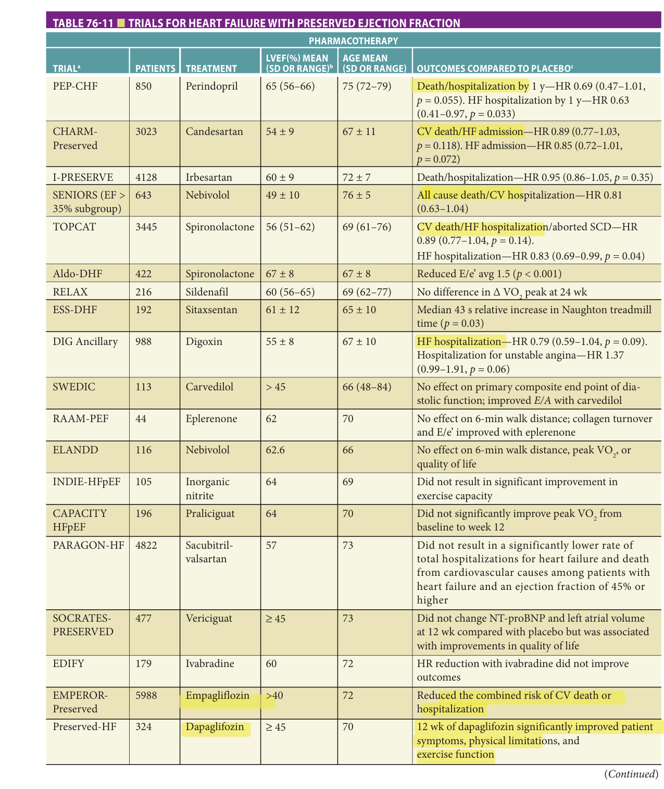

> *Table 76-11 reproduced as a page image (printed p. 1185) — the grid did not extract reliably as text for this fast build.*

> Highlighting is the owner's annotation, not the book's.

 **[p. 1186]**
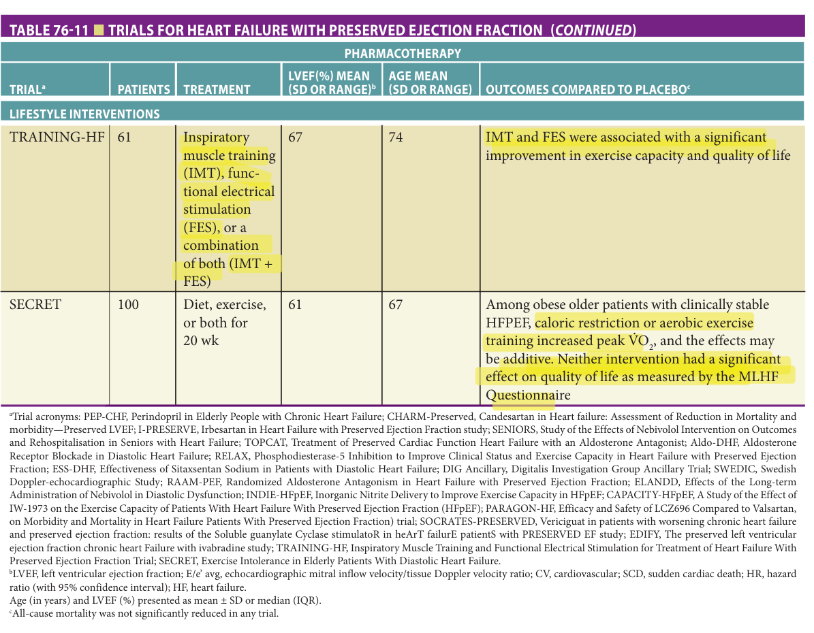

> *Table 76-11 reproduced as a page image (printed p. 1186) — the grid did not extract reliably as text for this fast build.*

> Highlighting is the owner's annotation, not the book's.

aTrial acronyms: PEP-CHF, Perindopril in Elderly People with Chronic Heart Failure; CHARM-Preserved, Candesartan in Heart failure: Assessment of Reduction in Mortality and morbidity—Preserved LVEF; I-PRESERVE, Irbesartan in Heart Failure with Preserved Ejection Fraction study; SENIORS, Study of the Effects of Nebivolol Intervention on Outcomes and Rehospitalisation in Seniors with Heart Failure; TOPCAT, Treatment of Preserved Cardiac Function Heart Failure with an Aldosterone Antagonist; Aldo-DHF, Aldosterone Receptor Blockade in Diastolic Heart Failure; RELAX, Phosphodiesterase-5 Inhibition to Improve Clinical Status and Exercise Capacity in Heart Failure with Preserved Ejection Fraction; ESS-DHF, Effectiveness of Sitaxsentan Sodium in Patients with Diastolic Heart Failure; DIG Ancillary, Digitalis Investigation Group Ancillary Trial; SWEDIC, Swedish Doppler-echocardiographic Study; RAAM-PEF, Randomized Aldosterone Antagonism in Heart Failure with Preserved Ejection Fraction; ELANDD, Effects of the Long-term Administration of Nebivolol in Diastolic Dysfunction; INDIE-HFpEF, Inorganic Nitrite Delivery to Improve Exercise Capacity in HFpEF; CAPACITY-HFpEF, A Study of the Effect of IW-1973 on the Exercise Capacity of Patients With Heart Failure With Preserved Ejection Fraction (HFpEF); PARAGON-HF, Efficacy and Safety of LCZ696 Compared to Valsartan, on Morbidity and Mortality in Heart Failure Patients With Preserved Ejection Fraction) trial; SOCRATES-PRESERVED, Vericiguat in patients with worsening chronic heart failure and preserved ejection fraction: results of the Soluble guanylate Cyclase stimulatoR in heArT failurE patientS with PRESERVED EF study; EDIFY, The preserved left ventricular ejection fraction chronic heart Failure with ivabradine study; TRAINING-HF, Inspiratory Muscle Training and Functional Electrical Stimulation for Treatment of Heart Failure With Preserved Ejection Fraction Trial; SECRET, Exercise Intolerance in Elderly Patients With Diastolic Heart Failure. bLVEF, left ventricular ejection fraction; E/e’ avg, echocardiographic mitral inflow velocity/tissue Doppler velocity ratio; CV, cardiovascular; SCD, sudden cardiac death; HR, hazard ratio (with 95% confidence interval); HF, heart failure. Age (in years) and LVEF (%) presented as mean ± SD or median (IQR). cAll-cause mortality was not significantly reduced in any trial.

At least 70% to 80% of older persons with HFPEF have hypertension, and coronary and valvular heart diseases are also highly prevalent in this population. Treatment for HFPEF begins with aggressive management of hypertension to target levels. Although there is limited data on the ideal blood pressure targets for patients with HFPEF, it may be reasonable to apply the recent observations from SPRINT and recommend systolic blood pressure less than -- 130 mm Hg and diastolic blood pressure less than 90 mm Hg for most ambulatory, community dwelling, older adults. This target should be personalized on an individual-level, however, accounting for the potential for increased risk of falls in older adults with HFPEF, a subpopulation with a high prevalence of frailty and who frequently take diuretics which can increase risk for orthostatic hypotension. Myocardial ischemia should be treated with antianginal medications and/or coronary revascularization as indicated. Resting and exercise heart rate should be adequately controlled in patients with atrial fibrillation. Patients with severe valvular heart disease should be considered for valve repair or replacement, and less severe regurgitant valvular lesions should be treated with vasodilators, such as ACE inhibitors. As with HFREF, nonpharmacologic aspects of

therapy, including regular physical activity and exercise as described earlier, should be appropriately addressed. This, perhaps, is paramount in HFPEF given the paucity of data to date demonstrating beneficial effects from most of the pharmacologic approaches outlined below.

**Diuretics** Diuretics are an essential component of therapy for the relief of pulmonary and systemic venous congestion in most patients with HFPEF. However, such patients are often “volume sensitive.” As a result, overly zealous diuresis can lead to a reduction in left ventricular diastolic volume, with a resultant decline in stroke volume and cardiac output, often manifested by increased fatigue, relative hypotension, and worsening prerenal azotemia. Thus, diuretics must be titrated judiciously to relieve congestion while avoiding over diuresis.

**β-Blockers** β-Blockers have little or no direct effect on diastolic function, but theoretically could improve symptoms in HFPEF by slowing heart rate and lengthening the diastolic filling period. However, chronotropic incompetence, or the inability to sufficiently increase the heart rate during exercise, is common in HFPEF and may be exacerbated by β-blockers. Effective blood pressure control may aid in the regression of left ventricular hypertrophy if present,

**[p. 1187]**

but other antihypertensives may be more effective in this regard. When examining the effects of β-blockers on individuals with left ventricular ejection fraction of at least 50% from clinical trials to date, the benefits of β-blockers are not observed and in fact the data suggest an increase in all-cause mortality, although this was not statistically significant. A recent observational study of patients with HFPEF from the TOPCAT study also suggested harm from β-blockers, with increased rates of heart failure hospitalization observed in patients taking β-blocker at baseline. On the other hand, patients with HFPEF frequently contend with coronary artery disease and atrial fibrillation, where β-blockers have previously demonstrated benefit. Whether to continue/initiate a β-blocker is challenging; and deprescribing β-blockers in this setting is also not well-studied. Accordingly, until more data on this topic become available, decisions should be individualized based on the presence of other cardiovascular conditions where β-blockers are indicated, and consideration of the baseline heart rate, preexisting conduction disease, and possible side effects related to β-blocker use.

**ACE inhibitors** ACE inhibitors may improve symptoms in HFPEF both directly (by improving diastolic function) and indirectly (by promoting regression of left ventricular hypertrophy). The use of ACE inhibitors for the treatment of HFPEF in patients of advanced age is supported by findings from the Perindopril in Elderly People with Chronic Heart Failure study, in which 850 patients greater than or equal to 70 years (mean age 76, 55% women) with heart failure and estimated ejection fraction greater than or equal to 40 were randomized to perindopril 4 mg once daily or placebo and followed for an average of 2.1 years. Overall, there was no significant difference between groups with respect to the primary outcome of death or unplanned hospitalization for heart failure. However, heart failure hospitalizations were significantly reduced by 78% during the first 12 months of follow-up in patients randomized to perindopril. Relative to placebo, perindopril-treated patients also experienced significant improvements in NYHA class and exercise tolerance during the first year of therapy. Perindopril is not approved for the treatment of heart failure in the United States, and none of the other ACE inhibitors are approved for the treatment of HFPEF; however, given that the benefits of perindopril may be a class effect, the use of ACEI may be reasonable in HFPEF, especially when blood pressure is elevated and/or patients have other indications for an ACEI such as diabetes.

**Angiotensin II receptor blockers** ARBs lower blood pressure and may have salutary effects on diastolic function like those observed with ACE inhibitors. In the CHARMPreserved Trial, 3024 patients with NYHA class II to IV heart failure and an ejection fraction greater than 40% were randomized to candesartan or placebo and followed for a median of 37 months. The mean age was 67, 27% were 75 years or older, and 40% were women. Mortality did not

differ between groups, but patients randomized to cande- sartan experienced a significant 16% reduction in the risk of hospitalization for heart failure and 29% fewer total heart failure admissions. Subgroup analysis by age was not reported. In large part due to this study, ARBs are now considered reasonable for use to prevent hospitalizations for HFPEF as per the AHA/ACC heart failure guidelines (last updated 2017).

**MRAs** MRAs spironolactone and eplerenone reduce myocardial hypertrophy and fibrosis in laboratory animals and small studies indicate that they have a favorable effect on left ventricular diastolic function in humans. In addition, as discussed previously, both agents have been shown to improve mortality and other outcomes in patients with HFREF. In a recently published trial, 3445 patients with symptomatic heart failure and an ejection fraction greater than or equal to 45% were randomized to spironolactone or placebo and followed for a mean of 3.3 years. The average age was 69 and 52% were women. The primary outcome, a composite of cardiovascular death, aborted cardiac arrest, or hospitalization for heart failure, did not differ between patients randomized to spironolactone versus placebo. Similarly, total mortality and all-cause hospitalizations were not different between groups. However, hospitalizations for heart failure were reduced 17% among patients randomized to spironolactone ( _p_ = 0.04). Given some concerns about the study population and study conduct in Europe, post-hoc analyses have been conducted on patients from just North and South America. These data show that spironolactone was associated with a significant - 18% reduction in the primary end point, as well as a 26% reduction in cardiovascular mortality and 18% reduction in heart failure rehospitalization. Thus, although additional research is needed, this study suggests that spironolactone may be beneficial for patients with HFPEF. In fact, the FDA is considering approval of MRA therapy for HFPEF based on these data.

**Calcium channel blockers** Calcium channel blockers decrease intracellular calcium and may have a modest beneficial effect on diastolic function. However, there have been no large clinical trials evaluating calcium channel blockers for the treatment of HFPEF. While calcium channel antagonists are not specifically indicated for the treatment of this condition, they may be helpful to treat other concurrent conditions common in adults with HFPEF such as atrial fibrillation. Caution should be exercised; however, given their potential to worsen cardiac output by impairing chronotropy and inotropy.

**Nitrates** In addition to relieving ischemia, nitrates are effective venodilators and thus lower pulmonary capillary wedge pressure. For these reasons, nitrates may serve as a useful adjunct to diuretics in relieving symptoms of pulmonary congestion, particularly orthopnea. However, nitrates also have the potential for decreasing venous return to the heart, thereby reducing left ventricular diastolic volume and stroke volume. In addition, tolerance to the hemodynamic

**[p. 1188]**

> effects of nitrates occurs in many patients. A randomized crossover trial of isosorbide mononitrate in subjects with HFPEF did not demonstrate better quality of life or submaximal exercise capacity and demonstrated that nitrates might lead to reduced activity among adults with HFPEF compared to placebo. As a result, use of nitrates for the routine management of HFPEF is not recommended.

**Digoxin** Digoxin, as well as other inotropic agents, may exert a favorable effect on diastolic function by accelerating calcium reuptake by the sarcoplasmic reticulum at the onset of diastole. In the original DIG trial, 988 patients with heart failure and an ejection fraction of more than 45% were randomized to digoxin or placebo in an ancillary study. As in the main trial, digoxin had no effect on mortality. Hospitalizations for heart failure were reduced in patients with HFPEF receiving digoxin, but this effect was counterbalanced by increased hospitalizations for acute coronary syndromes. <mark>Thus, digoxin does not appear to be beneficial in patients with HFPEF and is not recommended except as an adjunct for controlling heart rates in patients with atrial fibrillation.</mark>

**ARNI** While sacubitril/valsartan has demonstrated dramatic benefits in HFREF, its efficacy in HFPEF is less dramatic. In the prospective comparison of ARNI with ARB on management of heart failure with preserved ejection fraction (PARAMOUNT) trial of 301 HFPEF patients, ARNI therapy resulted in lower NTproBNP levels after 12 weeks than valsartan alone. However, in the phase III PARAGON trial among 4822 patients with NYHA class II to IV heart failure, ejection fraction of 45% or higher, elevated level of natriuretic peptides, and structural heart disease, sacubitril-valsartan did not result in a significantly lower rate of total hospitalizations for heart failure and death from cardiovascular causes. Notably in this large trial, there was heterogeneity of treatment effects with possible benefit with sacubitril-valsartan in patients with lower ejection fraction and in women. The FDA has recently approved sacubitril/ valsartan therapy for patients with chronic heart failure regardless of ejection fraction, while noting that the drug is most effective in patients with a reduced ejection fraction.

**Other agents** For patients diagnosed with transthyretin cardiac amyloidosis, tafamidis, a TTR stabilizer, was approved by the FDA and EMU based on the ATTR-ACT trial which showed a lower all-cause mortality vs placebo (29.5% vs 42.9%) and a 32% lower risk of cardiovascular hospitalizations in those treated with tafamidis compared to placebo. Notably, subjects with NYHA class III symptoms in ATTR-ACT had higher rates of cardiovascular-related hospitalization with tafamidis therapy compared to placebo, emphasizing the importance of early diagnosis and treatment. In the ATTR-ACT trial, decline in the distance covered on 6-minute walk test and in the Kansas City Cardiomyopathy Questionnaire overall summary score was slowed with tafamidis therapy. Tafamidis has two formulations, tafamidis meglumine (20 mg capsules, dose 80 mg daily) and tafamidis free salt (61 mg capsule daily), the

latter of which was formulated for patient convenience as a single-dose capsule. These formulations are bioequivalent, though are not substitutable on a per-milligram basis. The high cost (list price of $225,000 per year) could limit access.

Preliminary studies of phosphodiesterase 5 inhibitors suggested that these agents may have favorable effects on exercise capacity in patients with HFPEF. However, in the RELAX trial, which randomized 216 patients (mean age 69, 48% women) with heart failure and a left ventricular ejection fraction greater than or equal to 50% to sildenafil or placebo for 24 weeks, sildenafil did not result in significant improvements in exercise capacity or clinical status compared to placebo.

Endothelin type A receptor antagonists have also shown promise for treating HFPEF in preliminary studies. In the Effectiveness of Sitaxsentan Sodium in Patients with Diastolic Heart Failure (ESS-DHF) trial, 192 patients (mean age 65, 63% women) with HFPEF and a left ventricular ejection fraction greater than or equal to 50% were randomly assigned in a 2:1 ratio to receive sitaxsentan or placebo for 24 weeks. The primary outcome was change in treadmill exercise time; secondary outcomes included changes in left ventricular mass, diastolic function, symptom severity, and quality of life. Sitaxsentan therapy showed modest improvement in treadmill exercise time relative to placebo (37 seconds; _p_ = 0.03), but there was no effect on any of the secondary outcomes. A recent study examining macitentan in adults with HFPEF and concurrent pulmonary hypertension was recently completed, with results anticipated in 2021.

SGLT2 inhibitors have been investigated in two large trials, DELIVER (evaluating dapagliflozin) and EMPEROR-Preserved (evaluating empagliflozin) in patients with HFPEF. Emperor-Preserved assigned 5988 patients with class II–IV heart failure and an ejection fraction of more than 40% to receive empagliflozin (10 mg once daily) or placebo.  Over a median of 26.2 months, the primary endpoint of death or hospitalization for heart failure was lower in the empagliflozin arm (hazard ratio, 0.79; 95% confidence interval [CI], 0.69 to 0.90; P<0.001) mainly related to a lower risk of hospitalization for heart failure. The effects of empagliflozin appeared consistent in patients with or without diabetes.

**Summary** Studies published to date indicate that ACE inhibitors, ARBs, MRAs, and more recently ARNi may - have favorable effects on some outcomes in patients with HFPEF, <mark>with only ARNi and SGLT2 therapy approved by the FDA for subjects with an EF greater than 50%.</mark> In subgroup analyses of randomized trials, ARNi therapy appears to have a more favorable effect in patients with EF of 40% - to 50%, but this group may be more similar in pathophysiology and treatment responsiveness to HFREF. SGLT2 inhibitors can be considered to reduce the risk of hospitalization for heart failure. Consequently, management of HFPEF should include aggressive treatment of the underlying cardiac disease, and a diuretic should be administered at low-tomoderate doses to relieve congestion and edema. The addition of an ACE inhibitor, ARB, MRAs, ARNi, SGLT2 inhibitor, or β-blocker to improve symptoms and reduce

**[p. 1189]**

the risk of hospitalization may be reasonable in some cases, but this will require individualization. Given lack of consistent data on its benefits, alternative treatment should be considered if/ when these agents are not tolerated or lead to worse outcomes. Additional studies to evaluate novel therapies are ongoing and represent an important opportunity for older adults to participate and ensure that they are well-represented in these trials.

### Isolated Right Heart Failure

While the most common cause of chronic right-sided heart failure is one or more abnormalities of left heart function, a small proportion of patients present with isolated right heart failure. Etiologies of isolated right heart failure in older adults include pulmonary arterial hypertension due to chronic lung disease, chronic pulmonary thromboembolic disease, sleep-disordered breathing, primary pulmonary vascular disease, and disorders of the tricuspid or (less commonly) pulmonic valve (eg, infectious endocarditis, carcinoid heart disease). Rarely, right heart failure in older patients may be attributed to congenital heart disease (eg, atrial septal defect), neoplasm (eg, right atrial myxoma or rhabdomyosarcoma), or a primary cardiomyopathy involving the right ventricle (eg, arrhythmogenic right ventricular dysplasia). Acute right heart failure may be due to right ventricular infarction, massive or sub-massive pulmonary embolism, or severe lung disease (eg, pneumonia, acute respiratory distress syndrome). Symptoms of right heart failure include dyspnea, impaired exercise tolerance, dependent edema, and, in severe cases, abdominal discomfort and swelling. The physical examination is notable for signs of elevated right-sided pressures (jugular venous distension, abdominojugular reflux, right ventricular heave, hepatomegaly), lower extremity edema, and possibly - - ascites. Depending on the etiology, other symptoms and signs may be present. Treatment is directed primarily at the underlying cause(s) and secondarily at alleviating systemic congestion through the judicious use of diuretics. The value of other pharmacologic agents, such as β-blockers and renin-angiotensin system inhibitors, for the treatment of isolated right heart failure is unknown.

### Advanced Heart Failure

Refractory or advanced heart failure may be defined as heart failure not amenable to primary corrective measures (eg, valve replacement or revascularization) and not responsive to aggressive nonpharmacologic and pharmacologic therapy as described earlier. However, before designating heart failure as refractory, it is important to perform a careful search for potentially treatable causes, to carefully review the patient’s medication regimen to ensure that therapy is optimal, and to discuss the patient’s diet and medication habits in detail with the patient and family to ensure that an appropriate level of adherence is being maintained. The latter issue is of particular importance, since many cases of refractory heart failure can be traced to nonadherence to dietary restrictions, medications, or both.

In most cases, refractory or advanced heart failure simply represents the final common pathway of end-stage heart disease. Under these circumstances, the value of highly aggressive treatment is questionable, and decisions regarding the appropriateness of specific therapeutic interventions must be made on an individualized basis (see also Chapters 7 and 67).

In patients with persistent pulmonary congestion or peripheral edema, high-dose oral diuretics (eg, furosemide 200 mg BID or bumetanide 10 mg daily), alone or in combination with metolazone, may be effective. Alternatively, a continuous intravenous infusion of furosemide 5 to 40 mg/h or bumetanide 0.5 to 1 mg/h may facilitate diuresis.

The use of intravenous inotropic agents in the management of chronic heart failure is somewhat controversial since these agents have not been shown to improve outcomes and they may increase the risk of life-threatening arrhythmias. Nonetheless, extensive clinical experience indicates that continuous infusions of dobutamine or milrinone may reduce symptoms and improve quality of life in selected patients with refractory heart failure. The use of intravenous inotropic agents at home can also be used for select patients for the purposes of bridging them to advanced therapies or for the purposes of palliation.

As noted earlier, CRT has been shown to improve symptoms, quality of life, and survival in patients with advanced heart failure and left bundle branch block or marked intraventricular conduction delay on the 12-lead electrocardiogram. This procedure should, therefore, be considered in appropriately selected patients with persistent class III or IV heart failure symptoms.

An emerging therapy for patients with end-stage refractory heart failure (primarily HFREF) is mechanical circulatory support through implantation of a left ventricular assist device (LVAD). LVADs improve symptoms, exercise tolerance, quality of life, and survival in selected patients with severe heart failure, including patients in their 70s and early 80s. Although LVADs were originally developed as a bridge to heart transplantation, with technological advances they are now commonly implanted as “destination therapy” in patients who are not transplant candidates. As a result, an increasing number of older adults are receiving LVADs, and this trend is likely to continue as the technology evolves. Older adults are at increased risk for gastrointestinal bleeding following LVAD implantation; other potential complications include infection, stroke, and pump thrombosis. Optimal patient selection is critical, and patients with advanced comorbidities or frailty may not be suitable candidates. To this end, a thorough discussion of goals of care, facilitated by a palliative care team consultation, (which is required by CMS guidelines to be formally part of the LVAD team), is recommended as an integral component of the evaluation for LVAD therapy.

Heart transplantation is a highly effective therapy for patients with advanced heart failure, but its use is limited by the paucity of donor hearts. In part due to limited organ

**[p. 1190]**

> availability coupled with issues of immunosuppression in older adults and the increased risk of infection, most transplant centers exclude patients older than 70 to 75 years. Nonetheless, among carefully selected patients greater than or equal to 65 years undergoing heart transplantation, outcomes are favorable and generally similar to those in younger patients.

## Prognosis

The long-term prognosis in patients with established heart failure is poor, and the 5-year survival rate among older ~,.. adults is less than 50%. In patients greater than or equal to 80 years old hospitalized with heart failure, fewer than 25% survive more than 5 years. In general, the prognosis is worse in men than in women and in patients with an ischemic rather than nonischemic etiology. Patients with more severe symptoms or exercise intolerance, as defined by the NYHA functional class or as assessed by a 6-minute walk test, also have a less favorable outlook. Other markers of an adverse prognosis include elevated BNP; low systolic blood pressure; hyponatremia; renal insufficiency; anemia; peripheral arterial disease; cognitive dysfunction; and the presence of atrial fibrillation or high-grade ventricular arrhythmias. In patients with chronic heart failure, 40% to 50% die from progressive heart failure, 40% die from arrhythmias, and 10% to 20% die from other causes (eg, myocardial infarction or noncardiac conditions). Notably, the proportion dying from noncardiac causes rises with advancing age owing to other comorbid conditions and the concurrence of geriatric conditions such as cognitive impairment and frailty. As a means to embed prognosis into medical decision-making, it may be reasonable to apply the domain management approach to caring for older adults with heart failure, where multiple domains of health across medical (multimorbidity, polypharmacy, malnutrition), mind/emotion (depression, anxiety, cognitive impairment), functional (frailty, impaired mobility, functional impairment, history of falls), and social environment (social support, financial means) are considered in the care of older adults.

## Advance Care Planning And End-Of-Life Decisions

Overall survival rates for patients with heart failure are lower than for most forms of cancer. In addition, once heart failure symptoms have reached an advanced stage (eg, NYHA class III or IV), quality of life is often severely compromised and therapeutic options are limited. Moreover, even patients with relatively mild or well-compensated heart failure are continually at risk of experiencing sudden cardiac arrest, and, if initial resuscitative efforts are successful, questions regarding life support and related issues may arise.

For these reasons, it is incumbent upon the physician to discuss the patient’s wishes regarding the intensity

of treatment and end-of-life care at a time when the patient is still capable of understanding the issues and making informed choices. In addition, since the patient’s views may evolve over the course of illness, these issues should be readdressed at periodic intervals. The development of an advance directive and appointment of durable power of attorney should also be encouraged (see Chapters 7 and 26).

A related concern is the extent to which clinicians should offer aggressive or investigational therapeutic options that are unlikely to substantially alter the natural history of disease or significantly improve quality of life. This concern applies not only to many of the treatment modalities discussed in the Advanced Heart Failure section earlier, but also to such procedures as admission to an intensive care unit and endotracheal intubation. In many cases, these interventions not only fail to modify the clinical course but contribute to the patient’s pain and suffering in the terminal stages of disease. Moreover, the suggestion that a given intervention may help stabilize the patient and slow disease progression may create false hopes in the minds of the patient and family, and subsequent failure of the intervention may compound the emotional suffering that both the patient and the family are forced to endure. For these reasons, it is essential that the clinician realistically appraise the potential benefits and attendant risks, both physical and emotional, prior to offering aggressive therapeutic options that may provide little or no hope of improving the patient’s quality of life over a clinically important period of time. In this context, it is often appropriate to offer transition to a palliative care approach and to obtain consultation from a palliative care specialist.

Finally, as the patient approaches the terminal stages of disease, there should be discussions with the patient and family regarding where the patient would like to spend his or her final days. For many patients, the idea of dying at home surrounded by close family is comforting, and this desire should be honored whenever possible. Often home hospice affords optimal end-of-life care in the home environment by providing effective symptom control, as well as emotional, spiritual, and caregiver support. Home hospice is also associated with higher levels of patient and family satisfaction with care in most cases, though caregiver burden may be higher than in an inpatient setting. For some patients, the hospital or an inpatient hospice may be the preferred environment for terminal care, but an attempt should be made to secure a private room with open visitation hours. The intensive care unit, with its austere, “high-tech” facade, may be the least desirable place to die, and this should be avoided whenever possible.

## Prevention

In view of the exceptionally poor prognosis associated with established heart failure in older adults, it is essential to develop and implement preventive strategies. Appropriate

**[p. 1191]**
treatment of hypertension has been repeatedly shown to reduce the incidence of heart failure by 50% or more. In the Hypertension in the Very Elderly Trial, for example, treatment of hypertension was associated with a 64% reduction in incident heart failure among patients 80 years or older, and, similarly, the intensive, less than 120 mm Hg arm in the SPRINT study was found to result in a 36% lower rate of acute decompensated HF compared to the standard, 140 mm Hg arm. (Additional details are in Chapter 79.) The St. Vincent’s Screening to Prevent Heart Failure (STOP-HF) and N-terminal Pro-brain Natriuretic Peptide Guided Primary Prevention of Cardiovascular Events in Diabetic Patients (PONTIAC) trials have shown that natriuretic peptide-based screening and targeted prevention can reduce heart failure and left ventricular dysfunction and other major cardiovascular events. Treatment of hyperlipidemia has also been shown to reduce the incidence of heart failure, most likely through prevention of myocardial infarction and other ischemic events. Likewise, smoking cessation and regular exercise reduce the risk of myocardial infarction and stroke in older adults and likely have similar effects on the development of heart failure. Unfortunately, despite abundant evidence that heart failure prevention is feasible through risk factor modification, such strategies are underused, especially in persons older than 80 years.

## Summary

Heart failure is a common and important clinical problem in older adults, owing, in large part, to the complex interplay between age-related changes in the cardiovascular system, the high prevalence of cardiovascular and noncardiovascular disorder in the older population, and the widespread use of certain drugs and other therapies that may adversely affect cardiovascular physiology. As the population continues to age, heart failure will have a progressively greater impact on health care delivery systems. The impact of heart failure on quality of life and independence in the growing number of older adults with this disorder is incalculable. Thus, there is a compelling need to develop and implement strategies for the prevention and treatment of heart failure, with particular emphasis on the geriatric population.

## Acknowledgement

This chapter was based on the many previous versions authored by our colleague, Dr. Mike Rich, who not only taught us much of what we know about Geriatric Cardiology but has been an inspiring leader and is considered by many as the founder of our field. His mentorship has fostered a new generation of cardiologists and geriatricians dedicated to the care of older adults with cardiovascular disease and benefited countless lives.

## Further Reading

- Afilalo J, Alexander KP, Mack MJ, et al. Frailty assessment in the cardiovascular care of older adults. _J Am Coll Cardiol_ . 2014;63(8):747–762.

- Anker SD, Butler J, Filippatos G, et al.; EMPERORPreserved Trial Investigators. Empagliflozin in heart failure with a preserved ejection fraction. _N Engl J Med_ . 2021;385(16):1451–1461.

- Beckett NS, Peters R, Fletcher AE, et al. Treatment of hypertension in patients 80 years of age or older. _N Engl J Med_ . 2008;358:1887–1898.

- Chaudhry SI, Wang Y, Gill TM, Krumholz HM. Geriatric conditions and subsequent mortality in older patients with heart failure. _J Am Coll Cardiol_ . 2010;55:309–316.

- Cleland JGF, Tendera M, Adamus J, Freemantle N, Polonski L, Taylor J. The perindopril in elderly people with chronic heart failure (PEP-CHF) study. _Eur Heart J_ . 2006;27:2238–2245.

- DeFilippis EM, Nakagawa S, Maurer MS, Topkara VK. Left ventricular assist device therapy in older adults: addressing common clinical questions. _J Am Geriatr Soc_ . 2019;67(11):2410–2419.

- Feltner C, Jones CD, Cene CW, et al. Transitional care interventions to prevent readmissions for persons with

   - heart failure. A systematic review and meta-analysis. _Ann Intern Med_ . 2014;160:774–784.

- Flather MD, Shibata MC, Coats AJ, et al. Randomized trial to determine the effect of nebivolol on mortality and cardiovascular hospital admission in elderly patients with heart failure (SENIORS). _Eur Heart J_ . 2005;26: 215–225.

- Forman DE, Arena R, Boxer R, et al. American Heart Association Council on Clinical Cardiology; Council on Cardiovascular and Stroke Nursing; Council on Quality of Care and Outcomes Research; and Stroke Council. Prioritizing functional capacity as a principal end point for therapies oriented to older adults with cardiovascular disease: a scientific statement for healthcare professionals from the American Heart Association. _Circulation_ . 2017;135(16):e894–e918.

- Gorodeski EZ, Goyal P, Hummel SL, et al. Domain management approach to heart failure in the geriatric patient: present and future. _J Am Coll Cardiol_ . 2018;71(17): 1921–1936.

- Gurwitz JH, Magid DJ, Smith DH, et al. Contemporary prevalence and correlates of incident heart failure with preserved ejection fraction. _Am J Med_ . 2013;126:393–400.

**[p. 1192]**

- Heidenreich PA, Albert NM, Allen LA, et al. Forecasting the impact of heart failure in the United States: a policy statement from the American Heart Association. _Circ Heart Fail_ . 2013;6:606–619.

   - Homma S, Thompson JLP, Pullicino PM, et al. Warfarin and aspirin in patients with heart failure and sinus rhythm. _N Engl J Med_ . 2012;366:1859–1869.

   - Jurgens CY, Goodlin S, Dolansky M, et al. Heart failure management in skilled nursing facilities: a scientific statement from the American Heart Association and the Heart Failure Society of America. _Circ Heart Fail_ . 2015;8:655–687.

   - Lakatta EG, Levy D. Arterial and cardiac aging: major shareholders in cardiovascular disease enterprises: Part I: aging arteries: a “set up” for vascular disease. _Circulation_ . 2003;107(1):139–146.

   - Lakatta EG, Levy D. Arterial and cardiac aging: major shareholders in cardiovascular disease enterprises: Part II: the aging heart in health: links to heart disease. _Circulation_ . 2003;107(2):346–354.

   - Mentz RJ, Kelly JP, von Lueder TG, et al. Noncardiac comorbidities in heart failure with reduced versus preserved ejection fraction. _J Am Coll Cardiol_ . 2014;64:2281–2293.

   - Nassif ME, Windsor SL, Borlaug BA, et. al.  The SGLT2 inhibitor dapagliflozin in heart failure with preserved ejection fraction: a multicenter randomized trial. _Nat Med._ 2021;27(11):1954–1960.

   - Pitt B, Pfeffer MA, Assmann SF, et al. Spironolactone for heart failure with preserved ejection fraction. _N Engl J Med_ . 2014;370:1383–1392.

   - Rich MW, Chyun DA, Skolnick AH, et al. Knowledge gaps in cardiovascular care of the older adult population: a scientific statement from the American Heart Association,

American College of Cardiology, and American Geriatrics Society. _Circulation_ . 2016;133(21):2103–2122.

- Saczynski JS, Go AS, Magid DJ, et al. Patterns of comorbidity in older adults with heart failure: the Cardiovascular Research Network PRESERVE study. _J Am Geriatr Soc_ . 2013;61:26–33.

- Santangeli P, Di Blase L, Dello Russo A, et al. Meta-analysis: age and effectiveness of prophylactic implantable cardioverter-defibrillators. _Ann Intern Med_ . 2010;153: 592–599.

- Solomon SD, McMurray JJV, Anand IS, et al. PARAGON-HF Investigators and Committees. Angiotensin-neprilysin inhibition in heart failure with preserved ejection fraction. _N Engl J Med_ . 2019;381(17):1609–1620.

- Upadhya B, Stacey RB, Kitzman DW. Preventing heart failure by treating systolic hypertension: what does the SPRINT add? _Curr Hypertens Rep_ . 2019;21(1):9.

- Virani SS, Alonso A, Benjamin EJ, et al. American Heart Association Council on Epidemiology and Prevention Statistics Committee and Stroke Statistics Subcommittee. Heart Disease and Stroke Statistics-2020 Update: a report from the American Heart Association. _Circulation_ . 2020;141(9):e139–e596.

- Whelan DJ, Goodlin SJ, Dickinson MG, et al. End-of-life care in patients with heart failure. _J Cardiac Fail_ . 2014; 20:121–134.

- Yancy CW, Jessup M, Bozkurt B, et al. 2017 ACC/AHA/ HFSA Focused Update of the 2013 ACCF/AHA Guideline for the Management of Heart Failure: A Report of the American College of Cardiology/American Heart Association Task Force on Clinical Practice Guidelines and the Heart Failure Society of America. _J Card Fail_ . 2017;23(8):628–651.

