# Hazzard's Geriatric Medicine and Gerontology, 8e — Chapter 77: Cardiac Arrhythmias

Nway Le Ko Ko, Win-Kuang Shen

> **Fast build from the book, 22 Sep; not lane-reviewed.**

**[p. 1193]**

#### Learning Objectives

- Review guideline-directed management of syncope with a focus on conditions relevant to the older population.
- Understand the etiologies of bradyarrhythmia, indications for permanent pacemaker (PPM) placement, and selection of the PPM mode.
- Discuss the goals of rate and rhythm control and approach to anticoagulation in older patients with atrial fibrillation (AF).
- Summarize the management of supraventricular tachycardia (SVT) in the older population.
- Understand ventricular tachycardia (VT) in the older population along with indications for implantable cardioverter-defibrillator (ICD) for primary and secondary sudden cardiac death (SCD) prevention.
- Review indications for cardiac resynchronization therapy (CRT).

#### Key Clinical Points

1. Age-related changes throughout the heart and conduction system predispose older individuals to syncope, bradycardia, atrial fibrillation, and supraventricular and ventricular tachyarrhythmias.
2. Syncope is common in the older population. It is a clinical manifestation associated with cardiac arrhythmias or other conditions altering cerebral perfusion causing transient loss of consciousness.
3. The indications for a PPM for treatment of bradyarrhythmia are similar in older and younger patients. More than 80% of permanent PPMs are placed in patients 65 years or older, with sinoatrial dysfunction being the leading indication for PPM implantation in this age group.
4. Compared with single-chamber ventricular pacing, dual-chamber pacing reduces the risk of AF but does not affect mortality or the risk of stroke.
5. Age greater than 65 years is a wellrecognized risk factor for thromboembolism in patients with AF. Treatment for stroke prevention in patients with atrial fibrillation is based on the CHA2DS2-VASc risk stratification scheme.
6. In asymptomatic or mildly symptomatic patients with AF, a strategy of pharmacologic rate control and anticoagulation is associated with similar or better outcomes than a strategy of rhythm control.
7. In patients with symptomatic AF refractory to pharmacologic treatment, various catheter-based ablation procedures, as well as the surgical maze procedure, provide effective control of rate and/or arrhythmia in selected groups of older patients.
8. The indications for implantable cardioverterdefibrillator (ICD) and cardiac resynchronization therapy (CRT) are similar in older and younger patients, as are the benefits in terms of reducing mortality and improving symptoms. However, limited data are available on the outcomes from these devices in patients older than 80 years.

## Introduction

This chapter is to provide an overview of conditions related to cardiac rhythm disorders with a focus on the older population. Terms used in this chapter such as “older patients” or “older population” are generally referring to patients older than 65 years unless otherwise stated based on specific referenced clinical investigations.

## Syncope

The incidence of syncope is high in the older population with a sharp increase in incidence after 70 years and is usually associated with poor outcome—there is a greater risk of hospitalization and death related to syncope in older adults. They are vulnerable to syncope due to age-related changes in cardiovascular and autonomic nervous system, comorbid conditions, polypharmacy, and decreased ability to conserve intravascular volume. In many instances, syncope is multifactorial in an older adult with many predisposing factors presenting simultaneously. Thence, a comprehensive multidisciplinary approach is often necessary for diagnosis and management. Guideline-directed evaluation and management of patients with syncope have been published by ACC/AHA/HRS (2017) and by ESC (2018). For the objectives of this chapter, pertinent conditions causing syncope in the older populations are discussed in this section.

### Orthostatic Hypotension

Orthostatic hypotension (OH) is a common cause of syncope in the geriatric population, with a prevalence of 30% among those older than 75 years, and up to 50% among frail older adults living in nursing homes. OH is defined as a sustained decline of more than or equal to 20 mm Hg in systolic or more than or equal to 10 mm Hg in diastolic blood pressure upon standing. There are four types of OH ( **Table 77-1** ). OH can be caused by impaired autonomic reflexes resulting in pooling of blood upon standing, reduced vasoconstriction, and cerebral hypoperfusion with resultant syncope. An older adult has decreased heart rate responsiveness to postural changes and diminished baroreceptor sensitivity, which impair the ability to adapt to orthostatic stress. Also, reduced concentrations of plasma aldosterone, coupled with impaired thirst and

**[p. 1194]**

polypharmacy (diuretics and vasodilators), place older patients at risk of volume depletion. Underlying autonomic insufficiency such as autonomic neuropathy, diabetic neuropathy, amyloidosis, or neurologic disorders like Parkinson disease (Shy-Drager Syndrome) should be

considered in older patients presenting with recurrent orthostatic syncope. Postprandial syncope is a subtype of orthostatic syncope occurring within 30 to 90 minutes of food consumption resulting from pooling of blood in splanchnic circulation. Treatments include withdrawing offending medications, liberalization of salt and fluid intake, slowly rising from a supine position, avoidance of prolonged standing, wearing compression stockings and physical countermeasures like crossing legs when standing. Pharmacologic therapy includes midodrine or fludrocortisone to improve hypotension. Small and frequent meals as well as cold water ingestion are recommended to alleviate postprandial syncope and octreotide may be beneficial to those with recurrent postprandial syncope. These treatment options need to be individualized due to the frequent presence of comorbid conditions in older patients.

### Neurocardiogenic Syncope (Vasovagal Syncope or VVS)

Vasovagal syncope (VVS) is the most common form of syncope in younger population, but it occurs not infrequently in older patients. The pathophysiology of VVS results from a reflex causing hypotension and bradycardia, triggered by prolonged standing or exposure to emotional stress, pain, or medical procedures. It is typically associated with a prodrome of diaphoresis, warmth, and pallor, and with fatigue after the event. These clinical characteristics are often more subtle or absent in older patients. Three types of vasovagal response are summarized in **Table 77-2** . Conservative, nonpharmacologic management (such as counterpressure maneuvers, orthostatic training, liberalization of salt and fluid) may help, but no specific medical therapy has been proven widely effective. Pacemaker therapy may be beneficial in older patients with a predominant cardioinhibitory VVS. The 2017 ACC/AHA/HRS Guideline for the Evaluation and Management of Patients with Syncope recommends dual-chamber pacing as <mark>reasonable for patients older than 40 years with recurrent VVS and spontaneous pauses.</mark> Closed loop stimulation (CLS) is a new pacing technology that detects local impedance changes in the right ventricle (RV), which may be related to RV preload and contractility. Early detection of impedance changes from the RV pacemaker lead to initiate pacing that may

**Table 77-1 — Types of orthostatic hypotension (oh)**

|Initial (immediate) OH|A transient BP decreases within 15 s after standing| |---|---| |Classic OH|A sustained reduction of systolic BP of ≥ 20 mm Hg or diastolic BP of ≥ 10 mm Hg within 3 min of assuming upright posture| |Delayed OH|A sustained reduction of systolic BP of ≥ 20 mm Hg or diastolic BP of ≥ 10 mm Hg in > 3 min of assuming upright posture| |Neurogenic OH|A subtype of OH that is due to dysfunc- tion of the autonomic nervous system and not solely due to … *(table text runs longer in the printed book; not fully reproduced in this fast build)*

**Table 77-2 — Three types of vasovagal response**

|Cardioinhibitory response|Pauses of ≥ 3 s or heart rate < 40 bpm for more than 10 s| |---|---| |Vasodepressor|Systolic BP falls by 50 mm Hg or more| |response|without symptoms or 30 to 50 mm Hg with symptoms of syncope or presyncope, and the heart rate does not decrease by more than 10% l I| |Mixed response|Heart rate decreases but the ventricular rate does not fall below 40 bpm for more than 10 s, and there are no pauses > 3 s; BP usually decreases before the … *(table text runs longer in the printed book; not fully reproduced in this fast build)*

### Carotid Sinus Syndrome

Carotid sinus hypersensitivity (CSH) is common in the older population with prevalence estimated to be as high as 30% among older individuals presenting with unexplained falls. It is defined as greater than or equal to 3-second pause or a decrease in systolic blood pressure greater than or equal to 50 mm Hg during carotid sinus massage (CSM). Carotid sinus syndrome (CSS) is defined when CSH is associated with symptoms of syncope or presyncope. CSM should be a routine part of examination in older patients presenting with syncope, unless there is a carotid bruit or transient ischemic attack, stroke, or myocardial infarction within the prior 3 months. Observational and randomized studies have shown that recurrent symptoms are significantly reduced after PPM implantation in patients with CSS. Dual-chamber pacing is recommended, although data are lacking from randomized trials. Newer pacing algorithms, such as the “rate-drop response” or “sudden-brady response,” which accelerates the pacing rate when bradycardia is detected, are available. However, the clinical utility of these newer algorithms has not shown to be superior to conventional PPMs.

### Cardiogenic Syncope

Cardiogenic syncope is caused by arrhythmia (bradyarrhythmia or tachyarrhythmia) or hypotension due to low cardiac index (cardiogenic shock, reduced cardiac filling from cardiac tamponade or restrictive cardiomyopathy, or infiltrative cardiomyopathy such as amyloidosis, etc.) or blood flow obstruction (flow obstruction from valvular stenosis or hypertrophic obstructive cardiomyopathy [HOCM]). Characteristics associated with increased probability of cardiac syncope are older age, male gender, presence of known heart disease (tachyarrhythmia, bradyarrhythmia, coronary artery disease [CAD], structural heart disease, reduced ventricular function, congenital

heart disease), syncope with brief prodrome (eg, palpita- tion) or no prodrome, syncope during exertion or supine syncope, low number of previous syncopal episodes, and family history of sudden cardiac death (SCD). Treatments of syncope due to bradycardia or tachycardia are discussed in the following sections. Treatment of low cardiac output in the setting of structural heart disease or blood flow obstruction is beyond the scope of this chapter.

## Bradyarrhythmia

Bradycardia is common in older patients even without apparent cardiovascular disease. With advancing age, the number of cardiac myocytes declines, while residual myocytes enlarge with concurrent increased elastic and collagenous tissue in the interstitial matrix and conduction system. In addition to these age-related structural changes, prolongation of cellular action potential duration and diminished autonomic response further increase the propensity for bradycardia. Clinical bradycardia can be categorized by sinus node dysfunction (SND) and atrioventricular conduction block (AVB).

### Sinus Node Dysfunction

Sinus node dysfunction (SND), historically known as sick sinus syndrome (SSS), is related to age-dependent progressive fibrosis of sinus nodal tissue, and surrounding atrial myocardium and hence, occurs more commonly in older patients. Extrinsic causes include myocardial ischemia or .. - infarction, infiltrative diseases, collagen vascular disease, surgical trauma, endocrine abnormalities, autonomic effects, and neuromuscular disorders. Patients with SND may present with persistent sinus bradycardia, sinus arrest, or sinoatrial exit block ( **Figure 77-1A-D** ). The severity of symptoms such as lightheadedness, exercise intolerance, presyncope, or syncope generally correlates with the heart rate or the pause duration. In older patients with SND, paroxysmal atrial tachycardia (AT) or atrial fibrillation (AF) often are concurrently present (tachy-brady syndrome).

The benefit o <mark>f PPM</mark> is to relieve symptoms and to improve quality of life (QOL) in patients with SND.

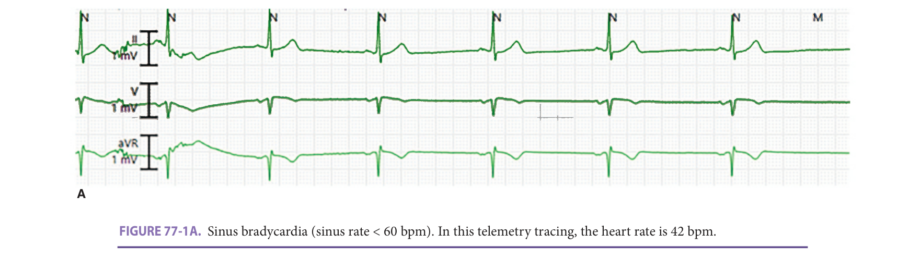

> *FIGURE 77-1A. Sinus bradycardia (sinus rate < 60 bpm). In this telemetry tracing, the heart rate is 42 bpm.*

> Highlighting is the owner's annotation, not the book's.

**[p. 1196]**

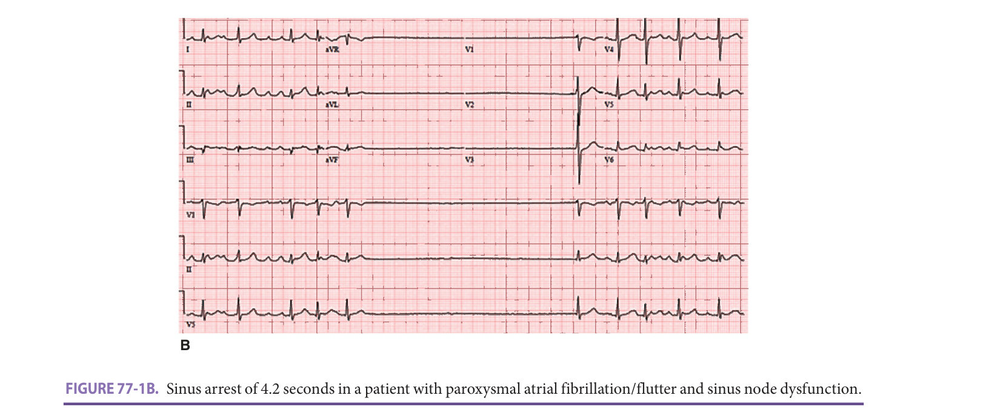

> *FIGURE 77-1B. Sinus arrest of 4.2 seconds in a patient with paroxysmal atrial fibrillation/flutter and sinus node dysfunction.*

> Highlighting is the owner's annotation, not the book's.

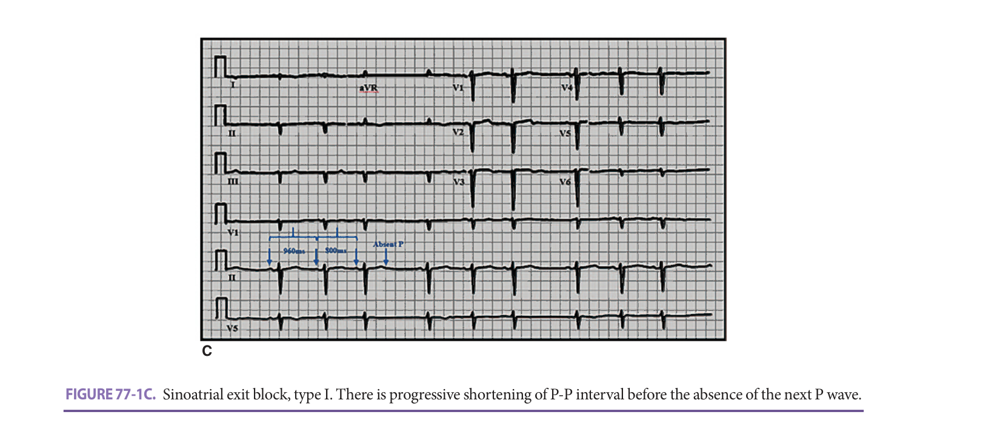

> *FIGURE 77-1C. Sinoatrial exit block, type I. There is progressive shortening of P-P interval before the absence of the next P wave.*

> Highlighting is the owner's annotation, not the book's.

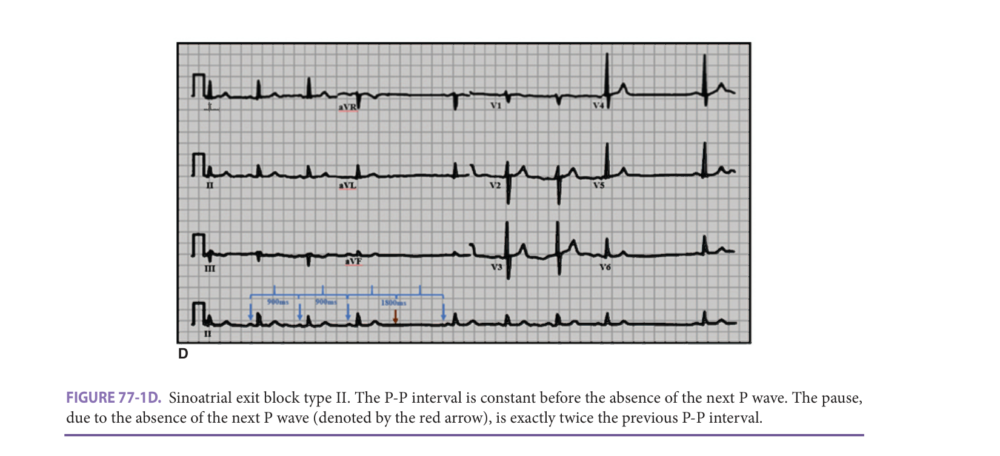

> *FIGURE 77-1D. Sinoatrial exit block type II. The P-P interval is constant before the absence of the next P wave. The pause, due to the absence of the next P wave (denoted by the red arrow), is exactly twice the previous P-P interval.*

> Highlighting is the owner's annotation, not the book's.

**[p. 1197]**
**Table 77-3 — Indications and selection of pacemaker (ppm) therapy in sinus node dysfunction (snd)**

- PPM for symptomatic SND not attributable to reversible or physiologic causes - PPM for symptomatic SND as a consequence of medication required for treating other coexisting conditions - Single-chamber atrial-based PPM when there is no evidence of AV conduction abnormality - Dual-chamber PPM when there is evidence of AV conduction abnormalities Before PPM is considered, transient reversible causes should be corrected. The synopsis on indications and selection of PPM for SND from 2018 … *(table text runs longer in the printed book; not fully reproduced in this fast build)*

ding to valvular regurgitation and heart failure symptoms. However, for patients with symptomatic SND that is infrequent or in those who are frail/bedridden with limited functional capacity or unfavorable prognosis (survival - <1 year), single-chamber ventricular pacing could be considered to reduce complications related to the pacemaker implantation. When single ventricular pacing is deemed appropriate, a leadless pacemaker could be considered in selected patients. A standard dual-chamber PPM is shown in **Figure 77-2A, B** ; a contemporary single-chamber leadless PPM is shown in **Figure 77-3A, B** .

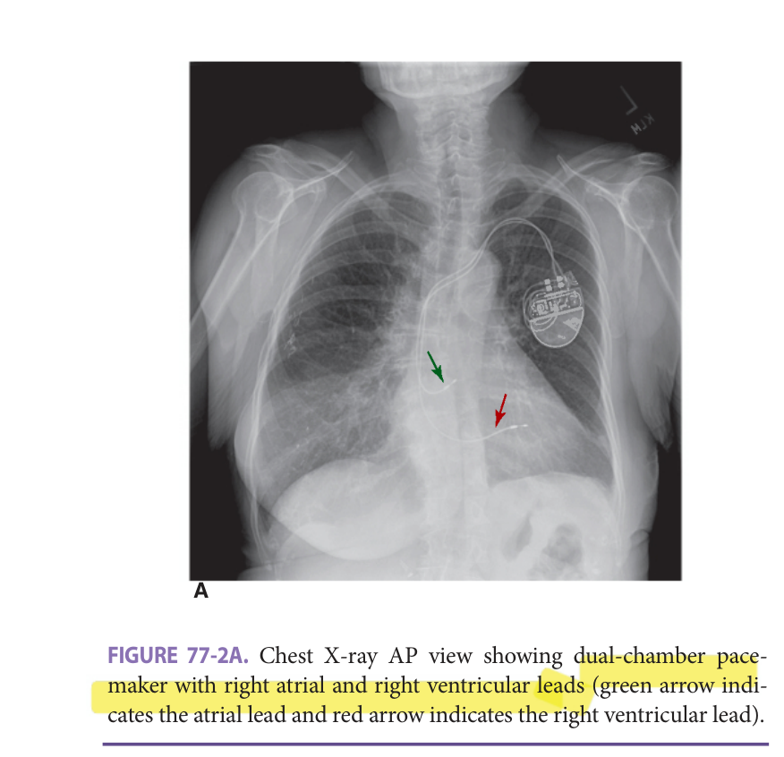

> *FIGURE 77-2A. Chest X-ray AP view showing dual-chamber pacemaker with right atrial and right ventricular leads (green arrow indicates the atrial lead and red arrow indicates the right ventricular lead).*

> Highlighting is the owner's annotation, not the book's.

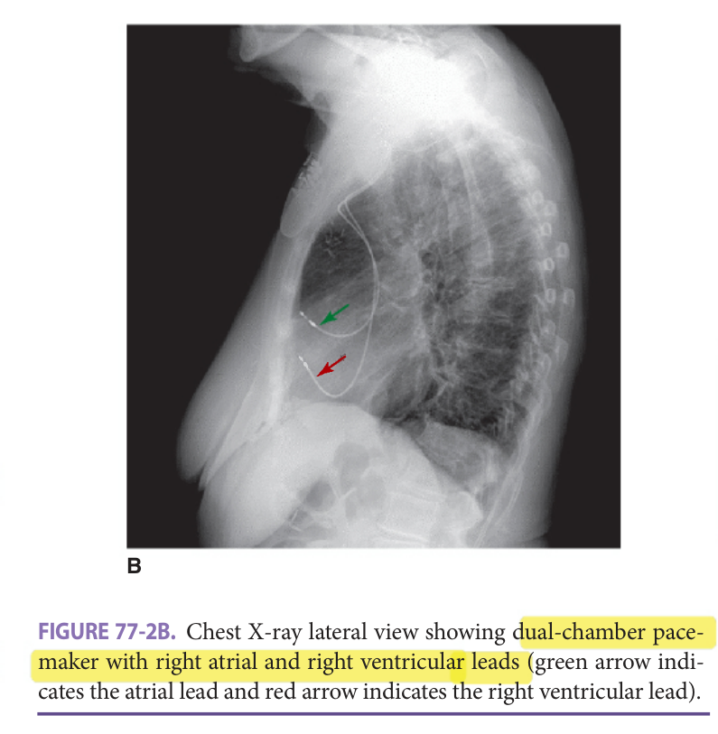

> *FIGURE 77-2B. Chest X-ray lateral view showing dual-chamber pacemaker with right atrial and right ventricular leads (green arrow indicates the atrial lead and red arrow indicates the right ventricular lead).*

> Highlighting is the owner's annotation, not the book's.

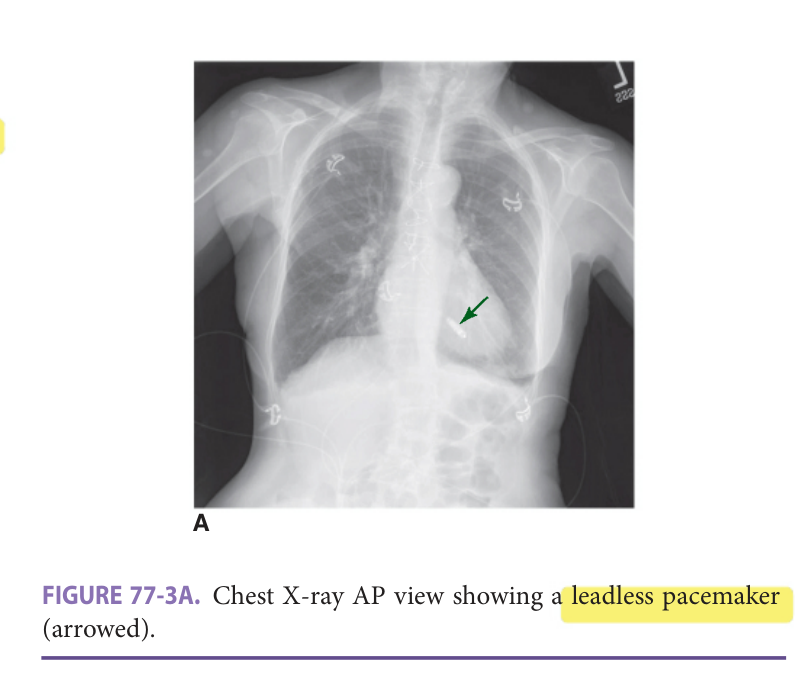

> *FIGURE 77-3A. Chest X-ray AP view showing a leadless pacemaker (arrowed).*

> Highlighting is the owner's annotation, not the book's.

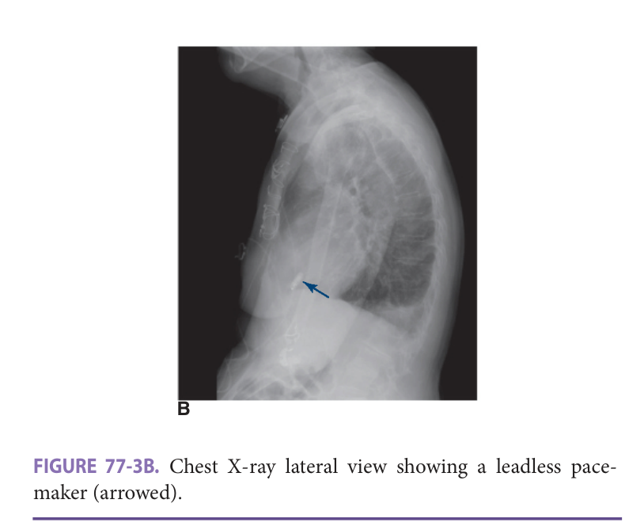

> *FIGURE 77-3B. Chest X-ray lateral view showing a leadless pacemaker (arrowed).*

> Highlighting is the owner's annotation, not the book's.

**[p. 1198]**
### Atrioventricular Conduction Block

Atrioventricular conduction block (AVB) is mostly degenerative in nature due to fibrosis in the conduction system including the AV node, His bundle, bundle branches, and Purkinjie to myocardium connection. There are three degrees of AVB (first degree, second degree with Mobitz type I or type 2, and third degree AVB). The ECG characteristics of AVB are shown in **Figure 77-4A-F** .

In patients with AVB, transient reversible causes should be corrected before PPM is considered. A synopsis on indications and selection of PPM for AVB from the 2018 ACC/AHA/HRS bradyarrhythmia guideline can be found in **Table 77-4** .

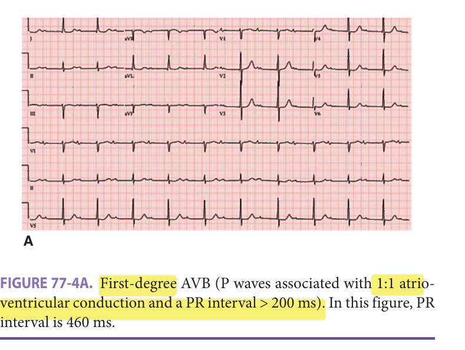

> *FIGURE 77-4A. First-degree AVB (P waves associated with 1:1 atrioventricular conduction and a PR interval > 200 ms). In this figure, PR interval is 460 ms.*

> Highlighting is the owner's annotation, not the book's.

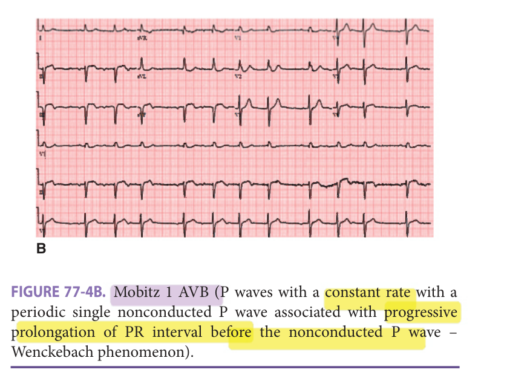

> *FIGURE 77-4B. Mobitz 1 AVB (P waves with a constant rate with a periodic single nonconducted P wave associated with progressive prolongation of PR interval before the nonconducted P wave – Wenckebach phenomenon).*

> Highlighting is the owner's annotation, not the book's.

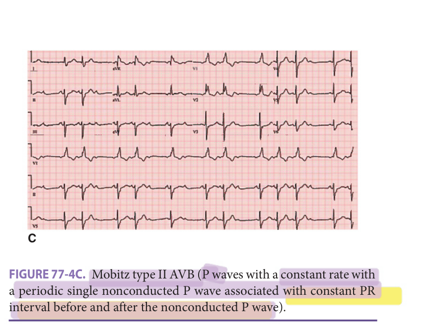

> *FIGURE 77-4C. Mobitz type II AVB (P waves with a constant rate with a periodic single nonconducted P wave associated with constant PR interval before and after the nonconducted P wave).*

> Highlighting is the owner's annotation, not the book's.

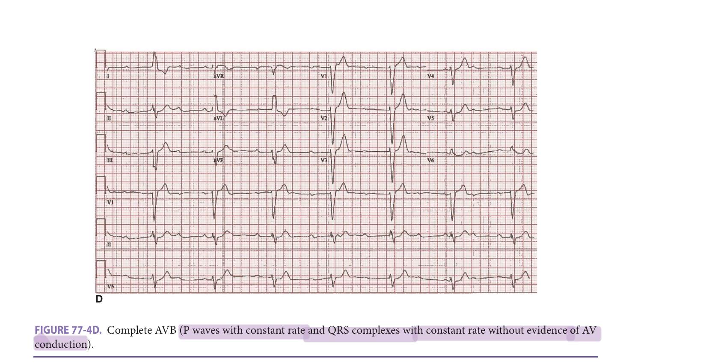

> *FIGURE 77-4D. Complete AVB (P waves with constant rate and QRS complexes with constant rate without evidence of AV conduction).*

> Highlighting is the owner's annotation, not the book's.

**[p. 1199]**

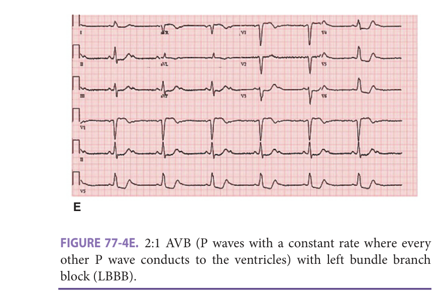

> *FIGURE 77-4E. 2:1 AVB (P waves with a constant rate where every other P wave conducts to the ventricles) with left bundle branch block (LBBB).*

> Highlighting is the owner's annotation, not the book's.

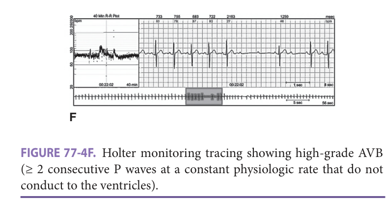

> *FIGURE 77-4F. Holter monitoring tracing showing high-grade AVB (≥ 2 consecutive P waves at a constant physiologic rate that do not conduct to the ventricles).*

> Highlighting is the owner's annotation, not the book's.

### Physiologic Pacing (Cardiac Resynchronization Therapy)

RV pacing has been associated with negative physiologic and clinical consequences from ventricular dyssynchrony such as left ventricular (LV) chamber enlargement, worsening functional mitral regurgitation (MR), reduced left ventricular ejection fraction (LVEF), and increased inter and intraventricular dyssynchrony. The risk of RV pacing induced cardiomyopathy increases with increased RV pacing. The Mode Selection Trial showed that RV pacing greater than or equal to 40% of the time led to a 2.6-fold increase in HF hospitalizations. ACC/AHA/HRS guidelines on bradycardia (2018) suggest that it is reasonable to choose pacing methods that maintain physiologic ventricular activation such as cardiac resynchronization therapy (CRT) for patients with AVB who have LVEF less than 50% and are expected to require ventricular pacing more than 40% of the time. If ventricular pacing is expected to be less than 40%, it is reasonable to choose the conventional RV pacing.

In addition to the CRT in patients with AVB, CRT is indicated in patients with heart failure with New York Heart Association (NYHA) functional class II, III, and ambulatory class IV with left bundle brunch block (LBBB). Indications for CRT in patients with heart

**Table 77-4 — Indications and selection of pacemaker (ppm) therapy in atrioventricular block (avb)**

- PPM for symptomatic acquired second-degree Mobitz type II AVB, high-grade AVB, or third-degree AVB not attributable to reversible or physiologic causes - PPM for symptomatic acquired second-degree Mobitz type II AVB, high-grade AVB, or third-degree AVB as consequence of medication required for patient’s other medical conditions - Single-chamber ventricular PPM for patients with expected infrequent ventricular pacing failure are summarized in **Table 77-5** . In patients meeting indication for … *(table text runs longer in the printed book; not fully reproduced in this fast build)*

o the older population are required for future guidelines. Chest X-rays of CRT PPM are shown in **Figure 77-5A, B** .

**Table 77-5 — Indications for cardiac resynchronization therapy (crt)**

Patients with highest likelihood to respond to CRT are those with: - LVEF ≤ 35%, sinus rhythm, LBBB, QRS ≥ 150 msec, NYHA II, III, and ambulatory IV - Patients with moderate likelihood to respond to CRT are those with: - LVEF ≤ 35%, sinus rhythm, LBBB, QRS 120–149 msec, NYHA II-ambulatory IV - LVEF ≤ 35%, sinus rhythm, non-LBBB, QRS ≥ 150 msec, NYHA III-ambulatory IV - LVEF ≤ 35%, AF with indications for CRT or requirement for ventricular pacing - LVEF ≤ 35%, AF after AV nodal ablation with … *(table text runs longer in the printed book; not fully reproduced in this fast build)*

YHA I-II, non-LBBB, QRS < 150 msec

- Comorbidities and frailty that limit survival with good functional capacity to < 1 y

**[p. 1200]**

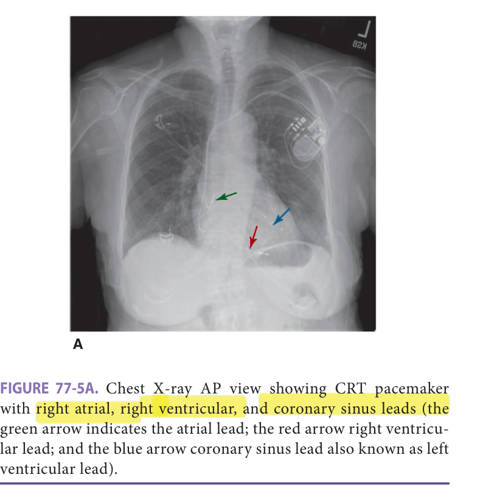

> *FIGURE 77-5A. Chest X-ray AP view showing CRT pacemaker with right atrial, right ventricular, and coronary sinus leads (the green arrow indicates the atrial lead; the red arrow right ventricular lead; and the blue arrow coronary sinus lead also known as left ventricular lead).*

> Highlighting is the owner's annotation, not the book's.

### Indications for PPM After Transcatheter Aortic Valve Replacement

Transcatheter aortic valve replacement (TAVR) is being increasingly performed in the older population (see Valvular Heart Disease, Chapter 75). Acquired AVB following TAVR commonly occurs. Predictors of PPM implantation are preexisting RBBB, increased left ventricular enddiastolic diameter, increased valve prosthesis to left ventricular outflow tract ratio, and new LBBB. Incidence of new LBBB is 19% to 55% and high-degree AVB is 10% after TAVR; however, half of these may resolve before discharge. PPM is indicated before discharge for patients with new and symptomatic AVB associated with hemodynamic instability. Indications for pacing in patients with persistent LBBB without symptoms are evolving. Studies have shown in up to 30% of patients with new LBBB, the first episode of high-degree AVB occurs after discharge with potential risk for syncope. Careful surveillance for bradycardia after discharge is recommended for those who develop prolonged PR interval or new BBB after TAVR.

### PPM Management Near End of Life

Conversations related to end-of-life PPM management should be discussed at the time of implantation or at early stage of terminal illness. Patients should be encouraged to complete advanced directive early on to address device management and deactivation when patient becomes terminally ill. Like any other decision to withdraw treatments, the decision to deactivate PPM can be made by patient or the legal surrogate through shared decision-making process together with the physician. The role of physician is to inform patient, surrogate, and family member of the

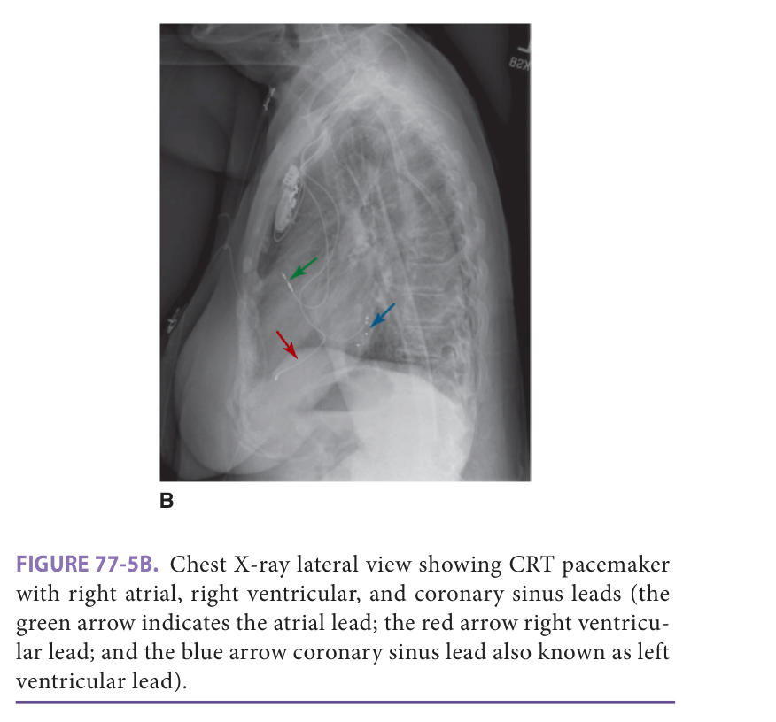

> *FIGURE 77-5B. Chest X-ray lateral view showing CRT pacemaker with right atrial, right ventricular, and coronary sinus leads (the green arrow indicates the atrial lead; the red arrow right ventricular lead; and the blue arrow coronary sinus lead also known as left ventricular lead).*

> Highlighting is the owner's annotation, not the book's.

consequences of deactivating the PPM. Death may immediately follow PPM deactivation in those who are dependent. Those who are not must be monitored for potential symptoms such as respiratory distress rendering intensification of comfort measures. After shared decisionmaking, written request to deactivate the PPM is required by the physician along with a do-not-resuscitate (DNR) order. Medical, ethical, and legal guiding principles on deactivation of PPM can be found in the Heart Rhythm Society 2010 Consensus Statement on this topic.

## Tachyarrhythmia

### Atrial Fibrillation

Atrial fibrillation (AF) is the most common arrhythmia in the older population as its prevalence and incidence increase with age. Common symptoms of AF include palpitations, fatigue, lightheadedness, shortness of breath, chest discomfort or intolerance to activities, and severe symptoms including HF and syncope. Diagnostic studies involve ECG and echocardiogram to evaluate chamber size, valvular function, and filling pressures; laboratory tests such as complete blood count, comprehensive metabolic panel, thyroid function, and in select cases, cardiac biomarkers. If clinically warranted, ischemic evaluation or sleep study should be considered. Management of AF includes rate or rhythm control, stroke prevention, and modification of risk factors such as weight loss, blood pressure and diabetes control, reduction of alcohol consumption, diagnosis and treatment of obstructive sleep apnea (OSA), and regular - exercise. The principles of AF management are the same between the younger and older population. However, the

**[p. 1201]**

older population has higher prevalence of comorbidities in addition to higher stroke and bleeding risk, which makes them less tolerant to medications; they also have a lower success rate for interventional procedures and higher incidence of adverse events or complications.

### Rate Versus Rhythm Control

In the older population, neither rate nor rhythm control strategies by pharmacologic therapy was proven to be superior based on several studies including the AFFIRM (Atrial Fibrillation Follow-up Investigation of Rhythm Management) trial. Rate control appears safer with same efficacy to rhythm control in older patients especially if they are asymptomatic or only mildly symptomatic. Long-term rhythm control relies on antiarrhythmic drugs (AAD) or catheter ablation (CA). However, AAD are associated with increased incidence of adverse events in older patients due to variable pharmacokinetics, pharmacodynamics, drug interactions from polypharmacy, and impaired renal or hepatic function. In the AFFIRM study, subgroup analysis of population older than 70 years showed that AAD therapy was associated with higher all-cause mortality. Rate control is generally preferred in older patients with mild or no symptoms. Rhythm control is preferred in older patients with symptoms associated with AF.

### Rate Control

β-Blockers (BB) and non-dihydropyridine calcium channel blockers (CCB) slow down the AV nodal conduction and are first-line agents for rate control. The optimal heart rate goal is between 80 and 110 bpm in the absence of significant symptoms such as palpitations, shortness of breath, lightheadedness, chest discomfort, or signs of HF. Although less effective, digoxin can also be considered for rate control, but caution must be taken due to narrowed therapeutic index, especially in the setting of unstable renal function. Rapid up-titration or use of higher doses of BB and CCB can be associated with adverse events related to hypotension, attenuation of baroreceptor reflex, impaired conduction, or autonomic function. CCB are related to higher mortality in patients with LVEF less than 40%. In patients with severe symptoms and in whom drug therapy fails for rate control, ablation of the AVN followed by implantation of PPM are effective for controlling ventricular rate. Although ablation of the AVN does not eliminate AF or the need for anticoagulation, it relieves symptoms and improves QOL, exercise tolerance, and LVEF in patients with tachycardia-induced cardiomyopathy. Biventricular pacing after AVN ablation is associated with improved 6-minute walk distance compared with conventional RV apex pacing in patients with preexisting HF symptoms.

### Rhythm Control

Rate control alone may be insufficient to alleviate symptoms in some older patients. In those select patients, restoration of sinus rhythm can be beneficial. Approaches to

rhythm control includes AAD therapy, catheter ablation (CA), surgical ablation, and direct current electrical car......-. dioversion (DCCV). In the acute setting, the efficacy of - intravenous and oral AAD is highly variable, ranging from 30% to 75%. Efficacy also varies with the age of the patient, duration of the arrhythmia, underlying LVEF, and left atrial size. External DCCV can restore sinus rhythm in 75% to 90% of patients with AF. For maintenance of sinus rhythm in patients with recurrent AF, consideration for AAD can be given. AAD therapy for rhythm control is summarized in **Table 77-6** .

### Role Of Ablation

It has been shown in multiple randomized controlled trials that catheter ablation of AF is safe and superior to AAD in preventing recurrence of AF and maintaining sinus rhythm. The recent CABANA (Catheter Ablation versus Antiarrhythmic Drug Therapy in Atrial Fibrillation) trial ( _n_ = 2204 patients randomized to either catheter ablation or drug therapy) showed that catheter ablation was not superior to AADs for the primary endpoint of all cause of mortality, disabling stroke, serious bleeding, or cardiac arrest in 5 years. As a predefined secondary endpoint, catheter ablation did not reduce all-cause mortality alone but did reduce the combined all-cause death or cardiovascular hospitalization in comparison to AAD. AF recurrence was significantly less in patients randomized to catheter ablation. A recent metanalysis reported that catheter ablation resulted in a significant reduction in all-cause mortality in AF patients with HF and reduced EF and resulted in significantly fewer cardiovascular hospitalizations and fewer AF recurrences. The subgroup analyses from CABANA suggested that younger patients (age < 65 years) and men derived more benefit from catheter ablation compared with AAD in patients with HF. Such benefit was not evident in patients older than 75 years. Therefore, age and comorbidities are important factors in the decision-making for catheter ablation. Guidelines derived from clinical evidence recommend catheter ablation treatment is primarily for reduction of symptoms and improvement of QoL. There are currently no compelling data to support the use

**Table 77-6 — Summary of antiarrhythmic drug (aad) therapy for rhythm control in atrial fibrillation (af)**

1. Patients without heart disease - a. Class Ic AAD (flecainide, propafenone) and class III AAD (sotalol, amiodarone, dronedarone, dofetilide) 2. Patients with CAD - a. Class Ic AAD are contraindicated (flecainide, propafenone) - b. Class III AAD can be used (sotalol, amiodarone, dronedarone, dofetilide) 3. Patients with reduced EF or HF - a. Amiodarone and dofetilide can be used - b. Dronedarone and class Ic AAD are contraindicated **[p. 1202]** > of catheter … *(table text runs longer in the printed book; not fully reproduced in this fast build)*

sistent or long-standing persistent AF and paroxysmal AF who have failed one or more attempts of catheter ablation.

### Stroke Prevention

The risk of stroke is five times higher in patients with AF. Anticoagulant therapy reduces stroke risk and mortality associated with AF. Although older patients are more vulnerable to stroke, less than two-thirds of octogenarians with AF are anticoagulated. One of the challenges is to maintain - INR within the therapeutic range. The need for anticoagulation is determined by the validated CHA2DS2-VASc score ( **Table 77-7A** ). Risk of bleeding on anticoagulation is commonly assessed by the HAS-BLED score with a 0–2 score reflecting low, and a 3–9 score high risk ( **Table 77-7B** ). Advanced age is a major risk factor for stroke and for bleeding. Although stroke and bleeding risk coexist, benefits of anticoagulation outweigh bleeding risk in most scenarios. Before initiation of anticoagulation, a thorough assessment of frailty, cognitive function, life expectancy, polypharmacy/drug interaction, nutritional assessment, liver function, and renal function is warranted to ensure individualized optimal approach.

The available anticoagulation drugs include vitamin K antagonist (warfarin) and direct oral anticoagulants (DOACs). DOACs include factor Xa inhibitors (apixaban, rivaroxaban, edoxaban) and direct thrombin inhibitor (dabigatran). The disadvantages of warfarin therapy include the need for monitoring INR, narrow therapeutic range, interaction with different food and medications especially in the setting of polypharmacy in older patients, - and there is increased tendency for unintentional overdose due to inter- or intraindividual variability in pharmacokinetics and pharmacodynamics. There have been four randomized <mark>controlled trials comparing DOACs with warfarin.</mark> Patients 75 years or older represent almost 40% of the population in these trials. There was consistent evidence of at least noninferiority for the combined endpoint of stroke or systemic embolism and superior safety profile with less intracranial bleeding risk compared to warfarin. DOACs are recommended as first-line therapy for stroke prevention in eligible patients with AF. For patients 75 years or older, there is <mark>lower risk</mark> of major bleeding especially with apixaban and edoxaban. However, full-dose dabigatran and rivaroxaban are significantly associated with an increased risk of gastrointestinal (GI) bleeding. A proton pump inhibitor is recommended when these two DOACs are used.

A bleeding risk assessment using the HAS-BLED score has been shown to be clinically useful. Older patients

**Table 77-7 — Scoring systems for stratification of stroke and bleeding risk in atrial fibrillation (af)**

|**A:** **CHA2DS2-VASC SCORE AND STROKE RISK**|| |---|---| |**CHA2DS2-VASC SCORE**|**POINTS**| |Congestive heart failure|1| |Hypertension|1| |Age ≥ 65|1| |Age ≥ 75|2| |Diabetes mellitus|1| |Stroke/TIA/thromboembolism|2| |Sex category—female|1| |Vascular disease (primary MI, PAD, or aortic plaque)|1| |Maximum score|9| |**CHA2DS2-VASC SCORE**|**ADJUSTED STROKE** **RISK (% PER YEAR)**| |0|0| |1|1.3| |2|2.2| |3|3.2| |4|4.0| |5|6.7| |6|9.8| |7|9.6| |8|6.7| |9|15.2| |**B:** **HAS-BLED SCORE AND … *(table text runs longer in the printed book; not fully reproduced in this fast build)*

AC, renal function should be evaluated before initiation and should be reevaluated at least annually or every 6 months or more frequently in those with renal insufficiency. To reduce the bleeding risk, modifiable risk factors must be addressed such as reduction of alcohol use, proper blood pressure control, and avoidance of NSAIDs and elimination of antiplatelet agents if possible. DOACs are contraindicated in advanced liver disease or liver failure with coagulopathy and should not be

**[p. 1203]**
used in patients with Child-Pugh class C cirrhosis (ChildPugh class B for rivaroxaban due to a more than a twofold increase in drug exposure). In patients with severe thrombocytopenia (< 50000/μL), the anticoagulation should be -- individualized and closely monitored given the lack of evidence from trials.

For those who have indication for anticoagulation but has contraindication for chronic anticoagulation but are able to tolerate short-term warfarin therapy, the percutaneously inserted left atrial appendage (LAA) occlusion device, the Watchman device, has been approved by FDA. Anticoagulation with warfarin to target INR between 2 and 3 is indicated for 45 days after the Watchman implantation and then discontinued if complete closure of LAA is confirmed by transesophageal echocardiogram (TEE). After warfarin, aspirin and clopidogrel are recommended for 6 months followed by long-term aspirin. For those with high bleeding risk, clopidogrel can be used for 6 months along with long-term aspirin therapy without oral anticoagulation. The surgical LAA amputation can also be considered for patients with AF undergoing cardiac surgeries.

The synopsis of recommendations for stroke prevention in AF is described in **Table 77-8** and summary of DOACs can be found in **Table 77-9** .

### Cryptogenic Stroke, Embolic Stroke Of Undetermined Source, And Atrial Fibrillation

The cause of embolic stroke may not be apparent in approximately 30% of patients many of whom are older with multiple comorbidities. Two randomized trials, NAVIGATE ESUS (Rivaroxaban Versus Aspirin in Secondary Prevention of Stroke and Prevention of Systemic Embolism in Patients with Recent Embolic Stroke of Undetermined Source) and RE-SPECT EUS (Dabigatran Etexilate for Secondary Stroke Prevention in Patients With Embolic Stroke of Undetermined Source), studied empiric anticoagulation with rivaroxaban and dabigatran, respectively, on the impact of recurrent stroke in ESUS patients comparing to aspirin. These studies found that empiric anticoagulation was not associated with lower rates of stroke recurrence than aspirin. Bleeding complications were higher with anticoagulation. Empirical anticoagulation in patients with cryptogenic stroke (CS) or embolic stroke of undetermined source (ESUS)

is currently not recommended. In patients with CS and ESUS, long-term surveillance for subclinical AF can be accomplished by implantation of a cardiac monitor (loop recorder). Anticoagulation can be considered after AF is detected by the loop recorder.

### Device Detected High-Rate Atrial Episodes

Older patients without a history of AF frequently have implanted cardiac devices such as a pacemaker or defibrillator with capabilities of continuous rhythm monitoring. Some patients have device detected intermittent

**Table 77-8 — Stroke prevention in patients with atrial fibrillation (af)**

- Shared decision-making (risk of stroke vs bleeding, values, and preferences) - CHA2DS2-VASc score stroke risk stratification for nonvalvular AF - Warfarin for *valvular AF regardless of CHA2D2-VASc score (target INR 2–3) - CHA2DS2-VASc ≥ 2 in men or ≥ 3 in women  anticoagulation - • DOACs over warfarin for *nonvalvular AF (monitor renal function) -- - - • Switch to DOAC if unable to maintain therapeutic INR with warfarin - Warfarin or apixaban (only for nonvalvular AF) when CrCl < 15 mL/min … *(table text runs longer in the printed book; not fully reproduced in this fast build)*

ban, or edoxaban in end-stage CKD or dialysis

- • DOACs should not be used in patients with mechanical valve

- **Definitions**

### Valvular AF

- Valvular AF refers to AF in the setting of moderate to severe mitral stenosis (MS) or presence of mechanical valve.

### Nonvalvular AF

- Nonvalvular AF is an AF in the setting of absence of moderate to severe MS or absence of mechanical valve.

atrial high-rate events (AHREs) with or without symptoms. Most devices detect AHREs when atrial rates exceed 180 to 190 bpm. An association between increased risk of stroke or systemic embolism and AHREs has been consistently observed. AHREs lasting a minimum of 5 to 6 minutes have been associated with an increased risk of ischemic stroke, cardiovascular events, and death. AHREs should prompt a careful review of the documented electrograms to confirm AF or to consider additional ambulatory monitoring if the data from the implanted device are equivocal. The data on the correlation between the risk of thromboembolic complications and AF burden (frequency, duration, and pattern) continue to evolve rapidly. At this time it is generally recommended that anticoagulation therapy should be considered when AF is confirmed in patients with AHRE greater than 6 minutes and CHA2DS2-VASc > 2 or > 24 hours with CHA2DS2VASc > 1 after goals and risks of long-term anticoagulation are reviewed with the patient.

**[p. 1204]**

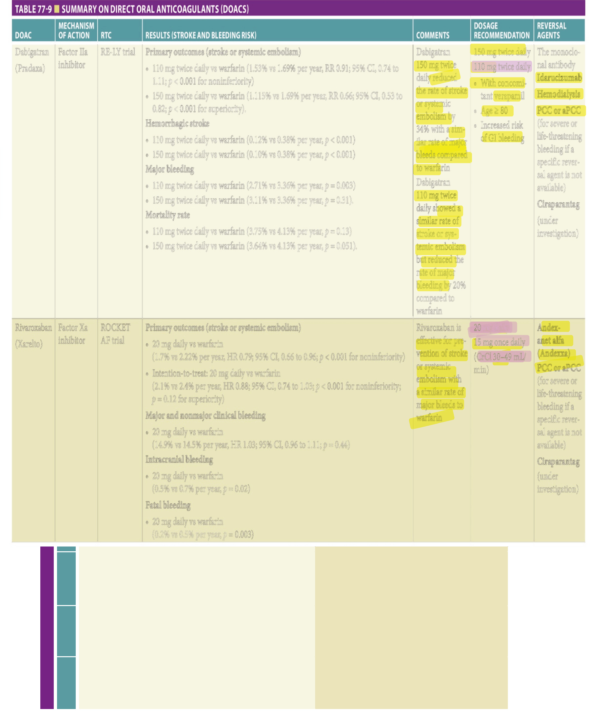

> *Table 77-9 reproduced as a page image (printed p. 1204) — the grid did not extract reliably as text for this fast build.*

> Highlighting is the owner's annotation, not the book's.

**[p. 1205]**

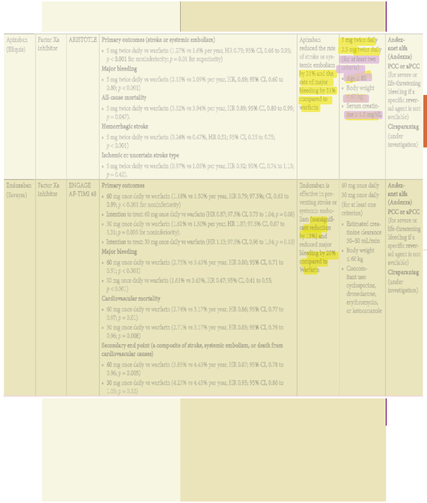

> *Table 77-9 reproduced as a page image (printed p. 1205) — the grid did not extract reliably as text for this fast build.*

> Highlighting is the owner's annotation, not the book's.

**[p. 1206]**
### Atrial Flutter

Typical atrial flutter (AFL) is a reentrant tachycardia utilizing the inferior vena cava-tricuspid isthmus as the critical conduction pathway. It commonly coexists with AF. Rate control and cardioversion can be effective (electrical cardioversion or with use of class III antiarrhythmic). Ablation of cava-tricuspid isthmus is effective associated with greater than 90% to 95% success rate and less than 1% to 2% complications. Management for stroke prevention in patients with AFL is similar to patients with AF.

### Supraventricular Tachyarrhythmia

Supraventricular tachyarrhythmia (SVT) is less common in older patients since most SVTs have been ablated when patients were young. AV nodal reentrant tachycardia (AVNRT) localized to the region of AV node is the most common type of SVT identified among older patients, followed by atrial tachycardia and atrioventricular reciprocating tachycardia (AVRT). The principles of drug and nondrug management of SVT are similar between younger and older patients as recommended in the ACC/AHA/HRS Guidelines 2015 (a synopsis is provided in **Table 77-10** ). β-Blockers and CCBs are considered the first line of therapy for treating SVTs. Class I and III antiarrhythmic agents are effective for treating SVTs. Catheter ablation therapy is highly effective for the treatment of SVTs, even in older patients. Success rates for catheter ablation of SVT, regard-less of age, range from 85% to better than 95%, depending primarily on the nature of the arrhythmia and the experience of the operator. The incidence of major complications associated with SVT ablation is less than 2% to 3%.

### Ventricular Tachyarrhythmia

The management of ventricular arrhythmias in older patients is similar to that in younger patients. In patients with asymptomatic nonsustained ventricular tachyarrhythmia (NSVT), a careful evaluation for the presence of cardiac disease, including occult CAD, structural heart disease, and left ventricular dysfunction, is required. Premature ventricular contractions and NSVT are associated with a benign prognosis in the absence of any significant heart disease. The risk of SCD is increased in patients with compromised LVEF, whether due to ischemic or nonischemic heart disease. Preventing SCD entails optimizing therapy directed at the underlying disease and the use of ICD therapy in selected patients. Although none of the indications for ICDs exclude or allude to special considerations in older patients, individual assessment and determination of primary therapeutic objectives are particularly pertinent in this population because comorbid medical illnesses are frequently present and life expectancy is shorter in older patients.

### Prevention Of Sudden Cardiac Death

Indications for implantation of an ICD for primary SCD prevention include: (1) ischemic cardiomyopathy (> 40 days after MI or > 90 days after revascularization), LVEF of less

**Table 77-10 — Treatment recommendations for supraventricular arrhythmia (svt)**

- Vagal maneuver for acute SVT (education for future episodes recommended) - Adenosine for acute SVT - Synchronized cardioversion for acute SVT with hemodynamic instability - Synchronized cardioversion for acute SVT refractory to adenosine - Oral β-blocker or diltiazem/verapamil for ongoing SVT - EPS with option of ablation for diagnosis and treatment of SVT - Ibutilide or procainamide IV for pre-excited SVT - IV β-blocker or diltiazem channel blocker for acute SVT - IV Amiodarone for stable … *(table text runs longer in the printed book; not fully reproduced in this fast build)*

indicated or not effective, and if ablation not preferred)

- Amiodarone for ongoing management of SVT (when other medications including dofetilide are not tolerated, contraindicated or not effective, and if ablation not preferred)

- Digoxin for ongoing management of SVT

- b-Blocker, diltiazem, verapamil, amiodarone, and digoxin are harmful for pre-excitation

- Treatment of SVT should be individualized in patients older than 75 years to incorporate age, comorbid illness, physical and cognitive functions, patient preferences, and severity of symptoms

than or equal to 35% with NYHA class II-III function class, or LVEF less than 30% with NYHA class I functional class on guideline-directed medical therapy (GDMT); (2) nonischemic cardiomyopathy, LVEF less than or equal to 35% with NYHA class II-III despite GDMT (benefit in patients with NYHA class I is not well established); (3) inducible sustained monomorphic ventricular tachyarrhythmia by electrophysiologic study (EPS) in patients with NSVT and EF less than or equal to 40% after MI. Indications for implantation of an ICD for secondary SCD prevention include: (1) cardiac arrest owing to VT or ventricular fibrillation (VF) not related to a transient or reversible cause (eg, <mark>acute myocardial infarction), (2) spontaneous sustained VT in association with structural heart disease, and (3) syncope of undetermined origin with clinically relevant,</mark> hemodynamically significant sustained VT or VF induced at EPS when drug therapy is ineffective, not tolerated, or not preferred. Randomized, prospective clinical trials

**[p. 1207]**

comparing AAD therapy to ICD have demonstrated the usefulness of ICD in reducing the risk of SCD and total mortality for both primary and secondary prevention in selected populations.

Advanced age alone should not be a sole limiting factor for ICD implantation. However, data on survival benefit are limited from ICD trials in octogenarians and nonagenarians—the very old patient population. Individualized and shared decision with very old patients is important based on patient’s preference, functional capacity, cognitive function, and underlying comorbidities.

### ICD Management Near End of Life

During the shared decision-making process for initial ICD implantation, risks and benefits of device implantation and possible consequences of ICD therapy and shocks should be thoroughly discussed with the patient, family members, or caretakers. Studies showed that patients frequently do not completely understand the risks, benefits, and downstream burdens of their ICDs. Especially at the end of life, these repetitive shocks may cause additional distress to

both patients and loved ones. Each patient or legal surro- gate should be informed that they have a right to deactivate the ICD when the end-of-life decision is appropriate.

## Summary

The genesis of arrhythmia is the result of complex interactions amongst aging-related physiologic changes, disease-dependent substrate, risk factors, and genetic predisposition. Guidelines on the treatment of cardiac arrhythmias continue to evolve and are being updated regularly. Although many well-designed clinical trials have provided strong evidence for our clinical practice, these evidence-based recommendations need to be interpreted with caution in older patients (especially octogenarians and nonagenarians) as these patients are frequently underrepresented in clinical trials. Perhaps more so than survival rates, clinical outcomes such as symptoms, quality of life, functional capacity, independent living, and hospitalization need to be critically addressed when treating arrhythmias in this fastest growing segment of our population.

## Further Reading

- Al-Khatib SM, Stevenson WG, Ackerman MJ, et al. 2017 AHA/ACC/HRS Guideline for Management of Patients With Ventricular Arrhythmias and the Prevention of Sudden Cardiac Death: A Report of the American College of Cardiology/American Heart Association Task Force on Clinical Practice Guidelines and the Heart Rhythm Society. _J Am Coll Cardiol_ . 2018;72:e91–e220.

- Asad ZUA, Yousif A, Khan MS, Al-Khatib SM, Stavrakis S. Catheter ablation versus medical therapy for atrial fibrillation: a systematic review and meta-analysis of randomized controlled trials. _Circ Arrhythm Electrophysiol_ . 2019;12:e007414.

- Calkins H, Hindricks G, Cappato R, et al. 2017 HRS/EHRA/ ECAS/APHRS/SOLAECE expert consensus statement on catheter and surgical ablation of atrial fibrillation. _Heart Rhythm_ . 2017;14:e275–e444.

- Connolly SJ, Ezekowitz MD, Yusuf S, et al. Dabigatran versus warfarin in patients with atrial fibrillation. _N Engl J Med_ . 2009;361:1139–1151.

- Friedman DJ, Piccini JP, Wang T, et al. Association between left atrial appendage occlusion and readmission for thromboembolism among patients with atrial fibrillation undergoing concomitant cardiac surgery. _JAMA_ . 2018;319:365–374.

- Giugliano RP, Ruff CT, Braunwald E, et al. Edoxaban versus warfarin in patients with atrial fibrillation. _N Engl J Med_ . 2013;369:2093–2104.

- Goyal P, Maurer MS. Syncope in older adults. _J Geriatr Cardiol_ . 2016;13:380–386.

- Goyal P, Rich MW. Electrophysiology and heart rhythm disorders in older adults. _J Geriatr Cardiol_ . 2016;13:645–651.

- Granger CB, Alexander JH, McMurray JJ, et al. Apixaban versus warfarin in patients with atrial fibrillation. _N Engl J Med_ . 2011;365:981–992.

- Hindricks G, Potpara T, Dagres N, et al. 2020 ESC Guidelines for the diagnosis and management of atrial fibrillation developed in collaboration with the European Association for Cardio-Thoracic Surgery (EACTS): the Task Force for the diagnosis and management of atrial fibrillation of the European Society of Cardiology (ESC) developed with the special contribution of the European Heart Rhythm Association (EHRA) of the ESC. _Eur Heart J_ . 2020;42:373–498.

- January CT, Wann LS, Calkins H, et al. 2019 AHA/ACC/ HRS Focused Update of the 2014 AHA/ACC/HRS Guideline for the Management of Patients With Atrial Fibrillation: A Report of the American College of Cardiology/American Heart Association Task Force on Clinical Practice Guidelines and the Heart Rhythm Society in Collaboration With the Society of Thoracic Surgeons. _Circulation_ . 2019;140:e125–e151.

- Kusumoto FM, Schoenfeld MH, Barrett C, et al. 2018 ACC/ AHA/HRS Guideline on the Evaluation and Management of Patients With Bradycardia and Cardiac Conduction Delay: A Report of the American College of Cardiology/American Heart Association Task Force on Clinical Practice Guidelines and the Heart Rhythm Society. _J Am Coll Cardiol_ . 2019;74:e51–e156.

**[p. 1208]**

With Supraventricular Tachycardia: Executive Summary: A Report of the American College of Cardiology/ American Heart Association Task Force on Clinical Practice Guidelines and the Heart Rhythm Society. _Circulation_ . 2016;133:e471–505. Patel MR, Mahaffey KW, Garg J, et al. Rivaroxaban versus warfarin in nonvalvular atrial fibrillation. _N Engl J Med_ . 2011;365:883–891.

- Ntaios G. Embolic stroke of undetermined source: JACC review topic of the week. _J Am Coll Cardiol_ . 2020; 75:333–340.

   - Packer DL, Mark DB, Robb RA, et al. Effect of catheter ablation vs antiarrhythmic drug therapy on mortality, stroke, bleeding, and cardiac arrest among patients with atrial fibrillation: the CABANA Randomized Clinical Trial. _JAMA_ . 2019;321:1261–1274.

   - Page RL, Joglar JA, Caldwell MA, et al. 2015 ACC/AHA/ HRS Guideline for the Management of Adult Patients With Supraventricular Tachycardia: Executive Summary: A Report of the American College of Cardiology/ American Heart Association Task Force on Clinical Practice Guidelines and the Heart Rhythm Society. _Circulation_ . 2016;133:e471–505.

- Schäfer A, Flierl U, Berliner D, Bauersachs J. Anticoagulants for stroke prevention in atrial fibrillation in elderly patients. _Cardiovasc Drugs Ther_ . 2020;34:555–568.

- Shen W-K, Sheldon RS, Benditt DG, et al. 2017 ACC/AHA/ HRS Guideline for the Evaluation and Management of Patients With Syncope. A Report of the American College of Cardiology/American Heart Association Task Force on Clinical Practice Guidelines and the Heart Rhythm Society. _J Am Coll Cardiol_ . 2017;70:e39–e110.

- Sutton R, de Jong JSY, Stewart JM, Fedorowski A, de Lange FJ. Pacing in vasovagal syncope: physiology, pacemaker sensors, and recent clinical trials—precise patient selection and measurable benefit. _Heart Rhythm_ . 2020;17:821–828.

- Undas A, Drabik L, Potpara T. Bleeding in anticoagulated patients with atrial fibrillation: practical considerations. _Pol Arc Intern Med_ . 2020;130:47–58.

