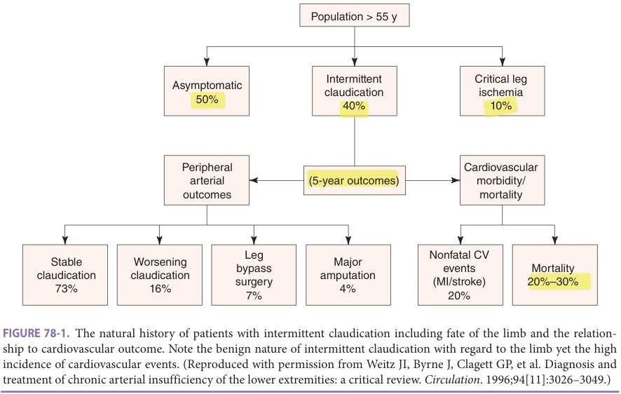
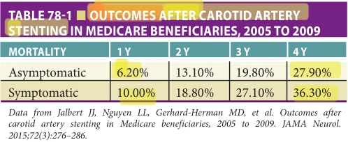
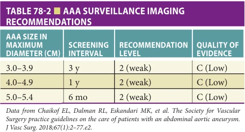

# Hazzard's Geriatric Medicine and Gerontology, 8e - Chapter 78: Peripheral Vascular Disease

Jonathan R. Thompson, Jason M. Johanning

> **Status.** Fast build from the book; not lane-reviewed.

> **Source and method.** Printed pages 1209-1218, from the marked 8th-edition copy (PDF page = printed page + 34). Prose follows its text layer; tables and figures are source-page crops. The book is canonical.

**[p. 1209]**

Peripheral vascular disease (PVD) is primarily a disease of aging and is strongly associated with impaired quality of life and increased cardiovascular mortality. The average age of patients seeking treatment is approximately 70 years. Various studies document a 15% to 20% prevalence rate over the age of 70 years. With the increasing age of the population, the diagnosis and treatment of PVD will become a priority. A working knowledge of the most common sites of disease, the initial diagnostic tests, options for treatment, and treatment outcomes in the geriatric population are necessary to provide optimal guidance for these patients. This chapter is organized by the most commonly encountered arterial and venous diseases of the geriatric patient. Although each subset of PVD has its unique presentation, the underlying atherosclerotic process is a systemic disease and should be treated similar to coronary atherosclerotic disease with regard to risk factor management (see Chapter 74 for additional information).

#### Learning Objectives

- Obtain a working knowledge of the most common sites of peripheral vascular disease (PVD), the initial diagnostic tests, and options for treatment as well as their outcomes.

- Understand the important role aging plays with regard to intervention in the PVD patient where the primary determination to intervene is based on risk-benefit ratio and the time to treatment equipoise.

- Describe the key indications with regard to intervention for the most common arterial disease presentations including claudication, critical limb ischemia, symptomatic and asymptomatic carotid artery stenosis, and abdominal aortic aneurysms (AAAs).

- Understand the role of minimally invasive endovascular intervention in comparison to open vascular surgery.

- Understand the key physiologic and nonphysiologic factors that affect surgical outcomes in vascular patients especially renal failure and functional status.

- Understand the presentation of chronic venous insufficiency including diagnosis and new treatment modalities.

#### Key Clinical Points

1. Peripheral arterial disease (PAD) is a common clinical condition in older adults with up to 20% of people older than 70 years having some form of PAD.

2. PAD can be diagnosed utilizing a simple and accurate test named the ankle-brachial index (ABI).

3. The decision to intervene in a patient with claudication is a lifestyle choice and should be pursued only after a trial of exercise therapy has been performed.

4. Intervention for patients with asymptomatic carotid artery stenosis utilizing carotid artery stenting (CAS) is not currently

## PERIPHERAL ARTERIAL DISEASE

Definition Lower extremity arterial disease is commonly referred to as peripheral arterial disease (PAD). As a whole this disease encompasses atherosclerotic narrowing of arteries from the infrarenal aorta to the level of the tibial arteries at the foot.

Epidemiology Risk factors for PAD are similar to those of coronary artery disease and include smoking history, advanced age, male gender, and positive family history. The prevalence of PAD increases with increasing age with up to 20% of people older than 75 years having some form of lower extremity arterial disease, although classic claudication symptoms are present in less than half of these individuals.

Presentation The presentation of PAD includes a range of symptoms. The most common presentation is that of claudication, or cramping of the lower extremity muscles after walking a fixed distance. The cramping or aching is primarily in the calves and buttocks and is relieved within 10 minutes of cessation of activity. The above classic presentation of claudication has unfortunately been shown to be present

**[p. 1210]**

indicated due to the significant risk of perioperative stroke.

5. Carotid endarterectomy is the generally accepted intervention for older patients with both asymptomatic and symptomatic carotid artery stenosis with CAS acceptable for patients with specific indications.

6. Intervention of patients with AAA is generally accepted when aneurysmal diameter exceeds 5 to 5.5 cm.

7. Outcomes for patients with acceptable anatomy for open or endovascular repair of infrarenal AAAs are similar based on current randomized trials, although shortterm mortality appears to benefit patients undergoing endovascular repair.

8. Long-term follow-up of patients undergoing endovascular repair of AAA using computed tomographic scanning is currently recommended based on changing morphology of the residual aneurysm.

9. Chronic venous disorders of the lower extremities are present in over 30% of the population and are generally treated first with graduated compression stockings.

10. Recent data support ablation of the saphenous vein as initial treatment in appropriate patients with venous stasis ulceration.

in less than half of patients with documented PAD and leg symptoms. Therefore, in the geriatric population, one must have a high index of suspicion for PAD as an underlying cause of ambulatory difficulties and leg symptoms. Additionally, in the older patient, coexisting conditions are common. The two most common conditions are osteoarthritis of the hip or knee and neurogenic claudication secondary to spinal stenosis. Osteoarthritis generally localizes to the joint, improves with pain medications, and has a varying course of improvement and worsening throughout the day. Neurogenic claudication is the most difficult to differentiate from vasculogenic disease because spinal stenosis is common in the older population. Neurogenic claudication most commonly presents with pain in the calves and posterior thigh and buttocks. In contrast to vasculogenic disease, neurogenic claudication has variable distance to onset, often takes 15 minutes to over hours to resolve, and claudication distance can be significantly increased with use of an assistive device such as a walker on which the patient can lean over and relieve the pressure on the spinal nerves.

A focused history of pain with ambulation is usually sufficient to confirm or provide high suspicion for the diagnosis of claudication in the majority of patients and provide a differential as to arterial, spinal, or muscular/joint etiology. The patient with true vasculogenic claudication will complain of pain with ambulation that starts after a known, relatively fixed, distance (two to three blocks are common as this interferes with activities of daily living). Upon cessation of ambulation and rest, the pain will subside and upon resuming ambulation will reoccur at a similar distance. This cycle in vasculogenic claudication can be repeated indefinitely. Often all three conditions (arterial, spinal, or muscular/joint) can coexist in the older patient and the diagnosis which is the primary limiting condition is of utmost concern to achieve an optimal outcome and maintain ambulatory independence.

Although claudication secondary to arterial disease can cause the patient significant distress, the rate of disease progression to rest pain (severe ischemic pain due to insufficient arterial inflow), critical limb ischemia (gangrene, ulceration, or tissue loss), and subsequent amputation is low—on the order of 10% over 10 years or 2.5% annually. Thus, patients presenting to providers worried about amputation should be reassured that amputation is unlikely with appropriate noninterventional or nonoperative management strategies (Figure 78-1).

Evaluation A thorough lower extremity examination includes inspection of the legs to assess for lesions consistent with arterial ischemia. Arterial lesions are primarily located on the distal toes or distal foot and tend to be painful. Earlier presentation includes loss of hair on the toes and distal ankles. Palpation of pulses in the femoral, popliteal, and dorsalis pedis and posterior tibial distribution allows a gross determination of location of disease. Neuromotor functioning of the foot should be documented in the case of suspected acute or severe ischemia, as viability of the foot is determined not by pulse examination but retention of muscular and neurologic function.

The diagnosis of vascular disease relies heavily on the vascular laboratory. The initial and most important test is the ankle-brachial index (ABI). The ABI is a simple bedside examination that can be performed with a blood pressure cuff and handheld Doppler. It is defined as highest systolic blood pressure measured at each ankle divided by the highest systolic blood pressure measured in the arm (brachial artery).

The majority of the vascular system, including retroperitoneal vascular structures, can be imaged with high resolution using noninvasive techniques. Multiple radiologic studies can be used to assess the lower extremity arteries including duplex ultrasonography (DUS), computerized tomographic angiography (CTA) or magnetic resonance imaging (MRA), and conventional digital subtraction angiography (DSA). Each has utility in specific situations and should not be used interchangeably. However, DSA is

**[p. 1211]**

*FIGURE 78-1. The natural history of patients with intermittent claudication including fate of the limb and the relation- ship to cardiovascular outcome. Note the benign nature of intermittent claudication with regard to the limb yet the high incidence of cardiovascular events. (Reproduced with permission from Weitz JI, Byrne J, Clagett GP, et al. Diagnosis and treatment of chronic arterial insufficiency of the lower extremities: a critical review. Circulation. 1996;94[11]:3026–3049.)*

typically reserved for situations when an intervention is planned. Invasive procedures are not commonly used as the initial diagnostic study due to the improvements in resolution and lack of morbidity for noninvasive evaluations. The study of choice following an abnormal ABI varies based on historical use of specific modalities and is best ordered by the specialist treating the patient to avoid unnecessary tests and cost to the patient.

## Management

Lifestyle modification The most important initial management strategies for patients with PAD are smoking cessation and continued ambulation. It has been shown that among patients who are smokers who subsequently stop smoking, the risk of amputation becomes exceedingly low with stabilization of PAD progression and often improvement of walking distance. Also, patients should be encouraged to ambulate even if they experience pain. There is no known negative impact of ambulation on the musculature. In fact, ambulation is the first-line treatment for patients presenting with symptomatic PAD. Supervised exercise therapy has been systematically shown to have a positive and sustainable improvement in ambulatory distances.

Exercise therapy Marked improvements in walking distances have been demonstrated in virtually all studies examining exercise therapy with supervised exercise therapy providing consistently increasing walking distances compared to baseline. Exercise therapy is classically performed by having patients walk beyond the onset of pain for as long as they can safely tolerate and repeating a series of walking trials with each session lasting 30 minutes occurring three

times a week. Patients should be reassured that walking to and through the onset of pain will not have any adverse effect on their legs or muscles but, to the contrary, this will promote and increase walking distance by promoting collateral vessel formation. On average, walking distance can be increased on the order of 50% to 200% with a formal exercise program, and in many patients this increase in distance will allow them to accomplish the tasks of daily living that prompted their presentation at the outset. Medicare and many insurance carriers will pay for up to 12 weeks of supervised exercise therapy, although these programs generally only exist in large cities in conjunction with a robust cardiac rehab center. For those who don’t have access to these formal programs, patient instructions and even smart phone applications exist to help patients with an exercise program.

Pharmacologic Medical management should consist of an antiplatelet agent in conjunction with a high-potency statin agent. Antiplatelet agents may be prescribed; however, these agents have known and not insignificant side effects and contraindications. These agents have been variably shown to improve ambulation in patients with claudication; however, the maximal gain in walking distance is marginal compared to exercise therapy. Cilostazol, a phosphodiesterase II inhibitor, inhibits smooth muscle cell contraction and platelet aggregation. It is FDA approved for the treatment of intermittent claudication. Caution should be used when administering to a patient with heart failure. Cilostazol has the most data supporting its use for intermittent arterial claudication with walking distances improved by up to 50%.

**[p. 1212]**

Interventional PAD treatment using a percutaneous endovascular approach has become the preferred initial treatment for those patients with both lifestyle-limiting claudication and rest pain or tissue loss. The approach is usually from the femoral arteries for both iliac and femoral/tibial lesions, although new technologies have allowed radial artery and pedal access to minimize complications. Short focal stenoses respond very well to angioplasty and stenting whereas long segment stenosis and occlusions are more challenging to treat and have a reduced patency rate, approaching 50% at 6 months, depending on the modality of treatment. Although generally believed to be less durable than open surgical approaches, the endovascular approach offers fewer major complications compared to open surgery especially in the frail patient and can be repeated two to three times after the initial revascularization procedure while still maintaining the ability to perform open surgical bypass in the future. This minimally invasive approach has resulted in a significant decrease in the number of open surgical procedures in older patients and has also been associated with a concomitant reduction in number of amputations nationwide. As a geriatrician one must focus on the goals of care in the patient with rest pain or tissue loss where pain relief, infection treatment, and sustaining or improving ambulatory function are often the primary end points.

Open surgical bypass of occluded or stenotic segments still remains the gold standard against which percutaneous interventions are gauged. Bypass surgeries using prosthetic or autogenous (vein) conduits are the most commonly performed procedures to provide pulsatile flow to the distal leg in the setting of ulcerated lesions or gangrene. The downside to open surgical revascularization is the definite risk of mortality and morbidity that accompanies these procedures. Contemporary quality databases have demonstrated that patients with advanced age greater than 80, renal failure, chronic obstructive pulmonary disease (COPD) requiring oxygen, and congestive heart failure are additive risk factors. Thus in high-risk patients, amputation may be the preferable option for treatment of pain and infection.

Complications associated with percutaneous intervention include vessel thrombosis, embolization, dissection, and rupture. The majority of these are tolerated due to the severity of the disease being addressed. Acute complications necessitating amputation can occur and the patient should be made aware of the potential for limb loss. Outcomes for percutaneous intervention are improving with patency rates of intervened segments approaching 80% at 2 years for iliac artery stents and 70% at 2 years for superficial femoral artery stents. Aortoiliac revascularization utilizing aortobifemoral bypass has a 90% 5-year patency while femoral popliteal and femoral tibial bypasses have 70% to 80% and 60% to 70% 5-year patency rates, respectively. More importantly, limb salvage is greater than 90% in the majority of patients at 2 years and this is confirmed by large-scale data documenting a reduction in amputation rates in population-based studies.

Knowledge of diagnosis and management of PAD is important for the geriatrician based on a high prevalence of the disease within the older population. A trend toward noninvasive diagnosis and minimally invasive approaches is noted. However, a treatment plan based on knowledge of current treatment paradigms with attention to provider and patient-specific factors should be taken into consideration to achieve optimal treatment outcome.

## CAROTID ARTERY STENOSIS

Definition Proper diagnosis, management, and treatment of carotid stenosis are critically important for reducing risk of ischemic stroke in older patients. Carotid stenosis is defined as atherosclerotic narrowing of the extracranial cervical arterial circulation primarily located at the bifurcation and extending into the proximal internal carotid artery. The stenosis and subsequent plaque rupture, embolism of plaque fragments, or platelet thrombi lead directly to the development of ischemic stroke primarily in the frontal and middle cerebral circulation.

Epidemiology Stroke and its resultant disability are the third leading cause of death in the United States. In general, 80% of strokes are ischemic and 20% hemorrhagic. Among the ischemic strokes, 20% to 30% are attributed to atheroembolic disease due to carotid artery stenosis. The prevalence of asymptomatic carotid artery stenosis of moderate degree is 7.5% and severe stenosis is 3.1% in patients 80 years and older.

Presentation A complete history is required to definitively classify patients as either symptomatic or asymptomatic as the treatment and aggressiveness of intervention for these two categories are markedly different. Neurologic symptoms including unilateral weakness, parasthesias, receptive or expressive aphasia, dysarthria, amaurosis fugax (transient unilateral loss of vision), as well as prior history of a documented transient ischemic attack (TIA) or stroke are significant findings to elicit. A clear understanding of the event’s time course is key in determining symptomatic status. By definition, patients who experience any of the above symptoms in conjunction with an obstruction of 50% or greater of the corresponding carotid artery are considered symptomatic. Patients with confirmed amaurosis fugax, TIA, or stroke in the past 3 months are at greater risk for stroke. It is also important to note that the following symptoms are not usually associated with carotid stenosis—generalized weakness, vomiting, nausea, vertigo, ataxia, and diplopia.

Evaluation Recommendations for screening of asymptomatic patients are in constant debate. Multiple societies and current guidelines recommend against the evaluation of the

**[p. 1213]**

*TABLE 78-1 ■ OUTCOMES AFTER CAROTID ARTERY STENTING IN MEDICARE BENEFICIARIES, 2005 TO 2009*

asymptomatic patient. In the case of the older patient, the “do no harm” imperative becomes even more pronounced, as older patients do not benefit from asymptomatic carotid intervention to the extent that younger patients may. The benefit of operative carotid treatment in the immediate postoperative period and in the long term in older and frail patients, particularly those with renal failure, is less pronounced. It is generally agreed upon that population screening examinations are not cost-effective for asymptomatic patients and only beneficial in highly selective patient populations such as patients undergoing coronary artery bypass grafting. Screening is not recommended for patients based solely on presence of an AAA, presence of a carotid bruit, or prior head and neck radiotherapy. In contrast, a patient with clear unilateral signs and symptoms of ischemia should undergo imaging of the cervical carotid circulation due to the change in risk-benefit equation that favors intervention based on symptomatic status and longterm survival. The need to ensure long-term survival in patients undergoing intervention should be emphasized with the recognition that the benefit of treatment accrues over time and patients on average should be expected to live 4 to 5 years after treatment (Table 78-1).

Complete physical examination is important to assess the potential subtle signs of neurologic ischemia. Focused physical examination includes auscultation of heart and detection of potential cardioembolic source from an arrhythmia, palpation of pulses, cranial nerve, and neurologic assessment to include examination of face for unilateral weakness or facial droop, and musculoskeletal examination for overall strength and symmetry. Ophthalmic consultation for detection of Hollenhorst plaques may be indicated especially in the setting of amaurosis fugax.

Multiple noninvasive imaging studies can assess the carotid arteries including DUS, CTA, or magnetic resonance angiography (MRA). Invasive conventional DSA is reserved for the rare situation when noninvasive imaging is equivocal or if the patient is in need of an intervention to treat the stenosis utilizing an endovascular approach. Each modality has utility in specific situations with each able to provide the degree of stenosis and characterization of the plaque’s morphology and location. Even though DSA is considered the “gold standard,” it is reserved only for questionable or contradictory findings on noninvasive imaging due to its inherent risk of stroke based on previous randomized trials.

DUS is an accurate, reliable, noninvasive imaging modality and is often the initial study to identify patients with disease. The degree of stenosis and plaque morphology of the carotids can be readily assessed but is operator dependent. CTA and MRA use contrast and can provide accurate imaging of the carotid arteries. Both tests are limited by allergic reactions with anaphylaxis or preexisting renal disease. However, both studies are very effective at imaging with high resolution both the cervical and intracranial carotid and vertebral circulation in addition to the brain itself. Both imaging modalities are more expensive than duplex imaging and both suffer from artifact such that an experienced interpretation is needed to accurately assess carotid plaque morphology and stenosis. DSA or catheter-based digital angiography provide excellent images which are easy to interpret regarding degree of stenosis, location, and plaque morphology. Again, it is reserved in patients with conflicting imaging prior to operation with limitations including risk of stroke, cost, and morbidity.

## Management

Pharmacologic Initial management of both symptomatic and asymptomatic patients includes maximizing medical therapy with appropriate antiplatelet agents to prevent platelet aggregation and embolization in conjunction with lipid-lowering agents to stabilize the at-risk plaque in the carotid distribution. For patients who smoke, the risk of stroke nearly doubles with continuance and cessation will markedly reduce stroke risk. For the asymptomatic patient, aggressive medical management is thought to be equivalent to invasive intervention and ongoing trials are underway to address this issue. New data emphasize the additional need for tight blood pressure control (SBP < 120 mm Hg) and optimized diabetic management in stroke prevention. For symptomatic patients, in addition to medical management, the next step is confirming the presence of significant stenosis that would benefit from invasive intervention.

Interventional Once a diagnosis of carotid stenosis is made, several factors are taken into account when considering optimal treatment. One must consider multiple factors before embarking on interventional treatment including whether the stenosis is symptomatic or asymptomatic, degree of stenosis, anatomic ease of intervention, anticipated mortality rate over the upcoming years by assessment of medical comorbidities, frailty, and patient preferences regarding stroke risk reduction in the asymptomatic setting. Generally medical management is advised for low-grade stenoses (< 50%) in both asymptomatic and symptomatic patients. Intervention is recommended in symptomatic patients with more than 70% stenosis and in asymptomatic stenosis with more than 80% stenosis in centers with a track record of excellent outcomes and in patients with an anticipated life expectancy exceeding 5 years. In symptomatic patients with 50% to 69% stenosis, risk-benefit analysis should be given careful consideration prior to intervention as studies

**[p. 1214]**

support intervention, but only in centers that have excellent perioperative outcomes.

Carotid artery stenting (CAS) via percutaneous approach is an acceptable approach to treating carotid stenosis in selected patients based on specific indications. CAS is less invasive allowing for intervention in poor surgical candidates, especially those with cardiac disease. CAS also allows for angiography, angioplasty, and stent placement all with one procedure. It is indicated in patients with prior neck radiation, prior surgical treatment of the carotid artery or neck lesions, contralateral vocal cord injury, significant coronary artery disease, or congestive heart failure. CAS can be anatomically challenging due to aortic arch anatomy, especially in older adults where calcific lesions and poor arch anatomy due to natural aortic remodeling are present. In addition, significant controversy exists on the benefit and outcomes in octogenarians and older patients as multiple studies have documented increased stroke rates in older patients such that trials to date have excluded this population from inclusion due to poor outcomes compared to younger patients. Carotid endarterectomy (CEA) is generally preferred in patients older than 80 years for this reason.

CEA is the gold standard operative procedure for treatment of high-grade carotid stenosis. It has been shown to reduce future stroke risk in multiple well-done randomized trials compared against medical management. For patients with asymptomatic stenosis, CEA is the currently indicated procedure except in select circumstances. A patient with a life expectancy of greater than 5 years should generally— except when there are neck anatomic concerns—be advised to undergo a CEA for asymptomatic disease with stenosis greater than 70% to 80%. Additionally, it is now becoming accepted that CAS in general carries a greater stroke risk compared to CEA. Newer techniques such as the Trans Carotid Artery Revascularization (TCAR) relies on a small neck incision for placement of a stent directly through the common carotid artery. The procedure uses a flow reversal system to limit embolization during the procedure which results in the lowest peri-operative stroke risk of any procedure. After intervention, patients are monitored overnight in the hospital and can be discharged the following day barring any complications or concerns. Antiplatelet agents are generally continued during the perioperative period to inhibit platelet adhesion and embolization as studies have shown decrease in stroke risk with an antiplatelet regimen.

Complications associated with CAS and CEA include stroke, hematoma, and death. CEA has the highest rate of cranial nerve injury compared to other revascularization techniques. However, complete recovery is typical and permanent injury with disability is rare. As noted above, risk of myocardial infarction is higher with CEA whereas perioperative stroke rates are higher in transfemoral CAS. Accepted 30-day stroke and death risk is less than 3% for asymptomatic patients and less than 6% for symptomatic patients. A major trial of open surgical versus endovascular treatment versus medical management is currently ongoing

with results eagerly awaited to clarify the best option for management of carotid occlusive disease.

## AORTIC ANEURYSM

Definition AAA is a degenerative disease of the aorta characterized by inflammation and arterial wall degradation that lead to dilatation and possibly rupture. AAA is defined by increase in vessel diameter by more than 50%, generally over 3 cm in men. The majority of AAA remains asymptomatic until which time rupture or less commonly rapid expansion occurs leading to severe and unrelenting abdominal pain radiating to the back or a pulsatile abdominal mass.

Epidemiology Aortic aneurysms occur 95% of the time in the infrarenal location and in 1% to 3% of people depending on the population screening criteria. Men commonly present starting at the age of 65 with women having a noted delay in presentation. This results in a male-to-female ratio of AAA in patients less than 80 years of 2 to 1, whereas in patients greater than 80 years, the incidence is equal. Racial differences are present too with Caucasians having a greater than threefold incidence of AAA compared to non-Caucasians.

Pathophysiology AAA is often thought to be caused by atherosclerosis, but no specific cause and effect has been demonstrated; rather a strong correlation exists. In contrast, some inciting event— generally thought to be smoking since greater than 95% of patients have a smoking history—is believed to trigger an inflammatory state where there is an unchecked proinflammatory process that is present within the media and adventitia of the aortic wall that results in degradation of the wall’s structure by matrix metalloproteinases (MMPs). The end result is loss of structural integrity of the aortic wall with dilation and weakening leading to rupture.

Presentation Multiple studies have now documented that detection of AAA in men older than 65 years reduces overall AAA mortality and is cost-effective. A thorough history is required in determining a patient’s risk for developing an AAA since the patient should ideally have their AAA detected when in the asymptomatic status as the risk of repair is markedly less than in patients with symptomatic unruptured and ruptured AAA. AAA risk factors include tobacco use (current or former), advanced age, coronary artery disease, atherosclerosis, high cholesterol, hypertension, first-degree relative affected, and male gender. Risk factors for expansion include advanced age, severe cardiac disease, prior stroke, and tobacco use. Independent risk factors for AAA rupture include female gender, large initial diameter, low forced expiratory volume in 1 second (FEV1), current smoking, and elevated mean blood pressure. Patients with family

**[p. 1215]**

history for inherited connective tissue disorders such as Marfan syndrome or Ehlers-Danlos are also at increased risk for developing AAA, albeit at younger age.

A complete physical examination is critical to assess overall patient function. Abdominal examination can be difficult especially with extreme obesity and may not reveal a pulsatile mass in the mid abdomen. AAAs over 5 cm can be detected on careful examination 76% of the time, whereas smaller AAAs between 3 and 3.9 cm are only detected 29% of the time thus reinforcing the need for screening examinations. In addition to abdominal examination, femoral and pedal pulses and cardiac and pulmonary examination should be performed at a minimum as these systems are commonly involved with atherosclerosis and end-organ dysfunction from long-term smoking.

Evaluation Current screening recommendations are to obtain an abdominal ultrasound (US) examination on men older than 65 years who have any smoking history or older than 55 years with family history. Women should be screened with US at age 65 if there is a family history or smoking history. Currently Medicare offers US screening as part of their Welcome to Medicare Physical Examination to men who have smoked at least 100 cigarettes over their lifetime or any patient with a family history.

The Society for Vascular Surgery recommends the following surveillance algorithm once an AAA is detected. Surveillance imaging at 3-year intervals for AAAs between 3.0 and 3.9 cm, 12-month imaging for aneurysms between 4.0 and 4.9 cm, and imaging every 6 months for those patient with aneurysms between 5.0 and 5.4 cm. The above recommendations are based on an average growth rate of 0.1 to 0.4 cm per year for all aneurysms with smaller aneurysms growing at a lesser rate. Any symptoms potentially related to the aneurysm should prompt a repeat study to exclude rapid expansion. Recent studies seem to indicate a linear growth of aneurysms less than 5.0 cm in diameter.

As noted above, the initial screening study and the preferred method of surveillance is ultrasound. This is a simple, noninvasive, and painless test with no risk to the patient. However, the US is unable to fully image the aneurysm for screening purposes in many obese patients. Alternative modalities include both computed tomography (CT) and magnetic resonance imaging (MRI), which do not require dye to assess the presence of an aneurysm or its size.

Current CT imaging in the form of CT angiography provides excellent detail of the aortic aneurysm in addition to other potential intra-abdominal processes. CT is also more reproducible than US with more consistent measurements between examinations with operator variation removed. Additionally, if performed as an initial scan, CT also allows examination of the entire aorta from aortic root to bifurcation and provides for 3D reconstruction of vessels which is key for planning both open and endovascular intervention. As CT has become more accessible, it is

more commonly used to follow patients after intervention but exposes the patient to contrast dye and radiation, hence the preference to use DUS whenever feasible. MRI can also be used to evaluate AAA; however, due to expense, time, and limited access, MRI should not be first-line imaging for AAA. Its use should be reserved for patients in whom a CT scan is otherwise contraindicated.

## Management

Pharmacologic Optimal medical management is directed at controlling comorbidities in patients with AAA. This includes smoking cessation, hypertension control, lipid control, diabetes management, diet and exercise, lifestyle modifications, and regular primary care provider follow-up. It should be noted that exercise and transient increases in blood pressure are not predictors or causes of rupture and therefore patients with an AAA diagnosis should continue to be active while being monitored. Aerobic activity including walking, jogging, biking, and swimming should be encouraged. Standard medical therapy for atherosclerotic occlusive disease should be provided including antiplatelet agents and statin therapy when indicated. Although it would seem β-blockade would reduce vessel stress and thus rupture, this has not been the case and antihypertensive regimens should follow accepted guidelines. A recent trial to determine the efficacy of doxycycline to slow the growth of small aneurysms failed to show any benefit, therefore leaving the patient with AAA with only surgical management options to reduce mortality risk from rupture.

Interventional The single goal of AAA management is to reduce the chance of AAA rupture. As this is purely a risk-benefit analysis, knowledge of rupture and subsequent death risk at given AAA sizes is necessary to make appropriate recommendations for intervention. The size of the AAA is the major determining factor for risk of rupture and thus the major indicator dictating the timing of an intervention. Less commonly, rapid rate of expansion—generally agreed to be greater than 0.50 cm in 6 months—is an indication for intervention. The risk of rupture correlates directly with size. AAA less than 4 cm having a 0% to 0.5% yearly rupture risk, 4.0 to 4.9 cm having a 0.5% to 1.5% yearly rupture risk, 5 to 5.9 cm having a 1% to 11% yearly rupture risk, 6 to 6.9 cm having a 11% to 22% yearly rupture risk, and AAA greater than 7 cm having a 30% yearly rupture risk. It is generally accepted that AAAs greater than 5.5 cm for men and 5 cm for women have a high enough yearly risk for rupture that elective surgical intervention is indicated in good-risk patients. This recommendation is based on current data supporting a mortality risk of AAA repair of approximately 1% to 2% for both endovascular and open aneurysm repair.

Repair of infrarenal AAA is commonly approached by either endovascular or open surgical repair. Now three decades old, the endovascular approach uses femoral artery access for a graft placement under fluoroscopic guidance. Benefits of endovascular repair include less postoperative pain, shorter hospital stay, and lower 30-day mortality.

**[p. 1216]**

*TABLE 78-2 ■ AAA SURVEILLANCE IMAGING RECOMMENDATIONS*

Additionally, these benefits allow expansion to candidates who would not tolerate an open procedure. In spite of these immediate perioperative benefits, numerous studies have documented similar quality of life, and similar long-term morbidity and mortality comparing the endovascular to open repair. The gain of 6 to 8 weeks of pain-free recovery and similar outcomes has led to the utilization of the endovascular approach as the first-line treatment in the geriatric population, with over 90% of patients now anatomically suitable for graft placement.

Open repair of an AAA requires either a transperitoneal or retroperitoneal approach, with midline laparotomy common. The open approach is generally used for patients who do not meet anatomic specifications for endovascular aneurysm repair, specifically those with a poor segment of aorta immediately distal to the renal arteries. Thus, the patients undergoing open repair in today’s era are generally at more risk than a standard AAA patient due to need for suprarenal clamping and concomitant risk of renal failure and complex anatomic characteristics that preclude endovascular repair. This generally includes renal artery involvement or complex pelvic anatomy that increases the risk of morbidity and mortality.

With proper diagnosis, surveillance, and medical management, patients can be monitored for years without needing surgical repair for their AAA, and with appropriate intervention, patients can have similar life expectancies compared to matched controls (Table 78-2).

## CHRONIC VENOUS INSUFFICIENCY

Definition Chronic venous insufficiency (CVI) is a condition of altered blood flow in the leg veins usually caused by functionally incompetent venous valves leading to increased pressure in the distal venous vasculature. Less likely in the older adult population is the presence of a proximal obstruction leading to venous hypertension. Regardless of the etiology, the increased venous pressure at the level of the lower leg results in the findings classic for CVI.

Epidemiology The prevalence of venous insufficiency varies considerably between genders, ethnic backgrounds, and age groups.

In a general population, the age-adjusted prevalence for the whole population was 9.4% in men and 6.6% in women with increasing prevalence of CVI correlated closely with age and sex, being 21.2% in men greater than 50 years and 12.0% in women greater than 50 years. An important fact remains that the prevalence of CVI increases with age specifically in studies evaluating chronic leg ulceration.

Pathophysiology Venous hypertension results from venous reflux due to valvular incompetence or obstruction due to thrombosis or narrowing of proximal veins. Superficial venous insufficiency is usually due to weakened valves or widened veins precluding normal valve coaptation. The most common location of the valvular incompetence is located at the saphenofemoral junction where the greater saphenous vein drains into the common femoral vein. Deep vein thrombosis (DVT) creates venous insufficiency by creating inflammation and adhesion of venous valves leading to resultant narrowing and valvular dysfunction.

Regardless of superficial or deep as the cause of venous hypertension, the constantly elevated hydrostatic pressure creates the findings of edema and venous microangiopathy. A common finding in older adults is lipodermatosclerosis and hemosiderin deposition at the malleolar level. Permanent skin hyperpigmentation occurs resulting from hemosiderin deposition as red blood cells extravasate and are deposited into the superficial tissues. Lipodermatosclerosis is the skin thickening and woody feeling which is due to fibrosis of subcutaneous fat. The ultimate outcome of this unopposed venous hypertension is the venous ulcer resulting from dysfunctional microcirculation and dermal weakness.

Presentation The condition is characterized by symptoms including fatigue, discomfort, and a sensation of heaviness which worsen during the day. Physical examination findings such as swelling worsen as the day progresses and prior to ambulation. Late sequelae of chronic venous insufficiency includes lipodermatosclerosis, hyperpigmentation, stasis dermatitis, and venous ulceration. The diagnosis of CVI, similar to arterial conditions, can be challenging in the older patient due to coexisting conditions. In addition to neurologic complaints such as spinal stenosis, one must also consider vascular-related conditions such as congestive heart failure and chronic edema and lymphatic changes associated with joint replacement. A history focusing on the time course of swelling to include significant improvement when awakening in the morning after lying flat throughout the night with classic physical examination findings of lack of foot involvement and gaiter distribution of skin changes and associated varicosities will invariably be present. The history should also take into account conditions that may lead to valvular dysfunction such as previous deep venous thrombosis or superficial thrombophlebitis in addition

**[p. 1217]**

to traumatic injuries to the superficial veins of the lower extremities. Particular attention should be paid to patients who are sedentary remaining in a sitting position for the majority of the day and night including those confined to a wheelchair or those who use a recliner to sleep at night for pulmonary and sleep apnea issues as this creates unrelieved pressure in the veins that will need to be addressed in conjunction with treatment of the venous insufficiency.

Evaluation The gold standard for initial evaluation of CVI is duplex ultrasonography. Utilizing ultrasound images of the affected vein can be obtained to look specifically for valvular dysfunction and size changes consistent with narrowing or dilation. Additionally, ultrasound can be used to assess venous reflux. Reflux time of greater than or equal to 0.5 seconds is considered significant within a superficial venous segment. CT venogram can be obtained if one has a suspicion for a proximal obstructing process such as May Thurner or more commonly in older adults extrinsic compression from a tumor. Rarely is invasive venography utilized for diagnostic purposes and is usually based on findings of noninvasive studies leading to a therapeutic intervention. Venous plethysmography is still utilized in specific circumstances by physicians specializing in venous disease.

## Management

Noninvasive The mainstay of treatment is relieving venous hypertension with elevation of the legs when not ambulating and the application of compression therapy.

## FURTHER READING

Aronow WS, Ahn C, Gutstein H. Prevalence and incidence

of cardiovascular disease in 1160 older men and 2464 older women in a long-term health care facility. J Gerontol A Biol Sci Med Sci. 2002;57(1):M45–M46. Chaikof EL, Dalman RL, Eskandari MK, et al. The Soci-

ety for Vascular Surgery practice guidelines on the care of patients with an abdominal aortic aneurysm. J Vasc Surg. 2018;67(1):2-77.e2. Criqui MH, Aboyans V. Epidemiology of peripheral artery

disease. Circ Res. 2015;116(9):1509–1526. Daly KJ, Torella F, Ashleigh R, McCollum CN. Screening,

diagnosis and advances in aortic aneurysm surgery. Gerontology. 2004;50(6):349–359. De Martino RR, Goodney PP, Nolan BW, et al. Opti-

mal selection of patients for elective abdominal aortic aneurysm repair based on life expectancy. J Vasc Surg. 2013;58(3):589–595. Egorova NN, Guillerme S, Gelijns A, et al. An analysis of the

outcomes of a decade of experience with lower extremity

The application of compression therapy has increased in recent times due to the ready availability of sufficient and inexpensive compression stockings not requiring a prescription or fitting. For patients with unusual lower leg anatomy, a formal fitting will likely provide a better compression result. In patients with ulcerations, compression is a must for ulcer healing and can take many forms including standard compressions stockings, ace wraps, and UNNA boots. With regards to ulcer healing, 90% of ulcers should heal given adequate compression compliance and normal arterial perfusion.

Invasive Recently treatment of superficial venous insufficiency has undergone a sea change in the ability to treat chronic insufficiency utilizing minimally invasive techniques. This ranges from in office sclerotherapy with or without ultrasound to the treatment of large vessel superficial incompetence of the saphenous system using advanced sclerosants, chemical sealing, and energy procedures aimed to obliterate the offending refluxing segment. Importantly, it has recently been shown that for patients with venous ulcerations and superficial reflux, early venous ablation of superficial incompetence resulted in faster healing of venous leg ulcers and more time free from ulcers than deferred endovenous ablation. Therefore in the older patient with a venous stasis ulcer, one should implement compression and confirm presence or absence of superficial venous reflux amenable to intervention since a truly cost-effective, minimally invasive office procedure is now available to speed ulcer healing and prevent ulcer recurrence.

revascularization including limb salvage, lengths of stay, and safety. J Vasc Surg. 2010;51(4):878–885, 885.e1. Ferguson GG, Eliasziw M, Barr HW, et al. The North

American Symptomatic Carotid Endarterectomy Trial: surgical results in 1415 patients. Stroke. 1999;30(9): 1751–1758. Hirsch AT, Criqui MH, Treat-Jacobson D, et al. Peripheral

arterial disease detection, awareness, and treatment in primary care. JAMA. 2001;286(11):1317–1324. Kwolek CJ, Jaff MR, Leal JI, et al. Results of the ROADSTER

multicenter trial of transcarotid stenting with dynamic flow reversal. J Vasc Surg. 2015;62(5):1227–1234. Lane R, Ellis B, Watson L, Leng GC. Exercise for intermit-

tent claudication. Cochrane Database Syst Rev. 2014;7: CD000990. Lederle FA, Freischlag JA, Kyriakides TC, et al. Outcomes

following endovascular vs open repair of abdominal aortic aneurysm: a randomized trial. JAMA. 2009;302(14):1535–1542.

**[p. 1218]**

LeFevre ML. U.S. Preventive Services Task Force. Screening

for asymptomatic carotid artery stenosis: U.S. Preventive Services Task Force Recommendation statement. Ann Intern Med. 2014;161(5):356–362. McDermott MM. Lower extremity manifestations of

peripheral artery disease: the pathophysiologic and functional implications of leg ischemia. Circ Res. 2015; 116(9):1540–1550. Melin AA, Schmid KK, Lynch TG, et al. Preoperative

frailty risk analysis index to stratify patients undergoing carotid endarterectomy. J Vasc Surg. 2015;61(3): 683–689. Muluk SC, Muluk VS, Kelley ME, et al. Outcome events in

patients with claudication: a 15-year study in 2777 patients. J Vasc Surg. 2001;33(2):251–257; discussion 257–258. Noorani A, Hippelainen M, Nashef SA. Time until treat-

ment equipoise: a new concept in surgical decision making. JAMA Surg. 2014;149(2):109–111.

Oresanya L, Zhao S, Gan S, et al. Functional outcomes

after lower extremity revascularization in nursing home residents: a national cohort study. JAMA Intern Med. 2015;175(6):951–957. Qureshi AI, Chaudhry SA, Qureshi MH, Suri MF. Rates

and predictors of 5-year survival in a national cohort of asymptomatic elderly patients undergoing carotid revascularization. Neurosurgery. 2015;76(1):34–40; discussion 40–41. Savji N, Rockman CB, Skolnick AH, et al. Association

between advanced age and vascular disease in different arterial territories: a population database of over 3.6 million subjects. J Am Coll Cardiol. 2013;61(16): 1736–1743. Voeks JH, Howard G, Roubin GS, et al. Age and outcomes

after carotid stenting and endarterectomy: the carotid revascularization endarterectomy versus stenting trial. Stroke. 2011;42(12):3484–3490.
