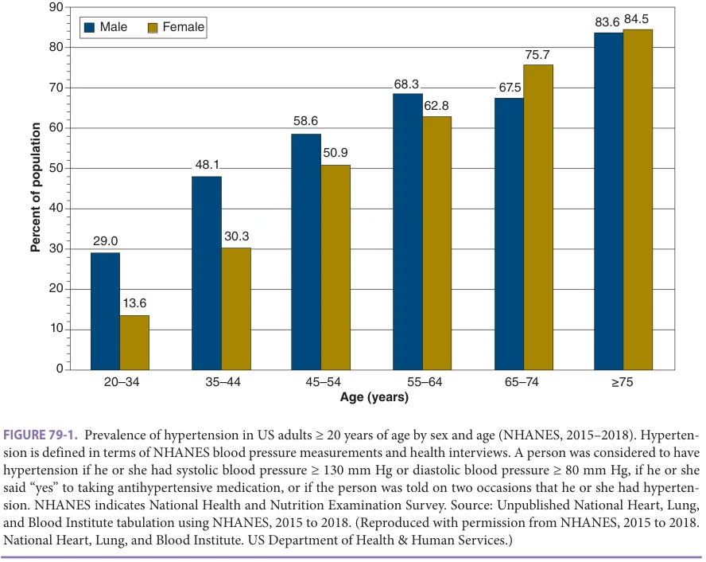
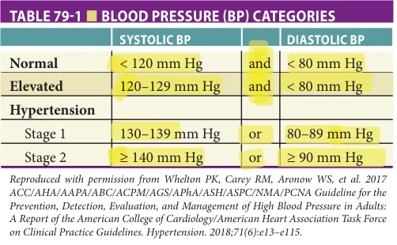
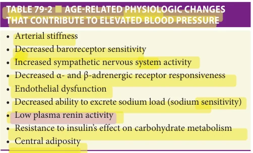
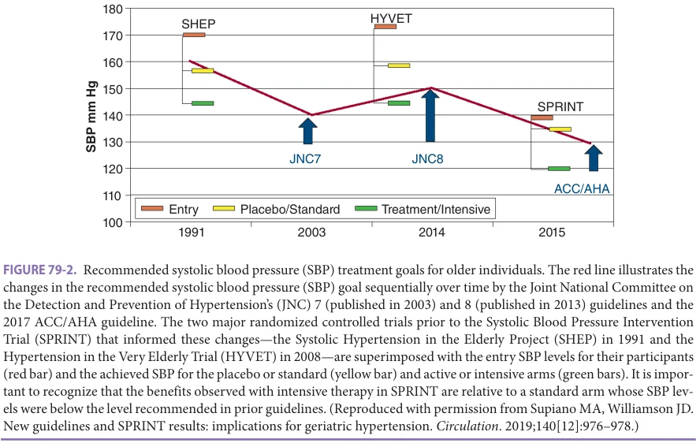
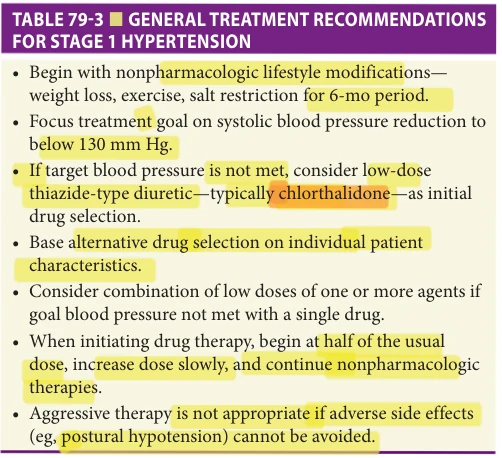
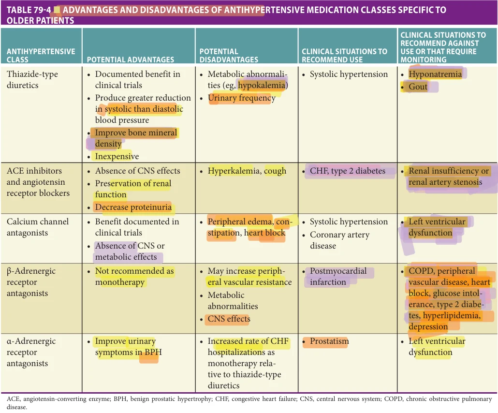

# Hazzard's Geriatric Medicine and Gerontology, 8e - Chapter 79: Hypertension

Mark A. Supiano

> **Status.** Fast build from the book; not lane-reviewed.

> **Source and method.** Printed pages 1219-1228, from the marked 8th-edition copy (PDF page = printed page + 34). Prose follows its text layer; tables and figures are source-page crops. The book is canonical.

**[p. 1219]**

## INTRODUCTION

High blood pressure has the greatest impact on global attributable mortality of any risk factor. Compared with all other specific risks quantified in the Global Burden of Disease, Injuries, and Risk Factor studies, systolic blood pressure (SBP) of at least 110 to 115 mm Hg was the leading global contributor to preventable death in 2015. Three demographic changes—(1) the prevalence of elevated SBP (≥ 110–115 and ≥ 140 mm Hg) has increased substantially in the past 25 years, (2) the age-associated increase in blood pressure, and (3) the worldwide demographic increase in the aging population—are conspiring to create an enormous, emerging public health impact. In addition to the well-ascribed hypertension risk for cardiovascular disease (CVD) and stroke, it is also a significant risk factor for chronic kidney disease, atrial fibrillation, congestive heart failure (CHF) with both reduced and preserved left ventricular ejection fraction, and cognitive impairment— each with a relative risk between 2.0 and 4.0. A reduction of 10 mm Hg systolic and 5 mm Hg diastolic at age 65 is associated with a reduction of up to 25% in myocardial infarction, 40% in stroke, 50% in CHF, and 10% to 20% overall decrease in mortality. Despite this knowledge, current rates of hypertension control are extremely low, especially among older women. In addition to illustrating the clinical importance of hypertension, these data are a compelling call to improve both our knowledge concerning the mechanisms that underlie the age-associated increase in blood pressure to aid in its prevention as well as to implement changes in the systems of care necessary to improve blood pressure control among those with hypertension.

#### Learning Objectives

- Understand what key age-related physiologic changes account for the progressive increase in the prevalence of hypertension with age.

- Explain the mechanisms for greater blood pressure variability with age, and understand why a hypertension diagnosis should never be based on a single elevated measurement.

- Determine the benefit-based systolic blood pressure (SBP) treatment goal based on age, comorbidities, and cardiovascular and cognitive impairment risk factors.

- Understand that arterial stiffness is an independent cardiovascular risk factor.

- Select the best thiazide-type diuretic and other medication classes to treat geriatric hypertension.

#### Key Clinical Points

1. The prevalence of hypertension increases steadily with age.

2. Older people develop systolic hypertension due to the age-related increase in arterial stiffness. SBP and pulse pressure, both closely associated with arterial stiffness, confer the greatest significance as cardiovascular and cognitive impairment risk factors.

3. Age-related changes in systems that regulate blood pressure result in greater blood pressure variability. Therefore, careful attention is needed to accurately measure and diagnose hypertension, as well as monitoring for adverse drug events—especially postural hypotension—throughout treatment.

4. The diagnosis of hypertension should be based on the average of a minimum of nine blood pressure readings that have been obtained on three separate office visits or derived from 24-hour ambulatory or home blood pressure monitoring results.

## EPIDEMIOLOGY

Although high blood pressure should not be construed to be a normal aspect of aging, there is clearly an age-associated increase in blood pressure and in the prevalence of hypertension. Data from the National Health and Nutrition epidemiologic survey from 2015 to 2018 documented that hypertension is a very prevalent condition among older Americans (Figure 79-1). Based on this study’s updated definition of hypertension (discussed herein)—a self-report

**[p. 1220]**

5. Older hypertensive individuals commonly have physiologic characteristics that respond effectively to lifestyle modifications.

6. The focus of therapy should be on lowering the SBP to the patient’s benefit-based target goal. Applying benefit-based therapy to the majority of adults age 65 or older who are at high cardiovascular disease or cognitive impairment risk favors a SBP goal of less than 130 mm Hg, and for some a goal of 120 mm Hg may be considered.

7. Thiazide-type diuretic drugs—notably chlorthalidone—are preferred as the initial drug class in most patients. Combination therapy with low doses of one or more agents should be considered if needed to achieve the target SBP level.

8. Current blood pressure control rates are inadequate. Systems approaches that incorporate geriatric approaches to team care combined with quality improvement strategies need to be adopted to improve treatment outcomes.

of BP result in excess of 130 mm Hg systolic and/or 80 mm Hg diastolic or those receiving an antihypertensive medication—the overall prevalence for hypertension among those aged 65 or older exceeds 65%. For women aged 75 and older, the prevalence is 85% and for men it is 84%. Of note, there is an age–gender interaction in hypertension prevalence across age. At younger ages, prevalence rates are higher among men, while above the age of menopause, the prevalence in women surpasses that of men.

Another perspective on epidemiology is to examine the lifetime risk of developing hypertension as has been done in participants in the Framingham Heart Study. This study identified that among men and women participants who had normal blood pressure readings at age 55, nearly 90% developed hypertension over the ensuing 20 to 25 years of follow-up.

## CLASSIFICATION

The definitions for normal blood pressure and categories of hypertension were updated in 2017 with the publication of the revised American Heart Association High Blood Pressure Clinical Guideline. Importantly, the prior 140 mm Hg SBP threshold level that defined hypertension was lowered to 130 mm Hg. Contemporary definitions and categories of blood pressure are provided in Table 79-1. Of note, the blood

*FIGURE 79-1. Prevalence of hypertension in US adults ≥ 20 years of age by sex and age (NHANES, 2015–2018). Hypertension is defined in terms of NHANES blood pressure measurements and health interviews. A person was considered to have hypertension if he or she had systolic blood pressure ≥ 130 mm Hg or diastolic blood pressure ≥ 80 mm Hg, if he or she said “yes” to taking antihypertensive medication, or if the person was told on two occasions that he or she had hypertension. NHANES indicates National Health and Nutrition Examination Survey. Source: Unpublished National Heart, Lung, and Blood Institute tabulation using NHANES, 2015 to 2018. (Reproduced with permission from NHANES, 2015 to 2018. National Heart, Lung, and Blood Institute. US Department of Health & Human Services.)*

**[p. 1221]**

*TABLE 79-1 ■ BLOOD PRESSURE (BP) CATEGORIES*

pressure categorizations make no adjustment for age. These definitions incorporate evidence that the cardiovascular risks associated with high blood pressure are continuous beginning at a level of 115/75 mm Hg. The definitions also emphasize that SBP is a more important CVD risk factor than diastolic blood pressure (DBP)—especially for individuals older than 50 years. Finally, since isolated diastolic hypertension is so uncommon among older patients, one may correctly classify an older patient’s hypertension in almost all cases based entirely on the level of their SBP.

## PATHOPHYSIOLOGIC CHARACTERISTICS

No single factor is likely to explain the cause of essential hypertension regardless of its age of onset. However, a number of age-related changes in physiology have been identified and summarized in Table 79-2 that likely contribute to the age-associated increase in blood pressure and to the prevalence of hypertension. Lifestyle factors such as obesity, especially central adiposity, being sedentary, and eating a diet high in sodium content are also contributors commonly identified among older individuals.

Homeostatic regulation of blood pressure within its relatively narrow normal range while continuously maintaining adequate cerebral perfusion requires intricate and dynamic coordination of several complex interacting physiologic systems. Under resting conditions, despite age-related physiologic changes that occur in these systems, older individuals

*TABLE 79-2 ■ AGE-RELATED PHYSIOLOGIC CHANGES THAT CONTRIBUTE TO ELEVATED BLOOD PRESSURE*

experience little difficulty maintaining their blood pressure and cerebral perfusion. However, when this balance is placed at risk by perturbations imposed by the intravascular volume shifts that occur with upright posture or following a meal, or the stimulus of exposure to one or more vasodilating medications, the older patient is less able to adapt and significant declines in blood pressure and inadequate cerebral perfusion may ensue.

Arterial stiffness, especially in the large central arteries, is the pathophysiologic characteristic that best exemplifies geriatric hypertension. The age-related increase in arterial stiffness is responsible for the type of hypertension most commonly encountered in older patients, namely, systolic hypertension with high pulse pressure (the difference between systolic and diastolic blood pressure). Moreover, several longitudinal studies have demonstrated that an individual’s pulse wave velocity—a marker of arterial stiffness—is a predictor for the subsequent development of hypertension.

Beyond this structural change in the arteries, the regulation of vascular resistance is also affected by age-related changes in the autonomic nervous system and in the vascular endothelium. There is an age-associated decline in the sensitivity of the arterial baroreceptor. This affects the regulation of vascular resistance in two important ways. First, a larger change in blood pressure is required to stimulate the baroreceptor to invoke the appropriate compensatory response in heart rate. This contributes to the age-related increase in blood pressure variability and likely explains the greater prevalence of postural and postprandial hypotension observed in older individuals. Second, the decrease in baroreceptor sensitivity leads to relatively greater activation of sympathetic nervous system outflow for a given level of blood pressure.

Regulation of vascular resistance by the vascular endothelium is also changed in relation to age. Endothelial dysfunction demonstrated by a decrease in the production of endothelial-derived nitric oxide has been identified to accompany aging as well as hypertension. Impaired nitric oxide–mediated vasodilation is another potential contributor to the age-related increase in peripheral vascular resistance.

Age-related changes in renal function and in particular in renal regulation of sodium balance may also contribute to an increase in blood pressure. Decreased renal blood flow and glomerular filtration rate impair the aging kidney’s ability to excrete a sodium load. These renal changes in the regulation of sodium balance create a tendency for sodium retention. This likely plays a part in the finding that a high proportion of older hypertensive individuals, perhaps as high as two-thirds, are characterized as having salt sensitivity. Salt sensitivity is operationally defined as an increase in mean arterial blood pressure, commonly 5 mm Hg or more, during a high compared to a low dietary sodium intake.

Aging also alters the renin-angiotensin-aldosterone system in ways that may contribute both to elevated blood pressure as well as sodium sensitivity. In general, older

**[p. 1222]**

hypertensive subjects are characterized by having low levels of plasma renin activity. A direct relationship between plasma aldosterone levels within the physiologic range of normal and the future development of hypertension has been shown in normotensive individuals. Since higher levels of aldosterone have also been linked with central obesity, vascular stiffness, blunting of baroreceptor sensitivity, impaired endothelial function, insulin resistance, and sodium sensitivity, it seems very possible that aldosterone may prove to be a unifying factor that accounts for many of the age-related changes in these physiologic features that also contribute to elevated blood pressure.

## DIAGNOSTIC EVALUATION

Measurement Considerations The first and most critical step in the diagnostic evaluation of hypertension among older individuals is the accurate measurement of blood pressure. In addition to the standard measurement instructions dictating patient preparation and positioning (minimum 5 minute rest in seated position with feet on floor), cuff size and type of instrument, several factors regarding appropriate blood pressure measurement deserve emphasis. As a result of the observation that blood pressure is more variable in older people, the dictum that “hypertension should never be diagnosed on the basis of a single blood pressure measurement” is especially true. Studies have documented that there is considerable overdiagnosis of hypertension among older people. For example, up to one-third of subjects who were receiving antihypertensive therapy when they enrolled in the Systolic Hypertension in the Elderly Program failed to meet entry blood pressure criteria for the study after their medications had been withdrawn. The diagnosis of hypertension should be based on the average of a minimum of nine blood pressure readings that have been obtained on three separate office visits or derived from 24-hour ambulatory or home blood pressure monitoring results.

Second, with respect to the appropriate measurement device, auscultatory methods are increasingly being supplanted by automated office blood pressure (AOBP) devices. These devices can record unattended BP readings over several minutes from which an average may be calculated. The limitations of auscultatory readings including challenges in accurately hearing the Korotkoff sounds, training requirements, and device calibration are all avoided with AOBP.

Third, while not directly related to the classification of hypertension, another important factor in blood pressure measurement is to always obtain supine and upright standing readings to determine if there is evidence for an orthostatic or postural decrease in blood pressure. The commonly used definition of postural hypotension is a decrease in SBP of 20 mm Hg or more from supine to upright positions within the first several minutes of standing. The presence of postural hypotension is an

important risk factor for falls and may be exacerbated by almost all antihypertensive medication classes. During enrollment visits for the Systolic Blood Pressure Intervention Trial (SPRINT), nearly 10% of potential participants were found to have a SBP below 110 mm Hg and, as a result were excluded from the study. Clearly, identifying those patients with postural hypotension at the outset and throughout therapy is of critical importance.

Fourth, some individuals may have in-office blood pressure readings that are markedly elevated compared with their in-home, self-taken readings, commonly referred to as white coat hypertension. For these individuals, it is worth considering further evaluation with carefully taken home readings using an appropriately calibrated instrument or obtaining 24-hour ambulatory monitoring.

A final, fifth point concerning blood pressure measurement is to emphasize the primacy of systolic over diastolic blood pressure as the pressure that confers the most significance with respect to cardiovascular risk. Moreover, the pulse pressure, the difference between systolic and diastolic pressure, appears to outweigh either systolic or diastolic blood pressure as a cardiovascular risk factor.

Evaluation Similar to younger patients, more than 90% of older hypertensive patients have essential hypertension. A diagnostic evaluation for secondary and potentially reversible causes of hypertension should be completed following the standard guidelines that have been developed for younger patients. There are several factors that deserve special attention in an older patient population. First, since the majority of hypertension in this population is systolic hypertension, older patients who present with primarily diastolic hypertension merit a careful evaluation with a focus on a renovascular cause. This is especially true for those who present with relatively abrupt onset of diastolic hypertension. Second, older patients are likely to be receiving a number of medications, some of which could be contributing to elevated blood pressure. A complete medication review is warranted to search for medications that may be implicated, for example, corticosteroids and nonsteroidal anti-inflammatory drugs including COX-2 inhibitors. Third, the prevalence of sleep apnea among older patients with hypertension is high and may be an important pathophysiologic explanation for their elevated blood pressure. Fourth, although the incidence of pheochromocytoma is rare, there is a suggestion from an autopsy study that the incidence of this condition increases with increasing age.

Target Organ Damage and Risk Factor Assessment The evaluation should also include a determination of target organ damage, a cardiovascular risk factor assessment, and identification of comorbid conditions that may impact antihypertensive drug selection. Determining the extent of hypertension-related target organ damage may be complicated by the confounding effects of concurrent age- or

**[p. 1223]**

disease-related changes. It is important to assess whether the patient has evidence of renal impairment, proteinuria, hypertensive retinopathy, electrocardiographic abnormalities, or left ventricular hypertrophy. An assessment of overall cardiovascular risk—smoking history, alcohol intake, dietary salt and fat intake, and level of physical activity— should also be completed. Finally, the presence of other comorbid conditions (eg, dementia, chronic kidney disease, chronic obstructive pulmonary disease [COPD]) and comorbidities such as frailty may influence antihypertensive medication selection as well as an individual’s blood pressure target goal.

## APPROACH TO TREATMENT

Treatment Effectiveness Results from meta-analyses of numerous placebo-controlled randomized clinical trials that have been conducted in older hypertensive patients have confirmed that significant reductions in cardiovascular and cerebrovascular morbidity and mortality occur with antihypertensive therapy and that the treatments are also safe. Active treatment leads on average to a 12% to 25% decrease in the rate of death, a 35% reduction in stroke, and a 25% reduction in myocardial infarction in addition to significant decreases in the development of mild cognitive impairment, chronic kidney disease, and CHF. For these reasons, there is a clear consensus that treating hypertension in older patients is safe and effective.

Results published from the Systolic Blood Pressure Intervention Trial (SPRINT), which compared usual (< 140 mm Hg) with intensive (< 120 mm Hg) SBP targets (ClinicalTrials.gov, NCT01206062), suggest that a lower SBP target may be particularly effective for some patients with high CVD risk. SPRINT included 2636 community living subjects aged 75 and older (28% of the entire study population) who were assessed for frailty status including usual gait speed, orthostatic hypotension, adverse events including injurious falls and nursing home placement, and, in the SPRINT-MIND subset, comprehensive cognitive evaluations and brain imaging. In the group of older subjects randomized to the intensive arm there was a 34% reduction in the primary composite CVD outcome and a 33% reduction in all-cause mortality at 3.14 years of followup when the trial ended early due to its highly positive outcome (numbers needed to treat 27 and 41, respectively). These results did not differ for the most frail subgroup nor for those with impaired gait speed. While some adverse events were higher in the intensive group, there was no difference observed in serious adverse events including injurious falls and also no group difference in self-assessed health-related quality of life regardless of frailty status. The SPRINT Memory and Cognition in Decreased Hypertension (MIND) component was designed to address the hypothesis that the incidence of dementia would be lower with intensive SBP treatment. Although the 17% reduction in adjudicated all-cause probable dementia in the intensive

relative to the standard group did not achieve statistical significance, there were significant reductions of the same magnitude in the occurrence of mild cognitive impairment (MCI; 19%; P = 0.01) and in the composite outcome of MCI or dementia (15%; P = 0.02). The companion SPRINT-MRI study provided complementary results demonstrating that intensive therapy was associated with slower progression in the accumulation of white matter hyperintensity volume without significant differences in total brain volume. Longer term cognitive outcome data are currently being obtained in SPRINT MIND 2020 to further evaluate the dementia outcome as more cases accrue with extended follow-up.

Therapeutic Goals and Monitoring In accordance with general geriatric principles, it is important to establish individualized patient treatment goals utilizing therapies that are least likely to produce adverse side effects or have a negative impact on quality of life. The inherent complexity and heterogeneity of older adults with multiple comorbidities that may include cognitive impairment and frailty who also have elevated SBP likely explains why it is proving to be so challenging to apply “one size fits all” treat-to-target therapy to this population.

The optimal SBP treatment goal for patients older than 65 years has evolved from the starting point of the seminal findings from the Systolic Hypertension in the Elderly Program (SHEP) study published in 1991 that for the first time demonstrated that treating what was then known as systolic hypertension was both safe and effective. Over time, subsequent clinical trials and guidelines have informed changes to the recommended SBP treatment goals for older individuals (Figure 79-2). Results from the SPRINT study have been incorporated into the most current, 2017, American Heart Association High Blood Pressure Clinical Practice Guideline. Its recommendation for ambulatory, community-living older adults is a SBP goal of 130 mm Hg. Its recommendation for those with “a high burden of comorbidity and limited life expectancy” is to utilize clinical judgment in a patient-informed discussion.

The most common treatment-related adverse side effect, shared by all antihypertensive medications, is the development of postural hypotension. Patients may present with atypical symptoms such as generalized weakness or fatigue rather than noting postural light-headedness or dizziness. For this reason, it is important not to treat blood pressure too aggressively and also to always determine supine and upright blood pressure measurements during monitoring of all older patients. If a patient’s seated SBP cannot be lowered to below 130 mm Hg without the development of postural hypotension, it is prudent to consider modifying that patient’s target blood pressure goal to instead focus on their standing blood pressure.

When patients present with markedly elevated blood pressures in the absence of a true hypertensive emergency (eg, signs of target organ damage, hypertensive

**[p. 1224]**

*FIGURE 79-2. Recommended systolic blood pressure (SBP) treatment goals for older individuals. The red line illustrates the changes in the recommended systolic blood pressure (SBP) goal sequentially over time by the Joint National Committee on the Detection and Prevention of Hypertension’s (JNC) 7 (published in 2003) and 8 (published in 2013) guidelines and the 2017 ACC/AHA guideline. The two major randomized controlled trials prior to the Systolic Blood Pressure Intervention Trial (SPRINT) that informed these changes—the Systolic Hypertension in the Elderly Project (SHEP) in 1991 and the Hypertension in the Very Elderly Trial (HYVET) in 2008—are superimposed with the entry SBP levels for their participants (red bar) and the achieved SBP for the placebo or standard (yellow bar) and active or intensive arms (green bars). It is important to recognize that the benefits observed with intensive therapy in SPRINT are relative to a standard arm whose SBP levels were below the level recommended in prior guidelines. (Reproduced with permission from Supiano MA, Williamson JD. New guidelines and SPRINT results: implications for geriatric hypertension. Circulation. 2019;140[12]:976–978.)*

encephalopathy, intracranial hemorrhage, acute heart failure with pulmonary edema, dissecting aortic aneurysm, or unstable angina), it is not necessary and may in fact be deleterious to reduce blood pressure to normal values too rapidly. Setting an intermediate treatment goal of 160 mm Hg may be appropriate for these patients. Dosage adjustments or additions of new therapies should be made gradually over time to avoid overtreatment. Similarly, once patients have reached their therapeutic target and have been maintained on stable therapy, their need for continued treatment should be periodically reassessed. Many patients will tolerate a dosage reduction or medication discontinuation during a carefully monitored withdrawal period, especially if they have been successful in achieving lifestyle modifications.

Lifestyle Modifications Based on the physiologic profile of the typical older hypertensive patient described in the preceding section— overweight, sedentary, and salt-sensitive—lifestyle modifications directed toward these characteristics would be predicted to be especially efficacious. Additional reasons to focus attention on lifestyle modification are that they will be adjunctive if medications are also needed, will lead to improvements in other cardiovascular risk factors, are associated with other salutary outcomes (notably exercise), and are associated with minimal adverse effects. For patients with stage 1 hypertension (systolic levels between 130 and 139 mm Hg) who do not have diabetes, a 6-month treatment intervention with appropriate lifestyle modifications is the recommended first step. Randomized controlled trials of multifactorial lifestyle interventions have

been conducted and demonstrated the benefit in blood pressure reduction that is achieved as well as sustained in the intervention groups. A meta-analysis of 105 such trails (although few were directed solely to older subjects), demonstrated the overall benefits of weight reduction, aerobic exercise, and decreased intake of sodium and alcohol. Each of these modifications was associated on average with a 5 mm Hg reduction in SBP, comparable to the reduction achieved with a single antihypertensive medication.

The Trial of Nonpharmacologic Intervention in the Elderly (TONE) targeted the effect of dietary sodium restriction and weight loss in older hypertensive patients. In this study, the intervention led to fairly modest declines in dietary sodium intake (average of 40 mmol/day) and body weight (average 4 kg), but there was a 30% decrease in the need to reinitiate antihypertensive therapy among the intervention group.

## Pharmacologic Therapies

Overview Currently available evidence supports two general principles with respect to antihypertensive medication selection: one, that the level of blood pressure reduction achieved is more important than which drug is used, and two, that all classes of antihypertensive medications have been demonstrated to be equally efficacious in older patients. Following these principles, the initial antihypertensive drug selection should be based on patient-specific factors. For example, drug selection will depend on whether the patient’s hypertension is simple or complicated by another comorbid condition. The presence of a coexisting condition will often dictate the

**[p. 1225]**

optimal medication (eg, an ACE inhibitor for patients with type 2 diabetes or CHF). Beyond these factors, medications that are least likely to produce adverse effects should receive first priority. For this reason, as a general statement, centrally acting antihypertensive medications and direct vasodilators are best avoided in older hypertensive patients due respectively to concerns regarding central nervous system sedating effects and their association with marked postural hypotension. In addition, attention should be paid to selecting a once-daily medication to promote adherence and to avoiding any medication interactions with the patient’s other medications.

General treatment recommendations for stage 1 hypertension are summarized in Table 79-3. For patients with stage 1 hypertension in whom a 6-month lifestyle modification intervention strategy has failed to lower blood pressure to the goal level, a thiazide-type diuretic is the most commonly recommended initial medication. Patients who present with stage 2 hypertension will almost certainly require at least two drugs to control their blood pressure— consequently, two antihypertensives should be initiated at the outset. Most often one of these two is a thiazide-type diuretic with the second agent selected either on compelling indications or on the basis of synergy with the initial agent (eg, combined with ACE inhibitor). It should be noted that regardless of the drug choice, in general the starting dose should be reduced in older patients and dosage titration be carried out gradually.

There are two additional general considerations to be made before a brief review of each of the major antihypertensive classes. (1) β-Receptor antagonists are not recommended as an appropriate choice for the initial antihypertensive drug, especially among older patients. Results from a meta-analysis concluded that unless there is a compelling indication for their use, β-blockers should not be considered as a first-line antihypertensive agent in older (60 years and older) patients. (2) Patient-specific factors

*TABLE 79-3 ■ GENERAL TREATMENT RECOMMENDATIONS FOR STAGE 1 HYPERTENSION*

that directly impact adherence also need to be taken into account. For example, thiazide diuretics are considered to be first-line agents, but persistence rates with their continued use are lower than with angiotensin receptor blockers. As with any prescribed medication, cost, simplicity of the regimen, and absence of side effects are important factors impacting rates of adherence.

Diuretics Table 79-4 summarizes the advantages and disadvantages for each of the major drug classes from the geriatric patient perspective. There are several reasons why thiazide-type diuretics are considered to be the preferred initial antihypertensive agent for most older patients. The primary pathophysiologic explanation is that diuretic therapy has been noted to reduce SBP to a greater extent than diastolic blood pressure, and also achieves greater reductions in systolic pressure relative to other antihypertensive agents. Moreover, the majority of large-scale randomized controlled trials have utilized a thiazide-type diuretic in the treatment arm and there exist an abundance of outcome data demonstrating their therapeutic effectiveness in older hypertensive populations. Additional benefits include low cost, once-daily dosing, and a favorable side effect profile. The most common adverse drug events are metabolic abnormalities, especially hypokalemia, as well as hyperuricemia and impaired glucose intolerance; and urinary frequency or incontinence. However, these side effects are quite uncommon at lower doses. Within the thiazide diuretic class, chlorthalidone is the recommended medication. In addition to evidence of its efficacy from many randomized controlled trials, it has greater potency and a longer half-life than hydrochlorothiazide. When equipotent doses are compared, the incidence of hypokalemia is comparable. Finally, there is good synergy with most of the other commonly used medications, such that adding a second drug if needed to a thiazide-type diuretic is a reasonable approach.

Owing to the similarities observed between the physiologic effects of aldosterone and the age-related contributors to elevated blood pressure listed in Table 79-2, aldosterone receptor blockers (spironolactone or eplerenone) are other alternatives to consider.

Angiotensin-converting enzyme inhibitors and angiotensin receptor blockers ACE inhibitor agents and angiotensin receptor blockers are choices for initial therapy or as second agents in combination with a thiazide-type diuretic. Their advantages include the absence of central nervous system or metabolic side effects and overall favorable side effect profile. They are also often used owing to the recommendations for their use in the setting of coexisting type 2 diabetes or heart failure.

Calcium channel antagonists All three chemical classes of calcium channel antagonists have been shown to be effective in treating older hypertensive patients. Their mechanism of action—decreased peripheral vascular resistance—and lack of significant central nervous system or metabolic side

**[p. 1226]**

*TABLE 79-4 ■ ADVANTAGES AND DISADVANTAGES OF ANTIHYPERTENSIVE MEDICATION CLASSES SPECIFIC TO OLDER PATIENTS*

disease.

effects provide a good match with the characteristics of the geriatric patient. Age-related changes in the pharmacokinetics of these drugs (decreased clearance and increased plasma levels) mean that lower doses need to be used in older patients. The longer-acting agents in the dihydropyridine class of calcium channel antagonists have been the most widely studied in randomized controlled trials where their effectiveness in treating older patient populations has been demonstrated.

Adrenergic receptor antagonists As discussed previously, β-receptor antagonists are not an appropriate choice for monotherapy for older patients with uncomplicated hypertension. β-Receptor antagonists should be reserved for patients with a compelling indication for their use, namely, as secondary prevention for those patients who have had prior myocardial infarction or have coronary artery disease or in some patients with systolic dysfunction.

Several observations have limited the adoption of α1-receptor antagonists as first-line treatment for older hypertensive patients. In addition to their predilection to

produce postural hypotension, subjects who received an α1-receptor antagonist as monotherapy in the Antihypertensive and Lipid-Lowering Treatment to Prevent Heart Attack Trial (ALLHAT) were found to have a twofold higher risk of being hospitalized for heart failure relative to the subjects randomized to the diuretic arm of the study. Based on these observations, α1-receptor antagonist therapy should be considered for use as monotherapy only in men in whom their use may be beneficial for symptoms related to benign prostatic hypertrophy, or in combination with another antihypertensive agent.

Barriers to Improving Blood Pressure Control Since there is no cure for this chronic condition, effective treatment of hypertension requires a lifelong commitment to its management. For this reason, an approach that engages and sustains the patient’s motivation and adherence over time is needed. Several methods may be recommended to promote the patient’s efforts such as providing patient education materials appropriate for the patient’s

**[p. 1227]**

health literacy level, clear instructions for diet and exercise lifestyle recommendations, and prescribing oncedaily medications to facilitate adherence. Some patients may benefit from the feedback and engagement that accompany home or self-taken blood pressure monitoring. Another patient factor is the likelihood that the older hypertensive patient will have two or more additional chronic conditions. The complexity imposed by concurrently managing these comorbid conditions becomes extremely challenging. This is especially the case when treating a frail older individual when it is not clear how to best prioritize which of several guidelines should take precedence or for that matter if the guideline is still applicable to the patient’s clinical situation.

In addition to these patient-specific factors, a number of barriers have been identified in the health care system that may impede progress in achieving better success in blood pressure control rates in the older population. The underdetection, undertreatment, and inadequate control of hypertension, especially among older patients, are well documented. Some of these system factors are limited access, lack of a team approach to care, constraints imposed by limited patient visit times, access to and costs of treatment, and the reimbursement system. Physician factors—the failure to modify treatment when the patient’s target blood pressure goal has not been achieved—also contribute to this situation. Many physicians overestimate their compliance with guidelines as well as the proportion of their patient populations who have blood pressure levels below their target. However, some quality improvement strategies have been demonstrated to be effective in improving hypertension management. The most effective strategies in this regard have involved a multidisciplinary team approach (assigning a nonphysician member of the team to assume responsibility for management), home blood pressure monitoring, and patient education. Thus, it appears that incorporating a geriatrics approach to hypertension management in the context of a quality improvement program is one effective way to eliminate some of the barriers to improving hypertension control in older patient populations.

The “Trial of Intensive Blood-Pressure Control in Older Patients with Hypertension,” was conducted in China shortly after SPRINT (ClinicalTrials.gov NCT03015311).

## FURTHER READING

Beckett NS, Peters R, Fletcher AE, et al. Treatment of hyper-

tension in patients 80 years of age or older. N Engl J Med. 2008;358:1887–1898. Dickinson HO, Mason JM, Nicolson DJ, et al. Lifestyle

interventions to reduce raised blood pressure: a systematic review of randomized controlled trials. J Hypertens. 2006;24:215–233.

8511 Chinese patients with hypertension (age range 60 to 80 years) were randomized to an intensive treatment goal (SBP 100 to < 130 mm Hg) or a standard goal (130 to < 150 mm Hg). In addition to the different racial composition, relative to SPRINT, participants in the Strategy of Blood Pressure Intervention in the Elderly Hypertensive Patients (STEP) trial were younger (mean age 66.2 years) and in general had lower CVD risk. There were also differences in the blood pressure measurement protocols, the achieved SBP in the two arms, and the anti-hypertensive drug regimens used to achieve the treatment goals. Nonetheless, similar to SPRINT, the trial ended early, at a follow-up of 3.3 years, when it was clear that its primary CVD outcome was met in favor of the intensive treatment goal. The STEP trial’s major conclusion that “a reduction in the systolic blood pressure to less than 130 mm Hg resulted in cardiovascular benefits in older patients with hypertension in China” is confirmatory of the SPRINT results.

## UNANSWERED QUESTIONS AND FUTURE RESEARCH DIRECTIONS

Future research directions should target our understanding of the mechanisms underlying the age-associated increase in blood pressure, with important implications for prevention and management. For example, it seems clear that understanding the predictors and modifiers of vascular stiffness is of critical importance in preventing the age-associated development of hypertension. Similarly, although none of the currently available antihypertensive agents specifically targets vascular stiffness, future advances in drug development aimed at preventing hypertension will likely address decreasing vascular stiffness as a mechanism of action. Balancing the competing risks between the SBP-related risk of stroke, heart failure, other cardiovascular events and cognitive impairment and the treatment-related risks, including adverse medication events, falls, and fall-related injuries, in a patientcentered approach remains a challenge that merits further research, particularly in the very frail older adult population. Finally, additional investigation will aim to elucidate why hypertension is a significant risk factor for cognitive impairment and dementia.

Elliott WJ. Drug interactions and drugs that affect blood

pressure. J Clin Hypertens. 2006;8:731–737. Elmer PJ, Obarzanek E, Vollmer WM, et al. Effects of

comprehensive lifestyle modification on diet, weight, physical fitness, and blood pressure control: 18-month results of a randomized trial. Ann Intern Med. 2006;144: 485–495.

**[p. 1228]**

Forette F, Seux ML, Staessen JA, et al. Prevention of demen-

tia in randomised double-blind placebo-controlled Systolic Hypertension in Europe (Syst-Eur) trial. Lancet. 1998;352:1347–1351. Forouzanfar MH, Liu P, Roth GA, et al. Global burden of

hypertension and systolic blood pressure of at least 110 to 115 mm Hg, 1990-2015. JAMA. 2017;317(2):165–182. Gueyffier F, Bulpitt C, Boissel JP, et al. Antihypertensive

drugs in very old people a subgroup meta-analysis of randomised controlled trials. Lancet. 1999;353: 793–796. Kaess BM, Rong J, Larson MG, et al. Aortic stiffness, blood

pressure progression, and incident hypertension. JAMA. 2012;308:875–881. SPRINT MIND Investigators for the SPRINT Research

Group. Effect of intensive vs standard blood pressure control on probable dementia: a randomized clinical trial. JAMA. 2019;321(6):553–561. SPRINT MIND Investigators for the SPRINT Research

Group. Association of intensive vs standard blood pressure control with cerebral white matter lesions. JAMA. 2019;322(6):524–534. Staessen JA, Gasowski JG, Thijs L, et al. Risks of untreated

and treated isolated systolic hypertension in the elderly: meta-analysis of outcome trials. Lancet. 2000;355: 865–872. Steinman MA, Fischer MA, Shlipak MG, et al. Clinician

awareness of adherence to hypertension guidelines. Am J Med. 2004;117:747–754. Supiano MA, Williamson JD. New guidelines and SPRINT

results. Circulation. 2019;140:976–978.

Vasan RS, Beiser A, Seshadri S, et al. Residual lifetime

risk for developing hypertension in middle-aged women and men: the Framingham heart study. JAMA. 2002;287:1003–1010. Walsh JM, McDonald KM, Shojania KG, et al. Quality

improvement strategies for hypertension management: a systematic review. Med Care. 2006;44:646–657. Whelton PK, Appel LJ, Espeland MA, et al. Sodium reduc-

tion and weight loss in the treatment of hypertension in older persons: a randomized controlled trial of nonpharmacologic interventions in the elderly (TONE). JAMA. 1998;279:839–846. Whelton PK, Carey RM, Aronow WS, et al. 2017 ACC/

AHA/AAPA/ABC/ACPM/AGS/APhA/ASH/ASPC/ NMA/PCNA guideline for the prevention, detection, evaluation, and management of high blood pressure in adults: a report of the American College of Cardiology/ American Heart Association Task Force on Clinical Practice Guidelines. J Am Coll Cardiol. 2018;71:e127–248. Williamson JD, Supiano MA, Applegate WB, et al. Intensive

vs standard blood pressure control and cardiovascular disease outcomes in adults aged ≥75 years: a randomized clinical trial. JAMA. 2016;315(24):2673–2682. Wright JT Jr, Williamson JD, Whelton PK, et al. SPRINT

Research Group. A randomized trial of intensive vs standard blood pressure control. N Engl J Med. 2015;373(22): 2103–2116. Zhang W, Zhang S, Deng Y, et al. STEP Study Group. Trial

of intensive blood-pressure control in older patients with hypertension. N Engl J Med. 2021;385(14):1268–1279
