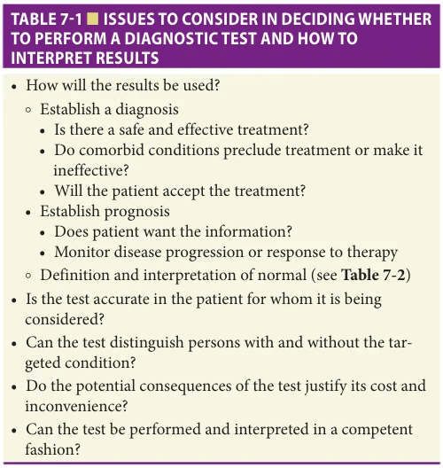
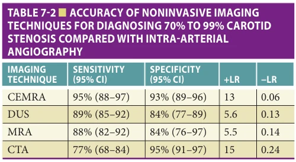
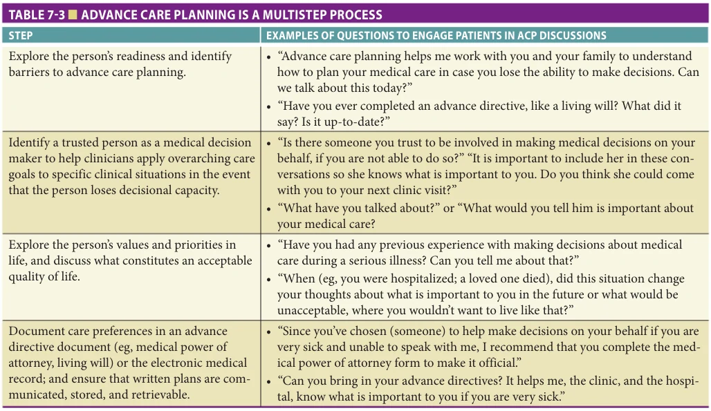
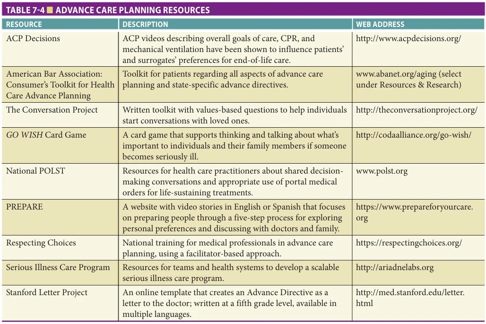

# Hazzard's Geriatric Medicine and Gerontology, 8e - Chapter 7: Decision Making and Advance Care Planning: What Matters Most

Daniel D. Matlock, Hillary D. Lum

> **Status.** Fast build from the book; not lane-reviewed.

> Not cited in the 2020-2026 past papers.

> **Source and method.** Printed pages 109-116, from the marked 8th-edition copy (PDF page = printed page + 34). Prose follows its text layer; tables and figures are source-page crops. The book is canonical.

**[p. 109]**

## OVERVIEW: A COMMENT ON PERSPECTIVE

The importance of perspective is the basis of any discussion of decision making. All decisions are viewed through the lens of the decision maker. In medicine, decisions can be viewed from many perspectives including the patients, families, the clinicians, the health care system, and even society. This array of lenses with differing motivations and incentives can lead to widely disparate decisions. For example, a doctor may recommend an expensive medication such as a new chemotherapy in the interest of helping a patient live longer. The patient on the other hand may not be singularly focused on survival and/or may find the side effects intolerable. The family caregiver may be overwhelmed in coordinating medical care. The health care system in which the physician works may be eager to reap the reimbursements of an infusion associated with the medicine. Meanwhile, society may be concerned that the high costs and marginal benefits of the medication provides relatively little value (higher costs relative to the benefits) to society as a whole.

#### Learning Objectives

- To understand the modern legal and ethical framework of clinical decision making.

- To describe how and why decision making is different and more challenging for older adults.

- To recognize the importance of incorporating patients’ and families’ outcome goals as the drivers of medical decision making.

- To understand the process of advance care planning and clinical tools available for it.

#### Key Clinical Points

1. Patients’ and families’ perspectives, goals, and values should be the major drivers of medical decision making.

2. Age-related changes, multiple chronic conditions, multifactorial symptoms, changing accuracy of diagnostic tests, changing patient goals, and family perspectives all sum in making decision making more challenging for older adults.

3. The history and physical examination should include a detailed assessment of the person’s social/living situation, functional status, mood, and cognition.

4. Ascertainment of patients’ preferences for current or future medical decisions, which are known to vary among older patients and patients with multiple health conditions, should occur early and often.

This chapter is not meant to be an exhaustive discussion of the science of decision making. As such, a detailed discussion of the contemporary politics and economics of cost effectiveness, insurance design, cost sharing, and other issues essential to understanding decision making at the health care system or societal level are beyond the scope of this chapter. Rather, this chapter will take a clinical perspective focusing on the challenges and opportunities for patients, surrogate decision makers, clinicians, and others involved in the complicated decision making with older adults.

**[p. 110]**

## THEORETICAL FOUNDATION OF MODERN MEDICAL DECISION MAKING

Modern medical decision making sits largely on an ethical foundation. Grounded firmly on the ethical principle of autonomy, emphasis on a patient-centered approach has been rising since the early twentieth century when courts began charging physicians with battery for performing operations to which patients did not consent. While judges have softened this to negligence over time, court cases in the United States, including those involving Karen Ann Quinlan, Nancy Cruzan, and Terri Schiavo, and acts of US Congress such as the Patient Self-Determination Act continue to affirm a patient’s and/or surrogate’s right to determine their medical treatment plan.

The movement, often called “patient-centered care” is based on an underlying assumption that people make decisions in a normative and rational way. Normative decision theories, such as expected utility theory, are based on an ideal that people can approach decisions rationally and are able to cognitively weigh the risks and benefits of various interventions to make a good decision. However, there is a disconnection between the rhetoric of “good” decision making and the reality of decision making. Descriptive theories of decision making demonstrate that humans are subject to cognitive biases that cause decisions to deviate from what would be predicted by the normative/rational approach. One famous descriptive theory is prospect theory developed by Dan Kahneman and Amos Tversky. One aspect of this theory demonstrates that the way options are framed influences the decisions that are made. In a classic example, respondents were asked to imagine that an unusual flu-like disease is expected to kill 600 people. They were given the choice of two alternative programs which were mathematically identical according to the normative expected utility theory. In option A 200 people will be saved, and in option B there is one-third probability that 600 people will be saved and two-thirds probability that no one will be saved. When the options are presented as gains (“people will be saved”), 72% of the respondents chose to save the 200 people rather than take riskier option B. However, if options were presented as a loss (“400 people dying”), 78% of the respondents chose the riskier option B. This experiment elegantly demonstrates how decisions can change drastically simply based on framing; that when options are presented as gains, people tend to be risk averse, and when options are presented as losses, people tend to be risk seeking. Of note, the respondents to that survey were medical professionals highlighting the point that clinicians and patients alike are equally susceptible to these biases. Prospect theory is just one example from the growing field of behavioral economics (also referred to as cognitive psychology). The influences and applications of these theories to modern medical decision making is an active area of research.

The challenge for all clinicians and patients making decisions at the bedside is in finding ways to build a bridge between the legal and ethical mandate to promote patient-centered care and informed consent and the behavioral aspects where decision making, including related to future decision making, is not always rational. Ultimately, good decision making involves elicitation of the patients’ priorities among general, often competing health outcome domains—such as longevity versus comfort/symptom relief—to assure that these preferences drive all evaluation and management decisions.

## DECISION MAKING AND OLDER ADULTS: UNIQUE CHALLENGES

Clinical decision making for older adults, including diagnosis, treatment, and desired outcomes, is different and more challenging than it is for younger patients. Generally, the primary goal of medical care in younger adult patients is diagnosis of the disease causing the presenting symptoms, signs, and/or laboratory abnormalities. Treatment is targeted toward the pathophysiologic mechanisms deemed responsible for the disease. Survival is generally paramount. Relevant clinical outcomes are determined by the specific diseases and often include cure if the disease is acute.

In older adults, the conventional disease-specific approach is not optimal for several reasons. First, age-related physiologic changes in most organ systems affect diagnostic test interpretation and responses to treatments. Additionally, the average 75-year-old suffers from 3.5 chronic diseases. With multiple coexisting chronic diseases, there is a less consistent relationship between the pathology, the disease, and the clinical manifestations. One disease may obscure the presentation of another and treatment of one may increase the severity of another. With multiple coexisting diseases, it becomes difficult, and often impossible, to assess the severity of individual diseases and to ascribe health and/or functional status to specific disease processes.

Second, many distressing symptoms or impairments among older persons, such as pain, dizziness, fatigue, sleep problems, sensory impairments, and gait disorders cannot be ascribed to a single disease; instead, they result from the accumulated effect of physical, psychological, social, environmental, and other factors. A clinical focus solely on diagnosing and treating discrete diseases may lead to expensive diagnostic testing with inconclusive results. Worse, it may even harm if unnecessary and invasive interventions are not aligned with patient preferences. While clinicians may be reluctant to treat symptoms in younger and middle-aged patients without a specific diagnosis, treatment focused on improving symptoms in older patients with multimorbidity is often appropriate, because comfort and function are often the primary goals among this population.

Third, diagnostic test characteristics may be altered by age and comorbidity, making selection and interpretation

**[p. 111]**

of tests more complicated than for younger patients. Furthermore, both the benefits and harms of treatment regimens may differ in the face of age-related physiologic changes and multimorbidity. A good example of this is found in cancer screening where the false positive rate of many tests often increase as people age. Further, the true positives may be detecting things (eg, low-grade prostate cancer) that might have been better left undiagnosed. Consequently, more consideration needs to be taken regarding the individual patient characteristics and their treatment goals.

Fourth, older patients vary in the importance they place on potential health outcomes. When asked, older persons can prioritize among competing goals of increased survival, comfort, cognitive function, and physical function, and in certain instances may opt for comfort or function over survival. Optimal clinical decision making in the care of older patients includes (a) the articulation of patient preferences or goals of care; (b) the estimation of prognosis based on disease and non-disease factors; and (c) clarification of the role that impairments (ie, cognitive, mobility, sensory) and non-disease-specific factors have on the attainment of these preferences and goals. The multiplicity of impairments and diseases; the contribution of psychological, social, cultural, and environmental factors to health conditions; the enhanced likelihood of harm as well as benefit from many interventions; and the variability in goals and preferences all combine to make clinical decision making in the care of older persons very complex.

Fifth, clinical decision making is further complicated in older patients because other persons, including the spouse/partner, adult children, other relatives, and significant others, are often actively involved, particularly when cognitive impairment is present. Involvement of family of choice is helpful and often crucial, since they may provide additional sources of information, facilitate adherence to treatment recommendations, and offer both emotional and instrumental support. Up to 70% of older adults lose the capacity to make decisions prior to death and require surrogates. Conflicts may arise, however, when goals of the patient and family differ. Navigating the need for patient confidentiality and family involvement, between independence and support, and between patient and family goals is a constant challenge. When based on an understanding of these factors, however, the clinical care of older persons is both effective and immensely gratifying.

## DECISION MAKING: THE CLINICIAN’S PERSPECTIVE

Clinicians are tasked with evaluating a patient including performing a history and physical examination, initiating a diagnostic workup when appropriate, and determining what medically reasonable options are appropriate given the patient’s unique situation. Clinicians must then explore the patient’s goals and share in the decision making to

assure that the chosen treatments align with the patient’s goals. Especially if a family member or care partner is a part of the clinical encounter, the clinician should identify preferences for who and how other individuals should be involved in decision making.

### Evaluation: The History

The clinical interview is an important element of the decision-making process. It can be used to establish a diagnosis and monitor treatment and prognosis. The altered, often attenuated, presentation of diseases, the coexistence of multiple processes, and the underreporting of symptoms in older patients mandate a reordering of the importance of various components of the history. The chief complaint, the cornerstone of history-taking in younger patients, has decreased relevance in older persons.

Social history is of paramount importance in the care of older adults. Knowing a person’s living arrangements and financial situation as well as how they make decisions is essential. Especially as older adults experience cognitive or functional impairment that increasingly involves caregiver support, it is critical to identify preferences or need for a surrogate medical decision maker.

The clinical history of older persons should also include assessments of cognitive function, affect, and mood (depressive symptoms). It is particularly important to observe for concerns related to undiagnosed dementia or cognitive impairment that may affect the person’s decision-making capacity. These topics are discussed in detail in Chapters 9 and 10. Briefly, mood and affect can be screened for easily with tools such as the two-question depressive screen. (In the past month, have you been sad, blue, or down in the dumps? Have you lost interest in most things or been unable to enjoy them?) More formal, systematic assessments should be undertaken if there is any question of depression (see Chapter 65).

### Evaluation: The Physical

The physical examination in older persons differs from younger persons as well. The purpose of the physical examination in younger persons is primarily to diagnose specific diseases. The physical examination in older persons, however, also serves to identify treatable impairments such as muscle weakness, gait instability, or sensory impairments, and to directly observe the performance of key functional tasks.

While the content of the physical examination will be much the same for older, as for younger patients, given time constraints, high-yield, relevant, but less traditional, examination items should take precedence. For example, during day 5 of a hospitalization, it is likely more important to see if a patient can sit up or stand than to listen to the heart sounds. Other high-yield examination elements might include postural blood pressure, cognitive status, hearing and vision limitations including inspection of ear canal for cerumen, visual acuity, and foot examination.

**[p. 112]**

### Evaluation: Diagnostic Testing

Diagnostic testing is often used to support decision making. However, even this poses additional challenges among older adults. The value of a diagnostic test is best determined by considering whether the test is accurate, the target disorder is dangerous if left undiagnosed, the test has acceptable risks, and effective treatment exists. All of these criteria are relevant as older patients often have multiple health conditions and limited life expectancy changing both the accuracy and value of diagnostic testing. Also, because older adults vary in the emphasis they place on outcomes other than mortality, even a good diagnostic test may not be appropriate for an individual patient.

Deciding whether a diagnostic test is important requires consideration of its ability to change the probability of disease prior to test completion (called the pretest probability of the target disorder) to a probability of the disease after test completion (called the posttest probability). As for the physical examination, the coexistence of diseases and age-related changes may affect the sensitivity, specificity, predictive value, and interpretability of laboratory, imaging, and other ancillary tests. Consequently, most tests have lower value among older adults. In addition, age-referenced normal values and ranges have been developed for some, albeit, not most laboratory tests.

In older persons, there are additional issues to consider including the ability of the patient to complete the test and whether the test does more good than harm. A patient with significant gait impairment, for example, is not going to be able to complete an exercise stress test. And, it may not be appropriate to consider a particular diagnostic test in someone with multiple comorbidities and poor quality of life if the purpose of that testing does not align with the patient’s goals. For example, a diagnosis of dyslipidemia is not clinically relevant in someone with advanced cancer.

In deciding whether to perform laboratory, imaging, or other ancillary tests, the clinician should consider the issues outlined in Table 7-1 and the principles described in this chapter. This decision process is illustrated for the example of noninvasive imaging for carotid stenosis. Consider for example, an 80-year-old patient who presents with a transient ischemic attack. A carotid Doppler ultrasound is ordered and reveals greater than 70% stenosis of the carotid artery on the affected side. Magnetic resonance angiography (MRA) is ordered and the patient’s family wants to discuss whether to proceed with the test. Before the MRA is done, several issues should be considered in addition to ensuring that surgery is available and effective in your setting. Would the patient consider carotid endarterectomy? If the answer is no, further diagnostic testing is not warranted. Are there significant comorbidities or contraindications to the surgery? For example, if a patient has advanced dementia and poor functional status, the benefits of surgery would be questionable both because of their competing morbidities limiting the time through which they might benefit and

*TABLE 7-1 ■ ISSUES TO CONSIDER IN DECIDING WHETHER TO PERFORM A DIAGNOSTIC TEST AND HOW TO INTERPRET RESULTS*

*Owner annotations/highlights are from the marked source copy, not the book.*

the greater difficulty they might have in participating in the perioperative care and rehabilitation. If surgery might be contemplated, then it is appropriate to determine whether there are accurate and reliable tests for diagnosing carotid stenosis available in your setting.

A recent systematic review of the accuracy of noninvasive imaging tests compared with intra-arterial angiography for significant carotid stenosis in symptomatic patients can help with the last question noted above. Forty-one studies including 2541 patients were included in this review. The accuracy of the four imaging techniques for diagnosing significant carotid stenosis is provided in Table 7-2. For diagnosing 70% to 99% stenosis, the specificity was lowest for MRA and Doppler ultrasonography. Thus, MRA may result in inappropriate surgery in up to one in seven patients. This systematic review suggests that noninvasive testing cannot appropriately be used to recommend carotid

*TABLE 7-2 ■ ACCURACY OF NONINVASIVE IMAGING TECHNIQUES FOR DIAGNOSING 70% TO 99% CAROTID STENOSIS COMPARED WITH INTRA-ARTERIAL ANGIOGRAPHY*

*Owner annotations/highlights are from the marked source copy, not the book.*

CEMRA, contrast-enhanced magnetic resonance angiography; CTA, computed tomographic angiography; DUS, Doppler ultrasonography; LR, likelihood ratio; MRA, magnetic resonance angiography. Adapted with permission from Kelly AG, Holloway RG. Review: noninvasive imaging techniques may be useful for diagnosing 70% to 99% carotid stenosis in symptomatic patients. ACP J Club. 2006;145(3):77.

**[p. 113]**

endarterectomy. Patients should be made aware that they will likely require intra-arterial angiography, which does carry a small but real risk of complications. Unless the clinician considers patient outcome goals and risk preferences as well as the accuracy of the diagnostic tests, some patients will have surgery who do not need or desire it and some medically treated patients will have preventable strokes.

## DECISION MAKING—INCORPORATING THE PATIENT’S PERSPECTIVE

Patient-centered care dictates that clinical decision making should occur within the context of individual preferences and goals. Ascertainment of these preferences, which are known to vary among older patients and among patients with multiple health conditions, should occur early and often (see Chapter 7). Older persons rarely volunteer their preferences. Active solicitation of priorities and preferences, therefore, needs to be an integral part of the patient and family interview. Good patient-centered care does not mean that the doctor tells the patient what to do. This is the paternalism that modern ethics and Western legal systems have largely overturned. At the same time, good patientcentered care does not entail putting a smorgasbord of options in front of a person and telling them to choose—an approach that has even been called patient abandonment. Rather, decisions should be shared between the clinicians and their patients. Clinicians bring expertise in the medical information and patients bring expertise in themselves and what is important to them. Then, a shared decision is less about information provision and more about a conversation between two experts.

### Matching Treatments to Patients’ Goals

A body of research suggests that patients are not adequately informed when receiving medical interventions. A large national survey across nine different medical conditions demonstrated that patients scored low on their knowledge, even if they had received those procedures. Perhaps even more concerning is the literature that patients often receive care that they would not want. Many patients, especially older patients, have difficulty in choosing among a set of treatment options. Rather than having patients make every specific treatment choice, which is difficult and often not feasible for the large number of medical decisions that older adults face, encouraging patients to prioritize among different outcome domains allows them to express directly what is most important to them regarding their health care. The elicitation of priorities among general, often competing health outcome domains, including longevity, comfort/symptom relief, cognitive functioning and physical functioning should ideally drive all evaluation and management decisions.

The process of goal elicitation can be complicated and requires a clinician adept in handling the communication challenges that will arise. First, the setting for the

discussion may need to be adapted to the specific impairments of some older persons. Impairments in hearing, visual acuity, and cognition, each prevalent among older persons, mandate a quiet, well-lit, and unhurried setting in order to have a meaningful discussion. Multiple encounters may be required to complete the history and to gather the necessary information. While the patient remains the key informant, the discussion often needs to be supplemented by information obtained from the patient’s family of choice, and/or other care providers, particularly if the older person has cognitive impairment.

Second, the process of goal elicitation can be emotional. Sometimes, a patient or family may articulate a goal that is just not feasible given their situation (eg, continuing to live alone in their home). Here, the task of the clinician is in helping the patient redefine goals that are feasible. This can be a difficult and emotional conversation for all involved. Often, to help patients define their goals, they must enter into the complicated discussion of prognosis. An area of active research is in improving clinicians’ communication skills with patients to facilitate these patientcentered discussions.

## ADVANCE CARE PLANNING: DECISION MAKING FOR FUTURE MEDICAL DECISIONS

An important aspect of decision making with older adults is planning for future medical decisions. This is often done through a process referred to as advance care planning (ACP). ACP is a process that supports adults at any age or stage of health in understanding and sharing their personal values, life goals, and preferences regarding future medical care. The goal of ACP is to help ensure that people receive medical care that is consistent with their values, goals, and preferences when they cannot speak for themselves. ACP is a multistep and iterative process that involves having conversations that explore the individual’s values, identifying a surrogate decision maker, and translating those values and preferences into current and/or future medical care plans through shared decision making. Conversations and care plans may be documented in advance directives, portable medical orders, and/or clinical documentation as part of the patient’s medical record. For patients who are at risk for a life-threatening event because they have a serious life-limiting medical condition, which may include advanced frailty, it may be appropriate to offer voluntary shared decision making related to specific life-sustaining treatment preferences (ie, CPR, ICU level care, hospitalization, comfort care) and then complete a POLST form, which is a portable medical order set that is available in many states (www.POLST.org).

### Practical Approaches to Advance Care Planning Conversations

ACP and goals of care conversations can occur in various settings, including ambulatory care, emergency departments,

**[p. 114]**

*TABLE 7-3 ■ ADVANCE CARE PLANNING IS A MULTISTEP PROCESS*

*Owner annotations/highlights are from the marked source copy, not the book.*

inpatient hospitalization, post-acute care, and long-term care. ACP conversations often involve patients, individuals serving as surrogate decision makers, and health care practitioners. While some ACP conversations are brief, other conversations may benefit from the structure and preparation in family meetings. For older adults, the ACP process is well-suited to outpatient, longitudinal care and should unfold over time; however it also often occurs around changes in medical conditions, new diagnoses, changes in functional or cognitive status, or care transitions such as hospitalization or admission to residential care.

Health care providers should have phrases for introducing a desire to discuss ACP, such as, “We’re taking a step back to talk about the big picture with your care. I do this with all my patients so I can provide you with the kind of care you would want.” The introduction should aim to normalize the process and emphasize to the patient and family the goal of providing medical care that is aligned with their goals. Then, clinicians and teams can engage individuals and their families by introducing key concepts over time, as outlined in Table 7-3. Each concept can be discussed individually and often in 5 minutes or less, based on time constraints and patient needs.

Many clinicians provide comprehensive care for older adults with multiple chronic conditions and functional limitations. Throughout an individual’s journey of living with advanced illness, there are opportunities for ongoing conversations. Developed by the Ariadne Labs, the Serious Illness Conversation Guide helps clinicians conduct successful conversations in an intentional sequence. The guide is readily available and provides patient-tested language.

Given that discussing ACP may bring up strong emotions, there are communication training programs (ie, brief videos from VitalTalk) to help clinicians navigate these emotions to best support their patients (see Table 7-4).

### Person- and Family-Centered Tools to Prepare Individuals

Person and family-centered tools can assist patients with knowledge and decision making related to ACP. Because ACP conversations can be a personnel- and time-intensive process, helping patients and families begin this process on their own is useful. Health care teams can systematically incorporate the use of patient-centered tools to help engage patients before meeting to have these conversations. Table 7-4 summarizes resources that are available for practical use by patients and their families. For example, the Stanford Letter Project has videos of diverse individuals sharing their wishes with family or their doctor. The PREPARE website demonstrates multiple steps of ACP, such as deciding on flexibility in decision making for surrogate decision makers (see Table 7-4).

### Incorporating Cultural, Religious, and Spiritual Values

ACP conversations will be more successful with consideration of the individual’s family, cultural, spiritual, and religious norms. In a study of patient-reported barriers to high-quality end-of-life care, patients from multiethnic backgrounds identified: (1) finance/health insurance barriers, (2) doctor behaviors, (3) communication chasm between doctors and patients, (4) family beliefs/behaviors,

**[p. 115]**

*TABLE 7-4 ■ ADVANCE CARE PLANNING RESOURCES*

*Owner annotations/highlights are from the marked source copy, not the book.*

(5) health system barriers, and (6) cultural/religious barriers. While the clinician should never assume that all members of a group have the same beliefs, knowledge of some of the norms can aid in the future medical care planning discussions and decision making. Additionally, literacy and language-appropriate documents may enhance ACP. Clinicians cannot predict what an individual patient wants or is even willing to discuss. The only way to know is to ask in a nonjudgmental, patient-centered manner. Questions to help understand an individual’s perspective could include: “Are there any cultural, spiritual, or religious factors that I should know about as we talk about the care you would want if you got sicker?” and “How do your religious or spiritual beliefs influence your wishes for your medical care near the end of your life?”

## FURTHER READING

Beauchamp TL, Childress JF. Principles of Biomedical Ethics.

6th ed. New York, NY: Oxford University Press; 2008. Bernacki RE, Block SD, Force ACoPHVCT. Communi-

cation about serious illness care goals: a review and synthesis of best practices. JAMA Intern Med. 2014; 174(12):1994–2003.

## CONCLUSION—THE ART

As noted above, decision making with older adults is challenging in many ways. For most, life comes with multimorbidity and functional decline and the traditional disease-focused models do not work. While a lucky few have truly compressed morbidity, the majority of older adults experience gradual decline, mounting morbidity, and frailty. However, underneath the challenge is a deep richness. Helping patients and families clarify their outcome goals and assuring that treatments align with those goals will never be automated by a machine. Perhaps more than anywhere else, the art and humanity of the sacred practice of medicine thrive when caring clinicians engage in decision making with older adults.

Boockvar KS, Lachs MS. Predictive value of nonspecific

symptoms for acute illness in nursing home residents. J Am Geriatr Soc. 2003;51:1111–1115. Boyd CM, Darer J, Boult C, et al. Clinical practice guide-

lines and quality of care for older patients with multiple

**[p. 116]**

comorbid diseases: implications for pay for performance. JAMA. 2005;294:716–724. Fried TR, Bradley EH, Towle VR, et al. Understanding the

treatment preferences of seriously ill patients. N Engl J Med. 2002;346:1061–1066. Guyatt GH, Oxman AD, Ali M, et al. Laboratory diagno-

sis of iron-deficiency anemia: an overview. J Gen Intern Med. 1992;7:145–153. Hirsch C. The Mini-cog had high sensitivity and specificity

for diagnosing dementia in community-dwelling older adults. ACP J Club. 2001;74. Ilic D, Neuberger MM, Djulbegovic M, et al. Screen-

ing for prostate cancer. Cochrane Database Syst Rev. 2013;(1):CD004720. Kelly A, Holloway RG. Noninvasive imaging techniques

may be useful for diagnosing 70 to 99% carotid stenosis in symptomatic patients. ACP J Club. 2006; 145(3):77. Kim S, Goldstein D, Hasher L, et al. Framing effects

in younger and older adults. J Gerontol. 2005;60: P215–P218. King JS, Moulton BW. Rethinking informed consent: the

case for shared medical decision-making. Am J Law Med. 2006;32(4):429–501. Lum HD, Sudore RL, Bekelman DB. Advance care planning

in the elderly. Med Clin North Am. 2015;99(2):391–403. Periyakoil VS, Neri E, Kraemer H. Patient-reported

barriers to high-quality, end-of-life care: a multiethnic, multilingual, mixed-methods study. J Palliat Med. 2016; 19(4):373–379. Quill TE, Cassel CK. Nonabandonment: a central obligation

for physicians. Ann Intern Med. 1995;122(5):368–374. Scanlan J, Borson S. The Mini-cog: receiver operating char-

acteristics with expert and naïve raters. Int J Geriatr Psych. 2001;16:216–222.

Silveira MJ, Kim SYH, Langa KM. Advance directives and

outcomes of surrogate decision making before death. N Engl J Med. 2010;362(13):1211–1218. Sudore RL, Fried TR. Redefining the “planning” in advance

care planning: preparing for end-of-life decision making. Ann Intern Med. 2010;153(4):256–261. Sudore RL, Lum HD, You JJ, et al. Defining advance care

planning for adults: a consensus definition from a multidisciplinary Delphi panel. J Pain Symptom Manage. 2017;53(5):821–832.e821. Teno JM, Fisher ES, Hamel MB, Coppola K, Dawson NV.

Medical care inconsistent with patients’ treatment goals: association with 1-year Medicare resource use and survival. J Am Geriatr Soc. 2002;50(3):496–500. Tinetti ME, Bogardus ST Jr, Agostini JV. Potential pitfalls

of disease-specific guidelines for patients with multiple conditions. N Engl J Med. 2004;351:2870–2874. Tinetti ME, Fried T. The end of the disease era. Am J Med.

2004;116:179–185. Tversky A, Kahneman D. The framing of decisions and the

psychology of choice. Science. 1981;211(4481):453–458. US Preventive Services Task Force. Screening for demen-

tia: recommendation and rationale. Ann Intern Med. 2003;138(11):925. Wardlaw JM, Chappell FM, Best JJ, et al. Non-invasive

imaging compared with intra-arterial angiography in the diagnosis of symptomatic carotid stenosis: a meta-analysis. Lancet. 2006;367:1503–1512. Widera E, Anderson WG, Santhosh L, McKee KY, Smith

AK, Frank J. Family meetings on behalf of patients with serious illness. N Engl J Med. 2020;383(11):e71. Zikmund-Fisher BJ, Couper MP, Singer E, et al. Deficits

and variations in patients’ experience with making 9 common medical decisions: the DECISIONS survey. Med Decis Making. 2010;30(suppl 5):S85–S95.
