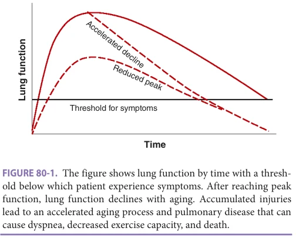
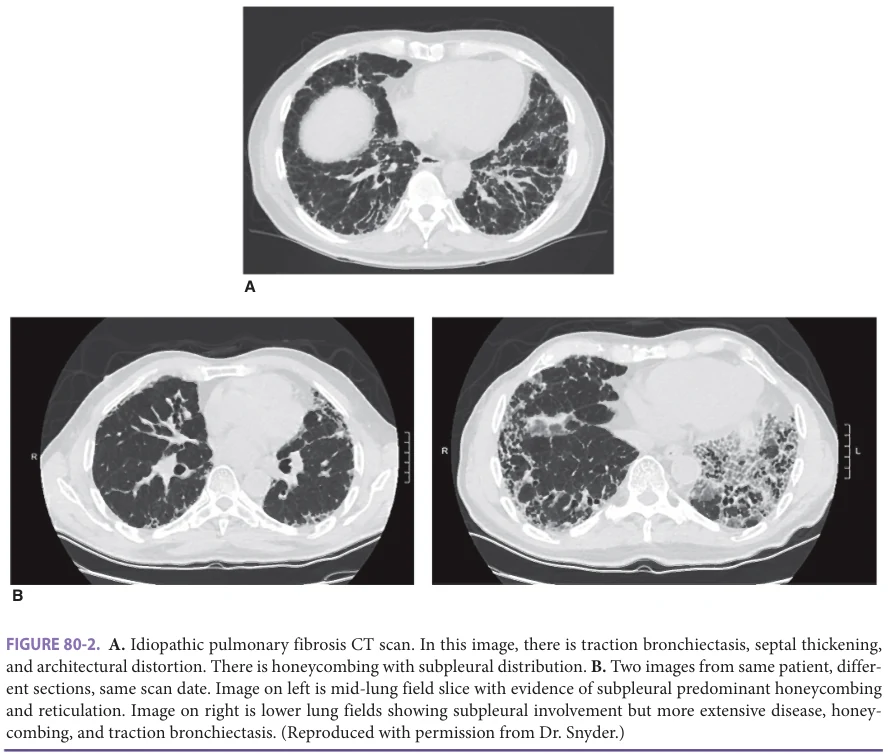

# Hazzard's Geriatric Medicine and Gerontology, 8e - Chapter 80: Respiratory System and Selected Pulmonary Disorders

Daniel Guidot, Patty J. Lee, Laurie D. Snyder

> **Status.** Fast build from the book; not lane-reviewed.

> **Source and method.** Printed pages 1229-1234, from the marked 8th-edition copy (PDF page = printed page + 34). Prose follows its text layer; tables and figures are source-page crops. The book is canonical.

**[p. 1229]**

## INTRODUCTION

Respiratory function is the interplay between the functioning of the lung tissue itself, the airways, the muscles of respiration, and the bones and joints of the thorax. In addition, the respiratory system interacts closely with other organs like the heart. Changes in each and all of these different parts ultimately affect how one breathes. By understanding how each of these parts changes with aging, one can understand how the respiratory system as a whole changes with time.

#### Learning Objectives

- Identify the structural, physiologic, and cellular changes of the lung with age.

- Describe how aging processes relate to lung diseases in older patients.

#### Key Clinical Points

1. Pulmonary function declines over time in healthy individuals leading to changes in oxygenation, ventilation, and the ability to fight infections.

2. Lung disease impacts pulmonary function and can accelerate pulmonary age-related decline.

3. Changes in the immune system with aging lead to decreased response to antigens and a proinflammatory state, which increases the risk for severe lung infections.

4. Best practices for pulmonary care of older patients includes avoidance of tobacco products and environmental pollution, maintaining ideal body weight, considering appropriate vaccinations, and if hypoxic, oxygen supplementation.

Embryonic growth and development of the lung is a complex process, and after birth the development of the lung continues. Just as the normal body grows into young adulthood, the lungs and their function progress as well. Eventually, however, the lungs reach their peak capacity, usually well above the requirements needed for normal respiratory functioning. With normal aging, the pulmonary function declines as lung tissue, chest wall, and muscles change over time. For many patients, this decline never reaches the threshold of meaningful pulmonary disease (Figure 80-1). However, in other individuals, the accumulated insults and injuries lead to an accelerated aging process and pulmonary disease that can lead to breathlessness, decreased exercise capacity, and eventually death. Thus, when considering the aging process of a person’s lung, one must take into account their childhood lung development, the cumulative burden of lung damage that they have incurred already, and any factors that may accelerate the decline in the lung function.

## CELLULAR LUNG CHANGES WITH AGING

The lung undergoes many cellular changes over time. These changes are the result both of the natural aging process as well as the fact that the lung is continually exposed

to a range of stress insults, particularly from the external environment. Eventually the cells of the lung lose the ability to divide and differentiate in a process known as senescence. Senescent cells are characterized by arrested

**[p. 1230]**

*Figure 80-1, printed p. 1230.*

cell proliferation coupled with decreased apoptosis and a senescence-associated secretory phenotype (SASP) that is specific to the type of cell. While senescent cells can prevent the propagation of damaged cells, they also limit proliferation for tissue repair. Initially, the SASP may be immunosuppressive and promote wound healing, but persistence of the secretory phenotype leads to chronic inflammation and profibrotic processes.

Cellular senescence increases with aging and can be induced by a variety of insults, including oxidative stress, telomere shortening, DNA damage, inflammation, and mitochondrial stress. Environmental insults and disease states can increase oxidative stress to the lungs. Oxidative stress is the process by which highly reactive molecules arise inside cells, leading to damage to the structures within the cell. These molecules arise from the normal processes of oxygen metabolism within the cell. However, toxic environmental exposures and inflammatory states can increase oxidative stress and accelerate this process. With time, progressive oxidative stress can affect how effectively lung cells carry out their various functions and promote accumulation of senescent cells.

Cells are actively dividing and replenishing the tissues over time. With each cell replication, a small amount of genetic information is lost and discarded with each end of the DNA molecule. To protect against loss of vital information, chromosomes have segments of redundant DNA at each end, known as telomeres. However, after cells have undergone enough divisions, they can exhaust their telomeres, resulting in a process where each new cell division results in a cell with slightly less DNA than its parent cell. Genetic predispositions for short telomeres (known as short telomere syndromes) and cellular processes that require increased cell turnover can exacerbate the exhaustion of telomeres, leading to senescence.

In addition, changes in the immune system also occur with aging and impact the lung function and ability to respond to infections. Over time, the body acquires more memory T cells from previous antigen exposure.

In addition, the pool of naïve T cells declines over time. This results in an immune system with less capability to respond to new antigens, a state of immune senescence. Thus, when exposed to new infections, the adaptive immune system has less capacity to respond leading to increased innate immune response and increased inflammation and oxidative stress as well as reduced antigen clearance.

Cellular function can change with aging. The cells that line the surface of the alveoli and bronchi in the lungs have cilia, and the sweeping motion of the cilia are an important part of the clearance of debris and pathogens from the lungs. As the lungs age, the cilia have reduced movement, leading to reduced clearance of mucus. Cellular aging also affects the extracellular matrix of cells, the system of molecules on the surface of cells that help them maintain their normal structure and function. As cells age, the extracellular matrix changes to be composed less of elastin and more of collagen, a more rigid and less flexible molecule. This results in lung tissue that is stiff and has a reduced ability to return to its natural shape.

The end result of all of these cellular changes is that, with aging, the lung demonstrates reduced capacity to respond to stress, greater propensity toward proinflammatory cytokines, abnormal tissue repair, and increased susceptibility to infection.

## MECHANICAL AND FUNCTIONAL LUNG CHANGES WITH AGING

Pulmonary function testing (PFT) is a widely used procedure in pulmonary medicine to measure lung volumes and lung mechanics. While many different studies can be performed, this chapter will focus on the three most commonly performed tests: spirometry, lung volumes, and diffusion capacity.

Spirometry Spirometry measures the ability to move air in and out of the lungs. The patient maximally inhales and then maximally exhales into a closed-circuit tube, and the volume of air that they are able to exhale is measured. The total amount of air exhaled during this forced exhalation maneuver is called the forced vital capacity (FVC). The FVC can then be further subdivided over specific time points. The most clinically important subdivision is the amount of air exhaled within the first second of exhalation, called the forced expiratory volume in 1 second (FEV1). By taking the ratio of FEV1 to FVC, the clinician can evaluate for obstruction. The greater the airways obstruction, the longer it takes to exhale and the lower the FEV1 to FVC ratio.

Lung Volumes At the end of a full exhalation, there is no way to know how much air remains in the lungs. Thus, spirometry alone cannot measure total lung volumes. However, the PFT lab can use additional techniques to measure the volume in the lungs that can take advantage of gas exchange or plethysmography

**[p. 1231]**

(change of pressure over volume). Using these methods, one can calculate the amount of air in the maximally inflated lung (total lung capacity or TLC) as well as the amount of air trapped in the lungs after maximal exhalation (residual volume or RV). These measures of TLC and RV provide additional insights into the lung function.

Diffusion Capacity Finally, PFT can assess the ability of the lungs to extract oxygen from the air. Carbon monoxide (CO) is a toxic molecule with higher affinity for hemoglobin than oxygen. However, very low levels can be safely inhaled, and the body’s ability to absorb carbon monoxide can be used as a surrogate for measuring the gas exchange of oxygen.

Several structural changes in the airways of the lungs occur as part of the normal aging process and can variably affect the spirometry measurements. In the airways, accumulated damage leads to bronchial thickening and hyperplasia, and increases in sympathetic tone over time result in increased smooth muscle tone. In addition, diaphragmatic weakness progresses with aging which reduces the maximal intake of air. The final result of all of these processes is that, with aging, the FEV1 declines over time. Reduced diaphragmatic strength also reduces the FVC. Loss of elasticity of the lung results in more air residing in the lung at the end of maximum exhalation, resulting in more air trapping and therefore a reduced FVC. However, the reductions in FVC are less in the reductions in FEV1. Thus, the FEV1 to FVC ratio drops with aging. In other words, aging lungs develop progressive obstruction.

With aging, the lung elasticity changes. The inward pole of the lung tissues is reduced with aging, resulting in an increased tendency for the lungs to rest at a large volume and an increase in TLC with aging. At the same time, however, the chest wall itself becomes smaller with loss of vertebral height and calcification within the rib joint articulations, which increases the force required to expand the chest. These processes reduce TLC with age. The net result is that, with aging, TLC remains relatively constant.

With aging and the progressive accumulation of pulmonary insults, capillary destruction occurs over time. This results in a reduced body of small blood vessels that could absorb oxygen from the air. Additionally, reduced elasticity of the lung results in greater stretching of the lung at the apices due to the pull of the gravity. This results in greater amounts of air being at the top of the lung. Blood flow, which is greatest at the bases of the lung, goes to regions with the least amount of air, resulting in a ventilation–perfusion mismatch. The cumulative result of this is that, with aging, diffusion capacity for carbon monoxide (DLCO) declines.

## AGING IN KEY DISEASE STATES

Idiopathic Pulmonary Fibrosis As opposed to diseases that affect the airways (such as COPD and asthma), interstitial lung disease, also known as ILD, is a disease of the lung tissue itself. It is a group of rare

disease subtypes with varying causes and clinical manifestations. The most common form of ILD is idiopathic pulmonary fibrosis, or IPF, a disease in which the lung tissue is slowly and progressively consumed by fibrous scar tissue. The exact etiology of IPF is unknown but it is more common in patients older than 60 years. This association with older individuals highlights that the aging lung is more prone to abnormal fibrosis.

Patients with IPF most commonly present with gradual and insidious onset of progressive dyspnea with exertion, and there are commonly significant delays in diagnosis. In any older patient who presents with progressive dyspnea on exertion, IPF should be in the differential. Patients can also have cough, fine crackles at the bilateral lung bases, and in advanced disease, hypoxia with possibly cyanosis or clubbing of the fingernails. PFT usually reveals reduced TLC and reduced DLCO. Ultimately, the most important diagnostic modality for suspected IPF is CT chest imaging. IPF does have a classical presentation on CT imaging, known as a usual interstitial pneumonia pattern with reticular changes, honeycombing, and traction bronchiectasis (Figure 80-2).

In patients with suspected or confirmed IPF, referral to pulmonologist is standard of care. Primarily a fibrotic disease, IPF treatment centers on antifibrotics, namely nintedanib and pirfenidone rather than immunosuppressive medications like chronic steroids or other immunosuppressants. The antifibrotic medications slow the progression of restriction in lung function studies, but do not reverse any scarring that has already occurred. As such, these medications may not lead to immediate improvements in the current symptoms and quality of life of patients. Additionally, the antifibrotics have significant gastrointestinal side effects including nausea and diarrhea, and discontinuation of these medications due to intolerance is not uncommon. Thus, the decision to initiate or maintain antifibrotics must also be tailored to each individual patient.

Even with therapies, IPF is a steadily progressive disease with high morbidity and mortality, with expected median survival from time of diagnosis on the order of only a few years. In addition, patients with IPF can have flares whereby known or unknown triggers (including infections and clots) can lead to life-threatening bouts of severe inflammation and scarring. As such, for suitable patients diagnosed with IPF, physicians should consider referral for lung transplantation evaluation.

COVID-19 The COVID-19 pandemic highlights how the immune system of the aging lung responds differently to infections. COVID-19 is a viral infection characterized by fever, cough, fatigue, loss of smell, and in some patients, shortness of breath. In patients with respiratory symptoms, chest imaging shows bilateral pulmonary infiltrates consistent with diffuse alveolar damage. Patients may progress to acute respiratory

**[p. 1232]**

*Figure 80-2, printed p. 1232.*

distress syndrome and require mechanical life support. This evolution to respiratory failure occurs in a highly proinflammatory state that drives activation of disseminated intravascular coagulation and subsequent multiorgan failure. Older patients with COVID-19 are particularly at risk for this proinflammatory state. The older patient’s adaptive immune system limits viral clearance with the relative decrease in T and B cells and decreased ability to respond to specific antigens. This failure of the adaptive immune response combined with the proinflammatory response of the innate immune system sets the stage for an overwhelming immune response in the lungs, contributing to lung failure and systemic immune activation.

## BEST PRACTICES IN PULMONARY MEDICINE TO COUNTER THE AGING PROCESS

The healthy aging lung’s pulmonary function declines over time. That said, patients and clinicians can take important steps to mitigate both the aging process as well as the effects it has on lung health and function. One of the most important intervention is the avoidance of deleterious exposures

such as tobacco and air pollution. Exposures like these trigger a proinflammatory response and further direct damage to the lung tissue, accelerating the aging process and contributing to faster declines in lung function. For patients with respiratory disease at any age, avoidance of further damage to the lungs is key. This also includes preventing pulmonary infections. Older patients should receive vaccinations, specifically vaccinations against influenza, pneumococcal pneumonia (13-valent and 23-valent vaccines), and now COVID-19.

Maintaining an ideal body weight is also key to maintaining good lung health. Obesity not only increases the amount of work on the body during normal activities but also contribute to specific concerns of truncal obesity. Maintaining a healthy weight and minimizing abdominal fat make it easier for the respiratory muscles including the diaphragm to function. Ensuring good lung health with aging also requires maintaining the health systems that work with the lungs as part of respiratory function. This includes maintaining the health of the cardiovascular system and managing conditions like heart failure. Additionally, conditions like osteoporosis can lead to vertebral fractures, which can lead to loss of chest wall height and

**[p. 1233]**

size and reduced ability to breathe. Treatment of osteoporosis and prevention of fractures can help promote lung health in the future.

Aging not only affects respiratory function but also the ability for the body to recover from stresses and illnesses. Especially for aging patients with chronic cardiac or pulmonary conditions, illnesses and exacerbations can lead

## FURTHER READING

Bush A. Lung development and aging. Ann Am Thorac Soc.

2016;13:S438–S446. Campisi J. Cellular senescence and lung function during

aging. Yin and Yang. Ann Am Thorac Soc. 2016;13 Suppl 5: S402–S406. Cho SJ, Stout-Delgado HW. Aging and lung disease. Annu

Rev Physiol. 2020;82:433–459. Cunha LL, Perazzio SF, Azzi J, Cravedi P, Riella LV. Remod-

eling of the immune response with aging: immunosenescence and its potential impact on COVID-19 immune response. Front Immunol. 2020;11:1748. Faner R, Rojas M, Macnee W, Agusti A. Abnormal lung

aging in chronic obstructive pulmonary disease and idiopathic pulmonary fibrosis. Am J Respir Crit Care Med. 2012;186(4):306–313. Ito K, Barnes PJ. COPD as a disease of accelerated lung

aging. Chest. 2009;135(1):173–180. Liu R-M, Liu G. Cell senescence and fibrotic lung disease.

Exper Geront. 2020;132:110836. Lowery EM, Brubaker AL, Kuhlmann E, Kovacs EJ. The

aging lung. Clin Interv Aging. 2013;8:1489–1496.

to significant decline in function. With aging, the recovery process can be slow and incomplete. Cardiac and pulmonary rehabilitation is vital in mitigating and reversing functional declines that result from acute illnesses. Referral to these services should be considered for any aging patient with chronic heart or lung conditions recovering from an acute illness.

Murray MA, Chotirmall SH. The impact of immunosenes-

cence on pulmonary disease. Mediators Inflamm. 2015: 692546. Pardo A, Selman M. Lung fibroblasts, aging, and idiopathic

pulmonary fibrosis. Ann Am Thorac Soc. 2016;13 Suppl 5: S417–S421. Parikh P, Wicher S, Khandalavala K, Pabelick CM, Britt RD,

Prakash YS. Cellular senescence in the lung across the age spectrum. Am J Physiol Lung Cell Mol Physiol. 2019;316:L826–L842. Pellegrino R, Viegi G, Brusasco V, et al. Interpretative

strategies for lung function tests. Eur Respir J. 2005; 26:948–968. Thannickal VJ, Murthy M, Balch WE, et al. Blue Journal

Conference: aging and susceptibility to lung disease. Am J Respir Crit Care Med. 2015;191(3)261–269. Weyand CM, Goronzy JJ. Aging of the immune system:

mechanisms and therapeutic targets. Ann Am Thorac Soc. 2016;13 Suppl 5:S422–S428.

**[p. 1234]**
