# Hazzard's Geriatric Medicine and Gerontology, 8e — Chapter 81: Chronic Obstructive Pulmonary Disease

Carolyn L. Rochester, Kathleen M. Akgun, et al.

> **Fast build from the book, 22 Sep; not lane-reviewed.**

**[p. 1235]**

#### Learning Objectives

- Identify the most common clinical definitions of chronic obstructive pulmonary disease (COPD) and their limitations in older adults.
- Establish goals of care in older adults with COPD, most often directed at relieving symptoms, improving exercise tolerance and health status, reducing the risk of disease progression and exacerbations, as well as managing comorbidities.
- Define the palliative care needs of older adults with advanced COPD, including symptom management and potential indications for referral to hospice.

#### Key Clinical Points

1. Age is a major risk factor for respiratory symptoms and the development of COPD due to age-related changes in lung physiology, and a greater exposure to COPD risk factors, particularly a higher prevalence of “ever smoking” or other relevant exposures in the older adult population.
2. Although symptoms consistent with COPD (eg, cough, hypersecretion of mucus) are common among seniors, two-thirds of persons who have symptoms of chronic bronchitis and half of those with physiciandiagnosed emphysema/COPD have normal spirometry (ie, do not have airflow obstruction, yet may be at risk for poor clinical outcomes).
3. A reduced FEV1/FVC establishes a diagnosis of airflow obstruction and at least partial irreversibility is required to demonstrate chronic airflow obstruction, the hallmark of COPD. However, normal age-related airflow limitation is also characterized by a reduced FEV1/FVC, and the threshold used to define COPD in seniors must account for normal aging (see Diagnosis, below, for the GOLD-vs-GLI/Z-score approaches to this).
4. Treatment of COPD in seniors is complicated by difficulty with drug administration (eg, due to cognitive impairment, physical disability) and may require additional teaching/coaching and assessment to achieve optimal outcomes. Clinicians should be aware of potential adverse effects of COPD pharmacotherapies, including arrhythmia, constipation, urinary retention, pneumonia, glaucoma, osteoporosis, compression fracture, thrush, and skin bruising.
5. COPD exacerbations are a major cause of worsening symptoms, disability, hospitalization, and death. Emphasis on prevention and early treatment of exacerbations is a key aspect of COPD care (see below for the treatment steps).

## Introduction

The population of adults older than age 65 is increasing in the United States and elsewhere in the world. Among older persons, respiratory symptoms are prevalent and associated with adverse outcomes. Dyspnea, for example, is reported in one-third of older persons and is associated with physical inactivity, impaired mobility, disability in activities of daily living, and death. Chronic bronchitis occurs in 15% of older persons and is associated with physical inactivity, reduced lung function, chronic obstructive pulmonary disease (COPD) exacerbations, and death. Wheezing occurs in 12% of older persons and is associated with physical inactivity and death.

The occurrence of respiratory symptoms frequently raises concerns regarding COPD. Currently the fourth leading cause of death in the United States, it is projected to be the fifth leading cause of disability and third cause of death worldwide by 2030. Older persons are at high risk of developing COPD, given both the age-related decline in physiologic capacity and the cumulative effect of frequent exposures to tobacco smoke, respiratory infections, air pollutants, and occupational exposures across the lifespan.

The prevalence of COPD varies across countries. A 2015 systematic review of population-based studies revealed an estimated global prevalence of 10% to 12% (up to 384 million cases) as of 2010. Epidemiologic surveys of COPD are often based on the symptoms of chronic bronchitis or physician-diagnosed emphysema/COPD, yielding prevalence rates of greater than or equal to 11.6% in US adults older than age 65. Alternatively, and more consistent with clinical guidelines, COPD is defined spirometrically as the presence of chronic airflow obstruction. When established by age-appropriate diagnostic thresholds, spirometry-confirmed COPD has a prevalence of 15.4% in US adults age 65 or older. It is estimated that half of adults with COPD will be 75 years or older by 2030. COPD prevalence in the United States is higher among adults with history of tobacco smoking, those with lower income, and those who use public insurance. Many individuals with COPD are never diagnosed or not diagnosed until they are hospitalized with severe respiratory symptoms or respiratory failure.

**[p. 1236]**

**Treatment of acute exacerbations (Key Clinical Point 5, continued):**

- **a.** Intensified bronchodilator therapy.
- **b.** Corticosteroids should be considered for severe exacerbations, but side effects are common in seniors; for example, delirium is more common particularly at doses exceeding 60 mg daily.
- **c.** Antibiotics should be considered for those exacerbations associated with increased sputum purulence and/or volume, especially for moderate or severe exacerbations. Older adult residents of skilled nursing facilities, or those who have spent time in acute-care or subacute rehab facilities within 90 days of exacerbation, and persons with severe airflow obstruction (FEV1 < 30% predicted or FEV1 Z-score < –2.55) are more likely to be colonized with resistant organisms (methicillin-resistant _Staphylococcus aureus_ and multidrug-resistant gram-negative organisms [eg, _Pseudomonas aeruginosa_ ]). Thus, these latter risk factors together with local antibiotic resistance patterns should guide choice of empiric therapy. The duration of antibiotic therapy, in the absence of complicating factors such as pneumonia or bronchiectasis, is typically 3 to 7 days.
- **d.** Discharge planning should consider referral for pulmonary rehabilitation, the need for home oxygen and/or noninvasive ventilation, and a recalibration of maintenance therapy; because new treatment regimens increase the likelihood of medication nonadherence or errors, formal medication reconciliation and pharmacist-based review should be implemented.

**[p. 1237]**

## COPD Definition

COPD is defined by the Global Initiative for Chronic Obstructive Lung Disease as “a common, preventable and treatable disease that is characterized by persistent respiratory symptoms and airflow limitation that is due to airway and/or alveolar abnormalities usually caused by significant exposure to noxious particles or gases and influenced by host factors including abnormal lung development.”

## Risk Factors For COPD

> Advancing age is accompanied by a high frequency of COPD -

> risk factors. The most important of these is tobacco smoke, - accounting for the majority of COPD cases in the United States and other high-income countries. In recent cohorts of older Americans, the prevalence of ever-smokers was 56%, including 9% as current smokers, and, among never-smokers, 32% had exposure to second-hand smoke. The global prevalence of daily smoking was estimated at 15% in 2015. Although tobacco use has declined in many countries since the 1990s, active smoking contributed to an estimated 1.23 million deaths in 2017. Passive smoke exposure, particularly during childhood, also contributes to significant risk for COPD.

An estimated 20% to 40% of people with COPD worldwide are never smokers. Respiratory infections (bacterial and/or viral) further contribute to the onset and progression of COPD (see section on Acute Exacerbations below). About one-quarter of older Americans report a prior pneumonia, and those older than age 75 have a 10-fold increased rate of influenza hospitalization. Outdoor air pollution (especially fine particulate matter) is another major COPD risk factor worldwide. In 2009, 34% of older Americans lived in a major city, a surrogate for exposure to outdoor air pollution; wildfires related to climate change now pose an increasing threat. Other -- - COPD risk factors include HIV infection, heroin use, and occupational exposures to dusts, vapors, fumes, and gases _-=--_ (eg, among freight, stock, and material handlers, and -- construction, metal and wood workers, miners, administrative support and information industry workers, healthcare workers, and others). Importantly, household air pollution related to use of biomass fuel for indoor cooking - - or heating is another key risk for COPD worldwide—the prevalence of these exposures are 12% and 18%, respectively, among older nonsmoking Americans, and is significantly higher (leading to an estimated 2 million deaths in 2017) in low- and middle-income countries.

Notably, not all COPD results from exposure to environmental agents during adulthood causing accelerated lung function decline. It is now clear that various trajecto• ries of lung function exist; a substantial proportion of individuals develop COPD after having failed to reach optimal lung function early in life. This relates to several factors, including in utero exposures, bronchopulmonary dysplasia, prematurity and low birth weight, impaired nutrition,

childhood asthma, tobacco smoke exposure and frequent childhood respiratory infections, and genetic predisposition (most notably α1-antitrypsin deficiency). Environmental exposures later in life can further compound the risk of developing COPD in these persons.

## Pathophysiology Of The Aging Lung

Healthy aging is associated with structural and functional changes in the lungs and chest wall. As shown in **Table 81-1** , the aging lung is characterized by a reduced physiologic capacity, with multiple respiratory impairments that increase the vulnerability for developing COPD, including respiratory failure. Aging-related changes in the bony thorax including kyphosis, increased convexity of the sternum, stiffening of the ribcage, and decrease in respiratory muscle mass lead to a progressive increase in the rigidity of the chest wall (decreased chest wall compliance) and reduced curvature of the diaphragm, with resultant alterations in respiratory mechanics. Concurrently, in the lungs, degeneration of elastic fibers and alterations in collagen around the alveolar ducts result in homogeneous airspace enlargement, with a reduced total alveolar surface area but in the absence of alveolar wall destruction (“senile emphysema”). Surface tension is reduced due to increased alveolar size. These changes lead to decreased elastic recoil of the lung, further associated with a reduced diameter of the small airways. Collectively, these respiratory impairments lead to (1) airflow limitation: defined by a decreased spirometric ratio of forced expiratory volume in 1 second (FEV1) to forced vital capacity (FVC); (2) air trapping and hyperinflation: defined by an increased residual volume (RV) and functional residual capacity (FRC), respectively; (3) decreased total lung capacity (TLC); (4) reduced maximum breathing capacity (MBC): defined by a decline in the maximal attainable minute ventilation, strongly correlating with a decrease in FEV1 of ~30 mL/y; and (5) ventilation-perfusion mismatch: airway closing volume is increased (it approaches the FRC); this leads to premature closure of the small airways and widening of the alveolar-arterial oxygen gradient. Other age-related respiratory impairments that increase the vulnerability for developing COPD, including respiratory failure, relate to reductions in pulmonary capillary density and increased stiffness of pulmonary vasculature, alterations in the airway epithelium including reduced mucociliary clearance efficiency, decreased respiratory muscle strength, and reduced cerebrovascular responsiveness to carbon dioxide (CO2) (tightly linked to the CO2 ventilatory response). These age-related changes in the respiratory system also result in increased expiratory flow limitation, altered respiratory pattern (higher respiratory rate and lower tidal volume), increased dead space and increased work of breathing during exercise. Additional cellular and molecular changes in associated with aging include decreased lung progenitor cell populations, alterations in innate and adaptive immunity

**[p. 1238]**
**Table 81-1 — Respiratory impairments of the aging lung and COPD**

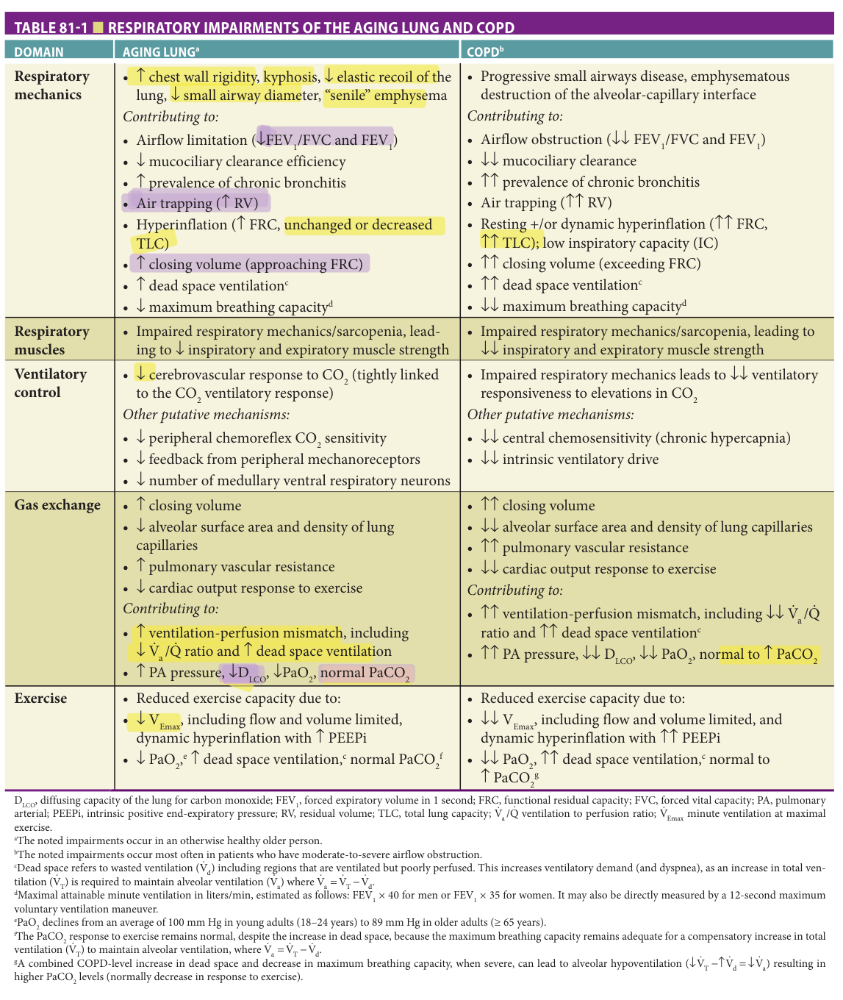

> *Table 81-1 reproduced as a page image (printed p. 1238) — the grid did not extract reliably as text for this fast build.*

> Highlighting is the owner's annotation, not the book's.

Darterial; PEEPi, intrinsic positive end-expiratory pressure; RV, residual volume; TLC, total lung capacity; LCO, diffusing capacity of the lung for carbon monoxide; FEV1, forced expiratory volume in 1 second; FRC, functional residual capacity; FVC, forced vital capacity; PA, pulmonary V a /Q  ventilation to perfusion ratio; V Emax minute ventilation at maximal exercise. aThe noted impairments occur in an otherwise healthy older person. bThe noted impairments occur most often in patients who have moderate-to-severe airflow obstruction. cDead space refers to wasted ventilation (  Vd) including regions that are ventilated but poorly perfused. This increases ventilatory demand (and dyspnea), as an increase in total ven  tilation (V T) is required to maintain alveolar ventilation (V a) where V a = VT − Vd. dMaximal attainable minute ventilation in liters/min, estimated as follows: FEV1 × 40 for men or FEV1 × 35 for women. It may also be directly measured by a 12-second maximum voluntary ventilation maneuver. ePaO2 declines from an average of 100 mm Hg in young adults (18–24 years) to 89 mm Hg in older adults (≥ 65 years). fThe PaCO2 response to exercise remains normal, despite the increase in dead space, because the maximum breathing capacity remains adequate for a compensatory increase in total   ventilation (gA combined COPD-level increase in dead space and decrease in maximum breathing capacity, when severe, can lead to alveolar hypoventilation (V T) to maintain alveolar ventilation, where V a = VT − Vd. ↓V  T −↑V  d = ↓V  a) resulting in higher PaCO2 levels (normally decrease in response to exercise).

(immunosenescence) and other cell senescence, decreased proteostasis, altered mitochondrial function, reduced telomere length, and increased proinflammatory cytokines and oxidative stress. Collectively, these changes render the aging lung more prone to injury such as that conferred by exposure to tobacco smoke, with decreased capacity for tissue repair. These issues will be considered further below.

## Histopathology Of COPD

COPD is a heterogeneous disease characterized by several distinct histopathologic features, involving structural changes in the conducting airways and/or alveoli. The relative contribution of these features varies among individuals, and the differing features often coexist. The most-

**[p. 1239]**
important structural changes in COPD include (1) mucus hypersecretion and large airways inflammation, (2) inflammatory remodeling and fibrosis of small distal bronchioles 2 mm in diameter (or less), and (3) emphysema. Chronic bronchitis is defined as chronic cough and sputum production for at least 3 months per year for 2 consecutive years. Mucus hypersecretion is the hallmark of chronic bronchitis. These clinical features result from goblet cell hyperplasia in large and small airways, mucociliary dysfunction, and persistent neutrophil-predominant large airway inflammation. Mucus hypersecretion worsens airflow obstruction and predisposes to bacterial infection. Bronchiectasis, which is present in up to 30% of patients with COPD, is an additional mechanism that may underlie chronic cough and sputum production. A second key histopathologic feature of COPD is remodeling of small bronchioles < 2 mm in diameter. This is characterized by airway wall inflammation (CD8+T cell- CD20+B cell- and macrophage-predominant) and intralumenal mucus-containing inflammatory exudates as well as thickened airway walls and peribronchiolar fibrosis; collectively, these processes narrow the airway lumen. Emphysema, or loss of intact - alveoli with enlargement of alveolar spaces, is the third key histologic feature of COPD. Emphysema may be centrilobular (the typical pattern related to tobacco smoke exposure), panacinar (typical in α1-antitrypsin deficiency), or paraseptal in distribution. The distribution and severity of emphysema vary, and may worsen over time. A decrease in the number and total cross-sectional area of terminal bronchioles appears to precede emphysematous destruction. Some individuals develop “bullae”—large air-filled sacs greater than 1 to 2 cm in diameter.

## Pathogenesis Of COPD

The pathogenesis of COPD is incompletely understood, especially in the context of the aging lung, varying environmental exposures, and different trajectories of acquiring the disease. The long-standing paradigms of COPD pathogenesis generally fall into three categories: (1) antioxidant/oxidant imbalance, (2) antiprotease/protease imbalance, and (3) inflammation. Early focus on these issues resulted from compelling animal models in which candidate gene identification included α1-antitrypsin (α1-AT), macrophage elastase, surfactant D, microsomal epoxide hydrolase, Nrf2, matrix metallo• -- proteases, as well as cathepsins.

Most of these studies addressed the early, initiating phases of COPD development. However, COPD develops over decades despite smoking cessation, thought to be due to “progression” and “consolidation” phases of disease in genetically susceptible hosts. **Table 81-2** summarizes current understanding of COPD pathogenesis, in which, in addition to the three key mechanisms noted above, accelerated aging, aberrant immune responses, dysregulated tissue repair, and chronic viral infection have emerging

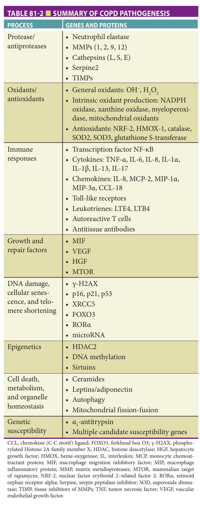

> *Table 81-2 reproduced as a page image (printed p. 1239) — the grid did not extract reliably as text for this fast build.*

> Highlighting is the owner's annotation, not the book's.

CCL, chemokine (C-C motif) ligand; FOXO3, forkhead box O3; γ-H2AX, phosphorylated Histone 2A family member X; HDAC, histone deacetylase; HGF, hepatocyte growth factor; HMOX, heme-oxygenase; IL, interleukin; MCP, monocyte chemoattractant protein; MIF, macrophage migration inhibitory factor; MIP, macrophage inflammatory protein; MMP, matrix metalloproteases; MTOR, mammalian target of rapamycin; NRF-2, nuclear factor erythroid 2–related factor 2; RORα, retinoid orphan receptor alpha; Serpine, serpin peptidase inhibitor; SOD, superoxide dismutase; TIMP, tissue inhibitors of MMPs; TNF, tumor necrosis factor; VEGF, vascular endothelial growth factor.

roles. Genome-wide association studies have identified a wide array of genetic associations for COPD susceptibility and phenotypes beyond α1-AT deficiency (see Further Reading).

**[p. 1240]**
### Aspects Of Biologic Aging Also Found In COPD

Telomere length, which is a biomarker of cell aging, is shorter in lung cells from COPD patients compared with age-matched individuals without COPD. Genetic mouse models of accelerated aging also show chronic lung disease. Mutant _Klotho_ mice, which have a shortened lifespan and manifest signs of accelerated aging, exhibit emphysema despite normal lung development. Expression of the NAD-dependent deacetylase, SIRT1, a member of the sirtuin family that is implicated in caloric restrictionmediated lifespan extension and proinflammatory signaling, is decreased in emphysematous lungs. Cellular senescence and apoptosis are two age-related processes that also occur in COPD. Cellular senescence is increased by oxidative stress (such as that induced by tobacco smoke exposure and inflammation). Senescent cells can further active proinflammatory processes by activating the transcription factor NF-κB. Recent research has demonstrated that microRNAs (small noncoding RNA sequences) may play a role in cell senescence and impaired phagocytosis of apoptotic cells. Multiple studies have documented increased apoptosis in the lungs of patients with COPD and the resultant imbalance between apoptosis and tissue repair may underlie the development of emphysema.

Recent reports have identified innate immune molecules to be key regulators of age-related emphysema. There is functional overlap between immune responses to environmental and to invasive pathogens. The innate response constitutes the first phase of the immune response and is triggered by pattern-recognition receptors. Three main classes of recognition receptors activate the innate system: (1) the membrane-associated toll-like receptors (TLRs) recognize microbial components and ligands from damaged cells, (2) the NOD-like receptors (NLRs) are activated when stimuli enter the cytoplasm, and (3) the RIG-I-like receptors (RLRs) mediate cytoplasmic recognition of viral nuclei acids. Because immunosenescence contributes to susceptibility to infection and decreased vaccine responses in older adults, significant emphasis has been placed on immunology in understanding how aging affects the innate immune system. The roles of innate immune receptors in age-related lung disease have been reviewed elsewhere (see Further Reading).

Age-related loss of endogenous, protective immune molecules such as macrophage migration inhibitory factor (MIF) has recently been identified as a mechanism of emphysema in smokers and corroborated in mouse models. MIF exerts pleiotropic protective effects by modulating cellular senescence molecules, antioxidants (such as NRF-2), apoptosis, and key growth factors (such as VEGF). The loss of trophic factors (such as VEGF and Wnt signaling) found in lung samples from COPD patients are thought to lead to alveolar destruction and, potentially, the disappearance of the terminal airways in COPD. In addition to enhanced tissue destruction,

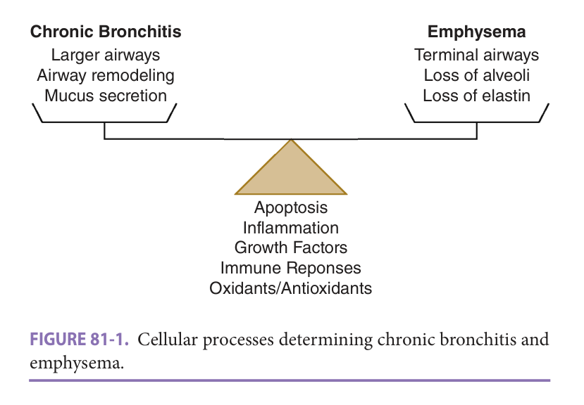

> *FIGURE 81-1. Cellular processes determining chronic bronchitis and emphysema.*

> Highlighting is the owner's annotation, not the book's.

the role of lung cell apoptosis has been highlighted by multiple studies. Enhanced cell death and inadequate regenerative responses including stem cell exhaustion, defective DNA repair, and decreased autophagy (removal of degraded proteins, damaged cells, or foreign pathogens) are pivotal to the progressive loss of gas exchange surface area in emphysema.

Most studies of COPD pathogenesis have focused primarily on emphysema rather than airway-predominant COPD and chronic bronchitis, but at least some of the same processes are likely involved ( **Figure 81-1** ). The paucity of animal models for chronic bronchitis has been a barrier. Mice, for instance, do not exhibit significant airway mucus secretion or airway remodeling typical of chronic bronchitis despite chronic cigarette exposure. However, studies of IL-13, VEGF, and IL-18 lung-targeted overexpressing mice in combination with clinical evidence of increased levels of these cytokines in smokers’ lungs have provided new venues for further study.

### Physiologic Impairments Resulting From Structural Changes In COPD

Several physiologic impairments result from the structural changes in the airways, alveoli, and chest wall in COPD. The respiratory impairments of COPD overlap with those of the aging lung, although in the presence of COPD (disease), they occur to a more severe extent (see **Table 81-1** ). Each of the structural changes in the airways (airway wall inflammation, mucus, bronchoconstriction and/or small airway remodeling) and/or alveoli (emphysema) results in obstruction to the flow of air. Other key physiologic impairments include air trapping and hyperinflation and gas exchange abnormalities.

Chronic airflow obstruction is most often established by serial spirometry (confirming limited reversibility). The major site of airflow obstruction in COPD is the aforementioned inflamed and remodeled small airways less than 2 mm in diameter. In addition, emphysematous destruction of alveoli increases airflow obstruction, through loss of alveolar attachments (and in turn loss of outward tethering on small bronchioles) and a decrease in the elastic recoil

**[p. 1241]**

of the lung. Bronchoconstriction is another contributor to airflow limitation, particularly during acute exacerbations of the disease.

Chronic airflow obstruction makes expiratory alveolar emptying increasingly difficult, resulting in air trapping and lung hyperinflation (measured clinically by helium dilution or whole-body plethysmography). Hyperinflation may be present at rest, particularly among those with severe airflow obstruction. Most individuals, even those with mild airflow obstruction, develop dynamic hyperinflation with exertion, when faster respiratory rates lead to insufficient time for exhalation to baseline endexpiratory lung volume. In combination, these impairments adversely affect (1) breathing patterns: flow and volume limited, with an increase in the intrinsic positive end-expiratory pressure (PEEPi); (2) respiratory muscle strength: the curvature of the diaphragm is reduced, altering length-tension relationships and thus decreasing the force generating capacity of the diaphragm; and (3) maximum breathing capacity (MBC): the maximal attainable minute ventilation is reduced, strongly correlating with a decrease in FEV1. The net effect is exercise intolerance, symptom-limiting dyspnea, and an increased risk of respiratory failure. Of note, anything that increases respiratory rate or work of breathing, including anxiety, hypoxemia, pain, or concurrent congestive heart failure (CHF), can lead to dynamic hyperinflation and significant worsening of respiratory symptoms. Additional common symptoms in COPD include cough, sputum production, sense of chest tightness, sleep disturbances, and fatigue. Sleep disturbances may include nocturnal hypoxemia, alveolar hypoventilation with increase in PaCO2, and/or concurrent obstructive sleep apnea (OSA).

Gas exchange abnormalities in COPD relate to ventilation-perfusion mismatch, owing to lung regions with a low ventilation-to-perfusion ratio or an increase in dead space (ventilated but underperfused)—these abnormalities relate to chronic airflow obstruction (leading to low V/Q areas) and alveolar-capillary destruction and air trapping (leading to high V/Q areas). Clinically, gas exchange abnormalities may be identified initially by a reduced diffusing capacity of the lung for carbon monoxide (DLCO) (adjusted for hemoglobin), suggesting emphysema when coexisting with airflow obstruction and hyperinflation. The reduced DLCO reflects loss of intact alveolar capillary surface area for gas exchange. In advanced COPD, based on the relative contributions of impairments in respiratory mechanics, respiratory muscle strength, and central chemosensitivity (see **Table 81-1** ), gas exchange abnormalities may progress to hypoxemia and hypercapnia, yielding a reduction in arterial oxygen content and an acute/chronic respiratory acidosis—these abnormalities define the presence of respiratory failure.

In addition, destruction of the alveolar-capillary interface with loss of pulmonary capillaries and hypoxic

pulmonary vasoconstriction (eg., resulting from rest- ing, exertion, and/or sleep-related hypoxemia) and other mechanisms can lead to pulmonary hypertension and right ventricular failure (cor pulmonale). Moreover, ventricular interdependence (right ventricular pressure and volume overload) and marked intrathoracic pressure swings (increased work of breathing, hyperinflation, air trapping, and PEEPi) can decrease left ventricular preload and increase left ventricular diastolic dysfunction, ultimately reducing the cardiac output. The latter amplifies the ventilation-perfusion mismatch of COPD and reduces systemic oxygen delivery, and volume overload may develop, thus worsening exercise intolerance and increasing the risk of respiratory failure.

## Comorbidities And COPD

COPD is also associated with several extrapulmonary impairments and comorbidities. Those involving the cardiovascular and musculoskeletal systems, in particular, overlap with those of normal aging ( **Table 81-3** ). Cardiovascular disease is one of the most common comorbidities seen. Hypertension, coronary artery disease, peripheral vascular disease, atrial fibrillation, and CHF (systolic and diastolic) occur frequently and in varying combinations. An estimated 40% of persons with COPD who require mechanical ventilation for hypercarbic respiratory failure due to COPD exacerbation have some (systolic and/or diastolic) left ventricular dysfunction. Skeletal muscle dysfunction, present in approximately 30% of people with COPD, is characterized by changes in muscle fiber structure and function (including reduction in type I endurance fibers with reduced oxidative enzyme capacity) that lead to reduced muscle mass, strength and endurance. Sarcopenia is present in an estimated 22% (up to 63% among those in nursing homes) and is associated with frailty. Older adults with COPD have an estimated twofold increased risk of frailty. Other common comorbidities include anxiety, depression, osteopenia and osteoporosis, arthritis, OSA, metabolic syndrome, anemia, respiratory infection, and lung cancer. Multiple pathogenic mechanisms underlie these comorbidities, including systemic inflammation, immune response, anorexia, deconditioning, and other factors. Importantly, several comorbidities typically coexist, and comorbidities increase the symptoms, functional disability, hospitalization, and mortality risk above that conferred by COPD alone. Clinicians should routinely assess individuals for these comorbidities.

Accordingly, the impairments imposed by advancing age and COPD (see **Tables 81-1** and **81-3** ) collectively increase the risk of having respiratory symptoms (dyspnea, chronic bronchitis, and wheezing), exercise intolerance, disability, hospitalization, respiratory failure, and death. ---

**[p. 1242]**
**Table 81-3 — Cardiovascular and musculoskeletal impairments of the aging person and COPD**

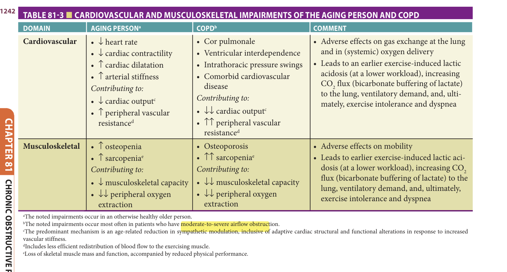

> *Table 81-3 reproduced as a page image (printed p. 1242) — the grid did not extract reliably as text for this fast build.*

> Highlighting is the owner's annotation, not the book's.

## Diagnosis

The diagnosis of COPD requires a compatible history (symptoms and risk factors), and spirometry to confirm the presence of airflow obstruction. Given the heterogeneity of the disease with regard to symptoms, structural changes in the lungs, comorbidities, exacerbations, and disease trajectory, a comprehensive approach to patient assessment (see **Table 81-4** ) and management is needed.

### Epidemiologic Surveys

Epidemiologic surveys of COPD are often based on symptoms of chronic bronchitis or physician-diagnosed emphysema/ COPD. Prior work has shown, however, that two-thirds of persons who have symptoms of chronic bronchitis and half of those with physician-diagnosed emphysema/COPD have normal spirometry (do not have airflow obstruction). This relates to overlap between symptoms of chronic bronchitis (cough in particular) and those of other conditions (postnasal drip, acid reflux, etc) or being drug-induced, and to low utilization of spirometry in primary care settings. Moreover, patients may underreport symptoms, due to assumptions that dyspnea, fatigue, and exercise intolerance may be due to aging alone. Also, many alternate conditions lead to symptoms similar to those of COPD, including but not limited to other forms of lung disease, cardiac disease, dynamic upper airway obstruction, pulmonary embolus, and others. As a result of these issues, COPD is frequently both underdiagnosed and misdiagnosed.

**Spirometry** Given the above concerns, and because pathologic confirmation is invasive and not routinely

necessary or available, the clinical strategy for establishing a diagnosis of COPD is based on spirometry-confirmed chronic airflow obstruction (less than fully reversible). Spirometry can be performed conveniently with a portable, handheld device, using protocols from the American Thoracic and European Respiratory Societies (ATS/ERS). These protocols require performance of at least two FVC maneuvers that meet ATS/ERS acceptability criteria— FVC maneuver is defined as the maximal volume of air that is exhaled with maximal effort starting from maximal inspiration.

The most common spirometric measures of interest are the FEV1 and FVC, and the ratio between the two (FEV1/FVC). An additional measure is the forced expiratory volume in 6 seconds (FEV6), used as an estimate of - FVC. Although the FEV - 6 is more reproducible and less physically demanding than the FVC, it is limited when distinguishing normal spirometry from a restrictive impairment, and predicted values are currently unavailable for those older than age 80.

**Establishing airflow obstruction** A reduced FEV1/FVC ratio establishes the presence of _airflow obstruction_ . However, given that healthy age-related _airflow limitation_ is also characterized by a reduced FEV1/FVC, the threshold that establishes _airflow obstruction_ must account for normal aging, including increased variability in spirometric performance (at least 50% greater in healthy 80-year-olds than healthy 40-year-olds).

To account for age-related changes in lung function, the ATS/ERS recommend that airflow obstruction be established by a lower limit of normal (LLN) threshold for

**[p. 1243]**

**Table 81-4 — Comprehensive assessment of the COPD patient**

- COPD risk factors
- Pulmonary function testing
  - Spirometry (recommended annually)
  - Lung volumes and diffusing capacity
- Imaging—consider CT scan
  - Disease characterization (+/or lung cancer screening)
- Symptom assessment
  - MRC dyspnea score
  - COPD assessment test (www.catestonline.org)
  - Clinical COPD questionnaire (CCQ) (www.ccq.nl)
- Exercise tolerance: 6-minute walk test, shuttle walk test, or cycle/treadmill test
- Oxygenation/gas exchange
- Exacerbation risk (history): frequency, severity, possible triggers/causes
- α1-Antitrypsin level and phenotype
- Comorbidities (CBC with differential [check also for blood eosinophilia], echocardiogram, stress testing, sleep, bone density, etc)
- Consider use of multidimensional disease assessment index, eg,
  - BODE Score (BMI, FEV1% pred, MRC dyspnea, 6MWD) (Celli BR, Cote CG, Marin JM, et al. The body-mass index, airflow obstruction, dyspnea, and exercise capacity index in chronic obstructive pulmonary disease. _N Engl J Med._ 2004;350(10):1005–1012).
  - ADO Index (age, dyspnea, airflow obstruction) (Puhan MA, Garcia-Aymerich J, Frey M, et al. Expansion of the prognostic assessment of patients with chronic obstructive pulmonary disease: the updated BODE index and the ADO index. _Lancet_. 2009;374:704–711).
  - COTE Index (COPD Comorbidity Test) (deTorres JP, Casanova C, Marín JM, et al. Prognostic evaluation of COPD patients: GOLD 2011 versus BODE and the COPD comorbidity index COTE. _Thorax_. 2014;69(9):799–804).

FEV1/FVC. The ATS/ERS approach currently defines the LLN as the fifth percentile distribution of reference values, calculated in a population of healthy never-smokers --matched for age, height, sex, and ethnicity (these predict normal lung function). In the United States, reference values are often based on equations from the Third National Health and Nutrition Examination Survey (NHANES III). - Although these account for age-related declines in lung function, the NHANES III equations are limited to those age 80 or younger, and do not consider variability in spirometric performance. Hence, the GLI has recommended that the LLN be instead defined as the fifth percentile distribution of Z-scores (Z-score of –1.64) ( **Table 81-5** ). The GLI calculated Z-scores account for the age-related decline in lung function and increased variability in spirometric performance and use reference equations that include Americans and many other ethnicities (worldwide), as well as age range of up to 95. Prior work has shown that airflow

obstruction defined by an FEV1/FVC Z-score less than –1.64 is associated with respiratory symptoms, impaired mobility, frailty status, COPD hospitalization, and mortality. Moreover, Z-scores have a strong clinical precedence, given their use in bone mineral density testing and pediatric growth charts.

**Assessing the severity of airflow obstruction** After establishing a reduced FEV1/FVC: Current practice stages the severity of airflow obstruction based on FEV1 expressed as percent predicted (%Pred): [measured/predicted] × 100%. The ATS/ERS recommend the thresholds for FEV1 of 70 and 50 %Pred when staging airflow obstruction (see **Table 81-5** ). This approach has age-related limitations, however, since %Pred assumes incorrectly the equivalence of spirometric variability across the adult lifespan. To address this limitation, GLI-calculated FEV1 Z-scores may be used to stage the severity of airflow obstruction (see **Table 81-5** ). Prior work has shown that Z-score thresholds for FEV1 have a graded association with respiratory symptoms, COPD hospitalization, and mortality.

**The Global Initiative for Obstructive Lung Disease** Despite age-related limitations in methodology, the most often used - spirometric criteria for establishing and staging airflow obstruction are based on GOLD Report (see **Table 81-5** ). The age-related limitations of the GOLD Report include two fundamental flaws. First, GOLD defines a reduced - FEV1/FVC by a fixed ratio less than 0.70, thus failing to distinguish between age-related airflow limitation (normal aging-related process) and COPD-related airflow obstruction (connoting the presence of disease). In particular, an FEV1/FVC less than 0.70 is frequently seen in otherwise healthy, asymptomatic never-smokers who are age 65 or older. Second, GOLD expresses the FEV1 as %Pred, thus failing to account for age-related variability in spirometric performance. It is therefore not surprising that the prevalence of airflow obstruction in older persons is more than twofold higher when defined by GOLD versus a Z-score approach (37.7% vs 15.4%, respectively). Prior work has shown that the overdiagnosis of airflow obstruction by GOLD is not associated with respiratory symptoms, exercise intolerance, impaired mobility, COPD hospitalization, or mortality. Third, several conditions such as kyphosis, weak respiratory muscles, obesity—all common among older adults—can lower the FVC, hence reduce the FEV1/ FVC ratio, and underlying COPD may be “masked” in such individuals.

**Bronchodilator reversibility** COPD is defined as chronic airflow obstruction that is less than fully reversible. However, up to two-thirds of individuals with COPD may have a partial component of bronchodilator (BD) reversibility. Clinical guidelines therefore recommend that spirometry should be performed before and after administration of an inhaled BD (pre- and post-BD, respectively) in order to establish (1) reversibility (pre- vs post-BD values) and (2) diagnosis of COPD (using post-BD values). Among older --

**[p. 1244]**
**Table 81-5 — Spirometric criteria for establishing and staging chronic airflow obstruction**

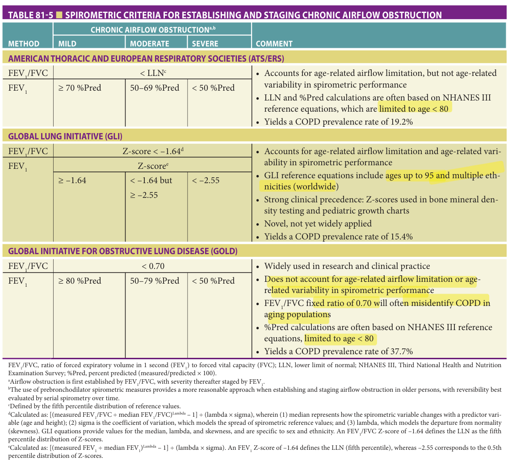

> *Table 81-5 reproduced as a page image (printed p. 1244) — the grid did not extract reliably as text for this fast build.*

> Highlighting is the owner's annotation, not the book's.

FEV1/FVC, ratio of forced expiratory volume in 1 second (FEV1) to forced vital capacity (FVC); LLN, lower limit of normal; NHANES III, Third National Health and Nutrition Examination Survey; %Pred, percent predicted (measured/predicted × 100). aAirflow obstruction is first established by FEV1/FVC, with severity thereafter staged by FEV1. bThe use of prebronchodilator spirometric measures provides a more reasonable approach when establishing and staging airflow obstruction in older persons, with reversibility best evaluated by serial spirometry over time. cDefined by the fifth percentile distribution of reference values. dCalculated as: [(measured FEV1/FVC ÷ median FEV1/FVC)Lambda – 1] ÷ (lambda × sigma), wherein (1) median represents how the spirometric variable changes with a predictor variable (age and height); (2) sigma is the coefficient of variation, which models the spread of spirometric reference values; and (3) lambda, which models the departure from normality (skewness). GLI equations provide values for the median, lambda, and skewness, and are specific to sex and ethnicity. An FEV1/FVC Z-score of –1.64 defines the LLN as the fifth percentile distribution of Z-scores. eCalculated as: [(measured FEV1 ÷ median FEV1)Lambda – 1] ÷ (lambda × sigma). An FEV1 Z-score of –1.64 defines the LLN (fifth percentile), whereas –2.55 corresponds to the 0.5th percentile distribution of Z-scores.

persons, however, this approach has two disadvantages. First, older persons have limited capacity to perform multiple FVC maneuvers, and may have an adverse response to an inhaled BD. Second, post-BD values have limited clinical relevance in distinguishing COPD from asthma, and have low reproducibility over time. Hence, the use of pre-BD values provides a reasonable approach when diagnosing and staging COPD in older persons where necessary, with limited reversibility best established by serial spirometry over time.

### Additional Considerations

Although chronic airflow obstruction is currently considered a necessary and sufficient criterion for defining COPD, there are additional problems with this approach. First, individuals with symptoms of chronic bronchitis and history of COPD-relevant exposures and other risk factors

may lack spirometric airflow obstruction, yet have lower exercise capacity, increased risk of disease exacerbation, development of impaired lung function over time, and increased mortality risk. As such, these persons should be monitored over time. Second, as noted above, other individuals with COPD-relevant risk factors have preserved normal FEV1/FVC ratio (owing to various factors), yet have radiologic features of COPD (including emphysema and/or chronically inflamed airways). Those with normal FEV1/ FVC ratio, with low FEV1 and evidence of inflammatory airways disease are at risk of disease progression. The term PRISm (preserved ratio, impaired spirometry) is used to define this group of people.

Given the limitations of spirometry alone in establishing the diagnosis of COPD, some health care professionals advocate for an updated, alternate schema for establishing the diagnosis of COPD, in which symptoms,

**[p. 1245]**
**Table 81-6 — Respiratory impairments that are commonly evaluated to establish a diagnosis of COPD**

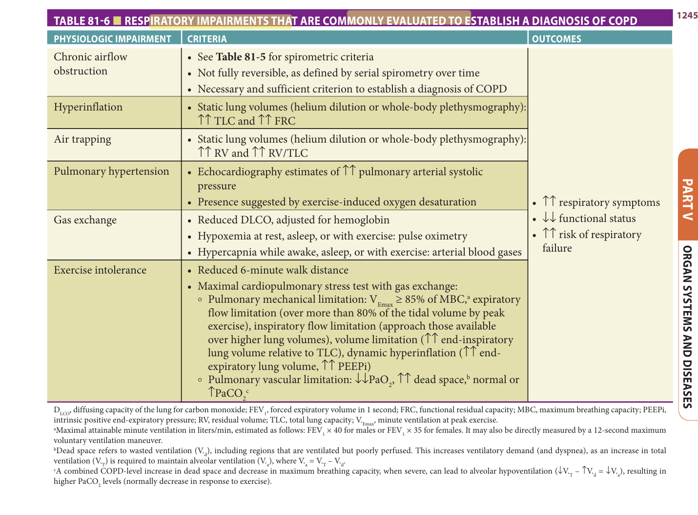

> *Table 81-6 reproduced as a page image (printed p. 1245) — the grid did not extract reliably as text for this fast build.*

> Highlighting is the owner's annotation, not the book's.

relevant exposures, spirometry, and radiologic (CT scan) features all play a key role (see Further Reading). Use of such an approach leads to establishment of the diagnosis in a much larger population of people as compared with use of lung function testing alone. It would also have major implications for identification/selection/inclusion of participants for clinical trials of therapeutic interventions in COPD. Further research is needed to determine the impact of current therapies for COPD among those with chronic bronchitis and/or radiologic features of COPD without airflow obstruction, and those with PRISm. Currently, the diagnostic evaluation should assess additional respiratory impairments, as these further confirm COPD and are associated with adverse outcomes ( **Table 81-6** ).

Lastly, several subgroups (“phenotypes”) of COPD with distinct features are recognized ( **Table 81-7** ). While the pathobiologic processes underlying these different groups is incompletely understood, combining the physiologic respiratory impairments with clinical and radiologic features further establishes clinical phenotypes and informs more personalized COPD-related treatment options and prognosis ( **Table 81-7** ). Additional assessments that should

be made routinely include measurement of peripheral blood eosinophil count and serum α1-AT level (and phenotype), because these features both characterize patients and inform specific aspects of disease management.

## Clinical Manifestations

Because of shared risk factors (eg, tobacco smoke) and sequelae of progressive chronic disease, COPD is often associated with a high burden of symptoms and medical issues, as discussed above and as shown in **Table 81-8** . Typical symptoms of COPD include dyspnea, cough, sputum production, wheezing, fatigue, activity limitation, and sleep disturbances. The clinical course of COPD is further characterized by acute exacerbations that cycle between chronic and acute care settings, leading to accelerated declines in lung function and increases in medical burden (these are discussed further below). Importantly, spirometric measures and FEV1 alone are insufficient to characterize the impact and burden of COPD on patients.

**[p. 1246]**

**Table 81-7 — COPD clinical subgroups (phenotypes)**

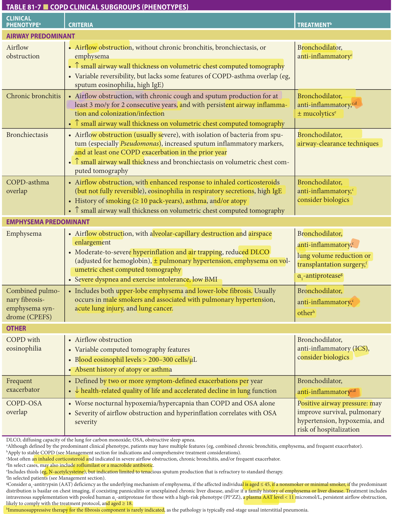

> *Table 81-7 reproduced as a page image (printed p. 1246) — the grid did not extract reliably as text for this fast build.*

> Highlighting is the owner's annotation, not the book's.

DLCO, diffusing capacity of the lung for carbon monoxide; OSA, obstructive sleep apnea.

aAlthough defined by the predominant clinical phenotype, patients may have multiple features (eg, combined chronic bronchitis, emphysema, and frequent exacerbator). bApply to stable COPD (see Management section for indications and comprehensive treatment considerations). cMost often an inhaled corticosteroid and indicated in severe airflow obstruction, chronic bronchitis, and/or frequent exacerbator. dIn select cases, may also include roflumilast or a macrolide antibiotic. eIncludes thiols (eg, N-acetylcysteine), but indication limited to tenacious sputum production that is refractory to standard therapy. fIn selected patients (see Management section). gConsider α1-antitrypsin (AAT) deficiency as the underlying mechanism of emphysema, if the affected individual is aged ≤ 45, if a nonsmoker or minimal smoker, if the predominant distribution is basilar on chest imaging, if coexisting panniculitis or unexplained chronic liver disease, and/or if a family history of emphysema or liver disease. Treatment includes intravenous supplementation with pooled human α1-antiprotease for those with a high-risk phenotype (PI*ZZ), a plasma AAT level < 11 micromol/L, persistent airflow obstruction, likely to comply with the treatment protocol, and aged ≥ 18.

hImmunosuppressive therapy for the fibrosis component is rarely indicated, as the pathology is typically end-stage usual interstitial pneumonia.

**[p. 1247]**

**Table 81-8 — Medical burden of COPD**

- COPD patients average 3.7 chronic conditions and 35 filled prescriptions over a given year.
- Most frequent comorbidities in COPD are hypertension, diabetes mellitus, cardiovascular (heart failure, coronary artery disease, arrhythmias, stroke, and peripheral artery disease), psychiatric (depression and anxiety), sarcopenia (decreased skeletal muscle mass and function), osteoporosis, anemia, and lung cancer. Moreover, in response to untreated chronic hypoxemia, secondary erythrocytosis may also develop and contribute to pulmonary hypertension and reductions in cerebral and coronary blood flow.
- COPD-associated sequelae include severe deconditioning and weight loss (sarcopenia); disabling symptoms (dyspnea, chronic bronchitis, wheezing, and fatigue); multiple sensory, cognitive, and mobility impairments; limitations in activities of daily living; and social isolation. Regarding cognitive impairment, this is more prevalent in COPD patients who are oxygen dependent and have limitations in physical function (eg, difficulties in performing household chores).
- Clinical course of COPD is characterized by exacerbations that cycle between chronic and acute care settings, leading to progressive declines in lung function and further increases in medical burden.
- Advancing age further increases the likelihood of multimorbidity and polypharmacy, including the complicating sequelae of multifactorial geriatric health conditions.

COPD, chronic obstructive pulmonary disease; FEV1, forced expiratory volume in 1 second.

Overall impact and prognosis of COPD are informed by the BODE Index, which includes the body mass index (B) as a measure of nutritional status, FEV1 as a measure of the severity of airflow obstruction (O), Medical Research Council score as a measure of the severity of dyspnea (D), and 6-minute walk distance as a measure of exercise (E) capacity.

Advancing age additionally increases the likelihood that comorbidities unrelated to chronic airflow obstruction will complicate the clinical course of COPD. For example, a postmortem examination of the cause of death in 43 older persons hospitalized for COPD exacerbation included heart failure in 16 (37%) and pulmonary thromboembolism in 9 (21%). The age-related predisposition for polypharmacy may also adversely affect COPD: (1) opiates and benzodiazepines may decrease ventilatory control and increase the risk of aspiration; (2) statins may have a myopathic effect on the muscles of respiration and ambulation; and (3) β-blockers may exacerbate underlying heart failure and bradycardia. The interaction between these adverse medication effects and age-related reductions in physiologic capacity, including respiratory and cardiovascular impairments (see **Tables 81-1** and **81-3** ), may contribute to pneumonia (28%) and respiratory failure (14%), as additional causes of death among older persons hospitalized for COPD exacerbation.

Lastly, advancing age is characterized by multifactorial geriatric health conditions, such as cognitive and physical impairments (including delirium, balance impairment, and injurious falls), sleep disorders, incontinence, frailty

(sarcopenia), malnutrition, and chronic pain and dyspnea. These frequently represent sequelae of multimorbidity, polypharmacy, sedentary status, psychologic disturbances, and social isolation. Importantly, polypharmacy and complex treatment regimens (which may include oxygen and/ or noninvasive ventilation) may impact adherence to medications, in turn affecting disease control. Thus, a comprehensive approach is needed when managing COPD, particularly in older persons.

## Management Of Stable COPD

The goals of care for stable COPD are to relieve and minimize symptoms, optimize exercise/activity tolerance and health status, and reduce the risk of exacerbations, disease progression, and mortality. To achieve these goals, decisions regarding treatment strategies should consider the predominant clinical phenotype of COPD (see **Table 81-7** ), including the severity of corresponding impairments (see **Tables 81-3** through **81-6** ), as well as the accompanying medical comorbidities (see **Table 81-8** ). Ultimately, treatment options are calibrated to patient preferences, needs, and advance directives, and appropriately modified when the clinical trajectory progresses to advanced COPD.

### Pharmacologic Therapies

**Treatment options** Medication regimens should consider the patient’s skills/abilities, peak inspiratory flow (PIF) rate, the questions in **Table 81-9** , and the algorithm in **Figure 81-2** . Prioritization is given to once-daily administration, self-contained inhaler devices, educating the patient/caregiver on medication administration, and ensuring the patient has adequate PIF rate to entrain the medication. **Table 81-10** summarizes currently available medications, emphasizing benefits, side effects, and complexity. In stable COPD, pharmacologic therapy should follow a stepwise approach that for some patients may lead to use of triple-inhaler maintenance therapy, including two classes of long-acting inhaled bronchodilators (β2-selective adrenergic agonist and anticholinergic) and an inhaled corticosteroid, as well as prn use of a rescue inhaler (short-acting β2-agonist). Additional options include roflumilast, macrolides, vibratory positive expiratory pressure (PEP) devices, and mucolytics. Some individuals may also benefit from biologic monoclonal antibody therapies. A stepwise treatment approach to pharmacotherapy used commonly for those with confirmed airflow obstruction, based on symptom severity and disease exacerbations, is provided in the GOLD Report (see Further Reading).

**Table 81-9 — Device selection considerations in older persons with COPD**

- Who will be administering the dose?
- Can the patient demonstrate proper "press and breathe" technique?
- Can delivery devices be easily confused?
- Does the product require a spacer or "valved holding chamber" device?
- Can the patient afford this medication?
- Does the patient have existing problems with medication adherence?
- Does the device require adequate dexterity or grip strength to use?
- Can the patient manage complex tasks?
- Is the patient capable of maintaining and cleaning the delivery device?
- Does the patient have a sufficient peak inspiratory flow?

**[p. 1248]**

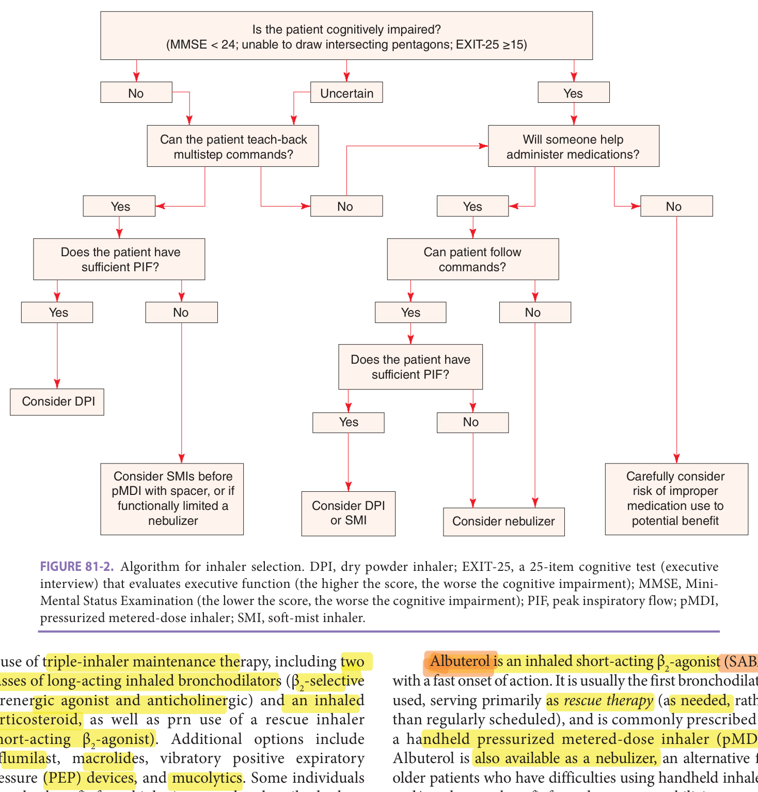

> *FIGURE 81-2. Algorithm for inhaler selection. DPI, dry powder inhaler; EXIT-25, a 25-item cognitive test (executive interview) that evaluates executive function (the higher the score, the worse the cognitive impairment); MMSE, Mini-Mental Status Examination (the lower the score, the worse the cognitive impairment); PIF, peak inspiratory flow; pMDI, pressurized metered-dose inhaler; SMI, soft-mist inhaler.*

> Highlighting is the owner's annotation, not the book's.

**_Short-Acting Bronchodilators_** Bronchodilators are a mainstay of the treatment of stable COPD, irrespective of clinical phenotype, as they achieve improvements in symptoms, exercise capacity, and airflow obstruction. Inhaled bronchodilators are preferred over oral agents, based on efficacy and side effects, and aging itself does not reduce the bronchodilator response. Notably, bronchodilators are effective in spite of patients’ fixed, irreversible airflow obstruction; they reduce dynamic hyperinflation and end-expiratory lung volume and improve inspiratory capacity and patients’ breathing pattern.

Albuterol is an inhaled short-acting β2-agonist (SABA) with a fast onset of action. It is usually the first bronchodilator used, serving primarily as _rescue therapy_ (as needed, rather than regularly scheduled), and is commonly prescribed as a handheld pressurized metered-dose inhaler (pMDI). Albuterol is also available as a nebulizer, an alternative for older patients who have difficulties using handheld inhalers and/or who may benefit from the mucus-mobilizing properties of this therapy. Patients/caregivers should be advised to always have albuterol readily available in the event of acute worsening of symptoms (dyspnea) that does not improve with rest and use of slow, pursed lips breathing. Individuals with visual impairment should mark albuterol pMDIs to avoid confusion with other inhalers. Common side effects of SABAs are listed in **Table 81-10** , with concerns especially raised in people with COPD and concurrent cardiovascular disease (especially hypertension or tachyarrhythmias), coexisting asthma (mortality), and excessive dosing.

The anticholinergic ipratropium is a short-acting inhaled bronchodilator, with little systemic absorption. It is indicated as _maintenance therapy_ (see **Table 81-10** ), but adherence is problematic because it requires frequent dosing (4 times daily). Hence, ipratropium is often combined with

**[p. 1249]**

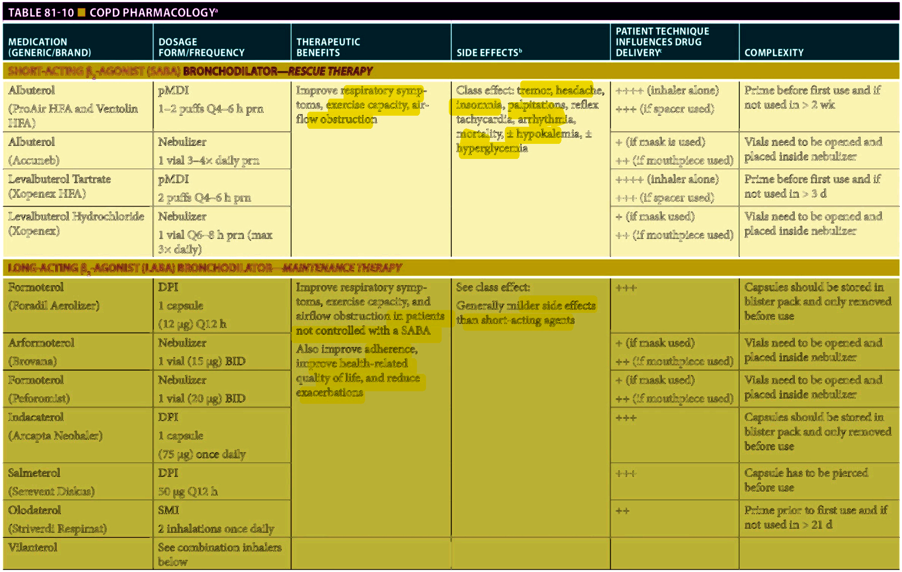

> *Table 81-10 reproduced as a page image (printed p. 1249) — the grid did not extract reliably as text for this fast build.*

> Highlighting is the owner's annotation, not the book's.

**[p. 1250]**

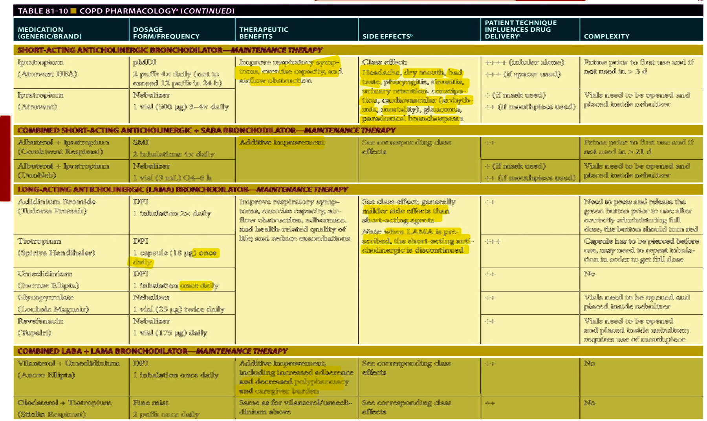

> *Table 81-10 reproduced as a page image (printed p. 1250) — the grid did not extract reliably as text for this fast build.*

> Highlighting is the owner's annotation, not the book's.

**[p. 1251]**

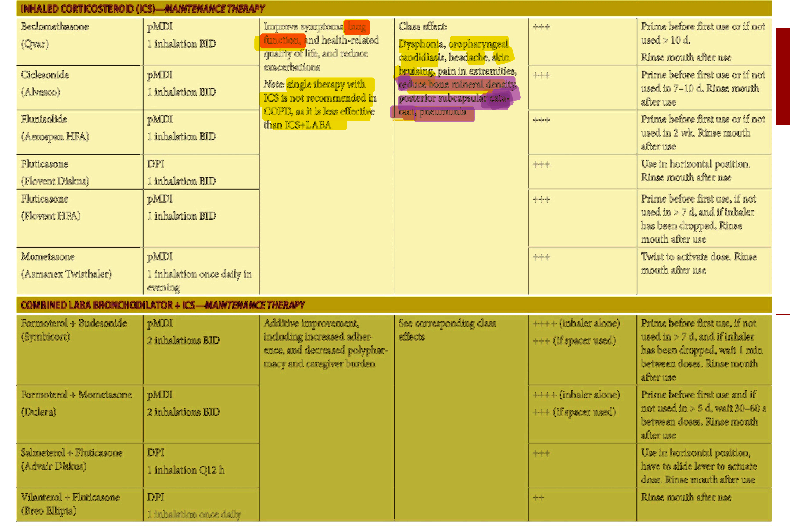

> *Table 81-10 reproduced as a page image (printed p. 1251) — the grid did not extract reliably as text for this fast build.*

> Highlighting is the owner's annotation, not the book's.

**[p. 1252]**

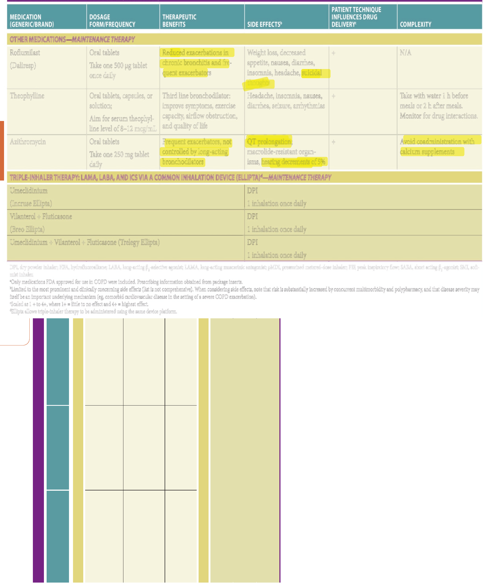

> *Table 81-10 reproduced as a page image (printed p. 1252) — the grid did not extract reliably as text for this fast build.*

> Highlighting is the owner's annotation, not the book's.

**[p. 1253]**

albuterol as a nebulized solution, particularly in long-term care and hospital settings. Combined ipratropium and albuterol is also available as a soft-mist inhaler (SMI). Common side effects of short-acting anticholinergics are listed in **Table 81-10** , with concerns especially raised in COPD patients with cardiovascular disease (especially bradyarrhythmias), narrow-angle glaucoma, benign prostatic hyperplasia with urinary retention, and severe constipation.

**_Long-Acting Bronchodilators_** Long-acting β2-selective adrenergic agonists (LABA—formoterol, arformoterol, indacaterol, olodaterol, vilanterol) and long-acting anticholinergics (including the long-acting muscarinic antagonists [LAMA]— - aclidinium, tiotropium, umeclidinium, glycopyrrolate, -- and revefenacin) are considered _maintenance therapy_ (see **Table 81-10** ) for persons whose symptoms are inadequately controlled with one or both classes of short-acting bronchodilator(s), and for those with frequent exacerbations or have moderate-to-severe airflow obstruction. Subsequent to initiating a long-acting bronchodilator, there is a continued role for a short-acting β2-agonist (SABA) in the management of acute symptoms (rescue therapy). LAMA are typically used as the first-line long-acting bronchodilators due to their greater reduction in exacerbation risk as compared with LABA. Ultimately, however, the choice of initial class of LABD depends on patients’ comorbidities, preferences (vis-à-vis symptom relief and side effects), and insurance coverage for the medication. For persons whose symptoms are inadequately controlled and/or who have disease exacerbations despite one class of LABD, the other class is typically added if safe to do so. Dual class BD treatment improves lung function, symptom control, and reduces exacerbation risk to a greater extent than that achieved with single BD agents.

Long-acting BD are usually delivered by handheld inhalers. Long-acting nebulized BD (eg, twice-daily β2-selective adrenergic agonist [arformoterol, formoterol]) and/or long-acting anticholinergics (glycopyrrolate, revefenacin) are an option for persons who are unable to use or gain benefit from handheld inhaler devices (see treatment barriers, discussed further below). Of note, an increased risk of cardiovascular events was demonstrated in a large cohort study within 30 days of new initiation of LABA and/ or LAMA therapy; hence, patients should be monitored especially carefully during this period.

**_Inhaled Corticosteroids_** Oral corticosteroids are not indicated in stable COPD due to multiple side effects. Long-term treatments with inhaled corticosteroids (ICS) have an important role in patients with frequent exacerbations not adequately managed by a long-acting β2-selective adrenergic agonist (LABA) and/or anticholinergic (LAMA), who have been hospitalized for COPD exacerbation or who have concomitant asthma. Some people with COPD (nearly 40% in the ECLIPSE Study Cohort) have peripheral blood eosinophilia in the absence of atopy, allergy

- or asthma. Recent evidence suggests ICS combined with LABA are also an important component of treatment,

reducing exacerbations and hospitalizations for those with absolute eosinophil count greater than or equal to 300 cells/mL and a high symptom burden and frequent exacerbations (GOLD Group D). However, in contrast to asthma, the use of ICS as single therapy is not advised in stable COPD, since in general, airway inflammation in COPD is less steroid-responsive than in asthma, and where used in COPD, it is more effective when combined with inhaled LABA. For those with COPD who experience exacerbations despite dual class LABD, addition of ICS improves respiratory symptoms, lung function, and health-related quality of life, (QOL) as well as reduces exacerbations. Recent data from two large randomized controlled trials (RCTs) also show a survival benefit of “triple therapy” (LABA/LAMA/ICS) among individuals with frequent exacerbations (eg, > 2 per year).

The adverse effects of ICS are dose- and durationdependent, and influenced by patient-specific factors, specifically inhaler technique. While ICS doses are lower than oral corticosteroids, the duration of therapy is often lifelong, leading to longer exposures. Significant localized deposition of ICSs occurs in the oropharynx (60%–90% of dose) and may lead to dysphonia, oropharyngeal candidiasis, and allergic contact dermatitis of the mouth, nostrils, and eyes. Poor inhaler technique and suboptimal mouth care may increase the risk for these localized adverse drug effects. For example, older adults who forget to rinse, gargle, and spit after using their ICS are more likely to develop dysphonia and/or oral and/or esophageal candidiasis. Once swallowed, the remaining ICS is absorbed from the gastrointestinal tract, undergoes first-pass metabolism, and the majority of the dose is inactivated. What is not inactivated is available systemically and contributes to potential adverse effects. Predicting the degree of systemic glucocorticoid activity from ICS is difficult. Factors that influence risk from systemic glucocorticoid activity include advanced age, sex, cigarette smoking, activity level, and dietary cal-cium and vitamin D intake.

The systemic adverse effects of ICS are well described. Several have unique implications in older COPD patients. In particular, ICS are associated with decreased bone mineral density and posterior subcapsular cataract development, both of which can increase the risk of injurious falls in older adults. While studies examining the impact of ICSs on the risk of osteoporosis are mixed, doses above 1000 mcg/day of fluticasone or equivalent appear to be associated with accelerated loss of bone mineral density, and increased risk of fracture. Hence, osteoporosis prevention therapy should be considered for any patient receiving long-term ICS. Though subcapsular cataracts are clearly linked to systemic glucocorticoids, causality with ICS is less clear (with advancing illness, patients are more likely to receive both oral and ICS). In addition to increasing the risk of falls, visual impairment

**[p. 1254]**
due to cataracts can also contribute to medication errors and difficulty with proper inhaler technique. Capillary fragility, with easy bruising of the skin and risk of skin tears, is also associated with long-term ICS use.

Importantly, meta-analyses of RCT and a large casecontrol study have observed an increase (1.2–1.6-fold) in the risk of pneumonia associated with ICS; although prior work showed that the use of ICS did not increase mortality in veterans hospitalized with COPD and pneumonia, it remains prudent to consider discontinuation of ICS among COPD patients who develop pneumonia. The pneumonia risk is greatest among those with older age, frailty and low BMI, high ICS dose and blood eosinophils < 100 cells/mL. Long-term ICS use in COPD has also been associated with increased incidence of atypical mycobacterial infection (such as mycobacterium avium intracellulare), which can lead to symptom exacerbation (including cough, sputum production), worsening airflow obstruction (due to airway inflammation and mucus plugging), bronchiectasis, pulmonary infiltrates, and worse gas exchange. Clinicians should be aware of this association and obtain sputum samples for AFB stain and culture where needed. Lastly, chronic ICS use is associated with tracheobronchomalacia (TBM), with dynamic central airway obstruction. This can mimic symptoms and spirometric features of COPD, but does not respond to typical bronchodilator therapy; consideration of noninvasive ventilation may be needed. Otherwise, whether a specific ICS or delivery device poses greater risk has been inconclusive. Withdrawal of ICS can be considered for persons with blood eosinophils < 300 cells/mL (and especially if < 100 cells/mL, or those who demonstrate prolonged periods of time (eg, > 1 year) free of exacerbations.

**_Combination Inhalers_ Table 81-10** presents inhalers that combine (1) a β2-selective adrenergic agonist and an anticholinergic, (2) a β _ .. 2-selective adrenergic agonist and ICS, or (3) a β2-selective adrenergic agonist, anticholinergic, and ICS. Combination therapy provides additional benefit on lung function, symptoms, exercise capacity, and - exacerbation risk as compared with its components, particularly in patients who have severe airflow obstruction and/or who have frequent exacerbations. Triple LABA/ - LAMA/ICS further improves lung function, reduces moderate to severe exacerbations, improves QOL, and as noted above, may confer a mortality benefit for those with frequent exacerbations despite taking dual class LABA/LAMA therapy.

**_Roflumilast_** Roflumilast is a once-daily oral phosphodiesterase-4 inhibitor, serving as maintenance therapy to prevent COPD exacerbations in patients with severe airflow obstruction (FEV1 < 50% of predicted), chronic bronchitis, and a history of exacerbations (despite standard inhaled bronchodilator therapy). Common side effects include nausea, diarrhea, and weight loss, occurring at higher rates in those aged greater than or equal to 65. It is not effective -~ -

in reducing exacerbations amongst those with emphysemapredominant COPD.

**_Macrolides_** Azithromycin (250 mg once daily or three times weekly) is a macrolide antibiotic that has been shown to decrease the frequency of COPD exacerbations when added to usual care among former tobacco smokers. This effect is accompanied by an improved QOL, but also an increased incidence of macrolide-resistant organisms and hearing decrements. Maintenance azithromycin therapy may be considered for frequent exacerbators whose symptom escalation is thought primarily due to bouts of worsened airflow obstruction and airway inflammation (rather than other processes such as unrecognized hypoxemia or “dyspnea crisis”), who are maximized on triple-inhaler therapy and do not have a hearing impairment, resting tachycardia or other arrythmia, apparent risk of QTc prolongation, or clinical/radiographic evidence of nontuberculous mycobacterial infection. Since macrolide resistance can complicate treatment for nontuberculous mycobacteria (when needed), careful assessment for possible nontuberculous mycobacteria infection is warranted prior to considering regular use of macrolide therapy for routine COPD exacerbation prevention.

**_Mucolytics_** Based on low efficacy and increased risk of adverse effects, there is little evidence to support mucolytics (eg, N-acetylcysteine) as routine care for stable COPD. Hence, mucolytic use is limited to management of tenacious sputum production that is refractory to standard therapy (smoking cessation, inhaled BD and corticosteroid, antibiotics, and/or roflumilast). Although not proven to improve lung function or reduce exacerbations, some patients report symptom relief and increased ease of sputum clearance with regular or intermittent use of guaifenesin. Persons -- with severe airflow obstruction with chronic mucus production and those with bronchiectasis may benefit from a regular “airway clearance” routine, with nebulized albuterol (and/or hypertonic saline), followed by use of a vibratory PEP device. This can improve symptoms (dyspnea, cough, sputum production, and wheezing) and airflow and reduce frequency and/or severity of infectious exacerbations.

**_Biologic Monoclonal Antibody Therapies_** Owing to their success in the management of severe eosinophilic asthma, recent clinical trials have investigated the role of monoclonal antibody therapies (eg., omalizumab, benralizumab, mepolizumab, etc) in the treatment of COPD. A modest reduction in exacerbations has been found among individuals with COPD with elevated peripheral blood eosinophil counts, and history of frequent exacerbations despite triple LABA/ LAMA/ICS treatment. Results have varied across trials, and further work is needed to determine which patients may be best suited to receive these therapies.

**_Theophylline_** Theophylline is a nonselective phosphodiesterase inhibitor, available in multiple oral formulations. While it has small BD effect, affords symptom relief for some persons, and was formerly used commonly in the management of stable COPD, it is now usually NOT recommended

**[p. 1255]**

for routine management of COPD or COPD exacerbations, given the narrow therapeutic dose range, lack of efficacy, and high likelihood of side effects, which may include tremor, tachyarrhythmia, nausea, vomiting, jitteriness, and/or seizures. If used as a third or fourth line treatment, theophylline requires therapeutic drug monitoring with a goal serum level in older adults of 8 to 12 mcg/mL. Levels can increase significantly in the presence of cirrhosis, heart failure, hypothyroidism, and cimetidine. In older adults patients treated with theophylline, coadministration of ciprofloxacin (CYP1A2 inhibitor) is associated with a twofold increased risk of hospitalization. Conversely, theophylline levels decrease when hepatic enzymatic activity is increased as in hyperthyroidism, smoking, use of phenytoin, phenobarbital, and carbamazepine, or consumption of cruciferous vegetables and charbroiled meats.

**Treatment barriers** Medication nonadherence is reported in 50% to 60% of COPD patients. Nonadherence is associated with more frequent exacerbations, worsening of disease, and difficulty in reconciling medications. The causes of nonadherence include cognitive and physical impairments, cost, medication complexity, lack of perceived benefit, and adverse drug effects.

Cognitive and physical impairments leading to improper inhaler technique are considered further below.

**_Cognitive Impairment_** A Mini-Mental Status Examination (MMSE) score less than 24, inability to perform intersecting pentagons, and/or an EXIT-25 cognitive test score greater than or equal to 15 is associated with impaired ability to learn inhaler techniques. Requiring patients to “teach-back” inhaler technique may further identify those with difficulty performing multistep commands. Cognitive impairment often leads to uncoordinated “press and breathe” use of inhalers, as well as nonadherence. Consequently, nebulizers often replace handheld inhalers in cognitively impaired patients. Recently, electronic devices attached to inhalers have been introduced; these may help promote adherence by providing sound and/or light-based prompts.

**_Physical Impairment_** Many handheld inhalers require both fine-motor skills and adequate grip strength to actuate. This is especially problematic for certain pMDIs, dry powder inhalers (DPIs), and newer SMIs. Decreased hand strength, for example, is a predictor for incorrect use of a pMDI. The presence of arthritis, joint pain, or neuromuscular diseases may prevent proper use of handheld inhalers, by reducing grip strength or impairing dexterity. Impaired manual dexterity prevents patients from properly priming or preparing the inhaler/nebulizer, particularly if devices require removing capsules from foil packaging, mixing diluents with active agents, and puncturing capsules prior to inhalation.

Visual impairment can make distinguishing between products difficult (rescue inhaler versus maintenance inhaler) and negate the adherence feedback mechanisms built into certain devices (dosage counters). Individuals with impaired hearing may have difficulty understanding

inhaler training, and several inhaler/valved-chamber devices (VCD) use auditory cues for proper inhalation technique, to which the hearing impaired older adult is unable to respond.

DPIs require a sufficient PIF of > 45 L/min to disaggregate the dry powder from the container. Reduced respiratory muscle strength due to aging and progressive COPD (severe airflow obstruction) may explain the variability in DPI drug–lung deposition in older adults. While DPIs result in higher drug–lung deposition (10%–40%) when compared to pMDIs (10%–20%), the increased PIF required to disaggregate the product also results in up to 80% oropharyngeal deposition. The use of pMDIs may be also adversely affected by a low PIF, since these require a slow, deep inhalation, preferably through a spacer device, to allow for maximal drug–lung deposition. In contrast, SMI require a gentle breathing maneuver, thus offering an advantage over DPIs and pMDIs for patients with reduced PIF or who struggle with “press and breathe” coordination. When performed correctly, SMIs can achieve 40% to 60% drug–lung deposition. Importantly, patients/caregivers should be reminded that inhalation technique varies with DPI, pMDI, and SMI. Poor inspiratory effort and/or coordination can result in suboptimal medication delivery to the lungs, and in turn may result in suboptimal treatment effects.

When cognitive or functional impairments limit the use of handheld inhalers, a nebulizer is the easiest delivery device to use. Moreover, patients who have severe dyspnea, severe airflow obstruction, or frequent exacerbations may also find nebulizers more effective. Lastly, as discussed below, nebulizer therapy may be a cost-effective alternative in patients with high Medicare Part D health care costs. Unfortunately, nebulizers have disadvantages, requiring a power source, are not easily portable, must be carefully maintained/ cleaned, and generally take longer to administer.

**_Cost_** Payers often seek lower cost therapies, potentially compromising efficacy, complexity, and patient adherence, or they require prior authorization for certain products (COPD prescription fill rates decline when patients perceive barriers to obtaining medications). In addition, because older adult patients regularly experience polypharmacy, they may have significant out-of-pocket expenses due to a coverage gap (“the donut hole”) in their Medicare Part D annual provider and prescription expenses. This increased cost impacts handheld inhalers, as these are covered under Medicare Part D. However, nebulizers, compressors, and medications that are available as inhalation solutions are covered under Medicare Part B. Hence, any premiums, deductibles, and copayments for these items do not count toward Medicare Part D costs, potentially helping older patients avoid gaps in coverage.

### Nonpharmacologic Therapies

**Vaccination** Annual influenza vaccination is a wellestablished safe and efficacious means of reducing complications related to the flu, including COPD exacerbations. Older adult patients can elect to receive either the

**[p. 1256]**

> regular dose influenza vaccine or newer high-dose influenza vaccine designed for persons aged 65 and older. Evidence supports recommending older adults receive the high-dose quadrivalent vaccine. This vaccine is associated with a higher immune response in older adults and was 24.2% more effective in preventing flu when compared to the standard-dose vaccine. The Centers for Disease Control and Prevention (CDC) and its Advisory Committee on Immunization Practices have not expressed a preference for either vaccine.

Pneumococcal vaccination has been shown to reduce COPD exacerbations, community-acquired pneumonia, and bacteremia. Patients should therefore be vaccinated according to CDC guidelines, which recommend use of polysaccharide pneumococcal vaccine (PPV23; pneumovax) for all adults with COPD or who are current smokers. The 13-valent conjugate vaccine (PCV-13) is recommended for people with COPD older than age 65 and those who are immunocompromised, have history of invasive pneumococcal vaccine, or have a history of cochlear implant.

**Smoking cessation** Abstinence from tobacco smoking is important for all persons with COPD, irrespective of age or disease severity. Smoking cessation, even undertaken in older age, has been associated with better preservation of general daily functioning in older adult years. Smoking status should be addressed at every office visit and during hospitalizations, including number of cigarettes per day, triggers for smoking, time to first cigarette use following morning awakening, details of prior quit attempts, and patient-identified barriers to quitting. Smoking cessation attenuates the rate of decline in lung function, improves the response to inhaled BD therapy, and reduces the risk of COPD exacerbation, cardiovascular disease, cancer, and death.

Several methods are available to assist patients with smoking cessation. The combination of behavioral counseling and pharmacotherapy is most effective in achieving long-term abstinence. Importantly, available interventions for smoking cessation have comparable efficacy among older adults to those seen for younger persons. Therefore, a nihilistic approach based on advanced patient age should not be taken. The “5 A’s” algorithm (developed by the US Public Health Service)—Ask, Advise, Assess, Assist, and Arrange—is an effective behavioral counseling strategy for use in the clinic setting. Referral to a smoking cessation program should be offered, and information regarding the US nationwide toll-free telephone counseling service (1-800-QUIT-NOW) should be provided. Recently developed mobile phone apps, text messaging, and computerbased interventions are effective for some persons. For patients ready to make a quit attempt, a quit date should be set, an action plan for managing cravings and triggers for smoking should be created, and a plan for follow-up with the health care provider must be arranged. The three pharmacologic treatments with the best efficacy include nicotine replacement (NRT) (especially the combination

of nicotine patch and a faster-acting agent such as gum or lozenges to address urges), varenicline, and bupropion. No single strategy has proven to be better than the other. Patient preference, comorbidities, and previous experience with quit attempts influence the choice of first-line treatment. Nicotine replacement therapy is generally safe, even for persons with underlying cardiovascular disease, but should be avoided in the setting of recent MI or stroke. Bupropion may be the best first-line agent for persons with depression or schizophrenia, but NRT may be preferable for persons with bipolar disorder, since antidepressant agents can trigger manic episodes. Patients taking bupropion or varenicline must also be monitored for development of neuropsychiatric symptoms, including suicidal ideation. Close partnering with patients’ mental health care providers is important in choosing pharmacotherapy for smoking cessation, especially since some patients may already be taking other antidepressants. Combination therapy can be considered when single class pharmacotherapy has failed. The combination of NRT and varenicline has thus far demonstrated the highest rates of short-term success. Nicotine replacement should be provided as needed during hospitalizations, to prevent nicotine withdrawal symptoms. Other pharmacologic therapies for smoking cessation are the subject of active research.

**Long-term oxygen therapy** Requirement for long-term oxygen therapy (LTOT) is a poor prognostic feature of COPD. The indications for LTOT are shown in **Table 81-11** . A formal oxygen prescription specifying the indications for treatment, conditions for use (rest, exercise, and/or sleep), and type of oxygen system(s) is required. LTOT worn more than 16 hours per day improves survival for patients with severe resting hypoxemia (PaO2 ≤ 60 mm Hg) with COPD. Among persons with resting hypoxemia, LTOT can also improve exercise capacity, dyspnea, sleep quality, cognition,

**Table 81-11 — Indications for long-term oxygen therapy**

##### _Daily use (at least 16 h/d)_:

- Resting arterial PO2 (PaO2) ≤ 55 mm Hg, or pulse oxygen saturation (SpO2) ≤ 88%

- PaO2 ≤ 59 mm Hg or SpO2 ≤ 89%, concurrent with CHF/cor pulmonale, pulmonary hypertension, or erythrocytosis (hematocrit > 55%) at rest, during exertion, +/or sleep

##### _Nocturnal use_ :

- PaO2 ≤ 55 mm Hg or SpO2 ≤ 88% during sleep for > 5 min OR

- Decrease in PaO2 > 10 mm Hg or in SpO2 > 5% during sleep with symptoms or signs of nocturnal hypoxemia such as disrupted sleep, morning headaches, impaired cognitive function, or insomnia

##### _Use with exertion_ :

- Decrease in PaO - 2 ≤ 55 mm Hg or in SpO2 ≤ 88% during exercise and documented improvement in hypoxemia with O2 administration

**[p. 1257]**
depression, cardiovascular comorbidity, and QOL, as well as reduce the frequency of hospitalizations. However, a recent RCT did not find clear benefits of supplemental oxygen in regard to lung function, exercise capacity, QOL, time to first hospitalization, or mortality among people with moderate resting or exercise-induced oxygen desaturation alone. It may still be used for those who desaturate less than 88% or PaO2 less than 55 mm Hg during exertion AND who have improvements in dyspnea and/or exercise capacity with its use. The role of isolated supplemental O2 during sleep for those without CHF, pulmonary hypertension, OSA, or concurrent lung disease who lack daytime hypoxemia is also unclear.

Practical issues and potential risks associated with providing LTOT must be considered, particularly among older adult persons. Patients often perceive a reduction in their mobility and/or QOL based on requirement for supplemental O2. Long oxygen tubing attached to oxygen concentrators in the home can pose a fall risk. Cigarette smoking, cooking flames, and other heating systems can pose the risk of explosion or fire. Lightweight portable O2 systems maximize the likelihood that the older adult patient will be physically capable of using their O2 with exertion, but may not be available and/or may not sufficiently maintain an adequate SaO2 (eg, for those with high liter flow rates). Rollator walkers with handbrakes, seat, and basket assist debilitated patients in carrying their O2 systems and maintaining mobility both in and outside the home. Patient cognition and home layout and safety should also be assessed. Education about oxygen equipment and safety should be provided to patients and their caregivers.

**Noninvasive positive pressure ventilation** Noninvasive positive pressure ventilation (NPPV) is indicated for the management of some patients with COPD. First, OSA is -- a common comorbidity of COPD; persons with both conditions are considered as having COPD-OSA overlap syndrome. Individuals with COPD-OSA overlap syndrome have worse gas exchange disturbances, increased risk of pulmonary hypertension, and a higher mortality risk than those with either condition alone. Continuous positive airway pressure (CPAP) therapy is indicated for the management of OSA, when present. Second, NPPV (usually bilevel positive airway pressure [BPAP]) is indicated for persons with acute exacerbations of COPD associated with acute hypercarbia (PaCO2 > 45–50 mm Hg) and respiratory acidosis (who lack contraindications as noted below). In this setting, NPPV improves gas exchange, improves breathing pattern, and provides support to the respiratory muscles, while allowing time for medical therapy such as BD, antibiotics, and corticosteroids to improve airflow and reduce the work of breathing. High-quality RCTs have shown that, as compared with medical therapy alone, NPPV for acute hypercarbia related to COPD exacerbations reduces intubation rates, shortens hospital length of stay, reduces the risk of ventilator-associated pneumonia, and improves

survival. Addition of NIV to home supplemental O2 among those with persistent hypercarbia (PaCO2 > 53 mm Hg) within 4 weeks of an acute COPD exacerbation with acute on chronic hypercarbic respiratory failure have a longer time to readmission and a reduced risk of death over the subsequent 12 months.

The role of “chronic” NPPV for long-term management of stable patients with COPD and hypercarbia is less certain. Uncontrolled case series suggest that nocturnal NPPV can improve daytime gas exchange and daytime walking activity (postulated to be related to respiratory muscle rest and reduction in hyperinflation), but randomized trials have not consistently shown these effects. Recent - - - - I RCTs suggest chronic NPPV can reduce dyspnea and I - -- improve QOL, and may have very slight benefit with regard to reducing hospitalizations and improving mortality rate for those with stable COPD and chronic hypercarbia. It has been shown in research settings to facilitate exercise training in pulmonary rehabilitation (PR) for some persons. However, patient intolerance and poor acceptance of NPPV commonly limit its long-term use. Chronic NPPV is considered for nocturnal use in persons with daytime hypercarbia (PaCO2 ≥ 50 mm Hg), in those with sustained alveolar hypoventilation for more than 5 continuous minutes during sleep despite supplemental oxygen therapy greater than or equal to 2 L/min, or in those who have episodes of hypercarbic respiratory failure requiring assisted ventilation. In these individuals, chronic NPPV may provide symptomatic relief, particularly if there is coexisting sleep disruption and daytime fatigue. Noninvasive ventilation settings should be adjusted to target reduction in PaCO2.

Contraindications to NPPV include cardiorespiratory arrest, unstable vital signs, inability to tolerate the face mask (discomfort, skin breakdown, or claustrophobia), facial trauma, inability to protect the airway, combative behavior, severely impaired consciousness, need to clear purulent secretions, high aspiration risk, and recent gas.. - tric or esophageal surgery. Caution is also urged regarding NPPV in persons with giant bullae or very severe bullous emphysema, given the risk of inducing a pneumothorax with a resultant nonhealing bronchopleural fistula.

**Pulmonary rehabilitation** People with COPD are less active than healthy age-matched persons. Exertional dyspnea, leg fatigue, anxiety, depression, impaired balance, and fear may all contribute to a low physical activity level. Other contributory factors include skeletal muscle dysfunction (including sarcopenia), which is common in COPD, and the increased dyspnea and gas exchange abnormalities that result from acute exacerbations. Importantly, because it can lead to deconditioning, sarcopenia, and other aspects of muscle dysfunction, decreased endurance, and exercise intolerance, physical inactivity is itself associated with an earlier onset of lactic acidosis at low work rates, yielding a greater ventilatory demand and dyspnea at any given activity level. Moreover, as physical inactivity progresses, there is increased physical disability, social isolation, anxiety, and depression, as well as

**[p. 1258]**

> risk of COPD exacerbation (hospitalization), obesity, diabetes, cardiovascular disease, and death.

PR is “a comprehensive intervention based on a thorough patient assessment followed by patient-tailored therapies that include, but are not limited to, exercise training, education and behavior change, designed to improve the physical and psychological condition of people with chronic respiratory disease and to promote the long-term adherence to health-enhancing behaviors.” PR reduces dyspnea and leg fatigue, improves exercise tolerance and patient-reported QOL, decreases the risk of hospitalizations and other urgent health care utilization, and reduces anxiety and depression. It can also improve balance, reduce the risk of falls, and improve physical activity levels.

Participation in PR within 90 days of hospitalization for COPD exacerbation is also associated with improved survival. The process of PR includes patient assessment, supervised exercise training and reconditioning, patient education, and outcome assessment. Exercise training typically includes aerobic and strength training of the lower and upper extremities, using a treadmill or hallway walking, cycling, arm ergometry, stair climbing, and light weight lifting. Nordic walking and interval-type exercise, balance training, and Tai chi are also effective. Walking aids such as rollator walkers can assist in improving tolerance of walking in severely disabled persons. The education component of PR is geared toward helping patients understand and manage their condition (including early recognition of exacerbations), as well as promotion of a healthy and active lifestyle. Emphasis is also typically placed on training patients with pacing, energy conservation, and pursed lips breathing techniques, as well as strategies for management of anxiety and prevention of “dyspnea crisis.” PR also affords the opportunity to counsel and educate patients regarding advance care planning and educate them regarding life support interventions.

All patients who remain symptomatic despite optimized pharmacologic therapy (including those with severely impaired lung function) should be referred for PR. Persons older than age 70, even those with severe lung function impairment and comorbidities, benefit to the same degree as younger persons. Close partnering between patients’ health care providers and PR staff is important to ensure patient safety.

**Surgical therapies** Surgical therapies for COPD include lung volume reduction surgery (LVRS) and lung transplantation. LVRS is a procedure wherein areas of lung that are virtually functionless (not contributing to ventilation or perfusion) are removed, thereby reducing hyperinflation and improving elastic recoil and diaphragm positioning and function. LVRS can be accomplished by surgical resection of regions of lung (typically upper lung zones), or bronchoscopic placement of coils, valves, or other devices that lead to atelectasis of targeted lung zones. When used in carefully selected patients, LVRS can lead improvements in exercise tolerance, oxygenation, lung function,

QOL, and survival. LVRS can also serve as a bridge to lung transplantation for some patients. Ideal candidates for surgical LVRS are those with severe emphysemapredominant COPD (heterogeneous distribution, upper lung zone predominant) with FEV1 less than 50% predicted, lung hyperinflation (eg, RV > 150–200% of predicted), who lack features of chronic bronchitis, are not at extremes of body weight, lack other unstable medical comorbidity, do not require regular treatment with systemic corticosteroids, and who remain symptomatic with low exercise tolerance despite optimized pharmacologic therapy and PR, and have maintained long-term abstinence from tobacco use. Those whose FEV1 or diffusing capacity (DLCO) is less than 20% of predicted and homogeneous distribution of emphysema have higher mortality following surgical LVRS and should not undergo the procedure. Patients must be selected carefully also for bronchoscopic LVRS, as it is associated with complications including pneumothorax (in up to 30%) and --infection. Bronchoscopic LVRS can be considered in those with variable distribution of emphysema (including homogeneous pattern), as long as evaluation demonstrates complete lobar fissures without collateral ventilation to areas targeted for decompression.

Single or double lung transplantation may be considered for selected older adult persons with very severe - COPD. Although lung transplantation can improve exercise tolerance, QOL, and survival of some individuals, anticipated survival benefit should exceed the short-term and long-term risks of undergoing the procedure, including surgical and perioperative morbidity and mortality, and potential complications related to long-term immunosuppressive therapy. Since median survival following lung transplantation is 5 to 6 years, and since surgical risk is high among older adult persons with multimorbidity, referral for lung transplantation should be undertaken only when anticipated survival related to the COPD is lower than that related to age and/or comorbidities. Given the variable rate of progression of COPD over time, this is difficult to predict. Current guidelines suggest lung transplantation referral for COPD patients who have FEV1 and diffusing capacity (DLCO) less than 25% of predicted, PaCO2 greater than 50 mm Hg and/or PaO2 less than 60 mm Hg, pulmonary hypertension and/or cor pulmonale, BODE Index score greater than 5, are worsening clinically despite optimized medical therapies (including PR), had one or more hospitalizations for exacerbation with acute hypercapnia or at least three severe exacerbations in the prior year, and have demonstrated long-term complete abstinence from tobacco or other substance use. They must also lack other contraindications as indicated in the 2014 lung transplantation guidelines, including recent cancer, other unstable medical or psychological conditions, BMI greater than 35 kg/m2 , inadequate social support, inability to adhere to medical therapies, uncorrectable bleeding disorder, active tuberculosis infection, or significant spinal/chest wall distortion. Although older than age 65 is a relative, rather than .--

**[p. 1259]**
absolute contraindication to lung transplantation, recent studies have shown that those older than age 70 have an increased risk of 30-day and 1-year mortality and are less likely to return to prior baseline functional status, as compared to younger persons.

### Etiologies

> Respiratory infection accounts for approximately 70% of - --COPD exacerbations. Viruses, typically detected using

> direct fluorescent antibody (DFA) or polymerase chain -

> reaction (PCR)-based methods, can be found in up to -

two-thirds of individuals with acute exacerbations. Common viral pathogens, of which rhinoviruses are the most prevalent, are shown in **Table 81-12** . However, a positive PCR does not definitively indicate causality, as positive results can also be found in asymptomatic, stable individuals with COPD. The exceptions to this are influenza and SARS-CoV-2, which should always be considered causative pathogens and treated accordingly. --Bacteria are responsible for 40% to 60% of COPD

## Acute COPD Exacerbation

The GOLD Report defines an acute exacerbation of COPD as a change in sputum volume or purulence, and/or an increase in dyspnea beyond usual day-to-day variation that warrants a change in therapy. However, not all exacerbations leading to escalation of symptoms lead to a change in therapy; in particular, patients may underreport symptoms, attributing them to aging or other conditions. The frequency of exacerbations increases with severity of airflow obstruction, with older persons likely to have more severe disease. It is estimated that the average older person with COPD experiences two to three exacerbations per year, each lasting up to 2 weeks. Each of these events presents a risk for respiratory failure and death, but more commonly results in tangible impacts on symptoms, increased airflow obstruction and related respiratory impairments, disability, and QOL. COPD exacerbations also increase the risk of myocardial - infarction, pulmonary emboli, and stroke; are responsible for up to 20% of hospitalizations in individuals 75 years or older; and are a major source of health care costs. Moreover, institutions are now financially penalized for all-cause readmissions following admissions for COPD exacerbations.

Bacteria are responsible for 40% to 60% of COPD exacerbations, and may coinfect with viral pathogens. As shown in **Table 81-12** , _Haemophilus influenzae, Moraxella catarrhalis_ , and _Streptococcus pneumoniae_ are the most common, but _Pseudomonas aeruginosa_ and enteric gram-negative bacteria and _Staphylococcus aureus_ (including MRSA) are frequently isolated in more severe COPD and in residents of skilled nursing facilities and/or those who have received frequent courses of antibiotics; the contribution of atypical pathogens is more difficult to estimate accurately given the infrequency with which titers or accurate cultures are obtained. Acquisition of new strains of common pathogens plays a much more important role in acute exacerbations of COPD than changes in the load of colonizing bacteria. This is supported by observations that new bacterial strains are associated with more robust humoral immunity and inflammatory responses, and clearance of these strains correlates with resolution of acute illness. Other common causes of COPD exacerbation include exposure to environmental irritants (including pollutants, environmental smoke, strong odors such as floor cleansers or perfumes), GERD, - allergens, and changes in ambient air temperature and/ or humidity. Chronic aspiration is another consideration in older persons. Hypogammaglobulinemia is another recently recognized risk for COPD exacerbation that is also associated with increased risk of hospitalization and mortality.

### Risk Factors

Risk factors for acute exacerbations include advanced age, severe airflow obstruction, chronic bronchitis, comorbid diseases (particularly cardiovascular disease, diabetes mellitus, and gastroesophageal reflux), and prior exacerbations. Those with history of two or more exacerbations in a year, or an exacerbation requiring hospitalization are at particular increased risk of subsequent exacerbation events. In the aging patient, the weakening of thoracic muscles, degenerative changes of the spine, and impairment of mucociliary clearance make secretion clearance and cough less effective. Older adult patients are therefore less able to manage the increased secretions resulting from even a mild exacerbation. Age-related changes to both adaptive and innate immune systems make responses to infection less robust, and the inflammatory responses to acute illness more discordant. Protective immunity from prior immunization may be waning or frankly incompetent. The previously discussed changes to overall respiratory function with both age and COPD limit underlying pulmonary reserve. Comorbid conditions may make it more difficult to tolerate the stress of acute illnesses. For all these reasons, the presentations of and outcomes from acute exacerbations in older adults may be more severe than those in middle-aged individuals of similar spirometric severity.

**Table 81-12 — Common infectious pathogens in acute exacerbations of COPD**

| Viral | Bacterial |
|---|---|
| Rhinovirus | *H. influenzae* |
| Influenza | *M. catarrhalis* |
| Parainfluenza | *S. pneumoniae* |
| Adenovirus | *P. aeruginosa* |
| Coronavirus | *Enterobacteriaceae* |
| Respiratory syncytial virus | *M. pneumoniae* |
| Human metapneumovirus | *C. pneumoniae* |
| | *Legionella* spp. |
| | *Staphylococcus* spp. |

**[p. 1260]**
### Diagnostic Considerations

COPD exacerbation is a clinical diagnosis. COPD exacerbations are typically associated with worsened airflow obstruction over and above that present at the patient’s baseline. The worsened airflow obstruction may relate to increased airway mucus, airway wall inflammation, and/or bronchoconstriction. Other triggers for worsening symptoms in people with COPD include episodes of hypoxemia (with associated increase in ventilatory demand), unrecognized ventilatory insufficiency (with acute and/or chronic hypercarbia with need for NPPV support), and “dyspnea crises” related to episodes of dynamic hyperinflation above baseline with worsened mechanical disadvantage of the respiratory muscles and reduced inspiratory capacity. The latter typically result from exertion or other causes of - faster respiratory rate (with less time for exhalation and lung emptying), such as anxiety, pain, or other causes of tachypnea. Importantly, several other conditions including pneumonia, pulmonary embolus, CHF (systolic and/or diastolic), pulmonary hypertension/cor pulmonale, sepsis, anemia, variable dynamic upper airway obstruction (intrathoracic—such as TBM; or extrathoracic—such as vocal cord dysfunction) can lead to escalation of symptoms and/or worsened gas exchange among individuals with COPD, but are not COPD exacerbations per se.

These conditions are not, therefore, expected to respond to typical treatment for COPD exacerbation (considered further below). Moreover, treatments that are crucial to COPD exacerbations may exacerbate comorbidities or cause potentially dangerous drug interactions. These comorbidities may additionally complicate or prolong recovery from COPD exacerbation. Individuals with COPD are particularly vulnerable to cardiovascular morbidity and mortality both during exacerbations and in the recovery period. Rigorous attention to detection and individualized treatment of these conditions is needed among persons in whom COPD and COPD exacerbation are suspected.

For those with true COPD exacerbation, in many cases, sputum culture does not differentiate between colonizing flora and true infectious pathogen, and underestimates the most common bacterial culprits; therefore, sputum culture is not necessary in routine COPD exacerbations. However, sputum culture may be helpful in detecting worrisome pathogens or resistant strains, if an individual has failed empiric outpatient treatment strategies or has risk factors for _Pseudomonas aeruginosa_ (hospitalization in the past 3 months, ≥ 4 courses of antibiotics in the past year, or severe airflow obstruction). DFA, with or without PCR, is important during influenza season, as specific antiviral therapy may be initiated.

### Treatment Of COPD Exacerbations

Most exacerbations can be treated as an outpatient. Patients with more severe airflow obstruction, significant comorbidities, inadequate home support, new/worsening gas exchange abnormalities, prior treatment failure and/or diagnostic

uncertainty should be admitted to the hospital for further evaluation (labs, chest x-ray, ECG, arterial blood gas, and other testing as indicated); however, depending on home-based resources, a few such patients may still be candidates for intensive home care. Those with impending respiratory failure are admitted to the intensive care unit (ICU).

**Escalation of inhaled medications** Escalation of BD therapy is required for all COPD exacerbations and may be sufficient to treat mild cases. The preferred BD is a short-acting inhaled β2-agonist with or without a short-acting anticholinergic. Nebulized delivery may be more effective and comfortable than metered dose inhalers, particularly for patients with significant dyspnea, cognitive impairment, or severe airflow obstruction. Usual maintenance therapies, such as long-acting BD and inhaled corticosteroids, should be continued during mild exacerbations. For those with severe exacerbations requiring frequent regular dosing with nebulized BD, it may be advisable to withhold LABD temporarily to prevent risk of arrythmia, tremulousness and other adverse effects. As recovery ensues, the patient is transitioned back to a maintenance regimen, but a step-up in inhaled therapy may be warranted to reduce the risk of subsequent exacerbations. For example, a second class of long-acting BD may be added for those previously receiving single class maintenance BD, and addition of ICS may be considered for those who exacerbate despite taking dual class maintenance BD (see algorithm in GOLD Report in Further Reading). If clinical improvement is thereafter achieved, attention is given to streamlining the number of inhaled medication devices to improve self-efficacy and compliance.

**Antibiotics** General antibiotic recommendations for COPD exacerbations are presented in **Table 81-13** . Antibiotics used for treatment of exacerbations associated with increased volume and/or purulence of sputum are associated with reduced treatment failure and increased time between exacerbations. Procalcitonin, a peptide

**Table 81-13 — Suggested antibiotic regimens for acute exacerbation of COPD**

| Exacerbation severity | Antibiotics |
|---|---|
| Mild | None |
| Moderatea,b | Macrolide, doxycycline, cephalosporin, amoxicillin/clavulanate, bactrim, fluoroquinolone |
| Severec,d | Fluoroquinolone, antipseudomonal penicillin, cephalosporin (third generation), vancomycin (if concern for MRSA) |

aModerate exacerbations are accompanied by at least two of the following: increased dyspnea, sputum volume, and sputum purulence—in the absence of respiratory failure. bSevere exacerbations are accompanied by at least two of the following: increased dyspnea, sputum volume, and sputum purulence—concurrent with respiratory failure. cIf risk factors for *Pseudomonas*, use ciprofloxacin and obtain sputum culture. dIf risk factors for *Pseudomonas*, use pipercillin-tazobactam or ceftazidime, and obtain sputum culture. If risk factors for MRSA, check nasal MRSA swab and obtain sputum culture.

**[p. 1261]**

precursor that increases in the serum in response to bacterial toxins, has been advocated as a potential biomarker to guide antibiotic use. One Cochrane meta-analysis demonstrated that procalcitonin guidance could reduce antibiotic exposure without increase in treatment failure or mortality. However, procalcitonin is not currently recommended to guide antibiotic use in COPD exacerbations, since the level may not be elevated in persons with bronchitis (rather than pneumonia), and its use to guide antibiotics among patients requiring ICU care for acute exacerbation of COPD demonstrated an increase in adverse outcomes. In contrast, recent evidence suggests that serum C-reactive protein (CRP) levels may have utility in guiding which individual will benefit from antibiotic therapy, and for whom antibiotics can be avoided.

Choice of antibiotic is driven by a number of factors (history, tolerance, disease severity, comorbidities, medication interactions, prior treatment failure, local patterns of resistance), and complicated by the fact that sputum culture data is unreliable in guiding decisions. Older adult residents of skilled nursing facilities, or those who have spent time in acute-care or subacute-rehab facilities within 90 days of exacerbation, and persons with severe airflow obstruction are more likely to be colonized with resistant organisms (methicillin-resistant _Staphylococcus aureus_ , _Pseudomonas aeruginosa_ , and multidrug-resistant gram-negative organisms). These latter risk factors should guide choice of empiric therapy. The duration of antibiotic therapy, in the absence of complicating factors such as pneumonia or bronchiectasis, is typically 3 to 7 days. Those with bronchiectasis may require longer treatment (10–14 days).

**Corticosteroids** The acute use of systemic corticosteroid for treatment of moderate to severe COPD exacerbation is associated with improved symptoms, faster improvement in lung function, decreased treatment failure, and shorter duration of hospitalization. However, systemic steroids can cause side effects, particularly in older persons with multimorbidity. Common side effects include hyperglycemia, delirium, fluid retention, myopathy, and/or thrush. In addition, because older COPD patients often have atrial fibrillation requiring anticoagulation, and because systemic corticosteroids can cause skin thinning and purpura, this combination of medications may also lead to greater bruising and bleeding. Frequent use of systemic corticosteroids can lead to acquired hypogammaglobulinemia and worsen immune suppression.

The adverse effects of systemic corticosteroid are dose- and duration-dependent. For example, delirium is more likely to occur with doses greater than 60 mg of prednisone per day. As such, dose and duration of therapy should be as conservative as possible. The optimal dose and duration of corticosteroids is unknown; however, a study of individuals hospitalized with COPD exacerbations (most of whom had severe disease) demonstrated that a 5-day course of oral prednisone (40 mg/day) was noninferior to

a more conventional 7- to 14-day steroid taper in terms of event resolution and time to next exacerbation. In fact, those on the shorter course had a reduced length of stay, though reasons for this were unclear.

Supplemental oxygen: Supplemental oxygen should be provided as needed to achieve SaO2 > 88% at rest, during exertion, and sleep. Those with history of hypercarbia should be monitored closely for any worsening CO2 retention while receiving oxygen therapy. High flow nasal cannula O2 can reduce work of breathing post-extubation among those recovering from acute hypercarbic respiratory failure requiring mechanical ventilation.

**Invasive and noninvasive ventilation** Many patients admitted to the hospital with impending respiratory failure in the setting of COPD exacerbation can be managed effectively with noninvasive ventilation, though less so in the case of concomitant pneumonia. Intubation and mechanical ventilation may be required in the case of severe respiratory failure, if consistent with an individual’s goals of care.

**Discharge planning** Discharge planning should consider referral for PR and/or tobacco cessation counseling, the need for home oxygen, and a recalibration of maintenance therapy (see Management section) above. Because new treatment regimens increase the likelihood of medication nonadherence or errors, this may be addressed by a formal medication reconciliation and pharmacist-based review. Patient and caregiver education regarding the discharge treatment plan is likewise essential, as are interventions to support safe and prompt transition back to routine care by the primary care provider or specialist. Furthermore, advance care planning should be initiated or reviewed in the wake of hospitalization, as history of a severe exacerbation increases the risk of future events.

### Covid-19 (SARS-Cov-2) And COPD

The emergence of COVID-19 posed new, unprecedented challenges for people with COPD. Prior to the widespread availability of vaccines, fear of contracting COVID-19 led most individuals to remain homebound, which led to further reduction in daily physical activity levels, worsened functional disability, increased social isolation, fear, anxiety, and depression. Most PR programs had to close at least temporarily due to the pandemic. Ironically, social distancing mandates, use of masks, avoidance of crowds, and home isolation as well as increased adherence to prescribed medical therapies (eg, related to anxiety and fear) contributed to an overall reduction in acute COPD exacerbation events and community-based management of many exacerbations that did occur, for many with COPD. While to date, there is no clear evidence that individuals with COPD are more susceptible to contracting SARS-CoV-2, worse clinical outcomes have been noted among those with COPD who became infected, including increased risk

**[p. 1262]**

> of hospitalization, ICU admission, respiratory failure, and possibly also death. Older age and cardiovascular morbidity further increase the risk of poor outcomes. Evidence to date suggests those with COPD who contract COVID-19 should continue their usual COPD treatment, that they should be considered for standard COVID-19 therapies (eg, monoclonal antibody, remdesivir, dexamethasone, etc) as appropriate, and close attention should be paid to their oxygen levels and work of breathing. SARS-CoV-2 mRNA vaccines appear to be safe and effective in older adults; however, limited data exist among older persons with multiple comorbidities and frailty.

## Palliative Care

Palliative care is an important and beneficial component of the overall integrated care of people with COPD. Average life expectancy for COPD from time of diagnosis is shorter compared with other chronic conditions such as heart disease or stroke (14 years for COPD compared with 21 years for heart disease). The health trajectory for aging persons with COPD is variable. While for many, disease progression is gradual, some have a more rapid and progressive decline in lung function resulting in increased disability, intermittent exacerbations requiring hospitalizations, and death. Respiratory symptoms of dyspnea, cough, and sputum production are frequently reported by patients with advanced COPD, affecting up to 98% of patients ( **Table 81-14** ). Dyspnea may be more pronounced in older persons with COPD due to coexisting respiratory muscle weakness and comorbidities including cardiovascular disease, sarcopenia, and generalized frailty. Chest tightness and wheezing are also common. Older persons with advanced COPD may also suffer from nonrespiratory symptoms, including fatigue and weakness, likely secondary to shortness of breath and progression of underlying disease and comorbidities including frailty. Pain is also present in 20% to 70% of persons with advanced COPD. Finally, psychological and spiritual distress such as anxiety, depression, and spiritual worries are common in COPD. These chronic physical, psychological, and spiritual symptoms typically persist over many years, and contribute to a poor QOL. Moreover, COPD has impact and poses demands on family members and caregivers. The needs of these persons are often not assessed or addressed in the context of patients’ routine health care visits.

Despite growing evidence of the substantial palliative care needs of patients with COPD (particularly those with advanced disease), optimal timing for referral to palliative care or hospice is difficult to predict, given the chronic nature and variable progression of the disease. Very severe airway obstruction (FEV1 < 30% predicted or FEV1 Z-score < –2.55) can help identify patients at risk for uncontrolled symptoms from advanced COPD. However, FEV1 alone is not sufficient to identify patients who would benefit from palliative care. Gas exchange impairments (hypoxemia or

hypercarbia) and weight loss also suggest advanced COPD. Health care utilization, including frequent emergency department visits, hospitalizations, or ICU admissions, may be a marker of those with COPD who would benefit from palliative care involvement. Patients who face declining functional status with difficulty completing activities of daily living, or those with impaired mobility due to progressive dyspnea, have a considerably higher mortality rate than those with normal functional status.

Given the complexities of prognostication, some palliative care specialists suggest asking, “Would you be surprised if this patient were to die in the next 12 months?” If the answer is “no,” this statement may help identify patients in need of palliative care. However, as with all serious lifelimiting conditions, palliative treatment and support can be beneficial when provided longitudinally to older patients with COPD. In addition, since the definition of palliative care has evolved to include patients and families facing serious and/or life-threatening diseases, as well as having physical, spiritual, or psychosocial sources of suffering, the population who might benefit from a palliative care team’s involvement has expanded significantly. Hence, rather than focusing on prognosis or end of life as the key criterion for referral to palliative care, medical providers could identify which COPD patients would benefit from assistance managing severe, refractory, disabling symptoms, and/or those who need an “extra layer of support” by an interdisciplinary team consisting of doctors, nurses, social workers, respiratory therapists, care managers, and chaplains.

The goal of palliative treatment for patients with advanced COPD is to reduce symptoms, maintain independence and dignity, and improve overall QOL. To this end, in addition to optimized pharmacotherapy, supplemental oxygen should be provided to older persons with severe COPD who are chronically hypoxemic. Of note, among patients with COPD, the level of measured peripheral oxygen saturation often does not correlate with the level of perceived breathlessness. Education regarding the causes of dyspnea and use of pursed lips breathing to minimize dynamic hyperinflation are important. For patients with more advanced disease and respiratory insufficiency resulting in gas exchange abnormalities and/or chronic respiratory failure, NPPV should be considered for nighttime support and as needed for uncontrolled daytime symptoms (dyspnea). NPPV is also a key tool to consider for patients presenting with acute respiratory failure, including those who have declined endotracheal ventilation. Palliative care and hospice teams recognize the value of NPPV in the endstage COPD population, and many programs are able to provide this treatment, although its availability in these settings is highly variable.

Inhaled BD, inhaled and systemic corticosteroids (where appropriate), and other adjuvant therapies that relieve symptoms should be continued during palliative treatment for patients with advanced COPD (see **Table 81-14** ). However, it is important to consider

**[p. 1263]**
**Table 81-14 — Symptom burden and management in advanced COPD**

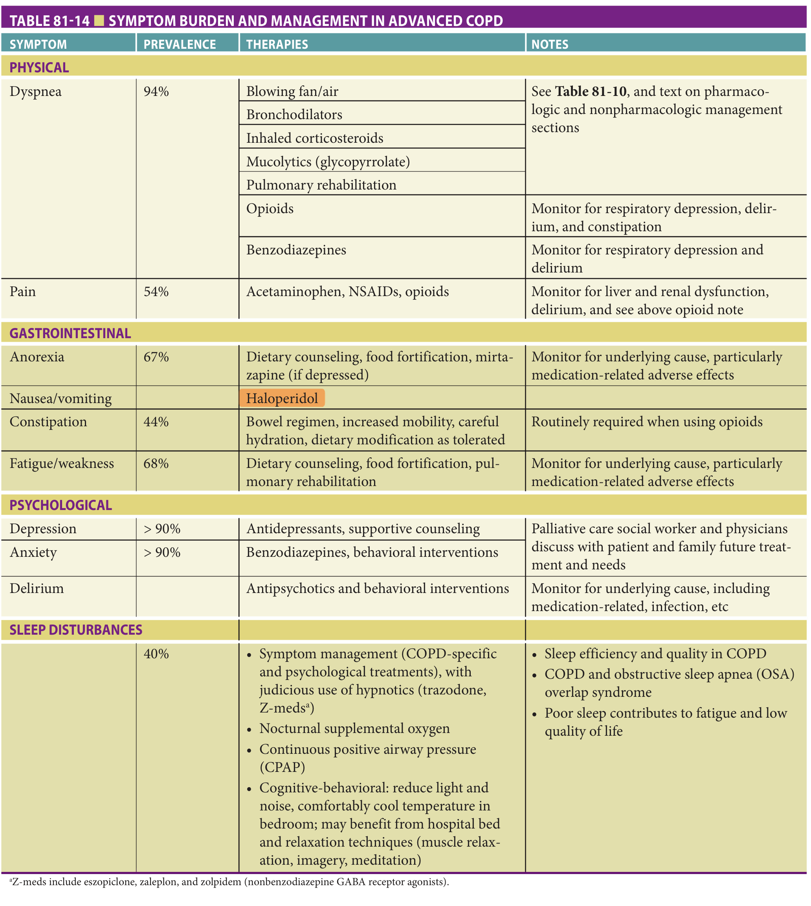

> *Table 81-14 reproduced as a page image (printed p. 1263) — the grid did not extract reliably as text for this fast build.*

> Highlighting is the owner's annotation, not the book's.

aZ-meds include eszopiclone, zaleplon, and zolpidem (nonbenzodiazepine GABA receptor agonists).

deprescribing medications for COPD patients whose care is shifting toward palliation and comfort measures only. In addition, smoking cessation counseling and treatments should be offered, even during palliative-only stages of COPD treatment. Smoking cessation at any stage of disease can reduce exacerbation risk and improve QOL. Nicotine replacement and non-nicotine-based therapies can usually be safely prescribed in older smokers with COPD. Screening for and treatment of symptoms of anxiety, depression,

and pain are additional components of optimal care. In addition to pharmacologic therapies, clinicians should also offer nonpharmacologic interventions, such as cognitive behavioral therapy, written action plans, and advanced relaxation techniques (eg, guided imagery training). PR can also improve symptom management for patients with COPD through training in breathing techniques and improving exercise capacity. Finally, simple environmental changes may help decrease the sensation of dyspnea,

**[p. 1264]**
including use of a fan or opening windows and doors to increase air movement, maintaining a relativity cool temperature, and providing humidified air. Education and support for caregivers are essential.

For patients with uncontrolled symptoms despite maximal supportive and medical therapy, opioids may be considered for symptom relief. The American Thoracic Society guidelines support their use in refractory dyspnea at any stage of illness, chronic and end of life. Opioids are thought to be effective in relieving dyspnea by several mechanisms including decreasing respiratory drive through a direct effect on respiratory centers in the brain stem, by altering the perception of dyspnea and anxiety (central effect), and by direct action on peripheral mu-receptors in the lung (bronchioles). Early studies of oral, sustainedrelease morphine in opioid-naive patients with advanced COPD (doses 10–30 mg orally) and a recent Cochrane Review suggest significant relief of dyspnea. Subsequent studies have not reported data to suggest the efficacy of one opioid (eg, morphine) over another opioid (eg, oxycodone). As COPD progresses and patients near the end of life, swallowing may be impaired or the patient may experience episodes of worsening dyspnea. In this setting, intravenous or subcutaneous opioids may be indicated. Studies of nebulized morphine have failed to prove efficacy compared to placebo, although case studies report improvement in dyspnea. Safety in the end-stage COPD population is clearly a concern given the risk of CO2 retention in this population. While some data suggest that carefully monitored patients who are given low-dose opioids in this setting are at low risk for opioid-induced respiratory failure, a recent analysis of the US Medicare database demonstrated increased risk

of hospitalization for respiratory conditions among those taking opioids, and in a Canadian study, new incident use of opioids was associated with increased respiratory-related and all-cause mortality. If used, opioids should be titrated carefully to patient reported dyspnea. Importantly, also, although benzodiazepines may afford relief of anxiety, they pose risk of dependency and do not consistently relieve dyspnea. The risk of respiratory failure also increases with concurrent use of benzodiazepines and opiates and requires close monitoring, consistent with the overall goals of care. Constipation, cognitive impairment, somnolence, and delirium are the most frequently experienced adverse drug events. The latter can be anticipated and managed prophylactically with close monitoring, careful use of lowdose antipsychotics, opioid dosage adjustment in response to adverse cognitive effects, and the prescription of a laxative regimen to prevent constipation in any patient who requires daily opioids.

Finally, data suggest that patients and families facing serious illnesses such as COPD value clear and honest communication about their disease process. The majority of patients want all information, both positive and negative, but also value statements of “hope” integrated into the shared information. Patients and families also desire the

opportunity to discuss options for care, especially near the end of life. Several communication guidelines are available to assist medical providers in discussing distressing news, such as the results of medical tests that reveal progression of their disease. One widely shared framework is called SPIKES, created by Dr. Robert Buckman. In summary, these steps include:

- **S** Setting: Ensuring that the setting is appropriate to - provide patient comfort and privacy and that adequate support is provided as needed/desired by the patient.

- **P** Perception: Assessing the patient’s and/or family’s understanding of illness.

**I** Invitation: Obtaining the patient’s invitation or permission to discuss distressing news (and respecting their choice not to discuss such news).

**K** Knowledge: Giving knowledge and information to patient and family in a clear and concise manner, avoiding complex technical/medical terminology.

**E** Empathy: Addressing patient’s emotions with empathic responses.

**S** Strategy and summary: Creating a care plan for the next steps in treatment and follow-up, as well as providing contact information for future concerns.

Once information is shared, the medical provider can begin to discuss goals of care by asking patients what is most important to them. For example, a clinician may say to a patient with COPD: “We discussed that time may be short given this is your third admission to the ICU in 2 months and, each time you come to the hospital, your ability to care for yourself deteriorates significantly. Given this reality, what is most important to you? What do you hope for? What has been left undone?” Once the patient’s and/or family’s goals are elucidated, clinicians can help guide the medical decision-making toward treatments that will likely achieve patient-centered goals, while refusing treatments that are unlikely to meet such stated goals. Ideally, these discussions occur in the outpatient setting, with medical providers that the patient knows well and trusts, when the patient is not in a crisis, and when time is not limited. Advance directive completion and identification of proxy decision maker are two key outcomes of these discussions, particularly in the ambulatory setting. While patient-centered palliative care benefits patients with COPD and their families across a spectrum of needs, access to it currently remains limited. Health care professionals and societies should advocate for more resources for palliative care services for patients with advanced lung disease, even in the absence of cancer.

## Conclusion

COPD presents a major public health challenge, projected worldwide to be a leading cause of disability (fifth) and death (third) by 2030. This is concurrent with a demographic

**[p. 1265]**

shift toward an aging population, further amplifying the public health challenge. In particular, older persons are at high risk of developing COPD, given the age-related decline in respiratory physiology and the cumulative effect of frequent exposures to tobacco smoke, respiratory infections, air pollutants, and occupational exposures across the adult lifespan. Moreover, both advancing age and COPD are associated with increasing multimorbidity, polypharmacy, and functional decline, as well as recurrent hospitalizations and end-of-life decisions. Hence, the management of

COPD in older persons requires an approach that considers the interactions between aging and disease and includes a multidisciplinary team of heath care providers.

## Acknowledgment

The authors would like to formally acknowledge the important contributions of authors who contributed substantially to the previous version of this chapter, including Dr. Carlos A. Vaz Fragoso and Dr. Sean M. Jeffery.

## Further Reading

- Agusti A, Hogg JC. Update on the pathogenesis of chronic obstructive pulmonary disease. _N Engl J Med._ 2019;381(13):1248–1256.

- Balte PP, Chaves PHM, Couper DJ, et al. Association of nonobstructive chronic bronchitis with respiratory health outcomes in adults. _JAMA Intern Med_ . 2020;180(5):676–686.

- Barnes PJ. Pulmonary diseases and ageing. In: Harris JR, Korolchuk VI, eds. _Biochemistry and Cell Biology of Ageing: Part II, Clinical Science, Subcellular Biochemistry 91_ . Singapore: Springer Nature Singapore Pte Ltd; 2019:45–74.

- Barrons R, Pegram A, Borries A. Inhaler device selection: special considerations in elderly patients with chronic obstructive pulmonary disease. _Am J Health-Syst Pharm_ . 2011;68:1221–1232.

- Celli BR, Wedzicha JA. Update on clinical aspects of chronic obstructive pulmonary disease. _N Engl J Med._ 2019;381(13):1257–1266.

- Global Initiative for Chronic Obstructive Lung Disease: 2021 Report. www.goldcopd.org. Accessed June 30, 2021.

- Halpin DMG, Criner GJ, Papi A, et al. Global Initiative for the Diagnosis, Management and Prevention of Chronic Obstructive Lung Disease: The 2020 GOLD Science Committee report on COVID-19 and chronic obstructive pulmonary disease. _Am J Respir Crit Care Med._ 2021;203(1):24–36.

- Leuppi JD, Schuetz P, Bingisser R, et al. Short term vs conventional glucocorticoid therapy in acute exacerbations of chronic obstructive pulmonary disease. _JAMA_ . 2013;309:2223–2231.

- Lindenauer PK, Stefan MS, Pekow PS, et al. Association between initiation of pulmonary rehabilitation after hospitalization for COPD and 1-year survival among Medicare beneficiaries. _JAMA._ 2020;323(18):1–11.

- Lowe KE, Regan EA, Anzueto A, et al. COPD Gene 2019: redefining the diagnosis of chronic obstructive pulmonary disease. _Chron Obst Pulm Dis._ 2019;6(5):384–399.

- Macrea M, Oczkowski S, Rochwerg B, et al. Long-term noninvasive ventilation in chronic stable hypercapnic chronic obstructive pulmonary disease. An Official American Thoracic Society Clinical Practice Guideline. _Am J Respir Crit Care Med._ 2020;202(4):e74–e87.

- Maddocks M, Lovell N, Booth S, et al. Palliative care and management of troublesome symptoms for people with chronic obstructive pulmonary disease. _Lancet._ 2017;390:988–1002.

- Murphy PB, Rehal S, Arbane G, et al. Effect of home noninvasive ventilation with oxygen therapy vs oxygen therapy alone on hospital readmission or death after an acute COPD exacerbation: a randomized clinical trial. _JAMA_ . 2017;317(21):2177–2186.

- Quanjer PH, Stanojevic S, Cole TJ, et al. Multi-ethnic reference values for spirometry for the 3–95 year age range: the global lung function 2012 equations. _Eur Respir J_ . 2012;40(6):1324–1343.

- Ritchie AI, Wdezicha JA. Definition, causes, pathogenesis, and consequences of chronic obstructive pulmonary disease exacerbations. _Clin Chest Med._ 2020; 41(3):421–438.

- Schneider JL, Rowe JH, Garcia-de-Alba C, et al. The aging lung: physiology, disease and immunity. _Cell_ . 2021;184:1990–2019.

- Silverman EK. Genetics of COPD. _Annu Rev Physiol._ 2020;82:413–431.

- Spruit MA, Singh SJ, Garvey C, et al. An official American Thoracic Society/European Respiratory Society statement: key concepts and advances in pulmonary rehabilitation. _Am J Respir Crit Care Med_ . 2013;188: e13–e64.

- Strnad P, McElvaney NG, Lomas DA. Alpha-1-antitrypsin deficiency. _N Engl J Med_ . 2020;382(15):1443–1455.

- Vaz Fragoso CA, Gill T. Respiratory impairment and the aging lung: a novel paradigm for assessing pulmonary function. _J Gerontol Med Sci_ . 2012;67:264–275.

**[p. 1266]**

