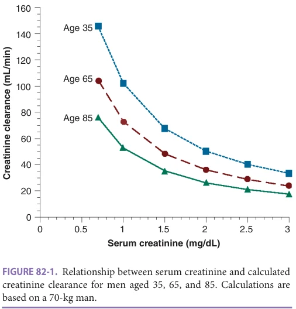
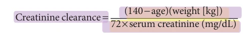
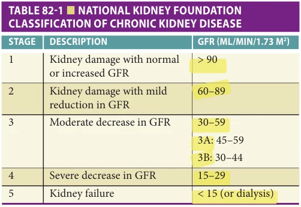
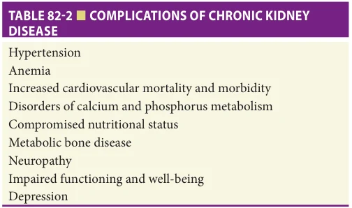
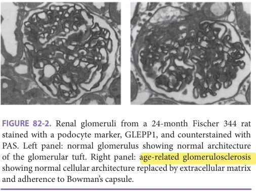
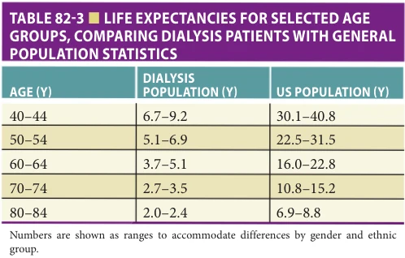

# Hazzard's Geriatric Medicine and Gerontology, 8e - Chapter 82: Aging of the Kidney

Jocelyn Wiggins, Abhijit S. Naik, Sanjeevkumar R. Patel

> **Status.** Fast build from the book; not lane-reviewed.

> **Source and method.** Printed pages 1267-1276, from the marked 8th-edition copy (PDF page = printed page + 34). Prose follows its text layer; tables and figures are source-page crops. The book is canonical.

**[p. 1267]**

## CLINICAL RELEVANCE

Data on individuals reaching end-stage kidney disease (ESKD) are collected by the US Renal Data System (USRDS). As a condition for coverage, all dialysis units receiving Medicare funding must file data with the Centers for Medicare and Medicaid Services (CMS). The 2020 USRDS annual data report shows that approximately 1.27 in 1000 persons aged 65 to 69 initiate treatment for ESKD each year. For the 70- to 75-year-old age group, the incidence rate of ESKD is 1.43 per 1000 persons, and this incidence peaks in the 80 to 84 age group to 1.82 per 1000. Over the last 10 years, the number of older individuals receiving renal replacement therapy has increased by 35% in those 75 years or older and by 43% in those older than 80 years. In contrast, the incidence of ESKD in the 20- to 44-year-old age group has remained flat over the last 10 years, with only modest growth in the 45- to 64-year-old age group. Although some of the increase in renal replacement therapy for the older population indicates a greater willingness to offer treatment to older individuals, much of the growth is owing to people surviving to experience the chronic changes that occur with aging. The kidney undergoes significant age-related change. Other common, age-related diseases such as hypertension and diabetes accelerate these changes.

#### Learning Objectives

- Understand normal kidney aging.

- Classify kidney disease using the estimated glomerular filtration rate (eGFR).

- Recognize environmental factors that impact the rate of decline in kidney function.

- Recognize that genetic factors play a role in the age-related decline of kidney function.

- Understand the general guidelines for managing patients with chronic kidney disease (CKD).

- Understand the implications of aging on organ donation and receiving an organ transplant.

#### Key Clinical Points

1. All older adults have some decline in renal function.

2. Older patients can typically maintain normal physiologic homeostasis but are compromised in their ability to respond to challenges.

3. Kidneys become more susceptible to injury with advancing age.

4. Rates of decline in renal function in aging are quite variable and impacted by genetic and environmental factors.

5. Preventing people from reaching end-stage renal disease reduces care costs and dramatically improves the quality of life.

## THE AGING PROCESS

Aging in the kidney is characterized by changes in both structure and function. It must be emphasized that many of the aging studies have been performed on laboratory animals, particularly rodents, demonstrate quite different patterns of aging from humans. For example, kidney weight increases throughout life in rats, while kidney mass and size in humans peak in the fourth decade and decline

**[p. 1268]**

thereafter. Care should be taken when reading the literature to keep in mind that changes observed in animal models may not reflect parallel changes seen in humans. Historical data from human postmortems describing changes in the kidney made no effort to exclude patients with kidney disease or significant comorbidities. More recently, data on aging have been developed from longitudinal studies, such as the Baltimore Longitudinal Aging Study, in which the medical histories of the study volunteers are well documented. There are also data accumulating from older living kidney donors that undergo rigorous work-up of their kidney function and detection of comorbid conditions. Such individuals are presumed to have undergone healthy aging and thus allow the acquisition of normal kidney aging data. The aging kidney is generally characterized by a spontaneous progressive decline in renal function accompanied by thickening of the basement membrane, mesangial expansion, and progressive glomerulosclerosis.

Functional Changes Changes in renal function with age are well documented both in human and animal models. Although baseline homeostasis of fluids and electrolytes is maintained with normal aging, there is a progressive decline in renal reserve. This results in a compromise in the kidney’s ability to respond to either a salt or water load or deficit. This manifests clinically in patients being vulnerable to superimposed renal complications during acute illnesses. Chronic conditions such as hypertension accelerate this age-related loss of renal reserve, and increased vulnerability in these patients should be anticipated. Age-related changes in function will be considered by separate functional domains within the kidney.

Renal blood flow Average renal blood flow decreases about 10% per decade, dropping from 600 mL/min/1.73 m2 to 300 mL/min/1.73 m2 by the ninth decade. This is accompanied by increasing resistance in both afferent and efferent arterioles. These changes occur independently of a decline in cardiac output or reductions in renal mass. This decline in renal blood flow contributes to the decrease in efficiency with which the aging kidney responds to fluid and electrolyte load and loss.

Glomerular filtration rate Newer data have shown a wide variation in the rate and extent of changes in the kidney within the older population. Approximately 30% of the population shows no measurable decline in renal function with normal aging. The bulk of the population loses about 10% of the glomerular filtration rate (GFR) and 10% of renal plasma flow per decade after the fourth decade of life. Between 5% and 10% of the population shows an accelerated loss, even in the absence of identifiable comorbidities. Since there is also a steady loss of muscle mass with age, with a concomitant reduction in creatinine production, serum creatinine should remain relatively constant. Elevations in serum creatinine should therefore be taken

*Figure 82-1, printed p. 1268.*

seriously and not dismissed as normal aging. As can be seen in Figure 82-1, serum creatinine at the upper limit of the “normal range” in an older individual represent significant decline in renal function, and thought should be given to renal dosing of medications. These curves were calculated using the Cockcroft-Gault equation for a 70-kg man:

*Cockcroft-Gault equation, printed p. 1268.*

Results for women should be multiplied by 0.85, which shift the curves downward. In frail older women with very little residual muscle mass, this equation probably overestimates GFRs. This steady decline in renal function with age manifests itself clinically as impaired ability to excrete a salt or water load. Extra care should be taken when replacing fluids in an older individual to prevent extracellular fluid overload and its consequences.

In 1999, an improved formula for estimating GFR was developed known as the MDRD formula (because it was developed as part of the Modification of Diet in Renal Disease study). Many routine laboratories now automatically calculate an MDRD glomerular filtration estimate when a basic or a comprehensive metabolic panel is ordered. In some institutions, it is necessary to order a “renal panel” for the calculation to be done. It is essential to understand that this formula was based on data from community-dwelling volunteers aged 18 to 70. It has never been validated in a very old or frail population. Several investigators have studied its performance in older patients and compared its efficacy with Cockcroft Gault, creatinine clearances based on 24-hour urine or iothalamate clearances, or a combination of these methods. All of the studies have shown significant discrepancies between these methods in patients with

**[p. 1269]**

advanced age and at both extremes of the weight spectrum. These limitations should be kept in mind when using the formula in clinical geriatric practice. Although iothalamate clearance is the gold standard, it is expensive and impractical for routine use. The most reliable results come from calculating creatinine clearances based on 24-hour urine collection. This will always be an overestimate of the GFR, since some creatinine is actively excreted into the urine from the proximal tubule, not all of the urinary creatinine is filtered. It is however more reliable than the formula estimations in the very old and frail people. In 2009, a new modification of MDRD—the CKD-EPI equation—was developed. This is more accurate than the original formula and is now used in routine clinical practice reported by most clinical labs. Using cystatin C as a measure of GFR circumvents the problem of the decline in creatinine production with age, and its use has gained popularity in many clinical settings.

Classification of kidney disease The classification of kidney disorders has undergone a significant revision over the past few years. A consensus committee, sponsored by the National Kidney Foundation, published clinical practice guidelines in 2002. The traditional chronic renal insufficiency has become chronic kidney disease (CKD), and endstage renal disease (ESRD) has become kidney failure. CKD is defined as either kidney damage or decreased kidney function for 3 or more months. Kidney failure is defined as a GFR of less than 15 mL/min or the need to start kidney replacement therapy. Along with renaming kidney disease, the committee also developed a system of staging. It was felt that having a structure would help with standardizing diagnosis and opportunities for preventative management. CKD is now classified into five stages, regardless of underlying diagnosis. The classification defines stage 1 as kidney damage (primarily proteinuria) with preserved GFR and progresses to stage 5 kidney failure (Table 82-1). Declines in GFR are accompanied by a broad range of complications (Table 82-2). In 2007, the classification was revised and stage 3 CKD was subdivided into 3A and 3B. This was done because this is by far the category with the largest number

*Table 82-1, printed p. 1269.*

*Table 82-2, printed p. 1269.*

of patients and there was significant heterogeneity in complications that develop within this group. Early recognition of impaired kidney function allows the physician to screen for and manage these complications and thus prevent comorbidities and declines in quality of life. National Kidney Foundation guidelines recommend referral to a nephrologist when a patient reaches stage 4 CKD for management of the complications of impaired function such as acidosis, phosphorus retention, and anemia. An informed discussion regarding kidney replacement therapy should also begin during stage 4.

Proteinuria Despite the significant decline in GFR that occurs with aging, proteinuria is not a normal feature of the aging process. Proteinuria is always a pathological finding and requires a full work-up. In contrast, in most rodent models, particularly in the rat, proteinuria is a normal feature of the aging kidney. This difference between humans and rodents should be kept in mind when reading the aging literature.

Tubular function Older individuals are more susceptible to acute renal failure. Much of the information on tubular function comes from animal studies, particularly rat models. Rats spontaneously develop proteinuria with aging, and this protein load is believed to be toxic to the tubule. Since proteinuria is not a feature of normal aging in humans, these animal studies may not paint an accurate picture of changes in tubular function in humans. There are also large numbers of studies in experimental animals looking at vasoconstrictive and vasodilatory responses in the older kidney. Impaired response to ANP, acetylcholine, and blunted responses of cAMP to β-adrenergic stimulus has all been implicated. Virtually none of these findings have been confirmed in humans. Functional magnetic resonance imaging (MRI) in older volunteers has demonstrated decreased ability to modulate renal medullary oxygenation. Whether this is caused by fixed vascular changes or changes in renal autocrine systems such as prostaglandins, dopamine, nitric oxide (NO), natriuretic peptides, or endothelin is not clear. The clinical result is increased sensitivity to acute ischemic renal failure.

Animal and human studies have shown impaired concentrating ability in the older kidney. Whether this is

**[p. 1270]**

caused by intrinsic defects in the tubular epithelium or impaired response to antidiuretic hormone (ADH) is not clear. Studies have also demonstrated impaired capacity to acidify urine manifested clinically as reduced excretion of an acid load. Whatever the underlying mechanism, older individuals are less likely to be able to maintain normal homeostasis when challenged. Although there is an age-related decline in tubular functions such as glucose and amino acid transport, these declines closely parallel the decline in GFR and are believed to correlate with the loss of nephrons rather than age effects in the tubule. Older individuals are also more sensitive to nephrotoxic injury. Careful thought should be given to the choice and dosing of antibiotics and other nephrotoxic drugs including the use of iodinated contrasts.

Age-related changes in sodium and water handling are discussed in Chapter 39. An overview of potassium disorders in the older adults is presented below.

Physiologic Regulation of Potassium Balance As the major determinant of transmembrane potential, and therefore neural, muscular, and neuromuscular currents, both total body potassium homeostasis and the extracellularto-intracellular potassium gradient are strongly defended. Potassium is the major intracellular cation and the vast majority of body potassium stores are located in the skeletal muscle cells. Thus, serum potassium concentration reflects total body stores imperfectly, especially under stress conditions. Serum potassium is influenced by two separate sets of factors: those related to kidney function and those related to the transmembrane movement of potassium in and out of cells. In the setting of relatively well-preserved kidney function, older individuals have a normal serum potassium under unstressed conditions, but as the GFR declines, the fractional excretion of potassium does not rise as much as in young individuals in part due to lower aldosterone levels and/or aldosterone resistance in older adults. Several factors will regulate the movement of potassium in and out of cells including the glucoregulatory hormones insulin and glucagon, adrenergic stimulation of either α- or β-receptors, acid-base balance, and alterations in serum osmolality.

Hypokalemia, defined as a serum potassium less than 3.5 mEq/L, occurs rarely in healthy adults. However, because older individuals frequently are taking medications that alter potassium homeostasis such as diuretics or have a diet low in potassium, the frequency of hypokalemia can be as high as 5%. Hypokalemia associated with medications, underlying disease processes, or diet has been reported in 21% of hospitalized patients. Although many individuals with hypokalemia are clinically asymptomatic, hypokalemia is associated with a wide variety of clinical manifestations including muscle weakness—including proximal muscle weakness and intestinal ileus—cardiac arrhythmias, polyuria, and fatigue. Hypokalemia is frequently accompanied by multiple electrolyte abnormalities including hyper- or

hyponatremia, metabolic acidosis or alkalosis, and hypomagnesemia. Individuals with very poor nutrition such as those with alcoholism or eating disorders may present with normal or minimally decreased potassium that belies the extent of their potassium deficiency. The potassium level may plummet with refeeding, leading to potentially catastrophic cardiac events, especially if this has occurred in the setting of underlying organic heart disease. A similar dramatic fall in potassium can occur with aggressive insulin therapy or aggressive bicarbonate replacement. For these reasons, it is recommended that potassium replacement, parenteral, enteral, or both, be initiated immediately when these therapies are anticipated. Avoidance of dextrosecontaining parenteral fluids should be considered in the setting of severe hypokalemia, until it can be at least partially corrected.

Hypokalemia can result from poor intake (eating disorders, alcoholism), increased losses (diuretics, mineralocorticoid excess, diarrhea), or shift of potassium from the extracellular to the intracellular compartment (insulin therapy). Often, the history alone will alert the clinician to the most likely cause of hypokalemia, but additional testing of the urine for potassium, creatinine, and osmolality can effectively narrow the differential diagnosis by establishing whether there are excessive urinary potassium losses. An isolated urine potassium of greater than 40 mEq/L suggests excessive renal losses.

The safest method for potassium replacement is orally, through potassium-rich foods or potassium supplements, as overdose is unlikely. For severe hypokalemia or hypokalemia associated with acute cardiac arrhythmias, however, parenteral potassium may be required. Determining the amount of potassium needed to replace losses may be calculated, but administration of relatively small doses such as 10 or 20 mEq at a time with frequent repeat measures is the safest approach. For patients who require continuous diuretic therapy, addition of a potassium-sparing diuretic in low dose may blunt potassium losses. However, these agents need to be used carefully in individuals with CKD or those who are already taking a medication that blunts renal potassium excretion.

Hyperkalemia rarely occurs in the setting of normal kidney function because of the tremendous capacity of the kidneys to excrete the daily potassium load. Older patients are more susceptible to hyperkalemia because of the loss of kidney function, the loss of muscle mass, the changes in regulation of muscle ion content described earlier, lower levels of renin and aldosterone, and the use of many medications for chronic conditions which are associated with hyperkalemia such as angiotensin-converting enzyme (ACE) inhibitors, angiotensin receptor blockers, and potassium-sparing diuretics. Older individuals also are more likely to have glucose intolerance, which may blunt the ability of potassium to be translocated to the intracellular compartment and type IV renal tubular acidosis which will diminish renal potassium excretion even in the

**[p. 1271]**

presence of relatively normal kidney function. Hyperkalemia is seen in up to 10% of hospitalized patients. Despite the theoretical predisposition to hyperkalemia, it has been difficult to show that older patients using inhibitors of the renin-angiotensin-aldosterone system, singly or in combination, have a higher incidence of hyperkalemia than do younger patients.

The definition of hyperkalemia varies from laboratory to laboratory and from clinical report to clinical report. Generally, a potassium of greater than 5.3 mEq/L is accepted as hyperkalemia. Spurious hyperkalemia, where the measured potassium is elevated but the ambient serum potassium is normal, can occur in the setting of hemolysis of the blood sample associated with difficult phlebotomy or deterioration of the sample, severe thrombocytosis, severe leukocytosis, or red cell disorders. If this is suspected, obtaining a plasma potassium would be the next appropriate step. Hyperkalemia is frequently asymptomatic but muscle weakness and fatigue are the most common symptoms. The heart is the major target of significant hyperkalemia as increasingly greater potassium concentrations result in varying degrees of heart block progressing to cardiac arrest. Unfortunately, the electrocardiographic manifestations of hyperkalemia may be subtle and missed; conversely, the same level of hyperkalemia may produce vastly different effects on the electrocardiogram (ECG) including sinus bradycardia, complete heart block, wide QRS tachycardia, or the classic sine wave pattern. The widely taught progression of the ECG manifestations of hyperkalemia such as peaked T waves, prolonged PR interval, absence of P wave, and QRS prolongation is seldom seen. Thus, the absence of ECG findings in the presence of a high potassium level should not lead the clinician to conclude that the hyperkalemia is erroneous or insignificant. The physical examination may show muscle weakness, a reduction in deep tendon reflexes, and bradycardia.

The causes of hyperkalemia are numerous. Older patients are generally more prone to hyperkalemia primarily due to the reduction in kidney function. Most cases of significant hyperkalemia are multifactorial due to a reduction of kidney function coupled with excessive potassium intake, use of medications that reduce potassium excretion or movement into cells, or occurrence of acute kidney injury superimposed on CKD. A complete history can generally identify these factors. Recent studies have identified particularly high-risk situations for severe hyperkalemia in older adults including the use of trimethoprim/sulfamethoxazole in patients on spironolactone, the use of two inhibitors of the renin-angiotensin-aldosterone axis, the use of nonsteroidal anti-inflammatory drugs, and the presence of type 2 diabetes. One additional diagnosis to consider when an older patient presents with unexpected hyperkalemia is adrenal insufficiency. Modest adrenal insufficiency in the geriatric population may present episodically with recurrent volume depletion and acute kidney injury with varying degrees of hyponatremia and hyperkalemia which correct

easily with the administration of parenteral sodium chloride. Often, the only symptom is fatigue.

Treatment of hyperkalemia is determined by the severity and the presence or absence of significant cardiac effects. Asymptomatic, non–life-threatening hyperkalemia can be approached in the outpatient setting through elimination of medications that cause hyperkalemia, improving hydration status, and addressing any reversible causes of reduction in kidney function such as medications and volume depletion. Severe hyperkalemia manifested as advanced degrees of conduction delays or bradycardia will require, in addition to the above measures, more immediate interventions. Intravenous calcium gluconate will stabilize the myocardial cell membrane, decreasing the potential for cardiac arrest. This effect is essentially immediate, but transient, and does not lower potassium levels. Intravenous insulin, inhaled β-agonists, and, if the individual also has a metabolic acidosis, intravenous bicarbonate, will enhance potassium entry into the cells, thus lowering serum potassium and diminishing the risk of a fatal cardiac event. Insulin works fastest, within 15 minutes, but is more transient than the β-agonists. All of these interventions are transient, and ultimately treatment is directed toward removal of excessive potassium from the body. The three options listed in order of aggressiveness are forced diuresis with loop diuretics, the use of exchange resins such as sodium polystyrene sulfonate, or dialysis. The choice of which modality or modalities to employ is dependent on the severity of hyperkalemia, the level of kidney function, the presence or absence of any intestinal disease, and patient/physician preference. Without doubt, the least invasive approach, forced diuresis, is highly effective in the presence of preserved kidney function. When kidney function is impaired, exchange resins and/or dialysis can be considered. For severe hyperkalemia, the immediate therapies as well as oral exchange resins would be required.

Underlying Structural Changes There are at least 100 years of meticulous research describing the anatomical changes that underlie the functional changes that are observed in patients as they age.

Gross anatomy Kidneys grow vigorously from birth through adolescence, reaching their maximum weight and volume during the third decade of life. In humans, although not in most laboratory animals, renal mass starts to decline after the fourth decade and continues its decline throughout the remaining lifespan. Most of the decrease in weight and volume appears to happen in the cortex, with relative sparing of the medulla.

Glomerulus The young healthy human kidney contains roughly 1 million nephrons. There is no evidence for postnatal nephrogenesis. This underlies the hypothesis that low birth weight babies might have fewer initial nephrons and as a result are more susceptible to renal failure in later life. Although there are some observational data to support this

**[p. 1272]**

hypothesis, no causal relationship has been proved. There is a steady decline in nephron number with age that starts around the fourth decade. This appears to be driven by podocyte loss. These specialized cells are postmitotic and if damaged in any way, cannot be replaced. This decline is believed to underlie the reduction in GFR discussed above. Kidneys obtained at autopsy from patients with no known history of renal disease have been studied. Light microscopy showed the development of a focal sclerosing process, accompanied by thickening of the glomerular basement membrane. There was a steady progression with age in the percentage of glomeruli that were scared. By age 50, all subjects examined had some evidence of sclerosis, with the percentage of sclerotic glomeruli increasing steadily with age.

Age-related glomerulosclerosis Sclerotic glomeruli typically first appear in the fourth decade of life. This starts as a segmental process with one part of a glomerulus becoming acellular and the normal architecture being replaced by extracellular matrix. The glomerular tuft becomes adherent to Bowman capsule (Figure 82-2). Gradually an entire glomerulus becomes sclerosed and shrivels down with resultant loss of that nephron and its filtration capacity. It is not known what triggers this pattern of focal sclerosis, which is apparently randomly scattered throughout the cortex. The glomerular tuft increases in size with age. Concomitant with this expansion is an increase in endothelial and mesangial cells, such that the ratio of cells to glomerular area remains constant. Podocytes, the specialized cells that form the filtration barrier in the glomerulus, are postmitotic. They are not able to multiply in response to the increase in tuft volume and become a progressively smaller percentage of the total cells making up the glomerular tuft. As the filtration area that they have to cover increases, it is believed that they may detach from the basement membrane, leaving a denuded area behind. It is this area of bare basement membrane that acts as the trigger for the sclerosing process. Many different experimental models of glomerulosclerosis have concluded that loss of the podocyte and its inability

*Figure 82-2, printed p. 1272.*

to be replaced are the sentinel events that trigger sclerosis. A transgenic rat model that expresses the diphtheria toxin receptor on the podocyte has been developed to deplete podocytes in a dose-dependent manner. This model has shown that the loss of podocytes precedes the appearance of sclerosis, and podocytes markers can be detected in the urine prior to the development of global sclerosis.

Models of induced glomerular injury, of course, do not exist in humans. However, research has shown selective loss of podocytes in the kidneys of people with type 1 diabetes as diabetic nephropathy progresses. Podocyte number per glomerulus is the best predictor of progression of diabetic nephropathy in Pima Indians with type 2 diabetes. Studies of the aging process in rat kidneys noted that a decline in podocyte counts is accompanied by the appearance of glomerulosclerosis. Studies to address this in aging humans are currently being conducted.

Some authors have suggested a role for the mesangial cell in initiating the sclerosis process. Certainly with aging, there is an increase in mesangial matrix and in mesangial cell numbers. However, this increase is just as marked in strains of rat that do not develop age-related glomerulosclerosis, as it is in strains that do. Several investigators have studied mesangial cell activation in rat models of glomerulosclerosis and found little or none. This suggests that mesangial expansion is a benign manifestation of the aging process rather than a pathological one.

Tubule With the loss of the glomerulus, the tubular section of the nephron usually degenerates and is replaced by connective tissue. Tubular hypertrophy then occurs in the remaining nephrons, principally in the proximal convoluted tubule. This appears to result from both hypertrophy and hyperplasia. With thinning of the cortex, there is a decrease in tubule length and development of diverticuli in the distal convoluted tubule. As nephrons are lost, there is generalized tubular interstitial fibrosis. The structure of the distal tubule does not appear to change significantly with age.

Vasculature Renal arteries undergo age-related thickening, similar to that seen throughout the circulation. Smaller arteries may become tortuous and show luminal irregularities. When a glomerulus becomes sclerosed, there is frequent formation of an arteriovenous shunt as the afferent and efferent arterioles develop a direct connection when the glomerular capillary is lost. This shunt is very important in maintaining medullary blood flow. Physiologic studies in both animals and humans have documented a decline in renal blood flow and an increase in vascular resistance with age. Studies of renal perfusion in healthy older individuals from a pool of potential kidney donors have shown steady declines in renal perfusion with age that exceeded the reduction in renal mass, suggesting that declines in blood flow were a significant factor in the changes seen in renal function with age. The age-related increase in central arterial stiffness (discussed in Chapter 73) leads to increased forward transmission of a larger forward wave

**[p. 1273]**

exposing the small arteries and microvessels in the renal parenchyma to damaging levels of pressure pulsatility and may contribute to kidney injury in aging. Taken together, these changes contribute to the susceptibility of older individuals to acute renal failure, volume overload, and electrolyte abnormalities.

Infarcts may occur in the kidney, just as they do in other tissues of the body. Since one-fifth of the circulating volume passes through the kidney each minute, the kidney is also particularly susceptible to embolization. If other signs of embolization are visible clinically, it is highly probable that the kidney is also undergoing embolization, and embolic disease should certainly be kept in mind in an older individual with widespread vascular disease who demonstrates accelerated loss of renal function.

## MECHANISMS UNDERLYING THE DECLINE IN KIDNEY FUNCTION

There is no clear-cut consensus about what mechanisms may underlie the structural and functional changes occurring in the kidney in the older population. It is fairly clear, however, that there are both predisposing genetic and environmental factors that play a role.

Genetic Predisposition There are as yet no genes known to cause age-related glomerulosclerosis, although several podocyte genes have been identified as causative in childhood focal segmental glomerulosclerosis. Accumulating evidence from animal studies, combined with evidence of genetic predisposition in humans, has led to a concerted effort to seek genes that may increase susceptibility to renal failure. Many of the genes identified as playing a role in the aging process, such as IGF-1 and target of rapamycin (TOR), also seem to play a role in kidney aging. Rodent studies using rapamycin to slow the aging process are currently ongoing that are likely to produce information on renal aging.

Animal models Rats are particularly susceptible to kidney failure and much of the work with models of renal disease has been carried out in laboratory rat strains. There are very marked strain differences in susceptibility to agerelated glomerulosclerosis. Since these rats are maintained in pathogen-free environments and are fed uniform scientifically developed diets, this strongly suggests a genetic basis for the development of age-related glomerulosclerosis. The appearance of glomerulosclerosis has been reported as early as 5 months in the Milan normotensive rat, with extensive disease by 10 months of age. This occurs in the total absence of hypertension and is not ameliorated by administration of ACE inhibitors. Wistar rats were used as controls in this study and showed no significant disease during the same time period. In Sprague-Dawley rats, spontaneous age-related glomerulosclerosis first becomes apparent around 9 months of age, and disease became

widespread by 18 months of age. In studies of aging in Fischer 344 rats, little glomerulosclerosis is seen until almost 2 years of age with fairly rapid progression thereafter. Other rat strains appear remarkably resistant to renal disease. Brown Norway rats show minimal sclerosis, even at 32 months of age, an advanced age in rat lifespan.

Human studies Clearly, these kinds of studies cannot be duplicated in humans. However, there are observational data that would support a similar variation in genetic susceptibility in humans. Cross-sectional studies, donor organ data, and longitudinal studies clearly show a wide variation in kidney function with age. Around 5% to 10% of the population show accelerated loss of kidney function with age even in the absence of accelerating factors such as hypertension, while 30% show no measurable decline. In the presence of predisposing comorbidities, there is also wide variation in the development of kidney disease. Some people with diabetes may never develop nephropathy, while others develop rapidly progressive kidney disease early in the course of their diabetes, suggesting an underlying genetic susceptibility. Within the African-American population, rates of kidney disease are much higher than in the Caucasian population independent of the precipitating cause. Within an ethnic group, there are also distinct differences in vulnerability. An African-American who develops any predisposing disease, be it hypertension, diabetes, or lupus, who has a first-degree relative on renal replacement therapy has a ninefold increased risk of developing kidney disease compared to another African-American with the same disease burden who has no family history of kidney disease. Similarly, human immunodeficiency virus (HIV)- associated glomerulosclerosis occurs almost exclusively in the African-American population, while HIV-associated mesangial hyperplasia and immune-complex glomerular nephritis occur equally in all ethnic groups. Much of this disparity can now be attributed to genetic variants in the apoL1 (APOL1) gene found only in individuals with recent African ancestry. These variants greatly increase rates of hypertension-associated ESKD, focal segmental glomerulosclerosis, HIV-associated nephropathy, and other forms of nondiabetic kidney disease. Thus, there is evidence for a genetic predisposition with respect to the development of glomerulosclerosis. Considerable effort and resources are currently being directed toward identifying genes that predispose to kidney disease.

Environmental Predisposing Factors Several diseases predispose to kidney failure and accelerate the progress of age-related glomerulosclerosis. By far the most prevalent of these are hypertension and diabetes, both common disorders in the older population. There are, however, several other mechanisms that have been postulated to underlie the aging changes in the kidney.

Diet One of the most striking aspects of rodent models of age-related nephropathy is its complete reversal with

**[p. 1274]**

caloric restriction. Both the anatomical and functional changes related to aging in the kidney are completely abolished in animals that are fed two-thirds of the calories given to their ad libitum-fed litter mates. Even though these animals live one-third longer than their ad libitum-fed littermates, they do not develop age-related glomerulosclerosis. Several explanations have been proffered to account for this observation.

Free radicals and lipid peroxides One possible explanation for the profound effects of caloric restriction is a reduction in the generation of free radicals and lipid peroxides. There is a wide body of literature discussing the damaging effects of free radicals on cellular systems and the role that this plays in aging (refer to Chapters 1 and 40). The main consequence of free radical production is lipid peroxidation, which results in damage to cellular proteins, lipids, and nucleic acids. Increased caloric intake is believed to fuel increased free radical production with accelerated aging damage. This hypothesis has generated interest in the role of antioxidants in slowing the aging process. The effects of supplementing the diets of Sprague-Dawley rats with vitamin E have been studied. Although there were reductions in markers of oxidative stress and the rate of decline in GFR slowed, glomerulosclerosis still developed. Vitamin E supplement studies in humans have also been disappointing.

Protein restriction The benefits of caloric restriction have been attributed to concomitant reductions in dietary protein. There is a large body of older literature on protein restriction in experimental animal models of kidney disease. In many of these studies, experimental and control animals were not fed isocaloric diets, and protein restriction also meant caloric restriction. Many of these studies have shown a slowing in the progression of established kidney disease; however, the results were not corrected for total calorie content. Studies of spontaneous age-related glomerulosclerosis in Fischer 344 rats have shown that protein restriction was much less effective than caloric restriction in preventing age-related declines in kidney function. Modest benefits from protein restriction when rats were fed isocaloric diets have been demonstrated, as have some benefits when the type of protein in the diet was changed from casein to soy. In contrast, caloric-restricted animals had little or no decline in kidney function and they were not able to show significant glomerulosclerosis despite significantly increased longevity. Rats that were fed a high-protein diet, but restricted to 60% caloric intake compared to their ad libitum-fed litter mates, also showed dramatic reductions in age-related glomerulosclerosis. Clearly, protein restriction does have some benefit in the prevention of age-related nephropathy, but that advantage is small compared to that achieved with caloric restriction. Very few of the studies examined changes in sodium, phosphate, and calcium content of the experimental diets. Many of the results of protein restriction can be duplicated by phosphate restriction. The relevance of these studies in humans remains unclear. An

observational study that included individuals up to 80 years of age compared healthy vegetarians who consume an average of 30 g/day of protein with nonvegetarians who consume an average of 100 g/day and showed no differences in kidney function between these groups. There is evidence to support protein restriction in patients with established renal disease to reduce symptoms of uremia, but none to support the role of protein restriction to prevent agerelated changes in the human kidney.

Lipids There is a well-established link between lipids and cardiovascular disease, and restriction of fat intake accompanied by treatment of hyperlipidemia has been shown to be efficacious in preventing or slowing the progress of the cardiovascular disease. Certainly, protecting the integrity and function of the vascular supply to the kidney is important to maintaining normal function. Evidence for benefits from the manipulation of lipids in kidney disease comes mainly from animal models of diabetes. Animal studies using high-fat diets have shown accelerated progress of kidney disease, but in most cases, diets were not corrected for total caloric intake. Lipogenic diets fed to Sprague-Dawley rats resulted in an earlier appearance of widespread glomerulosclerosis compared to standard fed animals. The use of lipid-lowering agents in a variety of animal models of glomerulosclerosis has shown reductions in the incidence of glomerular damage. Patients with an established renal disease with or without diabetes have more rapid deterioration of kidney function in the presence of hyperlipidemia. The relevance of lipids to the age-related decline in kidney function remains to be established, but it would certainly be reasonable to recommend a low-fat diet and lipid management in patients with declining renal function.

Hyperfiltration The term hyperfiltration is used to describe putative glomerular injury from long-term increases in intraglomerular pressure. The age-related loss of glomeruli causes intraglomerular hypertension with hypertrophy of remaining glomeruli. Persistent intraglomerular hypertension causes pressure-mediated renal injury. Most of the supporting evidence for this mechanism comes from animal models where one kidney and part of the remaining kidney are removed, leaving a partial kidney remnant. These animals develop a pattern of renal damage in the remnant indistinguishable from age-related glomerulosclerosis but over an accelerated time course. Long-term follow-up in humans for older than 20 years has not shown accelerated declines in renal function in people who have donated one of their kidneys for transplantation, even though the remaining kidney does undergo hypertrophy. Nutrition may also play a part in hyperfiltration. After a meal of protein, increases in both renal blood flow and GFR in animals as well as in humans have been demonstrated. Excessive intake, particularly of animal proteins, therefore could cause constant hyperperfusion in the kidney, leading to intraglomerular hypertension and accelerated glomerulosclerosis. This would certainly help to explain the

**[p. 1275]**

*Table 82-3, printed p. 1275.*

benefits so clearly seen with caloric restriction in laboratory animals.

The efficacy of ACE inhibitors in preventing renal hyperperfusion damage early in the course of diabetes and hypertension would also lend support to the hyperfiltration hypothesis. Angiotensin II appears to be important in maintaining glomerular filtration pressure by vasoconstricting the efferent arteriole. ACE inhibition is believed to preserve renal function by blocking the vasoconstriction of the efferent arteriole and reducing intraglomerular pressure. Long-term ACE inhibition dramatically reduces the incidence of age-related glomerulosclerosis in MunichWistar rats. However, a sufficient dose of an ACE inhibitor to significantly lower systolic blood pressure was administered in the treatment group as compared to the control animals. Whether low doses of ACE inhibitors would help to maintain normal renal function in humans and prevent the appearance of age-related glomerulosclerosis is a matter for speculation. There is no doubt about their efficacy in preventing a progressive decline in renal function when there is an underlying disease. It remains to be seen whether they have any role in modifying age-related changes.

## CONSEQUENCES OF IMPAIRED KIDNEY FUNCTION

Patients who show signs of significantly diminished kidney function should be managed aggressively, regardless of their age. Individuals who reach dialysis have a mortality rate four to five times that of age-matched controls (Table 82-3) and are at 10 times the risk of a cardiovascular event. It costs more than $80,000 per year to maintain someone on dialysis without including the cost of treatment for any other health problems. Transplantation is also expensive and requires patients to remain on toxic immunosuppressive regimens for the rest of their lives. Patients who show signs of impaired kidney function should be managed with the idea of preventing them from reaching end-stage disease. Aggressive measures should be taken to reduce blood pressure with a target systolic blood pressure goal of less than 120 mm Hg. A regimen should be used

that includes an ACE inhibitor or an angiotensin receptor blocker, particularly in patients who have albuminuria. However, it should be kept in mind that neither of these classes of the drug will confer significant renal protection in the absence of good blood pressure control. Lipids should also be aggressively managed, as should blood sugar and other potential accelerators of renal decline. The novel SGLT2 inhibitors reduce the risk of kidney disease progression among patients with diabetic kidney disease who are already taking ACE inhibitors, as well as the incidence of cardiovascular disease. Overweight patients should be encouraged to lose weight. Great care should be taken to avoid potential renal toxins, such as aminoglycoside antibiotics, nonsteroidal anti-inflammatory drugs (NSAIDs), and radiocontrast dyes. Medications excreted by the kidney should be appropriately dosed in amount and frequency. Maintaining residual renal function confers on the patient a greatly superior prognosis when compared to those on renal replacement therapies. Hopefully, the current emphasis on finding genes that predispose to declines in kidney function and the development of age-related glomerulosclerosis will help us to identify those at greatest risk before major losses of function have occurred. As with recent gains in the prevention of cardiovascular disease through control of risk factors, we anticipate that similar guidelines will be available for the prevention of age-related declines in kidney function.

Kidney Donation Kidneys from older donors have lower life expectancy in recipients compared to those from younger donors. However, the ever-increasing demand and supply mismatch in organ transplantation has led to an increase in the utilization of organs from older live and deceased donors. For example, utilization of living donors older than 55 years has increased from approximately 13% in 2008 to 22% in 2020. At the same time the use of kidneys from older deceased donors has remained constant. This difference is in part due to concerns of accentuation of age-related changes when these organs are exposed to peri-donation and peri-transplant ischemia and reperfusion injury. Furthermore, in recipients these organs undergo additional immune and nonimmune stresses that likely cause further progression of age-related structural abnormalities and early graft loss or recipient death. The increased concern for utilizing older deceased donor organs is in part driven by concerns of being penalized by regulatory bodies for poor transplant outcomes. This is despite studies showing that kidney transplant recipients receiving such kidneys on average still do better than those who remained on dialysis.

Kidney Transplantation The proportion of individuals older than 65 years who are now on the waitlist has increased from 18% in 2009 to 24% in 2019 suggesting an increasing burden of kidney disease in this age group, an increase in willingness by transplant

**[p. 1276]**

centers to list such patients, as well as reduction in waitlisting mortality. Many transplant programs are routinely offering transplantation to people in their late sixties and early seventies if they are otherwise in good health. This is reflected in the fact that donor transplant rates among those older than 65 years has increased from approximately 10 (per 100 waitlist years) in 2015 to 17 (per 100 waitlist years) in 2019.

## FURTHER READING

Anderson AH, Yang W, Hsu CY, et al. CRIC Study Inves-

tigators. Estimating GFR among participants in the Chronic Renal Insufficiency Cohort (CRIC) Study. Am J Kidney Dis. 2012;60(2):250–261. Bowling CB, Sharma P, Fox CS, O’Hare AM, Muntner P.

Prevalence of reduced estimated glomerular filtration rate among the oldest old from 1988–1994 through 2005–2010. JAMA. 2013;310(12):1284–1286. Fukuda A, Chowdhury MA, Venkatareddy MP, et al.

Growth-dependent podocyte failure causes glomerulosclerosis. J Am Soc Nephrol. 2012;23(8):1351–1363. Glassock RJ. An update on glomerular disease in the elderly.

Clin Geriatr Med. 2013;29(3):579–591. Naik AS, Afshinnia F, Cibrik D, et al. Quantitative podocyte

parameters predict human native kidney and allograft half-lives. JCI Insight. 2016;1(7):e86943. National Kidney Foundation. K/DOQI clinical practice

guidelines for chronic kidney disease: evaluation, classification, and stratification. Am J Kidney Dis. 2002; 39:S1–S246. Organ Procurement and Transplantation Network (OPTN)

and Scientific Registry of Transplant Recipients (SRTR). OPTN/SRTR 2019 Annual Data Report. Rockville, MD: Department of Health and Human Services, Health Resources and Services Administration; 2021. Abbreviated citation: OPTN/SRTR 2019 Annual Data Report. HHS/HRSA. O’Hare AM. Measures to define chronic kidney disease.

JAMA. 2013;309(13):1343. O’Hare AM, Armistead N, Schrag WL, Diamond L, Moss AH.

Patient-centered care: an opportunity to accomplish

In summary, kidney disease and failure are predominantly diseases of the older population. All older patients should have an estimate made of their GFR. If a deficit in their kidney function is identified, they should be managed aggressively to prevent progression to kidney failure. As CKD progresses, special attention should be paid to the choice of drugs and their dosing and to the use of contrast dyes for imaging.

the “three aims” of the national quality strategy in the Medicare ESRD program. Clin J Am Soc Nephrol. 2014;9(12):2189–2194. O’Hare AM, Hotchkiss JR, Kurella-Tamura M, et al. Inter-

preting treatment effects from clinical trials in the context of real-world risk information: end-stage renal disease prevention in older adults. JAMA Intern Med. 2014;174(3):391–397. Rule AD, Glassock RJ. Chronic kidney disease: classifica-

tion of CKD should be about more than prognosis. Nat Rev Nephrol. 2013;9(12):697–698. Rule AD, Glassock RJ. GFR estimating equations: get-

ting closer to the truth? Clin J Am Soc Nephrol. 2013; 8(8):1414–1420. Treit K, Lam D, O’Hare AM. Timing of dialysis initiation

in the geriatric population: toward a patient-centered approach. Semin Dial. 2013;26(6):682–689. United States Renal Data System. 2020 annual data report:

an overview of the epidemiology of kidney disease in the United States. National Institutes of Health, National Institute of Diabetes and Digestive and Kidney Diseases, Bethesda, MD, 2020. Wiggins JE, Patel SR, Shedden KA, et al. NFkappaB

promotes inflammation, coagulation, and fibrosis in the aging glomerulus. J Am Soc Nephrol. 2010;21(4): 587–597. Yaffe K, Ackerson L, Kurella-Tamura M, et al. Chronic

Renal Insufficiency Cohort Investigators. Chronic kidney disease and cognitive function in older adults: findings from the chronic renal insufficiency cohort cognitive study. J Am Geriatr Soc. 2010;58(2):338–345.
