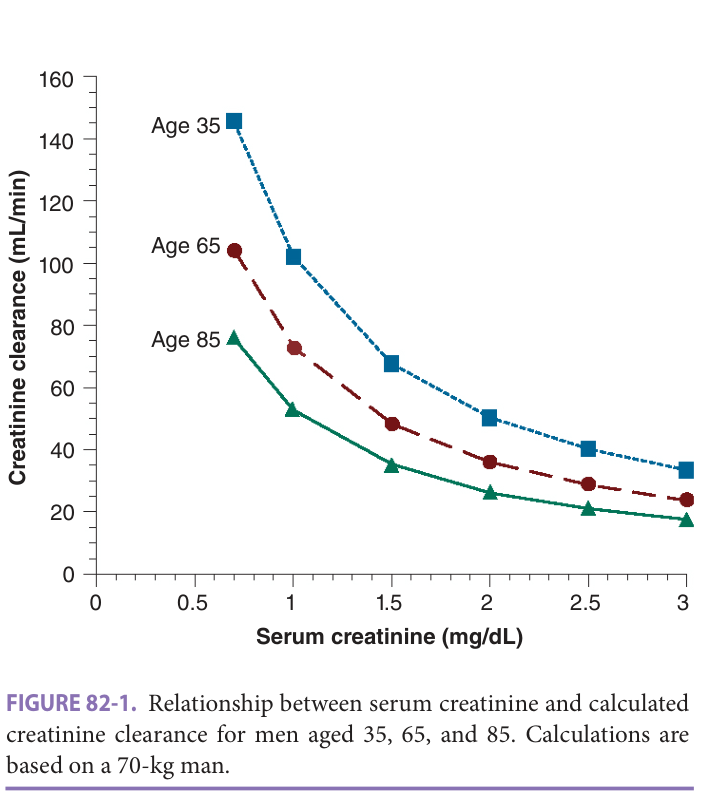
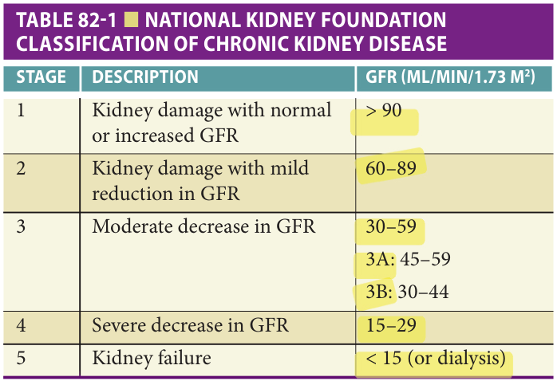
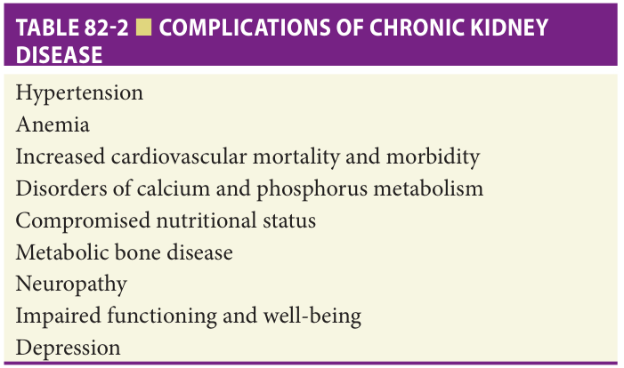

Study summary of Chapter 82 — Aging of the Kidney; the book is the reference.

# Chapter 82 Study: Aging of the Kidney

Full chapter available: [Read Chapter 82](?chapter=82).

Fast build from the book; not lane-reviewed.

## Summary

### Clinical relevance and the human aging pattern

**[p. 1267]**

- Kidney aging affects both structure and function. Baseline homeostasis is usually preserved, but the ability to respond to a challenge is compromised and susceptibility to injury increases. Genetic and environmental factors produce considerable variation in the rate of decline (p1267).
- Hypertension and diabetes accelerate age-related changes. Increasing survival into old age contributes to the growing number receiving kidney replacement therapy, beyond greater willingness to offer treatment (p1267).
- The cited US data report ESKD treatment initiation of approximately **1.27 per 1000** at ages **65–69**, **1.43 per 1000** at **70–75**, and a peak of **1.82 per 1000** at **80–84**. Over the preceding **10 years**, replacement therapy increased **35%** in those **75 or older** and **43%** in those **older than 80** (p1267).
- **Human kidney mass and size eventually decline; rat kidney weight increases throughout life.** Animal findings cannot simply be applied to humans. This page places peak human mass/size in the **fourth decade**; the later gross-anatomy paragraph places maximum weight/volume in the **third decade** (p1267; p1271). The shared conclusion is subsequent loss of renal mass, predominantly cortex (p1271).

### Functional reserve, GFR, and the misleadingly normal creatinine

**[p. 1268]**

- The structural pattern is **basement-membrane thickening, mesangial expansion, and progressive glomerulosclerosis**. Older autopsy studies did not reliably exclude kidney disease/comorbidity; longitudinal cohorts and carefully screened living donors better characterize healthy aging (p1268).
- Fluid and electrolyte homeostasis at baseline can remain normal while **renal reserve declines**. Both salt/water loads and deficits become harder to manage; acute illness can therefore uncover renal complications. Hypertension accelerates reserve loss (p1268).
- Average renal blood flow falls about **10% per decade**, from **600 to 300 mL/min/1.73 m² by the ninth decade**. Resistance rises in both afferent and efferent arterioles, independently of falling cardiac output or renal mass. Handling fluid/electrolyte loads and losses becomes less efficient (p1268).
- Most people lose about **10% of GFR and renal plasma flow per decade after the fourth decade**. Approximately **30%** show no measurable functional decline; **5–10%** have accelerated loss even without identifiable comorbidity (p1268). Thus, the opening clinical-point statement that all older adults decline is broader than the chapter's detailed population data (p1267–1268).
- **Serum creatinine should remain relatively constant with normal aging:** falling muscle mass reduces creatinine production while filtration falls. A rising creatinine must be taken seriously. A value at the upper end of the laboratory normal range may already represent substantial impairment and warrant renal adjustment of medicines (p1268).
- The book's Cockcroft–Gault calculation is creatinine clearance = **[(140 − age) × weight in kg] / [72 × serum creatinine in mg/dL]**, multiplied by **0.85 for women**. It may overestimate GFR in frail older women with little muscle mass. Figure **82-1** uses a **70-kg man** and demonstrates different clearances at the same creatinine across ages **35, 65, and 85** (p1268).
- Declining filtration also impairs salt/water excretion: replacement fluids require care to avoid extracellular overload. The book notes that the original MDRD formula was derived from community-dwelling volunteers aged **18–70**, was not validated in very old/frail people, and differs materially from other methods at advanced age and weight extremes (p1268).

Book Figure 82-1 — age, serum creatinine, and calculated clearance (p1268)

*Highlighting is the owner's annotation, not the book's.*

This figure is on an official-question-cited page; the question references identify pages, not this figure explicitly.

### Measurement, CKD staging, proteinuria, and tubular reserve

**[p. 1269]**

- The book calls iothalamate clearance the gold standard but expensive/impractical routinely. It favors **24-hour urine creatinine clearance** over formula estimates in the very old/frail, while explicitly noting that tubular creatinine secretion makes clearance **overestimate GFR**. It describes CKD-EPI as more accurate than original MDRD and cystatin C as avoiding the problem of reduced creatinine production (p1269).
- CKD requires kidney damage or reduced function for **3 or more months**. Kidney failure means GFR **<15 mL/min** or need for kidney replacement therapy. Damage, primarily proteinuria in this discussion, can coexist with preserved filtration (p1269).
- **Table 82-1, as printed** (GFR in **mL/min/1.73 m²**): stage **1**, kidney damage with normal/increased GFR **>90**; stage **2**, kidney damage with GFR **60–89**; stage **3**, **30–59**, subdivided into **3A 45–59** and **3B 30–44**; stage **4**, **15–29**; stage **5**, **<15 or dialysis** (p1269). The table prints **>90**, rather than an inclusive boundary (p1269).
- The complete complication list is hypertension, anemia, increased cardiovascular mortality/morbidity, calcium/phosphorus disorders, compromised nutrition, metabolic bone disease, neuropathy, impaired functioning/well-being, and depression (Table **82-2**, p1269).
- The chapter's referral recommendation is nephrology at **stage 4**, for complications such as acidosis, phosphorus retention, and anemia; discussion of kidney replacement should also begin then (p1269).
- **Proteinuria is pathological, not normal human aging**, and requires a full work-up despite age-related GFR decline. Rats commonly develop age-related proteinuria, so their tubular findings may reflect protein toxicity rather than normal human aging (p1269).
- Older volunteers have reduced ability to modulate medullary oxygenation, increasing vulnerability to acute ischemic renal failure. Many proposed abnormalities in vascular/autocrine responses come from animal experiments and have not been confirmed in humans. Impaired concentrating ability is demonstrated in both animal and human studies (p1269).

Book Table 82-1 — CKD classification (p1269)

*Highlighting is the owner's annotation, not the book's.*

This table is on an official-question-cited page; the question references identify pages, not this table explicitly.

Book Table 82-2 — all CKD complications listed (p1269)

*Highlighting is the owner's annotation, not the book's.*

This table is on an official-question-cited page; the question references identify pages, not this table explicitly.

### Potassium balance and hypokalemia

**[p. 1270]**

- Concentrating impairment may reflect tubular defects or altered ADH response; the mechanism is uncertain. Reduced urine acidification limits acid-load excretion. Declines in glucose/amino-acid transport parallel GFR loss and are attributed to lost nephrons rather than intrinsic tubular aging. Increased nephrotoxic susceptibility requires attention to antibiotic selection/dosing and iodinated contrast (p1270).
- Most body potassium is intracellular in skeletal muscle, so serum potassium incompletely reflects stores, especially under stress. Serum concentration depends on **renal handling and transmembrane shifts**. Insulin/glucagon, adrenergic stimulation, acid–base balance, and osmolality regulate shifts (p1270).
- With reasonably preserved kidney function, unstressed older adults can have normal potassium. As GFR falls, **fractional potassium excretion does not increase as much as in young people**, partly because of reduced aldosterone or aldosterone resistance. This is blunted compensation, not a general claim that fractional excretion always falls (p1270).
- Hypokalemia is **<3.5 mEq/L**. It is rare in healthy adults but can occur in up to **5%** of older people with contributing medicines/diet; medication-, disease-, or diet-associated hypokalemia was reported in **21%** of hospitalized patients (p1270).
- Manifestations include **proximal muscle weakness, intestinal ileus, arrhythmias, polyuria, and fatigue**; many patients are asymptomatic. Concurrent sodium disturbances, metabolic acidosis/alkalosis, and hypomagnesemia are common (p1270).
- Causes: poor intake (including alcoholism/eating disorders), renal or gastrointestinal losses (diuretics, mineralocorticoid excess, diarrhea), and intracellular shifts (insulin). Urine potassium, creatinine, and osmolality help identify renal wasting; an isolated urine potassium **>40 mEq/L** suggests excessive renal loss (p1270).
- Malnourished patients may have near-normal serum potassium despite major depletion. **Refeeding, aggressive insulin, or bicarbonate replacement** can abruptly lower it and provoke severe cardiac events. The chapter advises anticipating replacement and considering avoidance of dextrose-containing parenteral fluids until severe hypokalemia is partly corrected (p1270).
- The book favors **oral replacement** when possible. Severe hypokalemia or acute arrhythmias may require parenteral replacement; it describes **10 or 20 mEq at a time with frequent repeat measurements** as the safest approach. Low-dose potassium-sparing diuretics may reduce losses during continuing diuretic therapy, but require caution with CKD or other potassium-retaining medicines (p1270).
- Hyperkalemia susceptibility reflects lower kidney function and muscle mass, altered muscle ion regulation, lower renin/aldosterone, ACE inhibitors/ARBs/potassium-sparing diuretics, impaired intracellular uptake with glucose intolerance, and type **IV** renal tubular acidosis (p1270).

### Hyperkalemia: artifact, true risk, ECG, and treatment mechanisms

**[p. 1271]**

- The book generally defines hyperkalemia as **>5.3 mEq/L**, while acknowledging differing definitions. It occurs in up to **10%** of hospitalized patients. Despite theoretical susceptibility, studies had difficulty demonstrating a higher incidence in older versus younger users of renin–angiotensin–aldosterone inhibitors (p1271).
- **Spurious hyperkalemia** can result from hemolysis during difficult collection/sample deterioration, severe thrombocytosis, severe leukocytosis, or red-cell disorders. If suspected, obtain **plasma potassium**. Thrombocytosis is therefore a possible explanation for an unexpectedly high measured serum potassium (p1271).
- True hyperkalemia is often asymptomatic; weakness and fatigue are common. Findings may include reduced reflexes and bradycardia. Cardiac effects range from conduction delay/heart block to arrest, with possible sinus bradycardia, complete block, wide-QRS tachycardia, or a sine-wave pattern (p1271).
- **A normal or unimpressive ECG does not prove that a high potassium is spurious or insignificant.** The same concentration can have very different ECG effects; the taught sequence of peaked T waves, PR prolongation, absent P waves, and QRS widening is seldom seen as a predictable progression (p1271).
- Significant cases are commonly multifactorial: reduced kidney function plus excess intake, drugs impairing excretion/cellular uptake, or superimposed AKI. Particularly risky settings include **trimethoprim/sulfamethoxazole with spironolactone**, combined renin–angiotensin–aldosterone inhibitors, NSAIDs, and type **2** diabetes (p1271).
- Consider adrenal insufficiency in unexpected hyperkalemia: recurrent volume depletion/AKI with variable hyponatremia and hyperkalemia may respond readily to parenteral saline; fatigue may be the only symptom (p1271).
- The chapter manages asymptomatic, non-life-threatening cases by removing causative medicines, improving hydration, and correcting reversible renal impairment. Advanced conduction delay/bradycardia requires immediate measures (p1271).
- **IV calcium gluconate stabilizes the myocardium immediately but transiently; it does not lower potassium.** IV insulin, inhaled beta-agonists, and IV bicarbonate **when metabolic acidosis is present** shift potassium into cells. Insulin works within **15 minutes** and is shorter acting than beta-agonists (p1271).
- Shifting is temporary; potassium must ultimately leave the body. The book lists loop-diuretic-driven diuresis, exchange resin such as sodium polystyrene sulfonate, and dialysis. Choice depends on severity, kidney function, intestinal disease, and patient/physician preference; diuresis is effective with preserved kidney function, whereas impaired function may require resin and/or dialysis (p1271).
- Gross anatomy: renal mass declines after the **fourth decade**, mainly cortex with relative medullary sparing. The young kidney contains roughly **1 million nephrons**, with no evidence of postnatal nephrogenesis. Low initial nephron number as an explanation for later disease in low-birth-weight babies remains a hypothesis (p1271).

### Remaining chapter: structure and mechanisms

**[p. 1272]**

- Postmitotic podocytes cannot be replaced. Their loss is thought to precede sclerosis: expanding glomerular tufts leave progressively greater filtration area to cover, detachment exposes basement membrane, and segmental extracellular-matrix replacement can progress to global glomerular loss. Human aging studies were still in progress; much mechanistic evidence is experimental (p1272).
- Lost nephrons leave tubular degeneration/interstitial fibrosis; remaining tubules hypertrophy, particularly proximally. Distal tubular diverticula may develop while overall distal-tubule structure changes little. Arterial thickening and increased resistance accompany aging; afferent–efferent shunts after glomerular loss help maintain medullary flow (p1272).

**[p. 1273]**

- Greater transmitted pressure pulsatility may injure the renal microvasculature. Consider renal embolization when an older person with extensive vascular disease develops accelerated functional loss, particularly if embolization is evident elsewhere (p1273).
- Genetic and environmental factors both matter. Rat strains differ markedly in susceptibility. Human familial variation and APOL1 variants associated with recent African ancestry support inherited susceptibility to several nondiabetic kidney diseases. Hypertension and diabetes are the commonest environmental disease accelerators (p1273).

**[p. 1274]**

- Caloric restriction has striking protective effects in rodent kidneys; reduced oxidative injury is a proposed mechanism. Vitamin E did not prevent rat glomerulosclerosis and human supplementation studies were disappointing. Animal protein-restriction results are confounded by calorie/mineral changes (p1274).
- The book finds support for protein restriction to reduce uremic symptoms in established disease, **not for preventing normal age-related human renal change**. Hyperlipidemia accompanies faster deterioration in established renal disease; its role in ordinary kidney aging remains uncertain (p1274).
- Hyperfiltration is a proposed pressure-injury mechanism, largely supported by renal-remnant animal models. Remaining glomeruli hypertrophy as others are lost. The chapter notes that long-term human kidney donors did not show accelerated decline despite compensatory hypertrophy; protein meals can increase renal blood flow/GFR, but this does not establish generalized age-related hyperfiltration as the normal functional pattern (p1274).

**[p. 1275]**

- ACE inhibition reduces efferent arteriolar vasoconstriction/intraglomerular pressure. Its benefit in underlying disease does not establish prevention of normal age-related change. The chapter prioritizes preserving residual function with blood-pressure control, management of lipids/glycemia/weight, avoidance of nephrotoxins, and adjustment of renally cleared medicines (p1275).
- The book states a systolic target **<120 mm Hg**, and recommends a regimen including an ACE inhibitor or ARB, particularly with albuminuria, while stressing that these drugs do not substitute for blood-pressure control. It reports kidney and cardiovascular benefit of SGLT2 inhibitors in diabetic kidney disease already treated with ACE inhibition (p1275).
- Older-donor kidneys have shorter graft life, partly because ischemia/reperfusion and subsequent stresses may amplify pre-existing structural changes. Nevertheless, recipients of such kidneys on average still do better than people remaining on dialysis (p1275).

**[p. 1276]**

- Transplant programs increasingly consider otherwise healthy older adults. The chapter closes by recommending a GFR estimate for older patients, measures to prevent progression when impairment is identified, and particular care with medicine choice/dosing and imaging contrast as CKD progresses (p1276).

## Drill

**1. Which structural change supports normal kidney aging in a pathology question?**

Answer

Basement-membrane thickening, mesangial expansion, and progressive glomerulosclerosis (p1268).

**2. Why can a rising serum creatinine be pathological even when it remains near the laboratory normal range?**

Answer

Normal aging reduces muscle mass and creatinine production along with filtration, so serum creatinine should remain relatively constant. A rise should not be dismissed; upper-normal creatinine may represent significant functional loss (p1268).

**3. How do renal blood flow and vascular resistance change?**

Answer

Blood flow falls about 10% per decade, from 600 to 300 mL/min/1.73 m² by the ninth decade; resistance increases in both afferent and efferent arterioles (p1268).

**4. Is proteinuria an expected consequence of normal human aging?**

Answer

No. It is pathological and requires work-up; normal aging in rats differs, limiting extrapolation (p1269).

**5. What are the book's CKD duration requirement and stage subdivisions for moderately reduced GFR?**

Answer

Kidney damage or reduced function for at least 3 months. Stage 3 spans 30–59 mL/min/1.73 m²: 3A is 45–59 and 3B is 30–44 (p1269).

**6. Why does measured creatinine clearance overestimate GFR, and what marker avoids reduced creatinine production?**

Answer

Some urinary creatinine is secreted by proximal tubules rather than filtered. Cystatin C avoids the age-related creatinine-production problem (p1269).

**7. As GFR declines, how does potassium fractional excretion differ in older versus younger adults?**

Answer

It does not rise as much in older adults, partly from lower aldosterone or aldosterone resistance; unstressed serum potassium may nevertheless remain normal (p1270).

**8. A diuretic-treated older patient develops weakness, ileus, polyuria, and fatigue. Which electrolyte disorder fits?**

Answer

Hypokalemia. The book includes proximal weakness, intestinal ileus, arrhythmias, polyuria, and fatigue among its manifestations (p1270).

**9. Which urine finding suggests renal potassium wasting, and what can suddenly unmask depletion?**

Answer

An isolated urine potassium above 40 mEq/L suggests excessive renal loss. Refeeding, aggressive insulin, or bicarbonate therapy may abruptly lower serum potassium in depleted patients (p1270).

**10. How can severe thrombocytosis produce an unexpectedly high potassium result, and what sample does the book advise?**

Answer

It may cause spurious serum hyperkalemia. Obtain plasma potassium when this is suspected (p1271).

**11. Does absence of typical ECG changes exclude dangerous hyperkalemia?**

Answer

No. Manifestations vary at the same potassium level, and the classic ordered ECG progression is seldom seen; absent changes do not establish error or insignificance (p1271).

**12. What does calcium accomplish in severe hyperkalemia, and which treatment removes potassium rather than merely shifting it?**

Answer

Calcium stabilizes the myocardial membrane without lowering potassium. Insulin, beta-agonists, and bicarbonate in metabolic acidosis shift potassium into cells; loop-diuretic-driven excretion, exchange resins, and dialysis remove it (p1271).

**13. Name a high-risk drug combination for hyperkalemia and a less obvious endocrine cause.**

Answer

Trimethoprim/sulfamethoxazole with spironolactone is a highlighted combination. Adrenal insufficiency can present with recurrent volume depletion/AKI, variable hyponatremia/hyperkalemia, and fatigue (p1271).

**14. What makes podocyte loss important in the proposed sclerosis mechanism?**

Answer

Podocytes are postmitotic and cannot be replaced. Detachment exposes basement membrane and is thought to trigger sclerosis, eventually eliminating the nephron (p1272).

**15. Does the chapter establish protein restriction as prevention of normal human kidney aging?**

Answer

No. Animal findings are confounded by calorie and mineral changes; the chapter supports protein restriction for uremic symptoms in established disease, not prevention of human age-related change (p1274).

