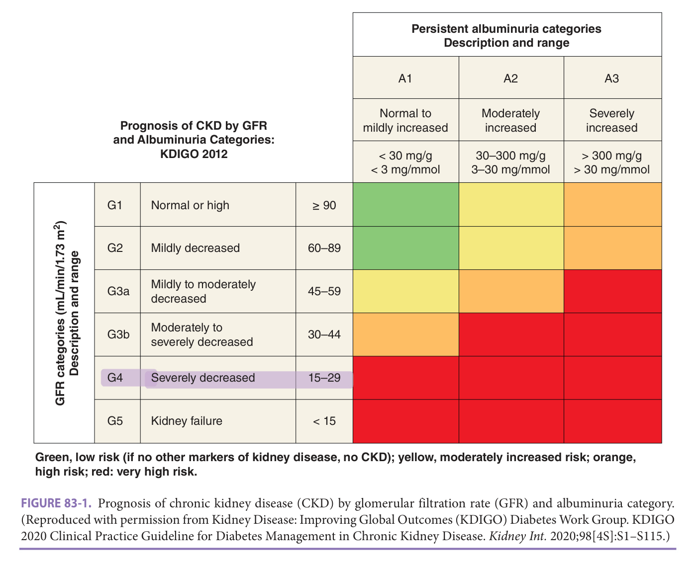
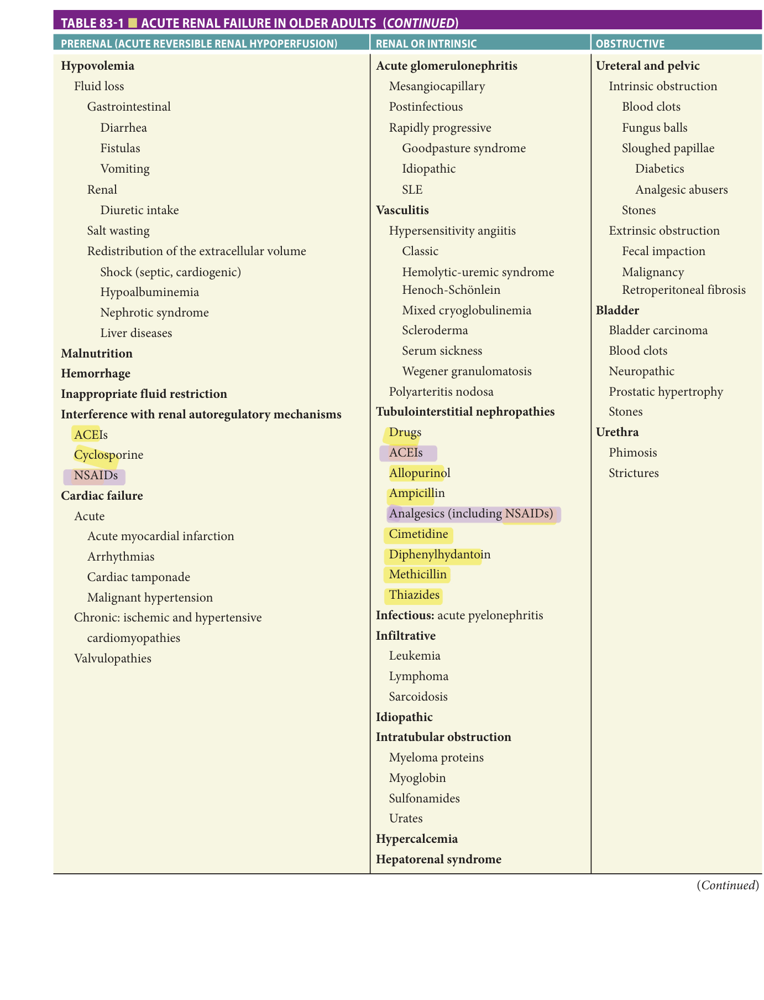
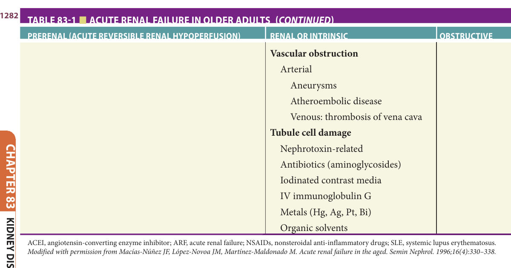
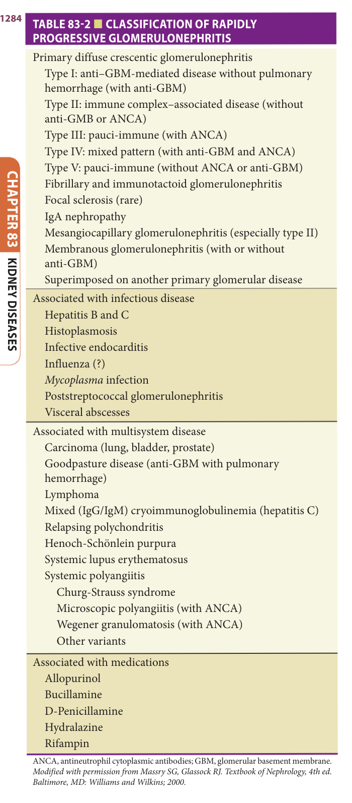
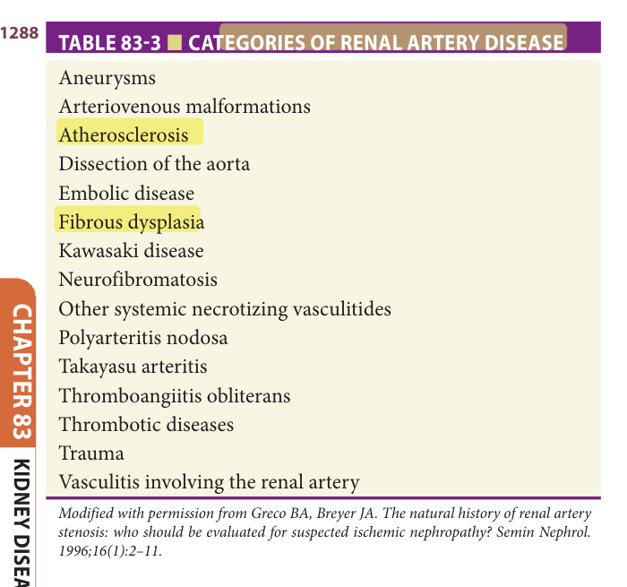
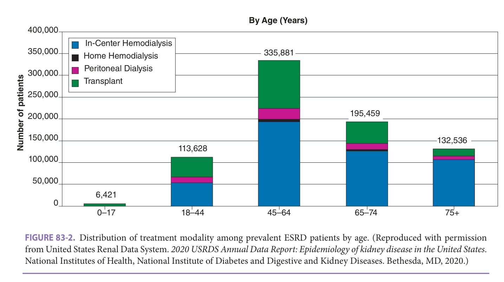
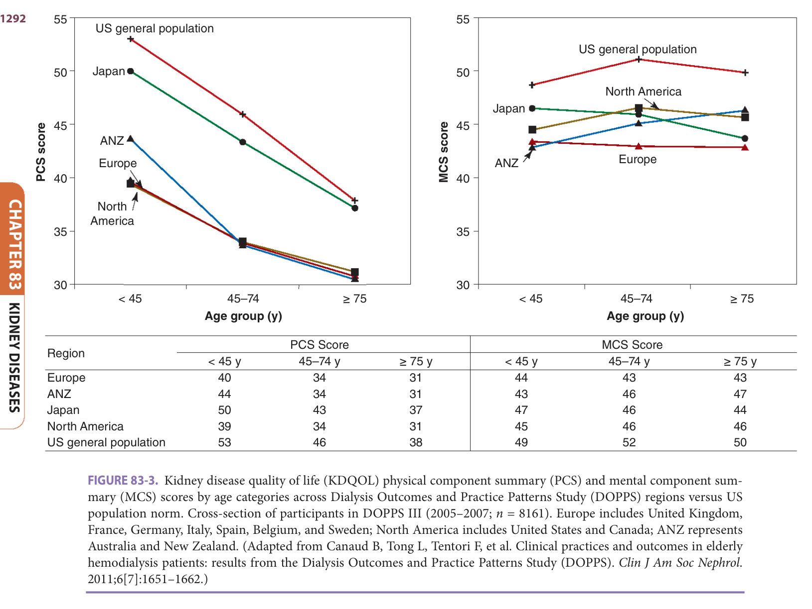
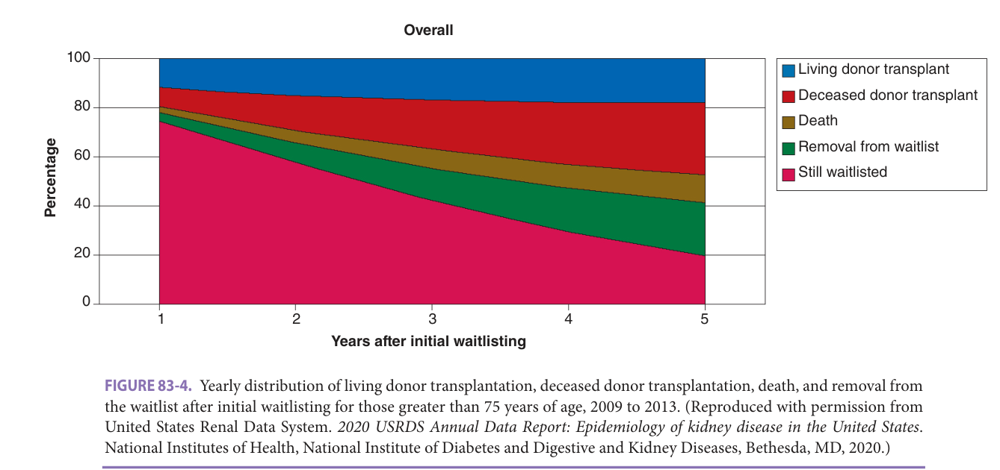
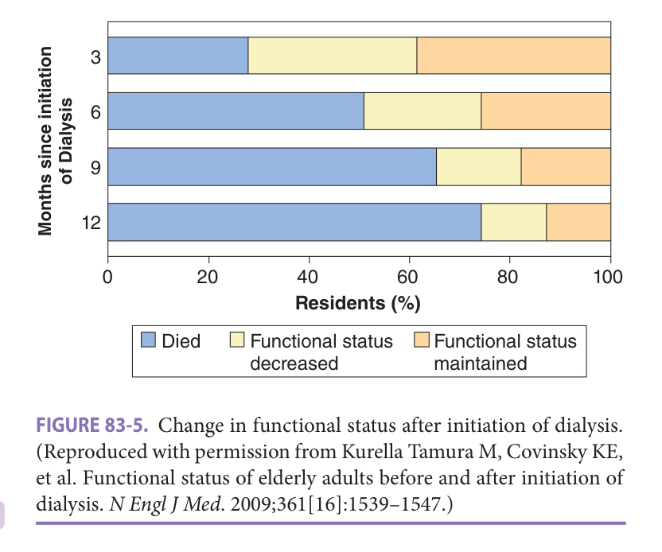

# Hazzard's Geriatric Medicine and Gerontology, 8e — Chapter 83: Kidney Diseases

Mark Unruh, Nitin Budhwar

> **Fast build from the book, 22-23 Sep; not lane-reviewed.**

**[p. 1277]**

#### Learning Objectives

- Recognize that chronic kidney disease (CKD) is most often caused by common systemic diseases, including diabetes and hypertension.
- Understand that diabetic nephropathy is a chronic progressive kidney disease that requires treatment with angiotensinconverting enzyme inhibitor (ACEI) or angiotensin receptor blockers (ARBs) if tolerated, optimization of blood pressure and blood glucose levels, and management of comorbidities. SGLT2 inhibitors and GLP-1 receptor agonists show benefits in treatment of diabetes and substantial reduction of risk of kidney disease progression.
- Assess acute kidney injury (AKI) for pre-, post-, and intrarenal causes among the older adult. Even episodes of mild AKI can increase the risk for future CKD and the etiology of AKI is often related to the sex, age, and location of the patient.
- Understand the prognosis of older adults with kidney failure.
- Characterize the approaches to managing end-stage kidney disease (ESKD) among older adults.
- Describe the influence of multiple chronic health conditions on quality of life and functioning among older adults with kidney failure.
- Recognize the challenges in providing care to older patients with kidney failure and concurrent cognitive impairment and frailty.
- Discuss the role of clinicians and care teams in advance care planning for patients with ESKD.

#### Key Clinical Points

1. In patients with CKD, management of elevated blood pressure and avoidance of nephrotoxins can delay progression to ESKD.
2. Complications of CKD include iron-deficient anemia and secondary hyperparathyroidism.
3. Proteinuria in the absence of hematuria is a sign of kidney damage, is a risk factor for prog ression of CKD to ESKD, and requires evaluation.
4. In patients with renovascular disease, intervention is usually only indicated if conservative management fails.
5. Clinical guidelines suggest that patients with progressive CKD should be managed in a multidisciplinary setting. Nephrologist referral should be considered under the following circumstances: AKI, urinary red cell casts, CKD and refractory hypertension, persistent abnormalities of potassium, recurrent or extensive nephrolithiasis, hereditary kidney disease, CKD stages 4 and 5, and patients with severely increased albuminuria.
6. Older patients with kidney failure have a multitude of choices for kidney replacement therapy including hemodialysis, peritoneal dialysis, conservative management, palliative care, and kidney transplantation.
7. There are no age restrictions on access to kidney transplantation in the United States. Older kidney transplant patients tend to have less kidney allograft rejection and a higher complication rate from infections.
8. Kidney failure is associated with a markedly high mortality rate among older patients initiating dialysis—average 1-year survival rate is 50% for octogenarians and nonagenarians who start dialysis.

## Introduction

Given the relationship of kidney disease with age and chronic conditions, older adults have a higher frequency of both chronic kidney disease (CKD) and acute kidney injury (AKI). The older adult with kidney injury should be systematically evaluated and treated for AKI and CKD. As the population ages, there will be an increased number of patients with advanced CKD and kidney failure. The older patient with kidney failure now has a multitude of choices for renal replacement therapy (RRT) including hemodialysis, peritoneal dialysis, conservative management, palliative care, and kidney transplantation. Primary care physicians and geriatricians should identify CKD in older patients and have their care managed by a multidisciplinary team. The geriatrics team remains in the key role of addressing advance directives and planning long-term care and continued management of their nonrenal problems. Older patients with CKD will remain an economic and medical challenge, and a multidisciplinary approach to care for these patients will provide the best long-term outcomes.

## Aging Kidneys

The kidneys undergo anatomic and physiologic changes that are not only the consequences of normal organ senescence but also of specific diseases that occur with greater frequency in older individuals. Structural changes that occur at an increasing rate with age include glomerular hypertrophy and glomerulosclerosis, tubular atrophy, and interstitial fibrosis as well as arteriolosclerosis. Functionally, several longitudinal studies have shown that glomerular filtration rate (GFR) declines in the majority of people with older age independent of other chronic diseases. Additional details are provided in Chapter 82, Aging of the Kidney.

## Chronic Kidney Disease (CKD)

## Definition

CKD is a general term for heterogeneous disorders affecting the kidney’s structure and function. CKD is now recognized as a worldwide public health problem. Its management in early stages is tasked to the general practitioners

**[p. 1278]**

and geriatricians. The presentation of patients with CKD can vary and is related to disease etiology, severity, and rate of progression. CKD is classified into stages of disease severity, which are based on GFR described in clinical practice guidelines ( **Figure 83-1** ).

The criteria for CKD include an estimated GFR less than 60 mL/min/1.73 m2 (normal GFR in young adults is about 125 mL/min/1.73 m2 ; GFR < 15 mL/min/1.73 m2 is defined as kidney failure), albuminuria (urinary albumin-to-creatinine ratio > 30 mg/g), hematuria (any degree on urine dipstick), presence of urinary casts in the urine sediment (seen by microscopy of urinary sediment), and abnormalities on kidney imaging for a duration of more than 3 months.

It should be mentioned that some in the field have raised concerns that this classification overestimates the CKD burden in the older adult population when considering clinical outcomes. The equations estimating GFR have relied on creatinine, sex, age, and race as factors to predict kidney function. It has been determined that low estimated GFR (eGFR) and high albuminuria are independently associated with increased mortality and risk to develop endstage kidney disease (ESKD) regardless of age across a wide

range of populations. In addition, even smaller decreases in eGFR (such as < 30% reduction over 2 years) were strongly and consistently associated with increased mortality and risk of ESKD. Thus, CKD contributes significantly to increased morbidity and mortality. However, patients with CKD are a very heterogeneous group and eGFR and albuminuria alone may not be sufficient to predict outcomes, especially in the older adult population. Therefore, care should be provided in context of the individual situation and needs.

## Epidemiology

Even though the prevalence and incidence of kidney failure treated with dialysis and kidney transplantation is monitored closely in many countries, the estimation of the burden of early stages of kidney disease remains difficult. In the United States, the prevalence of CKD based on estimated GFR and albuminuria was about 11.5% (4.8% in stages 1–2 and 6.7% in stages 3–5) in the general population but was 47% in people older than 70 years. Therefore, CKD constitutes a major health concern in particular in older adults.

## Pathophysiology (Classification)

Many systemic diseases can result in CKD, in particular diabetes mellitus and hypertension. Diabetic nephropathy (DN) and glomerular and tubule-interstitial diseases with defined etiologies and presentations will also be described. Hypertension can contribute to CKD (hypertensive nephropathy) and also accelerate progression of CKD due to other etiologies.

## Presentation

CKD is usually asymptomatic until GFR falls below approximately 15 to 20 mL/min/1.73 m2 when patients may report early signs and symptoms of uremia. Initial symptoms are nonspecific and include decreased energy levels and appetite, metallic taste, worsening of lower extremity edema, and new onset or worsening of nocturia. Some patients notice bubbly or dark urine as a sign of proteinuria or hematuria, respectively.

## Evaluation

Kidney function is usually assessed by serum creatinine and blood urea nitrogen (BUN) levels, electrolytes, urinalysis, and urine protein-creatinine protein ratio (or quantitative albuminuria). If there are situations that may limit the accuracy of creatinine, one could use cystatin C to provide another estimate of GFR. If these tests are abnormal, further evaluation may include a kidney ultrasound with Doppler to determine kidney size (enlarged kidneys can be seen in patients with polycystic kidney disease [PKD], infiltrative processes, amyloidosis, and diabetic and HIV nephropathy; small kidneys can be congenital or due to long-standing CKD), echogenicity (increased in long-standing CKD and infiltrative processes), renal blood flow (decreased with long-standing CKD or with occlusion of renal arteries

**[p. 1279]**
**Green, low risk (if no other markers of kidney disease, no CKD); yellow, moderately increased risk; orange, high risk; red: very high risk.**

> *FIGURE 83-1. Prognosis of chronic kidney disease (CKD) by glomerular filtration rate (GFR) and albuminuria category. (Reproduced with permission from Kidney Disease: Improving Global Outcomes (KDIGO) Diabetes Work Group. KDIGO 2020 Clinical Practice Guideline for Diabetes Management in Chronic Kidney Disease. _Kidney Int._ 2020;98[4S]:S1–S115.)*

> Highlighting is the owner's annotation, not the book's.

including after renal infarct), and renal pelvis dilatation (in ureteral or severe bladder outflow obstruction).

Previous blood, urine, and imaging test results should be obtained if available to determine duration and rate of change. A detailed medical and surgical history should be obtained, including childhood diseases, in particular - edema and proteinuria in the past and history of rheumatic fever or other severe conditions. The family history can point toward inheritable kidney diseases (including PKD and focal segmental glomerular sclerosis [FSGS]). Social history may identify exposure to toxins and herbal remedies. Additionally, the history can help to identify risk factors for progression of CKD to ESKD. A comprehensive physical examination can detect elevated blood pressure, obesity, signs of heart failure, pulmonary and peripheral edema, liver disease, vasculitis/autoimmune disease, etc.

## Management

Significant progress has been made in establishing approaches that target underlying specific diseases with the goal of improving disease-related outcomes. However, features of geriatric populations such as complex comorbidities, life expectancy, functional state, and health priorities may limit the utility of disease-oriented models of care. Individualized patient-centered approach to care may have

more to offer than a traditional disease-based approach to CKD in many older adults.

Attention should be given to cardiovascular disease, which is not only a risk factor for CKD, but also for progression of CKD. Blood pressure control has been shown to limit the progression of CKD. There are a number of guidelines that address target blood pressure goals in CKD with the recommendations aiming for systolic blood pressures between 120 and 130 mm Hg and diastolic under 90. Given the complexity of the geriatric patient, numerous factors need to be considered such as tolerance, cost, side-effect profile, polypharmacy, competing chronic conditions, and goals of care.

**Pharmacologic** Choice of antihypertensive medications should be guided not only for blood pressure control, but also for benefits related to delaying CKD progression and controlling proteinuria, with an acceptable side-effect profile.

Blockade of the renin-angiotensin system (RAS) using ACEIs or ARB lowers blood pressure and also decreases proteinuria and is therefore the mainstay in patients with diabetes in whom DN is suspected. Combination of ACEI and ARB is associated with increased complications and is in general not advised. Two FDA-approved diabetes medications have also been shown to have significant reduction of risks associated with CKD—SGLT2 inhibitors and GLP-1 receptor agonists.

**[p. 1280]**

> Medications from these classes should be considered for patients with type 2 diabetes and CKD and the indications for use of SGLT2 may be expanding to other etiologies of kidney disease such as IgA nephropathy. They may also be of benefit in nondiabetics with CKD—but the data to support this is still emerging. In addition, management of hyperlipidemia with statins or statins plus ezetimibe is recommended for older adults with eGFR less than 60 mL/min/1.73 m2 .

**Nonpharmacologic** Patients with CKD are more likely to experience AKI, and AKI is a risk factor for progression to ESKD. Thus, preventing AKI is important to delay CKD progression. Avoidance of nephrotoxins is a mainstay of CKD management. In particular, nonsteroidal anti-inflammatory drugs (NSAIDs) can have detrimental effects especially if the patient is also taking ACEIs or ARBs, by decreasing glomerular perfusion and filtration rate. Contrast dye can cause tubular cell damage and AKI possibly leading to CKD. Many antibiotics can have nephrotoxic effects and cause AKI.

Obesity is associated with compensatory glomerular hypertrophy, which causes podocyte hypertrophy that may progress to podocyte dysfunction, decreased podocyte density, and accelerated loss of kidney function. CKD is associated with salt retention and a low-salt diet may slow progression of CKD independent of improving hypertension.

## Prevention

Prevention is the ideal approach to prevent ESKD and its associated morbidity and mortality. High-risk patient subgroups may particularly benefit from implementation of measures to detect and prevent CKD. Patients with diabetes mellitus should be screened regularly for albuminuria and elevations in serum creatinine levels. Similarly, patients with hypertension, peripheral vascular occlusive disease, reduced kidney mass (ie, after a nephrectomy), or a family history of kidney disease should be regularly evaluated. Patients with risk factors for CKD should be monitored for optimal blood pressure control, avoidance of nephrotoxins, polypharmacy, and episodes of AKI.

## Protein In The Diet

In nondiabetic patients with CKD with less advanced disease (CKD stage 3 or lower), low-protein diets do not appear to reduce the progression to ESKD compared with normalprotein diets.

There is some evidence that low-protein diets (0.5–0.6 g per kg per day) or very low-protein diets (0.3–0.4 g per kg per day) may reduce the number of patients with advanced kidney disease (CKD stage 4 or 5) who progress to ESKD. - This should be done with regular monitoring to prevent malnourishment.

## Special Issues

**Patient preference** Once the eGFR falls below approximately 20 mL/min/1.73 m2 , the risk to develop ESKD requiring dialysis support increases significantly and a discussion about patient preferences regarding dialysis should be

initiated. In this context, the comorbidities and functional status of the patient should be considered, because quality of life and functional status may not improve or could be worsened after initiation of dialysis in patients with high comorbidity burden and low functional status.

**Comorbidity** Management of comorbidities is important in the care of patients with CKD. One of the most important comorbidities is hypertension. With worsening kidney function secondary hyperparathyroidism can develop due to retention of phosphate and decreased activation of vitamin D causing parathyroid hormone (PTH) to increase. Therefore, serum phosphate, 25-OH-vitamin D, and PTH levels should be monitored. Hyperphosphatemia can be managed by low-phosphate diet. Oral phosphate binders, such as calcium acetate, sevelamer, or lanthanum carbonate, may have to be given if diet is not successful in maintaining normal phosphate levels. Decreased 25-OH-vitamin D levels should be treated with supplementation of cholecalciferol or ergocalciferol. Significantly, elevated PTH levels unresponsive to vitamin D supplementation may require treatment with active vitamin D analogs, including calcitriol, but have to be used with great care due to the risk of hypercalcemia and hyperphosphatemia. Patients with PTH levels unresponsive to vitamin D supplementation may be evaluated for tertiary hyperparathyroidism.

**Care settings** CKD is primarily managed in an outpatient setting.

## Acute Kidney Injury

## Definition

AKI is defined by an increase in creatinine (decrease in eGFR) within a few days or even hours, but it is important to understand that rising creatinine levels are likely not very sensitive. AKI is further classified as nonoliguric (> 400 mL/day), oliguric (100–400 mL/day), and anuric (< 100 mL/day). This has prognostic implications as nonoliguric AKI is associated with better outcomes. AKI can be further distinguished by etiology such as prerenal, intrarenal, and postrenal.

## Epidemiology

The incidence of AKI increases with age, with the majority of patients who develop AKI being older than 65 years. When AKI does occur in this age group, it is associated - with significant morbidity and mortality. However, the epidemiology of AKI is difficult to determine consistently and detailed information about long-term outcomes is often lacking. Studies have shown that even modest increases (< 50%) of serum creatinine levels are associated with significantly higher risk of long-term CKD.

## Pathophysiology (Classification)

Etiologies of AKI can be categorized into prerenal, postrenal (obstructive), and intrarenal (intrinsic) causes (summarized in **Table 83-1** ). Prerenal etiologies include

**[p. 1281]**

> *Table 83-1 reproduced as a page image (printed p. 1281) — the grid did not extract reliably as text for this fast build.*

> Highlighting is the owner's annotation, not the book's.

 **[p. 1282]**

> *Table 83-1 (continued) reproduced as a page image (printed p. 1282) — the grid did not extract reliably as text for this fast build.*

> Highlighting is the owner's annotation, not the book's.

intravascular volume depletion due to fluid loss with decreased total body volume (ie, diarrhea, vomiting, and active bleeding) or low intravascular oncotic pressure (hypoalbuminemia secondary to nephrotic syndrome [NS], liver dysfunction, or malnutrition). Decreased cardiac output can also lead to a prerenal state even if the patient has peripheral and pulmonary edema. Patients with preexisting renal vascular disease are also at increased risk for prerenal AKI with milder degree of hypovolemia or hypotension.

Postrenal etiologies for AKI include bladder outflow or ureteral obstruction. Obstruction of one ureter usually does not cause markedly elevated creatinine levels except in patients with some degree of preexisting CKD or only one functional kidney. In older adults, benign prostate hypertrophy and malignancies, including prostate cancer and cancer of cervix and uterus, have to be considered. In particular, bilateral ureteral obstruction without bladder retention is highly suspicious for a malignant mass in the lower abdomen.

Intrarenal causes of AKI can be caused by acute glomerular nephritis (GN) or tubule-interstitial nephropathies. Acute GN can be caused by rapidly progressive GN due to systemic vasculitis or autoimmune complex deposition in the kidney (see below). Tubulointerstitial nephropathies can be secondary to nephrotoxins, which cause acute tubular necrosis (ATN), intratubular obstruction, interstitial infiltration, or inflammation. ATN can be caused by a large number of nephrotoxins, including IV contrast dye, chemotherapeutic agents, and antibiotics, which are taken up by tubular epithelial cells leading to acute tubular cell damage. In the setting of trauma or hemolysis, free hemoglobin and myoglobin can cause ATN (pigment nephropathy). Tumor lysis

syndrome is seen during treatment of cancer, in particular lymphomas and leukemias and is characterized by hyperkalemia, hyperphosphatemia, and hyperuricemia. Contrast-induced acute kidney injury (CI-AKI) represents a common form of iatrogenic AKI. Major risk factors for CI-AKI include old age, presence of CKD, diabetes, heart failure, volume depletion, and concomitant exposure to other nephrotoxins. There has been research into the best strategies to mitigate the risk for CI-AKI when administering IV contrast. The primary approach is to avoid the exposure if possible and confirm that a study with iodinated contrast generates adequate benefit to assume the risk. In higher-risk patients, approaches to attenuate the risk of CI-AKI include stopping any nephrotoxins, use of intravenous isotonic saline for volume expansion, and use of a low or iso-osmolar contrast agent.

Polypharmacy and drug toxicity exacerbate the susceptibility of older adults to AKI. Drugs commonly associated with AKI include NSAIDs, diuretics, ACEIs, ARBs, and antibiotics. Moreover, NSAID use doubles the risk for AKI in adults older than age 65. Older adults are also at increased risk for renal injury in particular due to hypovolemia, sepsis, and iatrogenic complications related to drug toxicity.

## Presentation

Patients with AKI can be asymptomatic and detected solely by elevated creatinine levels or present with symptoms that result from various disturbances of kidney function. Patients may have decrements in urine output and signs of volume overload. In patients with more advanced stages of AKI, accumulation of substances cleared by the kidney can lead to uremic symptoms characterized by fatigue, loss

**[p. 1283]**

of appetite, headache, nausea and vomiting, metallic taste, shortness of breath, asterixis, lethargy, and seizure. Potassium levels can increase and lead to cardiac arrhythmias, which can be life threatening.

## Evaluation

Kidney function should be examined in every patient at risk for AKI based on presenting symptoms. If creatinine is found to be elevated, values from previous tests are helpful to determine duration of renal dysfunction. Urine output has to be monitored accurately and catheterization of the bladder should be considered if clinically indicated as in case of bladder outflow obstruction. An ultrasound of the kidneys may be performed to evaluate for hydronephrosis and kidney size as well as echogenicity, which can be increased in both CKD and ATN. Doppler of the kidneys can determine blood flow (decreased or absent in renal artery or vein thrombosis) and resistive indices (increased in CKD and ATN). Urinalysis findings including casts, crystals, and tubular cells can be suggestive of tubular necrosis. Prerenal volume depletion is supported by clinical examination, including hypotension, tachycardia, decreased skin turgor, and dry oral mucosa.

## Management

The management of AKI is focused on treating the underlying cause and supportive medical management. Prerenal volume depletion is treated with volume repletion using isotonic solutions with careful monitoring of fluid status, respiratory function, and urine output. Postrenal causes acutely require placement of a bladder catheter for bladder outflow obstruction or placement of ureteral stents or nephrostomy for ureteral obstruction. The mainstay in the management of patients with intrarenal AKI is close monitoring of renal function, electrolytes, volume status, and urine output as well as signs or symptoms of uremia in order to determine need for dialysis support. Diuretics can be used if needed to manage volume status and potentially avoid respiratory failure, but maintaining urine output above oliguric levels does not improve the outcome of AKI. Thus, diuretics should be used to address volume overload, and prevent respiratory failure. Hyperkalemia can often be managed nonacutely with low-potassium diet and diuretics. Dialysis support may be required in patients with AKI. Dialysis initiation is determined by the development of indications for dialysis, including electrolyte, acid–base and fluid volume abnormalities that are life-threatening and cannot be managed medically, and symptoms related to uremia.

## Prevention

Older adults are at increased risk for AKI due to polypharmacy, high prevalence of preexisting CKD, and decreased oral intake (decreased thirst). Limiting polypharmacy is

already a mainstay of geriatric care, but a particular focus is necessary for AKI prevention.

## Special Issues

**Patient preference** AKI may require temporary dialysis support or lead to ESKD and permanent chronic dialysis dependence. It is important to discuss the patient’s preferences toward dialysis with sufficient time prior to initiation of dialysis, especially among older adults who initiate dialysis in the intensive care (ICU) setting due to a decreased survival rate.

**Comorbidity** Almost half of Medicare beneficiaries age 65 or older have three or more chronic conditions, and the number of preventable hospitalizations per 1000 beneficiaries increases with the number of chronic conditions. Comorbidities that increase the risk for AKI are common among older patients. Patients with both CKD and AKI tend to be older, have ischemic heart disease, and be less likely to recover kidney function than patients with AKI alone.

**Care settings** AKI is very common in the inpatient setting owing to the complications of an acute illness and resulting acute interstitial nephritis (AIN) and ATN. The underlying etiologies of AKI in the outpatient setting are different with obstruction and polypharmacy as more likely causes in the geriatric population.

## Glomerulonephritis (GN)

Some GN conditions have a second peak in the geriatric population such as small-vessel vasculitis and postinfectious glomerulonephritis (PIGN). GN can be classified into groups based on course, histopathologic findings, and disease etiology. Rapidly progressive GN (RPGN) can be associated with autoimmune processes, infectious diseases, and systemic diseases, in particular vasculitides, malignancies, and medications ( **Table 83-2** ). The most common primary GN worldwide is immunoglobulin A (IgA) nephropathy. It can have a highly variable course with some patients presenting with RPGN, approximately 30% to 40% of patients progressing to ESKD within 20 years and other patients only having persistent hematuria without proteinuria or changes in GFR. The incidence of ESKD in older patients with IgA nephropathy (older than age 50) is almost two times higher than that in younger patients. PIGN is considered primarily a childhood disease, but more recently its occurrence in older patients is becoming recognized. PIGN presents typically with hematuria and proteinuria 10 to 14 days after an infection. Hypocomplementemia was present in more than 70% and almost half of patients required acute dialysis. Only about 20% achieved complete recovery, half had persistent renal dysfunction, and about 30% progressed to ESKD. In summary, the epidemiology of PIGN is shifting as the population ages. Older men and patients with

**[p. 1284]**

> *Table 83-2 reproduced as a page image (printed p. 1284) — the grid did not extract reliably as text for this fast build.*

> Highlighting is the owner's annotation, not the book's.

ANCA, antineutrophil cytoplasmic antibodies; GBM, glomerular basement membrane. _Modified with permission from Massry SG, Glassock RJ. Textbook of Nephrology, 4th ed. Baltimore, MD: Williams and Wilkins; 2000._

diabetes or malignancy are particularly at risk, and the sites of infection and causative organisms differ from the typical childhood disease.

Small-vessel vasculitis is rare and often presents with systemic symptoms, including fatigue, malaise, loss of appetite,

fever, and weight loss. Occasionally hemoptysis, rash, and joint pain are noted. Some patients do not have any systemic symptoms, but rather develop hematuria, variable degree of proteinuria, and rising creatinine. In those patients, a kidney biopsy may show pauci-immune GN.

## Presentation

Patients with GN report constitutional symptoms, including decreased energy, general malaise, decreased appetite, fever and weight loss, and muscle aches. These symptoms are nonspecific and some patients attribute those symptoms to viral infections like upper respiratory infections. Any of those symptoms should prompt examination of kidney function and urine. The presence of hematuria and proteinuria should immediately raise concern for GN.

## Evaluation

The evaluation of a patient with suspected glomerular disease depends primarily on the acuity of the presentation. If the patient presents with acute kidney failure and has hematuria and proteinuria, RPGN has to be suspected. In emergent and urgent presentations, the prompt consultation of nephrology may help to guide both diagnostics and therapeutic approaches.

The decision whether and when to perform a kidney biopsy depends on the overall condition and status - of each individual patient. Increased frailty and decreased functional status at baseline, preexisting baseline CKD with decreased eGFR, and small echogenic kidneys on ultrasound, limited life expectancy as well as anemia, thrombocytopenia, and coagulopathy increase the risk for complications after kidney biopsy.

If the patient has stable renal function but a glomerular disease is suspected because of hematuria and proteinuria, the patient should first undergo serologic evaluation. Depending on those results a kidney biopsy can be - considered. If the creatinine is rising and pre- and postrenal causes of AKI have been excluded, an urgent kidney biopsy may be considered.

## Management

The diagnosis of RPGN may justify empiric immunosuppressive therapy. Even with stable kidney function, it is important to establish specific disease etiologies to guide therapy.

**Pharmacologic** Corticosteroids are the mainstay in the treatment of acute and chronic GN. Patients need to be monitored closely for any signs or symptoms of recurrence of disease in particular during tapering prednisone dose and after its discontinuation.

Cytotoxic therapy with agents such as cyclophosphamide is considered in patients with crescentic and proliferative GN detected on biopsy or in the setting of other potentially life-threatening complications (ie, hemoptysis, severe hemolytic anemia, and thrombocytopenia). Whether to use IV or oral Cytoxan and length

**[p. 1285]**

of therapy depends on the specific disease, severity of initial presentation, and degree of response. Anti-CD20 - antibodies (rituximab) can be considered with equivalent potency compared to Cytoxan as suggested by recent studies. Maintenance therapy is usually required to prevent disease recurrence. The goal is to maintain the patient on the lowest dose of corticosteroids and steroid-sparing agents without flare of the disease or significant complications of therapy.

Supportive medical management is critical for patients with GN, in particular management of blood pressure (hyper- and hypotension), intravascular and total body fluid volume, electrolyte abnormalities, and unwanted effects and complications of therapy.

## Special Issues

**Patient preference** Treatment of GN is associated with significant side effects and complications, which need to be balanced with side effects and complications of renal failure and ESKD. Risks and benefits of all options with specific consideration of the underlying condition, renal and overall survival prognosis with and without treatment, comorbidities, functional status, and expectations should be discussed. Furthermore, treatment with immunosuppressive medications often requires frequent office visits and laboratory tests, which may significantly affect quality of life or may even not be feasible.

## Nephrotic Syndrome (NS)

## Definition

NS is defined as the presence of nephrotic range proteinuria (> 3 g/day), hypoalbuminemia, edema, and dyslipidemia. It is caused by different diseases affecting primarily the glomerular structure, in particular podocytes and the slit diaphragm that spans between the foot processes of podocytes. Thus, patients with NS always have glomerular and podocyte damage detected on kidney biopsy. Patients in all age groups can develop NS and the incidence and prevalence of NS in older adults is not clear. NS is likely to be missed in older adults who often have edema and low serum albumin caused by other etiologies. Minimal change disease (MCD) is most common in children and has a second peak in adults older than age 50. DN may be the most common cause of NS in adults.

## Pathophysiology (Classification)

The differential diagnosis in older adult patients presenting with NS includes most diseases that are seen in younger adults. A kidney biopsy may be needed to define the cause of NS and estimate the degree of fibrosis in this age group, and thereby greatly aid in focusing the diagnostic evaluation and in planning treatment. Many clinicians recommend deferring additional laboratory or imaging procedures until the histopathologic diagnosis of NS has been made by renal biopsy.

The most common diseases identified by kidney biopsy are membranous nephropathy (MN), MCD, and - amyloidosis, with approximately 60% of all cases accounted for by these three conditions. Less common causes among - older patients undergoing a biopsy for diagnosis of NS are --FSGS, proliferative GN, and DN. A membranoproliferative pattern of injury can be seen in association with a monoclonal deposition disease, such as light-chain deposition disease, which is more common in older adults. DN is less commonly encountered on biopsies, largely because patients with diabetes and NS seldom undergo renal biopsy unless “atypical” features are present such as onset of NS fewer than 5 years from discovery of diabetes, rapid progression of renal impairment, or absence of proliferative retinopathy and other microvascular complications of diabetes.

MCD is encountered in approximately 15% and MN in approximately 30% to 40% of renal biopsies in older adult with isolated NS. Both MN and MCD can be primary idiopathic glomerular diseases or secondary to extra renal conditions such as neoplasia, drugs, or infection. Approximately 10% of renal biopsies in older patients believed to have primary idiopathic NS on clinical grounds will reveal amyloidosis. Amyloidosis in the older adult is most often of the primary variety.

## Presentation

The most common symptom is lower extremity edema and sometimes patients also notice facial or upper extremity swelling or increased abdominal girth from ascites. Often, patients are asymptomatic and albuminuria is detected. Occasionally, patients are found to have hyperlipidemia as the first presenting abnormality. Rarely patients with NS present with an arterial or venous thrombotic event. Renal vein thrombosis should especially raise the concern for NS.

## Evaluation

New onset of lower extremity edema should always warrant a urinalysis, which is cheap, noninvasive, and can quickly guide further diagnostic interventions. If the uri-nalysis shows albuminuria, renal function, serum albu-min, and lipid levels should be determined. At the point of diagnosing a NS in a patient, a nephrology consultation is indicated for work-up and therapeutic recommendations. A kidney ultrasound is used to evaluate for kidney size, which can be increased in patients with NS due to diabetic and HIV nephropathy, amyloidosis, and infiltrative diseases that can also cause MN. A kidney biopsy should be considered in all patients with new onset of NS. Because some etiologies of NS, including MCD and MN, are paraneoplastic syndromes, a malignancy work-up should be considered.

## Management

**Pharmacologic** Treatment of the underlying etiology of NS is usually divided into immunosuppressive and nonimmunosuppressive therapies. Immunosuppressive

**[p. 1286]**

> therapy usually includes induction and maintenance regimen. Which regimen is recommended depends on the specific disease etiology, risk for progression, presence of comorbidities, and risk of complications. Disease-specific immunosuppressive regimens usually include pulse-dose corticosteroids, followed by oral steroids very similar to patients with GN as described earlier. The rate of steroid taper often is guided by response to therapy. Additional therapeutic strategies may include B-cell depletion using anti-CD20 antibodies, calcineurin inhibitors, and myco-phenolate mofetil.

Non-immunosuppressive therapies target mainly proteinuria and edema. The mainstay of interventions to lower proteinuria is blockade of the RAS with either ACEI or ARB, which lower intraglomerular pressure and also exhibit direct beneficial effects on podocytes. Peripheral edema and ascites require sodium restriction (< 2 g/day) and loop diuretics, it should be reversed slowly to avoid hypovolemia and AKI. Hyperlipidemia usually resolves with resolution of NS. In patients who experience a thrombotic event due to hypercoagulopathy in NS, anticoagulation may have to be considered.

## Prevention

> Management of diabetes attenuates the likelihood of developing DN and subsequent NS.

## Special Issues

**Patient preference** NS is a potentially life-threatening disease due to cardiovascular and infectious complications. In addition, NS can lead to AKI, potentially requiring dialysis support, but is potentially reversible. On the other hand, NS can lead to CKD and progression to ESKD even with treatment. Therefore, patients need to be educated about the overall prognosis and a discussion of goals of care should be initiated early during the course.

## Diabetic Nephropathy

## Definition

Diabetic kidney disease or DN is a progressive microvascular complication due to long-standing diabetes mellitus that can lead to ESKD.

## Epidemiology

About 30% of patients with diabetes mellitus develop DN during their lifetime. In the general adult population in the United States, DN is the most common cause of NS and ESKD requiring dialysis. DN is more common in patients with other microvascular complications, in patients with neuropathy and retinopathy, and in patients with a family history of kidney disease, including DN.

## Pathophysiology (Classification)

DN is a microvascular complication of patients with diabetes mellitus. DN has several distinct phases and complex

molecular mechanisms are involved in the development of the disease and its outcomes. A significant proportion of patients exhibit accelerated loss of kidney function once eGFR is below 45 mL/min/1.73 m2 . Hyperglycemia appears to contribute significantly to development of DN because DN is a complication of both types 1 and 2 diabetes.

## Presentation

Patients are usually diagnosed with DN because of routine screening tests for renal function and albuminuria, as is standard of care. Patients with earlier stages of DN can be found to hyperfiltrate with eGFR above 120 mL/min/1.73 m2 , and/or albuminuria, often below the detection limit of standard urinalysis tests requiring testing for “microalbuminuria.” At later stages, patients may present with “macroalbuminuria” and NS. In all patients with DM and eGFR below 60 mL/min/1.73 m2 , DN is the likely underlying etiology. Absence of or less than nephrotic range proteinuria does not exclude DN.

## Evaluation

All patients with DM should be regularly evaluated for development of albuminuria and changes in eGFR. Even though a kidney biopsy may not be necessary in many patients with suspected DN, it has to be considered in the presence of any concern for other etiologies. Patients have to be evaluated for electrolyte abnormalities because type IV renal tubular acidosis (RTA) may lead to hyperkalemia, and serum albumin and lipid levels need to be determined to diagnose NS and its associated complications.

## Management

> The main goals in patients with DN are optimiza-tion of blood glucose levels, blood pressure, and use of _._ kidney-protective medications. In addition, complications of CKD as well as timely preparation for dialysis have to be managed.

**Pharmacologic** The development of agents to protect kidney function among those with DN has been a dramatic success in the prevention of ESKD. Blockade of the RAS and tight glycemic control have been shown to improve outcomes in patients with DN. The medications used to achieve these goals should be tailored specifically toward an individual patient’s comorbidities. ACEI, - ARBs, SGLT2 inhibitors, and GLP-1 receptor agonists delay progression of CKD to ESKD and should be started in all patients with diabetes mellitus and any stage of CKD and/or hypertension if tolerated. If sodium retention and edema are present, diuretics may be used. The blood pressure goal for patient with diabetes and CKD is generally agreed by various organizations to be kept below 130/80 mm Hg.

## Special Issues

**Patient preference** Patients with diabetes who require dialysis have a higher complication rate and mortality.

**[p. 1287]**
**Comorbidities** Many patients with DN suffer from other complications of DM, including neuropathy and retinopathy, hyperlipidemia, macrovascular disease (coronary artery disease [CAD]), and obesity. Management of these comorbidities can potentially delay progression of CKD to ESKD. Diabetic patients with ESKD receiving dialysis are also at increased risk for cardiovascular and infectious complications.

## Interstitial Nephritis

## Definition

Interstitial nephritis is characterized by inflammation of the tubulointerstitial area of the kidney causing tubular dysfunction and thereby proteinuria and decrease in renal function.

## Epidemiology

The number of patients with acute interstitial nephritis (AIN) is very difficult to assess with confidence, as many episodes are likely undiagnosed and/or self-limited. In patients with AKI, AIN is an important cause. In studies, 80% of older patients showed partial or complete recovery within 6 months.

## Pathophysiology (Classification)

The most common cause of AIN is secondary to drug therapy, but autoimmune diseases or other systemic diseases, infections, and tubulointerstitial nephritis with uveitis (TINU) syndrome can also cause AIN. In older adults most cases of AIN are due to drugs. Even though virtually any drug can cause AIN, the most common culprits are antibiotics (especially penicillins, cephalosporins, and ciprofloxacin), proton pump inhibitors, NSAIDs, and diuretics.

## Presentation

AIN presents with nonspecific signs and symptoms, including nausea, vomiting, and malaise, unless the patient has systemic signs of an allergic drug reaction such as fever - or rash. Hematuria is rare and proteinuria is usually not significant, with the exception of NSAID-induced AIN, which can be accompanied by NS. Atypical presentations with minimal symptomatology require a higher index of suspicion seen in older adults—NSAIDs and proton pump inhibitors are frequent offenders.

## Evaluation

In addition to the physical examination, serum creatinine levels have to be monitored. In the urine, sediment white cells, red cells, and white cell casts are typically seen. Eosinophilia may be present, but lacks sensitivity and specificity to help in the diagnosis of AIN. Glucosuria, high fractional excretion of sodium (> 1%), and RTA may be present indicating renal tubular cell damage. A kidney biopsy may be considered in situations where the diagnosis of AIN would change management.

## Management

The most important intervention when drug-induced AIN is suspected is to stop the offending agent. Consider medications that have been recently initiated, but in the absence of recent exposure to a new drug, medications to consider among those that have been used for a longer periods include proton pump inhibitors.

**Drugs** Corticosteroid therapy has been shown to improve outcomes if initiated within 14 days after first symptoms. Even though the recommended dose is equivalent to treatment of GN or vasculitis, lower doses used for allergic dermatitis should have the same effect in the kidney.

## Prevention

To prevent AIN, medications with known higher-thanaverage risk of AIN—in particular proton pump inhibitors— should only be prescribed if and for as long as needed.

## Special Issues

**Patient preference** To limit complications, the use of corticosteroids in AIN treatment regimens should be limited in length and to the lowest effective dose, even if the efficiency of lower doses remains uncertain.

**Comorbidity** AIN can present with systemic symptoms, in particular skin rash and peripheral eosinophilia. In rare cases, involvement of the airways in the allergic reaction can cause <mark>bronchospasm.</mark>

## Renovascular Disease

## Definition

Renovascular disease is anatomic narrowing of a main renal artery (renal artery stenosis) or its branches and can cause secondary hypertension and progressive renal insufficiency. Renal artery stenosis may be asymptomatic or cause hypertension and ischemic nephropathy. Renovascular hypertension is defined as the elevation of blood pressure secondary to compromised arterial circulation of the renal parenchyma causing chronic renal hypoperfusion. Ischemic nephropathy can be defined as a reduction in kidney function resulting from a partial or complete luminal obstruction of the preglomerular renal arteries of any caliber.

## Epidemiology

Renovascular hypertension is a common cause of potentially remediable secondary hypertension in older patients with an estimated prevalence of 2% to 3% in the general hypertensive population and perhaps as much as 40% of those with refractory hypertension.

## Pathophysiology

Atherosclerosis accounts for almost 90% of cases in the geriatric population, with fibrous dysplasia comprising the rest, but the spectrum of diseases that can cause renovascular

**[p. 1288]**

> *Table 83-3 reproduced as a page image (printed p. 1288) — the grid did not extract reliably as text for this fast build.*

> Highlighting is the owner's annotation, not the book's.

_Modified with permission from Greco BA, Breyer JA. The natural history of renal artery stenosis: who should be evaluated for suspected ischemic nephropathy? Semin Nephrol. 1996;16(1):2–11._

disease includes many different diseases ( **Table 83-3** ). Atheroembolic renal disease falls into the category of renal insufficiency induced by preglomerular ischemia. This entity has been usually described in patients with clinical evidence of atheromatous occlusive disease following invasive intraaortic diagnostic or therapeutic procedures, although spontaneous embolic episodes have been reported.

## Presentation

Findings that might prompt the clinicians to consider renal artery stenosis are onset of hypertension after the age of 50, notably diastolic hypertension, accelerated or difficult-tocontrol hypertension, coexisting diffuse atherosclerotic vascular disease and decreased GFR, <mark>acute or subacute increase in serum creatinine levels after initiation of therapy with ACEIs or ARBs, recurrent pulmonary edema, grades III to IV hypertensive retinopathy, abdominal or flank bruit,</mark> hypokalemia in the absence of diuretic use, erythrocytosis, microangiopathic hemolytic anemia, and hyperuricemia.

Acute or subacute fall in GFR (rise in serum creatinine) can be precipitated by treatment of hypertension with ACEIs or ARBs during a period of days to weeks after initiating therapy. It is associated with hypoperfusion of the kidneys caused by inhibition of angiotensin II–dependent autoregulatory pathways in the glomerulus. Even so many patients with renovascular disease tolerate these agents and do not require additional noninvasive studies. The role of directrenin inhibitors and renal artery stenosis has not been defined. Patients with suspected or documented renovascular hypertension and poorly controlled hypertension may present with progressive azotemia or with recurrent pulmonary edema (23% prevalence in some series).

Azotemia in an older patient that cannot be explained by other renal diseases—in particular in the setting of worsening renal failure, bland urinary sediment, proteinuria

(< 1 g/day), hypertension, and evidence of peripheral vascular disease—should prompt an evaluation for renovascular disease. It is not clear what proportion of the dialysis population have renovascular disease as the underlying cause of ESKD.

## Evaluation

The diagnosis of renovascular hypertension is based on the demonstration of renal artery stenosis (usually by angiography or CT angiography), pathophysiologic significance of the stenotic lesion, and correction of the hypertension by an intervention that relieves the stenosis.

Duplex ultrasound scanning also allows scanning of the renal arteries and measurement of kidney size and is not affected by medications or the level of GFR. The reported sensitivity and specificity values are in the low- to mid-90% range. The disadvantage of this test is that it is technically demanding and has a steep learning curve for each center that performs this test.

Magnetic resonance angiography (MRA) has been effective in screening for the presence of renal artery stenosis with the advantage of having less exposure to contrast media and less invasive than the arteriogram. However, patients with CKD exposed to gadolinium and developing nephrogenic systemic fibrosis (NSF) have been described in case series. Therefore, MRA for defining renal artery stenosis in patients with CKD is infrequent and carefully considered. Another highly accurate noninvasive study for screening for renal artery stenosis is the spiral (helical) CT scan with CT angiography. However, there is a risk of contrast nephropathy with the spiral CT scan in patients with -- CKD.

ACEI radionuclide scintirenography using technetium99m diethylenetriamine penta-acetic acid (99m Tc-DTPA) has shown high sensitivity and specificity for renovascular hypertension. Two limitations should be kept in mind: (1) these tests have not been evaluated in patients with azotemia, and (2) while a positive test predicts an improvement in blood pressure, it is not known whether it also predicts an improvement in renal function.

The gold standard for diagnosing renal artery stenosis is renal angiography. Intra-arterial digital subtraction angiography (IA-DSA) or a CO2 angiogram also provides excellent anatomic detail and requires less contrast than conventional angiography. The technique of intravenous DSA, although less invasive, does not provide comparable resolution to the aforementioned tests because of the high degree of bowel gas and motility artifacts, and usually requires a significantly larger amount of nephrotoxic contrast material.

The second step in making the diagnosis of renovascular hypertension is to determine the pathophysiologic significance of the lesion. Some of the diagnostic tests already mentioned are also used to assess this issue. Selective renal vein renin measurement is the gold standard for establishing the functional nature of the stenotic

**[p. 1289]**

lesion and helps predict the blood pressure response to revascularization. In general, a renal vein renin ratio of greater than or equal to 1.5 between the two renal veins is predictive of a beneficial blood pressure response following surgery or angioplasty, but failure to lateralize does not predict a negative response. Overall, the blood pressure response to revascularization cannot be determined with confidence by using renal vein renin measurements.

## Management

Renovascular disease can remain stable or worsen over time. Of patients with renal artery stenosis, up to 50% can expect their stenosis to worsen, with reports of up to 5% per year. In general, the rate of progression of renal insufficiency and the likelihood of deterioration of renal function correlates with the extent of stenosis at the time of diagnosis. Older adult patients who develop ESKD secondary to progressive atherosclerotic renal artery obstruction have poor survival.

Medical therapy is universally accepted first-line treatment for renal artery stenosis. The approach to patients with RAS should address hypertension, as well as anti-platelet, hyperlipidemia, and hyperglycemia therapies. - ACE inhibitors and ARBs have improved the likelihood of blood pressure control among patients with RAS. Therapy must be further individualized and based on the general status of the patient, the presence of any concomitant disease, and the local surgical or angiographic experience of the center.

In the presence of unilateral renal artery stenosis and at least moderately decreased GFR, the latter is usually not - improved by intervention. In the Cardiovascular Outcomes in Renal Atherosclerotic Lesions (CORAL) trial, which included 947 patients, there was no benefit to revascularization versus medical management. Those patients assigned to revascularization in CORAL had similar primary composite outcomes after a median follow-up of 3.6 years. The meta-analysis of the trials comparing revascularization to medical management also demonstrates no benefit.

In bilateral stenosis, there are a number of possible clinical presentations and the approaches are informed by scarce data given that the revascularization trials for RAS were largely unilateral and stable disease. The first clinical presentation is bilateral occlusion of the renal arteries. This situation does not necessarily imply irreversible damage because the viability of the kidneys may be maintained by a collateral blood supply. This is particularly true in patients who have a gradual onset of arterial occlusion. Clinical findings suggesting parenchymal salvageability include the following: angiographic demonstration of retrograde filling of the distal renal arterial system by collateral vessels; renal biopsy showing preserved glomerular architecture; kidney size greater than 9 cm by ultrasound; and function of the involved kidney on renal scintigraphy. Some centers perform kidney biopsies in surgical candidates if their serum creatinine is higher than 4 mg/dL. In patients with serum

creatinine less than 3 mg/dL, improved renal function (defined as a reduction in serum creatinine of > 20% from the baseline value) can be expected post-revascularization in nearly half of patients undergoing this procedure.

The second scenario is bilateral stenosis without total occlusion or stenosis in a solitary kidney. Improvement in renal function is frequently seen after reconstructive surgery in 75% to 89% of these patients. Unlike cases with total renal occlusion, revascularization to preserve renal function is not worthwhile in patients with severe renal insufficiency (serum creatinine > 4 mg/dL) because they usually have advanced underlying renal parenchymal disease (nephrosclerosis and/ or atheroembolic disease), which is not improved by revascularization. In older patients, atherosclerosis of large vascular structures poses additional challenges to bypass procedures. Considering the significant risks of progressive renal occlusive disease and renal failure that are associated with medical management of this condition, surgical options for treatment may be considered.

Initially percutaneous transluminal renal angioplasty (PTRA) had a limited role in older patients because of the concomitant presence of aortic atherosclerotic disease, making any endovascular procedure hazardous and technically difficult. Restenosis following dilatation of atheromatous lesions was quite common and a significant number of older patients present with ostial lesions, which are not amenable to PTRA. PTRA with the use of endovascular stenting devices have come into vogue with improved outcome of the revascularization of these ostial lesions. Surgical intervention is presently recommended for more complicated lesions, or angioplasty failures. One advantage of angioplasty over surgery is that it can be undertaken in patients who have prohibitively high surgical risks that are related to systemic atherosclerosis.

## Prevention

Renovascular disease can be prevented by the same measures that prevent atherosclerosis, in particular smoking cessation, exercise, and control of hyperlipidemia.

## Special Issues

**Patient preference** Even though interventions have not provided benefits in outcome, in specific patients an intervention may be considered if it improves quality of life to reduce side effects of antihypertensive medications.

## End-Stage Kidney Disease (ESKD)

## Definition

End-stage kidney disease (ESKD), or kidney failure, has been defined as having kidney function less than 15 mL/min/ 1.73 m2 . Causes of ESKD are usually progression of a CKD or by AKI. It is associated with the inability to excrete waste products, control serum electrolytes, handle the daily dietary and metabolic acid load, and maintain fluid balance. In addition, kidney failure causes inadequate production of

**[p. 1290]**

> erythropoietin, deranged calcium and phosphorous metabolism, high blood pressure, and accelerated progression of cardiovascular disease.

Most etiologies of CKD demonstrate a progression to kidney failure and variability in rate and trajectory of progression among individuals with kidney disease. The rates of decline in kidney function vary by underlying nephropathy, by severity of hypertension and albuminuria, by modifying factors, and between individuals. Historically, the rate of decline could be estimated as 7 to 10 mL/min/year in those with untreated chronic nephropathies such as DN. However, chronic nephropathies have similar effects on electrolyte homeostasis, causes of progressive decline in function, and manifestations of kidney failure so that classification by severity permits a better understanding of underlying routes to progression, symptoms, and hopefully, treatments of CKD.

## Epidemiology

The prevalence of kidney failure is substantial worldwide; approximately 10% to 13% of the adult population in North America, Europe, and Asia are estimated to have some form of CKD based on meta-analysis and metaregression. The majority of those with CKD stages 1 and 2 may not be aware of their kidney disease. The number of patients at risk for developing kidney disease will increase with the increasing prevalence of diabetes and the aging of the population.

The prevalence of older people with kidney failure has been driven by an increased incidence of kidney failure, greater access to renal replacement therapy (RRT), and improved survival of both dialysis patients and kidney transplant recipients. A substantial proportion of patients in the United States receiving hemodialysis are aged 65 and older ( **Figure 83-2** ). This has been a worldwide

phenomenon with a marked increase in the rate of incident dialysis patients older than 75 years over the past two decades. Similar rates of increase of kidney failure in older adults have been noted in Europe and Japan with a marked increase in octogenarian hemodialysis patients in Japan. Once referred for kidney failure, older patients have been surviving longer with RRT as dialysis treatment and kidney transplant outcomes have improved. As a result of improvements in technology and greater access to dialysis, the increased prevalence of older adults undergoing RRT generally mirrors the aging trend of the general population.

## Referral Of Patients To Nephrology

The Kidney Disease: Improving Global Outcomes (K/DIGO) guidelines recommend that patients with progressive CKD should be managed in a multidisciplinary setting. These guidelines advise involvement of a nephrologist under the following circumstances: AKI, GFR less than 30 mL/min/1.73 m2 , consistent findings of significant albuminuria, progression of CKD, urinary red cell casts, CKD and refractory hypertension, persistent abnormalities of potassium, recurrent or extensive nephrolithiasis, and hereditary kidney disease. The aim is to provide time for the nephrology team to provide an individualized care plan consistent with the goals of the older patient with CKD. Older patients with worsening CKD have a wide spectrum of choices for the treatment of kidney failure. Once therapy has been selected, some of the treatments require lead time prior to the development of an indication for dialysis, hence the need for early nephrology involvement.

## CKD And Management Of Chronic Health Conditions

Since liberalizing access to dialysis and kidney transplantation, there has been a steady shift for this population

> *FIGURE 83-2. Distribution of treatment modality among prevalent ESRD patients by age. (Reproduced with permission from United States Renal Data System. _2020 USRDS Annual Data Report: Epidemiology of kidney disease in the United States_ . National Institutes of Health, National Institute of Diabetes and Digestive and Kidney Diseases. Bethesda, MD, 2020.)*

> Highlighting is the owner's annotation, not the book's.

**[p. 1291]**

to include not only older patients, but also to those with multiple chronic conditions. Given the complexity of managing older patients with a high burden of comorbid disease, the primacy care/geriatrics team has the opportunity to play a crucial role in the care of these patients. Patients with advanced CKD often have been shown to have gaps in their primary health care, diabetes care, and cardiovascular disease care. There are also gaps in nutrition, fall prevention, management of depression, and frailty among older patients undergoing dialysis.

## Indications For Initiation Of Dialysis

The most common symptoms that present before initiation of maintenance dialysis in older patients tend to be anorexia, weight loss, fatigue, nausea, and vomiting. The recognition of uremia in the older patient, however, may prove difficult. Behavioral changes, unexplained impaired cognition, “adult failure to thrive,” unexplained worsening of congestive heart failure, or a change in sense of well-being may be a manifestation of uremia in the geriatric patient.

While timely initiation of RRT avoids the need for urgent dialysis, clinical trials of earlier initiation of dialysis (GFR 10–15 mL/min/1.73 m2 ) have shown no significant benefit compared to later initiation (GFR 7 mL/min/ 1.73 m2 ). A strong correlation between “baseline” serum albumin just prior to initiation of dialysis and patient survival has been demonstrated. Although hypoalbuminemia itself does not necessarily indicate protein-energy malnutrition, it is believed to be a major contributing factor. Analysis of the Modification of Diet in Renal Disease (MDRD) study showed that patients tend to adapt to their declining GFR and associated uremic symptoms by reducing their protein intake. Nevertheless, approximately 60% of American ESKD patients experience nausea and vomiting at the time dialysis is initiated.

## Contraindications To Renal Replacement Therapy

It may be reasonable not to start or to stop dialysis for older patients with a very poor prognosis or who cannot be dialyzed safely. For the practitioner, there are few absolute medical contraindications to RRT. Some propose that advanced dementia, metastatic cancer, heart failure with marked hypotension, and advanced liver diseases are reasons for withholding RRT. However, progressive dementia can be confused with uremia-induced delirium in a patient with advanced kidney dysfunction, and a “trial” of dialysis may be justified. It may take as long as 3 to 4 weeks to clear uremic symptoms with dialysis. The patient’s family should be aware that if the patient’s mental status fails to improve, RRT may be inappropriate. Similarly, providing dialysis for a patient with metastatic cancer or end-stage liver disease may allow the patient to get their affairs in order and spend some important time with friends and family. Cognitive and behavioral contraindications may play an even larger role in older patients than medical contraindications. Dialysis units are communities where a patient with inappropriate,

unsafe, or violent behavior may adversely affect care pro- vided to others at that unit.

## Health-Related Quality Of Life (HRQOL)

Maintaining health-related quality of life (HRQOL) is very meaningful for older patients with chronic illness. Studies of older patients undergoing dialysis have shown markedly lower functional status compared to older communitydwelling adults. However, hemodialysis has improved since these early studies and there have been advances in technology, treatment of comorbidities such as anemia and hyperparathyroidism, and quality improvement initiatives that have improved the HRQOL of patients on dialysis. As shown in **Figure 83-3** , there is evidence of both decrements in physical and mental well-being associated with dialysis compared to the general population across regions. While there is a marked decrement in physical well-being with older age, there are similar scores for physical wellbeing across age groups. These findings may be informative to older patients and health care providers and they also underline the need to improve HRQOL among all patients undergoing dialysis. Interventions aimed at preserving residual kidney function, monitoring HRQOL, treatment of anemia, engaging the patient in physical therapy and rehabilitation, applying palliative care principles, and perhaps more frequent and longer hemodialysis treatments may preserve HRQOL among older patients undergoing hemodialysis.

## Choice Of Renal Replacement Therapy

When faced with kidney failure, the older patient has a number of choices to make regarding therapy consistent with their overall level of well-being and goals of care. The most common forms of kidney replacement in the United States are three-times weekly outpatient hemodialysis, peritoneal dialysis (PD), and renal transplantation. There has also been a proliferation of home therapies and therapies tailored to older patients such as nursing home– based dialysis units. The older patient may also choose conservative management and thereby avoid dialysis or opt for palliative care. The patients should have time to develop a relationship with the nephrologist and team in order to have discussions of goals for care and how RRT may be tailored to meet those goals.

## Hemodialysis

Hemodialysis removes excess fluids and solutes from the blood in order to maintain euvolemia and homeostasis. The conventional hemodialysis schedule requires three treatments per week for approximately 4 hours per treatment. In order to perform hemodialysis, the patient must have an access placed to circulate the blood through the hemodialysis filter. The three options for hemodialysis access include arteriovenous (AV) fistula, AV graft, and temporary hemodialysis catheters. Permanent hemodialysis

**[p. 1292]**

> *FIGURE 83-3. Kidney disease quality of life (KDQOL) physical component summary (PCS) and mental component summary (MCS) scores by age categories across Dialysis Outcomes and Practice Patterns Study (DOPPS) regions versus US population norm. Cross-section of participants in DOPPS III (2005–2007; _n_ = 8161). Europe includes United Kingdom, France, Germany, Italy, Spain, Belgium, and Sweden; North America includes United States and Canada; ANZ represents Australia and New Zealand. (Adapted from Canaud B, Tong L, Tentori F, et al. Clinical practices and outcomes in elderly hemodialysis patients: results from the Dialysis Outcomes and Practice Patterns Study (DOPPS). _Clin J Am Soc Nephrol_ . 2011;6[7]:1651–1662.)*

> Highlighting is the owner's annotation, not the book's.

access requires minor surgery in the arm or leg. The AV fistula, which creates a connection between the native artery and the AV fistula vein, matures and thickens to handle the higher blood flow rates and permit the use of a needle for access after approximately 3 months. The use of an AV fistula has been associated with better access survival, fewer infections, fewer hospitalizations, and longer patient survival. The AV graft uses a synthetic bridge between the artery and the vein. The graft has been used in a broader population than the AV fistula but has the major limitations of shorter access survival as well as more infections and hospitalizations. For patients who have been referred late or who have acute kidney failure, hemodialysis is performed using a dialysis catheter. This is typically a large-bore catheter placed in a major vessel such as the superior vena cava. In the outpatient setting, these catheters are usually tunneled under the skin and treated with sterile precautions by the dialysis unit when accessing the catheters for blood. They have been associated with high rates of bacteremia, catheter malfunction, venous stenosis, and increased costs. Despite the increased rate of complications with grafts and catheters, the older adult should participate

in shared decision-making to select an access as the delayed maturation of a fistula may prove unsatisfactory to someone with a limited life expectancy. By far, in-center hemodialysis remains the predominant form of dialysis in the United States. While most patients maintain a certain quality of life on hemodialysis, the drawbacks include pain, fatigue, depression, loss of freedom, dietary and fluid restrictions, and concern about burden to caregivers.

## Peritoneal Dialysis

PPD permits older patients to maintain more control over their schedule and play a larger role in the management of their kidney failure. PD uses the peritoneal membrane as a dialysis membrane by drawing excess fluid and toxins from the blood and into the peritoneal cavity where the fluid will then be drained through a plastic catheter that has been placed into the abdomen. Depending on the dialysis prescription, the peritoneal cavity is filled with fluid and drained a number of times over the course of the day or night. The advantages to using PD include a less-restrictive diet and avoiding the need to travel to a dialysis unit for treatment. The disadvantages of PD include back pain,

**[p. 1293]**

peritonitis, hyperglycemia, obesity, and hernia formation. PD has been successfully used in older patients, but its use in patients with poor functional status depends on a caregiver willing to commit to performing the daily therapy. PD can also be performed safely and effectively in a long-term care facility by staff with specialized training and with assistance of medical staff or caregiver. The preferred mode of PD in this setting is continuous cyclic PD or nocturnal PD, which requires less nursing time, allows patients to be more fully integrated into social activities, and allows interruption-free intensive rehabilitation.

## Kidney Transplantation

Kidney transplantation is a potential therapy for patients with ESKD, and the percentage of patients awaiting kidney transplantation has increased among older adults compared to all other age groups. As shown in **Figure 83-4** , among those older than 75 established on a kidney-transplant waitlist, fewer than 40% receive either a living or deceased kidney transplant in the subsequent 5 years. Overall life expectancy increases for older patients post kidney transplantation compared to those who are on dialysis and on the waitlist for a kidney transplant. Older patients with comorbidities such as diabetes and hypertension also have a survival advantage with kidney transplantation compared to those who remain on the waitlist on dialysis.

Health-related quality of life also improves for older patients after kidney transplant. Transplant patients older than age 65 have been shown to have significantly higher scores in physical functioning, general health perception, and mental health compared to hemodialysis patients. The older individual is not the only one to benefit from kidney transplant—health care systems also benefit, as the cost of care decreases.

Older individuals may have less rejection after kidney transplantation secondary to changes in both adaptive and innate immunity. However, as both T- and B-cell immunities are dampened with aging, transplantation is associated with a higher risk of infection in older adults.

For the older patient seeking a kidney transplant, screening for cognitive function and physical performance tests to better assess frailty should be part of the evaluation process. Physical performance tests can help screen older patients for the risk of falls, hospitalizations, and death posttransplantation.

The degree to which comorbidity influences graft and patient outcomes is significantly less in recipients of living donor kidneys compared to recipients of deceased donor kidneys. A living donor kidney may offset some of the risk of increased comorbidity in the older recipient and highlights living donor kidney transplantation as an opportunity for older patients with kidney failure to receive optimal treatment.

## Time-Limited Trial Of Dialysis

One of the options for older patients with ESKD would be to have a trial of hemodialysis to assess the extent to which the treatment is consistent with the life goals of the patient. The approach of a time-limited trial is reasonable when the patient, family, or physician is unsure about the prognosis or the impact that dialysis will have upon the patient’s quality of life. If a trial of dialysis is to be conducted, it is important to predetermine a time period (usually 4–6 weeks) and to inform all the members of the dialysis team. Such measures will ease the appropriate withdrawal from dialysis and may also help to resolve conflicts when a consensus cannot be reached for the best approach to managing an older patient with ESKD.

> *FIGURE 83-4. Yearly distribution of living donor transplantation, deceased donor transplantation, death, and removal from the waitlist after initial waitlisting for those greater than 75 years of age, 2009 to 2013. (Reproduced with permission from United States Renal Data System. _2020 USRDS Annual Data Report: Epidemiology of kidney disease in the United States_ . National Institutes of Health, National Institute of Diabetes and Digestive and Kidney Diseases, Bethesda, MD, 2020.)*

> Highlighting is the owner's annotation, not the book's.

**[p. 1294]**

### Conservative Management (Nondialytic Treatment) and Palliative Care

The approach to managing older adults who chose to forgo RRT is twofold. Comprehensive conservative therapy or nondialytic treatment is focused on maximal medical management of CKD and the metabolic complications of advanced CKD. While this aspect of care is focused on slowing the progression of kidney disease, palliative care or supportive care treats symptoms and addresses the psychological, spiritual, and social needs of the patient. In very old patients and in frail older patients, there may be similar outcomes in terms of mortality and quality of life between those getting dialysis and conservative management.

Conservative management should aim to maintain quality of life while keeping in mind the shared decision to avoid dialysis therapy. In addition to continuing to manage fluid status, anemia, electrolytes, and bone metabolism, symptoms should be addressed by the geriatric, nephrology, and palliative care teams. Between both groups of patients undergoing dialysis and receiving palliative care, symptoms should be treated since pain, dry itchy skin, poor sleep, and fatigue impact mood and quality of life. A nutritional approach to avoiding dialysis therapy has shown that the dietary intervention can provide an additional 6 to 12 months off dialysis. This suggests that nutrition and palliative approaches play an important role in managing patients who elect to avoid dialysis.

## Management Of End-Stage Renal Disease Complications

## Anemia

Anemia is a common problem with CKD and kidney failure. The cause of anemia may be multifactorial and due to both CKD and other chronic conditions. In addition to CKD, one should consider iron deficiency due to loss of blood from the gastrointestinal (GI) tract or hematologic etiologies. Among older patients with CKD, the fall in hematocrit correlates roughly with the severity of the renal disease, although individual variation is considerable. In general, anemia develops when the GFR is around 35 mL/min. The bone marrow is hypoproliferative while peripheral blood (red cell) indices are normal unless there is superimposed deficiency of iron or folic acid. Thus, the anemia seen with kidney failure is typically a normochromic, normocytic anemia. The lack of erythropoietin production is the primary cause of anemia with kidney failure. Erythropoietin levels are inadequate with CKD, thus depriving the bone marrow of the stimulus necessary for production of red blood cells. The isolation of human erythropoietin and subsequent production of recombinant erythropoietin has been a major advance in the care of those with CKD. Since 1989, synthetic erythropoietin has been available and effectively treats the anemia of chronic renal failure. Darbepoetin permits less frequent dosing regimens and other agents are under investigation. Hypoxia-inducible factor prolyl

hydrorxylase inhibitors (HIF PHI) are a class of oral agents that stabilize HIF and promote red blood cell production. A growing number studies have demonstrated noninferiority compared to erythropoietin-based therapies for correction of hemoglobin and mixed results when examining the impact of HIF PHI on cardiovascular events.

Correction of anemia has been associated with improved quality of life, reduced the need for transfusions, improved cognitive performance, and decreased left ventricular hypertrophy. There are adverse effects of using ery~ thropoietin in the CKD patient, including iron deficiency ~ (the stimulation of red blood cell production outstrips iron stores), hypertension, cardiovascular events, and vascular - thrombosis.

The optimal hemoglobin target for patients with anemia caused by CKD remains somewhat unclear. The current conservative target is a hemoglobin level near 11.5 mg/dL. In addition to close attention to erythropoietin dosing and hemoglobin levels, adequate anemia management requires routine analysis and treatment of iron deficiency. Iron levels tend to drop in patients on erythropoietin therapy because of increased iron utilization. Iron-deficient ESKD patients usually receive intravenous replacement iron at the end of their dialysis treatments. Because they absorb oral iron poorly, ESKD patients have “functional” iron deficiency when their ferritin falls below 500 ng/mL or their iron saturation is less than 30%.

## Cardiovascular Disease

Many more patients have CKD compared to the numbers receiving RRT. The disparity between the number receiving RRT and the number with CKD is explained in part by the high mortality from cardiovascular disease prior to needing dialysis in the CKD population. While on dialysis, the risk of death from cardiovascular disease remains 10 to 100 times higher than the risk of a person from the general population. While traditional risk factors account for only a portion of the increased risk associated with kidney disease, the etiology of the increased cardiovascular risk is unclear. There are a number of potential factors that represent classical risk factors shared between atherosclerosis and kidney disease such as age, hypercholesterolemia, hypertension, diabetes mellitus, smoking, and obesity. In addition, there are a number of factors specific to kidney failure such as anemia, hyperhomocysteinemia, hypervolemia, and hyperparathyroidism. These factors can act to promote both cardiomyopathy and ischemic heart disease. The current treatment recommendations focus on optimizing management of known cardiovascular risk factors and on recognizing harbingers of active cardiovascular disease. While guidelines recommend using statins among patients with CKD, a reasonable course would be to individualize cardiovascular disease care for older patients with ESKD. Those caring for patients with CKD should consider cardiovascular disease management as an important part of their care.

**[p. 1295]**

## Calcium, Phosphorous, Hyperparathyroidism, And Bone Disorders

Kidney failure is associated with abnormalities of divalent ions (Ca2+ , P) and of the hormones that regulate the concentration of these minerals in body fluids. One of the earliest detectable abnormalities in kidney failure is a rise in PTH, which can occur at a GFR of 40 mL/min. Secondary hyperparathyroidism is a major cause of bone disease in patients with kidney failure. Two inhibitors of PTH are ionized calcium (the active form of calcium) and 1,25-(OH)2D3, which has an independent inhibitory effect on PTH release. No difference has been found in hyperphosphatemia or severity of renal osteodystrophy in older dialysis patients as compared with younger dialysis patients, and there is no correlation between plasma 1,25-dihydroxyvitamin D3 levels and age in patients with kidney failure. Older female dialysis patients have significantly lower bone mineral content and bone width when compared with younger dialysis patients matched for duration of dialysis. There is a higher incidence of pathologic fracture, vascular or metastatic calcification, and bone pain in older patients on dialysis than in younger patients. The overall result of these disturbances is that patients with ESKD may develop a complex form of bone disease—renal osteodystrophy. Furthermore, there has been a strong association of disordered bone and mineral metabolism and risk of cardiovascular disease. This association between calcium and phosphate metabolism has been most striking when images of the heart demonstrating extensive calcification have been related to levels of both calcium and phosphate.

The management of bone disorders among older patients with ESKD is complicated by other bone diseases found among this age group. For example, osteoporosis and renal osteodystrophy may both present in the older patient with ESKD. Treatment of renal osteodystrophy and secondary hyperparathyroidism in the geriatric renal patient is similar to the younger patients. Hyperphosphatemia is treated with a low-phosphate diet and with various phosphate binders. Refractory hyperparathyroidism can be treated with parathyroidectomy or with a trial of a calcimimetic. While the agents used to regulate calcium and phosphate levels remain controversial, the goals of normalizing calcium and phosphate levels and improving bone health are widely accepted as important in the management of CKD patients.

## Cognitive Impairment

Cognitive impairment is prevalent among patients with ESKD, especially as patients age. The potential causes of cognitive impairment in patients with CKD might be explained by two hypotheses. The vascular hypothesis states that the brain and the kidneys are low-resistance end organs exposed to highly pulsatile blood flow which is exacerbated by CKD and thus are susceptible to microvascular damage that contributes to the cognitive impairment

in CKD patients. The neurodegenerative hypothesis states that the accumulation of uremic toxins in ESKD patients impairs the functions of the central nervous system in this population.

Cognitive impairment in ESKD is associated with decreased quality of life, suboptimal medical care, decreased adherence to medication regimens and dietary modifications, more frequent and prolonged hospitalizations, and decreased decision-making capacity, especially in making very important health-related decisions. This underlines the need for periodic screening to accurately identify ESKD patients with cognitive impairment in order to improve their clinical care. Recognizing and addressing cognitive impairment in ESKD may lead to improved adherence to treatment, increased ability to make informed medical decisions, decreased rate and length of hospitalization, decreased morbidity and mortality, and improved health-related quality of life.

## Malnutrition

Nutrition plays an important role in the health and well-being of patients with kidney failure. Poor nutrition in older patients can be linked to dietary restrictions for ESKD patients, compounded with challenges of access to foods, difficulty with food preparation, medication side effects, and decrements in appetite. Patients with kidney failure benefit from close monitoring of nutritional status. The recommended assessments include but not limited to periodic check of body weight, dietary interviews, and serum albumin levels. A renal dietician may offer alternative foods and recommendations to patients that feel limited by fluid, sodium, potassium, and phosphate restrictions. Weight loss and inability to maintain nutritional status are indications for initiating hemodialysis and adequacy of dialysis therapy should be evaluated to avoid anorexia and nausea. Dietary supplements and vitamin and mineral supplements, such as zinc or oral pyridoxine (50 mg/day), might be helpful. Adherence to a regimented diet, in the older patient should be balanced against adequate protein and calorie intake.

## Physical Functioning And Frailty

Most older individuals with ESKD have some degree of functional decline or frailty which are associated with high risk for falls, disability, hospitalization, and mortality. Among patients initiating dialysis, frailty has been associated with increased risk of death and shorter time to first hospitalization. Several potential mechanisms have been suggested to explain the association of ESKD with poor functional status and frailty. Elevated inflammatory markers, poor nutritional status, weight loss, and sarcopenia as well as complications related to ESKD such as electrolyte and acid–base disturbances, hyperphosphatemia, anemia, and bone and mineral disorders are also linked to frailty in ESKD population. Management includes evaluation and treatment of reversible

**[p. 1296]**

> conditions attributable to frailty such as neglect, alcohol abuse, and depression. Resistance exercise training, improvement in nutritional status, and treatment of complications of CKD such as anemia are also suggested to address frailty.

## Pruritus

Itching has been reported in up to 40% of patients with kidney failure and can adversely affect sleep and quality of life. The causes of itching in older patients with kidney failure include xerosis, uremic itching, and medication sensitivity. Pruritus is also common in the older dialysis patient, possibly because of skin changes seen with aging. As a part of an approach to managing uremic pruritis, it has been recommended to optimize dialysis treatment by increasing dialysis dose, treating anemia and iron deficiency, and maintaining a low serum phosphate. Treatment of itching caused by xerosis or uremia has been largely symptomatic local treatment consisting of keeping the skin protected and moist with standard skin care recommendations. In addition to these symptomatic approaches, topical capsaicin and pramoxine lotions may also be effective. Low-dose gabapentin has been shown to reduce uremic pruritus among patients with advanced CKD on hemodialysis. Kappaopioid agonists have demonstrated efficacy reducing itch in randomized placebo-controlled trials among patients undergoing thrice-weekly hemodialysis. Finally, <mark>antihistamines such as diphenhydramine or hydroxyzine should be avoided if at all possible due to increased anti-cholinergic adverse events in this age group.</mark>

## Special Issues

## Prognosis And Survival

Kidney failure is associated with a decrease in life expectancy for all age groups when compared to age-matched patients. The survival of older patients undergoing dialysis has been recently assessed showing a 1-year survival rate for octogenarians and nonagenarians after dialysis initiation of 54%. The characteristics strongly associated with death were older age, nonambulatory status, comorbid conditions, and frailty. In addition to survival, it is important to convey the impact of dialysis on quality of life. It is important to convey the limited life expectancy of those patients who are not transplant candidates, and particularly those with limited functional status and comorbidity. Ultimately it remains up to the individual whether to pursue dialysis or palliative therapy.

There have been increasingly successful attempts to develop and test predictive survival models for outcomes of older patients with ESKD that could be used for shared decision-making. As one example, residing in a nursing home conveys a high risk of death in the first year of dialysis. As shown in **Figure 83-5** , 87% of nursing home residents died or experienced decreased

> *FIGURE 83-5. Change in functional status after initiation of dialysis. (Reproduced with permission from Kurella Tamura M, Covinsky KE, et al. Functional status of elderly adults before and after initiation of dialysis. _N Engl J Med_ . 2009;361[16]:1539–1547.)*

> Highlighting is the owner's annotation, not the book's.

functional status within 1 year of starting hemodialysis. In addition to place of residence, clinicians can use functional status, other chronic health conditions, and frailty to improve their estimate of prognosis. Integrated prognostic models can provide additional precision by taking into account laboratory values, comorbidities, changes in clinical factors over time, functional status, frailty, quality of life, and either the patient’s or clinician’s prediction of survival. The “surprise question”—Would you be surprised if your patient died within the next 6 months?—is a strong indicator of mortality, and when combined with serum albumin, age, and two comorbid factors (dementia and peripheral vascular disease) results in an instrument with clinically adequate sensitivity and specificity. The application of prediction tools will help to overcome practitioner uncertainty about prognosis and increase the likelihood of meaningful dialogues between clinicians, older patients, and their families. However, there remains a critical gap among the existing predictive instruments since they uniformly assess only survival. Other issues such as quality of life, functional status, and independence are critical factors for older patients when deciding whether to proceed with RRT.

## Withdrawal From Dialysis

Stopping dialysis has become a common reason for death in the dialysis population, especially for older patients. Up to one-third of patients are withdrawn or voluntarily withdraw from dialysis therapy annually. The factors associated with dialysis discontinuation in the United States include White race, diabetes, female sex, symptoms, and older age. The reasons cited for withdrawal from dialysis include failure to thrive and medical complications. While dialysis patients should understand that they have the right to stop treatment, the health care team should ensure that the patient is not withdrawing because of an underlying depression or “burdens” that can be ameliorated. It is

**[p. 1297]**

important to document the decisional capacity of the older adult on dialysis wishing to withdraw and involve family and friends. While the end-of-life issues in renal failure have received increasing attention, there remain many barriers to management of these issues, as underscored by the fivefold lower use of hospice among patients undergoing hemodialysis compared to those older patients not using dialysis. In order to overcome the barriers to a good death for those on dialysis, it is important to have a multidisciplinary approach to advance care planning and an awareness of hospice services.

## Advance Care Planning

Practice guidelines underscore that a complete review of treatment options, prognosis, and quality of life should be included when discussing advance directives of a patient with CKD stages 4 and 5. Having the patient’s wishes expressed prior to starting dialysis makes the burden of decision-making much easier for the families and physicians should the patient become critically ill. It is crucial to involve the family and surrogates in the advance directives process and to fully document the directives in order to avoid a change in direction with an unplanned hospitalization. Patients who decide not to undergo dialysis should have clear documentation in their medical records. There

should be similar documentation of do-not-resuscitate orders, wishes regarding artificial nutrition and other measures, and identification of their health care surrogate.

## Summary

Providers of older adults face many challenging chronic conditions and CKD can be a primary kidney disease or a cotraveler with diabetes and hypertension. Similar to CKD, AKI is often found in older hospitalized patients and may be related to the primary illness such as sepsis or heart failure. The management of a patient with CKD can be optimized with the use of a multidisciplinary team and appropriate consultation. In most cases, medical management of CKD serves to delay kidney failure and avoid the need for dialysis. For those patients progressing to kidney failure, the management of complications such as anemia and nutrition can help sustain quality of life and functioning. In addressing the treatment options for kidney failure, the older patient faces a range of options from conservative medical management to transplantation and these decisions should be informed by shared decisionmaking. Primary care and geriatric teams will play a key role in addressing the long-term care and management of these complex medical problems.

## Further Reading

- Burns RB, Waikar SS, Wachterman MW, Kanjee Z. Management options for an older adult with advanced chronic kidney disease and dementia: grand rounds discussion from Beth Israel Deaconess Medical Center. _Ann Intern Med_ . 2020;173(3):217–225.

- Chertow GM, Pergola PE, Farag YMK, et al. Vadadustat in patients with anemia and non-dialysis-dependent CKD. _N Engl J Med_ . 2021;384(17):1589–1600.

- Cooper BA, Branley P, Bulfone L, et al. A randomized, controlled trial of early versus late initiation of dialysis. _N Engl J Med_ . 2010;363(7):609–619.

- Cooper CJ, Murphy TP, Cutlip DE, et al. Stenting and medical therapy for atherosclerotic renal-artery stenosis. _N Engl J Med_ . 2014;370(1):13–22.

- Hill NR, Fatoba ST, Oke JL, et al. Global prevalence of chronic kidney disease—a systematic review and meta-analysis. _PLoS One_ . 2016;11(7):e0158765.

- Kurella Tamura M, Covinsky KE, Chertow GM, Yaffe K, Landefeld CS, McCulloch CE. Functional status of elderly adults before and after initiation of dialysis. _N Engl J Med_ . 2009;361(16):1539–1547.

- Navaneethan SD, Zoungas S, Caramori ML, et al. Diabetes management in chronic kidney disease: synopsis of the 2020 KDIGO Clinical Practice Guideline. _Ann Intern Med_ . 2021;174(3):385–394.

- Vilaca T, Salam S, Schini M, et al. Risks of hip and nonvertebral fractures in patients with CKD G3a-G5D: a systematic review and meta-analysis. _Am J Kidney Dis_ . 2020;76(4):521–532.

- Wheeler DC, Stefánsson BV, Jongs N, et al. Effects of dapagliflozin on major adverse kidney and cardiovascular events in patients with diabetic and nondiabetic chronic kidney disease: a prespecified analysis from the DAPA-CKD trial. _Lancet Diabetes Endocrinol_ . 2021;9(1):22–31.

**[p. 1298]**

