# Hazzard's Geriatric Medicine and Gerontology, 8e - Chapter 84: Aging of the Gastrointestinal System and Selected Lower GI Disorders

Karen E. Hall

> **Status.** Fast build from the book; not lane-reviewed.

> **Source and method.** Printed pages 1299-1314, from the marked 8th-edition copy (PDF page = printed page + 34). Prose follows its text layer; tables and figures are source-page crops. The book is canonical.

**[p. 1299]**

Gastrointestinal (GI) symptoms are common in patients aged 65 and older and can range from mild self-limited episodes of constipation or acid reflux to life-threatening episodes of infectious colitis or bowel ischemia. According to data from the US Census Bureau in 2005, 45 to 50 million people older than age 65 had at least one GI complaint that impacted their daily life and might result in a medical visit. In older adults, GI disorders, especially those of the large intestine, account for a significant proportion of physician visits, inpatient hospitalizations, and health care expenditure in the United States. Not only are large intestinal disorders common, but in older adults their presentations, complications, and treatment may be different than in younger people. This chapter focuses on changes in the GI tract with aging, and diagnosis and treatment of a variety of intestinal diseases, including diverticular disease, Clostridium difficile– associated diarrhea, microscopic colitis, inflammatory bowel disease, colonic ischemia, colonic obstruction, and lower GI bleeding. Other chapters cover disorders of the upper GI tract (Chapter 85); hepatic, biliary and pancreatic diseases (Chapter 86); and constipation (Chapter 87). GI malignancies, such as gastric cancer and colonic cancer screening and treatment, are covered in Chapter 92.

#### Learning Objectives

- Understand the effects of aging on GI function.

- Recognize common presentations of GI dysfunction in older adults.

- Understand key differences in diagnosis and treatment for a variety of disorders of the large intestine between younger and older patients.

- Determine the most suitable evaluation and management plans for disorders of the large intestine frequently encountered in clinical practice.

#### Key Clinical Points

1. Dysmotility in the colon is common in older adults and is often due to a combination of effects of aging and superimposed disease.

2. Older patients with serious GI disease, such as intestinal ischemia or perforation, may present with subtle symptoms due to age-related visceral hyposensitivity. Thus, the severity of the condition may be underestimated.

3. The aging process per se has clinically significant effects on GI immunity and GI drug metabolism.

4. Advanced age is not a contraindication to gastrointestinal endoscopic procedures, and diagnostic testing is relatively high yield.

## AGING OF THE GASTROINTESTINAL SYSTEM

Older adults may present with unusual or subtle symptoms of serious GI disease due to alterations in physiology with aging. For example, a patient with a GI perforation or colitis may not have guarding or significant abdominal tenderness due to decreased visceral sensitivity.

**[p. 1300]**

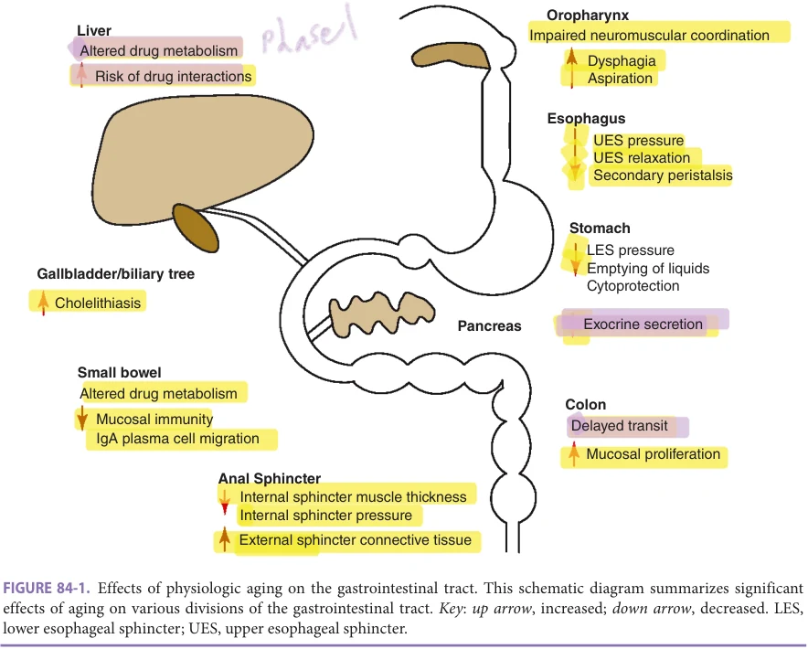

*FIGURE 84-1. Effects of physiologic aging on the gastrointestinal tract. This schematic diagram summarizes significant effects of aging on various divisions of the gastrointestinal tract. Key: up arrow, increased; down arrow, decreased. LES, lower esophageal sphincter; UES, upper esophageal sphincter.*

Some GI dysfunction in older patients can be attributed to the superimposed effects of chronic diseases and environmental/lifestyle exposures (medications, alcohol, tobacco). A modest decline in function with aging, such as mild constipation, may be significant when side effects of certain medications or concurrent disease are superimposed. The aging process per se has clinically significant effects on oropharyngeal and upper esophageal motility (see Chapter 31), colonic function, GI immunity, and GI drug metabolism (Figure 84-1). On the other hand, because the GI tract exhibits considerable reserve capacity, many aspects of GI function, such as intestinal secretion and absorption, are preserved with aging. A modest decline in gastric mucosal cytoprotection or esophageal acid clearance may become significant when superimposed side effects of certain medications or concurrent disease are also present. Common age-related changes in GI function, such as constipation, can be due to multiple causes such as medications, pelvic floor dysfunction, or comorbidities such as progressive neurodegenerative disorders. Additional research is needed on the effects of aging on the pathophysiology of swallowing disorders, esophageal reflux, dysmotility syndromes, GI immunobiology and microbiome, and the cellular mechanisms of neoplasia in the GI tract. Animal studies provide important insights into the cellular physiology of aging, despite the issue of species variation.

Small Intestinal Function Small bowel function appears to be relatively preserved in normal human aging. The small intestine has a large functional reserve capacity, because of the substantial mucosal surface area available for secretion and absorption. Changes in small bowel epithelial development and intestinal absorption with aging have been described and are summarized in Table 84-1.

In the absence of significant small bowel damage or surgical resection, these changes are unlikely to result in significant weight loss or malnutrition.

Colonic Function Aging is associated with diverse effects on the large intestine including alterations in mucosal cell growth, differentiation, metabolism, and immunity (Table 84-2).

These changes likely contribute to the observations of increased constipation and risk of malignancy in older adults.

Gastrointestinal Immunity The GI tract is the largest immunological system in mammals. Older people appear to be more susceptible to infections that enter the body via the GI tract, suggesting that aging may impair mucosal immunity. The GI mucosal immune response in the small intestine is a

**[p. 1301]**

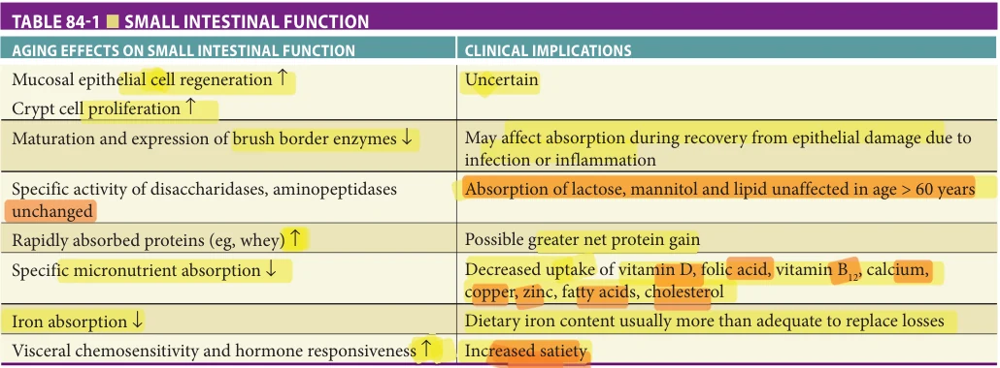

*TABLE 84-1 ■ SMALL INTESTINAL FUNCTION*

complex process that involves a series of events: antigen uptake and presentation of antigen at the mucosal surface by specialized epithelial cells (M cells) overlying Peyer patches in the small intestine; differentiation and migration of immunologically competent lymphocytes to the lamina propria; regulation of local antibody production in the intestinal wall; and mucosal epithelial cell receptor– mediated transport of antibodies to the intestinal lumen. Table 84-3 summarizes the effect of aging on intestinal immunity.

Gastrointestinal Drug Metabolism Older patients are at increased risk for drug interactions and adverse drug reactions, primarily because of the large number of drugs and known side effects of drugs prescribed in this age group. While most drug metabolism occurs in the liver, usually via the cytochrome P450 system, there is expression of the CYP3A subfamily in the GI tract. This subclass oxidizes a wide variety of drugs and toxins including procarcinogens such as aflatoxins,

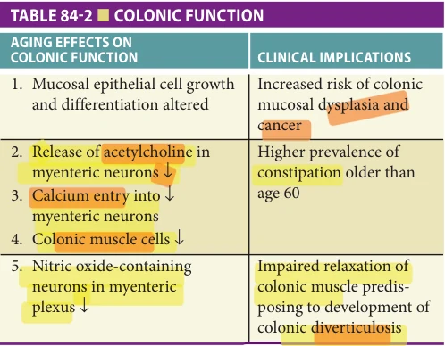

*TABLE 84-2 ■ COLONIC FUNCTION*

calcium channel antagonists, immunosuppressant agents, cholesterol-lowering agents, benzodiazepines, nonsedating antihistamines, and macrolide antibiotics. CYP3A activity is reduced by 25% to 50% in aged individuals, explaining some of the risk for adverse drug effects.

## COMMON INTESTINAL DISORDERS

Diagnosis of GI disorders in an older adult patient poses several challenges to the physician. First, comorbid illnesses are frequent and often numerous, and some such as dementia and depression may impair adequate communication between patient and caregiver. Second, medications and their side effects may cloud the clinical picture as polypharmacy is common in older adults.

Differences in usual diagnosis for common presenting lower GI symptoms among older adults are summarized in Table 84-4. For example, rectal bleeding in a young person is most commonly from hemorrhoids or inflammatory bowel disease (IBD). In older adults, diverticulosis, ischemic colitis, or colon cancer more commonly cause rectal bleeding. A complete and thorough history is imperative in older adults. Subtle clues to the diagnosis are sometimes dismissed as physiologic aspects of aging. Physical

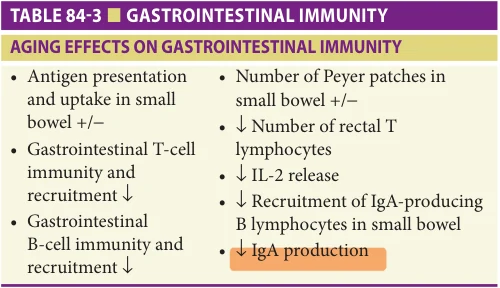

*TABLE 84-3 ■ GASTROINTESTINAL IMMUNITY*

**[p. 1302]**

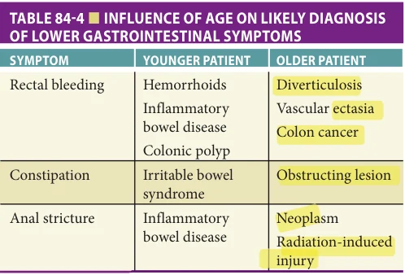

*TABLE 84-4 ■ INFLUENCE OF AGE ON LIKELY DIAGNOSIS OF LOWER GASTROINTESTINAL SYMPTOMS*

examination and some laboratory tests including tests of liver function are unaffected by aging, and any abnormality should be evaluated for the presence of a disease state and not dismissed as an age-related change.

Colonoscopy Colonoscopy in older adults is safe and well tolerated. Several studies of indications and outcomes of patients older than 80 years having elective and emergency endoscopic procedures found those tests to be safe. Moreover, the yield for diagnostic testing with colonoscopy in older adults is relatively high. Colonoscopy is often done for colon cancer screening (see Chapter 92).

Adequate bowel preparation is critical to a successful colonoscopic examination. Bowel cleansing in older adults should be performed with care. Preparation with standard doses of polyethylene glycol–based lavage solutions (PEG-ELS) in older adults is well tolerated and produces satisfactory bowel cleansing in more than 95% of all cases. Split dose regimens, where a part of the preparation is given 6 to 8 hours before the procedure, are recommended for optimal bowel cleansing. Sodium phosphate osmotic laxative preparations should not be used in older adults, as they cause significant fluid shifts and may cause electrolyte abnormalities or phosphate nephropathy and renal failure in this subset of patients.

Most colonoscopies are performed under moderate sedation. Sedation for colonoscopy usually includes a combination of a benzodiazepine (midazolam or diazepam) and a narcotic (meperidine or fentanyl), or may include a short-acting anesthetic agent such as propofol. As older adults may be more sensitive to these agents, small incremental doses should be given and the patient monitored closely for signs of cardiopulmonary compromise.

Endoscopic ultrasound Endoscopic ultrasound (EUS) can be used to diagnose and manage disease of the anorectum and usually does not require sedation. EUS may be helpful in evaluating the layers of the rectal wall, the internal and external anal sphincters, and the pelvic floor muscles in patients with fecal incontinence. EUS is frequently used to stage rectal malignancy, providing information about the depth of tumor invasion and the status of regional

lymph nodes. Direct tissue sampling is available through fine needle aspiration and biopsy at the time of the EUS.

Capsule endoscopy Wireless capsule endoscopy is an increasingly important test in the evaluation of obscure GI bleeding. The capsule transmits images of the small bowel to a hard drive that the patient wears, and following the completion of the study the images are downloaded to a computer for review. Common findings in older adults being evaluated for obscure bleeding or iron deficiency anemia include angioectasias and ulcers.

Contrast studies Contrast studies of the large intestine involve coating the colonic mucosa with a contrast medium, usually barium sulfate, following thorough colonic preparation. Barium enemas may be performed by either the singleor double-contrast method; in the latter, air is insufflated as well as barium. The single-contrast technique often is used to diagnose colonic strictures, fistula, obstruction, or diverticulitis. Double-contrast barium enema more commonly is used to detect polyps or mucosal abnormalities.

CT colonography CT colonography (virtual colonoscopy) is a radiographic technique that combines helical CT and graphics software to create a three-dimensional view of the colonic lumen. This technology was developed to detect colonic polyps. In clinical trials of CT colonography, detection rates for polyps greater than 5 mm are similar to those for optical colonoscopy. Specific recommendations for use in colon cancer screening are covered in Chapter 92.

Diverticular Disease Colonic diverticula are herniations of colonic mucosa through the smooth muscle layers of the colon. Strictly speaking, because colonic diverticula do not involve the muscle layer but rather are herniations of the mucosa and submucosa, they are actually pseudodiverticula. Diverticulosis has been increasingly recognized in Western society, and prevalence in the descending and sigmoid colon increases with age. Diverticula are present in approximately one-third of persons by age 50 and in approximately twothirds by age 80. In Western society, the majority of diverticula occur on the left side of the colon, specifically the sigmoid colon, although diverticula can occur anywhere in the colon.

Pathophysiology There are three factors implicated in the pathogenesis of colonic diverticulosis. First, altered colonic motility results in increased luminal pressure along segments of the colon, and the resulting high-pressure areas cause outpouchings at areas of weakness. Second, low intake of dietary fiber may contribute because low stool weights and slower stool transit times allow for relative increases in colonic intraluminal pressure. Third, with age the structural integrity of the colonic muscular wall decreases, and diverticula are more likely to form.

Asymptomatic diverticulosis Diverticulosis is usually an incidental finding in patients undergoing radiographic studies or colonoscopy for other reasons. There is no

**[p. 1303]**

indication for therapy or follow-up in such patients. Large cohort studies suggest that complications of diverticular disease may be prevented by intake of a high-fiber diet.

Painful diverticular disease Some patients with diverticulosis have left lower quadrant pain, and when examined, do not have evidence of inflammation. These patients may have painful diverticular disease. Pain often is described as crampy, located in the left lower abdomen, and may be associated with diarrhea or constipation as well as tenderness over the affected area. The pain is often exacerbated by eating and diminished by defecation or the passage of flatus. The symptoms of painful diverticular disease often overlap with those of irritable bowel syndrome, and therefore painful diverticular disease is considered part of the spectrum of functional bowel disorders. It is important to consider other causes of left lower quadrant pain such as diverticulitis, colonic obstruction, and incarcerated hernias in such patients.

Diverticulitis Diverticulitis, defined as having diverticulosis in association with inflammation, infection, or both, is probably the most common clinical manifestation of diverticular disease. Diverticulitis develops in approximately 10% to 25% of individuals with diverticulosis who are followed for 10 years or more; however, less than 20% of these patients require hospitalization.

The process by which a diverticulum becomes inflamed has been compared to appendicitis, in which the diverticulum becomes obstructed by stool in its neck. The resulting obstruction eventually leads to micro- or macroperforation of the diverticulum. Fever, leukocytosis, and rebound tenderness often ensue. Due to decreased visceral sensation, older patients may have reduced rebound, and the white blood cell (WBC) may not be elevated; therefore, an aggressive evaluation is indicated if this diagnosis is suspected. Segmental colitis associated with diverticulitis (SCAD) has also been increasingly recognized as a cause of abdominal pain. Unlike diverticulitis, inflammation in SCAD involves the mucosa between diverticuli, and spares the diverticular orifice. The symptoms include chronic diarrhea, intermittent bleeding, and pain. There is evidence this entity may be an overlap with IBD.

Clinical guidelines recommend abdominal and pelvic CT scan for diagnosis. Colonoscopy should also be performed in older patients, but should be delayed until inflammation has improved because of an increased risk of colonic perforation. Patients with severe pain, nausea, and vomiting often require hospitalization. Antibiotics should be used selectively rather than routinely in older patients who are immune-competent and who have mild disease. Most patients with diverticulitis will improve within 48 to 72 hours. Selected patients with relatively mild symptoms and who are able to tolerate oral intake may be managed with close outpatient monitoring and intake of clear fluids. Given the high incidence of complicated disease and effects of dehydration in older adult patients with diverticulitis, there should be a low threshold for hospitalization.

Patients with complicated disease, such as abscesses, may need drainage by surgery or interventional radiology. Surgery is recommended for patients with diverticulitis who fail to respond to medical therapy within 72 hours, and for those with refractory abscess, obstruction, or when the inflammatory process involves the bladder. Elective segmental resection of the colon should not be based on number of episodes of diverticulitis, but should be customized based on severity of disease, patient preference, and risks and benefits.

Diverticular hemorrhage Three to five percent of patients with diverticulosis have hemorrhage from a diverticulum. Diverticular hemorrhage is the most common identifiable cause of significant lower GI bleeding, accounting for 30% to 40% of cases with confirmed sources.

Bleeding associated with diverticula is typically brisk and painless. While the majority of diverticula are located in the left colon, bleeding from diverticular disease usually arises from the right colon. Bleeding is said to arise from arterial rupture of the vasa recta as it courses over the dome of a diverticulum. Bleeding ceases spontaneously in 70% to 80% of patients, and rebleeding rates range from 22% to 38%. Rebleeding is more likely when the initial bleed is severe.

The initial step in the management of patients with hemodynamically significant bleeding from diverticulosis is stabilization with intravenous fluid and blood products as necessary. Stable patients with suspected diverticular hemorrhage may undergo colonoscopy following rapid colonic purge. Colonoscopy in this setting can identify a diverticular source, exclude alternative diagnoses, and provide therapy of actively bleeding lesions.

In patients with recurrent bleeding, nuclear tagged red blood cell scans (scintigraphy) or CT angiography may localize the bleeding site. A positive bleeding scan may lead to angiography, which may allow for nonsurgical management of diverticular hemorrhage. Patients who require more than three units of packed red cell transfusions over 24 hours, have bleeding refractory to treatment, or are hemodynamically unstable may require surgical management. Preoperative nuclear red blood cell scans or angiography often help localize the diseased segment and allow for limited bowel resections. Blind total colectomy is rarely indicated.

Diarrhea Diarrhea, while less common than constipation, causes significant morbidity in older adults. The etiology of acute diarrhea (lasting < 2 weeks) is similar in older versus younger adults, with a few exceptions. Most cases of acute diarrhea are related to viral or bacterial infection, but it can also be caused by medications, medication interactions, or dietary supplements.

Chronic diarrhea, lasting more than 2 weeks, may result from fecal impaction, medications, irritable bowel syndrome, microscopic or lymphocytic colitis, IBD,

**[p. 1304]**

obstruction from colon cancer, malabsorption, small bowel bacterial overgrowth, thyrotoxicosis, or lymphoma. Many of these conditions are not due to changes with aging per se, but due to superimposed disease. Older patients may present with new-onset fecal urgency and frequency that is similar to diarrhea-predominant irritable bowel syndrome. The onset may coincide with an acute diarrheal illness caused by viral or bacterial infection. However, many patients continue to have distressing fecal urgency for weeks or months, resulting in considerable lifestyle impairment. Many curtail their travel and social activities outside the home for fear of fecal incontinence. The etiology is often multifactorial. Side effects of medications that alter small bowel and colonic motility should always be considered. Decreased rectal compliance occurs with aging, and may contribute to sensations of fecal urgency in these patients. Screening for fecal impaction resulting in constipation is always warranted in older patients, as it is often overlooked. Diarrhea and fecal urgency should not be attributed simply to aging as it is often due to superimposed disease or other potentially treatable causes.

Clostridium Difficile Colitis C difficile, an anaerobic gram-positive, spore-forming toxigenic bacillus was first isolated in 1935. It was not until 1978 when the association between the toxin elaborated by this bacterium and antibiotic-associated pseudomembranous colitis was made. The organism is now recognized as the single most important cause of nosocomial infectious diarrhea in the United States. C difficile colitis is more prevalent in older adults because of more frequent hospitalizations, increased antibiotic use, and increased time in institutional settings. C difficile colonization in longterm care facilities has been estimated to be at least 50% in the United States. Pathogenesis often involves exposure to an agent that alters normal colonic flora such as an antibiotic. While the most common antibiotics associated with C difficile colitis are ampicillin, amoxicillin, cephalosporins, and clindamycin, virtually all antibiotics (including those used to treat C difficile colitis) have been implicated in causing disease.

For this reason, efforts to decrease infection have focused on decreasing the reflexive or routine use of antibiotics in high-risk populations such as residents of nursing facilities. C difficile infection may result in an asymptomatic carrier state, or patients may develop diarrhea and colitis. Patients with intact immune systems and an ability to mount an early antibody response to C difficile toxin usually become asymptomatic carriers of the organism. On the other hand, patients lacking sufficient ability to mount an adequate immune response develop diarrhea and colitis.

Risk factors for the development of C difficile colitis are summarized in Table 84-5.

C difficile infection disproportionally affects older patients. Approximately two out of three infections occur in patients aged 65 or older, and older people are also at

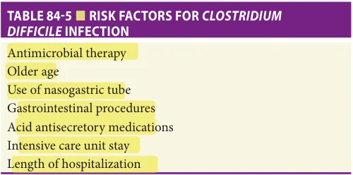

*TABLE 84-5 ■ RISK FACTORS FOR CLOSTRIDIUM DIFFICILE INFECTION*

high risk for recurrent infection. Risk factors that may especially predispose older patients include exposure to systemic antibiotics used to treat other diseases, contact with bacterial spores as a result of frequent health care exposure, and age-related changes in the immune system. Decreased functional status is also an independent risk factor for severe infection.

Clinical manifestations of C difficile infection range from asymptomatic carriage to mild to moderate diarrhea to life-threatening pseudomembranous colitis (Figure 84-2). While there is no evidence that age per se is a risk for asymptomatic carriage of C difficile, older patients appear to be at risk for developing severe disease including complications such as colonic ileus or toxic dilation.

Diagnostic tests There are several tests for diagnosing C difficile colitis, which appear to be equally effective in older versus younger patients. The most widely used is enzyme-linked stool immunoassay directed against one of the two C difficile toxins. While the main advantages are speed, cost, ease of testing, and high specificity, this immunoassay has relatively low sensitivity. Polymerase chain reaction tests that detect bacterial antigens or toxin genes are available; however, these tests may be positive in asymptomatic carriers and use varies by institution. Other diagnostic tests including C difficile stool culture and tissue culture cytotoxic assay are less commonly used because of

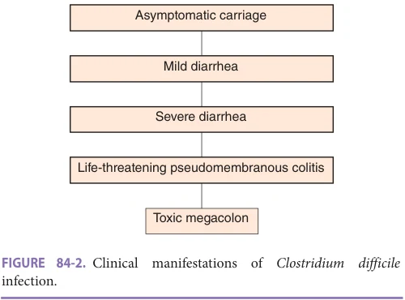

*FIGURE 84-2. Clinical manifestations of Clostridium difficile infection.*

**[p. 1305]**

their high cost, need for specialized laboratory techniques, and length of time to make the diagnosis, but may be helpful if stool toxin assay results are equivocal.

Colonoscopy, or more often flexible sigmoidoscopy, may be helpful in making the diagnosis of C difficile colitis, but is usually not necessary. Endoscopy is most useful when the diagnosis is in doubt or when disease severity demands rapid diagnosis. The finding of colonic pseudomembranes in a patient with antibiotic-associated diarrhea is almost pathognomonic for C difficile colitis (Figure 84-3).

Treatment Therapy for C difficile colitis begins with withdrawal of the precipitating antibiotics if possible. Older patients treated with metronidazole appear to have a high risk of treatment failure and disease recurrence. Thus, guidelines from the Infectious Diseases Society of America recommend use of oral vancomycin or fidaxomicin to treat C difficile–associated disease rather than metronidazole. The usual initial therapy in mild-moderate disease is a 10-day course of either oral vancomycin 125 mg four times daily or oral fidaxomicin 200 mg twice daily. This is effective in treating the majority of patients. Patients who are very ill should receive oral vancomycin 500 mg four times daily and IV metronidazole 500 mg every 8 hours. Vancomycin retention enemas (500 mg in 100 mg normal saline every 6 hours) can be used in patients who cannot tolerate oral medications. Intravenous vancomycin does not penetrate the colonic lumen and is not effective in treating C difficile colitis. Probiotic agents such as Lactobacillus GG and Saccharomyces boulardii have been used to reconstitute the colonic microflora, and are occasionally added to metronidazole or vancomycin to treat C difficile colitis, but their effectiveness has not been demonstrated in well-designed trials. Bezlotoxumab, a monoclonal antibody targeting C difficile toxin B, offers an option for treatment in patients with disease refractory to other treatments, although experience in older patients is limited.

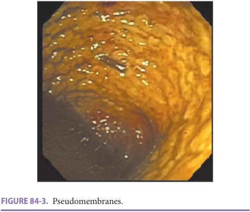

*FIGURE 84-3. Pseudomembranes.*

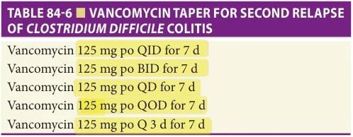

*TABLE 84-6 ■ VANCOMYCIN TAPER FOR SECOND RELAPSE OF CLOSTRIDIUM DIFFICILE COLITIS*

Unfortunately, recurrent C difficile infection is a common problem, and older patients are at increased risk. Symptomatic recurrence may result from relapse of the same strain (usually within 28 days) or reinfection with a different strain of C difficile. Resistance to initial treatment is seldom an important factor in recurrence. Therefore, patients with recurrent C difficile colitis generally are given another trial with the antibiotic used to treat the initial infection. In some patients, a prolonged taper of vancomycin may be needed to prevent further recurrence (Table 84-6). Fecal microbiota transplantation is highly effective in the treatment of recurrent C difficile infection in older patients with disease refractory to usual vancomycin taper and use of oral probiotics, and is also very effective therapy for selected patients with severe or fulminant disease (Table 84-7).

Microscopic Colitis The term microscopic colitis refers to two distinct clinical entities with similar presentation, namely lymphocytic and collagenous colitis. They are characterized by chronic watery diarrhea and feature histologic evidence of chronic mucosal inflammation in the absence of endoscopic or radiological abnormalities of the large intestine. They differ principally by the presence or absence of a thickened collagenous band, which when present in collagenous colitis is located in the colonic subepithelium.

Both lymphocytic and collagenous colitis occur most commonly in people in their sixth to eighth decade with a strong female predominance. Most patients present with chronic watery stools for months to years. The pattern of symptoms in patients with microscopic colitis fluctuates

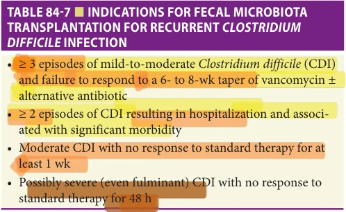

*TABLE 84-7 ■ INDICATIONS FOR FECAL MICROBIOTA TRANSPLANTATION FOR RECURRENT CLOSTRIDIUM DIFFICILE INFECTION*

**[p. 1306]**

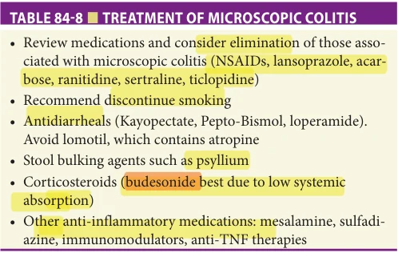

*TABLE 84-8 ■ TREATMENT OF MICROSCOPIC COLITIS*

and consists of exacerbations and remissions over years. Crampy abdominal pain is common, and symptoms often improve with fasting. Patients are more likely to be active smokers and use drugs such as NSAIDs and acidsuppressing medications for heartburn. Physical examination is usually unremarkable, and occult blood in the stool is uncommon. Colonoscopy is usually normal. It is important to exclude infectious causes of diarrhea by testing the stool for ova and parasites, bacterial pathogens, and C difficile toxin prior to making the diagnosis of microscopic colitis. The diagnosis relies on histopathologic evaluation of biopsied material from the diseased colon.

Treatment Table 84-8 summarizes treatment options for microscopic colitis. One-third of patients respond to antidiarrheal agents such as loperamide as well as stool bulking agents like psyllium or methylcellulose; however, these agents do not improve the subepithelial inflammation or reduce the thickness of the collagen band. American Gastroenterology guidelines (2016) recommend the oral steroid budesonide 9 mg daily to induce remission, as several clinical trials showed benefit versus no treatment or treatment with mesalamine. Budesonide reduces inflammation in the bowel and is used to treat IBD such as ulcerative colitis (UC) or Crohn disease. Budesonide is also the first-line agent recommended to continue remission of microscopic colitis. If budesonide is contraindicated or is not affordable, other medications listed in Table 84-8 can be used as second-line treatments. Oral prednisone, while effective in treating symptomatic microscopic colitis, is less optimal due to its many adverse effects in older people. In severe refractory patients, diverting ileostomy or proctocolectomy is a treatment of last resort.

Inflammatory Bowel Disease Crohn disease and UC comprise the vast majority of IBD (Table 84-9). They are characterized by inflammation within the GI tract. IBD commonly has its onset in the young adult population, but is found with increasing frequency in older adults. As discussed in the section on diverticulitis, inflammation may present as segmental colitis, usually in the left colon, associated with diverticuli (SCAD)

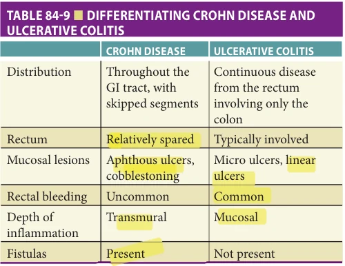

*TABLE 84-9 ■ DIFFERENTIATING CROHN DISEASE AND ULCERATIVE COLITIS*

but involving the interdiverticular mucosa. The older patient may present with new-onset diarrhea, abdominal pain, intermittent bleeding, or symptoms of chronic complications of IBD such as anemia, weight loss, or obstruction in small bowel or colon. There is considerable overlap between these symptoms and other conditions such as bowel ischemia and cancer that are more common in older patients; therefore, work-up requires imaging of the bowel and endoscopy of the affected bowel if possible. An increasing cohort of older patients with IBD were diagnosed with IBD at a younger age and have been aging with disease. They are at risk for development of long-term complications such as colonic cancer and require additional surveillance compared to low-risk older patients. Most patients will have long-term involvement of a gastroenterologist; however, geriatricians and other primary care providers should be aware of common issues affecting IBD patients.

There appears to be a bimodal distribution of the age of onset, with the peak incidence of IBD occurring in the second and third decades, and a second smaller peak in older adults between the ages of 60 and 70. “Late-onset” IBD accounts for approximately 12% cases of UC and 16% cases of Crohn disease.

Crohn disease Crohn disease is a chronic inflammatory process of unknown etiology, which most often affects the distal ileum, but can affect any segment of the GI tract from mouth to anus. It is characterized by transmural inflammation of the bowel wall, the presence of aphthae and ulcers, and the interspersing of segments of involved bowel with uninvolved bowel (skip lesions). Fissures, fistulas, and strictures are common in Crohn disease. Crohn disease of the colon, also known as Crohn colitis, is more common in older than in younger adults.

Symptoms and Signs The presentation of Crohn disease may be subtle and varies considerably. In older adults, Crohn disease often primarily involves the colon. Consequently, features usually associated with small bowel disease such as intestinal obstruction, perforation, and fistula are less

**[p. 1307]**

common. The majority of older adult patients with Crohn disease have abdominal pain, weight loss, fever, and diarrhea. The diarrhea, typically watery in Crohn disease of the small bowel, can be bloody when the colon is involved.

Laboratory abnormalities such as anemia, leukocytosis, thrombocytosis, hypoalbuminemia, elevated erythrocyte sedimentation rate, and C-reactive protein vary with the severity of the illness. Interestingly, anemia in Crohn disease can be because of either iron deficiency from chronic GI blood loss or from vitamin B12 deficiency if the Crohn disease involves a large segment of the distal ileum, the site for vitamin B12 absorption in the small bowel.

Unfortunately, no single symptom, sign, or diagnostic test definitively establishes the diagnosis of Crohn disease, and prolonged delays in diagnosis may occur more frequently in older adults. In the end, a constellation of suggestive symptoms and laboratory abnormalities should prompt further evaluation. Common intestinal infections should be excluded by stool cultures, stool examination for ova and parasites, and assays for C difficile toxin.

Ultimately, the diagnosis of Crohn disease is confirmed by findings from CT or MR enterography, colonoscopy, and histopathology. These studies can identify the characteristic linear ulcers, skip lesions, and mucosal edema in Crohn disease. Enterography can identify pyogenic complications like abscesses and perforations, and also can detect other intra-abdominal pathology that might mimic the presentation of Crohn disease, such as appendicitis or nephrolithiasis.

Management The principles of IBD management are the same regardless of the age of the patient and are summarized in Table 84-10. The most commonly used medications in the treatment of Crohn disease include sulfasalazine, mesalamine (5-aminosalicylic acid), and corticosteroids; all of these are well tolerated in the older adult population. However, corticosteroid use confers a higher risk of complications.

Immunomodulators such as azathioprine, 6mercaptopurine, and methotrexate can be used effectively

to maintain remission of Crohn disease. Although these agents are usually well tolerated in older adults, their use in older patients is low compared to younger patients. Concerns include increased risk of infection or malignancy such as nonmelanoma skin cancers associated with their use. Biologic agents, such as anti-Tumor Necrosis Factor (TNF) drugs infliximab and adalimumab, have been used to manage moderate to severe Crohn disease; however, their use is also less common in older adults. Anti-TNF agents are contraindicated in patients with class III and IV heart failure. Other newer agents such as integrin antagonists, interleukin antagonists, and Janus Kinase inhibitors have shown benefit in treating both Crohn disease and UC; however, use in older patients is very limited.

Antibiotics such as metronidazole and ciprofloxacin are effective in inducing and maintaining remission, as well as for healing perineal fistulas, in patients with Crohn disease. The long-term use of antibiotics typically is limited by the occurrence of significant side effects. Specifically, irreversible peripheral neuropathy can occur with the use of metronidazole, while antibiotic-associated diarrhea may be a complication of prolonged ciprofloxacin use.

Older adults with ileal or ileal–colonic Crohn disease occasionally require intestinal resection, but generally tolerate surgery well and appear to have low rates of postoperative recurrence. Proctocolectomy with ileostomy is a common surgical option for patients with extensive Crohn colitis. In older adult patients who are debilitated or malnourished, an initial subtotal colectomy with ileostomy is less debilitating and permits weight gain and improved physical well-being. If proctocolectomy is subsequently required, it can be done with a low complication rate, but may not be necessary at all if rectal disease is absent. A conventional ileostomy is generally favored in older patients following colectomy, because anal sphincter sparing surgical procedures, such as an ileal pouch–anal anastomosis, often have poor functional results in older patients.

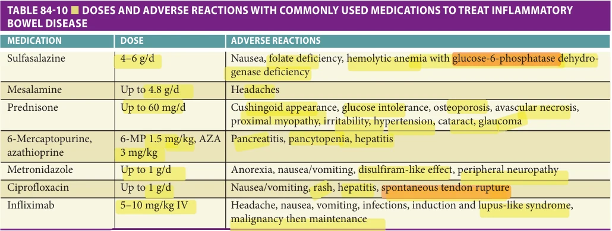

*TABLE 84-10 ■ DOSES AND ADVERSE REACTIONS WITH COMMONLY USED MEDICATIONS TO TREAT INFLAMMATORY BOWEL DISEASE*

**[p. 1308]**

Ulcerative colitis UC is a chronic inflammatory disorder of the GI tract of unknown etiology that affects the mucosa and submucosa of the large intestine in a continuous fashion. The inflammatory process invariably involves the rectum and extends proximally to variable distances, but does not involve the GI tract proximal to the colon. For many older patients, UC is a relatively mild illness, because colonic inflammation often is limited to the rectum or sigmoid colon. This distribution of disease is generally associated with less systemic manifestations, better response to medical therapy, and less need for surgery than more extensive UC.

Symptoms and Signs The severity of UC may be subjectively classified as mild, moderate, or severe and is generally proportional to the extent of colonic inflammation. Symptoms in older adults are similar to those seen in young patients, and include bloody diarrhea, rectal pain, tenesmus, urgency, and abdominal pain. In comparison to Crohn disease, the diarrhea in UC almost always is bloody. Fecal urgency, a sensation of incomplete evacuation, and fecal incontinence also are common. Unfortunately, older patients appear to be more likely than younger patients to present with a severe initial attack, and that first severe manifestation is associated with a relatively high fatality rate.

Laboratory findings in UC are nonspecific and reflect the severity of the underlying disease. In patients with limited distal disease, laboratory abnormalities may be absent except perhaps for mild anemia. In patients with extensive disease, severe iron deficiency anemia, hypoalbuminemia, leukocytosis, and thrombocytosis are common.

Toxic megacolon is a feared complication of UC, and it occurs more frequently in older patients. One should be suspicious of toxic megacolon in a patient whose diarrhea improves but whose abdomen is distended and tympanic. Other markers of worsening systemic inflammation, such as fever and leukocytosis, will also be present. The diagnosis is usually made by abdominal radiography or CT imaging. Colonoscopy should not be attempted when there is a suspicion for toxic megacolon, as perforation may ensue.

Similar to the situation in Crohn disease, there is no single test that can definitively diagnose UC with acceptable sensitivity and specificity. In older adults, it is important to exclude other diseases that may mimic UC, such as ischemic colitis, radiation proctocolitis, diverticulitis, malignancy, and infectious colitis.

Endoscopic examination can demonstrate the classic findings of diffuse erythema, mucosal edema, granular mucosa, and ulcerations starting in the rectum without intervening areas of normal mucosa (Figure 84-4). In the proper clinical setting, flexible sigmoidoscopy with biopsy is usually sufficient to establish a diagnosis of UC. Complete colonoscopy with ileoscopy is necessary to determine the extent of disease and to exclude Crohn disease. However, complete colonoscopy is not recommended in patients with active UC for fear of perforation; the procedure can be safely performed once active disease has been controlled.

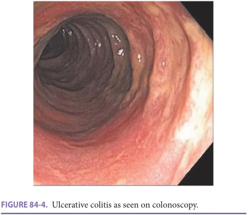

*FIGURE 84-4. Ulcerative colitis as seen on colonoscopy.*

Management Most older adult patients with UC respond favorably to medical management. Once in remission, relapse occurs less frequently in older adults regardless of the severity of the initial attack. The mainstays of treatment for UC are aminosalicylates, and they may be administered orally or rectally. Formulations designed either for enema or suppositories are reasonable choices when treating distal disease. Unfortunately, distal disease in older patients can be refractory to topical therapy, and so older subjects with distal disease may require oral formulations of aminosalicylates to achieve and maintain remission.

In addition to aminosalicylates, corticosteroids are effective in achieving remission. As steroid use is associated with frequent side effects, they should only be used temporarily in UC as a means to induce remission. Steroids have not been shown to be effective at preventing relapses, and their side effect profile makes prolonged use unsatisfactory.

In patients who do not respond to aminosalicylates, immunomodulators such as azathioprine or 6mercaptopurine should be used. Patients may require up to 6 to 12 weeks to see an effect from these agents. However, once a response is achieved, they are effective at maintaining remission. Use of other immune agents and biologics, as discussed above for Crohn disease, should be individualized as there is limited data on efficacy and tolerance in older adults.

Surgery for UC is indicated in patients who fail medical therapy, have acute fulminant disease, are steroid dependent, or develop a dysplastic lesion or cancer. UC is cured following total proctocolectomy. In older adults, total proctocolectomy with ileostomy remains a popular choice, because restorative procedures like ileo–anal anastomosis are limited by functional morbidity. An alternative surgical procedure is a subtotal colectomy, which leaves a rectal stump that provides the patient with an improved chance for fecal continence. Such patients, however, continue to

**[p. 1309]**

have colonic mucosa, and thus have an ongoing increased risk for colon cancer to develop in the diseased segment. Practitioners with older patients that have had subtotal colectomy need to be aware of the need for continued frequent cancer surveillance of the rectal stump.

Colon cancer in IBD The risk of colorectal cancer (CRC) in older patients with long-standing IBD is a significant complication of the disease, with rates of early and missed CRC up to three times that of non-IBD older patients. Colon cancer rates generally are higher in patients with UC than those with Crohn disease; it appears to be the degree and extent of ongoing inflammation in the colon that confers an increased risk of colon cancer. Patients with Crohn colitis are believed to have an equally high risk of developing colon cancer as their UC peers. Cumulative risk of CRC increases with disease duration in UC from 2% after 10 years to 18% after 30 years of disease. The older IBD patient with long-standing colonic disease should be considered at high risk for CRC. Surveillance for CRC includes colonoscopy with random mucosal biopsies of the entire colon every 1 to 3 years starting 8 to 10 years after onset of disease. During surveillance, patients found to have low- or high-grade dysplasia or carcinoma generally are offered proctocolectomy. No specific age recommendations for discontinuing IBD cancer surveillance are available. However, discontinuing routine CRC surveillance is generally recommended when life expectancy falls below 10 years. A study in 2019 found that patients with long-standing IBD and two consecutive negative screening endoscopies had no advanced colorectal neoplasia with an average follow up of 4 years. Therefore, it may be possible in future to identify a lower risk IBD cohort that could be followed less frequently.

Small Bowel Ischemia Small bowel ischemia is uncommon and is usually due to superior mesenteric artery (SMA) obstruction. Sudden obstruction by clots results in complete ischemia of the majority of the small bowel and presents as a catastrophic event. Usually patients are unstable, and older patients have a very poor prognosis. Slowly progressive obstruction presents with increasing cramping pain with eating, termed intestinal angina, and in later stages with diarrhea after eating. Patients often lose weight due to food avoidance. The diagnosis is often overlooked due to the nonspecific symptoms early on. Angiography is needed; however, CT angiography is increasingly used as it is safer and less invasive. Angioplasty can often be performed and is a safer option than vascular surgery in older patients.

Colon Ischemia Colon ischemia (CI) is the most common intestinal vascular disorder in older adults. CI encompasses a spectrum of injury. The specific conditions resulting from ischemic injury to the colon are classified as reversible or irreversible, and then can be characterized further as reversible

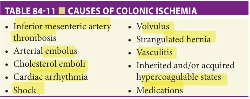

*TABLE 84-11 ■ CAUSES OF COLONIC ISCHEMIA*

ischemic colonopathy, reversible or transient ischemic colitis, chronic ulcerative ischemic colitis, ischemic colonic stricture, colonic gangrene, and fulminant universal ischemic colitis.

Pathophysiology The colon receives its blood supply from branches of the SMA and inferior mesenteric artery. The colon is protected from ischemia by an abundant collateral circulation formed by the marginal arterial complex of Drummond, central anastomotic artery, and arc of Riolan. Occlusion of a major vessel results in opening of collateral pathways in response to arterial hypotension distal to the occlusion. Increased blood flow through collateral pathways maintains adequate perfusion for a variable but brief period of time. If blood flow is diminished for a prolonged period, vasoconstriction develops in the affected bed and may persist after the primary cause of the mesenteric ischemia is reversed.

In most cases, the cause of an episode of CI cannot be established with certainty, and no vascular occlusion can be identified. The causes of CI are vast (Table 84-11) and include thrombosis, embolus, shock, volvulus, hematologic disorders, infections, trauma, surgery, as well as several medications (Table 84-12). The colon is particularly susceptible to ischemia, perhaps owing to its relatively low blood flow during periods of functional activity and its sensitivity to autonomic stimulation.

Clinical features Many cases of transient or reversible ischemia still are missed because diagnostic studies are not performed early enough in the course of disease. This is because patients may not seek medical advice for a disease that is self-limited, or the initial symptoms may be confused with other conditions such as IBD.

Approximately 90% of persons with CI are older than age 60 and have widespread evidence of atherosclerosis. Up to 10% of patients may have a potentially obstructing

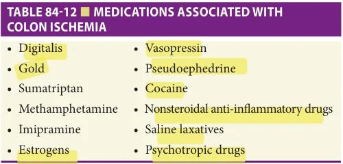

*TABLE 84-12 ■ MEDICATIONS ASSOCIATED WITH COLON ISCHEMIA*

**[p. 1310]**

lesion of the colon, including carcinoma, benign stricture, and diverticulitis. Patients with CI usually are not critically ill at the time of diagnosis, and their abdominal pain typically is mild. Mesenteric angiography plays little role in the diagnosis and management of this condition, since colonic blood flow usually has normalized by the time of presentation. In contrast to small bowel ischemia, the prognosis is often excellent.

Typically, CI presents with the sudden onset of mild crampy left lower quadrant abdominal pain. The pain frequently is accompanied, or followed within 24 hours, by bloody diarrhea or bright red blood per rectum. In most cases, blood loss is minimal; hemodynamically significant bleeding should prompt consideration of other diagnoses, such as diverticular bleeding. Severe pain is unusual and may indicate irreversible transmural necrosis. The differential diagnosis of CI includes infectious colitis, IBD, pseudomembranous colitis, diverticulitis, and colon carcinoma. In all patients suspected of having colonic ischemia, infection with organisms such as Salmonella, Shigella, Campylobacter, and Escherichia coli O157:H7 should be excluded. In fact, E coli O157:H7 infection induces a colitis that mimics or may even cause CI.

American College of Gastroenterology guidelines from 2015 recommend that an older patient who presents with the sudden onset of abdominal pain and rectal bleeding or bloody diarrhea should undergo abdominal and pelvic CT with intravenous and oral contrast as this will demonstrate colonic wall abnormalities such as bowel wall thickening, edema, thumbprinting, or pneumatosis. If acute mesenteric ischemia (AMI) is suspected due to severe wall abnormalities, laboratory evidence of inflammation and renal impairment, or cardiovascular instability, then multiphasic CT angiography should be performed rapidly. If CT angiography is not diagnostic, then conventional angiography can be attempted. Early surgical consultation should be considered for older patients, as delayed surgery results in much poorer outcomes compared to younger patients. Colonoscopy should be avoided acutely due to increased risk of perforation. Colonoscopy can be performed 24 to 48 hours later if safe to do so to demonstrate mucosal abnormalities and obtain histopathologic mucosal samples. Conventional sigmoidoscopy has some risk of perforation and is of value only if the segment of involved bowel is within reach of the sigmoidoscope; CI involves the sigmoid in 50% to 60% of patients and the rectum in less than 10% of cases. At the outset, purplish blebs representing mucosal and submucosal hemorrhage may be seen. As hemorrhage is absorbed, varying degrees of necrosis, inflammation, ulceration, and mucosal sloughing occur, resembling UC or Crohn disease.

Management Treatment of CI is based on early diagnosis and continued monitoring, with special attention to the radiologic or colonoscopic appearance of the colon for diagnosis and to demonstrate either improvement or

progression to chronic ischemic colitis or stricture. Guidelines recommend staging patients into mild, moderate and severe disease to guide management (Table 84-13).

Management includes stabilization of the patient, optimization of cardiac function, and bowel rest. Systemic antibiotics are administered in moderate or severe cases. Systemic glucocorticoids are of no proven value and increase the risk of perforation.

Colonic Obstruction Colonic obstruction results in dilation of the colon, abdominal distention and in some cases, colonic perforation. The majority of colonic obstructions are the result of mechanical obstruction from cancer, volvulus, stricture, impacted stool, surgical adhesion, or bowel intussusception. While patients of any age can develop obstruction, the condition is more common in older patients due to increased prevalence of underlying conditions that predispose to obstruction. Patients with acute colonic obstruction can develop megacolon, the diagnosis of which is based on a cecal diameter of 12 cm or greater. Cecal distension is critical, because the cecum is the part of the colon that is most susceptible to ischemia and perforation. With obstruction, as fluid and gas accumulate in the colon and intraluminal pressure increases, the radius of the colon increases. Wall tension is the greatest, and hence the risk for perforation most acute, at the area of greatest radius, which is generally in the cecum.

Acute colonic pseudo-obstruction Acute colonic pseudo-obstruction, also known as Ogilvie syndrome, usually presents as intestinal ileus with massive bowel dilation postoperatively or in the setting of a severe intercurrent illness. The mechanism is a relative increase in sympathetic neuronal inhibitory motor input that results in colonic ileus and acute colonic pseudo-obstruction.

Clinical features Acute colonic pseudo-obstruction usually presents in patients with severe underlying illness such as stroke, myocardial infarction, sepsis, or after surgical procedures. It is most common in older people after abdominal surgery or orthopedic procedures of the pelvis, hips, or knees. The presentation of acute colonic pseudoobstruction may be subtle and variable, although the most characteristic clinical feature is severe abdominal distention and failure to pass flatus or stool. Some patients report only mild distention and minimal pain. Indeed, a high level of suspicion is necessary to make the diagnosis, because patients often have perioperative bowel cleansing prior to surgery and early passage of stool is not expected.

The hallmark of the disease is colonic dilation on standard abdominal radiography. The entire colon can be affected, although in some cases just the right-sided segments can be dilated. The presence of air in the rectum implies that there is no mechanical obstruction, and is therefore important to note before making a diagnosis of acute colonic pseudo-obstruction.

**[p. 1311]**

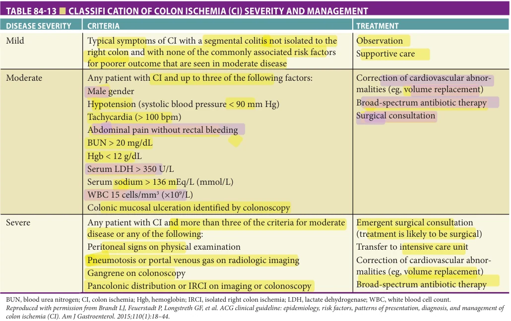

*TABLE 84-13 ■ CLASSIFI CATION OF COLON ISCHEMIA (CI) SEVERITY AND MANAGEMENT*

Management Initial management of acute colonic pseudoobstruction involves correcting reversible causes of colonic ileus such as electrolyte imbalances, hypoxemia, hypovolemia, and removal of medications that can exacerbate the problem. The vast majority of patients are successfully treated with these relatively simple measures. Bowel rest and intravenous hydration are imperative.

Neostigmine, a cholinesterase inhibitor, given in doses of 1 to 2 mg IV or SC is effective in patients with acute colonic pseudo-obstruction. There are several relative contraindications to the use of neostigmine listed in Table 84-14. Following neostigmine administration, patients should be monitored closely. A second administration of neostigmine can be attempted if there is partial or no response to the first trial.

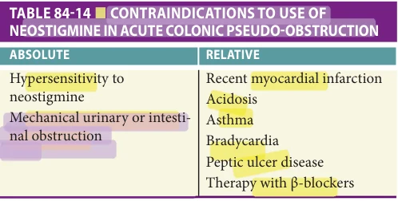

*TABLE 84-14 ■ CONTRAINDICATIONS TO USE OF NEOSTIGMINE IN ACUTE COLONIC PSEUDO-OBSTRUCTION*

In selected patients who fail conservative and medical management, colonoscopic decompression of the unprepped bowel can be attempted. However, care is required since during colonoscopy air is insufflated into an already dilated colon and the risk of colon perforation is increased. Surgical decompression, sometimes via placement of a cecostomy tube, remains another option for patients who do not respond to medical and endoscopic interventions.

The overall prognosis of patients with acute colonic pseudo-obstruction is poor, with an in-hospital mortality approaching 30%, attributable primarily to the severity of the underlying illness. The most significant complication of acute dilatation is colonic perforation, which occurred in 3% of cases in one retrospective series.

Lower Gastrointestinal Bleeding Lower GI bleeding is defined as that which arises distal to the ligament of Treitz. Lower GI bleeding occurs less frequently and usually is less severe than upper GI bleeding. The incidence of lower GI bleeding increases significantly with age. The majority of lower GI bleeding in older adults is the result of diverticula, vascular ectasias, and CI, but there are many other causes (Table 84-15). This section will focus on the approach to the patient with lower GI bleeding and bleeding from vascular ectasias.

Acute lower GI bleeding presents with bright red blood per rectum, hematochezia, or melena depending on

**[p. 1312]**

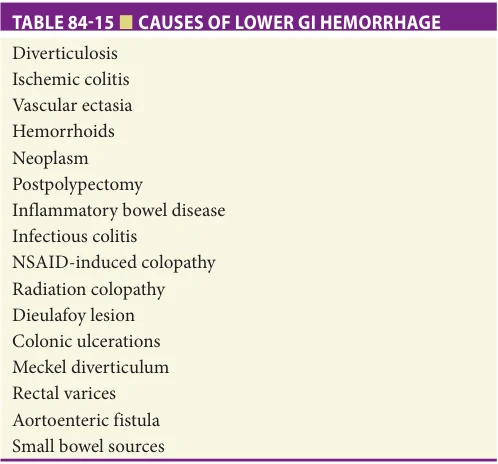

*TABLE 84-15 ■ CAUSES OF LOWER GI HEMORRHAGE*

the location of the bleeding. Bright red blood per rectum usually indicates a distal colonic source or rapidly bleeding upper source. Melena usually indicates a right-sided colonic lesion or a source in the upper GI tract.

The first goal in the management of a patient with lower GI bleeding is resuscitation and hemodynamic stabilization. This may include administration of crystalloid intravenous fluids and blood products. Initial testing usually includes complete blood count, blood chemistry, coagulation profile, and blood type and cross-match, and the results help guide further management. For example, a low mean corpuscular volume often is a sign of chronic blood loss; a BUN-to-creatinine ratio of greater than 20:1 usually indicates an upper GI source; an elevated INR requires consideration of reversal in the face of hemodynamically significant bleeding. Older patients are more susceptible to complications from hypotension and anemia, and rapid stabilization and monitoring are essential. There should be a low threshold to recommend emergency room evaluation and hospitalization of these patients.

Approximately 12% of patients thought to have lower GI bleeding have an upper GI bleeding source. It is important to exclude upper GI bleeding in patients with presumed lower GI bleeding. This can be accomplished with passage of a nasogastric tube and analysis of the gastric aspirate. Bilious fluid without blood in the nasogastric tube aspirate usually confirms the suspicion of lower GI bleeding. If an upper GI source is still in question, urgent upper endoscopy may be performed.

Although urgent upper endoscopy for the diagnosis and treatment of upper GI bleeding is predicated on sound data, urgent colonoscopy in lower GI bleeding has been practiced less consistently. Colonoscopy has the advantage of allowing for the diagnosis and immediate treatment of actively bleeding lesions. A number of reports have shown that “urgent colonoscopy” is safe and yields a specific diagnosis in a high

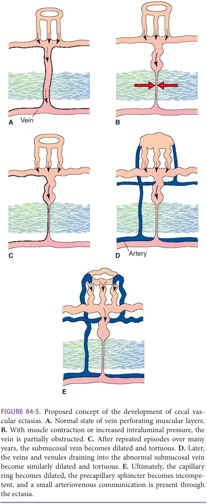

*FIGURE 84-5. Proposed concept of the development of cecal vas- cular ectasias. A. Normal state of vein perforating muscular layers. B. With muscle contraction or increased intraluminal pressure, the vein is partially obstructed. C. After repeated episodes over many years, the submucosal vein becomes dilated and tortuous. D. Later, the veins and venules draining into the abnormal submucosal vein become similarly dilated and tortuous. E. Ultimately, the capillary ring becomes dilated, the precapillary sphincter becomes incompe- tent, and a small arteriovenous communication is present through the ectasia.*

proportion of older patients with lower GI bleeding. On the basis of a high diagnostic yield, low rate of complications, and theoretical therapeutic potential, urgent colonoscopy following a rapid colonic purge has been recommended as the diagnostic procedure of choice in most patients with hemodynamically significant lower GI bleeding.

**[p. 1313]**

Other diagnostic tests in patients with active lower GI bleeding include scintigraphy (nuclear tagged red blood cell scans), CT angiography, and conventional angiography. Approximately 45% of patients with lower GI bleeding have positive red blood cell scintigraphy. Tagged red blood cell scans can detect bleeding at a rate greater than 0.1 mL/min and are useful to localize the site of bleeding, but unfortunately offer no option for therapy. If a patient has a positive bleeding scan or CT angiography, traditional angiography with selective embolization can be performed to attempt to stop the bleeding. In order to detect active bleeding, angiography requires a higher rate of bleeding than scintigraphy, 0.5 mL/min compared to 0.1 mL/min. Transcatheter embolization of a lower GI bleeding source is effective in 70% to 90% of patients. If bleeding cannot be stopped with angiography, surgery to remove the bleeding colonic segment may be necessary. If a specific bleeding site can be localized with the above studies, a limited surgical resection can be performed rather than a subtotal colectomy.

Vascular ectasias Vascular ectasias, which arise from an age-related degeneration of previously normal blood vessels, typically occur in the cecum and proximal ascending colon. Along with diverticular bleeding, they are responsible for the majority of significant lower GI bleeding

## FURTHER READING

Asempa TE, Nicolau DP. Clostridium difficile infection

in the elderly: an update on management. Clin Interv Aging. 2017;12:1799–1809. Brandt LJ, Feuerstadt P, Longstreth GF, Boley SJ. American

College of Gastroenterology clinical guideline: epidemiology, risk factors, patterns of presentation, diagnosis, and management of colon ischemia (CI). Am J Gastroenterol. 2015;110(1):18–44. Broens RM, Pennickx FM. Relation between anal electro-

sensitivity and rectal filling sensation and the influence of age. Dis Colon Rectum. 2005;48:127–133. Comparato G, Pilotto A, Franze A, et al. Diverticular dis-

ease in the elderly. Dig Dis. 2007;25:151–159. Drekonia D, Reich J, Gezahegn S, et al. Fecal microbiota

transplantation for Clostridium difficile infection: a systematic review. Ann Intern Med. 2015;162:630–638. Gispert JP, Chaparro M. Systematic review with meta-

analysis: inflammatory bowel disease in the elderly. Aliment Pharmacol Ther. 2014;39:459–477. Greenwald DA, Brandt LJ, Reinus JF. Ischemic bowel disease

in the elderly. Gastroenterol Clin. 2001;30(2):445–473. Hall KE, Proctor DD, Fisher L, Rose S. AGA future trends

committee report: effects of aging of the population on gastroenterology practice, education and research. Gastroenterology. 2005;129:1305–1338.

episodes in older adults. Ectasias are found in up to 25% of persons older than 60 years who do not have symptoms; they typically are multiple and less than 5 mm in diameter. Vascular ectasias probably arise as a result of repeated episodes of incomplete, low-grade obstruction of submucosal veins caused by increased tension in the colonic wall. The ultimate result is tortuosity and dilation of the venules and the arteriolar–capillary unit that feeds it, resulting in a small arteriovenous communication (Figure 84-5).

Lower GI bleeding caused by a vascular ectasia may be clinically indistinguishable from diverticular bleeding and is characterized by painless hematochezia. Bleeding from vascular ectasias may be hemodynamically significant, and a variety of treatment options exists including electrocoagulation, injection therapy, heater probe application, or argon plasma coagulation.

## ACKNOWLEDGMENT

Many thanks to Richard Saad, MD, for his review and very helpful comments and to David A. Greenwald, MD, for his contributions to the chapter Common Large Intestinal Disorders in earlier editions of this book. Material from that chapter, including tables and figures, has been incorporated into this one.

Jafri SM, Monkemuller K, Lukens FJ. Endoscopy in the

elderly: a review of the efficacy and safety of colonoscopy, esophagogastroduodenoscopy, and endoscopic retrograde cholangiopancreatography. J Clin Gastroenterol. 2010;44:161–166. Jain A, Vargas HD. Advances and challenges in the

management of acute colonic pseudo-obstruction (Ogilvie syndrome). Clin Colon Rectal Surg. 2012;25: 37–45. McDonald CL, Gerding DN, Johnson S, et al. Clinical

practice guidelines for Clostridium difficile infection in adults and children: 2017 Update by the Infectious Diseases Society of America (IDSA) and Society for Healthcare Epidemiology of America (SHEA). Clin Infect Dis. 2018;66(7):e1–e48. Nguyen GC, Smalley WE, Vege SS, Carrasco-Labra A; Clin-

ical Guidelines Committee. American gastroenterological association Institute guideline on the medical management of microscopic colitis. Gastroenterology. 2016;150(1):242–246. Pardi DS. Microscopic colitis. Clin Geriatr Med. 2014;30:

55–65. Peery AF, Shaukat A, Strate LL. AGA Clinical practice

update on medical management of colonic diverticulitis. Gastroenterology. 2021;160(3):906–911.e1.

**[p. 1314]**

Rezapour M, Stollman N. Diverticular disease in the elderly.

Curr Gastroenterol Rep. 2019;21(9):46. Schembri J, Bonello J, Christodoulou DK, Katsanos KH,

Ellul P. Segmental colitis associated with diverticulosis: is it the coexistence of colonic diverticulosis and inflammatory bowel disease? Ann Gastroenterol 2017;30(3): 257–261. Shaukat A, Kahi CJ, Burke CA, Rabeneck L, Sauer BG,

Rex DK. ACG clinical guidelines: colorectal cancer screening 2021. Am J Gastroenterol. 2021;116(3):458–479. Stepaniuk P, Bernstein CN, Targowink LE, et al. Charac-

terization of inflammatory bowel disease in elderly patients: a review of epidemiology current practices and outcomes of current management strategies. Can J Gastroenterol Hepatol. 2015;29:327–333.

Ten Hove JR, Shah SC, Shaffer SR, et al. Consecutive nega-

tive findings on colonoscopy during surveillance predict a low risk of advanced neoplasia in patients with inflammatory bowel disease with long-standing colitis: results of a 15-year multicentre, multinational cohort study. Gut. 2019;68(4):615–622. Tran V, Limketkai BN, Sauk JS. IBD in the elderly: manage-

ment challenges and therapeutic considerations. Curr Gastroenterol Rep. 2019;21(11):60. Travis AC, Plevsky D, Saltzman JR. Endoscopy in the

elderly. Am J Gastroenterol. 2012;107:1495–1501. Wang YR, Cangemi JR, Loftus EV Jr, Picco MF. Rate of early/

missed colorectal cancers after colonoscopy in older patients with or without inflammatory bowel disease in the United States. Am J Gastroenterol. 2013;108(3):444–449.
